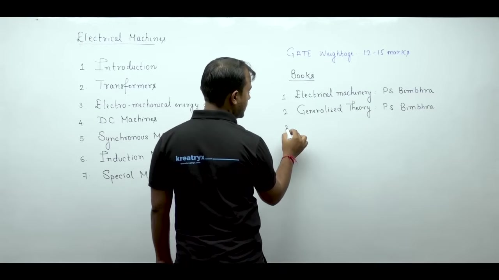
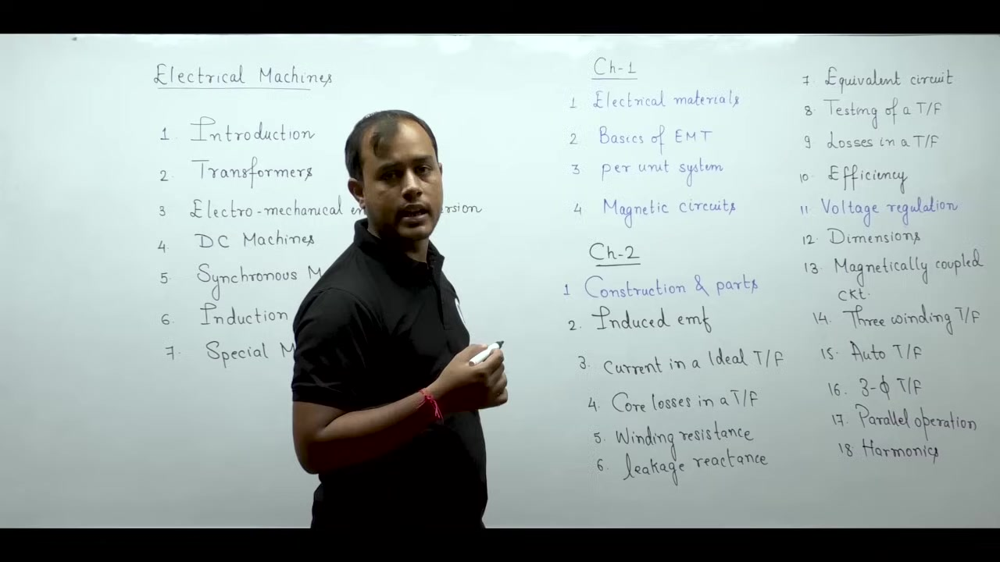
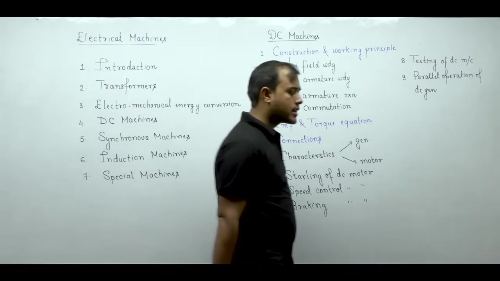
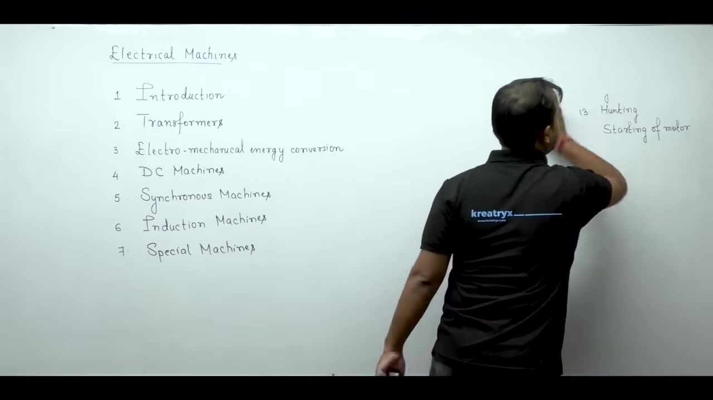

# Introduction to Electrical Machines | Lec 1 | Electrical Machines | GATE & ESE | Ankit Goyal

- **Source**: https://www.youtube.com/watch?v=PmBqB-4hgW4
- **Duration**: 00:47:15
- **Compiled**: 2026-09-15

---

## Overview

This lecture introduces the complete curriculum and preparation strategy for electrical machines. It organizes the subject into seven structured modules starting with foundational materials and magnetic circuits. The discussion outlines the operational principles and governing mathematics of transformers, DC machines, synchronous machines, and induction machines. By linking physical construction to equivalent circuit modeling, it shows students how to generalize concepts across different machine types. The lecture establishes that long-term retention depends on patient numerical problem-solving rather than rote theory memorization.

## Contents

- [[#Course Overview and Syllabus Architecture|Course Overview and Syllabus Architecture]]
- [[#Exam Weightage, Textbooks, and Preparation Strategy|Exam Weightage, Textbooks, and Preparation Strategy]]
- [[#Foundations and Introduction to Transformers|Foundations and Introduction to Transformers]]
- [[#Practical Transformers and Energy Conversion|Practical Transformers and Energy Conversion]]
- [[#Direct Current Machines Architecture|Direct Current Machines Architecture]]
- [[#Synchronous Machines Architecture|Synchronous Machines Architecture]]
- [[#Induction Machines, Special Machines, and Study Mindset|Induction Machines, Special Machines, and Study Mindset]]

---

## Course Overview and Syllabus Architecture
_(00:12 - 05:26)_

Electrical machines form the backbone of electrical engineering. Without them the study of electrical engineering remains incomplete. Technical interviews for public sector undertakings and higher studies center heavily on this subject. Many students find electrical machines difficult. But with the right study strategy, you can master it.

### Two-Part Study Approach

Divide your preparation into two distinct parts:

1. **Conceptual Understanding**: Learn the physical principles and operating mechanisms. This builds intuition and helps in technical interviews.
2. **Problem-Solving Skills**: Master analytical formulas and numerical techniques. Most marks in competitive exams come from numerical problems.

Theory gives intuition. Numerical practice brings exam success. Focus your revision on concepts that appear directly in exam questions.

### Course Syllabus Structure

The course covers seven main units.

The curriculum is divided into these seven chapters:

1. **Introduction**: Basic engineering tools, electrical materials, electromagnetic foundations, and per-unit analysis.
2. **Transformers**: Ideal and practical transformers, equivalent circuits, losses, regulation, and three-phase connections.
3. **Electromechanical Energy Conversion**: Power flow, field energy, co-energy, and force and torque production.
4. **DC Machines**: Armature windings, armature reaction, commutation, characteristics, speed control, and testing.
5. **Synchronous Machines**: Cylindrical and salient-pole machines, rotating magnetic fields, voltage regulation, and power-angle curves.
6. **Induction Machines**: Polyphase and single-phase motors, torque-slip curves, starting methods, and speed control.
7. **Special Machines**: Stepper motors, hysteresis motors, and reluctance motors.

### Exam Scope and Syllabus Coverage

Different competitive exams test different parts of this syllabus:

- **GATE**: Covers Chapters 2 through 6. Chapter 1 provides tools needed throughout the syllabus.
- **ESE and State Engineering Exams**: Include all seven chapters, with Special Machines added.

> [!info] Core Curriculum Scope
> Chapters 2 through 6 form the core numerical syllabus for GATE. Chapters 1 and 3 provide the analytical foundation. Chapter 7 covers special fractional-kilowatt machines for ESE and state exams.

## Exam Weightage, Textbooks, and Preparation Strategy
_(05:30 - 11:31)_

Electrical machines carries heavy weightage in competitive exams. In GATE it typically accounts for 12 to 15 marks. Most of these marks come from numerical problems.

### Recommended Reference Textbooks

Students often ask which books to read. Here are the three primary options:

1. **Electrical Machinery** by Dr. P.S. Bimbhra: A standard textbook for machine fundamentals.
2. **Generalized Theory of Electrical Machines** by Dr. P.S. Bimbhra: Useful for advanced machine analysis and reference topics.
3. **Electrical Machines** by Ankit Goyal: Designed specifically for GATE and ESE. It combines concise theory with a large bank of practice problems.

### Why Students Struggle with Machines

Many students find this subject overwhelming. The syllabus is broad. When students move to later chapters, they forget earlier topics.

This happens when you treat every topic as a separate island. Do not memorize isolated facts. Instead, look for common physical themes. Every rotating machine shares basic magnetic principles. When you generalize these ideas, the subject becomes intuitive.

### How to Read Numerical Problems

In electrical machines, questions are rarely direct plug-and-chug formulas. The problem statements contain descriptive operating conditions.

Many students rush during exams. Under timer pressure, they skip careful reading. They hurry to write an equation. Then they miss a critical condition like connection type or excitation mode.

Always follow this problem-solving order:

1. Read the problem statement patiently.
2. Identify the operating state of the machine.
3. List the given parameters and what you need to find.
4. Select the governing formula and calculate the answer.

> [!info] The 30-Second Rule
> Spend at least 30 seconds reading the problem statement carefully before writing any equations. Decoding the question correctly solves half the problem.

### Retention Through Numerical Practice

Abstract theory fades quickly from memory. You cannot remember descriptive details across ten or twelve subjects.

Numerical practice builds long-term retention. In GATE, 13 to 14 marks out of 15 come from numerical calculations. Even in ESE, numerical questions dominate. Focus your daily effort on solving numerical problems.

## Foundations and Introduction to Transformers
_(11:37 - 20:17)_

Students often try to memorize every theoretical line. This leads to burnout. You must carry ten to twelve subjects to the exam hall. Memorizing everything word for word is impossible. Keep a laser focus on concepts tested in problems.

### Four Building Blocks in Chapter 1

Chapter 1 introduces four analytical tools. These tools prepare you for the entire machines course.

#### 1. Electrical Materials
Machines rely on four primary materials:
- **Copper**: Used for windings due to high conductivity.
- **Aluminium**: Used as an alternative conductor and for transformer tanks.
- **Carbon**: Used for brushes due to its smooth surface and negative temperature coefficient.
- **Iron and Silicon Steel**: Used for magnetic cores to guide magnetic flux.

Understanding these material choices helps answer technical interview questions.

#### 2. Basics of Electromagnetic Theory
Standard courses teach electromagnetic theory for field equations. Here we review only the principles needed for machines. We focus on magnetic flux paths, field energy, and induction laws.

#### 3. Per-Unit System
In power apparatus, working with actual volts, amperes, and ohms produces awkward numbers. The per-unit system normalizes every parameter:

$$\text{Value in per-unit} = \frac{\text{Actual value}}{\text{Base value}}$$

This removes transformation ratios across different voltage levels. It makes circuit analysis much easier.

#### 4. Magnetic Circuits
This is the most critical foundation in Chapter 1. Magnetic circuits carry magnetic flux produced by coil currents. We convert magnetic paths into equivalent electric circuits:

- Magnetomotive force ($F = N I$) acts like voltage ($V$).
- Magnetic flux ($\phi$) acts like electric current ($I$).
- Reluctance ($\mathcal{R}$) acts like electrical resistance ($R$).

Once mapped to an electric circuit, you can use nodal analysis, mesh analysis, and Thévenin's theorem directly.

> [!info] Electrical-Magnetic Analogy
> Modeling magnetic paths as equivalent electric circuits lets you solve magnetic problems using Ohm's law and standard network theorems.

### Beginning Chapter 2: Transformers

Our study of transformers starts with physical construction. Visualizing each part eliminates rote memorization. You see how the core, windings, insulation, and tank fit together.

After construction, we derive the induced electromotive force equation:

$$E = 4.44 f N \phi_m$$

Next we study the ideal transformer. Ideal transformers have zero winding resistance, zero core loss, and infinite permeability. Exam questions on ideal transformers can be tricky. They test your basic understanding of voltage, current, and impedance reflection.

## Practical Transformers and Energy Conversion
_(20:17 - 28:58)_

Real transformers differ from ideal ones. We build practical transformer models by adding non-idealities one by one.

### Building the Practical Transformer Model

We start with the ideal transformer core. Then we add real physical effects:

1. **Core Loss ($R_c$)**: Real cores heat up due to hysteresis and eddy currents. We represent this with a shunt resistance $R_c$.
2. **Magnetizing Reactance ($X_m$)**: Real cores have finite permeability. Drawing magnetizing current requires a shunt reactance $X_m$.
3. **Winding Resistance ($R_1, R_2$)**: Copper windings have ohmic resistance. This causes $I^2 R$ heating losses.
4. **Leakage Reactance ($X_1, X_2$)**: Not all magnetic flux links both windings. Leakage flux produces series leakage reactance.

Adding these four elements creates the complete equivalent circuit. Solving transformer problems becomes standard AC circuit analysis.

### Transformer Testing and Losses

We find equivalent circuit parameters using two standard tests:

- **Open-Circuit (OC) Test**: Performed at rated voltage on the low-voltage side. It measures no-load core loss and finds $R_c$ and $X_m$.
- **Short-Circuit (SC) Test**: Performed at rated current on the high-voltage side. It measures full-load copper loss and finds equivalent series impedance.

Transformer losses fall into four categories:
1. **Core Loss**: Hysteresis and eddy current losses in magnetic laminations.
2. **Copper Loss**: Ohmic $I^2 R$ dissipation in windings.
3. **Dielectric Loss**: Heating loss inside solid insulation and transformer oil.
4. **Stray Load Loss**: Eddy losses produced by leakage flux in metallic structural parts.

### Efficiency and Voltage Regulation

Two performance metrics define transformer quality:

#### Efficiency ($\eta$)
Efficiency compares output active power to total input power:

$$\eta = \frac{P_{out}}{P_{out} + P_{core} + P_{copper}}$$

Maximum efficiency occurs when variable copper loss equals constant core loss ($P_{copper} = P_{core}$).

#### Voltage Regulation ($VR$)
Voltage regulation measures output voltage drop between no-load and full-load:

$$VR = \frac{V_{no\text{-}load} - V_{full\text{-}load}}{V_{full\text{-}load}} \times 100\%$$

It depends on load power factor and internal series impedance.

### Special Transformer Topics

The syllabus covers several specialized transformer topics:

- **Autotransformers**: Single-winding transformers that transfer power both conductively and inductively. They save copper and increase kVA rating.
- **Three-Phase Connections**: Star-Star, Delta-Delta, Star-Delta, Delta-Star, Open-Delta ($V\text{-}V$), and Scott connection.
- **Parallel Operation**: Load sharing depends on equal voltage ratios and per-unit impedances.
- **Harmonics and Inrush Current**: Non-linear core magnetization produces third harmonics and high transient inrush currents.

### Electromechanical Energy Conversion

Chapter 3 explains how electrical and mechanical systems exchange power.

Generators convert mechanical power into electrical form. Motors convert electrical power into mechanical form. A magnetic field serves as the coupling medium between both sides.

> [!info] Principle of Energy Balance
> In an electromechanical system, total electrical input energy equals mechanical work done plus increase in stored field energy plus energy losses.

We use two state functions to find mechanical force:
- **Field Energy ($W_f$)**: Stored magnetic field energy expressed in terms of flux linkage.
- **Co-energy ($W_f'$)**: Complementary energy expressed in terms of excitation current.

Electromagnetic force in translational systems equals:

$$F_e = +\frac{\partial W_f'(i, x)}{\partial x}$$

This method finds forces and torques in relays, electromagnets, and rotating machines.

## Direct Current Machines Architecture
_(29:01 - 33:45)_

DC machines introduce the physical principles of rotating machinery. The construction of a DC machine is broader than that of a transformer. But its numerical calculations center on a small group of governing formulas.

### Construction and Rotating Machinery Foundations

Mastering DC machine construction helps throughout the course. Concepts learned here carry over directly into synchronous and induction machines.

The construction covers four major areas:

1. **Field Winding**: Mounted on stator poles to set up the main working flux.
2. **Armature Winding**: Placed in rotor slots. We study both lap windings and wave windings.
3. **Armature Reaction**: The magnetic field of the armature distorts the main field flux. This shifts the magnetic neutral axis and causes demagnetization.
4. **Commutation and Correction**: Commutator segments and carbon brushes convert internal AC to external DC. Interpoles and compensating windings neutralize reactance voltage and spark formation.

### Governing Equations of the DC Machine

Two core equations govern every DC machine:

#### 1. Induced Electromotive Force (EMF)
The generated voltage in the armature winding is:

$$E_a = \frac{P \phi Z N}{60 A}$$

Here $P$ is the number of poles. $\phi$ is the flux per pole in Webers. $Z$ is total armature conductors. $N$ is rotational speed in rpm. $A$ is the number of parallel paths ($A = P$ for lap, $A = 2$ for wave).

#### 2. Electromagnetic Torque
The mechanical torque developed on the rotor is:

$$T_e = \frac{P \phi Z I_a}{2 \pi A}$$

Here $I_a$ is the total armature current.

> [!success] Unified Machine Constant
> Defining machine constant $K_a = \frac{P Z}{2 \pi A}$, we write $E_a = K_a \phi \omega_m$ and $T_e = K_a \phi I_a$. The electrical power converted equals mechanical power ($E_a I_a = T_e \omega_m$).

### Machine Connections and Operating Characteristics

DC machines are classified by how their field and armature windings connect:
- **Separately Excited**: The field coil draws current from an independent DC source.
- **Shunt**: The field winding connects in parallel with the armature.
- **Series**: The field winding connects in series with the armature and carries full load current.
- **Compound**: Features both series and shunt field coils. They can assist each other (cumulative) or oppose each other (differential).

We plot operating curves for both generator and motor modes:
- **Generators**: Terminal voltage versus load current ($V_t$ versus $I_L$).
- **Motors**: Speed versus armature current ($N$ versus $I_a$), and torque versus speed ($T$ versus $N$).

### Three Pillars of DC Motor Operation

For every electric motor, we study three essential operations:

1. **Starting**: At standstill, back-EMF is zero ($E_a = 0$). Connecting rated voltage directly would draw destructive starting current. Starters (3-point and 4-point starters) add series resistance during startup.
2. **Speed Control**:
   - Armature voltage control: Adjusts speed below rated base speed.
   - Field flux weakening: Adjusts speed above rated base speed.
3. **Electric Braking**: Stopping the motor cleanly using electrical methods:
   - Regenerative braking: Feeds kinetic energy back into the power supply.
   - Dynamic (rheostatic) braking: Dissipates kinetic energy as heat across an external resistor.
   - Plugging: Reverses armature terminals to produce a strong counter-torque.

### Testing and Problem Strategy

We test machine efficiency without full mechanical loading using Swinburne's test and Hopkinson's regenerative test.

Do not memorize descriptive facts blindly. In DC machines, once you know how $E_a$ and $T_e$ respond to circuit connections, you can solve any numerical problem.

## Synchronous Machines Architecture
_(33:45 - 39:18)_

Synchronous machines rank second only to transformers in syllabus breadth. They operate at constant synchronous speed tied directly to supply frequency.

### Construction and Rotating Magnetic Field

The machine consists of two primary members:
- **Stator**: Carries a three-phase distributed armature winding. Supplying it with balanced three-phase currents creates a rotating magnetic field.
- **Rotor**: Carries a DC field winding supplied through slip rings.

The rotating magnetic field revolves at synchronous speed:

$$N_s = \frac{120 f}{P}$$

Here $f$ is electrical frequency in Hertz. $P$ is the number of magnetic poles.

Rotors come in two distinct designs:
1. **Cylindrical (Non-Salient) Rotor**: Features a uniform air gap. Used in high-speed steam turbine generators (turbo-alternators).
2. **Salient-Pole Rotor**: Features projecting poles and a non-uniform air gap. Used in low-speed hydraulic turbine generators.

### Induced Electromotive Force and Winding Factors

The root-mean-square induced EMF per phase is:

$$E_{ph} = 4.44 f \phi T_{ph} k_w$$

Here $T_{ph}$ is series turns per phase. The total winding factor $k_w$ is the product of two factors:

$$k_w = k_p \times k_d$$

- **Pitch Factor ($k_p$)**: Accounts for chording (short-pitch coils) to eliminate specific harmonics.
- **Distribution Factor ($k_d$)**: Accounts for distributing coils across multiple slots per pole per phase.

### Voltage Drops and Equivalent Circuit

When load current flows through the armature, three internal voltage drops appear:

1. **Armature Resistance Drop ($I_a r_a$)**: Ohmic drop across winding copper.
2. **Armature Leakage Reactance Drop ($I_a X_{al}$)**: Induced voltage from leakage flux.
3. **Armature Reaction Drop ($I_a X_{ar}$)**: Main field distortion caused by armature MMF.

We combine $X_{al}$ and $X_{ar}$ into synchronous reactance $X_s$:

$$X_s = X_{al} + X_{ar}$$

The total internal synchronous impedance per phase is:

$$Z_s = r_a + j X_s$$

### Voltage Regulation and Test Methods

Voltage regulation compares no-load terminal voltage to full-load voltage:

$$VR = \frac{|E_{ph}| - |V_{ph}|}{|V_{ph}|} \times 100\%$$

We use three standard experimental methods to determine voltage regulation:
- **EMF (Synchronous Impedance) Method**: Assumes linear magnetic circuit. It yields higher reactance and pessimistic regulation values.
- **MMF (Ampere-Turn) Method**: Accounts for saturation along the air gap line. It yields optimistic regulation values.
- **Potier Triangle (ZPF) Method**: Separates leakage reactance from armature reaction MMF using zero power factor test data. It gives accurate results.

### Power-Angle Relation and Salient-Pole Theory

In cylindrical rotor machines, active power transmitted to the bus is:

$$P = \frac{E V}{X_s} \sin\delta$$

Here $\delta$ is the power angle (load angle).

For salient-pole machines, magnetic reluctance varies around the rotor periphery. Blondel's two-reaction theory resolves currents into direct ($d$) and quadrature ($q$) axis components:

$$P = \frac{E V}{X_d} \sin\delta + \frac{V^2}{2}\left(\frac{1}{X_q} - \frac{1}{X_d}\right)\sin 2\delta$$

The second term is reluctance power. It develops even without DC field excitation.

> [!success] Reluctance Power
> In salient-pole alternators, reluctance torque arises from the rotor's alignment preference along the minimum reluctance $d$-axis. It adds power output proportional to $\sin 2\delta$.

### Synchronous Motors and Operating Features

Synchronous motors run strictly at synchronous speed. Because average starting torque is zero, they require special starting methods:
- Damper windings in pole faces acting like a cage induction motor.
- Auxiliary starting pony motors.

Varying DC excitation current changes the input power factor:
- Under-excitation draws lagging reactive power.
- Normal excitation operates at unity power factor.
- Over-excitation delivers leading reactive power.

An over-excited synchronous motor running at no load acts as a synchronous condenser for power factor improvement.

### Tackling Phasor Arithmetic in Exams

Many students struggle with complex phasor arithmetic in synchronous machines. In exams with virtual calculators, complex algebra takes too much time.

We will focus on scalar power equations and right-triangle geometry. These techniques let you solve machine problems quickly without converting between polar and rectangular coordinates.

## Induction Machines, Special Machines, and Study Mindset
_(39:18 - 47:08)_

Induction machines are the workhorses of industry. They account for the largest share of industrial motor drives.

### Construction and Rotor Topologies

An induction motor consists of a stator and a rotor. The stator houses a three-phase distributed winding. The rotor comes in two configurations:

1. **Squirrel-Cage Rotor**: Solid conducting bars embedded in rotor slots and shorted by end rings. It is rugged, cheap, and reliable.
2. **Slip-Ring (Wound) Rotor**: Carries a three-phase insulated winding brought out to external slip rings. Adding external resistance improves starting torque.

### Power Flow and the Golden Ratio

The rotor always runs at a speed $N_r$ slightly less than synchronous speed $N_s$. We define operating slip as:

$$s = \frac{N_s - N_r}{N_s}$$

Air gap power ($P_g$) crosses from stator to rotor across the air gap. It divides in a fixed ratio:

$$\begin{aligned}
P_g &: \text{Air gap power} \\
P_{cu} &= s P_g : \text{Rotor copper loss} \\
P_{mech} &= (1 - s) P_g : \text{Internal mechanical power developed}
\end{aligned}$$

This yields the fundamental power ratio:

$$P_g : P_{cu} : P_{mech} = 1 : s : (1 - s)$$

> [!success] The Induction Machine Power Division
> Rotor ohmic losses equal slip times air gap power ($P_{cu} = s P_g$). Mechanical power conversion equals $(1 - s) P_g$. Operating at low slip ensures high machine efficiency.

### Torque-Slip Characteristics

The torque-slip curve is the most tested topic in induction machines. Electromagnetic torque is given by:

$$T_e = \frac{3}{\omega_s} \frac{V_{th}^2 \left(\frac{R_2'}{s}\right)}{\left(R_{th} + \frac{R_2'}{s}\right)^2 + (X_{th} + X_2')^2}$$

Key regions of this curve include:
- **Low Slip Region ($s \ll s_{max}$)**: Torque varies linearly with slip ($T \propto s$). The motor operates stably here.
- **High Slip Region ($s \gg s_{max}$)**: Torque varies inversely with slip ($T \propto 1/s$).
- **Maximum Breakdown Torque ($T_{max}$)**: Occurs at slip $s_{max} \approx \frac{R_2'}{X_2'}$. The magnitude of $T_{max}$ is independent of rotor resistance. But increasing rotor resistance shifts $T_{max}$ toward higher slip.

### Operational Controls, Testing, and Parasitic Effects

We cover the complete operating spectrum:
- **Starting Methods**: Direct-on-line, star-delta starters, autotransformers, and external rotor resistance.
- **Speed Control**: Variable voltage variable frequency ($V/f$) control, stator voltage variation, and pole-changing.
- **Electric Braking**: Regenerative braking, plugging, and DC injection dynamic braking.
- **Testing**: No-load test (separates core and friction losses) and blocked-rotor test (determines short-circuit impedance).
- **Parasitic Harmonic Effects**:
  - **Cogging**: Magnetic locking between stator and rotor teeth when slot counts share common factors.
  - **Crawling**: Stable running at one-seventh synchronous speed caused by the 7th space harmonic flux.
- **High-Torque Cage Rotors**: Deep-bar and double-cage rotors use AC skin effect to provide high starting resistance and low running resistance.
- **Single-Phase Induction Motors**: Analyzed using double revolving field theory. Started using auxiliary split-phase or capacitor circuits.

### Chapter 7: Special Machines

Special machines covers fractional-kilowatt motors for control applications:
- **Stepper Motors**: Convert digital pulses into discrete mechanical angular steps.
- **Hysteresis Motors**: Produce smooth, silent torque via rotor magnetic hysteresis.
- **Reluctance Motors**: Run at synchronous speed driven by rotor reluctance saliency.

### Study Timeline and Mental Preparation

Electrical machines is a vast subject. But you can master it with steady daily consistency.

- **Study Plan**: Set a target of 30 to 45 days. Complete daily video lessons and solve practice questions side by side.
- **Avoid Overwhelm**: Do not worry about forty remaining days. Focus entirely on completing today's target.
- **Overcome Fear**: Electrical machines is not magic. It is built on straightforward physical laws.

Master the basics in Chapter 1 first. Then every subsequent machine chapter will become clear and logical.

---

## Summary and Key Takeaways

- Electrical machines accounts for 12 to 15 marks in GATE, with numerical problems providing 13 to 14 of those marks.
- Magnetic circuits map spatial magnetic paths into equivalent electric circuits where MMF ($F = N I$) acts like voltage and flux ($\phi$) acts like electric current.
- The per-unit system normalizes electrical quantities by dividing actual parameters by chosen base values, eliminating turns-ratio scaling across different voltage levels.
- Practical transformers model physical non-idealities by adding core loss resistance $R_c$, magnetizing reactance $X_m$, winding resistances $R_1, R_2$, and leakage reactances $X_1, X_2$ to the ideal core.
- DC machines produce an induced armature EMF $E_a = \frac{P \phi Z N}{60 A}$ and develop an internal electromagnetic torque $T_e = \frac{P \phi Z I_a}{2 \pi A}$, converting electric power to mechanical power via $E_a I_a = T_e \omega_m$.
- Synchronous machines run at synchronous speed $N_s = \frac{120 f}{P}$ and transmit active power according to $P = \frac{E V}{X_s} \sin\delta$ for cylindrical rotors, with an additional $\sin 2\delta$ reluctance term for salient poles.
- Polyphase induction motors operate at slip $s = \frac{N_s - N_r}{N_s}$, dividing air-gap power into rotor copper loss and developed mechanical power in the strict ratio $P_g : P_{cu} : P_{mech} = 1 : s : (1 - s)$.
- Electric motor study rests on three operational pillars: controlled starting, speed regulation, and electric braking.

