# Electrical Materials | Electrical Machines | Lec 2 | GATE & ESE (EE, ECE) | Ankit Goyal

- **Source**: https://www.youtube.com/watch?v=xtUKUj3Fd8w
- **Duration**: 01:13:04
- **Compiled**: 2026-09-16

---

## Overview

This lecture establishes the selection criteria for conducting and magnetic materials used in electrical machines. It evaluates copper, aluminium, and carbon based on conductivity, temperature response, and mechanical strength. The discussion derives the conductor area required for equal electrical resistance. It also examines structural applications in machine slots and transformer tanks. Finally, the lecture analyzes magnetic materials, contrasting diamagnetic dipole opposition with paramagnetic alignment.

## Contents

- [[#Classification of Electrical Materials and Conducting Materials|Classification of Electrical Materials and Conducting Materials]]
- [[#Desirable Properties of Highly Conducting Materials|Desirable Properties of Highly Conducting Materials]]
- [[#Mechanical and Chemical Properties of Conductors|Mechanical and Chemical Properties of Conductors]]
- [[#Copper Properties and Comparison with Aluminium|Copper Properties and Comparison with Aluminium]]
- [[#Cross-Sectional Area Derivation and Aluminium Applications|Cross-Sectional Area Derivation and Aluminium Applications]]
- [[#Aluminium Passivation and Electrical Carbon Brushes|Aluminium Passivation and Electrical Carbon Brushes]]
- [[#Brush Contact Voltage Drop and Introduction to Magnetic Materials|Brush Contact Voltage Drop and Introduction to Magnetic Materials]]
- [[#Diamagnetic Materials and Induced Dipole Alignment|Diamagnetic Materials and Induced Dipole Alignment]]
- [[#Magnetic Susceptibility and Relative Permeability of Diamagnetic Materials|Magnetic Susceptibility and Relative Permeability of Diamagnetic Materials]]
- [[#Field Divergence in Diamagnets and Paramagnetic Fundamentals|Field Divergence in Diamagnets and Paramagnetic Fundamentals]]
- [[#Paramagnetic Dipole Alignment and Positive Susceptibility|Paramagnetic Dipole Alignment and Positive Susceptibility]]
- [[#Flux Concentration in Paramagnets and Comprehensive Lecture Summary|Flux Concentration in Paramagnets and Comprehensive Lecture Summary]]

---

## Classification of Electrical Materials and Conducting Materials
_(00:12 - 08:11)_

Electrical machines rely on three primary classes of materials for their construction and operation. Each class serves a distinct physical role.

> [!info] Definition: Classification of Machine Materials
> 1. **Conducting Materials**: Provide a low-resistance path for electric current flow in windings and circuits.
> 2. **Magnetic Materials**: Support and guide magnetic flux that couples energy across the machine.
> 3. **Insulating Materials**: Electrically isolate live conductors from each other and from the grounded machine frame or tank.

### Roles of Materials in Electrical Machines

Conducting materials carry electric currents throughout the machine windings. Magnetic fields enable electromechanical energy conversion and magnetic materials guide this magnetic flux. 

Insulating materials prevent leakage currents and protect operators from electric shock. In a power transformer, winding leads exit the sealed steel tank to connect to external power lines. Insulating bushings separate these high-voltage leads from the metallic tank. Without adequate insulation, current leaks directly into the chassis. Anyone touching the frame would then suffer an electric shock.

### Types of Electrically Conducting Materials

Electrically conducting materials fall into two practical categories based on resistivity.

1. **Highly Conducting Materials**: Metals that offer minimal opposition to electric current flow. Common elemental examples include copper ($\text{Cu}$), aluminium ($\text{Al}$), gold ($\text{Au}$), and silver ($\text{Ag}$). Windings in electrical machines use highly conducting materials to minimize $I^2 R$ heat losses.
2. **Highly Resistive Materials**: Conductors engineered to provide significant resistance to current flow. These materials consist mainly of metallic alloys.

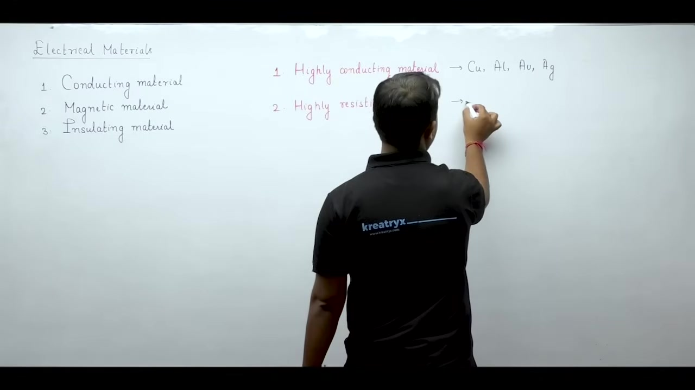

### Why Alloys Exhibit Higher Resistivity

Pure elemental metals possess an orderly, repeating crystal lattice. Their atoms sit in regular geometric positions like face-centered cubic or body-centered cubic lattices. Free conduction electrons drift through this regular lattice with relatively few collisions.

When two or more metals melt together to form an alloy, foreign atoms enter the host lattice. Because different elements have different atomic radii, their presence distorts the crystal geometry. Atoms get displaced from their neat lattice sites. 

As conduction electrons drift through this distorted structure, their mean free path shortens. Collisions with out-of-place atoms occur much more often. These frequent collisions impede electron transport and drastically increase material resistivity.

### Applications of Resistive Materials

Machines avoid high resistance in windings because resistance wastes energy as heat. But certain electrical applications require intentional heating. 

Domestic electric irons, toasters, and industrial heating elements use high-resistance alloys rather than pure metals. High electrical resistance ensures that electric current converts rapidly into thermal energy through $I^2 R$ power dissipation.

## Desirable Properties of Highly Conducting Materials
_(08:15 - 13:11)_

Electrical machines and heating appliances place completely opposite demands on material resistance. Heating appliances such as water geysers and clothes irons require high electrical resistance. Electric currents flowing through high-resistance alloy elements produce rapid Joule heating. 

Electrical machines require the opposite behavior. Machine designers want minimal electrical resistance to keep copper losses as low as possible.

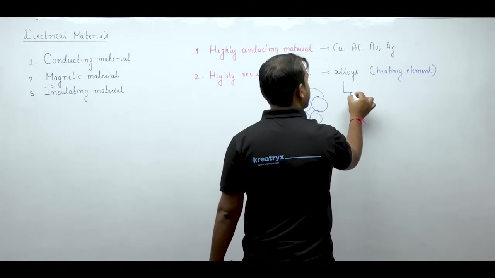

### Comparison Between Pure Metals and Alloys

Pure metals and metallic alloys differ in resistivity and temperature sensitivity.

> [!info] Definition: Temperature Dependence of Resistance
> The resistance of a conductor at temperature $T$ depends on temperature change $\Delta T$:
> $$R = R_0 (1 + \alpha_0 \Delta T)$$
> Here $R_0$ is the reference resistance at $0^\circ\text{C}$, and $\alpha_0$ is the temperature coefficient of resistance.

Alloys exhibit higher electrical resistivity than pure elemental metals. But alloys possess a much lower temperature coefficient of resistance $\alpha$. Their electrical resistance barely drifts as temperature changes. 

In electrical instruments and measurement circuits, low $\alpha$ helps minimize ambient temperature errors. Pure metals show significant resistance drift with temperature. But pure metals provide the high conductivity essential for machine windings.

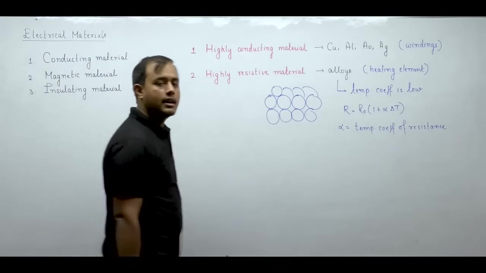

### Core Properties Required for Machine Windings

Conductors used in electrical machines must satisfy specific physical and electrical requirements.

#### 1. Highest Possible Conductivity
Windings must provide maximum electrical conductivity. High conductivity minimizes winding resistance and keeps $I^2 R$ heat losses to a minimum.

#### 2. Low Temperature Coefficient of Resistance
Operating electrical machines heat up due to core losses and winding losses. A lower temperature coefficient ensures that resistance does not escalate as operating temperature climbs.

### Temperature Rise and Machine Efficiency

All electrical machines convert input power into output power with internal losses. Efficiency expresses the fraction of input power delivered to the load:

$$
\eta = \frac{P_{\text{out}}}{P_{\text{in}}} = \frac{P_{\text{in}} - P_{\text{loss}}}{P_{\text{in}}}
$$

If winding wire has a high temperature coefficient $\alpha$, heating increases its resistance. Higher resistance generates even greater $I^2 R$ loss. 

This creates a vicious cycle of escalating loss and dropping efficiency. Choosing winding conductors with a low temperature coefficient stabilizes machine losses and preserves operating efficiency.

## Mechanical and Chemical Properties of Conductors
_(13:11 - 20:12)_

Electrical conductivity alone does not determine whether a metal works well in machines. Conductor wire must also satisfy demanding mechanical and chemical requirements.

### Essential Mechanical and Chemical Properties

Machine windings experience severe mechanical stress during manufacturing and daily operation.

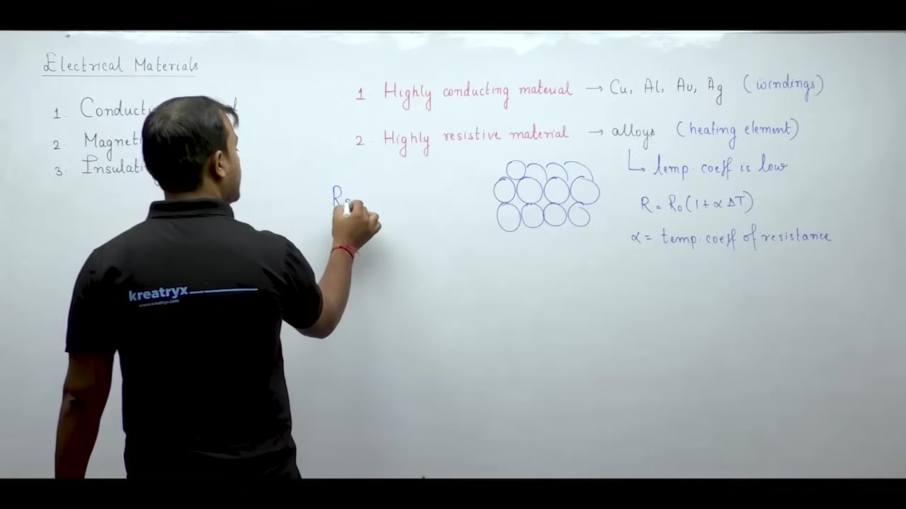

#### 1. Adequate Mechanical Strength and Ductility
Winding wire must bend tightly around magnetic iron cores without snapping. A brittle metal cracks under tension and bending forces. Strong ductile metals withstand mechanical pulling and winding vibration.

#### 2. Rollability and Drawability
- **Rollability**: The ability to be rolled through mechanical rollers into uniform flat strips or sheets.
- **Drawability**: The ability to be pulled through dies into thin, continuous wires without breaking.

Manufacturing stator and transformer coils requires excellent drawability to form precise wire cross-sections.

#### 3. Weldability and Solderability
Every machine contains dozens of electrical connections between coils, terminals, and slip rings. Conductors must solder and weld cleanly. Poor solderability creates high contact resistance at joints and produces localized hotspots.

#### 4. Corrosion Resistance
Windings must operate inside generators and transformers for decades without deteriorating. Atmospheric moisture and industrial fumes oxidize reactive metals. Strong corrosion resistance prevents conductor thinning and avoids costly winding replacements.

### Copper as the Primary Machine Conductor

Four elemental metals exhibit high electrical conductivity: silver ($\text{Ag}$), copper ($\text{Cu}$), gold ($\text{Au}$), and aluminium ($\text{Al}$).

> [!info] Definition: Practical Conductor Selection
> Commercial machine design balances electrical conductivity $\sigma$ against raw material cost:
> $$\sigma_{\text{Ag}} > \sigma_{\text{Cu}} > \sigma_{\text{Au}} > \sigma_{\text{Al}}$$

Silver and gold offer remarkable electrical properties. But their extreme market cost makes them impractical for power machines. Winding a large industrial generator with gold or silver would invite metal theft. It would also increase customer electricity tariffs unnecessarily.

Practical engineering decisions narrow down to copper and aluminium. Between these two options, copper provides much higher electrical conductivity. Copper windings carry higher current density with lower $I^2 R$ heat loss. 

Copper remains affordable enough for industrial production while delivering superior electrical performance. So copper serves as the universal standard conductor for stator coils, rotor coils, and transformer windings.

## Copper Properties and Comparison with Aluminium
_(20:13 - 27:35)_

Copper serves as the primary conductor for machine windings due to its chemical stability and electrical conductivity.

### Distinctive Features of Copper

Copper wire offers several key physical advantages for machine construction.

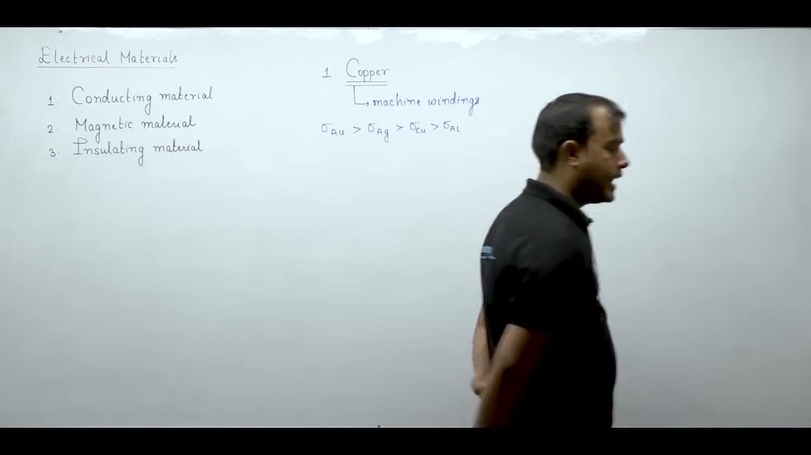

#### 1. Corrosion Resistance
Copper resists atmospheric oxidation and chemical corrosion. Old windings extracted from vintage motors still emerge bright and clean. This long chemical lifespan prevents early winding failure.

#### 2. Hard-Drawn Copper
Electrical machines use hard-drawn copper wire rather than soft annealed copper. Hard drawing is a cold-working process that boosts tensile strength. High tensile strength keeps winding wire from snapping when pulled tightly around steel cores.

#### 3. Temperature Coefficient of Resistance
The resistance of copper increases with temperature:

$$
\alpha_{\text{Cu}} \approx 0.00393\text{ /}^\circ\text{C} \quad (\text{at } 20^\circ\text{C})
$$

This coefficient is relatively large compared to specialized measurement alloys. It means machine copper resistance rises noticeably as the windings warm up under load.

### Aluminium as the Next Best Alternative

Natural copper reserves face steady depletion across the globe. Rising copper prices have forced machine designers to seek alternative conductors. 

Aluminium is abundant in the earth's crust and costs far less than copper.

Aluminium rolls very easily into thin foils and sheets. But drawing aluminium into fine, thin wires remains difficult. Aluminium tears more easily during wire drawing. So designers prefer aluminium for thick conductors, foil windings, and structural parts.

### Normalized Comparison Between Copper and Aluminium

Engineers compare copper and aluminium across electrical, economic, and mechanical metrics. The values below are normalized with copper taken as the baseline of $1.0$.

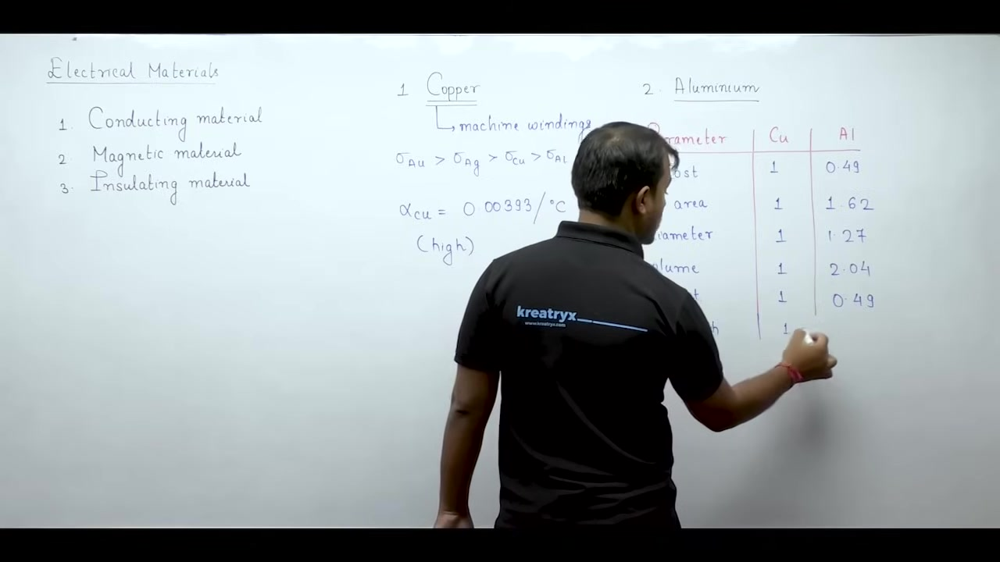

| Parameter | Copper ($\text{Cu}$) | Aluminium ($\text{Al}$) | Engineering Significance |
| :--- | :--- | :--- | :--- |
| **Relative Cost** | $1.00$ | $0.49$ | Aluminium costs roughly half as much as copper per unit weight. |
| **Cross-Sectional Area** ($A$) | $1.00$ | $1.62$ | Equal resistance requires $62\%$ larger conductor area in aluminium. |
| **Conductor Diameter** ($d$) | $1.00$ | $1.27$ | Diameter scales as $\sqrt{A}$, requiring larger winding slots. |
| **Tensile Strength** | $1.00$ | $0.64$ | Aluminium breaks at roughly two-thirds the tensile pull of copper. |
| **Relative Weight** | $1.00$ | $0.48$ | Low density makes aluminium conductors roughly half the total weight. |

> [!info] Definition: Conductor Sizing for Equal Resistance
> Because aluminium has lower conductivity, an aluminium conductor requires a larger cross-sectional area:
> $$A_{\text{Al}} \approx 1.62 \, A_{\text{Cu}}$$
> This larger size requires deeper slots inside the machine stator and rotor cores.

Even though aluminium saves raw material cost, the thicker wire takes up more core space. Machines built with aluminium windings require larger iron frames.

## Cross-Sectional Area Derivation and Aluminium Applications
_(27:35 - 34:15)_

Replacing copper with aluminium requires careful electrical and geometric redesign. An engineer cannot simply swap copper wire with aluminium wire of the same diameter.

### Derivation: Conductor Area for Equal Resistance

To keep machine heating and $I^2 R$ power losses identical, both windings must have equal resistance. 

Electrical resistance relates to electrical conductivity $\sigma$, conductor length $L$, and cross-sectional area $A$:

$$
R = \frac{\rho L}{A} = \frac{L}{\sigma A}
$$

Equating the electrical resistance of copper and aluminium conductors of identical length gives:

$$
\frac{L}{\sigma_{\text{Cu}} A_{\text{Cu}}} = \frac{L}{\sigma_{\text{Al}} A_{\text{Al}}}
$$

Cancelling the common length $L$ yields:

$$
A_{\text{Al}} = \left( \frac{\sigma_{\text{Cu}}}{\sigma_{\text{Al}}} \right) A_{\text{Cu}}
$$

Because copper is a better conductor than aluminium, $\sigma_{\text{Cu}} > \sigma_{\text{Al}}$. The conductivity ratio equals approximately $1.62$:

> [!success] Result: Cross-Sectional Area Ratio
> $$A_{\text{Al}} \approx 1.62 \, A_{\text{Cu}}$$
> For identical electrical resistance, an aluminium conductor requires $62\%$ more cross-sectional area than a copper conductor.

### Practical Impact on Stator and Rotor Slots

Windings in rotating machines sit embedded within slots carved into the stator and rotor laminations. 

Slots prevent winding coils from slipping off cylindrical machine surfaces. They also hold conductors firmly against electromagnetic forces and high centrifugal rotation.

Because aluminium wire has a larger cross-section, it demands significantly larger slots. Making slots deeper and wider leaves less cross-sectional area for magnetic iron teeth. 

So accommodating aluminium windings requires a physically larger stator core. The entire machine frame becomes bulkier and heavier.

### Practical Industrial Applications of Aluminium

Although aluminium cannot be drawn easily into thin wires, it performs very well in specific machine components.

#### 1. Squirrel-Cage Rotors in Induction Motors
Large induction motors above $100\text{ kW}$ frequently use aluminium for their cage rotor. Squirrel-cage rotors do not require thin insulated wires. 

Instead, they use thick, solid conductor bars shorted by end rings. Molten aluminium casts very cleanly into rotor slots to form durable conductor bars.

#### 2. Foil-Type Low-Voltage Transformer Windings
Aluminium rolls smoothly into continuous thin foils and sheets. 

Low-voltage transformer coils often use wide aluminium foil strips instead of circular magnet wires. Foil windings pack tightly and offer excellent heat conduction to transformer oil.

## Aluminium Passivation and Electrical Carbon Brushes
_(34:35 - 42:22)_

Aluminium provides chemical passivation and structural shielding in transformer tanks. Meanwhile, electrical carbon serves as the primary contact material for brushes in rotating machines.

### Passivation and Transformer Tank Applications

Aluminium offers distinct advantages when used in transformer enclosures and tanks.

#### 1. Self-Passivating Oxide Layer
When exposed to air, aluminium reacts immediately with atmospheric oxygen. It forms a microscopic surface film of aluminium oxide:

$$
4\text{Al} + 3\text{O}_2 \longrightarrow 2\text{Al}_2\text{O}_3
$$

This tough oxide skin acts as a protective shield. It stops oxygen from diffusing deeper into the bulk metal. So aluminium resists progressive atmospheric degradation over decades of outdoor service.

#### 2. Reduction of Stray Load Losses
Power transformers experience stray magnetic flux escaping from the windings into the outer enclosure. If the tank is made of structural iron, this stray flux induces large eddy currents and produces high stray load losses. 

Using non-magnetic aluminium for the tank walls reduces these stray eddy losses. Lower losses boost the overall operating efficiency of the transformer.

### Electrical Carbon and the Role of Brushes

In electrical machines, the third conducting material is electrical carbon in the form of graphite. 

Graphite conducts electricity, but its electrical conductivity is far lower than copper. So carbon cannot be used for machine windings. Instead, carbon is the standard material for electrical brushes.

> [!info] Definition: Function of a Brush
> A brush maintains continuous electrical contact with a rotating machine member. It transfers electric current between spinning rotor circuits and stationary external power terminals without twisting external cables.

### Why Carbon Brushes Replace Metal Contacts

Connecting metal brushes directly against a spinning metal ring creates severe practical problems.

1. **Reduced Friction and Sparking**: Sliding metal on metal causes abrasive gouging, heavy friction, and intense contact sparking. Carbon provides a naturally smooth, self-lubricating contact surface that minimizes friction and suppresses sparking.
2. **Graphitization and Heat Treatment**: Raw carbon undergoes industrial heat treatment and graphitization. Thermal treatment opens the crystalline lattice. This increases electrical conductivity and softens the contact face to prevent commutator wear.

Carbon brushes gently polish the rotating copper commutator rather than cutting into it. This extends the operating lifespan of both the brush and the machine.

## Brush Contact Voltage Drop and Introduction to Magnetic Materials
_(42:25 - 47:25)_

Carbon brushes exhibit a negative temperature coefficient of resistance. This unique electrical characteristic plays a vital role in DC machine modeling.

### Why Brush Contact Voltage Drop Remains Constant

Unlike metallic conductors, carbon behaves like a semiconductor when heated. Its electrical resistance decreases as temperature rises.

> [!success] Result: Constant Brush Contact Drop
> When load current $I$ increases, contact heating raises the brush temperature. 
> Rising temperature lowers the contact resistance $R_{\text{brush}}$. 
> Because $I$ increases while $R_{\text{brush}}$ decreases, their product remains nearly constant:
> $$V_{\text{bd}} = I \cdot R_{\text{brush}} \approx \text{constant} \quad (\approx 1\text{ to }2\text{ V})$$

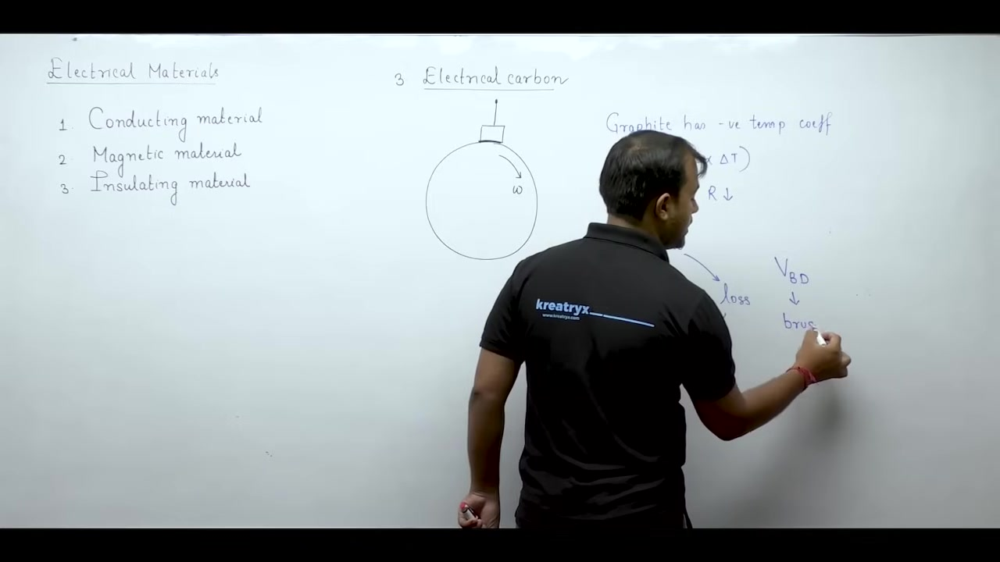

In DC machine circuit analysis, engineers model the brush contact drop as a fixed voltage drop. It does not scale linearly with armature current. The negative temperature coefficient of graphite keeps the contact drop steady across varying load levels.

### Summary of Primary Conducting Materials

Engineers choose conducting materials based on clear physical and economic trade-offs.

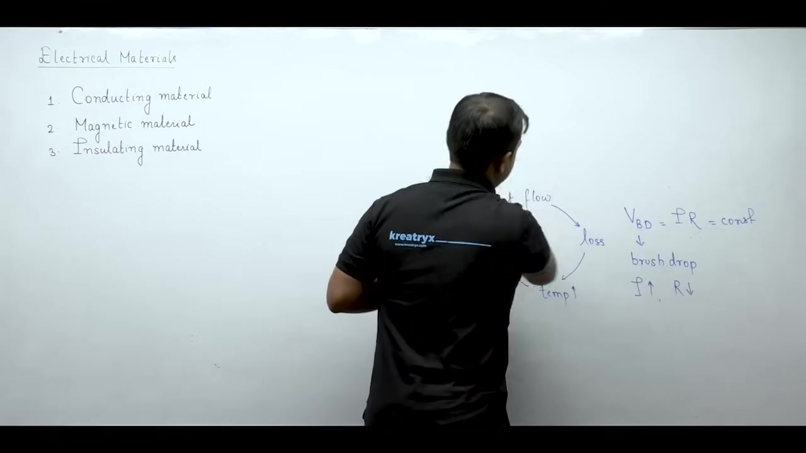

1. **Copper**: Standard choice for all stator and rotor windings. It combines high electrical conductivity with mechanical toughness and corrosion resistance.
2. **Aluminium**: Viable alternative when copper is scarce. It is used for cage rotors, foil transformer windings, and transformer tank walls.
3. **Carbon**: Exclusively used for sliding contact brushes. It offers self-lubrication, low friction, suppressed contact sparking, and a steady voltage drop.

### Introduction to Magnetic Materials

Electrical machines operate through electromechanical energy conversion. Magnetic flux links the stationary and rotating components across an air gap.

> [!info] Definition: Magnetic Materials
> Magnetic materials are substances that readily establish, support, and guide magnetic flux lines with minimal opposition.

Air and vacuum offer high reluctance to magnetic flux. Machines need specialized magnetic cores to channel flux efficiently. Without high-permeability magnetic materials, establishing the necessary magnetic fields would require immense electric currents and huge copper coils.

## Diamagnetic Materials and Induced Dipole Alignment
_(47:34 - 52:26)_

Magnetic materials form the magnetic circuit of transformers, motors, and generators. They direct magnetic flux between electrical windings and rotating shafts.

### Classification of Magnetic Materials

Substances respond differently when placed inside a magnetic field. Physics classifies magnetic substances into diamagnetic, paramagnetic, and ferromagnetic materials.

### Behavior of Diamagnetic Materials

Diamagnetic materials show no permanent magnetism under ordinary conditions.

> [!info] Definition: Diamagnetic Material
> A substance with no net permanent magnetic dipoles in the absence of an external magnetic field. When an external field is applied, it induces dipoles that align opposite to the applied field.

#### 1. Absence of External Field
At rest, atomic electron orbitals balance each other out. The net magnetic dipole moment of each atom equals zero. The material exhibits zero magnetization.

#### 2. Presence of External Field
Applying an external magnetic field intensity $H$ alters electron orbital motions. This process induces tiny magnetic dipoles inside the medium. 

Crucially, these induced dipoles align in direct opposition to the applied field $H$.

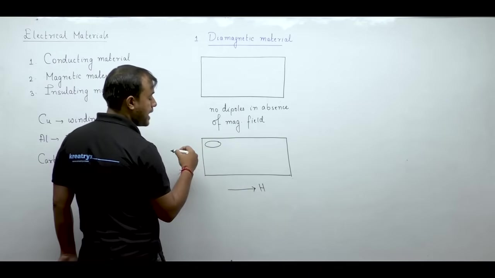

### Internal Dipole Field and Boundary Polarization

A magnetic dipole consists of a north pole and a south pole separated by a small distance. Outside a magnet, field lines travel from the north pole to the south pole. Inside the magnet, field lines run from south to north.

When induced dipoles align opposite to the external field, internal poles cancel in the bulk material. But uncancelled south poles appear on one surface and north poles appear on the other.

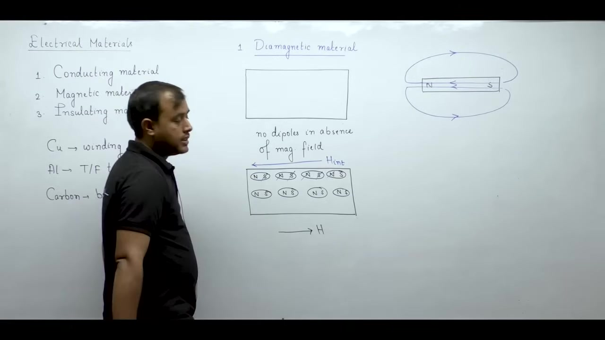

The internal field created by these dipoles points against the applied external field. So diamagnetic materials slightly weaken the magnetic field inside themselves.

### Concept of Magnetization

Engineers quantify material response using the magnetization vector $M$.

> [!info] Definition: Magnetization ($M$)
> Magnetization represents the net magnetic dipole moment per unit volume established inside a material:
> $$M = \frac{\sum m_{\text{dipole}}}{V}$$

In diamagnetic materials, induced dipoles point backwards. So the magnetization vector $M$ opposes the applied magnetic field intensity $H$.

## Magnetic Susceptibility and Relative Permeability of Diamagnetic Materials
_(52:29 - 57:00)_

The response of any material to an applied magnetic field depends on two core magnetic properties. These are magnetic susceptibility and relative permeability.

### Magnetic Susceptibility

When an external magnetic field intensity $\vec{H}$ acts on a substance, microscopic dipoles align. 

> [!info] Definition: Magnetic Susceptibility ($\chi_m$)
> Magnetic susceptibility measures the ease with which a material develops magnetization when placed in an external magnetic field:
> $$\vec{M} = \chi_m \vec{H}$$

If susceptibility is large and positive, dipoles align strongly with the field. 

In diamagnetic materials, induced dipoles orient in the opposite direction to the applied field. Because the magnetization vector $\vec{M}$ opposes the applied field $\vec{H}$, susceptibility is negative:

$$
\chi_m < 0 \quad (\text{negative and small})
$$

### Absolute and Relative Permeability

Permeability quantifies the ease with which magnetic flux passes through a physical medium.

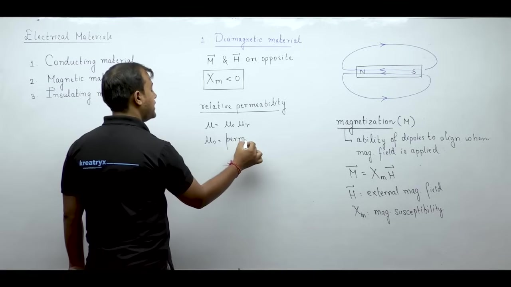

Total magnetic permeability $\mu$ consists of the permeability of free space $\mu_0$ multiplied by relative permeability $\mu_r$:

$$
\mu = \mu_0 \mu_r
$$

The permeability of free space is a fundamental physical constant:

$$
\mu_0 = 4\pi \times 10^{-7}\text{ H/m} \approx 1.257 \times 10^{-6}\text{ H/m}
$$

Relative permeability $\mu_r$ links directly to magnetic susceptibility:

$$
\mu_r = 1 + \chi_m
$$

### Permeability Values in Diamagnetic Materials

Because diamagnetic susceptibility $\chi_m$ is negative, adding it to unity makes relative permeability less than one:

> [!success] Result: Diamagnetic Permeability Relations
> In diamagnetic materials:
> $$
> \chi_m < 0 \implies \mu_r < 1 \implies \mu < \mu_0
> $$

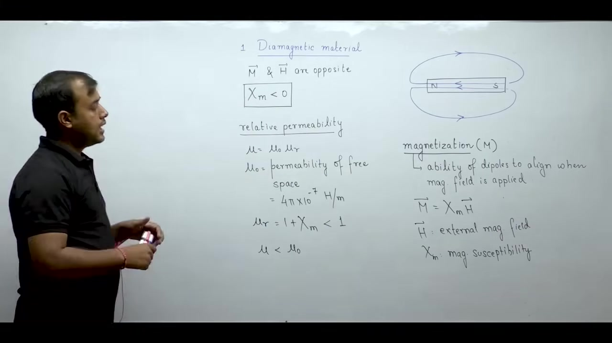

Because $\mu < \mu_0$, diamagnetic materials oppose magnetic flux lines even more than a vacuum does. 

They slightly expel external magnetic field lines. So diamagnetic substances never serve as core materials for magnetic circuits in electrical machines.

## Field Divergence in Diamagnets and Paramagnetic Fundamentals
_(57:00 - 62:17)_

Magnetic flux density describes how tightly magnetic field lines concentrate within a given medium.

### Magnetic Flux Density and Field Line Divergence

Magnetic flux density $\vec{B}$ relates to magnetic field intensity $\vec{H}$ through medium permeability:

$$
\vec{B} = \mu \vec{H} = \mu_0 \mu_r \vec{H}
$$

Flux density indicates the spatial density of magnetic field lines. High flux density means field lines pack tightly together.

In diamagnetic materials, relative permeability is less than unity ($\mu_r < 1$). The absolute permeability is lower than that of air ($\mu < \mu_0$). 

For the same applied field intensity $H$, the flux density inside a diamagnetic material is lower than in air:

$$
B_{\text{dia}} < B_{\text{air}}
$$

As magnetic field lines enter a diamagnetic medium from air, they push outward and spread apart. 

Inside the substance, field lines diverge from one another. Upon leaving the medium, they converge back to their original spacing in air.

### Examples of Diamagnetic Materials

Common diamagnetic substances include:
- Copper ($\text{Cu}$)
- Gold ($\text{Au}$)
- Silicon ($\text{Si}$)
- Germanium ($\text{Ge}$)
- Diamond ($\text{C}$)

Copper is the primary conductor for electrical machines. Knowing that copper is diamagnetic helps engineers understand that machine windings do not amplify magnetic flux.

### Introduction to Paramagnetic Materials

Paramagnetic materials behave differently at the atomic scale.

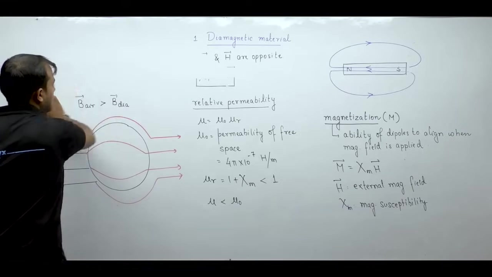

> [!info] Definition: Paramagnetic Material
> A substance containing permanent atomic magnetic dipoles caused by unpaired electron spins. In the absence of an applied field, thermal agitation keeps these dipoles randomly oriented.

Diamagnetic substances possess zero permanent magnetic dipoles. But paramagnetic atoms have incomplete electron subshells with unpaired electron spins.

Each unpaired electron spins on its axis like a tiny rotating charge. This spinning charge produces an intrinsic magnetic dipole moment. 

Without an external magnetic field, thermal energy jostles these dipoles in random directions. The vector sum of all dipole moments cancels out to zero. So the bulk material exhibits no macroscopic magnetization at rest.

## Paramagnetic Dipole Alignment and Positive Susceptibility
_(62:20 - 67:27)_

Paramagnetic materials contain intrinsic atomic magnetic dipoles. Their macroscopic magnetic properties stem directly from unpaired electron spins.

### Electron Spin and Permanent Atomic Dipoles

Total atomic magnetic dipole moment comes from electron orbital motion and intrinsic electron spin. 

In paired electron orbitals, two electrons possess opposite spins. One spins clockwise and the other spins counter-clockwise. Their magnetic moments cancel each other out completely. Materials with only paired electrons exhibit diamagnetism.

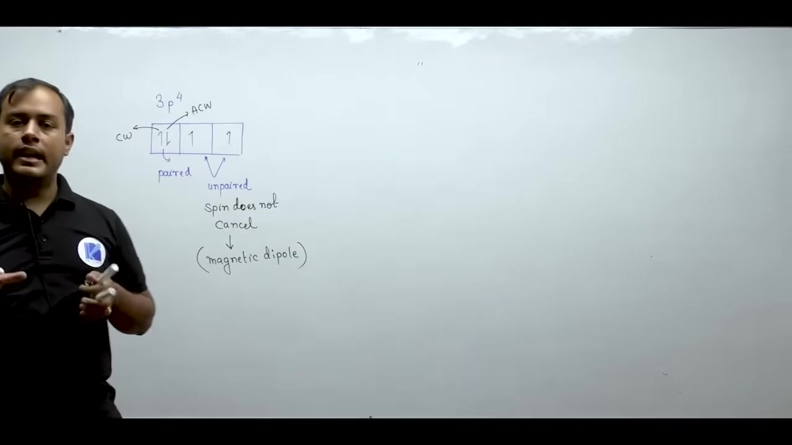

When an atom has unpaired electrons in its valence subshells, their spins do not cancel. Each unpaired electron creates a permanent atomic magnetic dipole moment.

### Dipole Alignment Under an Applied Field

The physical behavior of paramagnetic dipoles depends on external magnetic excitation.

#### 1. Zero Applied Field ($H = 0$)
In the absence of an applied field, thermal agitation jumbles atomic dipoles in random directions. The net magnetic moment across the medium sums to zero.

#### 2. External Field Applied ($H > 0$)
When an external magnetic field intensity $\vec{H}$ is applied, it exerts an aligning torque on each dipole. The dipoles rotate to align parallel to the external field lines.

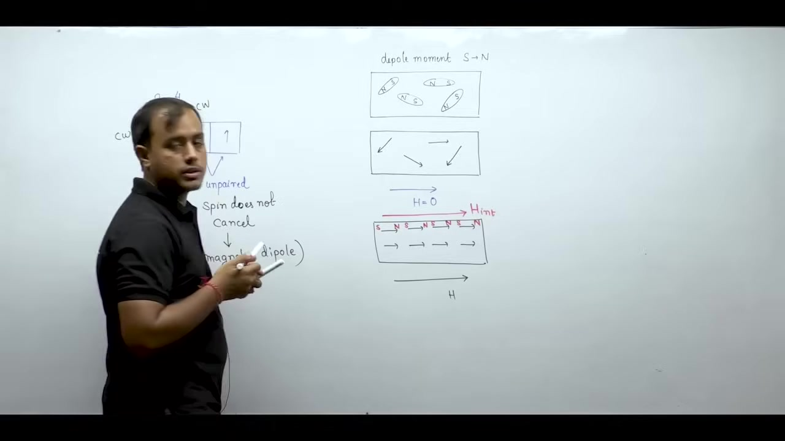

This alignment creates a net internal magnetic field that points in the same direction as the external field. The internal dipole field aids the applied magnetic field.

### Magnetic Susceptibility and Permeability

Because the magnetization vector $\vec{M}$ aligns parallel to the magnetic field intensity $\vec{H}$, magnetic susceptibility is positive.

> [!success] Result: Paramagnetic Susceptibility and Permeability
> In paramagnetic materials:
> $$
> \vec{M} = \chi_m \vec{H} \implies \chi_m > 0
> $$
> Relative permeability exceeds unity:
> $$
> \mu_r = 1 + \chi_m > 1
> $$
> So absolute permeability is greater than that of free space:
> $$
> \mu = \mu_0 \mu_r > \mu_0
> $$

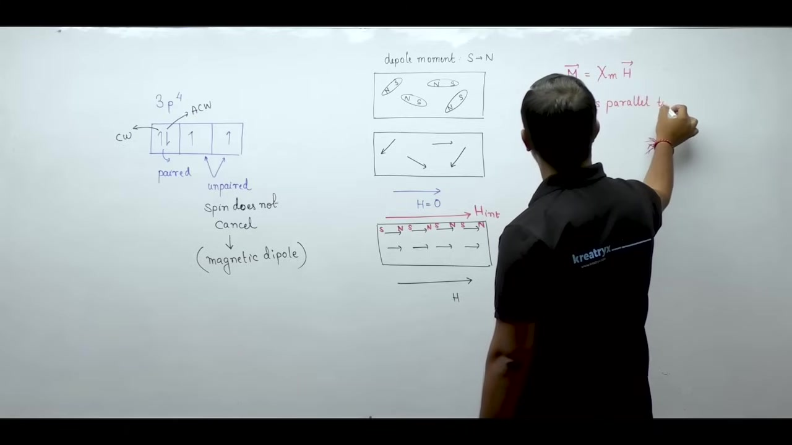

Positive susceptibility marks the fundamental distinction between paramagnetic and diamagnetic materials. 

Paramagnetic materials assist magnetic flux slightly better than a vacuum. But their susceptibility remains very small. So their flux-amplifying ability is modest compared to ferromagnetic materials.

## Flux Concentration in Paramagnets and Comprehensive Lecture Summary
_(67:39 - 72:56)_

Paramagnetic materials slightly concentrate magnetic field lines. But their overall magnetic response remains weak.

### Flux Concentration and Field Line Convergence

Because relative permeability exceeds unity ($\mu_r > 1$), internal flux density is slightly greater than in air:

$$
B = \mu_0 \mu_r H > \mu_0 H = B_{\text{air}}
$$

Field lines pack slightly closer together as they enter the paramagnetic material. 

Inside the substance, magnetic field lines converge toward one another. When they exit back into air, they spread out again to their original density.

Common examples of paramagnetic substances include:
- Potassium ($\text{K}$)
- Molecular oxygen ($\text{O}_2$)
- Tungsten ($\text{W}$)
- Rare-earth elements

### Comparison Between Diamagnetic and Paramagnetic Materials

Both diamagnetic and paramagnetic materials exhibit very weak magnetic interactions.

| Property | Diamagnetic Materials | Paramagnetic Materials |
| :--- | :--- | :--- |
| **Permanent Dipoles** | Absent at zero field | Present due to unpaired spins |
| **Dipole Alignment** | Opposes applied field | Aligns parallel to applied field |
| **Susceptibility ($\chi_m$)** | Negative ($\chi_m < 0$) | Positive ($\chi_m > 0$) |
| **Susceptibility Order** | $|\chi_m| \approx 10^{-5}$ | $|\chi_m| \approx 10^{-5}$ |
| **Relative Permeability ($\mu_r$)** | $\mu_r \approx 0.9999 \approx 1$ | $\mu_r \approx 1.0001 \approx 1$ |
| **Field Line Behavior** | Lines diverge slightly | Lines converge slightly |

> [!success] Result: Core Suitability
> Because $\mu_r \approx 1$ for both materials, neither diamagnets nor paramagnets can concentrate significant flux. 
> Practical electrical machine cores require ferromagnetic materials where $\mu_r \approx 2000\text{ to }6000$.

### Comprehensive Lecture Review

This lecture covered the practical materials used in constructing electrical machines.

#### 1. Conducting Materials
- **Copper**: Universal winding material. It offers high electrical conductivity, mechanical toughness from hard drawing, and excellent corrosion resistance.
- **Aluminium**: Low-cost, abundant conductor. It requires $1.62$ times larger conductor area. Used in cage rotors, foil transformer coils, and transformer tanks to cut stray losses.
- **Carbon**: Universal brush material. Its self-lubricating surface prevents contact sparking. A negative temperature coefficient keeps the contact voltage drop steady.

#### 2. Magnetic Materials
- **Diamagnets**: Dipoles oppose external fields. Field lines diverge. Copper is a diamagnet.
- **Paramagnets**: Dipoles aid external fields. Field lines converge.
- Both have $\mu_r \approx 1$ and cannot serve as magnetic cores. Ferromagnetic materials will form the focus of the next lecture.

---

## Summary and Key Takeaways

- Electrical machines require conducting materials for current flow, magnetic materials to channel flux, and insulating materials for electrical isolation.
- Highly conducting winding materials require high electrical conductivity and a low temperature coefficient of resistance $\alpha$ to prevent thermal runaway of $I^2 R$ losses.
- Hard-drawn copper is the standard winding material because of high conductivity, superior mechanical tensile strength, drawability, and corrosion resistance.
- For identical conductor length and resistance, an aluminium wire requires $62\%$ greater cross-sectional area ($A_{\text{Al}} \approx 1.62 A_{\text{Cu}}$) and larger core slots.
- Aluminium forms a self-passivating $\text{Al}_2\text{O}_3$ surface skin and reduces stray load losses when used for transformer tanks.
- Heat-treated carbon brushes provide smooth self-lubricating sliding contact, while their negative temperature coefficient maintains a nearly constant contact drop ($V_{\text{bd}} \approx 1\text{ to }2\text{ V}$).
- Diamagnetic materials lack permanent dipoles, exhibit negative susceptibility ($\chi_m < 0$) and relative permeability $\mu_r < 1$, causing magnetic field lines to diverge.
- Paramagnetic materials possess permanent dipoles from unpaired electron spins, yielding positive susceptibility ($\chi_m > 0$) and relative permeability $\mu_r > 1$, causing magnetic field lines to converge.
- Both diamagnets and paramagnets have $|\chi_m| \approx 10^{-5}$ and $\mu_r \approx 1$, making neither suitable for machine magnetic cores.

