# Electrical Machines | Lec 3 | Electrical Materials-2 | GATE Electrical Engineering | CRACK GATE Exam

- **Source**: https://www.youtube.com/watch?v=nTmQHHvjjlU
- **Duration**: 01:07:36
- **Compiled**: 2026-09-16

---

## Overview

This lecture examines the magnetic and insulating materials used in electrical machines. It explains how ferromagnetic materials amplify magnetic flux and form non-linear hysteresis loops. The discussion details domain theory, magnetostriction, and the selection criteria for silicon steel and high-resistivity ferrites. Finally, the lecture explains how insulating materials prevent dielectric breakdown under strong electric fields.

## Contents

- [[#Ferromagnetic Materials and Dipole Magnetization|Ferromagnetic Materials and Dipole Magnetization]]
- [[#Flux Density Amplification and Field Line Convergence|Flux Density Amplification and Field Line Convergence]]
- [[#Hysteresis Loop, Residual Magnetism, and Coercive Force|Hysteresis Loop, Residual Magnetism, and Coercive Force]]
- [[#Domain Theory and Magnetostriction|Domain Theory and Magnetostriction]]
- [[#Transformer Hum and Ferrimagnetic Materials|Transformer Hum and Ferrimagnetic Materials]]
- [[#Ferrites and Material Selection in Machines|Ferrites and Material Selection in Machines]]
- [[#Eddy Current Losses and Soft Magnetic Materials|Eddy Current Losses and Soft Magnetic Materials]]
- [[#Hard and Soft Magnetic Materials|Hard and Soft Magnetic Materials]]
- [[#Silicon Steel and Core Rolling Methods|Silicon Steel and Core Rolling Methods]]
- [[#Silicon Content Limits and CRGO Steel|Silicon Content Limits and CRGO Steel]]
- [[#Insulating Materials and Dielectric Breakdown|Insulating Materials and Dielectric Breakdown]]
- [[#Dielectric Properties and Materials Summary|Dielectric Properties and Materials Summary]]

---

## Ferromagnetic Materials and Dipole Magnetization
_(00:12 - 05:15)_

Electrical machines depend heavily on magnetic materials to channel energy between stationary coils and rotating shafts. Ferromagnetic materials provide the strong magnetic coupling required for practical power equipment.

### Brief Review of Machine Materials

Electrical machine construction requires three material categories:
1. **Conducting Materials**: Copper for coils, aluminium for tanks or cage rotors, and carbon for brushes.
2. **Magnetic Materials**: Diamagnetic and paramagnetic substances possess relative permeability close to unity ($\mu_r \approx 1$). They cannot support large magnetic flux.
3. **Insulating Materials**: Separate live electrical parts from grounded frames.

### Atomic Basis of Ferromagnetism

Ferromagnetic materials possess a large number of unpaired electrons in their outer atomic shells. 

When electron spins remain unpaired, their magnetic dipole moments do not cancel out. These uncancelled electron spins contribute to a very large permanent atomic dipole moment.

> [!info] Definition: Ferromagnetic Materials
> Materials containing large numbers of unpaired electron spins that produce powerful intrinsic magnetic dipoles. In an applied magnetic field, these dipoles align strongly with the field.

Primary elemental examples of ferromagnetic substances include:
- Iron ($\text{Fe}$)
- Cobalt ($\text{Co}$)
- Nickel ($\text{Ni}$)
- Gadolinium ($\text{Gd}$)
- Dysprosium ($\text{Dy}$)

Iron is by far the most important element for electrical machines. The remaining elements find specialized use in alloys and permanent magnets.

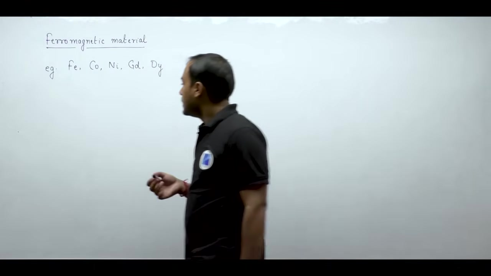

### Dipole Alignment Under Applied Field

Before an external magnetic field acts on the material, thermal energy and boundary conditions randomize dipole directions. The vector sum of all dipole moments cancels out.

When an external magnetic field intensity $\vec{H}$ is applied, it exerts a mechanical torque on the dipoles. 

The dipoles rotate and align parallel to the applied field direction.

Magnetization measures the magnetic dipole moment per unit volume:

$$
M = \chi_m H
$$

Because millions of dipoles lock into alignment with the field, the magnetization $M$ is enormous. So ferromagnetic materials exhibit a magnetic susceptibility $\chi_m$ that is vastly greater than zero ($\chi_m \gg 0$).

## Flux Density Amplification and Field Line Convergence
_(05:15 - 09:10)_

Ferromagnetic materials dramatically amplify magnetic flux. This property makes them the core building block of transformers and rotating machines.

### Relative Permeability and Flux Density Amplification

Because magnetic susceptibility is enormous ($\chi_m \gg 0$), relative permeability is far greater than unity:

$$
\mu_r = 1 + \chi_m \gg 1
$$

The resulting magnetic flux density inside the ferromagnetic material equals:

$$
B = \mu_0 \mu_r H
$$

Since $\mu_r \gg 1$, this flux density is thousands of times larger than the flux density in air:

$$
B_{\text{ferro}} \gg B_{\text{air}} \quad (\text{where } B_{\text{air}} = \mu_0 H)
$$

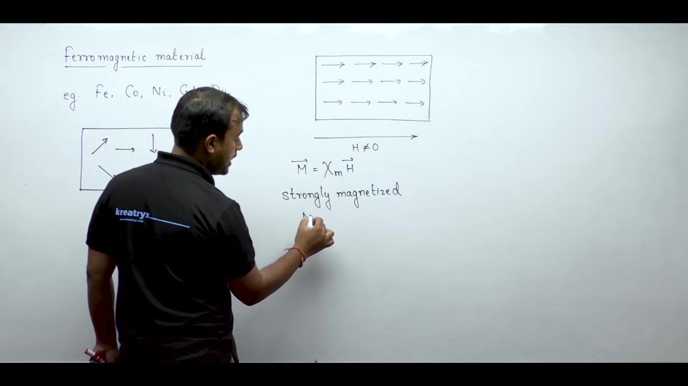

### Convergence of Magnetic Field Lines

Because ferromagnetic materials offer very low reluctance, they pull surrounding flux lines into themselves.

Field lines traveling through air initially stay wide apart. As soon as they enter iron, they draw tightly together.

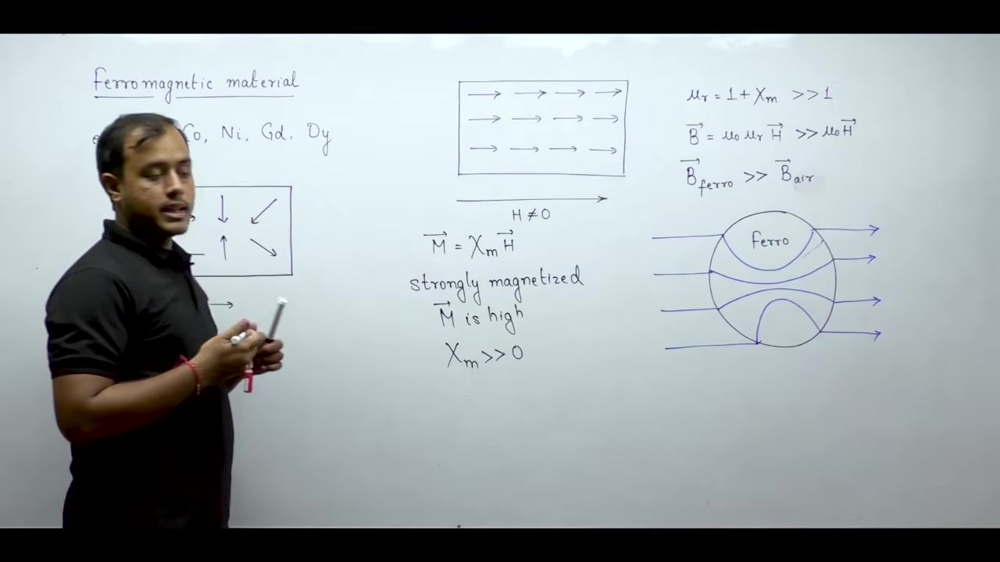

> [!success] Result: Field Line Convergence
> Magnetic field lines converge strongly when passing through a ferromagnetic material. They concentrate inside the core where magnetic permeability is highest.

A past GATE exam tested this exact concept. When external magnetic flux encounters an iron block, the field lines bend inward and converge sharply.

### Numerical Magnitude of Relative Permeability

The relative permeability of engineering iron is exceptionally high. 

In textbook problems and machine designs, the relative permeability of iron typically ranges between $2{,}500$ and $4{,}000$:

$$
\mu_r \approx 2500 \text{ to } 4000
$$

Paramagnetic materials have $\mu_r \approx 1$. Iron multiplies flux density by several thousand times for the same exciting current.

### Memory Effect and Residual Magnetism

Ferromagnetic materials possess a unique memory effect. 

In diamagnetic and paramagnetic materials, removing the external magnetic field instantly wipes out all internal magnetization. 

Ferromagnetic materials behave differently. When you turn off the applied magnetic field, many dipoles remain locked in their aligned positions. Some net magnetism always remains behind inside the iron.

## Hysteresis Loop, Residual Magnetism, and Coercive Force
_(09:48 - 16:58)_

Ferromagnetic materials exhibit non-linear magnetization with a distinct memory effect. Their magnetic flux density lags behind the applied magnetic field intensity.

### Residual Flux Density and the Virgin Curve

When testing a newly prepared ferromagnetic sample, the material starts with zero magnetization.

> [!info] Definition: Virgin Magnetization Curve
> The initial $B-H$ curve traced by a fresh, unmagnetized ferromagnetic sample starting from the origin $(0, 0)$.

As the applied magnetic field intensity $H$ increases, dipoles align until magnetic saturation occurs. 

At saturation, nearly all internal dipoles point along the field. Increasing $H$ further cannot boost material magnetization.

### Residual Flux Density ($B_r$)

When the applied field $H$ reduces back to zero, internal dipoles remain locked in their aligned orientation. 

> [!success] Result: Residual Flux Density ($B_r$)
> The magnetic flux density remaining inside a ferromagnetic material when the applied magnetic field intensity $H$ drops to zero:
> $$B = B_r \quad (\text{at } H = 0)$$

If the initial field pointed rightward, the residual flux density equals $+B_r$. If the initial field pointed leftward, the residual flux density equals $-B_r$. 

Because dipoles stay aligned, you cannot write a simple linear equation like $B = \mu H$.

### Coercive Force ($H_c$)

Simply removing the external magnetic field does not randomize the dipoles. 

To force the flux density back to zero, an engineer must apply a reverse magnetic field.

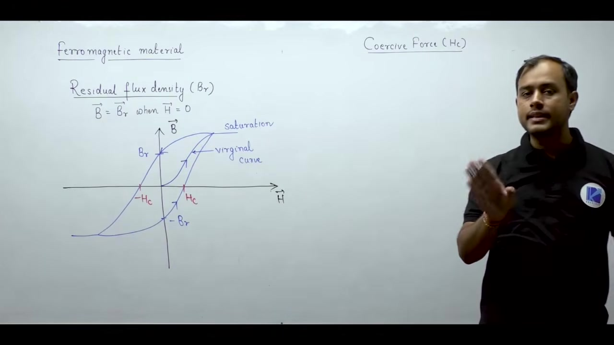

> [!info] Definition: Coercive Force ($H_c$)
> The reverse magnetic field intensity required to reduce the residual magnetic flux density to zero ($B = 0$).

The full closed loop formed by cycling $H$ between positive and negative limits is called the hysteresis loop. 

Describing any ferromagnetic material requires defining both residual flux density $B_r$ and coercive force $H_c$.

### The Macroscopic Puzzle and Domain Theory

This memory effect introduces a puzzling practical question. 

If ferromagnetic materials retain residual magnetism, every piece of iron on earth should act like a permanent magnet. An iron bench leg or an ordinary nail would pick up other iron pieces.

Yet everyday iron objects show zero net attraction to other metals. Resolving this apparent contradiction requires understanding magnetic domain theory.

## Domain Theory and Magnetostriction
_(17:27 - 23:02)_

### The Need for Domain Theory

A piece of unmagnetized iron shows no external magnetic field. Yet ferromagnetic materials have strong residual magnetism. Domain theory explains this apparent contradiction. 

Atomic dipoles in ferromagnetic materials lock together due to strong quantum exchange coupling. An unmagnetized bulk specimen cannot keep all dipoles aligned across its entire volume. Such uniform alignment would create large external magnetic poles. That state stores high magnetostatic energy. The material lowers its internal energy by splitting into microscopic compartments.

> [!info] Magnetic Domain
> A magnetic domain is a microscopic region in a ferromagnetic material. All atomic magnetic dipoles inside a single domain point in the same direction.

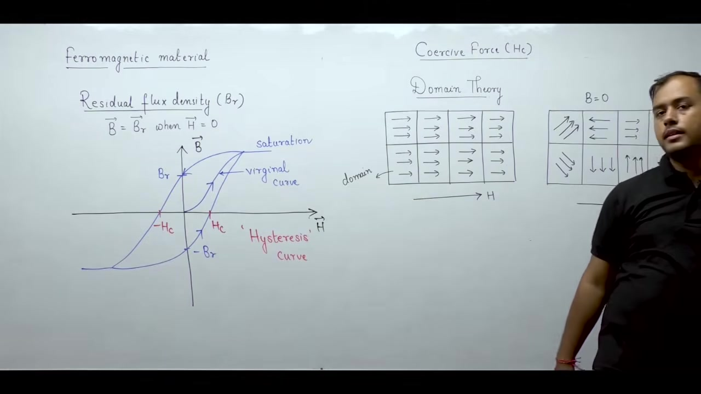

### Domain Behavior Under Magnetic Fields

The boundary separating two adjacent domains is called a Bloch wall. Across this thin transition layer, dipole directions rotate gradually from one domain orientation to another.

When no external magnetic field is applied ($H = 0$), dipoles inside each domain remain aligned. But adjacent domains point in random directions. The magnetic vector sum across the bulk material cancels out:

$$B_{\text{net}} = 0 \quad \text{at} \quad H = 0$$

Residual magnetism exists locally inside each domain. But the bulk material exhibits zero macroscopic magnetic field.

When an external magnetic field $H$ is applied, domains with favorable orientations grow at the expense of others. Dipoles within unfavorable domains rotate toward the applied field direction. At saturation, all domains merge into a single aligned direction.

When the external field is removed, dipoles stay aligned inside their domains. The domains relax back into mutually cancelling directions. This explains why an ordinary iron piece does not behave as a permanent magnet without prior treatment.

### Magnetostriction

Ferromagnetic materials show a unique mechanical response to magnetic fields. This effect is known as magnetostriction.

> [!info] Magnetostriction
> Magnetostriction is the change in physical dimensions of a ferromagnetic material when exposed to an external magnetic field.

When a magnetic field passes through ferromagnetic sheets, atomic spacing shifts along the magnetization axis. The material elongates or contracts slightly. 

If the applied magnetic field alternates in time, the field direction reverses periodically. The dimensional changes repeat every half-cycle. This continuous mechanical deformation produces physical vibrations in the magnetic core. These vibrations cause the audible hum in transformers and electric machines.

## Transformer Hum and Ferrimagnetic Materials
_(23:02 - 27:59)_

### Core Vibration and Transformer Hum

Under an alternating magnetic field, core dimensions change continuously. The core expands during one half-cycle and contracts during the next. This cyclic expansion and contraction sets up mechanical vibrations in the laminations.

The mechanical vibrations produce an audible humming noise. Anyone standing near an operating transformer hears this hum. Magnetostriction is the direct cause of this acoustic noise.

Engineers damp these vibrations to protect foundation structures. Large transformers rest on beds of sand or soil. Smaller units sit on thick rubber damping mats. The compliant base absorbs mechanical vibration and lowers noise transmission.

### Magnetization Characteristics Comparison

Paramagnetic and ferromagnetic materials show very different magnetization behavior.

Paramagnetic materials have a linear $B\text{--}H$ curve. The line passes directly through the origin. The constant slope equals the material permeability:

$$B = \mu H = \mu_0 (1 + \chi_m) H$$

Ferromagnetic materials have a non-linear $B\text{--}H$ response. They exhibit magnetic saturation and form a wide hysteresis loop. Electrical machines rely on ferromagnetic cores because permeability is extremely large. A modest winding current sets up high magnetic flux density.

### Ferrimagnetic Materials

Ferrimagnetic materials display an unequal antiparallel dipole arrangement.

> [!info] Ferrimagnetic Material
> In a ferrimagnetic material, adjacent magnetic dipoles point in opposite directions. But the opposing dipoles have unequal magnitudes.

When an external magnetic field $\vec{H}$ is applied, dipoles align along the field axis in an antiparallel pattern. The forward dipoles are stronger than the opposing dipoles:

$$|\vec{m}_{\uparrow}| > |\vec{m}_{\downarrow}|$$

Because the opposing dipoles do not cancel completely, a net magnetization remains:

$$\vec{M} = \chi_m \vec{H} \quad \text{with} \quad \chi_m > 0$$

Net magnetization points in the direction of the applied field. Ferrimagnetic materials thus exhibit positive magnetic susceptibility.

## Ferrites and Material Selection in Machines
_(27:59 - 32:46)_

### Properties of Ferrimagnetic Materials

In a ferrimagnetic material, adjacent dipoles line up in opposite directions under an external field. The forward dipoles are larger than the backward dipoles. Dipole moments do not cancel out completely.

A net magnetization develops along the direction of the applied field. Magnetic susceptibility $\chi_m$ is positive. But relative permeability $\mu_r$ is lower than in ferromagnetic materials:

$$\mu_r = 1 + \chi_m$$

Ferromagnetic materials align all dipoles in one direction. Ferrimagnetic materials have opposing dipoles. So their relative permeability is noticeably smaller:

$$\mu_{r, \text{ferri}} < \mu_{r, \text{ferro}}$$

### Chemical Structure and Electrical Resistivity

Engineers make ferrimagnetic materials by substituting metal ions into iron oxides. For example, manganese or nickel replaces some iron atoms in iron compounds. These compounds are commonly called ferrites.

Ferrites are ceramic materials. They have very high electrical resistivity:

$$\rho_{\text{ferri}} \gg \rho_{\text{ferro}}$$

Metallic ferromagnetic materials conduct electric current easily. Ferrites resist electric current strongly. This difference determines how each material is used in electrical equipment.

### Core Material Selection

Magnetic flux equals flux density multiplied by core area:

$$\Phi = B \times A$$

For a given magnetic flux $\Phi$, the required core cross section is:

$$A = \frac{\Phi}{B}$$

Operating at high flux density reduces the core cross-sectional area. Smaller cross-sectional area cuts overall machine dimensions and weight. 

Power frequency electrical machines handle large amounts of magnetic flux. They need high flux density to remain compact. Their cores are made from ferromagnetic materials like silicon steel.

High-frequency, low-power applications face different constraints. High frequency induces large eddy currents in conductive cores. Ferrites have high electrical resistivity, which suppresses eddy current losses. So high-frequency transformers use ferrimagnetic ferrite cores.

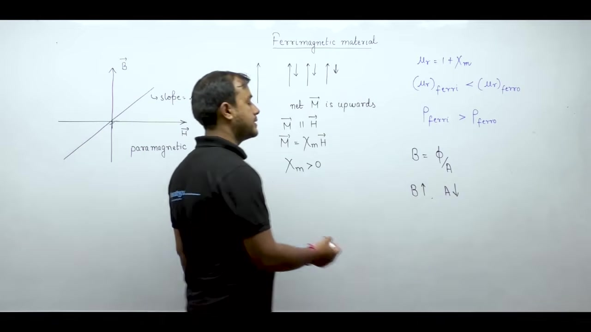

## Eddy Current Losses and Soft Magnetic Materials
_(32:51 - 38:17)_

### Frequency Effects and Eddy Current Loss

Alternating magnetic flux induces circulating currents in a conducting core. These currents are called eddy currents. They generate heat and cause power loss in the core. The eddy current power loss per unit volume satisfies the proportionality:

$$P_e \propto \frac{f^2 B_m^2}{\rho}$$

Here $f$ is operating frequency, $B_m$ is maximum flux density, and $\rho$ is electrical resistivity.

Eddy current loss grows with the square of frequency. At high operating frequencies, metallic cores overheat rapidly. To limit this loss, the core material must have very high electrical resistivity $\rho$. Ferrites provide this high resistivity.

### Power Limitations of Ferrites

Ferrites operate mainly at low power levels, such as in radio-frequency and communication circuits. 

Because ferrites have lower relative permeability than ferromagnetic metals, they support lower flux density $B_m$. Lower flux density produces lower core flux:

$$\Phi = B \times A$$

By Faraday's law of induction, induced electromotive force is directly proportional to core flux:

$$E \propto f \Phi$$

Lower flux density limits the induced voltage for a given core size. Electrical power equals the product of voltage and current:

$$S = V \times I$$

A lower voltage limit restricts the rated power. Ferrites cannot support the high power levels demanded by heavy power transformers. They are reserved for high-frequency, low-power devices.

### Soft Magnetic Materials

Magnetic materials fall into two practical classes: soft magnetic materials and hard magnetic materials.

> [!info] Soft Magnetic Material
> A soft magnetic material is a magnetic material that can be magnetized and demagnetized easily.

The term "soft" describes magnetic properties, not mechanical texture. Soft materials require very little magnetizing force to align their domains. They lose their magnetization readily when the external field drops to zero.

Engineers use soft magnetic materials to build electromagnets and machine cores. In an electromagnet, magnetic field must appear when current flows and vanish when current stops. 

When AC current excites the winding, the magnetic field must reverse smoothly twice every cycle. Soft magnetic materials switch polarities easily with low energy loss.

## Hard and Soft Magnetic Materials
_(38:22 - 43:46)_

### Soft Materials Under Alternating Excitation

An alternating current changes direction periodically. During the positive half-cycle, current is positive ($i > 0$). During the negative half-cycle, current is negative ($i < 0$).

The magnetic field in the core reverses polarity every half-cycle. The core material must follow these rapid reversals without resisting the field change. Permanent magnetism would oppose the reversal. Soft magnetic materials switch polarity easily. They are ideal for alternating electromagnets and machine cores.

### Hard Magnetic Materials

Hard magnetic materials exhibit the opposite behavior.

> [!info] Hard Magnetic Material
> A hard magnetic material is difficult to magnetize and difficult to demagnetize.

These materials resist changes in their magnetic state. Once magnetized, they retain strong magnetization even against opposing external fields.

Hard magnetic materials make permanent magnets. These magnets provide field excitation in low-power electrical machines. Familiar examples include permanent magnet DC (PMDC) motors found in toys and small appliances.

### Hysteresis Loop Comparison and Coercive Force

The difference between soft and hard materials shows clearly on their $B\text{--}H$ hysteresis loops.

The reverse magnetic field needed to wipe out residual flux density is called the coercive force ($H_c$). Soft magnetic materials have very small coercive force. Their hysteresis loop is tall and narrow. This narrow loop keeps cyclic hysteresis energy loss small.

Hard magnetic materials have very large coercive force. Their hysteresis loop is broad and wide. The material stores large magnetic energy and resists demagnetization.

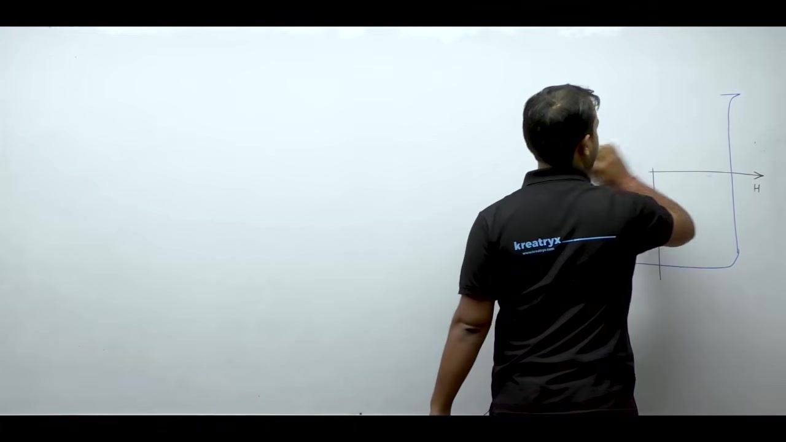

Both soft and hard magnetic materials are subclasses of ferromagnetic materials. Both share spontaneous domain magnetization. But soft materials are formulated for high permeability and low loss. Hard materials are formulated for high coercivity and permanent flux retention.

### Non-Oriented Sheet Steel

Commercial machine cores do not use solid pure iron. They use steel rolled into thin sheets. These sheets are called electrical sheet steel.

The first major category is non-oriented steel. In this material, crystalline grains point in random directions. No single axis has preferred magnetic orientation. Magnetic properties remain nearly uniform in all directions within the sheet.

## Silicon Steel and Core Rolling Methods
_(43:46 - 48:18)_

### Magnetic Aging in Early Core Materials

Early transformers used ordinary iron with small carbon content. This material suffered from magnetic aging. Over years of service, thermal cycles distorted the lattice structure.

The hysteresis loop widened continuously over time. This widening increased cyclic hysteresis loss. Transformer operating temperatures rose and electrical efficiency dropped. Modern machines avoid this problem by alloying iron with silicon.

### Benefits of Adding Silicon

Modern electrical sheet steel contains between 0.3% and 4.5% silicon by weight. Adding silicon delivers two distinct advantages.

First, silicon narrows the hysteresis loop. The material magnetizes and demagnetizes with less effort. This reduction cuts total hysteresis energy loss during every alternating cycle.

Second, silicon raises electrical resistivity $\rho$. High resistivity chokes off induced circulating currents. Because eddy current loss varies inversely with resistivity:

$$P_e \propto \frac{1}{\rho}$$

Raising $\rho$ lowers eddy current loss in the core laminations.

### Hot Rolling Versus Cold Rolling

Steel sheets are manufactured by passing thick slabs through heavy mechanical rollers. Two distinct rolling methods exist.

In hot rolling, the metal is heated to high temperature before entering the rollers. Heat keeps the metal soft and ductile. As the rolled sheet cools down, crystal grains reform uniformly without severe internal stress.

In cold rolling, steel passes through rollers at ambient room temperature. The process requires large mechanical compressive force. Heavy pressure deforms the crystalline grains and induces internal lattice strain.

Large machines require high magnetic permeability to keep core dimensions compact. The manufacturing process must preserve or restore magnetic properties after rolling.

## Silicon Content Limits and CRGO Steel
_(48:21 - 54:57)_

### Silicon Content in Core Alloys

The amount of silicon added to electrical steel depends on machine size and efficiency targets.

Large machines and power transformers operate continuously at high load. High efficiency is critical. Their cores use about 4.5% silicon by weight. Steel with this high silicon level is called transformer-grade steel.

Small machines like fractional horsepower domestic motors operate intermittently. Energy efficiency matters less than manufacturing cost. These small motors use steel with only about 0.3% silicon.

Silicon content cannot exceed 4.5% in practical manufacturing. Higher silicon concentrations make the alloy brittle. When sheets enter punch presses to form slot teeth and bolt holes, brittle laminations crack and shatter. Fabricators cap silicon at 4.5% to retain punchability.

### Cold-Rolled Grain-Oriented Steel

Cold-Rolled Grain-Oriented (CRGO) steel is a soft magnetic alloy with directional magnetic properties.

> [!info] CRGO Steel
> CRGO steel is silicon steel cold-rolled through a specialized heat-treatment cycle. The crystal grains align their easy magnetization axis along the rolling direction.

Cold rolling forces the microscopic crystal lattices to deform into parallel alignment. The material becomes magnetically anisotropic. Permeability is exceptionally high along the rolling axis:

$$\mu_{\text{rolling}} \gg \mu_{\text{transverse}}$$

Along perpendicular axes, magnetic permeability remains low.

### Application in Transformers Versus Rotating Machines

To benefit from CRGO steel, magnetic flux must stay parallel to the rolling direction.

Transformers have rectangular limbs and yokes. The magnetic flux travels along straight lines through the limbs and corners. Laminations are cut so that the rolling direction matches the flux path. CRGO steel provides low reluctance and high efficiency in transformer cores.

Rotating electrical machines use cylindrical stators and rotors. Flux leaves the poles radially and circles through the stator yoke circumferentially. The field vector rotates through all angles in space. 

Because CRGO steel provides high permeability along only one axis, it offers no benefit in rotating machines. Rotating machines use non-oriented electrical steel instead.

## Insulating Materials and Dielectric Breakdown
_(54:57 - 60:50)_

### Roles of Insulators in Machines

Insulating materials separate conducting components from non-conducting parts. 

In motors and generators, insulation separates copper windings from grounded steel cores. In power transformers, porcelain or polymer bushings insulate live high-voltage terminals from the grounded steel tank.

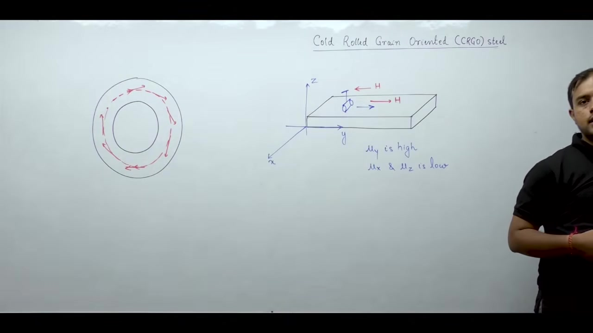

Effective insulators must satisfy two basic requirements. First, they must possess high insulation resistance. High electrical resistance blocks leakage currents between conductors and the ground frame. Second, they must exhibit high dielectric strength.

### Electric Dipoles in Dielectrics

Dielectrics are insulating materials containing bound charge pairs. 

An electric dipole consists of equal positive and negative charges separated by a small distance. These opposite charges remain bound to each other by internal Coulomb attraction. They cannot move independently through the crystal lattice.

The electric dipole moment vector $\vec{p}$ points from the negative charge to the positive charge:

$$\vec{p} = q \vec{d}$$

Here $q$ is charge magnitude and $\vec{d}$ is the displacement vector between the charges.

### Mechanism of Dielectric Breakdown

When an external electric field $\vec{E}$ acts on the dielectric, the charges experience electrostatic forces:

$$\vec{F}_+ = +q \vec{E}$$

$$\vec{F}_- = -q \vec{E}$$

The positive charge pulls in the direction of the field. The negative charge pulls in the opposite direction. 

These opposing forces stretch the dipole. Two forces compete within the material. The internal Coulomb attraction holds the charges together. The applied electric field pulls them apart.

> [!info] Dielectric Breakdown
> Dielectric breakdown occurs when an external electric field overpowers the internal binding force. The dipole tears apart into free mobile charges.

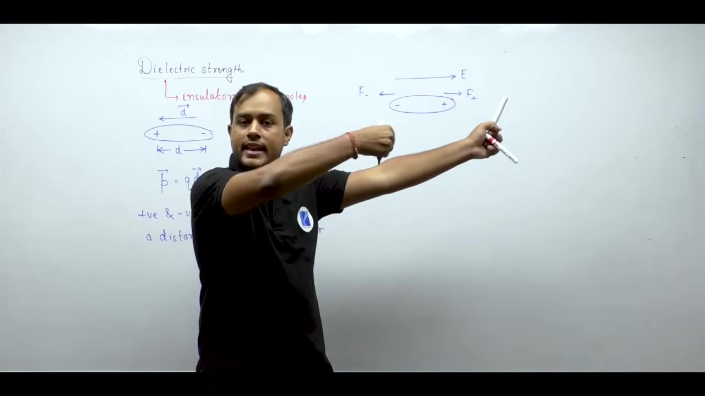

Once dipoles rupture, positive and negative charges move freely through the lattice. Free charge motion creates conduction current. 

At that threshold, the insulating material loses its resisting ability. It transitions suddenly into an electrical conductor. This irreversible failure is called dielectric breakdown.

## Dielectric Properties and Materials Summary
_(60:50 - 67:28)_

### Dielectric Strength and Safety

When an intense electric field tears dipoles apart, the insulator conducts electric current.

> [!info] Dielectric Strength
> Dielectric strength is the threshold electric field intensity at which dielectric breakdown occurs.

Units of dielectric strength are typically kilovolts per millimeter ($\text{kV/mm}$).

Insulators must provide high dielectric strength. Electrical equipment operates at high voltages. If winding insulation fails, current flashes directly to the metallic frame. Anyone touching the casing risks a severe electric shock. High dielectric strength ensures the material stays non-conductive under normal and transient voltages.

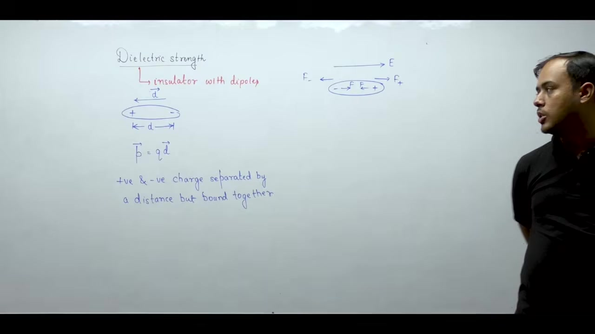

### Essential Properties of Electrical Insulators

A practical machine insulator must meet several engineering criteria.

First, the material needs low dielectric hysteresis. Alternating electric fields cause polarization hysteresis within the dielectric. This effect creates dielectric power loss and heats the material. Low loss prevents internal heat buildup.

Second, the insulator must have high thermal conductivity. Machine windings generate ohmic heat during operation. The insulation layer wraps directly around the conductors. It must conduct that heat outward to cooling oil or air.

Third, the material requires high thermal stability. The insulator must withstand continuous hot operating temperatures without melting or charring.

Fourth, the material must be non-hygroscopic. It must never absorb moisture from the surrounding air. Water conducts electricity. Moisture inside insulation lowers dielectric resistance and causes rapid breakdown.

Fifth, the insulator must resist chemical corrosion. It must remain stable in the presence of hot transformer oil and atmospheric contaminants.

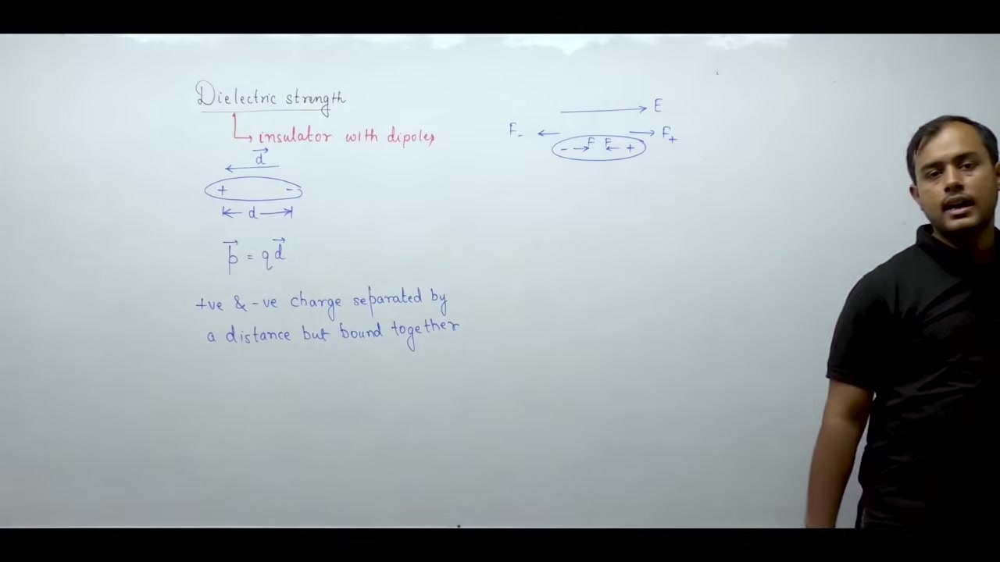

### Comprehensive Summary of Electrical Materials

Electrical machine construction depends on three main material categories.

Conducting materials carry electric currents. Copper makes machine windings because of its high conductivity. Aluminium serves as a lighter, economical alternative for windings and transformer tanks. Carbon forms machine brushes because of its self-lubricating texture and negative temperature coefficient of resistance.

Magnetic materials shape and channel magnetic flux. Ferromagnetic silicon steel forms machine cores because of its high permeability. Ferrimagnetic ferrites serve in high-frequency, low-power transformers to reduce eddy current loss. 

Transformers use Cold-Rolled Grain-Oriented (CRGO) steel along straight limbs. Rotating machines use non-oriented silicon steel to support rotating flux vectors. Hard magnetic materials supply permanent excitation in small PMDC motors.

Insulating materials separate live conductors from grounded frames. Solid sheets, insulating enamel, and porcelain bushings prevent electrical breakdown and ensure safe operation.

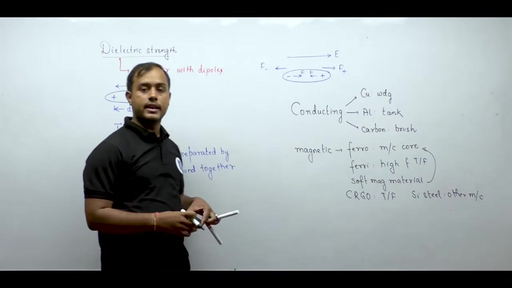

### Foundations for Machine Theory

The physical operation of electrical machines rests on two engineering subjects. Electromagnetic theory explains the physical principles of force, torque, and induced voltage. Circuit and network theory governs the terminal voltages, currents, and power flow equations.

---

## Summary and Key Takeaways

- Ferromagnetic materials have large positive magnetic susceptibility ($\chi_m \gg 0$) and relative permeability ($\mu_r \gg 1$), which concentrates flux lines to produce high flux density ($B = \mu_0 \mu_r H$).
- Non-linear dipole alignment creates a $B\text{--}H$ hysteresis loop with residual flux density $B_r$ at zero applied field and requires a reverse coercive force $H_c$ for demagnetization.
- Microscopic magnetic domains maintain aligned internal dipoles, but random orientations among adjacent domains cancel out macroscopic flux density ($B_{\text{net}} = 0$) in unmagnetized iron.
- Magnetostrictive cyclic expansion and contraction of core laminations generate mechanical vibrations that create the audible hum in operating transformers.
- Ferrites provide high electrical resistivity that suppresses eddy current power loss ($P_e \propto f^2 B_m^2 / \rho$) in high-frequency applications, while low-frequency machines rely on high-permeability sheet steel.
- Adding up to 4.5% silicon to iron narrows the hysteresis loop and raises electrical resistivity, but higher silicon concentrations cause mechanical brittleness during lamination stamping.
- Cold-Rolled Grain-Oriented (CRGO) steel provides high magnetic permeability along the rolling direction ($\mu_{\text{rolling}} \gg \mu_{\text{transverse}}$), which benefits linear transformer flux paths rather than circular rotating machine paths.
- Dielectric breakdown occurs when an external electric field exerts a separating force that exceeds the internal Coulomb attraction of bound atomic dipoles.

