[← Lec 003: Electrical Materials 2](Lecture_003_Electrical_Materials_2.md) | [🏠 Index](00_yt_study_guide.md) | [Lec 005: Laws of Electromagnetism 2 →](Lecture_005_Laws_of_Electromagnetism_2.md)

---

# Electrical Machines | Lec 4 | Laws of Electromagnetism-1 | GATE Electrical Engineering | CRACK GATE

- **Source**: https://www.youtube.com/watch?v=ojBqv1t5Wvc
- **Duration**: 01:08:29
- **Compiled**: 2026-09-16

---

## Overview

This lecture develops the electromagnetic principles that govern all electrical machines. It begins with Biot-Savart's law and Ampere's circuital law to compute magnetic fields around conductors and solenoids. It then introduces Faraday's law of induction alongside Lenz's law for finding induced voltage polarity. Next, it divides induced voltages into static transformer EMF and dynamic rotational EMF. Finally, it establishes the physical boundary conditions and the assumption of zero magnetic leakage.

## Contents

- [[#Electromagnetic Foundations and the Current Element|Electromagnetic Foundations and the Current Element]]
- [[#Biot-Savart's Law Formulation|Biot-Savart's Law Formulation]]
- [[#Vector Form of Biot-Savart's Law and Cross Products|Vector Form of Biot-Savart's Law and Cross Products]]
- [[#Right-Hand Thumb Rule and Field Mapping|Right-Hand Thumb Rule and Field Mapping]]
- [[#Ampere's Circuital Law and Enclosed Current|Ampere's Circuital Law and Enclosed Current]]
- [[#Straight Wire Field and Solenoid Principles|Straight Wire Field and Solenoid Principles]]
- [[#Solenoid Field and Amperian Loop Analysis|Solenoid Field and Amperian Loop Analysis]]
- [[#Solenoid Field Formula and Magnetic Flux|Solenoid Field Formula and Magnetic Flux]]
- [[#Flux Linkage and Lenz's Law|Flux Linkage and Lenz's Law]]
- [[#Practical Application of Lenz's Law|Practical Application of Lenz's Law]]
- [[#Dual-Coil Polarity and Statically Induced EMF|Dual-Coil Polarity and Statically Induced EMF]]
- [[#Transformer EMF, Dynamic EMF, and Leakage Limitations|Transformer EMF, Dynamic EMF, and Leakage Limitations]]
- [[#Tight Winding Assumption, Practice Problem, and Chapter Summary|Tight Winding Assumption, Practice Problem, and Chapter Summary]]

---

## Electromagnetic Foundations and the Current Element
_(00:13 - 04:59)_

### Role of Electromagnetic Theory in Electrical Machines

Electrical machines convert energy between electrical and mechanical forms. Every motor, generator, and transformer relies on electromagnetic field interactions.

Circuit theory provides network equations to compute currents and voltages at machine terminals. But electromagnetic theory describes the internal physics. It explains induced electromotive force, magnetic flux distribution, and electromagnetic torque. Advanced machine models develop directly from these foundational physical laws.

### The Concept of Fields and Field Intensity

In physics, a field represents a continuous distribution in space.

> [!info] Physical Field
> A field is a region of space surrounding an active source where its physical influence can be measured.

An electric charge modifies the space around it. Any test charge placed in this space experiences an electrostatic force. That region is an electric field.

Similarly, moving charges and magnets alter their surroundings. A magnetic needle placed near a current-carrying conductor experiences a mechanical torque. That region of magnetic influence is a magnetic field.

The spatial boundary where this influence exists defines the field. The quantitative measure of that force at a specific point is called the field intensity.

### The Current Element Concept

Jean-Baptiste Biot and Félix Savart investigated the magnetic fields produced by steady currents. They sought to calculate the magnetic force exerted on nearby compass needles.

Consider a thin conductor carrying a steady electric current $I$. We want to find the magnetic field at a nearby point $P$.

Electric current $I$ is a scalar quantity. It does not follow vector addition laws at circuit nodes. But magnetic field calculations require the spatial direction of charge flow.

> [!info] Current Element
> A current element $I \, d\vec{l}$ is an infinitesimal length vector pointing along the direction of electric current flow.

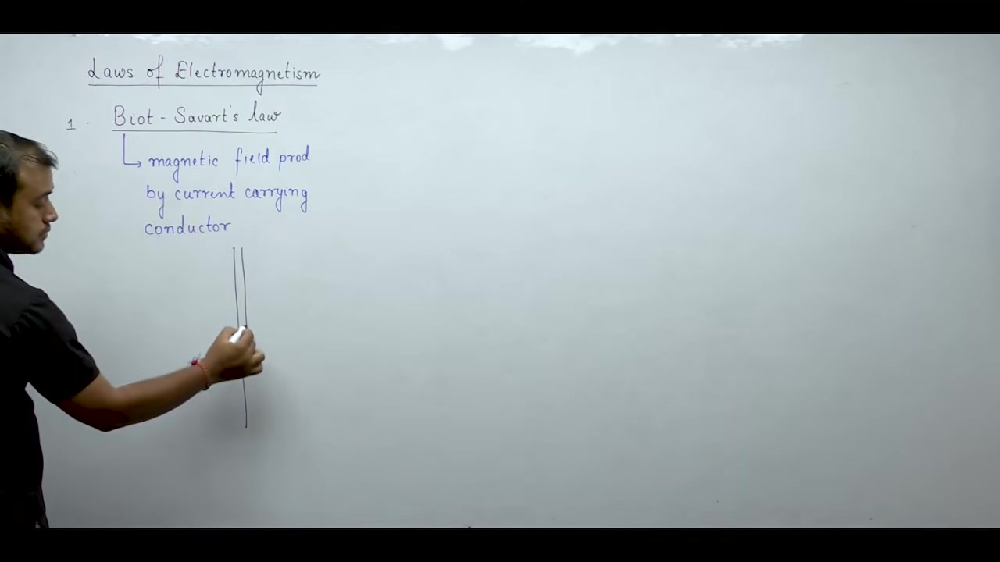

Engineers assign the flow direction to the differential length vector $d\vec{l}$. Multiplying this vector by the scalar current $I$ yields the current element $I \, d\vec{l}$. This vector element serves as the basic source term in magnetostatics.

## Biot-Savart's Law Formulation
_(05:03 - 10:39)_

### Differential Field Relationships

Consider an infinitesimal current element $I \, d\vec{l}$ along a conducting wire. Let point $P$ lie at a distance $x$ from this element. The line from the element to point $P$ makes an angle $\phi$ with the element axis.

Experiments establish two geometric relationships for the differential magnetic field.

First, the field intensity decreases with the square of the distance from the source:

$$dH \propto \frac{1}{x^2}$$

Second, the field intensity varies with the sine of the angle $\phi$ between the current element and the displacement vector:

$$dH \propto I \, dl \sin\phi$$

When the field point lies along the axis of the current element ($\phi = 0^\circ$ or $180^\circ$), the field vanishes. The maximum field appears at right angles ($\phi = 90^\circ$).

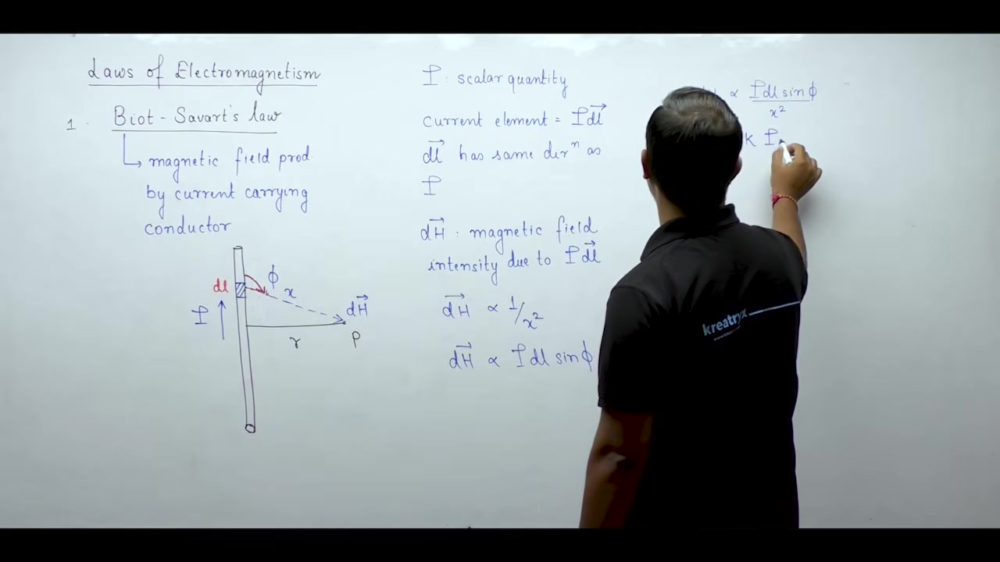

### Mathematical Formulation of Biot-Savart's Law

Combining these proportionalities yields the differential magnetic field:

$$dH \propto \frac{I \, dl \sin\phi}{x^2}$$

Replacing the proportionality sign with the medium constant gives:

$$dH = \frac{\mu_0 \mu_r}{4\pi} \frac{I \, dl \sin\phi}{x^2}$$

Here $\mu_0$ is the permeability of free space:

$$\mu_0 = 4\pi \times 10^{-7} \text{ H/m}$$

The dimensionless factor $\mu_r$ is the relative permeability of the surrounding medium.

> [!info] Biot-Savart's Law
> Biot-Savart's law states that the differential magnetic field produced by a current element varies directly with current, length, and the sine of the angle, and inversely with the square of the distance.

To find the total magnetic field intensity produced by the entire conductor, we integrate over the complete length:

$$H = \int \frac{\mu_0 \mu_r}{4\pi} \frac{I \, dl \sin\phi}{x^2}$$

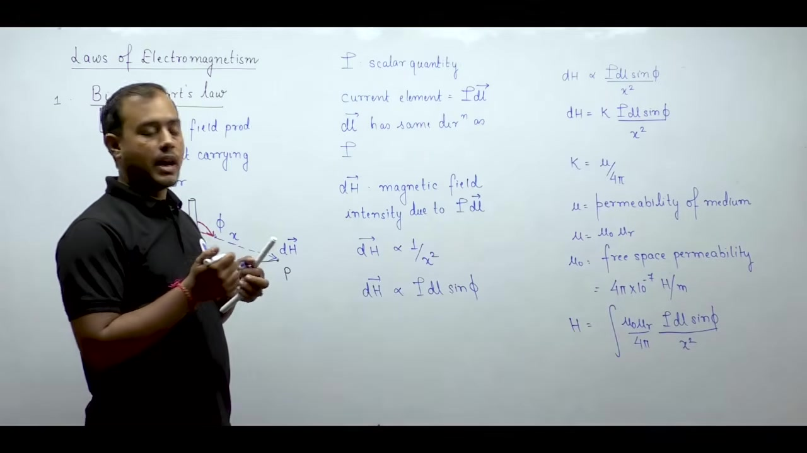

### Physical Units in Biot-Savart's Law

Two key physical quantities define this relationship.

The current element combines current and length:

$$\text{Unit of } I \, dl = \text{A}\cdot\text{m}$$

The magnetic field intensity $H$ measures magnetizing effort per unit length:

$$\text{Unit of } H = \text{A/m}$$

Biot-Savart's law provides the foundational tool to compute magnetic field intensities produced by arbitrary conductor geometries.

## Vector Form of Biot-Savart's Law and Cross Products
_(10:46 - 15:33)_

### Vector Formulation of Biot-Savart's Law

The scalar equation gives field magnitude. But magnetic field intensity is a spatial vector. Writing the law in vector form yields both magnitude and direction simultaneously.

Let the position vector from the differential current element $I \, d\vec{l}$ to the field point be $\vec{x}$. The vector form of Biot-Savart's law is:

$$d\vec{H} = \frac{\mu_0 \mu_r}{4\pi} \frac{I \, d\vec{l} \times \vec{x}}{x^3}$$

We can also express this relation using the unit displacement vector $\hat{a}_x = \vec{x} / x$:

$$d\vec{H} = \frac{\mu_0 \mu_r}{4\pi} \frac{I \, d\vec{l} \times \hat{a}_x}{x^2}$$

To verify consistency, compute the magnitude of the cross product:

$$|d\vec{l} \times \vec{x}| = dl \cdot x \sin\phi$$

Substituting this magnitude into the vector formula gives:

$$\frac{I |d\vec{l} \times \vec{x}|}{x^3} = \frac{I (dl \cdot x \sin\phi)}{x^3} = \frac{I \, dl \sin\phi}{x^2}$$

The factor $x$ in the numerator cancels one power of $x$ in the denominator. The scalar magnitude matches the experimental law exactly.

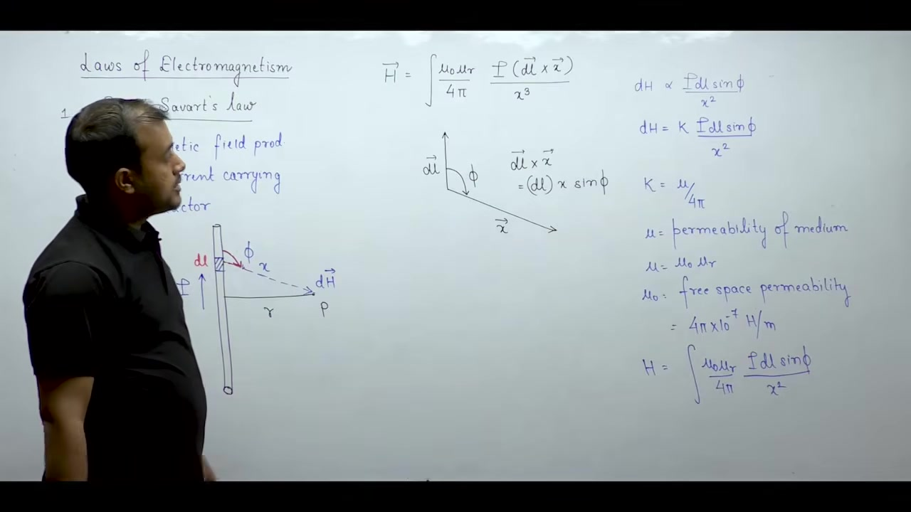

### Properties of the Vector Cross Product

Cross products appear frequently in electrical machines to calculate torque, force, and magnetic fields.

The cross product between two vectors $\vec{a}$ and $\vec{b}$ separated by an angle $\theta$ is:

$$\vec{a} \times \vec{b} = a b \sin\theta \, \hat{n}$$

Here $a$ and $b$ are scalar magnitudes. The factor $\hat{n}$ is a dimensionless unit vector.

> [!info] Normal Unit Vector
> The unit vector $\hat{n}$ has unit magnitude ($|\hat{n}| = 1$) and points perpendicular to the plane containing both $\vec{a}$ and $\vec{b}$.

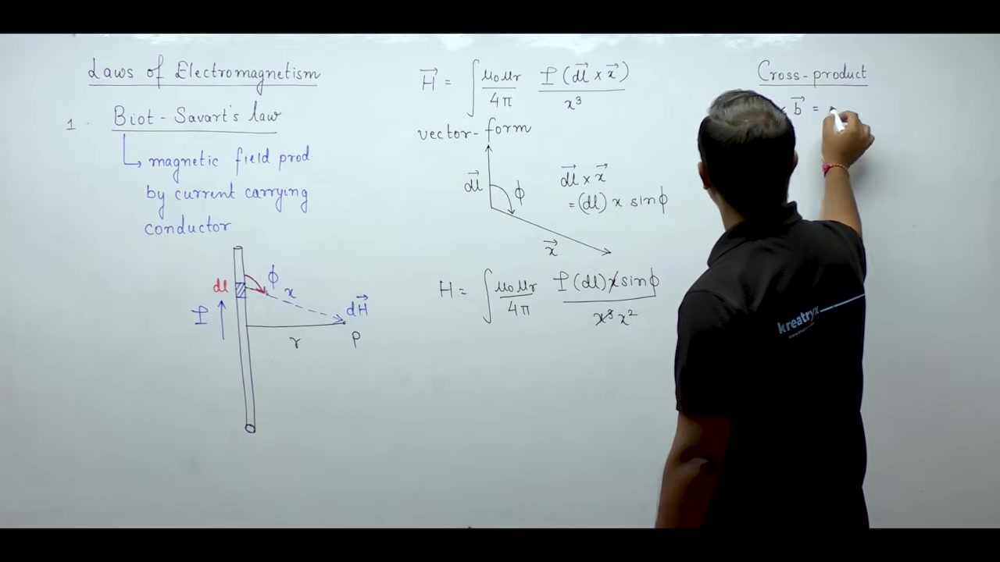

Because $\hat{n}$ is normal to both parent vectors:

$$\hat{n} \cdot \vec{a} = 0 \quad \text{and} \quad \hat{n} \cdot \vec{b} = 0$$

The cross product vector points straight out of or into the plane formed by the two vectors.

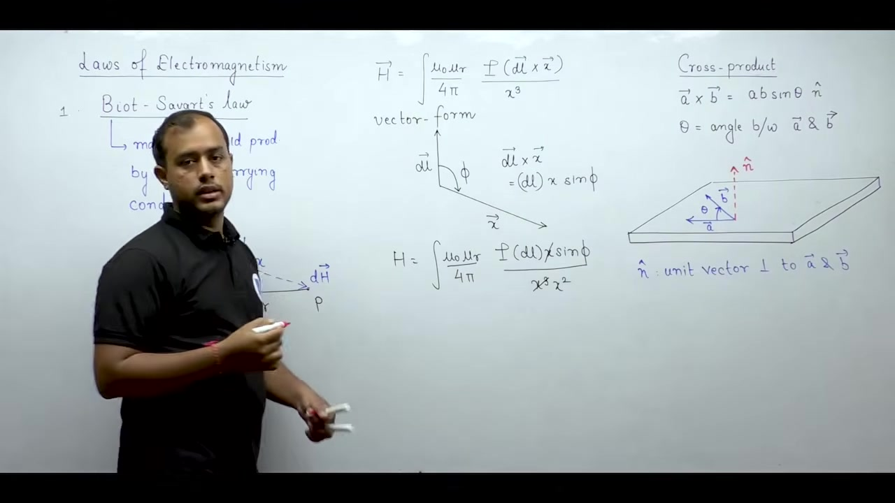

### Direction Rules for Cross Products

The direction of $\hat{n}$ is determined using the right-hand rule. 

To evaluate $\vec{a} \times \vec{b}$, align the fingers of your right hand along vector $\vec{a}$. Curl your fingers through the angle $\theta$ toward vector $\vec{b}$. The outstretched right-hand thumb points along the direction of $\hat{n}$.

## Right-Hand Thumb Rule and Field Mapping
_(15:42 - 20:42)_

### Non-Commutative Property of Vector Products

The order of vectors in a cross product matters. 

If you evaluate $\vec{a} \times \vec{b}$, your right-hand fingers curl from $\vec{a}$ to $\vec{b}$. The thumb points in a specific normal direction. Reversing the order to $\vec{b} \times \vec{a}$ flips the curl direction. The thumb now points exactly opposite:

$$\vec{a} \times \vec{b} = - (\vec{b} \times \vec{a})$$

The cross product is anti-commutative. 

Applying this rule to Biot-Savart's law shows why order is vital. The product $d\vec{l} \times \vec{x}$ points into the page. The reverse product $\vec{x} \times d\vec{l}$ points outward. Always preserve the exact cross-product order.

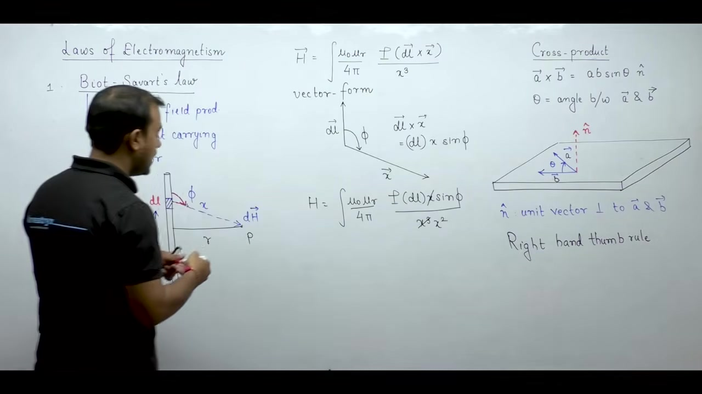

### The Right-Hand Thumb Rule for Linear Conductors

Evaluating vector cross products at every point can be slow. Biot-Savart established a practical shortcut for straight wires.

> [!info] Right-Hand Thumb Rule
> Align the outstretched thumb of your right hand along the direction of current flow. The curling fingers indicate the circular path of the magnetic field lines.

When current flows upward, the fingers enter the page on the right side. They emerge from the page on the left side.

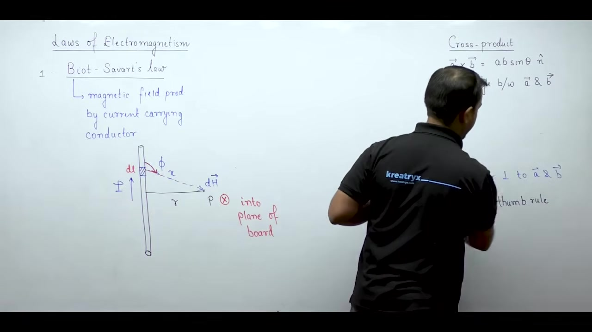

### Dot and Cross Notation for Currents

Electrical machine drawings frequently use two-dimensional cross sections. Standard symbols denote current flow perpendicular to the page.

A cross ($\otimes$) indicates current flowing into the plane of the page. This symbol represents the tail feathers of an arrow moving away from you.

A dot ($\odot$) indicates current emerging out of the plane toward you. This symbol represents the tip of an approaching arrow.

Consider a conductor carrying current out of the page ($\odot$). Point your right thumb outward toward your chest. Your fingers curl counter-clockwise around the conductor axis. The resulting magnetic field lines form concentric counter-clockwise circles.

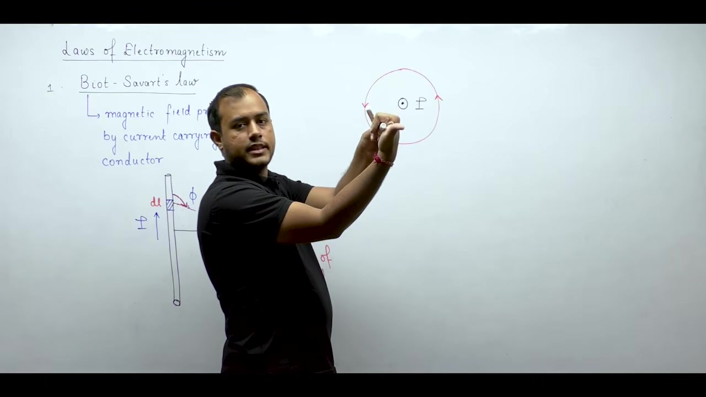

Next consider a conductor carrying current into the page ($\otimes$). Point your right thumb into the page. Your fingers now curl in a clockwise direction. The magnetic field lines form concentric clockwise circles.

## Ampere's Circuital Law and Enclosed Current
_(20:58 - 26:00)_

### Overview of Magnetostatic Relations

For a straight wire, Biot-Savart's law provides both field magnitude and direction.

The differential field magnitude satisfies:

$$dH = \frac{\mu_0 \mu_r}{4\pi} \frac{I \, dl \sin\phi}{x^2}$$

The right-hand thumb rule yields the field direction. Point your thumb along the current flow. Your fingers curl along the magnetic field vector.

While Biot-Savart's law works for any conductor shape, integration can be difficult. Ampere's circuital law offers a simpler approach for symmetric systems.

### Statement of Ampere's Law

Ampere's circuital law relates magnetic field intensity along a closed path to the current passing through it.

> [!info] Ampere's Circuital Law
> The line integral of magnetic field intensity $\vec{H}$ taken around any closed path equals the total net current enclosed by that path.

Mathematically, this relationship is expressed as:

$$\oint \vec{H} \cdot d\vec{l} = I_{\text{enclosed}}$$

The circle on the integral sign denotes integration around an unbroken closed curve. This curve is called an Amperian loop.

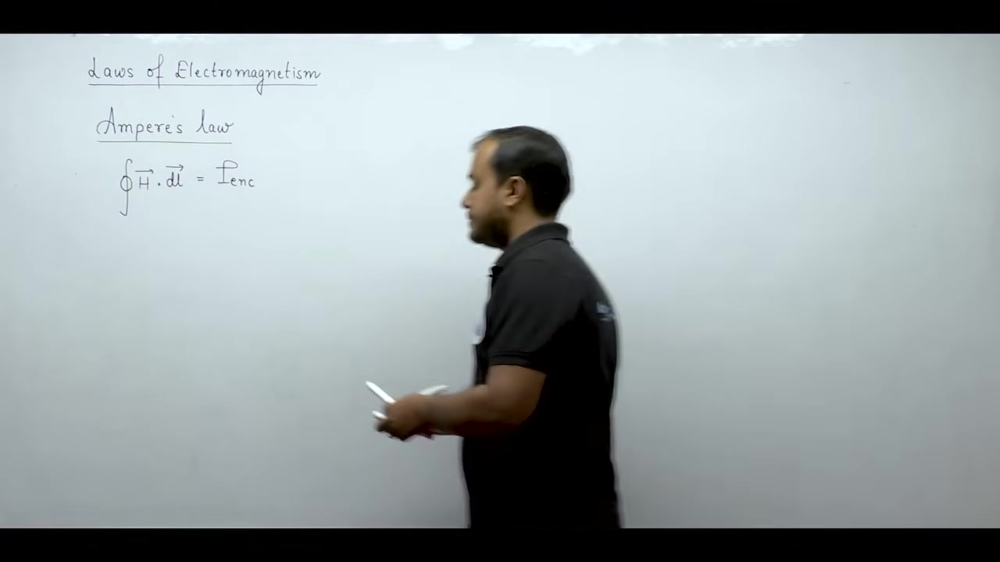

Ampere's law in magnetostatics functions like Gauss's law in electrostatics. It connects field circulation directly to its physical source.

### Determining Enclosed Current

The term $I_{\text{enclosed}}$ includes only currents that pass through the surface bounded by the Amperian loop.

Consider a closed loop containing three currents $I_1$, $I_2$, and $I_3$. Let currents $I_4$ and $I_5$ pass outside the loop. Only $I_1$, $I_2$, and $I_3$ contribute to $I_{\text{enclosed}}$. Currents $I_4$ and $I_5$ generate magnetic fields, but their field lines enter and leave the loop equally. Their net contribution to the closed-line integral is zero.

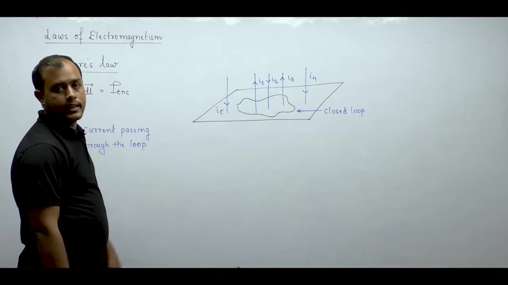

### Sign Convention for Loop Traversal

The sign of each enclosed current depends on the traversal direction of the loop.

Engineers use the right-hand rule to establish consistent signs. Curl your right-hand fingers along the path traversal direction. Your thumb points in the direction of positive current flow.

If the loop traversal assigns positive sign to upward currents:

$$I_{\text{enclosed}} = I_1 - I_2 + I_3$$

Here $I_1$ and $I_3$ flow upward, while $I_2$ flows downward. 

If you reverse the loop traversal direction, downward currents become positive:

$$I_{\text{enclosed}} = I_2 - I_1 - I_3$$

The line integral and the enclosed current change signs together, maintaining mathematical balance.

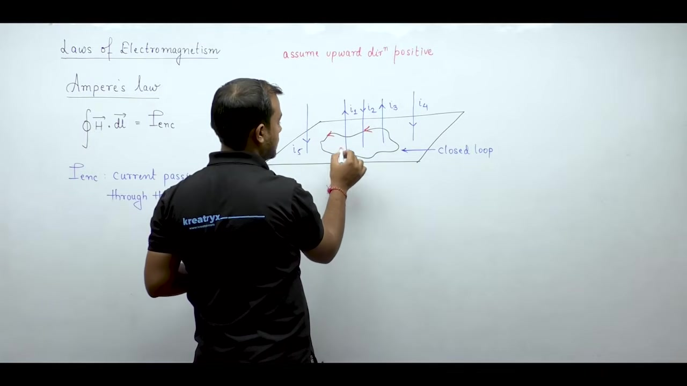

## Straight Wire Field and Solenoid Principles
_(26:02 - 31:04)_

### Magnetic Field of an Infinite Straight Conductor

Consider an infinitely long, straight conductor carrying current $I$. 

The geometry has cylindrical symmetry. The magnetic field lines form concentric circles centered on the conductor axis. 

To calculate the field intensity, choose a circular Amperian loop of radius $r$ centered on the wire. The magnetic field vector $\vec{H}$ is tangent to the circle at every point. Both $\vec{H}$ and the path element $d\vec{l}$ point in the same direction:

$$\vec{H} \cdot d\vec{l} = H \, dl \cos 0^\circ = H \, dl$$

By radial symmetry, the field magnitude $H$ remains constant everywhere along the circle:

$$\oint \vec{H} \cdot d\vec{l} = H \oint dl = H (2\pi r)$$

The loop encloses the single conductor current $I$. Applying Ampere's circuital law gives:

$$H (2\pi r) = I$$

> [!success] Field of an Infinite Straight Wire
> The magnetic field intensity at a radial distance $r$ from an infinite straight conductor is:
> $$H = \frac{I}{2\pi r}$$

The magnetic flux density in a medium with permeability $\mu$ equals:

$$B = \mu H = \frac{\mu I}{2\pi r}$$

Field intensity drops inversely with radial distance from the wire axis.

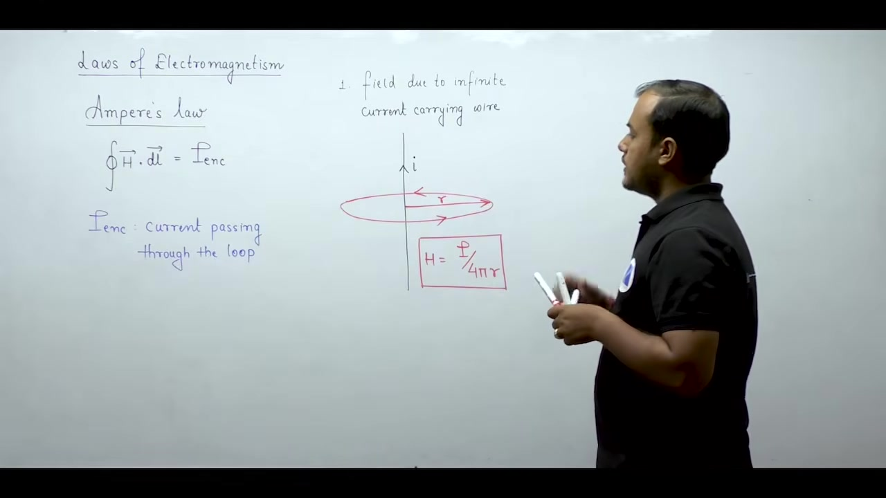

### Solenoid Geometry and Winding Structure

A single loop produces limited magnetic flux. Winding multiple turns together concentrates the magnetic field.

> [!info] Solenoid
> A solenoid is a helical coil formed by closely winding multiple turns of insulated wire over a cylindrical support.

In practical machines, coil turns lie tightly packed against one another. This compact arrangement prevents flux from leaking between turns.

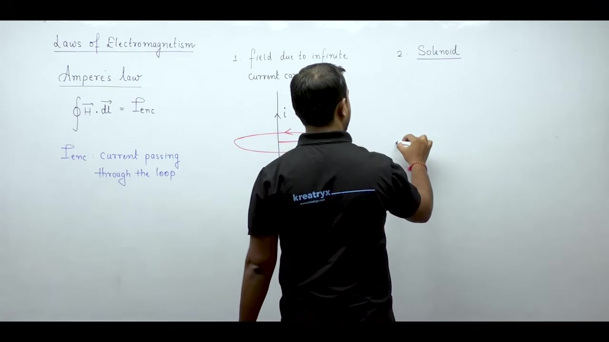

### Right-Hand Rules for Linear and Circular Geometries

The direction of the magnetic field depends on whether current flows along a line or in a circle.

For a straight conductor, point your right-hand thumb along the current. Your curling fingers map the circular magnetic field.

For a circular coil or solenoid, reverse the roles of thumb and fingers. Curl the fingers of your right hand along the winding current path. Your outstretched right-hand thumb points along the core axis in the direction of the internal magnetic field.

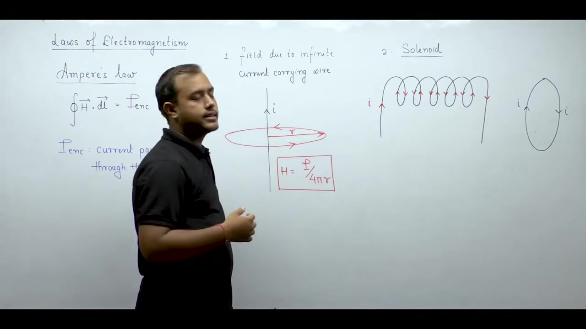

These two rules are complementary. Linear current generates circulating magnetic fields. Circulating current generates linear axial magnetic fields.

## Solenoid Field and Amperian Loop Analysis
_(31:04 - 35:58)_

### Setting Up the Rectangular Amperian Loop

To evaluate the magnetic field inside an ideal long solenoid, we construct a rectangular Amperian path $a\text{--}b\text{--}c\text{--}d$. 

The lower side $d \to c$ has length $l$ and lies along the central axis inside the core. The upper side $b \to a$ lies outside the solenoid winding. The two vertical sides $c \to b$ and $a \to d$ connect the inner and outer paths radially.

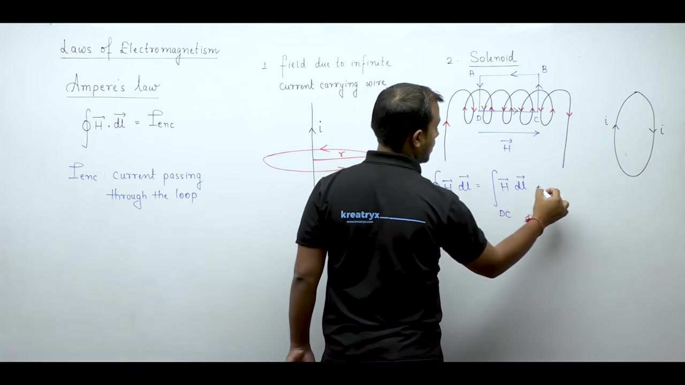

The closed-line integral splits into four separate line segments:

$$\oint_{abcd} \vec{H} \cdot d\vec{l} = \int_{d}^{c} \vec{H} \cdot d\vec{l} + \int_{c}^{b} \vec{H} \cdot d\vec{l} + \int_{b}^{a} \vec{H} \cdot d\vec{l} + \int_{a}^{d} \vec{H} \cdot d\vec{l}$$

We evaluate each segment individually.

### Evaluating the Line Integrals

Along the interior segment $d \to c$, the field vector $\vec{H}$ points parallel to the path element $d\vec{l}$. The angle between them is zero:

$$\int_{d}^{c} \vec{H} \cdot d\vec{l} = \int_{d}^{c} H \, dl \cos 0^\circ = H \int_{d}^{c} dl = H \cdot l$$

Along side $c \to b$, the path runs vertically while the field points horizontally. The angle between them is $90^\circ$:

$$\int_{c}^{b} \vec{H} \cdot d\vec{l} = \int_{c}^{b} H \, dl \cos 90^\circ = 0$$

For a tightly wound long solenoid, magnetic flux remains confined inside the core. The external magnetic field is virtually zero:

$$\vec{H}_{\text{outside}} \approx 0 \implies \int_{b}^{a} \vec{H} \cdot d\vec{l} = 0$$

Along side $a \to d$, the path is again perpendicular to the internal axial field:

$$\int_{a}^{d} \vec{H} \cdot d\vec{l} = \int_{a}^{d} H \, dl \cos 90^\circ = 0$$

Three of the four line integrals evaluate to zero.

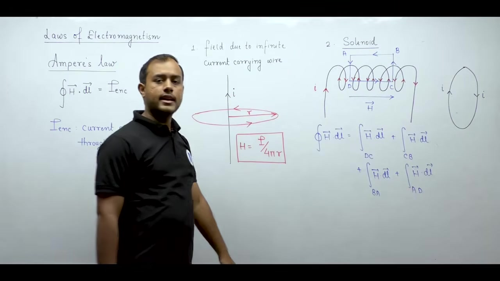

Summing all four terms leaves only the interior axial contribution:

$$\oint_{abcd} \vec{H} \cdot d\vec{l} = H \cdot l$$

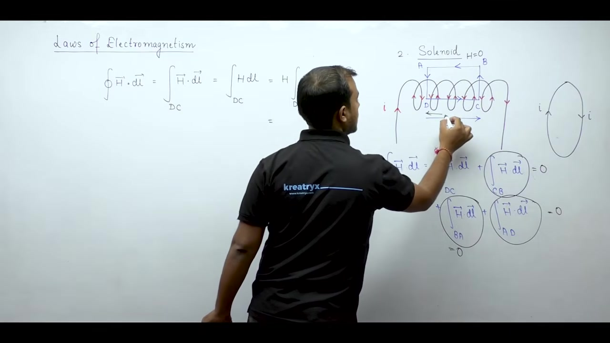

### Enclosed Turns and Turn Density

To complete Ampere's circuital law, we calculate the total current piercing the loop.

Let $n$ represent the turn density, defined as the number of turns per unit axial length:

$$n = \frac{N_{\text{total}}}{L}$$

Over the Amperian loop length $l$, the total number of turns enclosed by the path is:

$$N = n \times l$$

Each turn threads through the loop surface and contributes current to the total circulation.

## Solenoid Field Formula and Magnetic Flux
_(36:00 - 43:04)_

### Enclosed Current in the Solenoid Loop

Consider the rectangular Amperian path of length $l$ threading the solenoid. 

The turn density is $n$ turns per meter. The segment of length $l$ cuts across $n \cdot l$ turns. Each turn carries an electric current $I$.

Every turn pierces the loop surface in the same direction. The total enclosed current is the algebraic sum over all enclosed turns:

$$I_{\text{enclosed}} = (n \cdot l) \times I$$

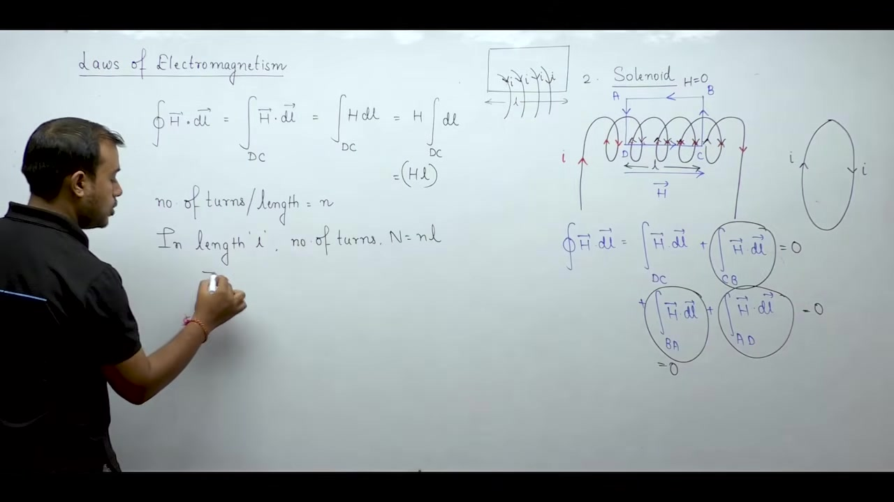

### Derivation of Internal Magnetic Field

We now combine the line integral with the enclosed current:

$$H \cdot l = n \cdot l \cdot I$$

The segment length $l$ cancels from both sides of the equation.

> [!success] Solenoid Field Intensity
> The internal magnetic field intensity of an ideal long solenoid is:
> $$H = n I$$

Here $n$ is the number of turns per unit length, and $I$ is the winding current.

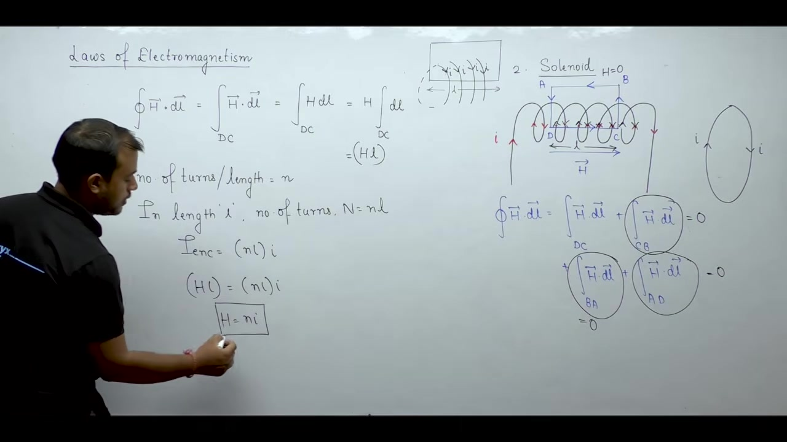

The internal magnetic flux density for a core with permeability $\mu$ is:

$$B = \mu H = \mu_0 \mu_r n I$$

The magnetic field inside an ideal solenoid is uniform and independent of the radial position.

### Transition to Electromagnetic Induction

Magnetostatics governs constant magnetic fields produced by steady direct currents. 

Operating electrical machines rely on changing fields. Time-varying magnetic fields induce electric voltages and drive currents through machine windings. This bridge between magnetism and electricity is electromagnetic induction.

### Physical Definition of Magnetic Flux

The term flux means flow. In fluid mechanics, flux describes the volume of water moving through a pipe.

In electromagnetism, magnetic flux describes the passage of magnetic field lines through an orientable surface area:

$$\Phi = \int \vec{B} \cdot d\vec{A}$$

For a flat surface of area $A$ perpendicular to a uniform flux density $B$:

$$\Phi = B \times A$$

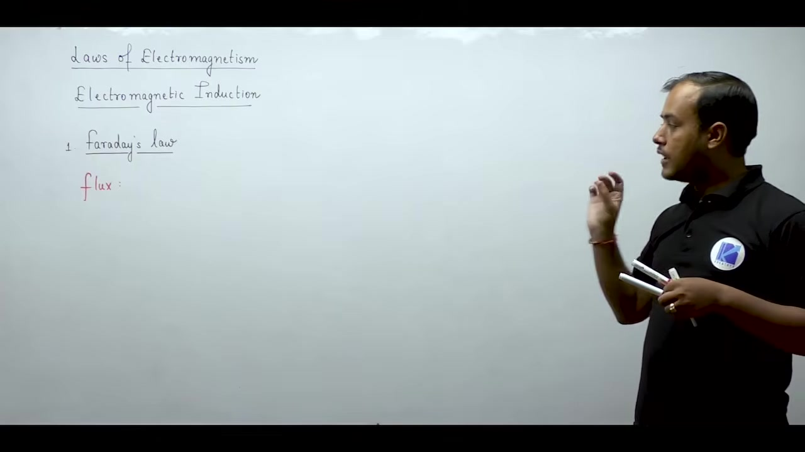

Many informal explanations equate magnetic flux directly to the number of field lines. That wording is mathematically incorrect. Field lines are unitless geometric markers. Magnetic flux is a measurable physical quantity with the SI unit of weber ($\text{Wb}$):

$$1 \text{ Wb} = 1 \text{ T}\cdot\text{m}^2 = 1 \text{ V}\cdot\text{s}$$

Magnetic flux is proportional to the density of field lines, but not an integer count of lines.

### Qualitative Statement of Faraday's Law

Michael Faraday discovered that static magnetic flux produces no electric voltage. Voltage appears only when the magnetic flux linking a circuit changes.

> [!info] Faraday's Discovery
> When the magnetic flux passing through a conducting loop varies with time, an electromotive force (EMF) is induced in the loop.

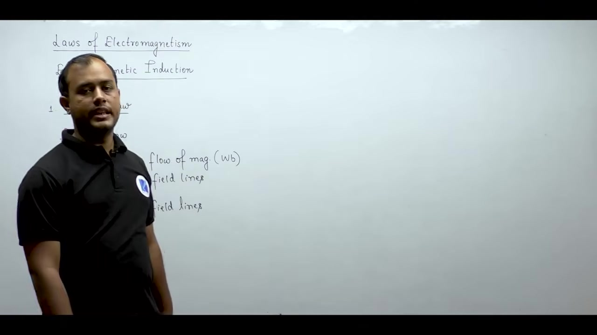

If magnetic flux remains strictly constant over time, no electromotive force is produced.

## Flux Linkage and Lenz's Law
_(43:07 - 49:12)_

### Concept of Flux Linkage

In a multi-turn coil, magnetic flux threads through multiple loops of wire simultaneously.

> [!info] Flux Linkage
> Flux linkage $\lambda$ is the total magnetic flux passing through all $N$ series turns of an electrical coil.

Assuming every turn encloses the same core flux $\phi$, the flux linkage is:

$$\lambda = N \phi$$

The SI unit of flux linkage is weber-turns ($\text{Wb}\cdot\text{turns}$).

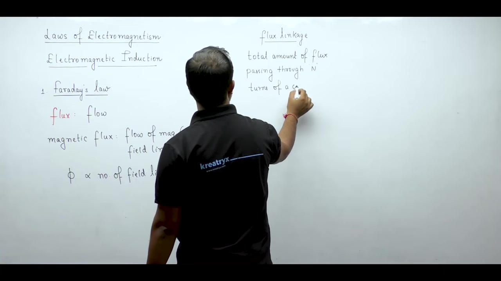

### Mathematical Formulation of Faraday's Law

Faraday's law states that induced electromotive force equals the time rate of change of flux linkage.

For a coil with constant turn count $N$, the induced voltage is:

$$e = \frac{d\lambda}{dt} = \frac{d(N\phi)}{dt} = N \frac{d\phi}{dt}$$

If the core flux is constant in time ($\frac{d\phi}{dt} = 0$), the induced EMF is zero. Voltage develops only when magnetic flux changes dynamically.

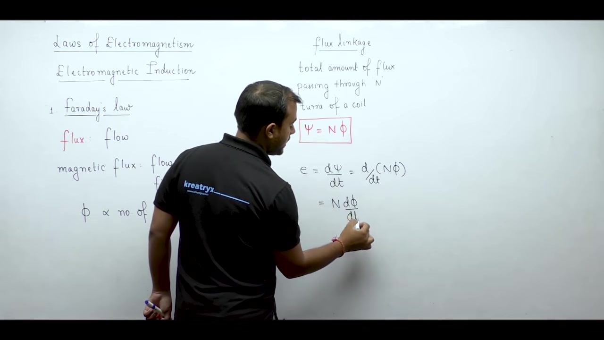

### Necessary Conditions for Electromagnetic Induction

An induced electromotive force requires three physical conditions.

First, a magnetic field must be present in the region. Second, an electrical conductor or coil must occupy that space. Third, there must be relative variation between the conductor and the magnetic field.

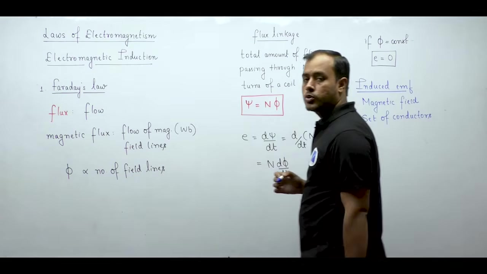

This variation occurs in two ways. Time variation happens when the field magnitude changes with time in stationary coils. Space variation happens when a conductor moves physically through a spatial field distribution.

### Lenz's Law and Polarity Determination

Faraday's rate equation yields the magnitude of induced EMF. But it does not specify electrical polarity.

Heinrich Lenz formulated the physical rule that governs polarity.

> [!info] Lenz's Law
> The direction of an induced electromotive force always opposes the physical change that produces it.

Lenz incorporated a negative sign into Faraday's equation:

$$e = -N \frac{d\phi}{dt}$$

The minus sign shows that induced effects counteract external changes. 

An electrical inductor illustrates this behavior. When winding current tries to rise, the expanding flux induces a counter-EMF that opposes the current increase. When current falls, the collapsing flux induces a forward EMF that opposes the current decrease.

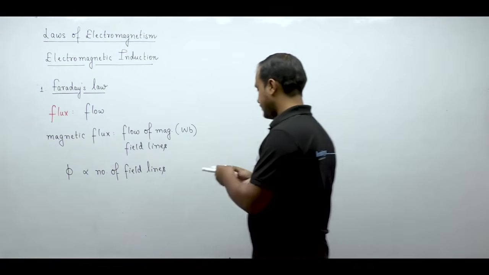

## Practical Application of Lenz's Law
_(49:14 - 53:59)_

### Step-by-Step Polarity Determination

Determining induced voltage polarity requires a systematic physical procedure.

Consider a coil wound on a ferromagnetic core leg. A time-varying external flux $\phi_{\text{ext}}(t)$ enters downward through the core.

First, determine the required direction of induced magnetic flux. Lenz's law dictates that the induced flux must counteract the external flux change. If the external flux points downward, the induced flux $\phi_{\text{ind}}$ must point upward.

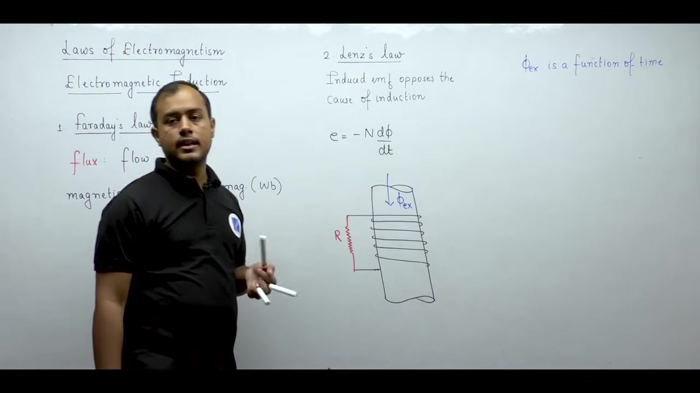

Second, find the direction of the circulating induced current. Use the right-hand rule for coils. Point your right thumb upward in the direction of the desired induced flux. Your curling fingers show how current must flow through the coil turns. 

The current travels to the right across the visible front conductors. It flows to the left along the hidden rear conductors.

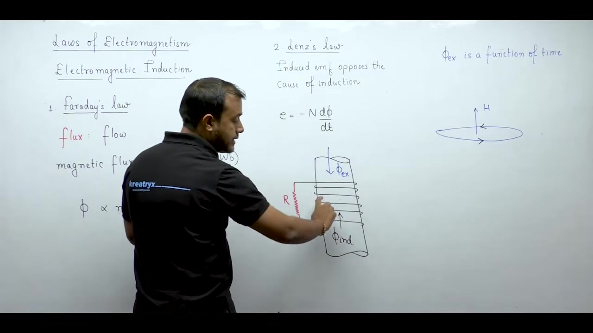

### Terminal Polarity and Hypothetical Load

To identify terminal voltage polarity, connect a hypothetical load resistor $R$ across the coil ends. This resistor is not an actual component. It serves as a visual aid to track potential drops.

Current flows out of the coil and enters the external resistor. In any passive resistor, current enters at the positive potential ($+$) and exits at the negative potential ($-$).

The coil acts as an electrical generator. Inside the coil, current travels from the negative terminal to the positive terminal. At the external terminals, current leaves the positive terminal.

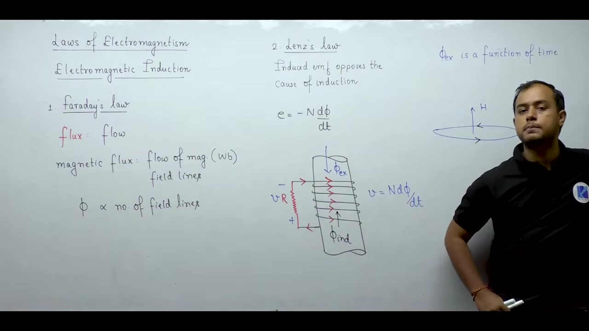

### Avoiding the Double-Negative Trap

Engineers must avoid applying Lenz's law twice.

If you analyze physical opposition to mark plus and minus terminals on a diagram, the polarity is already fixed. The terminal voltage magnitude is simply:

$$V = N \frac{d\phi}{dt}$$

Do not reinsert the negative sign from Faraday's rate equation into circuit equations after establishing terminal polarity. Doing so inverts the calculated voltage and creates sign errors.

### Closed-Loop Continuity of Magnetic Flux

Magnetic flux lines always form continuous closed paths:

$$\oint \vec{B} \cdot d\vec{A} = 0$$

Magnetic flux never exists as an open-ended line. In transformers and electrical machines, flux that leaves one core leg must return through outer yokes and limbs to close its loop.

## Dual-Coil Polarity and Statically Induced EMF
_(54:02 - 59:35)_

### Analysis of a Closed Two-Limb Magnetic Core

Transformers use closed ferromagnetic cores linking two or more windings. 

Consider a rectangular magnetic core with two vertical limbs. A time-varying flux circulates through the closed loop. In the left limb, external flux flows upward. The flux turns through the top yoke and flows downward through the right limb.

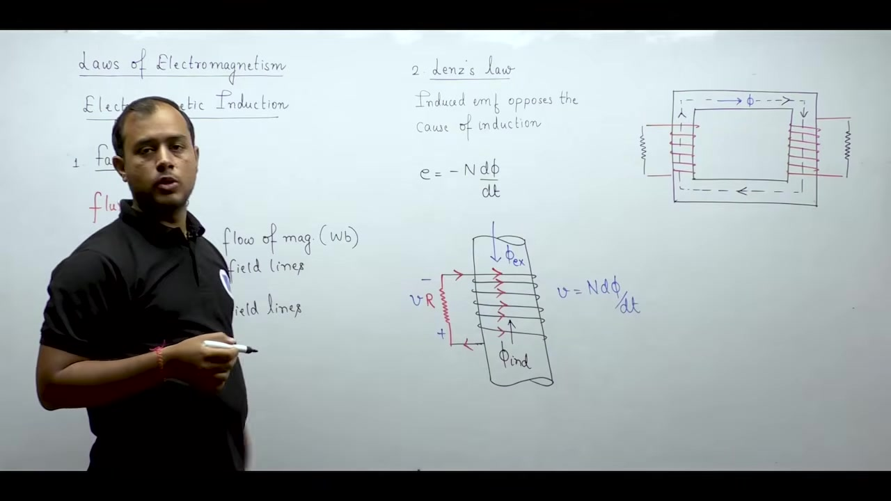

Both coils experience changing flux. We determine the induced polarity of each winding separately.

### Polarity Assignment for Left and Right Coils

In the left coil, external flux travels upward. By Lenz's law, the coil establishes an opposing downward flux:

$$\phi_{\text{ind, left}} \downarrow$$

Point your right thumb downward along the core limb. Your fingers show that current flows to the left along the front conductors. Current leaves the bottom terminal. Connect a hypothetical load resistor. The bottom terminal becomes positive ($+$) and the top terminal becomes negative ($-$).

In the right coil, external flux travels downward. Lenz's law demands an opposing upward induced flux:

$$\phi_{\text{ind, right}} \uparrow$$

Point your right thumb upward. Your curling fingers show that current flows to the right along the front conductors. Current leaves the top terminal. The top terminal becomes positive ($+$) and the bottom terminal becomes negative ($-$).

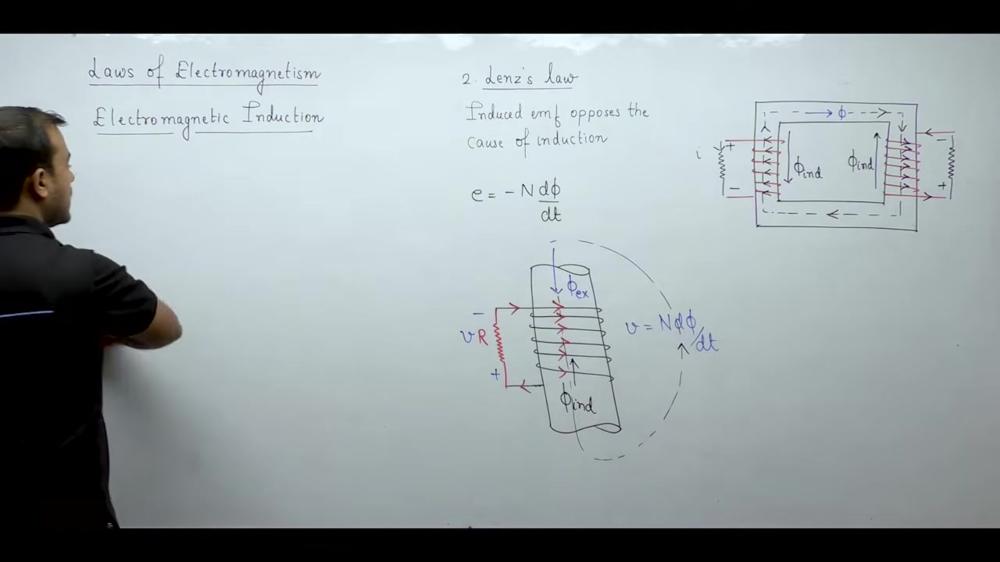

### Formal Rules for Polarity Determination

Engineers summarize this procedure in four steps:

1. Assume the induced flux opposes the external flux change.
2. Use the right-hand coil rule to find winding current direction.
3. Connect a hypothetical resistor across terminals. The terminal that exports current is positive.
4. Compute voltage magnitude with Faraday's law ($V = N \frac{d\phi}{dt}$) without reinserting a minus sign.

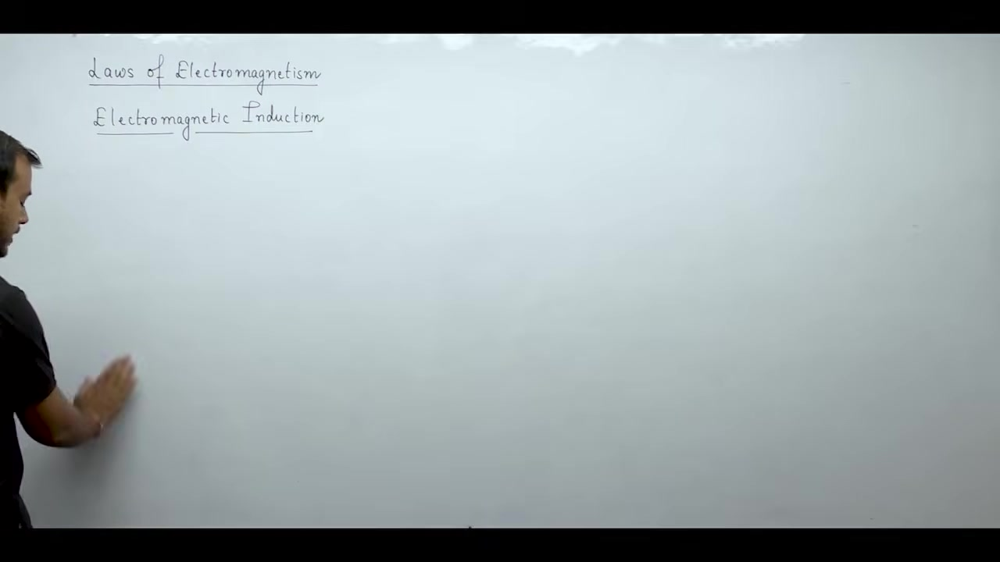

### Statically Induced EMF

Electromotive forces divide into two physical categories based on how the flux changes.

> [!info] Statically Induced EMF
> Statically induced EMF is an electromotive force produced by time variation of a magnetic field in stationary conductors without mechanical motion.

Because transformers contain no moving parts, their induced voltage is purely static:

$$e_{\text{static}} = N \frac{d\phi}{dt}$$

The core cross section remains stationary. The changing voltage arises entirely from time variation of the magnetic flux density.

## Transformer EMF, Dynamic EMF, and Leakage Limitations
_(59:35 - 64:37)_

### Transformer EMF (Statically Induced EMF)

Statically induced EMF is commonly called transformer EMF. In this setup, physical conductors remain at rest. 

Recall Faraday's law of induction:

$$e = N \frac{d\phi}{dt}$$

Magnetic flux equals the product of magnetic flux density and cross-sectional area:

$$\phi = B A$$

Substitute flux into the induction formula:

$$e = N \frac{d(B A)}{dt}$$

In a transformer, the core geometry and coil cross section are fixed. Area $A$ does not vary with time. Only the magnetic flux density $B$ varies with time. Pull area $A$ outside the time derivative:

> [!success] Transformer EMF Formula
> $$e = N A \frac{dB}{dt}$$

This voltage is transformer EMF. Changing magnetic flux density generates this EMF with zero mechanical motion.

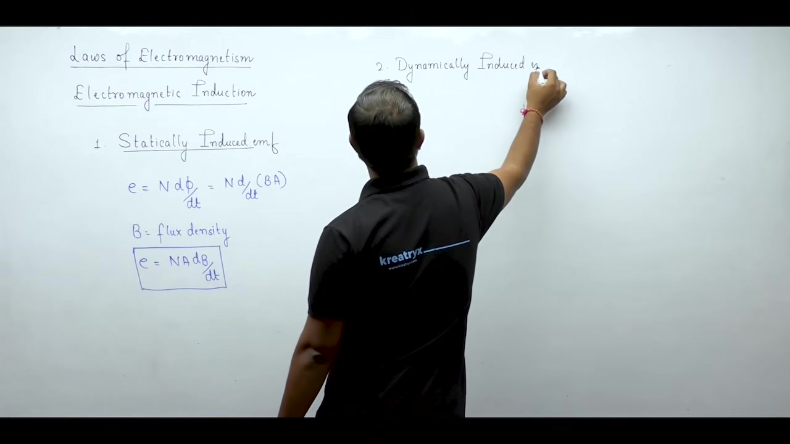

### Dynamically Induced EMF

Dynamically induced EMF appears when conductors move relative to a magnetic field. 

> [!info] Dynamically Induced EMF
> Dynamically induced EMF is the voltage created by relative motion or spatial variation between conductors and magnetic flux.

We evaluate Faraday's law again for this moving system:

$$e = N \frac{d(B A)}{dt}$$

In many rotating machines, magnetic flux density $B$ stays constant in time. But the effective coil area exposed to flux changes continuously as the rotor turns. Now flux density $B$ comes outside the derivative:

$$e = N B \frac{dA}{dt}$$

This voltage is dynamically induced EMF. Rotating electrical machines produce this type of EMF. Transformers use static EMF, while rotating machines rely on dynamic EMF.

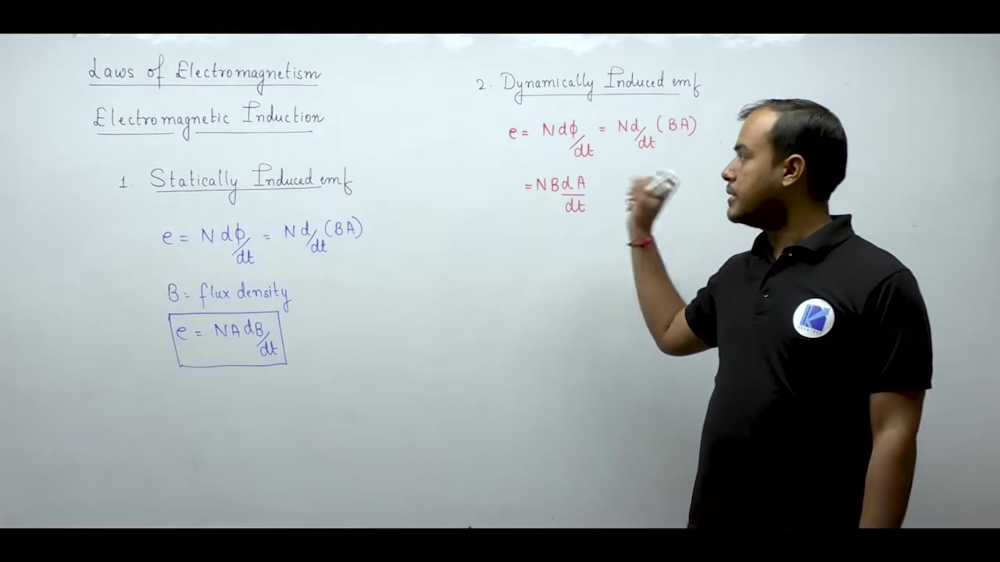

### Core Assumption and Limitation of Faraday's Law

Faraday's law assumes that all magnetic flux links every turn of the coil equally. 

Earlier we defined total flux linkage:

$$\lambda = N \phi$$

This equation treats flux through turn 1 as identical to flux through turn $N$. It assumes zero magnetic leakage.

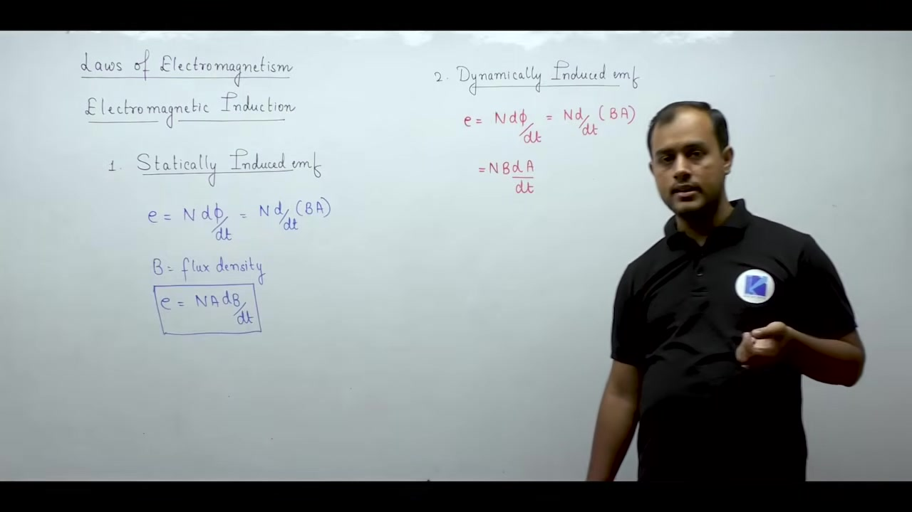

In practice, some flux escapes into surrounding air. Suppose $1\text{ Wb}$ passes through the first turn. Some flux may leak out before reaching the next turn. Then only $0.9\text{ Wb}$ passes through the second turn. Simple Faraday's law cannot apply directly when flux varies across turns.

We call the lost flux leakage flux. Think of two pipes joined together. If the joint is loose, water leaks out. The flow leaving the second pipe is less than the flow entering the first pipe. Magnetic flux behaves similarly in open geometries.

This equal-flux assumption holds only when coils are wound very tightly. Tight packing leaves little room for flux to escape between adjacent turns.

## Tight Winding Assumption, Practice Problem, and Chapter Summary
_(64:37 - 68:16)_

### Tight Winding Condition

Faraday's law assumes uniform flux across all turns. This assumption is valid only if coil turns are tightly wound. 

When turns are spaced far apart, flux escapes into the air gaps between adjacent turns. Tight winding ensures that almost all magnetic lines link every turn in the winding.

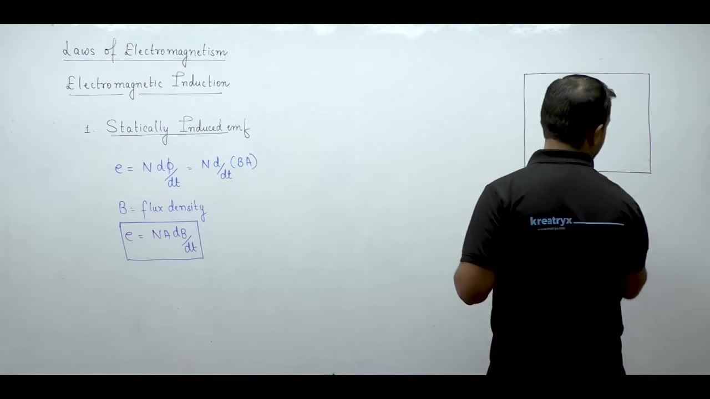

### Practice Problem: Induced Voltage in a Core Winding

We set up a comprehensive problem applying the induction formulas.

> [!example] Problem
> A coil of wire wraps around a ferromagnetic core. The core flux varies according to:
> 
> $$\phi(t) = 0.05 \sin(377 t) \text{ Wb}$$
> 
> The coil contains $N = 100\text{ turns}$. Assume all magnetic flux stays strictly inside the core. Find the magnitude and polarity of the induced voltage across terminals $A\text{-}B$.

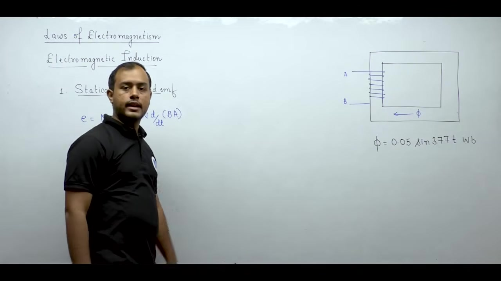

#### Voltage Magnitude Calculation

Calculate the induced voltage magnitude using Faraday's law:

$$e(t) = N \left|\frac{d\phi}{dt}\right|$$

Differentiate the sinusoidal flux expression with respect to time:

$$\frac{d\phi}{dt} = 0.05 \times 377 \cos(377 t) \text{ Wb/s}$$

Multiply by the number of turns:

$$
\begin{aligned}
e(t) &= 100 \times [0.05 \times 377 \cos(377 t)] \\
&= 1885 \cos(377 t) \text{ V}
\end{aligned}
$$

The peak voltage induced across the terminals reaches $1885\text{ V}$. The terminal polarity alternates at the source frequency of $60\text{ Hz}$ ($\omega = 377\text{ rad/s}$). 

When $\frac{d\phi}{dt} > 0$, core flux grows upward. The induced current must circulate to produce a downward counter-flux. We will analyze the full polarity steps in the next lecture.

### Summary of Electromagnetic Laws

This lecture established the foundations of electromagnetic field analysis for electrical machines:

1. **Biot-Savart Law**: Relates steady currents in elemental conductors to magnetic field intensity $d\vec{H}$ and flux density $d\vec{B}$.
2. **Right-Hand Rules**: Determine field orientation around straight line currents and coil loops.
3. **Ampere's Circuital Law**: Computes field intensity along closed loops, giving $H = \frac{I}{2\pi r}$ for long wires and $H = \frac{N I}{l}$ for solenoids.
4. **Faraday's Law of Induction**: Quantifies induced EMF proportional to the time rate of change of flux linkages.
5. **Lenz's Law**: Dictates that induced currents oppose the original change in flux, establishing terminal polarities.
6. **EMF Classification**: Distinguishes statically induced transformer EMF ($e = N A \frac{dB}{dt}$) from dynamically induced rotational EMF ($e = N B \frac{dA}{dt}$).

The subsequent lecture extends these laws to motional EMF and electromechanical torque production.

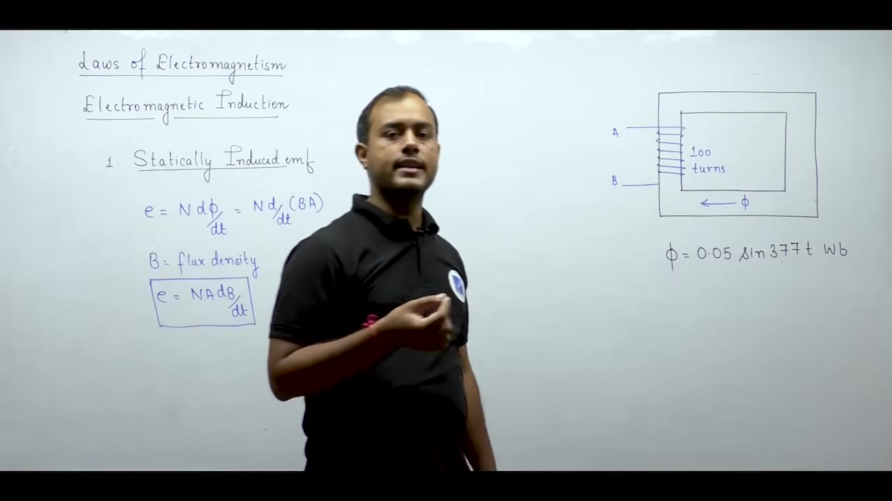

---

## Summary and Key Takeaways

- Biot-Savart's law gives the differential field from a current element as $d\vec{H} = \frac{I \, d\vec{l} \times \hat{a}_r}{4\pi r^2}$.
- Ampere's circuital law $\oint \vec{H} \cdot d\vec{l} = I_{\text{enclosed}}$ yields magnetic field intensity $H = \frac{I}{2\pi r}$ for an infinitely long straight wire.
- An ideal solenoid with turn density $n = N/l$ produces a uniform axial field $H = n I$ inside its core.
- Total flux linkage across $N$ identical turns is $\lambda = N \phi$, expressed in weber-turns.
- Faraday's law establishes that induced electromotive force magnitude equals the rate of change of flux linkage, $e = N \left|\frac{d\phi}{dt}\right|$.
- Lenz's law specifies that induced current circulates to create flux opposing the change in external flux.
- Statically induced transformer EMF satisfies $e = N A \frac{dB}{dt}$, whereas dynamically induced rotational EMF satisfies $e = N B \frac{dA}{dt}$.
- The standard induction equation assumes zero magnetic leakage, which requires tightly wound turns where equal flux links every turn.

---

[← Lec 003: Electrical Materials 2](Lecture_003_Electrical_Materials_2.md) | [🏠 Index](00_yt_study_guide.md) | [Lec 005: Laws of Electromagnetism 2 →](Lecture_005_Laws_of_Electromagnetism_2.md)
