# Electrical Machines | Lec 5 | Laws of Electromagnetism-2 | GATE Electrical Engineering | CRACK GATE

- **Source**: https://www.youtube.com/watch?v=Znplou_7ttw
- **Duration**: 01:03:20
- **Compiled**: 2026-09-16

---

## Overview

This lecture examines mechanical force on current-carrying conductors and voltage generation through conductor motion. It develops the Lorentz force equation to compute forces between parallel conductors. The discussion then derives motional electromotive force from the equilibrium between magnetic and electrostatic forces inside moving conductors. Finally, the lecture introduces the dot convention to establish polarity relations in mutually coupled magnetic circuits.

## Contents

- [[#Review of Induction and Solution of the Core-Winding Problem|Review of Induction and Solution of the Core-Winding Problem]]
- [[#Lorentz Force Law and Forces on Current Elements|Lorentz Force Law and Forces on Current Elements]]
- [[#Magnetic Force Direction and Interaction Between Parallel Conductors|Magnetic Force Direction and Interaction Between Parallel Conductors]]
- [[#Force per Unit Length and Repulsion of Opposing Currents|Force per Unit Length and Repulsion of Opposing Currents]]
- [[#Worked Example on Conductor Force and Introduction to Motional EMF|Worked Example on Conductor Force and Introduction to Motional EMF]]
- [[#Motional EMF and Internal Charge Separation|Motional EMF and Internal Charge Separation]]
- [[#Equilibrium Condition and the Motional EMF Integral|Equilibrium Condition and the Motional EMF Integral]]
- [[#Worked Example on Motional EMF and Inclined Conductors|Worked Example on Motional EMF and Inclined Conductors]]
- [[#Dot Convention Foundations and Physical Placement Rules|Dot Convention Foundations and Physical Placement Rules]]
- [[#Systematic Dot Placement Rules and Core Geometry Examples|Systematic Dot Placement Rules and Core Geometry Examples]]
- [[#Dot Convention Significance and Electromagnetic Foundations Summary|Dot Convention Significance and Electromagnetic Foundations Summary]]

---

## Review of Induction and Solution of the Core-Winding Problem
_(00:13 - 04:58)_

### Electromagnetic Principles Review

We first review the primary field and induction principles from the previous lecture.

Biot-Savart's law and Ampere's circuital law establish magnetic field intensity from currents. We apply two right-hand rules:

1. **Straight Conductor**: Point your right thumb along the current flow. Your curling fingers map the circulating magnetic field lines.
2. **Circular Coil**: Curl your right fingers along the loop current. Your thumb points along the core magnetic field.

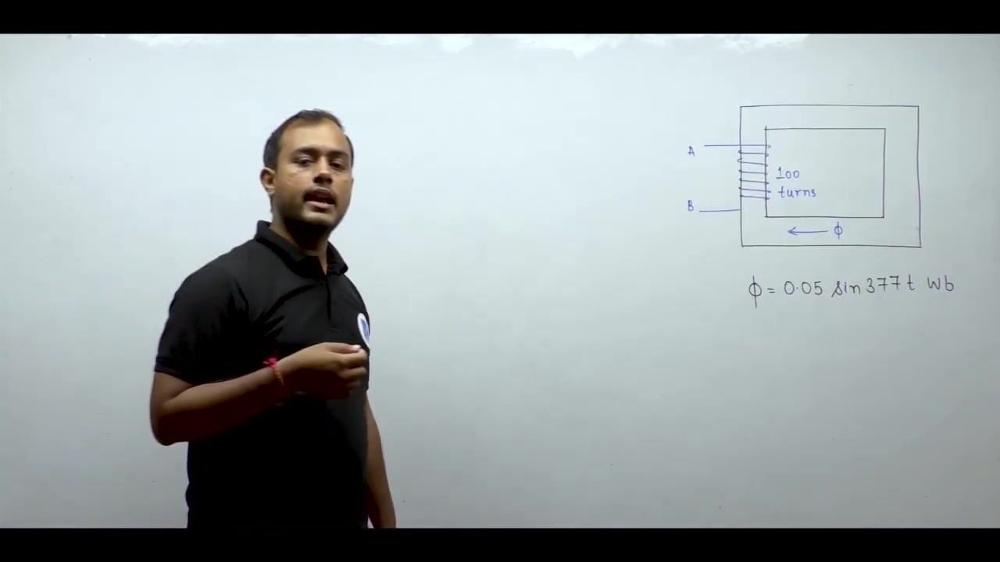

Faraday's law states that induced EMF equals the time rate of change of flux linkages. Lenz's law dictates that induced effects oppose the cause that creates them.

### Solution of the Core-Winding Practice Problem

We now solve the core-winding problem assigned at the end of Lecture 4.

> [!example] Problem
> A coil with $N = 100\text{ turns}$ is wrapped around a magnetic core limb. The time-varying core flux is:
> 
> $$\phi(t) = 0.05 \sin(377 t) \text{ Wb}$$
> 
> Find the induced voltage across terminals $A\text{-}B$ and identify the terminal polarities.

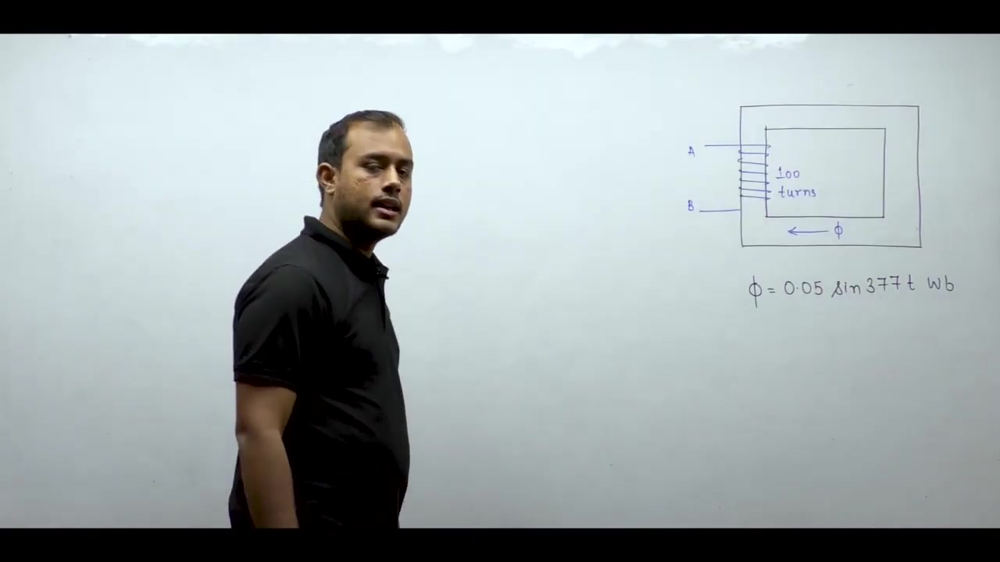

#### Polarity Determination via Lenz's Law

Magnetic flux circulates in a closed path around the rectangular core. 

Assume the flux flows clockwise during the positive half-cycle. Inside the left limb, this external flux points upward. By Lenz's law, the winding sets up an induced flux opposing this upward change:

$$\phi_{\text{ind}} \downarrow$$

Point your right thumb downward to match the induced flux. Your fingers show that current flows from right to left along the front conductors. 

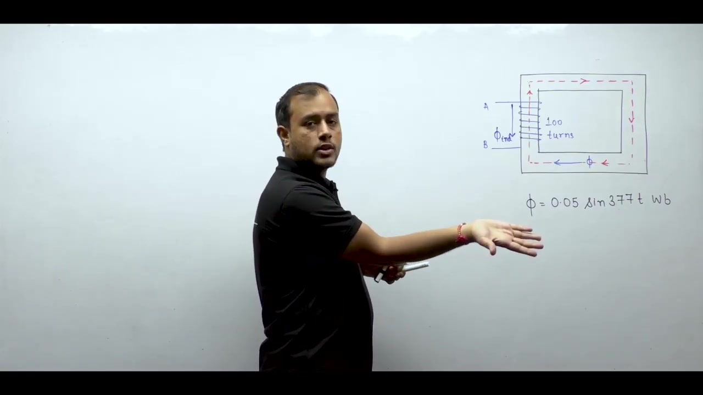

Current exits at terminal $A$ and enters at terminal $B$. Imagine a load resistor connected across the terminals. Current flows out of terminal $A$ through the external load. So terminal $A$ is positive ($+$) and terminal $B$ is negative ($-$).

#### Magnitude Calculation via Faraday's Law

Now compute the induced voltage magnitude. We omit the negative sign because we already established polarities:

$$e(t) = N \left|\frac{d\phi}{dt}\right|$$

Substitute $N = 100$ and the flux expression:

$$\begin{aligned}
e(t) &= 100 \times \frac{d}{dt}[0.05 \sin(377 t)] \\
&= 100 \times [0.05 \times 377 \cos(377 t)] \\
&= 1885 \cos(377 t) \text{ V}
\end{aligned}$$

> [!success] Terminal Voltage Result
> The induced voltage across terminals $A\text{-}B$ is:
> $$e_{AB}(t) = 1885 \cos(377 t) \text{ V}$$
> Terminal $A$ is positive with respect to terminal $B$ during this interval.

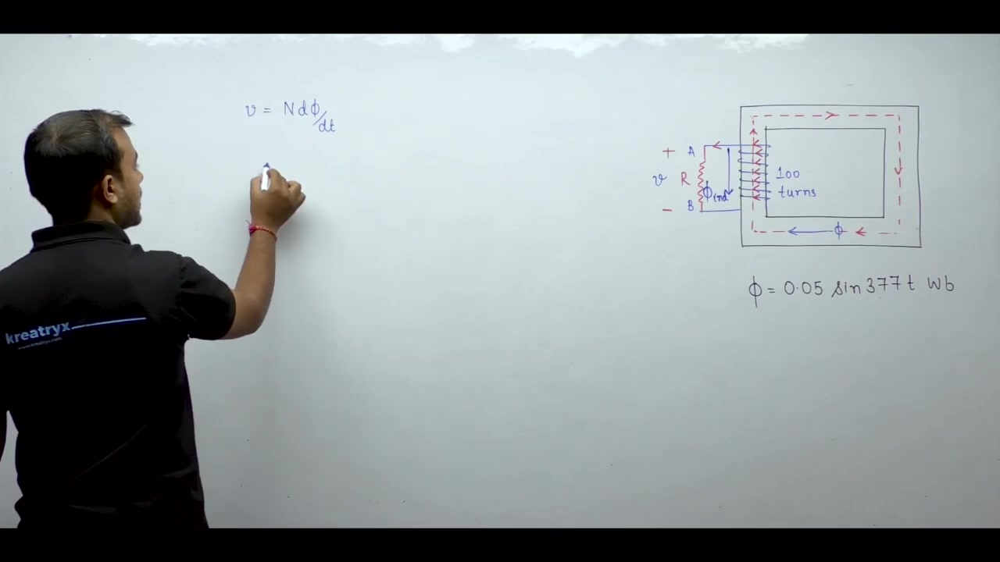

### Application to Transformer Windings

This polarity method forms the operational core of all transformers. 

In transformers, alternating core flux links both primary and secondary windings. Determining terminal polarities with Lenz's law reveals whether windings add or oppose. Mastering this step is essential before studying dot conventions and transformer connections.

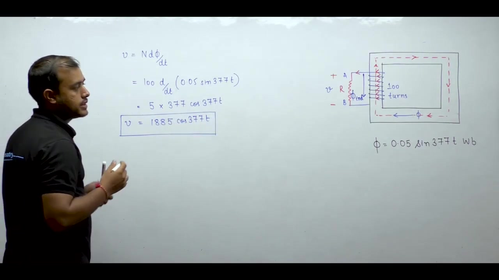

## Lorentz Force Law and Forces on Current Elements
_(05:03 - 10:22)_

### Lorentz Force on Moving Charges

When an electric charge moves through a magnetic field, the field exerts a mechanical force upon it.

Consider a charge $q$ moving with velocity $\vec{v}$ through magnetic flux density $\vec{B}$. The magnetic force is:

$$\vec{F}_m = q(\vec{v} \times \vec{B})$$

We express this interaction using magnetic flux density $\vec{B}$ rather than magnetic field intensity $\vec{H}$. In diagrams, crosses denote flux directed into the page. Dots denote flux directed out of the page.

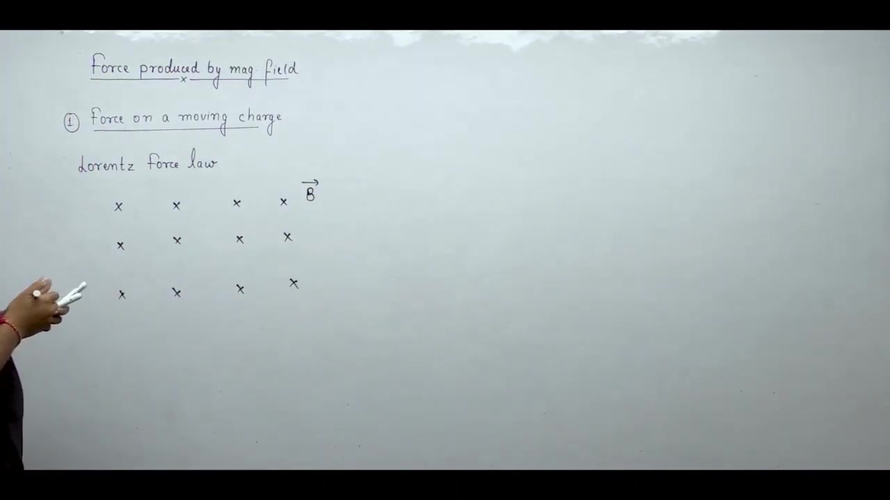

If an electric field $\vec{E}$ also exists, it exerts an electrostatic force $q\vec{E}$. The total force combines both effects.

> [!info] Lorentz Force Law
> The total electromagnetic force acting on an electric charge $q$ moving with velocity $\vec{v}$ is:
> 
> $$\vec{F} = q\vec{E} + q(\vec{v} \times \vec{B})$$

### Distinction Between Electrostatics and Magnetism

A common misconception states that electrostatics only studies stationary charges. 

In reality, electrostatics encompasses electric field properties possessed by charges at rest or in motion. An electric field exerts force $q\vec{E}$ on a charge regardless of its velocity. 

In contrast, magnetic forces act only on moving charges. When velocity $\vec{v}$ is zero, the magnetic force vanishes completely.

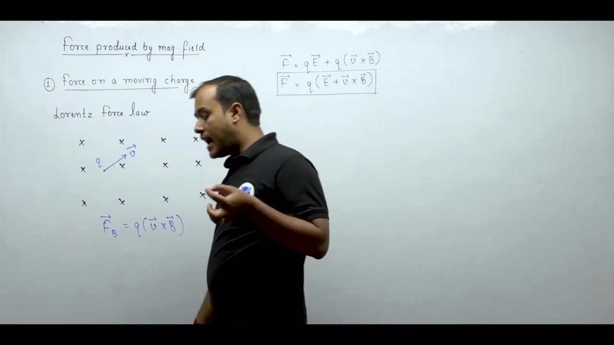

### Force on a Current-Carrying Conductor

We now extend this particle force to electrical conductors carrying continuous currents.

Consider a small conductor segment carrying electric current $I$. As established in Biot-Savart's law, current $I$ is a scalar. We define a differential vector element $d\vec{l}$ directed along the current path.

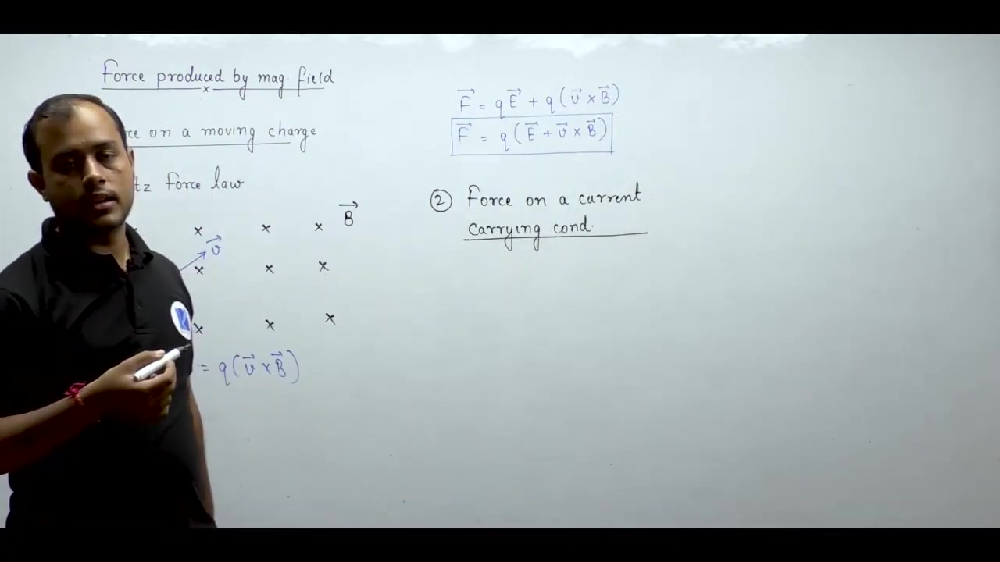

Inside the conductor, mobile charge carriers flow under an internal electric field. We define their transport speed as drift velocity.

> [!info] Drift Velocity
> Drift velocity $\vec{v}_d$ is the net average velocity acquired by electric charges inside a conductor under an electric field.

Consider a differential charge packet $dq$ moving at drift velocity $\vec{v}_d$. The magnetic force on this packet is:

$$d\vec{F} = dq (\vec{v}_d \times \vec{B})$$

Express velocity as the displacement rate of the charge packet, $\vec{v}_d = \frac{d\vec{l}}{dt}$:

$$d\vec{F} = dq \left(\frac{d\vec{l}}{dt} \times \vec{B}\right) = \left(\frac{dq}{dt} d\vec{l}\right) \times \vec{B}$$

Because electric current is the time rate of charge flow ($I = \frac{dq}{dt}$), the product simplifies directly:

> [!success] Force on a Current Element
> $$d\vec{F} = I (d\vec{l} \times \vec{B})$$

This fundamental equation governs force production in all electric motors.

## Magnetic Force Direction and Interaction Between Parallel Conductors
_(10:31 - 17:20)_

### Evaluating Force Direction with Vector Cross Products

We evaluate the direction of mechanical force using the vector cross product:

$$d\vec{F} = I (d\vec{l} \times \vec{B})$$

Consider a vertical conductor carrying current in an inward magnetic field. 

Align the fingers of your right hand along current element $d\vec{l}$. Curl your fingers inward along flux density $\vec{B}$. Your thumb points directly to the left. The magnetic field exerts a leftward force on this conductor.

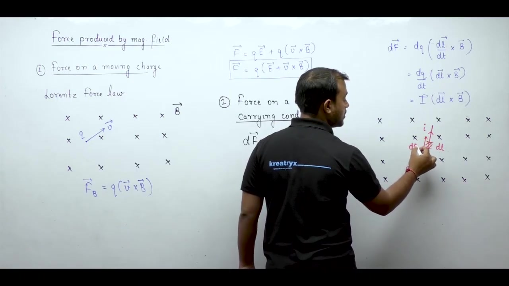

### Interaction Between Two Parallel Conductors

We analyze the interaction between two parallel conductors separated by distance $d$.

> [!example] Problem
> Determine the magnitude and direction of force per unit length between two straight parallel conductors separated by distance $d$:
> 1. When carrying currents in the same direction.
> 2. When carrying currents in opposite directions.

### Case 1: Currents in the Same Direction

Assume conductors 1 and 2 carry currents $I_1$ and $I_2$ directed outward from the page.

We define Cartesian axes where $+x$ points out of the page and $+z$ points upward. The conductors lie separated along the horizontal $y$-axis.

#### Field and Force on Conductor 2

Current $I_1$ produces counter-clockwise circular magnetic field lines around conductor 1. At the position of conductor 2, this field points upward:

$$\vec{B}_1 = \frac{\mu_0 I_1}{2\pi d} \hat{z}$$

Now calculate the force exerted on conductor 2:

$$d\vec{F}_{12} = I_2 (d\vec{l}_2 \times \vec{B}_1)$$

Conductor 2 carries current along $+\hat{x}$, so $d\vec{l}_2 = dl_2 \hat{x}$. Evaluate the vector cross product:

$$\hat{x} \times \hat{z} = -\hat{y}$$

The force $d\vec{F}_{12}$ points along $-\hat{y}$, which is to the left toward conductor 1.

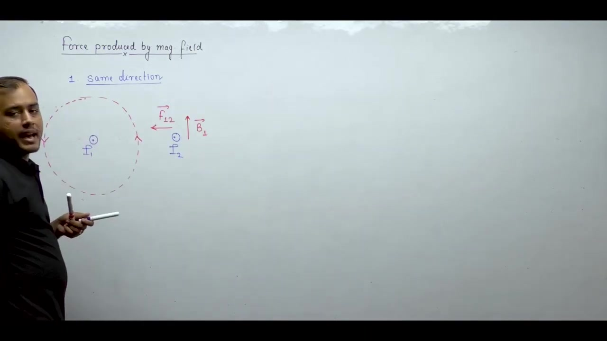

#### Field and Force on Conductor 1

Now examine the reaction force exerted by conductor 2 on conductor 1. 

Current $I_2$ also sets up counter-clockwise circular field lines. At the location of conductor 1, field $\vec{B}_2$ points downward along $-\hat{z}$:

$$\vec{B}_2 = -\frac{\mu_0 I_2}{2\pi d} \hat{z}$$

Current element $d\vec{l}_1$ points outward along $+\hat{x}$. Evaluate the cross product:

$$\hat{x} \times (-\hat{z}) = \hat{y}$$

The resulting force $d\vec{F}_{21}$ points along $+\hat{y}$, which is to the right toward conductor 2.

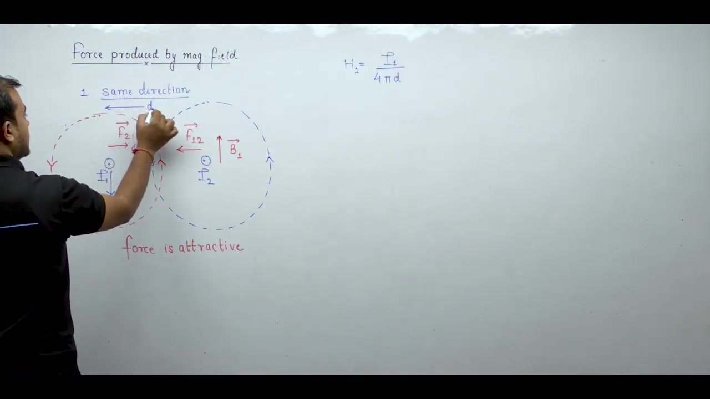

Both conductors pull toward one another. Conductors carrying currents in the same direction experience mutual attraction.

## Force per Unit Length and Repulsion of Opposing Currents
_(17:27 - 23:17)_

### Cyclic Rules for Cartesian Cross Products

We evaluate unit vector products systematically using a cyclic diagram.

For Cartesian coordinates, moving clockwise through the cycle yields positive unit vectors:

$$\hat{x} \times \hat{y} = \hat{z}, \quad \hat{y} \times \hat{z} = \hat{x}, \quad \hat{z} \times \hat{x} = \hat{y}$$

Reversing against the cyclic order introduces a negative sign:

$$\hat{x} \times \hat{z} = -\hat{y}$$

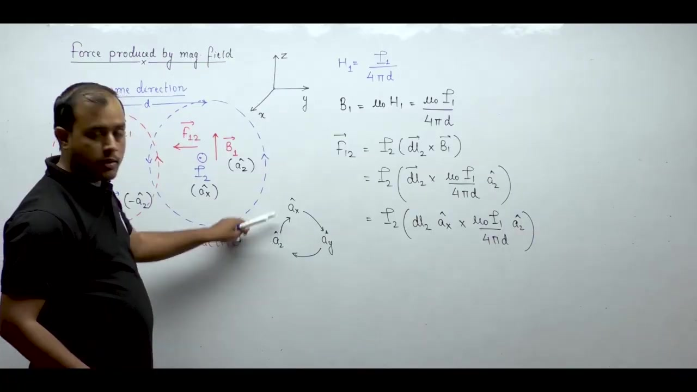

### Derivation of Force per Unit Length

Apply this cyclic product to the differential force on conductor 2:

$$d\vec{F}_{12} = I_2 \, dl_2 \left(\frac{\mu_0 I_1}{2\pi d}\right) (\hat{x} \times \hat{z}) = - \frac{\mu_0 I_1 I_2}{2\pi d} dl_2 \hat{y}$$

Divide by the conductor segment length $dl_2$ to obtain the force per unit length:

> [!success] Force per Unit Length
> $$\frac{F}{L} = \frac{\mu_0 I_1 I_2}{2\pi d}$$
> The SI unit of force per unit length is newtons per meter ($\text{N/m}$).

By Newton's third law, the conductors exert equal and opposite forces:

$$\vec{F}_{12} = -\vec{F}_{21}$$

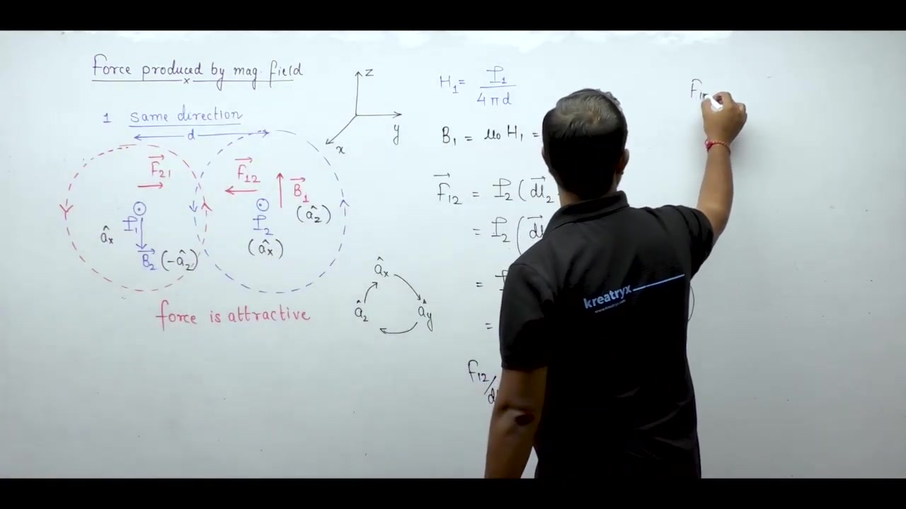

### Case 2: Currents in Opposite Directions

Now consider conductors carrying currents in opposite directions.

Let conductor 1 carry current $I_1$ out of the page along $+\hat{x}$. Let conductor 2 carry current $I_2$ into the page along $-\hat{x}$.

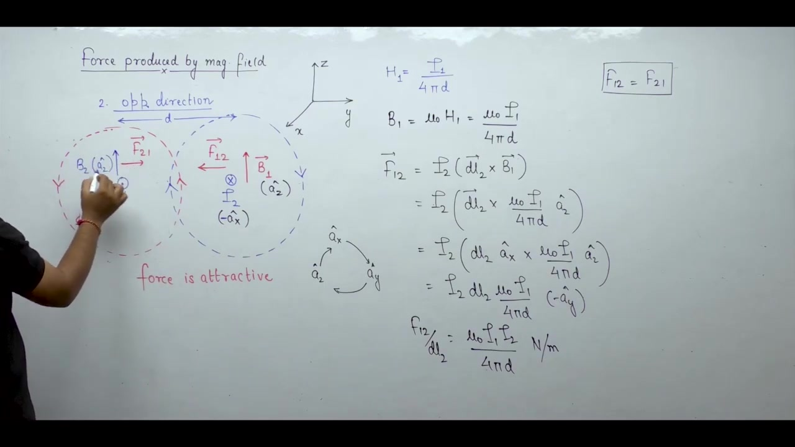

#### Field and Force on Conductor 1

Current $I_2$ flows into the page. By the right-hand thumb rule, its field lines circulate clockwise.

At the position of conductor 1, this clockwise field $\vec{B}_2$ points upward along $+\hat{z}$. Never evaluate force using a conductor's own field. A conductor cannot exert force on itself.

Calculate the force exerted on conductor 1 by field $\vec{B}_2$:

$$d\vec{F}_{21} = I_1 dl_1 (\hat{x} \times \hat{z}) = - I_1 dl_1 B_2 \hat{y}$$

The unit vector $-\hat{y}$ points to the left, away from conductor 2.

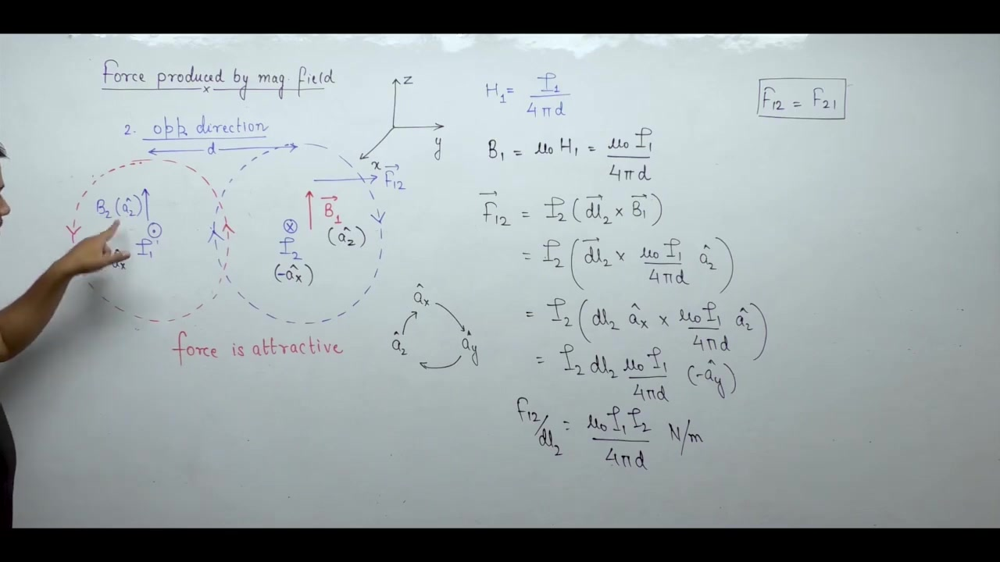

#### Field and Force on Conductor 2

Current $I_1$ creates counter-clockwise field lines. At conductor 2, field $\vec{B}_1$ points upward along $+\hat{z}$.

Conductor 2 carries current into the page along $-\hat{x}$. Evaluate its force vector:

$$d\vec{F}_{12} \propto (-\hat{x}) \times \hat{z} = -(-\hat{y}) = +\hat{y}$$

This force points to the right, away from conductor 1. Both forces push the conductors apart.

### Core Takeaway on Parallel Conductors

The force magnitude between opposing currents remains identical:

$$\frac{F}{L} = \frac{\mu_0 I_1 I_2}{2\pi d}$$

Only the sign and spatial direction reverse. We summarize these interactions:

> [!info] Current Interaction Rules
> 1. Conductors carrying currents in the same direction experience mutual attraction.
> 2. Conductors carrying currents in opposite directions experience mutual repulsion.

## Worked Example on Conductor Force and Introduction to Motional EMF
_(23:22 - 28:00)_

### Worked Example: Force on a Straight Conductor

We apply the cross product method to calculate the force on a straight conducting wire.

> [!example] Problem
> A vertical wire of length $L = 1\text{ m}$ carries a current of $0.5\text{ A}$ from top to bottom. A uniform magnetic flux density of $0.25\text{ T}$ points directly into the page. Determine the magnitude and direction of the total force on the wire.

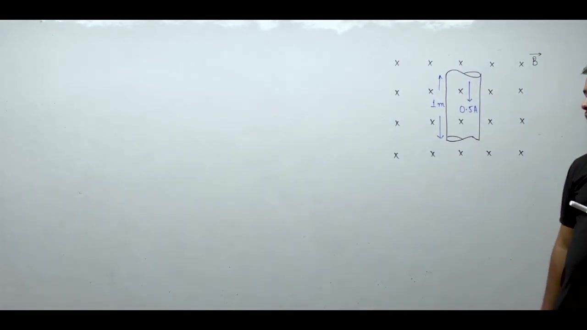

#### Vector Formulation and Coordinate Setup

Define Cartesian unit vectors:

- Out of the page: $+\hat{x}$
- Toward the right: $+\hat{y}$
- Vertically upward: $+\hat{z}$

The current flows downward, opposite to $+z$. We express the current element vector as:

$$I d\vec{l} = 0.5 dl (-\hat{z})$$

The magnetic field points into the page, opposite to $+x$:

$$\vec{B} = 0.25 (-\hat{x}) \text{ T}$$

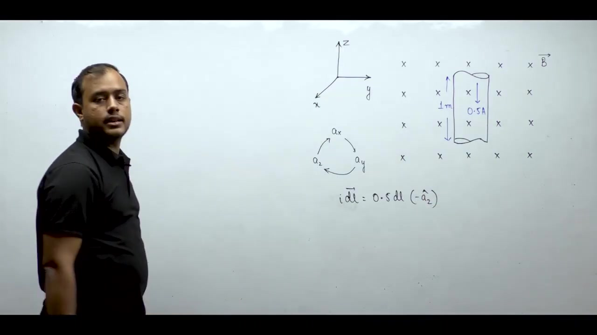

#### Differential Force Evaluation

Substitute these components into the differential force expression:

$$d\vec{F} = I (d\vec{l} \times \vec{B}) = [0.5 dl (-\hat{z})] \times [0.25 (-\hat{x})]$$

The two negative signs multiply to positive:

$$(-\hat{z}) \times (-\hat{x}) = \hat{z} \times \hat{x}$$

From our cyclic cross product rules, $\hat{z} \times \hat{x} = \hat{y}$. The differential force simplifies to:

$$d\vec{F} = (0.5 \times 0.25 dl) \hat{y} = 0.125 dl \hat{y}$$

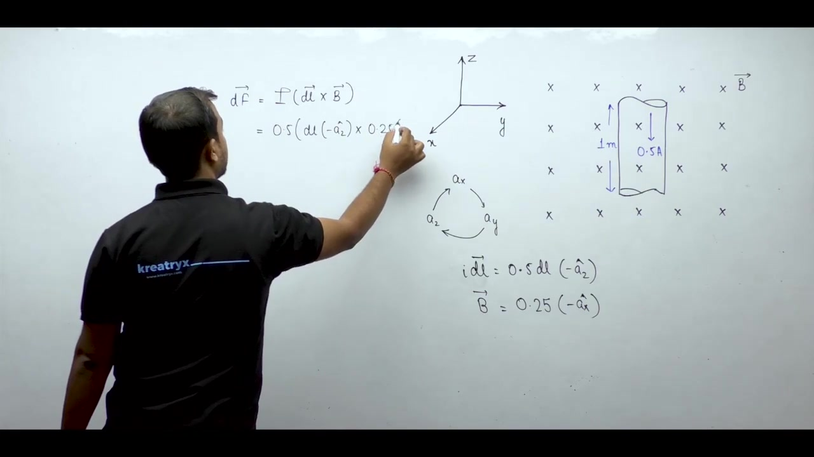

#### Total Force Integration

Integrate across the total conductor length $L = 1\text{ m}$:

$$\vec{F} = \int d\vec{F} = 0.125 \hat{y} \int_0^1 dl = 0.125 (1) \hat{y} \text{ N}$$

> [!success] Total Conductor Force
> The magnetic force on the conductor is:
> $$\vec{F} = 0.125 \hat{y} \text{ N}$$
> The magnitude is $0.125\text{ N}$, directed horizontally to the right.

Using Cartesian unit vectors avoids ambiguous hand gestures and eliminates sign errors.

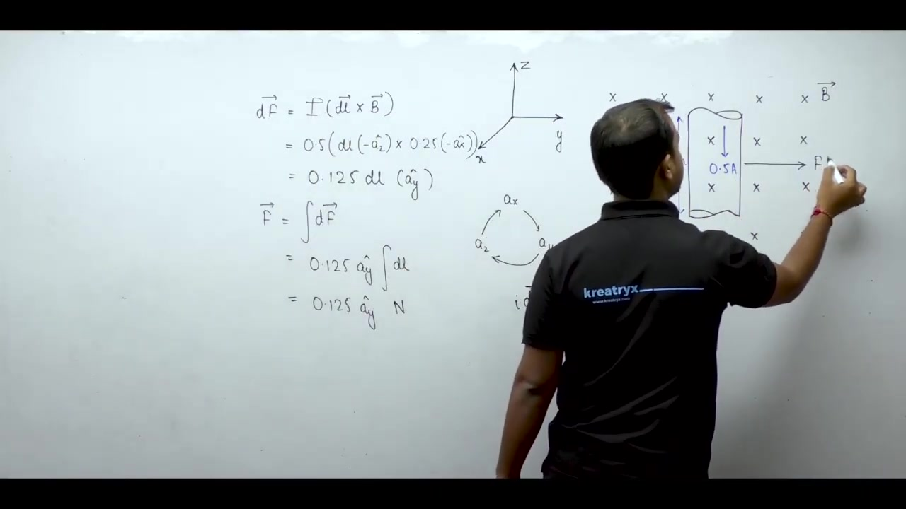

### Introduction to Motional EMF

We now transition from magnetic forces on currents to voltages induced by conductor motion.

In the previous lecture, we introduced dynamically induced EMF. In electrical engineering, this voltage is commonly called motional EMF. Motional EMF arises directly from the motion of physical conductors across a magnetic field. 

Understanding this interaction requires analyzing the magnetic force exerted on moving charge carriers inside the conductor.

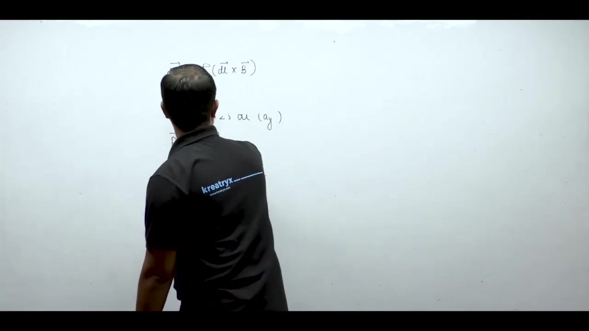

## Motional EMF and Internal Charge Separation
_(28:08 - 33:31)_

### Physical Basis of Motional EMF

Motional EMF is the voltage generated across a conductor moving through a magnetic field. 

Consider a conductor moving with velocity $\vec{v}$ in a uniform magnetic field $\vec{B}$. We seek the open-circuit voltage induced between its two terminal ends.

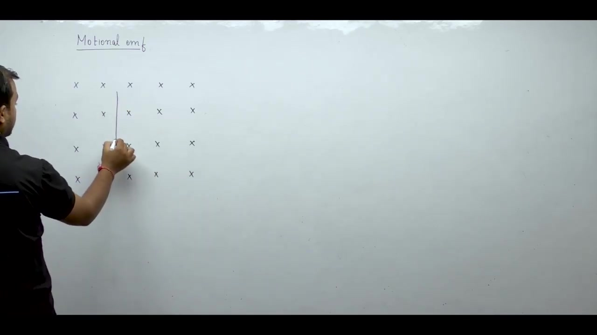

When the conductor moves, all free charges inside move along with it. The charges share the same direction and velocity as the physical conductor:

$$\vec{v}_{\text{charge}} = \vec{v}$$

Because these charges move through a magnetic field, the field exerts a Lorentz force on every mobile carrier.

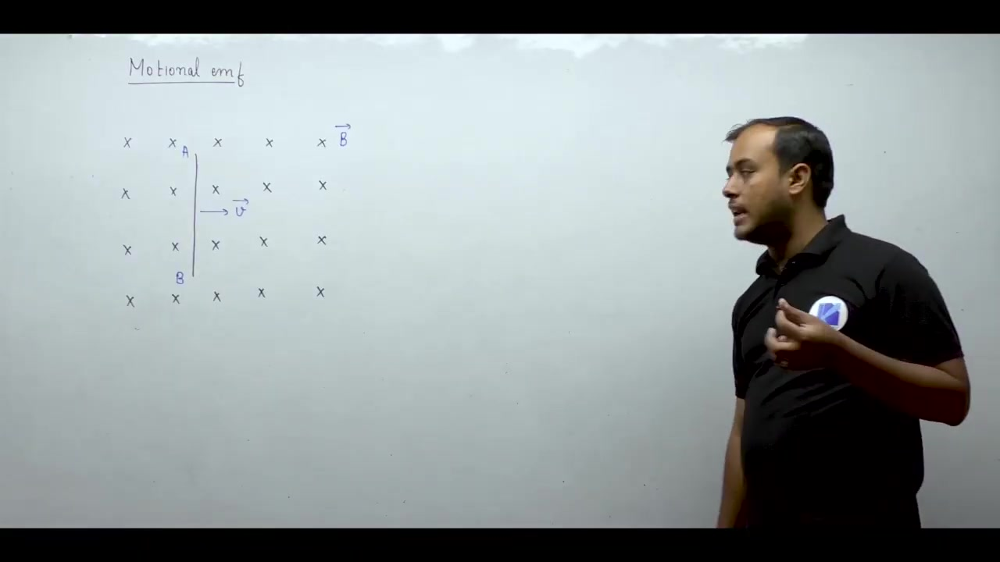

### Force Separation on Positive and Negative Carriers

We evaluate the direction of this magnetic force using Cartesian unit vectors.

Let the magnetic field point into the board along $-\hat{x}$. Let the conductor move to the right along $+\hat{y}$:

$$\vec{v} = v \hat{y}, \quad \vec{B} = -B \hat{x}$$

Now calculate the magnetic force acting on an arbitrary charge $q$:

$$\vec{F}_m = q(\vec{v} \times \vec{B}) = q [v \hat{y} \times (-B \hat{x})] = -q v B (\hat{y} \times \hat{x})$$

Recall from cyclic products that $\hat{y} \times \hat{x} = -\hat{z}$. The two negative signs cancel:

$$\vec{F}_m = q v B \hat{z}$$

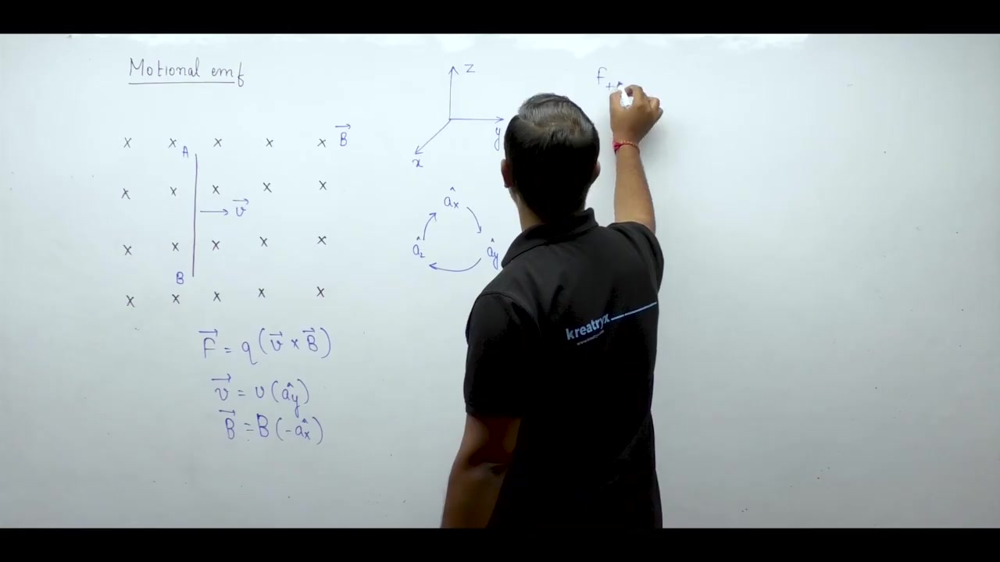

#### Carrier Accumulation

This equation reveals opposite forces on positive and negative charges:

1. For a positive test charge $+q$, force points vertically upward along $+\hat{z}$.
2. For an electron or negative carrier $-q$, force points vertically downward along $-\hat{z}$.

So positive charges migrate toward the top end of the conductor. Negative charges accumulate at the bottom end.

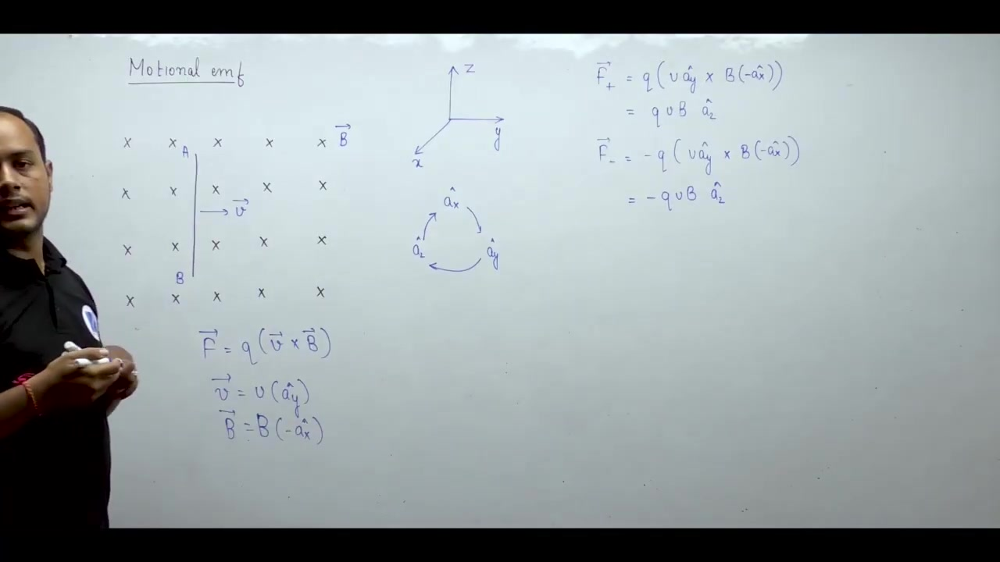

### Establishment of the Internal Electric Field

This continuous migration separates charge along the conductor length. 

Positive charges collect near the top terminal, while negative charges collect near the bottom terminal. Separated charges create an electrostatic field. Electric fields always point from positive potential toward negative potential.

> [!info] Internal Electric Field Direction
> The separated charges set up a downward internal electric field:
> 
> $$\vec{E} = -E \hat{z}$$

This internal electric field opposes further magnetic migration of charge.

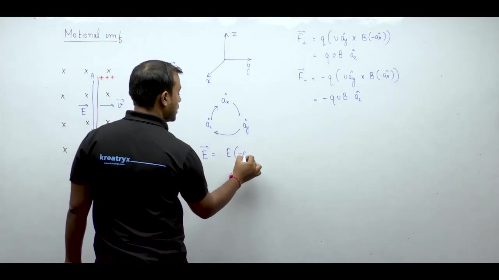

## Equilibrium Condition and the Motional EMF Integral
_(33:34 - 38:55)_

### Balance of Forces at Steady-State Equilibrium

The downward electric field exerts an electrostatic force on internal charges:

$$\vec{F}_e = q \vec{E}$$

For positive charges, this electrostatic force acts downward, parallel to $\vec{E}$. For electrons, the force acts upward, antiparallel to $\vec{E}$. 

The electric force opposes the magnetic force. The magnetic field drives positive charges upward. But the internal electric field pulls them downward.

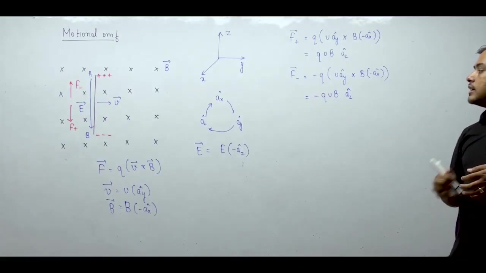

As charge accumulates, the electric field strengthens until both forces balance exactly. At equilibrium, net force on any charge carrier equals zero:

$$\vec{F}_{\text{net}} = q (\vec{E} + \vec{v} \times \vec{B}) = 0$$

Charge migration ceases once this balance occurs.

### Derivation of the Internal Electric Field

Solve this equilibrium balance for the induced internal electric field:

$$\vec{E} + \vec{v} \times \vec{B} = 0 \implies \vec{E} = - (\vec{v} \times \vec{B})$$

Earlier we found that $\vec{v} \times \vec{B}$ points upward along $+\hat{z}$. 

The negative sign confirms that $\vec{E}$ points downward along $-\hat{z}$. The mathematical signs match the physical charge distribution.

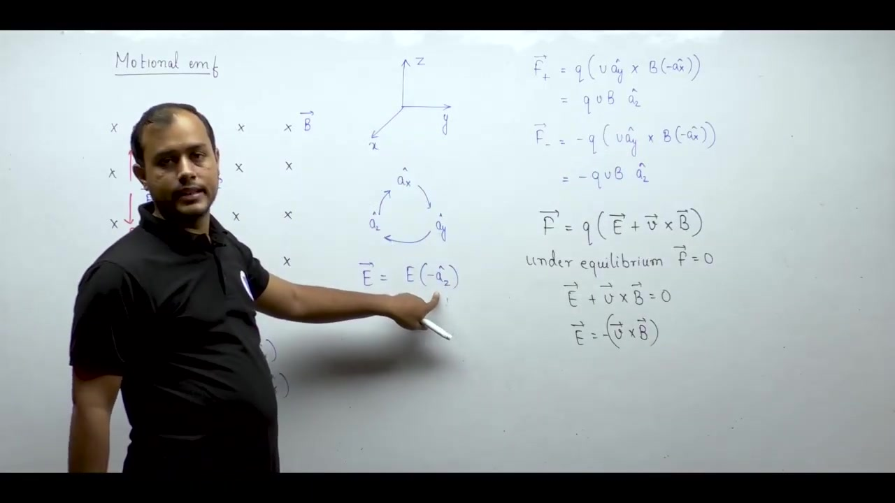

### Derivation of Induced Motional EMF

In electrical circuits, we measure terminal potential difference rather than internal electric field.

Electric potential difference is the line integral of electric field:

$$e = - \int \vec{E} \cdot d\vec{l}$$

Substitute the equilibrium electric field $\vec{E} = - (\vec{v} \times \vec{B})$:

$$e = - \int [-(\vec{v} \times \vec{B})] \cdot d\vec{l}$$

The two negative signs cancel to positive:

> [!success] Motional EMF Integral
> $$e = \int (\vec{v} \times \vec{B}) \cdot d\vec{l}$$

Here path element $d\vec{l}$ integrates along the conductor from the negative terminal to the positive terminal.

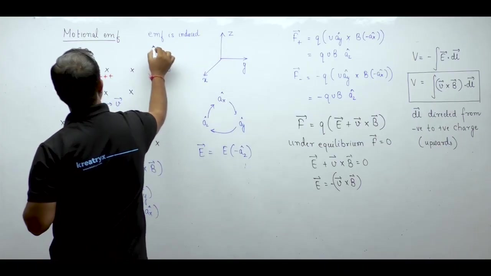

### Polarity Rule for Motional EMF

The vector cross product $\vec{v} \times \vec{B}$ defines terminal polarity directly.

In source modeling, an internal EMF arrow points from the negative terminal to the positive terminal. The vector $\vec{v} \times \vec{B}$ points in this exact direction.

> [!info] Motional Polarity Rule
> The vector $\vec{v} \times \vec{B}$ always points from the negative terminal toward the positive terminal of the moving conductor.

Evaluating $\vec{v} \times \vec{B}$ reveals the positive terminal instantly. In static systems, we determine polarities using opposing flux. In moving systems, we determine polarities using $\vec{v} \times \vec{B}$.

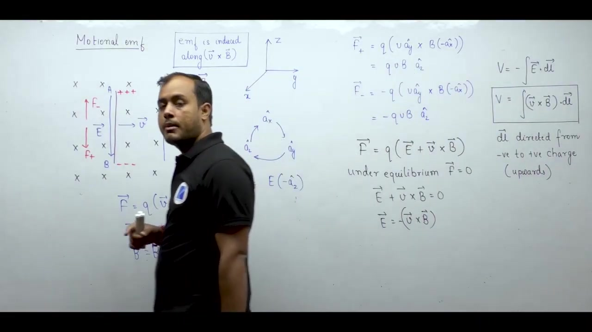

## Worked Example on Motional EMF and Inclined Conductors
_(38:55 - 44:11)_

### Motional EMF Practice Problem

We evaluate motional EMF in an inclined conductor moving through a magnetic field.

> [!example] Problem
> A conducting wire of length $L = 1\text{ m}$ moves with uniform velocity $\vec{v} = 10\text{ m/s}$ to the right. A uniform magnetic flux density $B = 0.25\text{ T}$ points outward from the page. The conductor is tilted at an angle of $30^\circ$ relative to the vertical. Determine the induced voltage polarity and magnitude across terminals $A\text{-}B$.

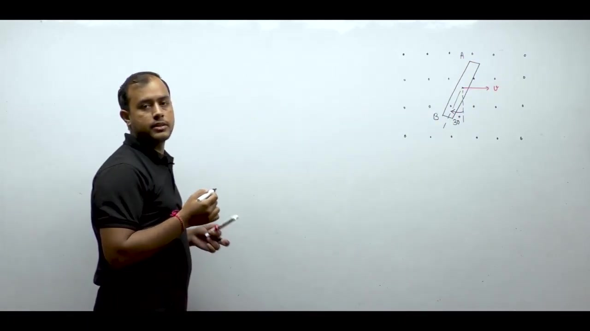

### Polarity Determination via Vector Product

Set up Cartesian axes with $+x$ pointing out of the page, $+y$ pointing to the right, and $+z$ pointing upward.

Write velocity and magnetic field vectors:

$$\vec{v} = 10 \hat{y} \text{ m/s}, \quad \vec{B} = 0.25 \hat{x} \text{ T}$$

Evaluate the vector cross product:

$$\vec{v} \times \vec{B} = (10 \hat{y}) \times (0.25 \hat{x}) = 2.5 (\hat{y} \times \hat{x})$$

From cyclic rules, $\hat{y} \times \hat{x} = -\hat{z}$. The vector cross product evaluates to:

$$\vec{v} \times \vec{B} = -2.5 \hat{z}$$

This vector points vertically downward along $-\hat{z}$.

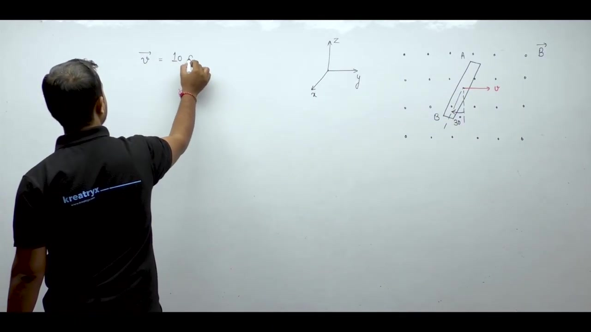

The vector $\vec{v} \times \vec{B}$ always points from the negative terminal to the positive terminal. 

Because $\vec{v} \times \vec{B}$ points downward, the top terminal $A$ is negative ($-$). The bottom terminal $B$ is positive ($+$).

### Magnitude Calculation for an Inclined Conductor

Now calculate induced voltage magnitude using the motional EMF integral:

$$e = \int (\vec{v} \times \vec{B}) \cdot d\vec{l}$$

The path vector $d\vec{l}$ lies along the conductor from negative terminal $A$ to positive terminal $B$.

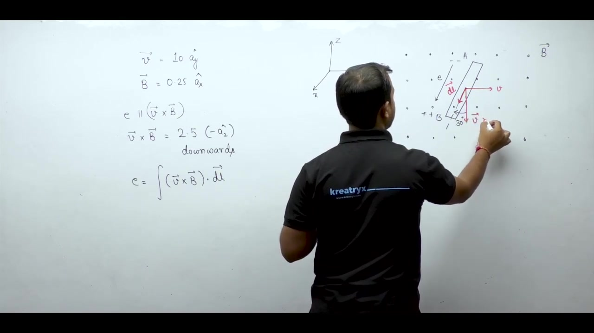

The angle between downward vector $\vec{v} \times \vec{B}$ and conductor path $d\vec{l}$ is $\theta = 30^\circ$. Expand the dot product:

$$(\vec{v} \times \vec{B}) \cdot d\vec{l} = |\vec{v} \times \vec{B}| dl \cos(30^\circ) = 2.5 \cos(30^\circ) dl$$

Substitute $\cos(30^\circ) = \frac{\sqrt{3}}{2}$ and integrate over length $L = 1\text{ m}$:

$$\begin{aligned}
e &= 2.5 \left(\frac{\sqrt{3}}{2}\right) \int_0^1 dl \\
&= 1.25 \sqrt{3} \approx 2.165 \text{ V}
\end{aligned}$$

> [!success] Motional Voltage Result
> The induced voltage is:
> $$e_{BA} = 1.25 \sqrt{3} \text{ V} \approx 2.165 \text{ V}$$
> Terminal $B$ is positive with respect to terminal $A$.

Whenever a conductor is inclined, only the conductor component perpendicular to velocity and field contributes to EMF.

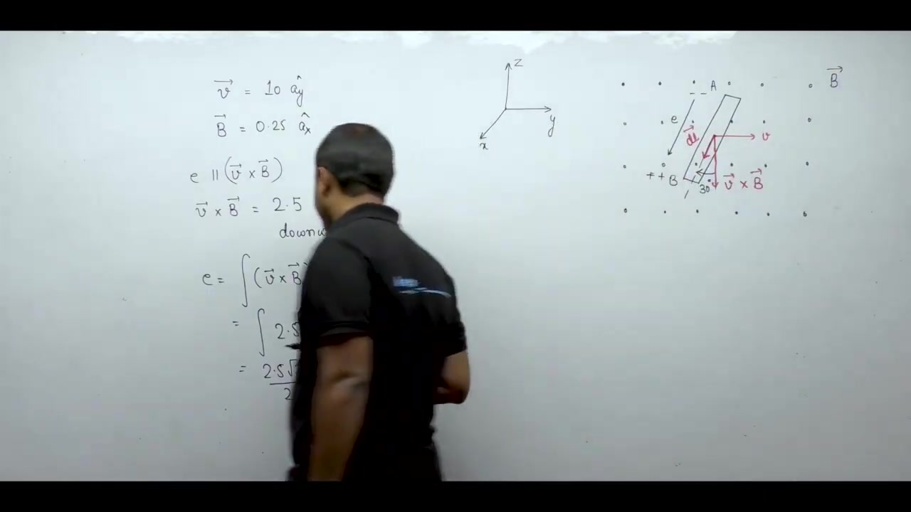

## Dot Convention Foundations and Physical Placement Rules
_(44:16 - 49:33)_

### Importance in Rotating and Static Machines

Motional EMF determines induced polarity in DC and AC rotating machines. 

In transformers and coupled inductors, conductors remain stationary. Here, magnetic coupling links separate coils through a shared core. We determine relative polarities using the dot convention.

### Concept of Mutual Induction

Mutual induction occurs when magnetic flux links two distinct electrical circuits.

> [!info] Mutual Induction
> Mutual induction is the generation of electromotive force in a coil from changing current in another coupled coil.

When two windings share core flux, knowing the voltage polarity of one winding allows us to deduce the other. The dot convention provides a compact shorthand for this mutual polarity.

### Physical Procedure for Placing Dots

We analyze how dots are assigned based on the physical winding direction around a core.

Consider two coils wound on a closed ferromagnetic core. The primary terminals are $A\text{-}B$, and the secondary terminals are $P\text{-}Q$.

#### Step 1: Arbitrary Placement of the First Dot

Choose either terminal of the primary winding arbitrarily. 

Place a dot at terminal $A$. This choice serves as our polarity reference. Alternatively, placing the reference dot at terminal $B$ yields an equally valid complementary dot pair.

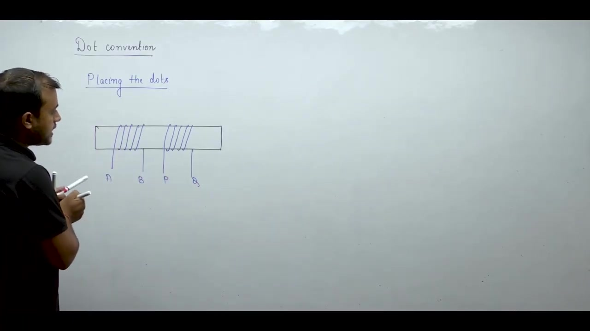

#### Step 2: Establish Primary Current and Flux

Assume an exciting current $I_1$ enters the dotted terminal $A$.

Trace the current along the core limb. Current flows upward along the front conductors and downward along the back conductors. 

Apply the right-hand coil rule. Curl your fingers along this winding path. Your thumb points to the left through the upper yoke:

$$\phi_1 \leftarrow$$

This sets up a circulating magnetic flux $\phi_1$ inside the ferromagnetic core.

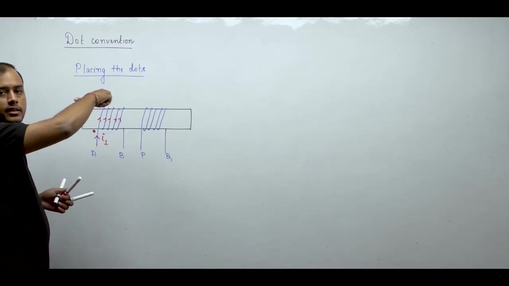

#### Step 3: Establish Opposing Secondary Flux

Flux $\phi_1$ serves as an external applied flux linking the secondary winding.

Under Lenz's law and transformer action, the secondary winding reacts to counteract changes in the main core flux. The secondary winding must create a counter-flux that opposes $\phi_1$:

$$\phi_2 \rightarrow$$

The secondary flux points directly opposite to the primary core flux.

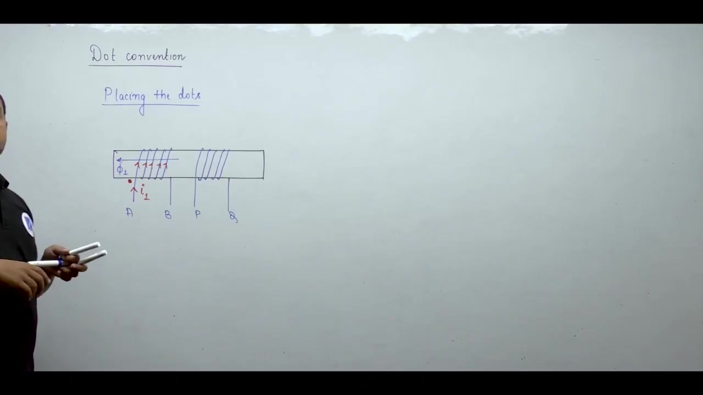

## Systematic Dot Placement Rules and Core Geometry Examples
_(49:34 - 57:13)_

### Four-Step Rule for Dot Placement

We formalize the four steps required to mark dots on any magnetic winding:

> [!info] The Four-Step Dot Placement Rule
> 1. Place an arbitrary reference dot at one terminal of the primary winding.
> 2. Assume current enters this dotted terminal and find the core flux direction.
> 3. Assume an opposing flux in the secondary winding under Lenz's law.
> 4. Place the second dot at the terminal where secondary current leaves the coil.

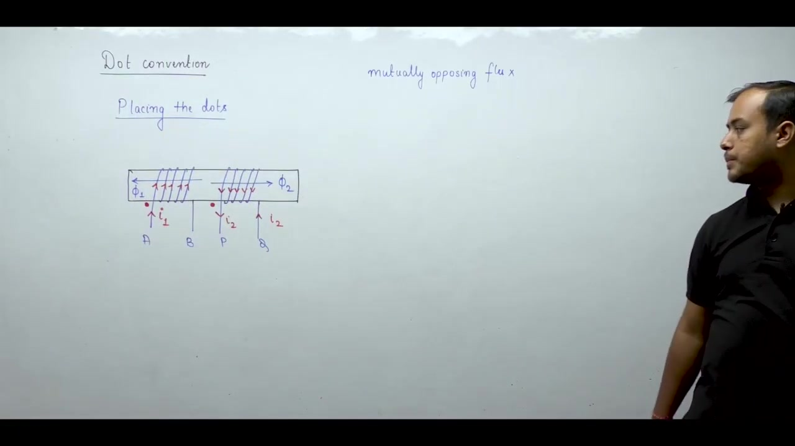

In our initial rectangular core, placing the reference dot at $A$ caused current to leave at terminal $P$. The resulting pair was $A\text{-}P$. 

If we choose reference terminal $B$ instead, current leaves at terminal $Q$. The complementary pair $B\text{-}Q$ is equally valid.

### Example 1: Alternate Winding Orientation

Now reverse the primary winding turns around the core limb.

> [!example] Problem
> Consider a rectangular core with primary terminals $A\text{-}B$ and secondary terminals $P\text{-}Q$. A reference dot is placed at terminal $A$. Determine whether the second dot belongs at terminal $P$ or terminal $Q$.

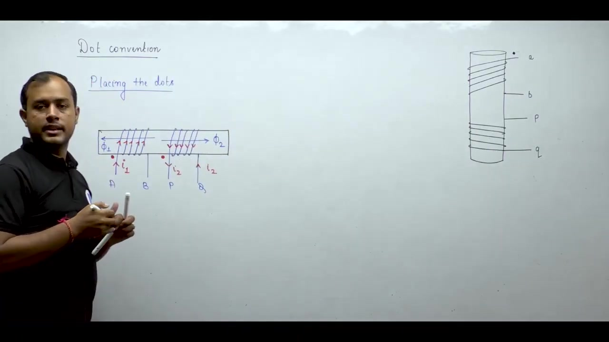

#### Solution

Assume current enters at dotted terminal $A$.

Current travels leftward across the front conductors and rightward across the back conductors. By the right-hand coil rule, this creates downward flux:

$$\phi_1 \downarrow$$

The secondary winding must oppose this with an upward core flux:

$$\phi_2 \uparrow$$

To create upward flux, current must flow rightward across the front conductors. Tracing the path shows that current leaves at terminal $Q$. 

> [!success] Dot Assignment
> The valid dot pair is $A\text{-}Q$.
> The equivalent complementary pair is $B\text{-}P$.

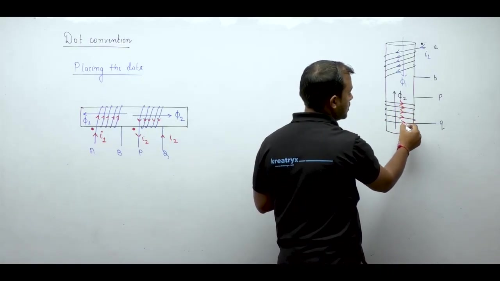

### Example 2: Reversed Reference Terminal on Rectangular Core

Consider another two-limb winding configuration. This time, assign the initial reference dot to terminal $B$.

Current enters terminal $B$ from behind and flows leftward along front conductors. The primary winding drives flux downward through the left core limb.

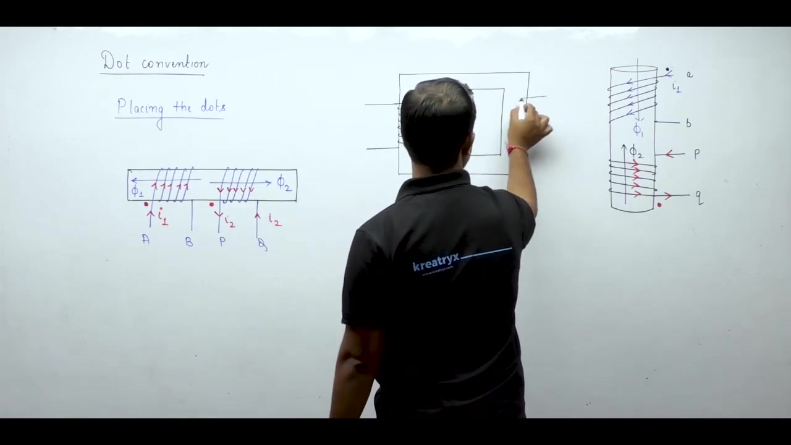

This flux loops through the bottom yoke and travels upward through the right limb. 

To oppose this upward flux, the secondary winding must drive flux downward through its limb. Point your right thumb downward. Current must flow leftward along the front turns.

Current exits the secondary winding at terminal $Q$. So the correct dot pair is $B\text{-}Q$.

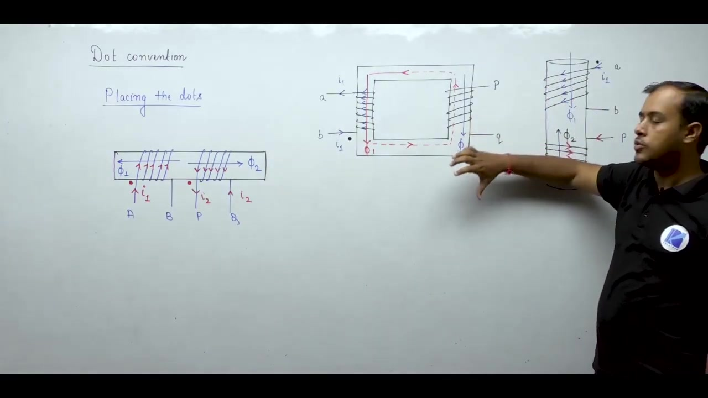

### Example 3: Windings on a Toroidal Core

Now consider primary and secondary coils wound along opposite sides of a toroidal ring core.

Assign the reference dot to primary terminal $A$. Current entering terminal $A$ flows downward in front and upward in back.

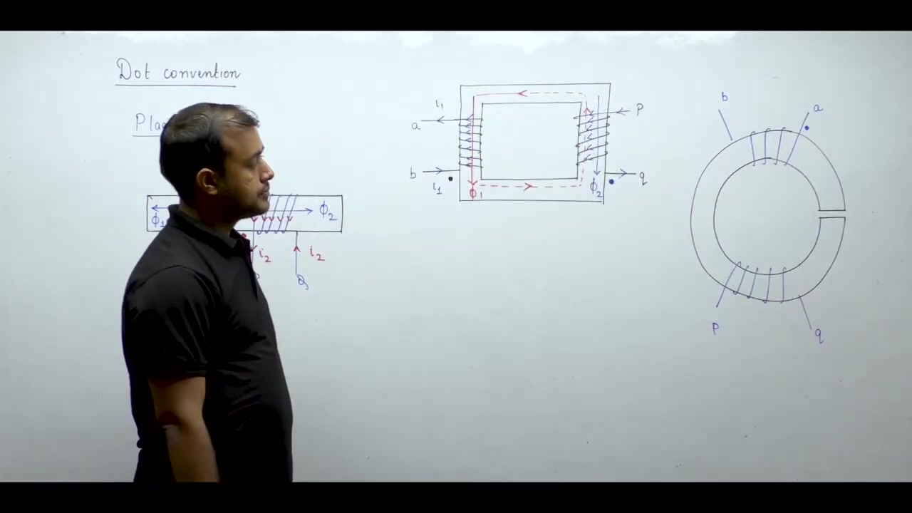

Curl the fingers of your right hand along this winding. Your thumb shows that flux $\phi_1$ circulates clockwise around the toroid:

$$\phi_1 \text{ (clockwise)}$$

By Lenz's law, the secondary winding establishes an opposing counter-clockwise flux:

$$\phi_2 \text{ (counter-clockwise)}$$

In the bottom section, counter-clockwise flux must point toward the right. To produce this field, current flows downward across the front turns. 

Current leaves the winding at terminal $P$. So the correct dot pair is $A\text{-}P$.

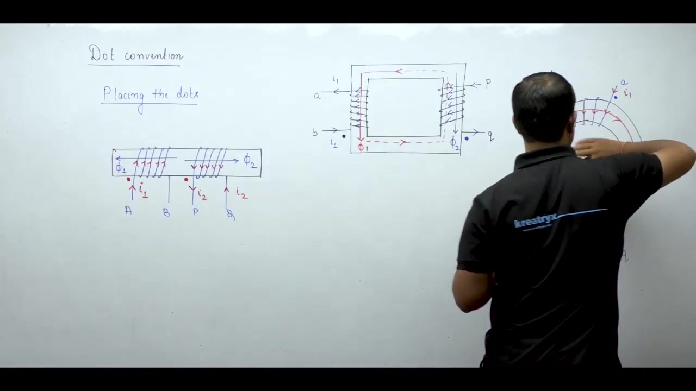

## Dot Convention Significance and Electromagnetic Foundations Summary
_(57:13 - 63:12)_

### Significance and Operation of the Dot Convention

The dot convention simplifies coupled winding analysis. It replaces detailed drawings of physical cores and winding senses with schematic dot markings.

> [!info] The Dot Polarity Rule
> The voltage polarity at the dotted terminal of both coupled coils is identical at every instant.

Consider two mutually coupled windings. If the dotted terminal of coil 1 is positive ($+$), the dotted terminal of coil 2 is also positive ($+$).

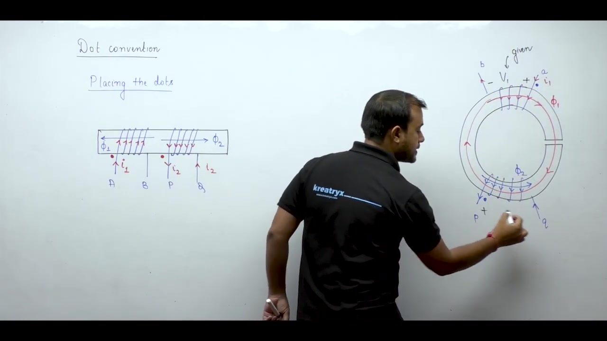

Likewise, if an alternating voltage makes the first dot negative ($-$), the second dot becomes negative ($-$). Knowing the instantaneous voltage polarity at one dot gives the polarity at the other dot directly.

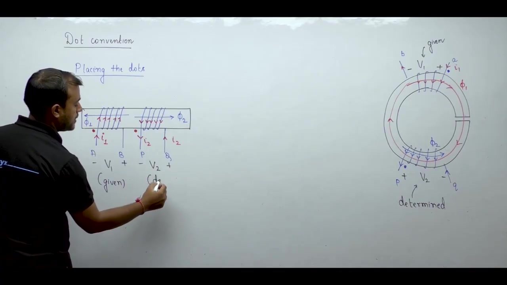

Network theory uses dots in circuit equations. In machines, dots establish transformer polarities and phase connections.

### Comprehensive Summary of Electromagnetic Laws

This lecture and the preceding lecture established the electromagnetic rules underlying electrical machines:

1. **Biot-Savart Law**: Establishes magnetic field vectors from differential current elements.
2. **Right-Hand Thumb Rules**:
   - For a straight conductor: thumb points along current, fingers curl along magnetic field lines.
   - For a circular coil: fingers curl along loop current, thumb points along core flux.
3. **Ampere's Circuital Law**: Evaluates magnetic field intensity along symmetric closed contours.
4. **Faraday's and Lenz's Laws**: Quantifies induced voltage magnitude ($e = N \frac{d\phi}{dt}$) with induced flux opposing external changes.
5. **Lorentz Force on Charges**: Exerts combined electromagnetic force $\vec{F} = q(\vec{E} + \vec{v} \times \vec{B})$ on moving carriers.
6. **Force on Current Conductors**: Produces mechanical force $\vec{F} = I(\vec{L} \times \vec{B})$. Currents in the same direction attract, while opposing currents repel.
7. **Motional EMF**: Generates voltage $e = \int (\vec{v} \times \vec{B}) \cdot d\vec{l}$ from conductor motion. The vector $\vec{v} \times \vec{B}$ points toward the positive terminal.
8. **Dot Convention**: Assigns identical instantaneous terminal polarities across mutually coupled coils.

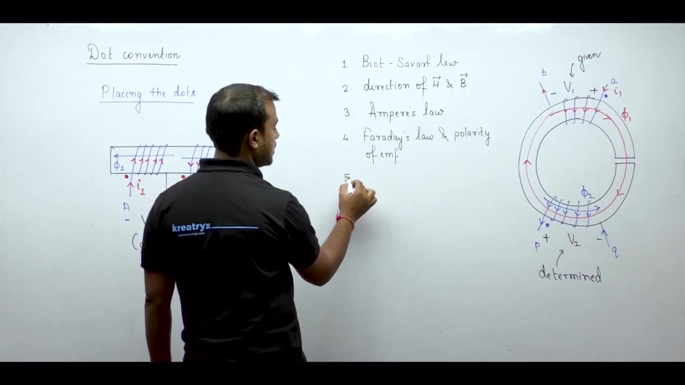

### Next Steps in Machine Theory

These electromagnetic principles govern all motor, generator, and transformer operations. 

The next lecture examines magnetic circuits, introducing magnetomotive force, reluctance, permeance, and core losses.

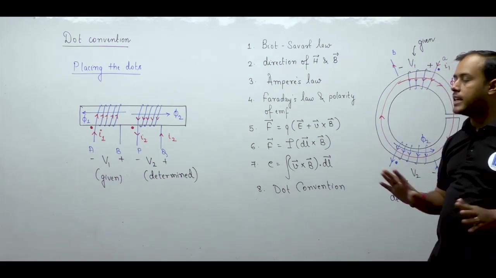

---

## Summary and Key Takeaways

- A magnetic field exerts mechanical force $d\vec{F} = I(d\vec{l} \times \vec{B})$ on a differential current element.
- Parallel conductors carrying currents in the same direction attract each other.
- Opposite parallel currents repel each other with force per unit length $\frac{F}{L} = \frac{\mu_0 I_1 I_2}{2\pi d}$.
- Conductor motion with velocity $\vec{v}$ through flux density $\vec{B}$ creates internal electric field $\vec{E} = -(\vec{v} \times \vec{B})$.
- The motional electromotive force along a conductor path equals $e = \int (\vec{v} \times \vec{B}) \cdot d\vec{l}$.
- The vector $\vec{v} \times \vec{B}$ points directly toward the positive terminal of the induced voltage.
- Dot markings identify winding terminals that carry identical instantaneous voltage polarity.
- Currents entering dotted terminals establish mutually aiding magnetic flux inside the shared core.

