# Problems Based on Electromagnetic Laws | L1 | Electrical Machines | GATE 2022 | Ankit Goyal

- **Source**: https://www.youtube.com/watch?v=IvYftsFm3VM
- **Duration**: 01:08:40
- **Compiled**: 2026-09-16

---

## Overview

This problem-solving lecture applies fundamental electromagnetic laws to rotating machines and circuit geometries. It begins with torque production mechanisms, rotor pole scaling, and magnetic circuit analogies. The session then explores dynamic braking of sliding conductors on rails using Faraday's law and Newton's second law. Next, it solves flux linkages in rectangular loops near line currents and nodal voltages in multi-rod circuits. Finally, vector calculus determines Lorentz forces across multi-segment conductors and mutual forces between coaxial current configurations.

## Contents

- [[#Overview of Problem Practice on Electromagnetic Laws|Overview of Problem Practice on Electromagnetic Laws]]
- [[#Relationship Between Electrical and Mechanical Angles|Relationship Between Electrical and Mechanical Angles]]
- [[#Magnetic Circuit Analogies and Coupling Media|Magnetic Circuit Analogies and Coupling Media]]
- [[#Energy Conversion Dynamics and Magnetic Field Intensity|Energy Conversion Dynamics and Magnetic Field Intensity]]
- [[#Relative Permeability, Equipotential Orthogonality, and Moving Rod Setup|Relative Permeability, Equipotential Orthogonality, and Moving Rod Setup]]
- [[#Derivation of Motional EMF and Conductor Deceleration|Derivation of Motional EMF and Conductor Deceleration]]
- [[#Complete Solution for Sliding Conductor and Setup of Loop Induction Problem|Complete Solution for Sliding Conductor and Setup of Loop Induction Problem]]
- [[#Total Flux Integration, Induced Loop Current, and Dual Moving Rod Setup|Total Flux Integration, Induced Loop Current, and Dual Moving Rod Setup]]
- [[#Vector Analysis and Equivalent Circuit for Dual Moving Rods|Vector Analysis and Equivalent Circuit for Dual Moving Rods]]
- [[#Network Nodal Solution, Energy Storage, and Transformer Scaling|Network Nodal Solution, Energy Storage, and Transformer Scaling]]
- [[#Segmented Conductor Force and Axis-Loop Geometry|Segmented Conductor Force and Axis-Loop Geometry]]
- [[#Interaction of Coaxial Conductors and Loop Orientation Effects|Interaction of Coaxial Conductors and Loop Orientation Effects]]
- [[#Force on a Right-Angled Conductor in a Uniform Magnetic Field|Force on a Right-Angled Conductor in a Uniform Magnetic Field]]

---

## Overview of Problem Practice on Electromagnetic Laws
_(00:10 - 05:55)_

This problem-solving series supplements the comprehensive electrical machines theory lectures. It develops analytical rigor through structured numerical and conceptual problems.

### Objectives and Problem Framework

The series targets 400 to 500 problems across the entire electrical machines curriculum. Each weekly cycle pairs theoretical study with intensive problem-solving sessions.

Students review core theory from the lecture playlist during weekdays. Weekend sessions then focus on problem analysis and quantitative solutions. This workflow turns conceptual understanding into speed and accuracy for competitive examinations.

### Foundational Principles of Electromagnetism

This initial problem set focuses on basic electromagnetic laws. These laws include:
- Faraday's law of electromagnetic induction
- Lenz's law for induced polarities
- Motional electromotive force in moving conductors
- Lorentz magnetic force on current-carrying conductors

These principles form the physical operating foundation of rotating machinery and transformers.

### Electromechanical Energy Conversion Concepts

Rotating machines produce mechanical torque through the interaction of magnetic fields.

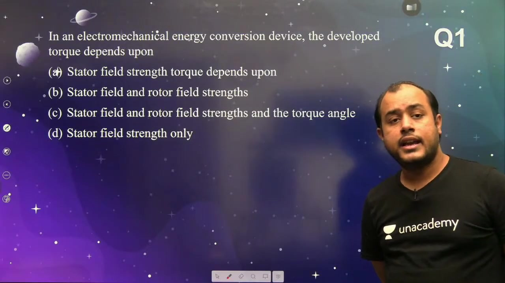

> [!example] Problem: Developed Torque Dependencies
> In an electromechanical energy conversion device, the developed torque depends upon:
> - (a) Stator field strength
> - (b) Stator field and rotor field strengths
> - (c) Stator field and rotor field strengths and the torque angle
> - (d) Stator field strength only

The electromagnetic torque developed in any doubly excited rotating machine follows the interaction torque relation:

$$T_e \propto F_s F_r \sin \delta$$

Here $F_s$ is the stator peak magnetomotive force. $F_r$ represents the rotor peak magnetomotive force. The variable $\delta$ is the electrical torque angle between the stator and rotor field axes.

> [!success] Result
> Developed electromagnetic torque requires both stator and rotor magnetic fields. It also depends on the spatial displacement angle between their magnetic axes. The correct choice is option (c).

## Relationship Between Electrical and Mechanical Angles
_(05:59 - 10:57)_

Electrical machines convert between mechanical rotation and electrical sinusoidal cycles. The number of magnetic poles determines this relationship.

### Distinction Between Electromagnetic and Reluctance Torques

Developed electromagnetic torque depends directly on both field strengths and the torque angle. In a doubly excited cylindrical machine:

$$T_e \propto F_s F_r \sin \delta$$

By contrast, reluctance torque arises from rotor saliency. Reluctance torque varies as $\sin(2\delta)$. It does not require a rotor excitation field.

### Induced Waveforms in Multipole Machines

Consider an elementary cylindrical machine with a single full-pitch stator coil.

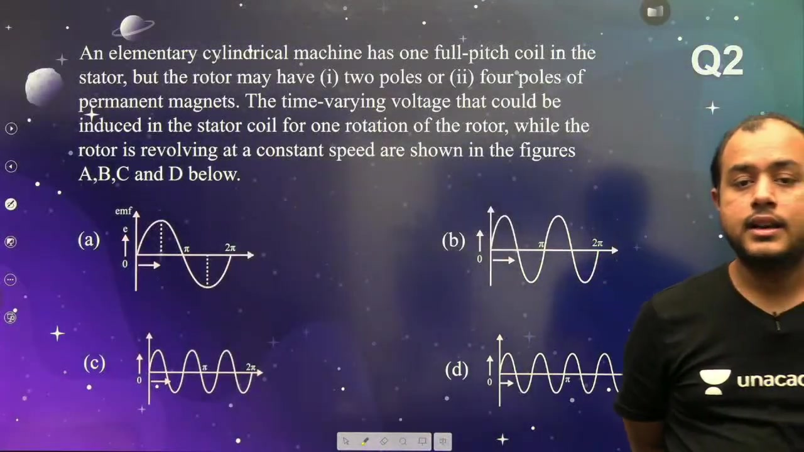

> [!example] Problem: Pole Count and Induced Voltage Cycles
> An elementary cylindrical machine has one full-pitch coil in the stator. The rotor may have (i) two poles or (ii) four poles of permanent magnets.
> Find the time-varying voltage induced in the stator coil for one mechanical revolution at constant speed.
> Select the correct combination:
> - (a) 2-Pole: A, 4-Pole: D
> - (b) 2-Pole: A, 4-Pole: B
> - (c) 2-Pole: C, 4-Pole: D
> - (d) 2-Pole: B, 4-Pole: C

### Mathematical Conversion Between Angles

The fundamental relation linking electrical angle $\theta_e$ and mechanical angle $\theta_m$ is:

$$\theta_e = \frac{P}{2} \theta_m$$

Here $P$ denotes the total number of magnetic poles.

For a two-pole machine ($P = 2$):

$$\theta_e = \frac{2}{2} \theta_m = \theta_m$$

One complete mechanical rotation covers $\theta_m = 2\pi\text{ rad}$. The electrical angle also traverses $2\pi\text{ rad}$. This produces exactly one complete electrical cycle of induced voltage. Curve A represents this single cycle.

For a four-pole machine ($P = 4$):

$$\theta_e = \frac{4}{2} \theta_m = 2 \theta_m$$

When the rotor completes one mechanical turn of $2\pi\text{ rad}$, the electrical angle traverses $4\pi\text{ rad}$. This completes two full sinusoidal cycles. Curve B represents this waveform.

> [!success] Result
> A two-pole rotor produces curve A. A four-pole rotor produces curve B. The correct option is (b).

## Magnetic Circuit Analogies and Coupling Media
_(11:02 - 16:13)_

Multipole geometries scale waveform cycles per mechanical revolution. Further, magnetic circuit equations mirror classical electric circuit laws through direct mathematical analogies.

### Waveform Frequencies Across Higher Pole Counts

The relation $\theta_e = \frac{P}{2} \theta_m$ generalizes to any even number of magnetic poles:
- A six-pole machine ($P = 6$) gives $\theta_e = 3 \theta_m$, producing three full cycles per turn (curve C).
- An eight-pole machine ($P = 8$) gives $\theta_e = 4 \theta_m$, producing four complete cycles per turn (curve D).

### Electric and Magnetic Circuit Duality

Magnetic circuits exhibit mathematical behavior closely analogous to DC resistive networks.

> [!example] Problem: Electric and Magnetic Circuit Equivalences
> Match List-I with List-II and select the correct answer:
> - **List-I**: A. Magnetic flux, B. Magnetomotive force, C. Reluctance, D. Permeability
> - **List-II**: 1. Resistance, 2. Electric current, 3. Conductivity, 4. Electromotive force
> - **Codes**: (a) 2 1 4 3, (b) 3 1 4 2, (c) 2 4 1 3, (d) 3 4 1 2

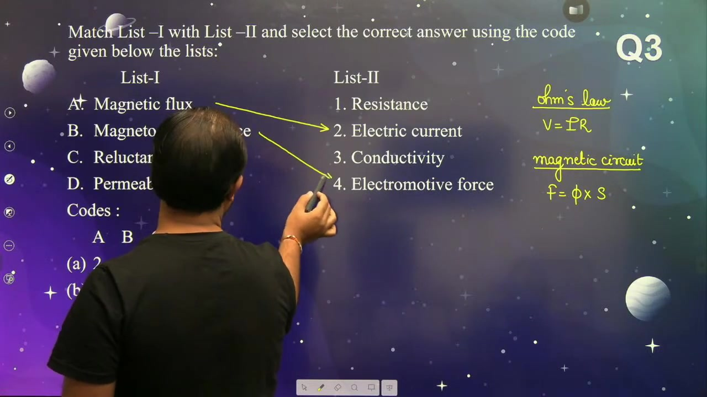

In electric circuits, Ohm's law defines:

$$V = I R$$

In magnetic circuits, Hopkinson's law relates magnetomotive force $\mathcal{F}$ to magnetic flux $\Phi$ and reluctance $\mathcal{R}$:

$$\mathcal{F} = \Phi \mathcal{R}$$

We compare electrical resistance and magnetic reluctance using geometry:

$$
\begin{aligned}
R &= \frac{\rho l}{A} = \frac{l}{\sigma A} \\
\mathcal{R} &= \frac{l}{\mu A}
\end{aligned}
$$

Here $\sigma$ is electrical conductivity and $\mu$ is magnetic permeability. This establishes exact dual pairs:
- Magnetic flux $\Phi$ corresponds to electric current $I$.
- Magnetomotive force $\mathcal{F}$ corresponds to electromotive force $V$.
- Reluctance $\mathcal{R}$ corresponds to resistance $R$.
- Permeability $\mu$ corresponds to conductivity $\sigma$.

> [!success] Result
> The code order is A-2, B-4, C-1, D-3. The correct option is (c).

### Energy Conversion Coupling Medium

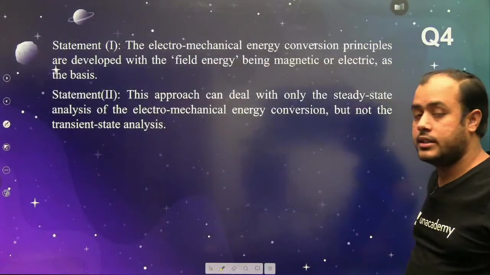

Electromechanical systems transfer energy between electrical and mechanical systems through an intermediate coupling field. This coupling medium stores energy as either an electric or magnetic field. In practical industrial machines, magnetic fields are preferred due to much higher achievable energy densities.

## Energy Conversion Dynamics and Magnetic Field Intensity
_(16:20 - 21:14)_

Energy conversion methods apply to dynamic transient regimes as well as steady states. We can analyze both instantaneous mechanical forces and magnetic field variables.

### Transient Validity of Electromechanical Energy Methods

Electromechanical energy conversion balances stored field energy against electrical input and mechanical work.

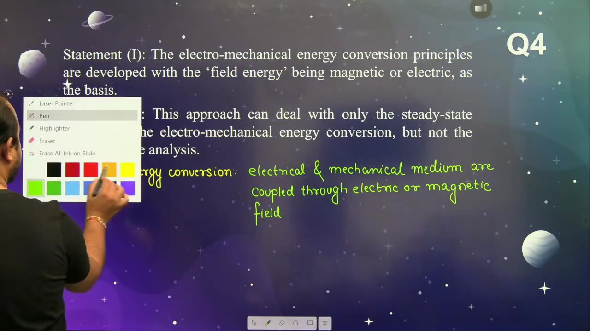

The coupling field determines mechanical force from the spatial rate of change of stored energy $U$:

$$F = -\frac{\partial U}{\partial x}$$

For rotational motion, the developed torque is:

$$T = -\frac{\partial U}{\partial \theta}$$

These partial derivatives hold at every continuous instant of time. They do not depend on steady-state assumptions. The energy method works for transient dynamics just as well as steady states.

### Magnetic Field Intensity in a Closed Magnetic Core

We now evaluate magnetic field intensity and core permeability in an excited coil.

> [!example] Problem: Field Intensity and Core Permeability
> A magnetic circuit has a coil with $N = 150\text{ turns}$. The core cross-sectional area is $A = 5 \times 10^{-4}\text{ m}^2$. The mean length is $l = 25 \times 10^{-2}\text{ m}$.
> Find the magnetic field intensity $H$ and relative permeability $\mu_r$ when current is $I = 2\text{ A}$ and flux is $\Phi = 0.3 \times 10^{-3}\text{ Wb}$.
> - (a) $1200\text{ AT/m}$ and $397.9$
> - (b) $300\text{ AT/m}$ and $500 \times 10^{-6}$
> - (c) $300\text{ AT/m}$ and $397.9$
> - (d) $1200\text{ AT/m}$ and $500 \times 10^{-6}$

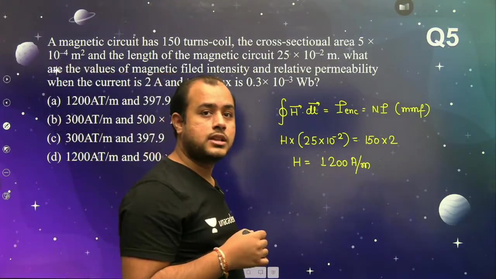

We apply Ampere's circuital law along the mean flux path:

$$\oint \vec{H} \cdot d\vec{l} = I_{\text{enc}} = N I$$

For a uniform core of length $l$:

$$H l = N I$$

Substitute the given numbers:

$$
\begin{aligned}
N I &= 150 \times 2 = 300\text{ AT} \\
H &= \frac{N I}{l} = \frac{300}{25 \times 10^{-2}} = 1200\text{ AT/m}
\end{aligned}
$$

> [!success] Result
> The magnetic field intensity inside the core is $H = 1200\text{ AT/m}$.

## Relative Permeability, Equipotential Orthogonality, and Moving Rod Setup
_(21:18 - 25:56)_

We complete the magnetic material calculation. Then we examine the geometry of equipotential surfaces before analyzing conductor motion across parallel rails.

### Core Reluctance and Relative Permeability Solution

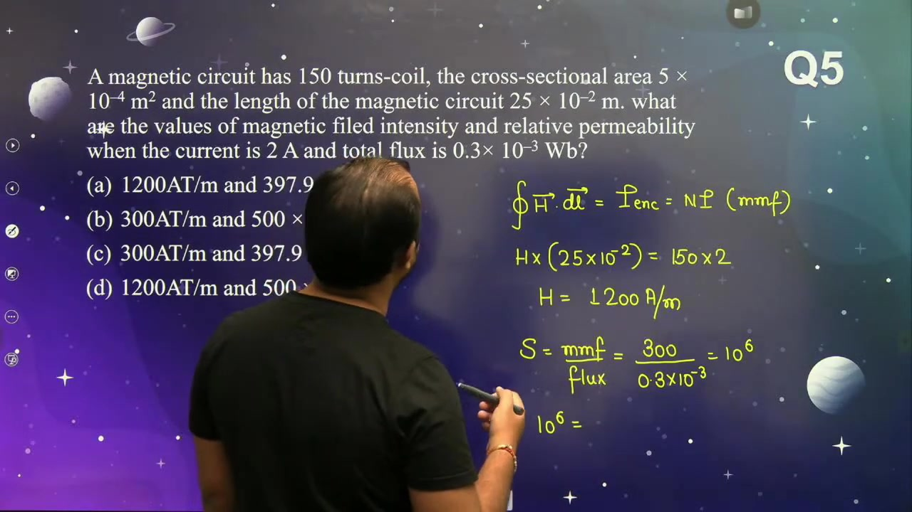

We find magnetic reluctance from magnetomotive force and flux:

$$\mathcal{R} = \frac{\mathcal{F}}{\Phi} = \frac{300}{0.3 \times 10^{-3}} = 10^6\text{ AT/Wb}$$

Using reluctance geometry $\mathcal{R} = \frac{l}{\mu A}$:

$$\mu = \frac{l}{\mathcal{R} A} = \frac{25 \times 10^{-2}}{10^6 \times (5 \times 10^{-4})} = 5 \times 10^{-4}\text{ H/m}$$

Alternatively, compute flux density directly:

$$B = \frac{\Phi}{A} = \frac{0.3 \times 10^{-3}}{5 \times 10^{-4}} = 0.6\text{ T}$$

Then the material permeability is:

$$\mu = \frac{B}{H} = \frac{0.6}{1200} = 5 \times 10^{-4}\text{ H/m}$$

Divide by free-space permeability $\mu_0 = 4\pi \times 10^{-7}\text{ H/m}$:

$$\mu_r = \frac{\mu}{\mu_0} = \frac{5 \times 10^{-4}}{4\pi \times 10^{-7}} = \frac{5000}{4\pi} \approx 397.9$$

> [!success] Result
> The magnetic circuit values are $H = 1200\text{ AT/m}$ and $\mu_r = 397.9$. Option (a) is correct.

### Orthogonality of Equipotential Surfaces and Electric Field Lines

> [!example] Problem: Field Lines and Equipotentials
> In a uniform electric field, field lines and equipotential surfaces:
> - (a) Are parallel to one another
> - (b) Intersect at $45^\circ$
> - (c) Intersect at $30^\circ$
> - (d) Are orthogonal

The electric potential difference along differential displacement $d\vec{l}$ is:

$$dV = -\vec{E} \cdot d\vec{l}$$

On any equipotential surface, $dV = 0$ between any two points on the surface. Therefore:

$$\vec{E} \cdot d\vec{l} = 0$$

Electric field lines are always orthogonal to equipotential surfaces. Option (d) is correct.

### Moving Conducting Rod Problem Formulation

We now analyze electromagnetic braking in a conducting rod on rails.

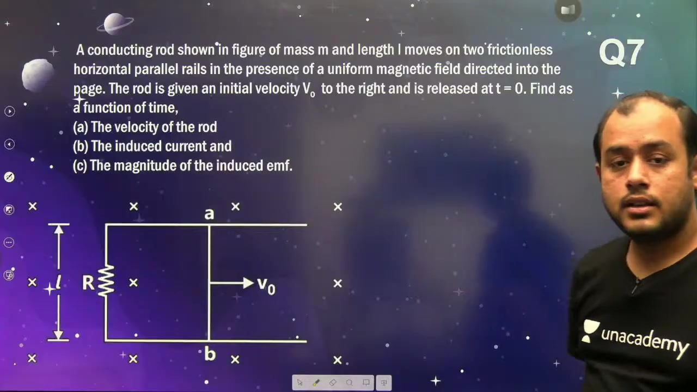

> [!example] Problem: Moving Conducting Rod on Conductive Rails
> A conducting rod of mass $m$ and length $l$ moves on two frictionless horizontal parallel rails.
> A uniform magnetic field $B$ points into the page.
> The rod receives an initial velocity $v_0$ to the right at $t = 0$.
> Find as functions of time:
> - (a) Velocity of the rod $v(t)$
> - (b) Induced current $i(t)$
> - (c) Induced electromotive force magnitude $e(t)$

## Derivation of Motional EMF and Conductor Deceleration
_(26:26 - 32:03)_

We solve the sliding rod problem using coordinate vectors. This establishes terminal polarities and yields the differential equation for electromagnetic braking.

### Coordinate Setup and Motional EMF Vector Analysis

Define Cartesian axes:
- Unit vector $+\hat{a}_x$ points out of the page.
- Unit vector $+\hat{a}_y$ points to the right.
- Unit vector $+\hat{a}_z$ points vertically upward along the rod.

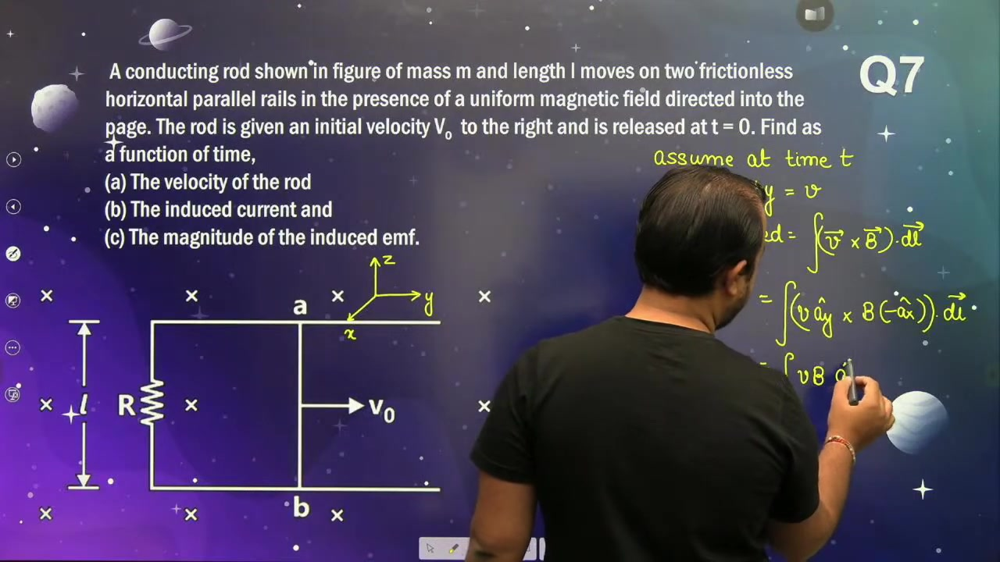

The rod moves with instantaneous velocity $\vec{v} = v \hat{a}_y$. The uniform magnetic flux density is $\vec{B} = -B \hat{a}_x$.

Compute the vector cross product:

$$\vec{v} \times \vec{B} = (v \hat{a}_y) \times (-B \hat{a}_x) = -v B (\hat{a}_y \times \hat{a}_x)$$

Because $\hat{a}_y \times \hat{a}_x = -\hat{a}_z$:

$$\vec{v} \times \vec{B} = +v B \hat{a}_z$$

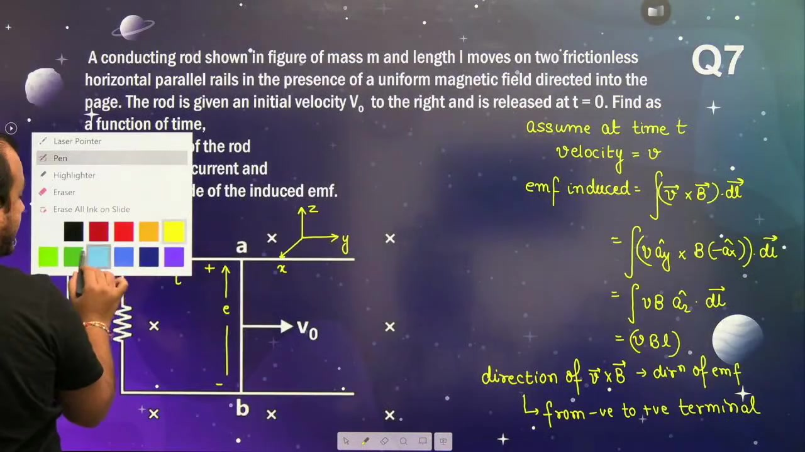

> [!info] Rule: Induced EMF Polarity
> The vector $\vec{v} \times \vec{B}$ always points from the negative terminal to the positive terminal of the induced electromotive force.

Because $\vec{v} \times \vec{B}$ points along $+\hat{a}_z$, the upper terminal $a$ is positive. The lower terminal $b$ is negative:

$$e = \int_b^a (\vec{v} \times \vec{B}) \cdot d\vec{l} = B l v$$

### Circulating Current and Opposing Magnetic Braking Force

The induced voltage drives a counterclockwise loop current. Current flows upward through the moving rod along $+\hat{a}_z$:

$$i(t) = \frac{e(t)}{R} = \frac{B l v(t)}{R}$$

This current in the magnetic field experiences a mechanical Lorentz force:

$$\vec{F} = i (\vec{l} \times \vec{B}) = i (l \hat{a}_z) \times (-B \hat{a}_x) = -i l B \hat{a}_y$$

The mechanical force acts in the $-\hat{a}_y$ direction. It opposes the rod's velocity, confirming Lenz's law.

### Differential Equation for Rod Velocity

Apply Newton's second law:

$$m \frac{dv}{dt} = -i l B = -\frac{B^2 l^2}{R} v$$

Separate variables:

$$\frac{dv}{v} = -\frac{B^2 l^2}{m R} dt$$

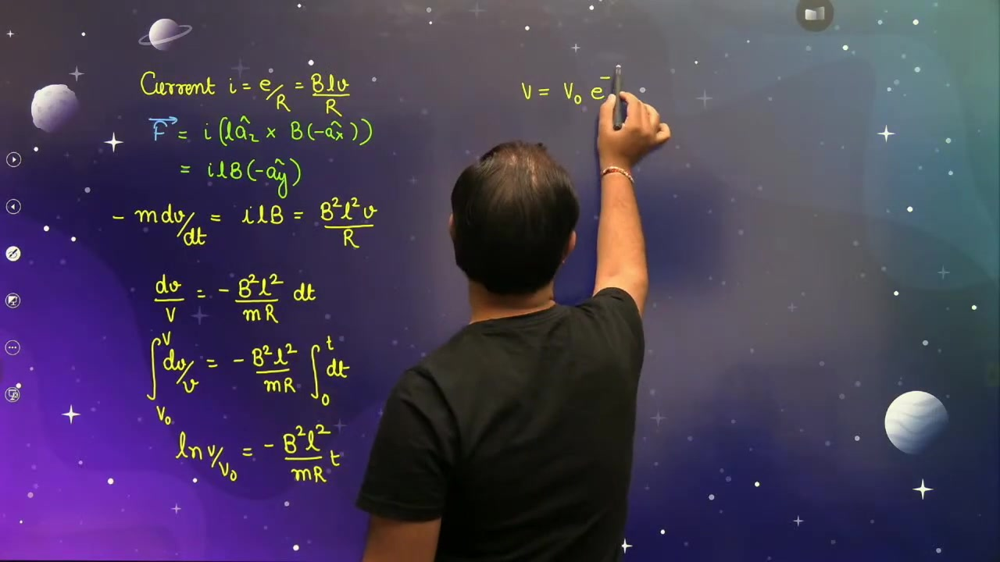

Integrate both sides from initial velocity $v_0$ at $t = 0$:

$$\int_{v_0}^v \frac{dv}{v} = -\frac{B^2 l^2}{m R} \int_0^t dt \implies \ln\left(\frac{v}{v_0}\right) = -\frac{B^2 l^2}{m R} t$$

Exponentiating yields the instantaneous velocity:

$$v(t) = v_0 e^{-\frac{B^2 l^2}{m R} t}$$

> [!success] Result: Dynamic Deceleration
> The rod velocity decays exponentially:
> 
> $$v(t) = v_0 e^{-\frac{B^2 l^2}{m R} t}$$
> 
> The magnetic braking time constant is $\tau = \frac{m R}{B^2 l^2}$.

## Complete Solution for Sliding Conductor and Setup of Loop Induction Problem
_(32:03 - 36:50)_

We finalize the induced current and EMF for the sliding rod. Then we formulate the magnetic flux linkage problem for a loop near a time-varying current wire.

### Current and Voltage Transients in the Sliding Conductor

Substitute the velocity $v(t) = v_0 e^{-\frac{B^2 l^2}{m R} t}$ into the electric loop equations.

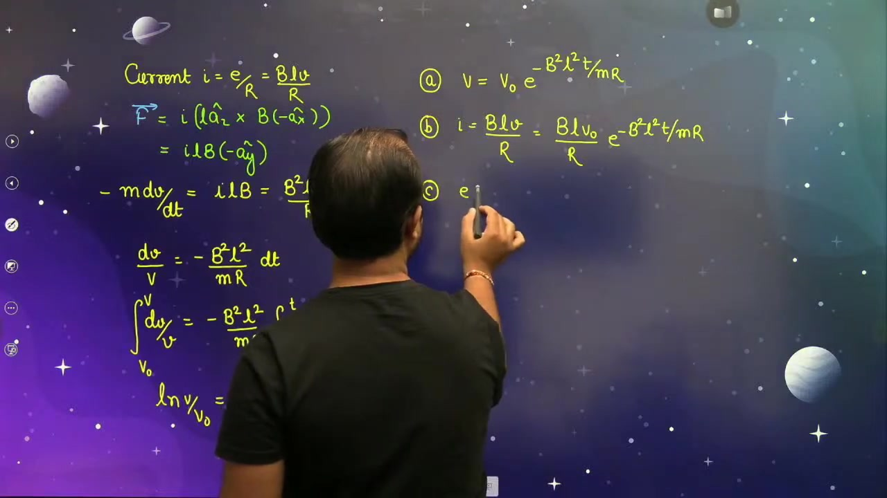

The induced current is:

$$i(t) = \frac{B l v(t)}{R} = \frac{B l v_0}{R} e^{-\frac{B^2 l^2}{m R} t}$$

The open-circuit voltage magnitude is:

$$e(t) = B l v(t) = B l v_0 e^{-\frac{B^2 l^2}{m R} t}$$

> [!info] Limitation of Elementary Kinematics
> Standard kinematic equations like $v = u + a t$ require constant acceleration. Here deceleration depends directly on instantaneous velocity:
> 
> $$a(t) = -\frac{B^2 l^2}{m R} v(t)$$
> 
> Because the deceleration varies continuously, we must integrate the differential equation directly.

### Loop Near a Time-Varying Current Conductor

We now analyze electromagnetic induction in a stationary closed loop.

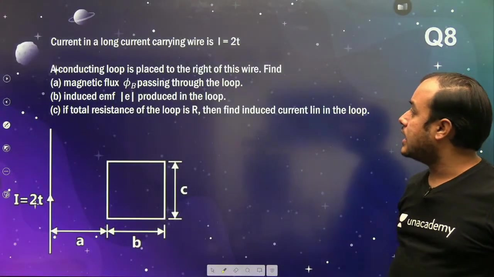

> [!example] Problem: Induction in a Rectangular Loop Near a Current Filament
> An infinitely long straight wire carries a time-varying current $i(t) = 2t$.
> A coplanar rectangular conducting loop has width $b$ and height $c$.
> Its inner edge lies at distance $a$ from the wire.
> Find:
> - (a) The magnetic flux $\Phi(t)$ linking the loop
> - (b) The induced electromotive force magnitude $|e(t)|$
> - (c) The circulating current $i(t)$ when total loop resistance is $R$

### Incremental Flux Strip Formulation

The magnetic flux density around an infinite straight wire carrying current $I$ varies with radial distance $x$:

$$B(x) = \frac{\mu_0 I}{2\pi x}$$

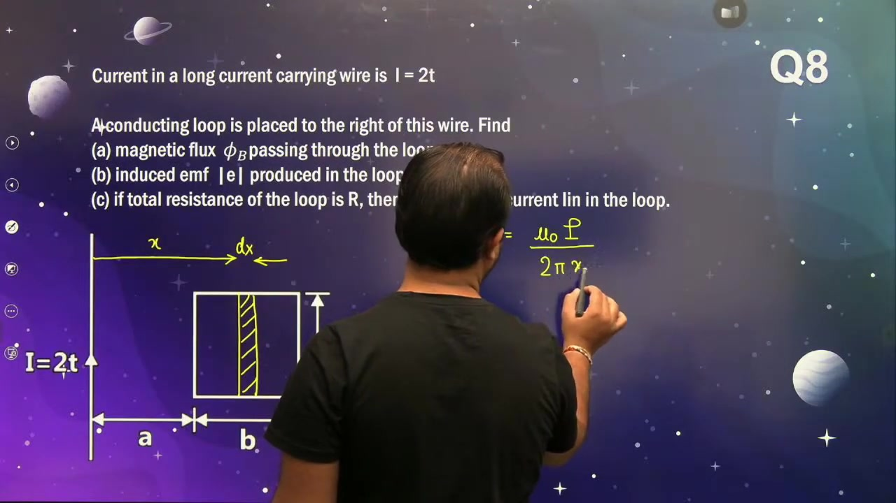

Because the magnetic field is spatially non-uniform, we cannot simply multiply field and area. We choose an incremental vertical strip of width $dx$ at distance $x$. The strip area is:

$$dA = c \, dx$$

The differential magnetic flux passing through this strip is:

$$d\Phi = B(x) dA = \left(\frac{\mu_0 I}{2\pi x}\right) (c \, dx)$$

Integrating across the loop width from $x = a$ to $x = a + b$ will yield the total flux linkage.

## Total Flux Integration, Induced Loop Current, and Dual Moving Rod Setup
_(36:50 - 41:41)_

We integrate the spatial field across the rectangular loop. Then we take the time derivative for induced EMF before introducing a dual moving rod rail circuit.

### Evaluating Loop Magnetic Flux

Integrate differential flux $d\Phi$ from the inner edge $x = a$ to the outer edge $x = a + b$:

$$\Phi(t) = \int_a^{a+b} \frac{\mu_0 i(t) c}{2\pi x} \, dx = \frac{\mu_0 i(t) c}{2\pi} [\ln x]_a^{a+b}$$

Evaluating the logarithmic bounds yields:

$$\Phi(t) = \frac{\mu_0 i(t) c}{2\pi} \ln\left(\frac{a+b}{a}\right)$$

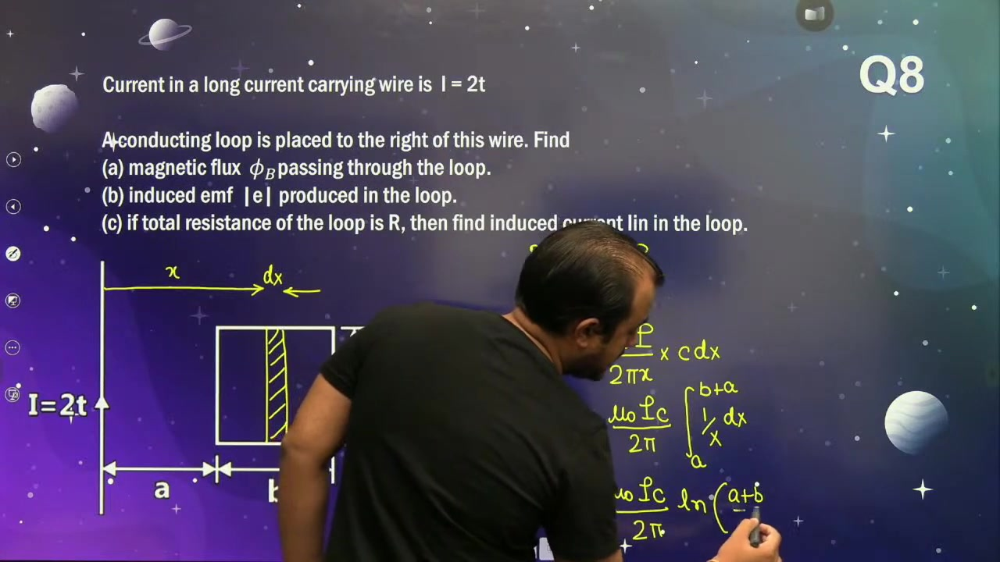

Substitute the instantaneous current $i(t) = 2t$:

$$\Phi(t) = \frac{\mu_0 (2t) c}{2\pi} \ln\left(\frac{a+b}{a}\right) = \frac{\mu_0 c t}{\pi} \ln\left(\frac{a+b}{a}\right)$$

### Induced EMF and Loop Current

Apply Faraday's law of electromagnetic induction:

$$e(t) = -\frac{d\Phi}{dt} = -\frac{d}{dt}\left[\frac{\mu_0 c t}{\pi} \ln\left(\frac{a+b}{a}\right)\right] = -\frac{\mu_0 c}{\pi} \ln\left(\frac{a+b}{a}\right)$$

Taking the voltage magnitude gives:

$$|e| = \frac{\mu_0 c}{\pi} \ln\left(\frac{a+b}{a}\right)$$

For total loop resistance $R$, Ohm's law gives the induced circulating current:

$$i = \frac{|e|}{R} = \frac{\mu_0 c}{\pi R} \ln\left(\frac{a+b}{a}\right)$$

By Lenz's law, increasing current into the page induces counterclockwise loop current. This current generates opposing outward flux.

> [!success] Result
> Even though the loop is stationary, time variation in current induces constant voltage and current.

### Dual Moving Rod Rail Circuit Formulation

We next examine a bridge network containing two simultaneously moving conducting rods.

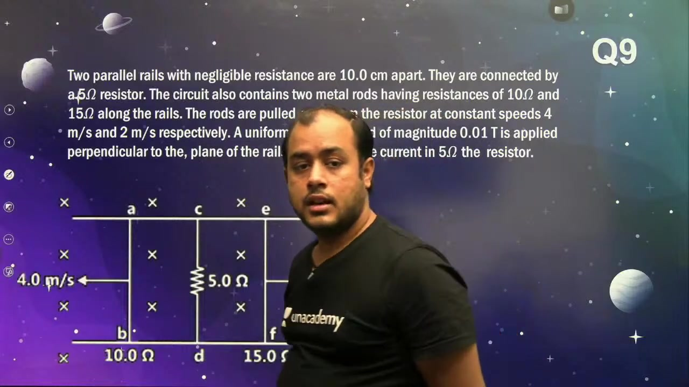

> [!example] Problem: Dual Rod Rail Network
> Two parallel rails with negligible resistance are separated by distance $l = 10.0\text{ cm}$.
> A central branch contains a fixed resistor $R = 5.0\,\Omega$.
> Two conducting rods with internal resistances $R_1 = 10\,\Omega$ and $R_2 = 15\,\Omega$ slide along the rails.
> The left rod moves leftward at constant speed $v_1 = 4.0\text{ m/s}$.
> The right rod moves rightward at constant speed $v_2 = 2.0\text{ m/s}$.
> A uniform magnetic flux density $B = 0.01\text{ T}$ points perpendicularly into the page.
> Find the resulting current through the central $5.0\,\Omega$ resistor.

## Vector Analysis and Equivalent Circuit for Dual Moving Rods
_(42:01 - 46:52)_

We analyze the dual sliding rod network. Vector cross products determine the induced voltages and polarities for each moving branch.

### Vector Coordinate Setup

Define Cartesian unit vectors:
- Unit vector $+\hat{a}_x$ points out of the page.
- Unit vector $+\hat{a}_y$ points to the right.
- Unit vector $+\hat{a}_z$ points vertically upward.

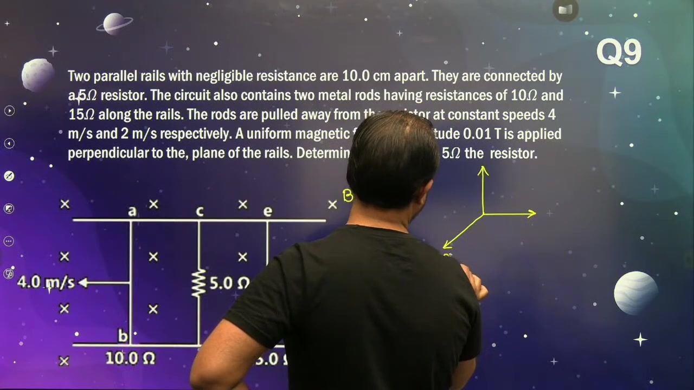

The uniform magnetic field is directed into the page:

$$\vec{B} = -B \hat{a}_x = -0.01 \hat{a}_x\text{ T}$$

Both rods span the distance between the rails: $l = 10\text{ cm} = 0.1\text{ m}$.

### Motional EMF in the Left Moving Rod

The left rod moves to the left at speed $v_1 = 4.0\text{ m/s}$:

$$\vec{v}_1 = -4.0 \hat{a}_y\text{ m/s}$$

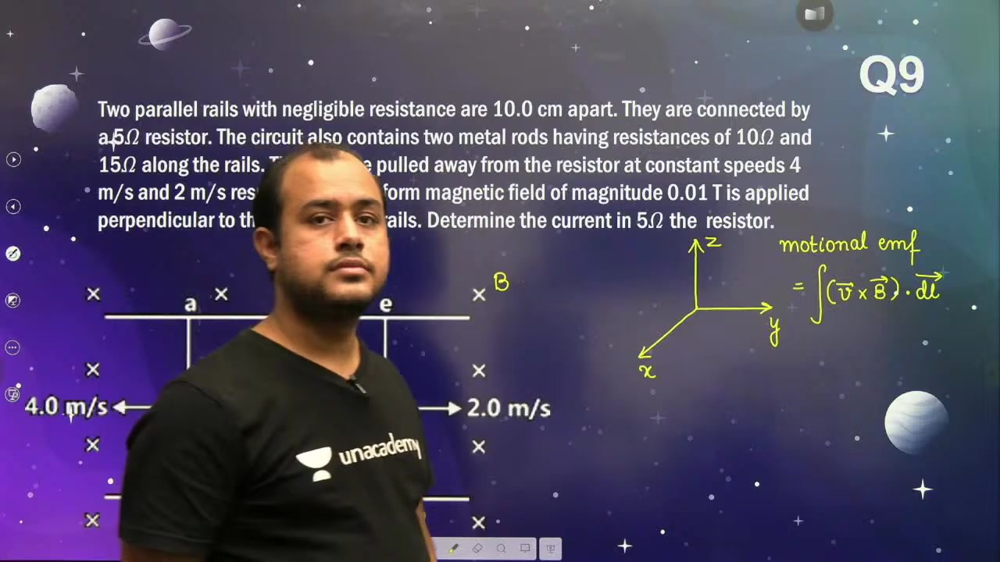

Evaluate the vector cross product:

$$\vec{v}_1 \times \vec{B} = (-4.0 \hat{a}_y) \times (-0.01 \hat{a}_x) = 0.04 (\hat{a}_y \times \hat{a}_x)$$

Because $\hat{a}_y \times \hat{a}_x = -\hat{a}_z$:

$$\vec{v}_1 \times \vec{B} = -0.04 \hat{a}_z\text{ V/m}$$

The vector points downward toward the lower rail. Therefore, terminal $b$ at the bottom is positive. Terminal $a$ at the top is negative.

The induced voltage magnitude is:

$$e_1 = B l v_1 = 0.01 \times 0.1 \times 4.0 = 4.0\text{ mV}$$

### Motional EMF in the Right Moving Rod

The right rod moves to the right at speed $v_2 = 2.0\text{ m/s}$:

$$\vec{v}_2 = +2.0 \hat{a}_y\text{ m/s}$$

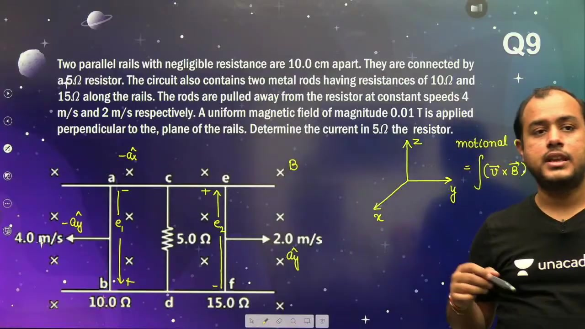

Evaluate the vector cross product:

$$\vec{v}_2 \times \vec{B} = (2.0 \hat{a}_y) \times (-0.01 \hat{a}_x) = -0.02 (\hat{a}_y \times \hat{a}_x) = +0.02 \hat{a}_z\text{ V/m}$$

The vector points upward toward the top rail. Thus, terminal $e$ at the top is positive. Terminal $f$ at the bottom is negative.

The induced voltage magnitude is:

$$e_2 = B l v_2 = 0.01 \times 0.1 \times 2.0 = 2.0\text{ mV}$$

### Equivalent Electric Circuit Model

We replace the physical moving rods with equivalent DC sources in series with internal resistances:
- Left branch: $e_1 = 4\text{ mV}$ with positive terminal at the bottom rail and $R_1 = 10\,\Omega$.
- Central branch: passive load resistor $R = 5\,\Omega$.
- Right branch: $e_2 = 2\text{ mV}$ with positive terminal at the top rail and $R_2 = 15\,\Omega$.

## Network Nodal Solution, Energy Storage, and Transformer Scaling
_(46:56 - 51:54)_

We solve the multi-branch moving rod network using Kirchhoff's nodal method. Then we examine magnetic energy storage and transformer dimension scaling.

### Nodal Solution of the Dual Rod Network

Let the bottom rail serve as the reference ground ($0\text{ V}$). Let $V$ represent the potential of the upper node.

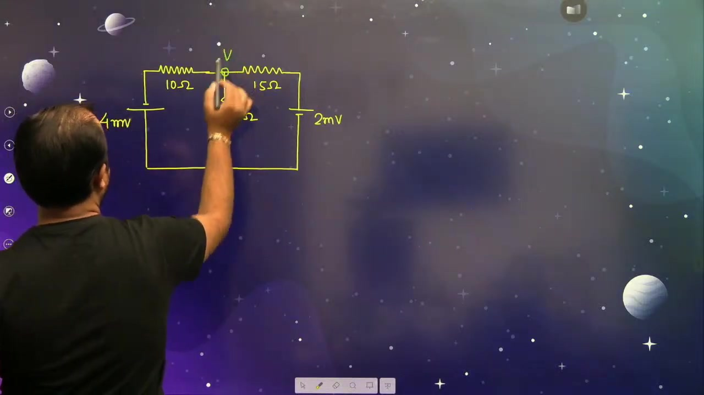

The left branch has a $4.0\text{ mV}$ source oriented with its positive terminal at ground. Its upper terminal is at $-4.0\text{ mV}$. The right branch source has its positive terminal at the top, so its potential offset is $+2.0\text{ mV}$.

Apply Kirchhoff's current law at node $V$:

$$\frac{V - (-4.0)}{10} + \frac{V}{5.0} + \frac{V - 2.0}{15} = 0$$

Multiply the equation by 30 to clear denominators:

$$3(V + 4.0) + 6V + 2(V - 2.0) = 0$$

Expand and group terms:

$$
\begin{aligned}
3V + 12.0 + 6V + 2V - 4.0 &= 0 \\
11V + 8.0 &= 0 \\
V &= -\frac{8.0}{11}\text{ mV} \approx -0.727\text{ mV}
\end{aligned}
$$

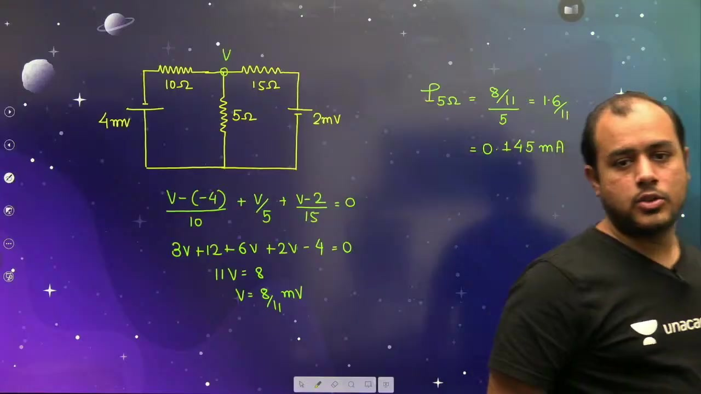

Compute the current magnitude through the central $5.0\,\Omega$ resistor:

$$I_{5\Omega} = \frac{|V|}{5.0} = \frac{8.0/11}{5.0} = \frac{1.6}{11}\text{ mA} \approx 0.145\text{ mA}$$

> [!success] Result: Dual Rod Current
> The current through the $5.0\,\Omega$ resistor is $0.145\text{ mA}$. Current flows upward from ground to node $V$.

### Inductance Required for Bulk Energy Storage

> [!example] Problem: Inductive Storage for 1 kWh
> Find the inductance needed to store $1.0\text{ kWh}$ of magnetic energy at a current of $200\text{ A}$.

Convert energy from kilowatt-hours to joules:

$$W = 1.0\text{ kWh} = 1000\text{ W} \times 3600\text{ s} = 3.6 \times 10^6\text{ J}$$

The magnetic energy stored in an inductor of inductance $L$ carrying current $I$ is:

$$W = \frac{1}{2} L I^2$$

Substitute values and solve for $L$:

$$
\begin{aligned}
3.6 \times 10^6 &= \frac{1}{2} L (200)^2 = 20000 L \\
L &= \frac{3.6 \times 10^6}{20000} = 180\text{ H}
\end{aligned}
$$

> [!success] Result
> The required inductance is $180\text{ H}$.

### Geometric Scaling Laws for Transformer Rating

> [!example] Problem: Transformer kVA Scaling
> Two transformers have identical magnetic materials and current densities. All linear dimensions of one unit are double those of the other.
> Find the ratio of their kVA ratings.
> - (a) 16
> - (b) 8
> - (c) 4
> - (d) 2

Apparent power rating is the product of rated voltage and rated current:

$$\text{kVA} = V I$$

Rated voltage depends on core magnetic flux $\Phi = B A_{\text{core}}$. For constant peak flux density $B$:

$$V \propto A_{\text{core}} \propto l^2$$

Rated current depends on conductor area $A_{\text{cu}}$ for constant current density $J$:

$$I \propto A_{\text{cu}} \propto l^2$$

Multiplying voltage and current yields:

$$\text{kVA} \propto l^2 \times l^2 = l^4$$

When linear dimensions double ($l_2 / l_1 = 2$):

$$\frac{\text{kVA}_2}{\text{kVA}_1} = 2^4 = 16$$

Option (a) is correct.

## Segmented Conductor Force and Axis-Loop Geometry
_(51:54 - 56:50)_

We evaluate magnetic forces on multi-segment bent conductors using Cartesian vectors. Then we formulate the interaction between an axial current and a coaxial circular loop.

### Vector Force Formulation for Multi-Segment Conductors

> [!example] Problem: Magnetic Force on a Bent Conductor
> A planar conducting wire $LN$ carries a current of $I = 10\text{ A}$.
> A uniform magnetic field $B = 5\text{ T}$ points perpendicularly outward from the paper.
> The wire comprises three segments:
> - Segment $LA$: length $4\text{ cm}$, oriented vertically upward.
> - Segment $AB$: length $6\text{ cm}$, oriented horizontally to the right.
> - Segment $BN$: length $4\text{ cm}$, oriented vertically upward.
> Find the net mechanical force on the conductor.
> - (a) Zero
> - (b) $5\text{ N}$
> - (c) $30\text{ N}$
> - (d) $20\text{ N}$

### Coordinate Setup and Directed Length Vectors

Define Cartesian unit vectors:
- Unit vector $+\hat{a}_x$ points out of the page.
- Unit vector $+\hat{a}_y$ points to the right.
- Unit vector $+\hat{a}_z$ points vertically upward.

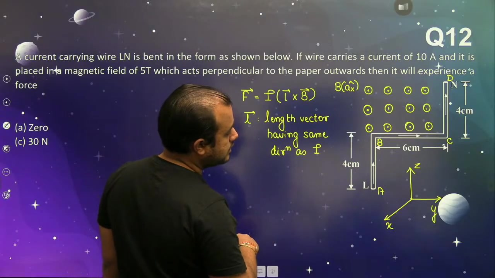

The magnetic field vector is:

$$\vec{B} = 5 \hat{a}_x\text{ T}$$

The magnetic force on any straight segment carrying current $I$ is:

$$\vec{F} = I (\vec{L} \times \vec{B})$$

The directed length vector $\vec{L}$ points along the direction of current flow.

### Step-by-Step Segment Analysis

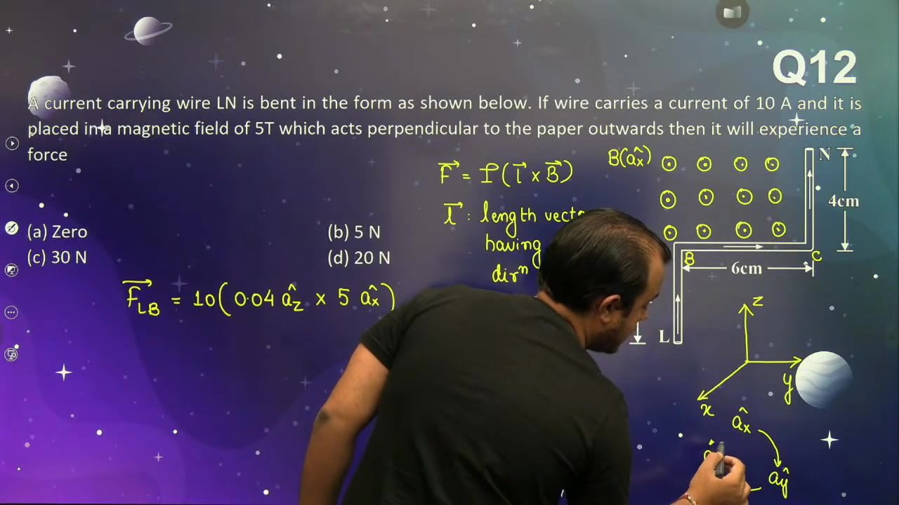

**Segment 1 ($LA$)**:
Length vector is $\vec{L}_1 = 0.04 \hat{a}_z\text{ m}$. Compute the force:

$$\vec{F}_1 = 10 (0.04 \hat{a}_z \times 5 \hat{a}_x) = 2 (\hat{a}_z \times \hat{a}_x)\text{ N}$$

Since $\hat{a}_z \times \hat{a}_x = \hat{a}_y$:

$$\vec{F}_1 = 2 \hat{a}_y\text{ N}$$

**Segment 2 ($AB$)**:
Length vector is $\vec{L}_2 = 0.06 \hat{a}_y\text{ m}$. Compute the force:

$$\vec{F}_2 = 10 (0.06 \hat{a}_y \times 5 \hat{a}_x) = 3 (\hat{a}_y \times \hat{a}_x)\text{ N}$$

Since $\hat{a}_y \times \hat{a}_x = -\hat{a}_z$:

$$\vec{F}_2 = -3 \hat{a}_z\text{ N}$$

**Segment 3 ($BN$)**:
Length vector is $\vec{L}_3 = 0.04 \hat{a}_z\text{ m}$. Compute the force:

$$\vec{F}_3 = 10 (0.04 \hat{a}_z \times 5 \hat{a}_x) = 2 \hat{a}_y\text{ N}$$

### Resultant Force Vector and Magnitude

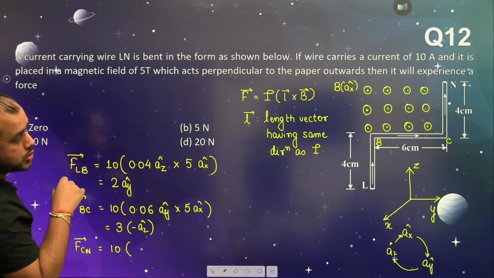

Sum the forces vectorially:

$$\vec{F}_{\text{net}} = \vec{F}_1 + \vec{F}_2 + \vec{F}_3 = (2 \hat{a}_y) + (-3 \hat{a}_z) + (2 \hat{a}_y) = 4 \hat{a}_y - 3 \hat{a}_z\text{ N}$$

The magnitude of the net force is:

$$|\vec{F}_{\text{net}}| = \sqrt{4^2 + (-3)^2} = \sqrt{16 + 9} = \sqrt{25} = 5\text{ N}$$

> [!success] Result
> The net force magnitude is $5\text{ N}$. Option (b) is correct.

### Coaxial Straight Wire and Loop Formulation

We next examine the mutual magnetic force between an axial conductor and a circular loop.

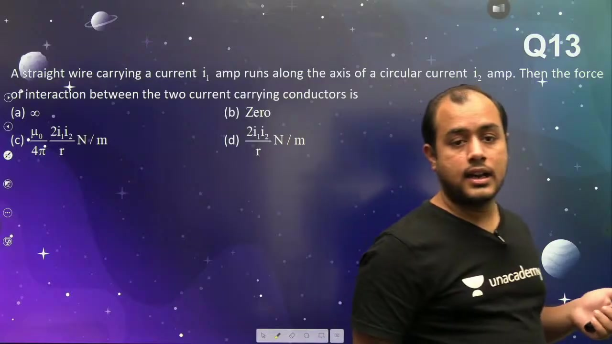

> [!example] Problem: Interaction Force on Coaxial Conductors
> A long straight wire carrying current $I_1$ runs along the central axis of a circular ring carrying current $I_2$.
> Find the mutual interaction force between the two conductors.

## Interaction of Coaxial Conductors and Loop Orientation Effects
_(56:55 - 62:30)_

We examine field alignment between axial and circular currents. Then we analyze how conductor orientation controls flux linkage in square loops.

### Vanishing Force Between Axial and Circular Currents

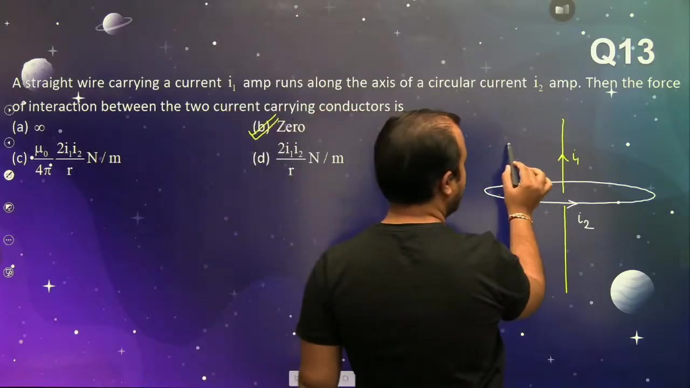

Consider a straight wire carrying current $I_1$ along the symmetry axis of a circular loop carrying current $I_2$.

By the right-hand thumb rule, the axial current produces concentric circular magnetic field lines:

$$\vec{B}_1 = \frac{\mu_0 I_1}{2\pi r} \hat{a}_\phi$$

At every point around the ring, the line element vector of the circular loop is:

$$d\vec{l}_2 = r \, d\phi \, \hat{a}_\phi$$

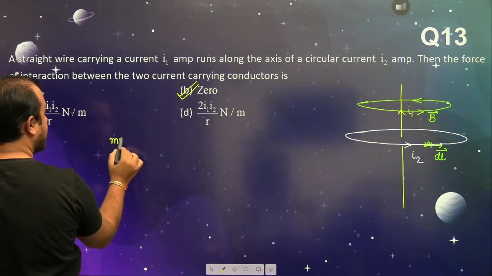

Both $\vec{B}_1$ and $d\vec{l}_2$ point purely in the azimuthal direction $\hat{a}_\phi$. They are parallel vectors everywhere:

$$d\vec{l}_2 \times \vec{B}_1 = (r \, d\phi \, \hat{a}_\phi) \times \left(\frac{\mu_0 I_1}{2\pi r} \hat{a}_\phi\right) = 0$$

The total force on the circular loop is:

$$\vec{F} = \oint I_2 (d\vec{l}_2 \times \vec{B}_1) = 0$$

> [!success] Result: Vanishing Mutual Force
> The mutual magnetic interaction force between an axial straight wire and a coaxial circular loop is zero. Option (b) is correct.

### Flux Linkage in a Coplanar Square Loop

Now place a square loop of side length $2d$ coplanar with an infinitely long straight wire carrying current $I$.

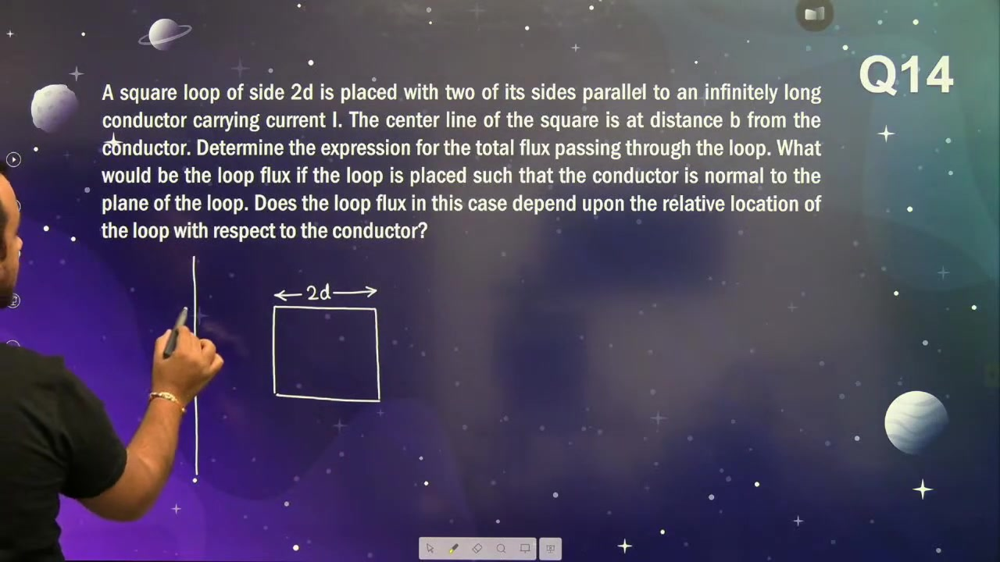

> [!example] Problem: Flux Linkage in a Symmetrical Square Loop
> A square loop of side $2d$ has two sides parallel to a straight wire carrying current $I$.
> The loop centerline lies at distance $b$ from the wire.
> Determine:
> - (a) The total magnetic flux linking the loop.
> - (b) The flux when the wire is normal to the plane of the loop.

The inner edge lies at $x = b - d$. The outer edge lies at $x = b + d$.

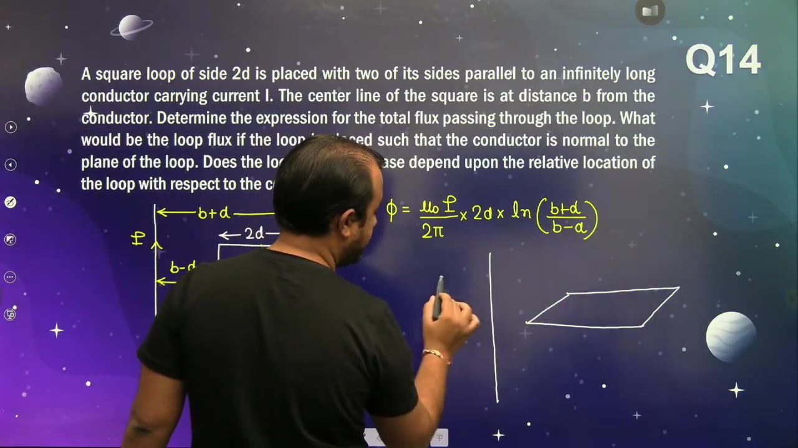

The loop height is $2d$. Integrate the field $B(x) = \frac{\mu_0 I}{2\pi x}$ over height $2d$:

$$\Phi = \int_{b-d}^{b+d} \frac{\mu_0 I (2d)}{2\pi x} \, dx = \frac{\mu_0 I d}{\pi} [\ln x]_{b-d}^{b+d}$$

Evaluating the limits yields:

$$\Phi = \frac{\mu_0 I d}{\pi} \ln\left(\frac{b+d}{b-d}\right)$$

### Flux Linkage for Normal Conductor Orientation

Now rotate the geometry so the straight conductor passes perpendicularly through the plane of the loop.

The straight conductor produces circular magnetic field lines. These field lines lie entirely within the flat plane of the loop.

The surface normal vector $\hat{n}$ is perpendicular to the loop plane. Because $\vec{B}$ lies in the plane:

$$\vec{B} \cdot \hat{n} = 0$$

No magnetic field lines cross or pierce through the loop surface:

$$\Phi = \iint \vec{B} \cdot d\vec{A} = 0$$

This result holds regardless of the position of the perpendicular wire relative to the loop.

> [!success] Result
> When the conductor is normal to the loop plane, the enclosed magnetic flux is identically zero.

## Force on a Right-Angled Conductor in a Uniform Magnetic Field
_(62:32 - 68:36)_

### Problem Statement

We examine a rigid conductor bent into a right-angled structure ABC. 

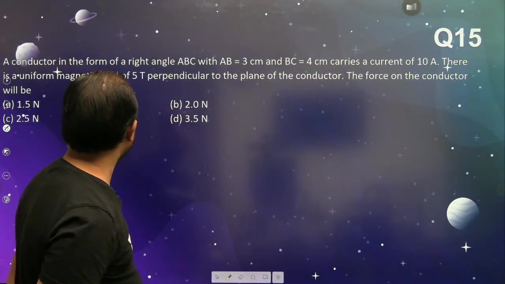

> [!example] Problem
> A conductor forms a right angle ABC with $AB = 3\text{ cm}$ and $BC = 4\text{ cm}$. It carries a current of $10\text{ A}$. A uniform magnetic field of $5\text{ T}$ acts perpendicular to the plane of the conductor. Find the net force on the conductor.
> - (a) $1.5\text{ N}$
> - (b) $2.0\text{ N}$
> - (c) $2.5\text{ N}$
> - (d) $3.5\text{ N}$

### Coordinate System and Segment Vectors

We define a Cartesian coordinate system to evaluate the vector cross products.
Let the conductor lie in the $y$-$z$ plane.
The magnetic field acts perpendicular to this plane along the positive $x$-axis:
$$
\vec{B} = 5\hat{a}_x\text{ T}
$$

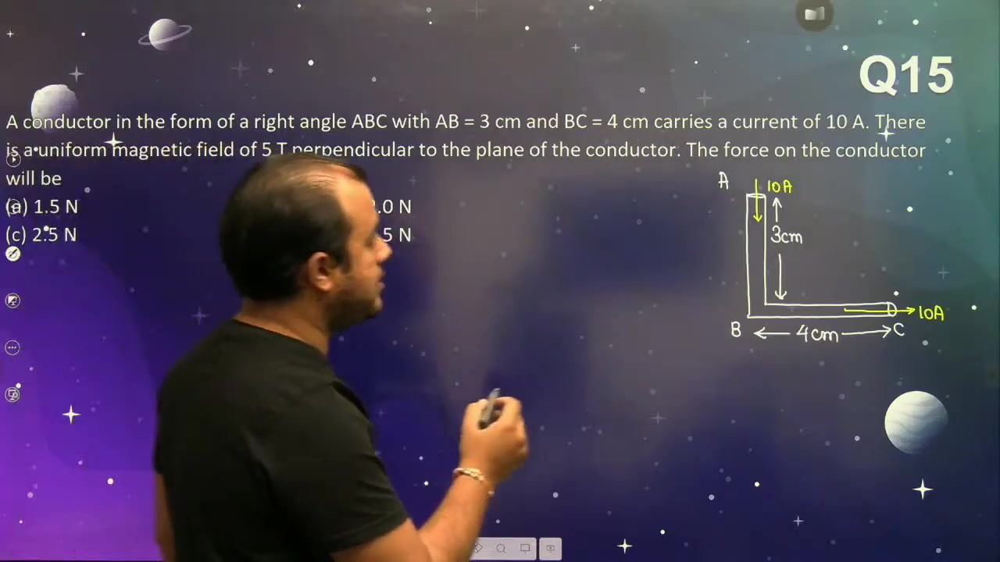

Current $I = 10\text{ A}$ enters at node A and flows toward C.
Segment AB has a length of $3\text{ cm} = 0.03\text{ m}$.
The current in AB flows downward along the negative $z$-axis.
So its directed length vector is:
$$
\vec{L}_{AB} = -0.03\hat{a}_z\text{ m}
$$

Segment BC has a length of $4\text{ cm} = 0.04\text{ m}$.
The current in BC flows horizontally along the positive $y$-axis.
So its directed length vector is:
$$
\vec{L}_{BC} = 0.04\hat{a}_y\text{ m}
$$

### Vector Force Calculation

We use the magnetic force law $\vec{F} = I(\vec{L} \times \vec{B})$ for each straight segment.

First, calculate the force on segment AB:
$$
\begin{aligned}
\vec{F}_{AB} &= I (\vec{L}_{AB} \times \vec{B}) \\
&= 10 \left(-0.03\hat{a}_z \times 5\hat{a}_x\right)
\end{aligned}
$$
Recall the cross product $(-\hat{a}_z) \times \hat{a}_x = -\hat{a}_y$.
Evaluating the product gives:
$$
\vec{F}_{AB} = -1.5\hat{a}_y\text{ N}
$$

Next, calculate the force on segment BC:
$$
\begin{aligned}
\vec{F}_{BC} &= I (\vec{L}_{BC} \times \vec{B}) \\
&= 10 \left(0.04\hat{a}_y \times 5\hat{a}_x\right)
\end{aligned}
$$
Recall the cross product $\hat{a}_y \times \hat{a}_x = -\hat{a}_z$.
Evaluating the product gives:
$$
\vec{F}_{BC} = -2\hat{a}_z\text{ N}
$$

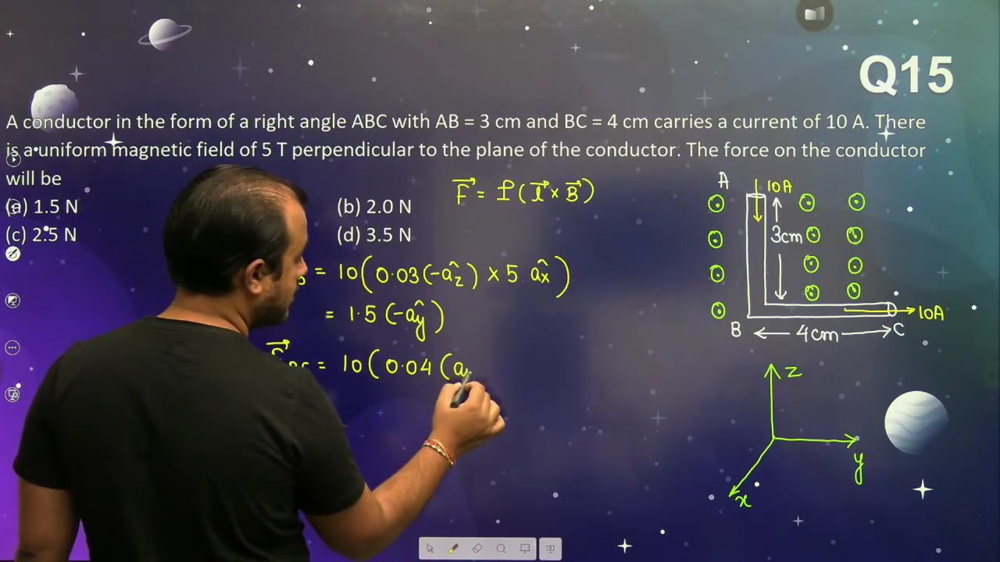

### Net Force and Resultant Magnitude

The total force on the conductor is the vector sum of the forces on both arms:
$$
\vec{F} = \vec{F}_{AB} + \vec{F}_{BC} = -1.5\hat{a}_y - 2\hat{a}_z\text{ N}
$$

Since the two force components are orthogonal, we find the magnitude using Pythagoras theorem:
$$
\begin{aligned}
|\vec{F}| &= \sqrt{F_y^2 + F_z^2} \\
&= \sqrt{(-1.5)^2 + (-2)^2} \\
&= \sqrt{2.25 + 4} = \sqrt{6.25} = 2.5\text{ N}
\end{aligned}
$$

> [!success] Result
> The net magnetic force on the conductor is $2.5\text{ N}$. The correct option is **(c)**.

### Alternative Method via Equivalent Conductor

We can also use an equivalent straight displacement vector $\vec{L}_{AC}$.
The magnetic force depends only on the endpoints in a uniform field:
$$
\vec{L}_{AC} = \vec{L}_{AB} + \vec{L}_{BC} = -0.03\hat{a}_z + 0.04\hat{a}_y\text{ m}
$$
The straight-line length between A and C is:
$$
L_{AC} = \sqrt{0.03^2 + 0.04^2} = 0.05\text{ m}
$$
Since $\vec{L}_{AC}$ lies entirely in the $y$-$z$ plane, it is perpendicular to $\vec{B} = 5\hat{a}_x\text{ T}$.
So the magnitude is simply:
$$
|\vec{F}| = I L_{AC} B = 10 \times 0.05 \times 5 = 2.5\text{ N}
$$
Both methods yield the exact same answer.

---

## Summary and Key Takeaways

- In doubly excited machines, electromagnetic torque is proportional to field strengths and torque angle via $T_e \propto F_s F_r \sin \delta$.
- Rotor pole count $P$ relates electrical and mechanical angles by $\theta_e = \frac{P}{2} \theta_m$, yielding $P/2$ cycles per mechanical revolution.
- Magnetic reluctance $\mathcal{R} = \frac{l}{\mu A}$ mirrors electrical resistance, while magnetic flux $\Phi = \frac{\mathcal{F}}{\mathcal{R}}$ directly mirrors electric current.
- A sliding rod on conductive rails experiences exponential dynamic braking with velocity profile $v(t) = v_0 e^{-\frac{B^2 l^2}{m R}t}$.
- Total magnetic flux linked by a coplanar rectangular loop near a straight conductor is $\Phi(t) = \frac{\mu_0 i(t) c}{2\pi} \ln\left(1 + \frac{b}{a}\right)$.
- Magnetic energy density is $w_f = \frac{B^2}{2\mu}$, which implies stored field energy scales directly with core volume.
- An axial current produces azimuthal fields parallel to a coaxial circular loop, giving zero net interaction force.
- In a uniform magnetic field, the net Lorentz force on a bent conductor satisfies $\vec{F} = I(\vec{L}_{net} \times \vec{B})$.

