[← Lec 006: Problems Based on Electromagnetic Laws](Lecture_006_Problems_Based_on_Electromagnetic_Laws.md) | [🏠 Index](00_yt_study_guide.md) | [Lec 008: Problems based on Magnetic Circuits →](Lecture_008_Problems_based_on_Magnetic_Circuits.md)

---

# Electrical Machines | Lec 6 | Magnetic Circuits | GATE Electrical Engineering | CRACK GATE Exam

- **Source**: https://www.youtube.com/watch?v=nfBXR4X5p7Q
- **Duration**: 01:04:40
- **Compiled**: 2026-09-16

---

## Overview

This lecture establishes the theory and circuit analogies of magnetic circuits in electrical machines. It begins by mapping magnetic loops to electric networks using Ampere's circuital law and Ohm's law. The discussion develops core parameters including magnetomotive force, reluctance, and permeance alongside series and parallel combinations. Next, it analyzes practical non-idealities including air gap fringing, leakage flux, and the path of minimum reluctance. Finally, it solves numerical problems on non-uniform cores and shows how air gaps dominate total circuit reluctance.

## Contents

- [[#Concept of Magnetic Circuits and Ampere's Law in a Core|Concept of Magnetic Circuits and Ampere's Law in a Core]]
- [[#Derivation of Magnetic Field Intensity, Flux, and the Ohm's Law Analogy|Derivation of Magnetic Field Intensity, Flux, and the Ohm's Law Analogy]]
- [[#Analogies Between Electric and Magnetic Circuits|Analogies Between Electric and Magnetic Circuits]]
- [[#Permeance, Series and Parallel Magnetic Reluctance Combinations|Permeance, Series and Parallel Magnetic Reluctance Combinations]]
- [[#Magnetic Fringing at Air Gaps and Concept of Leakage Flux|Magnetic Fringing at Air Gaps and Concept of Leakage Flux]]
- [[#Path of Minimum Reluctance and the Leakage Coefficient|Path of Minimum Reluctance and the Leakage Coefficient]]
- [[#Problem 1: Series Core with Non-Uniform Cross-Section and Mean Path Length|Problem 1: Series Core with Non-Uniform Cross-Section and Mean Path Length]]
- [[#Geometric Dissection and Reluctance Parameters of Core Segments|Geometric Dissection and Reluctance Parameters of Core Segments]]
- [[#Problem 1 Solution and Problem 2 Formulation with an Air Gap|Problem 1 Solution and Problem 2 Formulation with an Air Gap]]
- [[#Problem 2 Solution: Air Gap Domination and Magnetizing Current|Problem 2 Solution: Air Gap Domination and Magnetizing Current]]
- [[#Air Gaps in Rotating Electrical Machines and Course Outlook|Air Gaps in Rotating Electrical Machines and Course Outlook]]

---

## Concept of Magnetic Circuits and Ampere's Law in a Core
_(00:13 - 04:54)_

### Definition of a Magnetic Circuit

In electric network theory, current flows in closed conducting loops.
Standard circuit laws like KVL, KCL, and nodal analysis govern electric loops.
In magnetic systems, magnetic field lines also form closed continuous loops.
Field lines never have isolated starting or ending points.

Because magnetic flux circulates in closed loops, we can model magnetic systems using electric circuit tools.

> [!info] Definition
> The representation of a system containing magnetic flux as an equivalent electrical network is called a magnetic circuit.

This model lets us analyze complex magnetic structures with simple network techniques.

### Elementary Magnetic System Setup

Consider a simple ferromagnetic core resembling a two-legged transformer structure.

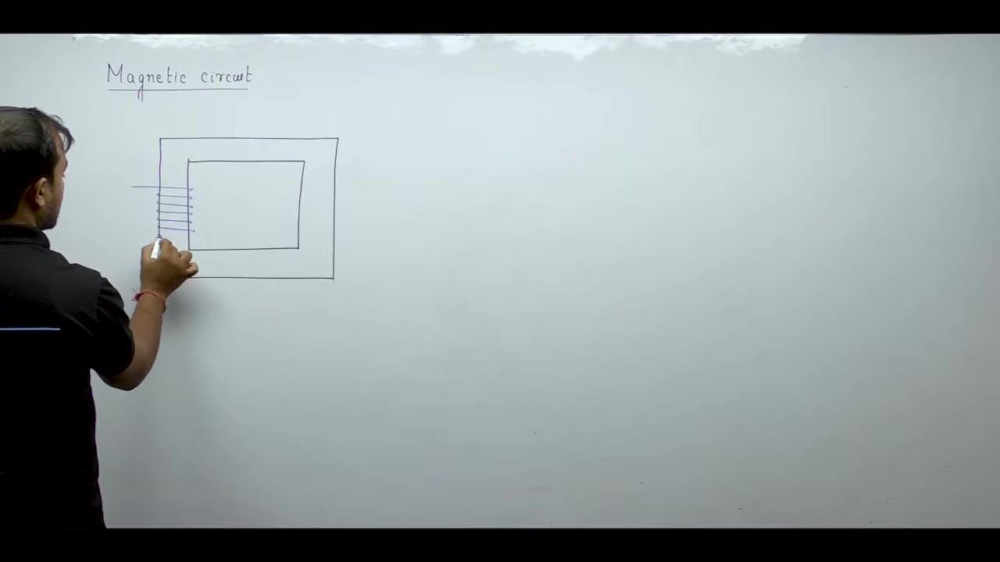

A coil with $N$ turns is wound around the left vertical limb.
An excitation current $I$ flows through the winding.
Our primary goal is to find the resulting magnetic flux $\Phi$.
To find the flux, we must first find the magnetic field intensity $\vec{H}$.

### Applying Ampere's Circuital Law

We use Ampere's circuital law to find the magnetic field intensity:
$$
\oint \vec{H} \cdot d\vec{l} = I_{\text{enc}}
$$
Here, $I_{\text{enc}}$ represents the total current enclosed by the integration contour.
We define a closed rectangular integration path ABCD passing through the core.

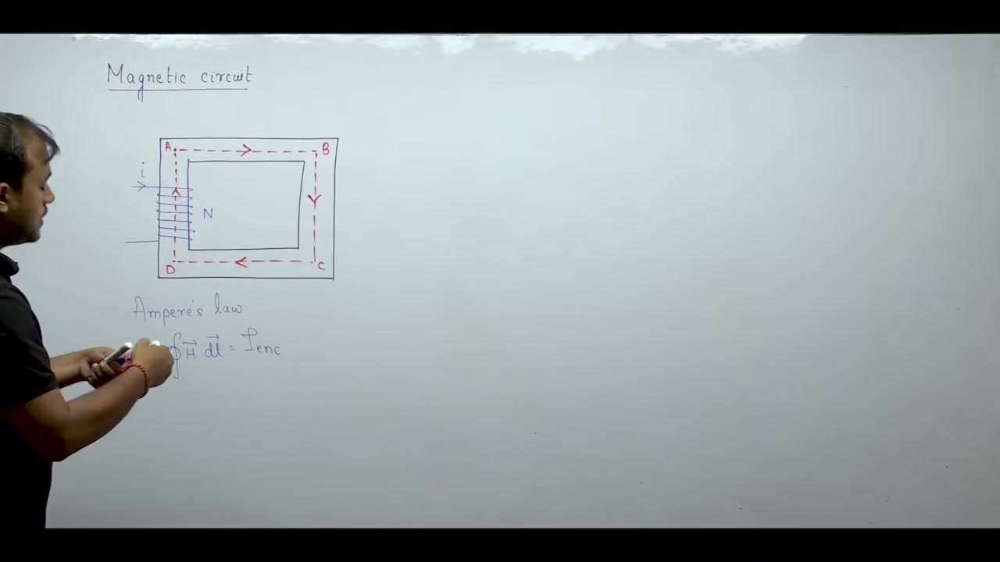

We find the direction of $\vec{H}$ using the right-hand rule.
Current flows forward across the front face and returns along the back face.
Curling the fingers of the right hand gives an upward field in the left limb.
The flux then circulates clockwise around the closed core loop.

### Line Integral Along the Mean Core Path

Along path ABCD, the magnetic field vector $\vec{H}$ and length element $d\vec{l}$ remain parallel everywhere.

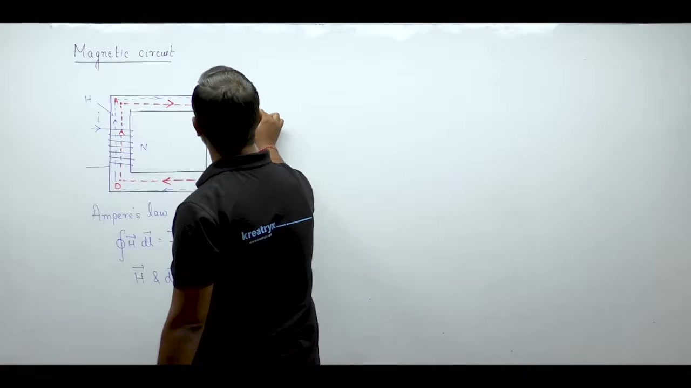

Because the vectors are parallel, the angle between them is zero.
The dot product simplifies directly to a scalar product:
$$
\vec{H} \cdot d\vec{l} = H \, dl \cos 0^\circ = H \, dl
$$
Let the mean circumference of the core path be $l$.
Assuming uniform field intensity along this mean path, the integral becomes:
$$
\oint \vec{H} \cdot d\vec{l} = H \oint dl = H l
$$
This product relates magnetic field intensity directly to the enclosed winding current.

## Derivation of Magnetic Field Intensity, Flux, and the Ohm's Law Analogy
_(05:01 - 12:57)_

### Enclosed Current and Magnetic Field Intensity

We now evaluate the enclosed current $I_{\text{enc}}$ in Ampere's circuital law.
The excitation winding contains $N$ turns.
Each individual turn carries exciting current $I$.
All $N$ turns pierce the planar area bounded by the core integration path.

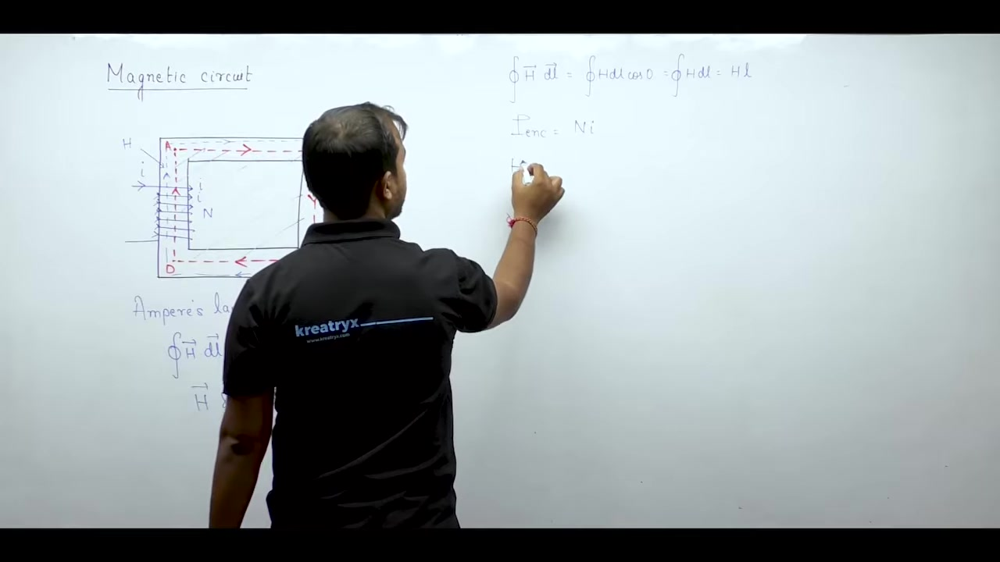

The total current enclosed by the contour is:
$$
I_{\text{enc}} = N I
$$
We equate the line integral of $\vec{H}$ to the enclosed current:
$$
H l = N I
$$
Solving for magnetic field intensity $H$ gives:
$$
H = \frac{N I}{l}
$$
Here, $N/l$ represents the turn density per unit length, similar to an ideal solenoid.

### Flux Density and Cross-Sectional Integration

Next, we determine the magnetic flux density $B$ inside the core.
The constitutive relationship for a linear magnetic material is:
$$
B = \mu H = \mu_0 \mu_r H
$$
Substituting our expression for $H$ yields:
$$
B = \frac{\mu N I}{l}
$$

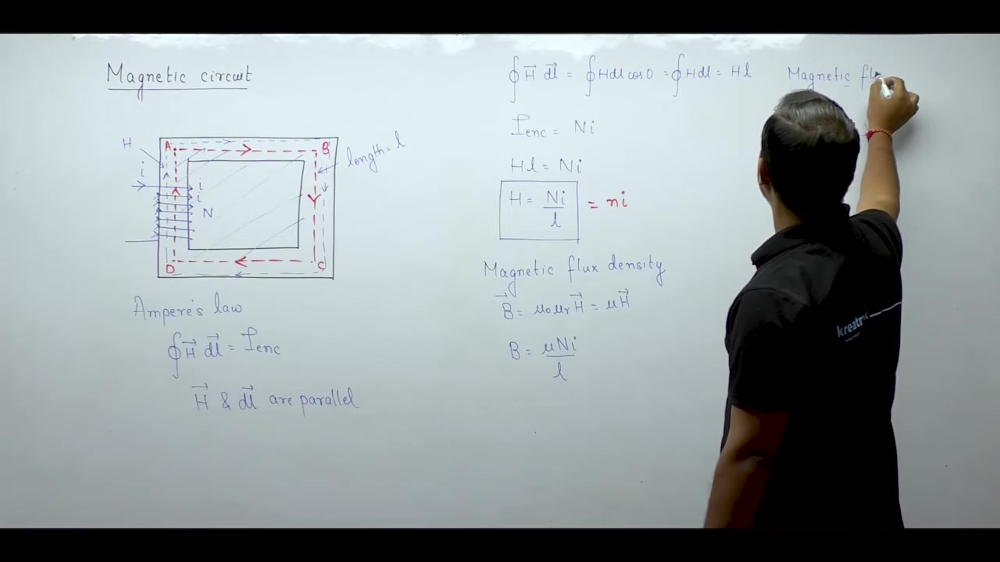

Total magnetic flux $\Phi$ is the surface integral of flux density across the core cross-section:
$$
\Phi = \iint \vec{B} \cdot d\vec{S}
$$
The differential area vector $d\vec{S}$ points normal to the cross-sectional surface.
The vector dot product takes the component of $\vec{B}$ parallel to $d\vec{S}$.

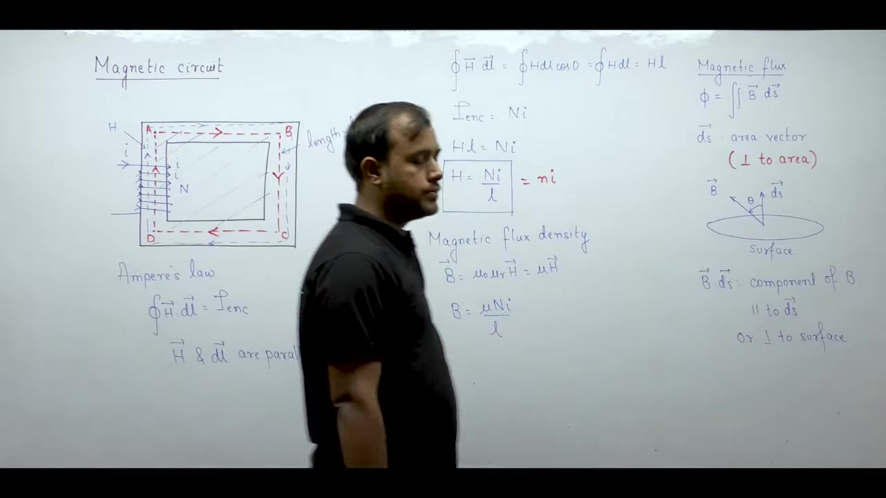

Because $d\vec{S}$ is normal to the surface, the dot product picks the normal component of flux density.
In isotropic media, $\vec{B}$ and $\vec{H}$ remain parallel.
So we always evaluate flux across cross-sections perpendicular to the field.

### Geometric Orientation of Core Cross-Sections

The direction of $\vec{B}$ shifts as flux circulates through the four limbs.

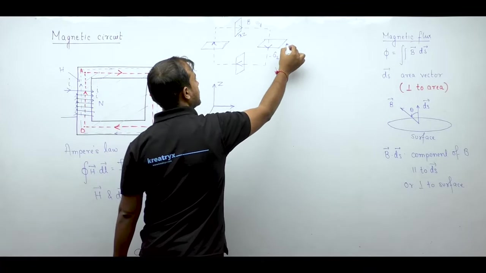

In the top horizontal yoke, $\vec{B}$ points along the positive $y$-axis.
The perpendicular cross-sectional area lies in the $x$-$z$ plane.
In the right vertical limb, $\vec{B}$ directs along the negative $z$-axis.
The perpendicular surface lies in the $x$-$y$ plane.
In every section, we multiply flux density by the normal cross-sectional area $A$.

### Magnetic Flux Expression and Comparison with Ohm's Law

Assuming uniform flux density over cross-sectional area $A$, the total flux is:
$$
\Phi = B A = \frac{\mu N I}{l} A
$$
We rewrite this equation by moving terms into the denominator:
$$
\Phi = \frac{N I}{\frac{l}{\mu A}}
$$

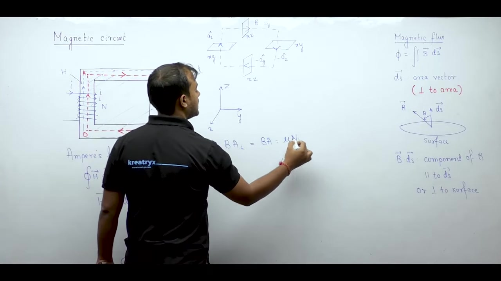

We now compare this expression with Ohm's law in electric circuits:
$$
I = \frac{V}{R}
$$
In an electric circuit, terminal voltage $V$ drives electric current $I$ against resistance $R$.
In our magnetic expression, the numerator $N I$ drives magnetic flux $\Phi$ against the denominator $\frac{l}{\mu A}$.
This direct mathematical equivalence forms the foundation of magnetic circuit analysis.

## Analogies Between Electric and Magnetic Circuits
_(13:04 - 18:52)_

### Driving Potential: Electromotive Force and Magnetomotive Force

In electric networks, electromotive force (EMF) provides the driving potential that establishes current.
In magnetic systems, the enclosed ampere-turns $N I$ provide the driving effort that establishes magnetic flux.

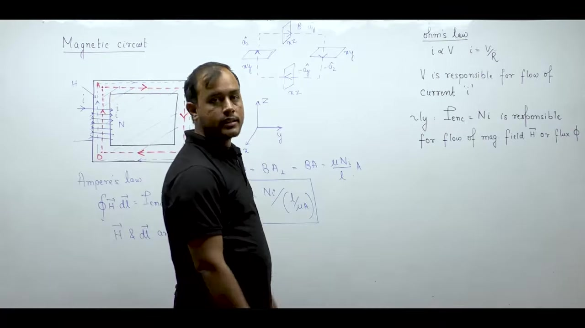

We call this product the magnetomotive force (MMF):
$$
\mathcal{F} = N I
$$
MMF acts as the exact magnetic counterpart to electric voltage.
Its SI unit is the ampere-turn ($\text{AT}$).

### Flow Variables: Current and Magnetic Flux

In electric circuits, electric current $I$ circulates through conducting paths.
In magnetic circuits, magnetic flux $\Phi$ links through ferromagnetic paths.
Both current and flux are scalar quantities.
Magnetic field intensity $\vec{H}$ is a spatial vector.
So flux $\Phi$, rather than $\vec{H}$, is the true scalar analog of current $I$.
Magnetic flux is measured in webers ($\text{Wb}$).

### Opposition to Flow: Resistance and Reluctance

In Ohm's law, resistance $R$ opposes electric current flow:
$$
R = \frac{\rho l}{A} = \frac{l}{\sigma A}
$$
Here, $\sigma$ represents electrical conductivity.

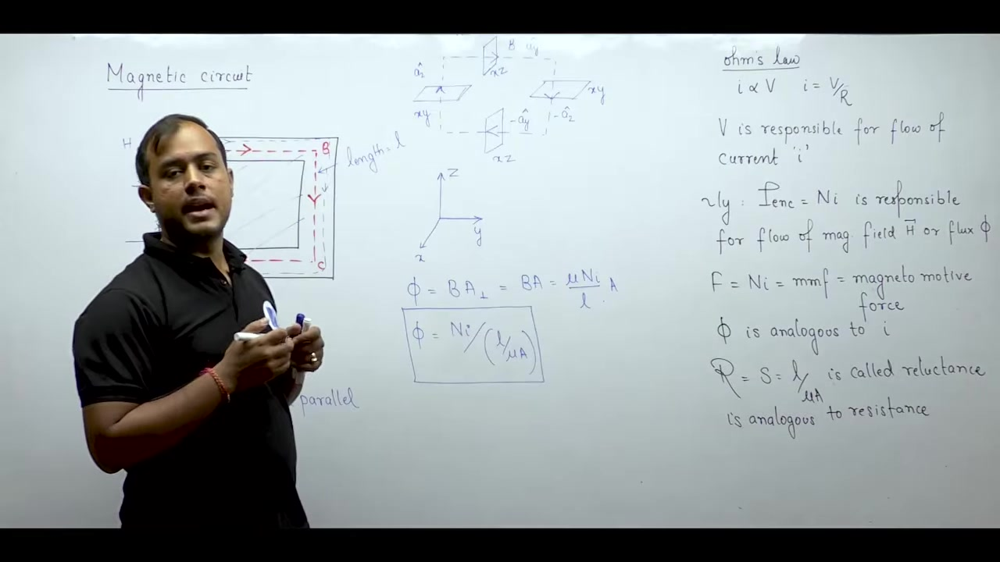

In our magnetic flux equation, the denominator opposes the establishment of magnetic flux.
We define this property as reluctance $\mathcal{R}$ (also denoted by symbol $S$):
$$
\mathcal{R} = S = \frac{l}{\mu A}
$$
Here, $\mu$ represents magnetic permeability.

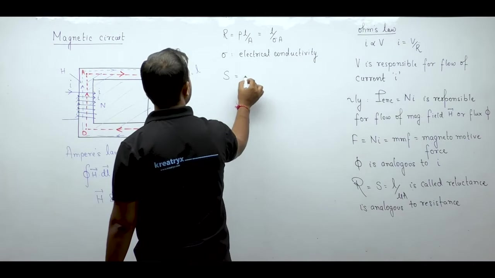

Electrical conductivity $\sigma$ measures how easily a material carries electric current.
Magnetic permeability $\mu$ measures how easily a medium establishes magnetic flux lines.
Thus, permeability $\mu$ directly mirrors electrical conductivity $\sigma$.

### Systematic Duality Table

Reluctance has the dimension of ampere-turns per weber ($\text{AT/Wb}$), or reciprocal henries ($\text{H}^{-1}$).

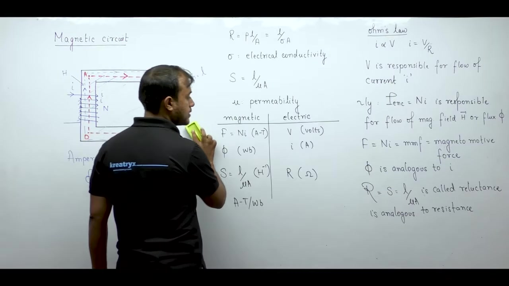

We summarize the mathematical duality between electric and magnetic circuits below:

| Characteristic | Electric Circuit | Magnetic Circuit |
| :--- | :--- | :--- |
| **Driving Potential** | Voltage / EMF: $V\text{ (V)}$ | Magnetomotive Force: $\mathcal{F} = N I\text{ (AT)}$ |
| **Flow Variable** | Current: $I = \frac{V}{R}\text{ (A)}$ | Magnetic Flux: $\Phi = \frac{\mathcal{F}}{\mathcal{R}}\text{ (Wb)}$ |
| **Opposition** | Resistance: $R = \frac{l}{\sigma A}\text{ (}\Omega\text{)}$ | Reluctance: $\mathcal{R} = \frac{l}{\mu A}\text{ (AT/Wb)}$ |
| **Material Property** | Conductivity: $\sigma\text{ (S/m)}$ | Permeability: $\mu\text{ (H/m)}$ |
| **Constitutive Law** | Ohm's Law: $J = \sigma E$ | Field Relation: $B = \mu H$ |

This one-to-one correspondence allows us to map any magnetic circuit problem into a familiar electric network.

## Permeance, Series and Parallel Magnetic Reluctance Combinations
_(18:59 - 24:05)_

### Equivalent Circuit Representation and Permeance

We model the magnetic circuit using an electrical equivalent loop.
The excitation winding acts as an active voltage source with value $\mathcal{F} = N I$.
The magnetic path acts as a resistance with reluctance $\mathcal{R}$ (or $S$).

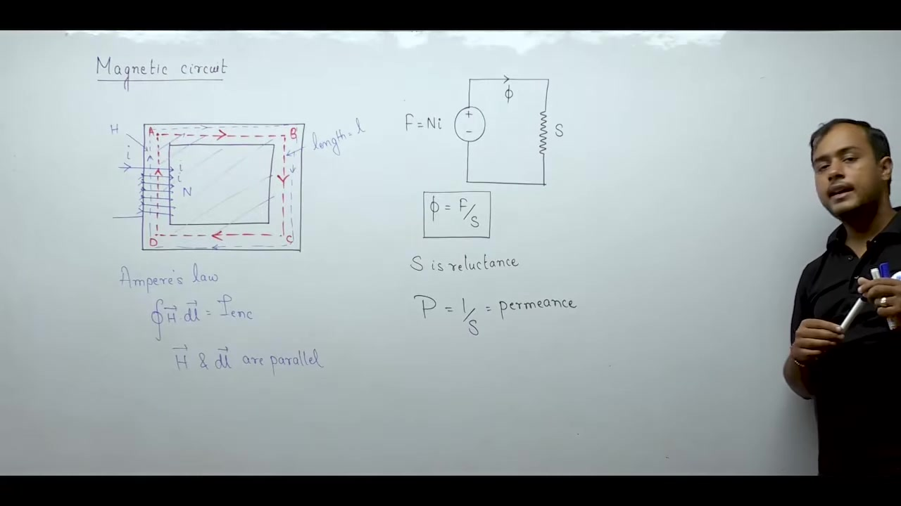

The magnetic flux circulating through the circuit is:
$$
\Phi = \frac{\mathcal{F}}{\mathcal{R}} = \frac{N I}{\mathcal{R}}
$$
Just as electrical resistance has a reciprocal called conductance, reluctance has a reciprocal called permeance.

> [!info] Definition
> Permeance $\mathcal{P}$ is the reciprocal of reluctance:
> $$
> \mathcal{P} = \frac{1}{\mathcal{R}} = \frac{\mu A}{l}
> $$
> It measures the ability of a magnetic medium to permit magnetic flux. Its SI unit is the henry ($\text{H}$).

While reluctance measures opposition to flux, permeance measures ease of flux passage.

### Series Combinations of Reluctances

Magnetic circuits combine in series and parallel exactly like electrical resistors.

In an electric circuit, elements are in series when the same current passes through them.
Similarly, magnetic path sections form a series circuit when the exact same flux traverses each segment.

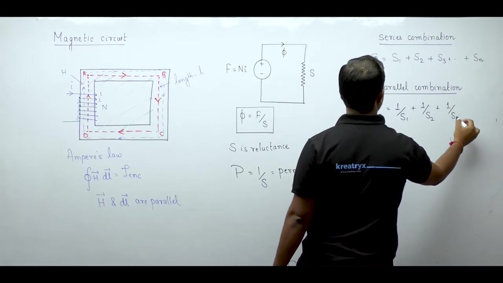

For a magnetic circuit composed of $m$ segments in series, the total reluctance is:
$$
\mathcal{R}_{\text{total}} = \mathcal{R}_1 + \mathcal{R}_2 + \mathcal{R}_3 + \dots + \mathcal{R}_m
$$
Since flux is constant, total required MMF is the sum of MMF drops across all sections:
$$
\mathcal{F}_{\text{total}} = \Phi \mathcal{R}_{\text{total}} = \sum_{k=1}^m \Phi \mathcal{R}_k
$$

### Parallel Combinations of Reluctances

In an electric circuit, paths form a parallel network when current divides between multiple branches.
Similarly, magnetic segments form a parallel circuit when the main flux divides into two or more parts.

For branches in parallel, the equivalent reluctance satisfies:
$$
\frac{1}{\mathcal{R}_{\text{eq}}} = \frac{1}{\mathcal{R}_1} + \frac{1}{\mathcal{R}_2} + \dots + \frac{1}{\mathcal{R}_p}
$$
In terms of permeances, parallel permeances add directly:
$$
\mathcal{P}_{\text{eq}} = \mathcal{P}_1 + \mathcal{P}_2 + \dots + \mathcal{P}_p
$$

### Physical Example: Shell-Type Transformer Core

A practical example of a parallel magnetic circuit appears in shell-type transformers.

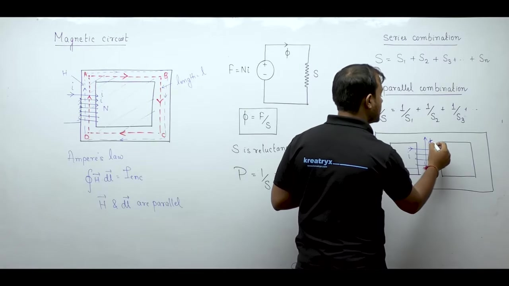

The excitation coil is wound around the central limb.
Current circulates to create an upward directed magnetic field in this center leg.
The total flux $\Phi$ emerges at the top of the central limb.
It then splits into two equal parts:
$$
\Phi = \Phi_1 + \Phi_2
$$
Flux $\Phi_1$ returns down the left outer limb.
Flux $\Phi_2$ returns down the right outer limb.
Because the flux divides across two separate return paths, the outer limbs operate in parallel.
When a single unbroken flux traverses the entire iron loop, the circuit is strictly series.

## Magnetic Fringing at Air Gaps and Concept of Leakage Flux
_(24:23 - 31:58)_

### Phenomenon of Magnetic Fringing

Ideally, magnetic field lines cross an air gap in straight lines perpendicular to the core face.
Real ferromagnetic cores have finite cross-sections and sharp boundary edges.
At these edges, the field lines bow outward into the surrounding space.

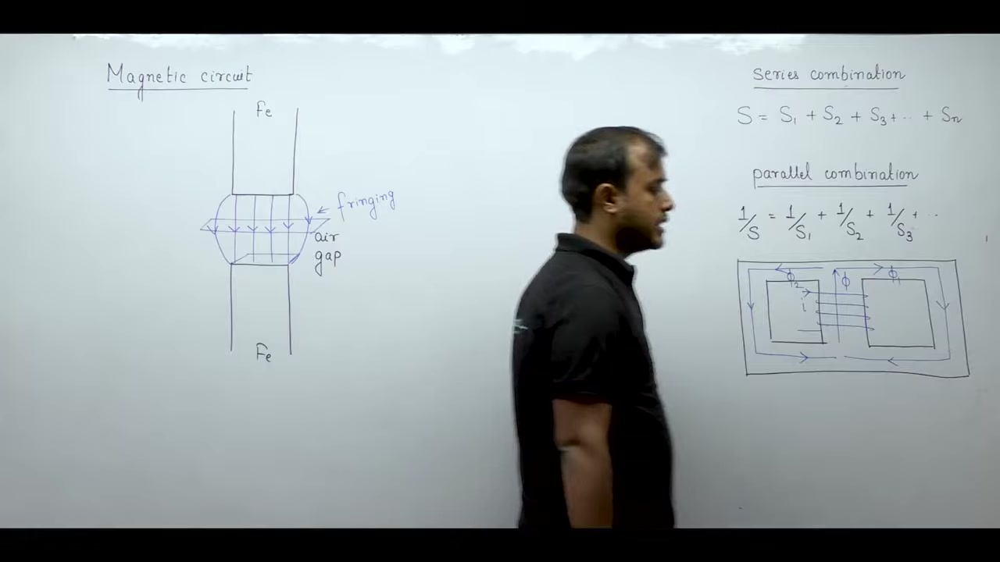

This outward bowing of magnetic field lines at core boundaries is called fringing.

> [!info] Definition
> The spreading of magnetic field lines outward at the edges of an air gap is called magnetic fringing.

Due to fringing, the effective cross-sectional area of the air gap expands beyond the geometric core area:
$$
A_{\text{gap}} > A_{\text{core}}
$$
This expansion lowers the flux density and reluctance in the gap compared to the ideal geometric value.

### Handling Fringing in Engineering Problems

If a problem specifies fringing, it provides an area enhancement factor.
For example, a $10\%$ expansion gives:
$$
A_{\text{gap}} = 1.1 A_{\text{core}}
$$
Unless a problem explicitly mentions fringing, we neglect it.
When neglected, the air gap area equals the iron core area:
$$
A_{\text{gap}} = A_{\text{core}}
$$

### Definition of Leakage Flux

In rotating machines and transformers, operation relies on mutual flux linking multiple windings.

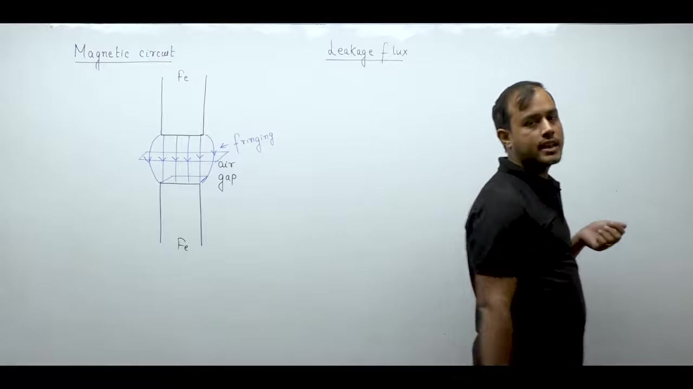

However, not all produced flux succeeds in linking both windings.
Some flux completes its closed loop through the air without reaching the second winding.

> [!info] Definition
> Flux that links only the excited winding and closes through air without reaching the target is called leakage flux.

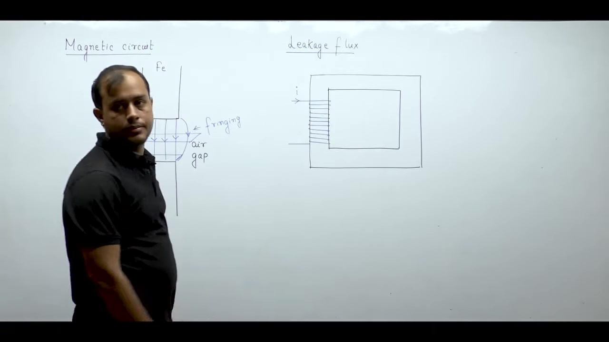

Total flux produced by the excitation coil divides into two components:
$$
\Phi = \Phi_{\text{iron}} + \Phi_{\text{leak}}
$$
Here, $\Phi_{\text{iron}}$ is the useful flux confined to the core.
The term $\Phi_{\text{leak}}$ represents stray leakage flux closing through surrounding air.

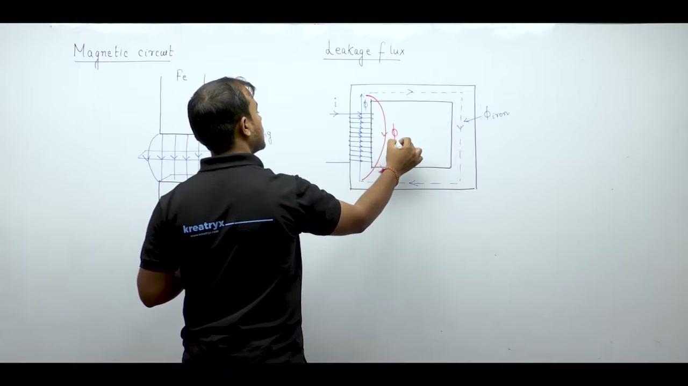

In elementary magnetic circuit calculations, we assume all flux remains within the iron core.
We neglect leakage flux unless the problem explicitly states otherwise.

## Path of Minimum Reluctance and the Leakage Coefficient
_(32:01 - 36:25)_

### Principle of Minimum Reluctance

Electric current divides among parallel paths inversely with their resistances.
Current preferentially flows through the path of minimum resistance.
In the same way, magnetic flux follows the path of minimum reluctance.

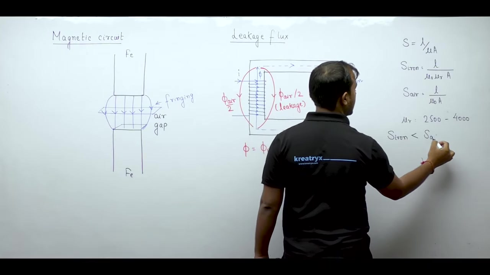

Recall the formula for reluctance:
$$
\mathcal{R} = \frac{l}{\mu A}
$$
For an iron core, the reluctance is:
$$
\mathcal{R}_{\text{iron}} = \frac{l}{\mu_0 \mu_r A}
$$
For a parallel air path of identical dimensions, the reluctance is:
$$
\mathcal{R}_{\text{air}} = \frac{l}{\mu_0 A}
$$

### Reluctance Ratio Between Iron and Air

Ferromagnetic materials have relative permeabilities $\mu_r$ ranging between $2500$ and $4000$.
Dividing by this large permeability makes the reluctance of iron much smaller than air:
$$
\mathcal{R}_{\text{iron}} \ll \mathcal{R}_{\text{air}}
$$
Because the iron path presents far lower reluctance, most magnetic flux stays inside the core.
Only a tiny fraction strays into the surrounding air as leakage flux.

### The Leakage Coefficient

We quantify this flux division using the leakage coefficient $\lambda$ (sometimes denoted by $\sigma$):

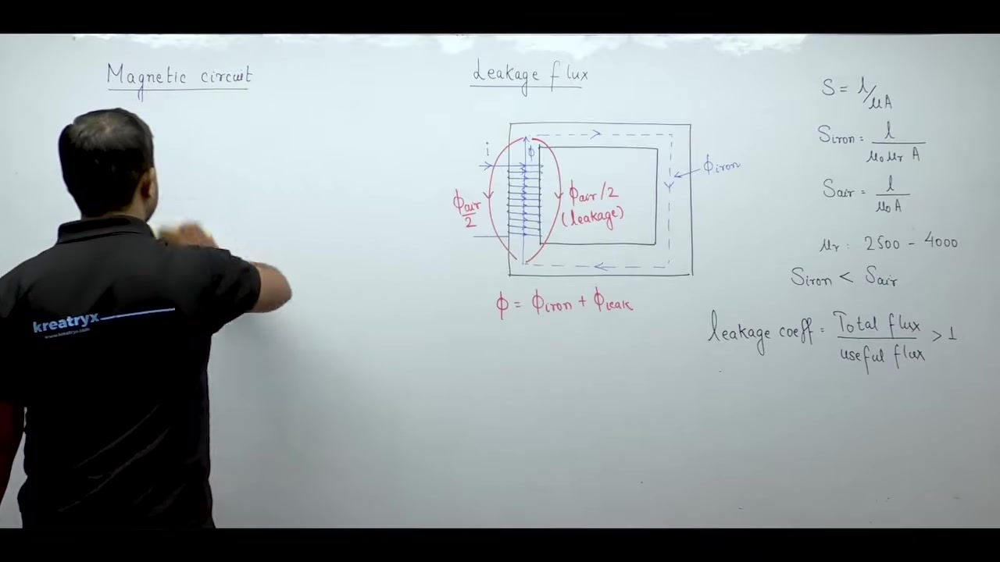

> [!info] Definition
> The leakage coefficient is the ratio of total generated flux to useful core flux:
> $$
> \lambda = \frac{\Phi_{\text{total}}}{\Phi_{\text{useful}}} = \frac{\Phi_{\text{iron}} + \Phi_{\text{leak}}}{\Phi_{\text{iron}}}
> $$

Because total flux always includes leakage flux, this ratio is strictly greater than one:
$$
\lambda > 1
$$
In ideal magnetic circuits, we take $\lambda = 1$ by neglecting leakage paths entirely.
This assumption gives an analytical approximation for solving practical machine problems.

### Transition to Worked Numerical Examples

This completes the core theoretical framework of magnetic circuits.
To apply these principles, we now turn to numerical problem solving.
We begin with a rectangular series core possessing non-uniform limb widths.

## Problem 1: Series Core with Non-Uniform Cross-Section and Mean Path Length
_(36:34 - 41:33)_

### Problem Statement

We examine a rectangular ferromagnetic core with unequal limb dimensions.

> [!example] Problem
> A ferromagnetic core has three sides of uniform width $15\text{ cm}$ and a fourth side of width $10\text{ cm}$.
> The interior rectangular window measures $30\text{ cm} \times 30\text{ cm}$.
> The core depth is $10\text{ cm}$.
> A 200-turn coil is wrapped around the left limb as shown in the diagram.
> Assume relative permeability $\mu_r = 2500$.
> Find the magnetic flux produced by an excitation current of $1\text{ A}$.

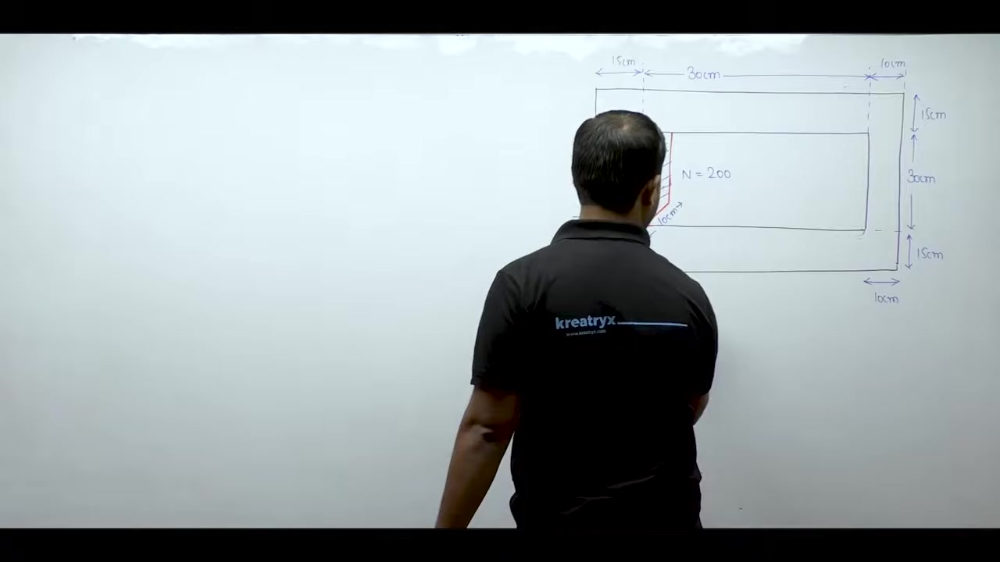

### Concept of Mean Core Length

To calculate reluctance, we must determine the length $l$ of the magnetic path.
In a solid core, magnetic field lines distribute across the entire cross-section.
The inner perimeter of the core is shorter than the outer perimeter.
Because path lengths vary continuously across the cross-section, we define an effective average path.

We adopt the standard engineering convention:
We assume that magnetic flux passes through the geometric centerline of each core limb.
The perimeter of this central closed contour is defined as the mean core length.

### Series Circuit Identification and Flux Direction

Current flows forward across the front of the winding and returns along the back.
By the right-hand rule, the magnetic field in the left limb points upward.
The resulting magnetic flux $\Phi$ circulates clockwise through the closed iron loop.

Because the core contains no branching legs or air gaps, the exact same flux traverses every segment.
Therefore, this system forms a series magnetic circuit.
To find the total reluctance, we compute the reluctance of each limb along this mean path.

## Geometric Dissection and Reluctance Parameters of Core Segments
_(41:34 - 46:33)_

### Dividing the Magnetic Path into Segments

We divide the mean closed contour into four straight sections: DA, AB, BC, and CD.
We must calculate the mean length $l$ and normal cross-sectional area $A$ for each section.

### Left Vertical Limb (Segment DA)

Limb DA has a width of $15\text{ cm}$.
Its mean length extends from the centerline of the bottom yoke to the centerline of the top yoke.
The bottom yoke contributes half its width, $7.5\text{ cm}$.
The interior window provides $30\text{ cm}$.
The top yoke also contributes half its width, $7.5\text{ cm}$.

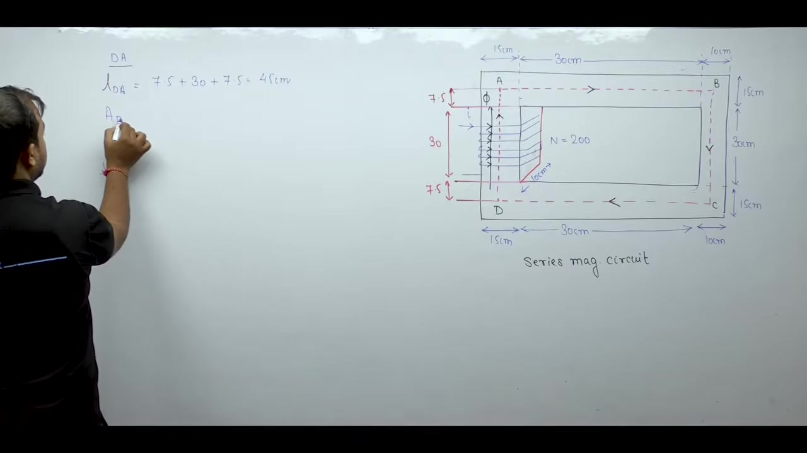

Summing these parts gives the mean length of DA:
$$
l_{DA} = 7.5 + 30 + 7.5 = 45\text{ cm} = 0.45\text{ m}
$$
In this limb, magnetic field lines point upward along $+\hat{a}_z$.
The flux cuts across the horizontal $x$-$y$ plane.
Its width along $y$ is $15\text{ cm}$ and its core depth along $x$ is $10\text{ cm}$:
$$
A_{DA} = 15 \times 10 = 150\text{ cm}^2 = 150 \times 10^{-4}\text{ m}^2
$$

### Top Horizontal Yoke (Segment AB)

The mean length of AB spans from the centerline of DA to the centerline of BC.
The left limb DA contributes half its width, $7.5\text{ cm}$.
The central window span is $30\text{ cm}$.
The thinner right limb BC has a width of $10\text{ cm}$, contributing half its width, $5\text{ cm}$.

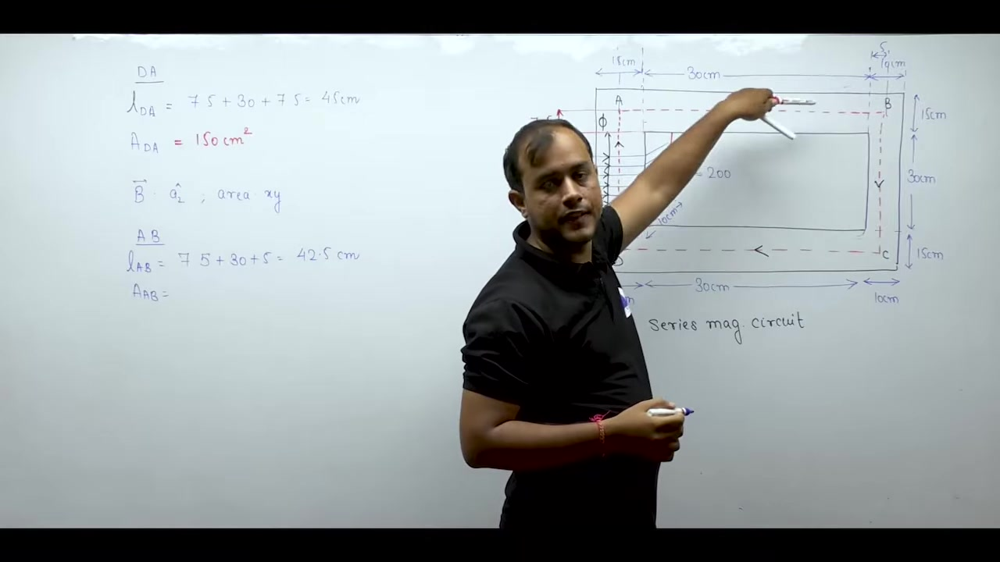

Summing these components gives:
$$
l_{AB} = 7.5 + 30 + 5 = 42.5\text{ cm} = 0.425\text{ m}
$$
The magnetic field travels horizontally to the right along $+\hat{a}_y$.
This horizontal flux intersects the vertical $x$-$z$ plane.
Its vertical height along $z$ is $15\text{ cm}$ and its core depth along $x$ is $10\text{ cm}$:
$$
A_{AB} = 15 \times 10 = 150\text{ cm}^2 = 150 \times 10^{-4}\text{ m}^2
$$

### Right Vertical Limb (Segment BC)

The right vertical limb BC has a reduced width of $10\text{ cm}$.
Its mean length spans between the centerlines of the top and bottom yokes.
Each yoke contributes half its $15\text{ cm}$ width, or $7.5\text{ cm}$.

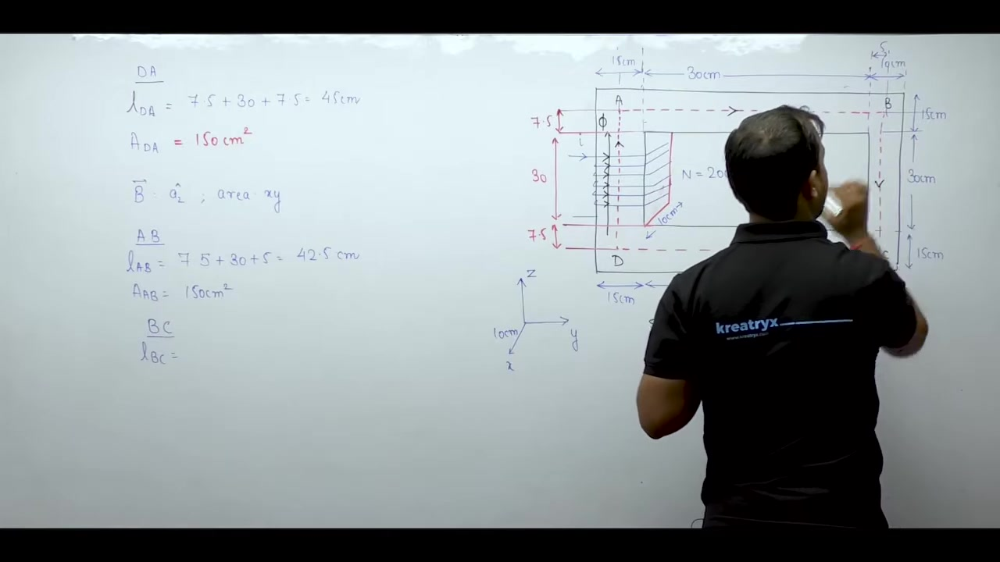

The mean length of BC is:
$$
l_{BC} = 7.5 + 30 + 7.5 = 45\text{ cm} = 0.45\text{ m}
$$
The magnetic field travels downward along $-\hat{a}_z$.
The downward flux cuts across the horizontal $x$-$y$ plane.
Its width along $y$ is $10\text{ cm}$ and its depth along $x$ is $10\text{ cm}$:
$$
A_{BC} = 10 \times 10 = 100\text{ cm}^2 = 100 \times 10^{-4}\text{ m}^2
$$

### Bottom Horizontal Yoke (Segment CD)

The bottom horizontal yoke CD has a vertical width of $15\text{ cm}$.
Its mean length spans from the centerline of BC to the centerline of DA:
$$
l_{CD} = 5 + 30 + 7.5 = 42.5\text{ cm} = 0.425\text{ m}
$$

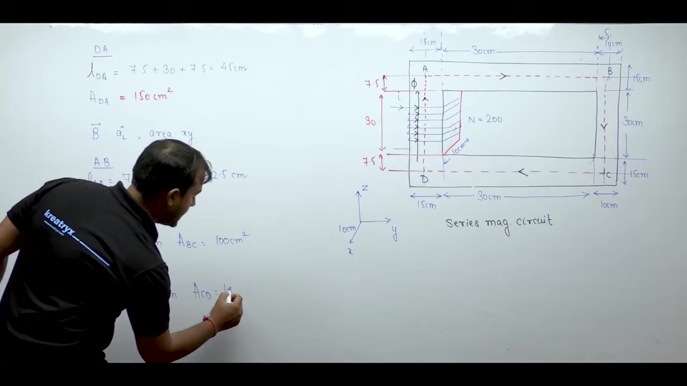

The magnetic field flows to the left along $-\hat{a}_y$.
The returning flux passes through the vertical $x$-$z$ plane.
With vertical height $15\text{ cm}$ and core depth $10\text{ cm}$, the area is:
$$
A_{CD} = 15 \times 10 = 150\text{ cm}^2 = 150 \times 10^{-4}\text{ m}^2
$$
Notice that limbs DA, AB, and CD share the exact same area of $150\text{ cm}^2$.
Only the right limb BC has a smaller area of $100\text{ cm}^2$.

## Problem 1 Solution and Problem 2 Formulation with an Air Gap
_(46:33 - 55:21)_

### Total Reluctance Evaluation for Problem 1

Because the same magnetic flux traverses each core segment in series, the total reluctance is:
$$
\mathcal{R}_{\text{total}} = \mathcal{R}_{DA} + \mathcal{R}_{AB} + \mathcal{R}_{BC} + \mathcal{R}_{CD}
$$
Writing each term explicitly gives:
$$
\mathcal{R}_{\text{total}} = \frac{l_{DA}}{\mu A_{DA}} + \frac{l_{AB}}{\mu A_{AB}} + \frac{l_{BC}}{\mu A_{BC}} + \frac{l_{CD}}{\mu A_{CD}}
$$

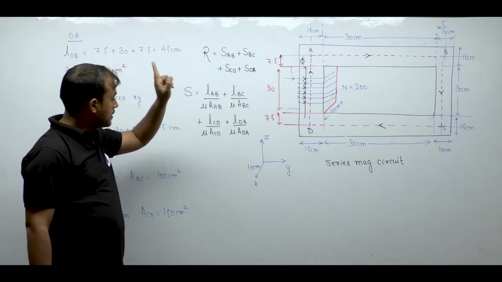

Limbs DA, AB, and CD share the exact same area $A_1 = 150\text{ cm}^2$.
We combine these three terms under a common denominator:
$$
\mathcal{R}_{\text{total}} = \frac{l_{DA} + l_{AB} + l_{CD}}{\mu A_1} + \frac{l_{BC}}{\mu A_2}
$$
We sum the lengths of the three identical-area sections:
$$
l_1 = l_{DA} + l_{AB} + l_{CD} = 45 + 42.5 + 42.5 = 130\text{ cm} = 1.3\text{ m}
$$
For limb BC, the length is $0.45\text{ m}$.
Its cross-sectional area is $100\text{ cm}^2 = 100 \times 10^{-4}\text{ m}^2$.

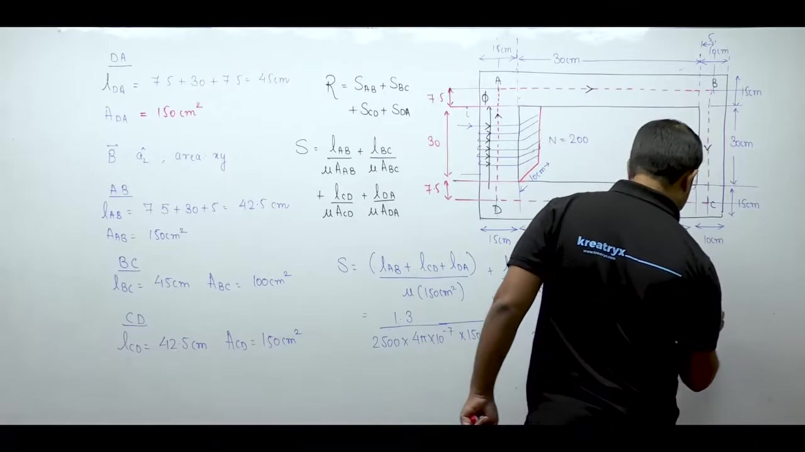

Substitute $\mu = \mu_0 \mu_r = 4\pi \times 10^{-7} \times 2500$:
$$
\begin{aligned}
\mathcal{R}_{\text{total}} &= \frac{1.3}{(2500)(4\pi \times 10^{-7})(150 \times 10^{-4})} + \frac{0.45}{(2500)(4\pi \times 10^{-7})(100 \times 10^{-4})} \\
&= 27,586.8 + 14,323.9 \approx 41,900\text{ AT/Wb}
\end{aligned}
$$

### Equivalent Network and Flux Calculation

The electrical equivalent circuit consists of an MMF source in series with reluctance $\mathcal{R}_{\text{total}}$.

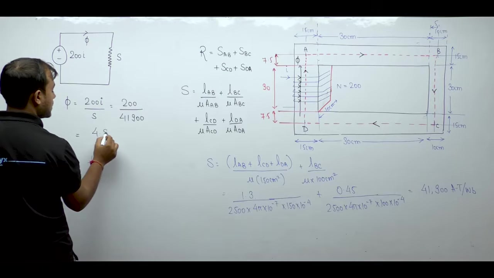

The driving MMF produced by $N = 200$ turns and $I = 1\text{ A}$ is:
$$
\mathcal{F} = N I = 200 \times 1 = 200\text{ AT}
$$
We calculate the resulting magnetic flux:
$$
\Phi = \frac{\mathcal{F}}{\mathcal{R}_{\text{total}}} = \frac{200}{41,900} \approx 4.77 \times 10^{-3}\text{ Wb} = 4.8\text{ mWb}
$$

> [!success] Result
> The magnetic flux produced in the core is $4.8\text{ mWb}$.

### Problem 2: Gapped Core with Fringing

We now examine a magnetic core containing a narrow air gap.

> [!example] Problem
> A ferromagnetic core has a mean path length of $40\text{ cm}$.
> A small air gap of length $0.05\text{ cm}$ is cut into one limb.
> The core cross-sectional area is $12\text{ cm}^2$ and $\mu_r = 4000$.
> The excitation coil has $N = 400$ turns.
> Due to fringing, the air gap area increases by $5\%$.
> - (a) Find the total reluctance of the magnetic circuit.
> - (b) Find the excitation current required to produce an air gap flux density of $0.5\text{ T}$.

### Setup and Iron Core Reluctance

The coil produces an upward field in the wound limb.
Clockwise flux traverses both the iron core and the air gap in series.
Because permeability differs between iron and air, we calculate two distinct reluctances.

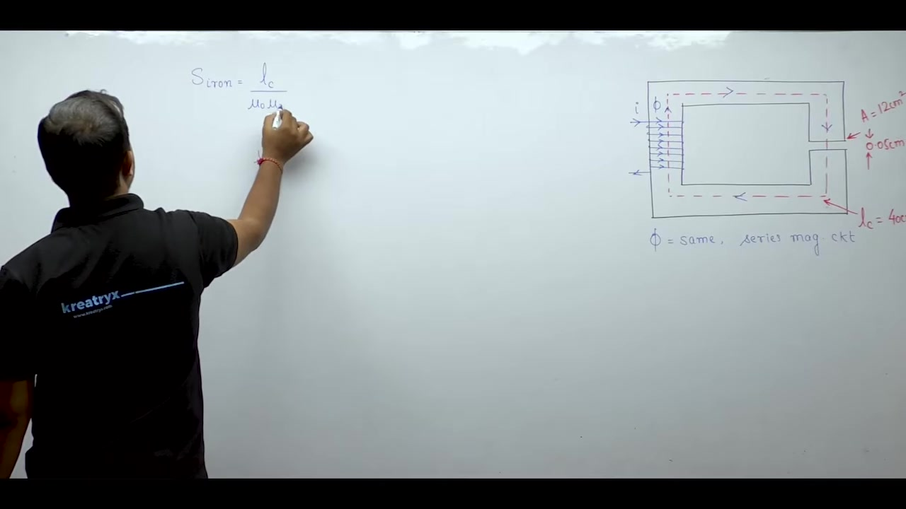

The geometric mean length of the entire loop is $l = 40\text{ cm}$.
The air gap length is $l_g = 0.05\text{ cm}$.
Strictly, the net iron length is:
$$
l_{\text{iron}} = 40 - 0.05 = 39.95\text{ cm} \approx 40\text{ cm}
$$
Because $0.05\text{ cm}$ is negligible compared to $40\text{ cm}$, taking $40\text{ cm}$ introduces minimal error.

## Problem 2 Solution: Air Gap Domination and Magnetizing Current
_(55:24 - 61:52)_

### Iron Core Reluctance Calculation

We first compute the reluctance of the ferromagnetic iron core:
$$
\mathcal{R}_{\text{iron}} = \frac{l_{\text{iron}}}{\mu_0 \mu_r A_{\text{core}}}
$$
Substitute $l_{\text{iron}} = 39.95\text{ cm} \approx 0.40\text{ m}$, $\mu_r = 4000$, and $A_{\text{core}} = 12 \times 10^{-4}\text{ m}^2$:
$$
\mathcal{R}_{\text{iron}} = \frac{0.40}{(4\pi \times 10^{-7})(4000)(12 \times 10^{-4})} \approx 66,314.56\text{ AT/Wb}
$$

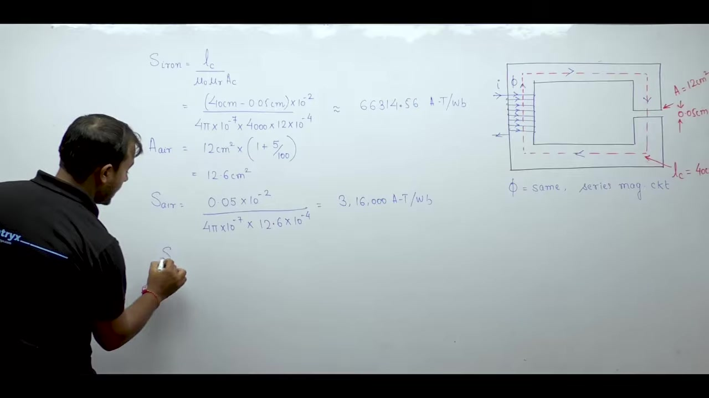

### Air Gap Reluctance Calculation with Fringing

Fringing expands the effective air gap area by $5\%$:
$$
A_{\text{gap}} = 12 \times 1.05 = 12.6\text{ cm}^2 = 12.6 \times 10^{-4}\text{ m}^2
$$
The air gap length is $l_g = 0.05\text{ cm} = 5 \times 10^{-4}\text{ m}$.
Its permeability is the free-space value $\mu_0 = 4\pi \times 10^{-7}\text{ H/m}$.
The air gap reluctance is:
$$
\mathcal{R}_{\text{gap}} = \frac{l_g}{\mu_0 A_{\text{gap}}} = \frac{5 \times 10^{-4}}{(4\pi \times 10^{-7})(12.6 \times 10^{-4})} \approx 315,785\text{ AT/Wb}
$$
The instructor rounds this value to $316,000\text{ AT/Wb}$.

### Total Reluctance and Air Gap Domination

Because the air gap and core iron are in series, we sum their reluctances:
$$
\mathcal{R}_{\text{total}} = \mathcal{R}_{\text{iron}} + \mathcal{R}_{\text{gap}} = 66,314.56 + 316,000 = 382,314.56\text{ AT/Wb}
$$

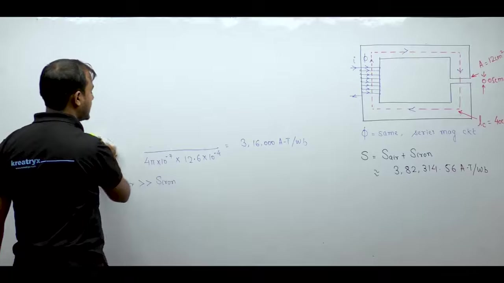

> [!success] Result
> The total reluctance of the magnetic circuit is $382,314.56\text{ AT/Wb}$ (approximately $382,300\text{ AT/Wb}$).

Notice that the $0.5\text{ mm}$ air gap contributes over $82\%$ of the total circuit reluctance.
Even a tiny air gap completely dominates the reluctance of an iron core.

### Excitation Current for Specified Gap Flux Density

We now solve part (b): find the excitation current for an air gap flux density $B_g = 0.5\text{ T}$.
The magnetic flux across the gap is:
$$
\Phi = B_g A_{\text{gap}} = 0.5 \times (12.6 \times 10^{-4}) = 6.3 \times 10^{-4}\text{ Wb}
$$

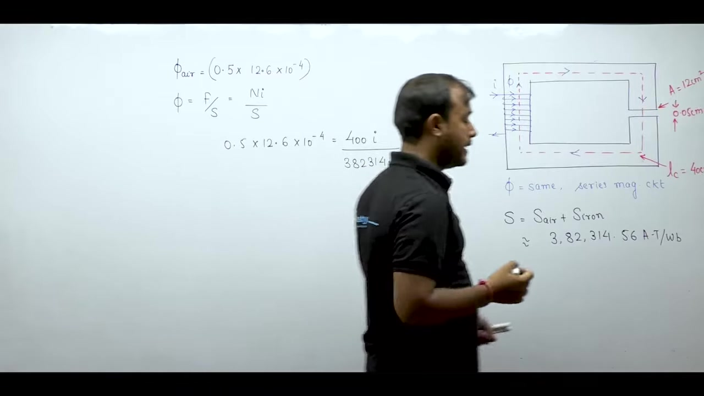

In a series circuit without leakage, this identical flux traverses the whole loop:
$$
\Phi = \frac{\mathcal{F}}{\mathcal{R}_{\text{total}}} = \frac{N I}{\mathcal{R}_{\text{total}}}
$$
Rearranging to solve for the excitation current gives:
$$
I = \frac{\Phi \mathcal{R}_{\text{total}}}{N}
$$
Substitute $N = 400\text{ turns}$, $\Phi = 6.3 \times 10^{-4}\text{ Wb}$, and $\mathcal{R}_{\text{total}} = 382,314.56\text{ AT/Wb}$:
$$
I = \frac{(6.3 \times 10^{-4})(382,314.56)}{400} \approx 0.602\text{ A} \approx 0.6\text{ A}
$$

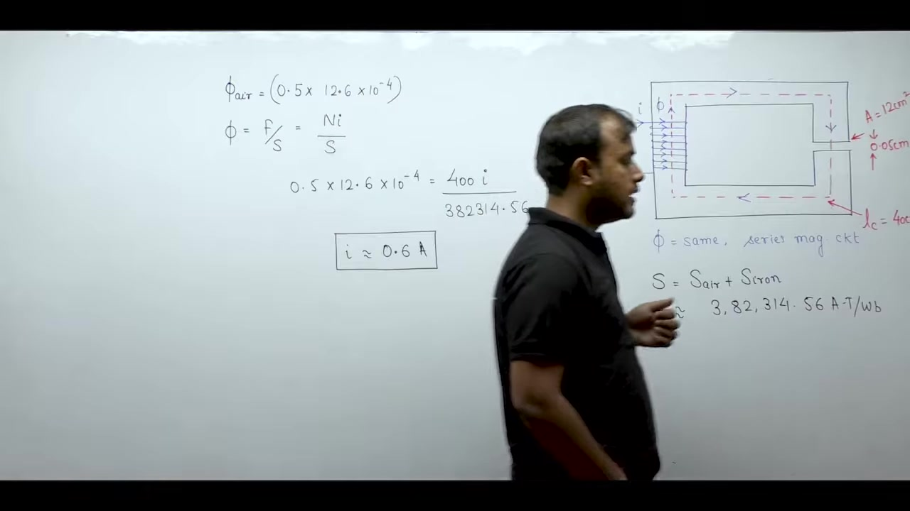

> [!success] Result
> The current required to establish $0.5\text{ T}$ in the air gap is approximately $0.6\text{ A}$.

### Physical Significance of Magnetizing Current

> [!info] Definition
> The electric current required to establish working magnetic flux in an electromagnetic core is called the magnetizing current.

When an air gap is introduced, magnetic reluctance rises sharply.
To maintain the same working flux, the driving MMF must increase proportionally.
For a fixed winding turn count, this higher MMF demands a larger magnetizing current.

## Air Gaps in Rotating Electrical Machines and Course Outlook
_(62:24 - 64:29)_

### Role of Air Gaps in Rotating Machinery

Every rotating electrical machine requires a mechanical air gap between its stationary stator and rotating rotor.
Without an air gap, the rotating parts would collide and cause destructive mechanical friction.
By contrast, static transformers have continuous closed magnetic cores without intentional air gaps.

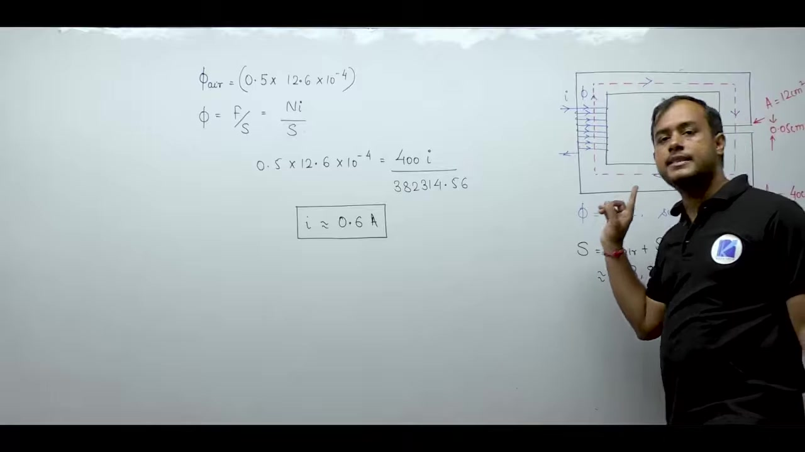

This structural difference explains a fundamental operational contrast between transformers and induction motors.
An induction motor requires a substantial magnetizing current to drive flux across its air gap.
A transformer of similar rating requires only a small fraction of that magnetizing current.
The air gap accounts for nearly all the reluctance in a rotating machine's magnetic path.

### Trade-Offs in Magnetic Circuit Design

Introducing an air gap produces two immediate consequences:
1. To maintain a constant working flux $\Phi$, the system requires higher MMF and greater input current.
2. If the excitation current is held constant, the air gap drastically reduces the established flux.

Designers keep the mechanical air gap as small as possible to limit magnetizing current and power factor drop.

### Summary and Foundations for Subsequent Topics

In this lecture, we established the two core pillars of magnetic circuit analysis:
- Magnetomotive force: $\mathcal{F} = N I$
- Reluctance: $\mathcal{R} = \frac{l}{\mu A}$

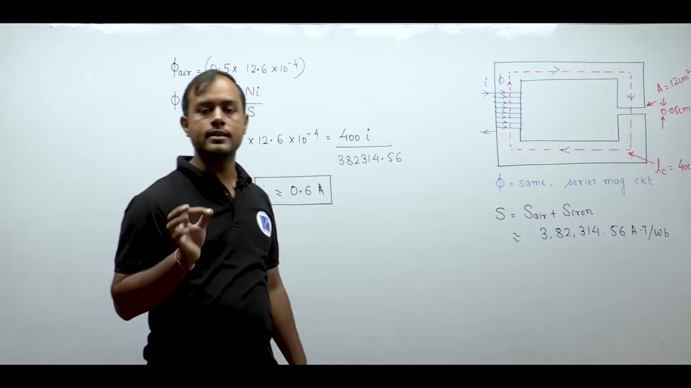

Always compute the magnetic path length along the geometric centerline of the core.
In our next lecture, we will study the per-unit system.
The per-unit system normalizes machine and power system calculations across voltage levels.

---

## Summary and Key Takeaways

- Magnetomotive force $\mathcal{F} = N I$ serves as the magnetic analog of voltage, measured in ampere-turns ($\text{AT}$).
- Magnetic flux $\Phi = \frac{\mathcal{F}}{\mathcal{R}}$ is the scalar flow analog of electric current, measured in webers ($\text{Wb}$).
- Magnetic reluctance $\mathcal{R} = \frac{l}{\mu A}$ opposes flux flow and mirrors electric resistance, while permeability $\mu$ mirrors electrical conductivity $\sigma$.
- In series magnetic circuits, identical flux traverses all segments and total reluctance is the sum $\mathcal{R}_{\text{total}} = \sum \mathcal{R}_k$.
- In parallel magnetic circuits, flux divides between branches and equivalent reluctance satisfies $\frac{1}{\mathcal{R}_{\text{eq}}} = \sum \frac{1}{\mathcal{R}_k}$.
- Magnetic fringing causes flux lines to bulge outward at air gaps, increasing the effective gap area.
- Leakage coefficient $\lambda = \frac{\Phi_{\text{total}}}{\Phi_{\text{useful}}}$ is strictly greater than one because stray flux closes through surrounding air.
- Mean magnetic path length must always be calculated along the geometric centerline of the core cross-section.
- Because air permeability is thousands of times lower than iron, a tiny air gap dominates total circuit reluctance.

---

[← Lec 006: Problems Based on Electromagnetic Laws](Lecture_006_Problems_Based_on_Electromagnetic_Laws.md) | [🏠 Index](00_yt_study_guide.md) | [Lec 008: Problems based on Magnetic Circuits →](Lecture_008_Problems_based_on_Magnetic_Circuits.md)
