# Problems based on Magnetic Circuits | L2 | Electrical Machines | GATE 2022 | #AnkitGoyal

- **Source**: https://www.youtube.com/watch?v=6cdNWXRMhvo
- **Duration**: 01:03:26
- **Compiled**: 2026-09-16

---

## Overview

This problem session solves essential examination problems on magnetic circuits and magnetic materials. It begins with conceptual questions evaluating air gaps, conductivity analogies, hysteresis loop areas, and permanent magnet properties. Next, it works through multi-limb cores and non-uniform series cores using mean path length analysis and Kirchhoff's laws. Finally, it derives coil inductance in toroidal air-gapped rings and quantifies flux reduction caused by finite core permeability.

## Contents

- [[#Introduction to Magnetic Circuit Problems and Role of Air Gaps|Introduction to Magnetic Circuit Problems and Role of Air Gaps]]
- [[#Permeability Analogy, Hysteresis Loss, and Permanent Magnet Properties|Permeability Analogy, Hysteresis Loss, and Permanent Magnet Properties]]
- [[#Coercivity versus Retentivity and Three-Limb Core Reluctance Setup|Coercivity versus Retentivity and Three-Limb Core Reluctance Setup]]
- [[#Outer Limb Reluctance and Magnetic Circuit Modeling|Outer Limb Reluctance and Magnetic Circuit Modeling]]
- [[#Completion of Question 6 and Non-Uniform Series Core Formulation|Completion of Question 6 and Non-Uniform Series Core Formulation]]
- [[#Mean Path Lengths and Total Flux in a Non-Uniform Core|Mean Path Lengths and Total Flux in a Non-Uniform Core]]
- [[#Problem 8 Setup and Branch Reluctance Derivations|Problem 8 Setup and Branch Reluctance Derivations]]
- [[#Network Analysis and Relative Permeability Solution|Network Analysis and Relative Permeability Solution]]
- [[#Geometric Analysis of Toroidal Ring Cores with Air Gaps|Geometric Analysis of Toroidal Ring Cores with Air Gaps]]
- [[#Inductance of Toroidal Cores and Core Permeability Variation|Inductance of Toroidal Cores and Core Permeability Variation]]
- [[#Permeability Attenuation Solution and Course Summary|Permeability Attenuation Solution and Course Summary]]

---

## Introduction to Magnetic Circuit Problems and Role of Air Gaps
_(00:07 - 07:16)_

Magnetic circuit analysis forms the foundation of transformer and rotating machine design. While electromagnetic field theory focuses on continuous spatial fields, magnetic circuit theory aggregates these fields into lumped parameters. Magnetomotive force mirrors voltage. Reluctance mirrors resistance. Magnetic flux mirrors electric current. This problem-solving session focuses on evaluating these parameters in practical ferromagnetic structures with air gaps.

### Why Air Gaps are Inserted in Magnetic Circuits

Practical electrical machines combine ferromagnetic cores with intentional air gaps. Rotating electrical machines require an air gap between stator and rotor to permit mechanical rotation. But inductors and transformers also incorporate intentional air gaps for magnetic reasons.

> [!example] Question 1: Role of Air Gaps in Magnetic Circuits
> An air gap is usually inserted in magnetic circuits to:
> - (a) increase m.m.f.
> - (b) increase the flux
> - (c) prevent saturation
> - (d) none of the above
> 
> **Correct Option:** (c) prevent saturation

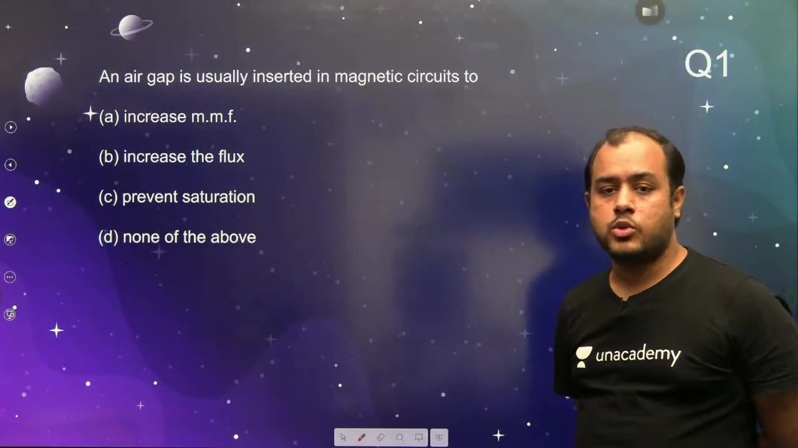

### Physics of Non-Saturating Magnetic Behavior

Ferromagnetic materials like cast iron, sheet steel, and silicon steel possess high relative permeability. However, they exhibit non-linear $B$-$H$ magnetization curves. Beyond a threshold magnetic field intensity, magnetic domain alignment saturates. Once saturated, further increases in exciting current yield negligible increases in magnetic flux density. Core saturation causes distorted magnetizing currents, increased core losses, and waveform harmonics.

By contrast, air and non-magnetic materials possess a strictly constant magnetic permeability:
$$
\mu_0 = 4\pi \times 10^{-7}\text{ H/m}
$$
In air, the relationship between flux density $B$ and field intensity $H$ remains strictly linear:
$$
B = \mu_0 H
$$
Air exhibits no magnetic saturation at any reachable magnetic field intensity.

> [!success] Physical Mechanism
> Introducing a small air gap into a closed ferromagnetic core alters the equivalent reluctance. The total reluctance becomes:
> $$
> \mathcal{R}_{\text{total}} = \mathcal{R}_{\text{iron}} + \mathcal{R}_{\text{gap}} = \frac{l_{\text{iron}}}{\mu_0 \mu_r A} + \frac{l_g}{\mu_0 A}
> $$
> Because $\mu_r \gg 1$, the air gap contributes substantial linear reluctance. This linear reluctance linearizes the composite magnetization characteristic and prevents premature saturation of the iron core.

### Air Gaps in Rotating Machinery

In static transformers, cores are closed loops without intentional air gaps to minimize required magnetizing current. In rotating electrical machines like induction motors and synchronous alternators, an air gap is mechanically mandatory. The stator and rotor must move relative to each other without physical contact. The mechanical clearance serves as the magnetic air gap that links stator and rotor flux.

## Permeability Analogy, Hysteresis Loss, and Permanent Magnet Properties
_(07:19 - 12:02)_

Magnetic circuits follow equations that mirror electric networks. Comparing electric resistance with magnetic reluctance shows the exact physical equivalence between circuit parameters.

### Electric and Magnetic Circuit Analogy

In electrical circuits, resistance opposes the flow of electric current. We write resistance in terms of electrical resistivity $\rho$ or conductivity $\sigma$:
$$
R = \frac{\rho l}{A} = \frac{l}{\sigma A}
$$
In magnetic circuits, reluctance opposes the establishment of magnetic flux:
$$
\mathcal{R} = \frac{l}{\mu A}
$$

> [!example] Question 2: Analogy for Magnetic Permeability
> Permeability in a magnetic circuit corresponds to which quantity in an electric circuit?
> - (a) resistance
> - (b) resistivity
> - (c) conductivity
> - (d) conductance
> 
> **Correct Option:** (c) conductivity

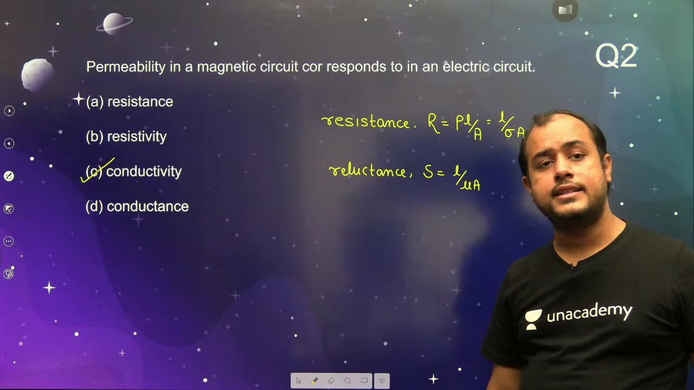

Comparing the denominators shows that magnetic permeability $\mu$ directly corresponds to electrical conductivity $\sigma$. Conductivity measures how easily charge carriers drift through a conductor. Permeability measures how easily magnetic flux lines establish through a magnetic material.

### Hysteresis Loss and Loop Area

When ferromagnetic material undergoes alternating magnetization, magnetic domains rotate back and forth. This cyclic domain movement expends energy as heat.

> [!example] Question 3: Hysteresis Loss and Loop Area
> If the area of the hysteresis loop of a material is large, the hysteresis loss in this material will be:
> - (a) zero
> - (b) small
> - (c) large
> - (d) none of the above
> 
> **Correct Option:** (c) large

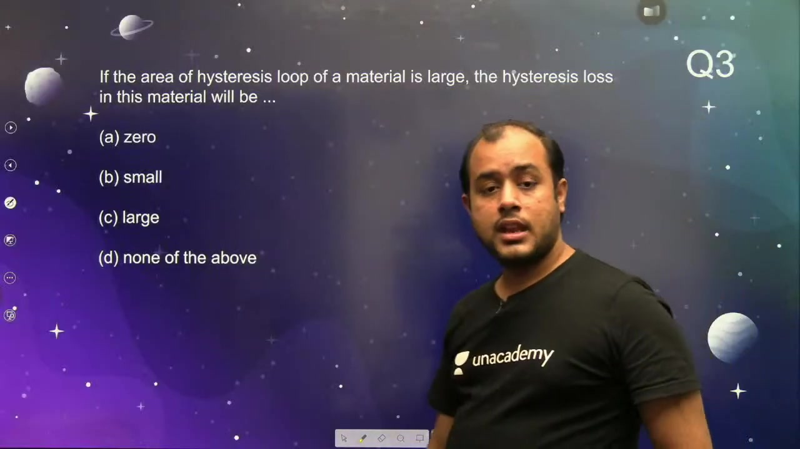

The energy lost per unit volume during each alternating cycle equals the enclosed area of the $B$-$H$ hysteresis loop. Total hysteresis power loss is given by Steinmetz's relation:
$$
P_h = (\text{Area of } B\text{-}H \text{ Loop}) \times V \times f
$$
Here $V$ is core volume and $f$ is operating frequency. A wider or taller loop directly produces larger hysteresis loss. For transformer cores, we choose silicon steel with narrow loops to minimize this loss.

### Materials for Permanent Magnets

Permanent magnets require properties opposite to those of transformer cores. A permanent magnet must produce continuous magnetic flux without external electric excitation.

> [!example] Question 4: Permanent Magnet Material Requirements
> Hard steel is suitable for making permanent magnets because:
> - (a) it has good residual magnetism
> - (b) its hysteresis loop has large area
> - (c) its mechanical strength is high
> - (d) its mechanical strength is low
> 
> **Correct Option:** (a) it has good residual magnetism

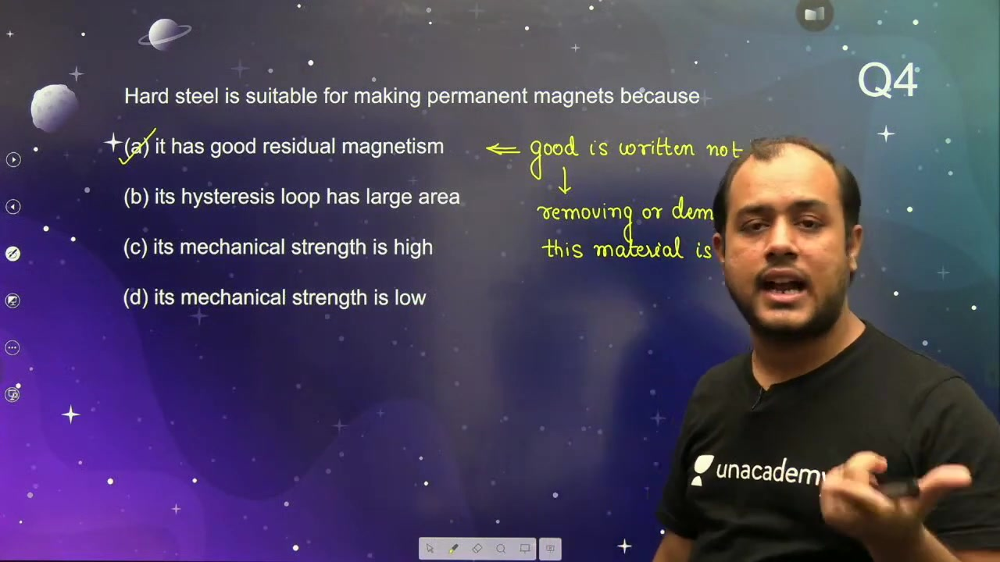

In permanent magnets, the retained flux density after removing excitation is called remanence or retentivity. The reverse magnetic field required to reduce flux density to zero is called coercivity. Hard steel provides stable residual magnetism and high coercive force. This high coercivity prevents stray magnetic fields or mechanical shocks from demagnetizing the magnet.

## Coercivity versus Retentivity and Three-Limb Core Reluctance Setup
_(12:12 - 18:54)_

Selecting magnetic materials requires balancing two distinct properties on the hysteresis loop: retentivity and coercivity. Understanding their physical distinction explains why soft and hard magnetic materials serve completely different applications.

### Retentivity and Coercivity on the Hysteresis Loop

The $B$-$H$ loop describes the relationship between magnetic flux density $B$ and magnetic field intensity $H$.

> [!example] Question 5: Magnetic Properties for Permanent Magnets
> Those materials are well suited for making permanent magnets which have:
> - (a) low retentivity and high coercivity
> - (b) high retentivity and high coercivity
> - (c) high retentivity and low coercivity
> - (d) low retentivity and low coercivity
> 
> **Correct Option:** (a) low retentivity and high coercivity (in examination context where high coercivity is mandatory)

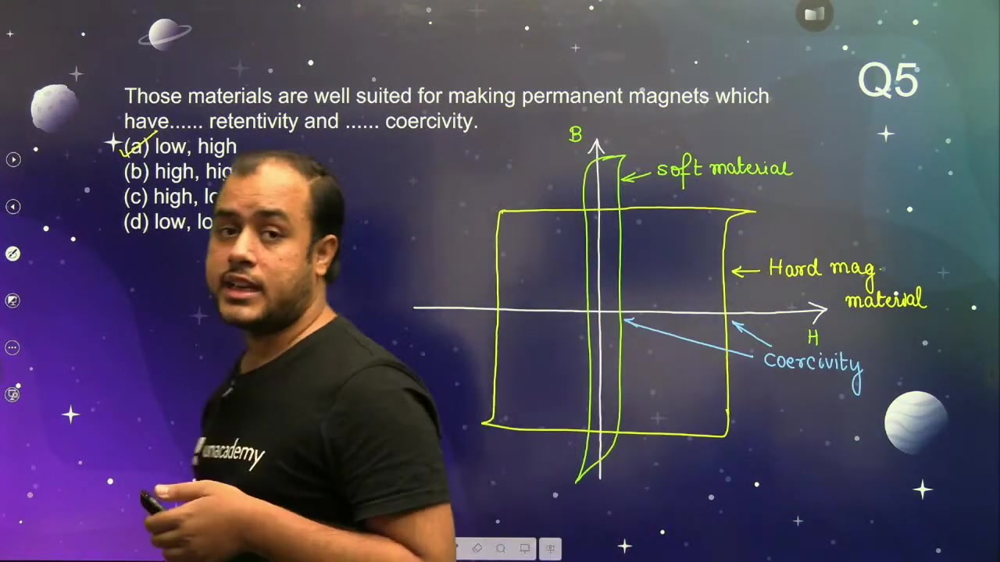

The intercept on the vertical $B$-axis represents retentivity or remanent flux density $B_r$. This is the residual magnetism retained when the exciting field drops to zero.

The intercept on the horizontal $H$-axis represents coercivity or coercive force $H_c$. This is the reverse magnetic field intensity needed to demagnetize the core completely.

Soft magnetic materials exhibit narrow loops with tiny coercivity. They magnetize and demagnetize with very little energy loss. They are ideal for transformers and motor cores. Hard magnetic materials exhibit wide loops with high coercivity. High coercivity ensures that permanent magnets resist accidental demagnetization.

### Problem Formulation: Symmetrical Three-Limb Magnetic Circuit

We now analyze a three-limb cast steel core with a central air gap.

> [!example] Question 6: Excitation Current for a Three-Limb Core
> The magnetic circuit shown has a cast steel core with $\mu_r = 2500$. The cross-sectional area of the central limb is $800\text{ mm}^2$. Each outer limb has an area of $600\text{ mm}^2$. The coil on the central limb has $N = 500\text{ turns}$. The central limb length is $110\text{ mm}$ with a $1\text{ mm}$ air gap. Each outer limb has a path length of $400\text{ mm}$. Calculate the exciting current needed to establish $0.8\text{ mWb}$ in the air gap, neglecting leakage and fringing.
> - (a) 1.93 A
> - (b) 1.59 A
> - (c) 1.83 A
> - (d) 1.64 A

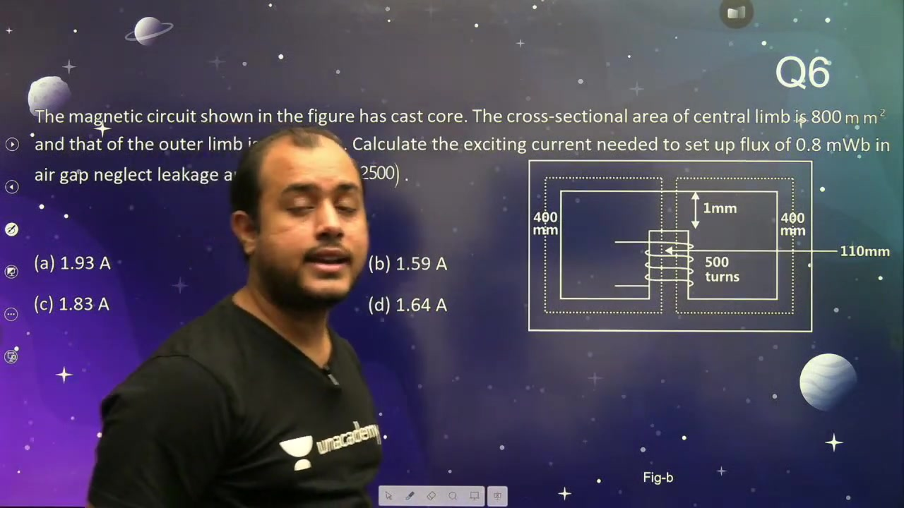

Neglecting leakage implies that all magnetic flux remains confined within the core and gap. Neglecting fringing means the effective area of the air gap equals the core face area:
$$
A_g = A_c = 800\text{ mm}^2 = 800 \times 10^{-6}\text{ m}^2
$$

### Reluctance of the Air Gap and Central Limb

First, calculate the reluctance of the air gap. The air gap length is $l_g = 1\text{ mm} = 10^{-3}\text{ m}$:
$$
\mathcal{R}_g = \frac{l_g}{\mu_0 A_g} = \frac{10^{-3}}{\mu_0 \times 800 \times 10^{-6}} = \frac{1.25}{\mu_0}
$$
We keep $\mu_0$ in the denominator algebraically to simplify intermediate calculations.

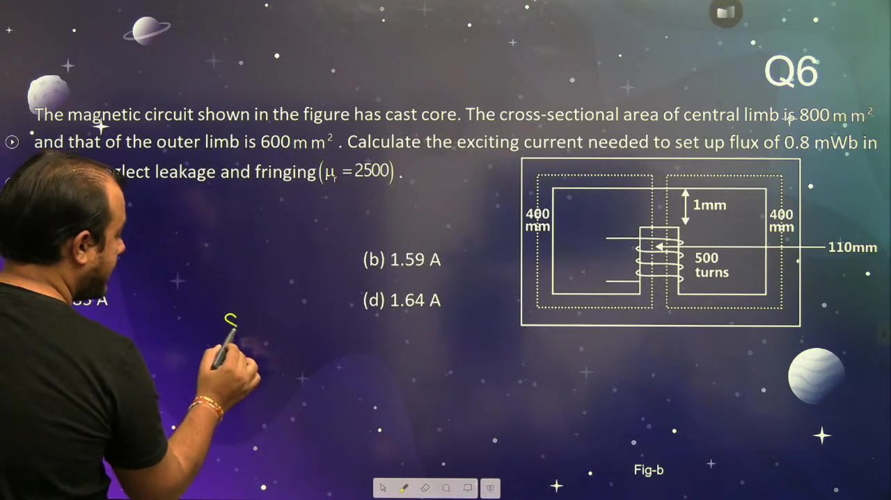

Next, calculate the reluctance of the central ferromagnetic iron limb. The central limb length is $l_c = 110\text{ mm} = 0.11\text{ m}$. With $\mu_r = 2500$:
$$
\mathcal{R}_c = \frac{l_c}{\mu_0 \mu_r A_c} = \frac{0.11}{\mu_0 \times 2500 \times 800 \times 10^{-6}}
$$
Evaluating the denominator:
$$
2500 \times 800 \times 10^{-6} = 2
$$
So the central limb reluctance is:
$$
\mathcal{R}_c = \frac{0.11}{2\mu_0} = \frac{0.055}{\mu_0}
$$
Notice that subtracting the $1\text{ mm}$ air gap from the $110\text{ mm}$ iron length changes the result by under one percent.

## Outer Limb Reluctance and Magnetic Circuit Modeling
_(18:54 - 22:43)_

We now complete the reluctance calculations for the three-limb core. We then construct the equivalent electrical dual circuit to solve for the required magnetizing current.

### Reluctance of the Outer Limbs

The magnetic circuit contains two symmetrical outer limbs. Each outer limb has a mean path length $l_{\text{side}} = 400\text{ mm} = 0.4\text{ m}$. The cross-sectional area of each outer limb is:
$$
A_{\text{side}} = 600\text{ mm}^2 = 600 \times 10^{-6}\text{ m}^2
$$
Both limbs share the relative permeability $\mu_r = 2500$.

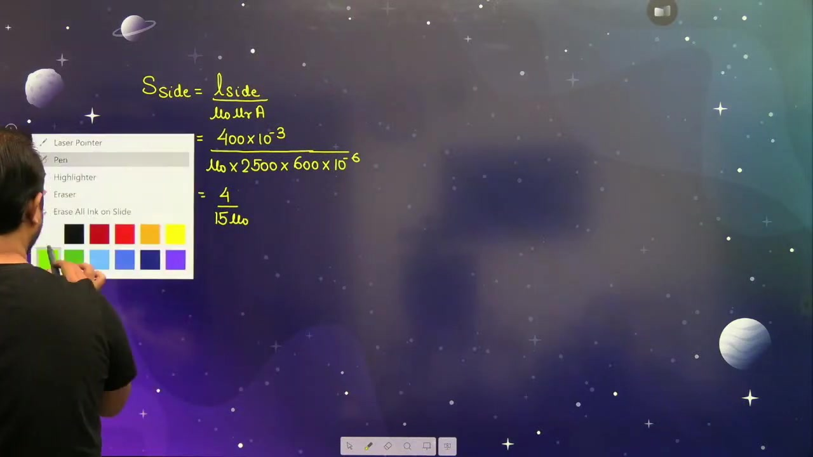

The reluctance of one outer limb is:
$$
\mathcal{R}_{\text{side}} = \frac{l_{\text{side}}}{\mu_0 \mu_r A_{\text{side}}} = \frac{0.4}{\mu_0 \times 2500 \times 600 \times 10^{-6}}
$$
Evaluating the denominator:
$$
2500 \times 600 \times 10^{-6} = 1.5
$$
So the reluctance of each side limb simplifies to:
$$
\mathcal{R}_{\text{side}} = \frac{0.4}{1.5\mu_0} = \frac{4}{15\mu_0}
$$
Because the two outer limbs are identical in length, cross-section, and material, their reluctances are equal.

### Equivalent Magnetic Circuit Topology

We represent the physical core by an equivalent lumped-parameter magnetic circuit. The central limb contains the exciting coil. This coil acts as an active potential source:
$$
\mathcal{F} = N I
$$
In series with this source sit the central limb iron reluctance $\mathcal{R}_c$ and the air gap reluctance $\mathcal{R}_g$.

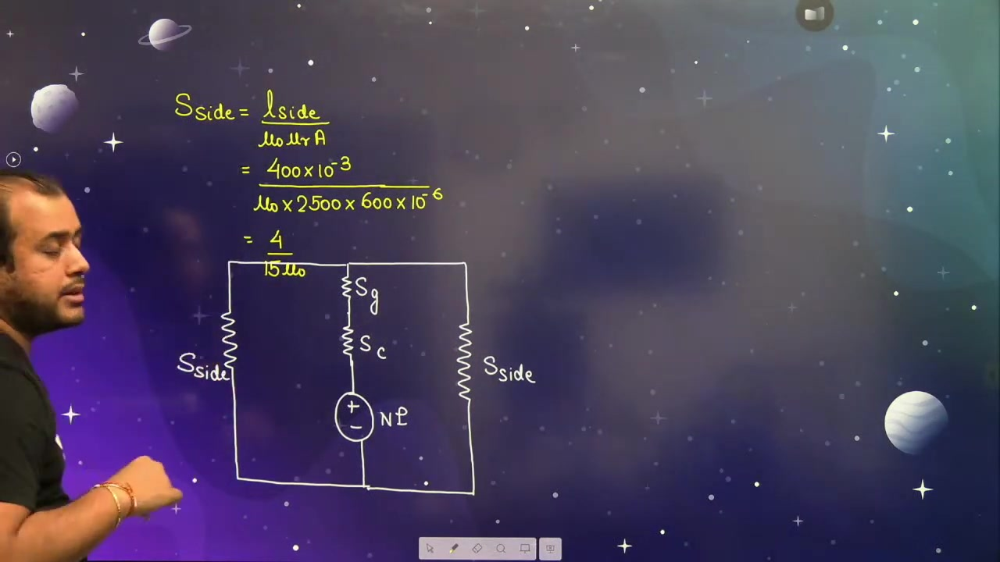

At the top yoke junction, the total flux $\Phi_{\text{total}}$ splits into two parallel return paths. The two outer limbs form two symmetrical parallel branches.

Because the two outer branches have identical reluctances, the total central flux divides equally:
$$
\Phi_{\text{side}} = \frac{\Phi_{\text{total}}}{2} = \frac{0.8\text{ mWb}}{2} = 0.4\text{ mWb}
$$

### Applying Kirchhoff's Magnetic Voltage Law

Kirchhoff's voltage law in magnetic circuits states that the sum of MMF drops around any closed loop equals the enclosed source MMF:
$$
\sum \mathcal{F} = \sum \Phi_k \mathcal{R}_k
$$
Tracing a loop through the central limb and either outer limb gives:
$$
N I = \Phi_{\text{total}}(\mathcal{R}_g + \mathcal{R}_c) + \Phi_{\text{side}}\mathcal{R}_{\text{side}}
$$
Substitute the values $\Phi_{\text{total}} = 0.8 \times 10^{-3}\text{ Wb}$ and $\Phi_{\text{side}} = 0.4 \times 10^{-3}\text{ Wb}$:
$$
N I = 0.8 \times 10^{-3}\left(\frac{1.25}{\mu_0} + \frac{0.055}{\mu_0}\right) + 0.4 \times 10^{-3}\left(\frac{4}{15\mu_0}\right)
$$
Summing the central terms gives:
$$
1.25 + 0.055 = 1.305
$$
Factoring out $\frac{10^{-3}}{\mu_0}$ yields:
$$
N I = \frac{10^{-3}}{\mu_0}\left[0.8(1.305) + 0.4\left(\frac{4}{15}\right)\right]
$$
This compact formulation leaves $\mu_0 = 4\pi \times 10^{-7}\text{ H/m}$ to be substituted just once at the final step.

## Completion of Question 6 and Non-Uniform Series Core Formulation
_(22:47 - 32:26)_

We now complete the numerical evaluation for Question 6 to find the exciting current. Then we formulate the second major problem involving a non-uniform rectangular series core.

### Completing Question 6: Current Calculation

From the KVL loop equation of the three-limb magnetic circuit:
$$
N I = \frac{10^{-3}}{\mu_0}\left[0.8(1.305) + 0.4\left(\frac{4}{15}\right)\right]
$$
Evaluate the terms inside the brackets:
$$
0.8 \times 1.305 = 1.044
$$
$$
0.4 \times \frac{4}{15} = \frac{1.6}{15} \approx 0.1067
$$
Summing these contributions:
$$
1.044 + 0.1067 = 1.1507
$$
Substitute $\mu_0 = 4\pi \times 10^{-7}\text{ H/m}$:
$$
N I = \frac{10^{-3} \times 1.1507}{4\pi \times 10^{-7}} \approx 915.7\text{ AT}
$$
With $N = 500\text{ turns}$, the required excitation current is:
$$
I = \frac{N I}{N} = \frac{915.7}{500} \approx 1.83\text{ A}
$$

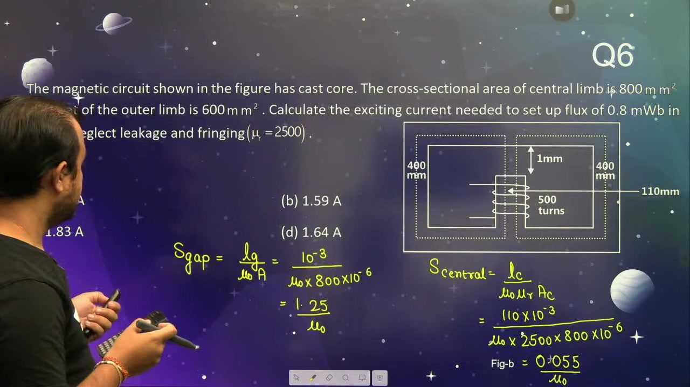

> [!success] Result for Question 6
> The excitation current required to establish $0.8\text{ mWb}$ in the central air gap is $1.83\text{ A}$. Option (c) is correct.

### Problem Formulation: Non-Uniform Rectangular Core

We now examine a continuous rectangular ferromagnetic core with unequal limb widths.

> [!example] Question 7: Magnetic Flux in a Non-Uniform Core
> A ferromagnetic core has three sides of uniform width ($15\text{ cm}$) and a fourth side that is thinner ($10\text{ cm}$). The uniform core depth is $10\text{ cm}$. The interior window measures $30\text{ cm} \times 30\text{ cm}$. A 200-turn coil is wrapped around the thinner left side. Given $\mu_r = 2500$, find the magnetic flux produced by an exciting current of $1\text{ A}$.

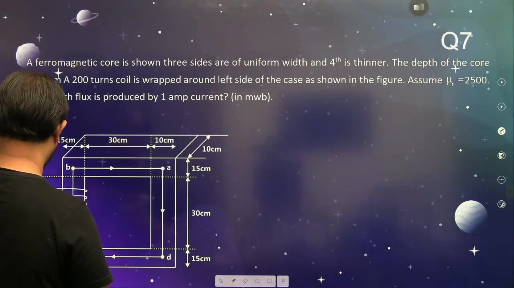

### Identifying Series Cross-Sectional Areas

In this single-window structure, magnetic flux lines circulate around a single closed rectangular path. Because no parallel bypass paths exist, identical magnetic flux $\Phi$ traverses every core section.

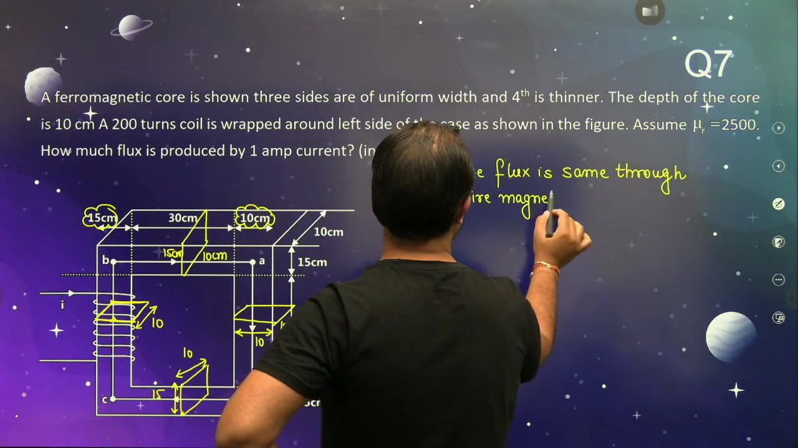

Because the magnetic flux is identical everywhere, the four segments connect in series:
$$
\mathcal{R}_{\text{total}} = \mathcal{R}_{AB} + \mathcal{R}_{BC} + \mathcal{R}_{CD} + \mathcal{R}_{DA}
$$
Next, identify the normal cross-sectional area for each segment:
- Top horizontal yoke AB: vertical width $15\text{ cm}$, depth $10\text{ cm}$, so $A_{AB} = 15 \times 10 = 150\text{ cm}^2$.
- Right vertical limb BC: horizontal width $15\text{ cm}$, depth $10\text{ cm}$, so $A_{BC} = 15 \times 10 = 150\text{ cm}^2$.
- Bottom horizontal yoke CD: vertical width $15\text{ cm}$, depth $10\text{ cm}$, so $A_{CD} = 15 \times 10 = 150\text{ cm}^2$.
- Left vertical limb DA: horizontal width $10\text{ cm}$, depth $10\text{ cm}$, so $A_{DA} = 10 \times 10 = 100\text{ cm}^2$.

Because segments AB, BC, and CD share the identical cross-sectional area $150\text{ cm}^2$, their reluctances combine cleanly:
$$
\mathcal{R}_{AB} + \mathcal{R}_{BC} + \mathcal{R}_{CD} = \frac{l_{AB} + l_{BC} + l_{CD}}{\mu_0 \mu_r (150 \times 10^{-4})}
$$
We now need the mean path length along the geometric centerline of each segment.

## Mean Path Lengths and Total Flux in a Non-Uniform Core
_(32:37 - 37:55)_

We now calculate the mean magnetic path lengths along the geometric centerline of each segment. We then evaluate the total reluctance and determine the magnetic flux produced by the coil.

### Calculating Mean Path Lengths of Core Segments

The mean magnetic path traces the centerline of the rectangular cross-section. Corner intersections contribute half the width of adjacent perpendicular limbs.

1. **Top Horizontal Yoke (Segment AB)**:
   The mean length extends from the center of left limb DA to the center of right limb BC. The thinner limb DA contributes half its width, $\frac{10}{2} = 5\text{ cm}$. The central window span is $30\text{ cm}$. The right limb BC contributes half its width, $\frac{15}{2} = 7.5\text{ cm}$:
   $$
   l_{AB} = 5 + 30 + 7.5 = 42.5\text{ cm} = 0.425\text{ m}
   $$

2. **Right Vertical Limb (Segment BC)**:
   The mean length extends from the centerline of the top yoke to the centerline of the bottom yoke. Each yoke has a width of $15\text{ cm}$, contributing $7.5\text{ cm}$. The interior window height is $30\text{ cm}$:
   $$
   l_{BC} = 7.5 + 30 + 7.5 = 45\text{ cm} = 0.45\text{ m}
   $$

3. **Bottom Horizontal Yoke (Segment CD)**:
   By symmetry with the top yoke, segment CD extends between the centerlines of limbs BC and DA:
   $$
   l_{CD} = 7.5 + 30 + 5 = 42.5\text{ cm} = 0.425\text{ m}
   $$

4. **Left Vertical Limb (Segment DA)**:
   Opposite vertical limbs span between the same horizontal yokes. Therefore, limb DA has the exact same mean length as limb BC:
   $$
   l_{DA} = 7.5 + 30 + 7.5 = 45\text{ cm} = 0.45\text{ m}
   $$

### Evaluating Segment Reluctances

Now compute the combined reluctance of the three limbs sharing the $150\text{ cm}^2$ cross-sectional area:
$$
l_{AB} + l_{BC} + l_{CD} = 42.5 + 45 + 42.5 = 130\text{ cm} = 1.30\text{ m}
$$
The combined reluctance is:
$$
\mathcal{R}_{AB} + \mathcal{R}_{BC} + \mathcal{R}_{CD} = \frac{1.30}{\mu_0 \mu_r \times 150 \times 10^{-4}} = \frac{13000}{150\mu_0 \mu_r} = \frac{260}{3\mu_0 \mu_r}
$$

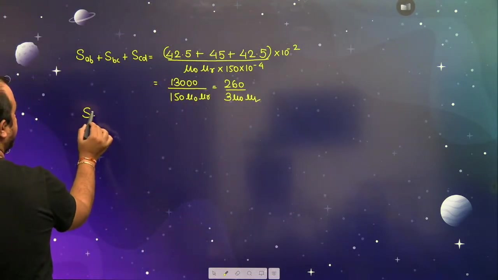

Next, compute the reluctance of the thinner left limb DA. Its area is $A_{DA} = 10 \times 10\text{ cm}^2 = 100 \times 10^{-4}\text{ m}^2$:
$$
\mathcal{R}_{DA} = \frac{0.45}{\mu_0 \mu_r \times 100 \times 10^{-4}} = \frac{45}{\mu_0 \mu_r}
$$

### Total Core Reluctance and Resulting Magnetic Flux

The four segments connect in series. We sum all four terms:
$$
\mathcal{R}_{\text{total}} = \frac{1}{\mu_0 \mu_r}\left(\frac{260}{3} + 45\right) = \frac{1}{\mu_0 \mu_r}\left(\frac{260 + 135}{3}\right) = \frac{395}{3\mu_0 \mu_r}
$$

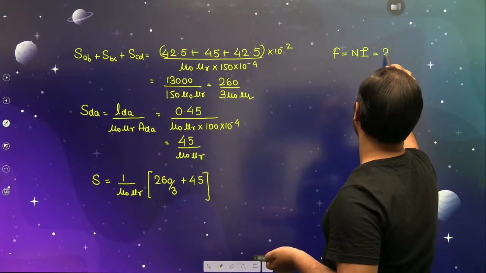

The coil contains $N = 200\text{ turns}$ and carries current $I = 1\text{ A}$. The driving magnetomotive force is:
$$
\mathcal{F} = N I = 200 \times 1 = 200\text{ AT}
$$
The circulating magnetic flux is:
$$
\Phi = \frac{\mathcal{F}}{\mathcal{R}_{\text{total}}} = \frac{200}{\frac{395}{3\mu_0 \mu_r}} = \frac{600 \mu_0 \mu_r}{395}
$$
Substitute $\mu_0 = 4\pi \times 10^{-7}\text{ H/m}$ and $\mu_r = 2500$:
$$
\Phi = \frac{600 \times (4\pi \times 10^{-7}) \times 2500}{395} = \frac{6 \pi \times 10^{-1}}{395} \approx 4.77 \times 10^{-3}\text{ Wb}
$$

> [!success] Result for Question 7
> The magnetic flux produced by a $1\text{ A}$ current in the non-uniform core is:
> $$
> \Phi = 4.77\text{ mWb}
> $$

## Problem 8 Setup and Branch Reluctance Derivations
_(37:58 - 43:17)_

In previous problems, we calculated magnetomotive force and total magnetic flux. In this problem, we invert the formulation to solve for an unknown material property: the relative permeability $\mu_r$ of the ferromagnetic core.

### Problem Formulation: Three-Limb Core with Unknown Permeability

> [!example] Question 8: Relative Permeability of a Three-Limb Core
> A three-limb magnetic circuit has a 500-turn coil wound on its central limb. The central limb has an air gap of $1\text{ mm}$. The magnetic path length from A to B via each outer limb is $100\text{ cm}$. The path length via the central limb is $25\text{ cm}$ (excluding the air gap). The cross-sectional area of the central limb is $5\text{ cm} \times 3\text{ cm}$. Each outer limb has a cross-sectional area of $2.5\text{ cm} \times 3\text{ cm}$. A coil current of $0.5\text{ A}$ produces an air-gap flux of $0.35\text{ mWb}$. Find the relative permeability $\mu_r$ of the core medium.

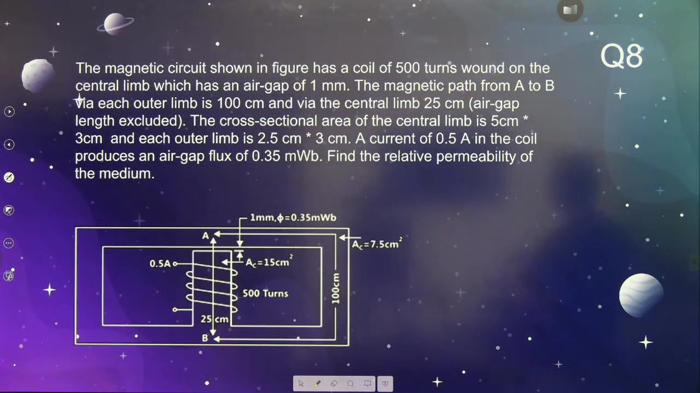

### Central Limb Core Reluctance

The central limb has length $l_c = 25\text{ cm} = 0.25\text{ m}$. Its cross-sectional area is:
$$
A_c = 5\text{ cm} \times 3\text{ cm} = 15\text{ cm}^2 = 15 \times 10^{-4}\text{ m}^2
$$
Its reluctance is:
$$
\mathcal{R}_c = \frac{l_c}{\mu_0 \mu_r A_c} = \frac{0.25}{\mu_0 \mu_r \times 15 \times 10^{-4}}
$$
Multiplying numerator and denominator by $10^4$:
$$
\mathcal{R}_c = \frac{2500}{15\mu_0 \mu_r} = \frac{500}{3\mu_0 \mu_r}
$$
We keep both $\mu_0$ and $\mu_r$ algebraic to avoid premature rounding.

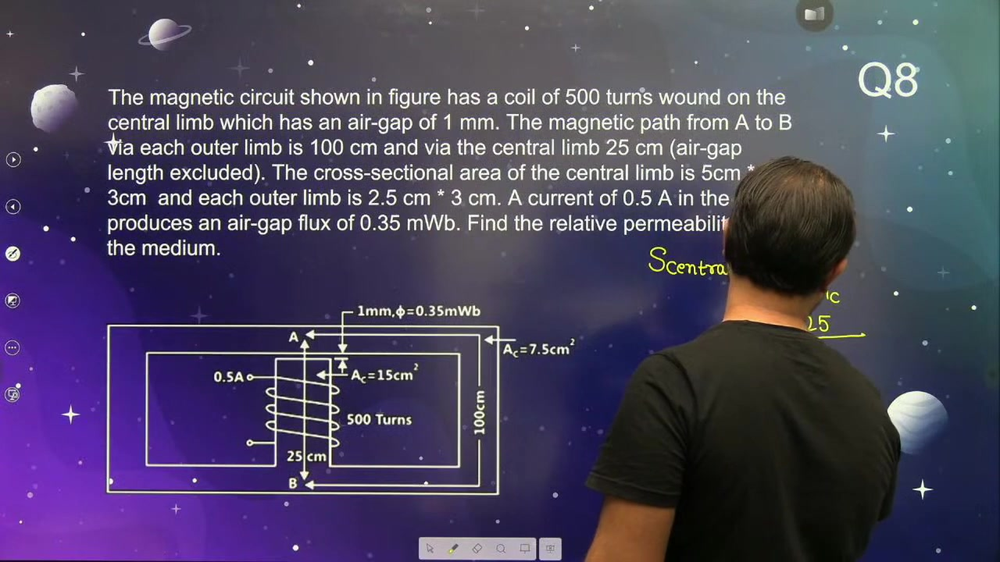

### Central Air Gap Reluctance

The air gap has length $l_g = 1\text{ mm} = 10^{-3}\text{ m}$. Neglecting fringing, the air gap cross-sectional area matches the central core face:
$$
A_g = A_c = 15 \times 10^{-4}\text{ m}^2
$$
Because air has relative permeability $\mu_r = 1$, the gap reluctance is:
$$
\mathcal{R}_g = \frac{l_g}{\mu_0 A_g} = \frac{10^{-3}}{\mu_0 \times 15 \times 10^{-4}} = \frac{10}{15\mu_0} = \frac{2}{3\mu_0}
$$

### Outer Limb Reluctance

Each outer limb has path length $l_{\text{outer}} = 100\text{ cm} = 1.0\text{ m}$. The cross-sectional area is:
$$
A_{\text{outer}} = 2.5\text{ cm} \times 3\text{ cm} = 7.5\text{ cm}^2 = 7.5 \times 10^{-4}\text{ m}^2
$$
The reluctance of one outer limb is:
$$
\mathcal{R}_{\text{outer}} = \frac{l_{\text{outer}}}{\mu_0 \mu_r A_{\text{outer}}} = \frac{1.0}{\mu_0 \mu_r \times 7.5 \times 10^{-4}} = \frac{10000}{7.5\mu_0 \mu_r} = \frac{4000}{3\mu_0 \mu_r}
$$
Both outer limbs are identical in geometry and material.

## Network Analysis and Relative Permeability Solution
_(43:19 - 48:26)_

We now set up the loop equations for the three-limb magnetic circuit. We combine the central and parallel outer branches to determine the relative permeability $\mu_r$.

### Equivalent Circuit Representation

The central limb contains the driving magnetomotive force:
$$
\mathcal{F} = N I = 500 \times 0.5 = 250\text{ AT}
$$
In series with this source are the central limb core reluctance $\mathcal{R}_c$ and air gap reluctance $\mathcal{R}_g$:
$$
\mathcal{R}_c = \frac{500}{3\mu_0 \mu_r}, \quad \mathcal{R}_g = \frac{2}{3\mu_0}
$$

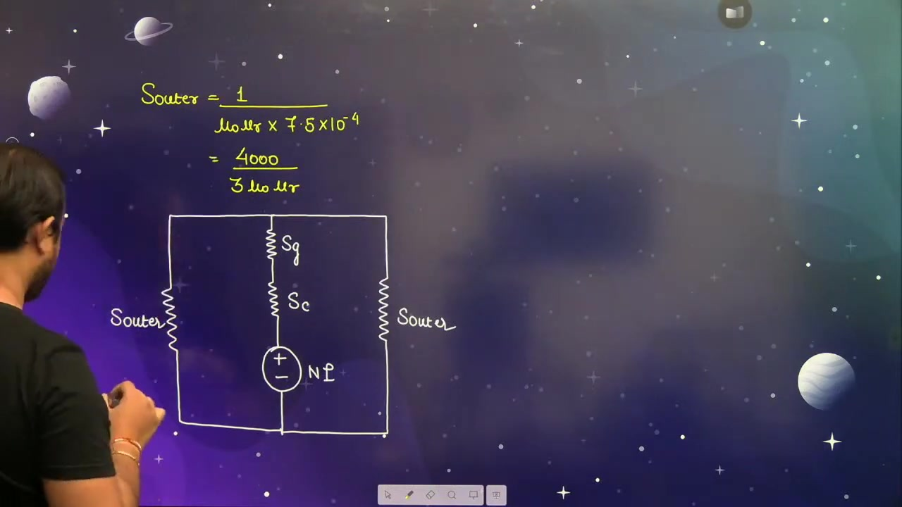

The two outer limbs form two symmetric parallel return paths. Each outer limb has reluctance:
$$
\mathcal{R}_{\text{outer}} = \frac{4000}{3\mu_0 \mu_r}
$$
Their parallel combination yields an equivalent outer reluctance:
$$
\mathcal{R}_{\text{parallel}} = \frac{\mathcal{R}_{\text{outer}}}{2} = \frac{2000}{3\mu_0 \mu_r}
$$

### Loop Equation Formulation

The total flux passing through the central branch is $\Phi_{\text{total}} = 0.35\text{ mWb} = 0.35 \times 10^{-3}\text{ Wb}$. By symmetry, each outer limb carries half the total flux:
$$
\Phi_{\text{outer}} = \frac{0.35\text{ mWb}}{2} = 0.175\text{ mWb}
$$
Applying Kirchhoff's magnetic voltage law around either closed loop:
$$
N I = \Phi_{\text{total}}(\mathcal{R}_g + \mathcal{R}_c) + \Phi_{\text{outer}}\mathcal{R}_{\text{outer}}
$$
Substitute $\Phi_{\text{outer}} = \frac{\Phi_{\text{total}}}{2}$:
$$
N I = \Phi_{\text{total}}\left(\mathcal{R}_g + \mathcal{R}_c + \frac{\mathcal{R}_{\text{outer}}}{2}\right)
$$
Substitute the numerical values:
$$
250 = (0.35 \times 10^{-3})\left[\frac{2}{3\mu_0} + \frac{500}{3\mu_0 \mu_r} + \frac{2000}{3\mu_0 \mu_r}\right]
$$

### Solving for Relative Permeability

Combine the terms containing $\mu_r$ inside the brackets:
$$
\frac{500}{3\mu_0 \mu_r} + \frac{2000}{3\mu_0 \mu_r} = \frac{2500}{3\mu_0 \mu_r}
$$
The equation becomes:
$$
\frac{250}{0.35 \times 10^{-3}} = \frac{2}{3\mu_0} + \frac{2500}{3\mu_0 \mu_r}
$$

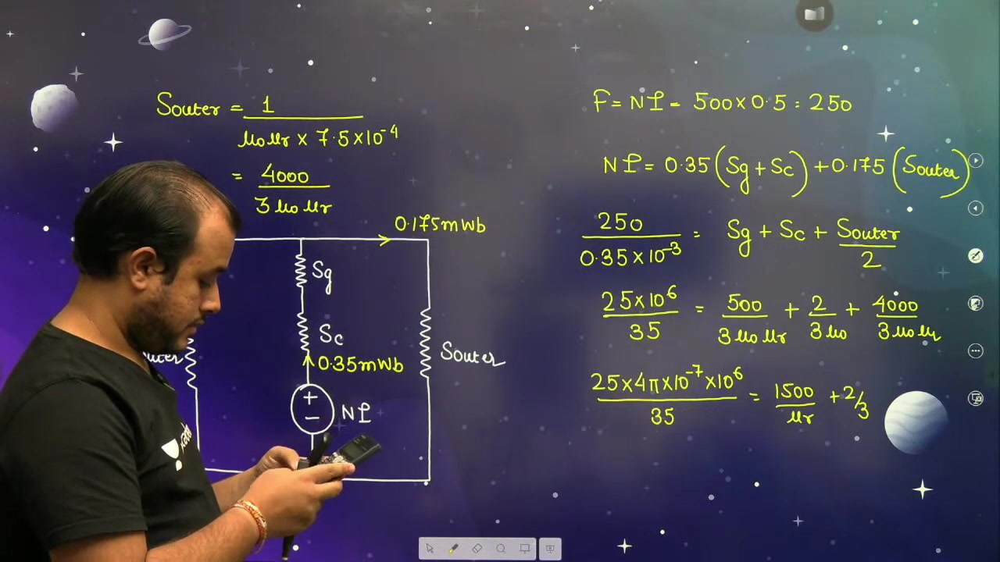

Multiply both sides by $\mu_0$:
$$
\frac{250 \times 10^3 \times \mu_0}{0.35} = \frac{2}{3} + \frac{2500}{3\mu_r}
$$
Substitute $\mu_0 = 4\pi \times 10^{-7}\text{ H/m}$:
$$
\frac{250 \times 10^3 \times (4\pi \times 10^{-7})}{0.35} = \frac{100\pi \times 10^{-3}}{0.35} = \frac{10\pi}{35} \approx 0.8976
$$
Now isolate the $\mu_r$ term:
$$
\frac{2500}{3\mu_r} = 0.8976 - \frac{2}{3} = 0.8976 - 0.6667 = 0.2309
$$
Solving for $\mu_r$:
$$
\mu_r = \frac{2500}{3 \times 0.2309} \approx 3608.57
$$

> [!success] Result for Question 8
> The relative permeability of the ferromagnetic core material is:
> $$
> \mu_r \approx 3608.57
> $$

## Geometric Analysis of Toroidal Ring Cores with Air Gaps
_(48:35 - 54:09)_

Toroidal magnetic circuits provide uniform flux distribution with minimal leakage. We now analyze a stacked circular magnetic ring featuring a narrow air gap.

### Problem Formulation: Stacked Toroidal Ring

> [!example] Question 9: Analysis of a Stacked Magnetic Ring
> A magnetic circuit consists of circular rings of magnetic material in a stack of axial height $D$. The rings have inner radius $R_i$ and outer radius $R_o$. An air gap of length $g$ is cut radially across the core. A winding of $N = 75\text{ turns}$ excites the core. Assume the iron core has infinite relative permeability ($\mu_r \to \infty$) and neglect magnetic leakage and fringing.
> Calculate:
> 1. The mean core length $l_c$ and the core cross-sectional area $A$.
> 2. The core reluctance $\mathcal{R}_c$ and the air gap reluctance $\mathcal{R}_g$.
> 3. The coil inductance $L$.

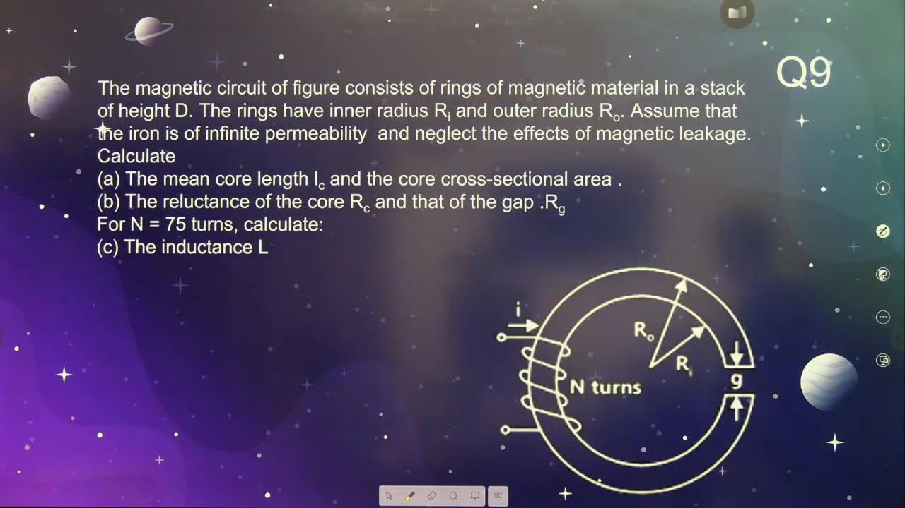

### Determining Mean Core Length

In a toroidal core with finite radial thickness, magnetic path lengths vary with radius. The inner perimeter along $R_i$ is shorter than the outer perimeter along $R_o$.

Because flux distributes across the radial cross-section, we define an effective average path. This mean path lies along the concentric centerline circle midway between $R_i$ and $R_o$.

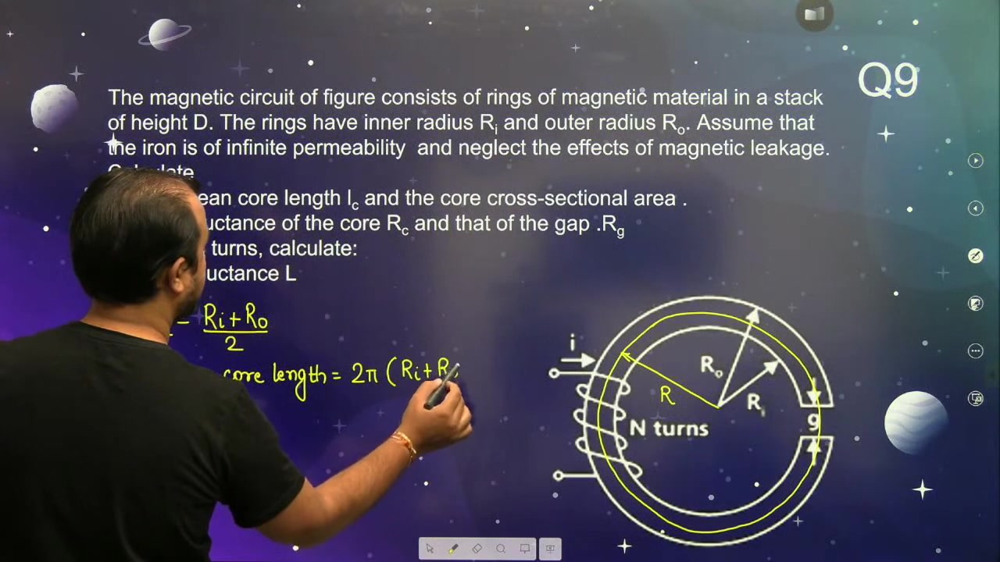

The mean radius of this central circle is the arithmetic mean:
$$
R_{\text{mean}} = \frac{R_i + R_o}{2}
$$
The circumference of this central circle defines the mean core length:
$$
l_c = 2\pi R_{\text{mean}} = 2\pi \left(\frac{R_i + R_o}{2}\right) = \pi(R_i + R_o)
$$
Because the physical air gap length $g$ is tiny compared to the perimeter, $l_c \approx \pi(R_i + R_o)$.

### Determining Core Cross-Sectional Area

The cross-sectional area sits perpendicular to the circulating magnetic flux lines. The radial thickness of the ring is:
$$
w = R_o - R_i
$$

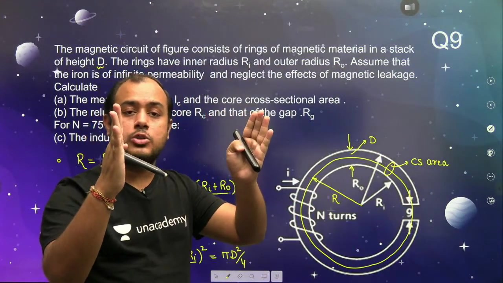

When circular plates or laminations are stacked axially to a height $D$, the cross-section forms a rectangle:
$$
A = (R_o - R_i) D
$$
If the toroid instead had a circular wire cross-section with diameter $D = R_o - R_i$, the area would be:
$$
A = \frac{\pi (R_o - R_i)^2}{4}
$$
For stacked laminations of height $D$, $A = (R_o - R_i)D$ provides the effective cross-sectional area.

## Inductance of Toroidal Cores and Core Permeability Variation
_(54:11 - 59:18)_

We now complete the reluctance and inductance derivations for Question 9. Then we formulate Question 10 to investigate how changing iron permeability influences air gap flux density.

### Reluctance and Inductance of the Toroid

For the toroidal core in Question 9, the iron permeability is assumed infinite:
$$
\mu_r \to \infty
$$
The core reluctance evaluates to:
$$
\mathcal{R}_c = \frac{l_c}{\mu_0 \mu_r A} \to 0
$$
An infinite permeability core drops zero magnetomotive force.

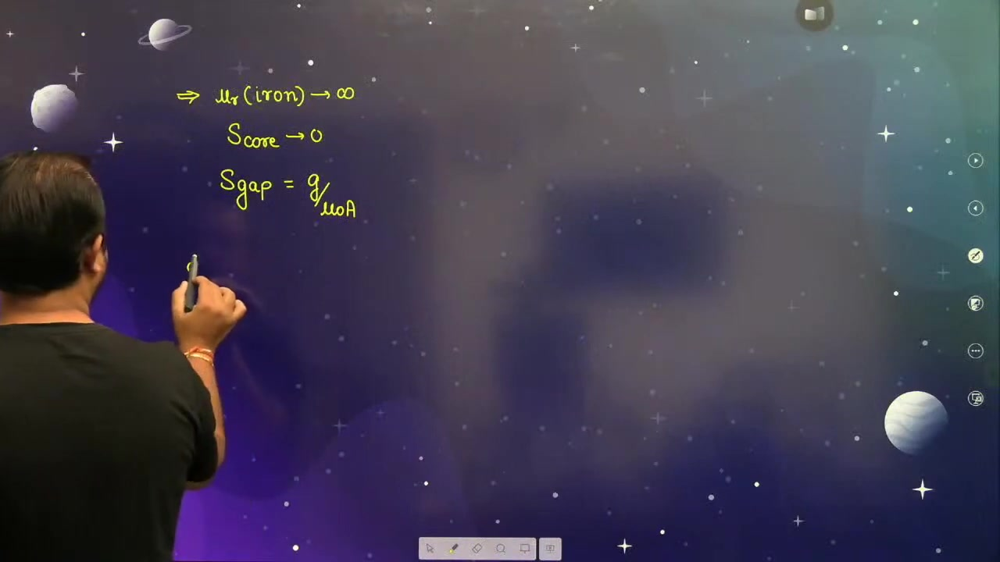

The reluctance of the radial air gap of length $g$ is:
$$
\mathcal{R}_g = \frac{g}{\mu_0 A}
$$
Because the core and air gap form a single series loop, total reluctance equals air gap reluctance:
$$
\mathcal{R}_{\text{total}} = \mathcal{R}_c + \mathcal{R}_g = 0 + \frac{g}{\mu_0 A} = \frac{g}{\mu_0 A}
$$
The self-inductance of a coil with $N$ turns is related to magnetic reluctance by:
$$
L = \frac{\lambda}{I} = \frac{N \Phi}{I} = \frac{N (\mathcal{F}/\mathcal{R}_{\text{total}})}{I} = \frac{N (N I/\mathcal{R}_{\text{total}})}{I} = \frac{N^2}{\mathcal{R}_{\text{total}}}
$$
Substitute $\mathcal{R}_{\text{total}} = \frac{g}{\mu_0 A}$:
$$
L = \frac{N^2}{\frac{g}{\mu_0 A}} = \frac{\mu_0 N^2 A}{g}
$$
With $N = 75\text{ turns}$, the coil inductance is $L = \frac{5625 \mu_0 A}{g}\text{ H}$.

> [!success] Inductance Formula
> For an air-gapped core with infinite iron permeability, inductance depends solely on turns and air gap dimensions:
> $$
> L = \frac{\mu_0 N^2 A}{g}
> $$

### Problem Formulation: Effect of Finite Core Permeability

We now analyze Question 10 to see how finite core permeability alters circuit performance.

> [!example] Question 10: Flux Density Under Permeability Change
> A magnetic circuit has a uniform cross-sectional area $A$ and an air gap of $0.2\text{ cm}$. The mean path length of the iron core is $40\text{ cm}$. Leakage and fringing fluxes are negligible. When the core relative permeability is infinite ($\mu_r \to \infty$), the air gap flux density is $1\text{ T}$. With the same ampere-turns applied, if the relative permeability is instead $\mu_r = 1000$, find the new air gap flux density in tesla.

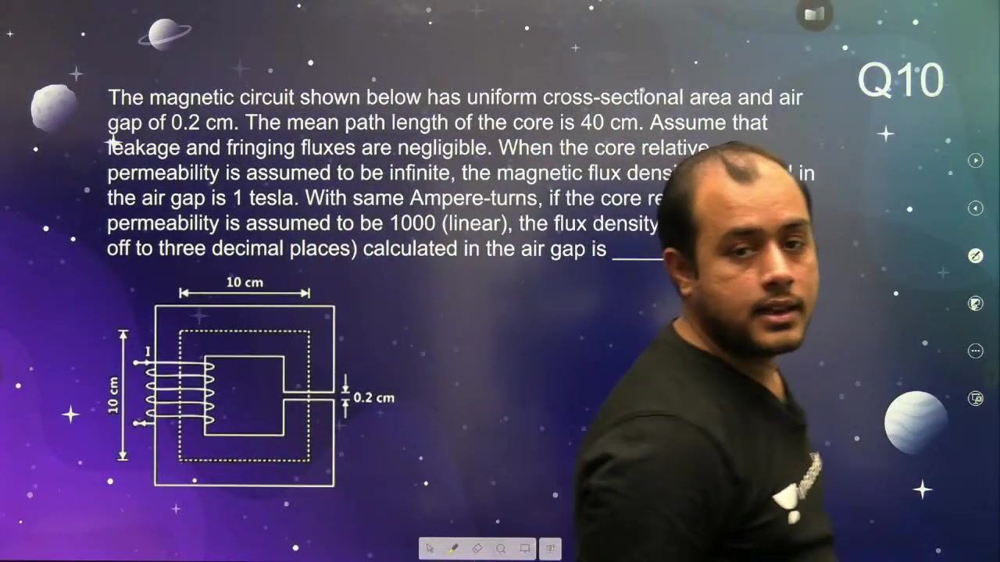

### Case 1: Infinite Core Permeability

In the initial state, $\mu_{r, 1} \to \infty$. The iron core reluctance vanishes:
$$
\mathcal{R}_{\text{core}, 1} = 0
$$
The only opposition to flux establishment comes from the air gap:
$$
\mathcal{R}_{\text{total}, 1} = \mathcal{R}_g = \frac{l_g}{\mu_0 A} = \frac{0.2 \times 10^{-2}}{\mu_0 A}
$$
The resulting magnetic flux is:
$$
\Phi_1 = \frac{\mathcal{F}}{\mathcal{R}_{\text{total}, 1}} = \frac{\mathcal{F} \mu_0 A}{0.2 \times 10^{-2}}
$$
Dividing by cross-sectional area $A$ gives the initial flux density:
$$
B_1 = \frac{\Phi_1}{A} = \frac{\mu_0 \mathcal{F}}{0.2 \times 10^{-2}} = 1\text{ T}
$$
All applied magnetomotive force drops across the air gap.

## Permeability Attenuation Solution and Course Summary
_(59:18 - 63:20)_

We now complete the second case for Question 10. We determine how finite iron permeability reduces air gap flux density when the applied magnetomotive force remains constant.

### Case 2: Finite Core Permeability ($\mu_r = 1000$)

In the second operating state, the iron core has a finite relative permeability:
$$
\mu_{r, 2} = 1000
$$
The mean path length of the iron core is $l_c = 40\text{ cm} = 40 \times 10^{-2}\text{ m}$.

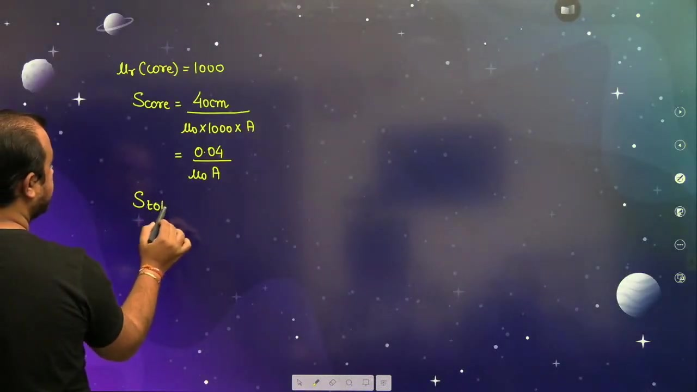

The iron core now introduces finite reluctance:
$$
\mathcal{R}_{\text{core}, 2} = \frac{l_c}{\mu_0 \mu_{r, 2} A} = \frac{40 \times 10^{-2}}{\mu_0 \times 1000 \times A} = \frac{0.04 \times 10^{-2}}{\mu_0 A}
$$
The total magnetic reluctance becomes the sum of the air gap and core reluctances:
$$
\mathcal{R}_{\text{total}, 2} = \mathcal{R}_g + \mathcal{R}_{\text{core}, 2} = \frac{0.2 \times 10^{-2}}{\mu_0 A} + \frac{0.04 \times 10^{-2}}{\mu_0 A} = \frac{0.24 \times 10^{-2}}{\mu_0 A}
$$

### Calculating the Reduced Flux Density

The applied magnetomotive force $\mathcal{F}$ remains unchanged. The new circulating magnetic flux is:
$$
\Phi_2 = \frac{\mathcal{F}}{\mathcal{R}_{\text{total}, 2}} = \frac{\mathcal{F} \mu_0 A}{0.24 \times 10^{-2}}
$$
The new magnetic flux density across the air gap is:
$$
B_2 = \frac{\Phi_2}{A} = \frac{\mu_0 \mathcal{F}}{0.24 \times 10^{-2}}
$$

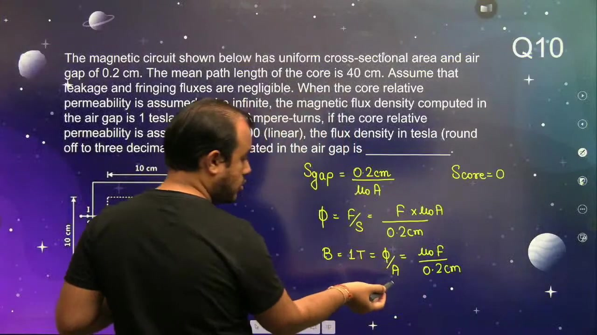

Recall the initial flux density from Case 1:
$$
B_1 = \frac{\mu_0 \mathcal{F}}{0.2 \times 10^{-2}} = 1\text{ T}
$$
Take the ratio of the two flux densities:
$$
\frac{B_2}{B_1} = \frac{\frac{\mu_0 \mathcal{F}}{0.24 \times 10^{-2}}}{\frac{\mu_0 \mathcal{F}}{0.2 \times 10^{-2}}} = \frac{0.2 \times 10^{-2}}{0.24 \times 10^{-2}} = \frac{0.20}{0.24} = \frac{5}{6}
$$
Substitute $B_1 = 1\text{ T}$:
$$
B_2 = \frac{5}{6} \times 1\text{ T} \approx 0.833\text{ T}
$$

> [!success] Result for Question 10
> The air gap magnetic flux density with $\mu_r = 1000$ is:
> $$
> B_2 = 0.833\text{ T}
> $$

### Engineering Takeaway

Even with a high relative permeability of $\mu_r = 1000$, finite core reluctance consumes sixteen percent of the available magnetomotive force. The flux density drops from $1.0\text{ T}$ to $0.833\text{ T}$. This comparison illustrates why precise core reluctance modeling is vital when designing inductors and rotating machinery.

---

## Summary and Key Takeaways

- Introducing an air gap into a ferromagnetic core introduces linear reluctance and prevents magnetic saturation.
- Magnetic permeability $\mu$ in magnetic circuits corresponds directly to electrical conductivity $\sigma$ in electric networks.
- Hysteresis power loss is directly proportional to the area enclosed by the cyclic $B$-$H$ magnetization loop.
- Permanent magnet materials strictly require high coercivity to prevent unintended demagnetization.
- In symmetrical three-limb magnetic circuits, the central limb flux divides equally between the two parallel outer branches.
- Mean magnetic path lengths must be evaluated along the geometric centerline of each core segment cross-section.
- For an air-gapped core with infinite iron permeability, coil inductance simplifies directly to $L = \frac{\mu_0 N^2 A}{g}$.
- Finite core permeability introduces series reluctance that attenuates air gap magnetic flux density under constant applied MMF.

