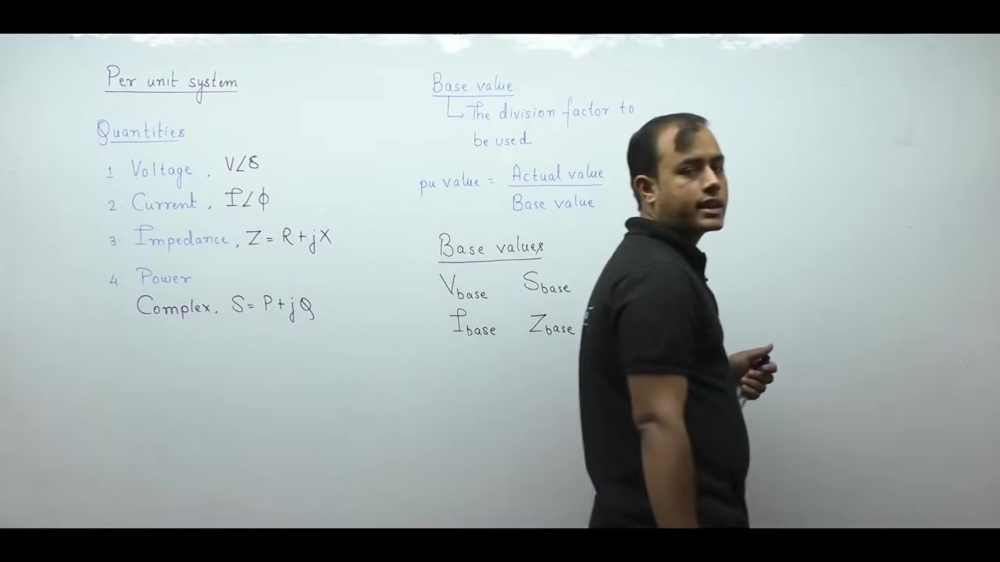
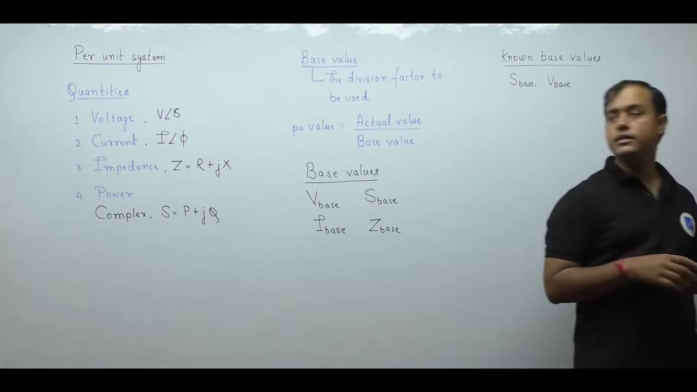
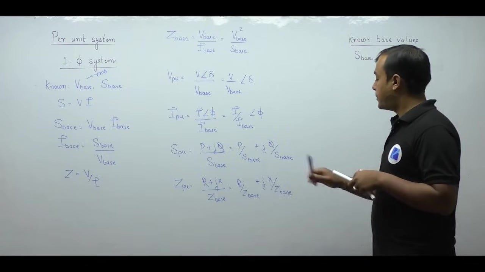
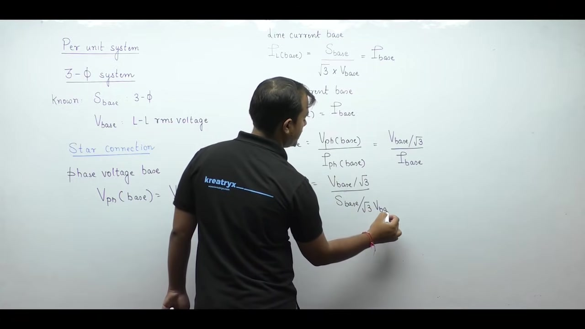
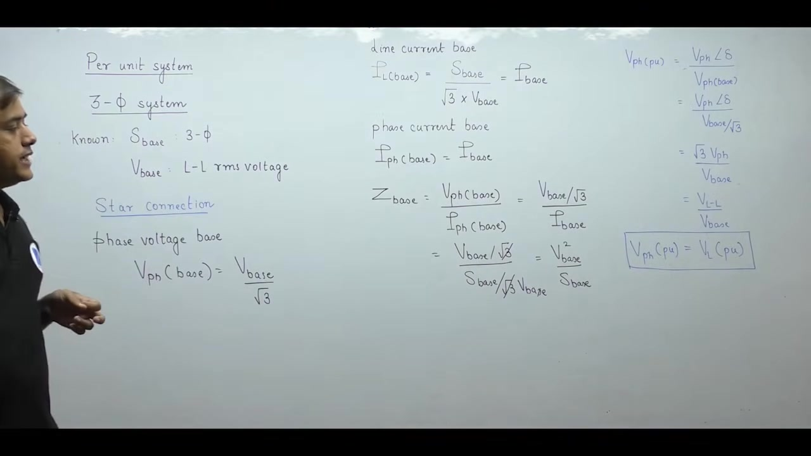
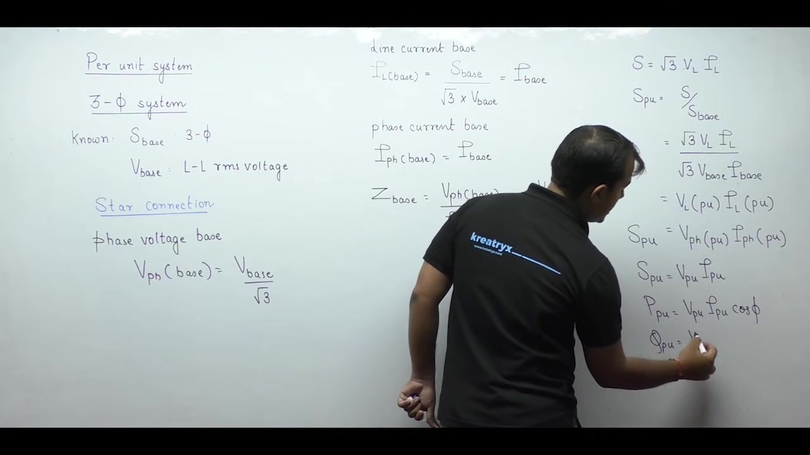
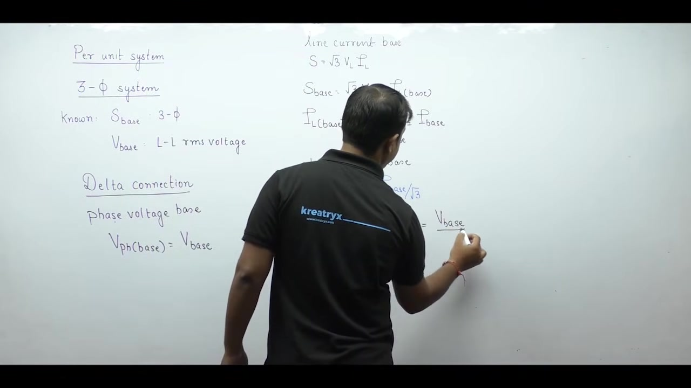
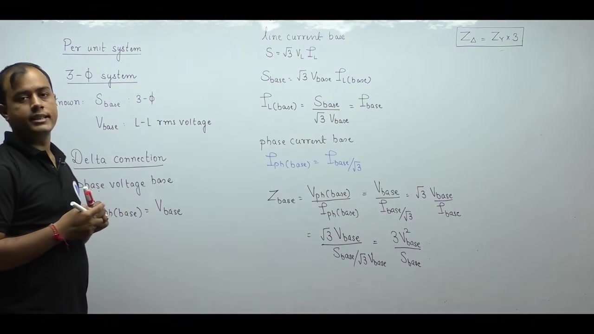
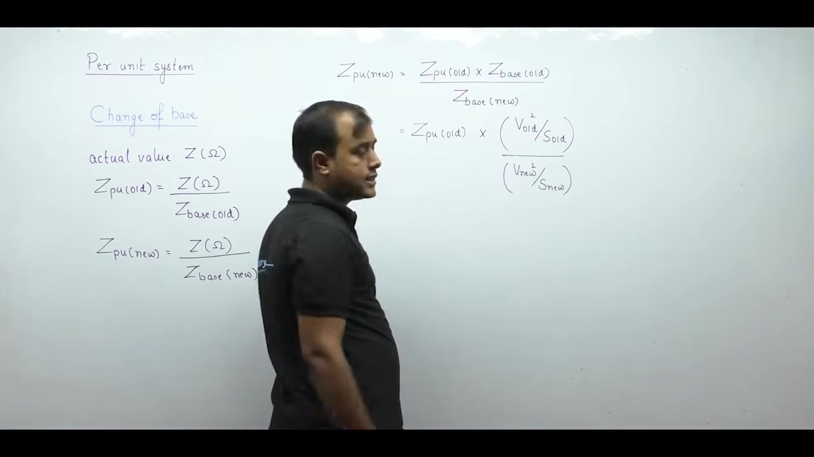
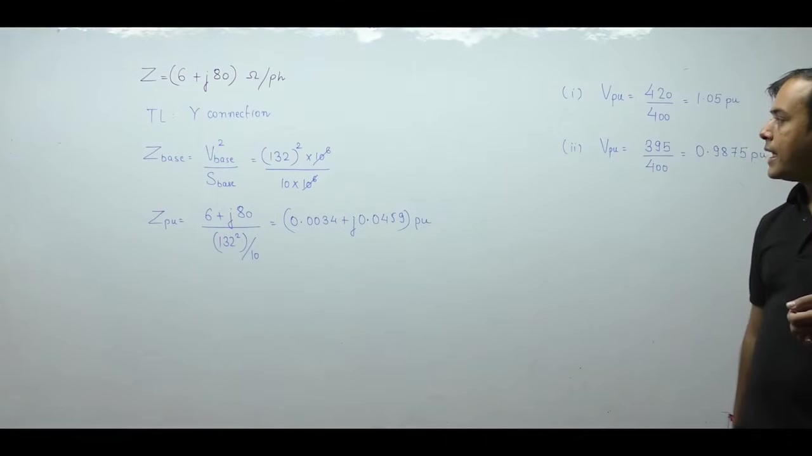

# Per Unit System | Electrical Machines | Lec 7 | GATE & ESE (EE, ECE) | Ankit Goyal

- **Source**: https://www.youtube.com/watch?v=HI5xq0EdpeA
- **Duration**: 00:47:29
- **Compiled**: 2026-09-16

---

## Overview

This lecture introduces the per-unit system for normalizing electrical machine and power network calculations. It establishes how to select equipment nameplate ratings as reference bases for voltage and apparent power. The discussion derives base current and base impedance formulas for single-phase, balanced star, and balanced delta systems. It demonstrates the equality of per-unit phase and line quantities along with the elimination of the square root of three factor. Finally, it derives the universal impedance change of base formula and solves practical engineering examples.

## Contents

- [[#Introduction to the Per-Unit System|Introduction to the Per-Unit System]]
- [[#Selection of Base Quantities and Ratings|Selection of Base Quantities and Ratings]]
- [[#Per-Unit Formulas for Single-Phase and Three-Phase Systems|Per-Unit Formulas for Single-Phase and Three-Phase Systems]]
- [[#Star Connection Base Derivations and Phase vs Line Equality|Star Connection Base Derivations and Phase vs Line Equality]]
- [[#Three-Phase Per-Unit Power and Actual Value Conversion|Three-Phase Per-Unit Power and Actual Value Conversion]]
- [[#Delta Connection Base Derivations and Base Impedance Scaling|Delta Connection Base Derivations and Base Impedance Scaling]]
- [[#Change of Base for Impedance|Change of Base for Impedance]]
- [[#Worked Examples and Practical Applications|Worked Examples and Practical Applications]]

---

## Introduction to the Per-Unit System
_(00:13 - 06:45)_

### Need for Normalization in Electrical Systems

Electrical power systems contain many connected components. These components operate over widely different voltage and power levels. In an AC power network, we encounter four fundamental electrical quantities:

1. **Voltage ($V$):** Expressed in phasor form as $V \angle \delta$, measured in volts ($\text{V}$) or kilovolts ($\text{kV}$).
2. **Current ($I$):** Expressed in phasor form as $I \angle \phi$, measured in amperes ($\text{A}$) or kiloamperes ($\text{kA}$).
3. **Impedance ($Z$):** Expressed as complex impedance $Z = R + jX$, measured in ohms ($\Omega$).
4. **Power ($S$):** Expressed as complex power $S = P + jQ$, measured in volt-amperes ($\text{VA}$), kilovolt-amperes ($\text{kVA}$), or megavolt-amperes ($\text{MVA}$).

In physical systems, numerical magnitudes span many orders of magnitude. A transmission line voltage might be $400\text{ kV}$, while its resistance is only a few ohms. Generators may deliver thousands of amperes, while shunt reactances are large. Handling such disparate values in circuit equations leads to computational difficulty. Roundoff errors can also occur.

To resolve this issue, we introduce the per-unit system.

### Definition of Per-Unit Value

In the per-unit system, every actual physical quantity is scaled by dividing it by a reference quantity of the same dimension. This reference divisor is called the **base value**.

> [!info] Definition: Per-Unit Quantity
> The per-unit value of any physical quantity is defined as the ratio of its actual value in physical units to a chosen base value having the exact same units:
> $$\text{Quantity in per-unit (pu)} = \frac{\text{Actual value}}{\text{Base value}}$$

Because the actual value and base value have identical physical units, the resulting per-unit quantity is completely dimensionless:

$$\text{Unit of pu value} = \frac{\text{Actual unit}}{\text{Base unit}} = \text{Dimensionless (pure ratio)}$$

Per-unit values typically fall in a convenient range near $1.0\text{ pu}$. This scaling simplifies both hand calculations and computer simulation of electrical machines and power networks.

## Selection of Base Quantities and Ratings
_(06:46 - 11:44)_

### Four Base Quantities

To represent our four physical variables in per-unit, we require four corresponding base values:

1. **Base Voltage ($V_{\text{base}}$):** in volts ($\text{V}$) or kilovolts ($\text{kV}$).
2. **Base Current ($I_{\text{base}}$):** in amperes ($\text{A}$) or kiloamperes ($\text{kA}$).
3. **Base Apparent Power ($S_{\text{base}}$):** in volt-amperes ($\text{VA}$), $\text{kVA}$, or $\text{MVA}$.
4. **Base Impedance ($Z_{\text{base}}$):** in ohms ($\Omega$).

### Nameplate Ratings as System Bases

We cannot pick all four base quantities arbitrarily. In practice, base values are chosen equal to the rated nameplate values of the electrical equipment.

Every electrical machine carries a nameplate. The manufacturer stamps rated operating limits on this plate. For an induction motor, the plate lists rated speed, rated voltage, and rated full-load current. For a mobile battery, it lists rated milliampere-hours and voltage.

Operating within rated conditions guarantees satisfactory performance and expected equipment life. Exceeding rated limits causes thermal stress, insulation degradation, and premature failure.

### The Two-Base Selection Rule

Because electrical laws link voltage, current, power, and impedance, these four base quantities are not mathematically independent.

> [!info] Principle: Base Quantity Selection
> In any electrical circuit:
> 1. Base values are generally chosen equal to the rated nameplate values of the equipment.
> 2. Out of four base quantities ($V_{\text{base}}$, $I_{\text{base}}$, $S_{\text{base}}$, $Z_{\text{base}}$), only **two** can be chosen independently.
> 3. The remaining two base quantities are derived mathematically from electrical circuit equations.

By universal convention in power engineering, the two independently chosen base quantities are:

- **Base Apparent Power ($S_{\text{base}}$)**
- **Base Voltage ($V_{\text{base}}$)**

For example, consider an alternator rated at $11\text{ kV}$ and $100\text{ MVA}$. We select:

$$
\begin{aligned}
S_{\text{base}} &= 100\text{ MVA} \\
V_{\text{base}} &= 11\text{ kV}
\end{aligned}
$$

From these two known inputs, we derive base current $I_{\text{base}}$ and base impedance $Z_{\text{base}}$.

All voltages and currents in machine and power system calculations are treated as RMS values by default. Peak values are not used unless explicitly specified.

## Per-Unit Formulas for Single-Phase and Three-Phase Systems
_(11:44 - 18:31)_

### Single-Phase Base Derivations

Consider a single-phase AC circuit. We choose base voltage $V_{\text{base}}$ and base apparent power $S_{\text{base}}$ as known values.

In a single-phase circuit, complex power magnitude is:

$$S = V I$$

Applying base quantities to this relation:

$$S_{\text{base}} = V_{\text{base}} I_{\text{base}}$$

Solving for base current gives:

$$I_{\text{base}} = \frac{S_{\text{base}}}{V_{\text{base}}}$$

Base impedance is defined by Ohm's law as base voltage divided by base current:

$$
\begin{aligned}
Z_{\text{base}} &= \frac{V_{\text{base}}}{I_{\text{base}}} \\
&= \frac{V_{\text{base}}}{S_{\text{base}} / V_{\text{base}}} \\
&= \frac{V_{\text{base}}^2}{S_{\text{base}}}
\end{aligned}
$$

> [!success] Result: Single-Phase Base Formulas
> From independent selections $V_{\text{base}}$ and $S_{\text{base}}$, the derived base quantities are:
> $$I_{\text{base}} = \frac{S_{\text{base}}}{V_{\text{base}}}$$
> $$Z_{\text{base}} = \frac{V_{\text{base}}^2}{S_{\text{base}}}$$

### Per-Unit Phasor and Complex Quantities

Base values are purely real numbers. They do not have phase angles. When an actual phasor is divided by a base value, only its magnitude is scaled. Its angle is preserved unchanged.

Per-unit voltage phasor:

$$V_{\text{pu}} = \frac{V \angle \delta}{V_{\text{base}}} = \left(\frac{V}{V_{\text{base}}}\right) \angle \delta = V_{\text{mag, pu}} \angle \delta$$

Per-unit current phasor:

$$I_{\text{pu}} = \frac{I \angle \phi}{I_{\text{base}}} = \left(\frac{I}{I_{\text{base}}}\right) \angle \phi = I_{\text{mag, pu}} \angle \phi$$

Per-unit complex power:

$$S_{\text{pu}} = \frac{P + jQ}{S_{\text{base}}} = \frac{P}{S_{\text{base}}} + j \frac{Q}{S_{\text{base}}} = P_{\text{pu}} + j Q_{\text{pu}}$$

Per-unit complex impedance:

$$Z_{\text{pu}} = \frac{R + jX}{Z_{\text{base}}} = \frac{R}{Z_{\text{base}}} + j \frac{X}{Z_{\text{base}}} = R_{\text{pu}} + j X_{\text{pu}}$$

> [!info] Rule: Nature of Base Quantities
> 1. Base values are always real scalar quantities without phase angles.
> 2. The real and imaginary components of any quantity always share the exact same base divisor.
> 3. $S_{\text{base}}$ is the common base for both active power $P$ and reactive power $Q$.
> 4. Base apparent power $S_{\text{base}}$ and base impedance $Z_{\text{base}}$ are completely independent of operating power factor.

Never define separate bases for $P$ and $Q$ using power factor.

### Introduction to Three-Phase Systems

In three-phase power networks, calculations involve line quantities and phase quantities.

By universal convention, unless stated otherwise:
- The rated apparent power is the total three-phase power ($S_{\text{3}\phi}$).
- The rated voltage is the line-to-line RMS voltage ($V_{L\text{-}L}$).

So for a three-phase system:
- $S_{\text{base}}$ is total three-phase apparent power.
- $V_{\text{base}}$ is line-to-line RMS voltage.

Balanced three-phase networks use either star ($Y$) or delta ($\Delta$) connections. In a star connection, line voltage relates to phase voltage by:

$$V_L = \sqrt{3} V_{\text{ph}}$$

So the base phase voltage in a star connection is:

$$V_{\text{base, ph}} = \frac{V_{\text{base}}}{\sqrt{3}}$$

## Star Connection Base Derivations and Phase vs Line Equality
_(18:35 - 23:45)_

### Base Quantities for Star Connection

Now consider a balanced star ($Y$) connected system. Total three-phase power relates to line values by:

$$S = \sqrt{3} V_L I_L$$

Applying base values to this power equation:

$$S_{\text{base}} = \sqrt{3} V_{\text{base}} I_{\text{base, L}}$$

From this, the base line current is:

$$I_{\text{base}} = \frac{S_{\text{base}}}{\sqrt{3} V_{\text{base}}}$$

In a star connection, line current equals phase current:

$$I_{\text{base, ph}} = I_{\text{base, L}} = I_{\text{base}}$$

### Base Impedance in Star Connection

Impedance is strictly a per-phase quantity. It is never defined across lines. So base impedance is the ratio of base phase voltage to base phase current:

$$Z_{\text{base}} = \frac{V_{\text{base, ph}}}{I_{\text{base, ph}}}$$

Substitute the star expressions for phase voltage and phase current:

$$
\begin{aligned}
Z_{\text{base}} &= \frac{V_{\text{base}} / \sqrt{3}}{I_{\text{base}}} \\
&= \frac{V_{\text{base}} / \sqrt{3}}{S_{\text{base}} / (\sqrt{3} V_{\text{base}})} \\
&= \frac{V_{\text{base}}}{\sqrt{3}} \cdot \frac{\sqrt{3} V_{\text{base}}}{S_{\text{base}}} \\
&= \frac{V_{\text{base}}^2}{S_{\text{base}}}
\end{aligned}
$$

The terms $\sqrt{3}$ cancel out completely.

> [!success] Result: Star Base Impedance
> In a balanced three-phase star system, the base impedance per phase is:
> $$Z_{\text{base}} = \frac{V_{\text{base}}^2}{S_{\text{base}}}$$
> Here $V_{\text{base}}$ is line-to-line RMS voltage and $S_{\text{base}}$ is total three-phase apparent power. This formula is identical to the single-phase expression.

### Equality of Per-Unit Phase and Line Voltages

Now evaluate per-unit phase voltage:

$$V_{\text{ph, pu}} = \frac{V_{\text{ph}} \angle \delta}{V_{\text{base, ph}}}$$

Substitute $V_{\text{base, ph}} = V_{\text{base}} / \sqrt{3}$:

$$
\begin{aligned}
V_{\text{ph, pu}} &= \frac{V_{\text{ph}} \angle \delta}{V_{\text{base}} / \sqrt{3}} \\
&= \frac{\sqrt{3} V_{\text{ph}}}{V_{\text{base}}} \angle \delta
\end{aligned}
$$

In a balanced system, $\sqrt{3} V_{\text{ph}}$ equals the actual line-to-line voltage $V_L$:

$$\frac{\sqrt{3} V_{\text{ph}}}{V_{\text{base}}} = \frac{V_L}{V_{\text{base}}} = V_{L, \text{pu}}$$

So the per-unit phase voltage equals the per-unit line voltage:

$$V_{\text{ph, pu}} = V_{L, \text{pu}} = V_{\text{pu}}$$

> [!info] Principle: Line and Phase Equality in Per-Unit
> In balanced three-phase systems, per-unit phase voltage equals per-unit line voltage:
> $$V_{\text{ph, pu}} = V_{L, \text{pu}}$$
> In physical units, line and phase values differ by $\sqrt{3}$. But in per-unit, the $\sqrt{3}$ factor disappears completely.

This elimination of the $\sqrt{3}$ factor avoids frequent calculation errors in three-phase networks.

## Three-Phase Per-Unit Power and Actual Value Conversion
_(23:51 - 29:10)_

### Derivation of Three-Phase Per-Unit Power

Actual total three-phase apparent power is:

$$S = \sqrt{3} V_L I_L$$

Base three-phase apparent power is:

$$S_{\text{base}} = \sqrt{3} V_{\text{base}} I_{\text{base}}$$

To find per-unit apparent power, divide actual power by base power:

$$
\begin{aligned}
S_{\text{pu}} &= \frac{S}{S_{\text{base}}} \\
&= \frac{\sqrt{3} V_L I_L}{\sqrt{3} V_{\text{base}} I_{\text{base}}} \\
&= \left(\frac{V_L}{V_{\text{base}}}\right) \left(\frac{I_L}{I_{\text{base}}}\right) \\
&= V_{L, \text{pu}} I_{L, \text{pu}}
\end{aligned}
$$

Since per-unit line values equal per-unit phase values:

$$S_{\text{pu}} = V_{\text{pu}} I_{\text{pu}}$$

The factors $\sqrt{3}$ and $3$ vanish completely.

> [!success] Result: Power Equations in Per-Unit
> In per-unit representation, power equations take the exact same mathematical form regardless of phase count:
> $$
> \begin{aligned}
> S_{\text{pu}} &= V_{\text{pu}} I_{\text{pu}} \\
> P_{\text{pu}} &= V_{\text{pu}} I_{\text{pu}} \cos\phi \\
> Q_{\text{pu}} &= V_{\text{pu}} I_{\text{pu}} \sin\phi
> \end{aligned}
> $$
> There is no factor of $\sqrt{3}$ or $3$. The per-unit power formula is identical for single-phase and three-phase circuits.

Subscripts for line or phase are unnecessary because both have the same per-unit value.

### Converting Per-Unit Quantities to Actual Values

Calculations are carried out in per-unit to simplify network analysis. But engineers ultimately need physical units such as volts, amperes, or ohms.

To return from per-unit to actual physical units, multiply by the appropriate base value:

$$\text{Actual value} = \text{Per-unit value} \times \text{Base value}$$

> [!info] Rule: Conversion from Per-Unit to Actual Values
> When calculating an actual quantity from its per-unit value, multiply by the base of that specific physical quantity:
> - Actual phase voltage: $V_{\text{ph}} = V_{\text{pu}} \times V_{\text{base, ph}}$
> - Actual line voltage: $V_L = V_{\text{pu}} \times V_{\text{base, L}}$
> - Actual line current: $I_L = I_{\text{pu}} \times I_{\text{base, L}}$
> - Actual phase current: $I_{\text{ph}} = I_{\text{pu}} \times I_{\text{base, ph}}$
> - Actual three-phase power: $S = S_{\text{pu}} \times S_{\text{base}}$

Always use the base corresponding to the desired physical variable.

### Introduction to Delta Connection

Now consider a balanced delta ($\Delta$) connected system. In delta, line voltage equals phase voltage:

$$V_L = V_{\text{ph}}$$

So the base phase voltage equals the line voltage base:

$$V_{\text{base, ph}} = V_{\text{base}}$$

The line voltage base directly serves as the phase voltage base.

## Delta Connection Base Derivations and Base Impedance Scaling
_(29:14 - 34:40)_

### Base Current in Delta Connection

Now consider a balanced three-phase delta ($\Delta$) connection. In delta:
- Line voltage equals phase voltage: $V_L = V_{\text{ph}}$.
- Line current relates to phase current by: $I_L = \sqrt{3} I_{\text{ph}}$.

The base apparent power equation is:

$$S_{\text{base}} = \sqrt{3} V_{\text{base}} I_{\text{base, L}}$$

From this, the base line current is:

$$I_{\text{base, L}} = \frac{S_{\text{base}}}{\sqrt{3} V_{\text{base}}} = I_{\text{base}}$$

In delta, phase current relates to line current by division by $\sqrt{3}$:

$$I_{\text{base, ph}} = \frac{I_{\text{base, L}}}{\sqrt{3}} = \frac{I_{\text{base}}}{\sqrt{3}}$$

### Base Impedance in Delta Connection

Impedance is always defined on a per-phase basis:

$$Z_{\text{base}} = \frac{V_{\text{base, ph}}}{I_{\text{base, ph}}}$$

In delta, $V_{\text{base, ph}} = V_{\text{base}}$ and $I_{\text{base, ph}} = I_{\text{base}} / \sqrt{3}$. Substitute these expressions:

$$
\begin{aligned}
Z_{\text{base, } \Delta} &= \frac{V_{\text{base}}}{I_{\text{base}} / \sqrt{3}} \\
&= \frac{\sqrt{3} V_{\text{base}}}{I_{\text{base}}}
\end{aligned}
$$

Now substitute $I_{\text{base}} = S_{\text{base}} / (\sqrt{3} V_{\text{base}})$:

$$
\begin{aligned}
Z_{\text{base, } \Delta} &= \frac{\sqrt{3} V_{\text{base}}}{S_{\text{base}} / (\sqrt{3} V_{\text{base}})} \\
&= \frac{3 V_{\text{base}}^2}{S_{\text{base}}}
\end{aligned}
$$

> [!success] Result: Delta Base Impedance
> In a balanced delta-connected system, the base impedance per phase is:
> $$Z_{\text{base, } \Delta} = \frac{3 V_{\text{base}}^2}{S_{\text{base}}} = 3 Z_{\text{base, } Y}$$
> This result matches circuit theory. The impedance of a delta branch is three times that of an equivalent star branch ($Z_\Delta = 3 Z_Y$).

All other per-unit relationships remain unchanged. Per-unit line voltage still equals per-unit phase voltage. No factor of $\sqrt{3}$ or $3$ appears in the power formula.

### Summary of Rules for Three-Phase Per-Unit Calculations

> [!info] Summary: Rules of Three-Phase Per-Unit Systems
> 1. Line and phase quantities have distinct physical base values.
> 2. Per-unit phase voltage equals per-unit line voltage ($V_{\text{ph, pu}} = V_{L, \text{pu}}$).
> 3. Per-unit phase current equals per-unit line current ($I_{\text{ph, pu}} = I_{L, \text{pu}}$).
> 4. Power equations in per-unit contain no factor of $\sqrt{3}$ or $3$ ($S_{\text{pu}} = V_{\text{pu}} I_{\text{pu}}$).
> 5. Real and imaginary components of any quantity always share the same base divisor.
> 6. Star base impedance is $V_{\text{base}}^2 / S_{\text{base}}$, while delta base impedance is $3 V_{\text{base}}^2 / S_{\text{base}}$.

### The Problem of Multiple Interconnected Ratings

In a large power network, many pieces of equipment operate together. An alternator connects through a transformer to a transmission line.

Each component carries its own rated voltage and MVA nameplate. Because manufacturer ratings differ, equipment bases differ across the system. We cannot analyze an interconnected grid using conflicting local bases.

So we must convert all component impedances to a common system-wide base.

## Change of Base for Impedance
_(34:45 - 40:32)_

### Invariance of Actual Physical Values

Before deriving the change of base formula, understand a vital principle.

> [!info] Principle: Invariance of Actual Values
> The actual physical value of any quantity is independent of base selection. Only its per-unit value changes when the base changes:
> $$\text{Actual physical value} = \text{Constant}$$
> $$\text{Per-unit value} = \text{Depends on choice of base}$$

For example, consider an actual line voltage of $11\text{ kV}$. The physical voltage remains $11\text{ kV}$ regardless of what we choose as base.

If we choose a base of $11\text{ kV}$:

$$V_{\text{pu}} = \frac{11\text{ kV}}{11\text{ kV}} = 1.0\text{ pu}$$

If we instead choose a base of $22\text{ kV}$:

$$V_{\text{pu}} = \frac{11\text{ kV}}{22\text{ kV}} = 0.5\text{ pu}$$

The physical voltage does not change. Per-unit values exist purely for mathematical convenience.

### Derivation of Change of Base Formula

In power system analysis, each component usually has impedance specified in per-unit on its own nameplate rating. This original rating forms the **old base**:
- Old base voltage: $V_{\text{base, old}}$
- Old base apparent power: $S_{\text{base, old}}$
- Old base impedance: $Z_{\text{base, old}} = \frac{V_{\text{base, old}}^2}{S_{\text{base, old}}}$

To analyze the entire interconnected grid, we choose a common system-wide **new base**:
- New base voltage: $V_{\text{base, new}}$
- New base apparent power: $S_{\text{base, new}}$
- New base impedance: $Z_{\text{base, new}} = \frac{V_{\text{base, new}}^2}{S_{\text{base, new}}}$

Let the actual physical impedance be $Z$ in ohms ($\Omega$).

On the old base:

$$Z_{\text{pu, old}} = \frac{Z}{Z_{\text{base, old}}} \implies Z = Z_{\text{pu, old}} \cdot Z_{\text{base, old}}$$

On the new base:

$$Z_{\text{pu, new}} = \frac{Z}{Z_{\text{base, new}}}$$

Substitute $Z = Z_{\text{pu, old}} \cdot Z_{\text{base, old}}$ into the new per-unit equation:

$$Z_{\text{pu, new}} = Z_{\text{pu, old}} \left(\frac{Z_{\text{base, old}}}{Z_{\text{base, new}}}\right)$$

Now substitute the expressions for $Z_{\text{base, old}}$ and $Z_{\text{base, new}}$:

$$
\begin{aligned}
Z_{\text{pu, new}} &= Z_{\text{pu, old}} \cdot \frac{V_{\text{base, old}}^2 / S_{\text{base, old}}}{V_{\text{base, new}}^2 / S_{\text{base, new}}} \\
&= Z_{\text{pu, old}} \left(\frac{V_{\text{base, old}}}{V_{\text{base, new}}}\right)^2 \left(\frac{S_{\text{base, new}}}{S_{\text{base, old}}}\right)
\end{aligned}
$$

For delta connections, the factor of $3$ in numerator and denominator cancels out. So the same formula holds for star and delta systems.

> [!success] Result: Change of Base Formula
> The universal impedance change of base equation is:
> $$Z_{\text{pu, new}} = Z_{\text{pu, old}} \left(\frac{V_{\text{base, old}}}{V_{\text{base, new}}}\right)^2 \left(\frac{S_{\text{base, new}}}{S_{\text{base, old}}}\right)$$

This formula allows converting any equipment impedance to common system bases easily.

## Worked Examples and Practical Applications
_(40:48 - 47:22)_

### Understanding Base Re-Scaling Terminology

When applying the change of base formula, keep the definitions straight:
- **Old Base:** The base on which the equipment per-unit value is originally specified. This matches the nameplate ratings.
- **New Base:** The system base on which we wish to calculate the new per-unit value.

For instance, consider equipment with $0.5\text{ pu}$ impedance on an old base of $11\text{ kV}$ and $100\text{ MVA}$. If we re-calculate on a new base of $22\text{ kV}$ and $50\text{ MVA}$:
- $V_{\text{base, old}} = 11\text{ kV}$, $S_{\text{base, old}} = 100\text{ MVA}$
- $V_{\text{base, new}} = 22\text{ kV}$, $S_{\text{base, new}} = 50\text{ MVA}$

We substitute these values directly into the change of base formula.

### Example Problems

> [!example] Problem 1: Normalizing System Voltages
> Express the following operating voltages in per-unit on a system voltage base of $400\text{ kV}$:
> 1. $V_1 = 420\text{ kV}$
> 2. $V_2 = 395\text{ kV}$

**Solution:**

Per-unit voltage is actual voltage divided by base voltage:

$$V_{\text{pu}} = \frac{V_{\text{actual}}}{V_{\text{base}}}$$

For part (1):

$$V_{1, \text{pu}} = \frac{420\text{ kV}}{400\text{ kV}} = 1.05\text{ pu}$$

For part (2):

$$V_{2, \text{pu}} = \frac{395\text{ kV}}{400\text{ kV}} = 0.9875\text{ pu}$$

Both values lie close to $1.0\text{ pu}$. This confirms the operating voltages are within normal limits ($+5\%$ and $-1.25\%$).

> [!example] Problem 2: Transmission Line Per-Unit Impedance
> A three-phase transmission line has a series impedance of $(6 + j80)\ \Omega$ per phase. Find its per-unit impedance on a base of $132\text{ kV}$ and $10\text{ MVA}$.

**Solution:**

In power systems, transmission lines are always modeled as balanced star-connected equivalent circuits.

First, compute the base impedance of the line:

$$
\begin{aligned}
Z_{\text{base}} &= \frac{V_{\text{base}}^2}{S_{\text{base}}} \\
&= \frac{(132 \times 10^3\text{ V})^2}{10 \times 10^6\text{ VA}} \\
&= \frac{132^2 \times 10^6}{10 \times 10^6} \\
&= \frac{17424}{10} = 1742.4\ \Omega
\end{aligned}
$$

Next, divide the actual ohmic impedance by this base impedance:

$$
\begin{aligned}
Z_{\text{pu}} &= \frac{Z_{\text{actual}}}{Z_{\text{base}}} \\
&= \frac{6 + j80}{1742.4} \\
&= \frac{6}{1742.4} + j \frac{80}{1742.4} \\
&= (0.0034 + j0.0459)\text{ pu}
\end{aligned}
$$

### Conclusion of Foundational Concepts

The per-unit system scales large physical quantities into small, manageable numbers near unity.

We will use this system throughout our study of electrical machines. We will apply it first to transformer equivalent circuits, voltage regulation, and efficiency analysis. All essential machine foundations are now complete.

---

## Summary and Key Takeaways

- The per-unit value of any electrical quantity is the dimensionless ratio of its actual physical value to a base value with identical units: $\text{pu value} = \text{Actual value} / \text{Base value}$.
- Out of four base quantities ($V_{\text{base}}$, $I_{\text{base}}$, $S_{\text{base}}$, $Z_{\text{base}}$), only two are chosen independently, typically $S_{\text{base}}$ and $V_{\text{base}}$.
- In a single-phase system, derived bases are $I_{\text{base}} = S_{\text{base}} / V_{\text{base}}$ and $Z_{\text{base}} = V_{\text{base}}^2 / S_{\text{base}}$.
- Base values are purely real scalars without phase angles, so converting a phasor to per-unit scales its magnitude while preserving its phase angle.
- In balanced three-phase systems, per-unit phase voltage equals per-unit line voltage ($V_{\text{ph, pu}} = V_{L, \text{pu}}$) and per-unit phase current equals per-unit line current ($I_{\text{ph, pu}} = I_{L, \text{pu}}$).
- Three-phase per-unit power equations contain no factor of $\sqrt{3}$ or $3$, taking the exact same form as single-phase equations: $S_{\text{pu}} = V_{\text{pu}} I_{\text{pu}}$.
- The base impedance for a balanced star connection is $Z_{\text{base, } Y} = V_{\text{base}}^2 / S_{\text{base}}$, while for delta it is three times larger: $Z_{\text{base, } \Delta} = 3 V_{\text{base}}^2 / S_{\text{base}}$.
- Physical quantities remain invariant under base changes, while per-unit impedance converts to a new base via $Z_{\text{pu, new}} = Z_{\text{pu, old}} (V_{\text{base, old}} / V_{\text{base, new}})^2 (S_{\text{base, new}} / S_{\text{base, old}})$.

