# Problems Based on Per Unit Systems | L3 | Electrical Machines | GATE 2022 | #AnkitGoyal

- **Source**: https://www.youtube.com/watch?v=0CPOzcYBTX8
- **Duration**: 00:49:40
- **Compiled**: 2026-09-16

---

## Overview

This problem-solving session works through competitive numerical applications of per-unit systems in electrical machines. The problems cover line-to-phase relationships, change-of-base impedance transformations, and generator reactances. They also examine three-phase transformer connections with star and delta winding configurations. Together these exercises demonstrate how per-unit normalization simplifies multi-voltage networks by removing turns ratios.

## Contents

- [[#Introduction and Problem Session Overview|Introduction and Problem Session Overview]]
- [[#Solution of Problem 1 and Change of Base Impedance|Solution of Problem 1 and Change of Base Impedance]]
- [[#Transformer Ohmic Reactance and Alternator Base Conversion Setup|Transformer Ohmic Reactance and Alternator Base Conversion Setup]]
- [[#Solution of Problem 4 and System Base Setup for Transformers|Solution of Problem 4 and System Base Setup for Transformers]]
- [[#Delta Base Calculation, Generator Reactance, and Three-Phase Transformer Setup|Delta Base Calculation, Generator Reactance, and Three-Phase Transformer Setup]]
- [[#Transformer Delta Reactance, Complex Phase Impedance, and Base Scaling|Transformer Delta Reactance, Complex Phase Impedance, and Base Scaling]]
- [[#Relative Base Ratios, Base Halving, and Single-Phase Transformer Parameters|Relative Base Ratios, Base Halving, and Single-Phase Transformer Parameters]]
- [[#Per-Unit Conversion of Individual Transformer Windings|Per-Unit Conversion of Individual Transformer Windings]]
- [[#Total Equivalent Transformer Impedance and Course Transition|Total Equivalent Transformer Impedance and Course Transition]]

---

## Introduction and Problem Session Overview
_(00:17 - 05:36)_

### Practice Goals and Fundamentals Completion

This lecture concludes the foundational module on electromagnetic fundamentals and per-unit analysis. Students practice competitive numerical problems on per-unit systems. Mastery of these methods allows quick analysis of large networks without complex transformer turns ratios. Fast calculation and accurate formula application are critical for the GATE exam.

The curriculum transitions directly into transformer theory after this problem session. Regular numerical practice helps students build speed. Base values simplify power system calculations across multiple voltage levels.

### Problem 1: Star-Connected Load Voltage Determination

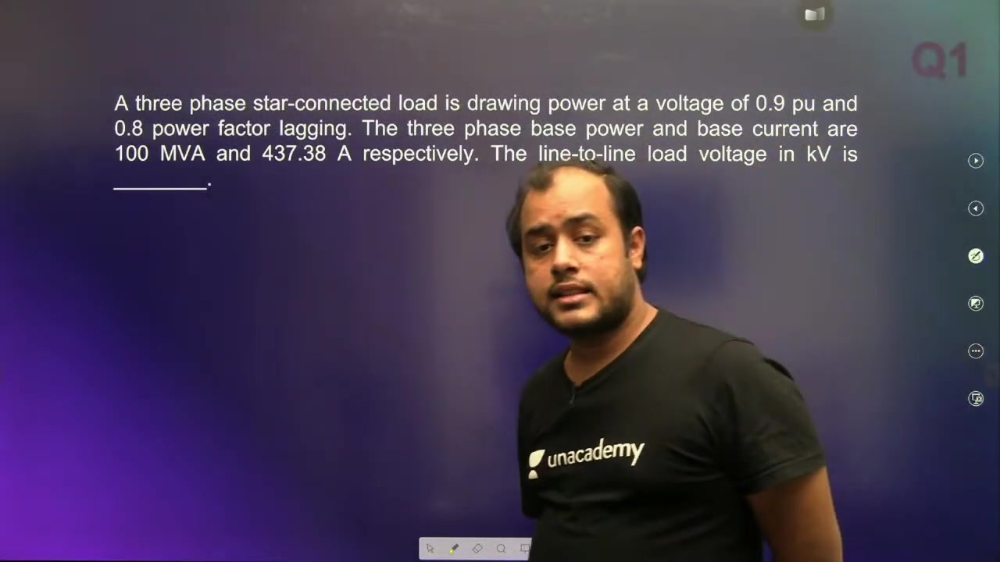

The first problem investigates line voltage determination from per-unit parameters.

> [!example] Problem 1 Statement
> A three-phase star-connected load draws power at a voltage of $0.9\text{ pu}$ and $0.8$ power factor lagging. The three-phase base power is $100\text{ MVA}$. The base current is $437.38\text{ A}$. Find the actual line-to-line load voltage in kilovolts.

Base quantities define the scaling factors for the electrical network. The per-unit value is identical for line-to-line and per-phase voltages. But the base voltage and actual voltage depend on the connection. The next section carries out the complete numerical solution.

## Solution of Problem 1 and Change of Base Impedance
_(05:42 - 10:39)_

### Line and Phase Quantities in Per-Unit Analysis

In balanced three-phase systems, per-unit phase voltage equals per-unit line voltage. The same rule applies to current. Per-unit phase current equals per-unit line current. But actual values and base values differ by a factor of $\sqrt{3}$.

$$V_{\text{pu, line}} = V_{\text{pu, phase}}$$

$$V_L = \sqrt{3} V_{\text{ph}}, \quad V_{\text{base, L}} = \sqrt{3} V_{\text{base, ph}}$$

We are given $V_{\text{pu}} = 0.9\text{ pu}$. The actual line-to-line voltage is:

$$V_L = V_{\text{pu}} \times V_{\text{base, L}}$$

Base voltage is not stated directly. We calculate base line voltage from base apparent power and base current.

$$S_{\text{base}} = \sqrt{3} V_{\text{base, L}} I_{\text{base}}$$

Rearranging gives the base line voltage:

$$\begin{aligned}
V_{\text{base, L}} &= \frac{S_{\text{base}}}{\sqrt{3} I_{\text{base}}} \\
&= \frac{100 \times 10^6}{\sqrt{3} \times 437.38} \\
&= 132000\text{ V} = 132\text{ kV}
\end{aligned}$$

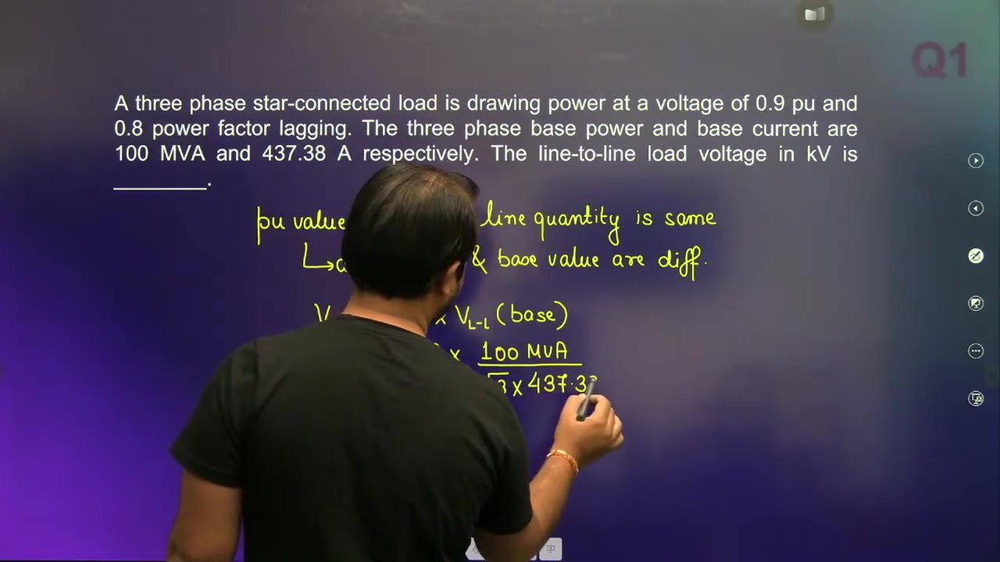

Now multiply per-unit voltage by base line voltage to get actual line voltage:

$$V_L = 0.9 \times 132\text{ kV} = 118.8\text{ kV}$$

> [!success] Problem 1 Result
> The line-to-line load voltage is $118.8\text{ kV}$.

### Problem 2: Transmission Line Per-Unit Conversion

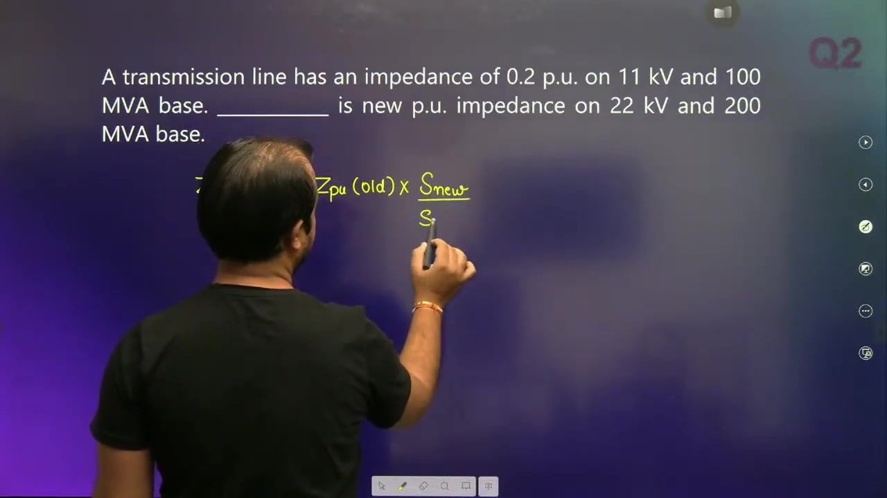

> [!example] Problem 2 Statement
> A transmission line has an impedance of $0.2\text{ pu}$ on an $11\text{ kV}$, $100\text{ MVA}$ base. Find the new per-unit impedance on a $22\text{ kV}$, $200\text{ MVA}$ base.

When base voltage or base power changes, the per-unit impedance must be updated. Ohmic impedance remains constant during base changes.

$$Z(\Omega) = Z_{\text{pu}} \times Z_{\text{base}} = Z_{\text{pu}} \times \frac{V_{\text{base}}^2}{S_{\text{base}}}$$

Equating the ohmic impedance on both bases yields the standard conversion equation:

$$Z_{\text{pu, new}} = Z_{\text{pu, old}} \left(\frac{S_{\text{base, new}}}{S_{\text{base, old}}}\right) \left(\frac{V_{\text{base, old}}}{V_{\text{base, new}}}\right)^2$$

Substitute the given numerical ratings:

$$\begin{aligned}
Z_{\text{pu, new}} &= 0.2 \times \left(\frac{200}{100}\right) \times \left(\frac{11}{22}\right)^2 \\
&= 0.2 \times 2 \times \left(\frac{1}{2}\right)^2 \\
&= 0.4 \times \frac{1}{4} \\
&= 0.1\text{ pu}
\end{aligned}$$

> [!success] Problem 2 Result
> The new per-unit impedance of the transmission line is $0.1\text{ pu}$.

## Transformer Ohmic Reactance and Alternator Base Conversion Setup
_(10:41 - 15:41)_

### Per-Unit Invariance in Transformers

A transformer operates at different voltages on its primary and secondary sides. Each side has its own voltage base. But transformer per-unit impedance remains identical whether referred to the high-voltage side or the low-voltage side.

$$Z_{\text{pu, LV}} = Z_{\text{pu, HV}}$$

Actual ohmic impedances differ across windings by the square of turns ratio. Base impedances also differ by the same ratio. The normalization cancels the turns ratio completely.

### Problem 3: Reactance Referred to the High-Voltage Side

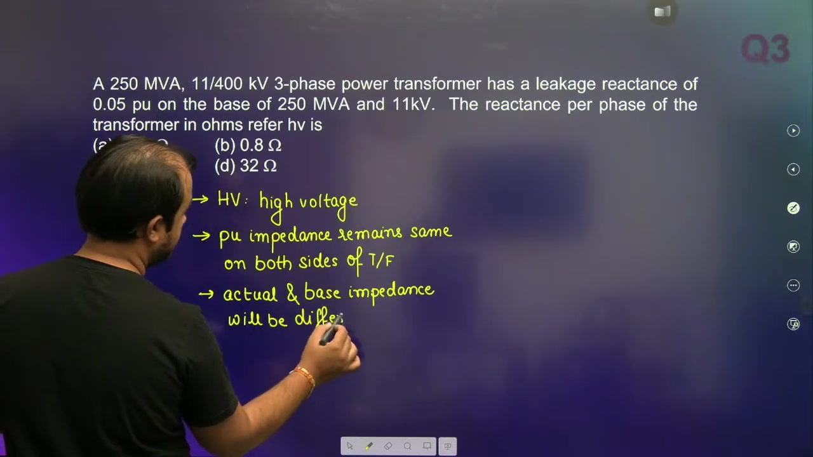

> [!example] Problem 3 Statement
> A $250\text{ MVA}$, $11/400\text{ kV}$, three-phase power transformer has a leakage reactance of $0.05\text{ pu}$ on its own ratings. Find the reactance per phase in ohms referred to the high-voltage side.
>
> (a) $0.05\ \Omega$
> (b) $0.8\ \Omega$
> (c) $160\ \Omega$
> (d) $32\ \Omega$

Unless stated otherwise, three-phase systems use line-to-line voltage and star-equivalent base impedance.

$$Z_{\text{base}} = \frac{V_{\text{base}}^2}{S_{\text{base}}}$$

On the high-voltage side, the base voltage is $400\text{ kV}$. The base power is $250\text{ MVA}$.

$$\begin{aligned}
Z_{\text{base, HV}} &= \frac{(400\text{ kV})^2}{250\text{ MVA}} \\
&= \frac{160000}{250} \\
&= 640\ \Omega
\end{aligned}$$

Now compute actual ohmic reactance on the high-voltage side:

$$X_{\text{HV}} = X_{\text{pu}} \times Z_{\text{base, HV}} = 0.05 \times 640\ \Omega = 32\ \Omega$$

> [!success] Problem 3 Result
> The reactance referred to the high-voltage side is $32\ \Omega$. This matches Option D.

### Problem 4: Alternator Base Voltage Inversion

> [!example] Problem 4 Statement
> The per-unit impedance of an alternator is $0.4\text{ pu}$ on base values of $13.2\text{ kV}$ and $30\text{ MVA}$. The per-unit impedance on a new power base of $5\text{ MVA}$ is $0.0609\text{ pu}$. Find the new base voltage in kilovolts.
>
> (A) $14.56\text{ kV}$
> (B) $13.81\text{ kV}$
> (C) $13.26\text{ kV}$
> (D) $14.25\text{ kV}$

Here both per-unit impedance values are known. The unknown quantity is the new base voltage. The next section completes the algebraic solution for this new base voltage.

## Solution of Problem 4 and System Base Setup for Transformers
_(15:49 - 20:29)_

### Inverting the Change of Base Formula

In Problem 4, both per-unit impedance values are known. We rearrange the change of base relation to isolate the unknown base voltage:

$$Z_{\text{pu, new}} = Z_{\text{pu, old}} \left(\frac{V_{\text{base, old}}}{V_{\text{base, new}}}\right)^2 \left(\frac{S_{\text{base, new}}}{S_{\text{base, old}}}\right)$$

Substitute the known parameters into the expression:

$$\begin{aligned}
0.0609 &= 0.4 \times \left(\frac{13.2}{V_{\text{base, new}}}\right)^2 \times \left(\frac{5}{30}\right) \\
0.0609 &= \frac{0.4}{6} \times \frac{13.2^2}{V_{\text{base, new}}^2}
\end{aligned}$$

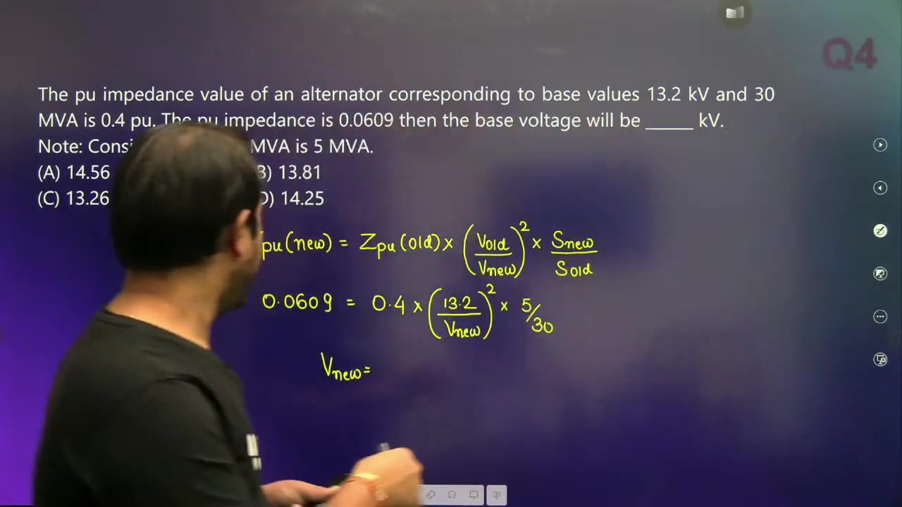

Rearrange to solve for $V_{\text{base, new}}$:

$$\begin{aligned}
V_{\text{base, new}}^2 &= \frac{0.4 \times (13.2)^2}{6 \times 0.0609} \\
&= \frac{0.4 \times 174.24}{0.3654} \\
&= 190.7389 \\
V_{\text{base, new}} &= \sqrt{190.7389} = 13.81\text{ kV}
\end{aligned}$$

> [!success] Problem 4 Result
> The new base voltage is $13.81\text{ kV}$. This confirms Option B.

### Base Value Rules Across Transformers

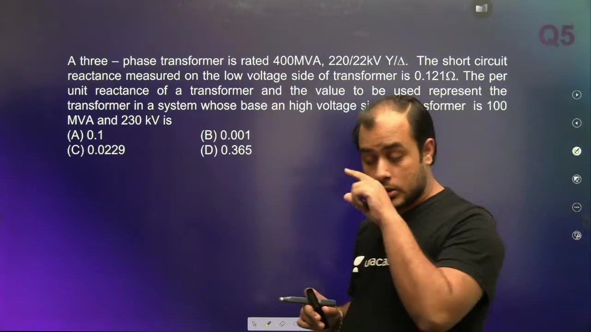

> [!example] Problem 5 Statement
> A three-phase transformer is rated $400\text{ MVA}$, $220/22\text{ kV}$, $\text{Y}/\Delta$. The short-circuit reactance measured on the low-voltage side is $0.121\ \Omega$. Find the per-unit reactance on a system base of $100\text{ MVA}$ and $230\text{ kV}$ on the high-voltage side.
>
> (A) $0.1\text{ pu}$
> (B) $0.001\text{ pu}$
> (C) $0.0229\text{ pu}$
> (D) $0.365\text{ pu}$

Two core rules govern base selection across transformers. First, base apparent power remains identical throughout the entire system. Both high-voltage and low-voltage zones share the same base power.

$$S_{\text{base, HV}} = S_{\text{base, LV}} = 100\text{ MVA}$$

Second, base voltage scales across windings by the transformer rated voltage ratio.

$$V_{\text{base, LV}} = V_{\text{base, HV}} \times \left(\frac{V_{\text{rated, LV}}}{V_{\text{rated, HV}}}\right)$$

Base voltages change across each voltage level. But per-unit impedance remains unchanged across ideal transformations. The next section completes the numerical computation for this delta winding.

## Delta Base Calculation, Generator Reactance, and Three-Phase Transformer Setup
_(20:41 - 26:32)_

### Completion of Problem 5: Delta Winding Base Impedance

Base power remains $100\text{ MVA}$ on both sides of the transformer. The high-voltage base is $230\text{ kV}$. We scale this to the low-voltage side using the rated voltage ratio.

$$V_{\text{base, LV}} = 230\text{ kV} \times \left(\frac{22.5\text{ kV}}{220\text{ kV}}\right) \approx 23.52\text{ kV}$$

The low-voltage winding is connected in delta. Phase base impedance for a delta connection includes an extra factor of $3$:

$$Z_{\text{base, LV}}(\Delta) = \frac{3 V_{\text{base, LV}}^2}{S_{\text{base}}}$$

Substitute the base values:

$$\begin{aligned}
Z_{\text{base, LV}}(\Delta) &= \frac{3 \times (23.52)^2}{100} \\
&= \frac{3 \times 553.19}{100} \\
&= 16.60\ \Omega
\end{aligned}$$

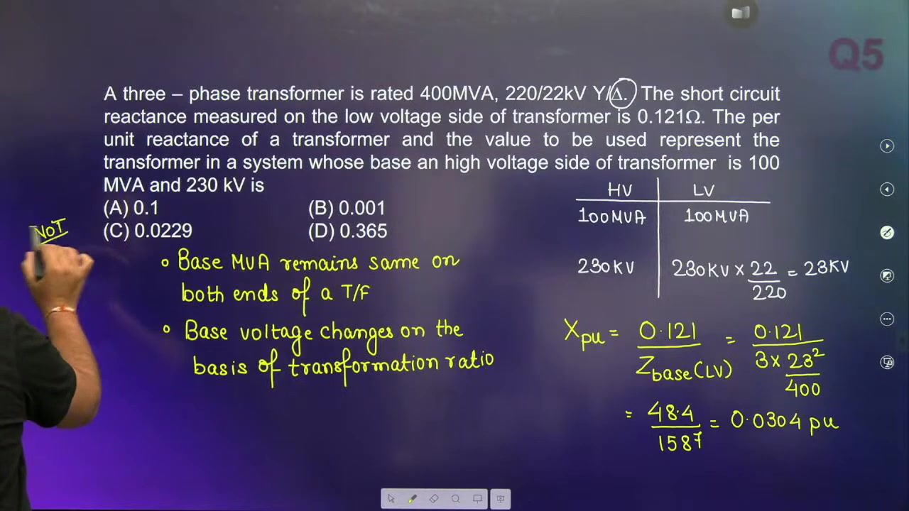

Now divide the measured ohmic reactance by the delta base impedance:

$$X_{\text{pu}} = \frac{0.121\ \Omega}{16.60\ \Omega} \approx 0.00762\text{ pu}$$

> [!success] Problem 5 Result
> The per-unit reactance is $0.00762\text{ pu}$. None of the given numerical options match this value. So Option D is correct.

### Problem 6: Generator Ohmic Reactance

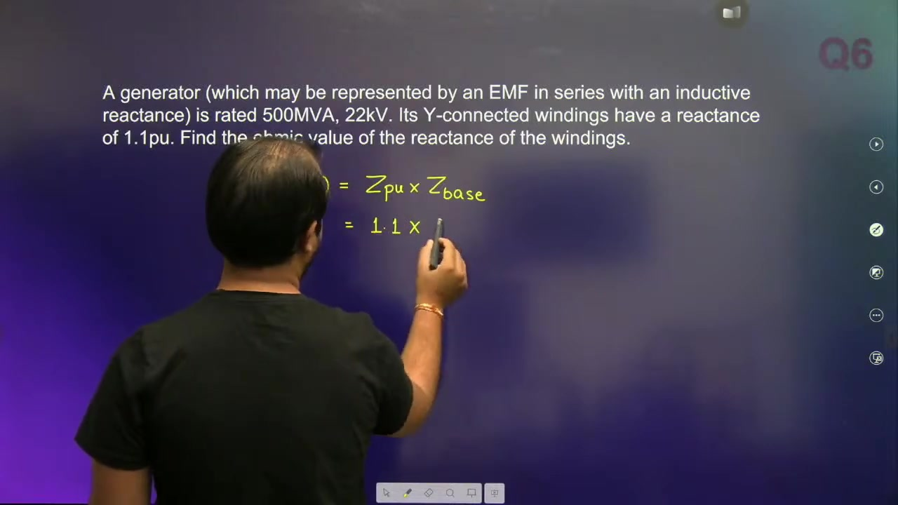

> [!example] Problem 6 Statement
> A synchronous generator is rated $500\text{ MVA}$ and $22\text{ kV}$. Its star-connected windings have a per-unit reactance of $1.1\text{ pu}$. Find the ohmic reactance of the windings.

For a star-connected machine, base impedance is:

$$Z_{\text{base}} = \frac{V_{\text{base}}^2}{S_{\text{base}}}$$

Substitute the generator ratings:

$$\begin{aligned}
Z_{\text{base}} &= \frac{(22\text{ kV})^2}{500\text{ MVA}} \\
&= \frac{484}{500} \\
&= 0.968\ \Omega
\end{aligned}$$

Compute actual reactance by multiplying per-unit reactance by base impedance:

$$X(\Omega) = X_{\text{pu}} \times Z_{\text{base}} = 1.1 \times 0.968\ \Omega = 1.0648\ \Omega \approx 1.06\ \Omega$$

> [!success] Problem 6 Result
> The ohmic reactance of the generator windings is $1.06\ \Omega$.

### Problem 7 Setup: Three-Phase Transformer Delta Reactance

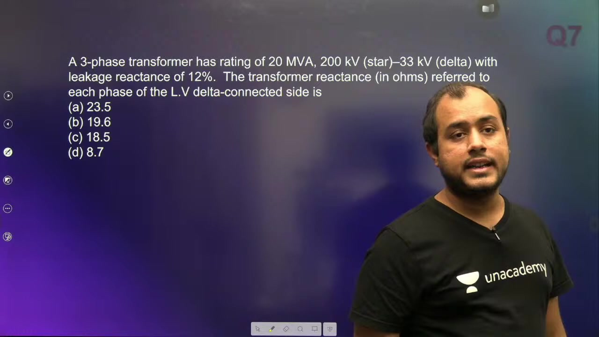

> [!example] Problem 7 Statement
> A three-phase transformer is rated $20\text{ MVA}$, $200\text{ kV}\ \text{Y} / 33\text{ kV}\ \Delta$ with $12\%$ leakage reactance. Find the transformer reactance in ohms per phase referred to the low-voltage delta side.
>
> (a) $23.5\ \Omega$
> (b) $19.6\ \Omega$
> (c) $18.5\ \Omega$
> (d) $8.7\ \Omega$

The per-unit reactance is $0.12\text{ pu}$. The solution requires finding the delta base impedance on the $33\text{ kV}$ side. The next section details this calculation.

## Transformer Delta Reactance, Complex Phase Impedance, and Base Scaling
_(26:34 - 33:56)_

### Solution of Problem 7: Low-Voltage Delta Reactance

Transformer per-unit reactance is identical on both sides. On the low-voltage side, the per-unit reactance is $0.12\text{ pu}$. The low-voltage winding is connected in delta. We evaluate the phase base impedance using the delta formula:

$$Z_{\text{base, LV}}(\Delta) = \frac{3 V_{\text{base, LV}}^2}{S_{\text{base}}}$$

Substitute $V_{\text{base, LV}} = 33\text{ kV}$ and $S_{\text{base}} = 20\text{ MVA}$:

$$\begin{aligned}
Z_{\text{base, LV}}(\Delta) &= \frac{3 \times (33)^2}{20} \\
&= \frac{3 \times 1089}{20} \\
&= 163.35\ \Omega
\end{aligned}$$

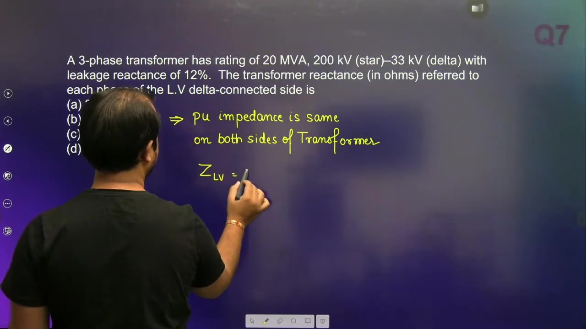

Multiply per-unit reactance by base impedance to obtain ohmic reactance:

$$X_{\text{LV}}(\Omega) = 0.12 \times 163.35\ \Omega = 19.602\ \Omega \approx 19.6\ \Omega$$

> [!success] Problem 7 Result
> The reactance referred to each phase of the low-voltage delta winding is $19.6\ \Omega$. This matches Option B.

### Problem 8: Complex Primary Phase Impedance

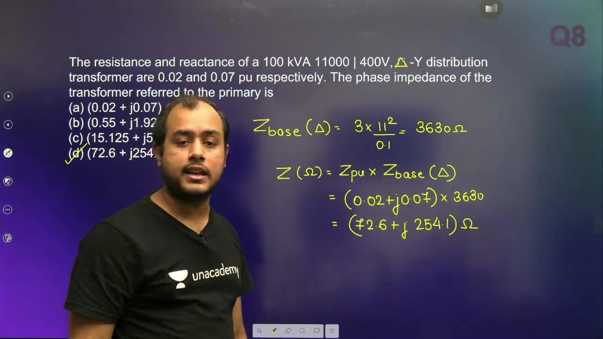

> [!example] Problem 8 Statement
> The resistance and reactance of a $100\text{ kVA}$, $11000/400\text{ V}$, $\Delta\text{-Y}$ distribution transformer are $0.02\text{ pu}$ and $0.07\text{ pu}$ respectively. Find the phase impedance in ohms referred to the primary side.
>
> (a) $(0.02 + j0.07)\ \Omega$
> (b) $(0.55 + j1.925)\ \Omega$
> (c) $(15.125 + j52.94)\ \Omega$
> (d) $(72.6 + j254.1)\ \Omega$

The primary winding is connected in delta with ratings $11\text{ kV}$ and $100\text{ kVA} = 0.1\text{ MVA}$. Calculate the primary delta base impedance:

$$\begin{aligned}
Z_{\text{base}}(\Delta) &= \frac{3 \times (11\text{ kV})^2}{0.1\text{ MVA}} \\
&= \frac{3 \times 121}{0.1} \\
&= 3630\ \Omega
\end{aligned}$$

Multiply per-unit impedance by this base impedance:

$$\begin{aligned}
Z(\Omega) &= Z_{\text{pu}} \times Z_{\text{base}}(\Delta) \\
&= (0.02 + j0.07) \times 3630 \\
&= (72.6 + j254.1)\ \Omega
\end{aligned}$$

> [!success] Problem 8 Result
> The primary phase impedance is $(72.6 + j254.1)\ \Omega$. This confirms Option D.

### Problem 9: Doubling Base Voltage and Base Power

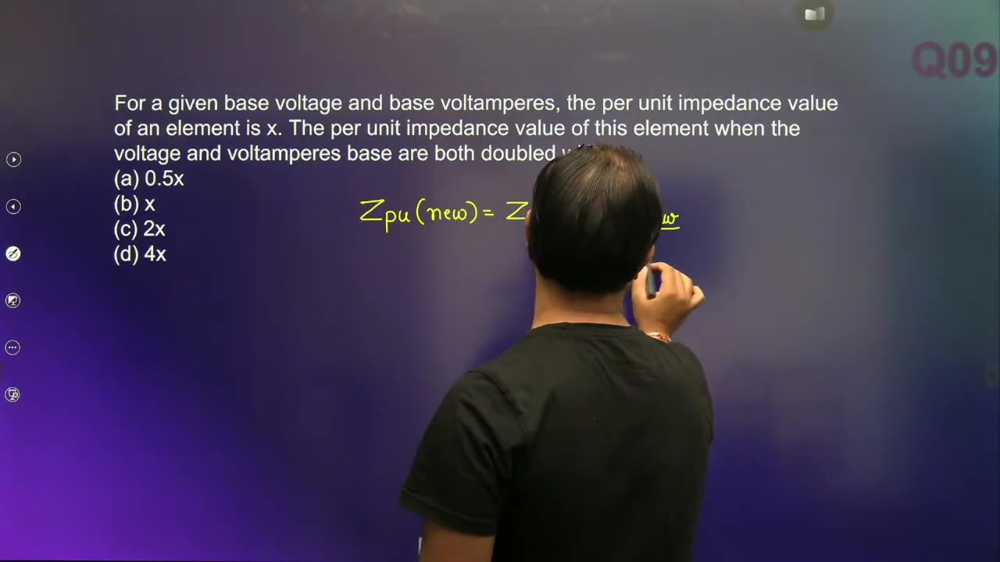

> [!example] Problem 9 Statement
> For a given base voltage and base apparent power, an element has a per-unit impedance of $x$. Find its new per-unit impedance when both base voltage and base apparent power are doubled.
>
> (a) $0.5x$
> (b) $x$
> (c) $2x$
> (d) $4x$

Apply the standard base conversion equation:

$$Z_{\text{pu, new}} = Z_{\text{pu, old}} \left(\frac{S_{\text{base, new}}}{S_{\text{base, old}}}\right) \left(\frac{V_{\text{base, old}}}{V_{\text{base, new}}}\right)^2$$

Here $S_{\text{base, new}} / S_{\text{base, old}} = 2$ and $V_{\text{base, old}} / V_{\text{base, new}} = 1/2$. Substitute these ratios:

$$\begin{aligned}
Z_{\text{pu, new}} &= x \times 2 \times \left(\frac{1}{2}\right)^2 \\
&= x \times 2 \times \frac{1}{4} \\
&= 0.5x
\end{aligned}$$

> [!success] Problem 9 Result
> The new per-unit impedance is $0.5x$. This confirms Option A.

### Problem 10 Setup: Impedance Ratio on Transformer and Generator Bases

The next problem examines a $15\text{ MVA}$, $33/11\text{ kV}$ transformer supplied from a $30\text{ MVA}$, $11\text{ kV}$ generator. The transformer has $16\ \Omega$ impedance on its high-tension side. We will evaluate the ratio of its per-unit impedance on its own base to that on the generator base.

## Relative Base Ratios, Base Halving, and Single-Phase Transformer Parameters
_(34:01 - 39:10)_

### Problem 10: Ratio of Per-Unit Impedance Across Bases

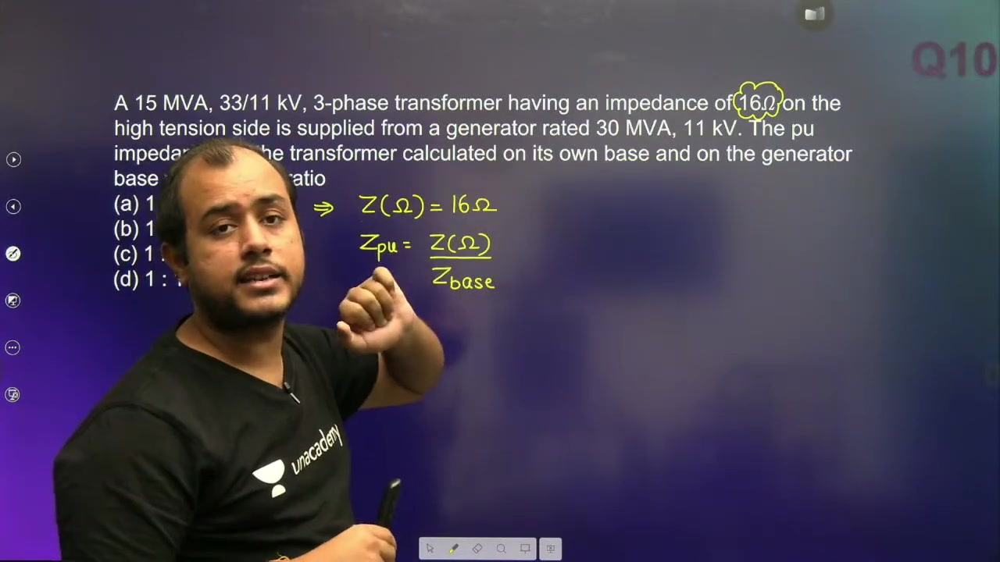

> [!example] Problem 10 Statement
> A $15\text{ MVA}$, $33/11\text{ kV}$, three-phase transformer has an impedance of $16\ \Omega$ on its high-tension side. It is supplied from a generator rated $30\text{ MVA}$, $11\text{ kV}$. Find the ratio of transformer per-unit impedance on its own base to that on the generator base.
>
> (a) $1 : 1$
> (b) $1 : 3$
> (c) $1 : 9$
> (d) $1 : 18$

The actual physical impedance $Z(\Omega) = 16\ \Omega$ is constant. Per-unit impedance relates to base impedance by definition:

$$Z_{\text{pu}} = \frac{Z(\Omega)}{Z_{\text{base}}}$$

Because actual impedance is fixed, per-unit impedance varies inversely with base impedance:

$$\frac{Z_{\text{pu, T}}}{Z_{\text{pu, G}}} = \frac{Z_{\text{base, G}}}{Z_{\text{base, T}}}$$

The generator base on the high-tension side is $11\text{ kV}$ and $30\text{ MVA}$. The transformer base is $33\text{ kV}$ and $15\text{ MVA}$. Express both base impedances:

$$Z_{\text{base, G}} = \frac{11^2}{30}, \quad Z_{\text{base, T}} = \frac{33^2}{15}$$

Compute the ratio:

$$\begin{aligned}
\frac{Z_{\text{pu, T}}}{Z_{\text{pu, G}}} &= \frac{\frac{11^2}{30}}{\frac{33^2}{15}} \\
&= \left(\frac{11}{33}\right)^2 \times \left(\frac{15}{30}\right) \\
&= \left(\frac{1}{3}\right)^2 \times \frac{1}{2} \\
&= \frac{1}{9} \times \frac{1}{2} = \frac{1}{18}
\end{aligned}$$

> [!success] Problem 10 Result
> The ratio of per-unit impedances is $1 : 18$. This confirms Option D.

### Problem 11: Base Halving Effect

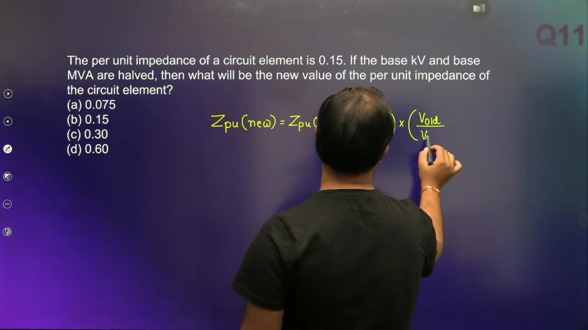

> [!example] Problem 11 Statement
> The per-unit impedance of a circuit element is $0.15\text{ pu}$. If base voltage and base apparent power are both halved, find the new per-unit impedance.
>
> (a) $0.075\text{ pu}$
> (b) $0.15\text{ pu}$
> (c) $0.30\text{ pu}$
> (d) $0.60\text{ pu}$

Apply the change of base formula:

$$Z_{\text{pu, new}} = Z_{\text{pu, old}} \left(\frac{S_{\text{base, new}}}{S_{\text{base, old}}}\right) \left(\frac{V_{\text{base, old}}}{V_{\text{base, new}}}\right)^2$$

Here $S_{\text{base, new}} / S_{\text{base, old}} = 1/2$ and $V_{\text{base, old}} / V_{\text{base, new}} = 2$.

$$\begin{aligned}
Z_{\text{pu, new}} &= 0.15 \times \left(\frac{1}{2}\right) \times (2)^2 \\
&= 0.15 \times \frac{1}{2} \times 4 \\
&= 0.15 \times 2 \\
&= 0.30\text{ pu}
\end{aligned}$$

> [!success] Problem 11 Result
> The new per-unit impedance is $0.30\text{ pu}$. This confirms Option C.

### Problem 12 Setup: Detailed Transformer Winding Impedances

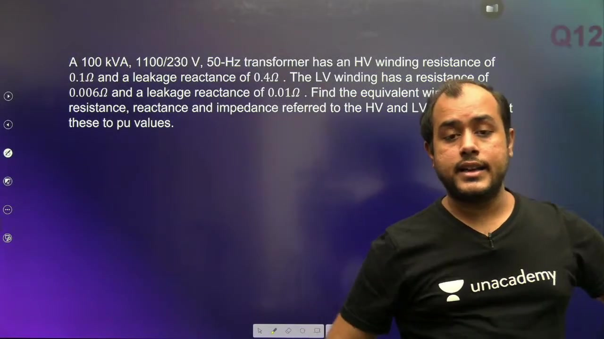

> [!example] Problem 12 Statement
> A $100\text{ kVA}$, $1100/230\text{ V}$, $50\text{ Hz}$ single-phase transformer has high-voltage winding resistance $0.1\ \Omega$ and leakage reactance $0.4\ \Omega$. The low-voltage winding has resistance $0.006\ \Omega$ and leakage reactance $0.01\ \Omega$. Find the equivalent resistance, reactance, and impedance referred to both sides. Convert all parameters to per-unit values.

This comprehensive problem combines winding parameter referral with per-unit conversions. The next section details the complete solution.

## Per-Unit Conversion of Individual Transformer Windings
_(39:24 - 44:04)_

### Low-Voltage Winding Per-Unit Impedance

In Problem 12, each transformer winding has its own physical resistance and leakage reactance. The low-voltage winding parameters are:

$$z_{\text{LV}} = (0.006 + j0.01)\ \Omega$$

The transformer rating is $100\text{ kVA}$ and $1100/230\text{ V}$. The base power is $100\text{ kVA}$. The base voltage on the low-voltage side is $230\text{ V}$.

Calculate base impedance on the low-voltage side:

$$\begin{aligned}
Z_{\text{base, LV}} &= \frac{V_{\text{base, LV}}^2}{S_{\text{base}}} \\
&= \frac{230^2}{100 \times 10^3} \\
&= \frac{52900}{100000} \\
&= 0.529\ \Omega
\end{aligned}$$

Divide the ohmic impedance by the base impedance:

$$\begin{aligned}
z_{\text{pu, LV}} &= \frac{0.006 + j0.01}{0.529} \\
&= (0.01134 + j0.0189)\text{ pu}
\end{aligned}$$

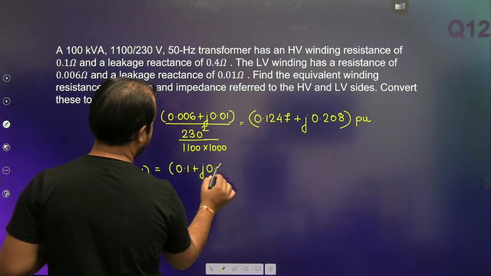

> [!success] Low-Voltage Winding Per-Unit Result
> The per-unit impedance of the low-voltage winding is $(0.01134 + j0.0189)\text{ pu}$.

### High-Voltage Winding Per-Unit Impedance

The high-voltage winding has ohmic parameters:

$$z_{\text{HV}} = (0.1 + j0.4)\ \Omega$$

The base voltage on the high-voltage side is $1100\text{ V}$. Calculate the high-voltage base impedance:

$$\begin{aligned}
Z_{\text{base, HV}} &= \frac{V_{\text{base, HV}}^2}{S_{\text{base}}} \\
&= \frac{1100^2}{100 \times 10^3} \\
&= \frac{1210000}{100000} \\
&= 12.1\ \Omega
\end{aligned}$$

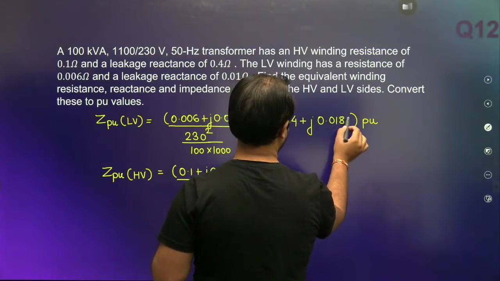

Divide the high-voltage winding ohmic impedance by its base impedance:

$$\begin{aligned}
z_{\text{pu, HV}} &= \frac{0.1 + j0.4}{12.1} \\
&= (0.00826 + j0.03305)\text{ pu}
\end{aligned}$$

> [!success] High-Voltage Winding Per-Unit Result
> The per-unit impedance of the high-voltage winding is $(0.00826 + j0.03305)\text{ pu}$.

In the per-unit domain, both winding impedances are dimensionless. They can be added directly without referring across turns ratios. The next section completes the total equivalent impedance calculation.

## Total Equivalent Transformer Impedance and Course Transition
_(44:12 - 49:29)_

### Total Equivalent Per-Unit Impedance

In per-unit representation, the ideal transformer turns ratio is normalized to unity. Primary and secondary winding impedances connect directly in series. We do not need turns-ratio reflection factors.

$$Z_{\text{pu, eq}} = z_{\text{pu, LV}} + z_{\text{pu, HV}}$$

Add the real and imaginary parts from the individual winding calculations:

$$\begin{aligned}
Z_{\text{pu, eq}} &= (0.01134 + j0.0189) + (0.00826 + j0.03305) \\
&= (0.01134 + 0.00826) + j(0.0189 + 0.03305) \\
&= (0.0196 + j0.05195)\text{ pu}
\end{aligned}$$

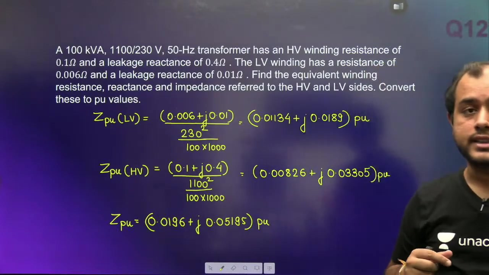

> [!success] Total Equivalent Per-Unit Impedance
> The total equivalent transformer impedance is $(0.0196 + j0.05195)\text{ pu}$.

Individual winding per-unit impedances differ because their physical dimensions and copper volumes differ. But the total equivalent per-unit impedance remains identical whether viewed from the low-voltage side or the high-voltage side.

### Equivalent Ohmic Impedances Referred to Both Sides

We recover actual ohmic values by multiplying the total per-unit impedance by the base impedance of each side.

For the high-voltage side:

$$\begin{aligned}
Z_{\text{HV}} &= Z_{\text{pu, eq}} \times Z_{\text{base, HV}} \\
&= (0.0196 + j0.05195) \times 12.1\ \Omega \\
&= (0.237 + j0.6285)\ \Omega
\end{aligned}$$

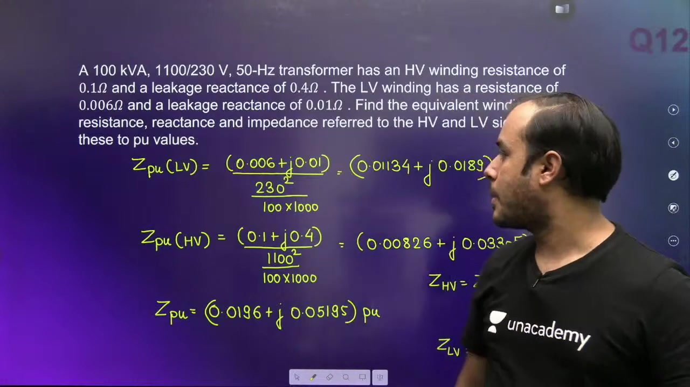

For the low-voltage side:

$$\begin{aligned}
Z_{\text{LV}} &= Z_{\text{pu, eq}} \times Z_{\text{base, LV}} \\
&= (0.0196 + j0.05195) \times 0.529\ \Omega \\
&= (0.01036 + j0.02748)\ \Omega
\end{aligned}$$

> [!success] Equivalent Ohmic Values
> The total equivalent impedance referred to the high-voltage side is $(0.237 + j0.6285)\ \Omega$. Referred to the low-voltage side, it is $(0.01036 + j0.02748)\ \Omega$.

### Module Summary and Transition to Transformers

This problem concludes the foundational series on electrical machines. The covered topics include magnetic circuits, electromagnetic laws, and per-unit representations. These principles form the bedrock of machine modeling.

The next lecture begins the detailed study of power and distribution transformers. It explores magnetic core construction and the induced electromotive force equation:

$$E = 4.44 f N \Phi_m$$

---

## Summary and Key Takeaways

- In balanced three-phase systems, per-unit phase voltage equals per-unit line voltage ($V_{\text{pu, ph}} = V_{\text{pu, L}}$), but actual values differ by $\sqrt{3}$.
- The change-of-base impedance formula is $Z_{\text{pu, new}} = Z_{\text{pu, old}} (S_{\text{base, new}} / S_{\text{base, old}}) (V_{\text{base, old}} / V_{\text{base, new}})^2$.
- Per-unit transformer impedance is identical whether referred to the high-voltage winding or low-voltage winding.
- Base apparent power remains constant across transformer zones, while base voltages scale with rated winding turns ratios.
- Per-phase base impedance for a delta connection is $Z_{\text{base}}(\Delta) = 3 V_{\text{base}}^2 / S_{\text{base}}$, three times the star base impedance.
- For a fixed physical impedance, per-unit impedances on different bases vary inversely with base impedances: $Z_{\text{pu, 1}} / Z_{\text{pu, 2}} = Z_{\text{base, 2}} / Z_{\text{base, 1}}$.
- Primary and secondary winding per-unit impedances add directly in series as $Z_{\text{pu, eq}} = z_{\text{pu, 1}} + z_{\text{pu, 2}}$ without turns ratios.

