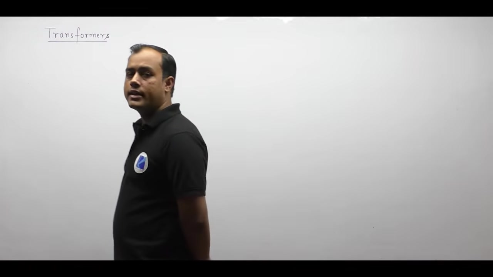
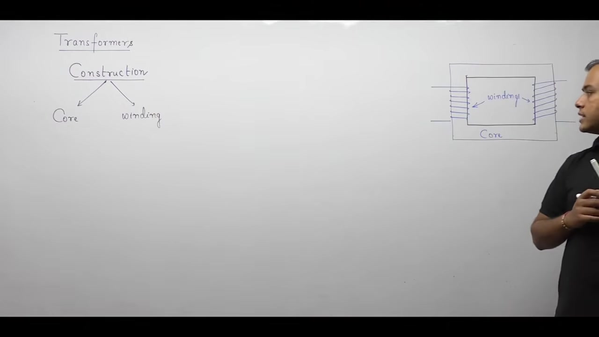
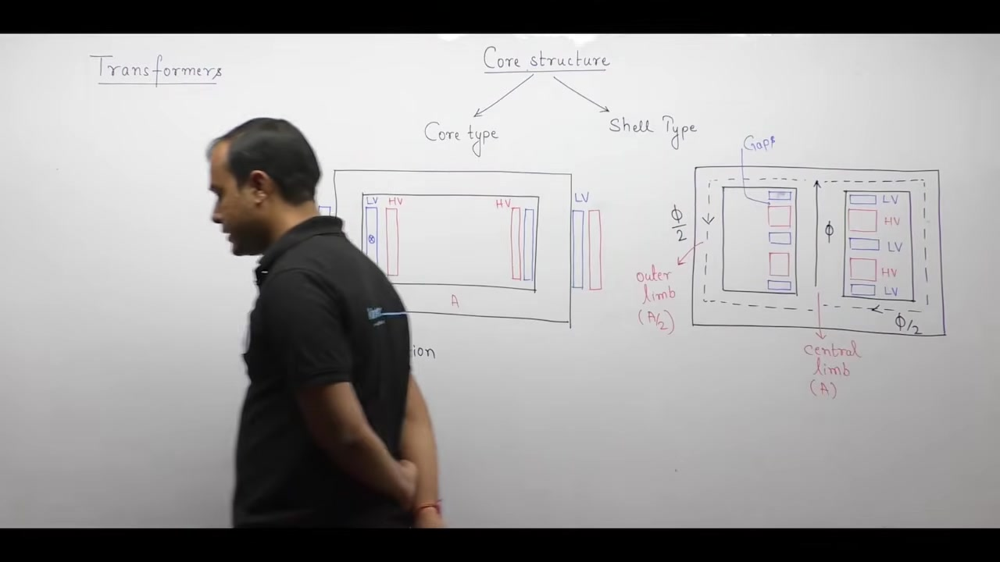
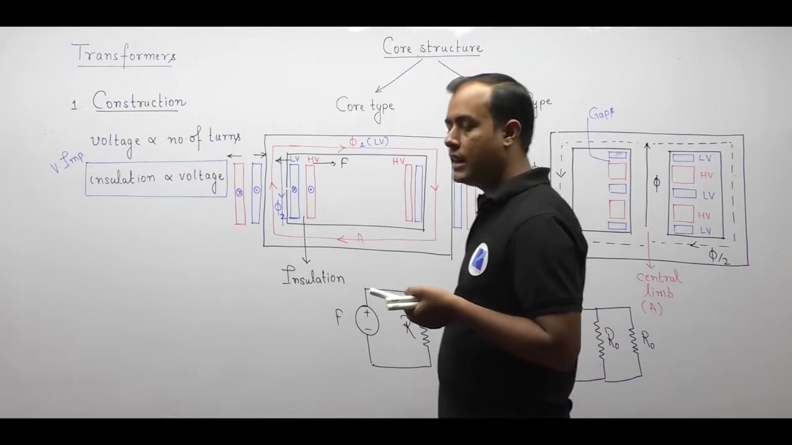
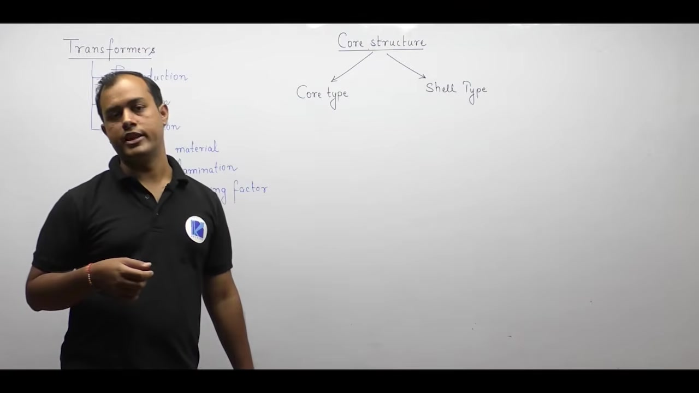

# Transformer Construction - 1 | Electrical Machines | Lec 8 | | GATE & ESE | Ankit Goyal

- **Source**: https://www.youtube.com/watch?v=n1r4cOF2zW4
- **Duration**: 01:14:32
- **Compiled**: 2026-09-19

---

## Overview

This lecture introduces the fundamental principles and physical construction of the single-phase transformer. It explains how energy transfers between isolated circuits via magnetic flux at constant frequency. The lecture examines core material selection, showing why cold rolled grain oriented silicon steel minimizes magnetic losses. It derives the mathematical relationships for eddy current loss and stacking factor in laminated cores. Finally, it contrasts core-type and shell-type geometries across mechanical, magnetic, thermal, and economic design criteria.

## Contents

- [[#Introduction to Transformers and Types of Coupling|Introduction to Transformers and Types of Coupling]]
- [[#Operational Terminology and Power System Applications|Operational Terminology and Power System Applications]]
- [[#Applications in Electronics and Comparison with Amplifiers|Applications in Electronics and Comparison with Amplifiers]]
- [[#Transformer Construction: Core, Windings, and Insulation|Transformer Construction: Core, Windings, and Insulation]]
- [[#Core Materials and CRGO Silicon Steel|Core Materials and CRGO Silicon Steel]]
- [[#Core Laminations and Eddy Current Mitigation|Core Laminations and Eddy Current Mitigation]]
- [[#Stacking Factor and High-Frequency Core Materials|Stacking Factor and High-Frequency Core Materials]]
- [[#Core-Type versus Shell-Type Geometries and Winding Arrangements|Core-Type versus Shell-Type Geometries and Winding Arrangements]]
- [[#Magnetic Circuit Equivalence and Structural Comparison|Magnetic Circuit Equivalence and Structural Comparison]]
- [[#Insulation Design and Mechanical Repulsive Forces|Insulation Design and Mechanical Repulsive Forces]]
- [[#Mechanical Protection, Leakage Flux, and Ease of Repair|Mechanical Protection, Leakage Flux, and Ease of Repair]]
- [[#Cooling Mechanisms and Application Domains|Cooling Mechanisms and Application Domains]]
- [[#Comprehensive Comparison of Core-Type and Shell-Type Transformers|Comprehensive Comparison of Core-Type and Shell-Type Transformers]]

---

## Introduction to Transformers and Types of Coupling
_(00:12 - 10:03)_

### Definition of a Transformer

A transformer is a static electromagnetic device. It transfers electrical energy between two or more circuits without any moving parts. During this transfer, it alters the voltage and current levels to suit specific needs. But it maintains a constant operating frequency on both sides.

> [!info] Definition: Transformer
> A transformer is a static device that transfers electrical energy from a source to a load. It changes voltage and current levels while keeping the electrical frequency strictly constant.

A transformer operates with high efficiency because it lacks friction and windage losses. In an AC power system, power generation usually occurs at intermediate voltages like $11\text{ kV}$ or $15.75\text{ kV}$. Long-distance transmission needs much higher voltages to minimize line losses. The transformer steps up this voltage efficiently. Later, near consumer loads, it steps down the voltage to safe distribution levels such as $400\text{ V}$ or $230\text{ V}$.

### Primary and Secondary Windings

A basic transformer consists of two electrically isolated coils wound around a shared ferromagnetic core. The coils are called windings.

- **Primary Winding:** The winding that connects directly to the AC power source and draws energy from the supply.
- **Secondary Winding:** The winding that connects to the electrical load and delivers energy to it.

Energy transfers from the primary winding to the secondary winding without any direct conducting wire between them. Current does not pass across the windings. Instead, energy transfers through the mutual magnetic flux established inside the magnetic core.

### Types of Physical Coupling

Coupling describes the physical link that transfers energy or motion between two systems. In engineering systems, we encounter three primary types of physical coupling:

1. **Electrical Coupling:** Two circuits are electrically coupled when electric current flows directly between them through a conducting medium. An example is a simple wired branch in a circuit.
2. **Mechanical Coupling:** Two bodies are mechanically coupled when they share a direct physical or kinematic link. Moving parts move together. In a vehicle, wheels mounted on a single drive axle are mechanically coupled. In a ceiling fan, the motor rotor and the fan blades turn together on a shared shaft.
3. **Magnetic Coupling:** Two circuits are magnetically coupled when magnetic flux links them through space or a magnetic medium. Energy transfers without any direct electrical contact. Transformers use pure magnetic coupling between their windings.

### High Voltage (HV) and Low Voltage (LV) Classifications

A transformer is a bilateral device. It allows energy transfer in either direction. Power can flow from a high voltage circuit to a low voltage circuit. It can also flow from low voltage to high voltage.

Because primary and secondary designations depend solely on where the source is connected, engineers classify transformer windings by their voltage ratings:

- **High Voltage (HV) Winding:** The winding designed for the higher voltage rating. It handles lower current for a given MVA capacity.
- **Low Voltage (LV) Winding:** The winding designed for the lower voltage rating. It carries higher current for the same capacity.

If the source is connected to the LV winding and the load to the HV winding, the transformer acts as a **step-up transformer**. If the source connects to the HV winding and the load to the LV winding, it operates as a **step-down transformer**.

## Operational Terminology and Power System Applications
_(10:03 - 16:10)_

### Primary and Secondary versus HV and LV

The terms primary and secondary describe roles during operation. They are not permanent physical traits of the coils.

- **HV and LV sides are fixed by design:** The winding with more turns is the High Voltage side. The winding with fewer turns is the Low Voltage side. This depends strictly on construction.
- **Primary and secondary sides depend on connection:** Whichever winding you connect to the power source acts as the primary. Whichever winding connects to the load acts as the secondary.

If you connect the power source to the LV side and the load to the HV side, the unit steps up the voltage. This is a **step-up transformer**. If you connect the source to the HV side and the load to the LV side, the unit reduces the voltage. This is a **step-down transformer**.

### Why Transformers Have the Highest Efficiency

In rotating electrical machines, parts spin continuously on bearings. Friction occurs between bearings and rotating shafts. Air resistance also causes windage loss. These mechanical losses waste energy as heat.

A transformer is a static machine. It has no rotating or sliding parts. Because nothing moves, mechanical friction losses and windage losses are zero. The only losses present are electrical core losses and winding resistance losses.

> [!success] Highest Efficiency Machine
> Because mechanical friction and windage losses are completely absent, the transformer exhibits the highest operating efficiency among all electrical machines. Large power transformers often reach efficiencies above 98% to 99%.

### Power System Applications: Generation to Distribution

In modern power grids, transformers link generation, bulk transmission, and local consumption.

1. **At the Generating Station:** Electric generators produce power at moderate voltages, often between $11\text{ kV}$ and $25\text{ kV}$. Sending bulk power at these voltages over long distances causes high $I^2 R$ transmission losses. So a **power transformer** steps up this generated voltage to high grid levels like $132\text{ kV}$, $400\text{ kV}$, or $765\text{ kV}$.
2. **At the Transmission Network:** Stepping up the voltage lowers the line current for a given power level. Lower current allows thinner conductors. It also drastically cuts transmission losses.
3. **At the Load Center:** Extremely high voltages cannot enter residential homes or factories safely. Near consumers, a **distribution transformer** steps down the voltage to safe utilization values such as $400\text{ V}$ three-phase and $230\text{ V}$ single-phase.

## Applications in Electronics and Comparison with Amplifiers
_(16:14 - 22:50)_

### Applications in Communication and Control Systems

Transformers serve several critical roles beyond standard high-power transmission and distribution grids:

1. **Communication Systems:** In audio circuits, a transformer couples a microphone to the first stage of an amplifier. A microphone produces very weak electrical signals from acoustic waves. The transformer provides proper coupling while rejecting common-mode noise.
2. **Impedance Matching:** In electronic circuits, maximum power transfers from source to load when load impedance matches the internal source impedance. By network theory, maximum power transfer occurs when:
   $$Z_L = Z_{th}^*$$
   A transformer reflects impedance by the square of its turns ratio. Designers adjust turns ratios to match source and load impedances without adding lossy series resistors.
3. **Power Electronics and Gate Drive Isolation:** In power converter circuits, pulse transformers trigger the gates of Silicon Controlled Rectifiers (SCRs) or MOSFETs. The control circuit operates at low DC voltages like $5\text{ V}$. The power circuit operates at hundreds of volts. The pulse transformer transfers fast gating pulses while providing galvanic isolation.

### Galvanic Isolation

A transformer does not need to step up or step down voltage. A unity turns ratio transformer ($1:1$) keeps the voltage magnitude unchanged.

Because its primary and secondary windings share only magnetic flux, there is no conductive path between them. This complete electrical isolation protects sensitive control equipment from high-voltage surges or ground loops.

### Why a Transformer Cannot Act as an Amplifier

A step-up transformer increases output voltage above input voltage. This leads some beginners to confuse it with an amplifier. But a transformer cannot act as an amplifier.

> [!info] Conceptual Comparison: Transformer versus Amplifier
> An amplifier is an active device. It increases total signal power by drawing power from an external DC bias supply. A transformer is a passive device. It has no external DC power source. By the conservation of energy, it cannot create energy or increase signal power.

An amplifier increases voltage and current at the same time. The added power comes from its DC power supply.

A transformer has no external energy feed. In an ideal transformer, input complex power equals output complex power:

$$S_{\text{in}} = S_{\text{out}} \implies V_1 I_1 = V_2 I_2$$

If a transformer steps up the voltage, it cuts the current by the exact same ratio. If it steps up the current, it reduces the voltage. Real transformers incur core and copper losses. So output power is always slightly lower than input power:

$$P_{\text{out}} = P_{\text{in}} - P_{\text{loss}} < P_{\text{in}}$$

Because it cannot increase total power, a transformer can never function as an amplifier.

## Transformer Construction: Core, Windings, and Insulation
_(22:50 - 28:06)_

### Core Components of a Transformer

A transformer is structurally simple. It has fewer parts than rotating machines. Every transformer relies on two primary physical components:

1. **The Magnetic Core:** A closed loop made of ferromagnetic material. It provides a guided path of low magnetic reluctance for mutual magnetic flux.
2. **The Windings:** Coils of insulated conductive wire, usually copper or aluminum. They carry electrical current and link with the magnetic flux.

> [!info] Fundamental Construction Rule
> A transformer consists of primary and secondary windings wound around a shared ferromagnetic core. Both windings are insulated from each other and from the core.

### Schematic Representation versus Physical Construction

Textbooks often represent a transformer with a simple rectangular core. One vertical limb holds the primary winding. The opposite vertical limb holds the secondary winding.

This layout is only a convenient schematic diagram. It helps in solving polarity questions and deriving equivalent circuits. But actual transformers are not constructed this way. Placing separate windings on distant limbs creates unacceptably high leakage flux. Practical transformers place both windings close together on shared limbs.

### Why Core-to-Winding Insulation is Mandatory

Winding wires are never wrapped directly onto a bare ferromagnetic core.

Ferromagnetic core materials like iron or steel are electrical conductors. If live bare copper touches an iron core, electric current leaks directly into the core material. This causes short circuits, insulation breakdown, and severe shock hazards.

To prevent conduction between copper and steel, manufacturers place tough dielectric insulation between the core surface and the inner winding layer.

### Focus of Constructional Study

A complete industrial transformer includes auxiliary components such as a tank, conservator, breather, and bushings. But its core electrical operation depends entirely on the core and the windings.

Among these, magnetic core engineering is the most detailed topic. Core design determines magnetic losses, flux carrying capacity, and acoustic noise.

## Core Materials and CRGO Silicon Steel
_(28:06 - 32:45)_

### Desirable Properties of Core Materials

The core guides magnetic flux between the primary and secondary windings. To perform this role efficiently, the core material must possess two essential magnetic properties:

1. **High Magnetic Permeability ($\mu$):** High permeability allows magnetic flux lines to pass through the material with ease.
2. **Low Magnetic Reluctance ($\mathcal{S}$):** From magnetic circuit theory, reluctance is defined as:
   $$\mathcal{S} = \frac{l}{\mu A}$$
   where $l$ is the mean magnetic path length, $\mu$ is the material permeability, and $A$ is the cross-sectional area.

When permeability $\mu$ is high, reluctance $\mathcal{S}$ drops to a low value. In a transformer, energy transfers from primary to secondary in the form of mutual magnetic flux. Low reluctance ensures minimal opposition to this flux. It also reduces the magnetizing current drawn from the AC source.

### Cold Rolled Grain Oriented (CRGO) Silicon Steel

Standard low-carbon steel is unsuitable for power transformer cores. Instead, transformer cores are manufactured using silicon alloyed steel. Power transformers use **Cold Rolled Grain Oriented (CRGO) silicon steel**.

During manufacturing, silicon steel is passed through rollers in a specific direction under cold conditions. This mechanical rolling aligns the crystalline magnetic grains along the rolling path. This delivers two major engineering advantages:

- **Exceptionally High Permeability:** Magnetic permeability increases significantly in the direction of grain orientation.
- **Low Hysteresis Loss:** CRGO steel features a very narrow $B\text{-}H$ hysteresis loop. Because hysteresis energy loss per cycle is proportional to the area of the hysteresis loop, narrow loops produce very low core heating.

> [!success] Core Material Summary
> Power transformers use CRGO silicon steel because it delivers high permeability and very low hysteresis loss along the rolling direction.

### Why the Core is Made of Laminations

Looking at an assembled transformer, the core appears to be a thick, solid metal frame. But it is never cast or machined as a single solid block.

A solid steel block would experience massive circulating eddy currents. These currents cause heavy power loss and dangerous heating. To stop this problem, the core is built from many thin steel sheets pressed together. These individual thin sheets are called **laminations**.

## Core Laminations and Eddy Current Mitigation
_(32:50 - 40:37)_

### Lamination Thickness and Assembly

A transformer core consists of thin silicon steel laminations. They are stacked tightly and fastened together using rivets or clamping bolts.

At standard power frequencies like $50\text{ Hz}$, each lamination has a thickness of about $0.35\text{ mm}$. In $60\text{ Hz}$ applications, typical thickness ranges between $0.27\text{ mm}$ and $0.35\text{ mm}$.

### Eddy Current Loss Reduction

When alternating magnetic flux passes through a conducting steel core, it induces internal electromotive forces. These voltages drive circulating currents called **eddy currents**. Eddy currents dissipate power as heat.

The volumetric eddy current power loss in a thin sheet follows this expression:

$$P_e = \frac{\pi^2 f^2 B_m^2 t^2}{6 \rho}$$

Here $t$ is the lamination thickness, $f$ is the operating frequency, $B_m$ is the maximum flux density, and $\rho$ is the electrical resistivity of the core steel.

> [!success] Dependence on Lamination Thickness
> Eddy current loss is directly proportional to the square of lamination thickness:
> $$P_e \propto t^2$$
> Cutting the lamination thickness in half reduces the eddy current loss by a factor of four.

### Lower Limit on Lamination Thickness

Since loss depends on $t^2$, one might assume thickness should be reduced as much as possible. But practical mechanical limits exist:

1. **Mechanical Strength:** Very thin sheets bend easily. When clamped together, very thin sheets have low mechanical rigidity. They may vibrate, hum, or delaminate under magnetic forces.
2. **Manufacturing Cost:** Thinner sheets mean many more sheets per core. This raises stamping, coating, and assembly costs.
3. **Air Gaps and Reluctance:** More sheets create more interfacial gaps. Microscopic air gaps between sheets lower the effective permeability and increase magnetic reluctance.

### Inter-Lamination Insulation

Stacking bare metal sheets provides no benefit. If bare sheets touch each other, eddy currents cross freely from sheet to sheet. The entire stack behaves like a single solid block.

To break the eddy current paths, each lamination must be coated with a thin insulating layer. This confines eddy current loops to individual sheets. These small paths offer very high electrical resistance, which quenches circulating currents.

Common industrial materials used for inter-lamination insulation include:

- **China clay**
- **Japan varnish**
- **Impregnated paper**
- **Phosphate and oxide coatings**

The laminations must be clamped together very tightly. Loose riveting leaves air gaps between laminations, which increases core reluctance and magnetizing current.

## Stacking Factor and High-Frequency Core Materials
_(40:38 - 45:55)_

### Net Area versus Gross Area

When you cut a laminated core perpendicular to its length, you see alternating layers of steel and insulation.

- **Net Cross-Sectional Area ($A_n$):** The actual cross-sectional area occupied solely by silicon steel laminations.
- **Gross Cross-Sectional Area ($A_g$):** The total physical cross-sectional area enclosed by the core outer dimensions. It equals the sum of the lamination area and the insulation area.

Because the insulation between laminations is non-magnetic, it carries almost zero magnetic flux. Magnetic flux lines confine themselves almost entirely to the silicon steel laminations.

### Stacking Factor

The ratio of useful magnetic steel area to total physical area is defined as the **stacking factor** ($k_s$):

> [!info] Definition: Stacking Factor ($k_s$)
> The stacking factor is the ratio of net magnetic iron cross-sectional area to gross core cross-sectional area:
> $$k_s = \frac{A_n}{A_g} = \frac{\text{Net Cross-Sectional Area}}{\text{Gross Cross-Sectional Area}}$$

Because insulation takes up some volume, the net area is always smaller than the gross area. Therefore:

$$k_s < 1$$

In typical power transformer cores, the stacking factor value ranges around $0.90$. It usually falls between $0.88$ and $0.95$, depending on lamination thickness and insulation type.

### Calculating Total Magnetic Flux

When calculating the magnetic flux carrying capacity of a transformer core, you must use the net cross-sectional area $A_n$:

> [!success] Core Magnetic Flux
> $$\Phi = B \cdot A_n = B \cdot (k_s A_g)$$
> where $B$ is the operational flux density, $A_n$ is the net iron area, and $A_g$ is the gross core area.

Using gross area directly without the stacking factor will overestimate the magnetic flux capacity by about $10\%$.

### High-Frequency Transformer Cores

At standard power frequencies like $50\text{ Hz}$ or $60\text{ Hz}$, CRGO silicon steel performs well. But in switch-mode power supplies, electronic circuits, and communication systems, frequencies reach tens or hundreds of kilohertz.

Because eddy current loss is proportional to $f^2$, silicon steel cores would overheat instantly at high frequencies. High-frequency transformers use **ferrimagnetic materials (ferrites)** instead.

Ferrites exhibit very high electrical resistivity. Their high resistivity suppresses eddy currents without needing ultra-thin metal laminations.

### Introduction to Core Structural Types

After establishing material and lamination properties, we examine overall core geometry. Transformers are divided into two main structural types:

1. **Core-Type Transformers**
2. **Shell-Type Transformers**

## Core-Type versus Shell-Type Geometries and Winding Arrangements
_(46:01 - 50:44)_

### Core-Type Geometry and Concentric Windings

A core-type transformer core features a rectangular shape with two vertical limbs and two horizontal yokes. It encloses a single central opening called a window.

In this design, the electrical windings surround the magnetic core limbs.

1. **Insulation to Core:** A major insulation barrier wraps around each core limb first.
2. **Low Voltage Winding:** The LV winding sits directly over this inner insulation cylinder. Placing LV closest to the core minimizes the required insulation thickness.
3. **Inter-Winding Insulation:** A second dielectric barrier wraps around the LV winding.
4. **High Voltage Winding:** The HV winding sits on the very outside. It wraps concentrically around the LV winding.

> [!info] Equal Distribution of Turns
> In a core-type transformer, turns are divided equally across both limbs. Half of the LV turns and half of the HV turns sit on the left limb. The other halves sit on the right limb. Never put the entire LV winding on one limb and the entire HV winding on the other.

### Shell-Type Geometry and Sandwich Windings

In a shell-type transformer, the magnetic core surrounds the electrical windings. The core has three vertical limbs and two windows:

- **Central Limb:** The central vertical limb carries all the windings. It has a cross-sectional area $A$.
- **Outer Limbs:** The two side limbs provide parallel return paths for flux. Each outer limb carries half the flux ($\Phi / 2$). So each outer limb has half the cross-sectional area ($A/2$).

Because flux density $B = \Phi / A$ remains uniform everywhere, the core material is used efficiently.

### Sandwich / Interleaved Coil Arrangement

Windings in shell-type transformers do not use long concentric cylinders. Instead, they use flat pancake discs stacked vertically along the central limb.

This arrangement is called **sandwich winding** or **interleaved winding**:

$$\text{LV disc} \longrightarrow \text{HV disc} \longrightarrow \text{LV disc} \longrightarrow \text{HV disc} \longrightarrow \text{LV disc}$$

Dielectric insulation sheets separate adjacent discs.

The two outermost discs at the top and bottom are always LV coils. Each outer LV disc contains half the turns of a regular LV section ($N_{\text{LV}} / 2$). This smart layout needs much less insulation between the end coils and the grounded steel yokes.

## Magnetic Circuit Equivalence and Structural Comparison
_(50:48 - 55:46)_

### Core-Type as a Series Magnetic Circuit

In a core-type transformer, the exact same magnetic flux $\Phi$ circulates through the entire core loop. The flux magnitude is constant across both limbs and both yokes.

Because the cross-sectional area $A$ and permeability $\mu$ remain uniform throughout, the magnetic circuit behaves as a simple series loop:

$$\mathcal{F} = \Phi \cdot \mathcal{R}_{\text{total}}$$

Here $\mathcal{F} = N I$ is the net magnetomotive force. $\mathcal{R}_{\text{total}}$ is the total reluctance of the rectangular frame.

### Shell-Type as a Parallel Magnetic Circuit

In a shell-type transformer, the central limb carries the total magnetic flux $\Phi$. At the top yoke, this flux divides equally into two symmetric parallel paths:

$$\Phi_{\text{outer}} = \frac{\Phi}{2}$$

Each outer branch carries half of the total flux. To keep flux density $B$ uniform throughout the core, the outer limbs are built with half the cross-sectional area:

$$B = \frac{\Phi_{\text{central}}}{A} = \frac{\Phi_{\text{outer}}}{A/2} = \frac{\Phi / 2}{A / 2}$$

This magnetic circuit is a parallel network:

- An MMF source $\mathcal{F}$ sits on the central limb.
- The central limb has reluctance $R_c$.
- Two outer limbs offer parallel return paths with reluctance $R_o$ each.

The total reluctance seen by the central limb MMF is:

> [!success] Shell-Type Equivalent Reluctance
> $$\mathcal{R}_{\text{eq}} = R_c + (R_o \parallel R_o) = R_c + \frac{R_o}{2}$$

### Structural Comparison: Core versus Shell

Comparing the two structural types reveals distinct engineering tradeoffs:

1. **Physical Enclosure:** In a core-type transformer, the windings surround the core limbs. In a shell-type transformer, the steel core surrounds the electrical windings.
2. **Accessibility for Inspection:** Because core-type windings sit on the outer limbs, they are easy to reach. Technicians can inspect, tap, or repair windings without dismantling the whole magnetic circuit. In shell-type units, the core encloses the coils, which makes repairs harder.
3. **Insulation Economy:** Core-type units split total winding turns equally between two limbs. This layout reduces the voltage stress on each limb.

## Insulation Design and Mechanical Repulsive Forces
_(55:47 - 60:51)_

### Voltage and Insulation Requirements

The induced voltage in a transformer winding depends directly on its number of turns:

$$E \propto N$$

Insulation design depends strictly on voltage. Under high electric fields, dielectric materials experience electrical stress:

$$\mathcal{E} = \frac{V}{d}$$

When the electric field exceeds the dielectric strength of an insulator, molecular dipoles tear apart. This causes dielectric breakdown and short circuits. To keep the field within safe limits, insulation thickness must increase with voltage:

$$\text{Insulation Thickness } d \propto V$$

### Why Core-Type Needs Less Insulation

In a core-type transformer, winding turns are divided equally across two limbs. Each limb holds half of the total turns ($N / 2$).

Because turns per limb are halved, the operating voltage across each limb drops to $V / 2$. In contrast, a shell-type transformer concentrates all turns and full voltage $V$ on its single central limb.

> [!success] Insulation Economy in Core-Type
> Because the voltage per limb is halved in a core-type transformer, each limb needs less insulation thickness. For identical high-voltage ratings, core-type construction saves substantial insulation material.

### Mechanical Repulsive Forces Between Windings

According to Lenz's law, the secondary winding opposes the change in primary flux. To produce opposing MMFs, primary and secondary currents must flow in opposite directions.

From basic electromagnetism, conductors carrying currents in opposite directions repel each other:

$$F \propto I_1 \cdot I_2$$

Because concentric LV and HV coils carry opposing currents, a strong radial repulsive force develops between them:

- **Inner LV Winding:** Repelled inward toward the center, compressing against the steel core limb.
- **Outer HV Winding:** Pushed radially outward, trying to expand its circular circumference.

During normal operation, these forces are manageable. But during external short-circuit faults, winding currents spike to 10 to 20 times their rated values. Because force depends on the product of currents, short-circuit mechanical forces increase by a factor of 100 to 400. The transformer structure must be clamped tightly to survive these massive forces.

## Mechanical Protection, Leakage Flux, and Ease of Repair
_(60:51 - 66:14)_

### Mechanical Bracing and Fault Withstand

During short-circuit faults, currents reach dangerous levels. The resulting repulsive forces try to rip the windings apart.

- **Core-Type Transformers:** The windings sit on the outside of the core. The outer HV coils have no solid steel backing. They need external clamping rings and tie rods to prevent distortion.
- **Shell-Type Transformers:** The heavy steel core surrounds the windings from the outside. The core limbs act as rigid mechanical shields. This structure provides natural bracing against destructive magnetic forces.

> [!success] Mechanical Strength Advantage
> Shell-type transformers offer superior mechanical protection against short-circuit forces. The surrounding core structure braces the internal coils securely.

### Leakage Flux and Leakage Reactance

Not all magnetic flux links both the primary and secondary windings.

> [!info] Definition: Leakage Flux
> Leakage flux is that portion of the magnetic flux that links only one winding without linking the other. It completes its closed path through air or insulation instead of through the steel core.

Leakage flux creates an inductive voltage drop known as **leakage reactance**.

- **In Core-Type Units:** The outer HV winding sits farther from the core limb. Some magnetic field lines circulate through the surrounding air and insulation without linking the inner LV turns. This gives core-type transformers higher leakage flux.
- **In Shell-Type Units:** Sandwiched LV and HV discs lie tightly interleaved on the central limb. Mutual coupling between adjacent thin discs is very tight. The enclosing outer core limbs also capture fringe flux. This results in significantly lower leakage flux and lower leakage reactance.

### Ease of Inspection and Repair

The physical location of the coils determines maintenance difficulty:

- **Core-Type:** The coils sit on the outside of the limbs. If a winding suffers an insulation fault, technicians can inspect, remove, and rewind the coil easily.
- **Shell-Type:** The windings are buried deep inside the central core window. To replace a damaged disc, technicians must dismantle the entire core frame lamination by lamination. Repairing a shell-type unit takes much more time and labor.

## Cooling Mechanisms and Application Domains
_(66:15 - 72:09)_

### Thermal Dissipation and Cooling

Transformer operation produces heat from two primary sources:

1. **Winding Copper Losses ($I^2 R$):** Resistive heat generated within the copper conductors.
2. **Core Losses ($P_h + P_e$):** Hysteresis and eddy current heat generated within the silicon steel laminations.

Winding insulation degrades quickly when overheated. Therefore, cooling the windings is far more critical than cooling the core steel.

- **In Core-Type Units:** The windings sit on the outside of the core limbs. Heat generated by the coils radiates directly into the surrounding medium. This provides effective winding cooling.
- **In Shell-Type Units:** The windings are buried deep inside the central core window. Heat struggles to escape through the enclosing steel. But the external core steel cools easily because it faces the outside.

Large power transformers sit immersed in a steel tank filled with transformer oil. The oil serves a dual purpose: it acts as a liquid dielectric insulator, and it circulates by convection to carry heat away from the core and coils.

### High Voltage and High Power Applications

Core-type construction is preferred for high-voltage and high-power applications:

1. **Accommodation of Turns:** High voltage requires a large number of turns ($V \propto N$). Splitting turns across two limbs provides ample space to accommodate large coils.
2. **Reduced Voltage Stress:** Splitting the turns cuts the voltage per limb in half. This lowers insulation requirements.
3. **Better Coil Cooling:** Higher power ratings generate substantial $I^2 R$ heat. The superior winding cooling of the core-type structure prevents hot spots.

> [!success] Application Rule
> Core-type transformers are preferred for **High Voltage and High Power** utility grids. Shell-type transformers are preferred for **Low Voltage and Low Power** applications where mechanical rigidity is the primary concern.

## Comprehensive Comparison of Core-Type and Shell-Type Transformers
_(72:12 - 74:24)_

### Copper Conductor Requirements

Copper consumption differs between the two geometries due to mean turn length:

- **In Core-Type Units:** The HV winding wraps concentrically over the LV winding. Because the HV coil has a larger outer radius $r$, its mean circumference $2\pi r$ is larger. This increases the total length and weight of copper wire needed for the HV coil.
- **In Shell-Type Units:** Flat pancake discs stack along the central limb. Coils do not enclose each other along the full axial height. This reduces the mean length of turn and saves conductor copper.

### Summary Comparison Table

The table below summarizes the key engineering distinctions between core-type and shell-type transformers:

| Design Parameter | Core-Type Transformer | Shell-Type Transformer |
| :--- | :--- | :--- |
| **Physical Arrangement** | Windings surround the magnetic core limbs. | Magnetic core surrounds the electrical windings. |
| **Number of Limbs and Windows** | 2 limbs and 1 window. | 3 limbs and 2 windows. |
| **Magnetic Circuit Path** | Series magnetic circuit (constant flux $\Phi$). | Parallel magnetic circuit ($\Phi / 2$ in outer limbs). |
| **Construction Complexity** | Easier and cheaper to manufacture. | More complex core assembly and disc stacking. |
| **Mechanical Support** | Lower natural support against radial repulsive forces. | Superior mechanical support braced by outer steel limbs. |
| **Leakage Flux and Reactance** | Higher leakage flux and higher leakage reactance. | Lower leakage flux due to interleaved pancake coils. |
| **Ease of Repair** | Windings are easily reached and rewound. | Difficult to repair; core must be completely disassembled. |
| **Cooling Behavior** | Superior winding cooling; harder core cooling. | Superior core cooling; harder winding cooling. |
| **Insulation Economy** | Needs less insulation; voltage is halved across two limbs. | Needs more insulation; full voltage appears on one limb. |
| **Copper Conductor Weight** | Requires more copper due to larger outer mean turn length. | Requires less copper conductor weight. |
| **Primary Applications** | **High Voltage and High Power** utility grids. | **Low Voltage and Low Power** applications. |

### Chapter Summary

This lecture establishes the engineering principles of transformer construction:

1. **Transformer Principle:** A static electromagnetic device that transfers AC energy via magnetic flux at constant frequency.
2. **Coupling Fundamentals:** Energy transfers by magnetic coupling rather than direct conductive connection.
3. **Core Materials:** CRGO silicon steel provides high permeability and narrow hysteresis loops.
4. **Laminations and Losses:** Thin $0.35\text{ mm}$ laminations coated with insulation suppress eddy current loss ($P_e \propto t^2$).
5. **Stacking Factor:** The net magnetic cross section is about $90\%$ of the gross core cross section ($k_s \approx 0.9$).
6. **Structural Geometries:** Core-type and shell-type designs present clear tradeoffs in insulation, cooling, repairability, and mechanical strength.

---

## Summary and Key Takeaways

- A transformer is a static electromagnetic device that transfers AC power between circuits at constant frequency by mutual magnetic coupling.
- The high-voltage and low-voltage designations are fixed by winding turns, whereas primary and secondary roles depend strictly on source and load connections.
- A transformer is a passive device with conservation of complex power ($V_1 I_1 \approx V_2 I_2$), so it cannot amplify total signal power.
- Power transformer cores use CRGO silicon steel because grain orientation delivers high permeability and narrow hysteresis loops along the rolling direction.
- Eddy current loss is proportional to the square of lamination thickness ($P_e \propto t^2$), which requires thin insulated sheets of about $0.35\text{ mm}$ at $50\text{ Hz}$.
- The stacking factor $k_s = A_n / A_g < 1$ accounts for inter-lamination insulation, so core magnetic flux must be calculated using net iron area: $\Phi = B \cdot A_n$.
- Core-type transformers operate as series magnetic circuits with concentric windings, dividing turns equally across two limbs to halve voltage insulation stress.
- Shell-type transformers operate as parallel magnetic circuits with sandwiched coils on the central limb, where outer limbs carry $\Phi / 2$ through cross-sectional area $A / 2$.
- Due to opposing currents dictated by Lenz's law, windings experience radial repulsive forces ($F \propto I_1 I_2$) that peak severely during short-circuit faults.

