# Electrical Machines | Lec 9 | Transformer Construction (Part 2) | GATE Electrical Engineering

- **Source**: https://www.youtube.com/watch?v=3zpzzpEH940
- **Duration**: 01:07:28
- **Compiled**: 2026-09-19

---

## Overview

This lecture examines the physical construction and geometric design of power and distribution transformers. It investigates the optimization of core cross-sections from simple rectangular profiles to multi-stepped cruciform shapes. The discussion details the arrangement of concentric and sandwich windings along with the technical rationale for winding placement and tap connections. Finally, it analyzes essential auxiliary components including dielectric oil, insulating bushings, conservator tanks, and silica gel breathers.

## Contents

- [[#Transformer Core Cross-Section: Rectangular vs. Circular Geometries|Transformer Core Cross-Section: Rectangular vs. Circular Geometries]]
- [[#Why Circular Cross-Section is Preferred Over Rectangular Cross-Section|Why Circular Cross-Section is Preferred Over Rectangular Cross-Section]]
- [[#Stepped Cores and the Cruciform Core Approximation|Stepped Cores and the Cruciform Core Approximation]]
- [[#Lamination Shapes and Staggered Butt Joints|Lamination Shapes and Staggered Butt Joints]]
- [[#Core Stacking Assembly, Winding Insertion, and Shell-Type Laminations|Core Stacking Assembly, Winding Insertion, and Shell-Type Laminations]]
- [[#Concentric Windings and Placement Rationale|Concentric Windings and Placement Rationale]]
- [[#Inner Insulation Consequences and Tap Placement on HV Windings|Inner Insulation Consequences and Tap Placement on HV Windings]]
- [[#Helical and Crossover Winding Types|Helical and Crossover Winding Types]]
- [[#Disc-Type Windings and Shell-Type Sandwich Windings|Disc-Type Windings and Shell-Type Sandwich Windings]]
- [[#Shell-Type Coupling and Transformer Oil Functions|Shell-Type Coupling and Transformer Oil Functions]]
- [[#Bushings and the Breathing Mechanism|Bushings and the Breathing Mechanism]]
- [[#Silica Gel Breathers, Conservator Tanks, and Construction Summary|Silica Gel Breathers, Conservator Tanks, and Construction Summary]]

---

## Transformer Core Cross-Section: Rectangular vs. Circular Geometries
_(00:12 - 05:46)_

### Review of Core Construction Fundamentals

A transformer core uses thin cold-rolled grain-oriented silicon steel sheets called laminations. Standard laminations for 50 Hz operation are roughly 0.35 mm thick. Stacking thin laminations divides eddy current circulation paths. This reduces eddy current loss, which scales with the square of lamination thickness.

Thin layers of varnish or oxide insulation separate adjacent laminations. This barrier stops eddy currents from crossing between sheets. Stacking factor quantifies this assembly:

$$K_s = \frac{A_{\text{net}}}{A_{\text{gross}}} = \frac{\text{Net Iron Area}}{\text{Gross Core Area}} < 1$$

Typical stacking factor values range from 0.85 to 0.92.

In core-type construction, primary and secondary turns are divided across both limbs. The low-voltage winding sits closest to the iron core. The high-voltage winding surrounds the low-voltage winding. In shell-type units, both windings sit on the central limb in interleaved sandwich coils. This sandwich layout minimizes inter-winding spacing and lowers leakage flux.

### Rectangular Cross-Section in Small Transformers

Small low-power transformers use a rectangular or square core cross-section. Manufacturing rectangular laminations is simple and inexpensive. Rectangular strips are sheared from steel coils with almost zero scrap.

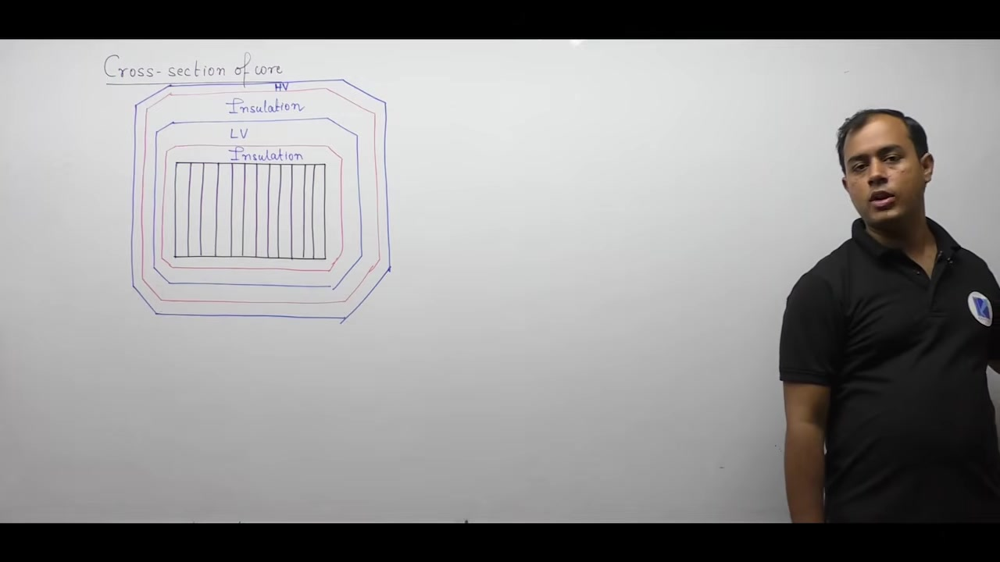

The core limb consists of stacked rectangular laminations separated by inter-lamination varnish. A solid insulation barrier surrounds the assembled rectangular limb. The low-voltage coil sits over this barrier. A second insulation barrier wraps over the low-voltage coil. Finally, the high-voltage coil sits on the outer perimeter.

### Preference for Circular Geometry in Large Transformers

Large power transformers avoid simple rectangular cores. Instead, designers prefer a circular core cross-section.

> [!info] Core Geometry Selection
> Small transformers use rectangular cross-sections because fabrication costs are low. Large transformers require circular core geometry to minimize winding perimeter, copper loss, and conductor weight.

For any given cross-sectional area, a circle possesses the minimum possible perimeter. Wrapping coils around a circular limb shortens the mean length of each turn. This reduces conductor material, winding resistance, and total load loss.

## Why Circular Cross-Section is Preferred Over Rectangular Cross-Section
_(05:49 - 11:26)_

### Geometric Comparison of Square and Circle

Consider a circular cross-section inscribed inside or compared against a square boundary. The circle encloses less area than an equivalent bounding square.

This geometric relationship yields two primary advantages in transformer design. First, it decreases core volume. Second, it minimizes the perimeter of each winding turn.

### Reduction in Core Volume and Core Losses

Both hysteresis loss and eddy current loss take place inside the magnetic core. The total core loss is the sum of these two components:

$$P_c = P_h + P_e$$

Both losses are directly proportional to the total volume of active magnetic core material:

$$P_c \propto V_{\text{core}}$$

A circular cross-section uses less core volume for a given magnetic design. A smaller volume directly cuts the total iron loss. It also lowers the total weight of silicon steel. This saves material costs during fabrication.

### Reduction in Copper Requirement and Conductor Resistance

For any given cross-sectional area, a circle possesses the minimum possible perimeter. The circumference of a circular limb is substantially smaller than the perimeter of a rectangular limb of equal area.

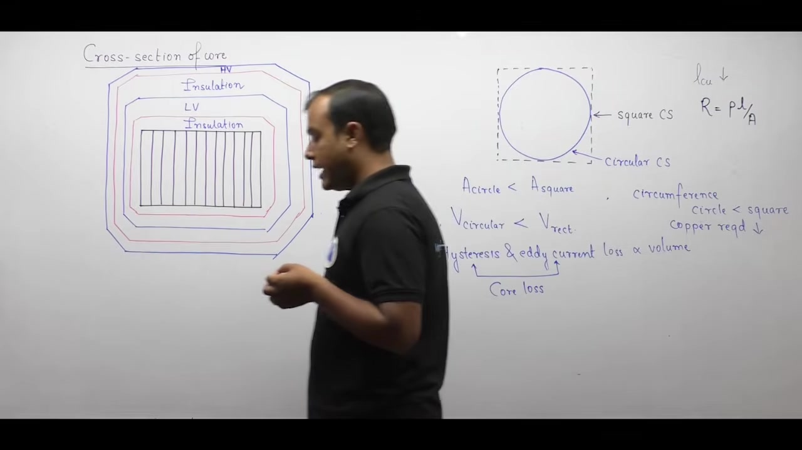

Winding conductors wrap tightly around the core limb. A smaller core perimeter reduces the mean length of a turn:

$$l_{\text{turn}} = \text{Perimeter}_{\text{limb}}$$

The electrical resistance of the winding is given by:

$$R = \rho \frac{l}{A_c}$$

Here $\rho$ is the resistivity of copper, $l$ is the total conductor length, and $A_c$ is the conductor cross-sectional area. Shorter conductor length directly lowers winding resistance $R$.

### Impact on Copper Loss and Overall Efficiency

Winding current creates ohmic heating loss, known as copper loss:

$$P_{\text{cu}} = I^2 R$$

Lower winding resistance directly reduces $I^2 R$ losses.

> [!info] Advantages of Circular Core Geometry
> 1. **Lower Core Loss**: Smaller core volume reduces both hysteresis and eddy current losses.
> 2. **Lower Copper Loss**: Shorter mean turn length reduces winding resistance and $I^2 R$ heat dissipation.
> 3. **Lower Material Cost**: Less iron and less copper are required.
> 4. **Higher Efficiency**: Minimizing both iron and copper losses maximizes overall operational efficiency.

## Stepped Cores and the Cruciform Core Approximation
_(11:29 - 17:58)_

### Manufacturing Challenges of a Purely Circular Core

Ideally, every transformer core limb would have a completely circular cross-section. But building a true circular core from thin flat laminations creates severe manufacturing problems.

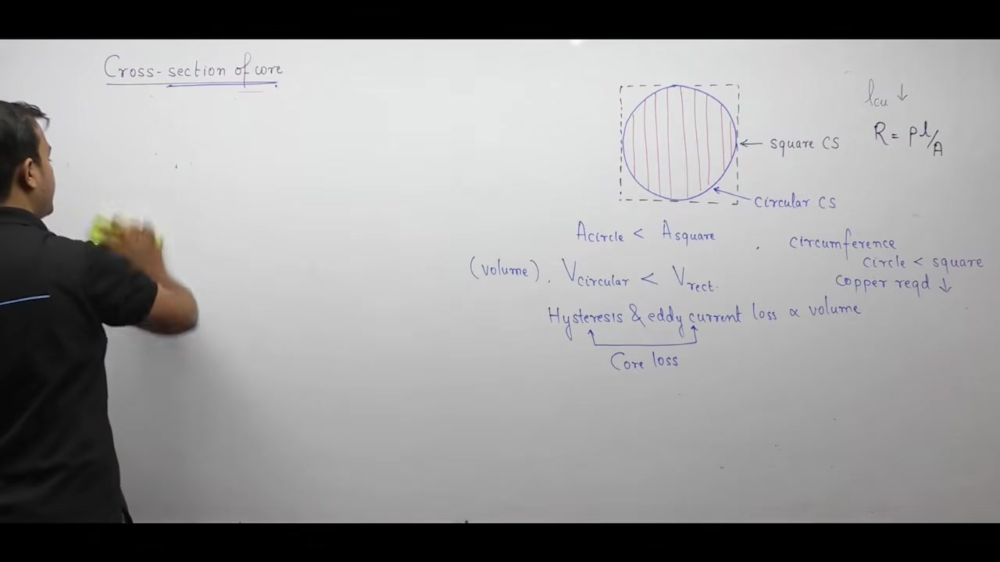

A circle has continuously curving boundaries. To fill a circular boundary, every single lamination packet requires a different strip width. The central sheets must be widest. The outer sheets must become progressively narrower.

In manufacturing, unit costs drop when stamping thousands of identical sheets from a single die. Producing dozens of distinct lamination widths requires multiple stamping dies. It also requires frequent machine changeovers and sorting labor. Tooling costs rise sharply. Therefore, building a pure circular laminated core is commercially impractical.

### The Stepped Core Compromise

Engineers resolve this dilemma by using stepped cores. A stepped core groups laminations into rectangular packets of varying widths.

These rectangular packets stack together to fit inside a circumscribed circle. Each step uses many identical sheets. This balances manufacturing expense against copper savings.

A rectangular core uses only one lamination size. It is cheapest to stamp, but it uses copper inefficiently.

A stepped core with two packet sizes resembles a cross or plus sign.

> [!info] Cruciform Core Definition
> A two-stepped core is called a **cruciform core**. It uses laminations of only two distinct widths. It approximates a circular boundary while keeping die and assembly costs moderate.

### Multi-Step Core Configurations

Adding more steps approximates the circumscribing circle more closely.

A three-stepped core uses three different lamination widths. A four-stepped core uses four widths.

As the number of steps increases:
1. The iron area fills a greater fraction of the circumscribed circle.
2. The winding perimeter and mean turn length decrease.
3. Total copper weight and copper loss decrease.
4. Tooling, cutting dies, and assembly labor costs increase.

Large power transformers use multi-step cores with up to six or more steps. The huge savings in copper and loss reduction easily justify the extra manufacturing expense.

## Lamination Shapes and Staggered Butt Joints
_(17:58 - 23:51)_

### Lamination Geometries for Core Assembly

A transformer core is never stamped out as a single closed rectangular frame. Punching closed frames would waste the entire central window material as scrap steel. Also, closed steel frames would prevent inserting pre-wound coils onto the limbs.

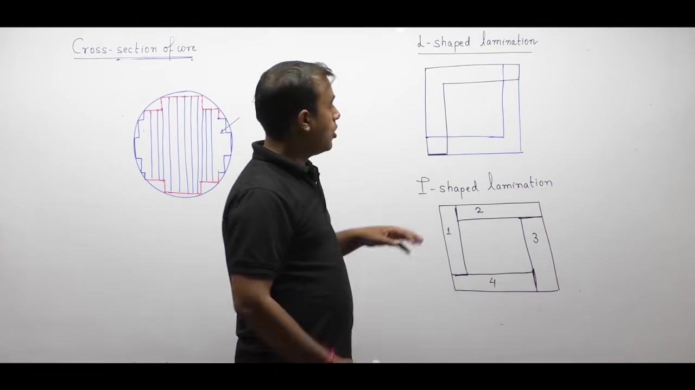

Instead, magnetic cores are assembled from standardized flat strips. The most common lamination shapes are L-shaped and I-shaped pieces.

A rectangular magnetic loop can be built in two ways:
1. Joining two opposing L-shaped laminations.
2. Joining four straight I-shaped strips along the four sides.

By fitting these separate pieces edge to edge, workers assemble complete closed magnetic paths.

### Parasitic Air Gaps at Lamination Joints

Whenever two lamination edges butt together, an interface seam forms. Manufacturing tolerances leave microscopic gaps between adjacent steel edges.

These interfaces introduce tiny air gaps into the magnetic circuit. Air has very low permeability compared to silicon steel. The magnetic reluctance of an air gap is:

$$\mathcal{R}_g = \frac{l_g}{\mu_0 A_g}$$

Because $\mu_0 \ll \mu_r \mu_0$, even a fraction of a millimeter of air adds substantial reluctance. Higher reluctance demands much larger magnetizing current to establish mutual flux.

### The Mechanism of Staggered Joints

If every lamination layer had joints at the exact same location, a continuous air gap would pierce the entire core stack. This continuous cut would create a severe magnetic bottleneck. It would also make the assembled core mechanically weak.

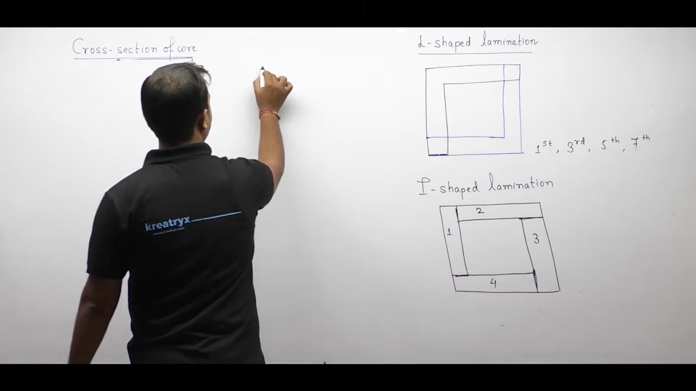

To prevent this problem, manufacturers use staggered or interleaved joints.

> [!info] Principle of Staggered Joints
> Lamination layers are stacked with alternating orientations. Joints in odd-numbered layers sit at different corners than joints in even-numbered layers. Solid steel in adjacent layers bridges each seam.

In layer 1, 3, and 5, joints are placed at the top-right and bottom-left corners. In layer 2, 4, and 6, the laminations are reversed. Their joints sit at the top-left and bottom-right corners.

Flux crossing a joint simply diverts into the solid steel sheets above and below it. This eliminates continuous air gaps through the core thickness. It keeps total reluctance low and locks the sheets into a rigid structure.

## Core Stacking Assembly, Winding Insertion, and Shell-Type Laminations
_(23:56 - 28:51)_

### Stacking Layers and Joint Distribution

Transformer cores are built by stacking very thin sheets one over another. Each sheet is only about 0.35 mm thick. Hundreds of individual sheets are needed to build the required core thickness.

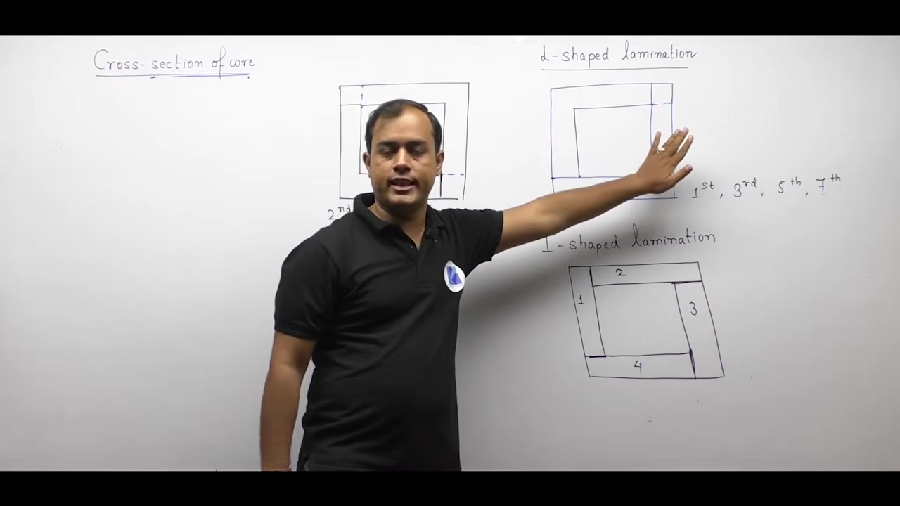

Odd layers use one orientation. Even layers use the reversed orientation. Half of the layers place their joints on the left side. The other half place their joints on the right side. This staggered layout breaks up the air gaps. It prevents any continuous air passage from developing through the core.

### The Assembly Sequence for Cores and Windings

Students often imagine that workers wind heavy copper coils directly around the iron core limbs. That is not how transformers are built in practice.

> [!info] Manufacturing Assembly Sequence
> 1. Primary and secondary coils are pre-wound on rigid hollow insulating cylinders.
> 2. The core limbs are inserted through the central opening of the pre-wound coil cylinders.
> 3. The top yoke laminations are interleaved to complete the closed magnetic loop.

Coils are wound on winding machines over stiff insulating tubes. These tubes provide the necessary dielectric barrier. Once the coil cylinder is fully wound and insulated, core laminations are threaded through its hollow window. Finally, the top yoke is assembled and clamped with insulated bolts.

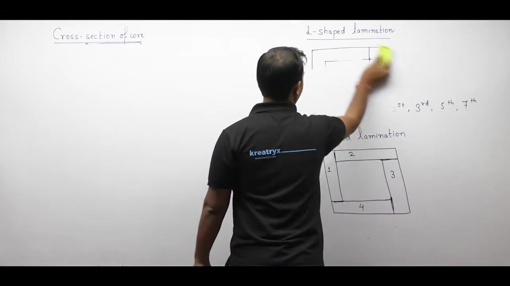

### Shell-Type E-Shaped Laminations

Shell-type transformers use different lamination profiles. The most common profile is the E-shaped lamination.

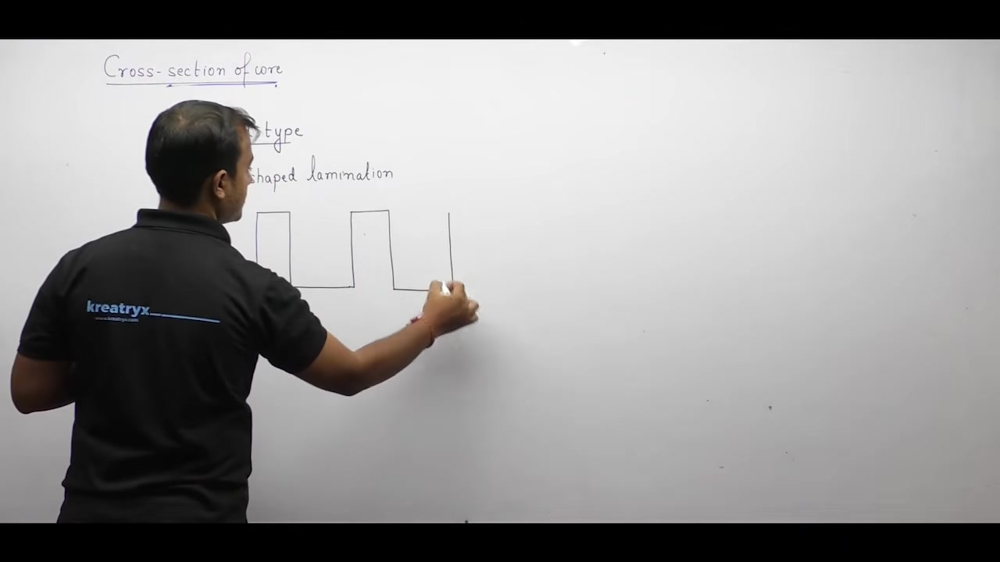

Two opposing E-laminations can be pushed together from opposite sides. The central limbs of both E-sections meet inside the pre-wound coil opening. The outer limbs meet on the outside to complete the two parallel magnetic return paths. Alternating layers are inverted to stagger the butt joints across the central and outer limbs.

### Summary of Core Construction Topics

We have now covered the complete engineering of the transformer core:
1. **Material**: High permeability CRGO silicon steel.
2. **Eddy Current Mitigation**: 0.35 mm laminations insulated with varnish.
3. **Core Topologies**: Core-type single loop versus shell-type dual window.
4. **Cross-Sectional Optimization**: Rectangular cores for small ratings; stepped cruciform cores for large ratings.
5. **Lamination Stamping**: L-shaped, I-shaped, and E-shaped profiles with staggered non-continuous joints.

## Concentric Windings and Placement Rationale
_(28:54 - 34:07)_

### Concentric Winding Arrangement

Core-type transformers use concentric windings. Both the low-voltage and high-voltage coils are wound coaxially on each vertical limb.

The coils mount in a specific radial sequence:
1. The grounded iron core limb sits at the center.
2. A hollow insulating cylinder surrounds the limb.
3. The Low Voltage (LV) winding sits over this inner cylinder.
4. An intermediate insulation barrier wraps over the LV winding.
5. The High Voltage (HV) winding sits on the outside.

> [!info] Concentric Winding Structure
> In a core-type transformer, the LV winding is placed closest to the core limb. The HV winding is wound concentrically around the outside of the LV coil.

### Increased Leakage Flux in Outer Windings

This layout creates an asymmetrical leakage condition. The outer HV winding sits further away from the high-permeability iron core.

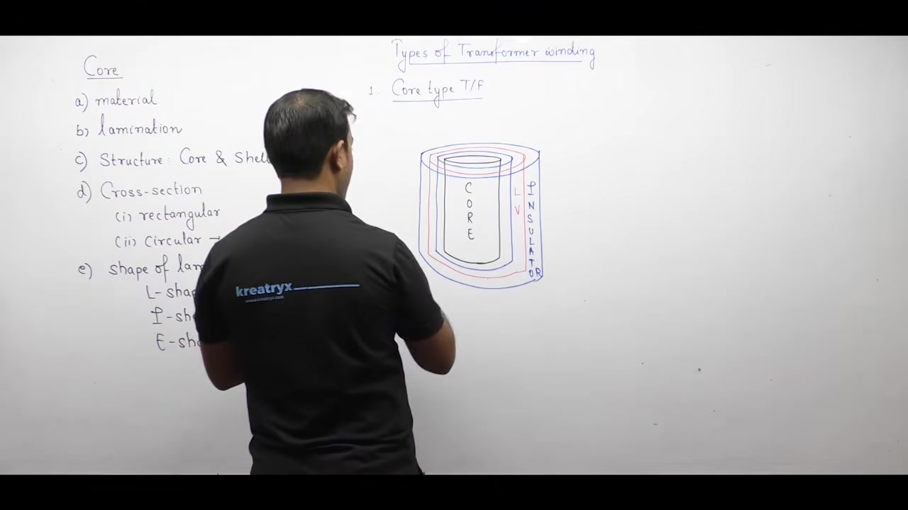

A significant fraction of the outer winding flux does not enter the core. Instead, it completes its path through the surrounding air and oil. This unlinked flux constitutes leakage flux. Therefore, concentric arrangements exhibit higher leakage flux in the outer winding than in the inner winding.

### The Technical Reason for Placing LV Windings Inside

Why not place the HV winding inside next to the core? The answer lies in electrical insulation physics.

Dielectric insulation thickness $d$ is directly proportional to operating voltage to ground:

$$d_{\text{insulation}} \propto V$$

The inner insulation barrier separates the inner winding from the metallic core. The core is securely grounded ($V_{\text{core}} = 0$).

The intermediate insulation barrier separates the LV and HV windings. It must withstand the potential difference:

$$V_{\text{barrier}} \approx V_{\text{HV}} - V_{\text{LV}}$$

This inter-winding voltage remains identical regardless of which coil sits on the inside.

If the HV winding were placed inside, the inner barrier would have to withstand the full high voltage to ground. That would require an extremely thick inner insulation cylinder. Placing the LV winding inside requires only a thin insulation sleeve.

## Inner Insulation Consequences and Tap Placement on HV Windings
_(34:07 - 38:51)_

### Cost and Dimension Penalties of Placing HV Inside

Placing the high-voltage winding directly against the grounded core would cause serious penalties.

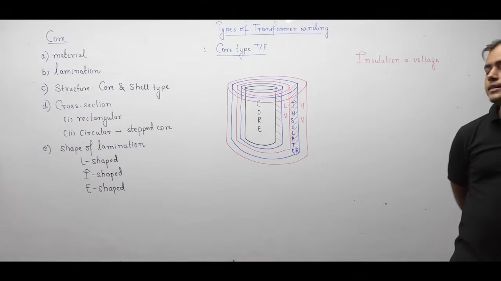

The inner ground insulation would have to be very thick. This thick sleeve pushes the coils outward, expanding the diameter of both windings:

$$D_{\text{outer}} = D_{\text{core}} + 2 d_{\text{inner}} + 2 w_{\text{inner}} + 2 d_{\text{barrier}} + 2 w_{\text{outer}}$$

Larger diameter increases the mean circumference of every turn:

$$l_{\text{turn}} = \pi D_{\text{mean}}$$

Longer turns require more copper weight. Extra copper increases winding resistance, copper loss, and total machine cost. Placing the LV winding inside keeps the inner insulation thin and minimizes overall diameter.

### Function and Operation of Transformer Tappings

Grid loads vary throughout the day. Voltage drops along transmission lines fluctuate with load current. Transformers use tappings to regulate terminal voltage.

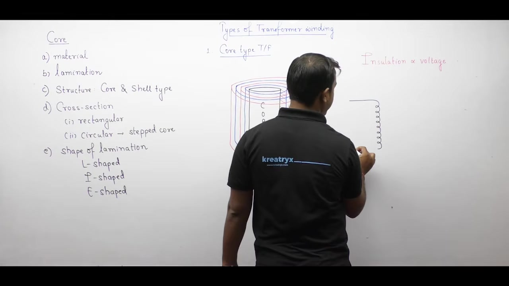

Taps are terminal leads brought out from intermediate turns of a winding. Changing tap positions alters the effective turn count $N$. The transformer voltage equation shows this effect:

$$\frac{V_2}{V_1} = \frac{N_2}{N_1}$$

Adjusting the active turn ratio adjusts the secondary terminal voltage to match load demand.

### Technical Justification for Locating Taps on the HV Winding

In concentric construction, taps are always located on the HV winding.

> [!info] Why Taps are Placed on the HV Winding
> 1. **High Turn Count**: The HV winding has many turns. A single turn represents a small fraction of the total voltage. This allows fine voltage regulation in steps of $1.25\%$ or $2.5\%$. The LV winding has few turns, so changing one turn creates coarse voltage jumps.
> 2. **Lower Operating Current**: For a given apparent power rating $S$, current is inversely proportional to voltage:
>    $$I_{\text{HV}} = \frac{S}{V_{\text{HV}}} < I_{\text{LV}}$$
>    Lower current minimizes severe contact arcing during tap changing. This extends tap switch contact life.
> 3. **Physical Accessibility**: The HV winding sits on the outer perimeter in concentric designs. Bringing leads out to the tap changer switch is simple.

## Helical and Crossover Winding Types
_(38:55 - 44:51)_

### Helical Winding Geometry and Applications

Concentric windings take different physical coil shapes depending on voltage and power ratings. The simplest type is the helical winding.

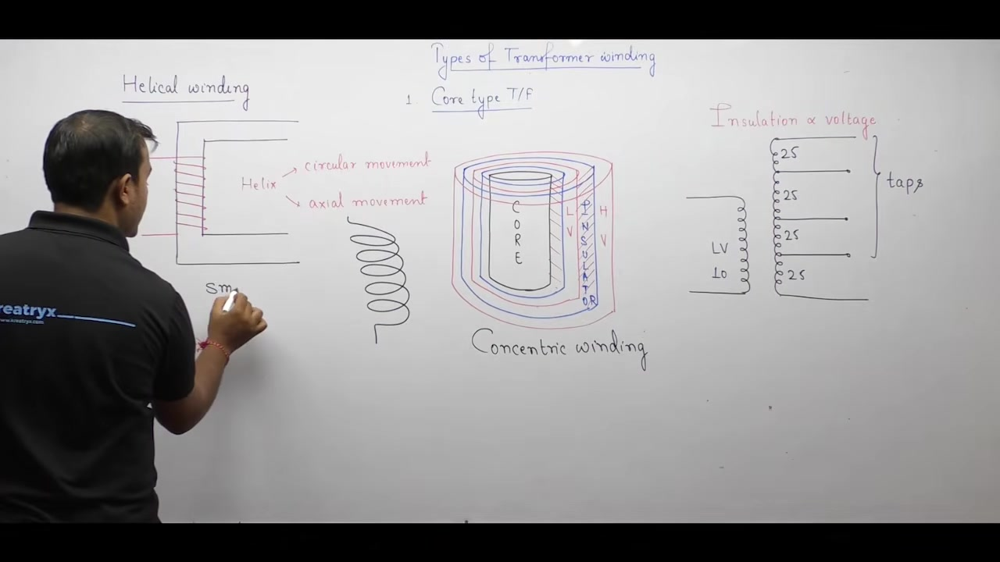

A helix combines two geometric motions:
1. Circular motion revolving around the limb axis.
2. Linear axial advance along the limb length.

Conductors wind continuously in a single layer or double layer along the limb. Turns advance from top to bottom like a screw thread.

Helical windings are simple and easy to manufacture. They are used for low-voltage windings in small and medium transformers.

### Crossover Winding Construction

High voltage creates high dielectric stress. A simple continuous helix cannot easily handle high voltages in compact transformers. Instead, designers use crossover windings.

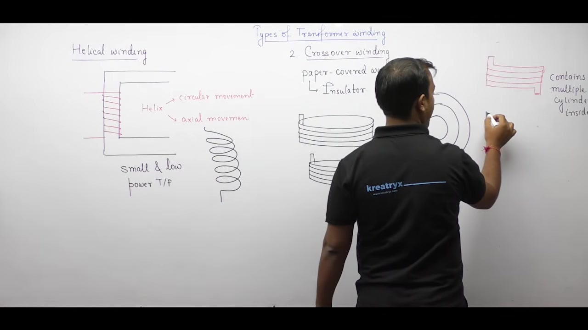

Crossover windings use round conductors covered with paper insulation. High-grade dielectric paper wraps each conductor.

Workers wind conductors into several separate cylindrical coil units. Each coil unit contains multiple layers wound radially and axially.

### Assembly and Cooling Channels in Crossover Coils

Multiple coil units are stacked axially along the limb height.

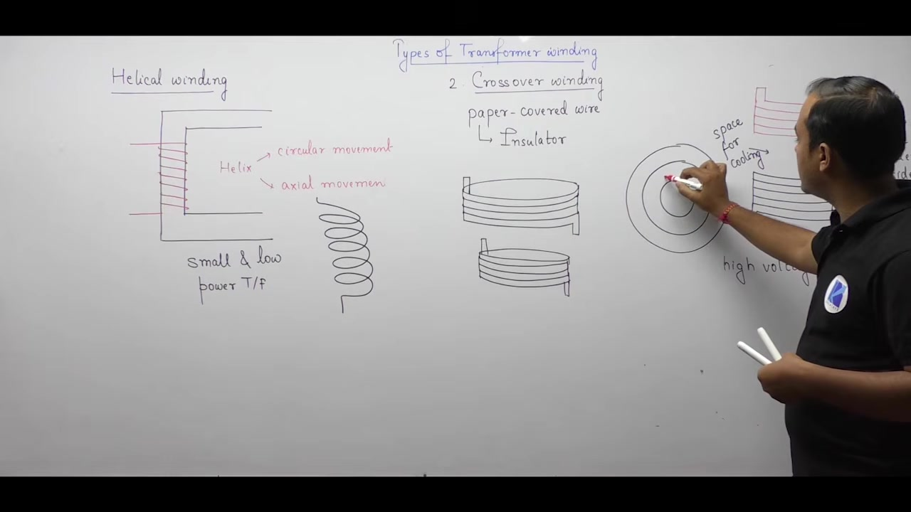

The individual coil units connect in series:
1. The inner finish of the first coil connects to the inner start of the second coil.
2. The outer finish of the second coil connects to the outer start of the third coil.

Insulating spacers separate adjacent coil sections. These spaces form horizontal and vertical ducts. Cooling oil flows through these ducts to remove heat.

> [!info] Summary of Helical and Crossover Windings
> - **Helical Winding**: Simple continuous single-layer helix. Best for low-voltage windings in small and medium transformers.
> - **Crossover Winding**: Multi-layered paper-insulated cylindrical coils stacked axially in series with cooling ducts. Best for high-voltage windings in small transformers.

## Disc-Type Windings and Shell-Type Sandwich Windings
_(44:51 - 49:53)_

### Disc-Type Winding Construction for Large Transformers

Large power transformers experience severe mechanical forces during external short circuits. They also carry very heavy currents. For these high-power ratings, designers use disc-type windings.

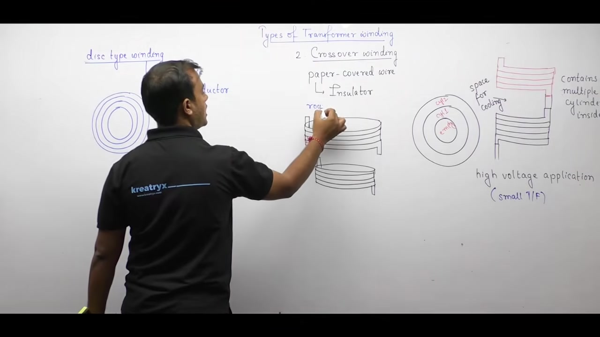

Disc windings use flat rectangular copper strip conductors. The flat strip winds radially outward in a tight spiral. Each spiral forms a flat circular disc.

One terminal lead emerges from the inner diameter of the disc. The other terminal lead terminates at the outer diameter.

Workers stack multiple discs axially along the limb. Insulating spacers separate adjacent discs. These spaces form horizontal radial cooling ducts. Oil flows freely between the discs to remove heat. The discs connect in series to complete the winding.

Disc windings provide high mechanical strength against axial electromagnetic stresses. They are standard for high-voltage windings in large power transformers.

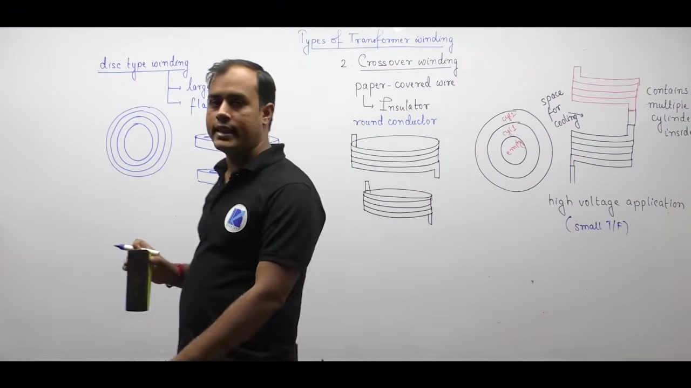

### Sandwich Windings in Shell-Type Transformers

Shell-type transformers do not use concentric winding tubes. Instead, they use sandwich or interleaved windings.

Both LV and HV coils mount entirely on the central limb. The coils are split into multiple flat pancake sections.

These sections stack vertically in an alternating sequence:

$$\frac{\text{LV}}{2} - \text{HV} - \text{LV} - \text{HV} - \frac{\text{LV}}{2}$$

> [!info] Sandwich Winding Layout
> In shell-type transformers, each full HV coil section is sandwiched between two LV coil sections. The two outer end sections are built with half the normal LV turns ($\text{LV}/2$).

Placing half-turns of the LV coil at the two ends provides a big dielectric advantage. The end coils sit immediately adjacent to the grounded iron yoke. Because they carry low voltage, they need only minimal ground insulation against the yoke.

### Flux and Current Opposition

By Lenz's law, the secondary current opposes the primary current. Primary and secondary coils create opposing magnetomotive forces.

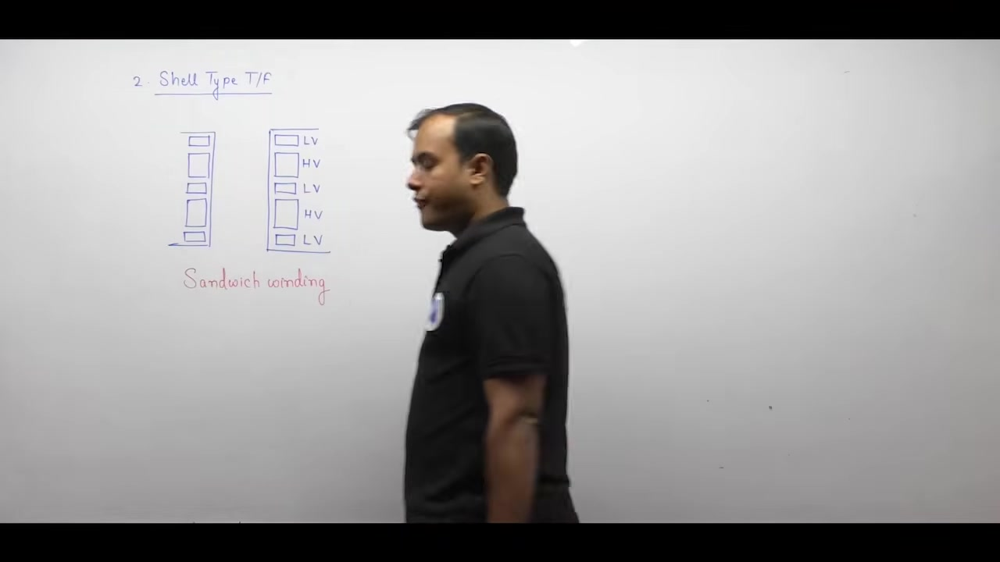

If current in an LV section flows into the page on the left, current in the adjacent HV section flows out of the page on the left. The magnetic flux of the LV coil points upward. The magnetic flux of the HV coil points downward.

These opposing fluxes confine the mutual flux tightly within the core. This interleaving lowers leakage flux and reduces leakage reactance.

## Shell-Type Coupling and Transformer Oil Functions
_(49:56 - 54:51)_

### Superior Coupling and Lower Leakage in Shell-Type Units

In a shell-type transformer, LV and HV sections sit interleaved along the central limb.

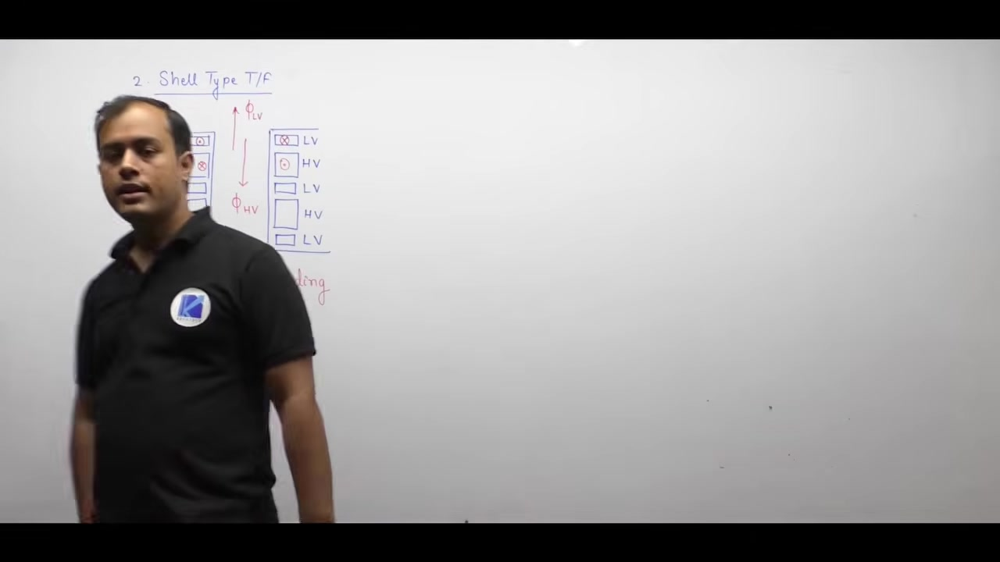

This interleaving creates close physical proximity between primary and secondary turns. As a result, the mutual magnetic coupling is tighter than in core-type concentric coils.

Almost all flux lines link both primary and secondary windings. Very little flux escapes into the air. Therefore, shell-type transformers have much lower leakage flux and smaller leakage reactance.

### Complete Classification of Transformer Windings

We can now organize transformer winding types by core geometry:
1. **Core-Type (Concentric Coils)**:
   - *Helical Winding*: Simple spiral for low-voltage ratings.
   - *Crossover Winding*: Series-connected paper-insulated units for high voltage in small transformers.
   - *Continuous Disc Winding*: Spirally wound flat copper strips for high voltage in large power units.
2. **Shell-Type (Sandwich Coils)**:
   - Interleaved flat sections stacked as $\text{LV}/2 - \text{HV} - \text{LV} - \text{HV} - \text{LV}/2$.

### The Dual Role of Transformer Oil

Large transformers generate substantial heat from core and copper losses. To manage this heat and maintain electrical isolation, the entire core and coil assembly sits inside an oil-filled steel tank.

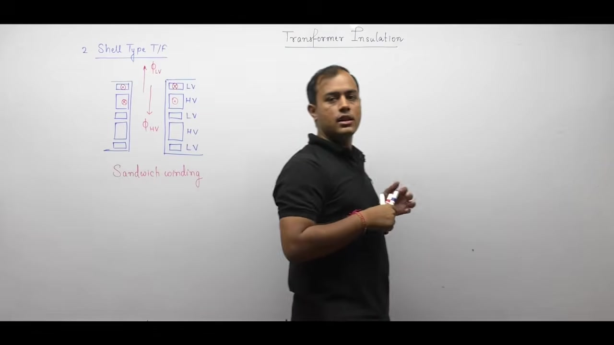

The mineral oil performs two distinct functions.

> [!info] Dual Purpose of Transformer Oil
> 1. **Coolant**: Oil extracts heat from the core and windings. Natural convection or forced circulation carries this heat to external radiator tubes.
> 2. **Dielectric Insulator**: Oil fills all voids around coils and laminations. It provides high dielectric breakdown strength alongside solid paper insulation.

Solid paper wraps the conductors. Mineral oil impregnates the paper and fills all surrounding tank space. Together, paper and oil create a reliable composite insulation system.

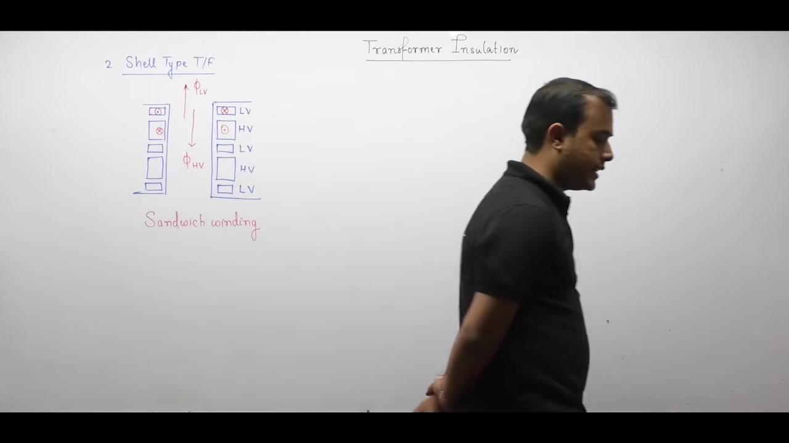

## Bushings and the Breathing Mechanism
_(54:57 - 61:54)_

### Purpose and Function of Transformer Bushings

Transformer tanks are made of steel. Steel is an electrical conductor. Tank walls are connected securely to earth ground for safety.

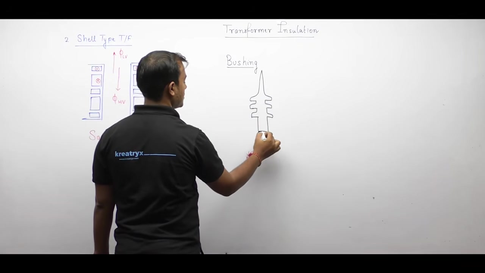

Winding leads must pass through the steel tank to connect to transmission lines. If bare energized wires touched the tank wall, a direct line-to-ground short circuit would occur. Current would flow straight into earth ground. Power would never reach the transmission grid.

> [!info] Bushing Function
> A bushing provides an insulated passage for live winding conductors through the grounded metallic tank wall.

The bushing holds a central conducting stud. An outer ceramic porcelain shell surrounds this stud. The porcelain creates a long surface creepage path. This prevents flashover arcs between the terminal and the tank.

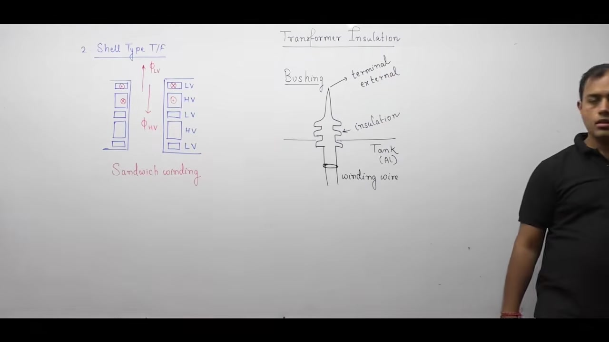

### Bushing Types by Voltage Class

Operating voltage dictates bushing design:
1. **Up to 36 kV**: Plain solid porcelain bushings. The central conductor passes directly through the porcelain sleeve.
2. **Above 36 kV**: Oil-filled or capacitor-graded bushings.

In an oil-filled bushing, insulating oil fills the space between the central conductor and the outer porcelain shell. The oil prevents internal dielectric breakdown. It also helps dissipate conductor heat.

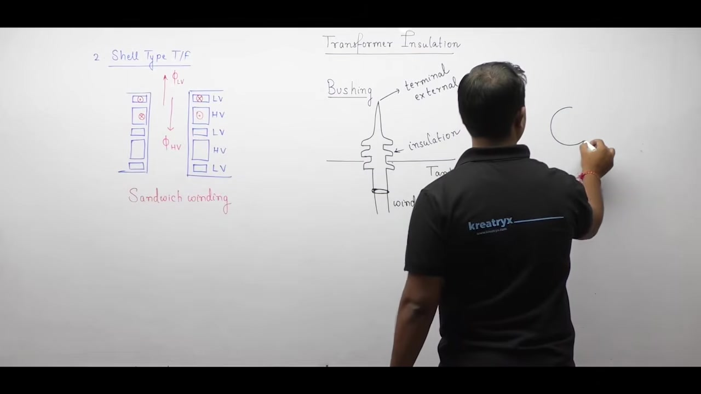

### The Transformer Breathing Cycle

A transformer tank is never filled completely with oil. Some empty cushion space is left at the top. This headspace contains air.

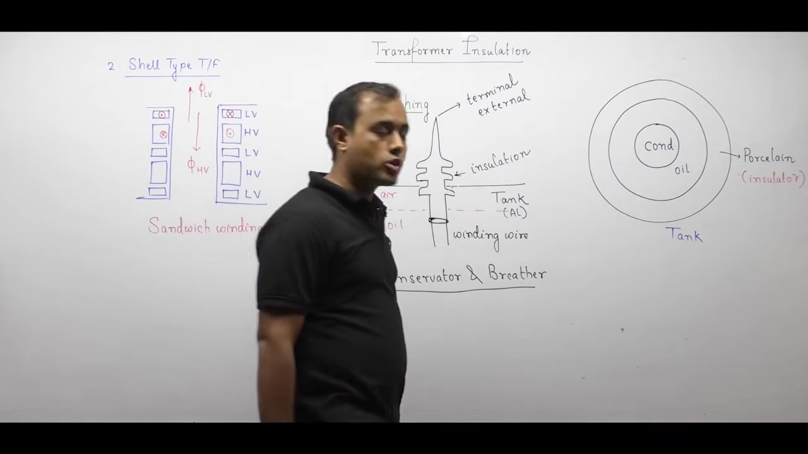

During operation, the load increases and electrical losses heat the oil. Heated oil expands thermally. As the oil level rises, it compresses the air in the headspace. Air is forced out of the tank through a vent pipe. This process is called breathing out.

When load decreases, the transformer cools down. The oil contracts thermally and its level drops. Atmospheric air is sucked back into the headspace through the vent pipe. This process is called breathing in.

This continuous intake and expulsion of air constitutes transformer breathing.

## Silica Gel Breathers, Conservator Tanks, and Construction Summary
_(61:54 - 67:20)_

### The Silica Gel Breather and Moisture Control

Atmospheric air contains water vapor. When moist air enters the transformer tank, oil absorbs the water.

Even tiny traces of moisture severely reduce the dielectric breakdown strength of transformer oil. Water droplets also degrade the paper insulation wrapped around the copper conductors.

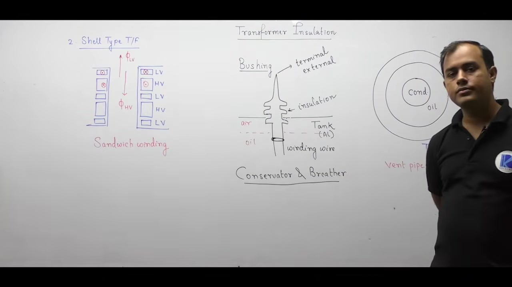

To stop moisture from entering, the breathing pipe connects to a silica gel breather.

> [!info] Silica Gel Breather
> The breather holds desiccating silica gel crystals. Incoming air passes through the crystals. The gel absorbs all moisture, allowing only dry air into the tank headspace.

Dry active silica gel is deep blue. As it absorbs moisture and becomes saturated, it turns pale pink. Saturated gel can be baked in an oven to dry it out for reuse.

### The Conservator Tank and Fault Protection

Large power transformers use an expansion vessel called a conservator tank.

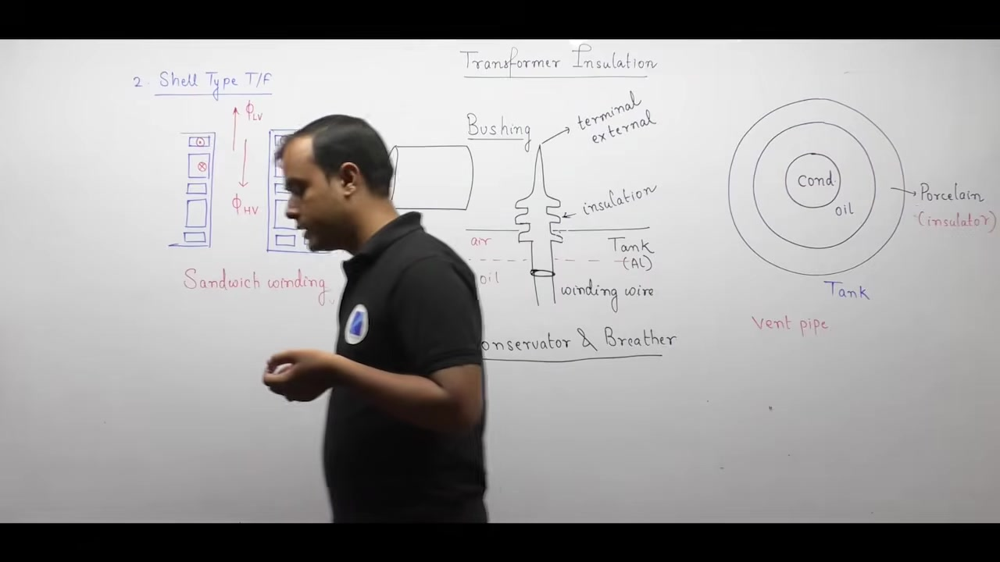

The conservator is an airtight horizontal cylindrical drum. It mounts on top of the transformer structure above the main tank. An inclined pipe connects the conservator to the main tank.

The conservator stays partially filled with oil. It serves three vital purposes:
1. **Oil Volume Compensation**: When oil heats and expands, it rises into the conservator. When oil cools, reserve oil returns to the main tank.
2. **Preventing Oxidation**: The main tank stays completely full of oil. Only the small surface area in the conservator touches air. This prevents oil oxidation and sludge formation.
3. **Buchholz Relay Operation**: The connecting pipe houses a gas-actuated Buchholz relay. Severe internal electrical faults generate gas and cause violent oil surges toward the conservator. The surging oil trips the relay contacts to isolate the transformer.

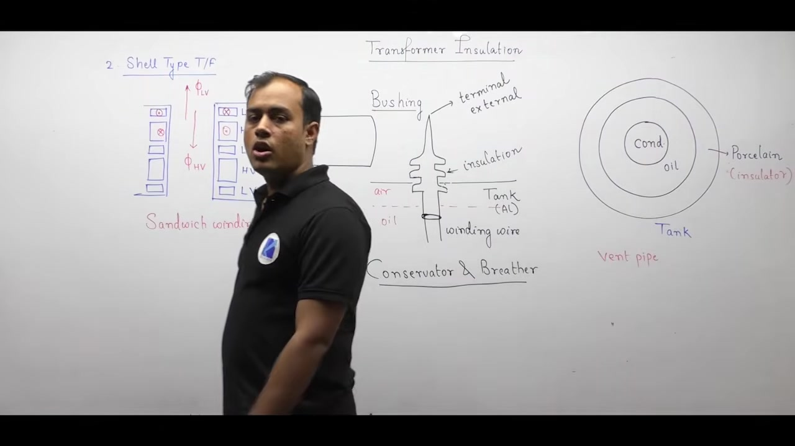

### Comprehensive Summary of Transformer Construction

We have completed the full study of transformer construction across two lectures.

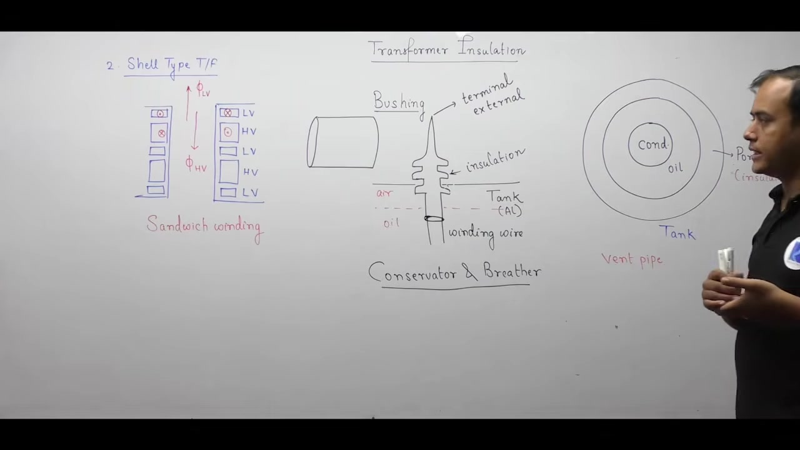

The key components and design principles include:
- **Magnetic Core**: CRGO silicon steel, 0.35 mm laminations, stepped cruciform profiles, and staggered butt joints.
- **Windings**: Concentric coils (helical, crossover, disc) for core-type; sandwich interleaved coils for shell-type.
- **Tappings**: Located on the HV winding due to high turn count, low current, and easy accessibility.
- **Auxiliaries**: Mineral oil for cooling and dielectric strength, porcelain bushings for lead insulation, conservator tanks for thermal expansion, and silica gel breathers for moisture removal.

---

## Summary and Key Takeaways

- Circular core cross-sections minimize perimeter for a given area, which shortens mean turn length, lowers winding resistance $R = \rho l / A_c$, and reduces $I^2 R$ copper losses.
- Stepped cores approximate circular geometry using rectangular packets of varying widths, where a two-stepped cruciform core utilizes roughly $85\%$ of the circumscribing circle area.
- Staggering lamination butt joints across alternating odd and even layers eliminates continuous air gaps through the core thickness, preventing high magnetic reluctance $\mathcal{R}$.
- Transformer coils are pre-wound on rigid insulating formers before core lamination sheets are interleaved through the hollow window opening.
- Low-voltage windings are placed closest to the grounded core because required insulation thickness is proportional to voltage ($d \propto V$), minimizing overall winding diameter.
- Voltage regulating taps are placed on high-voltage windings because high turn counts allow fine voltage steps and low operating currents minimize contact arcing.
- Shell-type transformers use interleaved sandwich coils with half-rated LV sections at the ends, which minimizes insulation to the yoke and lowers leakage flux.
- Mineral transformer oil serves the dual function of convective heat removal and bulk dielectric insulation.
- Conservator tanks accommodate thermal oil expansion while minimizing oil surface contact with air, and silica gel breathers extract atmospheric moisture to protect oil dielectric strength.

