# Problems based on Transformer Construction & Working | L4 | Electrical Machines | GATE 2022

- **Source**: https://www.youtube.com/watch?v=HwlgfqiNMvI
- **Duration**: 01:20:05
- **Compiled**: 2026-09-19

---

## Overview

This lecture solves advanced numerical problems on transformer construction, magnetic circuits, and induced EMF equations. It connects physical core geometries and lamination properties directly to electrical circuit parameters. The discussion develops rigorous methods for turn allocation under integer divisibility and center-tap constraints. It also analyzes non-sinusoidal voltage excitation through direct calculus integration.

## Contents

- [[#Transformer Construction and Induced EMF Problem Foundations|Transformer Construction and Induced EMF Problem Foundations]]
- [[#Net Core Area and Turn Allocation with Ratio Constraints|Net Core Area and Turn Allocation with Ratio Constraints]]
- [[#Three-Winding Transformers and Center-Tapped Winding Design|Three-Winding Transformers and Center-Tapped Winding Design]]
- [[#Transformer Optimization and Material Weight Redesign|Transformer Optimization and Material Weight Redesign]]
- [[#Material Savings in Transformer Redesign: Core and Copper Scaling Laws|Material Savings in Transformer Redesign: Core and Copper Scaling Laws]]
- [[#Copper Savings Derivation and RMS versus Peak Flux Distinctions|Copper Savings Derivation and RMS versus Peak Flux Distinctions]]
- [[#Core Reluctance and Magnetizing Current Determination|Core Reluctance and Magnetizing Current Determination]]
- [[#Magnetizing Susceptance, Frequency Scaling, and V/f Control|Magnetizing Susceptance, Frequency Scaling, and V/f Control]]
- [[#Harmonic Voltages and Core Flux Integration from First Principles|Harmonic Voltages and Core Flux Integration from First Principles]]
- [[#Multi-Harmonic Waveform Pitfalls and Extremum Analysis|Multi-Harmonic Waveform Pitfalls and Extremum Analysis]]
- [[#Stacking Factor Calculations and Shell-Type Core Geometry|Stacking Factor Calculations and Shell-Type Core Geometry]]
- [[#Sandwich Coil Turn Allocation and Integer Divisibility Constraints|Sandwich Coil Turn Allocation and Integer Divisibility Constraints]]
- [[#Three-Phase Transformer Design and Coil Type Classification|Three-Phase Transformer Design and Coil Type Classification]]
- [[#Air Core Substitution and Hysteresis Loss Elimination|Air Core Substitution and Hysteresis Loss Elimination]]

---

## Transformer Construction and Induced EMF Problem Foundations
_(00:18 - 05:32)_

### Overview and Problem-Solving Strategy

This lecture applies transformer theory to numerical problems. We focus on core construction, induced EMF equations, and winding turn allocations. 

Solving transformer problems requires clear knowledge of magnetic circuit relations. An alternating flux links the core limbs. This flux induces voltage in every turn linked by the magnetic path. 

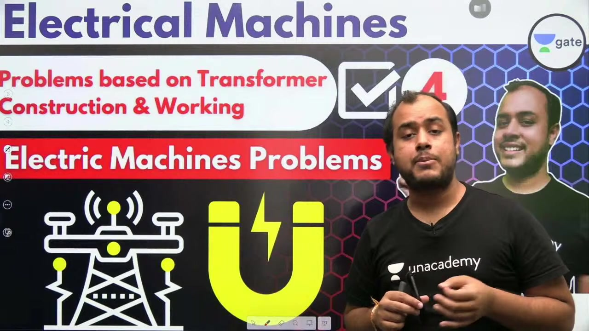

### Core Induced EMF Relations

The induced EMF in a transformer winding follows Faraday's law of electromagnetic induction. For a sinusoidal core flux $\phi(t) = \Phi_m \sin(\omega t)$, the instantaneous induced EMF in a coil of $N$ turns is:

$$e(t) = -N \frac{d\phi}{dt} = -\omega N \Phi_m \cos(\omega t)$$

The peak value of the induced EMF is:

$$E_m = \omega N \Phi_m = 2\pi f N \Phi_m$$

Dividing by $\sqrt{2}$ gives the root-mean-square (RMS) induced EMF:

$$E_{\text{rms}} = \frac{2\pi}{\sqrt{2}} f N \Phi_m = \sqrt{2}\pi f N \Phi_m \approx 4.44 f N \Phi_m$$

Here:
- $f$ is the supply frequency in Hertz.
- $N$ is the number of turns in the winding.
- $\Phi_m$ is the maximum core flux in Webers.

The maximum flux depends on the peak flux density $B_m$ and net core cross-sectional area $A_n$:

$$\Phi_m = B_m A_n$$

The induced EMF per turn is identical for all windings on the same core:

$$E_{\text{turn}} = \frac{E_{\text{rms}}}{N} = 4.44 f \Phi_m = 4.44 f B_m A_n$$

> [!info] Definition: EMF per Turn
> The voltage induced in a single complete loop enclosing the core is the EMF per turn. It depends only on supply frequency and peak core flux. It remains constant across primary, secondary, and tertiary windings.

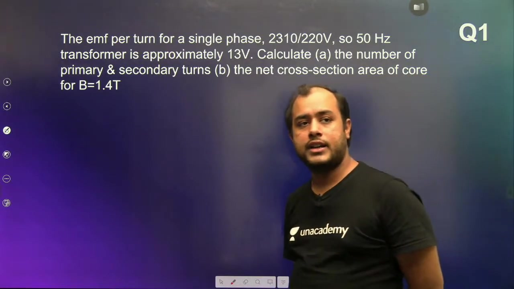

### Worked Example: Turns and Core Cross-Section Calculation

> [!example] Problem
> A single-phase $2310/220\text{ V}$, $50\text{ Hz}$ transformer has an induced EMF per turn of approximately $13\text{ V}$. The maximum core flux density is $1.2\text{ Wb/m}^2$.
> Calculate:
> 1. The number of primary turns $N_1$ and secondary turns $N_2$.
> 2. The net core cross-sectional area $A_n$.

#### Step 1: Compute Primary and Secondary Turns

We use the given terminal voltages as induced voltages on no-load:

$$N_1 = \frac{V_1}{E_{\text{turn}}} = \frac{2310}{13} \approx 177.69\text{ turns}$$

Turns must be integer values. We select:

$$N_1 = 178\text{ turns}$$

For the secondary winding:

$$N_2 = \frac{V_2}{E_{\text{turn}}} = \frac{220}{13} \approx 16.92\text{ turns}$$

We select:

$$N_2 = 17\text{ turns}$$

#### Step 2: Calculate Maximum Flux and Net Core Area

From the EMF per turn relation:

$$E_{\text{turn}} = 4.44 f \Phi_m$$

Substitute $E_{\text{turn}} = 13\text{ V}$ and $f = 50\text{ Hz}$:

$$\Phi_m = \frac{13}{4.44 \times 50} = \frac{13}{222} \approx 0.05856\text{ Wb}$$

Now calculate the net iron area $A_n$:

$$A_n = \frac{\Phi_m}{B_m} = \frac{0.05856}{1.2} \approx 0.0488\text{ m}^2 = 488\text{ cm}^2$$

> [!success] Result
> Primary turns $N_1 = 178$, secondary turns $N_2 = 17$, and net core area $A_n = 0.0488\text{ m}^2$.

## Net Core Area and Turn Allocation with Ratio Constraints
_(05:50 - 11:23)_

### Net vs Gross Core Cross-Sectional Area

The EMF per turn directly relates to the net iron cross-sectional area:

$$E_{\text{turn}} = 4.44 f B_m A_n$$

Here $A_n$ represents the net cross-sectional area of the magnetic core. Net area measures only the active magnetic steel laminations. 

Laminations carry thin varnish or oxide insulation coats. The insulation prevents eddy current loops between sheets. The gross core area includes both steel and insulation:

$$A_{\text{gross}} = \frac{A_n}{k_s}$$

Here $k_s$ is the stacking factor. It typically ranges from $0.90$ to $0.95$. 

Substituting the given values ($E_{\text{turn}} = 13\text{ V}$, $f = 50\text{ Hz}$, $B_m = 1.4\text{ T}$):

$$A_n = \frac{13}{4.44 \times 50 \times 1.4} = \frac{13}{310.8} \approx 0.04183\text{ m}^2 = 418.27\text{ cm}^2$$

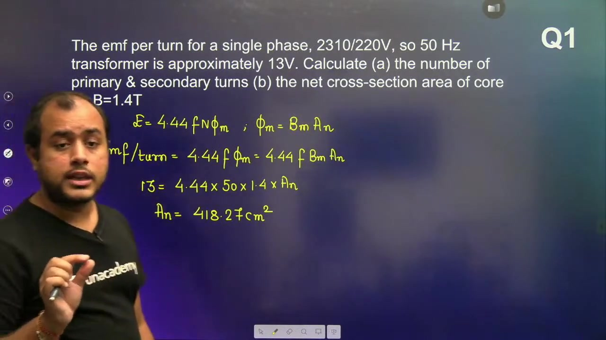

### Strategy for Integer Turn Selection

Physical coils must have an integer number of turns. Fractional turns cannot link the magnetic core closed loop.

When designing transformer windings, always compute the low-voltage turns first. The low-voltage winding has fewer turns. A unit change in $N_{\text{LV}}$ causes a smaller percentage voltage error:

$$N_{\text{LV, nominal}} = \frac{V_{\text{LV}}}{E_{\text{turn}}} = \frac{220}{13} \approx 16.923\text{ turns}$$

Round $N_{\text{LV}}$ to a nearby integer. Candidates include $16$, $17$, or $18$.

### Transformation Ratio and Divisibility Constraints

Do not calculate high-voltage turns independently from $E_{\text{turn}}$. That approach creates ratio mismatches. Always couple $N_{\text{HV}}$ to $N_{\text{LV}}$ using the voltage transformation ratio:

$$\frac{V_{\text{HV}}}{V_{\text{LV}}} = \frac{2310}{220} = 10.5$$

The relation between turns is:

$$N_{\text{HV}} = 10.5 \times N_{\text{LV}} = \frac{21}{2} N_{\text{LV}}$$

If you pick an odd integer for $N_{\text{LV}}$ like $17$:

$$N_{\text{HV}} = 10.5 \times 17 = 178.5\text{ turns}$$

A fraction of a turn is physically impossible in standard transformers. Therefore, $N_{\text{LV}}$ must be an even integer.

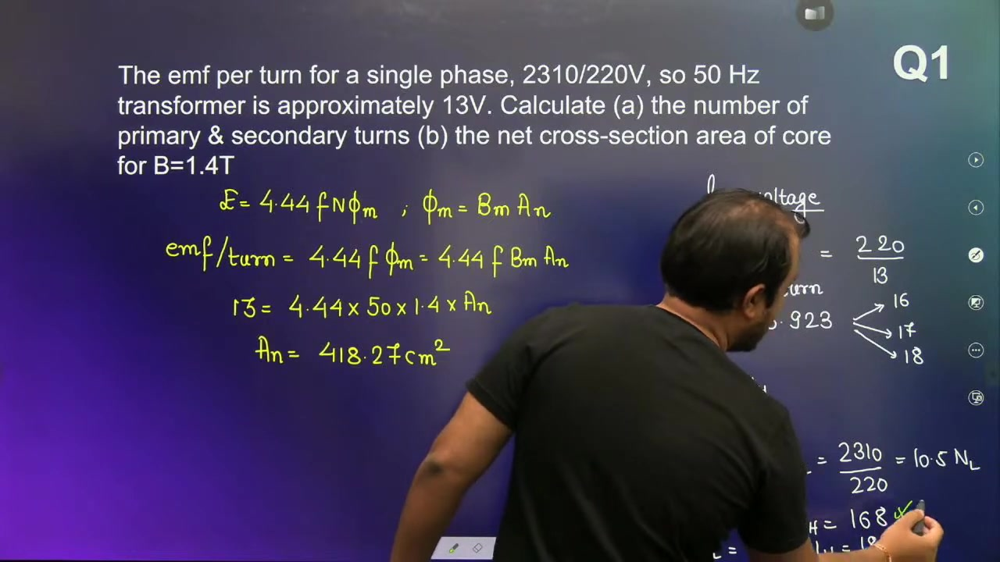

#### Evaluating Valid Even Integer Solutions

1. **Option 1 ($N_{\text{LV}} = 16$):**
   $$N_{\text{HV}} = 10.5 \times 16 = 168\text{ turns}$$
   Actual induced EMF per turn:
   $$E_{\text{turn, actual}} = \frac{220}{16} = 13.75\text{ V}$$

2. **Option 2 ($N_{\text{LV}} = 18$):**
   $$N_{\text{HV}} = 10.5 \times 18 = 189\text{ turns}$$
   Actual induced EMF per turn:
   $$E_{\text{turn, actual}} = \frac{220}{18} = 12.22\text{ V}$$

Both integer pairs preserve the exact $10.5$ transformation ratio. Option 1 ($16$ and $168$) is usually preferred. Its value $16$ lies closer to the nominal $16.92$ turns than $18$.

> [!success] Result
> Net core area $A_n = 418.27\text{ cm}^2$. The physically realizable turns are $N_{\text{LV}} = 16$ and $N_{\text{HV}} = 168$.

## Three-Winding Transformers and Center-Tapped Winding Design
_(11:46 - 18:23)_

### Principles of Multi-Winding Magnetic Coupling

A three-winding transformer places three distinct electric circuits on a common magnetic core. All three windings share the same mutual core flux.

Because mutual flux links every turn equally, the induced EMF per turn remains identical across all three windings:

$$E_{\text{turn}} = \frac{E_1}{N_1} = \frac{E_2}{N_2} = \frac{E_3}{N_3} = 4.44 f \Phi_m = 4.44 f B_m A_n$$

This identity forms the basis for calculating winding turn counts in multi-winding units.

### Worked Example: Three-Winding Transformer with Center Tap

> [!example] Problem
> A single-phase three-winding transformer has the following voltage ratings:
> - Primary: $V_1 = 220\text{ V}$
> - Secondary: $V_2 = 600\text{ V}$
> - Tertiary: $10\text{--}0\text{--}10\text{ V}$ (center-tapped)
> 
> The supply frequency is $50\text{ Hz}$. The core operates with peak flux density $B_m = 1.2\text{ T}$ and net area $A_n = 0.0075\text{ m}^2$.
> Calculate the number of turns for all three windings.

#### Step 1: Calculate EMF per Turn

Use the magnetic circuit parameters:

$$E_{\text{turn}} = 4.44 f B_m A_n$$

Substitute the given numbers:

$$E_{\text{turn}} = 4.44 \times 50 \times 1.2 \times 0.0075 = 1.998\text{ V/turn} \approx 2\text{ V/turn}$$

#### Step 2: Determine Tertiary Winding Turns

Always start calculations from the lowest voltage winding. Here, the tertiary winding has the lowest voltage.

The center-tapped rating is $10\text{--}0\text{--}10\text{ V}$. The total end-to-end voltage across the winding is:

$$V_3 = 10 + 10 = 20\text{ V}$$

Compute the nominal tertiary turns:

$$N_3 = \frac{V_3}{E_{\text{turn}}} = \frac{20}{2} = 10\text{ turns}$$

> [!info] Center-Tap Constraint
> A center-tapped winding requires an equal number of turns on either side of the center terminal. Therefore, total turns $N_3$ must be an even integer. Here, $N_3 = 10$ provides exactly $5$ turns per side.

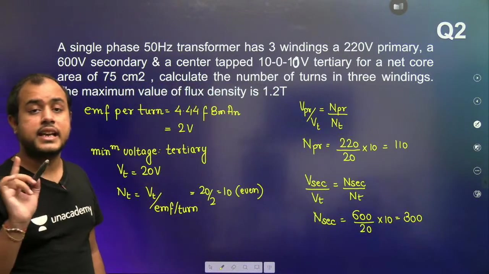

#### Step 3: Compute Primary and Secondary Turns

Determine the remaining turn counts using exact voltage ratios referenced to the tertiary winding:

$$\frac{V_1}{V_3} = \frac{N_1}{N_3} \implies N_1 = \left(\frac{V_1}{V_3}\right) N_3$$

$$N_1 = \left(\frac{220}{20}\right) \times 10 = 11 \times 10 = 110\text{ turns}$$

Similarly, calculate secondary turns:

$$\frac{V_2}{V_3} = \frac{N_2}{N_3} \implies N_2 = \left(\frac{V_2}{V_3}\right) N_3$$

$$N_2 = \left(\frac{600}{20}\right) \times 10 = 30 \times 10 = 300\text{ turns}$$

> [!success] Result
> The winding turns are:
> - Primary: $N_1 = 110\text{ turns}$
> - Secondary: $N_2 = 300\text{ turns}$
> - Tertiary: $N_3 = 10\text{ turns}$ ($5\text{ turns}$ each side of the tap)

## Transformer Optimization and Material Weight Redesign
_(18:23 - 22:44)_

### Worked Example: Integer Turns with Integer Voltage Ratio

> [!example] Problem
> A single-phase $6300/210\text{ V}$, $50\text{ Hz}$ transformer operates with an EMF per turn of approximately $9\text{ V}$. The peak core flux density is $B_m = 1.2\text{ T}$.
> Calculate:
> 1. The net cross-sectional core area $A_n$.
> 2. The required primary and secondary turns.

#### Step 1: Net Core Area

Use the EMF per turn equation:

$$E_{\text{turn}} = 4.44 f B_m A_n$$

Substitute the given values:

$$A_n = \frac{E_{\text{turn}}}{4.44 f B_m} = \frac{9}{4.44 \times 50 \times 1.2} = \frac{9}{266.4} \approx 0.03378\text{ m}^2$$

In square centimeters:

$$A_n \approx 337.8\text{ cm}^2$$

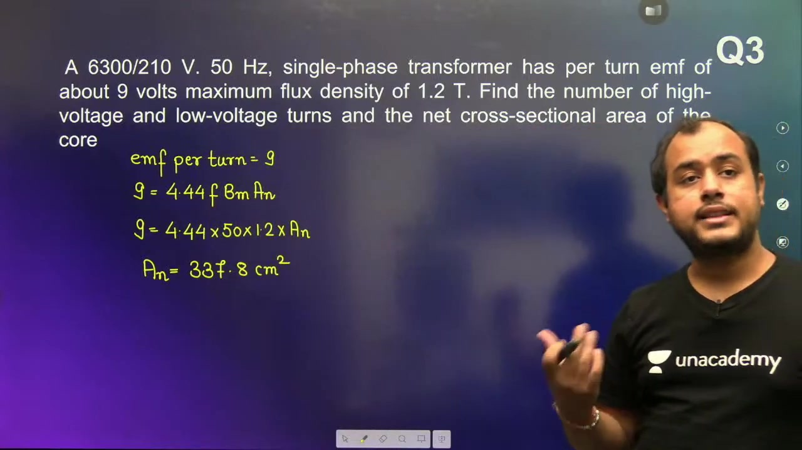

#### Step 2: Low-Voltage Turn Allocation

Calculate the low-voltage turns first:

$$N_{\text{LV, nominal}} = \frac{V_{\text{LV}}}{E_{\text{turn}}} = \frac{210}{9} = \frac{70}{3} \approx 23.33\text{ turns}$$

The nearest integer is $23$.

#### Step 3: High-Voltage Turns via Transformation Ratio

Find the exact transformation ratio:

$$\frac{V_{\text{HV}}}{V_{\text{LV}}} = \frac{6300}{210} = 30$$

The ratio is an exact integer. Multiplying any integer $N_{\text{LV}}$ by $30$ yields an integer for $N_{\text{HV}}$:

$$N_{\text{HV}} = 30 \times N_{\text{LV}} = 30 \times 23 = 690\text{ turns}$$

Because $23$ produces a whole number directly, we do not need to test $24$.

> [!success] Result
> Net core area $A_n = 337.8\text{ cm}^2$, $N_{\text{LV}} = 23\text{ turns}$, and $N_{\text{HV}} = 690\text{ turns}$.

### Problem Setup: Hot-Rolled to CRGO Core Redesign

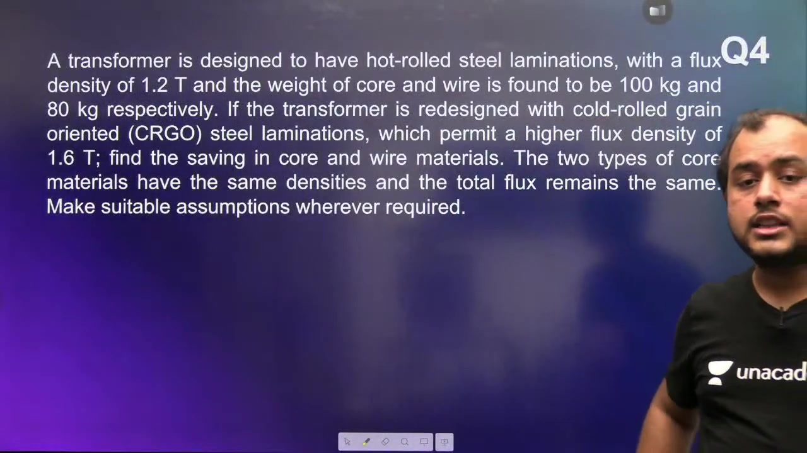

> [!example] Problem
> A transformer built with hot-rolled steel operates at a flux density $B_{m1} = 1.2\text{ T}$. Its iron core weighs $100\text{ kg}$. Its copper windings weigh $80\text{ kg}$.
> The unit is redesigned using CRGO steel laminations operating at $B_{m2} = 1.6\text{ T}$. 
> The operating flux $\Phi_m$ remains constant. Both materials have identical mass density.
> Find the percentage saving in core material and conductor material.

### Exam Technique: Managing Live Time Pressure

Solving questions in isolation with a pause button feels safe. Real competitive exams require live speed and emotional control.

When peers finish calculations earlier, anxiety can cause hesitation. High performance under pressure comes from systematic practice under strict timer constraints. Trusting foundational formulas removes doubt during rapid problem solving.

## Material Savings in Transformer Redesign: Core and Copper Scaling Laws
_(23:23 - 28:43)_

### Core Area Reduction with High-Permeability Steel

Operating a transformer with higher peak flux density directly reduces the required core cross-sectional area. 

When applied voltage and frequency remain constant, total operating core flux $\Phi_m$ must remain unchanged:

$$\Phi_1 = \Phi_2 \implies B_1 A_1 = B_2 A_2$$

Expressing the new cross-sectional area as a ratio:

$$\frac{A_2}{A_1} = \frac{B_1}{B_2}$$

Substitute the initial flux density $B_1 = 1.2\text{ T}$ and the redesigned CRGO flux density $B_2 = 1.6\text{ T}$:

$$\frac{A_2}{A_1} = \frac{1.2}{1.6} = 0.75$$

The new core requires only $75\%$ of the initial cross-sectional area.

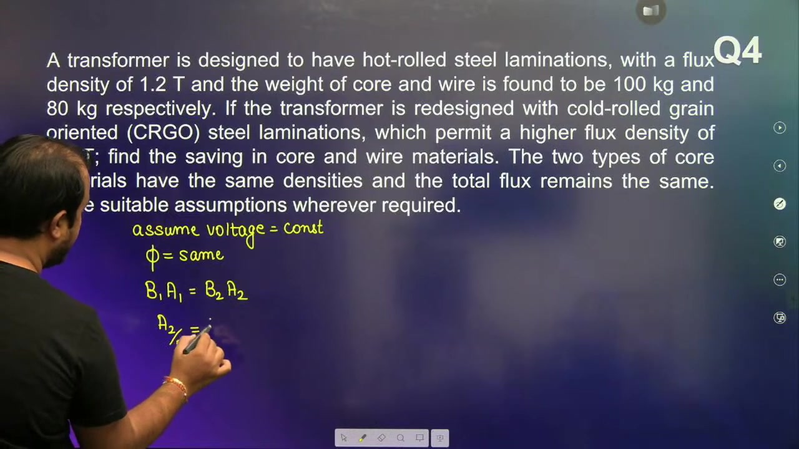

### Percentage Saving in Core Material

The volume of active magnetic core material is:

$$V_{\text{core}} = A_n \times l_c$$

Here $l_c$ is the mean length of the magnetic path. Assuming the core loop dimensions remain nearly constant:

$$V_{\text{core}} \propto A_n$$

Because both materials possess identical mass density $\rho$, core mass scales directly with cross-sectional area:

$$W_{\text{core}} \propto A_n \implies \frac{W_2}{W_1} = \frac{A_2}{A_1} = 0.75$$

We compute the percentage saving in core steel:

$$\% \text{ Saving in Core} = \left(1 - \frac{W_2}{W_1}\right) \times 100\% = (1 - 0.75) \times 100\% = 25\%$$

The initial core weighed $100\text{ kg}$. The redesigned core weighs:

$$W_{\text{core, new}} = 0.75 \times 100 = 75\text{ kg}$$

This change saves exactly $25\text{ kg}$ of magnetic steel.

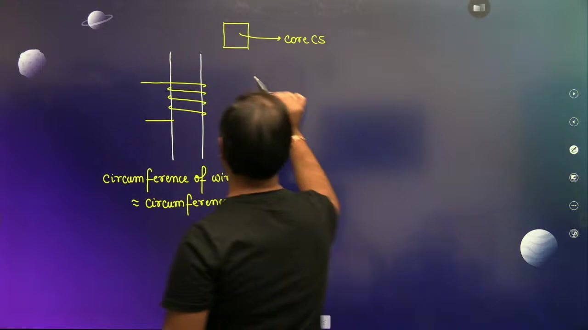

### Geometric Scaling Law for Copper Windings

A common mistake is assuming copper weight also drops by $25\%$. Winding copper does not scale linearly with core area.

The copper winding encircles the core limb. The length of a single turn equals the perimeter of the core cross section:

$$l_{\text{turn}} \approx \text{Perimeter}_{\text{core}}$$

Perimeter does not scale linearly with area. For any geometric shape, perimeter scales with linear dimension:

$$\text{Linear dimension } L \propto \sqrt{\text{Area}}$$

Consider a circular limb of radius $r$:

$$A = \pi r^2 \implies r = \sqrt{\frac{A}{\pi}}$$

The perimeter is:

$$P = 2\pi r = 2\sqrt{\pi A} \propto \sqrt{A}$$

Similarly, for a square limb of side $s$:

$$A = s^2 \implies s = \sqrt{A} \implies P = 4s = 4\sqrt{A} \propto \sqrt{A}$$

Thus, the length of each winding turn is strictly proportional to the square root of core cross-sectional area:

$$l_{\text{turn}} \propto \sqrt{A_n}$$

### Total Winding Volume and Weight

The rated current and voltage are unchanged. Therefore:
1. Conductor cross-sectional area $a_{\text{cu}}$ remains constant because rated current is unchanged.
2. Total number of turns $N$ remains constant because total operating flux $\Phi_m$ is unchanged.

The total volume of copper wire is:

$$V_{\text{cu}} = N \times a_{\text{cu}} \times l_{\text{turn}}$$

Since $N$ and $a_{\text{cu}}$ are fixed, copper volume depends entirely on the turn length:

$$V_{\text{cu}} \propto l_{\text{turn}} \propto \sqrt{A_n}$$

Copper mass scales with the square root of core area, not area itself.

> [!info] Scaling Principle
> Core weight scales linearly with core area: $W_{\text{iron}} \propto A_n$. Copper weight scales with the square root of core area: $W_{\text{cu}} \propto \sqrt{A_n}$.

## Copper Savings Derivation and RMS versus Peak Flux Distinctions
_(28:50 - 35:25)_

### Copper Weight Savings Calculation

In the previous section, the redesigned core area dropped to $75\%$ of its original size:

$$\frac{A_2}{A_1} = 0.75$$

Conductor cross section and turn count remain unchanged. Therefore, winding copper volume scales with the mean length of a turn:

$$\frac{V_{\text{cu},2}}{V_{\text{cu},1}} = \frac{l_{\text{turn},2}}{l_{\text{turn},1}} = \sqrt{\frac{A_2}{A_1}}$$

Substitute the area ratio:

$$\frac{V_{\text{cu},2}}{V_{\text{cu},1}} = \sqrt{0.75} \approx 0.8660$$

The new copper weight is $86.6\%$ of the original weight. We calculate the percentage saving:

$$\% \text{ Saving in Copper} = (1 - 0.8660) \times 100\% = 13.4\%$$

The initial winding weight was $80\text{ kg}$. The new copper weight is:

$$W_{\text{cu, new}} = 80 \times 0.8660 \approx 69.28\text{ kg}$$

This redesign saves $10.72\text{ kg}$ of copper wire.

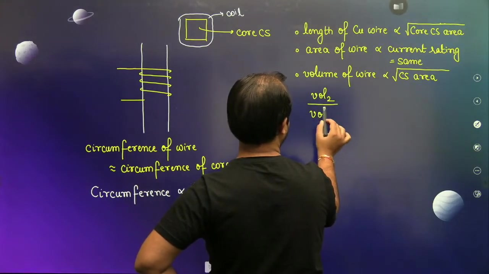

### Physical Meaning of the Geometry

Why does copper weight decrease when the core shrinks? 

Consider winding wire around a thick cylinder versus a thin rod. Each turn around the thinner rod requires less wire. The number of turns remains identical, but total wire length decreases.

Because turn length follows cross-sectional perimeter, it scales with $\sqrt{A_n}$. Winding mass does not drop by $25\%$. It drops by $13.4\%$.

> [!success] Result
> For a core flux density increase from $1.2\text{ T}$ to $1.6\text{ T}$:
> - Core material saving: $25\%$ ($25\text{ kg}$ saved from $100\text{ kg}$).
> - Copper wire saving: $13.4\%$ ($10.72\text{ kg}$ saved from $80\text{ kg}$).

### Worked Example: RMS Flux Density and Primary Voltage Limit

> [!example] Problem
> A single-phase transformer has $N_1 = 1250$ primary turns and $N_2 = 125$ secondary turns. The core cross-sectional area is $A_n = 36\text{ cm}^2$.
> The supply frequency is $50\text{ Hz}$. The RMS core flux density is limited to $B_{\text{rms}} = 1.4\text{ T}$.
> Calculate:
> 1. The maximum permissible primary voltage $V_1$.
> 2. The corresponding secondary open-circuit voltage $V_2$.

#### Critical Distinction Between Peak and RMS Flux

The standard transformer EMF formula is:

$$E_{\text{rms}} = 4.44 f N \Phi_m = 4.44 f N B_m A_n$$

This formula requires peak flux density $B_m$. Substituting RMS flux density directly produces a large error.

For pure sinusoidal flux, the peak flux density is:

$$B_m = \sqrt{2} B_{\text{rms}} = \sqrt{2} \times 1.4 \approx 1.9799\text{ T}$$

Net core cross-sectional area in square meters is:

$$A_n = 36\text{ cm}^2 = 36 \times 10^{-4}\text{ m}^2$$

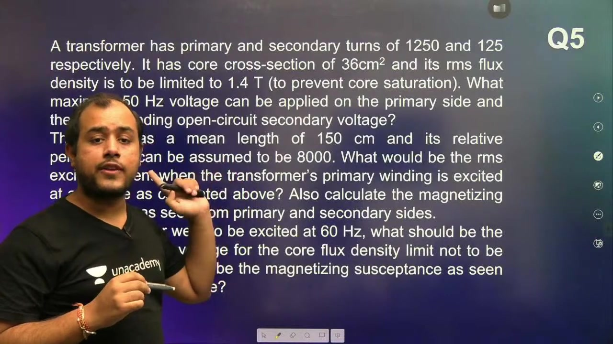

#### Primary and Secondary Voltage Calculations

Substitute into the EMF equation for the primary winding:

$$\begin{aligned}
V_1 &= 4.44 f N_1 B_m A_n \\
&= 4.44 \times 50 \times 1250 \times (\sqrt{2} \times 1.4) \times (36 \times 10^{-4}) \\
&\approx 277500 \times (7.1276 \times 10^{-3}) \\
&\approx 1978\text{ V}
\end{aligned}$$

This calculated value represents the rated RMS primary voltage.

Find secondary open-circuit voltage using the turns ratio:

$$V_2 = V_1 \left(\frac{N_2}{N_1}\right) = 1978 \times \left(\frac{125}{1250}\right) = \frac{1978}{10} = 197.8\text{ V}$$

> [!info] Voltage Interpretation
> The equation $E = 4.44 f N \Phi_m$ always yields RMS induced voltage. The input $\Phi_m$ must always be the peak core flux.

## Core Reluctance and Magnetizing Current Determination
_(35:25 - 40:42)_

### The Physical Origin of the Factor 4.44

The transformer induced EMF equation contains the numerical coefficient $4.44$. This constant comes directly from sinusoidal calculus:

$$E_{\text{rms}} = \frac{E_{\text{peak}}}{\sqrt{2}} = \frac{2\pi f N \Phi_m}{\sqrt{2}} = \sqrt{2}\pi f N \Phi_m \approx 4.44288 f N \Phi_m$$

If you seek the peak voltage rather than RMS, the multiplier is $2\pi \approx 6.283$.

The flux term $\Phi_m$ must always be the peak core flux.

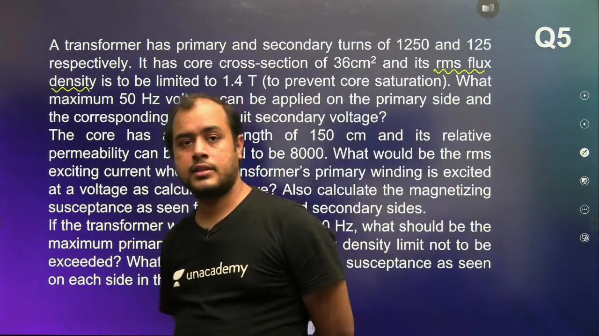

### Core Reluctance Calculation

Consider a transformer core with mean magnetic path length $l = 15\text{ m}$ and relative permeability $\mu_r = 8000$. The core cross-sectional area is $A_n = 36\text{ cm}^2 = 36 \times 10^{-4}\text{ m}^2$.

Magnetic reluctance measures opposition to the establishment of magnetic flux:

$$\mathcal{R} = \frac{l}{\mu_0 \mu_r A_n}$$

Substitute the parameters into the equation:

$$\begin{aligned}
\mathcal{R} &= \frac{15}{(4\pi \times 10^{-7}) \times 8000 \times (36 \times 10^{-4})} \\
&= \frac{15}{3.6191 \times 10^{-4}} \\
&\approx 41446.6\text{ AT/Wb}
\end{aligned}$$

### Determining Magnetizing Current via Hopkinson's Law

The primary winding supplies the magnetomotive force (MMF) that drives flux through the core:

$$\text{MMF} = N_1 I_m = \Phi \mathcal{R}$$

Here $I_m$ is the magnetizing current. It sets up the mutual flux in the iron circuit.

A vital rule governs peak and RMS quantities in magnetic circuits:
1. If you substitute peak flux $\Phi_m$, the relation yields peak current $I_{m,\text{peak}}$.
2. If you substitute RMS flux $\Phi_{\text{rms}}$, the relation yields RMS current $I_{m,\text{rms}}$.

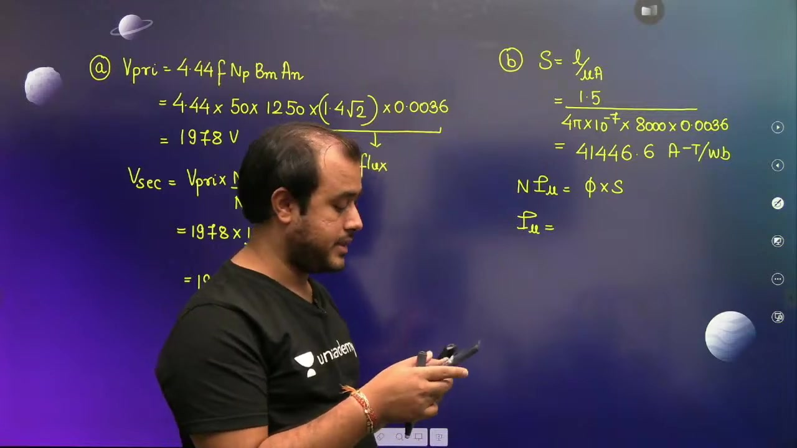

#### Evaluating RMS Magnetizing Current

The problem specifies an RMS flux density $B_{\text{rms}} = 1.4\text{ T}$. We find the RMS core flux directly:

$$\Phi_{\text{rms}} = B_{\text{rms}} A_n = 1.4 \times (36 \times 10^{-4}) = 5.04 \times 10^{-3}\text{ Wb}$$

Now apply Hopkinson's law with $N_1 = 1250\text{ turns}$:

$$\begin{aligned}
I_{m,\text{rms}} &= \frac{\Phi_{\text{rms}} \mathcal{R}}{N_1} \\
&= \frac{(5.04 \times 10^{-3}\text{ Wb}) \times 41446.6\text{ AT/Wb}}{1250} \\
&= \frac{208.89}{1250} \\
&\approx 0.1671\text{ A}
\end{aligned}$$

### Alternative Method: Magnetizing Reactance

You can also solve this problem using an AC equivalent circuit model.

First, compute the magnetizing inductance of the primary coil:

$$L_m = \frac{N_1^2}{\mathcal{R}} = \frac{1250^2}{41446.6} \approx 37.699\text{ H}$$

Next, find the magnetizing reactance at $50\text{ Hz}$:

$$X_m = 2\pi f L_m = 2\pi \times 50 \times 37.699 \approx 11843.5\ \Omega$$

Finally, calculate the RMS magnetizing current from primary voltage $V_1 \approx 1978\text{ V}$:

$$I_{m,\text{rms}} = \frac{V_1}{X_m} = \frac{1978}{11843.5} \approx 0.1670\text{ A}$$

Both methods yield identical answers.

> [!success] Result
> Core reluctance is $\mathcal{R} = 41446.6\text{ AT/Wb}$. The RMS magnetizing current drawn by the primary is $I_{m,\text{rms}} = 0.167\text{ A}$.

## Magnetizing Susceptance, Frequency Scaling, and V/f Control
_(40:42 - 46:24)_

### Magnetizing Inductance and Susceptance at 50 Hz

Magnetizing susceptance $B_m$ represents the imaginary admittance component of the core excitation branch. It is the reciprocal of magnetizing reactance:

$$B_m = \frac{1}{X_m} = \frac{1}{\omega L_m}$$

Magnetic reluctance was calculated as $\mathcal{R} = 41446.6\text{ AT/Wb}$. 

We compute the primary magnetizing inductance:

$$\begin{aligned}
L_{m1} &= \frac{N_1^2}{\mathcal{R}} \\
&= \frac{1250^2}{41446.6} \\
&\approx 37.70\text{ H}
\end{aligned}$$

Referred to the secondary winding with $N_2 = 125\text{ turns}$:

$$\begin{aligned}
L_{m2} &= \frac{N_2^2}{\mathcal{R}} \\
&= \frac{125^2}{41446.6} \\
&= \frac{L_{m1}}{a^2} \\
&\approx 0.3770\text{ H}
\end{aligned}$$

Here $a = N_1 / N_2 = 10$ is the transformation ratio.

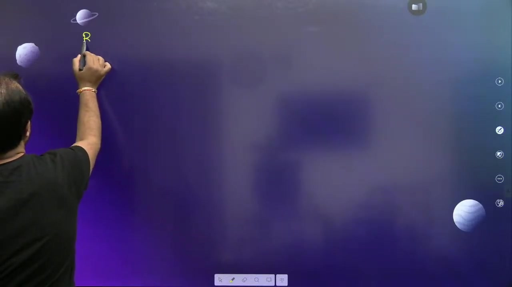

#### Evaluating Susceptance at 50 Hz

At supply frequency $f = 50\text{ Hz}$, the angular frequency is $\omega = 2\pi \times 50 = 100\pi\text{ rad/s}$.

The primary magnetizing susceptance is:

$$\begin{aligned}
B_{m1} &= \frac{1}{\omega L_{m1}} \\
&= \frac{1}{100\pi \times 37.70} \\
&\approx 8.443 \times 10^{-5}\text{ S} = 84.43\ \mu\text{S}
\end{aligned}$$

The secondary magnetizing susceptance is:

$$\begin{aligned}
B_{m2} &= \frac{1}{\omega L_{m2}} \\
&= \frac{1}{100\pi \times 0.3770} \\
&\approx 8.443 \times 10^{-3}\text{ S} = 8.443\text{ mS}
\end{aligned}$$

Notice that secondary susceptance is larger by a factor of $a^2 = 100$.

### Performance Scaling at 60 Hz Operation

Now consider operating this transformer on a $60\text{ Hz}$ supply with unchanged peak flux density $B_m$.

The permissible primary voltage scales linearly with frequency:

$$\begin{aligned}
V_1(60\text{ Hz}) &= V_1(50\text{ Hz}) \times \left(\frac{60}{50}\right) \\
&= 1978 \times 1.2 \\
&\approx 2373.6\text{ V}
\end{aligned}$$

Core inductance depends purely on turns and core geometry. It does not change with frequency. 

However, the operating frequency changes to $\omega = 2\pi \times 60 = 120\pi\text{ rad/s}$. The magnetizing reactance increases by $20\%$. So susceptance decreases:

$$\begin{aligned}
B_{m1}(60\text{ Hz}) &= \frac{1}{120\pi \times 37.70} \\
&\approx 7.036 \times 10^{-5}\text{ S} = 70.36\ \mu\text{S}
\end{aligned}$$

Referred to the secondary:

$$\begin{aligned}
B_{m2}(60\text{ Hz}) &= \frac{1}{120\pi \times 0.3770} \\
&\approx 7.036 \times 10^{-3}\text{ S} = 7.036\text{ mS}
\end{aligned}$$

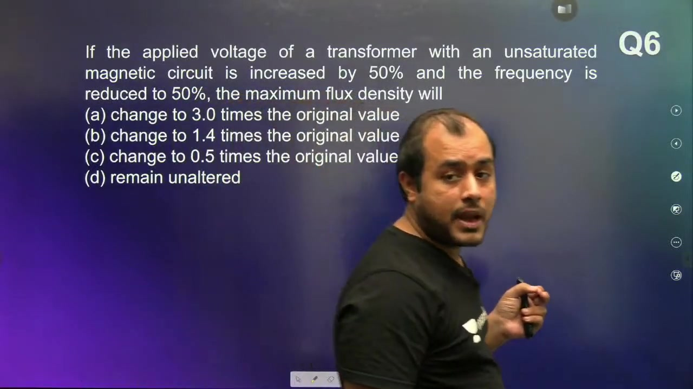

### Objective Problem: V/f Ratio and Core Saturation

> [!example] Problem
> In a transformer, the applied voltage is increased by $50\%$ while the supply frequency is reduced by $50\%$.
> Find the resulting change in peak core flux density.

#### Mathematical Analysis

Recall the voltage equation:

$$V \approx 4.44 f N B_m A_n$$

Rearranging for peak flux density:

$$B_m \propto \frac{V}{f}$$

We write the ratio of final to initial flux density:

$$\frac{B_{m2}}{B_{m1}} = \left(\frac{V_2}{V_1}\right) \times \left(\frac{f_1}{f_2}\right)$$

Given parameters:
- Voltage increases by $50\% \implies V_2 / V_1 = 1.5$.
- Frequency decreases by $50\% \implies f_2 / f_1 = 0.5 \implies f_1 / f_2 = 2.0$.

Substitute these ratios:

$$\frac{B_{m2}}{B_{m1}} = 1.5 \times 2.0 = 3.0$$

The peak flux density triples. 

> [!success] Result
> The peak core flux density increases by a factor of $3$. In practice, this large rise drives the iron core into deep magnetic saturation.

## Harmonic Voltages and Core Flux Integration from First Principles
_(46:24 - 51:00)_

### The Challenge of Non-Sinusoidal Applied Voltages

Transformers in power electronic circuits often face non-sinusoidal voltages. Standard formulas like $E = 4.44 f N \Phi_m$ assume a pure single-frequency sinusoid. They fail when multiple harmonics are present.

When voltage contains harmonics, you must return to first principles. You integrate the voltage waveform to find the time-dependent core flux.

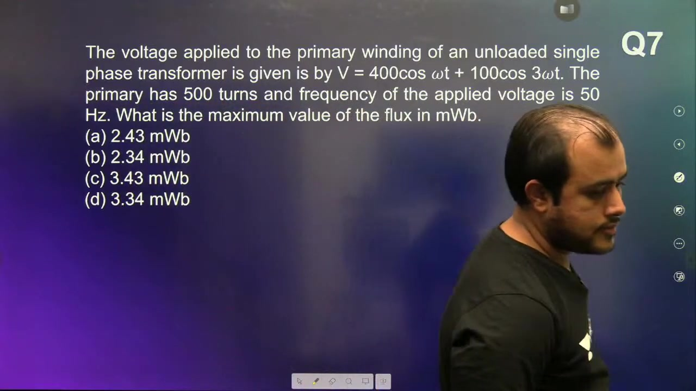

### Worked Example: Composite Voltage Waveform

> [!example] Problem
> The voltage applied to the primary winding of an unloaded single-phase transformer is:
> $$v(t) = 400\cos(\omega t) + 100\cos(3\omega t)\text{ V}$$
> The primary winding has $N_1 = 500\text{ turns}$. The fundamental frequency is $f = 50\text{ Hz}$.
> Find the mathematical expression for core flux $\phi(t)$ and its peak value.

### Deriving the Core Flux Expression

By Faraday's law, induced EMF opposes changes in magnetic flux:

$$e(t) = -N_1 \frac{d\phi}{dt}$$

On no-load, winding resistance and leakage reactance are negligible. The terminal voltage balances the induced EMF:

$$v(t) = -e(t) = N_1 \frac{d\phi}{dt}$$

Rearranging gives the rate of change of core flux:

$$\frac{d\phi}{dt} = \frac{v(t)}{N_1}$$

Integrate both sides with respect to time:

$$\phi(t) = \frac{1}{N_1} \int \left[ 400\cos(\omega t) + 100\cos(3\omega t) \right] dt$$

Recall the standard integral:

$$\int \cos(k\omega t)\,dt = \frac{\sin(k\omega t)}{k\omega}$$

Substitute the turns count $N_1 = 500$:

$$\phi(t) = \frac{400}{500\omega} \sin(\omega t) + \frac{100}{500 \times 3\omega} \sin(3\omega t)$$

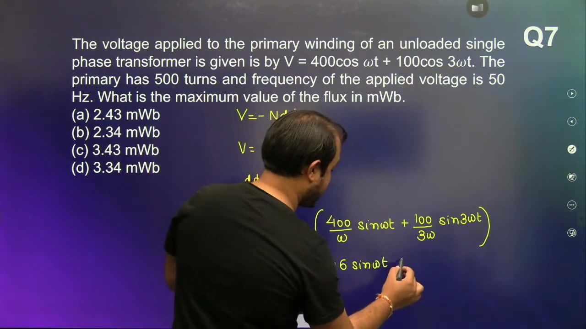

### Evaluating Harmonic Flux Amplitudes

The fundamental angular frequency at $50\text{ Hz}$ is:

$$\omega = 2\pi \times 50 = 100\pi \approx 314.16\text{ rad/s}$$

Now calculate the amplitude of the fundamental flux component:

$$\begin{aligned}
\Phi_{m1} &= \frac{400}{500 \times 100\pi} \\
&= \frac{0.8}{100\pi} \\
&\approx 2.546 \times 10^{-3}\text{ Wb} = 2.546\text{ mWb}
\end{aligned}$$

Next, evaluate the third harmonic flux amplitude with angular frequency $3\omega = 300\pi\text{ rad/s}$:

$$\begin{aligned}
\Phi_{m3} &= \frac{100}{500 \times 300\pi} \\
&= \frac{0.2}{300\pi} \\
&\approx 0.2122 \times 10^{-3}\text{ Wb} = 0.2122\text{ mWb}
\end{aligned}$$

Combining these components gives the complete time-domain flux expression:

$$\phi(t) = 2.546\sin(\omega t) + 0.2122\sin(3\omega t)\quad [\text{in mWb}]$$

Under the alternative polarity convention ($v(t) = -N_1 \frac{d\phi}{dt}$), both terms carry a negative sign. The physical magnitude of each harmonic component remains unchanged.

> [!info] Multi-Harmonic Flux Composition
> The total core flux consists of a $50\text{ Hz}$ fundamental wave superimposed on a $150\text{ Hz}$ third harmonic wave.

## Multi-Harmonic Waveform Pitfalls and Extremum Analysis
_(51:05 - 56:22)_

### Common Misconceptions in Harmonic Flux Calculations

Analyzing multi-harmonic waveforms presents several traps for engineering students. You must avoid four frequent calculation errors.

#### Pitfall 1: Confusing RMS and Peak Formulas

Many students calculate $\sqrt{\Phi_{m1}^2 + \Phi_{m3}^2}$ and call it peak flux. That expression is mathematically incorrect for peaks.

Orthogonal Fourier components combine via root-sum-squares only for RMS values:

$$\begin{aligned}
\Phi_{\text{rms}} &= \sqrt{\frac{\Phi_{m1}^2}{2} + \frac{\Phi_{m3}^2}{2}} \\
&= \sqrt{\Phi_{\text{rms},1}^2 + \Phi_{\text{rms},3}^2}
\end{aligned}$$

Using the amplitudes derived earlier ($\Phi_{m1} = 2.546\text{ mWb}$ and $\Phi_{m3} = 0.2122\text{ mWb}$):

$$\begin{aligned}
\Phi_{\text{rms}} &= \sqrt{\frac{2.546^2 + 0.2122^2}{2}} \\
&= \sqrt{\frac{6.4821 + 0.0450}{2}} \\
&\approx 1.807\text{ mWb}
\end{aligned}$$

#### Pitfall 2: Multiplying Composite RMS by $\sqrt{2}$

Never multiply the composite RMS flux by $\sqrt{2}$ to find maximum flux. 

The crest factor equals $\sqrt{2}$ strictly for pure, single-frequency sinusoids:

$$\frac{\text{Peak}}{\text{RMS}} = \sqrt{2} \quad (\text{Pure sine wave only})$$

For non-sinusoidal composite waveforms, the crest factor is not $\sqrt{2}$. Multiplying by $\sqrt{2}$ gives a meaningless number.

#### Pitfall 3: Assuming Peak Occurs at 90 Degrees

Do not assume the composite wave peaks at $\omega t = 90^\circ$.

At $\omega t = 90^\circ$, the fundamental component reaches its peak:

$$\sin(90^\circ) = 1$$

However, the third harmonic term produces destructive interference:

$$\sin(3 \times 90^\circ) = \sin(270^\circ) = -1$$

The harmonic subtracts from the fundamental rather than adding to it. The true peak occurs at a different electrical angle.

#### Pitfall 4: Applying 4.44 Across Different Frequencies

You cannot substitute total composite RMS voltage into $E = 4.44 f N \Phi_m$. 

The fundamental component operates at $50\text{ Hz}$. The third harmonic operates at $150\text{ Hz}$. You cannot plug two different frequencies into a single equation.

### Rigorous Method: Finding True Peak Flux

To find the mathematical peak of any composite waveform, locate where its first derivative equals zero:

$$\frac{d\phi}{dt} = 0$$

Because induced voltage is proportional to the time derivative of flux, the flux reaches an extremum precisely when applied voltage passes through zero:

$$v(t) = 0 \implies 400\cos(\omega t) + 100\cos(3\omega t) = 0$$

Use the trigonometric identity $\cos(3\theta) = 4\cos^3\theta - 3\cos\theta$:

$$400\cos(\omega t) + 100(4\cos^3(\omega t) - 3\cos(\omega t)) = 0$$

Divide by $100$:

$$4\cos(\omega t) + 4\cos^3(\omega t) - 3\cos(\omega t) = 0$$

Combine like terms:

$$4\cos^3(\omega t) + \cos(\omega t) = 0 \implies \cos(\omega t)(4\cos^2(\omega t) + 1) = 0$$

The term $(4\cos^2(\omega t) + 1)$ has no real roots. Therefore:

$$\cos(\omega t) = 0 \implies \omega t = 90^\circ, 270^\circ$$

Substitute $\omega t = 90^\circ$ into the flux function:

$$\begin{aligned}
\phi_{\text{peak}} &= 2.546\sin(90^\circ) + 0.2122\sin(270^\circ) \\
&= 2.546(1) + 0.2122(-1) \\
&= 2.334\text{ mWb}
\end{aligned}$$

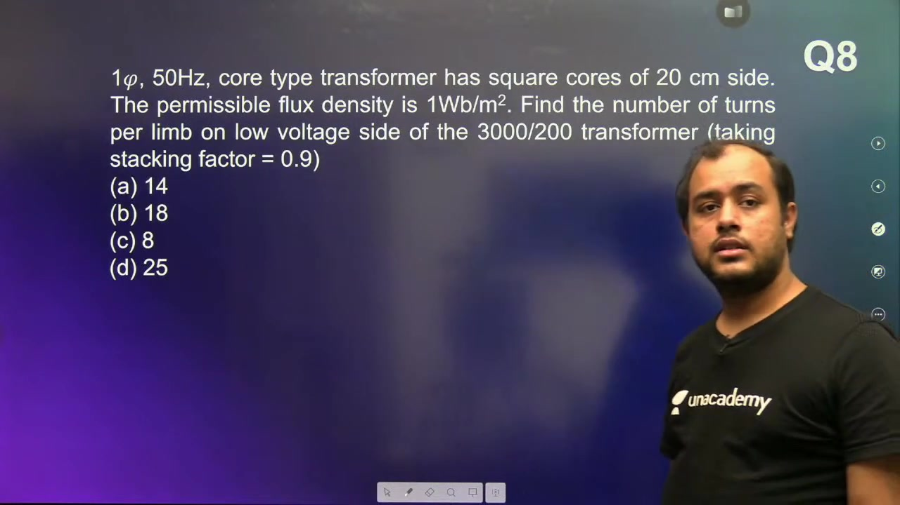

### Problem Setup: Square Core with Stacking Factor

> [!example] Problem
> A single-phase $50\text{ Hz}$ core-type transformer has a square core of side $s = 20\text{ cm}$. 
> The maximum allowable flux density is $B_m = 1.0\text{ T}$. The core stacking factor is $k_s = 0.9$.
> Find the number of turns on the low-voltage side for a rated voltage of $200\text{ V}$.

The gross area includes both steel and insulation:

$$A_{\text{gross}} = s^2 = 0.20 \times 0.20 = 0.04\text{ m}^2 = 400\text{ cm}^2$$

The active magnetic iron area is:

$$A_n = k_s A_{\text{gross}} = 0.9 \times 0.04 = 0.036\text{ m}^2$$

We will complete the turn derivation in the next section.

## Stacking Factor Calculations and Shell-Type Core Geometry
_(56:25 - 61:30)_

### Completing the Square Core Turn Calculation

In the previous section, a square core had side length $s = 20\text{ cm}$. The core stacking factor was $k_s = 0.9$. 

The gross cross-sectional area is:

$$A_{\text{gross}} = 20 \times 20 = 400\text{ cm}^2 = 0.04\text{ m}^2$$

The active magnetic iron cross section is:

$$\begin{aligned}
A_n &= k_s A_{\text{gross}} \\
&= 0.9 \times 400 \\
&= 360\text{ cm}^2 = 0.036\text{ m}^2
\end{aligned}$$

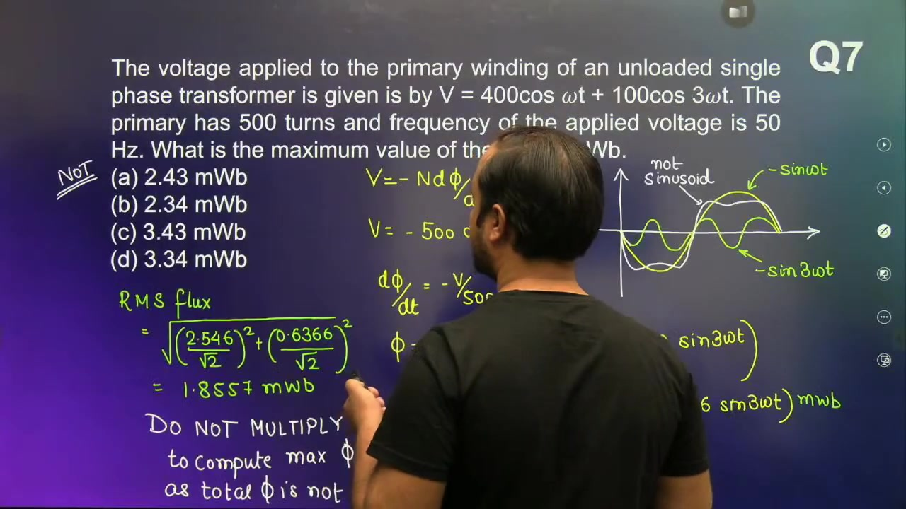

#### Evaluating Low-Voltage Turns

The rated low-voltage winding voltage is $V_{\text{LV}} = 200\text{ V}$. The supply frequency is $50\text{ Hz}$. The peak flux density is $B_m = 1.0\text{ T}$.

Apply the standard induced EMF equation:

$$V_{\text{LV}} = 4.44 f N_{\text{LV}} B_m A_n$$

Rearrange to solve for the low-voltage turns:

$$\begin{aligned}
N_{\text{LV}} &= \frac{V_{\text{LV}}}{4.44 f B_m A_n} \\
&= \frac{200}{4.44 \times 50 \times 1.0 \times 0.036} \\
&= \frac{200}{7.992} \\
&\approx 25.025\text{ turns}
\end{aligned}$$

Rounding to the nearest whole integer gives:

$$N_{\text{LV}} = 25\text{ turns}$$

> [!success] Result
> The low-voltage winding requires $25\text{ turns}$.

### Problem Setup: Shell-Type Transformer with Sandwich Coils

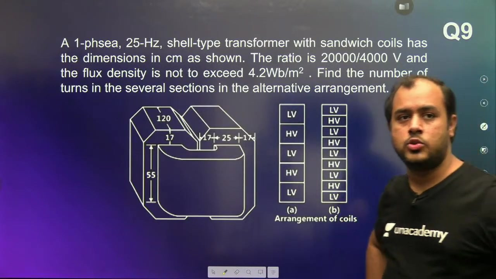

> [!example] Problem
> A single-phase shell-type transformer has sandwich coils and operates with a voltage rating of $20000 / 4000\text{ V}$.
> The core dimensions are shown on the diagram:
> - Central limb width: $34\text{ cm}$
> - Core depth: $120\text{ cm}$
> - Window width and height: $17\text{ cm} \times 17\text{ cm}$
> 
> The supply frequency is $25\text{ Hz}$. The peak flux density is limited to $B_m = 1.2\text{ Wb/m}^2$.
> Find the number of turns in each section of the sandwich coil arrangement.

### Magnetic Circuit and Central Limb Cross Section

In a shell-type transformer, windings are mounted on the central limb. 

Magnetic flux travels vertically through the central limb. It splits equally into two outer limbs. 

To calculate induced EMF, compute the cross-sectional area perpendicular to the flux path in the central limb:

$$\text{Central limb width} = 34\text{ cm} = 0.34\text{ m}$$

$$\text{Core depth} = 120\text{ cm} = 1.20\text{ m}$$

The gross cross section of the central limb is:

$$\begin{aligned}
A_{\text{central}} &= 0.34 \times 1.20 \\
&= 0.408\text{ m}^2
\end{aligned}$$

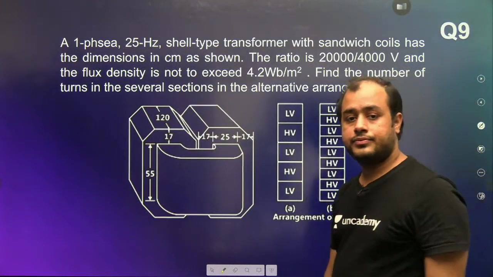

We will use this core area to find EMF per turn and section turn divisions in the next section.

## Sandwich Coil Turn Allocation and Integer Divisibility Constraints
_(61:30 - 69:52)_

### Core Area and EMF per Turn Calculation

We now complete the calculation for the shell-type transformer introduced in the previous section.

The central limb dimensions are $34\text{ cm} \times 120\text{ cm}$. The active core area is:

$$A_n = 0.34 \times 1.20 = 0.4080\text{ m}^2$$

The transformer operates at $f = 25\text{ Hz}$ with $B_m = 1.2\text{ Wb/m}^2$.

Calculate the EMF per turn:

$$\begin{aligned}
E_{\text{turn}} &= 4.44 f B_m A_n \\
&= 4.44 \times 25 \times 1.2 \times 0.4080 \\
&\approx 190.21\text{ V/turn}
\end{aligned}$$

The rated winding voltages are $V_{\text{HV}} = 20000\text{ V}$ and $V_{\text{LV}} = 4000\text{ V}$.

The nominal transformation ratio is:

$$a = \frac{V_{\text{HV}}}{V_{\text{LV}}} = \frac{20000}{4000} = 5$$

Therefore, the winding turn counts must satisfy:

$$N_{\text{HV}} = 5 N_{\text{LV}}$$

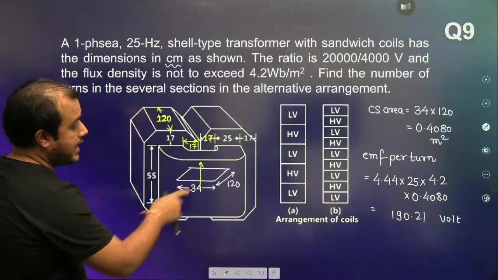

### Arrangement A: 3 LV Sections and 2 HV Sections

Calculate the nominal number of low-voltage turns:

$$N_{\text{LV, nominal}} = \frac{V_{\text{LV}}}{E_{\text{turn}}} = \frac{4000}{190.21} \approx 21.03\text{ turns}$$

In this arrangement, the low-voltage winding is split into $3$ equal sections. So $N_{\text{LV}}$ must be divisible by $3$.

If you choose $N_{\text{LV}} = 21$, each LV section receives $21 / 3 = 7\text{ turns}$.

Now check the high-voltage winding:

$$N_{\text{HV}} = 5 \times 21 = 105\text{ turns}$$

The high-voltage winding must be divided into $2$ equal sections. 

However, $105$ is an odd number. Dividing $105$ by $2$ yields $52.5\text{ turns}$. Fractional turns are physically impossible.

#### Establishing the Integer Multiple Constraint

Because $N_{\text{HV}} = 5 N_{\text{LV}}$, $N_{\text{HV}}$ is even only when $N_{\text{LV}}$ is even.

Therefore, $N_{\text{LV}}$ must satisfy two conditions simultaneously:
1. It must be divisible by $3$ for the LV sections.
2. It must be an even integer for the HV sections.

This requires $N_{\text{LV}}$ to be a multiple of $\text{LCM}(3, 2) = 6$.

The closest multiples of $6$ to $21$ are $18$ and $24$. We select $N_{\text{LV}} = 24\text{ turns}$.

We calculate turns per section for Arrangement A:

$$\text{LV turns per section} = \frac{24}{3} = 8\text{ turns/section}$$

$$\begin{aligned}
N_{\text{HV}} &= 5 \times 24 = 120\text{ turns} \\
\text{HV turns per section} &= \frac{120}{2} = 60\text{ turns/section}
\end{aligned}$$

> [!success] Result: Arrangement A
> Total turns are $N_{\text{LV}} = 24$ ($8\text{ turns/section}$) and $N_{\text{HV}} = 120$ ($60\text{ turns/section}$).

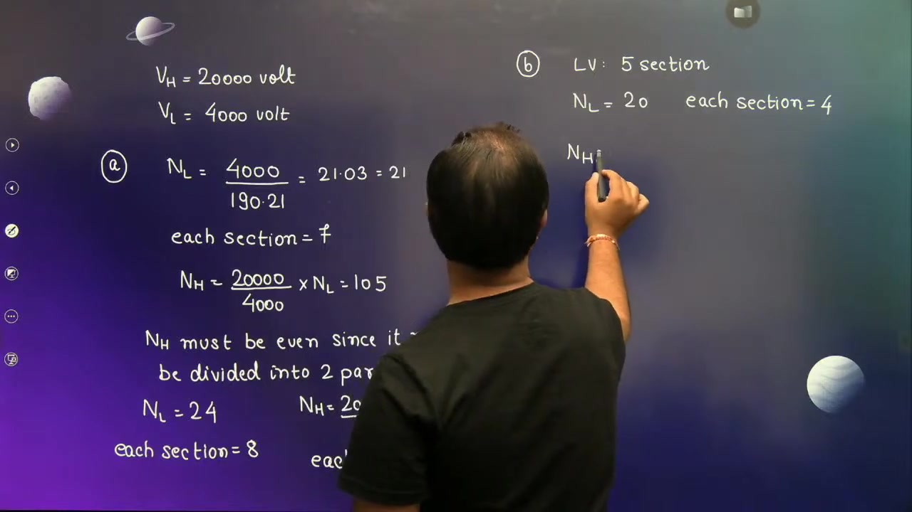

### Arrangement B: 5 LV Sections and 4 HV Sections

In Arrangement B, the low-voltage winding is divided into $5$ sections. The high-voltage winding is divided into $4$ sections.

The turns must satisfy two new constraints:
1. $N_{\text{LV}}$ must be divisible by $5$.
2. $N_{\text{HV}} = 5 N_{\text{LV}}$ must be divisible by $4$.

The nominal value was $21.03$. The nearest multiple of $5$ is $N_{\text{LV}} = 20\text{ turns}$.

Each low-voltage section receives:

$$\text{LV turns per section} = \frac{20}{5} = 4\text{ turns/section}$$

Now compute the high-voltage winding turns:

$$N_{\text{HV}} = 5 \times 20 = 100\text{ turns}$$

Check divisibility by $4$:

$$\text{HV turns per section} = \frac{100}{4} = 25\text{ turns/section}$$

Both turn counts resolve into clean whole integers.

> [!success] Result: Arrangement B
> Total turns are $N_{\text{LV}} = 20$ ($4\text{ turns/section}$) and $N_{\text{HV}} = 100$ ($25\text{ turns/section}$).

## Three-Phase Transformer Design and Coil Type Classification
_(69:58 - 77:39)_

### Worked Example: Three-Phase Star-Delta Core Sizing

> [!example] Problem
> A $50\text{ Hz}$ three-phase core-type transformer has a line voltage rating of $10000 / 500\text{ V}$ with a star-delta connection.
> The core limbs have a square cross section. The windings are circular.
> Given an EMF per turn of $15\text{ V}$ and a maximum core flux density $B_m = 1.1\text{ T}$:
> 1. Find the cross-sectional dimension of the core limb.
> 2. Find the diameter of the circumscribing circle.
> 3. Calculate the number of turns per phase for each winding.

#### Step 1: Active Core Area

EMF per turn is given by:

$$E_{\text{turn}} = 4.44 f B_m A_n$$

Solve for net iron area $A_n$:

$$\begin{aligned}
A_n &= \frac{E_{\text{turn}}}{4.44 f B_m} \\
&= \frac{15}{4.44 \times 50 \times 1.1} \\
&\approx 0.06198\text{ m}^2
\end{aligned}$$

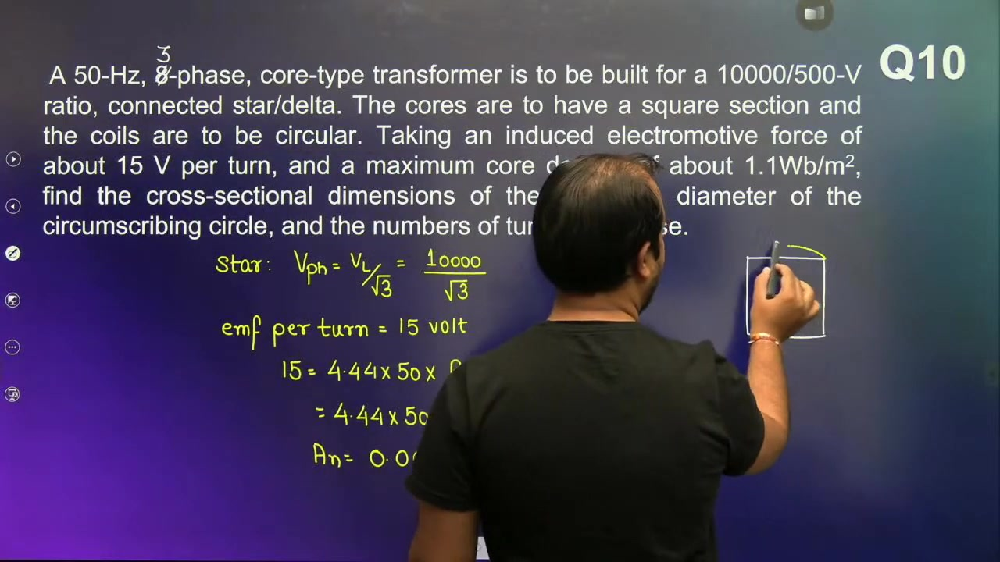

#### Step 2: Core Side and Circumscribing Diameter

The core cross section is square with side $a$:

$$A_n = a^2 \implies a = \sqrt{0.06198} \approx 0.24896\text{ m} \approx 24.90\text{ cm}$$

Circular coils circumscribe the square core. The inner diameter of the coil matches the diagonal of the square:

$$\begin{aligned}
d &= \sqrt{a^2 + a^2} = \sqrt{2} a \\
&= \sqrt{2} \times 0.24896 \\
&\approx 0.3521\text{ m} = 35.21\text{ cm}
\end{aligned}$$

#### Step 3: Winding Turn Calculations

In three-phase transformers, always compute turns using per-phase voltages. Never use line-to-line voltages directly.

Start with the low-voltage delta winding:

$$V_{\text{ph,LV}} = V_{\text{line,LV}} = 500\text{ V}$$

Compute the low-voltage turns:

$$N_{\text{LV}} = \frac{V_{\text{ph,LV}}}{E_{\text{turn}}} = \frac{500}{15} = 33.33\text{ turns}$$

Even turn counts allow balanced winding arrangements. We choose:

$$N_{\text{LV}} = 34\text{ turns/phase}$$

Now consider the high-voltage star winding:

$$V_{\text{ph,HV}} = \frac{V_{\text{line,HV}}}{\sqrt{3}} = \frac{10000}{\sqrt{3}} \approx 5773.5\text{ V}$$

Use the per-phase voltage ratio:

$$\begin{aligned}
N_{\text{HV}} &= N_{\text{LV}} \times \left(\frac{V_{\text{ph,HV}}}{V_{\text{ph,LV}}}\right) \\
&= 34 \times \left(\frac{10000 / \sqrt{3}}{500}\right) \\
&= 34 \times \frac{20}{\sqrt{3}} \\
&\approx 392.6\text{ turns}
\end{aligned}$$

Rounding to an even integer yields:

$$N_{\text{HV}} = 392\text{ turns/phase}$$

Do not take the transformation ratio as $10000 / 500 = 20$. In three-phase circuits, turns ratio is strictly per phase.

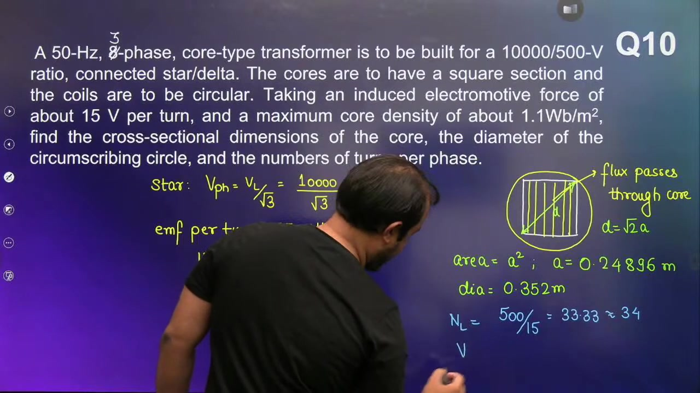

### Objective Problem: High-Frequency Power Supplies

High-frequency switch-mode power supplies (SMPS) are lightweight and compact. 

The physical reason follows directly from the EMF relation:

$$A_n \propto \frac{V}{f}$$

At frequencies in the kilohertz range, the required core area shrinks dramatically. This reduction slashes core volume and copper weight.

In a power supply, the components connect in order:
1. Transformer
2. Rectifier
3. Filter
4. Voltage Regulator

### Objective Problem: Matching Industrial Winding Types

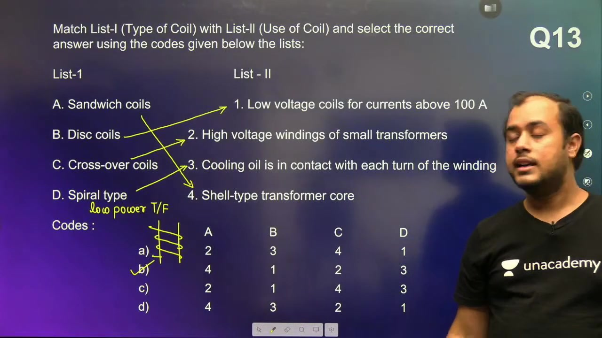

Different transformer applications demand distinct coil geometries:
- **Sandwich Coils:** Used in shell-type transformers to reduce leakage flux.
- **Disc Coils:** Used for low-voltage windings handling high currents.
- **Crossover Coils:** Used for high-voltage windings in small distribution transformers.
- **Spiral Coils:** Used in low-power units where cooling oil contacts each turn.

> [!success] Match Result
> 1. Sandwich coil: Shell-type transformer
> 2. Disc coil: High-current LV winding
> 3. Crossover coil: High-voltage winding of small transformers
> 4. Spiral coil: Cooling oil in contact with each winding turn

## Air Core Substitution and Hysteresis Loss Elimination
_(77:39 - 80:01)_

### Physical Behavior of Air as a Core Medium

In iron-core transformers, alternating flux causes magnetic domain wall movement. This friction creates hysteresis loss.

The energy lost per cycle corresponds to the area enclosed by the material's $B\text{--}H$ loop:

$$W_h = \oint H\,dB$$

Over time, the total hysteresis power loss follows the Steinmetz relation:

$$P_h = k_h f B_m^n V_{\text{core}}$$

Here $k_h$ is the Steinmetz coefficient. The exponent $n$ usually ranges between $1.5$ and $2.5$.

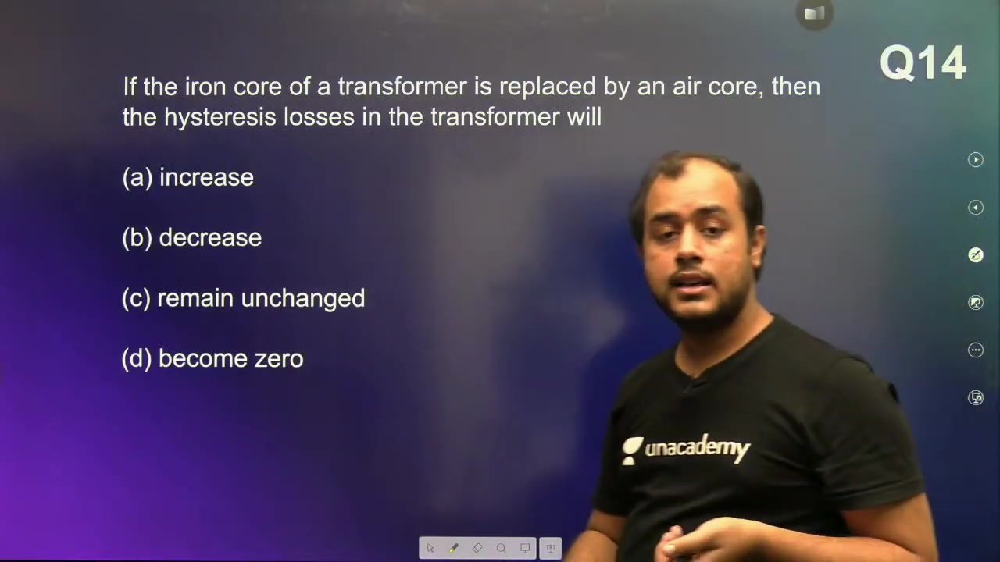

### Replacing an Iron Core with an Air Core

> [!example] Problem
> If the ferromagnetic iron core of a transformer is replaced by an air core, what happens to the hysteresis loss?

#### Magnetic Linearity of Air

Air is a non-ferromagnetic medium. It has a relative permeability of unity:

$$\mu_r \approx 1.0$$

Its magnetic flux density follows a strictly linear relationship:

$$B = \mu_0 H$$

Air contains no magnetic domains. When the magnetizing field $H$ alternates, flux density $B$ traces the exact same straight line in both directions.

#### Hysteresis Loop Area of Air

Because the $B\text{--}H$ curve is a single straight line, it encloses zero area:

$$\text{Area of } B\text{--}H \text{ loop} = 0$$

There is no residual flux density:

$$B_r = 0$$

There is no coercive force:

$$H_c = 0$$

Without a loop area, magnetic energy cannot be trapped or converted to heat:

$$P_{h,\text{air}} = 0$$

> [!success] Result
> Replacing an iron core with an air core eliminates hysteresis loss entirely. The hysteresis loss becomes zero.

### Trade-Offs in Air-Core Transformers

Air cores eliminate iron losses. However, air has very low permeability. 

Low permeability creates two major drawbacks:
1. It causes very high magnetic reluctance. A huge magnetizing current is needed to produce modest flux.
2. Leakage flux increases substantially because magnetic flux is not confined to an iron path.

For these reasons, air-core transformers are restricted to radio-frequency applications where iron losses would be prohibitive.

### Lecture Summary and Key Takeaways

This problem-solving session established core transformer principles:
- **EMF per Turn:** Computed as $E_{\text{turn}} = 4.44 f \Phi_m$. It is identical across all windings on a common core.
- **Winding Turn Sizing:** Always start with the low-voltage winding. Use turns ratios to compute high-voltage turns.
- **Divisibility Rules:** In sandwich windings, section counts dictate integer divisibility.
- **Harmonics:** For multi-harmonic waveforms, integrate voltage to find flux. Do not apply $\sqrt{2}$ crest factors to composite waves.

---

## Summary and Key Takeaways

- The induced EMF per turn $E_{\text{turn}} = 4.44 f B_m A_n$ is identical across all windings sharing a common magnetic core.
- Low-voltage turns must be calculated first, then high-voltage turns are determined using the exact voltage transformation ratio.
- Center-tapped windings require an even integer number of turns to provide symmetrical turns on both sides of the tap.
- Active core weight scales linearly with core area, while winding copper weight scales with the square root of core area $\sqrt{A_n}$.
- Core reluctance $\mathcal{R} = l / (\mu_0 \mu_r A_n)$ determines the magnetizing current via Hopkinson's law $N_1 I_m = \Phi \mathcal{R}$.
- Non-sinusoidal voltages must be integrated in the time domain, because multi-harmonic waveforms cannot use the standard $4.44$ factor or a $\sqrt{2}$ crest factor.
- In shell-type sandwich windings, low-voltage turns must be a common multiple of section counts to prevent fractional turns.
- Replacing a ferromagnetic core with an air core eliminates hysteresis loss because the $B\text{--}H$ curve of air is linear and encloses zero area.

