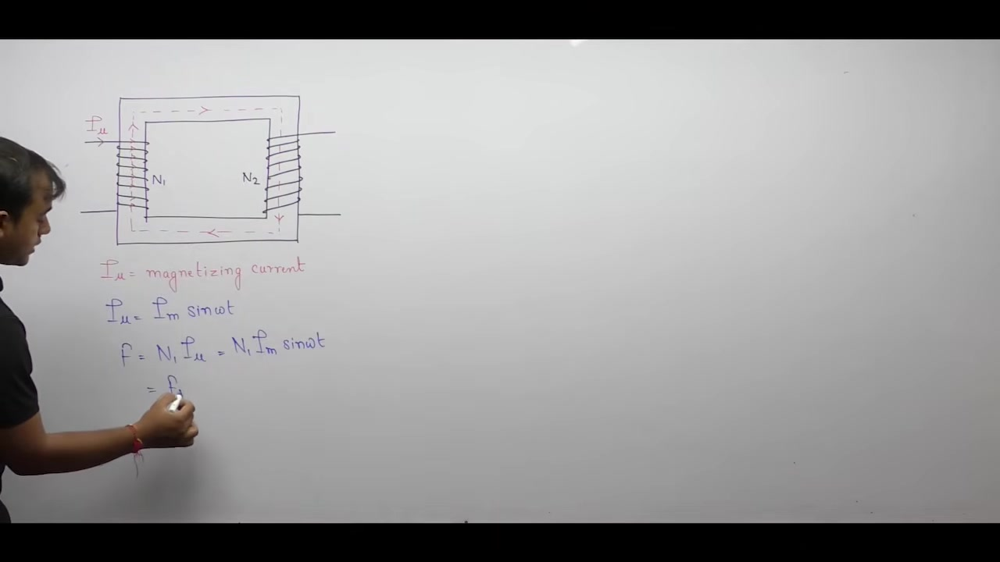
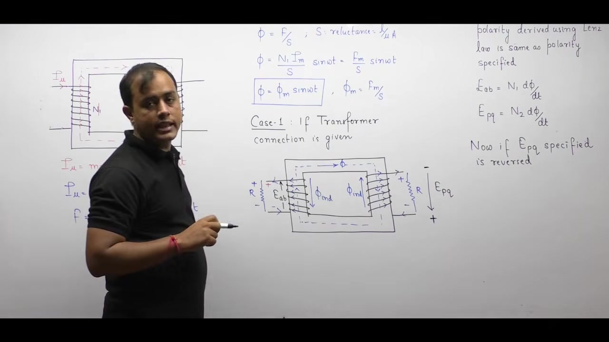
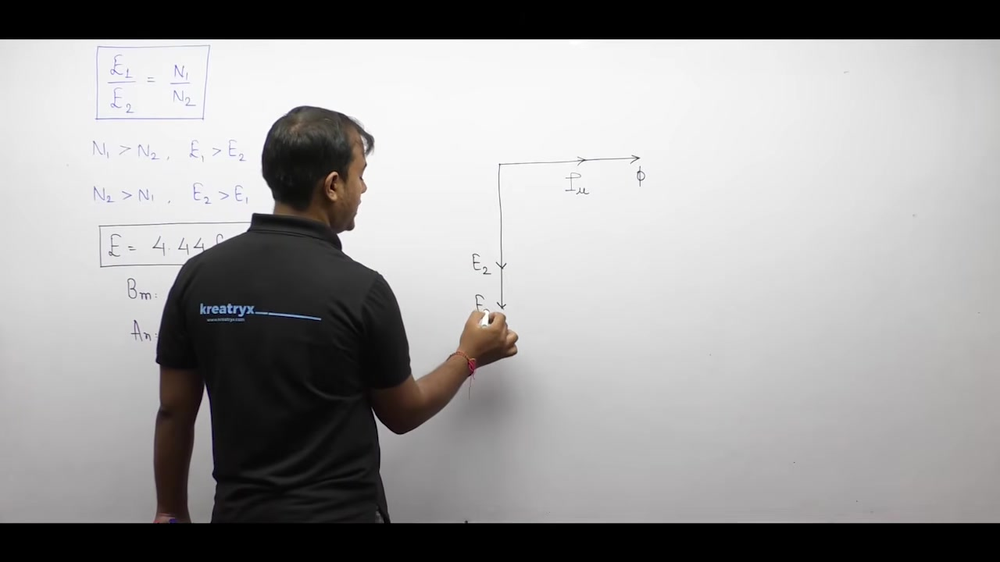
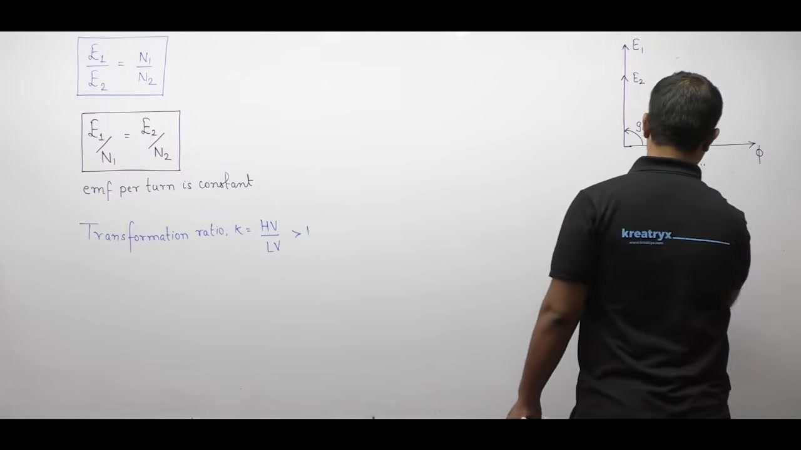
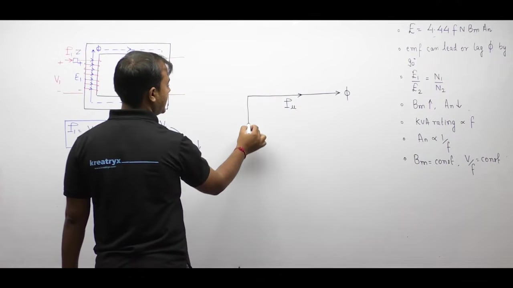
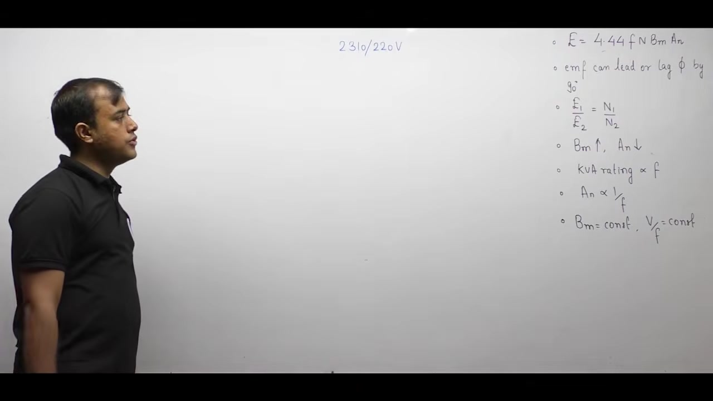

[← Lec 013: Problems based on Transformer Construction and Working](Lecture_013_Problems_based_on_Transformer_Construction_and_Working.md) | [🏠 Index](00_yt_study_guide.md) | [Lec 015: Ideal Transformer Part 2 →](Lecture_015_Ideal_Transformer_Part_2.md)

---

# Electrical Machines | Lec 10 | Ideal Transformer (Part 1) | GATE Electrical Engineering

- **Source**: https://www.youtube.com/watch?v=WMBJMfTAmO8
- **Duration**: 01:04:38
- **Compiled**: 2026-09-19

---

## Overview

This lecture establishes the theoretical foundation and governing mathematical equations of the ideal single-phase transformer. It details the defining physical assumptions for both the magnetic core and electrical windings. The analysis resolves the classical polarity conventions of Faraday's law and Lenz's law. It then derives the fundamental RMS induced EMF equation and constructs the complete no-load phasor diagram. Finally, the lecture formulates core dimensioning criteria and frequency scaling relationships for practical machine design.

## Contents

- [[#Ideal Transformer Concept and Assumptions|Ideal Transformer Concept and Assumptions]]
- [[#Core Losses and Linear Magnetization Characteristics|Core Losses and Linear Magnetization Characteristics]]
- [[#Alternating Magnetizing Current and Core Flux Setup|Alternating Magnetizing Current and Core Flux Setup]]
- [[#Polarity Determination: Faraday's Law versus Lenz's Law|Polarity Determination: Faraday's Law versus Lenz's Law]]
- [[#Derivation of the Transformer Induced EMF Equation|Derivation of the Transformer Induced EMF Equation]]
- [[#Phase Conventions, Turns Ratio, and Phasor Diagrams|Phase Conventions, Turns Ratio, and Phasor Diagrams]]
- [[#Observations on EMF, Transformation Ratio, and Core Saturation|Observations on EMF, Transformation Ratio, and Core Saturation]]
- [[#Core Materials Comparison and the $V/f$ Ratio Principle|Core Materials Comparison and the $V/f$ Ratio Principle]]
- [[#Frequency Scaling Laws and Rating Proportionalities|Frequency Scaling Laws and Rating Proportionalities]]
- [[#Back-EMF Opposition and Primary Phasor Representation|Back-EMF Opposition and Primary Phasor Representation]]
- [[#Complete No-Load Phasor Summary and Practice Problem|Complete No-Load Phasor Summary and Practice Problem]]

---

## Ideal Transformer Concept and Assumptions
_(00:12 - 05:14)_

A transformer has two primary physical parts. These are the magnetic core and the electrical windings. All other fittings like tanks, bushings, and breathers serve auxiliary roles. Therefore, an ideal transformer combines an ideal core with ideal windings.

### Properties of an Ideal Magnetic Core

An ideal magnetic core exhibits infinite magnetic permeability. Magnetic reluctance depends directly on core length and inversely on permeability:

$$\mathcal{R} = \frac{l}{\mu A}$$

When permeability approaches infinity ($\mu \to \infty$), magnetic reluctance drops to zero:

$$\mathcal{R} \to 0$$

Zero reluctance represents a magnetic short circuit. In an electric circuit, current chooses the path of minimum resistance. Similarly, magnetic flux follows the path of minimum reluctance.

Air has low permeability and high reluctance. The ideal core has zero reluctance. Because the core offers zero opposition, all magnetic flux stays entirely within the iron core. No flux escapes into the surrounding air. So the leakage flux is exactly zero:

$$\Phi_{\text{leakage}} = 0$$

> [!info] Definition: Ideal Core Reluctance
> An ideal magnetic core has infinite permeability ($\mu = \infty$) and zero reluctance ($\mathcal{R} = 0$). All magnetic flux links both windings completely with zero leakage flux.

### Zero Magnetizing Current Requirement

The magnetomotive force (MMF) required to drive flux through a magnetic circuit is given by:

$$\text{MMF} = \Phi \times \mathcal{R}$$

Because the ideal core reluctance is zero, the required MMF is zero:

$$\text{MMF} = 0$$

The MMF produced by a coil of $N$ turns carrying magnetizing current $I_\mu$ is:

$$\text{MMF} = N I_\mu = 0 \implies I_\mu = 0$$

Thus, an ideal transformer requires zero current to set up and sustain the magnetic flux. Once flux is established in a medium with infinite permeability, it never decays.

### Properties of Ideal Windings

An ideal winding is made of a hypothetical conductor having zero electrical resistance:

$$R_1 = 0, \quad R_2 = 0$$

In practical conductors, current flow produces ohmic heating losses:

$$P_{\text{cu}} = I^2 R$$

Since the resistance of each winding is zero, copper losses vanish entirely:

$$P_{\text{cu1}} = 0, \quad P_{\text{cu2}} = 0$$

> [!success] Result: Core and Winding Assumptions
> An ideal transformer satisfies three initial conditions:
> 1. Infinite core permeability ($\mu = \infty$), giving zero reluctance and zero leakage flux.
> 2. Zero magnetizing current ($I_\mu = 0$) to set up flux.
> 3. Zero winding resistance ($R = 0$), giving zero copper loss ($P_{\text{cu}} = 0$).

## Core Losses and Linear Magnetization Characteristics
_(05:14 - 10:13)_

The ideal transformer model eliminates all internal energy losses. This includes both copper losses in the windings and iron losses inside the magnetic core.

### Elimination of Iron Losses

Iron losses in a magnetic core comprise hysteresis loss and eddy current loss:

$$P_i = P_h + P_e$$

Hysteresis loss depends on the area of the cyclic B-H loop:

$$P_h = k_h B_m^x f V$$

In an ideal core, the B-H magnetization characteristic is strictly linear. The magnetization curve traces the exact same path during magnetization and demagnetization. Because the loop encloses zero area, hysteresis loss is zero:

$$P_h = 0$$

Eddy current loss arises from circulating currents induced in the core material:

$$P_e = k_e B_m^2 f^2 t^2 V$$

The ideal core material possesses infinite electrical resistivity ($\rho \to \infty$). With zero electrical conductivity, induced eddy currents cannot circulate. Thus, eddy current loss vanishes:

$$P_e = 0$$

Combining both results proves that total iron loss is zero:

$$P_i = 0 + 0 = 0$$

> [!info] Definition: Ideal Magnetic Characteristics
> The B-H curve of an ideal transformer is perfectly linear through the origin. It exhibits neither hysteresis loss nor magnetic saturation.

### Comprehensive Summary of Ideal Assumptions

An ideal transformer relies on five foundational assumptions:

1. **Infinite Permeability**: Core permeability is infinite ($\mu = \infty$). This gives zero reluctance ($\mathcal{R} = 0$).
2. **Zero Leakage Flux**: All magnetic flux remains confined inside the core ($\Phi_{\text{leakage}} = 0$).
3. **Zero Magnetizing Current**: Establishing and maintaining core flux requires zero current ($I_\mu = 0$).
4. **Zero Winding Resistance**: Both primary and secondary coils have zero resistance ($R_1 = 0, R_2 = 0$). This eliminates copper loss ($P_{\text{cu}} = 0$).
5. **Linear Core without Losses**: The core exhibits no hysteresis, no saturation, and no eddy currents ($P_i = 0$).

Since all loss mechanisms equal zero, the ideal transformer achieves perfect efficiency:

$$\eta = \frac{P_{\text{out}}}{P_{\text{in}}} \times 100\% = 100\%$$

### Progression Toward Practical Transformers

Real transformers do not satisfy these ideal conditions. Practical core materials have finite permeability and non-zero reluctance. They require finite magnetizing current to establish flux. Some flux leaks through the air. Practical copper windings possess non-zero electrical resistance. Also, cyclic magnetization creates hysteresis and eddy current losses.

Engineers study the ideal transformer first. Then, they remove each ideal assumption one by one. This stepwise relaxation builds the accurate equivalent circuit of a practical transformer.

## Alternating Magnetizing Current and Core Flux Setup
_(10:18 - 15:19)_

To derive the induced electromotive force, we first analyze how an alternating current establishes magnetic flux in the core.

### Physical Core and Helical Winding Setup

Consider a two-limb magnetic core. The primary winding has $N_1$ turns wound helically on the left limb. The secondary winding has $N_2$ turns on the right limb.

An alternating magnetizing current flows through the primary winding:

$$i_\mu(t) = I_{\mu m} \sin(\omega t)$$

We apply alternating current to produce a time-varying magnetic field. According to Faraday's law, an EMF develops only when magnetic flux changes over time.

The magnetomotive force (MMF) produced by the primary turns is:

$$\mathcal{F}(t) = N_1 i_\mu(t) = N_1 I_{\mu m} \sin(\omega t)$$

Let $F_m = N_1 I_{\mu m}$ denote the peak MMF. Then:

$$\mathcal{F}(t) = F_m \sin(\omega t)$$

### Determination of Core Flux

The core offers reluctance $\mathcal{R}$ to the magnetic flux:

$$\mathcal{R} = \frac{l}{\mu A}$$

Magnetic flux equals MMF divided by reluctance:

$$
\begin{aligned}
\phi(t) &= \frac{\mathcal{F}(t)}{\mathcal{R}} \\
&= \frac{N_1 I_{\mu m}}{\mathcal{R}} \sin(\omega t) \\
&= \frac{F_m}{\mathcal{R}} \sin(\omega t)
\end{aligned}
$$

We define the maximum flux $\Phi_m$ as:

$$\Phi_m = \frac{F_m}{\mathcal{R}} = \frac{N_1 I_{\mu m}}{\mathcal{R}}$$

Therefore, the instantaneous mutual flux inside the core becomes:

$$\phi(t) = \Phi_m \sin(\omega t)$$

> [!info] Definition: Sinusoidal Core Flux
> An alternating sinusoidal magnetizing current establishes an in-phase sinusoidal core flux $\phi(t) = \Phi_m \sin(\omega t)$. In an ideal transformer, this flux remains entirely confined within the iron core.

### Determining Flux and Current Direction

The right-hand grip rule determines the direction of magnetic flux. Curl the fingers of the right hand along the winding current. The extended thumb points in the direction of the magnetic flux.

In the left limb, the current flows across the front from left to right. Thus, the thumb points upward. The magnetic flux travels upward through the left limb. It travels across the top yoke, downward through the right limb, and returns through the bottom yoke.

### Polarity Determination Using Lenz's Law

Once flux varies with time, it induces an EMF in both windings. A fundamental question is whether to write $e = -N \frac{d\phi}{dt}$ or $e = +N \frac{d\phi}{dt}$.

When the physical winding geometry is explicitly drawn:

1. Observe the direction of the main flux $\phi(t)$ inside the limb.
2. According to Lenz's law, any induced current must produce an opposing induced flux $\phi_{\text{induced}}$.
3. If main flux points downward in the secondary limb, induced flux must point upward.
4. Using the right-hand rule, an upward induced flux specifies the direction of secondary current.
5. Current leaves the positive terminal of a generator or secondary winding. This identifies the positive polarity mark.

## Polarity Determination: Faraday's Law versus Lenz's Law
_(15:22 - 22:40)_

Engineers often face confusion regarding the sign in Faraday's law. We must know when to write $e = -N \frac{d\phi}{dt}$ and when to write $e = +N \frac{d\phi}{dt}$.

### Polarity Derivation when Physical Winding Is Given

When a problem provides the physical coil diagram and wrapping orientation, follow this systematic procedure:

1. Identify the instantaneous direction of the main mutual core flux $\phi(t)$.
2. Apply Lenz's law to define an opposing induced flux $\phi_{\text{induced}}$. If main flux flows downward in a limb, induced flux must point upward.
3. Apply the right-hand grip rule to $\phi_{\text{induced}}$. Align your thumb along $\phi_{\text{induced}}$. Your curled fingers indicate the direction of the induced current.
4. Imagine a load resistance connected across the terminals. Mark the terminal where current leaves the winding as positive (+). Mark the terminal where current enters as negative (-).

This four-step procedure determines the true physical polarity established by Lenz's law.

### Comparing Derived Polarity with Specified Polarity

Next, compare the derived physical polarity with the specified reference polarity.

A voltage arrow points from negative (-) to positive (+). For instance, $e_{ab}$ specifies terminal $a$ as positive and terminal $b$ as negative.

#### Case A: Specified Polarity Matches Derived Polarity

Suppose the derived terminal polarity is identical to the specified polarity. Then write the induced EMF with a positive sign:

$$e_{ab} = +N_1 \frac{d\phi}{dt}$$

Similarly, for the secondary winding:

$$e_{pq} = +N_2 \frac{d\phi}{dt}$$

#### Case B: Specified Polarity Opposes Derived Polarity

Suppose the problem specifies a polarity opposite to the derived polarity. According to Kirchhoff's Voltage Law (KVL), reversing reference terminals introduces a negative sign:

$$V_{ba} = -V_{ab}$$

Therefore, the equation takes a negative sign:

$$e_{pq} = -N_2 \frac{d\phi}{dt}$$

> [!info] Crucial Distinction: Origin of the Minus Sign
> The negative sign in $e = -N \frac{d\phi}{dt}$ here originates from KVL terminal reversal. It does not come directly from Lenz's law. Lenz's law was already used to establish the physical terminal polarities.

> [!success] Result: Polarity Sign Rule
> When physical winding geometry is provided:
> 1. Derive the actual terminal polarities using Lenz's law and the right-hand rule.
> 2. If specified polarity matches derived polarity:
>    $$e = +N \frac{d\phi}{dt}$$
> 3. If specified polarity opposes derived polarity:
>    $$e = -N \frac{d\phi}{dt}$$

## Derivation of the Transformer Induced EMF Equation
_(22:42 - 29:07)_

When the physical winding geometry is not illustrated, we cannot evaluate winding wraps directly. In that case, we apply Lenz's law algebraically with a negative sign.

### Case 2: Winding Connection Not Specified

Suppose a problem specifies only the sinusoidal flux equation without a physical diagram:

$$\phi(t) = \Phi_m \sin(\omega t)$$

Because physical wrapping details are absent, we include the negative sign directly in Faraday's law:

$$e_1(t) = -N_1 \frac{d\phi}{dt}, \quad e_2(t) = -N_2 \frac{d\phi}{dt}$$

This ensures that the mathematical expression honors Lenz's law.

### Step-by-Step Mathematical Derivation

Let the mutual core flux be sinusoidal:

$$\phi(t) = \Phi_m \sin(\omega t)$$

The induced EMF in a coil of $N$ turns is:

$$
\begin{aligned}
e(t) &= -N \frac{d}{dt}\left[\Phi_m \sin(\omega t)\right] \\
&= -N \omega \Phi_m \cos(\omega t)
\end{aligned}
$$

Using trigonometric identities, $-\cos\theta = \sin(\theta - 90^\circ)$. We rewrite the expression as:

$$e(t) = N \omega \Phi_m \sin\left(\omega t - \frac{\pi}{2}\right)$$

The peak value of the induced EMF is:

$$E_m = N \omega \Phi_m = 2 \pi f N \Phi_m$$

Here, $\omega = 2 \pi f$, where $f$ represents the supply frequency in Hertz.

### Calculating the RMS Value

For any sinusoidal waveform, the root-mean-square (RMS) value equals the peak value divided by $\sqrt{2}$:

$$
\begin{aligned}
E_{\text{rms}} &= \frac{E_m}{\sqrt{2}} \\
&= \frac{2 \pi}{\sqrt{2}} f N \Phi_m \\
&= \sqrt{2} \pi f N \Phi_m
\end{aligned}
$$

Evaluating the constant factor:

$$\sqrt{2} \pi \approx 1.4142 \times 3.1416 \approx 4.4428 \approx 4.44$$

Therefore, the RMS induced EMF becomes:

$$E_{\text{rms}} = 4.44 f N \Phi_m$$

Applying this result to each winding yields:

$$E_1 = 4.44 f N_1 \Phi_m, \quad E_2 = 4.44 f N_2 \Phi_m$$

Unless stated otherwise, AC voltages always refer to RMS values.

### Phase Relationship Between Flux and EMF

Compare the core flux and the induced EMF equations:

$$\phi(t) = \Phi_m \sin(\omega t)$$

$$e(t) = E_m \sin\left(\omega t - 90^\circ\right)$$

The induced EMF contains a phase lag of $90^\circ$. If core flux represents the reference phasor at $0^\circ$, the induced EMF phasor lies at $-90^\circ$.

> [!success] Result: Induced EMF Equation
> The RMS value of induced EMF in a transformer winding of $N$ turns is:
> $$E = 4.44 f N \Phi_m$$
> Under the standard Lenz's law convention, the induced EMF lags the mutual flux by $90^\circ$.

## Phase Conventions, Turns Ratio, and Phasor Diagrams
_(29:11 - 38:03)_

Textbooks often disagree on whether induced EMF leads or lags core flux. Both conventions are mathematically valid depending on the terminal definitions.

### Mathematical Basis for Leading Induced EMF

When the specified terminal polarity matches the polarity derived from Lenz's law, we use the positive sign:

$$e(t) = +N \frac{d\phi}{dt}$$

Substitute the sinusoidal flux $\phi(t) = \Phi_m \sin(\omega t)$:

$$
\begin{aligned}
e(t) &= N \frac{d}{dt}\left[\Phi_m \sin(\omega t)\right] \\
&= N \omega \Phi_m \cos(\omega t) \\
&= N \omega \Phi_m \sin\left(\omega t + \frac{\pi}{2}\right)
\end{aligned}
$$

Here, the induced EMF has a phase angle of $+90^\circ$. Thus, the induced EMF leads the core flux by $90^\circ$.

### Resolving the Lead versus Lag Dilemma

We can state definite rules for when induced EMF lags or leads flux:

**Condition for Lag ($90^\circ$ lag):**
Induced EMF lags core flux by $90^\circ$ in two situations:
1. The transformer connection diagram is not specified.
2. The specified terminal polarity opposes the polarity derived from Lenz's law.

**Condition for Lead ($90^\circ$ lead):**
Induced EMF leads core flux by $90^\circ$ when:
1. The transformer connection diagram is provided.
2. The specified terminal polarity matches the polarity derived from Lenz's law.

> [!info] Definition: Phase Relationship
> The magnitude of induced EMF is always $E = 4.44 f N \Phi_m$. The phase angle is either $-90^\circ$ (lagging) or $+90^\circ$ (leading) depending on the defined reference polarity.

### Turns Ratio and Voltage Transformation

Taking the ratio of RMS induced voltages yields:

$$\frac{E_1}{E_2} = \frac{N_1}{N_2}$$

Dividing each voltage by its turn count gives the EMF per turn:

$$\frac{E_1}{N_1} = \frac{E_2}{N_2} = 4.44 f \Phi_m$$

The induced EMF per turn is identical in both windings. This holds because the same mutual flux links both coils.

We classify transformers based on turns ratio:
- **Step-down transformer**: When $N_1 > N_2$, we have $E_1 > E_2$. The secondary voltage is lower than primary voltage.
- **Step-up transformer**: When $N_2 > N_1$, we have $E_2 > E_1$. The secondary voltage is higher than primary voltage.

### Expression in Terms of Core Dimensions

The maximum flux equals peak flux density multiplied by net core cross-sectional area:

$$\Phi_m = B_m A_n$$

Here, $B_m$ is peak flux density in Tesla. $A_n$ is the net iron cross section in square meters. Substituting this into the EMF equation gives:

$$E = 4.44 f N B_m A_n$$

We always use net area $A_n$ rather than gross area. Magnetic flux passes only through magnetic laminations, not through insulation layers.

### Phasor Diagrams for Both Conventions

The magnetizing current $i_\mu(t)$ and core flux $\phi(t)$ are in phase. They lie along the horizontal reference axis at $0^\circ$.

1. **Lagging Convention**:
   Induced EMFs $E_1$ and $E_2$ are drawn $90^\circ$ clockwise (vertically downward). Their phasor angle is $-90^\circ$.
2. **Leading Convention**:
   Induced EMFs $E_1$ and $E_2$ are drawn $90^\circ$ counter-clockwise (vertically upward). Their phasor angle is $+90^\circ$.

The relative lengths of $E_1$ and $E_2$ depend solely on the turns ratio.

## Observations on EMF, Transformation Ratio, and Core Saturation
_(38:06 - 44:46)_

Several critical engineering deductions follow from the induced EMF equation. These deductions govern transformer design and material selection.

### Key Observations from the EMF Equation

First, the ratio of induced voltages strictly equals the turns ratio:

$$\frac{E_1}{E_2} = \frac{N_1}{N_2}$$

Second, rearranging this equality highlights the constancy of EMF per turn:

$$\frac{E_1}{N_1} = \frac{E_2}{N_2}$$

Both windings link the exact same alternating core flux. Therefore, every single turn on either winding develops the identical induced voltage.

### Definition of Transformation Ratio

In practical power engineering, transformers have a high-voltage (HV) side and a low-voltage (LV) side. To avoid ambiguity between step-up and step-down modes, we define the transformation ratio $k$ as:

$$k = \frac{V_{\text{HV}}}{V_{\text{LV}}} = \frac{N_{\text{HV}}}{N_{\text{LV}}}$$

Because the high voltage always forms the numerator, $k$ is always strictly greater than one:

$$k > 1$$

> [!info] Definition: Transformation Ratio
> The transformation ratio $k$ is defined as the ratio of high voltage to low voltage. It is always greater than unity ($k > 1$).

### Magnetic Saturation and the Knee Point

Practical ferromagnetic cores exhibit non-linear magnetization. Beyond a critical knee point, the core saturates.

Let $B_p$ denote the maximum peak flux density at the knee point of the material. If operating flux density exceeds $B_p$, the core enters deep saturation. In saturation, core permeability collapses toward air permeability. The transformer then draws excessively large magnetizing current spikes, causing severe overheating and waveform distortion.

Therefore, the maximum operating flux density must satisfy:

$$B_m \le B_p$$

### Core Area Minimization Rationale

A fundamental design question arises: why operate near the knee point $B_p$ rather than comfortably below it?

The peak mutual flux is given by:

$$\Phi_m = B_m A_n$$

Rearranging for the required net iron cross section:

$$A_n = \frac{\Phi_m}{B_m}$$

For a specified rated voltage and frequency, peak flux $\Phi_m$ is fixed. Selecting the maximum allowable flux density $B_m \approx B_p$ minimizes the required core area $A_n$:

$$B_m \uparrow \implies A_n \downarrow$$

Minimizing core area yields vital practical benefits:
1. It reduces total core volume and iron weight.
2. It shortens the perimeter of each core limb.
3. Shorter perimeter reduces the mean length of a turn of copper wire.
4. Less copper is consumed, lowering resistance and manufacturing costs.

> [!success] Result: Core Optimization Principle
> Transformers operate right at the knee of the magnetization curve ($B_m \approx B_p$). This minimizes core cross section and total weight without causing magnetic saturation.

## Core Materials Comparison and the $V/f$ Ratio Principle
_(44:46 - 50:32)_

Operating at maximum allowable flux density reduces transformer size. The chosen core material determines this upper limit.

### Silicon Steel versus CRGO Steel

The saturation knee point $B_p$ varies across different core materials:

1. **Ordinary Silicon Steel**:
   The knee point occurs at $B_p \approx 1.0\text{ to }1.2\text{ T}$. Operating beyond $1.2\text{ T}$ drives the core into saturation.
2. **Cold-Rolled Grain-Oriented (CRGO) Steel**:
   The knee point extends to $B_p \approx 1.2\text{ to }1.6\text{ T}$.

Because CRGO steel supports higher flux density, it requires less iron cross section:

$$A_n = \frac{\Phi_m}{B_m}$$

A CRGO core is substantially smaller and lighter than an equivalent silicon steel core. That is why modern power transformers universally employ CRGO steel laminations.

> [!info] Definition: Operating Flux Density versus Knee Point
> The parameter $B_p$ is a fixed material property representing the saturation boundary. The parameter $B_m$ is the operating peak flux density determined by electrical excitation. Designers set $B_m \approx B_p$ to achieve the most compact core.

### Derivation of the $V/f$ Proportionality

From the fundamental EMF equation, the induced voltage in the primary winding is:

$$E_1 = 4.44 f N_1 B_m A_n$$

For an ideal transformer with zero winding impedance, terminal voltage equals induced EMF:

$$V_1 \approx E_1$$

Substituting $V_1$ and solving for operating flux density $B_m$:

$$B_m = \frac{V_1}{4.44 f N_1 A_n}$$

In a finished transformer, the primary turn count $N_1$ and core area $A_n$ are constant. Therefore:

$$B_m \propto \frac{V_1}{f}$$

The operating core flux density depends directly on the ratio of applied voltage to frequency.

### Maintaining Constant Flux Density

To keep the core operating right at the knee point without saturation:

$$\frac{V_1}{f} = \text{constant} \iff B_m = \text{constant}$$

If supply frequency changes, terminal voltage must adjust proportionally. This preserves the optimum flux density $B_m$.

> [!success] Result: The $V/f$ Principle
> Peak core flux density is strictly proportional to the ratio of applied voltage to frequency:
> $$B_m \propto \frac{V}{f}$$
> To prevent core saturation while maintaining rated flux, the $V/f$ ratio must remain constant.

## Frequency Scaling Laws and Rating Proportionalities
_(50:32 - 55:55)_

Operating frequency directly dictates the physical dimensions and power capability of electrical machines. We derive these scaling laws from first principles.

### Voltage and Current Scaling Relationships

The induced voltage in any winding of $N$ turns is:

$$E = 4.44 f N B_m A_n$$

With core area $A_n$ and peak flux density $B_m$ held constant:

$$V \propto f$$

The voltage rating of a transformer scales directly with operating frequency.

In contrast, the current rating depends on thermal dissipation in the conductors:

$$I \propto A_w$$

Here, $A_w$ is the cross-sectional area of the copper conductor. A thicker wire carries more current for a given temperature rise. The allowable current density does not depend on frequency. Therefore, current rating is independent of supply frequency.

### Apparent Power (kVA) Proportionality

The apparent power rating $S$ in kilovolt-amperes is the product of rated voltage and current:

$$S = V \times I$$

Since voltage scales with frequency while current remains independent of frequency:

$$S \propto f$$

Operating a given core size at higher frequency yields proportionally higher power capacity.

### Core Area Scaling with Frequency

Now consider a transformer designed for a specified voltage rating $V$ and flux density $B_m$. Rearranging the EMF equation for core area:

$$A_n = \frac{V}{4.44 f N B_m}$$

For a fixed voltage and fixed turns, net core area is inversely proportional to frequency:

$$A_n \propto \frac{1}{f}$$

Increasing the design frequency dramatically reduces the required core iron area. This explains why aircraft power systems operate at $400\text{ Hz}$ instead of $50\text{ Hz}$ or $60\text{ Hz}$. The higher frequency yields an exceptionally light and compact transformer.

> [!success] Result: Summary of Scaling Deductions
> All major transformer design parameters stem from the EMF equation:
> 1. **Induced EMF**: $E = 4.44 f N \Phi_m$.
> 2. **Phase Angle**: EMF leads or lags flux by $90^\circ$ based on reference conventions.
> 3. **Transformation Ratio**: $\frac{E_1}{E_2} = \frac{N_1}{N_2}$.
> 4. **Core Area Reduction**: Higher $B_m$ reduces core area $A_n$.
> 5. **Power Scaling**: Apparent power rating scales with frequency ($S \propto f$).
> 6. **Physical Size Scaling**: Core area scales inversely with frequency ($A_n \propto \frac{1}{f}$).

## Back-EMF Opposition and Primary Phasor Representation
_(55:56 - 61:37)_

The primary winding induced EMF acts as a counter-electromotive force (back-EMF). It regulates current intake from the AC supply.

### The Causal Chain of Lenz's Law

Consider the physical sequence of events when connecting the primary winding to an AC source $V_1$:

1. Terminal voltage $V_1$ drives primary current $I_1$.
2. Current $I_1$ establishes alternating core flux $\Phi$.
3. Time-varying flux $\Phi$ induces back-EMF $E_1$ across the primary turns.

If the winding possesses internal impedance $Z_1$, primary current satisfies:

$$I_1 = \frac{V_1 - E_1}{Z_1}$$

The induced EMF $E_1$ acts in direct opposition to applied voltage $V_1$. It suppresses the current that created it. This confirms Lenz's law: induced EMF opposes the cause of induction.

In an ideal transformer with zero winding impedance ($Z_1 = 0$):

$$V_1 - E_1 = 0 \implies V_1 = E_1$$

The induced back-EMF exactly equals the applied voltage at every instant.

### Phasor Diagram: Drawing $V_1$ and $E_1$

Engineers use a standard phasor diagram to illustrate this opposition:

1. The magnetizing current $I_\mu$ and core flux $\Phi$ lie on the horizontal axis at $0^\circ$.
2. Induced EMFs $E_1$ and $E_2$ lag flux by $90^\circ$. They point vertically downward at $-90^\circ$.
3. To show electrical opposition, applied voltage $V_1$ is drawn $180^\circ$ opposite to $E_1$:

$$\vec{V}_1 = -\vec{E}_1$$

Thus, the phasor $\vec{V}_1$ points vertically upward at $+90^\circ$. It leads the core flux by $90^\circ$.

> [!info] Definition: Graphical Convention versus Numerical Sign
> Physically, $V_1$ and $E_1$ share the same terminal potential in an ideal winding. Drawing them in opposite directions on phasor diagrams illustrates back-EMF opposition. In numerical equivalent circuits, engineers use positive terminal conventions.

> [!success] Result: Primary Equilibrium
> The applied voltage phasor balances the induced primary back-EMF:
> $$\vec{V}_1 = -\vec{E}_1$$
> If $E_1$ lags flux by $90^\circ$, applied voltage $V_1$ leads flux by $90^\circ$.

## Complete No-Load Phasor Summary and Practice Problem
_(61:43 - 64:30)_

This concludes the foundational voltage analysis of the ideal transformer. We assemble the complete no-load phasor diagram and work through a design problem.

### Complete No-Load Phasor Diagram

The complete no-load phasor diagram of an ideal transformer combines five core quantities:

1. **Magnetizing Current ($I_\mu$)**: Drives the magnetic circuit along the horizontal axis at $0^\circ$.
2. **Mutual Core Flux ($\Phi$)**: In phase with $I_\mu$ along the reference axis at $0^\circ$.
3. **Primary Induced EMF ($E_1$)**: Lags mutual flux by $90^\circ$ at $-90^\circ$.
4. **Secondary Induced EMF ($E_2$)**: Lags mutual flux by $90^\circ$ at $-90^\circ$.
5. **Applied Primary Voltage ($V_1$)**: Exactly balances back-EMF $E_1$ at $+90^\circ$.

Both windings share identical induced EMF per turn:

$$\frac{E_1}{N_1} = \frac{E_2}{N_2} = 4.44 f \Phi_m$$

---

### Worked Practice Problem

> [!example] Problem: Turns Calculation and Core Dimensioning
> A single-phase, $2310 / 220\text{ V}, 50\text{ Hz}$ transformer has an EMF per turn of approximately $13\text{ V}$.
> 1. Calculate the number of turns on the primary and secondary windings.
> 2. Determine the net cross-sectional iron area of the core if peak flux density is $B_m = 1.4\text{ T}$.

#### Solution

**Part 1: Primary and Secondary Turn Counts**

The induced voltage in each winding equals the product of turn count and EMF per turn:

$$E = N \times \left(\frac{E}{N}\right)$$

For the primary winding:

$$N_1 = \frac{E_1}{\text{EMF per turn}} = \frac{2310}{13} \approx 177.69$$

Since turn count must be an integer, choose:

$$N_1 = 178\text{ turns}$$

For the secondary winding:

$$N_2 = \frac{E_2}{\text{EMF per turn}} = \frac{220}{13} \approx 16.92$$

Selecting the nearest integer:

$$N_2 = 17\text{ turns}$$

**Part 2: Net Core Cross-Sectional Area**

The EMF per turn is expressed in terms of core dimensions:

$$\frac{E}{N} = 4.44 f \Phi_m = 4.44 f B_m A_n$$

Substitute the known parameters into the expression:

$$
\begin{aligned}
13 &= 4.44 \times 50 \times 1.4 \times A_n \\
13 &= 310.8 \times A_n \\
A_n &= \frac{13}{310.8} \approx 0.04183\text{ m}^2
\end{aligned}
$$

Converting to square centimeters:

$$A_n \approx 418.3\text{ cm}^2$$

> [!success] Result: Design Summary
> The transformer requires $N_1 = 178\text{ turns}$ on the high-voltage winding and $N_2 = 17\text{ turns}$ on the low-voltage winding. The net core cross-sectional area equals $A_n \approx 418.3\text{ cm}^2$.

### Outlook for Part 2

This lecture established the voltage and flux relationships in an ideal transformer. The next lecture explores transformer operation under electrical load. We will analyze load current reflection, MMF balance, and impedance transformation across windings.

---

## Summary and Key Takeaways

- An ideal transformer assumes infinite core permeability ($\mu \to \infty$), zero reluctance ($\mathcal{R} \to 0$), zero leakage flux, and zero magnetizing current ($I_\mu = 0$).
- Ideal windings possess zero resistance, which eliminates all ohmic copper losses ($P_{\text{cu}} = 0$).
- A linear B-H magnetization characteristic eliminates hysteresis loss, and infinite core resistivity eliminates eddy current loss ($P_i = 0$).
- Terminal polarity obeys Lenz's law algebraically: matching polarities yield $e = +N \frac{d\phi}{dt}$ (leading by $90^\circ$), whereas opposing polarities yield $e = -N \frac{d\phi}{dt}$ (lagging by $90^\circ$).
- The RMS induced voltage across any winding of $N$ turns is $E = 4.44 f N \Phi_m = 4.44 f N B_m A_n$.
- Induced EMF per turn is strictly constant across both primary and secondary coils ($\frac{E_1}{N_1} = \frac{E_2}{N_2}$).
- The transformation ratio is defined as the ratio of high voltage to low voltage ($k = \frac{V_{\text{HV}}}{V_{\text{LV}}} > 1$).
- Operating peak flux density satisfies $B_m \propto \frac{V}{f}$, requiring a constant $V/f$ ratio to prevent magnetic saturation while minimizing core area ($A_n \propto \frac{1}{f}$).
- At no-load, the primary applied voltage directly balances the induced back-EMF ($\vec{V}_1 = -\vec{E}_1$).

---

[← Lec 013: Problems based on Transformer Construction and Working](Lecture_013_Problems_based_on_Transformer_Construction_and_Working.md) | [🏠 Index](00_yt_study_guide.md) | [Lec 015: Ideal Transformer Part 2 →](Lecture_015_Ideal_Transformer_Part_2.md)
