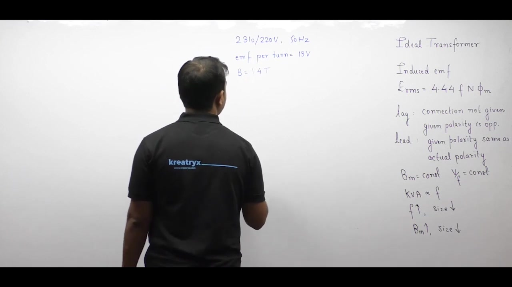
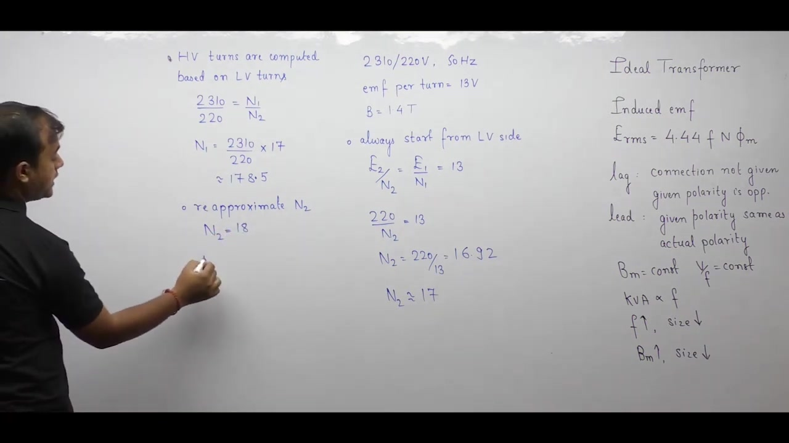
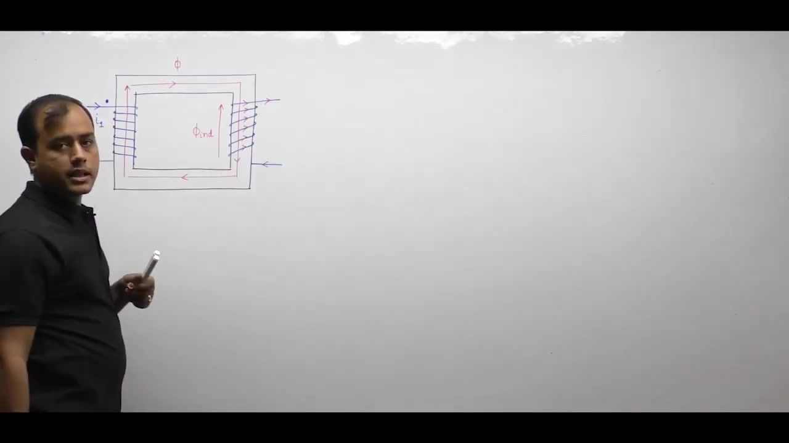
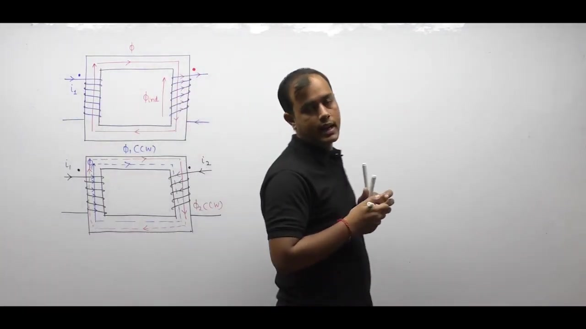
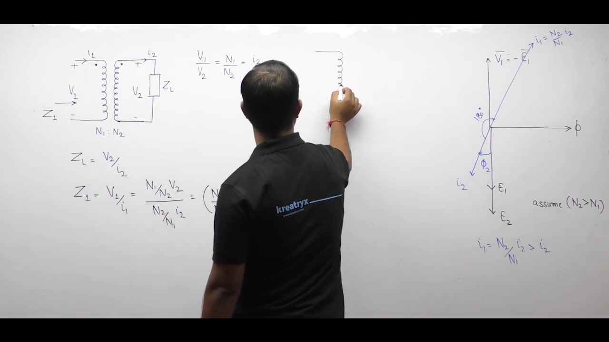
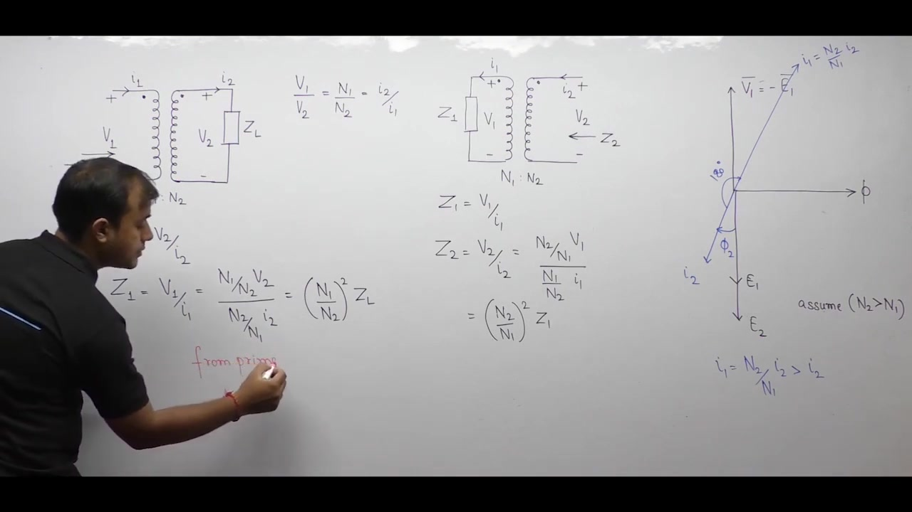
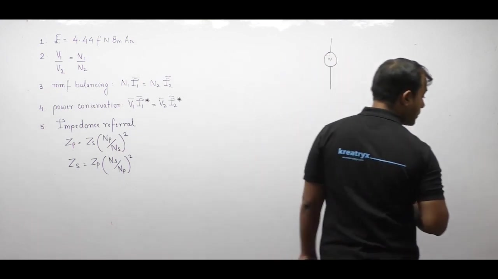

# Electrical Machines | Lec 11 | Ideal Transformer (Part 2) | GATE Electrical Engineering

- **Source**: https://www.youtube.com/watch?v=zLFJN6WhM10
- **Duration**: 00:49:28
- **Compiled**: 2026-09-19

---

## Overview

This lecture completes the theoretical study of the ideal single-phase transformer under loaded conditions. It resolves transformer winding turns design through an iterative approximation method. The analysis establishes the electromagnetic basis of the dot convention and formulates the universal golden rule of transformer currents. It derives MMF balancing and complex power conservation from dual magnetic circuits. Finally, the lecture introduces the general impedance referral principle and demonstrates network simplification on a benchmark power transmission system.

## Contents

- [[#Ideal Transformer Review and Low-Voltage Turns Formulation|Ideal Transformer Review and Low-Voltage Turns Formulation]]
- [[#High-Voltage Turns Optimization and Introduction to Currents|High-Voltage Turns Optimization and Introduction to Currents]]
- [[#The Dot Convention and Polarity in Transformers|The Dot Convention and Polarity in Transformers]]
- [[#Power Flow Conventions and the Golden Rule of Transformers|Power Flow Conventions and the Golden Rule of Transformers]]
- [[#Magnetic Circuit Modeling and MMF Balancing|Magnetic Circuit Modeling and MMF Balancing]]
- [[#Complex Power Conservation and Loaded Phasor Diagrams|Complex Power Conservation and Loaded Phasor Diagrams]]
- [[#Impedance Referral Across Transformer Windings|Impedance Referral Across Transformer Windings]]
- [[#The General Referral Rule, Master Synthesis, and Benchmark Problem|The General Referral Rule, Master Synthesis, and Benchmark Problem]]
- [[#Step-by-Step Circuit Solution via Impedance Referral|Step-by-Step Circuit Solution via Impedance Referral]]

---

## Ideal Transformer Review and Low-Voltage Turns Formulation
_(00:12 - 05:08)_

Before investigating transformer currents, we review the foundational voltage equations from Lecture 10. We also initiate the step-by-step solution to our design problem.

### Synthesis of Ideal Transformer Properties

An ideal transformer combines an ideal core with ideal windings:

1. **Permeability and Reluctance**: The core exhibits infinite permeability ($\mu \to \infty$). Thus, magnetic reluctance vanishes ($\mathcal{R} \to 0$).
2. **Leakage Flux and Magnetizing Current**: Zero reluctance confines all flux to the iron. Leakage flux is zero ($\Phi_l = 0$). The current required to establish core flux is zero ($I_\mu = 0$).
3. **Losses and Linearity**: The B-H curve is strictly linear. Hysteresis loss, eddy current loss, and winding copper loss equal zero ($P_i = 0, P_{\text{cu}} = 0$).

The RMS induced electromotive force in any winding of $N$ turns is:

$$E = 4.44 f N \Phi_m = 4.44 f N B_m A_n$$

### Polarity and Phase Rules

The induced EMF can lead or lag the mutual flux by $90^\circ$:
- **Lagging ($90^\circ$ lag)**: Occurs when the winding connection diagram is omitted. It also occurs when specified polarity opposes the polarity derived from Lenz's law.
- **Leading ($90^\circ$ lead)**: Occurs when the diagram is provided and specified polarity matches the Lenz's law polarity.

The primary applied voltage $V_1$ physically balances the primary back-EMF $E_1$. On phasor diagrams, engineers draw $\vec{V}_1 = -\vec{E}_1$ to illustrate this counter-acting opposition.

### Design Problem: The Cardinal Rule for Turn Calculations

Consider the homework problem assigned at the end of Lecture 10:

> [!example] Problem: Winding Turns Design
> A single-phase, $2310 / 220\text{ V}, 50\text{ Hz}$ transformer has an EMF per turn of $13\text{ V}$. Find the turn counts for both windings and the required core area for $B_m = 1.4\text{ T}$.

When designing transformer windings, always adhere to this fundamental engineering rule:

> [!info] Rule: Design from the Low-Voltage Side
> Always begin transformer turn calculations from the low-voltage (LV) winding.

The induced EMF per turn is identical for both windings:

$$\frac{E_1}{N_1} = \frac{E_2}{N_2} = 13\text{ V}$$

Begin on the low-voltage secondary winding where $E_2 = 220\text{ V}$:

$$\frac{220}{N_2} = 13$$

Solving for secondary turn count $N_2$:

$$
\begin{aligned}
N_2 &= \frac{220}{13} \\
&= 16.923\text{ turns}
\end{aligned}
$$

Because physical windings require integer turns, fractional turn counts are physically impossible. As a first trial, we round $N_2$ to the nearest integer:

$$N_2 \approx 17\text{ turns}$$

In the next section, we verify whether this trial value yields an integer turn count on the high-voltage winding.

## High-Voltage Turns Optimization and Introduction to Currents
_(05:11 - 10:13)_

Calculating transformer turns requires integer results on both windings. We complete the design problem through a systematic iterative approximation.

### High-Voltage Turns Computation via Turns Ratio

The second cardinal rule of transformer design governs the high-voltage winding:

> [!info] Rule: Compute HV Turns from the Turns Ratio
> Never compute high-voltage turns independently from EMF per turn. Always calculate them using the voltage turns ratio based on the chosen LV turns.

The voltage ratio defines the relationship:

$$\frac{N_1}{N_2} = \frac{V_1}{V_2} = \frac{2310}{220} = 10.5$$

Testing the initial trial value $N_2 = 17$:

$$N_1 = 10.5 \times 17 = 178.5\text{ turns}$$

A physical coil cannot have half a turn in standard designs. Simply rounding $N_1$ to $179$ alters the transformation ratio. It also creates a mismatch with the specified terminal voltage.

### The Re-Approximation Technique

When the calculated high-voltage turns result in a fraction, adjust the low-voltage turns. Re-approximate $N_2$ to an adjacent integer, either $16$ or $18$.

Let us select $N_2 = 18$:

$$
\begin{aligned}
N_1 &= 10.5 \times 18 \\
&= 189\text{ turns}
\end{aligned}
$$

Both $N_1 = 189$ and $N_2 = 18$ are exact integers. This selection satisfies all physical and electromagnetic constraints.

Alternatively, choosing $N_2 = 16$ yields:

$$N_1 = 10.5 \times 16 = 168\text{ turns}$$

Both turn combinations represent mathematically valid designs.

### Net Core Area Determination

The second part of the problem requests the net cross-sectional iron area $A_n$. We apply the EMF per turn equation:

$$\frac{E}{N} = 4.44 f B_m A_n$$

Substitute the given numerical parameters ($E/N = 13\text{ V}, f = 50\text{ Hz}, B_m = 1.4\text{ T}$):

$$
\begin{aligned}
13 &= 4.44 \times 50 \times 1.4 \times A_n \\
13 &= 310.8 \times A_n \\
A_n &= \frac{13}{310.8} \approx 0.04183\text{ m}^2
\end{aligned}
$$

In textbook calculations, slight rounding of constants yields approximately $393\text{ cm}^2$ to $418\text{ cm}^2$.

> [!success] Result: Final Turns and Area Design
> The optimal integer winding configuration is:
> $$N_{\text{LV}} = 18\text{ turns}, \quad N_{\text{HV}} = 189\text{ turns}$$
> The net iron core area required is:
> $$A_n \approx 418.3\text{ cm}^2$$

### Transition to Current Analysis and the Dot Convention

Having mastered voltage relationships, we now study transformer currents. In practical electrical machines, currents dictate flux dynamics, MMF balance, and power flow.

Analyzing currents requires the dot convention. The dot convention marks winding terminals that possess the same instantaneous electrical polarity.

## The Dot Convention and Polarity in Transformers
_(10:17 - 16:07)_

When analyzing transformer currents, the dot convention establishes instantaneous terminal polarities and flux directions.

### Physical Method for Assigning Dots

To determine dot locations from the physical winding wrap:

1. Place a reference dot on one primary terminal.
2. Assume primary current enters this dotted terminal.
3. Apply the right-hand grip rule. Curl fingers along current flow. The thumb reveals the direction of mutual core flux $\phi_1$.
4. In our standard core, primary flux flows upward through the left limb and circulates clockwise.
5. According to Lenz's law, the secondary induced flux $\phi_2$ must oppose the applied primary flux.
6. To oppose clockwise flux, the secondary winding must create counter-clockwise flux pointing upward in the right limb.
7. Apply the right-hand grip rule to find the required secondary current direction.
8. Mark the secondary terminal where current leaves the winding with a dot.

Therefore, current enters the primary dot and leaves the secondary dot.

### Additive versus Subtractive Magnetic Polarity

Now consider current flow relative to the dotted terminals in any coupled circuit:

#### Additive Polarity

Suppose current enters the dotted terminals of both windings simultaneously.

Primary current establishes clockwise flux $\phi_1$. Secondary entering current establishes clockwise flux $\phi_2$ through the core. Both fluxes flow in the same direction around the magnetic loop. So the net core flux is the sum of both contributions:

$$\Phi_{\text{net}} = \phi_1 + \phi_2$$

This condition represents additive polarity.

#### Subtractive Polarity

Now suppose current enters the dot on one winding and leaves the dot on the other winding.

The secondary current produces a flux $\phi_2$ that directly opposes primary flux $\phi_1$. The net core flux equals the difference of the two fluxes:

$$\Phi_{\text{net}} = \phi_1 - \phi_2$$

This condition represents subtractive polarity.

> [!info] Definition: Coupled Circuit Polarities
> 1. **Additive Polarity**: Currents enter both dotted terminals simultaneously, adding mutual fluxes.
> 2. **Subtractive Polarity**: Current enters one dotted terminal and leaves the other, subtracting mutual fluxes.

### Lenz's Law Mandate in Transformers

Lenz's law states that an induced effect always opposes its cause. In a transformer, the cause of induction is the primary core flux.

Therefore, the secondary winding must oppose the applied core flux during power transfer. Normal transformer operation is inherently subtractive. Current must enter one dotted terminal and leave the other dotted terminal.

## Power Flow Conventions and the Golden Rule of Transformers
_(16:11 - 22:17)_

Two independent physical principles explain why currents enter one dot and leave the other. These are power transfer conventions and magnetic flux opposition.

### Terminal Sign Convention for Power Delivery and Absorption

In electrical circuit theory, the relative direction of current and potential dictates power flow:

1. **Power Delivered**:
   When current leaves the positive (+) terminal of a component, that component delivers electrical power to the network.
2. **Power Absorbed**:
   When current enters the positive (+) terminal of a component, that component absorbs electrical power from the network.

### Power Flow in the Complete Transformer System

Consider an AC source driving a transformer connected to a load impedance:

1. **Source to Primary**:
   Current leaves the positive terminal of the AC source. Current enters the positive dotted terminal of the primary winding. Therefore, the source delivers power and the primary winding absorbs power.
2. **Secondary to Load**:
   Current leaves the positive dotted terminal of the secondary winding. Current enters the positive terminal of the load. Therefore, the secondary winding delivers power and the load absorbs power.

Both dotted terminals share the same electrical polarity mark (+). To absorb power, primary current must enter the primary dot. To deliver power, secondary current must leave the secondary dot.

> [!info] Principle: Two Independent Explanations
> The current direction through a transformer follows two consistent physical laws:
> 1. **Thermodynamic Law**: Power is absorbed on the primary and delivered on the secondary.
> 2. **Electromagnetic Law**: Lenz's law requires secondary flux to oppose primary flux.

### The Golden Rule of Transformers

This behavior establishes a universal operating rule for transformers:

> [!success] Result: The Golden Rule of Transformer Currents
> In any operating transformer:
> **Current enters the dotted terminal on one side and leaves the dotted terminal on the other side.**

This golden rule applies across all power engineering. It is critical when connecting differential protection relays and instrument transformers.

## Magnetic Circuit Modeling and MMF Balancing
_(22:17 - 27:03)_

We analyze the dual magnetic circuit to understand how secondary current influences primary current under electrical load.

### Dual Magnetic Circuit Analogy

We model the magnetic core using electrical circuit analogies:
- Magnetomotive force (MMF) corresponds to an electrical voltage source.
- Magnetic flux ($\Phi$) corresponds to electric current.
- Core reluctance ($\mathcal{R}$) corresponds to electrical resistance.

The primary winding produces an MMF equal to:

$$\mathcal{F}_1 = N_1 I_1$$

The secondary winding produces an MMF equal to:

$$\mathcal{F}_2 = N_2 I_2$$

The polarity of each MMF source follows flux circulation. Magnetic flux always leaves the positive terminal of an active MMF source.

### The Zero Net MMF Requirement

For an ideal transformer, core permeability is infinite ($\mu \to \infty$). Thus, core reluctance is zero:

$$\mathcal{R} = 0$$

For a finite alternating core flux $\Phi$, the net MMF driving the core is:

$$\text{MMF}_{\text{net}} = \Phi \times \mathcal{R} = \Phi \times 0 = 0$$

Zero reluctance acts as a magnetic short circuit across the two parallel MMF sources.

### Derivation of MMF Balancing

According to Kirchhoff's Voltage Law applied to the magnetic loop, two parallel sources connected across zero reluctance must balance each other:

$$N_1 I_1 - N_2 I_2 = 0$$

Rearranging yields the MMF balance condition:

$$N_1 I_1 = N_2 I_2$$

> [!info] Definition: MMF Balancing
> The secondary load current creates a demagnetizing MMF ($N_2 I_2$). The primary winding immediately draws a balancing current ($I_1$) such that $N_1 I_1 = N_2 I_2$. This keeps net core flux constant.

### Current Transformation Ratio

Solving the MMF balance equation for the current ratio gives:

$$\frac{I_1}{I_2} = \frac{N_2}{N_1}$$

Current transforms inversely with turn count:

$$I \propto \frac{1}{N}$$

The winding with higher voltage and more turns carries proportionally smaller current.

Combining voltage and current ratios gives the unified transformation relationship:

$$\frac{V_1}{V_2} = \frac{N_1}{N_2} = \frac{I_2}{I_1}$$

Because the turns ratio $N_2 / N_1$ is a pure real scalar, its complex conjugate is identical:

$$\frac{I_1^*}{I_2^*} = \frac{N_2}{N_1} = \frac{V_2}{V_1}$$

This scalar equality directly underpins complex power conservation.

## Complex Power Conservation and Loaded Phasor Diagrams
_(27:05 - 33:19)_

An ideal transformer transfers energy between circuits with zero loss. This preserves both real power and reactive power.

### Conservation of Complex Power

From the scalar turns ratio relationship:

$$\frac{I_1^*}{I_2^*} = \frac{V_2}{V_1}$$

Cross-multiplying these phasor quantities:

$$V_1 I_1^* = V_2 I_2^*$$

The product of voltage and current conjugate defines complex power ($S = V I^*$):

$$S_1 = S_2$$

Expanding into real and reactive components ($S = P + jQ$):

$$P_1 + jQ_1 = P_2 + jQ_2$$

Equating real and imaginary parts:

$$P_1 = P_2, \quad Q_1 = Q_2$$

> [!success] Result: Power Conservation
> An ideal transformer consumes zero real and zero reactive power. All real and reactive power supplied by the primary source transfers directly to the secondary load.

### Constructing the Phasor Diagram under Load

Consider an inductive load operating at a lagging power factor ($\cos\phi_2$ lagging):

1. **Reference Core Flux**: Draw mutual flux $\Phi$ along the horizontal real axis at $0^\circ$.
2. **Induced Voltages**: Draw $E_1$ and $E_2$ lagging flux by $90^\circ$ along the negative imaginary axis ($-90^\circ$).
3. **Terminal Voltages**: Primary applied voltage $V_1$ opposes back-EMF $E_1$. Draw $V_1$ vertically upward ($+90^\circ$). The secondary terminal voltage equals induced EMF: $V_2 = E_2$.
4. **Secondary Current**: For a lagging load, secondary current $I_2$ lags terminal voltage $V_2$ by angle $\phi_2$.
5. **Primary Current**: Primary current has magnitude $I_1 = (N_2 / N_1) I_2$.

### Graphical Representation versus Numerical Calculations

On the phasor diagram, engineers draw primary current $I_1$ rotated $180^\circ$ relative to secondary current $I_2$. This opposing orientation visually displays MMF cancellation and Lenz's law.

However, in numerical circuit analysis, both currents share the identical phase angle:

$$\angle I_1 = \angle I_2 = -\phi_2$$

> [!info] Crucial Rule: Phasor Sign in Numerical Problems
> Never add a $180^\circ$ phase shift to primary current during numerical circuit calculations. The opposite phasor orientation is strictly a visual convention to illustrate MMF balancing.

## Impedance Referral Across Transformer Windings
_(33:19 - 38:15)_

Transformers change voltage and current levels. So they transform electrical impedance seen from either winding.

### Definition of Impedance Referral

Impedance referral is the mathematical technique of transferring an electrical impedance from one side of a transformer to the other.

> [!info] Definition: Impedance Referral
> When an impedance connected on one side of a transformer is replaced by an equivalent impedance on the other side, the process is called impedance referral.

This operation allows engineers to eliminate magnetic couplings and analyze networks as simple single-mesh circuits.

### Referring Secondary Load Impedance to the Primary Side

Consider a load impedance $Z_L$ connected across secondary terminals with $N_2$ turns:

$$Z_L = \frac{V_2}{I_2}$$

We determine the effective input impedance $Z_1$ seen looking into the primary winding:

$$Z_1 = \frac{V_1}{I_1}$$

Express primary voltage and current using the turns ratio:

$$V_1 = \left(\frac{N_1}{N_2}\right) V_2$$

$$I_1 = \left(\frac{N_2}{N_1}\right) I_2$$

Substitute these relations into the expression for $Z_1$:

$$
\begin{aligned}
Z_1 &= \frac{\left(\frac{N_1}{N_2}\right) V_2}{\left(\frac{N_2}{N_1}\right) I_2} \\
&= \left(\frac{N_1}{N_2}\right) \left(\frac{N_1}{N_2}\right) \left(\frac{V_2}{I_2}\right) \\
&= \left(\frac{N_1}{N_2}\right)^2 Z_L
\end{aligned}
$$

The load impedance transferred to the primary scales with the square of the turns ratio.

### Referring Primary Impedance to the Secondary Side

Now consider an impedance $Z_1$ connected on the primary side:

$$Z_1 = \frac{V_1}{I_1}$$

We determine the equivalent impedance $Z_2$ seen looking from the secondary terminals:

$$Z_2 = \frac{V_2}{I_2}$$

Express secondary voltage and current in terms of primary quantities:

$$V_2 = \left(\frac{N_2}{N_1}\right) V_1$$

$$I_2 = \left(\frac{N_1}{N_2}\right) I_1$$

Substitute these values into $Z_2$:

$$
\begin{aligned}
Z_2 &= \frac{\left(\frac{N_2}{N_1}\right) V_1}{\left(\frac{N_1}{N_2}\right) I_1} \\
&= \left(\frac{N_2}{N_1}\right)^2 \left(\frac{V_1}{I_1}\right) \\
&= \left(\frac{N_2}{N_1}\right)^2 Z_1
\end{aligned}
$$

> [!success] Result: Impedance Transformation Relations
> 1. Secondary impedance referred to primary:
>    $$Z_1 = \left(\frac{N_1}{N_2}\right)^2 Z_L$$
> 2. Primary impedance referred to secondary:
>    $$Z_2 = \left(\frac{N_2}{N_1}\right)^2 Z_1$$

## The General Referral Rule, Master Synthesis, and Benchmark Problem
_(38:15 - 44:00)_

We generalize the impedance transformation rule into a memorable formulation. We also review all ideal transformer relationships before tackling a complete power transmission problem.

### The General Destination-over-Source Rule

A simple universal mnemonic governs impedance referral between any two transformer windings:

> [!info] Rule: Destination-over-Source Squared
> To transfer an impedance from a source winding to a destination winding, multiply by the square of the turns ratio:
> $$Z_{\text{dest}} = Z_{\text{source}} \times \left(\frac{N_{\text{destination}}}{N_{\text{source}}}\right)^2$$

Here:
- $N_{\text{destination}}$ is the turn count of the winding you are referring toward.
- $N_{\text{source}}$ is the turn count of the winding where the impedance originally resides.

When transferring from secondary to primary:

$$Z_1 = Z_2 \times \left(\frac{N_1}{N_2}\right)^2$$

When transferring from primary to secondary:

$$Z_2 = Z_1 \times \left(\frac{N_2}{N_1}\right)^2$$

This rule applies to resistances, reactances, and complex impedances alike.

---

### Master Synthesis: The Five Pillars of Ideal Transformers

All calculations on ideal transformers rely on five core mathematical equations:

1. **Induced EMF Equation**:
   $$E = 4.44 f N \Phi_m = 4.44 f N B_m A_n$$
2. **Voltage Transformation Ratio**:
   $$\frac{V_1}{V_2} = \frac{N_1}{N_2}$$
3. **MMF Balancing**:
   $$N_1 I_1 = N_2 I_2 \implies \frac{I_1}{I_2} = \frac{N_2}{N_1}$$
4. **Complex Power Conservation**:
   $$V_1 I_1^* = V_2 I_2^* \implies S_1 = S_2$$
5. **Impedance Referral**:
   $$Z' = Z \times \left(\frac{N_{\text{dest}}}{N_{\text{src}}}\right)^2$$

---

### Benchmark Practical Problem

To demonstrate these principles, consider a full power distribution system:

> [!example] Problem: Transmission Line with Two Ideal Transformers
> A single-phase power system contains a $480\text{ V}, 60\text{ Hz}$ generator.
> The generator connects to a $1:10$ step-up transformer at the sending end.
> A transmission line connects the sending and receiving ends with impedance:
> $$Z_{\text{line}} = (0.18 + j0.24)\,\Omega$$
> A $10:1$ step-down transformer is placed at the load end.
> The load impedance equals:
> $$Z_{\text{load}} = (4 + j3)\,\Omega$$
> Calculate the terminal voltage magnitude across the load.

In the final section, we eliminate both transformers via impedance referral to solve this network.

## Step-by-Step Circuit Solution via Impedance Referral
_(44:33 - 49:20)_

Instead of solving three simultaneous mesh equations, we refer all components to the load side. This reduces the entire power system to a single loop.

### Step 1: Referring Across the Step-Up Transformer

First, refer the $480\text{ V}$ generator across transformer $T_1$ ($1:10$ step-up).

The intermediate transmission line voltage $V_2$ becomes:

$$
\begin{aligned}
V_2 &= V_1 \left(\frac{N_2}{N_1}\right) \\
&= 480 \times \left(\frac{10}{1}\right) \\
&= 4800\text{ V}
\end{aligned}
$$

The circuit now contains only the transmission line, transformer $T_2$, and the load.

### Step 2: Referring Across the Step-Down Transformer

Next, transfer both the $4800\text{ V}$ source and the transmission line impedance across transformer $T_2$ ($10:1$ step-down).

The referred source voltage at the load terminals is:

$$V_3 = 4800 \times \left(\frac{1}{10}\right) = 480\text{ V}$$

Apply the general destination-over-source squared rule to the line impedance:

$$
\begin{aligned}
Z_{\text{line}}' &= Z_{\text{line}} \times \left(\frac{N_{\text{dest}}}{N_{\text{src}}}\right)^2 \\
&= (0.18 + j0.24) \times \left(\frac{1}{10}\right)^2 \\
&= \frac{0.18 + j0.24}{100} \\
&= (0.0018 + j0.0024)\,\Omega
\end{aligned}
$$

Both transformers are now eliminated from the network.

### Step 3: Single-Mesh Series Equivalent Circuit

The simplified network consists of a single loop:
- Ideal voltage source: $V_s = 480\angle 0^\circ\text{ V}$.
- Referred transmission line impedance: $Z_{\text{line}}' = (0.0018 + j0.0024)\,\Omega$.
- Load impedance: $Z_{\text{load}} = (4 + j3)\,\Omega$.

Calculate the total series impedance of the circuit:

$$
\begin{aligned}
Z_{\text{total}} &= Z_{\text{line}}' + Z_{\text{load}} \\
&= (0.0018 + j0.0024) + (4 + j3) \\
&= (4.0018 + j3.0024)\,\Omega
\end{aligned}
$$

### Step 4: Voltage Division and Load Voltage Calculation

Using the AC voltage divider formula, the load voltage is:

$$V_L = V_s \times \frac{Z_{\text{load}}}{Z_{\text{total}}} = 480 \times \frac{4 + j3}{4.0018 + j3.0024}$$

Evaluate the magnitude of the numerator impedance:

$$|4 + j3| = \sqrt{4^2 + 3^2} = 5\,\Omega$$

Evaluate the magnitude of the total series impedance:

$$
\begin{aligned}
|4.0018 + j3.0024| &= \sqrt{4.0018^2 + 3.0024^2} \\
&= \sqrt{16.0144 + 9.0144} \\
&= \sqrt{25.0288} \approx 5.00288\,\Omega
\end{aligned}
$$

Compute the magnitude of the load voltage:

$$
\begin{aligned}
|V_L| &= 480 \times \frac{5}{5.00288} \\
&\approx 479.72\text{ V}
\end{aligned}
$$

Rounding to one decimal place gives:

$$|V_L| \approx 479.7\text{ V}$$

> [!success] Result: Load Voltage
> The voltage magnitude delivered across the load is:
> $$|V_L| \approx 479.7\text{ V}$$
> Stepping up transmission voltage by 10 reduced line impedance effects by $100$ ($10^2$). This kept load voltage near the rated $480\text{ V}$.

### Conclusion of the Ideal Transformer Module

This completes the comprehensive study of the ideal transformer. We covered induced voltage, current reflection, MMF balance, and impedance referral. In the next lecture, we begin analyzing practical transformers with winding resistance, leakage flux, and core losses.

---

## Summary and Key Takeaways

- Transformer turn design must start from the low-voltage winding ($N_{\text{LV}}$), with high-voltage turns computed via the turns ratio to ensure both windings achieve integer turn counts.
- The dot convention marks terminals of identical instantaneous polarity, where additive polarity adds mutual fluxes ($\Phi_1 + \Phi_2$) and subtractive polarity subtracts them ($\Phi_1 - \Phi_2$).
- Under the golden rule of transformer currents, current enters the dotted terminal on one side and leaves the dotted terminal on the other side.
- Zero core reluctance ($\mathcal{R} = 0$) forces net driving MMF to zero, establishing exact primary and secondary MMF balance: $N_1 I_1 = N_2 I_2$.
- Complex power is strictly conserved across ideal windings ($S_1 = S_2$), meaning the transformer absorbs zero real power and zero reactive power.
- On loaded phasor diagrams, primary and secondary currents are drawn $180^\circ$ opposite to display MMF cancellation, although numerically they share the identical phase angle.
- Any electrical impedance transfers across windings according to the general destination-over-source squared rule: $Z_{\text{dest}} = Z_{\text{source}} \times (N_{\text{destination}} / N_{\text{source}})^2$.
- Multi-transformer transmission circuits reduce to a single-mesh network by referring sources and line impedances directly to the load terminals.

