[← Lec 015: Ideal Transformer Part 2](Lecture_015_Ideal_Transformer_Part_2.md) | [🏠 Index](00_yt_study_guide.md) | [Lec 017: Practical Transformer Part 1 →](Lecture_017_Practical_Transformer_Part_1.md)

---

# Problems Based on Ideal Transformer | L5 | Electrical Machines | GATE 2022

- **Source**: https://www.youtube.com/watch?v=6kjfz_rje-Y
- **Duration**: 01:06:42
- **Compiled**: 2026-09-19

---

## Overview

This lecture presents problem-solving techniques for single-phase and multi-winding ideal transformers. It demonstrates both phasor branch analysis and direct complex power balancing across diverse circuit configurations. Key topics include power factor improvement with shunt reactances, turns ratio impedance matching, and transmission voltage regulation. In addition, the session examines frequency scaling of transformer leakage impedance and physical polarity markings based on Lenz's law.

## Contents

- [[#Introduction to Ideal Transformer Practice and Problem Setup|Introduction to Ideal Transformer Practice and Problem Setup]]
- [[#Problem 1 Solution: Phasor and Current Cancellation Method|Problem 1 Solution: Phasor and Current Cancellation Method]]
- [[#Power Balancing Method and Three-Winding Transformer Polarity|Power Balancing Method and Three-Winding Transformer Polarity]]
- [[#Quantitative Solution of Three-Winding Transformer and Problem 3 Preview|Quantitative Solution of Three-Winding Transformer and Problem 3 Preview]]
- [[#Multi-Stage Transformer Transmission and Frequency-Dependent Short-Circuit Modeling|Multi-Stage Transformer Transmission and Frequency-Dependent Short-Circuit Modeling]]
- [[#Short-Circuit Impedance Scaling and Problem 5 Setup|Short-Circuit Impedance Scaling and Problem 5 Setup]]
- [[#Total Primary Current with No-Load and Load Components|Total Primary Current with No-Load and Load Components]]
- [[#Direct Impedance Ratio Technique and Impedance Matching for Maximum Power Transfer|Direct Impedance Ratio Technique and Impedance Matching for Maximum Power Transfer]]
- [[#Turns Ratio Conventions and Complete Ideal Transformer Analysis|Turns Ratio Conventions and Complete Ideal Transformer Analysis]]
- [[#Multi-Load Tapped Transformer Analysis Using Complex Power Balance|Multi-Load Tapped Transformer Analysis Using Complex Power Balance]]
- [[#DC Transformer Operation Limitations and Inductor Sign Conventions|DC Transformer Operation Limitations and Inductor Sign Conventions]]
- [[#Ideal Transformer Phasor Diagrams and Tapped Winding Power Conservation|Ideal Transformer Phasor Diagrams and Tapped Winding Power Conservation]]
- [[#Session Conclusion and Problem Solving Summary|Session Conclusion and Problem Solving Summary]]

---

## Introduction to Ideal Transformer Practice and Problem Setup
_(00:13 - 05:02)_

Ideal transformers provide a benchmark for understanding coupled magnetic circuits. In an ideal transformer, the core permeability is infinite. The winding resistances and leakage fluxes are zero. Core losses do not exist. In competitive examinations like GATE, ideal transformer problems test basic circuit laws and phasor concepts.

### Overview of Problem Solving Methodology

Solving transformer circuits requires establishing clear reference conventions. Always select one voltage as a reference phasor with zero phase angle. Then determine currents and branch impedances relative to this reference. Referring parameters across windings preserves real and reactive power.

### Power Factor Correction with Ideal Transformer

The first problem examines power factor improvement in a circuit containing an ideal transformer.

> [!example] Problem 1
> A load absorbs $4\text{ kW}$ at a power factor of $0.89$ lagging. The load connects to the secondary of an ideal $2:1$ step-down transformer. The secondary voltage is $110\text{ V}$. A reactance $X$ connects in parallel across the primary terminals where the source voltage is $220\text{ V}$. Determine the value of reactance $X$ needed to improve the overall source power factor to unity.

### Circuit Modeling and Reference Selection

We define the secondary terminal voltage as the reference phasor:
$$V_2 = 110\angle 0^\circ\text{ V}$$

The transformer turns ratio is:
$$a = \frac{N_1}{N_2} = \frac{2}{1} = 2$$

The primary winding voltage is:
$$V_1 = a V_2 = 2 \times 110\angle 0^\circ = 220\angle 0^\circ\text{ V}$$

The load draws real power $P = 4\text{ kW}$ at a lagging power factor $\cos\phi = 0.89$. Because the current lags the reference voltage, the load current phase angle is negative:
$$\phi = \cos^{-1}(0.89) \approx 27.13^\circ$$

To achieve unity power factor at the primary supply terminals, the reactive power supplied by the parallel element $X$ must balance the reactive power drawn by the load.

## Problem 1 Solution: Phasor and Current Cancellation Method
_(05:02 - 10:20)_

In the first solution method, we analyze the circuit using branch currents and phasors. We calculate the secondary load current and refer it to the primary side. Then we select the reactance current to cancel the lagging reactive component.

### Determination of Secondary and Referred Primary Currents

The secondary real power equation is:
$$P = V_2 I_2 \cos\phi$$

Substituting the numerical values yields the secondary current magnitude:
$$\begin{aligned} 4000 &= 110 \times I_2 \times 0.89 \\ I_2 &= \frac{4000}{110 \times 0.89} \approx 40.858\text{ A} \end{aligned}$$

The power factor angle is:
$$\phi = \cos^{-1}(0.89) \approx 27.126^\circ$$

Because the load draws a lagging current, the secondary current phasor is:
$$I_2 = 40.858\angle -27.126^\circ\text{ A}$$

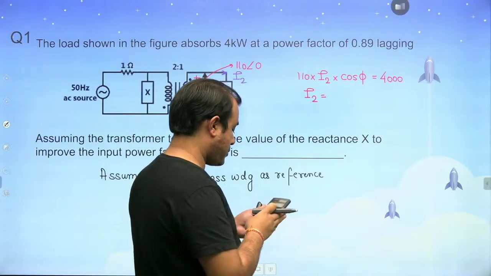

The primary-referred load current $I_1'$ relates to $I_2$ through the turns ratio:
$$\begin{aligned} I_1' &= I_2 \times \frac{N_2}{N_1} \\ I_1' &= 40.858\angle -27.126^\circ \times \frac{1}{2} = 20.429\angle -27.126^\circ\text{ A} \end{aligned}$$

Expressed in rectangular form:
$$\begin{aligned} I_1' &= 20.429 \cos(27.126^\circ) - j 20.429 \sin(27.126^\circ) \\ I_1' &= 18.182 - j 9.314\text{ A} \end{aligned}$$

### Unity Power Factor Condition via Parallel Reactance

At the primary junction, Kirchhoff's Current Law gives the total source current:
$$I_1 = I_1' + I_X$$

The primary voltage is chosen as reference:
$$V_1 = 220\angle 0^\circ\text{ V}$$

A pure reactance branch current is purely imaginary. For an inductor, current lags voltage by $90^\circ$. For a capacitor, current leads voltage by $90^\circ$. To achieve unity power factor, the net source current $I_1$ must be purely real. Therefore, the reactance current must cancel the imaginary part of $I_1'$:
$$I_X = -\text{Im}(I_1') = +j 9.314\text{ A}$$

Because the reactive current is positive imaginary, it leads the reference voltage by $90^\circ$. Thus the parallel branch must be a capacitor.

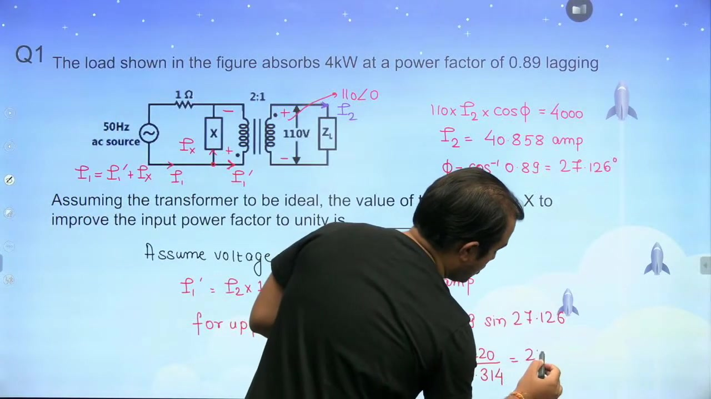

### Evaluation of the Required Reactance

The magnitude of the parallel branch current is:
$$|I_X| = 20.429 \sin(27.126^\circ) \approx 9.314\text{ A}$$

The primary voltage across the parallel branch is $220\text{ V}$. The magnitude of the required reactance is:
$$X = \frac{V_1}{|I_X|} = \frac{220}{9.314} \approx 23.6\,\Omega$$

> [!success] Result
> To achieve unity power factor at the source terminals, the required parallel branch is a capacitive reactance of $X \approx 23.6\,\Omega$.

## Power Balancing Method and Three-Winding Transformer Polarity
_(10:23 - 16:43)_

Power balancing provides an elegant alternative to branch current calculations. For unity power factor, the net reactive power supplied by the source must be zero. In addition, multi-winding transformers require rigorous polarity analysis to apply Lenz's law correctly.

### Power Balancing Method for Problem 1

Instead of computing phasors, we balance real and reactive power directly. An ideal transformer neither absorbs nor supplies reactive power. At unity power factor, the source supplies only active power:
$$Q_{\text{source}} = 0$$

Therefore, the reactive power demanded by the load must equal the reactive power supplied by the parallel reactance:
$$Q_X = Q_{\text{load}}$$

The load absorbs active power $P = 4\text{ kW}$ at $\cos\phi = 0.89$ lagging. The phase angle is $\phi = 27.126^\circ$. The reactive power consumed by the load is:
$$Q_{\text{load}} = P \tan\phi = 4000 \times \tan(27.126^\circ) \approx 2049.5\text{ VAR}$$

Because capacitors supply reactive power, element $X$ must be a capacitor. The reactive power supplied by a capacitor connected across primary voltage $V_1 = 220\text{ V}$ is:
$$Q_X = \frac{V_1^2}{X}$$

Equating the two expressions:
$$\begin{aligned} \frac{220^2}{X} &= 2049.5 \\ X &= \frac{48400}{2049.5} \approx 23.6\,\Omega \end{aligned}$$

This confirms the previous result without calculating any intermediate current phasors.

### Three-Winding Transformer Problem Setup

The second problem involves an ideal transformer with three distinct windings on a common magnetic core.

> [!example] Problem 2
> An ideal transformer has three windings: $N_1 = 100$ turns on the primary, $N_2 = 160$ turns on the secondary, and $N_3 = 60$ turns on the tertiary. The secondary supplies $10\text{ A}$ to a purely resistive load. The tertiary draws $20\text{ A}$ at a capacitive power factor.
> 1. Find the primary current $I_1$ and the overall input power factor.
> 2. Determine the polarity markings on the secondary and tertiary windings.

### Physical Polarity Determination Using Lenz's Law

To find terminal polarities, we trace physical winding senses and magnetic flux directions. The primary winding draws energy from the supply. Current enters the positive terminal of the primary winding.

By the right-hand grip rule, this primary current establishes a clockwise main core flux $\Phi_1$. Lenz's law dictates that induced currents in secondary and tertiary windings must oppose any change in core flux. Therefore, secondary and tertiary currents must establish counter-clockwise fluxes $\Phi_2$ and $\Phi_3$.

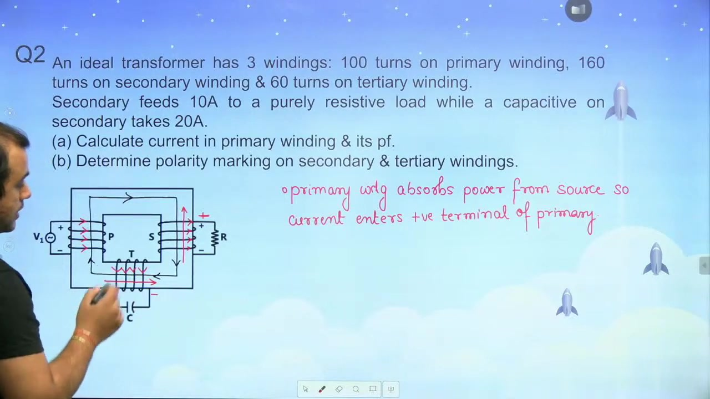

In an energy-delivering winding, current leaves the positive terminal. Applying the right-hand rule to the secondary winding reveals that upward current opposes primary flux. So current leaves the upper secondary terminal, making it positive.

On the tertiary winding, current must flow downward in the outer limb conductors to oppose the clockwise flux. So current leaves the lower tertiary terminal, making that terminal positive.

## Quantitative Solution of Three-Winding Transformer and Problem 3 Preview
_(16:43 - 21:38)_

Multi-winding transformers maintain zero net core magnetomotive force under ideal operating conditions. By balancing primary ampere-turns against secondary and tertiary ampere-turns, we determine the magnitude and phase of the primary current.

### Ampere-Turns Balance in Multi-Winding Transformers

We select the common winding voltage as the reference phasor:
$$V = V\angle 0^\circ$$

The secondary load is purely resistive. Its current is in phase with the voltage:
$$I_2 = 10\angle 0^\circ\text{ A}$$

The tertiary load is purely capacitive. Capacitor current leads voltage by $90^\circ$:
$$I_3 = 20\angle +90^\circ = +j 20\text{ A}$$

In an ideal core with infinite permeability, the net magnetomotive force is zero:
$$N_1 I_1 - N_2 I_2 - N_3 I_3 = 0$$

Rearranging for the primary ampere-turns:
$$N_1 I_1 = N_2 I_2 + N_3 I_3$$

Substituting the given turns numbers:
$$\begin{aligned} 100 I_1 &= 160 (10\angle 0^\circ) + 60 (20\angle +90^\circ) \\ 100 I_1 &= 1600 + j 1200 \end{aligned}$$

Dividing by $N_1 = 100$:
$$I_1 = 16 + j 12\text{ A}$$

### Primary Current Magnitude and Power Factor

We convert the primary current from rectangular to polar form:
$$|I_1| = \sqrt{16^2 + 12^2} = \sqrt{256 + 144} = \sqrt{400} = 20\text{ A}$$

The phase angle is:
$$\phi_1 = \tan^{-1}\left(\frac{12}{16}\right) = \tan^{-1}(0.75) \approx 36.87^\circ$$

Because the angle is positive, the primary current leads the primary voltage. The input power factor is:
$$\cos\phi_1 = \cos(36.87^\circ) = 0.8\text{ leading}$$

> [!success] Result
> The primary winding draws $I_1 = 20\text{ A}$ at an input power factor of $0.8\text{ leading}$.

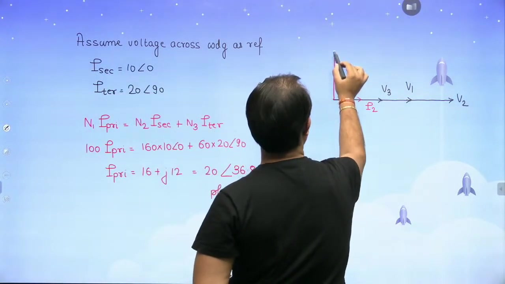

### Phasor Diagram Construction

In the phasor diagram, voltages $V_1, V_2, V_3$ lie along the reference horizontal axis. Secondary current $I_2$ lies directly along the real axis. Tertiary current $I_3$ points along the positive imaginary axis.

The primary current $I_1$ reflects both components. It lies in the first quadrant, confirming leading power factor operation. Power balancing cannot be applied here directly because the actual voltage values are not specified.

### Problem 3 Setup: Power System with Transmission Line

Next, we consider a power transmission problem involving two ideal transformers.

> [!example] Problem 3
> A single-phase system consists of a $480\text{ V}, 60\text{ Hz}$ generator supplying a load through a transmission line. A $1:10$ step-up transformer connects at the generator terminal. A $10:1$ step-down transformer connects at the load terminal. The transmission line impedance is $Z_{\text{line}} = 0.18 + j0.24\,\Omega$. The load impedance is $Z_L = 4 + j3\,\Omega$. Find the magnitude of the load voltage.

## Multi-Stage Transformer Transmission and Frequency-Dependent Short-Circuit Modeling
_(21:59 - 28:12)_

Power systems use transformers to raise voltage for transmission and reduce it for consumption. Analyzing cascaded transformers is simplified by referring all impedances and voltages to a single reference section.

### Solution of Problem 3: Referring to the Load Side

Consider the transmission system with two transformers. We can refer all network elements to the generator side or to the load side. Referring to the load side is direct and convenient.

The generator source voltage is $480\text{ V}$. It passes through a $1:10$ step-up transformer and then through a $10:1$ step-down transformer. The equivalent source voltage appearing on the load side is:
$$V_{\text{src}}' = 480 \times 10 \times \frac{1}{10} = 480\text{ V}$$

The transmission line impedance is between the two transformers:
$$Z_{\text{line}} = 0.18 + j0.24\,\Omega$$

We transfer this impedance across the second transformer to the load side. The destination side has $1$ turn for every $10$ turns on the source side. The impedance transformation ratio is:
$$a_z = \left(\frac{N_{\text{dest}}}{N_{\text{src}}}\right)^2 = \left(\frac{1}{10}\right)^2 = \frac{1}{100}$$

The line impedance referred to the load side becomes:
$$Z_{\text{line}}' = \frac{0.18 + j0.24}{100} = 0.0018 + j0.0024\,\Omega$$

The load impedance remains in place:
$$Z_L = 4 + j3\,\Omega$$

### Load Voltage Evaluation via Voltage Division

The total circuit impedance seen by the referred source is:
$$Z_{\text{total}} = Z_{\text{line}}' + Z_L = (0.0018 + 4) + j(0.0024 + 3) = 4.0018 + j3.0024\,\Omega$$

By the voltage divider rule, the load voltage is:
$$V_L = V_{\text{src}}' \times \frac{Z_L}{Z_{\text{total}}} = 480 \times \frac{4 + j3}{4.0018 + j3.0024}$$

We calculate the magnitude of the numerator and denominator:
$$\begin{aligned} |4 + j3| &= \sqrt{4^2 + 3^2} = 5\,\Omega \\ |4.0018 + j3.0024| &= \sqrt{4.0018^2 + 3.0024^2} \approx 5.0027\,\Omega \end{aligned}$$

The load voltage magnitude is:
$$|V_L| = 480 \times \frac{5}{5.0027} \approx 479.7\text{ V}$$

> [!success] Result
> The terminal voltage across the load is $V_L \approx 479.7\text{ V}$.

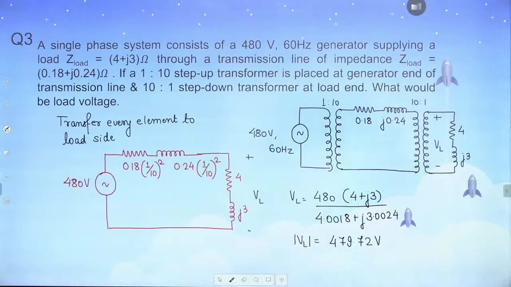

### Problem 4 Setup: Short-Circuit Current Frequency Dependency

The next problem explores how changing supply frequency affects short-circuit current.

> [!example] Problem 4
> A $50\text{ Hz}$ single-phase transformer draws a short-circuit current of $30\text{ A}$ at $0.2$ lagging power factor when connected to a $16\text{ V}, 50\text{ Hz}$ source. Determine the short-circuit current when the transformer is energized from a $16\text{ V}, 25\text{ Hz}$ source.

Under short-circuit conditions, the shunt magnetizing branch draws negligible current. The equivalent circuit reduces to the series combination of winding resistance $R$ and leakage reactance $X$.

## Short-Circuit Impedance Scaling and Problem 5 Setup
_(28:15 - 33:11)_

Transformer leakage reactance depends directly on supply frequency. In contrast, winding resistance is essentially constant at power frequencies. Changing the operating frequency alters the impedance triangle and the resulting short-circuit current.

### Extraction of Resistance and Leakage Reactance at 50 Hz

At $50\text{ Hz}$, the short-circuit impedance magnitude is:
$$Z_1 = \frac{V_{sc1}}{I_{sc1}} = \frac{16}{30} \approx 0.5333\,\Omega$$

The lagging power factor is $\cos\phi_1 = 0.2$. The phase angle is:
$$\phi_1 = \cos^{-1}(0.2) \approx 78.463^\circ$$

The equivalent series resistance is:
$$R = Z_1 \cos\phi_1 = 0.5333 \times 0.2 \approx 0.1067\,\Omega$$

The leakage reactance at $50\text{ Hz}$ is:
$$X_{50} = Z_1 \sin\phi_1 = 0.5333 \times \sin(78.463^\circ) \approx 0.5225\,\Omega$$

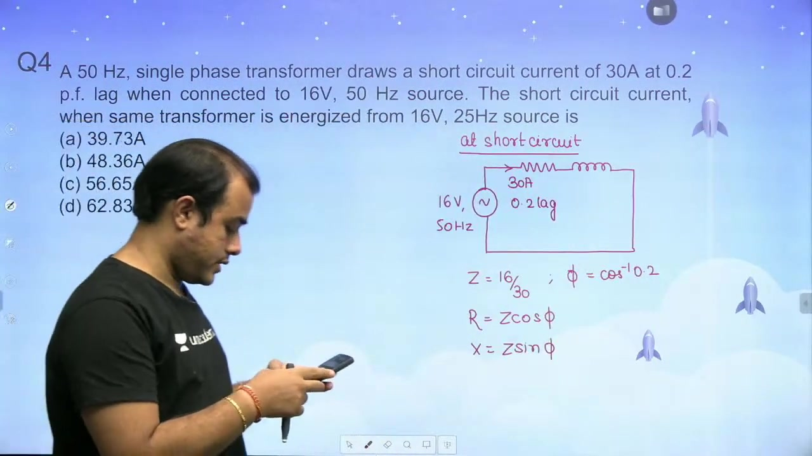

### Scaling Reactance and Current to 25 Hz

Reactance is proportional to frequency because $X = 2\pi f L$. When frequency drops from $50\text{ Hz}$ to $25\text{ Hz}$, the reactance is halved:
$$X_{25} = X_{50} \times \frac{25}{50} = \frac{0.5225}{2} \approx 0.2613\,\Omega$$

The resistance remains unchanged at $R = 0.1067\,\Omega$. The new total impedance magnitude is:
$$Z_{25} = \sqrt{R^2 + X_{25}^2} = \sqrt{0.1067^2 + 0.2613^2} \approx 0.2822\,\Omega$$

The applied voltage is still $16\text{ V}$. The short-circuit current at $25\text{ Hz}$ is:
$$I_{sc2} = \frac{V}{Z_{25}} = \frac{16}{0.2822} \approx 56.69\text{ A}$$

> [!success] Result
> At $25\text{ Hz}$, the short-circuit current is approximately $56.7\text{ A}$. This matches Option C.

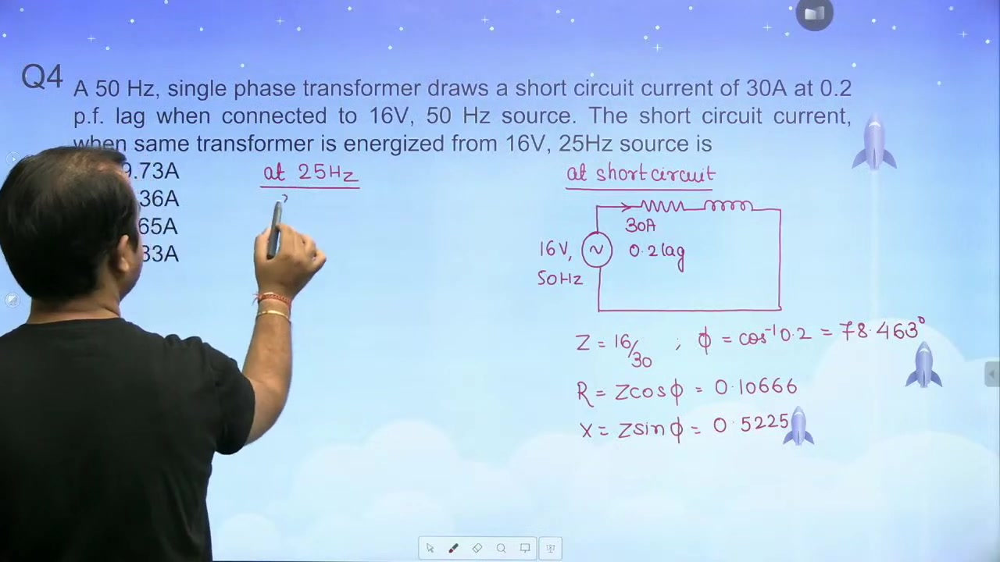

Some students attempt to use a constant $V/f$ ratio. If resistance is negligible, $I = V/X \propto V/f$. Then constant $V/f$ gives constant current. But winding resistance is not negligible here, so impedance must be computed explicitly.

### Problem 5 Setup: Transformer Loading with Magnetizing Branch

The fifth problem analyzes total primary current when both no-load and load currents flow.

> [!example] Problem 5
> A $230/115\text{ V}$ single-phase transformer draws a no-load current of $2\text{ A}$ at $0.2$ lagging power factor when the low-voltage winding is open. On load, the low-voltage winding delivers $15\text{ A}$ at $0.8$ lagging power factor. Find the total primary current drawn from the supply.

## Total Primary Current with No-Load and Load Components
_(33:12 - 38:04)_

When a practical transformer operates on load, the total primary current contains two distinct components. The first component is the no-load excitation current. The second component is the referred load current required to balance secondary demagnetizing ampere-turns.

### Phasor Calculation of Referred Load Current

We choose the secondary terminal voltage as the reference phasor:
$$V_2 = 115\angle 0^\circ\text{ V}$$

The turns ratio is:
$$a = \frac{N_1}{N_2} = \frac{230}{115} = 2$$

The low-voltage secondary delivers $15\text{ A}$ at $0.8$ lagging power factor. The phase angle is:
$$\phi_2 = \cos^{-1}(0.8) \approx 36.87^\circ$$

The secondary current phasor is:
$$I_2 = 15\angle -36.87^\circ\text{ A}$$

The load component of primary current $I_1'$ balances the secondary MMF:
$$I_1' = I_2 \times \frac{N_2}{N_1} = 15\angle -36.87^\circ \times \frac{115}{230} = 7.5\angle -36.87^\circ\text{ A}$$

In rectangular coordinates:
$$I_1' = 7.5 \cos(36.87^\circ) - j 7.5 \sin(36.87^\circ) = 6.0 - j 4.5\text{ A}$$

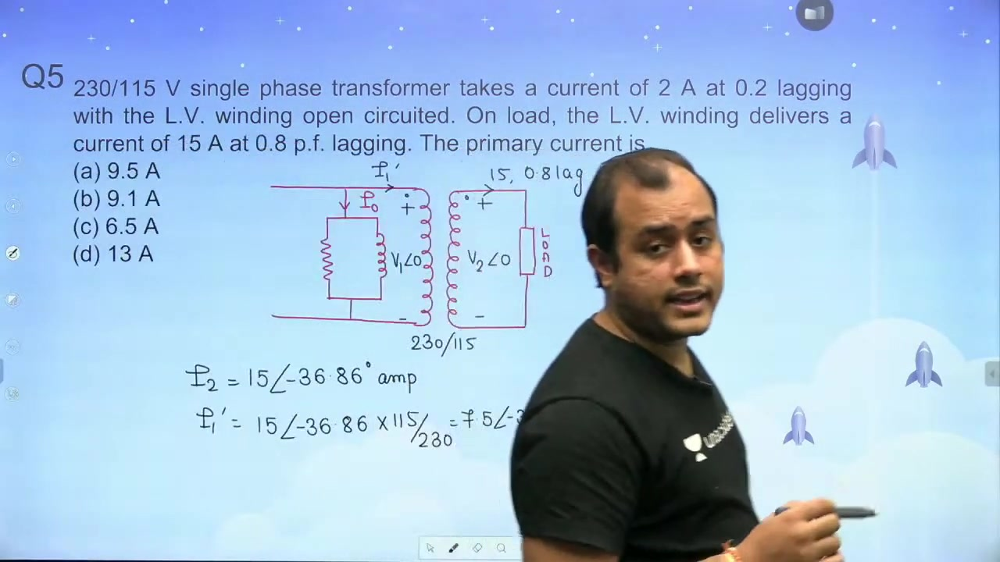

### Phasor Addition with No-Load Current

The no-load current is $I_0 = 2\text{ A}$ at $0.2$ lagging power factor. The phase angle relative to the applied voltage is:
$$\phi_0 = \cos^{-1}(0.2) \approx 78.463^\circ$$

The no-load current phasor is:
$$I_0 = 2\angle -78.463^\circ\text{ A}$$

In rectangular form:
$$I_0 = 2 \cos(78.463^\circ) - j 2 \sin(78.463^\circ) = 0.400 - j 1.960\text{ A}$$

The total primary current is the phasor sum:
$$\begin{aligned} I_1 &= I_0 + I_1' \\ I_1 &= (0.400 - j 1.960) + (6.000 - j 4.500) \\ I_1 &= 6.400 - j 6.460\text{ A} \end{aligned}$$

The magnitude of the primary current is:
$$|I_1| = \sqrt{6.400^2 + (-6.460)^2} = \sqrt{40.96 + 41.73} \approx 9.093\text{ A}$$

The phase angle is:
$$\phi_1 = \tan^{-1}\left(\frac{-6.460}{6.400}\right) \approx -45.25^\circ$$

Rounding gives $I_1 \approx 9.1\text{ A}$, matching Option B.

> [!success] Result
> The total primary current is $I_1 \approx 9.1\angle -45.25^\circ\text{ A}$.

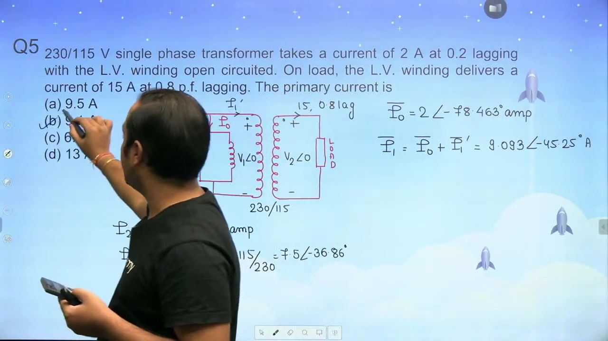

This result is identical to direct ampere-turns balancing:
$$N_1 I_1 = N_1 I_0 + N_2 I_2$$

Dividing by $N_1$ yields the exact same vector equation.

### Problem 6 Preview: Frequency Effect on Power Factor

The next problem examines power factor changes under short circuit when supply frequency increases.

> [!example] Problem 6
> A transformer draws a short-circuit current of $30\text{ A}$ at $0.25$ lagging power factor from a $16\text{ V}, 50\text{ Hz}$ source. Find the operating power factor when connected to a $16\text{ V}, 75\text{ Hz}$ source.

## Direct Impedance Ratio Technique and Impedance Matching for Maximum Power Transfer
_(38:05 - 43:34)_

Short-circuit problems involving frequency changes do not require calculating currents. We can solve them directly by observing how the impedance triangle angle shifts. In addition, transformers serve as impedance matching devices in communications and electronics.

### Solution of Problem 6: Power Factor Angle Method

The short-circuit power factor at $50\text{ Hz}$ is $\cos\phi_1 = 0.25$. The phase angle of the series impedance is:
$$\phi_1 = \cos^{-1}(0.25) \approx 75.522^\circ$$

The tangent of the impedance angle equals the ratio of leakage reactance to resistance:
$$\tan\phi_1 = \frac{X_1}{R} = \tan(75.522^\circ) \approx 3.873$$

The frequency increases from $50\text{ Hz}$ to $75\text{ Hz}$. Because leakage reactance is proportional to frequency, the new reactance is:
$$X_2 = X_1 \times \frac{75}{50} = 1.5 X_1$$

The winding resistance $R$ remains constant. Therefore, the new tangent ratio scales by $1.5$:
$$\tan\phi_2 = \frac{X_2}{R} = 1.5 \times \frac{X_1}{R} = 1.5 \times 3.873 \approx 5.809$$

The new phase angle is:
$$\phi_2 = \tan^{-1}(5.809) \approx 80.23^\circ$$

The operating power factor at $75\text{ Hz}$ is:
$$\cos\phi_2 = \cos(80.23^\circ) \approx 0.1696$$

> [!success] Result
> At $75\text{ Hz}$, the power factor is approximately $0.17\text{ lagging}$. This corresponds to Option A.

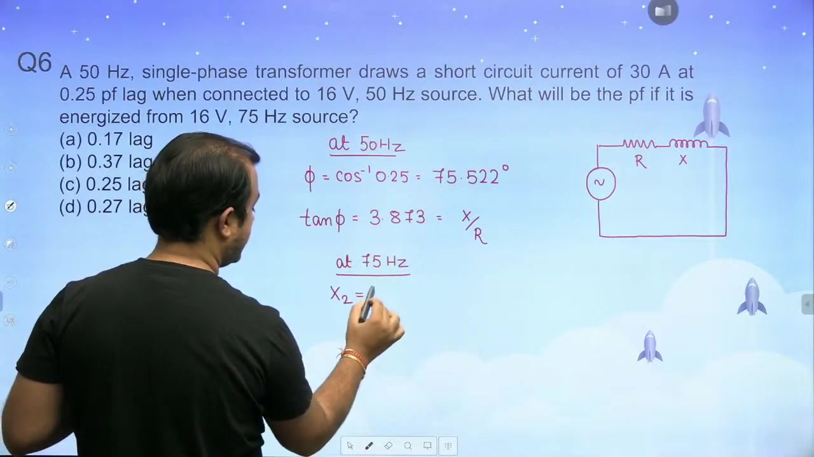

This method eliminates voltage and current calculations entirely. It depends only on the frequency scaling of the $X/R$ ratio.

### Problem 7 Setup: Impedance Matching with Audio Frequency Transformer

Transformers are widely used to match a source internal resistance to a load resistance for maximum power transfer.

> [!example] Problem 7
> An ideal audio frequency transformer couples a $60\,\Omega$ resistive load to an electronic circuit. The circuit is modeled as a $5\text{ V}$ constant voltage source with an internal resistance of $3000\,\Omega$. Find the required turns ratio so that maximum power transfer occurs from source to load.

### Application of the Maximum Power Transfer Theorem

The Maximum Power Transfer Theorem states that maximum power transfers to the load when the load resistance equals the source resistance. When a transformer couples the load, the primary-referred load resistance $R_L'$ must match the source internal resistance:
$$R_L' = R_s$$

The referred resistance depends on the square of the turns ratio:
$$R_L' = R_L \times \left(\frac{N_1}{N_2}\right)^2$$

Equating this to the source internal resistance $R_s = 3000\,\Omega$:
$$\begin{aligned} 60 \times \left(\frac{N_1}{N_2}\right)^2 &= 3000 \\ \left(\frac{N_1}{N_2}\right)^2 &= \frac{3000}{60} = 50 \end{aligned}$$

Taking the square root:
$$\frac{N_1}{N_2} = \sqrt{50} = 5\sqrt{2} \approx 7.071$$

## Turns Ratio Conventions and Complete Ideal Transformer Analysis
_(43:36 - 48:53)_

Depending on how turns ratio is defined, matching calculations yield reciprocal forms. Also, when problems state that a transformer is ideal, physical core dimensions should not distract from ideal circuit equations.

### Completion of Turns Ratio Problem

In the impedance matching problem, the turns ratio can be defined from primary to secondary or secondary to primary. Primary to secondary turns ratio is:
$$\frac{N_1}{N_2} = \sqrt{50} = 5\sqrt{2} \approx 7.071$$

This corresponds to Option D. If defined from secondary to primary, the ratio is:
$$\frac{N_2}{N_1} = \frac{1}{\sqrt{50}} = \frac{\sqrt{2}}{10} \approx 0.1414$$

This matches Option B. Both options represent the same physical impedance match.

> [!success] Result
> For maximum power transfer, the required turns ratio is $\frac{N_1}{N_2} = \sqrt{50}$ (Option D) or $\frac{N_2}{N_1} = \frac{\sqrt{2}}{10}$ (Option B).

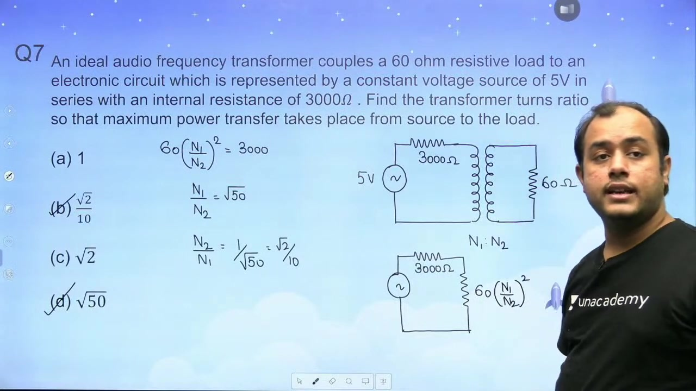

### Problem 8 Setup: Ideal Transformer with Magnetic Core Illustration

The next problem examines complete electrical performance of an ideal transformer.

> [!example] Problem 8
> An ideal transformer has $N_1 = 150$ primary turns and $N_2 = 75$ secondary turns. The primary connects to a $200\text{ V}$ source. The secondary connects to a load impedance of $Z_2 = 5\angle 30^\circ\,\Omega$. Calculate:
> 1. The input impedance seen from the primary side.
> 2. The secondary terminal voltage.
> 3. The secondary load current and primary current.
> 4. The power factor and real power delivered to the load.

The diagram displays physical core dimensions. But the text explicitly states the transformer is ideal. Therefore, core reluctance and core losses are zero. The core dimensions do not affect electrical calculations.

### Comprehensive Solution of Problem 8

The turns ratio is:
$$a = \frac{N_1}{N_2} = \frac{150}{75} = 2$$

The input impedance referred to the primary is:
$$Z_1 = Z_2 \times a^2 = 5\angle 30^\circ \times 2^2 = 20\angle 30^\circ\,\Omega$$

We take primary voltage as reference: $V_1 = 200\angle 0^\circ\text{ V}$. The secondary induced voltage is:
$$V_2 = V_1 \times \frac{N_2}{N_1} = 200 \times \frac{75}{150} = 100\angle 0^\circ\text{ V}$$

The secondary current is:
$$I_2 = \frac{V_2}{Z_2} = \frac{100\angle 0^\circ}{5\angle 30^\circ} = 20\angle -30^\circ\text{ A}$$

The primary current reflects the secondary current:
$$I_1 = I_2 \times \frac{N_2}{N_1} = 20\angle -30^\circ \times \frac{75}{150} = 10\angle -30^\circ\text{ A}$$

Both primary and secondary operate at the same power factor:
$$\cos\phi = \cos(30^\circ) = \frac{\sqrt{3}}{2} \approx 0.866\text{ lagging}$$

The real power consumed by the load equals the real power supplied:
$$P = V_2 I_2 \cos\phi = 100 \times 20 \times \cos(30^\circ) = 2000 \times 0.866 \approx 1732\text{ W}$$

> [!success] Result
> The secondary terminal voltage is $100\text{ V}$. The secondary current is $20\angle -30^\circ\text{ A}$. The primary current is $10\angle -30^\circ\text{ A}$. The active power is $1732\text{ W}$.

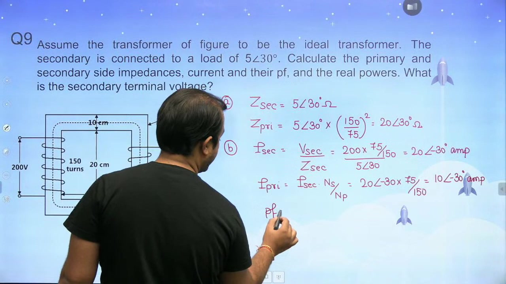

## Multi-Load Tapped Transformer Analysis Using Complex Power Balance
_(48:53 - 53:52)_

Tapped secondary windings supply loads at different operating voltages. Calculating individual tap voltages and current phasors can be tedious. Applying complex power conservation solves such multi-load circuits in a few direct steps.

### Problem 9 Statement: Multi-Tapped Secondary Loading

The ninth problem features an ideal transformer feeding distinct loads from different secondary tap points.

> [!example] Problem 9
> An ideal transformer has $N_1 = 400$ primary turns and $N_2 = 600$ total secondary turns. The primary winding connects to an $800\text{ V}$ source. The full secondary winding ($600$ turns) supplies a resistive load of $24\text{ kW}$. A secondary tap at $500$ turns supplies a purely inductive load of $20\text{ kVAR}$.
> Determine:
> 1. The input power factor at the primary terminals.
> 2. The primary line current $I_1$.
> 3. The real power input to the primary winding.

### Principle of Complex Power Conservation

In an ideal transformer, the core stores zero net magnetic energy. Winding impedances are zero. Therefore, total complex power supplied by the source equals the sum of complex powers absorbed by all loads:
$$S_{\text{primary}} = \sum S_{\text{loads}}$$

The resistive load absorbs active power with zero reactive power:
$$S_{\text{load1}} = 24 + j0\text{ kVA}$$

The purely inductive load absorbs positive reactive power:
$$S_{\text{load2}} = 0 + j20\text{ kVA}$$

The net complex power drawn from the primary source is:
$$S_{\text{primary}} = S_{\text{load1}} + S_{\text{load2}} = 24 + j20\text{ kVA}$$

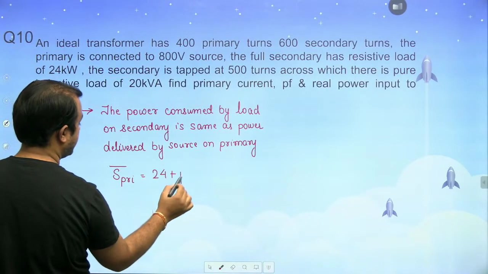

### Calculation of Primary Current and Power Factor

The apparent power drawn from the source is the magnitude of $S_{\text{primary}}$:
$$\begin{aligned} |S_{\text{primary}}| &= \sqrt{P^2 + Q^2} \\ |S_{\text{primary}}| &= \sqrt{24^2 + 20^2} = \sqrt{576 + 400} = \sqrt{976} \approx 31.241\text{ kVA} \end{aligned}$$

The input power factor is the ratio of real power to apparent power:
$$\cos\phi = \frac{P}{|S_{\text{primary}}|} = \frac{24}{31.241} \approx 0.7682$$

Because the reactive power is positive inductive, the power factor is lagging:
$$\text{PF} = 0.7682\text{ lagging}$$

The primary voltage is $V_1 = 800\text{ V}$. The primary current magnitude is:
$$I_1 = \frac{|S_{\text{primary}}|}{V_1} = \frac{31241\text{ VA}}{800\text{ V}} \approx 39.05\text{ A}$$

The real power supplied by the primary source equals the load power:
$$P_{\text{in}} = 24\text{ kW}$$

> [!success] Result
> The primary current is $I_1 \approx 39.05\text{ A}$ at $0.7682\text{ lagging}$ power factor. The real power input is $24\text{ kW}$.

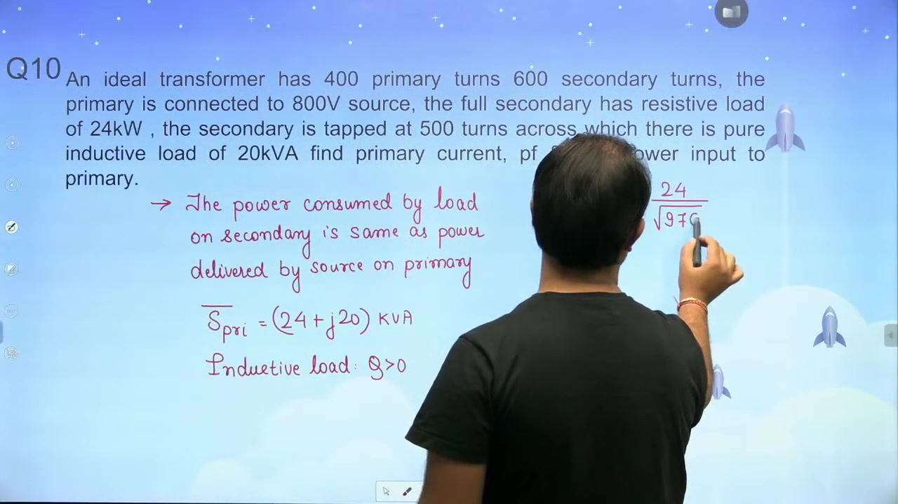

Complex power balancing bypasses tap turns ratios entirely. The result holds regardless of tap geometry.

## DC Transformer Operation Limitations and Inductor Sign Conventions
_(53:55 - 58:43)_

Transformers rely on time-varying magnetic fields to transfer power between windings. Applying direct current prevents transformer operation and damages equipment. In addition, sign conventions govern voltage-current phase relations in reactive components.

### Physical Constraints of Transformers on Direct Current

Consider connecting a transformer to a steady DC source. The applied voltage creates a unidirectional current in the primary winding. This current establishes a steady magnetic flux:
$$\frac{d\Phi}{dt} = 0$$

According to Faraday's law of electromagnetic induction, induced electromotive force is:
$$e = -N \frac{d\Phi}{dt} = 0$$

Because the rate of change of flux is zero, no opposing back-emf develops in the primary winding. The primary current is limited only by small winding resistance:
$$I = \frac{V_{\text{dc}}}{R_{\text{winding}}}$$

Because winding resistance is very small, the current reaches destructive levels. The resulting $I^2 R$ copper loss rapidly overheats the insulation and burns out the transformer.

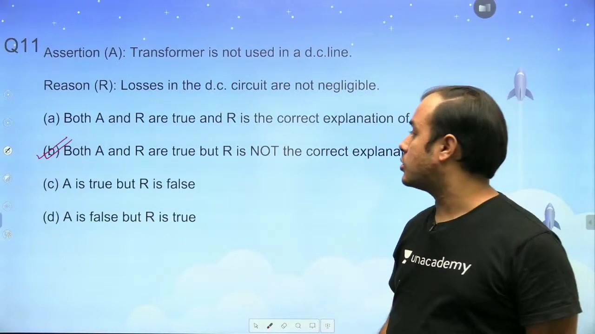

### Frequency Scaling and Core Sizing in Power Supplies

The induced emf equation in a transformer is:
$$E = 4.44 f N B_m A_c$$

Rearranging for the net core cross-sectional area:
$$A_c = \frac{E}{4.44 f N B_m}$$

The required core area is inversely proportional to frequency:
$$A_c \propto \frac{1}{f}$$

At higher operating frequencies, the transformer requires significantly less magnetic core material. High-frequency switched-mode power supplies achieve compact dimensions and low weight.

### Sign Conventions for Inductive Branch Voltages

Now consider the phase relationship in a purely inductive branch.

> [!example] Conceptual Question
> An inductor has terminal voltage $V_{AB}$. The current $I$ leaves the positive terminal A. Determine the phase relationship between current $I$ and voltage $V_{AB}$.

Under passive sign convention, current enters the positive terminal, giving $v = +L \frac{di}{dt}$. Here, current leaves terminal A. Therefore, the active sign convention applies:
$$v(t) = -L \frac{di(t)}{dt}$$

Assume a sinusoidal current:
$$i(t) = I_m \sin(\omega t)$$

Differentiating with respect to time:
$$v(t) = -L \frac{d}{dt}\left[I_m \sin(\omega t)\right] = -\omega L I_m \cos(\omega t)$$

Using trigonometric identities:
$$-\cos(\omega t) = \sin(\omega t - 90^\circ)$$

So the terminal voltage expression is:
$$v(t) = \omega L I_m \sin(\omega t - 90^\circ)$$

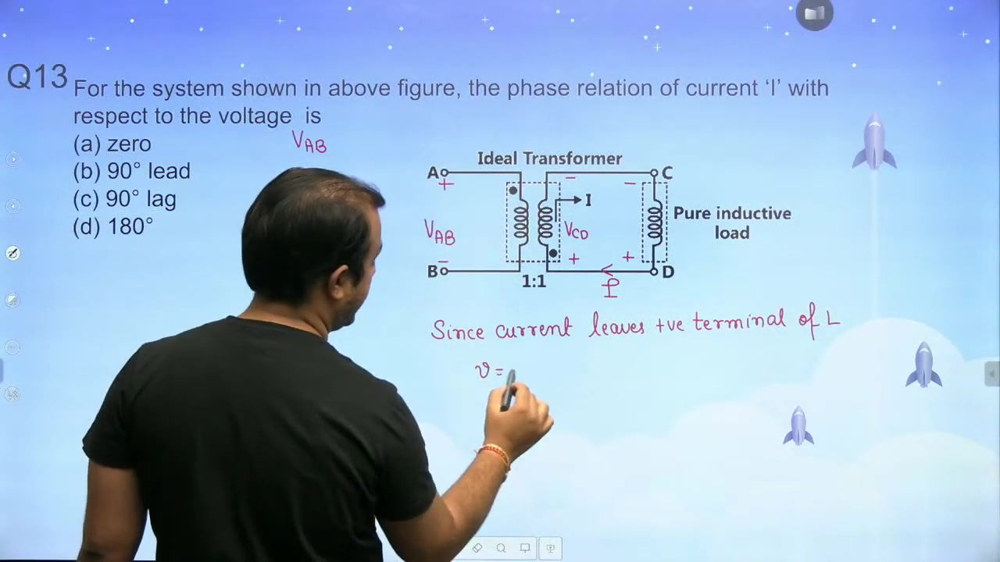

In phasor notation:
$$\begin{aligned} \mathbf{I} &= I_m \angle 0^\circ \\ \mathbf{V} &= \omega L I_m \angle -90^\circ \end{aligned}$$

> [!success] Result
> When current leaves the positive terminal of an inductor, current $I$ leads terminal voltage $V$ by $90^\circ$.

## Ideal Transformer Phasor Diagrams and Tapped Winding Power Conservation
_(58:46 - 64:03)_

Phasor diagrams represent relative phases among core flux, magnetizing current, induced emfs, and applied voltages. In addition, real power conservation simplifies current calculations in tapped winding transformers.

### Theoretical Rules for Ideal Transformer Phasor Diagrams

Constructing an ideal transformer no-load phasor diagram follows four physical principles:

1. **Core Flux Reference**: Mutual core flux $\Phi_m$ serves as the reference phasor along the positive real axis.
2. **Magnetizing Current Alignment**: In an ideal magnetic core, magnetizing current $I_\mu$ is in phase with mutual flux $\Phi_m$.
3. **Induced EMF Phase Lag**: By Faraday's law, induced electromotive forces $E_1$ and $E_2$ lag core flux by $90^\circ$:
$$\mathbf{E}_1 = -j\omega N_1 \mathbf{\Phi}_m = \omega N_1 \Phi_m \angle -90^\circ$$
Induced emfs $E_1$ and $E_2$ point downward along the negative imaginary axis.
4. **Applied Terminal Voltage Opposition**: In an ideal transformer with zero winding resistance and zero leakage reactance, applied primary voltage balances induced emf:
$$\mathbf{V}_1 = -\mathbf{E}_1 = \omega N_1 \Phi_m \angle +90^\circ$$
Applied voltage $V_1$ points upward along the positive imaginary axis.

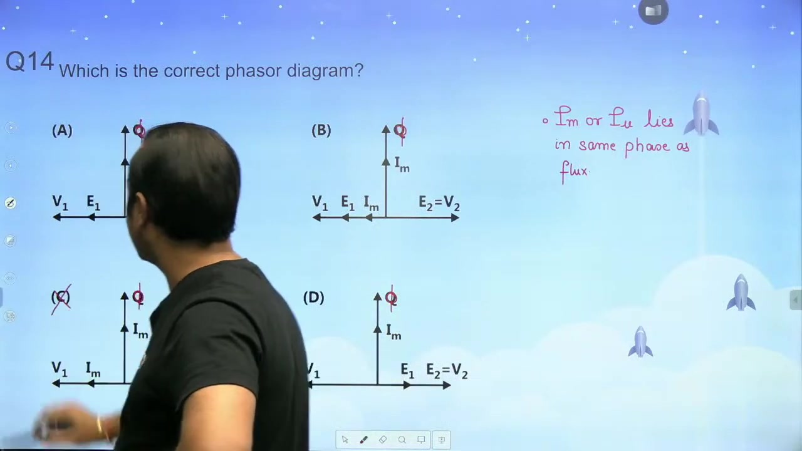

In multiple-choice tests, examine the relationship between $V_1$ and $E_1$. They must have opposite phase directions. Option D correctly places $\Phi_m$ and $I_\mu$ horizontally, $E_1$ downward, and $V_1$ upward.

> [!success] Result
> Diagram D is the uniquely correct phasor diagram for an ideal transformer at no load.

### Problem 10 Setup: Tapped Secondary with Resistive Load

The final numerical problem features an ideal transformer with intermediate secondary connections.

> [!example] Problem 10
> An ideal transformer has a primary winding with $N_1 = 100$ turns connected to a $1000\text{ V}$ supply. The secondary winding has three terminals labeled A, B, and C. The turns between terminals A and C are $N_{AC} = 600$. The turns between terminals A and B are $N_{AB} = 400$. A resistive load absorbing $10\text{ kW}$ connects across terminals A and B. Determine the primary current and input power factor.

### Solution via Real Power Conservation

Although the secondary winding has $600$ total turns, the load connects only across the $400$-turn segment between A and B. One could calculate the secondary voltage $V_{AB}$, secondary load current $I_{AB}$, and refer it to the primary. But conservation of energy provides the answer directly.

An ideal transformer has zero internal losses. The real power supplied by the primary source equals the real power consumed by the load:
$$P_{\text{source}} = P_{\text{load}} = 10\text{ kW} = 10000\text{ W}$$

The load is purely resistive, so its power factor is unity:
$$\cos\phi = 1.0$$

The primary power equation is:
$$P_{\text{source}} = V_1 I_1 \cos\phi$$

Substituting the known values:
$$\begin{aligned} 10000 &= 1000 \times I_1 \times 1.0 \\ I_1 &= \frac{10000}{1000} = 10\text{ A} \end{aligned}$$

> [!success] Result
> The primary winding draws $I_1 = 10\text{ A}$ at unity power factor ($1.0$).

Power conservation eliminates intermediate voltage and turns ratio calculations.

## Session Conclusion and Problem Solving Summary
_(64:03 - 66:16)_

This practice session reinforces foundational concepts in ideal transformer analysis. Mastering both phasor modeling and power balancing equips students to solve diverse transformer configurations efficiently.

### Summary of Ideal Transformer Analytical Frameworks

Two complementary frameworks govern ideal transformer problems:

1. **Phasor and Branch Analysis**:
   - Establish a reference voltage phasor.
   - Refer branch impedances using the squared turns ratio $a^2 = (N_1/N_2)^2$.
   - Calculate currents using Ohm's law and Kirchhoff's Current Law.
   - Match reactive components to adjust the terminal power factor.

2. **Power Conservation Framework**:
   - Equate source active power to total load active power: $P_{\text{in}} = \sum P_{\text{load}}$.
   - Balance reactive power for power factor correction: $Q_{\text{source}} = 0$ for unity power factor.
   - Sum complex powers across multi-load secondary windings: $S_{\text{primary}} = \sum S_k$.
   - Compute primary current magnitude as $I_1 = |S| / V_1$.

### Examination Preparation Guidance

Competitive examinations frequently test edge cases and conceptual traps. Remember these essential insights:

- Transformers cannot operate on steady direct current. Without time-varying flux, zero back-emf is induced. Small winding resistance permits destructive overcurrents.
- Higher supply frequencies reduce required transformer core cross-sectional area: $A_c \propto 1/f$.
- When current leaves the positive terminal of an inductive branch, active sign convention applies. The current leads terminal voltage by $90^\circ$.
- In ideal transformers, core loss is zero and permeability is infinite. Physical core dimensions on schematic diagrams do not alter ideal circuit equations.

Subsequent sessions build upon these principles to analyze practical transformer equivalent circuits, winding losses, core saturation, and leakage reactances.

---

## Summary and Key Takeaways

- To improve the source power factor to unity across an ideal transformer, the parallel reactance must supply reactive power equal to load demand: $Q_X = P \tan\phi$.
- For an ideal multi-winding transformer with zero net core reluctance, the ampere-turns balance equation is $N_1 I_1 = N_2 I_2 + N_3 I_3$.
- In energy-delivering windings, induced current leaves the positive terminal to establish magnetic flux opposing the primary flux.
- When referring an impedance across an ideal transformer from a source winding to a destination winding, the impedance scales by the turns ratio squared: $Z' = Z (N_{\text{dest}} / N_{\text{src}})^2$.
- In transformer short-circuit testing, leakage reactance is directly proportional to frequency ($X \propto f$), while winding resistance remains essentially constant.
- For maximum power transfer from a source to a load through an ideal transformer, the primary-referred load resistance must equal the internal source resistance: $R_L (N_1 / N_2)^2 = R_s$.
- Ideal transformers cannot operate on steady direct current because time-invariant flux ($d\Phi/dt = 0$) induces zero opposing back-emf, causing destructive overcurrent.
- Under complex power conservation, the primary apparent power equals the vector sum of active and reactive powers absorbed by all secondary loads: $S_{\text{primary}} = \sum (P_k + jQ_k)$.

---

[← Lec 015: Ideal Transformer Part 2](Lecture_015_Ideal_Transformer_Part_2.md) | [🏠 Index](00_yt_study_guide.md) | [Lec 017: Practical Transformer Part 1 →](Lecture_017_Practical_Transformer_Part_1.md)
