# Electrical Machines | Lec 12 | Practical Transformer (Part 1) | GATE Electrical Engineering

- **Source**: https://www.youtube.com/watch?v=u7nJUkUgWrs
- **Duration**: 01:04:23
- **Compiled**: 2026-09-19

---

## Overview

This lecture transitions the analysis from an ideal transformer to a practical transformer. It examines how finite core permeability and core losses create the primary no-load excitation current. The discussion models these phenomena with an equivalent parallel shunt branch placed across an ideal transformer core. It then explores secondary loading and derives the compensation effect that preserves constant mutual core flux. Complete on-load phasor diagrams demonstrate how loading improves the overall primary operating power factor.

## Contents

- [[#Practical Transformer at No-Load and Origin of Magnetizing Current|Practical Transformer at No-Load and Origin of Magnetizing Current]]
- [[#Core Loss Nature and Magnetizing Current Phasor Analysis|Core Loss Nature and Magnetizing Current Phasor Analysis]]
- [[#No-Load Current Components and Power Factor Characteristics|No-Load Current Components and Power Factor Characteristics]]
- [[#No-Load Equivalent Circuit Modeling|No-Load Equivalent Circuit Modeling]]
- [[#Frequency Variation Effects on No-Load Operation|Frequency Variation Effects on No-Load Operation]]
- [[#Worked Numerical Example and Introduction to Loaded Transformer|Worked Numerical Example and Introduction to Loaded Transformer]]
- [[#Secondary Demagnetization and the Compensation Effect|Secondary Demagnetization and the Compensation Effect]]
- [[#MMF Balance and Primary Current on Load|MMF Balance and Primary Current on Load]]
- [[#Complex Power Conservation and Initial On-Load Phasors|Complex Power Conservation and Initial On-Load Phasors]]
- [[#Complete On-Load Phasor Diagram and Equivalent Circuit|Complete On-Load Phasor Diagram and Equivalent Circuit]]
- [[#Power Factor Improvement Under Load and Lecture Summary|Power Factor Improvement Under Load and Lecture Summary]]

---

## Practical Transformer at No-Load and Origin of Magnetizing Current
_(00:12 - 07:07)_

### Departure from Ideal Transformer Assumptions

An ideal transformer relies on several simplifying assumptions. It assumes infinite core permeability and zero core reluctance. It also assumes zero leakage flux, zero winding resistance, and zero core loss. Real transformers depart from these conditions. Practical magnetic cores have finite permeability. They exhibit nonzero reluctance, core losses, and leakage flux. 

To analyze a practical transformer, we relax these ideal assumptions step by step. We begin by examining the transformer under no-load conditions.

### No-Load Condition and Core Reluctance

At no load, the secondary terminals remain open-circuited. No load impedance is connected, so secondary current is zero:

$$I_2 = 0$$

An alternating voltage source $V_1$ excites the primary winding. Even though the secondary draws no current, the primary draws a small current from the supply. This current is designated as the primary no-load current $I_0$.

In an ideal transformer with infinite permeability $\mu \to \infty$, establishing mutual flux requires zero magnetomotive force ($\text{MMF} = 0$). Hence, an ideal transformer draws zero current at no load. In a practical transformer, the ferromagnetic core has a finite magnetic permeability $\mu$. The magnetic reluctance of the core is:

$$\mathcal{R} = \frac{l}{\mu A}$$

Here, $l$ is the mean magnetic path length, and $A$ is the cross-sectional area. Because $\mu$ is finite, core reluctance $\mathcal{R}$ is strictly nonzero.

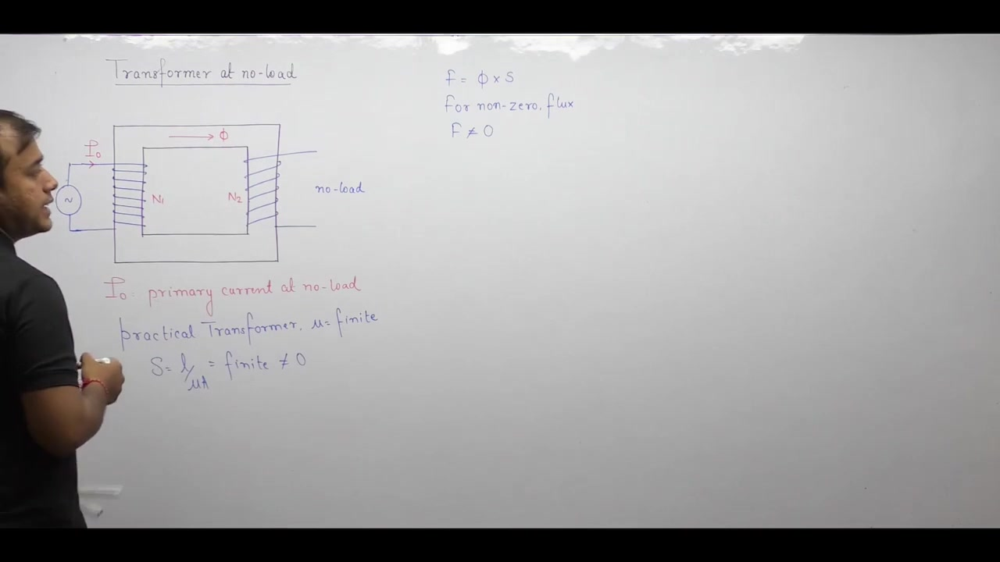

### Magnetizing Current Component

Establishing a time-varying core flux $\Phi_m$ across a nonzero reluctance requires a finite magnetomotive force:

$$\text{MMF} = \Phi_m \mathcal{R} = N_1 I_\mu$$

Therefore, the primary winding must draw current from the source to sustain the core flux:

$$I_\mu = \frac{\Phi_m \mathcal{R}}{N_1} = \frac{\Phi_m l}{N_1 \mu A}$$

This component is called the magnetizing current, denoted as $I_\mu$ or $I_m$. The subscript $\mu$ highlights that this current arises directly from finite core permeability. Higher core permeability reduces the required magnetizing current.

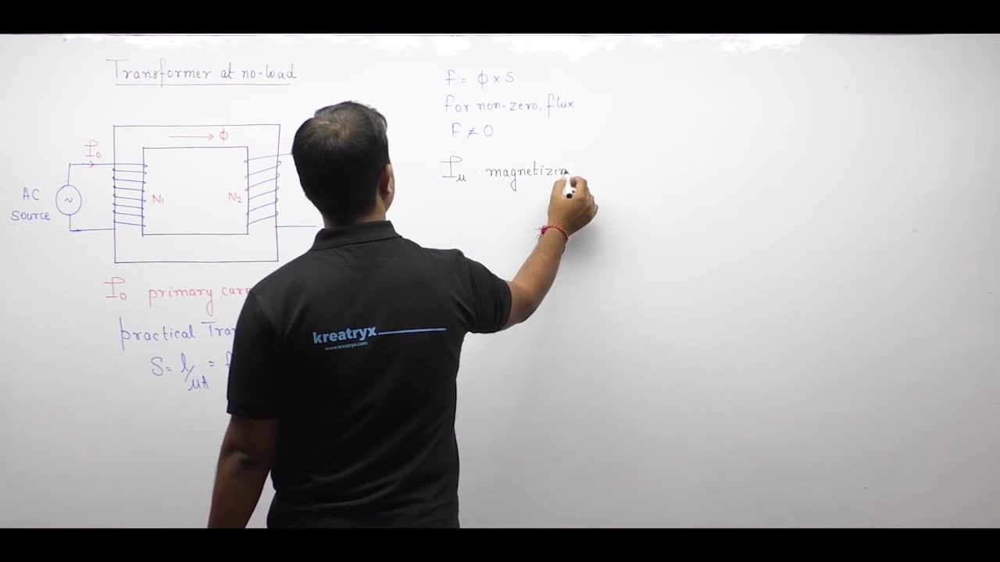

> [!info] Definition: Magnetizing Current ($I_\mu$)
> The magnetizing current $I_\mu$ is the reactive component of primary current required to overcome core reluctance and establish working magnetic flux in the core.

### Introduction of Core Losses

The alternating primary voltage creates an alternating magnetic flux inside the ferromagnetic core. An alternating flux induces two distinct power losses within the core steel:

1. **Hysteresis Loss ($P_h$):** Energy lost per cycle due to repeated reversal of magnetic domains.
2. **Eddy Current Loss ($P_e$):** Ohmic $I^2 R$ heating caused by circulating currents induced in the core laminations.

Both loss mechanisms dissipate energy as heat. The primary source must supply active electrical power to balance these core losses even at no load.

## Core Loss Nature and Magnetizing Current Phasor Analysis
_(07:07 - 13:30)_

### Real Power Nature of Core Losses

An alternating magnetic flux produces hysteresis and eddy current losses in the core. Electrical steel laminations form the core structure. Therefore, core losses are also called iron losses ($P_c$ or $P_i$).

Every physical loss dissipates active electrical power ($P$). Real power represents energy converted irreversibly from electrical form into another physical form. In a transformer core, electrical energy converts into thermal energy (heat). The iron core warms up during operation. 

In contrast, stored energy that oscillates periodically between source and magnetic field represents reactive power ($Q$). Because core losses convert electrical energy directly into heat, they consume purely active power:

$$P_c = P_h + P_e$$

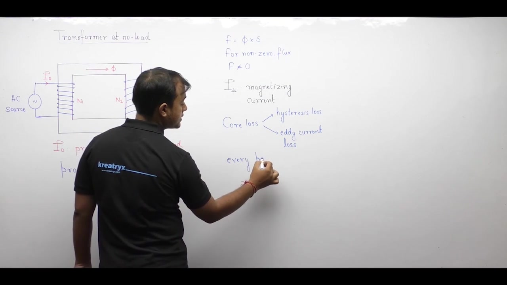

### Phasor Position of Magnetizing Current

To establish the core flux $\Phi_m$, the primary draws the magnetizing current $I_\mu$. Magnetic flux is directly produced by magnetizing current, so $\mathbf{I}_\mu$ lies directly in phase with the mutual flux $\mathbf{\Phi}_m$.

By Faraday's law and Lenz's law, the induced primary EMF is:

$$e_1 = -N_1 \frac{d\phi}{dt}$$

For a sinusoidal flux $\phi(t) = \Phi_m \sin(\omega t)$, the induced EMF is:

$$e_1 = -\omega N_1 \Phi_m \cos(\omega t) = \omega N_1 \Phi_m \sin\left(\omega t - 90^\circ\right)$$

Thus, the induced EMFs $\mathbf{E}_1$ and $\mathbf{E}_2$ lag the flux $\mathbf{\Phi}_m$ by $90^\circ$. The applied terminal voltage $\mathbf{V}_1$ must oppose the self-induced EMF $\mathbf{E}_1$:

$$\mathbf{V}_1 = -\mathbf{E}_1$$

Hence, $\mathbf{V}_1$ leads the mutual flux $\mathbf{\Phi}_m$ by $90^\circ$. Because $\mathbf{I}_\mu$ is in phase with $\mathbf{\Phi}_m$, the magnetizing current $\mathbf{I}_\mu$ lags the applied voltage $\mathbf{V}_1$ by exactly $90^\circ$.

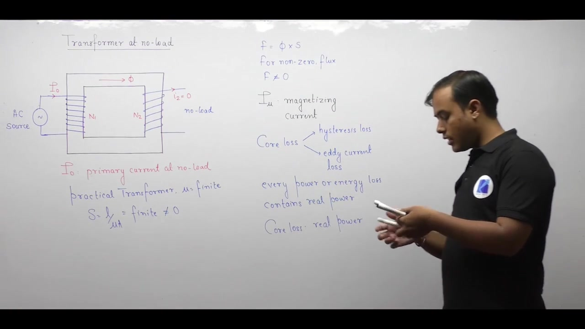

### Active and Reactive Power of Magnetizing Current

With an angle of $90^\circ$ between applied voltage $\mathbf{V}_1$ and magnetizing current $\mathbf{I}_\mu$, we evaluate the power components drawn by $I_\mu$:

$$\begin{aligned}
P_\mu &= V_1 I_\mu \cos(90^\circ) = 0 \\
Q_\mu &= V_1 I_\mu \sin(90^\circ) = V_1 I_\mu
\end{aligned}$$

The active power consumed by magnetizing current is zero. The reactive power is nonzero and equals $V_1 I_\mu$.

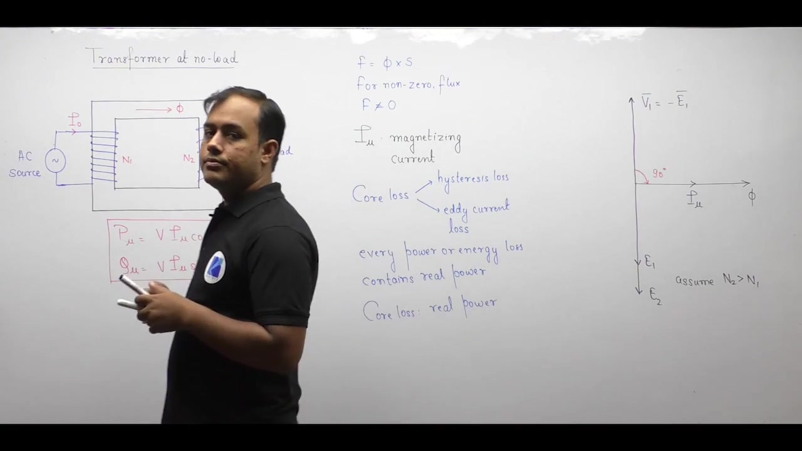

> [!success] Core Magnetization Principle
> The magnetizing current $I_\mu$ draws pure reactive power from the AC source. In electromagnetic machines, reactive power is required to build and sustain magnetic fields. It does not supply core losses.

Because $I_\mu$ supplies zero real power, it cannot account for iron losses. The primary source must supply an additional current component in phase with voltage to cover core loss dissipation.

## No-Load Current Components and Power Factor Characteristics
_(13:35 - 22:25)_

### Working and Magnetizing Components

Core losses dissipate pure active power. To supply this real power without adding reactive power, the loss current must be in phase with the applied voltage:

$$\theta = 0^\circ$$

This component is called the core loss component or working component, denoted as $I_w$ (or $I_c$). It lies along the applied voltage phasor $\mathbf{V}_1$.

The primary winding draws two distinct current components from the AC source:

1. **Working component ($I_w$):** Aligned with $\mathbf{V}_1$, supplying the active power lost as core heat.
2. **Magnetizing component ($I_\mu$):** Lagging $\mathbf{V}_1$ by $90^\circ$, establishing the mutual core flux $\mathbf{\Phi}_m$.

Both components flow through the same primary conductor. The net current drawn at no load is their vector sum:

$$\mathbf{I}_0 = \mathbf{I}_w + \mathbf{I}_\mu$$

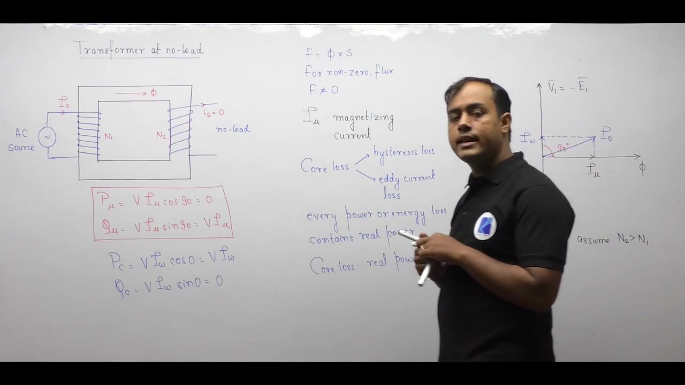

Because $\mathbf{I}_w$ and $\mathbf{I}_\mu$ are orthogonal, the magnitude of the no-load current is:

$$I_0 = \sqrt{I_w^2 + I_\mu^2}$$

An ammeter placed in the primary circuit measures this resultant magnitude $I_0$.

### Rectangular Decomposition of No-Load Current

Let $\phi_0$ be the phase angle between the applied voltage $\mathbf{V}_1$ and the no-load current $\mathbf{I}_0$. Resolving $\mathbf{I}_0$ into orthogonal components yields:

$$\begin{aligned}
I_w &= I_0 \cos\phi_0 \\
I_\mu &= I_0 \sin\phi_0
\end{aligned}$$

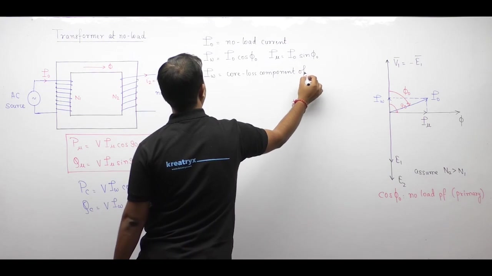

Here, $\cos\phi_0$ is the no-load power factor of the transformer.

### Physical Meaning of Supplying Losses

In physical circuits, lost energy never vanishes. When electrical energy converts to heat within the core laminations, that energy must come from the AC supply. An electrical source delivers exactly the active power demanded by the load and internal losses. 

If core losses equal $100\text{ W}$, the AC supply must deliver $100\text{ W}$ of active power:

$$P_c = V_1 I_w = V_1 I_0 \cos\phi_0$$

If iron losses were absent, $I_w$ would equal zero.

### Low No-Load Power Factor

In practical power transformers, overcoming core reluctance requires much more current than supplying core losses:

$$I_\mu \gg I_w$$

From the phasor right triangle formed by $\mathbf{I}_0$, $\mathbf{I}_w$, and $\mathbf{I}_\mu$:

$$\tan\phi_0 = \frac{I_\mu}{I_w}$$

Because $I_\mu$ is significantly larger than $I_w$, the ratio $\frac{I_\mu}{I_w}$ is large. So the no-load angle $\phi_0$ is high, typically:

$$\phi_0 \approx 70^\circ \text{ to } 75^\circ$$

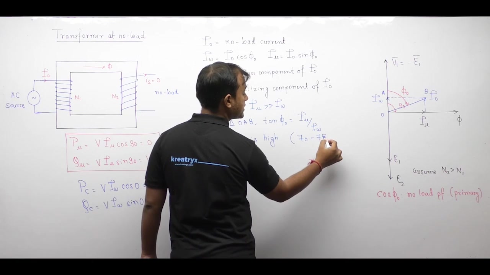

The resulting no-load power factor is very low:

$$\cos\phi_0 \approx 0.2 \text{ lagging}$$

> [!success] No-Load Power Factor Characteristic
> At no load, the transformer behaves almost like a pure inductor. Reactive power heavily dominates active power ($Q_0 \gg P_0$). As a result, the no-load operating power factor is poor, typically around $0.2\text{ lagging}$.

Typically, the magnetizing current component $I_\mu$ is about $4\%$ to $6\%$ of rated full-load current.

## No-Load Equivalent Circuit Modeling
_(22:26 - 28:05)_

### Rated Full-Load Current Benchmarks

Rated full-load current is the nominal current drawn by the transformer at rated voltage and rated apparent power. Every machine nameplate specifies these base quantities.

Relative to rated full-load current $I_{\text{rated}}$, the two no-load current components have typical values:

$$\begin{aligned}
I_\mu &\approx 4\% \text{ to } 6\% \text{ of } I_{\text{rated}} \\
I_w &\approx 1\% \text{ to } 2\% \text{ of } I_{\text{rated}}
\end{aligned}$$

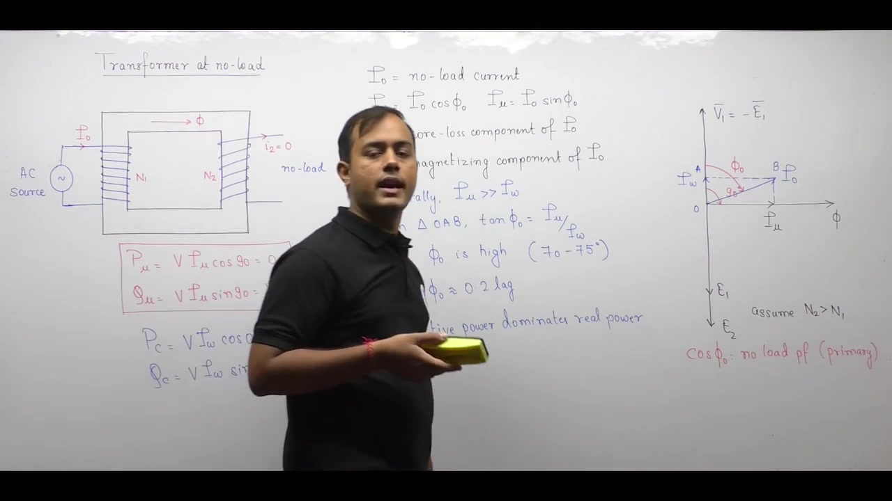

The magnetizing component is much larger than the core loss component. The total no-load current $I_0$ typically equals $3\%$ to $7\%$ of rated full-load current.

### Circuit Representation of No-Load Phenomena

An equivalent circuit replicates the terminal voltages, currents, and power flow of the physical apparatus. It allows standard network theorems to predict machine behavior.

In an ideal transformer with open secondary ($I_2 = 0$), primary current is strictly zero. But a practical transformer draws $I_0$ even when $I_2 = 0$. This current resolves into two orthogonal parts:

1. An active component $I_w$ in phase with applied voltage $V_1$.
2. A reactive component $I_\mu$ lagging applied voltage $V_1$ by $90^\circ$.

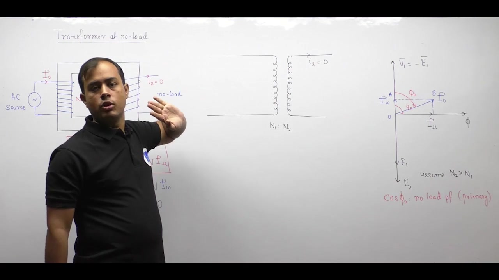

### Synthesis of Core Resistance and Magnetizing Reactance

We must represent these two components using linear circuit elements. 

A linear resistor draws current in phase with the applied voltage. A pure inductor draws current lagging the applied voltage by $90^\circ$.

Both current components experience the same applied primary voltage $V_1$. In an electric circuit, elements in series share current but divide voltage. Elements in parallel share voltage but divide current. 

Because $I_w$ and $I_\mu$ share the common voltage $V_1$, the circuit model must place them in parallel:

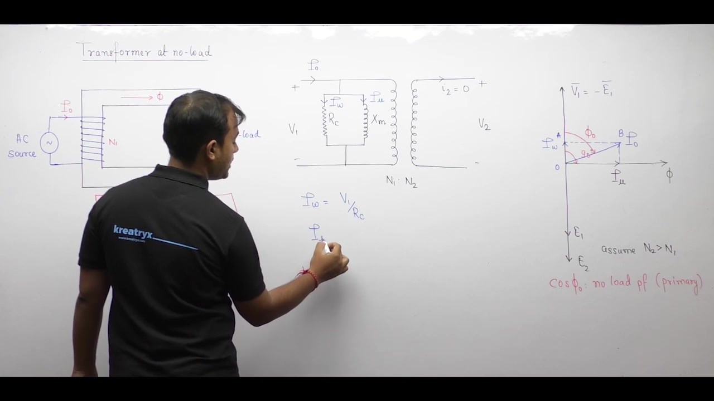

Here, the parallel branch consists of:

- **Core loss resistance ($R_c$ or $R_i$):** Accounts for real power dissipated as hysteresis and eddy current heat.
- **Magnetizing reactance ($X_m$ or $X_\mu$):** Accounts for reactive power required to establish mutual core flux.

The branch currents are given by Ohm's law:

$$\begin{aligned}
I_w &= \frac{V_1}{R_c} \\
I_\mu &= \frac{V_1}{X_m}
\end{aligned}$$

The total no-load current entering the parallel exciting branch is:

$$\mathbf{I}_0 = \mathbf{I}_w + \mathbf{I}_\mu = \frac{\mathbf{V}_1}{R_c} + \frac{\mathbf{V}_1}{j X_m}$$

> [!info] Definition: Exciting Branch
> The parallel combination of core resistance $R_c$ and magnetizing reactance $X_m$ is called the exciting branch or shunt magnetizing branch. It models core phenomena at the primary terminals.

## Frequency Variation Effects on No-Load Operation
_(28:08 - 34:02)_

### Ideal Core with Lumped Non-Idealities

The equivalent circuit models non-idealities as lumped elements placed outside an ideal transformer core. The ideal core retains strict turns-ratio relationships:

$$\frac{E_1}{E_2} = \frac{N_1}{N_2}$$

The shunt branch across the primary terminals accounts for core imperfections:

- Resistor $R_c$ accounts for real power lost as heat.
- Inductor $X_m$ accounts for reactive power required to establish core flux.

### Effect of Reduced Frequency at Constant Voltage

Consider an operating scenario where terminal voltage remains constant while operating frequency decreases.

> [!example] Conceptual Problem: Frequency Reduction
> A transformer operates with constant applied voltage $V_1$. If the operating frequency $f$ is reduced, determine what happens to:
> 1. The total no-load current $I_0$.
> 2. The no-load power factor $\cos\phi_0$.

We analyze this step by step using electromagnetic principles.

#### Core Flux Variation
The primary induced EMF is given by:

$$E_1 = 4.44 f N_1 \Phi_m$$

Neglecting internal primary winding drops, terminal voltage roughly equals induced EMF ($V_1 \approx E_1$). Therefore:

$$\Phi_m \propto \frac{V_1}{f}$$

With terminal voltage $V_1$ constant and frequency $f$ reduced, the mutual core flux $\Phi_m$ increases.

#### Core Loss Component ($I_w$)
Core loss varies roughly with the square of maximum flux density:

$$P_c \propto B_m^2 \propto \Phi_m^2$$

Because $\Phi_m$ increases, total core loss $P_c$ increases. Core loss active power is:

$$P_c = V_1 I_w$$

Since applied voltage $V_1$ is constant, the active loss component $I_w$ must increase.

#### Magnetizing Component ($I_\mu$)
The magnetomotive force required to drive flux through reluctance $\mathcal{R}$ is:

$$\text{MMF} = \Phi_m \mathcal{R} = N_1 I_\mu$$

Core reluctance $\mathcal{R}$ depends on geometry and permeability. As flux $\Phi_m$ increases, the required MMF increases. So the magnetizing current $I_\mu$ must increase.

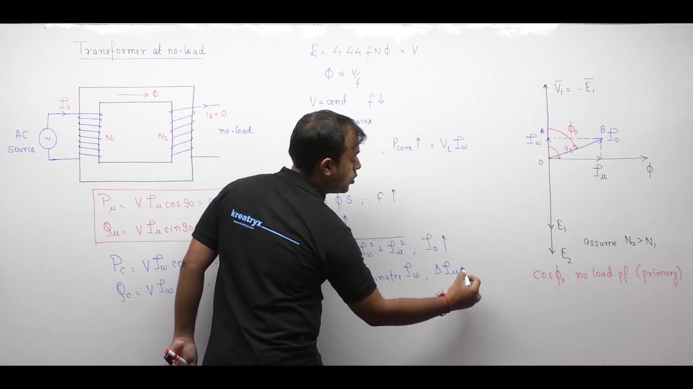

#### Net No-Load Current and Power Factor
The total no-load current is:

$$I_0 = \sqrt{I_w^2 + I_\mu^2}$$

Both $I_w$ and $I_\mu$ increase. So the resultant no-load current $I_0$ must increase.

In a ferromagnetic core, the magnetizing component strongly dominates the working component ($I_\mu \gg I_w$). The growth in $I_\mu$ is much larger in absolute terms than the growth in $I_w$.

As a result, reactive power $Q_0 = V_1 I_\mu$ increases much faster than active power $P_0 = V_1 I_w$. The angle ratio increases:

$$\tan\phi_0 = \frac{I_\mu}{I_w} \uparrow \implies \phi_0 \uparrow$$

Because the phase angle $\phi_0$ increases, the power factor decreases:

$$\cos\phi_0 \downarrow$$

> [!success] Frequency Reduction Result
> When operating frequency decreases at constant voltage:
> - The mutual core flux $\Phi_m$ increases.
> - The no-load current $I_0$ increases.
> - The no-load power factor $\cos\phi_0$ decreases (worsens).

## Worked Numerical Example and Introduction to Loaded Transformer
_(34:02 - 39:37)_

### Numerical Calculation of No-Load Current Components

We apply the no-load equations to a single-phase transformer with open-circuit test data.

> [!example] Problem: No-Load Current and Components
> A $440/220\text{ V}$ single-phase transformer has its low-voltage winding open-circuited. The power input to the high-voltage winding is $80\text{ W}$. The no-load power factor is $0.3\text{ lagging}$. 
> 
> Calculate:
> 1. The total no-load current $I_0$.
> 2. The active core loss component $I_w$.
> 3. The reactive magnetizing component $I_\mu$.

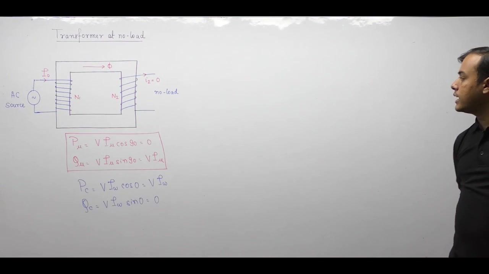

#### Solution

The high-voltage winding is energized from the supply:

$$V_1 = 440\text{ V}$$

The no-load power consumed is:

$$P_0 = 80\text{ W}$$

The power factor is:

$$\cos\phi_0 = 0.3 \text{ lagging}$$

The real power equation relates $P_0$, $V_1$, and $I_0$:

$$P_0 = V_1 I_0 \cos\phi_0$$

Substituting the known values:

$$80 = 440 \times I_0 \times 0.3$$

Solving for $I_0$:

$$I_0 = \frac{80}{440 \times 0.3} = \frac{80}{132} \approx 0.606\text{ A}$$

Now we find the active working component:

$$I_w = I_0 \cos\phi_0 = 0.606 \times 0.3 \approx 0.1818\text{ A}$$

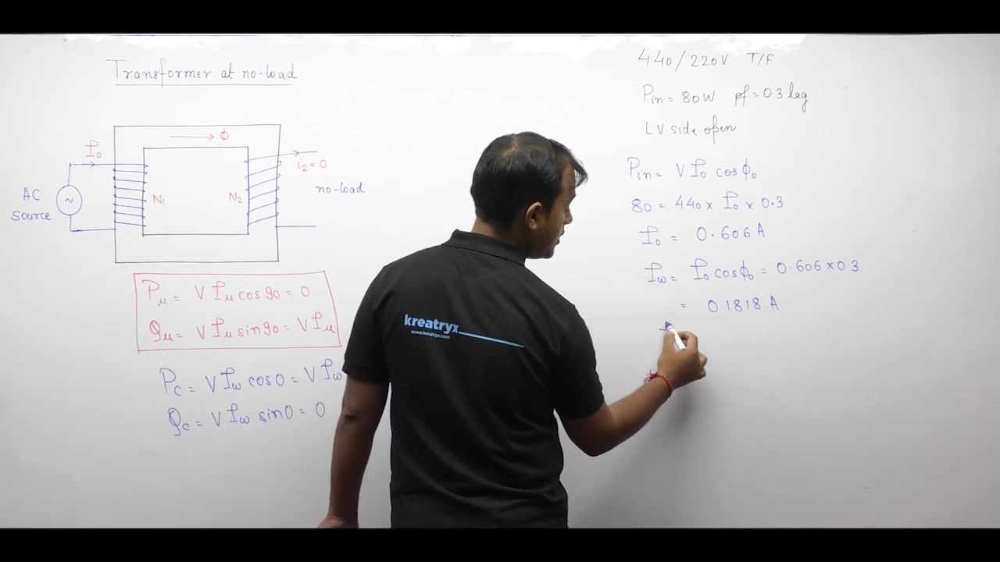

Next, we calculate the reactive magnetizing component using the right-triangle relation:

$$\begin{aligned}
I_\mu &= \sqrt{I_0^2 - I_w^2} \\
&= \sqrt{(0.606)^2 - (0.1818)^2} \\
&= \sqrt{0.3672 - 0.03305} \\
&\approx 0.577\text{ A}
\end{aligned}$$

Alternatively, using the trigonometric identity:

$$\sin\phi_0 = \sqrt{1 - \cos^2\phi_0} = \sqrt{1 - (0.3)^2} = \sqrt{0.91} \approx 0.9539$$

$$I_\mu = I_0 \sin\phi_0 = 0.606 \times 0.9539 \approx 0.578\text{ A}$$

Both approaches yield identical results.

> [!success] Calculated Values
> - Total no-load current: $I_0 \approx 0.606\text{ A}$
> - Core loss component: $I_w \approx 0.182\text{ A}$
> - Magnetizing component: $I_\mu \approx 0.577\text{ A}$

### The Semi-Ideal Transformer on Load

We now move from the no-load condition to loaded operation. We analyze a model termed the semi-ideal transformer.

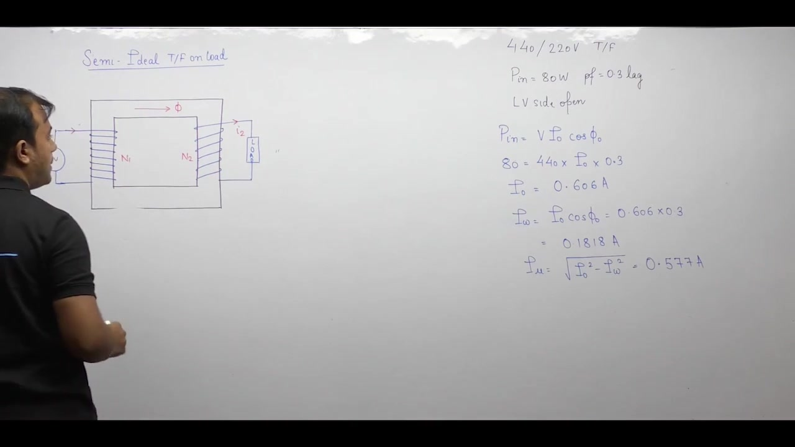

The semi-ideal model serves as an intermediate stage between an ideal transformer and a fully practical machine:

- It includes finite core permeability ($\mu < \infty$), so $I_\mu \neq 0$.
- It includes core losses ($P_c > 0$), so $I_w \neq 0$.
- It neglects winding resistance ($R_1 = R_2 = 0$).
- It neglects magnetic leakage flux ($\Phi_{l1} = \Phi_{l2} = 0$).

An external electrical load is now connected across the secondary terminals.

## Secondary Demagnetization and the Compensation Effect
_(39:37 - 44:09)_

### Secondary Current and Demagnetizing Flux

Connecting an electrical load across the secondary terminals causes a secondary load current $I_2$ to flow. 

By Lenz's law, induced currents always oppose the cause producing them. The secondary ampere-turns $N_2 I_2$ create a secondary magnetic flux $\mathbf{\Phi}_2$. This secondary flux circulates in opposition to the original core flux $\mathbf{\Phi}_1$.

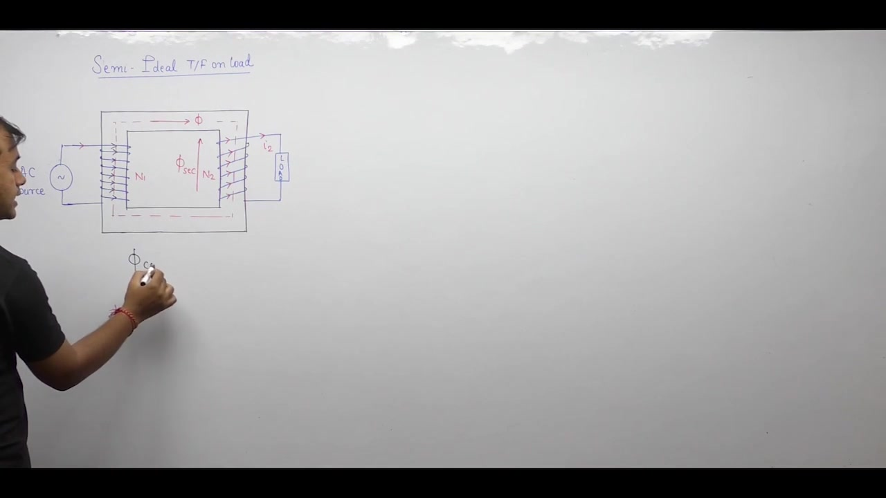

Because the magnetic fluxes share the same iron core, they superimpose algebraically. If no compensation occurred, the net mutual flux in the core would decrease:

$$\Phi_{\text{net}} = \Phi_1 - \Phi_2$$

### Constant Flux Characteristic

However, the primary terminal voltage $V_1$ is maintained by the external power supply. Faraday's law gives the primary induced EMF:

$$E_1 = 4.44 f N_1 \Phi_m$$

Neglecting internal primary drops, terminal voltage matches induced EMF ($V_1 \approx E_1$). Therefore, peak mutual flux is:

$$\Phi_m = \frac{V_1}{4.44 f N_1}$$

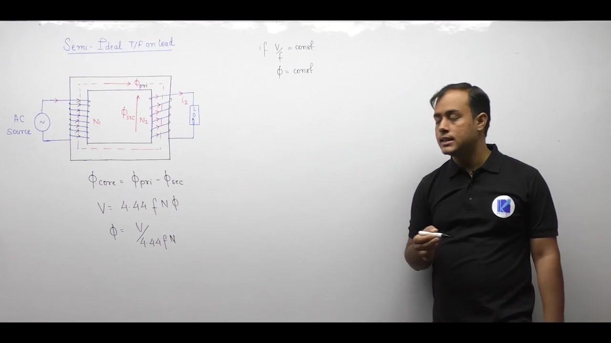

As long as the voltage-to-frequency ratio $\frac{V_1}{f}$ is held constant, the mutual core flux $\Phi_m$ must remain strictly constant.

This creates an apparent contradiction. The secondary current tries to reduce the core flux. But the applied supply voltage demands that the core flux stay constant.

### Resolution via the Compensation Effect

The transformer resolves this conflict through an inherent self-regulating mechanism known as the compensation effect.

Consider a simple numerical analogy. Suppose the core requires $5\text{ units}$ of flux to support the primary voltage. When the secondary load draws current, it produces $2\text{ units}$ of opposing flux. The net core flux would momentarily fall to:

$$\Phi_{\text{net}} = 5 - 2 = 3\text{ units}$$

A drop in net core flux immediately reduces the counter-EMF $E_1$. Because $E_1$ opposes the source voltage $V_1$, a smaller $E_1$ creates a larger net voltage difference ($V_1 - E_1$) across the primary winding.

This voltage difference causes the primary winding to draw additional current from the supply. The primary now establishes $7\text{ units}$ of flux. The net core flux becomes:

$$\Phi_{\text{net}} = 7 - 2 = 5\text{ units}$$

The net core flux returns to its original required value.

> [!info] Definition: Compensation Effect
> The compensation effect is the automatic self-regulation in a transformer where the primary draws extra current from the source to neutralize the demagnetizing MMF produced by the secondary load current.

Through this mechanism, the transformer functions as a constant flux machine across all loading conditions.

## MMF Balance and Primary Current on Load
_(44:15 - 50:43)_

### True Meaning of Constant Flux

The transformer is often called a constant flux machine. This terminology requires careful physical understanding.

It does not mean the magnetic flux is a flat DC line. The flux is time-varying and alternating:

$$\phi(t) = \Phi_m \sin(\omega t)$$

Constant flux means that the peak amplitude $\Phi_m$ is independent of load current. Whether the transformer operates at no load, half load, or full load, $\Phi_m$ remains the same. 

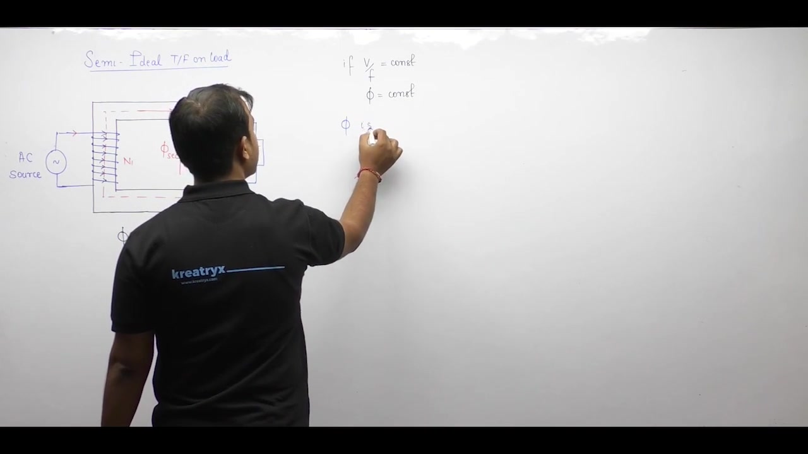

The peak flux changes only if the applied voltage $V_1$ or operating frequency $f$ changes:

$$\Phi_m \propto \frac{V_1}{f}$$

As long as the supply voltage and frequency remain steady, changes in secondary load have no effect on core flux.

### Mathematical Derivation of MMF Balance

Because peak flux is independent of load, the net mutual core flux under load must equal the no-load core flux:

$$\Phi_{\text{load}} = \Phi_0$$

Under load, the secondary flux $\Phi_{\text{secondary}}$ opposes the primary flux $\Phi_{\text{primary}}$. The net working flux is:

$$\Phi_{\text{load}} = \Phi_{\text{primary}} - \Phi_{\text{secondary}}$$

Equating this to the no-load flux $\Phi_0$:

$$\Phi_{\text{primary}} - \Phi_{\text{secondary}} = \Phi_0 \implies \Phi_{\text{primary}} = \Phi_0 + \Phi_{\text{secondary}}$$

Multiplying both sides by the core reluctance $\mathcal{R}$:

$$\Phi_{\text{primary}} \mathcal{R} = \Phi_0 \mathcal{R} + \Phi_{\text{secondary}} \mathcal{R}$$

Recognizing that magnetomotive force is $\text{MMF} = \Phi \mathcal{R} = N I$:

$$N_1 \mathbf{I}_1 = N_1 \mathbf{I}_0 + N_2 \mathbf{I}_2$$

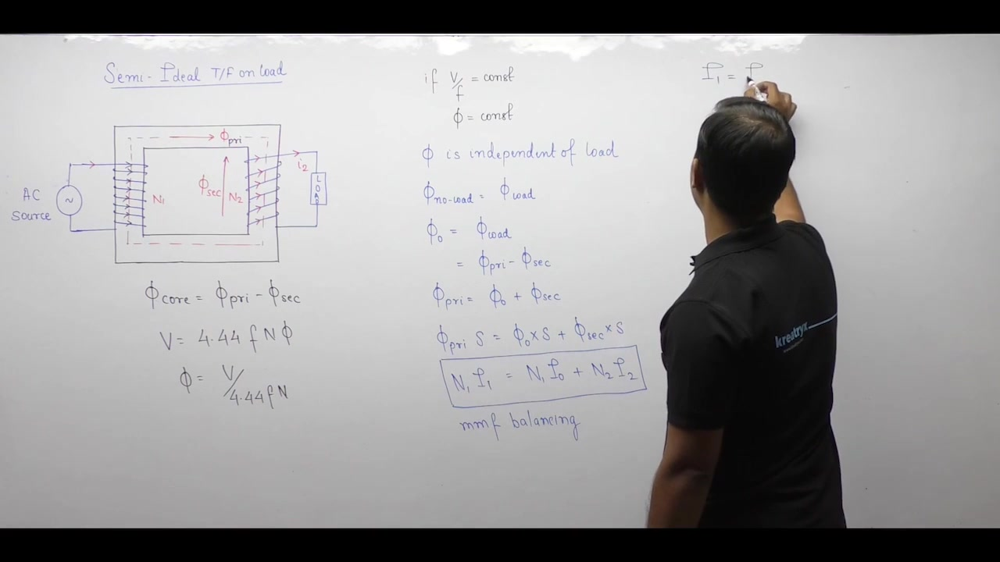

Dividing through by the primary turns $N_1$:

$$\mathbf{I}_1 = \mathbf{I}_0 + \frac{N_2}{N_1} \mathbf{I}_2$$

We define the reflected load current (or counter-balancing current) as:

$$\mathbf{I}_1' = \frac{N_2}{N_1} \mathbf{I}_2$$

This yields the fundamental primary current relationship:

$$\mathbf{I}_1 = \mathbf{I}_0 + \mathbf{I}_1'$$

> [!success] Total Primary Current Equation
> The total primary current $\mathbf{I}_1$ is the phasor sum of:
> 1. The no-load excitation current $\mathbf{I}_0$ (supplying core magnetization and iron loss).
> 2. The reflected secondary load current $\mathbf{I}_1'$ (neutralizing secondary demagnetizing MMF).

### Power Supply Balance

This relationship directly reflects energy conservation. 

At no load, the source delivers only the active power for core losses and reactive power for core magnetization. 

When a consumer connects electrical appliances across the secondary winding, the load demands power. To deliver that power while keeping the core flux constant, the source automatically draws the compensating current $\mathbf{I}_1'$. The supply delivers whatever power the connected system demands.

## Complex Power Conservation and Initial On-Load Phasors
_(50:43 - 55:41)_

### Complex Power Conservation on Load

The primary current equation also confirms conservation of electrical power. We take the complex conjugate of the primary current and multiply by the terminal voltage $\mathbf{V}_1$:

$$\mathbf{S}_1 = \mathbf{V}_1 \mathbf{I}_1^* = \mathbf{V}_1 \left(\mathbf{I}_0 + \mathbf{I}_1'\right)^* = \mathbf{V}_1 \mathbf{I}_0^* + \mathbf{V}_1 \mathbf{I}_1'^*$$

This separates the total input apparent power into two distinct terms:

$$\mathbf{S}_1 = \mathbf{S}_0 + \mathbf{S}_1'$$

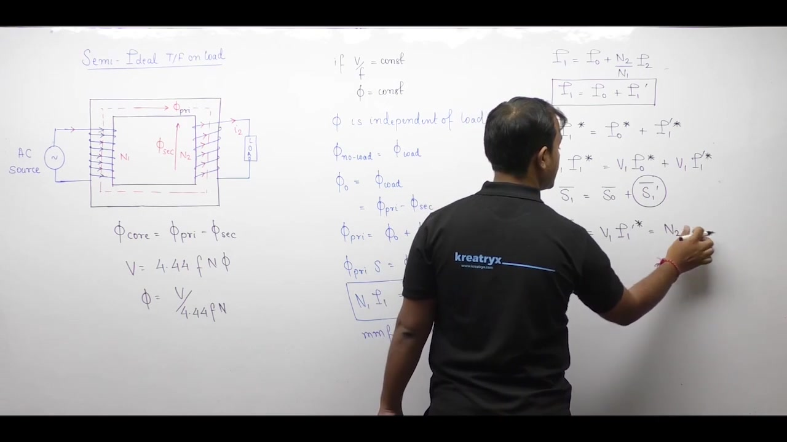

Now express $\mathbf{V}_1$ and $\mathbf{I}_1'$ in terms of secondary quantities:

$$\mathbf{V}_1 = \frac{N_1}{N_2} \mathbf{V}_2, \quad \mathbf{I}_1' = \frac{N_2}{N_1} \mathbf{I}_2$$

Substituting these into the second term yields:

$$\mathbf{S}_1' = \mathbf{V}_1 \mathbf{I}_1'^* = \left(\frac{N_1}{N_2} \mathbf{V}_2\right) \left(\frac{N_2}{N_1} \mathbf{I}_2\right)^* = \mathbf{V}_2 \mathbf{I}_2^* = \mathbf{S}_2$$

Here, $\mathbf{S}_2$ is the complex power consumed by the secondary load. Therefore:

$$\mathbf{S}_1 = \mathbf{S}_0 + \mathbf{S}_2$$

### Comparison with Ideal Transformer

In an ideal transformer, the core draws zero excitation power ($\mathbf{S}_0 = 0$). Input power equals output load power exactly ($\mathbf{S}_1 = \mathbf{S}_2$).

In a practical transformer, the source must supply two distinct demands:

1. **No-load apparent power ($\mathbf{S}_0$):** Real power for core losses ($P_c$) plus reactive power for core magnetization ($Q_\mu$).
2. **Load complex power ($\mathbf{S}_2$):** Real and reactive power transferred electromagnetically to the secondary circuit.

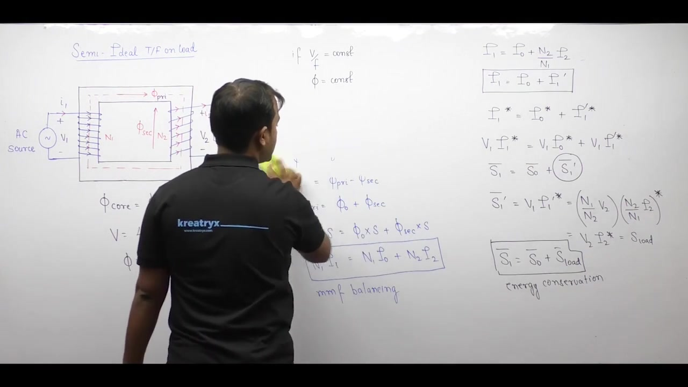

> [!success] Governing Equations Summary
> | Operating Principle | Ideal Transformer | Semi-Ideal Transformer |
> | :--- | :--- | :--- |
> | **MMF Balance** | $N_1 \mathbf{I}_1 = N_2 \mathbf{I}_2$ | $N_1 \mathbf{I}_1 = N_1 \mathbf{I}_0 + N_2 \mathbf{I}_2$ |
> | **Power Conservation** | $\mathbf{S}_1 = \mathbf{S}_2$ | $\mathbf{S}_1 = \mathbf{S}_0 + \mathbf{S}_2$ |

### Constructing the On-Load Phasor Diagram

We now build the complete phasor diagram for the semi-ideal transformer under load.

We choose the mutual core flux $\mathbf{\Phi}_m$ along the positive horizontal axis as the reference phasor.

The magnetizing current $\mathbf{I}_\mu$ produces this flux, so $\mathbf{I}_\mu$ points along $\mathbf{\Phi}_m$.

By Faraday's law, induced EMFs lag flux by $90^\circ$. We plot $\mathbf{E}_1$ and $\mathbf{E}_2$ pointing vertically downward along the $-j$ axis. Assuming a step-up turns ratio ($N_2 > N_1$), the vector length of $\mathbf{E}_2$ exceeds $\mathbf{E}_1$.

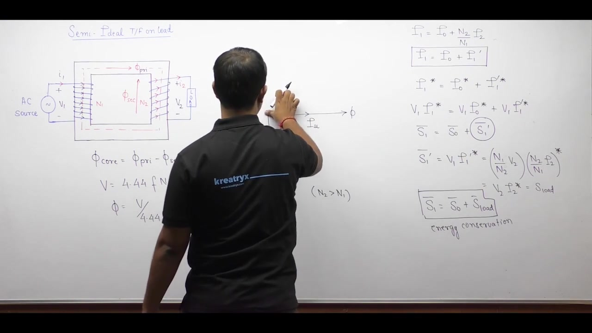

The applied primary terminal voltage opposes self-induced EMF:

$$\mathbf{V}_1 = -\mathbf{E}_1$$

Thus, $\mathbf{V}_1$ points vertically upward along the $+j$ axis. 

The working component $\mathbf{I}_w$ supplies core losses. Because it consumes pure active power, $\mathbf{I}_w$ is drawn in phase with $\mathbf{V}_1$ along the $+j$ axis.

## Complete On-Load Phasor Diagram and Equivalent Circuit
_(55:45 - 61:42)_

### Completing the On-Load Phasor Diagram

We now complete the phasor diagram under loaded conditions.

First, the vector sum of working component $\mathbf{I}_w$ and magnetizing component $\mathbf{I}_\mu$ forms the no-load current $\mathbf{I}_0$.

Next, we connect an inductive load across the secondary terminals. Practical industrial and commercial loads are mostly inductive. Therefore, the secondary load current $\mathbf{I}_2$ lags the secondary induced EMF $\mathbf{E}_2$ by the load phase angle $\theta_2$.

To neutralize the secondary demagnetizing flux, the primary draws the reflected current $\mathbf{I}_1'$. Its magnitude satisfies the turns ratio:

$$I_1' = \frac{N_2}{N_1} I_2$$

Because $\mathbf{I}_1'$ must cancel the secondary MMF, it is drawn in direct phase opposition ($180^\circ$ displaced) to $\mathbf{I}_2$.

Finally, we apply the parallelogram law of vector addition. Combining the no-load current $\mathbf{I}_0$ and the reflected current $\mathbf{I}_1'$ yields the total primary current $\mathbf{I}_1$:

$$\mathbf{I}_1 = \mathbf{I}_0 + \mathbf{I}_1'$$

The angle between primary voltage $\mathbf{V}_1$ and primary current $\mathbf{I}_1$ is $\phi_1$. The primary operating power factor is $\cos\phi_1$.

### Circuit Model Synthesis

The complete semi-ideal transformer equivalent circuit brings these components together.

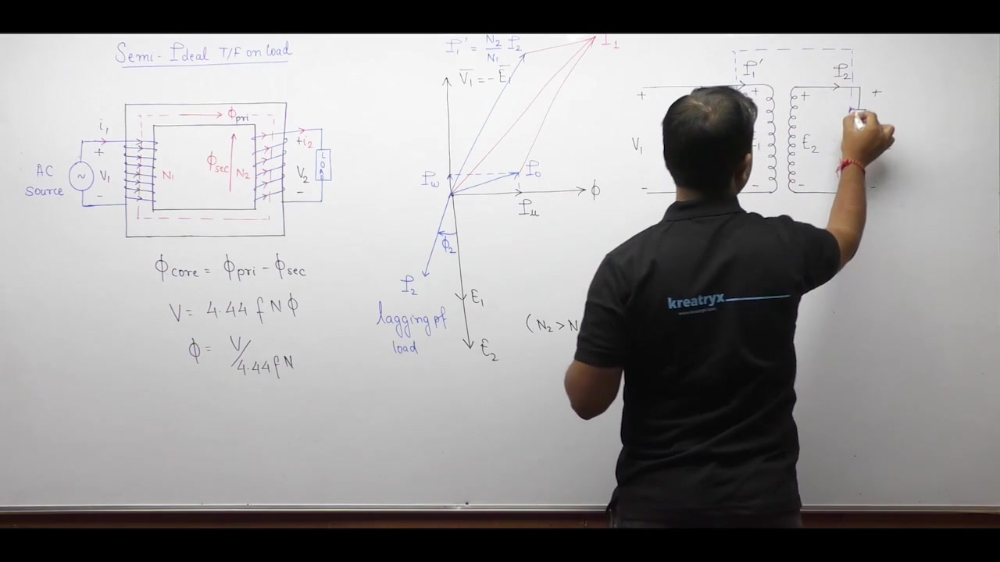

The primary terminal voltage $\mathbf{V}_1$ appears across the parallel exciting branch. This branch draws no-load current $\mathbf{I}_0$:

- Resistor $R_c$ carries the in-phase loss current $\mathbf{I}_w$.
- Inductor $X_m$ carries the quadrature magnetizing current $\mathbf{I}_\mu$.

The ideal transformer core links the primary and secondary windings:

$$\frac{\mathbf{E}_1}{\mathbf{E}_2} = \frac{N_1}{N_2}, \quad \frac{\mathbf{I}_1'}{\mathbf{I}_2} = \frac{N_2}{N_1}$$

Kirchhoff's Current Law at the primary node confirms:

$$\mathbf{I}_1 = \mathbf{I}_0 + \mathbf{I}_1'$$

This circuit model accounts for finite core permeability and core losses while delivering power to an external load.

### Asymmetry in Voltage and Current Transmission

Comparing the primary and secondary variables reveals an essential operational principle.

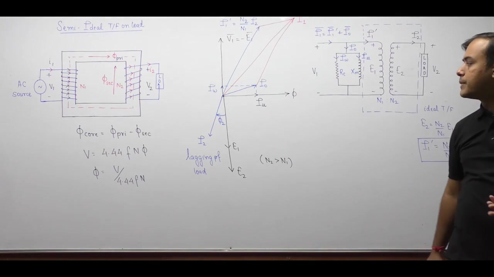

The primary voltage source excites the core flux, inducing secondary voltage $\mathbf{E}_2$. But current flows only when an external load impedance connects to the secondary terminals. That secondary load current then demands a matching reflected current $\mathbf{I}_1'$ from the primary supply.

> [!success] Transformer Action Principle
> In any transformer:
> - Secondary voltage is produced due to primary voltage.
> - Primary current is produced due to secondary current.

Voltage transfers forward from primary to secondary. Current demands transfer backward from secondary to primary.

## Power Factor Improvement Under Load and Lecture Summary
_(61:42 - 64:15)_

### Power Factor Improvement with Loading

Under no-load conditions, the transformer draws only the excitation current $\mathbf{I}_0$. Because magnetizing current dominates the loss current ($I_\mu \gg I_w$), the no-load phase angle $\phi_0$ is large:

$$\phi_0 \approx 70^\circ \text{ to } 75^\circ$$

The resulting no-load power factor is very poor ($\cos\phi_0 \approx 0.2\text{ lagging}$).

When a load connects across the secondary winding, the primary draws the reflected load current $\mathbf{I}_1'$. The total primary current becomes:

$$\mathbf{I}_1 = \mathbf{I}_0 + \mathbf{I}_1'$$

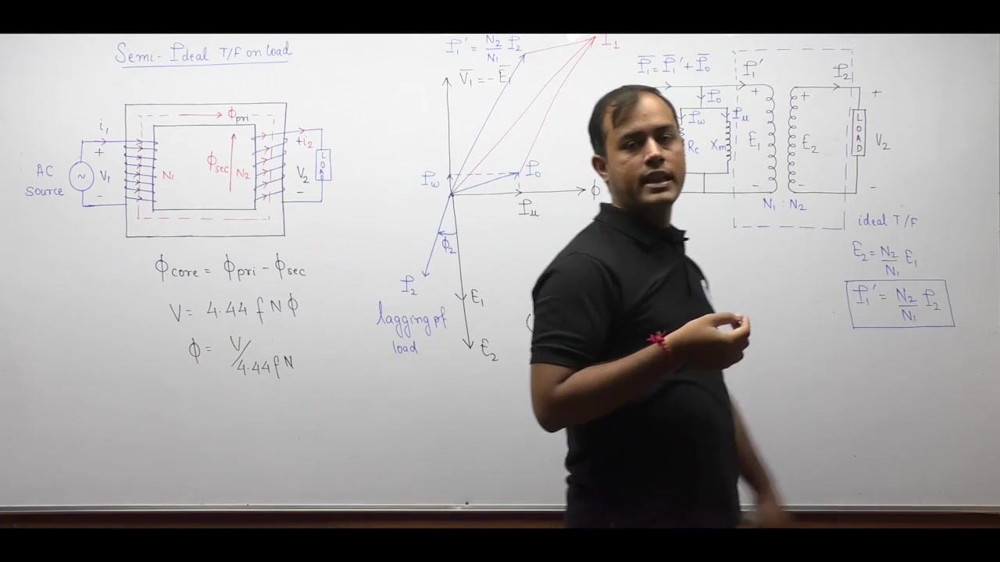

In practical operation, the load current $\mathbf{I}_1'$ operates at a much higher power factor than $\mathbf{I}_0$, typically $0.8$ to $0.9$. 

Adding $\mathbf{I}_1'$ pulls the resultant primary current $\mathbf{I}_1$ closer to the applied voltage phasor $\mathbf{V}_1$. The net primary phase angle decreases:

$$\phi_1 < \phi_0$$

Because the operating phase angle shrinks, the power factor increases:

$$\cos\phi_1 > \cos\phi_0$$

> [!success] Loading Effect on Power Factor
> Connecting a load to the transformer decreases the primary phase angle from $\phi_0$ to $\phi_1$. This substantially improves the primary operating power factor from its poor no-load value.

### Summary of Semi-Ideal Transformer Principles

This lecture developed the core behavior of the semi-ideal transformer:

1. **Finite Permeability:** Demands magnetizing current $I_\mu$ to overcome core reluctance and establish working flux. It consumes pure reactive power ($Q_\mu = V_1 I_\mu$).
2. **Core Losses:** Alternating flux causes hysteresis and eddy current dissipation in the laminations. The primary draws active current $I_w$ in phase with $V_1$ to supply this heat ($P_c = V_1 I_w$).
3. **No-Load Current ($I_0$):** Vector sum of $I_w$ and $I_\mu$. Its magnitude is $I_0 = \sqrt{I_w^2 + I_\mu^2}$.
4. **Compensation Effect:** When secondary current $I_2$ attempts to demagnetize the core, the primary draws extra current $I_1' = \frac{N_2}{N_1} I_2$. This maintains constant mutual core flux $\Phi_m$.
5. **Primary Current:** Under load, total primary current is $\mathbf{I}_1 = \mathbf{I}_0 + \mathbf{I}_1'$.

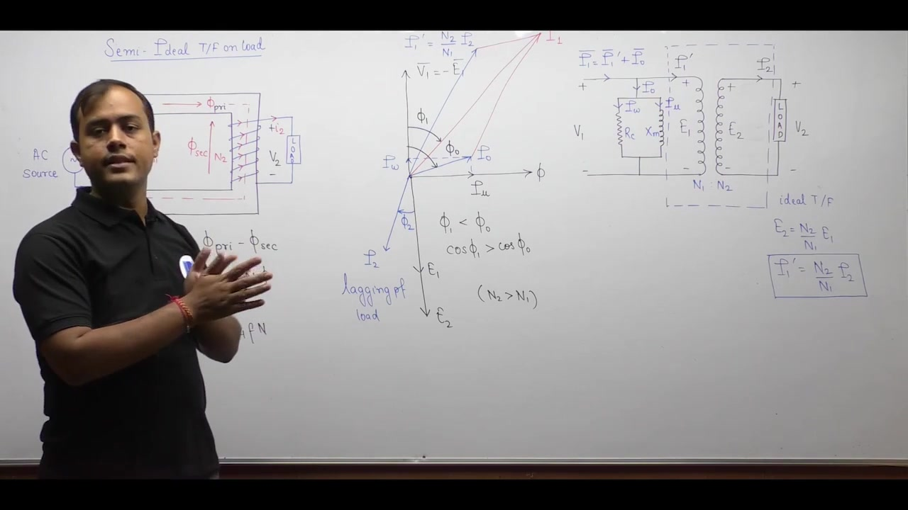

In the next lecture, we will complete the transition to a fully practical transformer. We will introduce winding resistances ($R_1, R_2$) and leakage reactances ($X_{l1}, X_{l2}$).

---

## Summary and Key Takeaways

- Finite core permeability creates core reluctance $\mathcal{R} = \frac{l}{\mu A}$, demanding a magnetizing current $I_\mu = \frac{\Phi_m \mathcal{R}}{N_1}$ that consumes purely reactive power ($Q_\mu = V_1 I_\mu$).
- Alternating mutual flux causes hysteresis and eddy current losses in core laminations, dissipating active power supplied by the in-phase core loss current $I_w = \frac{P_c}{V_1}$.
- The total no-load current is the vector sum $\mathbf{I}_0 = \mathbf{I}_w + \mathbf{I}_\mu$, with magnitude $I_0 = \sqrt{I_w^2 + I_\mu^2}$ and a low lagging power factor $\cos\phi_0 \approx 0.2$.
- The exciting branch models core phenomena as a parallel combination of core loss resistance $R_c = \frac{V_1}{I_w}$ and magnetizing reactance $X_m = \frac{V_1}{I_\mu}$.
- Reducing operating frequency at constant voltage increases mutual flux ($\Phi_m \propto \frac{V_1}{f}$), increasing $I_0$ and decreasing the no-load power factor.
- By the compensation effect, secondary load current $I_2$ induces an opposing MMF that is canceled by an additional primary current $\mathbf{I}_1' = \frac{N_2}{N_1} \mathbf{I}_2$.
- Under load, total primary current is $\mathbf{I}_1 = \mathbf{I}_0 + \mathbf{I}_1'$, satisfying both MMF balance $N_1 \mathbf{I}_1 = N_1 \mathbf{I}_0 + N_2 \mathbf{I}_2$ and power balance $\mathbf{S}_1 = \mathbf{S}_0 + \mathbf{S}_2$.
- Adding the higher power factor load current $\mathbf{I}_1'$ reduces the net primary phase angle ($\phi_1 < \phi_0$), improving the operating power factor from its no-load value.

