# Electrical Machines | Lec 13 | Practical Transformer (Part 2) | GATE Electrical Engineering

- **Source**: https://www.youtube.com/watch?v=7Hzdp0TXM5E
- **Duration**: 00:54:24
- **Compiled**: 2026-09-19

---

## Overview

This lecture incorporates winding resistance and magnetic leakage flux into the practical transformer model. It examines how finite conductor resistance creates internal ohmic drops and introduces total copper loss. The analysis then distinguishes between mutual core flux and leakage flux closing through air paths around individual coils. By representing leakage induced voltages as inductive reactance drops, the discussion synthesizes the complete equivalent circuit of the practical transformer.

## Contents

- [[#Practical Transformer with Winding Resistance and KVL Formulation|Practical Transformer with Winding Resistance and KVL Formulation]]
- [[#Phasor Diagrams with Winding Resistance and Pedagogic Conventions|Phasor Diagrams with Winding Resistance and Pedagogic Conventions]]
- [[#Resistance Referral and Total Copper Loss|Resistance Referral and Total Copper Loss]]
- [[#Physical Origin of Leakage Flux and Leakage EMF|Physical Origin of Leakage Flux and Leakage EMF]]
- [[#Complete Phasor Diagram with Winding Resistance and Leakage Flux|Complete Phasor Diagram with Winding Resistance and Leakage Flux]]
- [[#Modeling Leakage Flux as Reactance and Equivalent Circuit Synthesis|Modeling Leakage Flux as Reactance and Equivalent Circuit Synthesis]]
- [[#Circuit Conventions, Numerical Rules, and Roadmap|Circuit Conventions, Numerical Rules, and Roadmap]]

---

## Practical Transformer with Winding Resistance and KVL Formulation
_(00:12 - 10:01)_

### Incorporating Winding Resistance

An ideal transformer assumes zero winding resistance. Real transformer windings are wound with copper or aluminum conductors. These conductors possess finite electrical resistance.

Let $R_1$ denote the primary winding resistance. Let $R_2$ denote the secondary winding resistance.

Physically, resistance is distributed along the entire length of the coiled conductor. For circuit analysis, we lump this resistance externally in series with each winding.

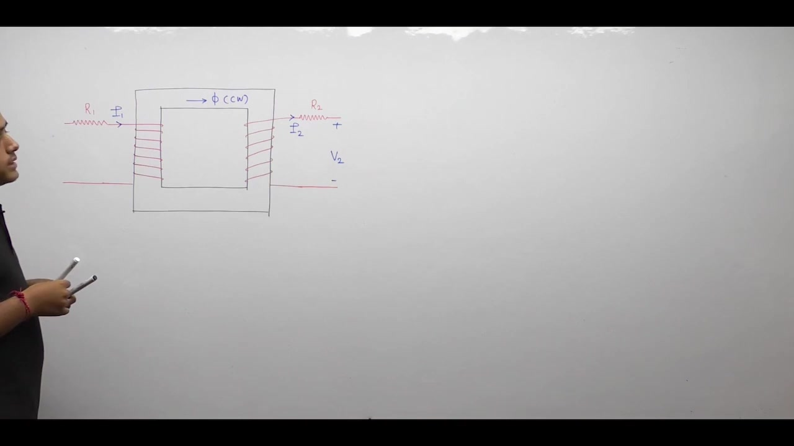

A series connection is necessary. The current entering each winding must flow through the resistance of that conductor.

### Polarity Determination via Lenz's Law

We determine induced EMF polarities using Lenz's law. 

Assume an alternating core flux $\Phi(t)$ circulates clockwise through the core. By Lenz's law, any induced current must establish an induced flux $\Phi_{\text{induced}}$ that opposes this core flux.

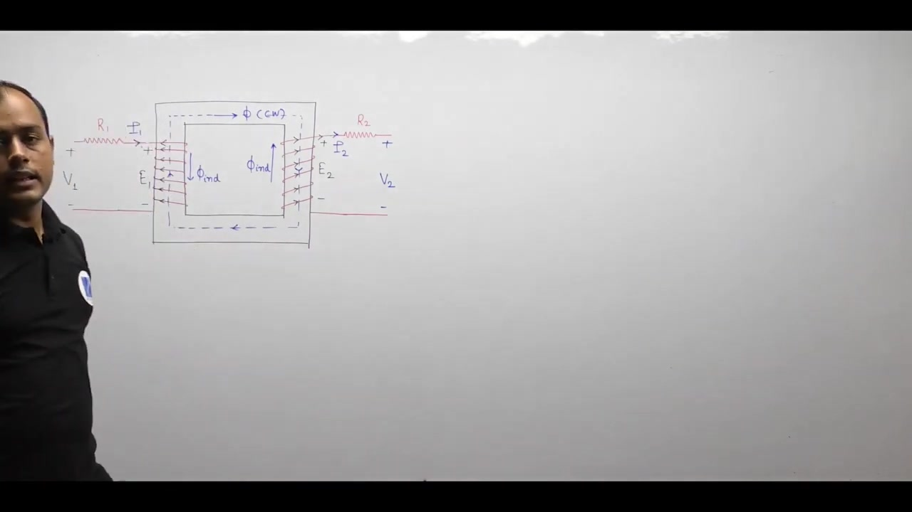

Applying the right-hand grip rule gives the physical polarities of the induced EMFs $E_1$ and $E_2$:

1. The secondary terminal where current leaves to supply the external load is marked positive ($+$).
2. The primary counter-EMF opposes the applied supply voltage $V_1$.

> [!info] Principle: Winding Polarity
> Winding resistance exists internally within the copper conductor. Drawing it externally allows Kirchhoff's Voltage Law to be applied once induced EMF polarities are established by Lenz's law.

### Kirchhoff's Voltage Law Equations

With polarities established, we write Kirchhoff's Voltage Law (KVL) around both primary and secondary loops.

On the primary side, the applied voltage source $V_1$ drives current $I_1$ against resistance drop $I_1 R_1$ and counter-EMF $E_1$:

$$V_1 - I_1 R_1 = E_1 \implies V_1 = E_1 + I_1 R_1$$

On the secondary side, the induced EMF $E_2$ acts as the source driving load current $I_2$ through secondary resistance $R_2$:

$$E_2 - I_2 R_2 = V_2$$

Here, $V_2$ is the terminal voltage across the connected load.

### Reconciling Phasor Conventions

In circuit analysis, once physical polarities are derived from Lenz's law, the induced voltage magnitude is:

$$e(t) = N \frac{d\phi}{dt}$$

For a sinusoidal flux $\phi(t) = \Phi_m \sin(\omega t)$, this derivative yields:

$$e(t) = \omega N \Phi_m \cos(\omega t) = \omega N \Phi_m \sin\left(\omega t + 90^\circ\right)$$

This expression shows EMF leading flux by $90^\circ$.

However, standard transformer textbook phasor diagrams represent induced EMF as lagging flux by $90^\circ$. That convention stems from Faraday's law with an explicit negative sign:

$$e(t) = -N \frac{d\phi}{dt} = \omega N \Phi_m \sin\left(\omega t - 90^\circ\right)$$

To maintain consistency with standard phasor diagrams, we write the primary KVL using the counter-EMF $-E_1$:

$$V_1 = -E_1 + I_1 R_1$$

Here, $E_1$ lags the core flux by $90^\circ$. Its opposite phasor $-E_1$ leads the flux by $90^\circ$. This preserves exact network equations while keeping standard visual phasor conventions.

## Phasor Diagrams with Winding Resistance and Pedagogic Conventions
_(10:01 - 19:50)_

### Step-by-Step Construction of the Phasor Diagram

We construct the phasor diagram for a loaded transformer with winding resistance.

1. **Reference Core Flux ($\mathbf{\Phi}$):** Drawn along the positive horizontal axis.
2. **Magnetizing Current ($\mathbf{I}_\mu$):** Drawn in phase with core flux $\mathbf{\Phi}$.
3. **Induced EMFs ($\mathbf{E}_1, \mathbf{E}_2$):** Drawn lagging core flux by $90^\circ$. For a step-up transformer ($N_2 > N_1$), the length of $\mathbf{E}_2$ exceeds $\mathbf{E}_1$.
4. **Counter-EMF ($-\mathbf{E}_1$):** Drawn directly opposite to $\mathbf{E}_1$, pointing upward.
5. **Core Loss Component ($\mathbf{I}_w$):** Drawn in phase with $-\mathbf{E}_1$.
6. **No-Load Excitation Current ($\mathbf{I}_0$):** Formed by the vector sum $\mathbf{I}_0 = \mathbf{I}_w + \mathbf{I}_\mu$.
7. **Secondary Load Current ($\mathbf{I}_2$):** Drawn lagging secondary induced EMF $\mathbf{E}_2$ by the load phase angle $\phi_2$.
8. **Reflected Primary Current ($\mathbf{I}_1'$):** Drawn in direct phase opposition to $\mathbf{I}_2$.
9. **Total Primary Current ($\mathbf{I}_1$):** Formed by vector addition $\mathbf{I}_1 = \mathbf{I}_0 + \mathbf{I}_1'$.

### Incorporating Resistance Drops

We now add the ohmic resistance drops to determine the terminal voltages.

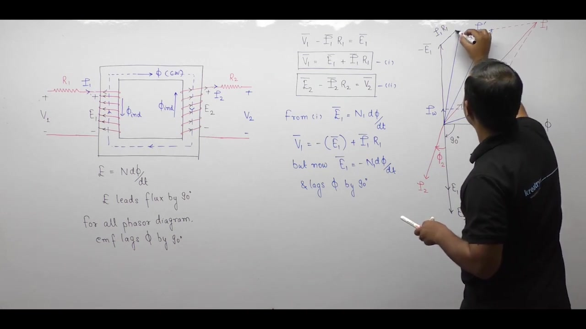

The primary terminal voltage is:

$$\mathbf{V}_1 = -\mathbf{E}_1 + \mathbf{I}_1 R_1$$

The resistance drop $\mathbf{I}_1 R_1$ is in phase with primary current $\mathbf{I}_1$. We draw this vector parallel to $\mathbf{I}_1$, starting from the tip of $-\mathbf{E}_1$. The vector drawn from the origin to the end of $\mathbf{I}_1 R_1$ is the primary terminal voltage $\mathbf{V}_1$.

The secondary terminal voltage is:

$$\mathbf{V}_2 = \mathbf{E}_2 - \mathbf{I}_2 R_2$$

Subtracting $\mathbf{I}_2 R_2$ from $\mathbf{E}_2$ means drawing a vector of magnitude $I_2 R_2$ in opposite phase to $\mathbf{I}_2$. Drawing this vector from the tip of $\mathbf{E}_2$ yields the secondary terminal voltage $\mathbf{V}_2$.

### Network Analysis Diagram vs Conventional Phasor Diagram

If we plot induced EMFs as leading flux by $90^\circ$, all primary and secondary phasors cluster in the upper half-plane.

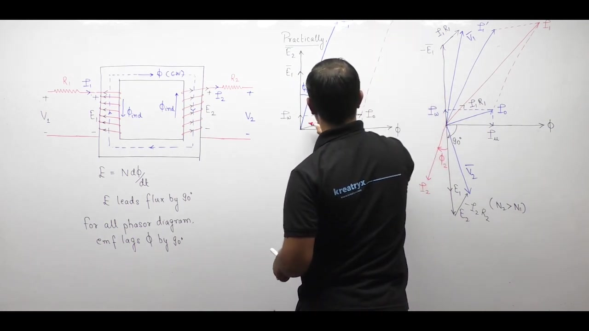

This literal network diagram becomes visually crowded and difficult to read. 

To improve clarity, standard engineering pedagogy splits the diagram across the horizontal axis:

- Primary quantities ($\mathbf{V}_1, -\mathbf{E}_1, \mathbf{I}_1, \mathbf{I}_1', \mathbf{I}_0$) are plotted above the flux axis.
- Secondary quantities ($\mathbf{E}_2, \mathbf{V}_2, \mathbf{I}_2$) are plotted below the flux axis.

Physically, the reflected current $\mathbf{I}_1'$ and load current $\mathbf{I}_2$ are in phase with their respective winding voltages. They are drawn in phase opposition on the diagram solely to represent magnetomotive force cancellation.

> [!info] Insight for Problem Solving
> The $180^\circ$ phase inversion and lagging conventions are graphical aids. In numerical network calculations, $\mathbf{E}_1$ and $\mathbf{E}_2$ share the same phase angle. Similarly, $\mathbf{I}_1'$ and $\mathbf{I}_2$ share the same phase angle.

### Total Winding Copper Loss

Finite winding resistance dissipates active electrical power as heat. This ohmic loss is called copper loss ($P_{\text{cu}}$):

$$P_{\text{cu}} = I_1^2 R_1 + I_2^2 R_2$$

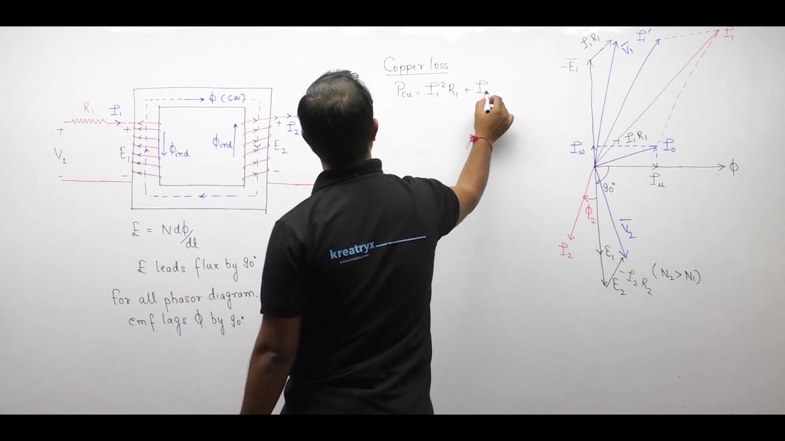

Evaluating copper loss with this expression requires currents and resistances from both sides of the transformer. To simplify calculations, we refer the resistances to a single winding.

## Resistance Referral and Total Copper Loss
_(19:50 - 25:05)_

### Power Invariance Principle of Referral

Calculating copper loss from both winding currents is inconvenient in large network studies. We prefer to model the entire transformer resistance on one side.

When transferring circuit quantities across windings, voltages and currents scale by turns ratios. However, electrical power must remain invariant:

$$P_1 = P_2$$

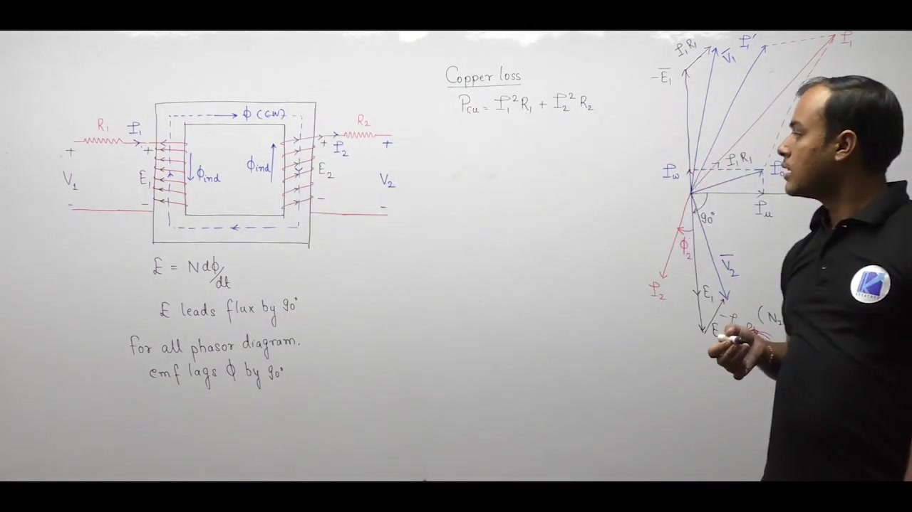

This invariance principle applies directly to winding resistance. The total thermal heat dissipated in both windings must equal the power calculated from the equivalent referred resistance.

### Equivalent Resistance Referred to Primary

The actual total copper loss is:

$$P_{\text{cu}} = I_1^2 R_1 + I_2^2 R_2$$

To refer this loss entirely to the primary winding, we define an equivalent primary resistance $R_{01}$:

$$P_{\text{cu}} = I_1^2 R_{01}$$

Equating the two expressions:

$$I_1^2 R_{01} = I_1^2 R_1 + I_2^2 R_2$$

Dividing both sides by $I_1^2$:

$$R_{01} = R_1 + \left(\frac{I_2}{I_1}\right)^2 R_2$$

Since the turns ratio dictates $\frac{I_2}{I_1} = \frac{N_1}{N_2}$, this simplifies to:

$$R_{01} = R_1 + R_2 \left(\frac{N_1}{N_2}\right)^2 = R_1 + R_2'$$

Here, $R_2' = R_2 \left(\frac{N_1}{N_2}\right)^2$ is the secondary resistance referred to the primary side.

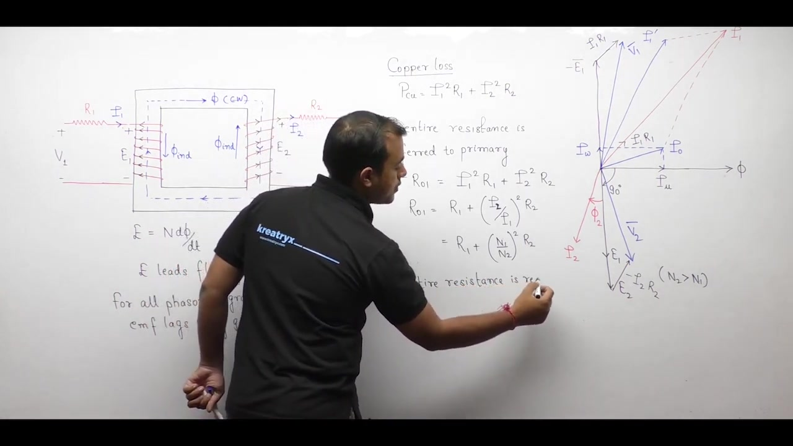

### Equivalent Resistance Referred to Secondary

In the same manner, we can refer all copper losses to the secondary winding:

$$P_{\text{cu}} = I_2^2 R_{02}$$

Equating this to total copper loss:

$$I_2^2 R_{02} = I_1^2 R_1 + I_2^2 R_2$$

Dividing both sides by $I_2^2$:

$$R_{02} = R_2 + \left(\frac{I_1}{I_2}\right)^2 R_1 = R_2 + R_1 \left(\frac{N_2}{N_1}\right)^2 = R_2 + R_1'$$

Here, $R_1' = R_1 \left(\frac{N_2}{N_1}\right)^2$ is the primary resistance referred to the secondary side.

> [!success] Universal Referral Rule
> When referring any impedance from a source side to a destination side, multiply by the square of the turns ratio:
> 
> $$Z_{\text{destination}} = Z_{\text{source}} \left(\frac{N_{\text{destination}}}{N_{\text{source}}}\right)^2$$

### Transition to Leakage Flux

Winding resistance produces an ohmic $IR$ voltage drop. It accounts for real active power loss. 

However, winding resistance cannot account for magnetic leakage. In real transformers, magnetic flux does not remain confined entirely to the steel core.

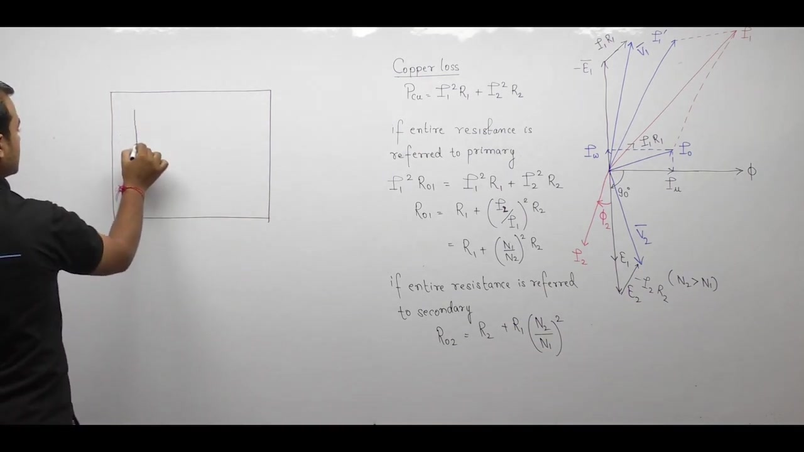

A fraction of the magnetic flux escapes into the air surrounding the coils. This uncoupled flux is called leakage flux.

## Physical Origin of Leakage Flux and Leakage EMF
_(25:08 - 32:46)_

### Magnetic Paths: Core Flux vs Leakage Flux

In an ideal transformer, all magnetic flux remains confined to the ferromagnetic core and links both windings. In a real transformer, the permeability of the core is finite, and air has non-zero permeability ($\mu_0$).

Currents flowing through the windings establish magnetic flux lines along two distinct physical paths:

1. **Mutual Core Path:** Flux that circulates entirely through the iron core, linking both primary and secondary turns.
2. **Leakage Air Path:** Flux that escapes the iron core and completes its closed loop through the air, linking only the winding that produces it.

### Classification of Four Flux Components

When a transformer operates on load, four individual flux components exist:

- $\Phi_{m1}$: Mutual flux component produced by primary current $I_1$.
- $\Phi_{m2}$: Mutual flux component produced by secondary current $I_2$.
- $\Phi_{l1}$: Primary leakage flux linking only the primary turns.
- $\Phi_{l2}$: Secondary leakage flux linking only the secondary turns.

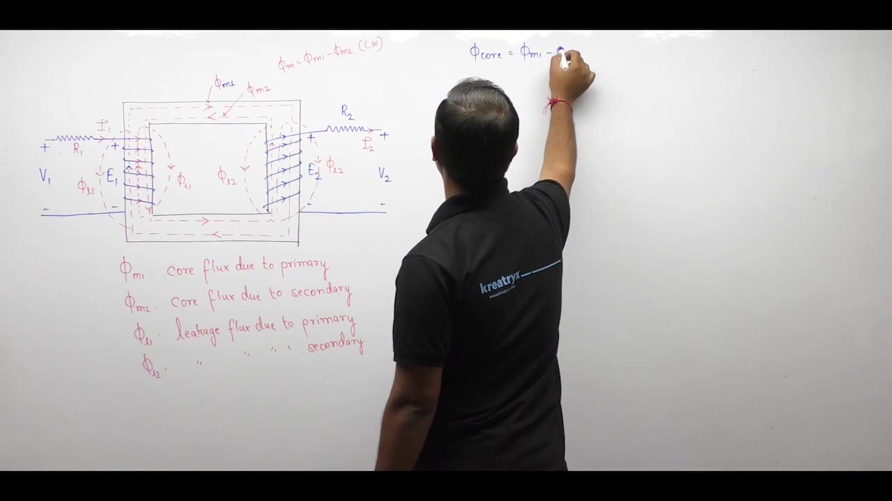

The net working mutual flux inside the iron core is the algebraic difference:

$$\Phi_m = \Phi_{m1} - \Phi_{m2}$$

The total flux linking each winding is the sum of mutual core flux and leakage flux:

$$
\begin{aligned}
\Phi_1 &= \Phi_m + \Phi_{l1} \\
\Phi_2 &= \Phi_m + \Phi_{l2}
\end{aligned}
$$

> [!info] Definition: Leakage Flux
> Leakage flux is that portion of the total magnetic flux that closes through non-magnetic paths (air, insulation, tank walls) and links only one winding without contributing to mutual energy transfer.

### Induced Leakage EMF

According to Faraday's law, a time-varying flux induces an electromotive force proportional to its rate of change. 

Differentiating the total flux linkage of the primary winding:

$$-N_1 \frac{d\Phi_1}{dt} = -N_1 \frac{d\Phi_m}{dt} - N_1 \frac{d\Phi_{l1}}{dt}$$

We identify two separate induced EMF components:

$$e_1 = E_1 + E_{l1}$$

Here, $E_1 = -N_1 \frac{d\Phi_m}{dt}$ is the mutual induced EMF. The term $E_{l1} = -N_1 \frac{d\Phi_{l1}}{dt}$ is the self-induced leakage EMF.

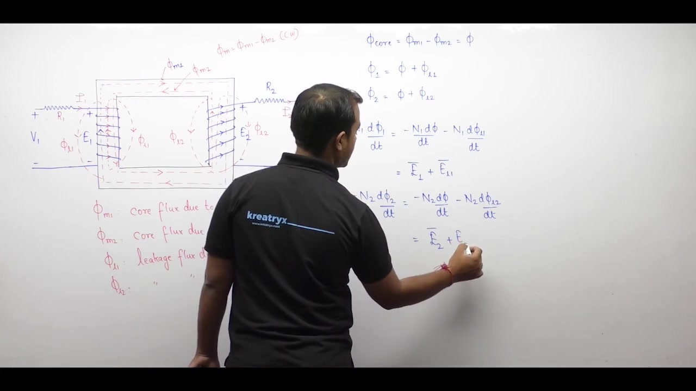

Similarly, differentiating the total flux linkage of the secondary winding:

$$-N_2 \frac{d\Phi_2}{dt} = -N_2 \frac{d\Phi_m}{dt} - N_2 \frac{d\Phi_{l2}}{dt}$$

This yields:

$$e_2 = E_2 + E_{l2}$$

Here, $E_2 = -N_2 \frac{d\Phi_m}{dt}$ is the mutual secondary EMF, and $E_{l2} = -N_2 \frac{d\Phi_{l2}}{dt}$ is the secondary leakage EMF.

> [!success] Dual EMF Result
> Due to leakage flux, every practical transformer winding develops two distinct induced voltages:
> 1. A main EMF induced by mutual core flux.
> 2. A leakage EMF induced by self-linking leakage flux.

## Complete Phasor Diagram with Winding Resistance and Leakage Flux
_(33:00 - 40:12)_

### KVL Equations with Leakage EMF

We update the loop voltage equations to include both mutual and leakage induced EMFs.

On the primary side, the terminal voltage balances the mutual counter-EMF, the leakage counter-EMF, and the resistance drop:

$$\mathbf{V}_1 = -(\mathbf{E}_1 + \mathbf{E}_{l1}) + \mathbf{I}_1 R_1 = -\mathbf{E}_1 - \mathbf{E}_{l1} + \mathbf{I}_1 R_1$$

On the secondary side, the mutual and leakage EMFs drive current through the winding resistance and external load:

$$\mathbf{V}_2 = \mathbf{E}_2 + \mathbf{E}_{l2} - \mathbf{I}_2 R_2$$

### Phase Relationships of Leakage Quantities

To place leakage quantities on the phasor diagram, we establish their phase relationships with respect to winding currents:

1. **Leakage Flux Phase:** Magnetic flux is produced directly by current. Therefore, the primary leakage flux $\mathbf{\Phi}_{l1}$ lies in phase with primary current $\mathbf{I}_1$. The secondary leakage flux $\mathbf{\Phi}_{l2}$ lies in phase with secondary current $\mathbf{I}_2$.
2. **Leakage EMF Phase:** Because $e_l = -N \frac{d\phi_l}{dt}$, induced leakage EMF lags leakage flux by $90^\circ$.

> [!info] Leakage Phase Rule
> Leakage flux is in phase with the winding current that produces it. The resulting leakage EMF lags that winding current by $90^\circ$.

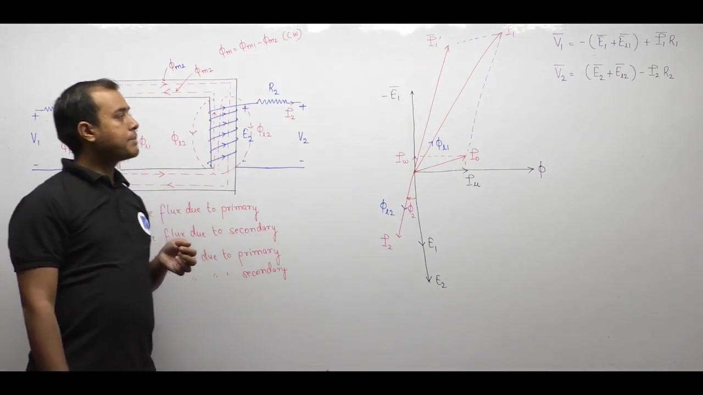

### Constructing the Complete Phasor Diagram

We combine all active, reactive, and loss mechanisms into one unified phasor diagram:

1. Draw mutual core flux $\mathbf{\Phi}$ horizontally. Draw $\mathbf{I}_\mu$ along $\mathbf{\Phi}$.
2. Draw mutual EMFs $\mathbf{E}_1$ and $\mathbf{E}_2$ lagging $\mathbf{\Phi}$ by $90^\circ$. Draw $-\mathbf{E}_1$ vertically upward.
3. Draw core loss current $\mathbf{I}_w$ along $-\mathbf{E}_1$. Combine with $\mathbf{I}_\mu$ to form no-load current $\mathbf{I}_0$.
4. Draw secondary load current $\mathbf{I}_2$ lagging $\mathbf{E}_2$ by load angle $\phi_2$.
5. Draw reflected load current $\mathbf{I}_1'$ opposite to $\mathbf{I}_2$. Add $\mathbf{I}_0$ and $\mathbf{I}_1'$ to obtain total primary current $\mathbf{I}_1$.
6. Draw primary leakage flux $\mathbf{\Phi}_{l1}$ in phase with $\mathbf{I}_1$. Draw $\mathbf{E}_{l1}$ lagging $\mathbf{I}_1$ by $90^\circ$.
7. In the primary KVL, the term $-\mathbf{E}_{l1}$ appears. Because $\mathbf{E}_{l1}$ lags $\mathbf{I}_1$ by $90^\circ$, its negative $-\mathbf{E}_{l1}$ leads $\mathbf{I}_1$ by $90^\circ$.
8. From the tip of $-\mathbf{E}_1$, add $-\mathbf{E}_{l1}$ leading $\mathbf{I}_1$ by $90^\circ$. From that point, add $\mathbf{I}_1 R_1$ parallel to $\mathbf{I}_1$. The resulting vector from the origin is $\mathbf{V}_1$.
9. For the secondary, add $\mathbf{E}_{l2}$ (lagging $\mathbf{I}_2$ by $90^\circ$) to $\mathbf{E}_2$. Then subtract $\mathbf{I}_2 R_2$ (antiparallel to $\mathbf{I}_2$) to obtain $\mathbf{V}_2$.

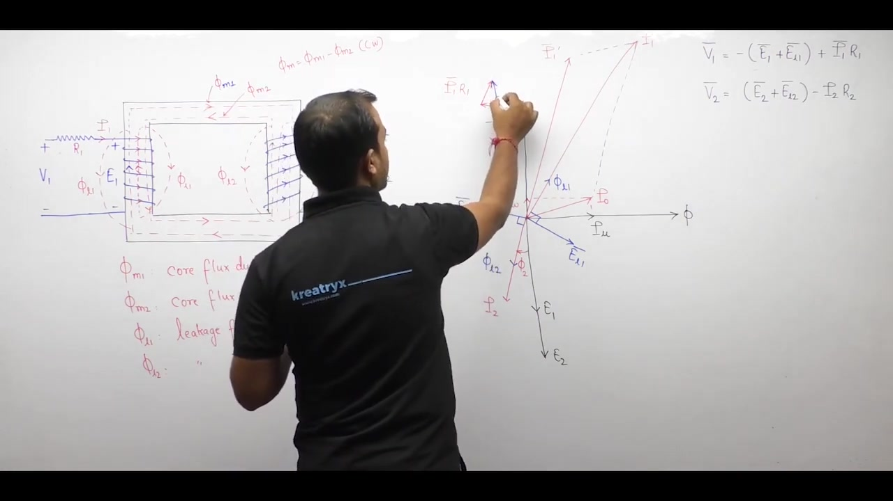

This complete phasor diagram accounts for all physical phenomena inside a practical transformer under load.

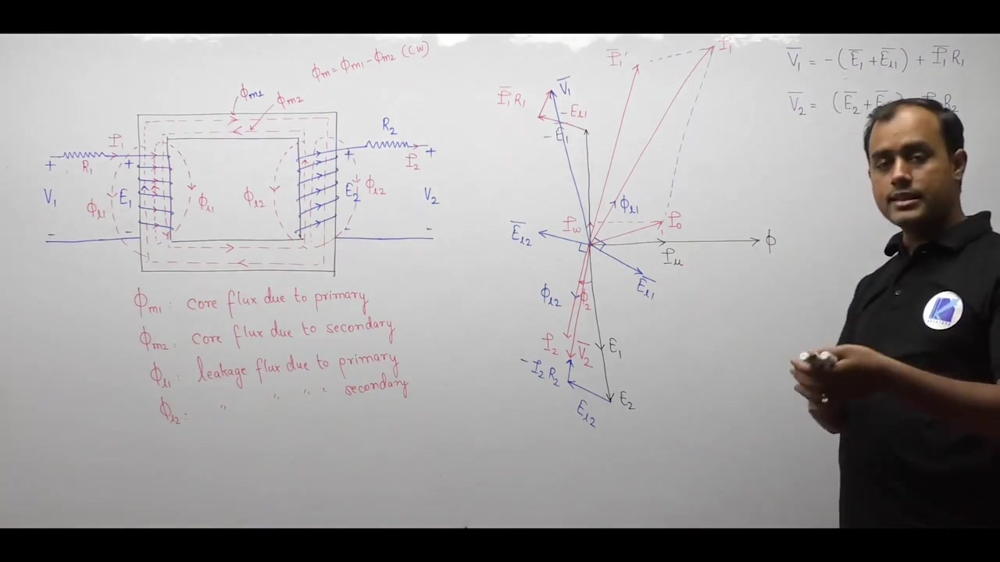

### Significance of the Minus Leakage EMF Term

Notice the term $-\mathbf{E}_{l1}$ in the primary KVL equation.

Because $\mathbf{E}_{l1}$ lags $\mathbf{I}_1$ by $90^\circ$, the term $-\mathbf{E}_{l1}$ leads $\mathbf{I}_1$ by $90^\circ$. A voltage that leads current by $90^\circ$ is identical to the voltage across an inductor:

$$V_L = j \omega L I$$

This equivalence provides the physical basis for modeling leakage flux as an inductive reactance.

## Modeling Leakage Flux as Reactance and Equivalent Circuit Synthesis
_(40:12 - 50:03)_

### Representation of Leakage EMF as an Inductive Drop

Leakage flux paths close primarily through air. Because air has a constant magnetic permeability $\mu_0$, leakage flux is directly proportional to the winding current producing it:

$$\Phi_{l1} \propto I_1, \quad \Phi_{l2} \propto I_2$$

Because leakage flux is proportional to current, the induced leakage EMF is also proportional to current:

$$E_{l1} \propto I_1, \quad E_{l2} \propto I_2$$

We already proved that leakage EMF lags coil current by $90^\circ$. Therefore, the counter-EMF term $-E_{l1}$ leads current $I_1$ by $90^\circ$.

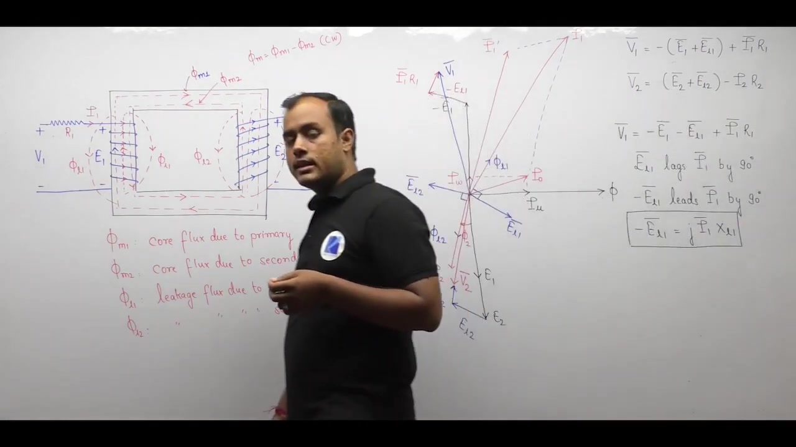

In AC circuit analysis, a $90^\circ$ leading phase shift is represented by the imaginary operator $+j$. The proportionality constant has dimensions of ohms ($\Omega$). We define this constant as the leakage reactance:

$$-E_{l1} = +j I_1 X_{l1}$$

Here, $X_{l1} = \omega L_{l1}$ is the primary leakage reactance.

Similarly, for the secondary winding, $E_{l2}$ lags $I_2$ by $90^\circ$. So we write:

$$E_{l2} = -j I_2 X_{l2}$$

Here, $X_{l2} = \omega L_{l2}$ is the secondary leakage reactance.

### Modified Terminal Voltage Equations

Substituting these reactance drops into the KVL equations:

$$
\begin{aligned}
\mathbf{V}_1 &= -\mathbf{E}_1 + \mathbf{I}_1 R_1 + j \mathbf{I}_1 X_{l1} = -\mathbf{E}_1 + \mathbf{I}_1 \left(R_1 + j X_{l1}\right) \\
\mathbf{V}_2 &= \mathbf{E}_2 - \mathbf{I}_2 R_2 - j \mathbf{I}_2 X_{l2} = \mathbf{E}_2 - \mathbf{I}_2 \left(R_2 + j X_{l2}\right)
\end{aligned}
$$

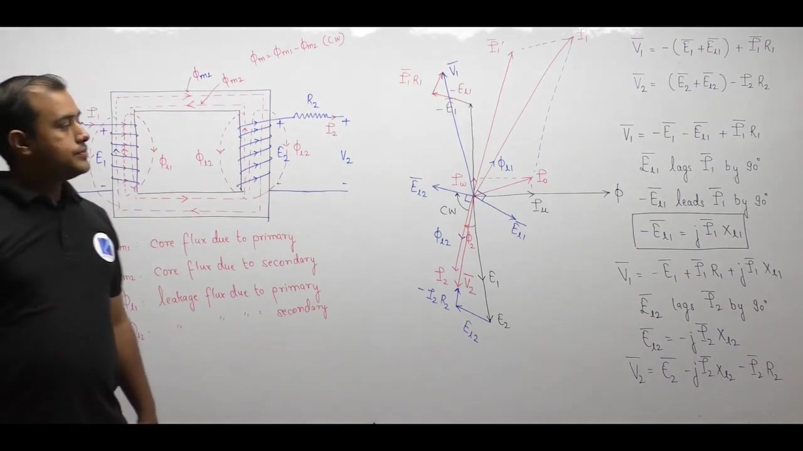

We define the series winding impedances:

$$
\begin{aligned}
\mathbf{Z}_1 &= R_1 + j X_{l1} \\
\mathbf{Z}_2 &= R_2 + j X_{l2}
\end{aligned}
$$

The loop equations simplify to standard network form:

$$
\begin{aligned}
\mathbf{V}_1 &= -\mathbf{E}_1 + \mathbf{I}_1 \mathbf{Z}_1 \\
\mathbf{V}_2 &= \mathbf{E}_2 - \mathbf{I}_2 \mathbf{Z}_2
\end{aligned}
$$

> [!info] Definition: Leakage Reactance
> Leakage reactance is a fictitious linear circuit parameter that models the voltage drop caused by physical leakage flux. It does not exist as a physical coiled inductor inside the transformer.

### Leakage Reactance Referral

Leakage reactances transfer across windings following the same impedance referral rules as winding resistances.

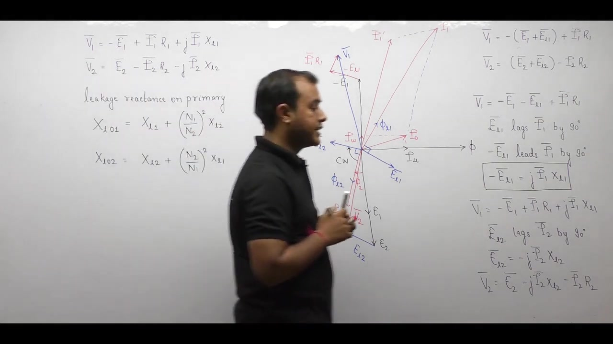

When referred to the primary winding:

$$X_{l01} = X_{l1} + X_{l2} \left(\frac{N_1}{N_2}\right)^2 = X_{l1} + X_{l2}'$$

When referred to the secondary winding:

$$X_{l02} = X_{l2} + X_{l1} \left(\frac{N_2}{N_1}\right)^2 = X_{l2} + X_{l1}'$$

### Synthesis of the Complete Equivalent Circuit

We now combine all series and shunt parameters into the complete equivalent circuit of the practical transformer.

The equivalent circuit consists of three connected sections:

1. **Primary Series Branch:** Resistor $R_1$ and leakage reactance $X_{l1}$ carrying total primary current $\mathbf{I}_1$.
2. **Parallel Exciting Shunt Branch:** Core loss resistance $R_c$ and magnetizing reactance $X_m$ carrying excitation current $\mathbf{I}_0$.
3. **Ideal Transformer Core:** Windings with turns ratio $N_1 : N_2$ carrying counter-balancing current $\mathbf{I}_1'$ on the primary and load current $\mathbf{I}_2$ on the secondary.
4. **Secondary Series Branch:** Resistor $R_2$ and leakage reactance $X_{l2}$ carrying secondary load current $\mathbf{I}_2$.

This complete equivalent circuit accurately replicates the terminal behavior of the physical machine.

## Circuit Conventions, Numerical Rules, and Roadmap
_(50:03 - 54:17)_

### Circuit Model vs Phasor Diagram Conventions

In the phasor diagram, we introduced $-E_1$ so that induced EMF could be drawn lagging mutual flux by $90^\circ$. 

In the actual circuit model, we omit this artificial negative sign. The primary terminal voltage is simply related to the primary counter-EMF by standard circuit laws:

$$\mathbf{V}_1 = \mathbf{E}_1 + \mathbf{I}_1 \mathbf{Z}_1$$

Here, $\mathbf{Z}_1 = R_1 + j X_{l1}$. 

Similarly, the secondary terminal voltage satisfies:

$$\mathbf{E}_2 = \mathbf{V}_2 + \mathbf{I}_2 \mathbf{Z}_2 \implies \mathbf{V}_2 = \mathbf{E}_2 - \mathbf{I}_2 \mathbf{Z}_2$$

Here, $\mathbf{Z}_2 = R_2 + j X_{l2}$.

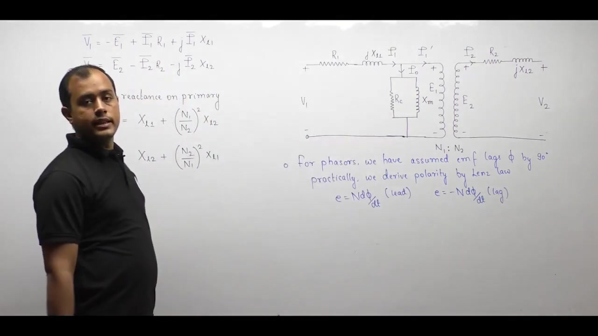

### Essential Rules for Numerical Calculations

Students often become confused when solving numerical problems because phasor diagrams show $180^\circ$ phase inversions. 

The $180^\circ$ inversion on the phasor diagram exists purely to illustrate Lenz's law MMF cancellation visually.

> [!success] Numerical Analysis Invariants
> In all circuit and network calculations:
> - Induced EMFs $\mathbf{E}_1$ and $\mathbf{E}_2$ have identical phase angles: $\angle E_1 = \angle E_2$.
> - Reflected load current $\mathbf{I}_1'$ and secondary current $\mathbf{I}_2$ have identical phase angles: $\angle I_1' = \angle I_2$.

Treating $\mathbf{E}_1$ and $\mathbf{E}_2$ in the same phase avoids polarity errors when solving transformer circuits.

### Polarity Conventions Across Electrical Machines

When physical winding details are visible:
1. Determine induced EMF polarity using Lenz's law.
2. If the chosen reference polarity matches Lenz's law, write $e = +N \frac{d\phi}{dt}$.
3. If the reference polarity opposes Lenz's law, write $e = -N \frac{d\phi}{dt}$.

When physical coil winding details are omitted, as in rotating AC and DC machines, standard practice universally uses:

$$e = -N \frac{d\phi}{dt}$$

### Practical Roadmap: The Approximate Equivalent Circuit

We have developed the exact equivalent circuit of the practical transformer.

However, solving the exact circuit requires resolving two coupled loops separated by a shunt branch. In power system studies with hundreds of transformers, this exact model is computationally cumbersome.

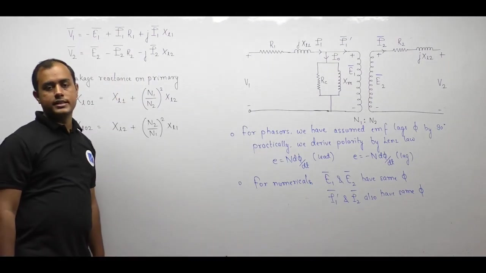

In the next lecture, we simplify this model:

1. **Referred Circuits:** Moving all impedances to either the primary or secondary side.
2. **Approximate Equivalent Circuit:** Shifting the parallel excitation branch to the input terminals.
3. **Per-Unit Representation:** Normalizing transformer impedances on standard power and voltage bases.

---

## Summary and Key Takeaways

- Winding resistances $R_1$ and $R_2$ are placed in series with the coils, creating ohmic voltage drops $I_1 R_1$ and $I_2 R_2$ and causing total copper loss $P_{\text{cu}} = I_1^2 R_1 + I_2^2 R_2$.
- Based on power invariance, total winding resistance referred to the primary is $R_{01} = R_1 + R_2 \left(\frac{N_1}{N_2}\right)^2$, and referred to the secondary is $R_{02} = R_2 + R_1 \left(\frac{N_2}{N_1}\right)^2$.
- Leakage fluxes $\Phi_{l1}$ and $\Phi_{l2}$ close through air paths around individual windings, linking only their own turns without contributing to mutual coupling.
- Time-varying leakage fluxes induce leakage EMFs $E_{l1}$ and $E_{l2}$ that lag their respective winding currents by $90^\circ$.
- Because leakage paths lie primarily in air, leakage flux is proportional to current, allowing leakage EMF to be modeled as an inductive drop $-E_l = j I X_l$.
- Leakage reactances refer across windings by the turns ratio squared: $X_{l01} = X_{l1} + X_{l2}\left(\frac{N_1}{N_2}\right)^2$ and $X_{l02} = X_{l2} + X_{l1}\left(\frac{N_2}{N_1}\right)^2$.
- The complete equivalent circuit combines series winding impedances $\mathbf{Z}_1 = R_1 + j X_{l1}$ and $\mathbf{Z}_2 = R_2 + j X_{l2}$ with the parallel exciting branch ($R_c \parallel j X_m$) and central ideal turns ratio.
- In numerical network calculations, induced EMFs $\mathbf{E}_1$ and $\mathbf{E}_2$ share the same phase angle, and currents $\mathbf{I}_1'$ and $\mathbf{I}_2$ share the same phase angle.

