# Electrical Machines | Lec 14 | Practical Transformer (Part 3) | GATE Electrical Engineering

- **Source**: https://www.youtube.com/watch?v=fcMvjUicjtA
- **Duration**: 01:10:45
- **Compiled**: 2026-09-19

---

## Overview

This lecture develops the exact and approximate equivalent circuit representations of practical transformers. It explains how parameters reflect across the ideal core to eliminate coupled windings and form single-loop T-networks. Shifting the exciting shunt branch to the terminal pair produces the standard approximate circuit and combines series impedances into lumped parameters. The lecture analyzes the four mathematical errors introduced by this approximation and proves the invariance of per-unit transformer impedances. A complete step-up transformer problem illustrates voltage regulation, input power factor, and operating efficiency.

## Contents

- [[#Exact Equivalent Circuit and the Referral Concept|Exact Equivalent Circuit and the Referral Concept]]
- [[#Exact Equivalent Circuit Referred to Primary Side|Exact Equivalent Circuit Referred to Primary Side]]
- [[#Exact Equivalent Circuit Referred to Secondary Side|Exact Equivalent Circuit Referred to Secondary Side]]
- [[#Need for the Approximate Equivalent Circuit|Need for the Approximate Equivalent Circuit]]
- [[#Topologies of the Approximate Equivalent Circuit|Topologies of the Approximate Equivalent Circuit]]
- [[#Consequences of the Approximate Circuit: Core and No-Load Losses|Consequences of the Approximate Circuit: Core and No-Load Losses]]
- [[#Magnetizing Current Error and Introduction to the Per-Unit Model|Magnetizing Current Error and Introduction to the Per-Unit Model]]
- [[#Base Quantities and Impedance Normalization|Base Quantities and Impedance Normalization]]
- [[#Proof of Per-Unit Impedance Invariance|Proof of Per-Unit Impedance Invariance]]
- [[#Complete Per-Unit Equivalent Circuit and Global Invariance|Complete Per-Unit Equivalent Circuit and Global Invariance]]
- [[#Problem Formulation: Transformer Equivalent Circuit Analysis|Problem Formulation: Transformer Equivalent Circuit Analysis]]
- [[#Solution Part 1: Secondary Terminal Voltage and Loading Principles|Solution Part 1: Secondary Terminal Voltage and Loading Principles]]
- [[#Solution Parts 2 and 3: Currents, Power Factor, and Efficiency|Solution Parts 2 and 3: Currents, Power Factor, and Efficiency]]

---

## Exact Equivalent Circuit and the Referral Concept
_(00:12 - 04:53)_

### Recap of the Practical Transformer Model

In the previous lecture, all non-idealities were incorporated into the transformer model. These non-idealities include winding resistances, leakage reactances, finite core permeability, and core losses. Combining these effects gives the complete physical circuit representation.

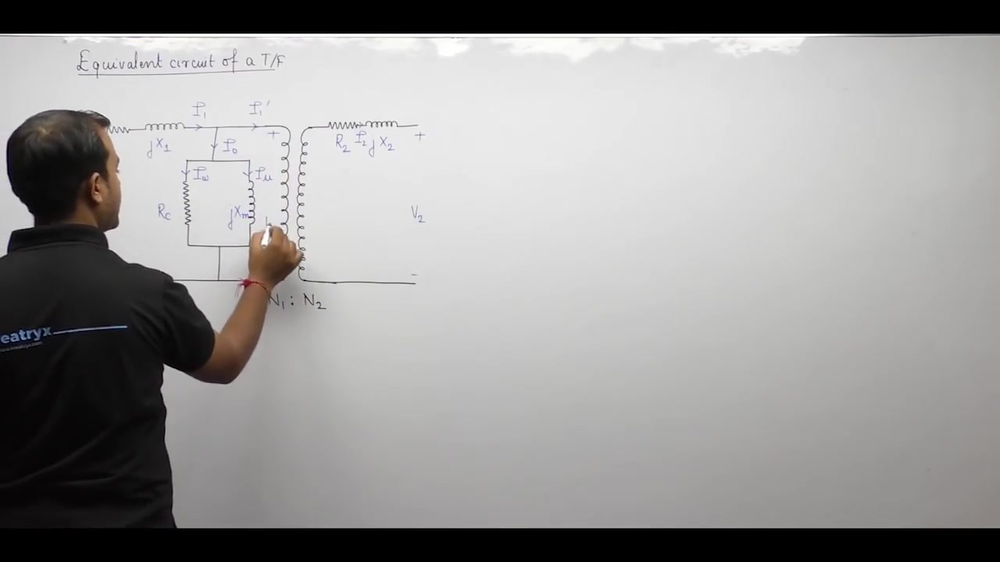

The primary side contains the series winding resistance $R_1$ and primary leakage reactance $X_1$. In parallel across the induced voltage $E_1$, the exciting branch models core behavior. The resistance $R_c$ accounts for core loss current $I_w$. The magnetizing reactance $X_m$ draws the magnetizing current $I_\mu$. Together, these form the no-load excitation current:

$$\mathbf{I}_0 = \mathbf{I}_w + \mathbf{I}_\mu$$

At the center stands an ideal two-winding transformer with turns ratio $N_1 : N_2$. The secondary side includes the winding resistance $R_2$ and leakage reactance $X_2$. When a load connects across terminals $V_2$, the secondary current $I_2$ flows. This load current reflects back to the primary as the counter-balancing component $I_1'$. Total primary current is the phasor sum:

$$\mathbf{I}_1 = \mathbf{I}_0 + \mathbf{I}_1'$$

### Motivation for Referring Parameters

The full physical circuit spans two isolated electrical domains. Magnetic coupling across the ideal core separates the primary and secondary networks. Solving this circuit directly requires framing two distinct sets of mesh equations. One set handles primary voltages and currents. The second set handles secondary variables. These two sets link only through the ideal turns ratio constraints:

$$\frac{\mathbf{E}_1}{\mathbf{E}_2} = \frac{N_1}{N_2}, \quad \frac{\mathbf{I}_1'}{\mathbf{I}_2} = \frac{N_2}{N_1}$$

Handling variables on both sides complicates network calculations. The analysis becomes much simpler if all parameters are transferred to a single side.

> [!info] Principle of Circuit Referral
> In the exact equivalent circuit, parameters exist on both sides of the ideal transformer. Referring the entire circuit to one side eliminates the ideal core from calculations. This cuts the number of unknown circuit variables in half. All network laws can then be applied directly within a single electrical loop.

Most often, the circuit is referred to the primary side because it connects to the source. Alternatively, it can be referred to the secondary load side.

## Exact Equivalent Circuit Referred to Primary Side
_(04:57 - 10:36)_

### Rules for Parameter Referral

Referring parameters across an ideal transformer follows three basic scaling rules:

1. **Voltages** scale directly with the turns ratio:
   $$\frac{V_p}{V_s} = \frac{N_1}{N_2}$$
2. **Currents** scale inversely with the turns ratio:
   $$\frac{I_p}{I_s} = \frac{N_2}{N_1}$$
3. **Impedances** scale with the square of the turns ratio:
   $$Z_p = Z_s \left(\frac{N_1}{N_2}\right)^2$$

When referring from secondary to primary, multiply impedances by $(N_1/N_2)^2$. When referring from primary to secondary, multiply impedances by $(N_2/N_1)^2$.

### Constructing the Primary-Referred Circuit

To refer the entire transformer circuit to the primary side, start with the primary series and shunt elements. The primary series impedance consists of winding resistance $R_1$ and leakage reactance $X_1$. The parallel shunt branch across the induced EMF consists of core loss resistance $R_c$ and magnetizing reactance $X_m$.

Next, reflect each secondary parameter across the ideal transformer core.

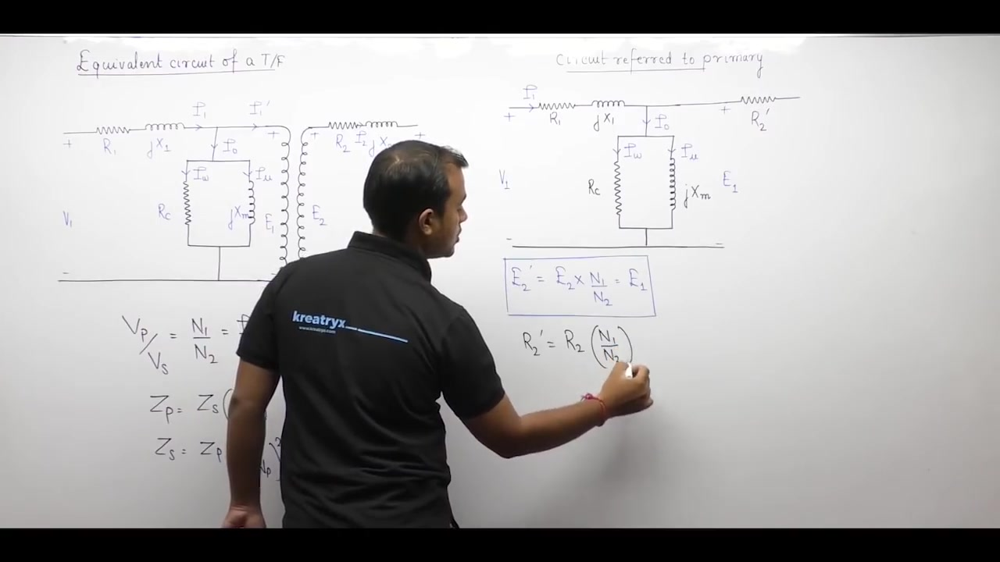

First, consider the secondary induced EMF $E_2$. Referring it to the primary yields:

$$E_2' = E_2 \left(\frac{N_1}{N_2}\right)$$

Because the ratio of induced EMFs equals the turns ratio, $E_2'$ is identical to $E_1$:

$$E_2' = E_1$$

So $E_2$ does not need a separate node. It merges directly with $E_1$ across the shunt branch.

Next, reflect the secondary series winding resistance $R_2$ and leakage reactance $X_2$:

$$\begin{aligned}
R_2' &= R_2 \left(\frac{N_1}{N_2}\right)^2 \\
X_2' &= X_2 \left(\frac{N_1}{N_2}\right)^2
\end{aligned}$$

Now consider the secondary load current $I_2$. Its reflected value on the primary is:

$$I_2' = I_2 \left(\frac{N_2}{N_1}\right)$$

This reflected current is precisely the load component $I_1'$. It flows through the referred secondary series branch.

Finally, reflect the secondary terminal voltage $V_2$:

$$V_2' = V_2 \left(\frac{N_1}{N_2}\right)$$

> [!success] Exact Primary-Referred T-Circuit
> The resulting circuit forms a continuous T-network. The series elements $R_1 + j X_1$ and $R_2' + j X_2'$ form the horizontal arms. The shunt exciting branch $R_c \parallel j X_m$ forms the vertical center leg. The ideal transformer is completely eliminated.
> 
> $$\begin{aligned}
> \mathbf{I}_1 &= \mathbf{I}_0 + \mathbf{I}_1' \\
> \mathbf{E}_1 &= \mathbf{V}_1 - \mathbf{I}_1 (R_1 + j X_1) \\
> \mathbf{V}_2' &= \mathbf{E}_1 - \mathbf{I}_1' (R_2' + j X_2')
> \end{aligned}$$

### Advantage of the Primary-Referred Model

This model speeds up network calculations. Suppose you need to find the secondary load voltage $V_2$ for a given input $V_1$. In the original physical circuit, you must calculate $E_1$ first. Then you scale $E_1$ to find $E_2$. Finally, you solve the secondary mesh to get $V_2$.

In the referred T-circuit, you solve directly for $V_2'$ in one single network step. Then you divide $V_2'$ by $(N_1/N_2)$ to get the actual secondary terminal voltage $V_2$.

## Exact Equivalent Circuit Referred to Secondary Side
_(10:41 - 15:35)_

### Parameter Reflection from Primary to Secondary

Now consider transferring all primary parameters to the secondary side. This refers the entire network to the load side. Always draw the circuit from left to right in physical sequence.

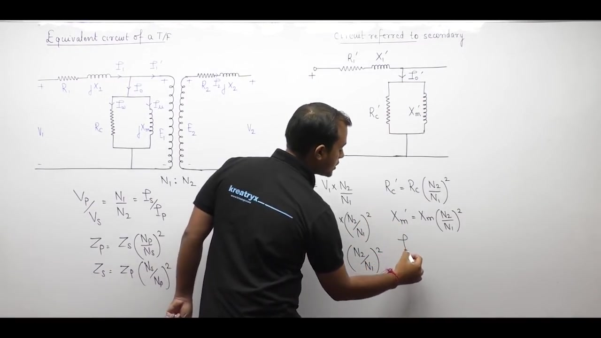

When transferring from primary to secondary, the referral ratio is $(N_2/N_1)$. Every primary quantity must be scaled accordingly:

1. **Supply Voltage**:
   $$V_1' = V_1 \left(\frac{N_2}{N_1}\right)$$
2. **Primary Winding Resistance and Reactance**:
   $$\begin{aligned}
   R_1' &= R_1 \left(\frac{N_2}{N_1}\right)^2 \\
   X_1' &= X_1 \left(\frac{N_2}{N_1}\right)^2
   \end{aligned}$$
3. **Shunt Exciting Branch**:
   The parallel core branch was originally located on the primary side. It must also be referred to the secondary:
   $$\begin{aligned}
   R_c' &= R_c \left(\frac{N_2}{N_1}\right)^2 \\
   X_m' &= X_m \left(\frac{N_2}{N_1}\right)^2
   \end{aligned}$$
4. **Primary Currents**:
   Currents scale with the inverse ratio $(N_1/N_2)$. The referred total primary current is denoted $I_1''$:
   $$I_1'' = I_1 \left(\frac{N_1}{N_2}\right)$$
   Similarly, the referred no-load current becomes:
   $$I_0' = I_0 \left(\frac{N_1}{N_2}\right)$$
5. **Induced EMF**:
   Transferring $E_1$ across the ideal core gives:
   $$E_1' = E_1 \left(\frac{N_2}{N_1}\right) = E_2$$
   The reflected primary EMF equals the secondary induced EMF $E_2$.

### Structure of the Secondary-Referred Network

The secondary winding parameters $R_2$ and $X_2$ remain in their original, unscaled values. The load terminal voltage $V_2$ and load current $I_2$ also stay unscaled.

> [!info] Terminal Voltages and Internal EMFs
> In any referred transformer circuit, the two outer ends always represent terminal voltages. In the primary-referred circuit, the terminals are $V_1$ and $V_2'$. In the secondary-referred circuit, the terminals are $V_1'$ and $V_2$.
> 
> The internal induced EMF always appears across the parallel shunt branch. In the primary model, this shunt voltage is $E_1$. In the secondary model, this shunt voltage is $E_2$.

Notice that referring to the secondary requires scaling four circuit elements: $R_1, X_1, R_c,$ and $X_m$. Referring to the primary only requires scaling two elements: $R_2$ and $X_2$. For this reason, circuits are most often referred to the primary side.

## Need for the Approximate Equivalent Circuit
_(15:39 - 20:28)_

### Limitations of the Exact T-Model

The exact referred circuit eliminates the ideal transformer. Even so, hand calculations remain tedious.

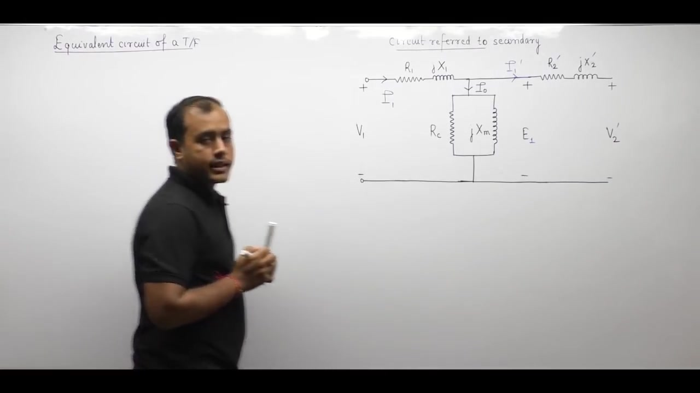

The difficulty comes from the central shunt branch $R_c \parallel j X_m$. In the exact T-model, this branch sits directly between the primary and secondary series branches. The input voltage $V_1$ divides across the primary impedance $R_1 + j X_1$ before reaching the shunt branch. The voltage across the shunt branch is the induced EMF $E_1$:

$$\mathbf{E}_1 = \mathbf{V}_1 - \mathbf{I}_1 (R_1 + j X_1)$$

Because $I_1$ depends on the load current $I_1'$, the node voltage $E_1$ changes with load. Calculating load voltage and branch currents requires solving simultaneous equations. In an exam or field environment, solving these equations by hand takes too much time.

### Objectives of Circuit Modeling

The primary purpose of an equivalent circuit is paper-based analysis. An engineer models a machine to predict physical performance. The predicted results must match the real transformer operating in the field.

> [!info] Modeling Tradeoff
> Any circuit approximation must balance mathematical simplicity with engineering accuracy. The model should simplify calculations without introducing large discrepancies. If the calculated numbers stray far from actual measured values, the model fails.

### Shifting the Shunt Branch

The core problem is the location of the shunt branch. If it did not sit in the center, network analysis would be simple.

Two choices exist:

1. **Shift to the source side**: Move the shunt branch directly across the input terminals $V_1$.
2. **Shift to the load side**: Move the shunt branch directly across the output terminals $V_2'$.

Both choices place the shunt branch at a terminal pair. This moves the parallel branch out from between the series impedances. In the next section, we examine the primary-terminal shift in detail.

## Topologies of the Approximate Equivalent Circuit
_(20:31 - 26:41)_

### Shifting Shunt Branch to Input Terminals

Consider shifting the exciting shunt branch $R_c \parallel j X_m$ from the internal node to the input terminals $V_1$.

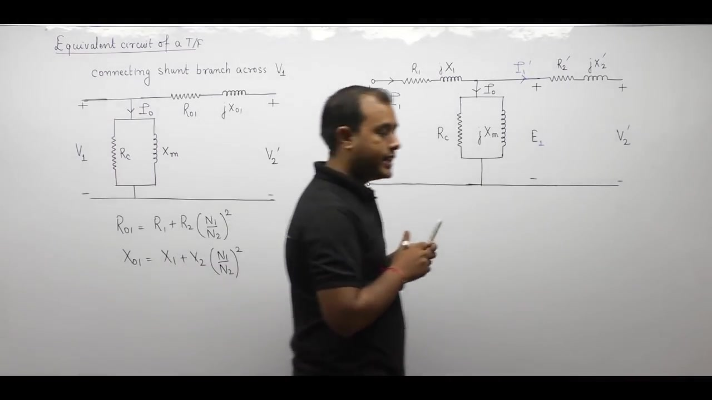

When the shunt branch moves to the left, no element branches off between $R_1 + j X_1$ and $R_2' + j X_2'$. These two series impedances now sit directly in series. Because they are in series, they add directly:

$$\begin{aligned}
R_{01} &= R_1 + R_2' = R_1 + R_2 \left(\frac{N_1}{N_2}\right)^2 \\
X_{01} &= X_1 + X_2' = X_1 + X_2 \left(\frac{N_1}{N_2}\right)^2 \\
Z_{01} &= R_{01} + j X_{01}
\end{aligned}$$

Here $R_{01}$ represents the total winding resistance referred to the primary. $X_{01}$ represents the total leakage reactance referred to the primary.

Now the entire series network condenses into a single lumped impedance $Z_{01}$.

### The Key Tradeoff: Loss of Induced EMF

Combining the series impedances creates one major drawback. The junction between $R_1 + j X_1$ and $R_2' + j X_2'$ was the internal node for induced EMF $E_1$. Once these parameters are merged into $R_{01}$ and $X_{01}$, that internal node vanishes.

> [!info] Observation of Induced EMF
> In the approximate equivalent circuit with merged parameters, the internal induced EMF cannot be observed.
> Only terminal voltages $V_1$ and $V_2'$ are accessible.
> To determine induced EMF, one must either use the exact T-circuit or keep primary and secondary series impedances separate.

### Alternate Topology: Shunt Branch on Load Side

The second possibility is shifting the shunt branch to the right across the load terminals $V_2'$.

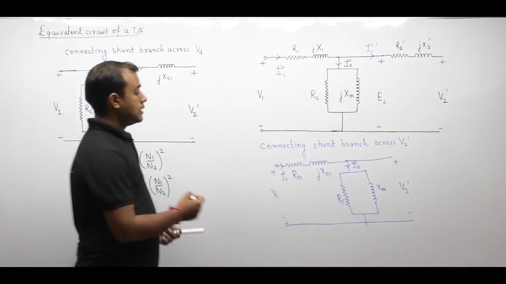

Here the merged series impedance $Z_{01}$ comes first. The shunt branch connects directly across the referred load voltage $V_2'$. Once again, the series parameters merge into $Z_{01}$, so the induced EMF remains hidden.

Both configurations are valid approximations. Standard textbooks and competitive examinations adopt the first circuit.

> [!success] Standard Approximate Circuit
> The circuit with the shunt branch connected across the input supply terminals $V_1$ is the standard model. Use this standard circuit in all numerical problems unless the question explicitly specifies otherwise.

## Consequences of the Approximate Circuit: Core and No-Load Losses
_(26:44 - 32:22)_

### Core Loss Overestimation

The core loss resistance $R_c$ represents active power dissipated in the magnetic core.

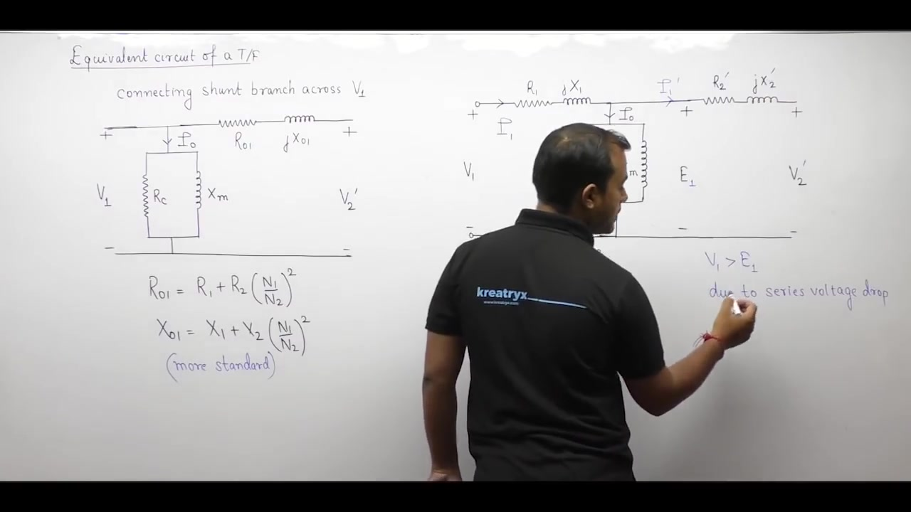

In the exact physical circuit, the voltage across $R_c$ is the induced EMF $E_1$. The exact core loss is:

$$P_{c,\text{exact}} = \frac{E_1^2}{R_c}$$

In the approximate circuit, the voltage across $R_c$ is the supply voltage $V_1$. The calculated core loss becomes:

$$P_{c,\text{approx}} = \frac{V_1^2}{R_c}$$

For inductive or lagging power factor loads, a series voltage drop occurs across the primary impedance $R_1 + j X_1$. Therefore:

$$V_1 > E_1$$

Because $V_1$ exceeds $E_1$, the ratio $V_1^2/R_c$ exceeds $E_1^2/R_c$:

$$P_{c,\text{approx}} > P_{c,\text{exact}}$$

> [!info] Consequence 1: Core Losses Overestimated
> In the approximate equivalent circuit, calculated core losses are higher than actual core losses. The approximate circuit overestimates core losses for lagging power factor operation.

### No-Load Copper Losses Ignored

Now consider the transformer operating under no-load conditions. The secondary winding is open, so $I_2 = 0$. The reflected load component on the primary is also zero:

$$I_1' = 0$$

In the exact physical transformer, the total primary current equals the excitation current:

$$I_1 = I_0$$

This current flows through the primary winding resistance $R_1$. It generates a real copper loss:

$$P_{\text{cu, no-load}} = I_0^2 R_1$$

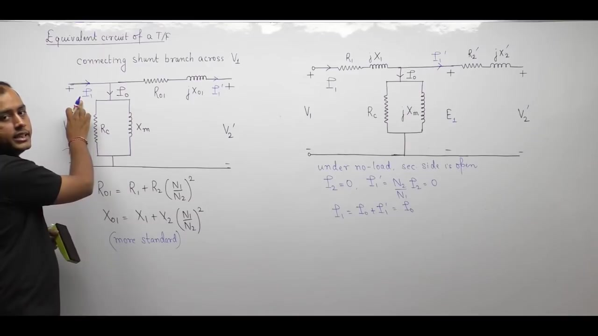

In the approximate equivalent circuit, the shunt branch sits directly across the input terminals. The current entering the series branch $R_{01}$ is only the load component $I_1'$. Under no load, $I_1' = 0$. No current flows through $R_{01}$.

> [!info] Consequence 2: No-Load Copper Losses Neglected
> In the approximate equivalent circuit, copper loss at no load is completely ignored. The $I_0^2 R_1$ heating in the primary winding is omitted because $I_0$ bypasses the series resistance.

### No-Load Series Voltage Drop Ignored

In the exact circuit, the no-load current $I_0$ flows through $R_1 + j X_1$. This creates an internal series voltage drop:

$$\Delta V_{\text{no-load}} = \mathbf{I}_0 (R_1 + j X_1)$$

In the approximate circuit, $I_0$ flows only through the parallel shunt branch. No excitation current passes through the series branch.

> [!info] Consequence 3: No-Load Series Drop Neglected
> In the approximate equivalent circuit, the no-load voltage drop across primary resistance $R_1$ and leakage reactance $X_1$ is ignored.

## Magnetizing Current Error and Introduction to the Per-Unit Model
_(32:22 - 37:17)_

### Magnetizing Current Overestimation

The magnetizing reactance $X_m$ draws reactive current $I_\mu$ to establish mutual flux in the core.

In the exact physical circuit, the voltage across $X_m$ is the induced EMF $E_1$. The exact magnetizing current is:

$$I_{\mu,\text{exact}} = \frac{E_1}{X_m}$$

In the approximate circuit, the voltage across $X_m$ is the input voltage $V_1$. The calculated magnetizing current becomes:

$$I_{\mu,\text{approx}} = \frac{V_1}{X_m}$$

For lagging loads, $V_1 > E_1$ due to series impedance drop. Because the numerator is larger, the approximate current exceeds the exact value:

$$I_{\mu,\text{approx}} > I_{\mu,\text{exact}}$$

> [!info] Consequence 4: Magnetizing Current Overestimated
> In the approximate equivalent circuit, calculated magnetizing current is larger than in the exact circuit. The model overestimates the reactive excitation demand under lagging conditions.

### Practical Justification for the Approximate Model

Theoretical analysis shows four distinct discrepancies:
1. Core loss is overestimated.
2. No-load copper loss is neglected.
3. No-load series voltage drop is neglected.
4. Magnetizing current is overestimated.

Even with these four differences, always use the approximate circuit for numerical problems. The exact T-network equations are too lengthy for hand calculations. Exact modeling is suited for computer simulation. For exams and engineering estimates, the approximate circuit gives quick answers with less than $1\%$ to $2\%$ error.

### Foundations of the Per-Unit Model

Next, consider representing the transformer in the per-unit system.

A two-winding transformer possesses a single power rating: $S\text{ kVA}$. But it has two distinct voltage levels: $V_1$ on the primary and $V_2$ on the secondary.

> [!info] Rule for Transformer Base Quantities
> When establishing a per-unit system across a transformer:
> 1. Select the base apparent power $S_{\text{base}}$ to be identical on both sides:
>    $$S_{1,\text{base}} = S_{2,\text{base}} = S$$
> 2. Select base voltages according to rated voltage on each side:
>    $$V_{1,\text{base}} = V_1, \quad V_{2,\text{base}} = V_2$$
> 3. Base currents and base impedances differ on the two sides. They link directly through the turns ratio.

## Base Quantities and Impedance Normalization
_(37:18 - 42:06)_

### Derivation of Base Quantities

In a single-phase transformer rated at $S\text{ kVA}$ with voltages $V_1 / V_2$, the four base quantities are defined as follows:

1. **Base Apparent Power**:
   $$S_{1,\text{base}} = S_{2,\text{base}} = S$$
2. **Base Voltages**:
   $$V_{1,\text{base}} = V_1, \quad V_{2,\text{base}} = V_2$$
3. **Base Currents**:
   $$\begin{aligned}
   I_{1,\text{base}} &= \frac{S}{V_{1,\text{base}}} = \frac{S}{V_1} \\
   I_{2,\text{base}} &= \frac{S}{V_{2,\text{base}}} = \frac{S}{V_2}
   \end{aligned}$$
4. **Base Impedances**:
   $$\begin{aligned}
   Z_{1,\text{base}} &= \frac{V_{1,\text{base}}}{I_{1,\text{base}}} = \frac{V_1^2}{S} \\
   Z_{2,\text{base}} &= \frac{V_{2,\text{base}}}{I_{2,\text{base}}} = \frac{V_2^2}{S}
   \end{aligned}$$

### Scaling of Base Values Across Windings

Voltages on the two sides link through the turns ratio:

$$\frac{V_2}{V_1} = \frac{N_2}{N_1} \implies V_2 = V_1 \left(\frac{N_2}{N_1}\right)$$

Substitute this into the expression for secondary base impedance:

$$Z_{2,\text{base}} = \frac{V_2^2}{S} = \frac{\left[V_1 \left(\frac{N_2}{N_1}\right)\right]^2}{S} = \frac{V_1^2}{S} \left(\frac{N_2}{N_1}\right)^2$$

Because $V_1^2 / S = Z_{1,\text{base}}$, this gives:

$$Z_{2,\text{base}} = Z_{1,\text{base}} \left(\frac{N_2}{N_1}\right)^2$$

> [!success] Base Value Referral Rule
> All base quantities on the two sides of a transformer link directly through the turns ratio:
> 
> $$\begin{aligned}
> V_{2,\text{base}} &= V_{1,\text{base}} \left(\frac{N_2}{N_1}\right) \\
> I_{2,\text{base}} &= I_{1,\text{base}} \left(\frac{N_1}{N_2}\right) \\
> Z_{2,\text{base}} &= Z_{1,\text{base}} \left(\frac{N_2}{N_1}\right)^2
> \end{aligned}$$

### Normalizing Referred Impedance to Per-Unit

To convert any ohmic impedance into per-unit, divide its ohmic value by the base impedance of that side:

$$\text{Impedance (pu)} = \frac{\text{Impedance in Ohms}}{\text{Base Impedance}}$$

On the primary side, total equivalent impedance is $Z_{01}$:

$$Z_{01} = Z_1 + Z_2 \left(\frac{N_1}{N_2}\right)^2$$

In per-unit, divide by the primary base impedance:

$$Z_{01,\text{pu}} = \frac{Z_{01}}{Z_{1,\text{base}}}$$

On the secondary side, total equivalent impedance is $Z_{02}$:

$$Z_{02} = Z_2 + Z_1 \left(\frac{N_2}{N_1}\right)^2$$

In per-unit, divide by the secondary base impedance:

$$Z_{02,\text{pu}} = \frac{Z_{02}}{Z_{2,\text{base}}}$$

## Proof of Per-Unit Impedance Invariance
_(42:07 - 47:32)_

### Mathematical Proof of Impedance Invariance

Consider the per-unit impedance referred to the secondary winding:

$$Z_{02,\text{pu}} = \frac{Z_{02}}{Z_{2,\text{base}}}$$

Substitute the ohmic expression for $Z_{02}$ and the base impedance relationship:

$$\begin{aligned}
Z_{02} &= Z_2 + Z_1 \left(\frac{N_2}{N_1}\right)^2 \\
Z_{2,\text{base}} &= Z_{1,\text{base}} \left(\frac{N_2}{N_1}\right)^2
\end{aligned}$$

Substitute these into the per-unit formula:

$$Z_{02,\text{pu}} = \frac{Z_2 + Z_1 \left(\frac{N_2}{N_1}\right)^2}{Z_{1,\text{base}} \left(\frac{N_2}{N_1}\right)^2}$$

Divide each term in the numerator by $(N_2/N_1)^2$:

$$Z_{02,\text{pu}} = \frac{Z_2 \left(\frac{N_1}{N_2}\right)^2 + Z_1}{Z_{1,\text{base}}}$$

Examine the numerator. It is the sum of primary impedance $Z_1$ and referred secondary impedance $Z_2 (N_1/N_2)^2$. This is the definition of total impedance referred to the primary, $Z_{01}$:

$$Z_{01} = Z_1 + Z_2 \left(\frac{N_1}{N_2}\right)^2$$

Therefore:

$$Z_{02,\text{pu}} = \frac{Z_{01}}{Z_{1,\text{base}}} = Z_{01,\text{pu}}$$

> [!success] Per-Unit Impedance Invariance
> The equivalent per-unit impedance of a transformer is identical on both sides:
> 
> $$Z_{01,\text{pu}} = Z_{02,\text{pu}} = Z_{\text{eq, pu}}$$
> 
> It makes no difference whether the impedance is measured on or referred to the primary or the secondary. In per-unit, the numerical value is identical.

### Physical Significance in Power Systems

This result is a major reason why power systems use the per-unit system. In actual ohms, transformer impedance changes depending on which side you observe:

$$\begin{aligned}
Z_{01} &\neq Z_{02} \\
Z_{02} &= Z_{01} \left(\frac{N_2}{N_1}\right)^2
\end{aligned}$$

An engineer working in ohms must always track referral sides and turns ratio squares. In per-unit, that distinction disappears completely. A transformer labeled with $5\%$ leakage impedance has $0.05\text{ pu}$ impedance whether viewed from the high-voltage side or the low-voltage side.

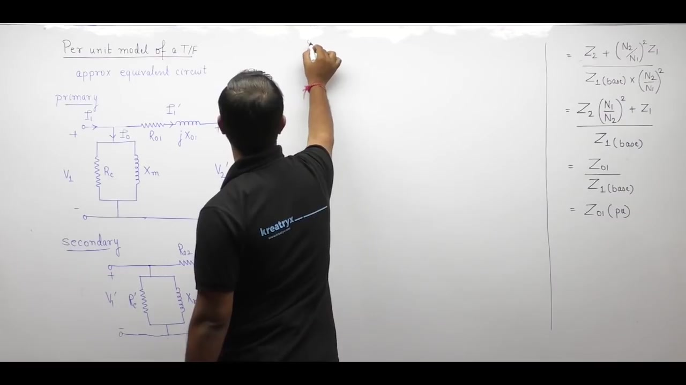

This invariance applies to resistance and reactance separately:

$$\begin{aligned}
R_{01,\text{pu}} &= R_{02,\text{pu}} = R_{\text{eq, pu}} \\
X_{01,\text{pu}} &= X_{02,\text{pu}} = X_{\text{eq, pu}}
\end{aligned}$$

## Complete Per-Unit Equivalent Circuit and Global Invariance
_(47:35 - 52:01)_

### Normalizing Circuit Elements to Per-Unit

Now convert every branch of the approximate equivalent circuit into per-unit quantities.

First, take the circuit drawn on the primary side:

1. **Input Voltage**:
   $$V_{1,\text{pu}} = \frac{V_1}{V_{1,\text{base}}}$$
2. **Primary Current**:
   $$I_{1,\text{pu}} = \frac{I_1}{I_{1,\text{base}}}$$
3. **Core Resistance and Magnetizing Reactance**:
   $$\begin{aligned}
   R_{c,\text{pu}} &= \frac{R_c}{Z_{1,\text{base}}} \\
   X_{m,\text{pu}} &= \frac{X_m}{Z_{1,\text{base}}}
   \end{aligned}$$
4. **Series Impedance and Load Voltage**:
   $$\begin{aligned}
   Z_{\text{eq, pu}} &= \frac{Z_{01}}{Z_{1,\text{base}}} \\
   V_{2,\text{pu}}' &= \frac{V_2'}{V_{1,\text{base}}}
   \end{aligned}$$

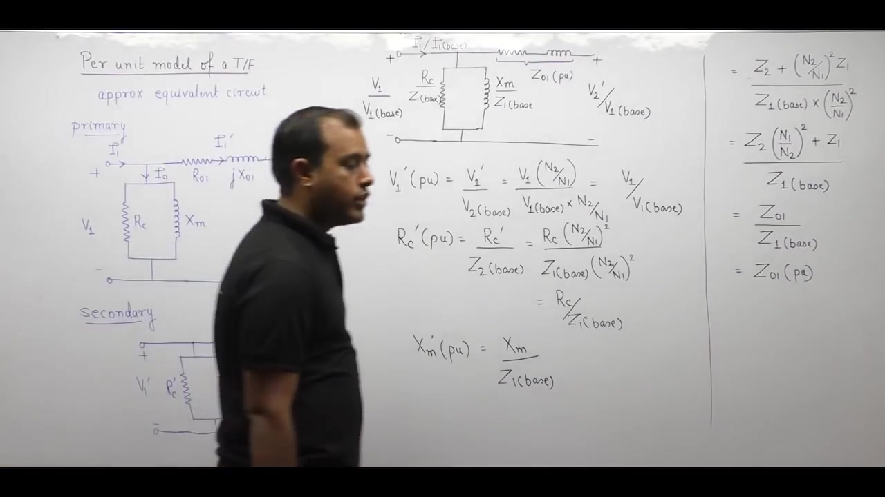

### Normalizing the Secondary-Drawn Circuit

Next, convert the secondary-referred approximate circuit into per-unit:

1. **Referred Input Voltage**:
   $$V_{1,\text{pu}}' = \frac{V_1'}{V_{2,\text{base}}} = \frac{V_1 \left(\frac{N_2}{N_1}\right)}{V_{1,\text{base}} \left(\frac{N_2}{N_1}\right)} = \frac{V_1}{V_{1,\text{base}}} = V_{1,\text{pu}}$$
   The turns ratio factors cancel out. The per-unit voltage is identical.
2. **Referred Shunt Branch Resistance**:
   $$R_{c,\text{pu}}' = \frac{R_c'}{Z_{2,\text{base}}} = \frac{R_c \left(\frac{N_2}{N_1}\right)^2}{Z_{1,\text{base}} \left(\frac{N_2}{N_1}\right)^2} = \frac{R_c}{Z_{1,\text{base}}} = R_{c,\text{pu}}$$
3. **Referred Shunt Magnetizing Reactance**:
   $$X_{m,\text{pu}}' = \frac{X_m'}{Z_{2,\text{base}}} = \frac{X_m \left(\frac{N_2}{N_1}\right)^2}{Z_{1,\text{base}} \left(\frac{N_2}{N_1}\right)^2} = \frac{X_m}{Z_{1,\text{base}}} = X_{m,\text{pu}}$$
4. **Referred Load Voltage**:
   $$V_{2,\text{pu}} = \frac{V_2}{V_{2,\text{base}}} = \frac{V_2' \left(\frac{N_2}{N_1}\right)}{V_{1,\text{base}} \left(\frac{N_2}{N_1}\right)} = \frac{V_2'}{V_{1,\text{base}}} = V_{2,\text{pu}}'$$

Every branch produces the exact same numerical per-unit value.

> [!success] Global Invariance of the Per-Unit Network
> It does not matter on which side the equivalent circuit is drawn. The complete per-unit network is identical on both sides of the transformer.
> 
> $$\begin{aligned}
> V_{\text{in, pu}} &= V_{1,\text{pu}} \\
> R_{c,\text{pu}} &= R_{c,\text{pu}}' \\
> X_{m,\text{pu}} &= X_{m,\text{pu}}' \\
> Z_{\text{eq, pu}} &= Z_{01,\text{pu}} = Z_{02,\text{pu}} \\
> V_{\text{out, pu}} &= V_{2,\text{pu}}
> \end{aligned}$$

### System-Wide Power Engineering Invariance

This property removes all transformers from large power system models. In per-unit, a transformer reduces to a simple series impedance with a parallel shunt admittance.

The per-unit system is unaffected by four major network features:
1. Star or delta three-phase connections.
2. Number of phases.
3. Line or phase quantity distinctions.
4. Turns ratio of the transformer.

## Problem Formulation: Transformer Equivalent Circuit Analysis
_(52:01 - 58:23)_

### Problem Statement

To consolidate the theory of the approximate equivalent circuit, consider a comprehensive numerical example.

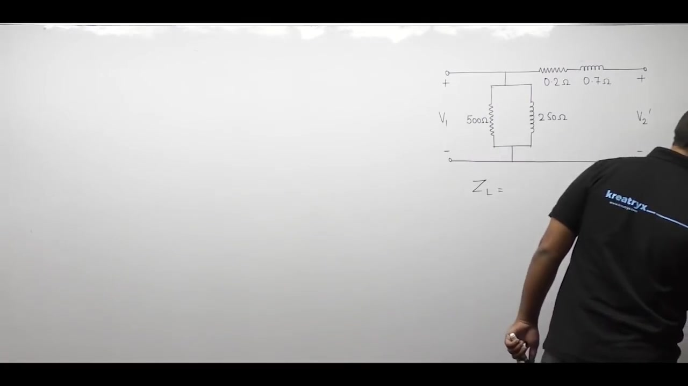

> [!example] Problem Statement
> A single-phase transformer has a nameplate rating of $2500\text{ V} / 250\text{ V}$.
> The equivalent circuit referred to the low tension (LT) side has the following parameter values:
> - Total winding resistance referred to LT: $R_{\text{eq, LT}} = 0.2\ \Omega$
> - Total leakage reactance referred to LT: $X_{\text{eq, LT}} = 0.7\ \Omega$
> - Shunt core loss resistance: $R_c = 500\ \Omega$
> - Shunt magnetizing reactance: $X_m = 250\ \Omega$
> 
> A load impedance of $Z_L = 380 + j 230\ \Omega$ is connected to the high tension (HT) side of the transformer.
> The primary supply voltage applied to the LT winding is $V_1 = 250\text{ V}$.
> 
> Compute:
> 1. Secondary load terminal voltage ($V_2$).
> 2. Primary input current ($I_1$) and primary power factor ($\cos\theta_1$).
> 3. Active power output ($P_{\text{out}}$) and overall operating efficiency ($\eta$).

### Clarification of Terminology: Tension and Voltage Levels

The term "tension" refers to dielectric stress or electric field potential.
- **Low Tension (LT)**: The low-voltage winding ($250\text{ V}$).
- **High Tension (HT)**: The high-voltage winding ($2500\text{ V}$).

In this problem, the LT side connects to the electrical source. The LT winding acts as the primary. The HT side connects to the load. The HT winding acts as the secondary.

Do not assume the first number in the rating is always the primary. The rating $2500\text{ V} / 250\text{ V}$ states the rated voltages and turns ratio:

$$\frac{V_H}{V_L} = \frac{N_H}{N_L} = \frac{2500}{250} = 10$$

Here the transformer operates as a step-up unit.

### Referring the Load Impedance to the Primary (LT) Side

The circuit parameters are given on the LT ($250\text{ V}$) side. The load impedance $Z_L$ sits across the HT ($2500\text{ V}$) side.

To eliminate the ideal transformer, transfer $Z_L$ from the HT side to the LT side. Apply the impedance referral rule:

$$Z_L' = Z_L \left(\frac{N_L}{N_H}\right)^2 = Z_L \left(\frac{V_L}{V_H}\right)^2$$

Substitute the given numerical values:

$$\begin{aligned}
Z_L' &= (380 + j 230) \left(\frac{250}{2500}\right)^2 \\
&= (380 + j 230) \left(\frac{1}{10}\right)^2 \\
&= (380 + j 230) \times \frac{1}{100} \\
&= 3.8 + j 2.3\ \Omega
\end{aligned}$$

The reflected load resistance is $R_L' = 3.8\ \Omega$. The reflected load reactance is $X_L' = 2.3\ \Omega$.
All circuit elements now sit on the primary LT side.

## Solution Part 1: Secondary Terminal Voltage and Loading Principles
_(58:26 - 63:24)_

### Voltage Division in the Primary Series Branch

The load impedance referred to the LT side is $Z_L' = 3.8 + j 2.3\ \Omega$.
The total series winding impedance of the transformer on the LT side is $Z_{\text{eq, LT}} = 0.2 + j 0.7\ \Omega$.

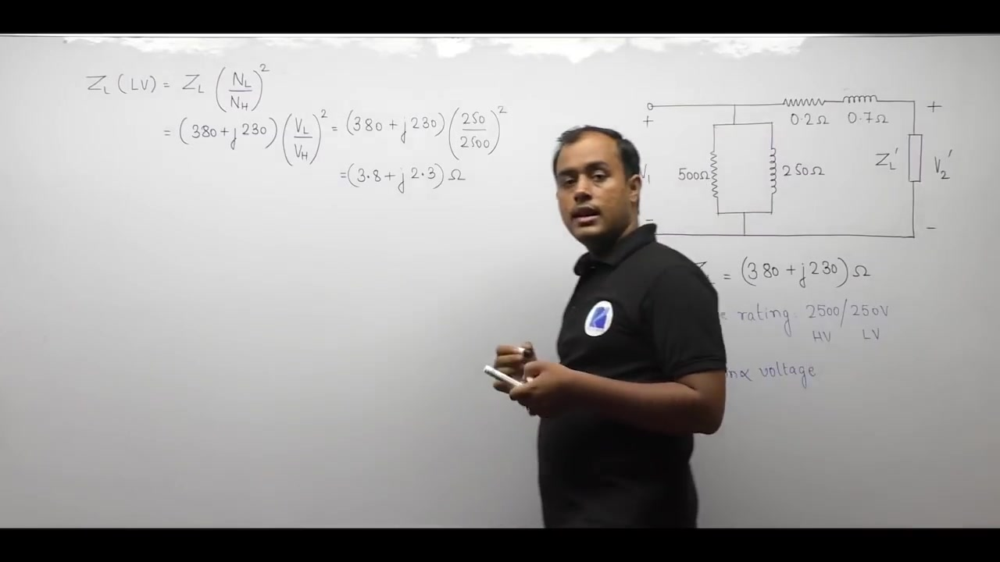

The total impedance of the series branch including the load is:

$$\begin{aligned}
Z_{\text{series, total}} &= Z_{\text{eq, LT}} + Z_L' \\
&= (0.2 + j 0.7) + (3.8 + j 2.3) \\
&= (0.2 + 3.8) + j (0.7 + 2.3) \\
&= 4.0 + j 3.0\ \Omega
\end{aligned}$$

The magnitude of this total series branch impedance is:

$$|Z_{\text{series, total}}| = \sqrt{4.0^2 + 3.0^2} = \sqrt{16 + 9} = 5.0\ \Omega$$

The input voltage $V_1 = 250\text{ V}$ appears directly across this entire series path. Apply the voltage divider rule to determine the referred load voltage $V_2'$:

$$\mathbf{V}_2' = \mathbf{V}_1 \left(\frac{Z_L'}{Z_{\text{series, total}}}\right)$$

Calculate the magnitude of the load impedance:

$$|Z_L'| = \sqrt{3.8^2 + 2.3^2} = \sqrt{14.44 + 5.29} = \sqrt{19.73} \approx 4.4418\ \Omega$$

Now calculate the magnitude of $V_2'$:

$$|V_2'| = 250 \times \frac{4.4418}{5.0} = 50 \times 4.4418 \approx 222.09\text{ V}$$

### Determination of Actual Secondary Voltage

The voltage $V_2'$ is the terminal voltage referred to the primary LT winding. To find the actual terminal voltage $V_2$ on the secondary HT side, scale by the turns ratio:

$$\frac{V_2}{V_2'} = \frac{N_H}{N_L} = 10$$

$$V_2 = 10 \times V_2' = 10 \times 222.09 \approx 2221\text{ V}$$

> [!success] Result: Secondary Terminal Voltage
> The actual terminal voltage delivered to the load on the high-tension side is:
> 
> $$V_2 \approx 2221\text{ V}$$

### Rated Voltage versus Actual Terminal Voltage

A common point of confusion is the physical meaning of nameplate ratings. The nameplate rating $2500\text{ V} / 250\text{ V}$ defines two things:
1. The transformer turns ratio ($N_H/N_L = 10$).
2. The rated induced EMF or rated no-load terminal voltage.

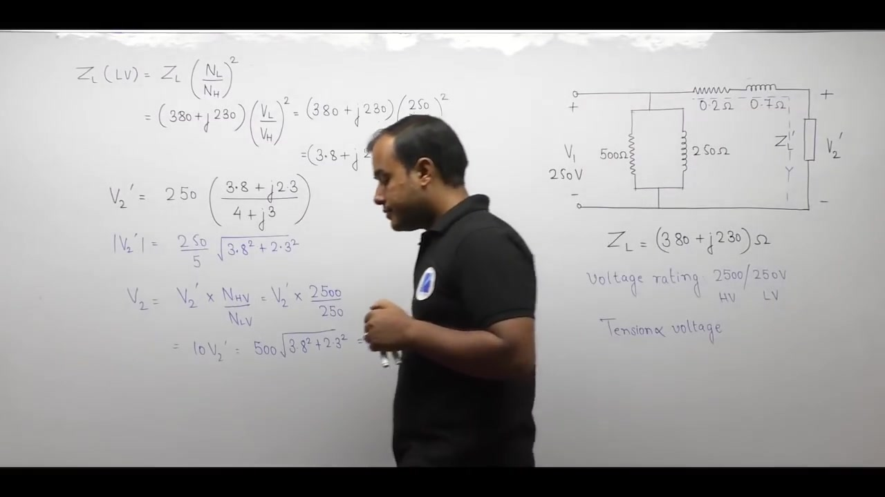

In an ideal transformer, terminal voltages always match rated voltages. In a practical transformer under load, internal series impedance causes a voltage drop.

> [!info] Operational Principle Under Load
> In a practical transformer, terminal voltages cannot equal rated values on both sides at the same time:
> 1. If rated voltage ($250\text{ V}$) is applied at the primary, secondary terminal voltage under load drops below rated ($2221\text{ V} < 2500\text{ V}$).
> 2. If rated voltage ($2500\text{ V}$) is required at the secondary load terminals, the applied primary voltage must exceed rated ($V_1 > 250\text{ V}$).

## Solution Parts 2 and 3: Currents, Power Factor, and Efficiency
_(63:24 - 70:38)_

### Part 2: Primary Input Current and Power Factor

To solve for currents using phasors, choose the input voltage as the reference phasor:

$$\mathbf{V}_1 = 250 \angle 0^\circ\text{ V}$$

In the approximate equivalent circuit, the supply voltage connects across three parallel paths:
1. Core loss resistance $R_c = 500\ \Omega$.
2. Magnetizing reactance $X_m = 250\ \Omega$.
3. Combined series branch $Z_{\text{series, total}} = 4.0 + j 3.0\ \Omega = 5.0 \angle 36.87^\circ\ \Omega$.

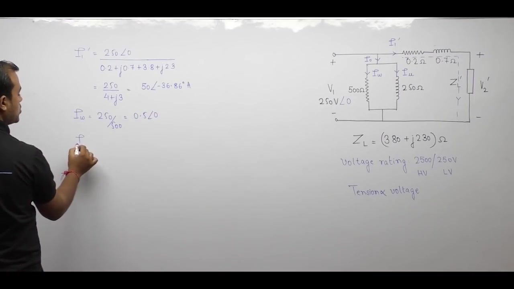

Calculate the current through each branch:

1. **Reflected Load Current**:
   $$\mathbf{I}_1' = \frac{\mathbf{V}_1}{Z_{\text{series, total}}} = \frac{250 \angle 0^\circ}{5.0 \angle 36.87^\circ} = 50 \angle -36.87^\circ\text{ A} = (40.0 - j 30.0)\text{ A}$$
2. **Core Loss Current**:
   $$\mathbf{I}_w = \frac{\mathbf{V}_1}{R_c} = \frac{250 \angle 0^\circ}{500} = 0.5 \angle 0^\circ\text{ A} = 0.5\text{ A}$$
3. **Magnetizing Current**:
   $$\mathbf{I}_\mu = \frac{\mathbf{V}_1}{j X_m} = \frac{250 \angle 0^\circ}{j 250} = -j 1.0\text{ A} = 1.0 \angle -90^\circ\text{ A}$$

Total no-load excitation current is:

$$\mathbf{I}_0 = \mathbf{I}_w + \mathbf{I}_\mu = (0.5 - j 1.0)\text{ A}$$

Now sum the branch currents to find total primary input current:

$$\begin{aligned}
\mathbf{I}_1 &= \mathbf{I}_0 + \mathbf{I}_1' \\
&= (0.5 - j 1.0) + (40.0 - j 30.0) \\
&= (0.5 + 40.0) - j (1.0 + 30.0) \\
&= 40.5 - j 31.0\text{ A}
\end{aligned}$$

Calculate the magnitude and phase angle of $\mathbf{I}_1$:

$$\begin{aligned}
|\mathbf{I}_1| &= \sqrt{40.5^2 + (-31.0)^2} = \sqrt{1640.25 + 961.0} = \sqrt{2601.25} \approx 51.0\text{ A} \\
\theta_1 &= \tan^{-1}\left(\frac{-31.0}{40.5}\right) \approx -37.44^\circ
\end{aligned}$$

$$\mathbf{I}_1 \approx 51.0 \angle -37.44^\circ\text{ A}$$

The current angle is $-37.44^\circ$ while voltage is at $0^\circ$. The current lags the voltage.

$$\cos\theta_1 = \cos(37.44^\circ) \approx 0.794\text{ lagging}$$

> [!success] Result: Primary Current and Power Factor
> The primary input current is:
> 
> $$\mathbf{I}_1 \approx 51.0 \angle -37.4^\circ\text{ A}$$
> 
> The operating primary power factor is:
> 
> $$\text{pf}_1 \approx 0.794\text{ lagging}$$

### Part 3: Power Output and Efficiency

Real power is dissipated only in resistive elements. Reactive elements consume zero net active power.

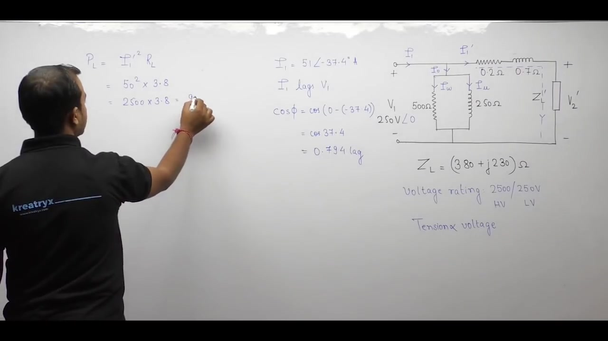

The power consumed in any element remains invariant when referred across windings. Therefore, compute load power directly on the primary side using reflected load resistance $R_L' = 3.8\ \Omega$:

$$\begin{aligned}
P_{\text{out}} &= (I_1')^2 R_L' \\
&= (50)^2 \times 3.8 \\
&= 2500 \times 3.8 \\
&= 9500\text{ W}
\end{aligned}$$

Next, compute active input power from terminal quantities:

$$\begin{aligned}
P_{\text{in}} &= V_1 I_1 \cos\theta_1 \\
&= 250 \times 51.0 \times 0.794 \\
&\approx 10123.5\text{ W}
\end{aligned}$$

Alternatively, calculate input power by summing output power and losses:
- Core loss: $P_c = V_1^2 / R_c = 250^2 / 500 = 62500 / 500 = 125\text{ W}$.
- Copper loss in winding: $P_{\text{cu}} = (I_1')^2 R_{\text{eq, LT}} = (50)^2 \times 0.2 = 2500 \times 0.2 = 500\text{ W}$.

$$P_{\text{in}} = P_{\text{out}} + P_{\text{cu}} + P_c = 9500 + 500 + 125 = 10125\text{ W}$$

Now calculate efficiency:

$$\eta = \frac{P_{\text{out}}}{P_{\text{in}}} \times 100\% = \frac{9500}{10125} \times 100\% \approx 93.83\%$$

> [!success] Result: Power Output and Efficiency
> Active power output delivered to the load is:
> 
> $$P_{\text{out}} = 9500\text{ W} = 9.5\text{ kW}$$
> 
> Operating efficiency under these conditions is:
> 
> $$\eta \approx 93.83\%$$

---

## Summary and Key Takeaways

- Referring parameters across an ideal core scales voltages by $(N_1/N_2)$, currents inversely by $(N_2/N_1)$, and impedances by $(N_1/N_2)^2$.
- The exact T-circuit eliminates the ideal transformer core but leaves the shunt branch between the primary and secondary series impedances.
- Shifting the parallel exciting branch to the input terminals forms the standard approximate equivalent circuit and merges series impedances into $R_{01} = R_1 + R_2'$ and $X_{01} = X_1 + X_2'$.
- Merging series impedances in the approximate circuit obscures the internal node, making induced EMF unobservable directly from terminal measurements.
- For lagging loads, the approximate model overestimates core losses ($V_1^2/R_c > E_1^2/R_c$) and magnetizing current ($V_1/X_m > E_1/X_m$), while ignoring no-load copper loss and no-load series voltage drop.
- Base impedances scale across windings by the square of the turns ratio, $Z_{2,\text{base}} = Z_{1,\text{base}} (N_2/N_1)^2$, when base kVA is kept constant on both sides.
- The equivalent per-unit impedance is invariant to referral side, satisfying $Z_{01,\text{pu}} = Z_{02,\text{pu}} = Z_{\text{eq, pu}}$.
- The full per-unit equivalent circuit is completely identical whether formulated from primary or secondary ratings, eliminating turns-ratio complexities in power network calculations.

