# Problems based on Equivalent Circuit | L6 | Electrical Machines | GATE 2022

- **Source**: https://www.youtube.com/watch?v=mJ3nL1tHAf0
- **Duration**: 01:17:16
- **Compiled**: 2026-09-19

---

## Overview

This lecture solves practical problems on transformer equivalent circuits. It connects physical winding parameters to circuit network equations. The discussion works through impedance reflection, series-parallel ideal transformers, and complex conjugate matching for maximum power transfer. It also analyzes short-circuit test responses, per-unit models, and phasor reference selection when load current is directly specified.

## Contents

- [[#Transformer Equivalent Circuit Analysis: Load Impedance Reflection and Terminal Voltage|Transformer Equivalent Circuit Analysis: Load Impedance Reflection and Terminal Voltage]]
- [[#Primary Current, Power Factor, and Exciting Branch Decomposition|Primary Current, Power Factor, and Exciting Branch Decomposition]]
- [[#Efficiency Evaluation and Series-Parallel Ideal Transformer Networks|Efficiency Evaluation and Series-Parallel Ideal Transformer Networks]]
- [[#Maximum Power Transfer in Ideal Transformer Networks: Resistance Matching and Turns Ratio|Maximum Power Transfer in Ideal Transformer Networks: Resistance Matching and Turns Ratio]]
- [[#Reactive Impedance Cancellation, Maximum Delivered Power, and Load Voltage|Reactive Impedance Cancellation, Maximum Delivered Power, and Load Voltage]]
- [[#Transformer Short-Circuit Test: Impedance Referral and Applied Voltage Determination|Transformer Short-Circuit Test: Impedance Referral and Applied Voltage Determination]]
- [[#Short-Circuit Power Factor and Dual-Side Referral Verification|Short-Circuit Power Factor and Dual-Side Referral Verification]]
- [[#Comprehensive Equivalent Circuit Analysis: Step-Up Transformer Load Response|Comprehensive Equivalent Circuit Analysis: Step-Up Transformer Load Response]]
- [[#Total Primary Current, Power Losses, and Efficiency of Step-Up Transformer|Total Primary Current, Power Losses, and Efficiency of Step-Up Transformer]]
- [[#Critical Phasor Reference Selection in Load-Current Specified Problems|Critical Phasor Reference Selection in Load-Current Specified Problems]]
- [[#Mathematical Derivation of Secondary Voltage and Load-Angle Under Specified Power Factor|Mathematical Derivation of Secondary Voltage and Load-Angle Under Specified Power Factor]]
- [[#Total Primary Current, Power Balance, and the Constant-Current Load Paradigm|Total Primary Current, Power Balance, and the Constant-Current Load Paradigm]]
- [[#Per-Unit Transformer Short-Circuit Modeling and Exciting Current Decomposition|Per-Unit Transformer Short-Circuit Modeling and Exciting Current Decomposition]]
- [[#Core Loss and Magnetizing Current Decomposition Under No-Load Excitation|Core Loss and Magnetizing Current Decomposition Under No-Load Excitation]]

---

## Transformer Equivalent Circuit Analysis: Load Impedance Reflection and Terminal Voltage
_(00:05 - 09:26)_

### Session Overview and Equivalent Circuit Modeling

The equivalent circuit of a transformer represents its physical behavior in an electrical network. Winding resistances create real power losses. Leakage fluxes introduce series inductive reactances. The iron core demands an exciting branch with shunt resistance and magnetizing reactance. Treating this model as a standard AC circuit simplifies calculations. Students often find phasor diagrams intimidating. But standard network techniques solve these problems directly.

### Equivalent Circuit Referred to the Low-Tension Side

Consider a single-phase transformer with low-voltage primary and high-voltage secondary windings. Calculations become much simpler when all parameters are referred to one side. The turns ratio transfers impedances between sides by its square.

> [!info] Impedance Transformation Across Windings
> An impedance $Z_2$ on the secondary winding transfers to the primary winding as:
> $$Z_2' = a^2 Z_2 = \left(\frac{N_1}{N_2}\right)^2 Z_2$$
> Here $a = N_1 / N_2$ is the turns ratio. Voltages scale directly with $a$. Currents scale inversely with $a$.

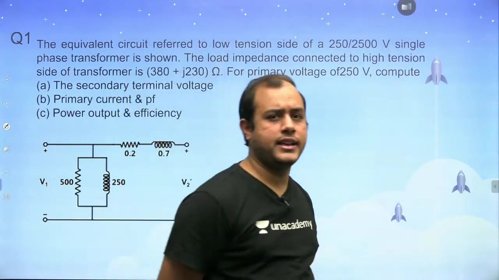

### Problem Statement: Analysis of a Practical Transformer

> [!example] Problem
> A single-phase transformer is rated at $250 / 2500\text{ V}$ and $50\text{ Hz}$. Its equivalent circuit parameters referred to the low-voltage (LV) side are:
> - Series resistance: $R_{01} = 0.2\ \Omega$
> - Series leakage reactance: $X_{01} = 0.7\ \Omega$
> - Core loss resistance: $R_c = 500\ \Omega$
> - Magnetizing reactance: $X_m = 250\ \Omega$
> 
> A load impedance $Z_L = 380 + j 230\ \Omega$ connects to the high-voltage (HV) side. The primary winding receives its rated voltage of $250\text{ V}$.
> 
> Determine:
> 1. The secondary load impedance referred to the primary side.
> 2. The total series impedance seen by the primary supply.
> 3. The reflected load current $I_1'$.
> 4. The actual secondary load terminal voltage $V_2$.

### Step-by-Step Derivation and Load Reflection

The primary is the low-voltage side with $V_1 = 250\text{ V}$. The secondary is the high-voltage side with rated voltage $2500\text{ V}$.

Calculate the turns ratio:
$$a = \frac{N_1}{N_2} = \frac{250}{2500} = \frac{1}{10} = 0.1$$

Now refer the secondary load impedance $Z_L$ to the primary side:
$$\begin{aligned}
Z_L' &= a^2 Z_L \\
&= (0.1)^2 (380 + j 230) \\
&= 3.8 + j 2.3\ \Omega
\end{aligned}$$

The load branch connects in series with the transformer equivalent series impedance $Z_{01} = R_{01} + j X_{01}$. Combine these impedances into the total series impedance $Z_{\text{series}}$:
$$\begin{aligned}
Z_{\text{series}} &= (R_{01} + R_L') + j (X_{01} + X_L') \\
&= (0.2 + 3.8) + j (0.7 + 2.3) \\
&= 4.0 + j 3.0\ \Omega
\end{aligned}$$

Convert this rectangular impedance into polar form:
$$\begin{aligned}
|Z_{\text{series}}| &= \sqrt{4.0^2 + 3.0^2} = 5.0\ \Omega \\
\theta_{\text{series}} &= \tan^{-1}\left(\frac{3.0}{4.0}\right) = 36.87^\circ \\
Z_{\text{series}} &= 5.0 \angle 36.87^\circ\ \Omega
\end{aligned}$$

### Calculating Reflected Current and Terminal Voltage

Set the supply voltage as the reference phasor:
$$\mathbf{V}_1 = 250 \angle 0^\circ\text{ V}$$

The reflected secondary current $I_1'$ flows through the series branch:
$$\begin{aligned}
\mathbf{I}_1' &= \frac{\mathbf{V}_1}{Z_{\text{series}}} \\
&= \frac{250 \angle 0^\circ}{5.0 \angle 36.87^\circ} \\
&= 50 \angle -36.87^\circ\text{ A}
\end{aligned}$$

In rectangular form:
$$\mathbf{I}_1' = 50 \cos(36.87^\circ) - j 50 \sin(36.87^\circ) = 40 - j 30\text{ A}$$

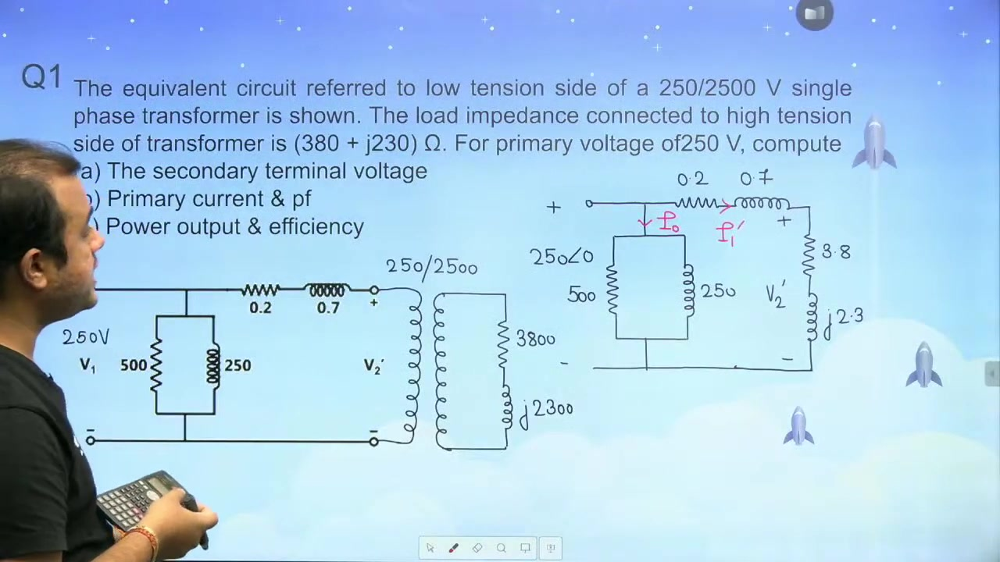

The terminal voltage across the load referred to the primary is $V_2'$:
$$\mathbf{V}_2' = \mathbf{I}_1' Z_L'$$

Find the magnitude of the referred load impedance:
$$|Z_L'| = \sqrt{3.8^2 + 2.3^2} = \sqrt{14.44 + 5.29} = \sqrt{19.73} \approx 4.4419\ \Omega$$

Calculate the referred secondary terminal voltage magnitude:
$$V_2' = |\mathbf{I}_1'| \cdot |Z_L'| = 50 \times 4.4419 = 222.09\text{ V}$$

Now transfer this voltage back to the secondary winding:
$$\begin{aligned}
V_2 &= \frac{V_2'}{a} \\
&= \frac{222.09}{0.1} \\
&= 2220.9\text{ V}
\end{aligned}$$

> [!success] Secondary Terminal Voltage
> The actual terminal voltage delivered to the load on the high-voltage side is:
> $$V_2 \approx 2221\text{ V}$$
> Under loaded conditions, winding impedance produces an internal voltage drop. This drops the secondary voltage from its open-circuit value of $2500\text{ V}$ down to $2221\text{ V}$.

## Primary Current, Power Factor, and Exciting Branch Decomposition
_(09:27 - 14:13)_

### Exciting Current Components

The total primary current supplies two distinct paths. One path supplies the reflected load current $I_1'$. The other path supplies the exciting branch $I_0$. The exciting branch consists of core loss resistance $R_c$ and magnetizing reactance $X_m$ in parallel.

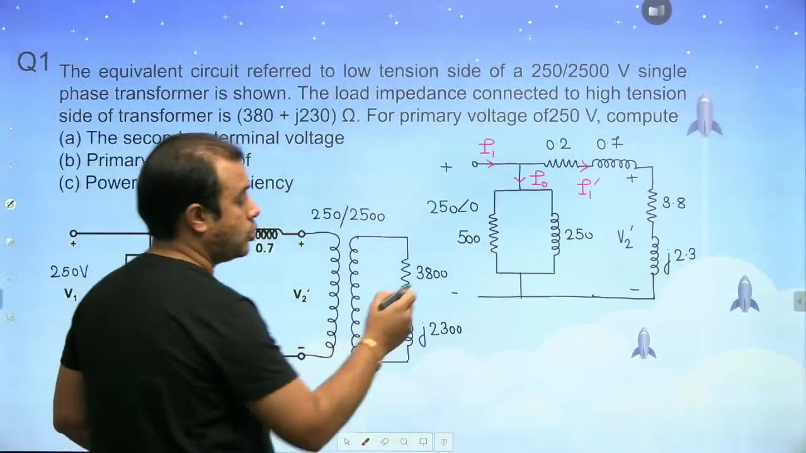

The primary supply voltage is:
$$\mathbf{V}_1 = 250 \angle 0^\circ\text{ V}$$

The core loss component $I_w$ flows through the parallel resistance $R_c = 500\ \Omega$. This current is strictly in phase with the applied voltage:
$$I_w = \frac{V_1}{R_c} = \frac{250}{500} = 0.5\text{ A}$$

The magnetizing component $I_\mu$ flows through the magnetizing reactance $X_m = 250\ \Omega$. This reactive current lags the applied voltage by $90^\circ$:
$$\mathbf{I}_\mu = \frac{\mathbf{V}_1}{j X_m} = \frac{250 \angle 0^\circ}{j 250} = -j 1.0\text{ A}$$

Combine both components to form the total no-load exciting current phasor:
$$\mathbf{I}_0 = I_w + \mathbf{I}_\mu = 0.5 - j 1.0\text{ A}$$

### Total Primary Input Current

The total primary current $\mathbf{I}_1$ is the phasor sum of the exciting current and the referred load current:
$$\mathbf{I}_1 = \mathbf{I}_0 + \mathbf{I}_1'$$

From the previous section:
$$\mathbf{I}_1' = 50 \angle -36.87^\circ\text{ A} = 40 - j 30\text{ A}$$

Now add the rectangular components:
$$\begin{aligned}
\mathbf{I}_1 &= (0.5 - j 1.0) + (40 - j 30) \\
&= (0.5 + 40) - j (1.0 + 30) \\
&= 40.5 - j 31.0\text{ A}
\end{aligned}$$

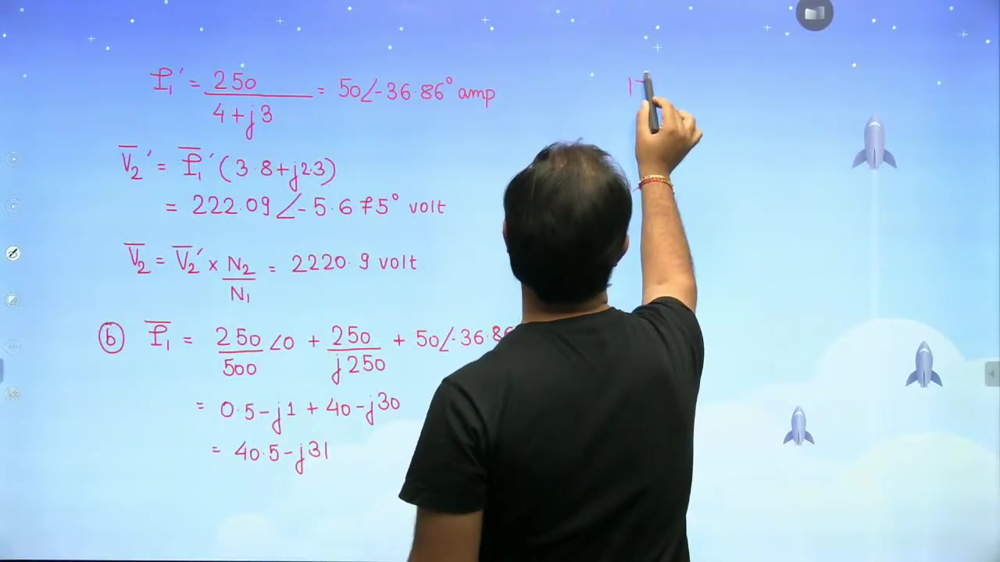

### Primary Current Magnitude and Operating Power Factor

Convert the total primary current phasor into polar form. Compute its magnitude:
$$\begin{aligned}
|\mathbf{I}_1| &= \sqrt{(40.5)^2 + (-31.0)^2} \\
&= \sqrt{1640.25 + 961.0} \\
&= \sqrt{2601.25} \\
&\approx 51.002\text{ A}
\end{aligned}$$

Compute the phase angle of the primary current relative to the input voltage:
$$\begin{aligned}
\theta_1 &= -\tan^{-1}\left(\frac{31.0}{40.5}\right) \\
&= -\tan^{-1}(0.7654) \\
&\approx -37.43^\circ
\end{aligned}$$

Because the current lags the supply voltage, the operating power factor is lagging:
$$\text{pf}_1 = \cos(\theta_1) = \cos(-37.43^\circ) \approx 0.794\text{ lagging}$$

> [!success] Total Primary Input Current and Power Factor
> The total primary current drawn from the $250\text{ V}$ source is:
> $$\mathbf{I}_1 = 51.0 \angle -37.43^\circ\text{ A}$$
> The primary operating power factor is:
> $$\text{pf}_1 = 0.794\text{ lagging}$$

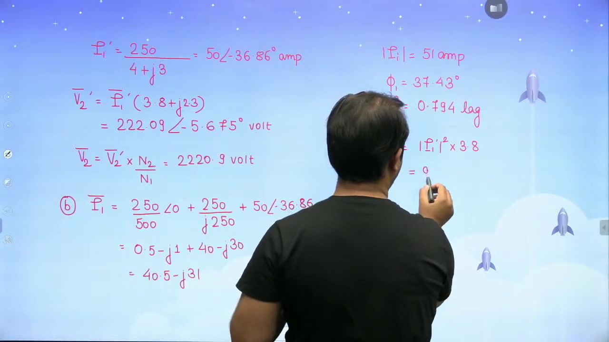

### Influence of Exciting Current on Primary Power Factor

The load current alone had a phase angle of $-36.87^\circ$. Its power factor was $\cos(36.87^\circ) = 0.80\text{ lagging}$. 

The core loss component $I_w = 0.5\text{ A}$ adds to the active real current. But the magnetizing component $I_\mu = 1.0\text{ A}$ adds directly to the inductive reactive current. Because the inductive draw increases from $30\text{ A}$ to $31\text{ A}$, the overall phase lag angle increases slightly from $36.87^\circ$ to $37.43^\circ$. This reduces the primary power factor slightly from $0.80$ to $0.794$. In large power transformers operating at full load, this shift is modest because $I_0$ represents only a small fraction of rated current.

## Efficiency Evaluation and Series-Parallel Ideal Transformer Networks
_(14:15 - 19:04)_

### Completing the Efficiency Calculation for Problem 1

Transformer efficiency is the ratio of real power output to real power input. In Problem 1, the load power flows through the referred load resistance $R_L' = 3.8\ \Omega$. The reflected load current is $I_1' = 50\text{ A}$.

Compute the output power delivered to the load:
$$P_{\text{out}} = (I_1')^2 R_L' = (50)^2 \times 3.8 = 2500 \times 3.8 = 9500\text{ W}$$

Now calculate the internal power losses. Real losses occur in two resistive elements:
1. Series winding resistance: $R_{01} = 0.2\ \Omega$.
2. Shunt core loss resistance: $R_c = 500\ \Omega$.

Compute the winding copper loss:
$$P_{\text{cu}} = (I_1')^2 R_{01} = (50)^2 \times 0.2 = 2500 \times 0.2 = 500\text{ W}$$

Compute the shunt iron core loss from the applied voltage:
$$P_{\text{core}} = \frac{V_1^2}{R_c} = \frac{250^2}{500} = \frac{62500}{500} = 125\text{ W}$$

Add both loss components to find total losses:
$$P_{\text{loss}} = P_{\text{cu}} + P_{\text{core}} = 500 + 125 = 625\text{ W}$$

Compute total real input power:
$$P_{\text{in}} = P_{\text{out}} + P_{\text{loss}} = 9500 + 625 = 10125\text{ W}$$

Compute the percentage efficiency:
$$\eta = \frac{P_{\text{out}}}{P_{\text{in}}} \times 100\% = \frac{9500}{10125} \times 100\% \approx 93.83\%$$

> [!success] Transformer Efficiency
> The operating efficiency of the transformer under the specified load is:
> $$\eta = 93.83\%$$

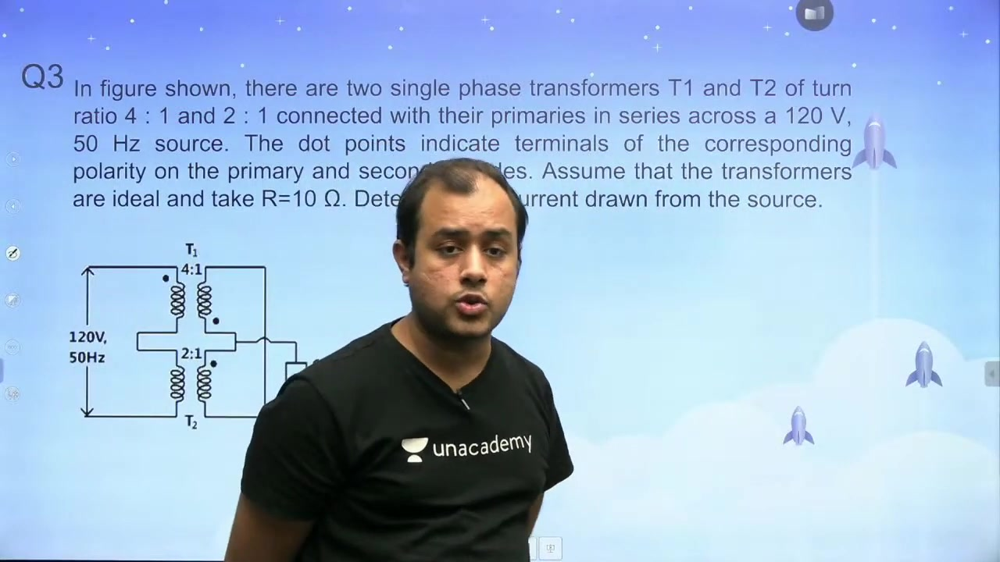

### Problem Statement: Two Ideal Transformers in Series-Parallel

> [!example] Problem
> Two ideal single-phase transformers, $T_1$ and $T_2$, have turns ratios:
> - $T_1$: Turns ratio $a_1 = 4:1$
> - $T_2$: Turns ratio $a_2 = 2:1$
> 
> The primary windings connect in series across a $120\text{ V}$, $50\text{ Hz}$ supply. The secondary windings connect in parallel across a common load resistor $R_L = 10\ \Omega$. Dot terminals on both secondaries connect to the upper load node.
> 
> Find:
> 1. The voltage across the load resistor $V_L$.
> 2. The active power delivered to the load $P_L$.
> 3. The current $I_1$ drawn from the $120\text{ V}$ primary supply.

### Circuit Formulation Using Secondary Voltage Reference

Direct loop analysis with multiple ideal transformers can create complicated simultaneous equations. A much cleaner method starts at the parallel secondary terminals.

Both secondary windings connect across the same load resistor $R_L = 10\ \Omega$. Therefore, both secondary terminal voltages must be identical. Let this common secondary voltage be $V$:
$$V_{s1} = V_{s2} = V$$

Because the transformers are ideal, the primary voltages are determined directly by their turns ratios:
$$\begin{aligned}
V_{p1} &= a_1 V_{s1} = 4V \\
V_{p2} &= a_2 V_{s2} = 2V
\end{aligned}$$

The dot polarities are aligned. As the source loop traverses both primary windings in series, the voltages add:
$$V_{p1} + V_{p2} = V_{\text{source}}$$

Substitute the voltage relations into this loop equation:
$$\begin{aligned}
4V + 2V &= 120 \\
6V &= 120 \\
V &= 20\text{ V}
\end{aligned}$$

The secondary terminal voltage across the load resistor is $V_L = 20\text{ V}$.

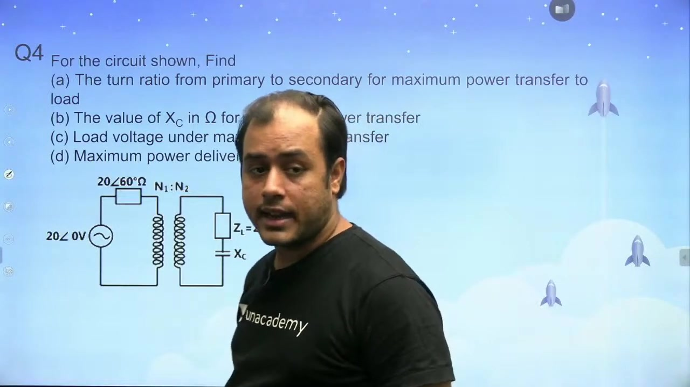

### Power Balance and Primary Source Current

Now find the active power dissipated in the load resistor:
$$P_L = \frac{V_L^2}{R_L} = \frac{20^2}{10} = \frac{400}{10} = 40\text{ W}$$

Ideal transformers consume no real power. They store no magnetic energy in an ideal core. Therefore, the total active power delivered by the primary source equals the total power consumed by the load:
$$P_{\text{in}} = P_L = 40\text{ W}$$

The source voltage is purely resistive because the load is a pure resistor:
$$P_{\text{in}} = V_{\text{source}} I_1$$

Solve directly for the source current $I_1$:
$$\begin{aligned}
120 \times I_1 &= 40 \\
I_1 &= \frac{40}{120} = \frac{1}{3}\text{ A}
\end{aligned}$$

> [!success] Source Current and Load Power
> The load voltage is $V_L = 20\text{ V}$. The power delivered to the load is $P_L = 40\text{ W}$.
> The primary supply current is:
> $$I_1 = \frac{1}{3}\text{ A} \approx 0.333\text{ A}$$

## Maximum Power Transfer in Ideal Transformer Networks: Resistance Matching and Turns Ratio
_(19:05 - 24:04)_

### Impedance Matching in Transformer Coupled Circuits

Transformers change impedance levels in AC networks. This makes them useful for maximum power transfer. Maximum power transfer requires matching the load impedance to the source internal impedance. In AC circuits with reactive components, the referred load impedance must match the complex conjugate of the source impedance.

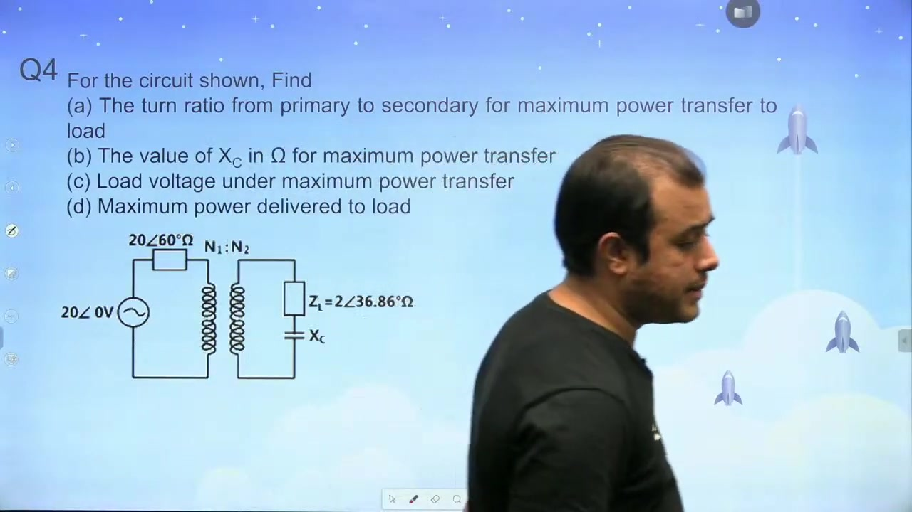

### Maximum Power Transfer Theorem for Complex Loads

Consider an AC source with internal impedance $Z_S = R_S + j X_S$. The load impedance referred to the primary winding is $Z_L' = R_L' + j X_L'$.

> [!info] Complex Conjugate Matching Theorem
> To deliver maximum average power from an AC source to a load, the referred load impedance must satisfy:
> $$Z_L' = Z_S^* = R_S - j X_S$$
> This requires two independent conditions:
> 1. Resistance matching: $R_L' = R_S$
> 2. Reactance cancellation (resonance): $X_L' = -X_S$

When these conditions hold, the net loop reactance vanishes. The source drives current through a purely resistive circuit of resistance $2 R_S$.

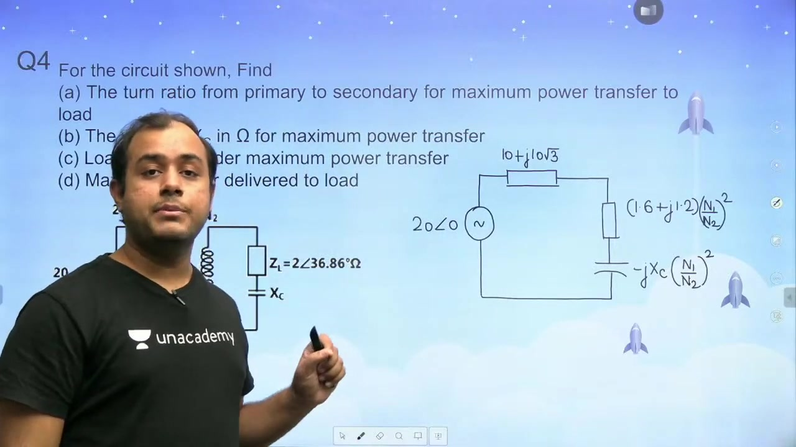

### Problem Statement: Parameter Design for Maximum Power Transfer

> [!example] Problem
> An AC voltage source has internal impedance $Z_S = 10 + j 10\sqrt{3}\ \Omega$. The source connects to the primary of an ideal transformer.
> 
> The load connected to the secondary consists of:
> - A branch impedance $Z = 2 \angle 36.86^\circ\ \Omega$
> - A variable series capacitor with capacitive reactance $-j X_C$
> 
> Find:
> 1. The transformer turns ratio $a = N_1 / N_2$ needed for maximum power transfer.
> 2. The formulation for the capacitive reactance $X_C$ required for maximum power transfer.

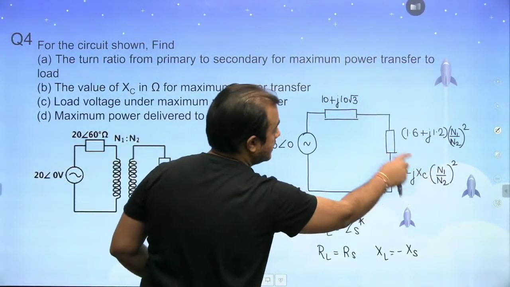

### Derivation of Secondary Branch Impedance

Express the secondary load impedance in rectangular coordinates. The branch impedance is:
$$Z = 2 \angle 36.86^\circ\ \Omega$$

Resolve this into real and imaginary parts:
$$\begin{aligned}
R_L &= 2 \cos(36.86^\circ) = 2 \times 0.8 = 1.6\ \Omega \\
X_L &= 2 \sin(36.86^\circ) = 2 \times 0.6 = 1.2\ \Omega
\end{aligned}$$

The total secondary load impedance including the series capacitor is:
$$Z_L = R_L + j (X_L - X_C) = 1.6 + j (1.2 - X_C)\ \Omega$$

Now refer this load impedance across the ideal transformer to the primary side:
$$\begin{aligned}
Z_L' &= a^2 Z_L \\
&= a^2 \left[1.6 + j (1.2 - X_C)\right] \\
&= 1.6 a^2 + j a^2 (1.2 - X_C)
\end{aligned}$$

Here $a = N_1 / N_2$ is the turns ratio.

### Turns Ratio Determination by Real Part Matching

The internal source impedance is:
$$Z_S = 10 + j 10\sqrt{3}\ \Omega$$

The real part of the source impedance is $R_S = 10\ \Omega$. For maximum power transfer, the real part of the referred load must equal $R_S$:
$$\text{Re}(Z_L') = R_S$$

Substitute the expression for the real part:
$$1.6 a^2 = 10$$

Solve for $a^2$:
$$a^2 = \frac{10}{1.6} = 6.25$$

Take the square root:
$$a = \frac{N_1}{N_2} = \sqrt{6.25} = 2.5$$

> [!success] Transformer Turns Ratio
> The primary-to-secondary turns ratio required for maximum power transfer is:
> $$a = \frac{N_1}{N_2} = 2.5$$
> Adjusting the turns ratio matches the real resistance of the secondary load to the internal resistance of the source.

## Reactive Impedance Cancellation, Maximum Delivered Power, and Load Voltage
_(24:11 - 28:43)_

### Completing the Conjugate Match: Capacitive Reactance Calculation

In the previous section, matching the real part of the referred load yielded a turns ratio of $a = 2.5$. Now we satisfy the second condition for maximum power transfer: reactive cancellation.

The internal source impedance has an inductive imaginary component:
$$\text{Im}(Z_S) = X_S = 10\sqrt{3} \approx 17.3205\ \Omega$$

The referred load has a net imaginary component given by:
$$\text{Im}(Z_L') = a^2 (X_L - X_C) = 6.25 (1.2 - X_C)$$

For complex conjugate matching, the imaginary part of the referred load must cancel the source reactance:
$$\text{Im}(Z_L') = -X_S$$

Substitute the numerical values into this condition:
$$6.25 (1.2 - X_C) = -10\sqrt{3} \approx -17.3205$$

Divide both sides by $6.25$:
$$1.2 - X_C = -\frac{17.3205}{6.25} = -2.7713$$

Solve directly for the capacitive reactance $X_C$:
$$\begin{aligned}
X_C &= 1.2 + 2.7713 \\
&\approx 3.971\ \Omega
\end{aligned}$$

> [!success] Required Capacitive Reactance
> The variable series capacitor on the secondary must provide a reactance of:
> $$X_C = 3.971\ \Omega$$
> This value cancels the source inductive reactance completely after reflection through the transformer.

### Primary Loop Current Under Conjugate Match

With the turns ratio and series capacitor tuned, net loop reactance becomes zero:
$$X_{\text{net}} = X_S + \text{Im}(Z_L') = 10\sqrt{3} - 10\sqrt{3} = 0\ \Omega$$

The total loop impedance seen by the source is purely resistive:
$$R_{\text{total}} = R_S + R_L' = 10 + 10 = 20\ \Omega$$

Let the source voltage phasor be aligned along the reference axis:
$$\mathbf{V}_S = 20 \angle 0^\circ\text{ V}$$

Compute the current flowing in the primary loop:
$$\mathbf{I}_1 = \frac{\mathbf{V}_S}{R_{\text{total}}} = \frac{20 \angle 0^\circ}{20} = 1.0 \angle 0^\circ\text{ A}$$

### Maximum Power Delivered to the Load

The maximum active power delivered to the load transfers across the reflected load resistance $R_L' = 10\ \Omega$:
$$\begin{aligned}
P_{\max} &= |\mathbf{I}_1|^2 R_L' \\
&= (1.0)^2 \times 10 \\
&= 10\text{ W}
\end{aligned}$$

Alternatively, using the standard maximum power transfer formula:
$$P_{\max} = \frac{|\mathbf{V}_S|^2}{4 R_S} = \frac{20^2}{4 \times 10} = \frac{400}{40} = 10\text{ W}$$

Both formulations give identical results.

### Determining the Secondary Load Terminal Voltage

The question asks for the voltage across the specific load branch $Z = 2 \angle 36.86^\circ\ \Omega$. This does not include the tuning capacitor $X_C$.

Find the secondary current using the turns ratio:
$$I_2 = a I_1 = 2.5 \times 1.0 = 2.5\text{ A}$$

Now calculate the secondary terminal voltage across the load branch $Z$:
$$\begin{aligned}
\mathbf{V}_L &= \mathbf{I}_2 Z \\
&= (2.5 \angle 0^\circ)(2 \angle 36.86^\circ) \\
&= 5.0 \angle 36.86^\circ\text{ V}
\end{aligned}$$

Alternatively, calculate the referred load voltage on the primary side:
$$\mathbf{V}_L' = \mathbf{I}_1 Z' = 1.0 \angle 0^\circ \times \left(a^2 \times 2 \angle 36.86^\circ\right) = 12.5 \angle 36.86^\circ\text{ V}$$

Reflect this voltage back to the secondary winding:
$$\mathbf{V}_L = \frac{\mathbf{V}_L'}{a} = \frac{12.5 \angle 36.86^\circ}{2.5} = 5.0 \angle 36.86^\circ\text{ V}$$

> [!success] Load Voltage and Delivered Power
> Under maximum power transfer conditions:
> - Maximum active power delivered to the load is $P_{\max} = 10\text{ W}$.
> - Secondary voltage across the load branch is $\mathbf{V}_L = 5.0 \angle 36.86^\circ\text{ V}$.

## Transformer Short-Circuit Test: Impedance Referral and Applied Voltage Determination
_(29:28 - 34:21)_

### Short-Circuit Test Concepts and Parameter Grouping

A short-circuit test evaluates the series winding resistance and leakage reactance of a transformer. During this test, one winding is short-circuited while a reduced voltage is applied to the other winding. This reduced voltage circulates rated current through both windings. Because the applied voltage is small, core flux is negligible. Thus, the shunt exciting branch can be omitted from the equivalent circuit.

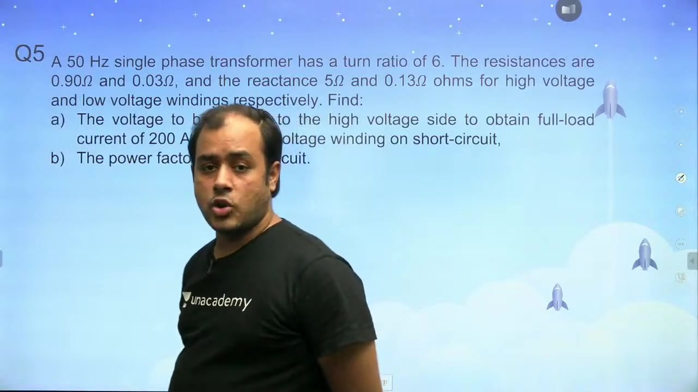

### Problem Statement: Voltage Required for Full-Load Short Circuit Current

> [!example] Problem
> A $50\text{ Hz}$ single-phase step-down transformer has a turns ratio of $a = N_1 / N_2 = 6$.
> Its winding parameters are:
> - High-voltage (HV) primary winding: $R_1 = 0.9\ \Omega, \quad X_1 = 5.0\ \Omega$
> - Low-voltage (LV) secondary winding: $R_2 = 0.03\ \Omega, \quad X_2 = 0.13\ \Omega$
> 
> The low-voltage winding is short-circuited. Find the voltage required on the high-voltage winding to circulate the full-load rated current of $200\text{ A}$ through the short-circuited low-voltage winding.

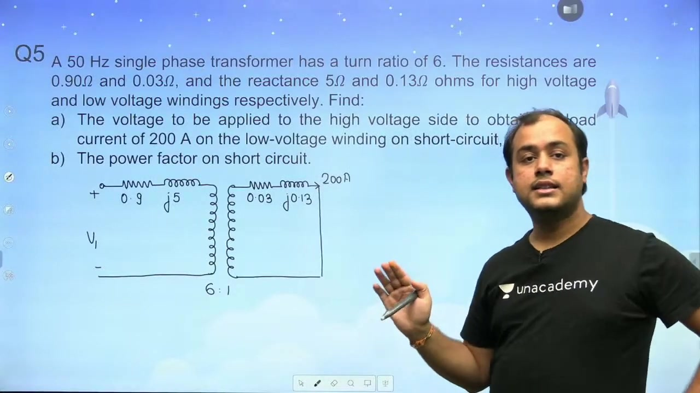

### Referring Impedance Parameters to the Low-Voltage Side

Rated current is specified on the low-voltage winding. So referring all circuit elements to the low-voltage side avoids extra current calculations.

The turns ratio is $a = 6$. Transfer the high-voltage resistance and reactance to the low-voltage winding by dividing by $a^2 = 36$:
$$\begin{aligned}
R_1' &= \frac{R_1}{a^2} = \frac{0.9}{36} = 0.025\ \Omega \\
X_1' &= \frac{X_1}{a^2} = \frac{5.0}{36} \approx 0.1389\ \Omega
\end{aligned}$$

Combine the primary and secondary parameters into total equivalent parameters referred to the low-voltage side:
$$\begin{aligned}
R_{02} &= R_2 + R_1' = 0.03 + 0.025 = 0.055\ \Omega \\
X_{02} &= X_2 + X_1' = 0.13 + 0.1389 = 0.2689\ \Omega
\end{aligned}$$

The total equivalent series impedance referred to the low-voltage winding is:
$$Z_{02} = R_{02} + j X_{02} = 0.055 + j 0.2689\ \Omega$$

Compute the impedance magnitude and angle:
$$\begin{aligned}
|Z_{02}| &= \sqrt{0.055^2 + 0.2689^2} \\
&= \sqrt{0.003025 + 0.072307} \\
&= \sqrt{0.075332} \approx 0.27447\ \Omega \\
\theta_{\text{sc}} &= \tan^{-1}\left(\frac{0.2689}{0.055}\right) = \tan^{-1}(4.889) \approx 78.43^\circ
\end{aligned}$$

### Calculating the Primary Supply Voltage

Take the rated secondary short-circuit current as the reference phasor:
$$\mathbf{I}_2 = 200 \angle 0^\circ\text{ A}$$

The primary applied voltage referred to the secondary winding is $V_1'$:
$$\begin{aligned}
\mathbf{V}_1' &= \mathbf{I}_2 Z_{02} \\
&= (200 \angle 0^\circ)(0.27447 \angle 78.43^\circ) \\
&= 54.89 \angle 78.43^\circ\text{ V}
\end{aligned}$$

In rectangular coordinates:
$$\mathbf{V}_1' = 200 \times (0.055 + j 0.2689) = 11.0 + j 53.78\text{ V}$$

Now transfer this voltage back to the high-voltage primary winding using the turns ratio:
$$\begin{aligned}
\mathbf{V}_1 &= a \mathbf{V}_1' \\
&= 6 \times 54.89 \angle 78.43^\circ \\
&= 329.34 \angle 78.43^\circ\text{ V}
\end{aligned}$$

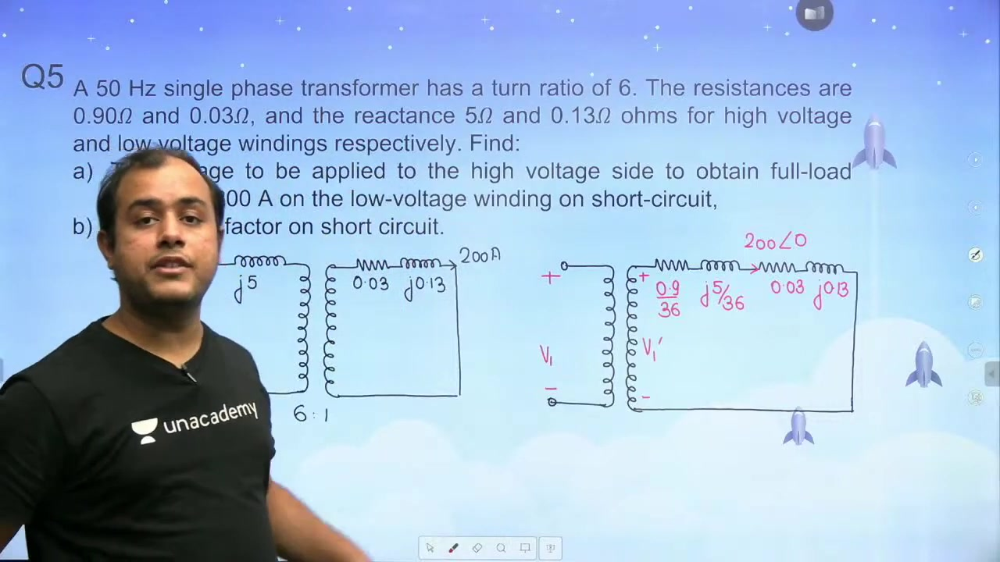

> [!success] Required Primary Short-Circuit Voltage
> The voltage required on the high-voltage winding to circulate rated full-load current is:
> $$V_1 \approx 329.34\text{ V}$$
> This applied voltage is only a small percentage of rated voltage. But it is sufficient to overcome internal winding impedance.

## Short-Circuit Power Factor and Dual-Side Referral Verification
_(34:21 - 39:11)_

### Short-Circuit Operating Power Factor

In a transformer short-circuit test, the voltage and current angles determine the operating power factor. From the low-voltage derivation in the previous section:
$$\begin{aligned}
\mathbf{V}_1' &= 54.89 \angle 78.43^\circ\text{ V} \\
\mathbf{I}_2 &= 200 \angle 0^\circ\text{ A}
\end{aligned}$$

The phase angle between the applied voltage and the current is $\theta_{\text{sc}} = 78.43^\circ$.

Compute the short-circuit power factor:
$$\text{pf}_{\text{sc}} = \cos(\theta_{\text{sc}}) = \cos(78.43^\circ) \approx 0.2005 \approx 0.20\text{ lagging}$$

Alternatively, calculate the power factor directly from the equivalent resistance and impedance:
$$\text{pf}_{\text{sc}} = \frac{R_{02}}{|Z_{02}|} = \frac{0.055}{0.2745} \approx 0.2004\text{ lagging}$$

> [!info] Why Short-Circuit Power Factor is Extremely Low
> In practical power transformers, the leakage reactance is four to five times larger than the winding resistance. The leakage magnetic flux paths in air give rise to significant leakage inductance. As a result, the impedance angle is very steep (close to $80^\circ$). The operating power factor during a short circuit is typically between $0.15$ and $0.25$ lagging.

### Verification: Direct Analysis Referred to the High-Voltage Side

Students often ask if referring the entire network to the high-voltage (HV) side yields identical results. We verify this directly.

Transfer the low-voltage parameters to the high-voltage primary winding using $a^2 = 6^2 = 36$:
$$\begin{aligned}
R_2' &= a^2 R_2 = 36 \times 0.03 = 1.08\ \Omega \\
X_2' &= a^2 X_2 = 36 \times 0.13 = 4.68\ \Omega
\end{aligned}$$

Add the primary winding parameters $R_1 = 0.9\ \Omega$ and $X_1 = 5.0\ \Omega$:
$$\begin{aligned}
R_{01} &= R_1 + R_2' = 0.9 + 1.08 = 1.98\ \Omega \\
X_{01} &= X_1 + X_2' = 5.0 + 4.68 = 9.68\ \Omega
\end{aligned}$$

The total equivalent series impedance referred to the high-voltage side is:
$$Z_{01} = 1.98 + j 9.68\ \Omega$$

Compute the magnitude and angle of $Z_{01}$:
$$\begin{aligned}
|Z_{01}| &= \sqrt{(1.98)^2 + (9.68)^2} \\
&= \sqrt{3.9204 + 93.7024} \\
&= \sqrt{97.6228} \approx 9.8804\ \Omega \\
\theta_{\text{sc}} &= \tan^{-1}\left(\frac{9.68}{1.98}\right) \approx 78.43^\circ
\end{aligned}$$

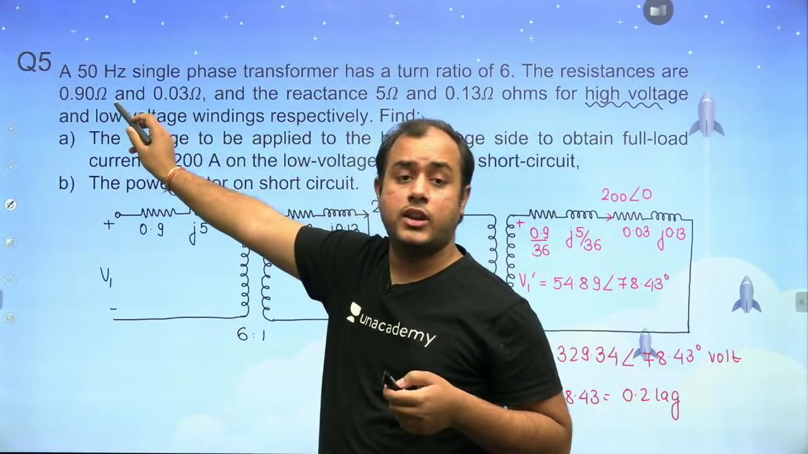

### Reflected Short-Circuit Current and Final Voltage

A common error is multiplying the secondary current by the turns ratio instead of dividing. On the high-voltage side, current is smaller by a factor of $a$:
$$I_1 = \frac{I_2}{a} = \frac{200}{6} = 33.333\text{ A}$$

Now compute the applied voltage on the high-voltage side:
$$\begin{aligned}
V_1 &= I_1 |Z_{01}| \\
&= \left(\frac{200}{6}\right) \times 9.8804 \\
&= 33.333 \times 9.8804 \\
&\approx 329.34\text{ V}
\end{aligned}$$

The power factor is:
$$\cos(\theta_{\text{sc}}) = \frac{R_{01}}{|Z_{01}|} = \frac{1.98}{9.8804} \approx 0.2004\text{ lagging}$$

Both approaches produce the exact same voltage and power factor.

### Recognizing Windings by Parameter Magnitudes

When transformer parameters are listed in problem statements, remember this rule:
1. Higher impedance values belong to the high-voltage (HV) winding.
2. Lower impedance values belong to the low-voltage (LV) winding.

Because impedance scales as turns squared ($N^2$), the winding with more turns always has higher resistance and higher leakage reactance.

## Comprehensive Equivalent Circuit Analysis: Step-Up Transformer Load Response
_(39:30 - 44:28)_

### Single-Phase Step-Up Transformer Circuit Model

Step-up transformers have a higher secondary voltage than primary voltage. In practice, all winding and load parameters are often referred to the primary side for convenience. This allows straightforward circuit analysis.

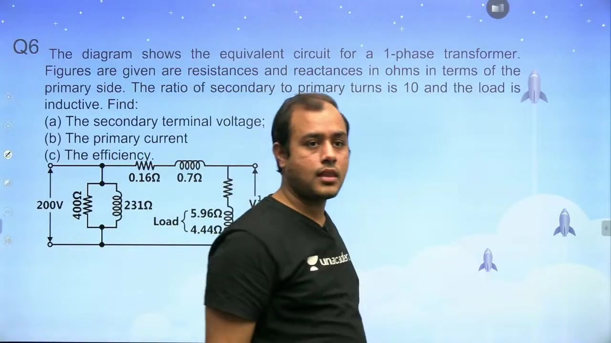

### Problem Statement: Step-Up Transformer Under Inductive Load

> [!example] Problem
> The equivalent circuit of a single-phase transformer is completely referred to the primary side.
> - Primary applied voltage: $V_1 = 200\text{ V}$ at $50\text{ Hz}$
> - Transformer series winding resistance: $R_{01} = 0.16\ \Omega$
> - Transformer series leakage reactance: $X_{01} = 0.70\ \Omega$
> - Secondary-to-primary turns ratio: $N_2 / N_1 = 10$
> - Inductive load referred to primary: $Z_L' = 5.96 + j 4.44\ \Omega$
> 
> Taking the primary applied voltage as the reference phasor ($\mathbf{V}_1 = 200 \angle 0^\circ\text{ V}$), calculate:
> 1. The total series branch impedance.
> 2. The reflected secondary load current $\mathbf{I}_1'$.
> 3. The referred secondary terminal voltage $\mathbf{V}_2'$.
> 4. The actual secondary terminal voltage $V_2$.

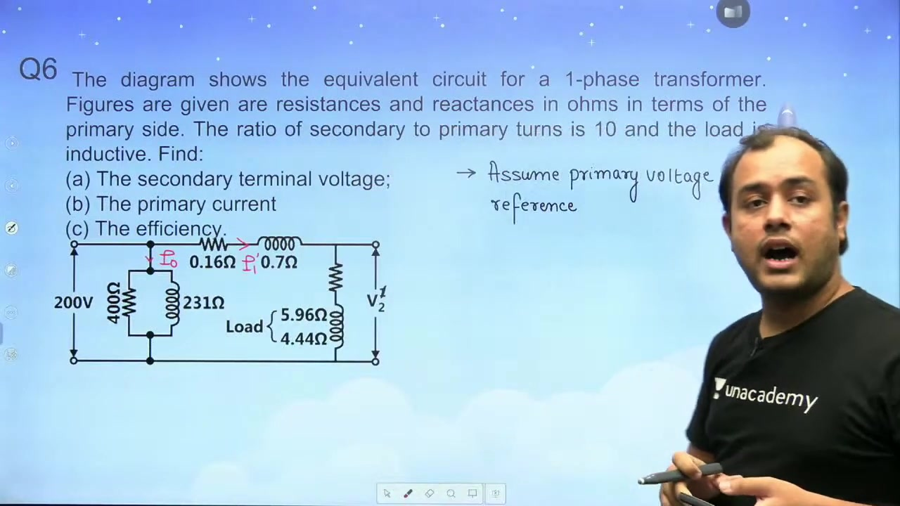

### Series Loop Impedance and Current Determination

The primary supply voltage drives current through the series branch formed by the internal winding impedance and the reflected load impedance.

Compute the total real resistance of the series branch:
$$R_{\text{total}} = R_{01} + R_L' = 0.16 + 5.96 = 6.12\ \Omega$$

Compute the total inductive reactance of the series branch:
$$X_{\text{total}} = X_{01} + X_L' = 0.70 + 4.44 = 5.14\ \Omega$$

Form the total series impedance:
$$Z_{\text{series}} = R_{\text{total}} + j X_{\text{total}} = 6.12 + j 5.14\ \Omega$$

Convert this impedance into polar form:
$$\begin{aligned}
|Z_{\text{series}}| &= \sqrt{(6.12)^2 + (5.14)^2} \\
&= \sqrt{37.4544 + 26.4196} \\
&= \sqrt{63.874} \approx 7.992\ \Omega \\
\theta_{\text{series}} &= \tan^{-1}\left(\frac{5.14}{6.12}\right) \approx 40.03^\circ \\
Z_{\text{series}} &\approx 7.992 \angle 40.03^\circ\ \Omega
\end{aligned}$$

With the primary supply voltage taken as reference ($\mathbf{V}_1 = 200 \angle 0^\circ\text{ V}$), compute the reflected load current $\mathbf{I}_1'$:
$$\begin{aligned}
\mathbf{I}_1' &= \frac{\mathbf{V}_1}{Z_{\text{series}}} \\
&= \frac{200 \angle 0^\circ}{7.992 \angle 40.03^\circ} \\
&\approx 25.024 \angle -40.03^\circ\text{ A}
\end{aligned}$$

In rectangular coordinates:
$$\mathbf{I}_1' = 25.024 \cos(-40.03^\circ) + j 25.024 \sin(-40.03^\circ) \approx 19.16 - j 16.09\text{ A}$$

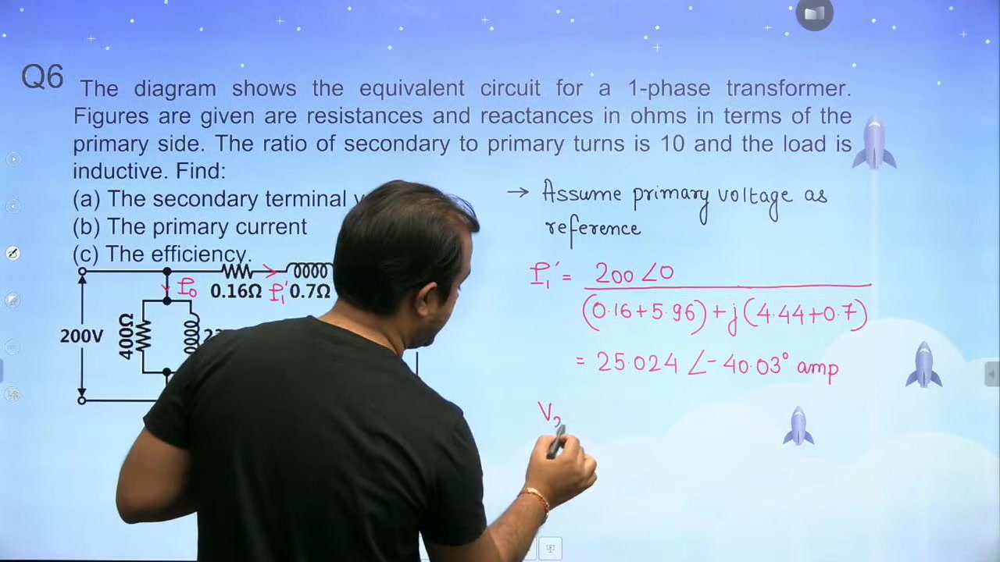

### Referred and Actual Secondary Terminal Voltage

The terminal voltage across the load referred to the primary is $\mathbf{V}_2'$:
$$\mathbf{V}_2' = \mathbf{I}_1' Z_L'$$

Represent the referred load impedance in polar coordinates:
$$\begin{aligned}
|Z_L'| &= \sqrt{(5.96)^2 + (4.44)^2} = \sqrt{35.5216 + 19.7136} = \sqrt{55.2352} \approx 7.432\ \Omega \\
\theta_L &= \tan^{-1}\left(\frac{4.44}{5.96}\right) \approx 36.68^\circ \\
Z_L' &= 7.432 \angle 36.68^\circ\ \Omega
\end{aligned}$$

Multiply the current by the load impedance:
$$\begin{aligned}
\mathbf{V}_2' &= (25.024 \angle -40.03^\circ)(7.432 \angle 36.68^\circ) \\
&= 185.98 \angle (-40.03^\circ + 36.68^\circ) \\
&= 185.98 \angle -3.35^\circ\text{ V}
\end{aligned}$$

Because the transformer steps up the voltage by a ratio of $N_2 / N_1 = 10$, the actual secondary terminal voltage is:
$$\begin{aligned}
V_2 &= \left(\frac{N_2}{N_1}\right) V_2' \\
&= 10 \times 185.98 \\
&= 1859.8\text{ V}
\end{aligned}$$

> [!success] Secondary Terminal Voltage
> The actual terminal voltage delivered to the high-voltage load is:
> $$V_2 = 1859.8\text{ V}$$
> Under open circuit, the secondary voltage would be $2000\text{ V}$. Winding impedance causes an internal drop of $140.2\text{ V}$.

## Total Primary Current, Power Losses, and Efficiency of Step-Up Transformer
_(44:31 - 49:28)_

### Exciting Current Components for the Step-Up Transformer

In the previous section, the reflected load current was found to be $\mathbf{I}_1' = 25.024 \angle -40.03^\circ\text{ A}$. To find the total primary current drawn from the $200\text{ V}$ source, we add the exciting branch currents.

The core loss resistance is $R_c = 400\ \Omega$. The core loss current component is in phase with the primary voltage:
$$I_w = \frac{V_1}{R_c} = \frac{200}{400} = 0.5\text{ A}$$

The magnetizing branch draws a reactive current of magnitude $I_\mu = 0.8658\text{ A}$ lagging the voltage by $90^\circ$:
$$\mathbf{I}_\mu = 0.8658 \angle -90^\circ\text{ A} = -j 0.8658\text{ A}$$

Combine both components into the no-load exciting current phasor:
$$\mathbf{I}_0 = I_w + \mathbf{I}_\mu = 0.5 - j 0.8658\text{ A}$$

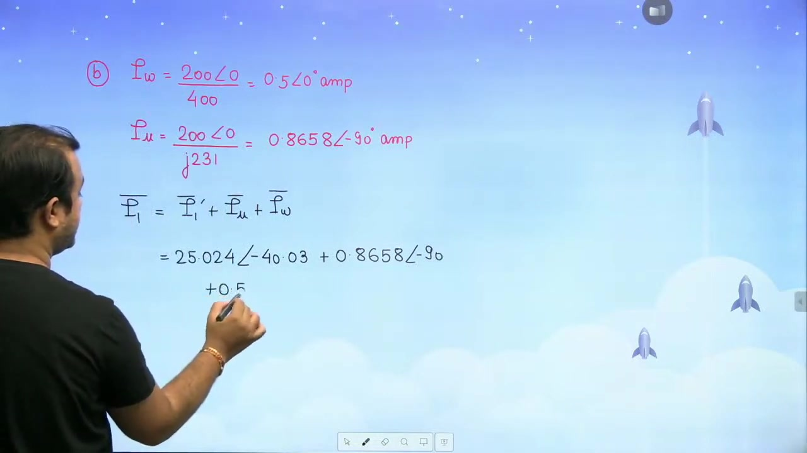

### Total Primary Input Current Calculation

The total primary current is the phasor sum of the load component and the exciting component:
$$\mathbf{I}_1 = \mathbf{I}_1' + \mathbf{I}_0$$

Express $\mathbf{I}_1'$ in rectangular coordinates:
$$\begin{aligned}
\mathbf{I}_1' &= 25.024 \cos(-40.03^\circ) + j 25.024 \sin(-40.03^\circ) \\
&\approx 19.161 - j 16.094\text{ A}
\end{aligned}$$

Now add the exciting current:
$$\begin{aligned}
\mathbf{I}_1 &= (19.161 - j 16.094) + (0.5 - j 0.8658) \\
&= (19.161 + 0.5) - j (16.094 + 0.8658) \\
&= 19.661 - j 16.960\text{ A}
\end{aligned}$$

Convert the primary current into polar form:
$$\begin{aligned}
|\mathbf{I}_1| &= \sqrt{(19.661)^2 + (-16.960)^2} \\
&= \sqrt{386.554 + 287.642} \\
&= \sqrt{674.196} \approx 25.965\text{ A} \\
\theta_1 &= -\tan^{-1}\left(\frac{16.960}{19.661}\right) = -\tan^{-1}(0.8626) \approx -40.78^\circ
\end{aligned}$$

The total primary input current is:
$$\mathbf{I}_1 = 25.965 \angle -40.78^\circ\text{ A}$$

> [!success] Total Primary Input Current
> The primary supply current is:
> $$I_1 = 25.97\text{ A} \quad \text{at a power factor of } \cos(40.78^\circ) = 0.757\text{ lagging}$$

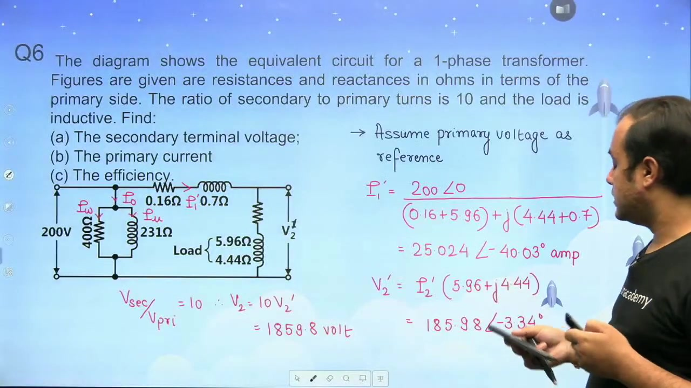

### Active Power Output and System Losses

Active power delivered to the load can be evaluated directly on the primary side. Active power is consumed entirely by the referred load resistance $R_L' = 5.96\ \Omega$:
$$\begin{aligned}
P_{\text{out}} &= |\mathbf{I}_1'|^2 R_L' \\
&= (25.024)^2 \times 5.96 \\
&= 626.20 \times 5.96 \\
&\approx 3732.16\text{ W}
\end{aligned}$$

Now calculate the internal power losses:
1. Winding copper loss in series resistance $R_{01} = 0.16\ \Omega$:
$$P_{\text{cu}} = |\mathbf{I}_1'|^2 R_{01} = (25.024)^2 \times 0.16 = 626.20 \times 0.16 = 100.19\text{ W}$$
2. Core loss in shunt resistance $R_c = 400\ \Omega$:
$$P_{\text{core}} = \frac{V_1^2}{R_c} = \frac{200^2}{400} = \frac{40000}{400} = 100.0\text{ W}$$

Sum both losses to obtain the total power loss:
$$P_{\text{loss}} = P_{\text{cu}} + P_{\text{core}} = 100.19 + 100.0 = 200.19\text{ W}$$

Compute total real input power supplied by the source:
$$\begin{aligned}
P_{\text{in}} &= P_{\text{out}} + P_{\text{loss}} \\
&= 3732.16 + 200.19 \\
&= 3932.35\text{ W}
\end{aligned}$$

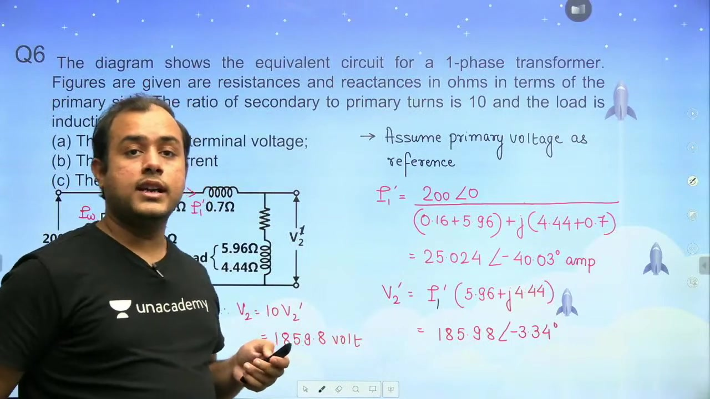

### Operating Efficiency Calculation

Compute the percentage efficiency of the transformer:
$$\begin{aligned}
\eta &= \frac{P_{\text{out}}}{P_{\text{in}}} \times 100\% \\
&= \frac{3732.16}{3932.35} \times 100\% \\
&\approx 94.91\%
\end{aligned}$$

> [!success] Transformer Efficiency
> Under the specified inductive load condition, the operating efficiency is:
> $$\eta = 94.9\%$$
> Adding losses to load power is much simpler than calculating input power via $V_1 I_1 \cos\theta_1$.

## Critical Phasor Reference Selection in Load-Current Specified Problems
_(49:30 - 55:34)_

### Specified Load Current Versus Specified Load Impedance

In earlier problems, the load was defined by an impedance $Z_L = R_L + j X_L$. In that case, combining $Z_L'$ with internal winding impedances yielded a known total branch impedance. Setting the primary voltage $\mathbf{V}_1 = V_1 \angle 0^\circ$ as reference immediately determined the branch current.

A different problem arises when the load current magnitude and its power factor are specified directly (for example, $10\text{ A}$ at $0.8$ lagging). In this case, the load impedance is not known beforehand.

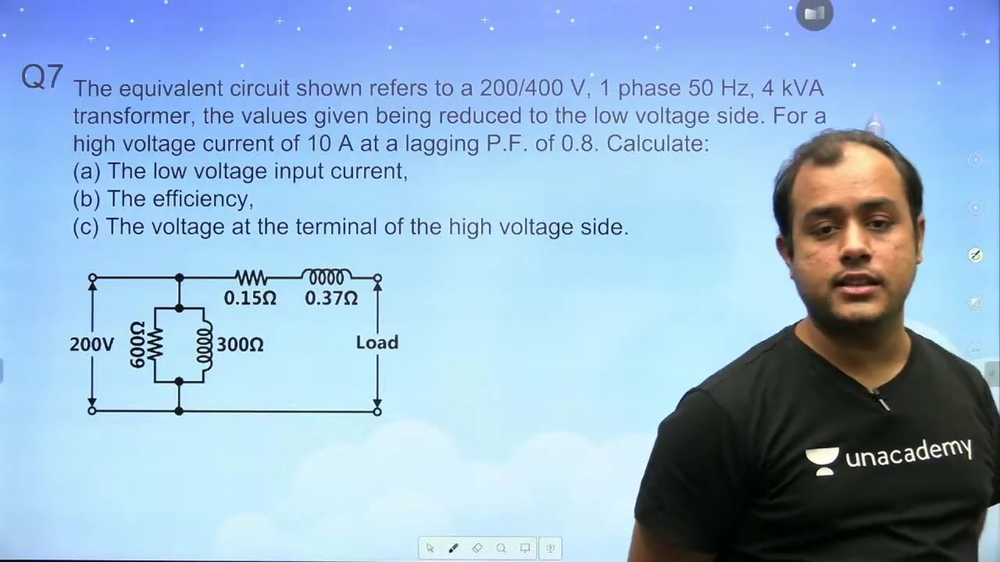

### Problem Statement: Specified Secondary Current and Power Factor

> [!example] Problem
> A single-phase transformer has its equivalent circuit referred to the low-voltage (LV) primary side.
> - Supply voltage: $V_1 = 200\text{ V}$
> - Equivalent series winding resistance: $R_{01}$
> - Equivalent series leakage reactance: $X_{01}$
> 
> The high-voltage (HV) secondary winding delivers a current of $10\text{ A}$ at a power factor of $0.8$ lagging.
> 
> Determine the correct phasor reference and formulate the equations to find the secondary terminal voltage $V_2$.

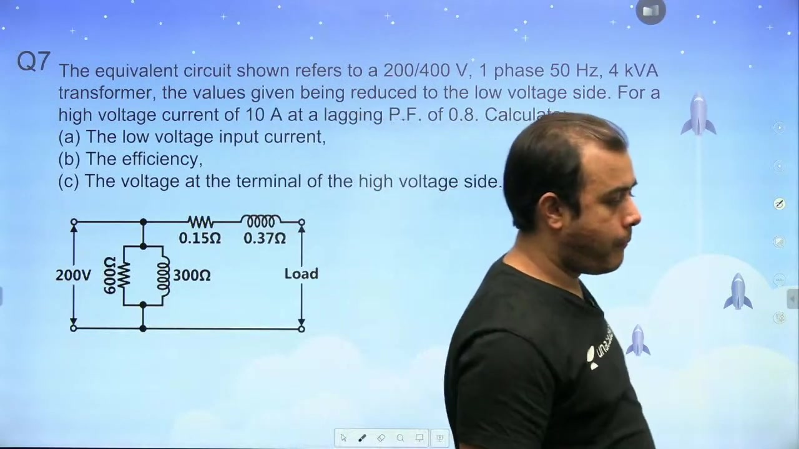

### The Fatal Conceptual Mistake: Primary Voltage as Reference

Students often make a major error in this type of problem. They set the primary supply voltage as the reference phasor:
$$\mathbf{V}_1 = 200 \angle 0^\circ\text{ V} \quad \text{(INCORRECT)}$$

Then they write the reflected load current as:
$$\mathbf{I}_1' = I_1' \angle -\cos^{-1}(0.8) = I_1' \angle -36.87^\circ\text{ A} \quad \text{(FATAL ERROR)}$$

This is fundamentally invalid. Power factor is defined as the cosine of the angle between voltage and current at the same physical terminal pair. 

> [!info] Port-Specific Definition of Power Factor
> The load power factor angle $\phi_2 = \cos^{-1}(0.8) = 36.87^\circ$ is the phase angle between the secondary load voltage $\mathbf{V}_2$ and the secondary load current $\mathbf{I}_2$:
> $$\phi_2 = \angle \mathbf{V}_2 - \angle \mathbf{I}_2$$
> It is not the phase angle between the primary source voltage $\mathbf{V}_1$ and the secondary current $\mathbf{I}_2$.

Because the internal winding impedance causes a phase shift between $\mathbf{V}_1$ and $\mathbf{V}_2'$, the angle of $\mathbf{V}_2'$ with respect to $\mathbf{V}_1$ is non-zero and initially unknown. If you set $\angle \mathbf{V}_1 = 0^\circ$, you do not know the phase angle of $\mathbf{I}_2$.

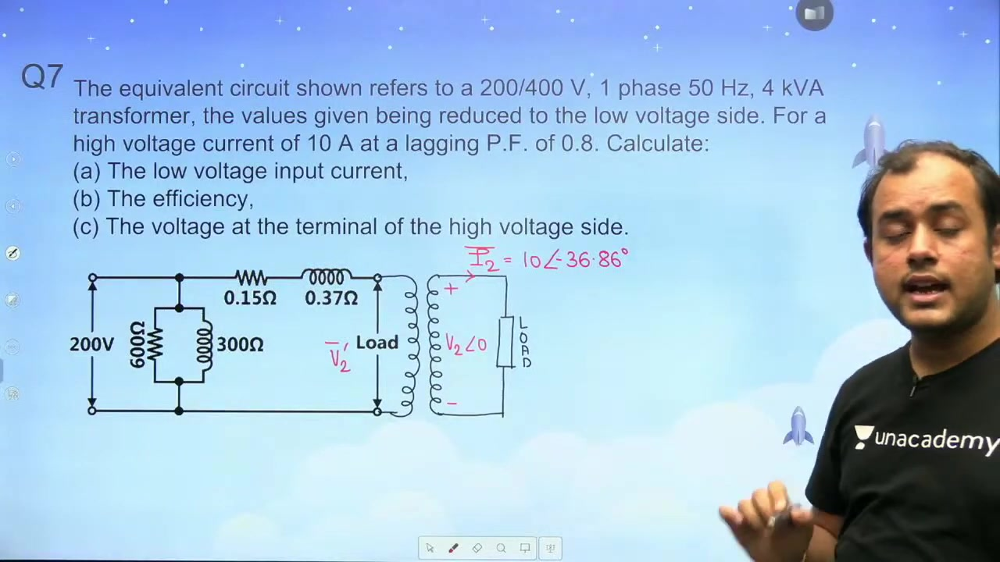

### The Correct Strategy: Setting Secondary Terminal Voltage as Reference

To correctly formulate the circuit, define the referred secondary terminal voltage as the reference phasor:
$$\mathbf{V}_2' = V_2' \angle 0^\circ$$

Here $V_2'$ is the unknown scalar magnitude. Because the load power factor is $0.8$ lagging, the reflected secondary current lags $\mathbf{V}_2'$ by exactly $\phi_2 = 36.87^\circ$:
$$\mathbf{I}_1' = I_1' \angle -36.87^\circ = I_1' (0.8 - j 0.6)$$

Now apply Kirchhoff's Voltage Law (KVL) around the equivalent circuit loop:
$$\mathbf{V}_1 = \mathbf{V}_2' + \mathbf{I}_1' (R_{01} + j X_{01})$$

Substitute the expressions into the loop equation:
$$\begin{aligned}
\mathbf{V}_1 &= V_2' \angle 0^\circ + I_1' (0.8 - j 0.6)(R_{01} + j X_{01}) \\
&= V_2' + I_1' \left[(0.8 R_{01} + 0.6 X_{01}) + j (0.8 X_{01} - 0.6 R_{01})\right]
\end{aligned}$$

Separate this phasor equation into real and imaginary parts:
$$\begin{aligned}
\text{Re}(\mathbf{V}_1) &= V_2' + I_1' (0.8 R_{01} + 0.6 X_{01}) \\
\text{Im}(\mathbf{V}_1) &= I_1' (0.8 X_{01} - 0.6 R_{01})
\end{aligned}$$

The magnitude of the primary supply voltage is known: $|\mathbf{V}_1| = 200\text{ V}$. Therefore:
$$|\mathbf{V}_1|^2 = \left[\text{Re}(\mathbf{V}_1)\right]^2 + \left[\text{Im}(\mathbf{V}_1)\right]^2 = 200^2$$

This yields a single algebraic equation in the unknown terminal voltage $V_2'$. Solving this equation gives the exact secondary terminal voltage without any ambiguity.

## Mathematical Derivation of Secondary Voltage and Load-Angle Under Specified Power Factor
_(55:34 - 60:47)_

### Numerical Formulation for the Step-Up Transformer

Consider the single-phase step-up transformer with a $1:2$ turns ratio ($a = N_1 / N_2 = 0.5$). The primary supply voltage magnitude is $V_1 = 200\text{ V}$. Internal series parameters referred to the low-voltage primary side are:
$$\begin{aligned}
R_{01} &= 0.15\ \Omega \\
X_{01} &= 0.37\ \Omega
\end{aligned}$$

The high-voltage secondary delivers a rated load current of $I_2 = 10\text{ A}$ at a lagging power factor of $\cos\phi_2 = 0.80$.

First, reflect the secondary current to the primary winding:
$$I_1' = \frac{I_2}{a} = \frac{10}{0.5} = 20\text{ A}$$

### Phasor Formulation with Secondary Voltage Reference

Set the referred secondary terminal voltage as the reference phasor:
$$\mathbf{V}_2' = V_2' \angle 0^\circ$$

Because the load power factor is $0.80$ lagging ($\phi_2 = 36.87^\circ$), the reflected current phasor is:
$$\begin{aligned}
\mathbf{I}_1' &= 20 \angle -36.87^\circ\text{ A} \\
&= 20 \cos(36.87^\circ) - j 20 \sin(36.87^\circ) \\
&= 16.0 - j 12.0\text{ A}
\end{aligned}$$

Compute the internal voltage drop across the transformer series winding impedance:
$$\Delta \mathbf{V} = \mathbf{I}_1' (R_{01} + j X_{01}) = (16.0 - j 12.0)(0.15 + j 0.37)$$

Expand this complex multiplication:
$$\begin{aligned}
\Delta \mathbf{V} &= \left[16.0(0.15) - (-12.0)(0.37)\right] + j \left[16.0(0.37) + (-12.0)(0.15)\right] \\
&= (2.40 + 4.44) + j (5.92 - 1.80) \\
&= 6.84 + j 4.12\text{ V}
\end{aligned}$$

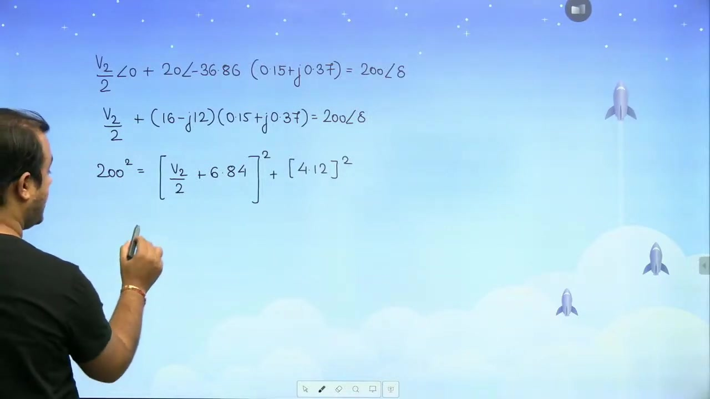

### Solving for the Secondary Terminal Voltage

Apply Kirchhoff's Voltage Law to relate the primary supply voltage to the terminal voltage:
$$\mathbf{V}_1 = \mathbf{V}_2' + \Delta \mathbf{V} = (V_2' + 6.84) + j 4.12\text{ V}$$

Because $\mathbf{V}_2'$ is chosen as the reference, the primary source voltage $\mathbf{V}_1$ leads $\mathbf{V}_2'$ by a small phase angle $\delta$:
$$\mathbf{V}_1 = 200 \angle \delta$$

Equate the squared magnitude of $\mathbf{V}_1$ to the sum of its squared real and imaginary components:
$$(V_2' + 6.84)^2 + (4.12)^2 = 200^2 = 40000$$

Calculate the numerical value of the squared real component:
$$(V_2' + 6.84)^2 = 40000 - 16.9744 = 39983.0256$$

Take the square root of both sides:
$$V_2' + 6.84 = \sqrt{39983.0256} \approx 199.9575\text{ V}$$

Subtract $6.84$ to find the referred terminal voltage magnitude:
$$V_2' = 199.9575 - 6.84 \approx 193.12\text{ V}$$

Now transfer this referred voltage to the high-voltage secondary winding:
$$\begin{aligned}
V_2 &= \frac{V_2'}{a} \\
&= \frac{193.12}{0.5} \\
&\approx 386.24\text{ V}
\end{aligned}$$

> [!success] Secondary Terminal Voltage
> Under rated load current at $0.8$ lagging power factor:
> $$V_2 \approx 386\text{ V}$$
> Under no load, the secondary voltage would be $400\text{ V}$. The internal drop reduces the terminal voltage to $386\text{ V}$.

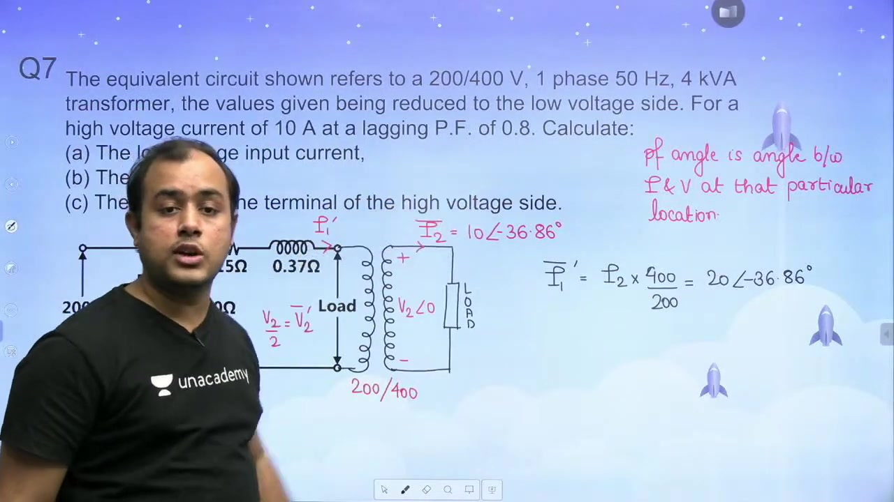

### Evaluation of the Primary-to-Secondary Load Angle $\delta$

The phase angle $\delta$ represents the phase advance of the primary source relative to the secondary load voltage:
$$\tan \delta = \frac{\text{Im}(\mathbf{V}_1)}{\text{Re}(\mathbf{V}_1)} = \frac{4.12}{V_2' + 6.84} = \frac{4.12}{199.96} \approx 0.0206$$

Take the inverse tangent:
$$\delta = \tan^{-1}(0.0206) \approx 1.18^\circ$$

The primary voltage phasor is:
$$\mathbf{V}_1 = 200 \angle 1.18^\circ\text{ V}$$

Because $\delta$ is very small ($1.18^\circ$), the imaginary component ($4.12\text{ V}$) contributes negligible change to the scalar magnitude. This confirms why the standard scalar voltage regulation formula $\Delta V \approx I_1' (R_{01} \cos\phi_2 + X_{01} \sin\phi_2) = 6.84\text{ V}$ is exceptionally accurate for power transformers.

## Total Primary Current, Power Balance, and the Constant-Current Load Paradigm
_(60:49 - 65:35)_

### Primary Current with Shunt Core Branch

In the previous section, the reflected secondary current was found to be $\mathbf{I}_1' = 20 \angle -36.87^\circ\text{ A}$. The primary source voltage is $\mathbf{V}_1 = 200 \angle 1.18^\circ\text{ V}$. Because the load angle $\delta = 1.18^\circ$ is very small, approximating $\mathbf{V}_1$ along the horizontal axis introduces virtually no error in shunt branch currents.

The shunt parameters on the low-voltage primary side are:
- Core loss resistance: $R_c = 600\ \Omega$
- Magnetizing reactance: $X_m$

The core loss current component is:
$$I_w = \frac{V_1}{R_c} = \frac{200}{600} \approx 0.333\text{ A}$$

Adding the magnetizing current component and summing with the reflected load current gives the total primary current:
$$\mathbf{I}_1 \approx 20.67 \angle -37.78^\circ\text{ A}$$

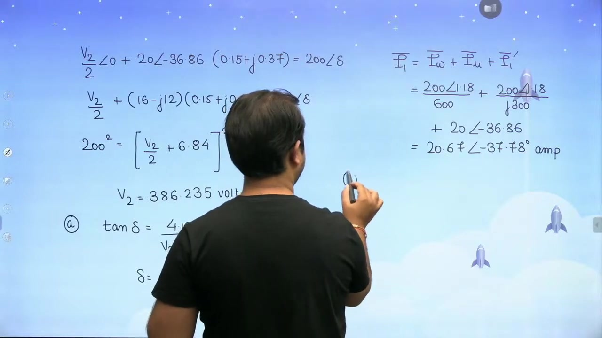

### Input Power and Real Loss Balance

Evaluate real input power directly at the primary terminals:
$$P_{\text{in}} = V_1 I_1 \cos(\theta_V - \theta_I)$$

The voltage phase angle is $\theta_V = 1.18^\circ$. The current phase angle is $\theta_I = -37.78^\circ$. The net power factor angle is:
$$\phi_1 = \theta_V - \theta_I = 1.18^\circ - (-37.78^\circ) = 38.96^\circ$$

Compute the input power:
$$\begin{aligned}
P_{\text{in}} &= 200 \times 20.67 \times \cos(38.96^\circ) \\
&= 4134 \times 0.7776 \\
&\approx 3214.53\text{ W}
\end{aligned}$$

Now determine internal losses in the transformer:
1. Series winding copper loss:
$$P_{\text{cu}} = (I_1')^2 R_{01} = 20^2 \times 0.15 = 400 \times 0.15 = 60.0\text{ W}$$
2. Shunt core loss:
$$P_{\text{core}} = \frac{V_1^2}{R_c} = \frac{200^2}{600} = \frac{40000}{600} \approx 66.67\text{ W}$$

Total internal power loss is:
$$P_{\text{loss}} = P_{\text{cu}} + P_{\text{core}} = 60.0 + 66.67 = 126.67\text{ W}$$

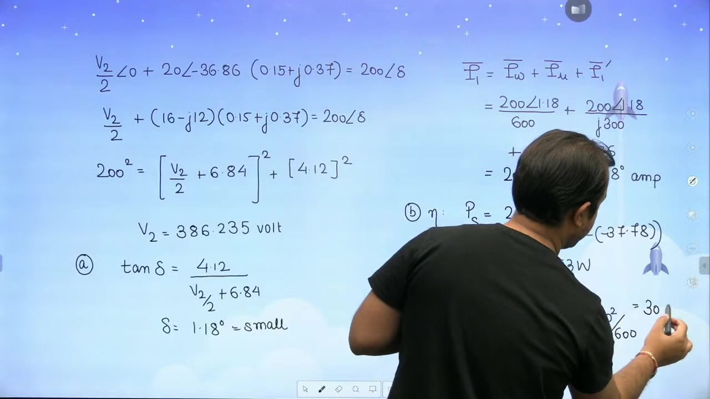

### Load Power and Operating Efficiency

Subtract internal losses from input power to obtain the power delivered to the secondary load:
$$P_L = P_{\text{in}} - P_{\text{loss}} = 3214.53 - 126.67 = 3087.86\text{ W}$$

Verify this result directly from secondary terminal quantities:
$$\begin{aligned}
P_L &= V_2 I_2 \cos\phi_2 \\
&= 386 \times 10 \times 0.80 \\
&= 3088\text{ W}
\end{aligned}$$

Both calculations agree within numerical rounding.

Compute the transformer operating efficiency:
$$\eta = \frac{P_L}{P_{\text{in}}} \times 100\% = \frac{3087.86}{3214.53} \times 100\% \approx 96.06\%$$

> [!success] Transformer Performance Summary
> Under rated current of $10\text{ A}$ at $0.8$ lagging power factor:
> - Active power input: $P_{\text{in}} = 3214.5\text{ W}$
> - Active power output: $P_L = 3087.9\text{ W}$
> - Operating efficiency: $\eta = 96.1\%$

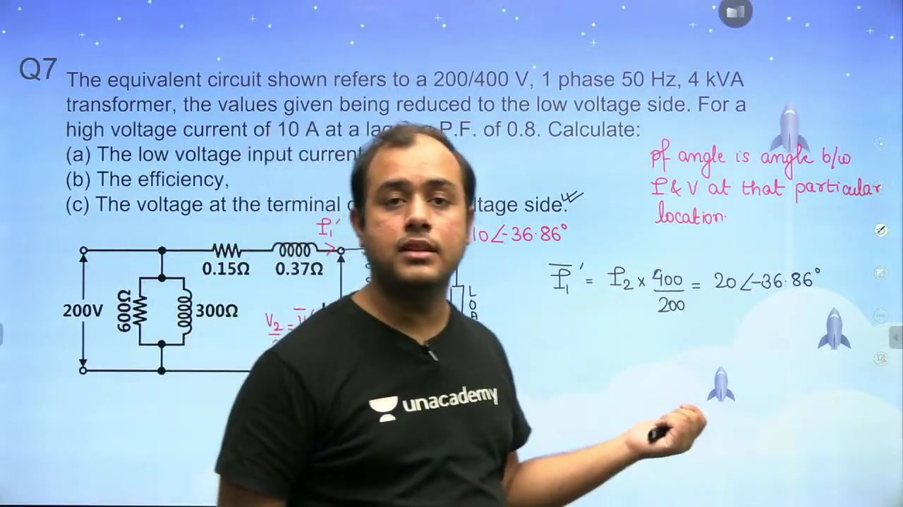

### Passive Impedance Loads Versus Constant Power/Current Loads

Standard network theory deals almost exclusively with passive constant impedances ($R + j X$). In an impedance network:
$$I = \frac{V}{Z}$$

You can choose any convenient node voltage as the $0^\circ$ reference without changing the solution method.

In electrical machines and power systems, loads are often specified by active and reactive power ($P - Q$) or by current magnitude and power factor ($I, \cos\phi$). Here the terminal voltage is not fixed in advance. If you arbitrarily set the source voltage $\mathbf{V}_1 = 200 \angle 0^\circ$, then the load voltage must have an unknown angle $\theta$:
$$\mathbf{V}_2' = V_2' \angle \theta$$

Because the load current lags the load voltage by $36.87^\circ$, its phasor becomes:
$$\mathbf{I}_1' = I_1' \angle (\theta - 36.87^\circ)$$

This introduces two coupled non-linear equations for two unknown variables ($V_2'$ and $\theta$). Setting the load voltage as reference eliminates the phase angle variable completely.

## Per-Unit Transformer Short-Circuit Modeling and Exciting Current Decomposition
_(65:35 - 70:40)_

### The Per-Unit Advantage in Transformer Modeling

In ohmic calculations, winding resistance and reactance depend on which side they are referred to. An engineer must track turns ratios and square them appropriately. The per-unit system removes this complexity.

> [!info] Invariance of Per-Unit Impedance
> The per-unit resistance and reactance of a transformer are identical on both sides:
> $$R_{\text{pu, HV}} = R_{\text{pu, LV}}, \quad X_{\text{pu, HV}} = X_{\text{pu, LV}}$$
> Base impedances automatically absorb the turns ratio squared. Also, rated voltage and rated current on both windings equal $1.0\text{ pu}$.

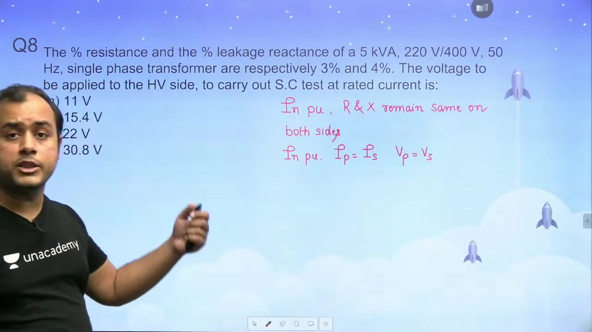

### Problem Statement: Per-Unit Short Circuit Test

> [!example] Problem
> A single-phase transformer has a percentage resistance of $3\%$ and a percentage leakage reactance of $4\%$.
> - Rated voltage on the high-voltage (HV) winding: $V_{\text{base, HV}} = 440\text{ V}$
> 
> What voltage must be applied to the HV side to perform a short-circuit test at rated full-load current?

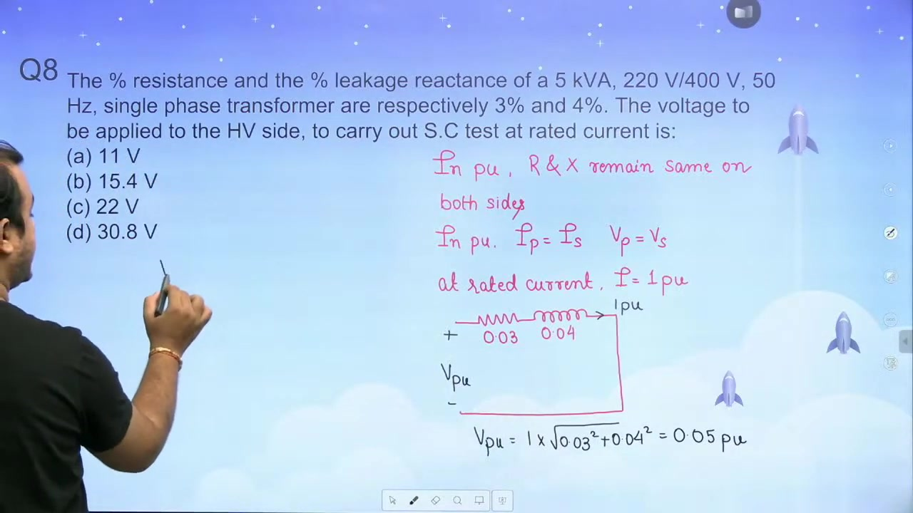

### Derivation in Per-Unit

Convert the percentage values into per-unit values:
$$\begin{aligned}
R_{\text{pu}} &= \frac{3\%}{100} = 0.03\text{ pu} \\
X_{\text{pu}} &= \frac{4\%}{100} = 0.04\text{ pu}
\end{aligned}$$

Compute the total equivalent per-unit impedance magnitude:
$$\begin{aligned}
|Z_{\text{pu}}| &= \sqrt{R_{\text{pu}}^2 + X_{\text{pu}}^2} \\
&= \sqrt{(0.03)^2 + (0.04)^2} \\
&= \sqrt{0.0009 + 0.0016} \\
&= \sqrt{0.0025} = 0.05\text{ pu}
\end{aligned}$$

During a short-circuit test at rated current, the test current in per-unit is unity:
$$I_{\text{sc, pu}} = 1.0\text{ pu}$$

The required applied voltage in per-unit is:
$$V_{\text{sc, pu}} = I_{\text{sc, pu}} |Z_{\text{pu}}| = 1.0 \times 0.05 = 0.05\text{ pu}$$

To find the actual physical voltage on the high-voltage side, multiply by the HV base voltage:
$$\begin{aligned}
V_{\text{sc}} &= V_{\text{sc, pu}} \times V_{\text{base, HV}} \\
&= 0.05 \times 440\text{ V} \\
&= 22\text{ V}
\end{aligned}$$

> [!success] Required Short-Circuit Voltage
> The applied voltage required on the high-voltage winding is:
> $$V_{\text{sc}} = 22\text{ V}$$
> Only $5\%$ of rated voltage is needed to circulate full-load rated current during a short circuit.

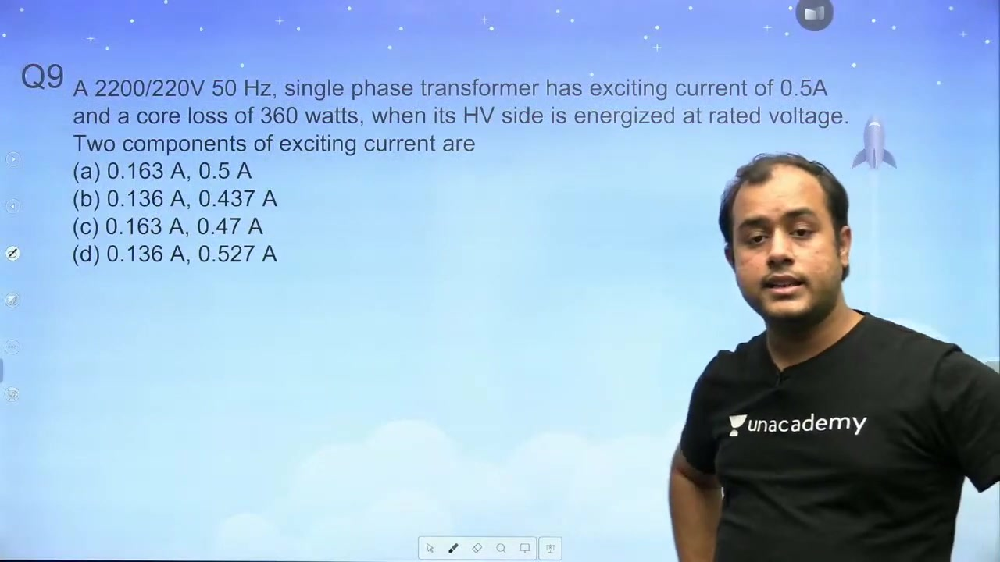

### Introducing the Exciting Current Problem

> [!example] Problem
> A $2200 / 220\text{ V}$ single-phase transformer takes an exciting current of $0.5\text{ A}$ when its high-voltage winding is excited at rated voltage under no load. The core loss measured is $360\text{ W}$.
> Determine the two components of the exciting current: the core loss component $I_w$ and the magnetizing component $I_\mu$.

### Conceptual Clarity: Exciting Current Versus Magnetizing Current

Students frequently confuse exciting current with magnetizing current.
- **Exciting Current ($I_0$)**: The total no-load current drawn from the supply.
- **Core Loss Current ($I_w$)**: The active component in phase with voltage that supplies hysteresis and eddy current losses.
- **Magnetizing Current ($I_\mu$)**: The reactive component lagging voltage by $90^\circ$ that sets up core magnetic flux.

Because $I_w$ and $I_\mu$ are in quadrature:
$$I_0 = \sqrt{I_w^2 + I_\mu^2}$$

Since $I_0 = 0.5\text{ A}$, neither individual component can exceed $0.5\text{ A}$. Any multiple-choice option with $I_\mu \ge 0.5\text{ A}$ can be ruled out immediately.

## Core Loss and Magnetizing Current Decomposition Under No-Load Excitation
_(70:42 - 77:07)_

### Mathematical Solution for Exciting Current Components

In the previous section, Problem 7 established that a $2200\text{ V}$ excitation draws $I_0 = 0.5\text{ A}$ with $360\text{ W}$ core loss. Real power in the transformer core is dissipated purely in the equivalent shunt resistance $R_c$.

Because the voltage across $R_c$ and the current through it are in phase:
$$P_c = V_1 I_w$$

Solve directly for the core loss current component:
$$\begin{aligned}
I_w &= \frac{P_c}{V_1} \\
&= \frac{360}{2200} \\
&\approx 0.1636\text{ A}
\end{aligned}$$

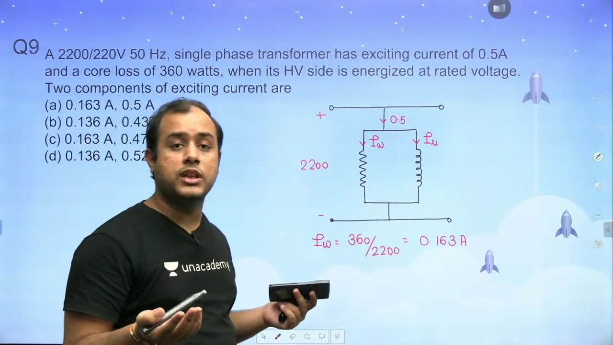

### Quadrature Relationship and Magnetizing Current

The core loss component $I_w$ accounts for energy lost as heat in the core laminations. The magnetizing component $I_\mu$ accounts for energy stored in establishing the alternating magnetic field. These two currents are in space and time quadrature ($90^\circ$ out of phase).

The total exciting current phasor satisfies:
$$\mathbf{I}_0 = I_w - j I_\mu$$

Apply the Pythagorean theorem to their scalar magnitudes:
$$I_0^2 = I_w^2 + I_\mu^2$$

Rearrange to solve for the magnetizing current component:
$$\begin{aligned}
I_\mu &= \sqrt{I_0^2 - I_w^2} \\
&= \sqrt{(0.5)^2 - (0.1636)^2} \\
&= \sqrt{0.2500 - 0.02677} \\
&= \sqrt{0.22323} \\
&\approx 0.4725\text{ A} \approx 0.472\text{ A}
\end{aligned}$$

> [!success] Exciting Current Components
> The two components of the exciting current are:
> - Core loss current component: $I_w \approx 0.164\text{ A}$
> - Magnetizing current component: $I_\mu \approx 0.472\text{ A}$
> This confirms multiple-choice Option C.

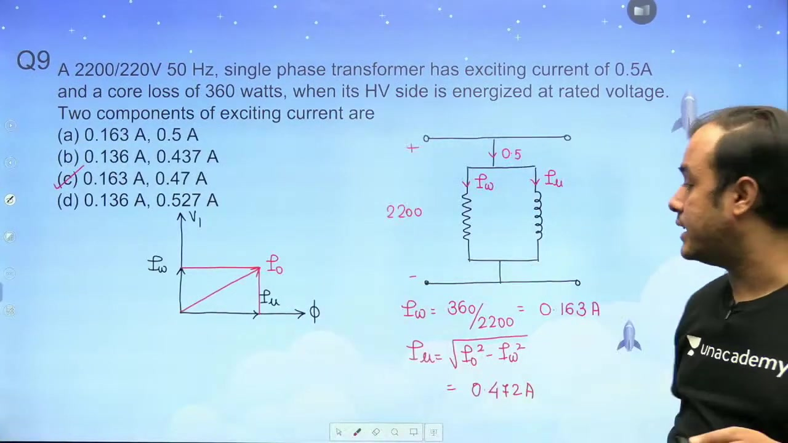

### Phasor Diagram Analysis Under No-Load Conditions

The no-load phasor diagram illustrates these physical relationships:
1. The applied primary voltage $\mathbf{V}_1$ establishes the reference potential.
2. The core loss current $\mathbf{I}_w$ lies directly along the $\mathbf{V}_1$ axis.
3. The mutual core flux $\boldsymbol{\Phi}_m$ lags the applied voltage by $90^\circ$.
4. The magnetizing current $\mathbf{I}_\mu$ lies in phase with the mutual flux $\boldsymbol{\Phi}_m$. It lags $\mathbf{V}_1$ by $90^\circ$.
5. The resultant exciting current $\mathbf{I}_0$ lags $\mathbf{V}_1$ by an angle $\theta_0$:

$$\cos \theta_0 = \frac{I_w}{I_0} = \frac{0.1636}{0.50} \approx 0.327\text{ lagging}$$

The no-load power factor of a power transformer is very low. It typically ranges between $0.1$ and $0.3$ lagging. This occurs because the magnetizing current component dominates over the core loss component.

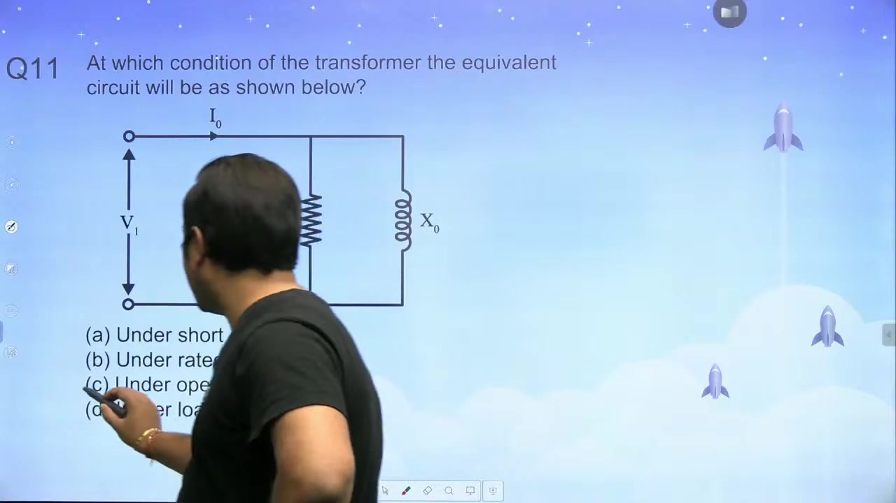

### Equivalent Circuit Under Open-Circuit Test

The exciting branch represents the transformer during an open-circuit test. During this test, the secondary winding is left open-circuited ($I_2 = 0$).

Because the secondary is open, no current flows through the secondary series impedance. The primary series winding impedance is very small compared to the shunt branch. Therefore, the primary voltage drop is negligible. All input current is exciting current $I_0$. All input real power is core loss $P_c$. The open-circuit test directly extracts $R_c$ and $X_m$.

### Summary and Upcoming Topics

This session completed practical problem-solving across all equivalent circuit models:
- Referring complex loads across ideal transformer windings.
- Evaluating series-parallel transformer connections using secondary voltage references.
- Complex conjugate matching for maximum power transfer.
- Short-circuit test voltage and power factor derivations.
- Constant-current load modeling and reference phasor selection.
- Per-unit transformer short-circuit analysis.
- Decomposing no-load exciting current into core loss and magnetizing components.

The next lectures will cover experimental testing of transformers (Open-Circuit and Short-Circuit tests) and detailed efficiency and regulation calculations.

---

## Summary and Key Takeaways

- Secondary impedance $Z_2$ transfers to the primary winding as $Z_2' = a^2 Z_2$, where $a = N_1 / N_2$.
- When secondaries connect in parallel across a common load, their secondary terminal voltages are identical, simplifying network analysis.
- Maximum power transfer across an ideal transformer requires conjugate matching $Z_L' = Z_S^*$, which sets $a^2 R_L = R_S$ and cancels net loop reactance.
- During a short-circuit test, the applied voltage is small, so the shunt core exciting branch can be neglected.
- The short-circuit power factor is very low ($\cos\theta_{\text{sc}} \approx 0.15 - 0.25\text{ lag}$) because leakage reactance dominates series winding resistance.
- When load current and power factor are specified directly, the load voltage $V_2$ must be chosen as the reference phasor rather than the supply voltage $V_1$.
- Transformer per-unit resistance and reactance are identical on both high-voltage and low-voltage sides ($R_{\text{pu, HV}} = R_{\text{pu, LV}}$ and $X_{\text{pu, HV}} = X_{\text{pu, LV}}$).
- Total exciting current decomposes into orthogonal components satisfying $I_0 = \sqrt{I_w^2 + I_\mu^2}$, where $I_w$ supplies core losses and $I_\mu$ produces mutual flux.

