[← Lec 020: Problems based on Equivalent Circuit](Lecture_020_Problems_based_on_Equivalent_Circuit.md) | [🏠 Index](00_yt_study_guide.md) | [Lec 022: Testing of Transformer Part 2 →](Lecture_022_Testing_of_Transformer_Part_2.md)

---

# Testing of Transformer - 1 | Electrical Machines | Lec 15 | GATE/ESE (EE, ECE) | Ankit Goyal

- **Source**: https://www.youtube.com/watch?v=-DVEz0hhAdY
- **Duration**: 00:52:53
- **Compiled**: 2026-09-19

---

## Overview

This lecture establishes the experimental procedures used to determine transformer equivalent circuit parameters and operating losses. It details the open-circuit test conducted at rated voltage to extract core loss resistance and magnetizing reactance. It then presents the short-circuit test conducted at rated current to extract total series resistance and leakage reactance. Each test is justified through circuit approximations based on operating flux and current levels. The lecture also analyzes the response of test instruments to non-rated currents and reduced supply frequencies.

## Contents

- [[#Experimental Testing of Transformers: The Open-Circuit Test Foundation|Experimental Testing of Transformers: The Open-Circuit Test Foundation]]
- [[#Open-Circuit Test Instrumentation and Equivalent Circuit Behavior|Open-Circuit Test Instrumentation and Equivalent Circuit Behavior]]
- [[#Extraction of Shunt Branch Parameters from Open-Circuit Test Data|Extraction of Shunt Branch Parameters from Open-Circuit Test Data]]
- [[#No-Load Phasor Diagram, Wattmeter Selection, and Frequency Variations|No-Load Phasor Diagram, Wattmeter Selection, and Frequency Variations]]
- [[#Principles and Experimental Setup of the Short-Circuit Test|Principles and Experimental Setup of the Short-Circuit Test]]
- [[#Equivalent Circuit and Justification for Neglecting the Shunt Branch|Equivalent Circuit and Justification for Neglecting the Shunt Branch]]
- [[#Extraction of Series Branch Parameters and Short-Circuit Power Factor|Extraction of Series Branch Parameters and Short-Circuit Power Factor]]
- [[#Short-Circuit Testing at Non-Rated Current and Scaling Laws|Short-Circuit Testing at Non-Rated Current and Scaling Laws]]
- [[#Frequency Variation at Rated Current and Equivalent Circuit Parameters|Frequency Variation at Rated Current and Equivalent Circuit Parameters]]

---

## Experimental Testing of Transformers: The Open-Circuit Test Foundation
_(00:13 - 07:10)_

### Purpose of Experimental Testing

Theoretical equivalent circuits model physical transformers using resistances and reactances. But real transformers come from manufacturing lines with unknown internal values. Direct physical inspection cannot measure leakage reactances or core loss resistances. Engineers determine these parameters through non-destructive electrical tests.

Two primary standard tests determine equivalent circuit parameters:
1. The Open-Circuit (OC) test.
2. The Short-Circuit (SC) test.

These tests evaluate transformer losses and efficiency without requiring a full mechanical or electrical load.

### Objectives of the Open-Circuit Test

The open-circuit test operates the transformer with one winding energized and the other left completely open. No load connects to the secondary terminals.

> [!info] Objectives of the Open-Circuit Test
> The open-circuit test achieves two primary engineering goals:
> 1. Measures core losses ($P_{\text{core}}$), comprising hysteresis and eddy current losses.
> 2. Extracts shunt exciting branch parameters: core loss resistance $R_c$ and magnetizing reactance $X_m$.

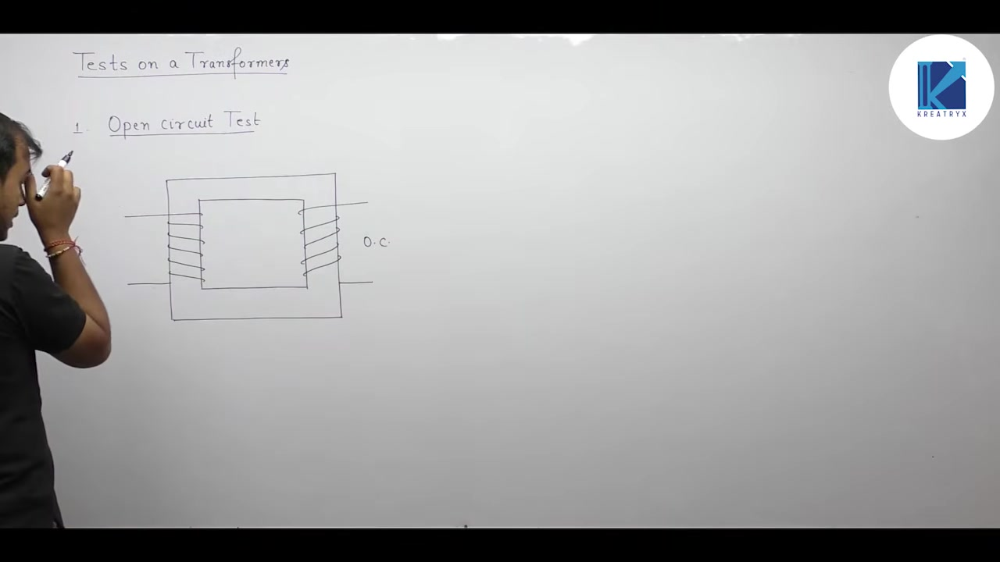

### Why Rated Voltage and Frequency Are Essential

Core losses depend directly on maximum mutual magnetic flux $\Phi_m$. The induced electromotive force in a transformer winding is:
$$E_1 = 4.44 f N_1 \Phi_m$$

Rearranging shows the flux dependence on voltage and frequency:
$$\Phi_m \propto \frac{V_1}{f}$$

Core losses consist of hysteresis loss and eddy current loss:
$$P_{\text{core}} = P_h + P_e \propto \Phi_m^2$$

To measure core losses accurately under operating conditions, the core flux must reach its rated value:
$$\Phi_m = \Phi_{\text{rated}}$$

Maintaining rated flux requires applying rated voltage at rated frequency:
$$V_1 = V_{\text{rated}}, \quad f = f_{\text{rated}}$$

If test voltage or frequency departs from rated values, the measured core loss will be incorrect.

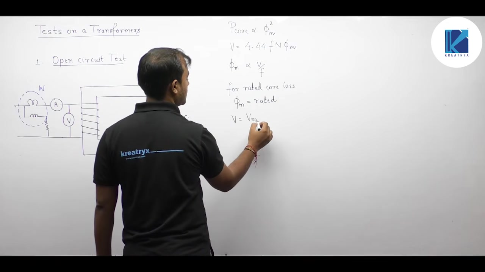

### Selecting the Test Winding: Low-Voltage Versus High-Voltage

In modern power engineering, transformers are described by high-voltage (HV) and low-voltage (LV) sides rather than primary and secondary.

Consider a transformer rated at $2500 / 250\text{ V}$. An engineer could theoretically conduct the open-circuit test from either winding:
- Conducting on the HV winding requires applying $2500\text{ V}$.
- Conducting on the LV winding requires applying only $250\text{ V}$.

> [!success] Winding Selection for Open-Circuit Test
> The open-circuit test is always conducted on the low-voltage (LV) winding while keeping the high-voltage (HV) winding open-circuited.

Applying $250\text{ V}$ is far safer than handling $2500\text{ V}$. Standard bench instruments and variable autotransformers operate comfortably at $250\text{ V}$. Testing on the high-voltage side would require expensive high-voltage insulation and specialized meters. Therefore, laboratory convenience and electrical safety dictate testing on the LV side.

## Open-Circuit Test Instrumentation and Equivalent Circuit Behavior
_(07:10 - 12:30)_

### Instrument Configuration on the Low-Voltage Winding

The open-circuit test connects three standard electrical instruments to the low-voltage winding:
1. **Voltmeter**: Placed directly across the supply terminals to record input voltage $V_1$.
2. **Ammeter**: Placed in series with the input line to measure no-load input current $I_0$.
3. **Wattmeter**: Connected with its current coil in series and pressure coil across the terminals to record real active power $W_0$.

The high-voltage winding terminals are insulated and left completely open.

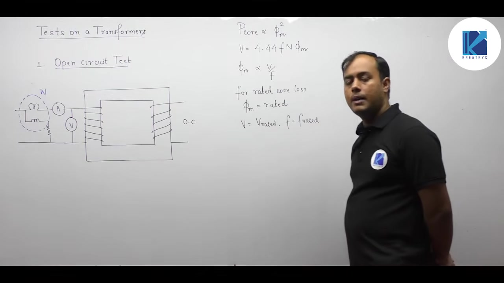

### Equivalent Circuit Under Open-Circuit Conditions

In the approximate equivalent circuit, the shunt exciting branch connects directly across the input terminals. The series winding impedance $R_{01} + j X_{01}$ follows the shunt branch.

Because the secondary terminals are open-circuited, secondary current is zero:
$$I_2 = 0$$

Transferring secondary current across the ideal core gives the reflected primary load current:
$$I_1' = \left(\frac{N_2}{N_1}\right) I_2 = 0$$

With $I_1' = 0$, no current flows into the series impedance branch. Applying Kirchhoff's Current Law at the input node shows that the total primary input current equals the exciting current:
$$\mathbf{I}_1 = \mathbf{I}_0 + \mathbf{I}_1' = \mathbf{I}_0$$

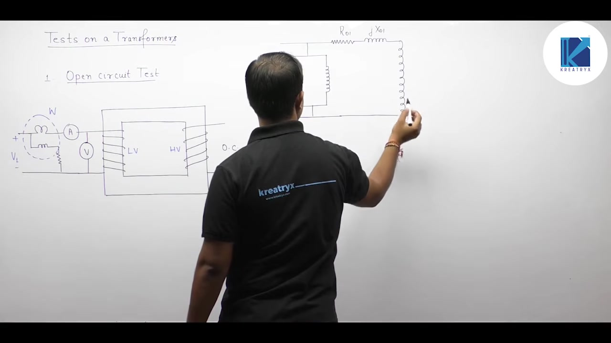

### Instrument Readings in the Approximate Model

The three instrument readings map directly to circuit parameters:
- **Voltmeter Reading ($V_1$)**: Indicates applied rated voltage on the low-voltage side ($V_{\text{rated, LV}}$).
- **Ammeter Reading ($I_0$)**: Measures the total no-load exciting current.
- **Wattmeter Reading ($W_0$)**: Measures the real active power absorbed by the transformer.

In the approximate circuit, current through the series resistance $R_{01}$ is zero. Winding copper loss vanishes:
$$P_{\text{cu}} = (I_1')^2 R_{01} = 0$$

Therefore, all active power registered by the wattmeter represents core loss:
$$W_0 = P_{\text{core}}$$

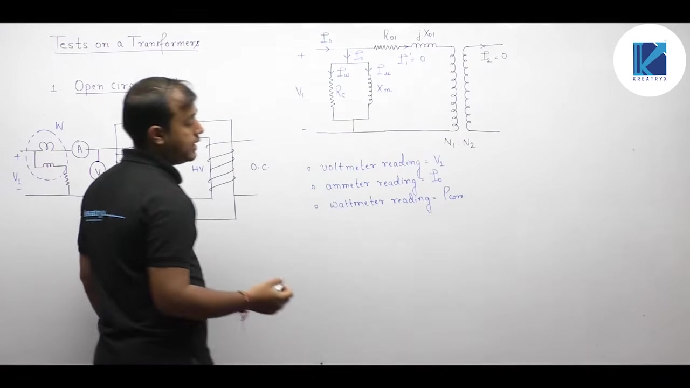

### Exact Circuit Realities: No-Load Copper Loss

In the exact physical transformer, the shunt branch is located between the primary and secondary series impedances. Exciting current $I_0$ flows through the primary winding resistance $R_1$ before reaching the core branch.

The wattmeter physically measures total real power entering the transformer:
$$W_0 = P_{\text{core}} + I_0^2 R_1$$

Here $I_0^2 R_1$ is the primary copper loss at no load.

> [!info] Why No-Load Copper Loss is Neglected
> In power and distribution transformers, the magnetic core has very high permeability and a tiny air gap. The no-load current $I_0$ is only $2\%$ to $6\%$ of full-load rated current:
> $$I_0 \approx 0.02 - 0.06\ I_{\text{rated}}$$
> Because copper loss scales with the square of current:
> $$I_0^2 R_1 \approx (0.05)^2 I_{\text{rated}}^2 R_1 = 0.0025\ P_{\text{cu,fl}}$$
> The no-load copper loss is less than $0.25\%$ of full-load copper loss. It is completely negligible compared to core loss $P_{\text{core}}$.

Therefore, treating the wattmeter reading purely as core loss is an exceptionally accurate engineering approximation. In induction motors, the air gap is larger, making $I_0$ reach $30\%$ to $40\%$ of rated current. In that case, no-load stator copper loss cannot be ignored.

## Extraction of Shunt Branch Parameters from Open-Circuit Test Data
_(12:37 - 18:19)_

### Mathematical Formulation for Shunt Parameters

The open-circuit test provides three scalar instrument readings:
- Input voltage: $V_1$ (voltmeter)
- No-load current: $I_0$ (ammeter)
- Active input power: $W_0$ (wattmeter)

Because the series winding carrying current is neglected, all input power is absorbed by the core loss resistance $R_c$. 

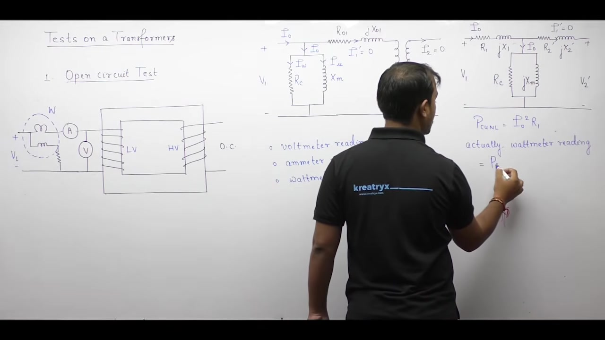

### Core Loss Resistance Determination

Real power in a parallel AC branch is dissipated only in the resistive element:
$$W_0 = \frac{V_1^2}{R_c}$$

Solve directly for the core loss resistance $R_c$:
$$R_c = \frac{V_1^2}{W_0}$$

Because testing is performed on the low-voltage winding, this yields $R_c$ referred to the LV side.

### Current Decomposition and Magnetizing Reactance

The core loss component $I_w$ is the active in-phase current drawn by $R_c$:
$$W_0 = V_1 I_w \implies I_w = \frac{W_0}{V_1}$$

The ammeter directly records the total exciting current magnitude $I_0$. Because the active current $I_w$ and reactive magnetizing current $I_\mu$ are in quadrature:
$$I_0^2 = I_w^2 + I_\mu^2$$

Solve for the magnetizing current component:
$$I_\mu = \sqrt{I_0^2 - I_w^2}$$

The magnetizing reactance $X_m$ is the ratio of applied voltage to magnetizing current:
$$X_m = \frac{V_1}{I_\mu}$$

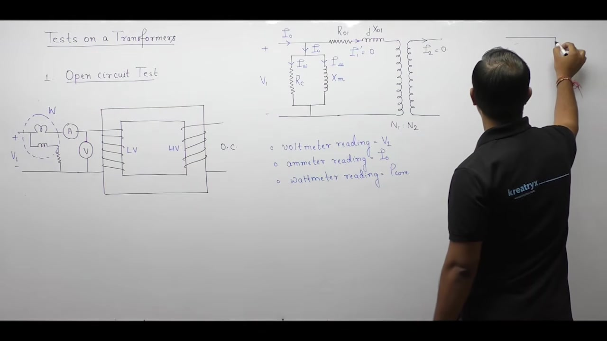

> [!success] Summary of Shunt Parameter Formulas
> From open-circuit test measurements $(V_1, I_0, W_0)$ on the LV winding:
> $$
> \begin{aligned}
> R_c &= \frac{V_1^2}{W_0} \\
> I_w &= \frac{W_0}{V_1} \\
> I_\mu &= \sqrt{I_0^2 - I_w^2} \\
> X_m &= \frac{V_1}{I_\mu}
> \end{aligned}
> $$
> All four quantities are directly referred to the low-voltage winding.

### Consequence of the Approximate Model on Core Loss

In the exact transformer model, the shunt branch is placed across the induced EMF $E_1$. The supply voltage $V_1$ exceeds $E_1$ by the small primary impedance drop $\mathbf{I}_0 (R_1 + j X_1)$.

In the approximate circuit, the shunt branch is connected directly across the supply voltage $V_1$. Because $V_1 > E_1$, the voltage applied across $R_c$ is slightly higher than in the physical transformer. This means the core loss calculated from the approximate model is slightly overestimated. But the difference is typically under $1\%$, making it acceptable for engineering practice.

## No-Load Phasor Diagram, Wattmeter Selection, and Frequency Variations
_(18:19 - 26:42)_

### No-Load Phasor Diagram

The no-load phasor diagram illustrates the phase relationships of core excitation. 

Mutual flux $\Phi_m$ serves as the horizontal reference phasor. The magnetizing current $I_\mu$ establishes this flux. It is drawn in direct phase alignment with $\Phi_m$. 

By Faraday's law of induction, induced voltages $E_1$ and $E_2$ lag the core flux by $90^\circ$. The applied terminal voltage must overcome this counter EMF. Therefore, the phasor $-E_1$ is drawn directly opposite to $E_1$, leading $\Phi_m$ by $90^\circ$. 

The core loss current $I_w$ supplies active power for hysteresis and eddy currents. It aligns in phase with $-E_1$. 

The vector sum of $I_w$ and $I_\mu$ forms the total no-load current $\mathbf{I}_0$:
$$\mathbf{I}_0 = I_w - j I_\mu$$

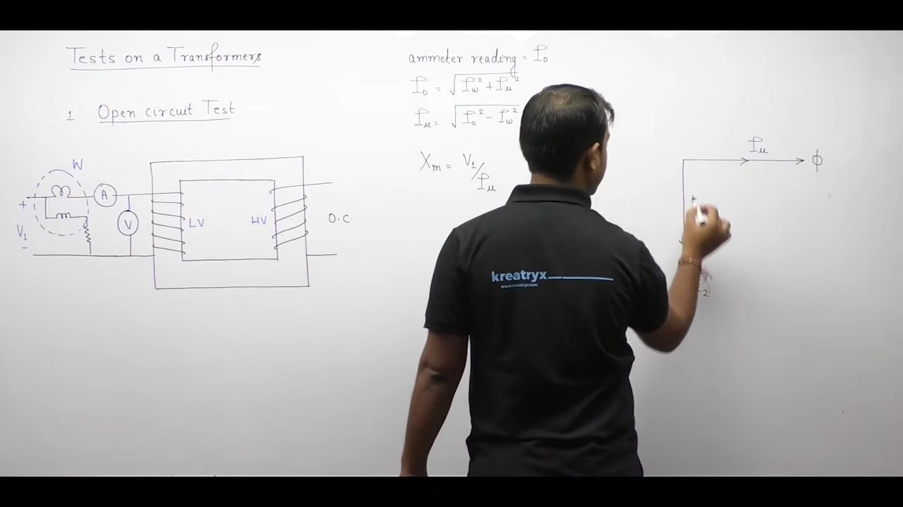

### No-Load Power Factor

The angle $\phi_0$ between applied voltage $-E_1$ and total exciting current $\mathbf{I}_0$ represents the no-load power factor angle:
$$\cos \phi_0 = \frac{I_w}{I_0}$$

In power transformers, magnetizing current $I_\mu$ dominates over active core loss current $I_w$. Typical magnetizing current is three to five times $I_w$. This makes $\phi_0$ quite large, typically between $70^\circ$ and $75^\circ$. 

The resulting no-load power factor is very low:
$$\cos \phi_0 \approx 0.2 \text{ lagging}$$

### Wattmeter Selection: LPF vs UPF

Wattmeters measure active power based on current and voltage interactions. Standard wattmeters are designed for unity power factor (UPF) circuits. At a power factor near $0.2$, the deflecting torque on a UPF wattmeter pointer is tiny. Readings taken on a UPF meter under such conditions suffer from massive measurement errors.

To measure no-load core losses accurately, a Low Power Factor (LPF) wattmeter is mandatory. LPF wattmeters have special design features. They use high deflecting torque at low power factors and compensated pressure coils. 

> [!info] Instrument Selection Rule
> Always select a Low Power Factor (LPF) wattmeter for the open-circuit test. A UPF wattmeter gives poor deflection and high measurement errors.

### Effect of Reduced Frequency at Rated Voltage

Consider an open-circuit test conducted at rated voltage but at reduced supply frequency:
$$V = V_{\text{rated}}, \quad f < f_{\text{rated}}$$

Let us analyze how each instrument reading responds:

#### 1. Core Flux and Saturation
Mutual flux in the core depends on the voltage-to-frequency ratio:
$$\Phi_m \propto \frac{V}{f}$$
When frequency drops while voltage remains constant, the denominator decreases. Therefore, core flux $\Phi_m$ increases. The core is pushed deeper into saturation.

#### 2. Wattmeter Reading (Core Loss)
Core loss consists of hysteresis and eddy current losses. In terms of flux:
$$P_{\text{core}} \propto \Phi_m^2$$
Because flux increases, core loss increases. The wattmeter reading directly indicates core loss:
$$W_0 \uparrow$$

#### 3. Core Loss Current Component
The active current supplies the core loss:
$$I_w = \frac{W_0}{V_1}$$
Because $W_0$ increases while $V_1$ is constant, $I_w$ increases.

#### 4. Ammeter Reading (Exciting Current)
The magnetomotive force relates directly to flux:
$$N_1 I_\mu = \Phi_m \mathcal{R}$$
As flux increases, magnetizing current $I_\mu$ increases rapidly due to core saturation. 

The total exciting current is:
$$I_0 = \sqrt{I_w^2 + I_\mu^2}$$
Since both $I_w$ and $I_\mu$ increase, total current $I_0$ rises. The ammeter reading increases.

#### 5. No-Load Power Factor
Magnetizing current represents reactive power consumption. Core loss current represents real power consumption. Because the core enters saturation, the increase in reactive magnetizing current far exceeds the increase in active current:
$$\Delta I_\mu \gg \Delta I_w$$
Reactive power pulls down the operating power factor. Therefore, the no-load power factor decreases:
$$\cos \phi_0 \downarrow$$

> [!example] Summary of Reduced Frequency Effects ($V = \text{constant}, f \downarrow$)
> $$
> \begin{aligned}
> \Phi_m &\propto \frac{V}{f} \uparrow \\
> \text{Core Loss } P_{\text{core}} &\propto \Phi_m^2 \uparrow \implies \text{Wattmeter reading } W_0 \uparrow \\
> I_\mu &\uparrow \text{ and } I_w \uparrow \implies \text{Ammeter reading } I_0 \uparrow \\
> \text{Power Factor } \cos \phi_0 &\downarrow \\
> \text{Voltmeter reading } V_1 &= \text{Constant}
> \end{aligned}
> $$

## Principles and Experimental Setup of the Short-Circuit Test
_(26:42 - 31:44)_

### Objectives of the Short-Circuit Test

The short-circuit (SC) test serves two primary engineering purposes:
1. It determines the full-load copper loss of both windings combined.
2. It determines the equivalent series branch parameters ($R_{\text{eq}}$ and $X_{\text{eq}}$).

Copper loss represents ohmic dissipation in the winding conductors:
$$P_{\text{cu}} = I^2 R$$
Because copper loss depends on current squared, rated copper loss requires rated current:
$$I = I_{\text{rated}}$$

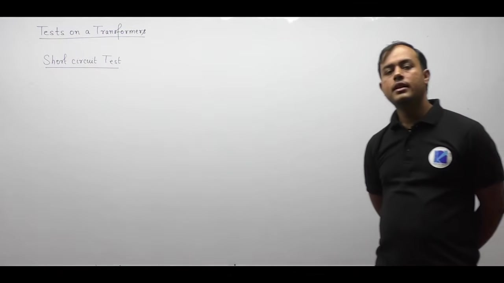

### Selection of Test Winding: HV Side vs LV Side

Transformers maintain constant apparent power across windings:
$$S = V_{\text{HV}} I_{\text{HV}} = V_{\text{LV}} I_{\text{LV}}$$

The high-voltage (HV) side operates at higher voltage and lower current:
$$I_{\text{HV}} < I_{\text{LV}}$$

Conducting the test on the HV side offers several practical advantages:
- Measuring instruments handle much smaller currents.
- Lower currents reduce heating in test leads and meters.
- Standard laboratory ammeters and wattmeters can be used directly.
- Testing is safer and easier to control.

Therefore, instruments are placed on the HV side. The low-voltage (LV) terminals are short-circuited using a thick copper bar of negligible resistance.

### Variable Voltage Supply via Variac

Never apply rated voltage to a short-circuited transformer. Doing so produces destructive fault currents ten to twenty times the rated value. This would destroy the windings instantly.

Instead, the supply voltage is fed through a variable autotransformer (variac). The variac starts at zero volts. The operator slowly increases the applied voltage until the ammeter registers rated HV current:
$$I_{\text{sc}} = I_{\text{HV,rated}}$$

The voltage needed to circulate rated current through the internal winding impedance is very small. Typically, this short-circuit voltage $V_{\text{sc}}$ is only $5\%$ to $10\%$ of rated voltage:
$$V_{\text{sc}} \approx (0.05 \text{ to } 0.10) \, V_{\text{rated}}$$

> [!info] Operational Comparison: OC Test vs SC Test
> - **Open-Circuit Test**: Conducted at rated voltage on the LV side with the HV side open. Yields core loss and shunt parameters.
> - **Short-Circuit Test**: Conducted at rated current on the HV side with the LV side shorted. Yields full-load copper loss and series parameters.

## Equivalent Circuit and Justification for Neglecting the Shunt Branch
_(31:44 - 37:57)_

### Exact Equivalent Circuit Under Short-Circuit Conditions

Consider the transformer equivalent circuit referred to the primary winding. The secondary terminals are short-circuited:
$$V_2 = 0 \implies V_2' = a V_2 = 0$$

Reflecting a short circuit to the primary side retains a short circuit across the output terminals. 

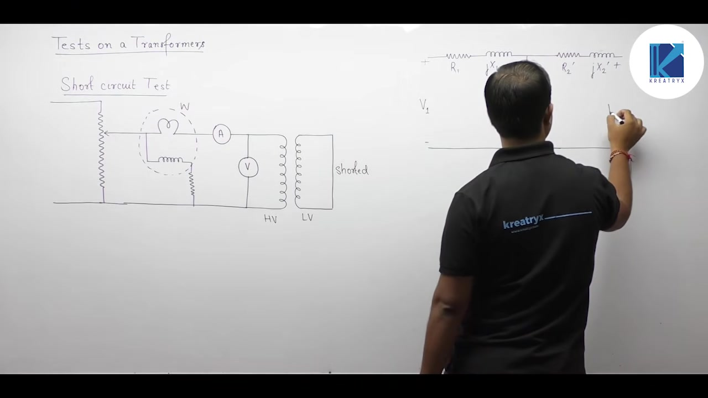

The network consists of:
- Primary series impedance: $R_1 + j X_1$
- Shunt exciting branch: $R_c \parallel j X_m$ carrying exciting current $I_0$
- Referred secondary series impedance: $R_2' + j X_2'$ carrying load current $I_2'$

By Kirchhoff's current law at the primary node:
$$\mathbf{I}_1 = \mathbf{I}_0 + \mathbf{I}_2'$$

### Physical Justification for Neglecting the Shunt Branch

In normal operation at rated voltage, exciting current $I_0$ is only $2\%$ to $6\%$ of rated full-load current. During the short-circuit test, $I_0$ becomes smaller by an order of magnitude.

There are two primary reasons why the shunt exciting branch is completely neglected:

#### 1. Severe Reduction in Operating Core Flux
The applied test voltage $V_{\text{sc}}$ is small:
$$V_{\text{sc}} \approx (0.05 \text{ to } 0.10) \, V_{\text{rated}}$$

Mutual core flux depends directly on the applied voltage-to-frequency ratio:
$$\Phi_m \propto \frac{V_{\text{sc}}}{f}$$
Because $V_{\text{sc}}$ is only $5\%$ to $10\%$ of rated voltage, mutual flux $\Phi_m$ is only $5\%$ to $10\%$ of normal rated flux. The iron core operates deep in its linear unsaturated region.

#### 2. Negligible Core Loss and Exciting Current
Core losses depend quadratically on operating flux:
$$P_{\text{core}} \propto \Phi_m^2 \propto V_{\text{sc}}^2$$

At $5\%$ of rated voltage, the core loss drops to:
$$(0.05)^2 = 0.0025 = 0.25\% \text{ of rated core loss}$$

This power dissipation is completely negligible.

Core loss current drops in direct proportion to core loss:
$$I_w = \frac{P_{\text{core}}}{V_{\text{sc}}} \approx 0$$

Similarly, magnetizing current is proportional to flux:
$$N_1 I_\mu = \Phi_m \mathcal{R} \implies I_\mu \propto \Phi_m \approx 0$$

Total exciting current is the quadrature sum of both components:
$$I_0 = \sqrt{I_w^2 + I_\mu^2} \approx 0$$

Under short-circuit testing, $I_0$ drops below $0.5\%$ of rated winding current. Meanwhile, the winding carries full rated current ($100\%$):
$$I_0 \ll I_1 \approx I_2'$$

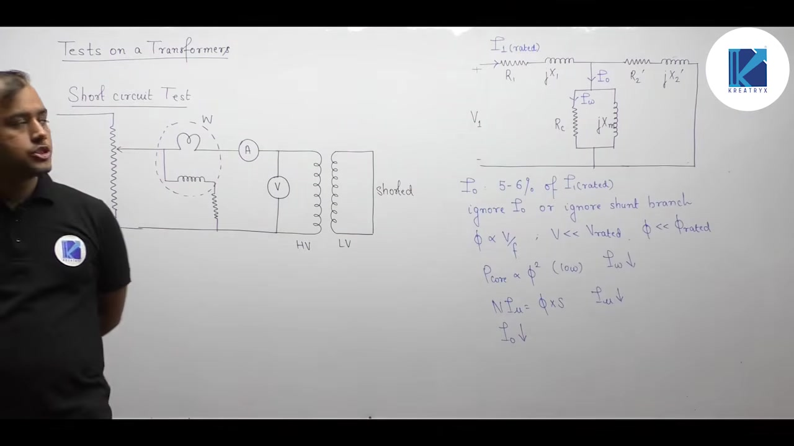

### Reduced Series Equivalent Circuit

Because exciting current $I_0$ is negligible, the shunt branch is open-circuited. The entire input current flows straight through the series winding resistances and leakage reactances.

The equivalent circuit simplifies to a single series loop:
$$Z_{01} = R_{01} + j X_{01}$$

Where:
$$
\begin{aligned}
R_{01} &= R_1 + R_2' \\
X_{01} &= X_1 + X_2'
\end{aligned}
$$

> [!info] Comparison of Circuit Approximations
> - **Open-Circuit Test**: The series winding branch is neglected. Only the shunt exciting branch ($R_c, X_m$) is considered.
> - **Short-Circuit Test**: The shunt exciting branch is neglected. Only the equivalent series branch ($R_{01}, X_{01}$) is considered.

## Extraction of Series Branch Parameters and Short-Circuit Power Factor
_(38:00 - 43:13)_

### Instrument Readings on the Reduced Model

With the shunt branch omitted, the transformer behaves as a simple series impedance. The three meters connected on the high-voltage winding record:
- Applied voltage: $V_{\text{sc}}$ (voltmeter)
- Circulating current: $I_{\text{sc}}$ (ammeter, adjusted to rated current $I_{1,\text{rated}}$)
- Active power absorbed: $W_{\text{sc}}$ (wattmeter)

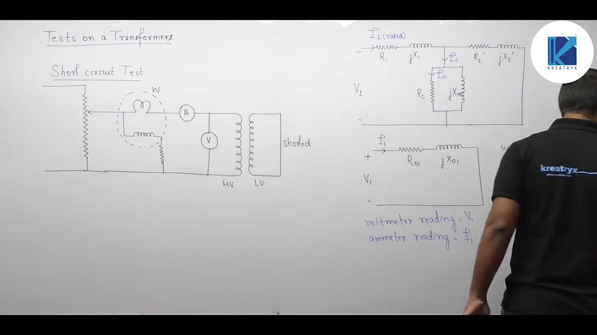

Because leakage reactance absorbs only reactive power, all active power converts into heat within the winding resistance:
$$W_{\text{sc}} = I_{\text{sc}}^2 R_{01}$$

When testing at rated current, this reading equals the full-load copper loss:
$$P_{\text{cu,fl}} = W_{\text{sc}}$$

### Per-Unit Proof of Low Applied Voltage

We can formally explain why the required test voltage is so small.

By Ohm's law, the applied short-circuit voltage equals the impedance drop:
$$V_{\text{sc}} = I_{\text{sc}} Z_{01}$$

Convert this expression into the per-unit system:
$$V_{\text{sc,pu}} = I_{\text{sc,pu}} \times Z_{01,\text{pu}}$$

The ammeter is set to rated current, so:
$$I_{\text{sc,pu}} = 1.0 \text{ pu}$$

The internal impedance of a well-designed power transformer is small, typically $0.05$ to $0.10\text{ pu}$. Substituting these values:
$$V_{\text{sc,pu}} = 1.0 \times (0.05 \text{ to } 0.10) = 0.05 \text{ to } 0.10 \text{ pu}$$

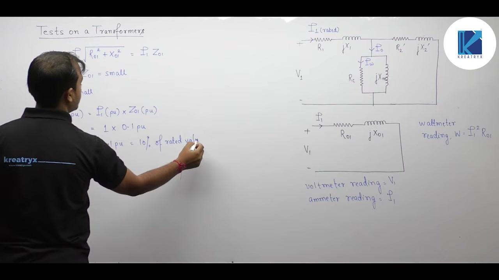

In percentage terms, the required applied voltage is only $5\%$ to $10\%$ of rated voltage.

### Derivation of Series Parameters

From the three scalar test measurements, we extract all series parameters directly:

#### 1. Equivalent Series Impedance
The ratio of applied voltage to test current gives the total series impedance:
$$Z_{01} = \frac{V_{\text{sc}}}{I_{\text{sc}}}$$

#### 2. Equivalent Series Resistance
The wattmeter reading gives the total ohmic resistance referred to the HV side:
$$R_{01} = \frac{W_{\text{sc}}}{I_{\text{sc}}^2}$$

#### 3. Equivalent Series Leakage Reactance
Using the impedance triangle relationship:
$$X_{01} = \sqrt{Z_{01}^2 - R_{01}^2}$$

#### 4. Short-Circuit Operating Power Factor
For a series $R$-$L$ circuit, the operating power factor is:
$$\cos \theta_{\text{sc}} = \frac{R_{01}}{Z_{01}} = \frac{W_{\text{sc}}}{V_{\text{sc}} I_{\text{sc}}}$$

Because leakage reactance is several times larger than winding resistance, this power factor is typically lagging and low ($0.15$ to $0.35$).

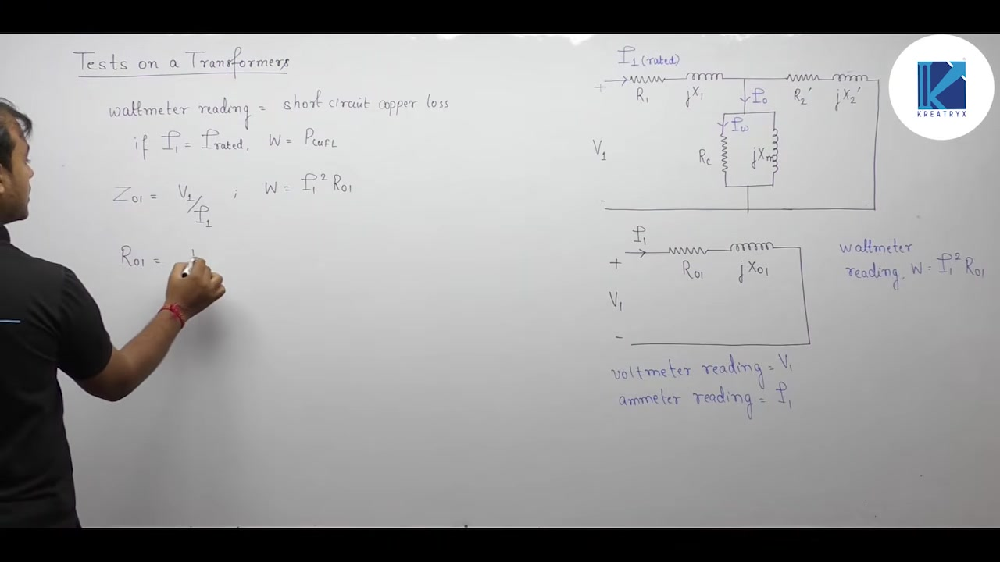

> [!success] Series Parameter Formulas
> When instruments are connected to the HV winding:
> $$
> \begin{aligned}
> Z_{01} &= \frac{V_{\text{sc}}}{I_{\text{sc}}} \\
> R_{01} &= \frac{W_{\text{sc}}}{I_{\text{sc}}^2} \\
> X_{01} &= \sqrt{Z_{01}^2 - R_{01}^2} \\
> \cos \theta_{\text{sc}} &= \frac{R_{01}}{Z_{01}}
> \end{aligned}
> $$
> All values are referred to the high-voltage side.

### Individual Winding Parameter Separation

The short-circuit test yields only lumped equivalent values ($R_{01}$ and $X_{01}$). It cannot distinguish primary from secondary leakage parameters directly.

If separate DC resistance measurements are not available, standard engineering practice splits the parameters equally:
$$
\begin{aligned}
R_1 &\approx R_2' \approx \frac{R_{01}}{2} \\
X_1 &\approx X_2' \approx \frac{X_{01}}{2}
\end{aligned}
$$

This equal division provides a close approximation for practical analysis.

## Short-Circuit Testing at Non-Rated Current and Scaling Laws
_(43:16 - 47:57)_

### Short-Circuit Test at Non-Rated Current

In laboratory experiments or field tests, circulating full rated current is not always feasible. The applied voltage might be adjusted to circulate a lower current $I_{\text{sc}}$:
$$I_{\text{sc}} \ne I_{\text{rated}}$$

Under this condition, the wattmeter records ohmic dissipation at the test current:
$$W_{\text{sc}} = P_{\text{cu,sc}} = I_{\text{sc}}^2 R_{01}$$

This reading does not equal full-load copper loss. It represents only the partial copper loss corresponding to $I_{\text{sc}}$.

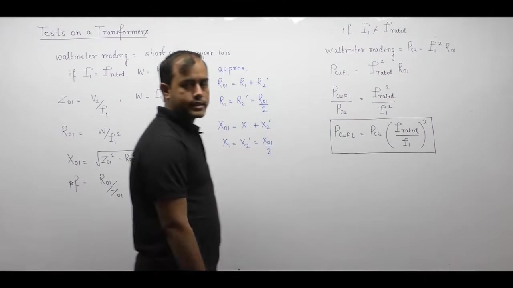

### Scaling Law for Full-Load Copper Loss

Copper loss in any linear winding varies with the square of the current:
$$P_{\text{cu}} \propto I^2$$

Full-load copper loss occurs when rated current flows through the windings:
$$P_{\text{cu,fl}} = I_{\text{rated}}^2 R_{01}$$

Take the ratio of full-load loss to measured test loss:
$$\frac{P_{\text{cu,fl}}}{P_{\text{cu,sc}}} = \frac{I_{\text{rated}}^2 R_{01}}{I_{\text{sc}}^2 R_{01}} = \left(\frac{I_{\text{rated}}}{I_{\text{sc}}}\right)^2$$

Solve for the full-load copper loss:
$$P_{\text{cu,fl}} = P_{\text{cu,sc}} \left(\frac{I_{\text{rated}}}{I_{\text{sc}}}\right)^2$$

If the test is conducted at half rated current ($I_{\text{sc}} = 0.5 I_{\text{rated}}$), the wattmeter reading is only one-fourth of full-load copper loss.

### Invariance of Series Parameters

Winding resistance and leakage reactance are physical properties of the transformer construction.

Conductor resistance depends on geometry and material resistivity. It does not depend on current magnitude.

Leakage reactance depends on leakage flux paths. Because leakage flux travels mostly through air and insulation, the leakage path does not saturate. Leakage inductance remains strictly linear with current.

Therefore, the equivalent series parameters remain constant regardless of the test current:
$$
\begin{aligned}
Z_{01} &= \frac{V_{\text{sc}}}{I_{\text{sc}}} \\
R_{01} &= \frac{W_{\text{sc}}}{I_{\text{sc}}^2} \\
X_{01} &= \sqrt{Z_{01}^2 - R_{01}^2}
\end{aligned}
$$

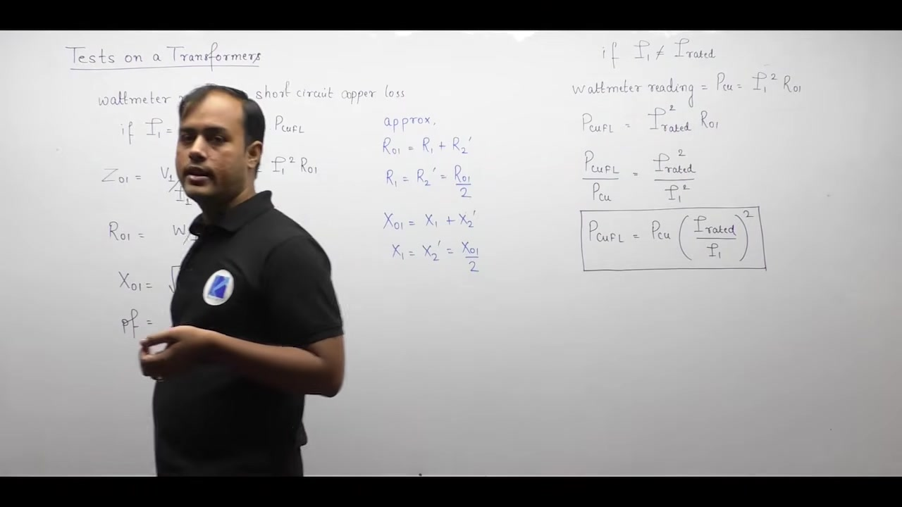

> [!success] Rule for Non-Rated Test Data
> - **Series Parameters ($R_{01}, X_{01}, Z_{01}$)**: Calculate directly from measured test values $(V_{\text{sc}}, I_{\text{sc}}, W_{\text{sc}})$. No scaling or conversion is needed.
> - **Copper Loss ($P_{\text{cu,fl}}$)**: Must be scaled to rated current using the square of the current ratio.

## Frequency Variation at Rated Current and Equivalent Circuit Parameters
_(47:57 - 52:45)_

### Effect of Reduced Frequency at Rated Current

Consider a short-circuit test conducted at rated current but at reduced supply frequency:
$$I = I_{\text{rated}}, \quad f < f_{\text{rated}}$$

Let us trace the effect on each instrument reading:

#### 1. Ammeter Reading
The operator adjusts the input voltage to maintain rated current. Therefore, the circulating current remains constant:
$$I_1 = \text{Constant}$$

#### 2. Winding Resistance and Wattmeter Reading
Winding resistance $R_{01}$ depends primarily on temperature and copper resistivity. At power frequencies, skin effect changes are negligible. Therefore, resistance is independent of frequency.

The wattmeter records series copper loss:
$$W_{\text{sc}} = I_1^2 R_{01}$$
Because both $I_1$ and $R_{01}$ are constant, the wattmeter reading remains unchanged:
$$W_{\text{sc}} = \text{Constant}$$

#### 3. Leakage Reactance
Leakage reactance is directly proportional to electrical frequency:
$$X_{01} = 2\pi f L_{01} \implies X_{01} \propto f$$
Because frequency is reduced, leakage reactance decreases:
$$X_{01} \downarrow$$

#### 4. Total Series Impedance
Total impedance is the vector sum of resistance and reactance:
$$Z_{01} = \sqrt{R_{01}^2 + X_{01}^2}$$
Since reactance decreases while resistance stays constant, total impedance decreases:
$$Z_{01} \downarrow$$

#### 5. Voltmeter Reading
The required applied voltage equals the total impedance drop:
$$V_{\text{sc}} = I_1 Z_{01}$$
Because impedance drops while current is constant, a smaller voltage circulates rated current:
$$V_{\text{sc}} \downarrow$$

#### 6. Short-Circuit Operating Power Factor
The operating power factor of the series circuit is:
$$\cos \theta_{\text{sc}} = \frac{R_{01}}{Z_{01}}$$
Because denominator $Z_{01}$ decreases while numerator $R_{01}$ is constant, the power factor increases:
$$\cos \theta_{\text{sc}} \uparrow$$

> [!example] Summary of Short-Circuit Frequency Reduction ($I = \text{constant}, f \downarrow$)
> $$
> \begin{aligned}
> I_{\text{sc}} &= \text{Constant (Ammeter reading unchanged)} \\
> W_{\text{sc}} &= I_{\text{sc}}^2 R_{01} = \text{Constant (Wattmeter reading unchanged)} \\
> X_{01} &\propto f \downarrow \\
> Z_{01} &= \sqrt{R_{01}^2 + X_{01}^2} \downarrow \\
> V_{\text{sc}} &= I_{\text{sc}} Z_{01} \downarrow \text{ (Voltmeter reading decreases)} \\
> \cos \theta_{\text{sc}} &= \frac{R_{01}}{Z_{01}} \uparrow \text{ (Power factor improves)}
> \end{aligned}
> $$

---

### Worked Example: Complete Parameter Extraction

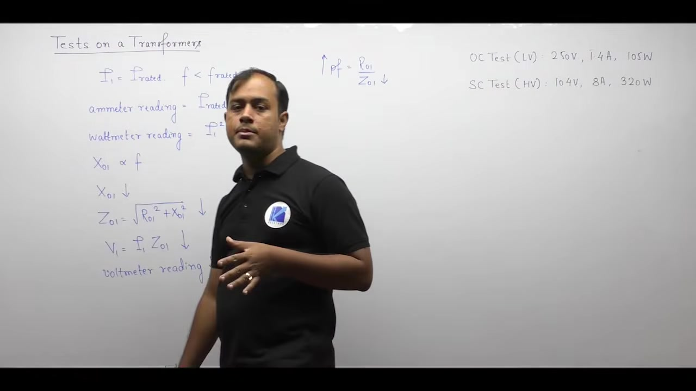

> [!example] Problem
> A $20\text{ kVA}$, $2500/250\text{ V}$, $50\text{ Hz}$ single-phase transformer yields the following test data:
> - **Open-circuit test (LV side)**: $250\text{ V}, 1.4\text{ A}, 105\text{ W}$
> - **Short-circuit test (HV side)**: $104\text{ V}, 8\text{ A}, 320\text{ W}$
> 
> Determine the parameters of the approximate equivalent circuit referred to the low-voltage side.

#### Solution

First, determine the transformation ratio:
$$a = \frac{V_{\text{HV}}}{V_{\text{LV}}} = \frac{2500}{250} = 10$$

Check the rated HV current:
$$I_{\text{HV,rated}} = \frac{20 \times 10^3}{2500} = 8\text{ A}$$
The short-circuit test was conducted at exact rated current.

#### 1. Shunt Branch Parameters (from LV Open-Circuit Test)
The open-circuit instruments are on the LV side. The readings directly yield shunt parameters referred to the LV winding:
$$V_0 = 250\text{ V}, \quad I_0 = 1.4\text{ A}, \quad W_0 = 105\text{ W}$$

Calculate core loss resistance $R_c$:
$$R_c = \frac{V_0^2}{W_0} = \frac{250^2}{105} = \frac{62500}{105} \approx 595.24\ \Omega$$

Calculate active core loss current $I_w$:
$$I_w = \frac{W_0}{V_0} = \frac{105}{250} = 0.42\text{ A}$$

Calculate reactive magnetizing current $I_\mu$:
$$I_\mu = \sqrt{I_0^2 - I_w^2} = \sqrt{1.4^2 - 0.42^2} = \sqrt{1.96 - 0.1764} = \sqrt{1.7836} \approx 1.3355\text{ A}$$

Calculate magnetizing reactance $X_m$:
$$X_m = \frac{V_0}{I_\mu} = \frac{250}{1.3355} \approx 187.20\ \Omega$$

#### 2. Series Branch Parameters (from HV Short-Circuit Test)
The short-circuit instruments are on the HV side:
$$V_{\text{sc}} = 104\text{ V}, \quad I_{\text{sc}} = 8\text{ A}, \quad W_{\text{sc}} = 320\text{ W}$$

Calculate total series impedance referred to HV (side 1):
$$Z_{01} = \frac{V_{\text{sc}}}{I_{\text{sc}}} = \frac{104}{8} = 13\ \Omega$$

Calculate total series resistance referred to HV:
$$R_{01} = \frac{W_{\text{sc}}}{I_{\text{sc}}^2} = \frac{320}{8^2} = \frac{320}{64} = 5\ \Omega$$

Calculate total leakage reactance referred to HV:
$$X_{01} = \sqrt{Z_{01}^2 - R_{01}^2} = \sqrt{13^2 - 5^2} = \sqrt{169 - 25} = \sqrt{144} = 12\ \Omega$$

#### 3. Referring Series Parameters to the Low-Voltage Side
The question requires all parameters referred to the LV side (side 2). 

Impedance transfers from HV to LV by dividing by $a^2$:
$$
\begin{aligned}
R_{02} &= \frac{R_{01}}{a^2} = \frac{5}{10^2} = 0.05\ \Omega \\
X_{02} &= \frac{X_{01}}{a^2} = \frac{12}{10^2} = 0.12\ \Omega \\
Z_{02} &= \frac{Z_{01}}{a^2} = \frac{13}{10^2} = 0.13\ \Omega
\end{aligned}
$$

> [!success] Final Equivalent Circuit Parameters (Referred to LV Side)
> - **Core loss resistance**: $R_c = 595.24\ \Omega$
> - **Magnetizing reactance**: $X_m = 187.20\ \Omega$
> - **Equivalent series resistance**: $R_{02} = 0.05\ \Omega$
> - **Equivalent leakage reactance**: $X_{02} = 0.12\ \Omega$

---

## Summary and Key Takeaways

- The open-circuit test is conducted on the low-voltage side with rated voltage applied while the high-voltage winding remains open.
- The open-circuit wattmeter measures rated core loss $P_{\text{core}}$, yielding core loss resistance $R_c = V_1^2 / W_0$ and magnetizing reactance $X_m = V_1 / I_\mu$.
- Because the no-load power factor is very low ($\cos\phi_0 \approx 0.2\text{ lagging}$), accurate core loss measurement requires a Low Power Factor (LPF) wattmeter.
- If an open-circuit test operates at reduced frequency with rated voltage, mutual flux increases as $\Phi_m \propto V/f$, causing core loss, exciting current, and ammeter readings to rise while power factor drops.
- The short-circuit test is conducted on the high-voltage winding with the low-voltage winding dead shorted by applying a small variable voltage ($V_{\text{sc}} \approx 5\% - 10\% V_{\text{rated}}$).
- The shunt exciting branch is neglected during the short-circuit test because the tiny applied voltage produces negligible core flux and exciting current ($I_0 \ll I_1$).
- Short-circuit test readings yield equivalent series impedance $Z_{01} = V_{\text{sc}} / I_{\text{sc}}$, equivalent resistance $R_{01} = W_{\text{sc}} / I_{\text{sc}}^2$, and equivalent leakage reactance $X_{01} = \sqrt{Z_{01}^2 - R_{01}^2}$.
- If the short-circuit test is run at a non-rated current $I_{\text{sc}}$, series parameters $R_{01}$ and $X_{01}$ remain unchanged, but full-load copper loss must be scaled by $P_{\text{cu,fl}} = P_{\text{cu,sc}} (I_{\text{rated}} / I_{\text{sc}})^2$.
- In the short-circuit test at rated current, reducing frequency lowers leakage reactance $X_{01}$ and applied voltage $V_{\text{sc}}$ while improving the short-circuit power factor.

---

[← Lec 020: Problems based on Equivalent Circuit](Lecture_020_Problems_based_on_Equivalent_Circuit.md) | [🏠 Index](00_yt_study_guide.md) | [Lec 022: Testing of Transformer Part 2 →](Lecture_022_Testing_of_Transformer_Part_2.md)
