# Electrical Machines | Lec 16 | Testing of Transformer (Part 2) | GATE Electrical Engineering

- **Source**: https://www.youtube.com/watch?v=rW6b0dr-F3Y
- **Duration**: 00:48:37
- **Compiled**: 2026-09-19

---

## Overview

This lecture completes the study of experimental testing on power and distribution transformers. It begins by extracting equivalent circuit parameters and constructing the approximate model from laboratory test data. The lecture then establishes the polarity test to identify relative winding potentials and prevent destructive circulating currents during parallel operation. Finally, it presents Sumpner's back-to-back test, analyzing how phantom loading achieves full-load thermal steady-state while drawing only internal losses from the supply.

## Contents

- [[#Parameter Determination and Approximate Equivalent Circuit from Test Data|Parameter Determination and Approximate Equivalent Circuit from Test Data]]
- [[#Principles of the Polarity Test and Circulating Currents in Parallel Operation|Principles of the Polarity Test and Circulating Currents in Parallel Operation]]
- [[#Experimental Connection and Interpretation of the Polarity Test|Experimental Connection and Interpretation of the Polarity Test]]
- [[#Limitations of Open/Short-Circuit Tests and the Foundation of Sumpner's Test|Limitations of Open/Short-Circuit Tests and the Foundation of Sumpner's Test]]
- [[#Circuit Architecture and Series Opposition Verification in Sumpner's Test|Circuit Architecture and Series Opposition Verification in Sumpner's Test]]
- [[#Secondary Injection, Circulating Reflected Currents, and Phantom Loading|Secondary Injection, Circulating Reflected Currents, and Phantom Loading]]
- [[#Temperature Rise Estimation, Primary Current Asymmetry, and Efficiency Calculation|Temperature Rise Estimation, Primary Current Asymmetry, and Efficiency Calculation]]

---

## Parameter Determination and Approximate Equivalent Circuit from Test Data
_(00:13 - 07:54)_

### Review of Standard Transformer Tests

Experimental testing determines the internal circuit parameters of a physical transformer. 

The open-circuit (OC) test operates at rated voltage and frequency on the low-voltage side. It provides core loss and determines the shunt branch parameters ($R_c$ and $X_m$). 

The short-circuit (SC) test operates at rated current on the high-voltage side. It provides full-load copper loss and determines the series branch parameters ($R_{\text{eq}}$ and $X_{\text{eq}}$).

---

### Worked Example: Complete Equivalent Circuit Modeling

> [!example] Problem
> A $20\text{ kVA}$, $2500/250\text{ V}$, $50\text{ Hz}$ single-phase transformer gave the following test results:
> - **Open-circuit test (LV side)**: $250\text{ V}, 1.4\text{ A}, 105\text{ W}$
> - **Short-circuit test (HV side)**: $104\text{ V}, 8\text{ A}, 320\text{ W}$
> 
> Calculate all parameters of the approximate equivalent circuit referred to the low-voltage side.

#### Solution

Calculate the voltage transformation ratio:
$$a = \frac{V_{\text{HV}}}{V_{\text{LV}}} = \frac{2500}{250} = 10$$

Check the rated high-voltage current:
$$I_{\text{HV,rated}} = \frac{20 \times 10^3}{2500} = 8\text{ A}$$
The short-circuit test was conducted at exact rated current.

#### 1. Shunt Branch Parameters (LV Side)
The open-circuit test was conducted on the LV winding. Its readings directly yield shunt parameters referred to the LV side:
$$V_0 = 250\text{ V}, \quad I_0 = 1.4\text{ A}, \quad W_0 = 105\text{ W}$$

Core loss resistance absorbs all active power:
$$W_0 = \frac{V_0^2}{R_c} \implies R_c = \frac{250^2}{105} \approx 595.24\ \Omega$$

Calculate the core loss current component:
$$I_w = \frac{W_0}{V_0} = \frac{105}{250} = 0.42\text{ A}$$

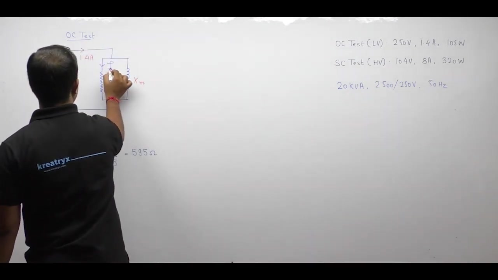

Calculate the reactive magnetizing current:
$$I_\mu = \sqrt{I_0^2 - I_w^2} = \sqrt{1.4^2 - 0.42^2} \approx 1.336\text{ A}$$

Calculate the magnetizing reactance:
$$X_m = \frac{V_0}{I_\mu} = \frac{250}{1.336} \approx 187.13\ \Omega$$

#### 2. Series Branch Parameters (HV Side)
The short-circuit test was conducted on the HV winding:
$$V_{\text{sc}} = 104\text{ V}, \quad I_{\text{sc}} = 8\text{ A}, \quad W_{\text{sc}} = 320\text{ W}$$

Calculate total series resistance referred to the HV winding:
$$R_{01} = \frac{W_{\text{sc}}}{I_{\text{sc}}^2} = \frac{320}{8^2} = 5\ \Omega$$

Calculate total series impedance referred to HV:
$$Z_{01} = \frac{V_{\text{sc}}}{I_{\text{sc}}} = \frac{104}{8} = 13\ \Omega$$

Calculate total series leakage reactance referred to HV:
$$X_{01} = \sqrt{Z_{01}^2 - R_{01}^2} = \sqrt{13^2 - 5^2} = 12\ \Omega$$

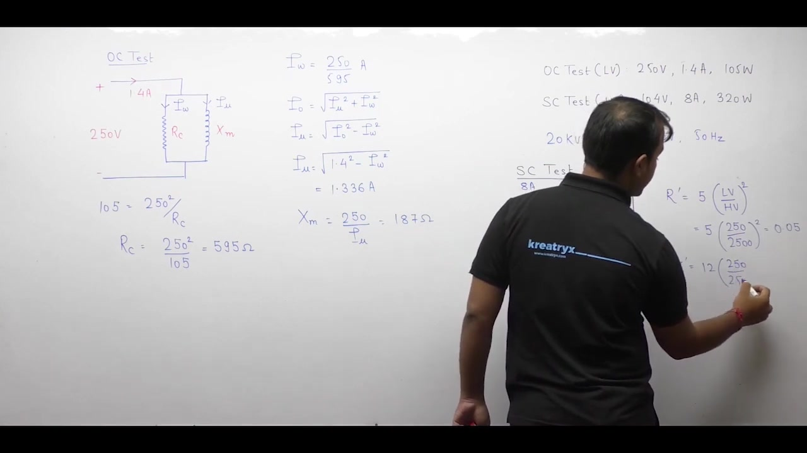

#### 3. Referring Series Parameters to the Low-Voltage Side
Transfer the HV series parameters to the LV side by dividing by $a^2 = 10^2 = 100$:
$$
\begin{aligned}
R_{02} &= \frac{R_{01}}{a^2} = \frac{5}{100} = 0.05\ \Omega \\
X_{02} &= \frac{X_{01}}{a^2} = \frac{12}{100} = 0.12\ \Omega \\
Z_{02} &= \frac{Z_{01}}{a^2} = \frac{13}{100} = 0.13\ \Omega
\end{aligned}
$$

> [!success] Approximate Equivalent Circuit Parameters (Referred to LV Side)
> - **Core loss resistance**: $R_c = 595.24\ \Omega$
> - **Magnetizing reactance**: $X_m = 187.13\ \Omega$
> - **Equivalent series resistance**: $R_{02} = 0.05\ \Omega$
> - **Equivalent series reactance**: $X_{02} = 0.12\ \Omega$

### Direct Transfer of Raw Test Data

Instead of referring computed circuit parameters, we can refer the raw test data across windings. 

Transformers transform voltages and currents according to their turns ratio. But power remains conserved across windings.

To refer short-circuit test data from HV to LV:
$$
\begin{aligned}
V_{\text{sc,LV}} &= V_{\text{sc,HV}} \left(\frac{N_{\text{LV}}}{N_{\text{HV}}}\right) = 104 \times \frac{250}{2500} = 10.4\text{ V} \\
I_{\text{sc,LV}} &= I_{\text{sc,HV}} \left(\frac{N_{\text{HV}}}{N_{\text{LV}}}\right) = 8 \times \frac{2500}{250} = 80\text{ A} \\
W_{\text{sc,LV}} &= W_{\text{sc,HV}} = 320\text{ W}
\end{aligned}
$$

We can calculate series parameters directly from these referred measurements:
$$
\begin{aligned}
R_{02} &= \frac{W_{\text{sc,LV}}}{I_{\text{sc,LV}}^2} = \frac{320}{80^2} = 0.05\ \Omega \\
Z_{02} &= \frac{V_{\text{sc,LV}}}{I_{\text{sc,LV}}} = \frac{10.4}{80} = 0.13\ \Omega \\
X_{02} &= \sqrt{0.13^2 - 0.05^2} = 0.12\ \Omega
\end{aligned}
$$
Both methods produce identical equivalent circuit values.

## Principles of the Polarity Test and Circulating Currents in Parallel Operation
_(07:59 - 17:45)_

### Purpose of the Polarity Test

The polarity test determines the relative instantaneous polarity of transformer windings. 

Given an assumed polarity on the primary winding, this test identifies which secondary terminal is positive and which is negative. Once relative polarities are known, dots are placed at terminals having the same instantaneous polarity.

Dot convention is difficult to establish by physical inspection alone. Winding directions inside sealed transformer tanks remain invisible. The polarity test serves as the practical laboratory method to locate dot markings.

> [!info] Definition of Polarity and Dot Placement
> The polarity test identifies secondary winding terminals that share the same instantaneous potential as given primary terminals. Dots are placed at terminals of identical polarity.

---

### Need for Polarity Testing: Parallel Operation

Transformers often operate in parallel to share system load demand. Parallel operation requires connecting primary windings together and secondary windings together.

The fundamental rule of parallel connection requires connecting terminals of like polarity together. Positive must connect to positive. Negative must connect to negative.

Connecting reversed polarities creates severe circulating currents. These currents flow between windings without delivering power to any external load.

---

### Network Analysis of Circulating Currents

Consider two identical DC or AC voltage sources connected in parallel. Each source has an internal EMF of $10\text{ V}$ and internal resistance of $1\ \Omega$.

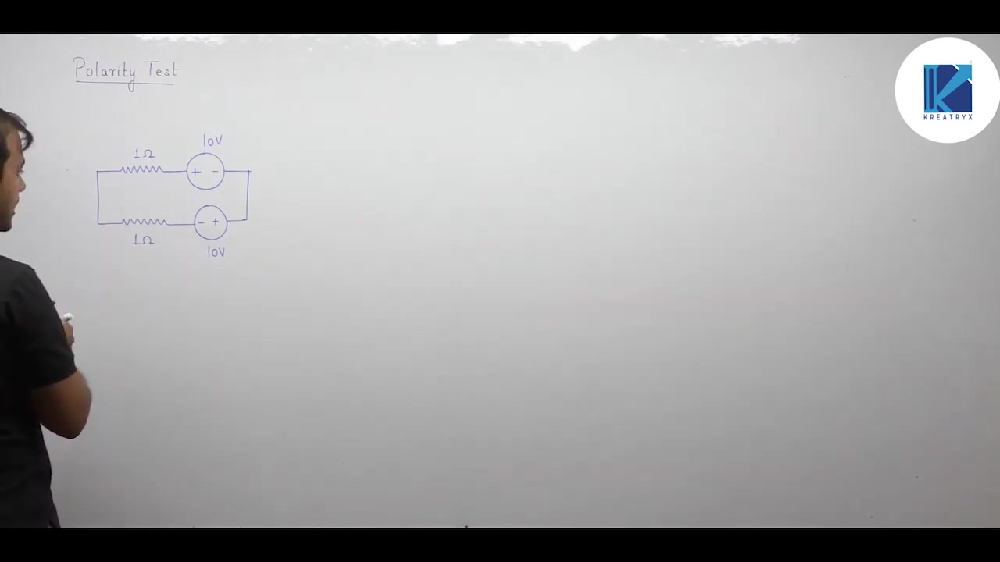

#### Case 1: Reversed Polarity (Incorrect Connection)
Connect the positive terminal of the first source to the negative terminal of the second source. 

Apply Kirchhoff's voltage law around the closed loop:
$$10 - I(1) - I(1) + 10 = 0$$

Solve for the circulating current:
$$20 - 2I = 0 \implies I_{\text{circ}} = 10\text{ A}$$

This circulating current flows purely inside the internal loop. Total power dissipated as heat in internal resistances is:
$$P_{\text{loss}} = I_{\text{circ}}^2 (R_1 + R_2) = 10^2 \times 2 = 200\text{ W}$$

Both sources deliver high power that simply burns away as heat. No power reaches any useful load.

#### Case 2: Matched Polarity (Correct Connection)
Now connect positive to positive and negative to negative.

Apply Kirchhoff's voltage law around the closed loop:
$$10 - I(1) - I(1) - 10 = 0$$

Solve for the loop current:
$$-2I = 0 \implies I_{\text{circ}} = 0\text{ A}$$

No circulating current exists. The sources idle with zero internal dissipation until an external load is connected.

---

### Application to Parallel Transformers

The same principle governs AC transformers. 

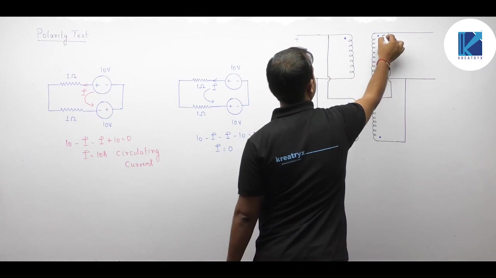

Suppose two transformers are connected with reversed secondary polarities. Induced secondary voltages do not oppose around the parallel loop. Instead, their instantaneous values add:
$$V_{\text{loop}} = E_{2A} + E_{2B} \approx 2 E_2$$

Because winding internal impedances are tiny, a catastrophic circulating current flows:
$$I_{\text{circ}} = \frac{2 E_2}{Z_{02A} + Z_{02B}}$$

This heavy circulating current trips protection breakers or destroys the windings through extreme overheating.

> [!success] Rule for Parallel Connection
> Always conduct a polarity test before connecting transformers in parallel. Terminals of identical instantaneous polarity must be tied together to eliminate circulating currents.

## Experimental Connection and Interpretation of the Polarity Test
_(17:46 - 23:11)_

### Physical Test Configuration

The polarity test uses a simple circuit arrangement. 

One terminal of the primary winding connects directly to an adjacent terminal of the secondary winding. Typically, the two top terminals are jumpered together. 

A voltmeter connects across the remaining two open bottom terminals. An AC voltage $V_1$ excites the primary winding.

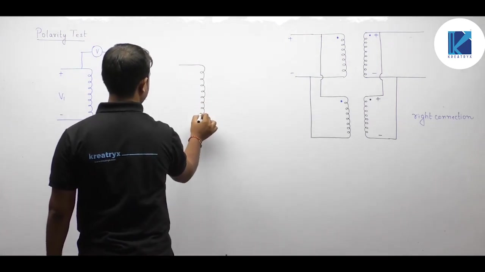

### Loop Analysis and Interpretation of Meter Readings

Let $V_1$ be the primary applied voltage and $V_2$ be the induced secondary voltage. The voltmeter reading $V$ depends on the relative winding polarities.

Apply Kirchhoff's voltage law around the closed loop:

#### 1. Subtractive Polarity (Same Relative Polarity)
Suppose the jumper ties terminals of identical instantaneous polarity together (positive to positive). 

Trace around the loop:
$$V_1 - V - V_2 = 0$$

Solve for the voltmeter reading:
$$V = V_1 - V_2$$

Because the two voltages oppose each other, the meter registers their difference. The reading is strictly less than the primary supply voltage $V_1$. This condition indicates subtractive polarity.

#### 2. Additive Polarity (Opposite Relative Polarity)
Now suppose the jumper connects terminals of opposite instantaneous polarity (positive to negative). 

Trace around the loop:
$$V_1 - V + V_2 = 0$$

Solve for the voltmeter reading:
$$V = V_1 + V_2$$

The two induced voltages assist each other. The meter registers their algebraic sum. The reading is strictly greater than the primary supply voltage $V_1$. This condition indicates additive polarity.

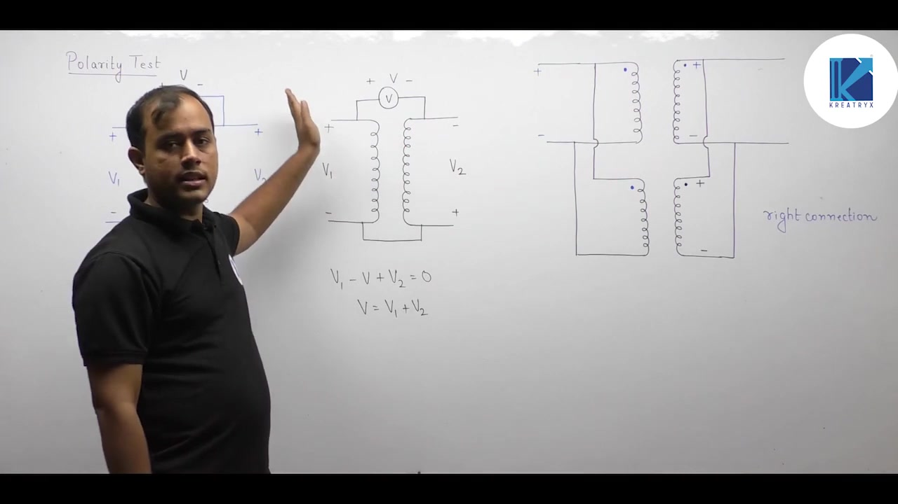

### Rules for Dot Placement

The voltmeter reading directly dictates where to mark dots:

- **If the reading is low ($V = V_1 - V_2$)**: The tied terminals have the same instantaneous polarity. Place dots on the same relative ends of both windings (both top terminals).
- **If the reading is high ($V = V_1 + V_2$)**: The tied terminals have opposite instantaneous polarity. Place the primary dot on the top terminal and the secondary dot on the bottom terminal.

> [!success] Summary of Polarity Test Results
> $$
> \begin{aligned}
> \text{Subtractive Polarity}: V &= V_1 - V_2 < V_1 \implies \text{Like terminals connected (Dots on same side)} \\
> \text{Additive Polarity}: V &= V_1 + V_2 > V_1 \implies \text{Unlike terminals connected (Dots on opposite sides)}
> \end{aligned}
> $$

### Practical Significance in Power Engineering

Commercial transformers standardize on subtractive polarity for ratings above $200\text{ kVA}$. 

Subtractive polarity keeps the voltage stress between adjacent leads low ($V_1 - V_2$). Additive polarity produces higher voltage differences ($V_1 + V_2$) between adjacent physical bushings. This would demand thicker insulation and larger clearance distances.

## Limitations of Open/Short-Circuit Tests and the Foundation of Sumpner's Test
_(23:11 - 29:26)_

### Thermal Limitations of Standard Tests

The open-circuit and short-circuit tests isolate transformer losses separately:
- The open-circuit test operates at rated voltage and negligible current ($I_0 \ll I_{\text{fl}}$). It produces rated core loss, but winding copper loss is nearly zero.
- The short-circuit test operates at rated current and tiny voltage ($V_{\text{sc}} \ll V_{\text{rated}}$). It produces rated copper loss, but core loss is nearly zero.

Neither test produces both major losses simultaneously.

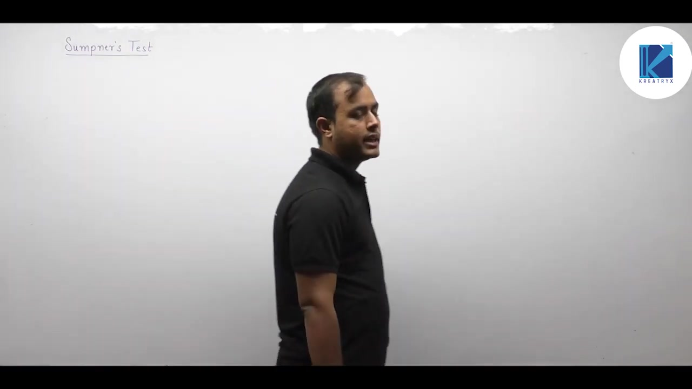

In physical operation, transformers supply power to electrical loads. Rated voltage excites the magnetic core while rated current circulates through both windings. Both core loss and copper loss occur together:
$$P_{\text{loss,running}} = P_{\text{core}} + P_{\text{cu,fl}}$$

Total heat generated in service depends on the sum of both losses. Internal heat dissipation causes insulation temperature to rise. Because OC and SC tests isolate losses, neither test can determine steady-state temperature rise.

---

### The Dilemma of Direct Load Testing

Manufacturers must verify transformer temperature rise before delivery. This test confirms that insulation limits and cooling systems operate safely.

For small transformers, direct full-load testing is straightforward. The secondary connects to a resistive or reactive load bank. The unit runs for several hours until temperature stabilizes.

For large power transformers, direct load testing is impractical. Consider a $50\text{ MVA}$ grid transformer. Running this unit at full load for 24 hours consumes massive electric energy:
$$E = 50\text{ MVA} \times 24\text{ hours} = 1200\text{ MWh}$$

Dissipating $50\text{ MW}$ of power inside a testing facility is expensive and wasteful. Suitable load banks of that size rarely exist.

---

### Foundation of Sumpner's Back-to-Back Test

An economical heat-run test must fulfill two requirements:
1. It must subject the transformer to full rated voltage and full rated current simultaneously.
2. It must minimize external energy consumption during prolonged thermal testing.

Sumpner's test (also known as the back-to-back test) achieves this objective.

The test requires two identical transformers. 

The primary windings are connected in parallel across the rated AC supply. The secondary windings are connected in series opposition. 

> [!info] Principle of Sumpner's Test
> Sumpner's test operates two identical transformers under simultaneous rated voltage and rated current conditions. No power is delivered to an external load. The supply sources provide only the internal core and copper losses.

## Circuit Architecture and Series Opposition Verification in Sumpner's Test
_(29:26 - 36:23)_

### Schematic Layout of the Test Circuit

Sumpner's test requires two identical transformers, designated Transformer A and Transformer B.

The primary windings connect in parallel across a rated AC supply. The primary terminals marked with dots connect together to the upper supply rail. The un-dotted terminals connect together to the lower supply rail.

Instruments connected on the primary side include:
- A voltmeter recording supply voltage $V_1$.
- An ammeter recording total primary input current.
- A wattmeter $W_1$ measuring total real power drawn from the main supply.

The secondary windings connect in series opposition. 

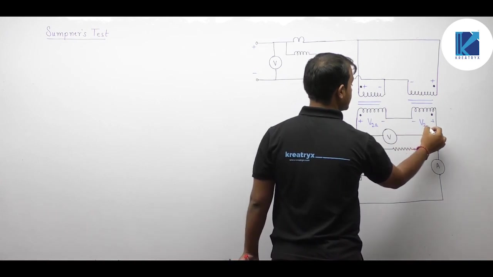

A secondary test loop contains:
- A voltmeter $V_{\text{sec}}$ across the open terminals.
- A variable auxiliary AC voltage source $V_{\text{aux}}$.
- A secondary ammeter $A_2$.
- A secondary wattmeter $W_2$.

---

### Verifying Series Opposition

Before closing the secondary loop, the operator must verify series opposition.

Both primaries operate in parallel across rated voltage $V_1$:
$$V_{1A} = V_{1B} = V_1$$

Because both transformers are identical, their transformation ratios match exactly:
$$a_A = a_B \implies V_{2A} = V_{2B}$$

Trace around the series secondary loop across the open terminals. The two induced secondary voltages subtract:
$$V_{\text{sec}} = V_{2A} - V_{2B}$$

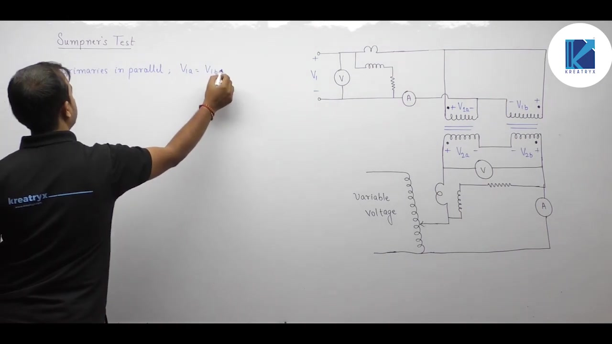

When connected correctly in series opposition, the secondary voltmeter reads zero:
$$V_{\text{sec}} = 0\text{ V}$$

If the secondaries are connected in series addition, the meter reads double the secondary voltage:
$$V_{\text{sec}} = 2 V_2$$
In that case, the operator must disconnect power and reverse the secondary leads.

> [!info] Criterion for Series Opposition
> With rated primary voltage applied, the voltmeter across open secondary terminals must read zero. This confirms that induced secondary voltages cancel around the loop.

---

### Step 1: Open-Circuit Operation and Core Loss Measurement

Keep the secondary auxiliary switch open. 

No current circulates through the secondary windings:
$$I_2 = 0$$

The primary windings remain excited at rated voltage and rated frequency. Each transformer behaves as if it were on an independent open-circuit test.

Each core establishes rated magnetic flux:
$$\Phi_m \propto \frac{V_1}{f}$$

Each transformer draws exciting current $I_0$. By Kirchhoff's current law, the main supply provides the sum of both no-load currents:
$$I_{\text{supply}} = 2 I_0$$

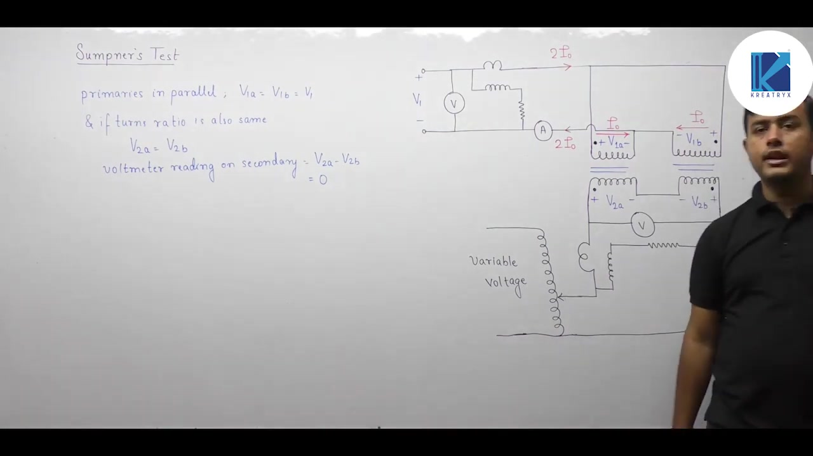

Because secondary current is zero, series winding copper loss is negligible. The primary wattmeter $W_1$ records total core loss for both units:
$$W_1 = 2 P_{\text{core}}$$

The core loss for each individual transformer is:
$$P_{\text{core}} = \frac{W_1}{2}$$

## Secondary Injection, Circulating Reflected Currents, and Phantom Loading
_(36:28 - 44:15)_

### Step 2: Auxiliary Secondary Injection

After verifying series opposition, the secondary loop is energized. 

A variable autotransformer injects a small auxiliary AC voltage $V_{\text{aux}}$ into the secondary loop. The operator increases this voltage until the secondary ammeter registers rated current:
$$I_2 = I_{2,\text{rated}}$$

Because the two secondaries connect in series, identical rated current flows through both windings. 

The two main induced secondary voltages cancel around the loop ($V_{2A} - V_{2B} = 0$). Therefore, the auxiliary source only has to overcome the internal leakage impedance of both windings:
$$Z_{\text{loop}} = 2 Z_{02}$$

The required auxiliary voltage is very small, typically $5\%$ to $10\%$ of rated secondary voltage. This mimics a short-circuit test on both units simultaneously.

---

### Behavior of Reflected Primary Currents

Circulating rated current in the secondaries reflects corresponding load currents into the primaries:
$$I_1' = \left(\frac{N_2}{N_1}\right) I_2$$

Let us trace the direction of these reflected currents:
- In Transformer A, secondary current $I_2$ enters the dotted terminal. Its reflected current $I_1'$ leaves the primary dotted terminal.
- In Transformer B, secondary current $I_2$ leaves the dotted terminal. Its reflected current $I_1'$ enters the primary dotted terminal.

The reflected current $I_1'$ forms a closed clockwise circulating loop between the two primary windings.

Apply Kirchhoff's current law at the main primary supply nodes. In one branch, $I_1'$ flows upward toward the bus. In the adjacent branch, $I_1'$ flows downward away from the bus.

These two equal and opposite currents cancel completely at the supply terminals:
$$I_{1,\text{supply}}' = I_1' - I_1' = 0$$

The reflected load current circulates entirely within the local primary loop. It never enters the main primary supply lines.

Therefore, the primary instruments remain completely undisturbed by the secondary current injection. The primary ammeter still reads $2 I_0$, and the primary wattmeter still reads $2 P_{\text{core}}$.

---

### Secondary Power Measurement

The secondary wattmeter $W_2$ measures active power delivered by the auxiliary source:
$$W_2 = 2 I_2^2 R_{02} = 2 P_{\text{cu,fl}}$$

This instrument measures the combined full-load copper loss of both transformers.

The full-load copper loss for each individual unit is:
$$P_{\text{cu,fl}} = \frac{W_2}{2}$$

---

### Concept of Phantom Loading (Fictitious Loading)

Sumpner's test achieves what electrical engineers call phantom loading or fictitious loading.

Both transformers experience full rated operating conditions simultaneously:
- The cores operate at rated voltage and rated flux, producing rated core loss.
- The windings carry rated current, producing rated full-load copper loss.

Yet no electrical load is connected to either unit. 

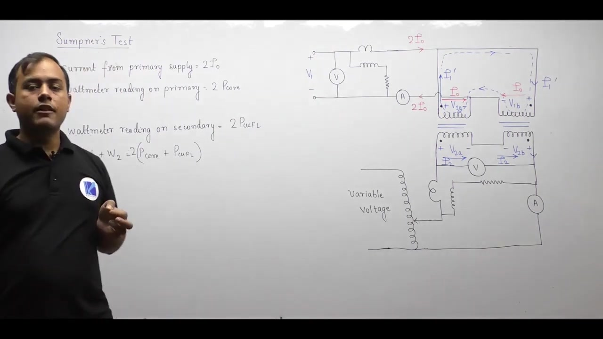

Output power delivered to external circuits is zero:
$$P_{\text{out}} = 0$$

All electrical power drawn from both sources supplies strictly internal losses:
$$P_{\text{in}} = W_1 + W_2 = 2 P_{\text{core}} + 2 P_{\text{cu,fl}}$$

In a conventional load test on two $50\text{ MVA}$ transformers, supplying $100\text{ MW}$ of power is required. In Sumpner's test, total power consumption drops to roughly $1\%$ to $2\%$ of rating, representing only the losses.

> [!success] Power Loss Extraction in Sumpner's Test
> Total power drawn from both supplies equals total transformer losses:
> $$
> \begin{aligned}
> \text{Core loss per transformer}: P_{\text{core}} &= \frac{W_1}{2} \\
> \text{Full-load copper loss per transformer}: P_{\text{cu,fl}} &= \frac{W_2}{2} \\
> \text{Total power drawn}: P_{\text{total}} &= W_1 + W_2 = 2 P_{\text{core}} + 2 P_{\text{cu,fl}}
> \end{aligned}
> $$

## Temperature Rise Estimation, Primary Current Asymmetry, and Efficiency Calculation
_(44:18 - 48:30)_

### Thermal Steady State and Temperature Rise

Operating both transformers under phantom loading produces continuous thermal dissipation. 

The core dissipates rated core loss. The windings dissipate rated copper loss. As the transformers run, the winding conductors and cooling oil heat up.

The test continues until the rate of heat generation balances the rate of heat dissipation. This steady-state condition is called thermal equilibrium. 

Thermocouples placed in the winding ducts and oil tank measure the steady-state temperature rise:
$$\Delta T = T_{\text{final}} - T_{\text{ambient}}$$

This data verifies that operating temperatures remain well within insulation thermal class limits. It also confirms that radiators and cooling pumps function properly.

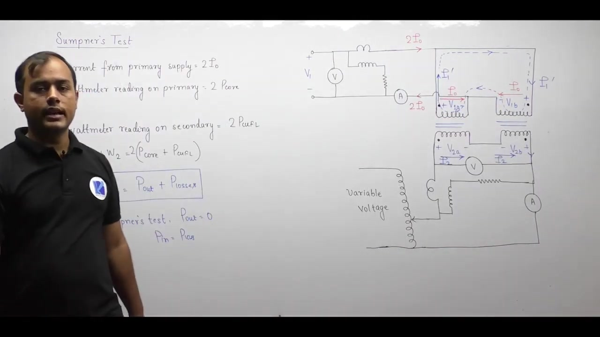

---

### Primary Current Asymmetry Analysis

Theoretical derivations often assume that both transformers operate identically. In reality, their primary currents differ slightly.

Each primary winding carries two current components:
- The exciting current $\mathbf{I}_0$ drawn from the main supply.
- The circulating reflected current $\mathbf{I}_1'$ driven by the auxiliary secondary supply.

Trace the direction of these currents through the two units:
- In Transformer A, the reflected current opposes the exciting current:
$$\mathbf{I}_{1A} = \mathbf{I}_1' - \mathbf{I}_0$$
- In Transformer B, the reflected current adds to the exciting current:
$$\mathbf{I}_{1B} = \mathbf{I}_1' + \mathbf{I}_0$$

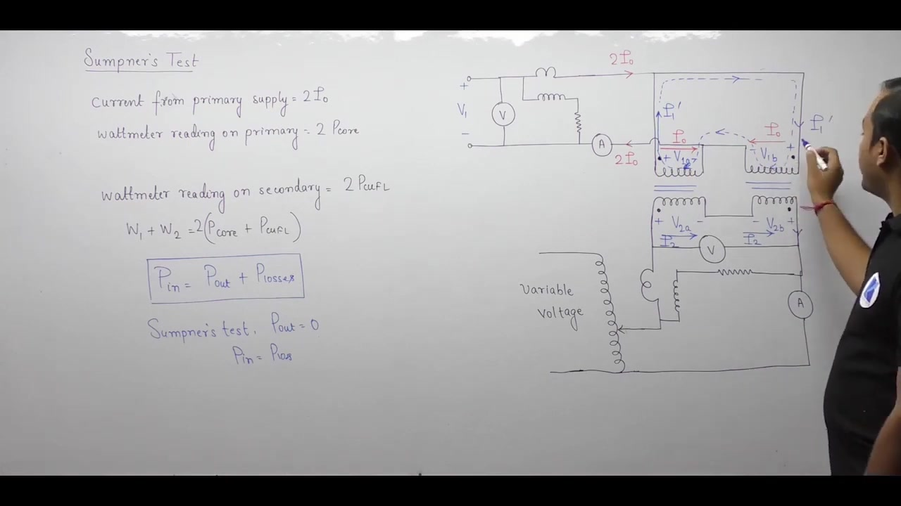

Because of this vector difference:
$$|\mathbf{I}_{1B}| > |\mathbf{I}_{1A}|$$

Transformer B carries slightly more primary current than Transformer A. As a result, primary copper loss in Transformer B is slightly higher. The assumption of perfectly identical operation is only a close engineering approximation.

---

### Efficiency Calculation from Test Measurements

Numerical exam problems on Sumpner's test focus on efficiency determination. 

The test yields two wattmeter readings:
- Primary wattmeter reading: $W_1$
- Secondary wattmeter reading: $W_2$

For each individual transformer:
$$
\begin{aligned}
P_{\text{core}} &= \frac{W_1}{2} \\
P_{\text{cu,fl}} &= \frac{W_2}{2}
\end{aligned}
$$

At any fractional load $x$ and load power factor $\cos\theta$, calculate efficiency as:
$$\eta = \frac{x S_{\text{rated}} \cos\theta}{x S_{\text{rated}} \cos\theta + P_{\text{core}} + x^2 P_{\text{cu,fl}}} \times 100\%$$

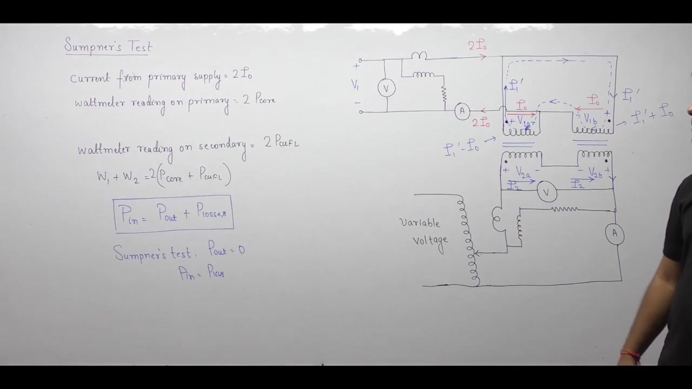

---

### Summary of Transformer Testing Methods

Transformers undergo four standard tests to evaluate performance:

| Test Name | Operating Conditions | Parameter Extracted | Key Application |
| :--- | :--- | :--- | :--- |
| **Open-Circuit Test** | Rated voltage, LV side | Core loss $P_{\text{core}}$, shunt parameters ($R_c, X_m$) | Voltage regulation, core evaluation |
| **Short-Circuit Test** | Rated current, HV side | Copper loss $P_{\text{cu,fl}}$, series parameters ($R_{01}, X_{01}$) | Efficiency, voltage drop |
| **Polarity Test** | Low AC voltage across jumper | Dot convention, subtractive/additive polarity | Parallel operation, instrument wiring |
| **Sumpner's Test** | Back-to-back phantom loading | Combined losses ($W_1, W_2$), temperature rise | Heat run, cooling design |

> [!success] Core Takeaway
> Sumpner's test determines full-load temperature rise and efficiency without consuming full load power.

---

## Summary and Key Takeaways

- Raw open-circuit and short-circuit test data can be directly referred across windings by scaling voltages by turns ratio and currents by inverse turns ratio while keeping power constant.
- The polarity test identifies secondary terminals that have the same instantaneous potential as primary terminals to place dot markings.
- Connecting parallel transformers with reversed polarities causes massive circulating currents driven by double the secondary voltage ($2 E_2$), resulting in destructive heating.
- In the polarity test with one primary and secondary terminal tied together, a voltmeter reading $V = V_1 - V_2$ indicates subtractive polarity, while $V = V_1 + V_2$ indicates additive polarity.
- Standard power transformers use subtractive polarity because it reduces dielectric voltage stress between adjacent terminal bushings.
- Open-circuit and short-circuit tests cannot predict thermal temperature rise because neither test subjects the transformer to simultaneous core and copper losses.
- Sumpner's test connects two identical transformers with primaries in parallel across rated voltage and secondaries in series opposition, verified by zero secondary voltmeter reading ($V_{\text{sec}} = V_{2A} - V_{2B} = 0$).
- Primary wattmeter $W_1$ measures total core loss for both units ($2 P_{\text{core}}$), while auxiliary secondary wattmeter $W_2$ measures total full-load copper loss ($2 P_{\text{cu,fl}}$).
- Reflected secondary current circulates within the closed primary loop without entering the main supply line, enabling phantom loading where total power drawn equals strictly internal losses.

