# Problems Based on Testing of Transformer | L7 | Electrical Machines | GATE 2022

- **Source**: https://www.youtube.com/watch?v=K-6LaXFVYBI
- **Duration**: 01:14:06
- **Compiled**: 2026-09-19

---

## Overview

This problem-solving lecture focuses on experimental testing of single-phase and three-phase transformers. It covers the open-circuit test, the short-circuit test, and Sumpner's back-to-back test. The problems establish direct referral of raw instrument readings across windings without separate impedance calculations. The lecture links measured test data directly to voltage regulation, load terminal voltage, and operating efficiency.

## Contents

- [[#Transformer Testing Problems and Sumpner's Test Setup|Transformer Testing Problems and Sumpner's Test Setup]]
- [[#Sumpner's Test Efficiency Calculation and Maximum Voltage Regulation|Sumpner's Test Efficiency Calculation and Maximum Voltage Regulation]]
- [[#Power Factor for Maximum Voltage Regulation and Role of Test Data|Power Factor for Maximum Voltage Regulation and Role of Test Data]]
- [[#Short-Circuit Test Parameter Extraction and Load Voltage Calculation|Short-Circuit Test Parameter Extraction and Load Voltage Calculation]]
- [[#Terminal Voltage Calculation via KVL and Equivalent Circuit Parameter Extraction|Terminal Voltage Calculation via KVL and Equivalent Circuit Parameter Extraction]]
- [[#Complete Parameter Extraction Referred to the Low-Voltage Side|Complete Parameter Extraction Referred to the Low-Voltage Side]]
- [[#No-Load Current Components and Secondary Terminal Voltage Setup|No-Load Current Components and Secondary Terminal Voltage Setup]]
- [[#Exact Phasor Method versus Approximate Voltage Drop Formulation|Exact Phasor Method versus Approximate Voltage Drop Formulation]]
- [[#Load Terminal Voltage at Lagging and Leading Power Factor and Shunt Invariance|Load Terminal Voltage at Lagging and Leading Power Factor and Shunt Invariance]]
- [[#Low-Voltage Series Parameter Extraction and Three-Phase Transformer Testing|Low-Voltage Series Parameter Extraction and Three-Phase Transformer Testing]]
- [[#Three-Phase Shunt Parameter Extraction Referred to Delta HV Winding|Three-Phase Shunt Parameter Extraction Referred to Delta HV Winding]]
- [[#Three-Phase Series Parameters and Half-Load Efficiency Calculation|Three-Phase Series Parameters and Half-Load Efficiency Calculation]]
- [[#Per-Unit Leakage Impedance Applications and Objective Testing Concepts|Per-Unit Leakage Impedance Applications and Objective Testing Concepts]]
- [[#Non-Rated Short-Circuit Testing, Loss Scaling, and Efficiency|Non-Rated Short-Circuit Testing, Loss Scaling, and Efficiency]]
- [[#Experimental Placement Rules, Test Synthesis, and Lecture Wrap-Up|Experimental Placement Rules, Test Synthesis, and Lecture Wrap-Up]]

---

## Transformer Testing Problems and Sumpner's Test Setup
_(00:16 - 05:08)_

### Scope of Transformer Testing Problems

Transformer testing problems test concepts from open-circuit, short-circuit, and back-to-back testing. Open-circuit tests yield core loss and shunt parameters. Short-circuit tests give full-load copper loss and series leakage impedance. Sumpner's back-to-back test evaluates both losses simultaneously under full thermal loading without consuming full load power.

Solving these problems requires quick identification of instrument roles. You must also distinguish between total readings and individual machine shares.

### Sumpner's (Back-to-Back) Test Principles

In Sumpner's test two identical transformers have their primary windings connected in parallel across the rated mains voltage. Their secondaries are connected in phase opposition.

The mains supply connects directly to the parallel primaries. This supply draws only no-load exciting current. The mains wattmeter $W_1$ therefore records the total core loss of both transformers:

$$P_{i,\text{total}} = W_1$$

Because the two units are identical, each unit consumes half of this power:

$$P_i = \frac{W_1}{2}$$

An auxiliary low-voltage source is inserted in series with the secondary circuit or primary series circuit. It circulates rated full-load current through the series-connected windings. The series wattmeter $W_2$ records the total full-load copper loss of both transformers:

$$P_{\text{cu,fl,total}} = W_2$$

Each transformer accounts for half of the total copper loss:

$$P_{\text{cu,fl}} = \frac{W_2}{2}$$

### Problem Statement: Two 250 kVA Transformers

> [!example] Problem: Sumpner's Test Efficiency
> Two identical $250\text{ kVA}$ single-phase transformers gave the following test results when tested by the back-to-back method:
> - Mains wattmeter reading: $W_1 = 5.0\text{ kW}$
> - Primary series circuit wattmeter reading: $W_2 = 7.5\text{ kW}$ (at rated full-load current)
> 
> Find the efficiency of each individual transformer at $75\%$ of full load and $0.8$ power factor lagging.

To solve this problem, first determine the per-unit load factor $x$:

$$x = 0.75$$

Then find the loss distribution for one transformer from the wattmeter readings:

$$
\begin{aligned}
P_i &= \frac{5.0\text{ kW}}{2} = 2.5\text{ kW} \\
P_{\text{cu,fl}} &= \frac{7.5\text{ kW}}{2} = 3.75\text{ kW}
\end{aligned}
$$

With the losses known, the output power and individual efficiency follow directly.

## Sumpner's Test Efficiency Calculation and Maximum Voltage Regulation
_(05:09 - 10:34)_

### Sumpner's Test Efficiency Solution

To find the individual efficiency, extract the per-unit losses for a single transformer. The mains wattmeter reading gives the total core loss of both units:

$$P_{i,\text{total}} = 2 P_i = 5.0\text{ kW} \implies P_i = 2.5\text{ kW}$$

The auxiliary series circuit wattmeter records the total full-load copper loss of both units:

$$P_{\text{cu,fl,total}} = 2 P_{\text{cu,fl}} = 7.5\text{ kW} \implies P_{\text{cu,fl}} = 3.75\text{ kW}$$

Now write the general efficiency equation for fraction $x$ of full load at power factor $\cos\phi$:

$$\eta = \frac{x S \cos\phi}{x S \cos\phi + P_i + x^2 P_{\text{cu,fl}}}$$

Here the fractional loading is $x = 0.75$ and the power factor is $\cos\phi = 0.8$. The rating of each transformer is $S = 250\text{ kVA}$.

Compute the output power delivered by one unit:

$$P_{\text{out}} = 0.75 \times 250 \times 0.8 = 150\text{ kW}$$

Next, determine the copper loss at $75\%$ load. Remember that copper loss scales with the square of the fractional loading:

$$P_{\text{cu}} = x^2 P_{\text{cu,fl}} = (0.75)^2 \times 3.75\text{ kW} = 0.5625 \times 3.75\text{ kW} = 2.1094\text{ kW}$$

Now sum the losses:

$$P_{\text{loss}} = P_i + P_{\text{cu}} = 2.5\text{ kW} + 2.1094\text{ kW} = 4.6094\text{ kW}$$

Calculate the efficiency:

$$\eta = \frac{150}{150 + 4.6094} \times 100\% = \frac{150}{154.6094} \times 100\% = 97.02\%$$

> [!success] Result
> The individual efficiency of each transformer under $75\%$ full load at $0.8$ lagging power factor is $97.02\%$, corresponding to Option (a).

### Common Trap in Sumpner's Test Calculations

Many students mistakenly obtain $95\%$. That mistake happens when the $x^2$ scaling factor is omitted from the copper loss term. 

Always scale copper loss by $x^2$. Core loss remains constant at all load levels because terminal voltage and frequency are fixed.

### Maximum Voltage Regulation Problem Setup

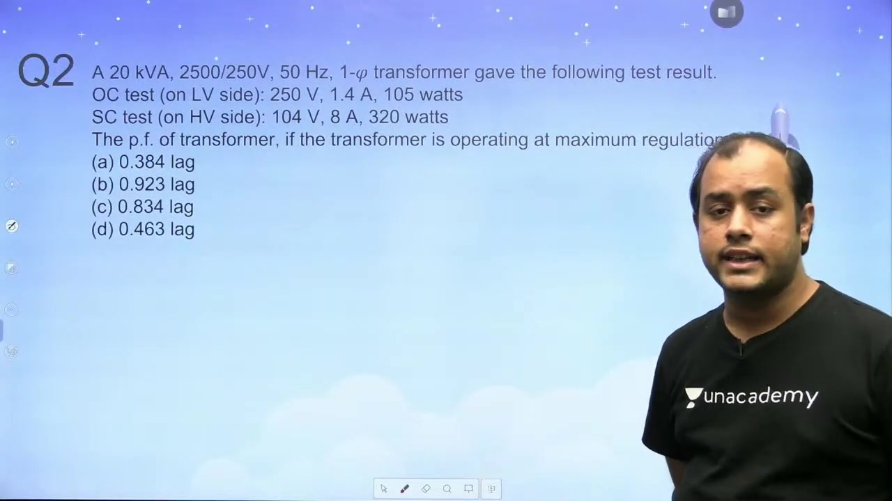

> [!example] Problem: Maximum Voltage Regulation Power Factor
> A $20\text{ kVA}, 2500/250\text{ V}, 50\text{ Hz}$ single-phase transformer gave the following test results:
> - Open Circuit Test (on LV side): $250\text{ V}, 1.4\text{ A}, 105\text{ W}$
> - Short Circuit Test (on HV side): $104\text{ V}, 8\text{ A}, 320\text{ W}$
> 
> Determine the load power factor at which the transformer operates at maximum voltage regulation:
> (a) $0.384\text{ lag}$
> (b) $0.923\text{ lag}$
> (c) $0.834\text{ lag}$
> (d) $0.463\text{ lag}$

### Physical Basis of Maximum Voltage Regulation

Voltage regulation measures the drop in terminal voltage from no-load to full-load. The approximate voltage regulation is given by:

$$\text{VR} \approx \frac{I_2 (R_{02}\cos\phi + X_{02}\sin\phi)}{V_2}$$

Differentiating with respect to $\phi$ and setting the derivative to zero yields the maximum condition:

$$\frac{d(\text{VR})}{d\phi} = 0 \implies -R_{02}\sin\phi + X_{02}\cos\phi = 0 \implies \tan\phi = \frac{X_{02}}{R_{02}}$$

Thus, maximum voltage regulation occurs at a lagging power factor where the load angle equals the transformer impedance angle:

$$\phi = \theta = \tan^{-1}\left(\frac{X_{\text{eq}}}{R_{\text{eq}}}\right)$$

This internal impedance angle is obtained directly from the short-circuit test.

## Power Factor for Maximum Voltage Regulation and Role of Test Data
_(10:40 - 15:30)_

### Direct Derivation from Short-Circuit Test Readings

The condition for maximum voltage regulation is that the load power factor angle equals the internal impedance angle:

$$\phi = \theta$$

Here $\theta$ is the phase angle of the series equivalent impedance $Z_{\text{eq}} = R_{\text{eq}} + j X_{\text{eq}}$. Therefore, the load power factor at maximum voltage regulation must satisfy:

$$\cos\phi = \cos\theta$$

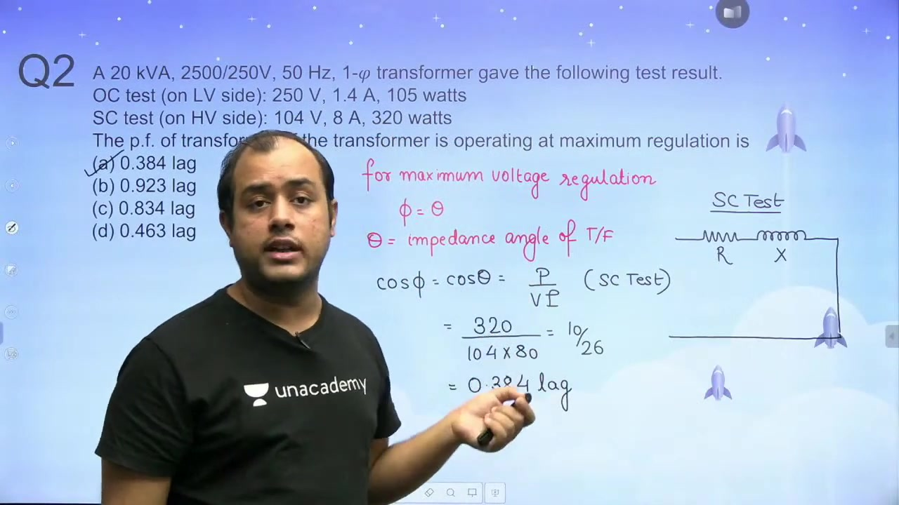

In the short-circuit test, the transformer operates with its secondary shorted. The applied test voltage $V_{\text{sc}}$ drives current $I_{\text{sc}}$ through the series impedance alone. The input power factor during the short-circuit test is:

$$\cos\theta_{\text{sc}} = \frac{P_{\text{sc}}}{V_{\text{sc}} I_{\text{sc}}}$$

Substitute the short-circuit test values directly:

$$\cos\theta = \frac{320\text{ W}}{104\text{ V} \times 8\text{ A}} = \frac{320}{832} = \frac{40}{104} = \frac{5}{13} \approx 0.3846\text{ lag}$$

Rounding to three decimal places yields $0.384\text{ lag}$, which is Option (a).

> [!success] Result
> The power factor of the transformer for maximum voltage regulation is $0.384\text{ lagging}$.

### Alternative Derivation via Explicit Series Parameters

You can also solve this problem by calculating the explicit series parameters:

$$
\begin{aligned}
Z_{01} &= \frac{V_{\text{sc}}}{I_{\text{sc}}} = \frac{104}{8} = 13\ \Omega \\
R_{01} &= \frac{W_{\text{sc}}}{I_{\text{sc}}^2} = \frac{320}{8^2} = \frac{320}{64} = 5\ \Omega
\end{aligned}
$$

The reactance is:

$$X_{01} = \sqrt{Z_{01}^2 - R_{01}^2} = \sqrt{13^2 - 5^2} = \sqrt{169 - 25} = 12\ \Omega$$

Now calculate the cosine of the impedance angle directly:

$$\cos\theta = \frac{R_{01}}{Z_{01}} = \frac{5}{13} \approx 0.3846\text{ lag}$$

Both approaches yield identical results. The direct ratio method $P_{\text{sc}} / (V_{\text{sc}} I_{\text{sc}})$ saves significant time during exams.

### Why Shunt Branch and Open-Circuit Test are Excluded

Students often ask why the open-circuit test data was not used. 

In voltage regulation, the focus is on the voltage drop across the series impedance from no-load to full-load. The exciting current drawn by the shunt branch is small, usually between $2\%$ and $5\%$ of rated current. It exerts negligible influence on the series voltage drop.

The equivalent circuit used for voltage regulation therefore neglects the shunt branch entirely. Only the series parameters $R_{02}$ and $X_{02}$ appear in the regulation formula. 

Because the open-circuit test determines shunt parameters ($R_c$ and $X_m$), it has zero bearing on voltage regulation.

### Conceptual Link between Testing and Regulation

Remember that maximum voltage regulation always occurs at a lagging power factor. Zero voltage regulation occurs at a leading power factor:

$$\tan\phi_{\text{zero VR}} = -\frac{R_{\text{eq}}}{X_{\text{eq}}}$$

Matching the load angle to the internal series impedance angle links machine testing directly to power system performance.

## Short-Circuit Test Parameter Extraction and Load Voltage Calculation
_(15:33 - 20:30)_

### Problem Statement: Applied Primary Voltage on Full Load

> [!example] Problem: Required HV Applied Voltage
> A short-circuit test performed on the HV side of a $10\text{ kVA}, 2000/400\text{ V}, 50\text{ Hz}$ single-phase transformer gave:
> - Test voltage: $V_{\text{sc}} = 60\text{ V}$
> - Test current: $I_{\text{sc}} = 4\text{ A}$
> - Wattmeter reading: $W_{\text{sc}} = 100\text{ W}$
> 
> If the LV side delivers rated full-load current at $0.8$ power factor lagging at $400\text{ V}$, find the voltage applied on the HV side:
> (a) $2075.4\text{ V}$
> (b) $2065.8\text{ V}$
> (c) $2119.6\text{ V}$
> (d) $1955.2\text{ V}$

### Series Parameter Extraction from Non-Rated Test Data

First check whether the short-circuit test was performed at rated current. The rated current on the HV side ($2000\text{ V}$) is:

$$I_{\text{rated,HV}} = \frac{10000\text{ VA}}{2000\text{ V}} = 5\text{ A}$$

The test ammeter reads $4\text{ A}$, which is less than rated current. 

However, winding resistance $R$ and leakage reactance $X$ do not depend on the test current level. They remain constant because magnetic materials in leakage flux paths remain linear. You can compute them directly from test readings:

$$
\begin{aligned}
Z_{01} &= \frac{V_{\text{sc}}}{I_{\text{sc}}} = \frac{60\text{ V}}{4\text{ A}} = 15\ \Omega \\
R_{01} &= \frac{W_{\text{sc}}}{I_{\text{sc}}^2} = \frac{100\text{ W}}{4^2\text{ A}^2} = \frac{100}{16} = 6.25\ \Omega
\end{aligned}
$$

Now compute the equivalent leakage reactance referred to the HV side:

$$X_{01} = \sqrt{Z_{01}^2 - R_{01}^2} = \sqrt{15^2 - 6.25^2} = \sqrt{225 - 39.0625} = 13.6358\ \Omega$$

### Load Reflection and Invariance of Per-Unit Current

The secondary terminal delivers rated load at $400\text{ V}$ and $0.8$ power factor lagging. Take the secondary terminal voltage as reference:

$$V_2 = 400 \angle 0^\circ\text{ V}$$

Reflect this terminal voltage to the primary winding using turns ratio $a = 2000 / 400 = 5$:

$$V_2' = a V_2 = 5 \times 400 \angle 0^\circ = 2000 \angle 0^\circ\text{ V}$$

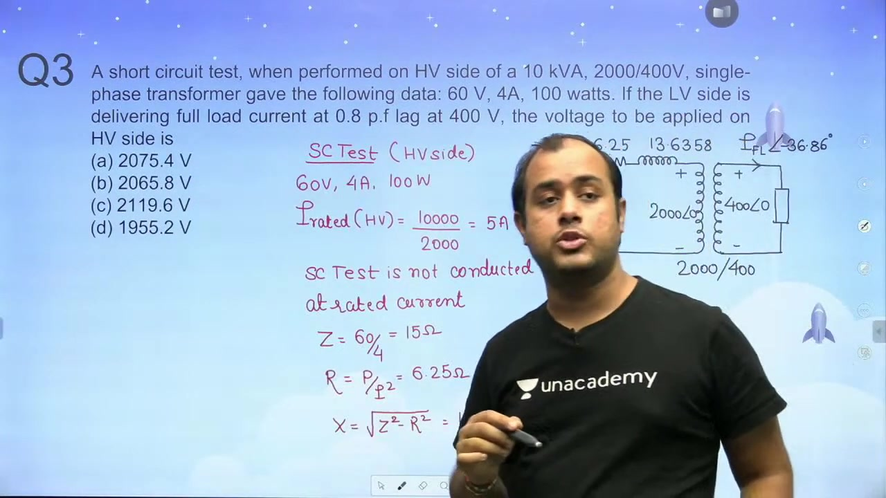

Now determine the primary current. In per-unit terms, if a transformer carries rated full-load current on one side ($1.0\text{ pu}$), it must carry rated full-load current on the other side ($1.0\text{ pu}$):

$$I_{2,\text{pu}} = 1.0\text{ pu} \implies I_{1,\text{pu}} = 1.0\text{ pu}$$

The primary rated current is $5\text{ A}$. Since the load power factor is $0.8$ lagging ($\phi = \cos^{-1}(0.8) \approx 36.87^\circ$), the reflected primary current phasor is:

$$I_1' = 5 \angle -36.87^\circ\text{ A} = 5(0.8 - j 0.6)\text{ A} = (4 - j 3)\text{ A}$$

This current flows through the series impedance $R_{01} + j X_{01}$ to the reflected secondary terminals. The primary applied terminal voltage must overcome this internal impedance drop.

## Terminal Voltage Calculation via KVL and Equivalent Circuit Parameter Extraction
_(20:33 - 25:23)_

### Applied Primary Voltage Solution via KVL

In the previous section, the series parameters referred to the HV side were found:

$$R_{01} = 6.25\ \Omega, \quad X_{01} = 13.6358\ \Omega$$

The reflected load voltage on the HV side is $V_2' = 2000 \angle 0^\circ\text{ V}$. The rated primary load current is $I_1 = 5 \angle -36.87^\circ\text{ A}$.

Apply Kirchhoff's Voltage Law to the primary circuit loop:

$$V_1 = V_2' + I_1 (R_{01} + j X_{01})$$

Substitute the known phasor quantities into this expression:

$$
\begin{aligned}
V_1 &= 2000 \angle 0^\circ + (5 \angle -36.87^\circ)(6.25 + j 13.6358) \\
&= 2000 + 5(0.8 - j 0.6)(6.25 + j 13.6358) \\
&= 2000 + 5[(0.8 \times 6.25 + 0.6 \times 13.6358) + j(0.8 \times 13.6358 - 0.6 \times 6.25)] \\
&= 2000 + 5[(5.0 + 8.1815) + j(10.9086 - 3.75)] \\
&= 2000 + 5(13.1815 + j 7.1586) \\
&= 2000 + 65.9075 + j 35.7930 \\
&= 2065.9075 + j 35.7930\text{ V}
\end{aligned}
$$

Calculate the magnitude of the applied voltage:

$$|V_1| = \sqrt{(2065.9075)^2 + (35.7930)^2} = \sqrt{4267972 + 1281} \approx 2066.2\text{ V}$$

The closest option among the choices is Option (b), $2065.8\text{ V}$. The minor difference arises from rounding decimals during trigonometric steps.

> [!success] Result
> The required primary voltage applied to maintain rated secondary terminal voltage on full load is $2065.8\text{ V}$ (Option b).

### Problem Statement: Full Equivalent Circuit Extraction

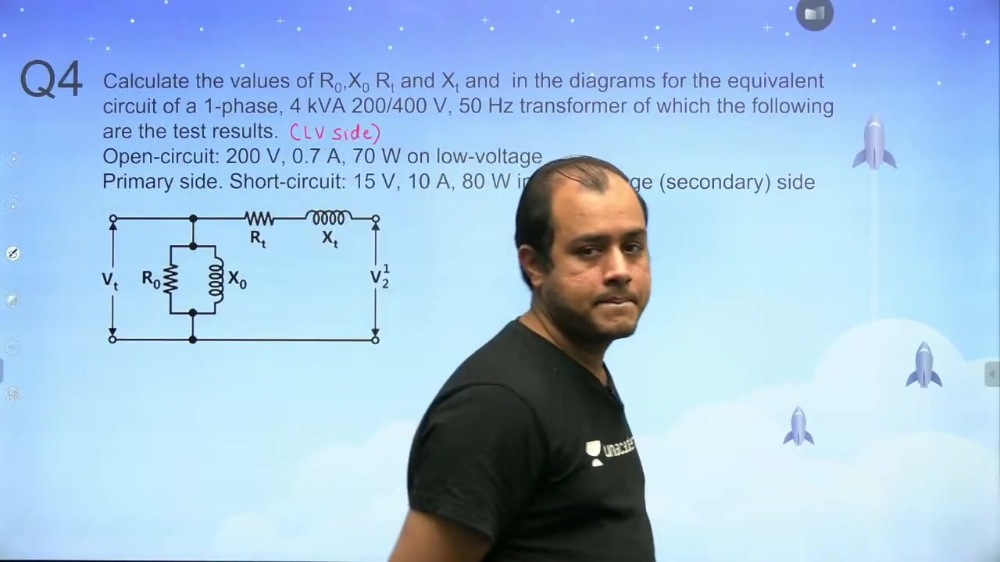

> [!example] Problem: Equivalent Circuit Parameter Extraction
> A $4\text{ kVA}, 200/400\text{ V}, 50\text{ Hz}$ single-phase transformer gave the following test results:
> - Open Circuit Test on LV primary side: $V_0 = 200\text{ V}$, $I_0 = 0.7\text{ A}$, $W_0 = 70\text{ W}$
> - Short Circuit Test on HV secondary side: $V_{\text{sc}} = 15\text{ V}$, $I_{\text{sc}} = 10\text{ A}$, $W_{\text{sc}} = 80\text{ W}$
> 
> Calculate the equivalent circuit parameters $R_0, X_0, R_t, X_t$ referred to the low-voltage side.

### Calculation of Shunt Resistance on LV Side

The open-circuit test was conducted directly on the low-voltage primary side. 

In the approximate equivalent circuit, the shunt core loss resistance $R_0$ is placed in parallel across the rated input voltage $V_0$. Since the branch is in parallel, power dissipation is given by:

$$W_0 = \frac{V_0^2}{R_0}$$

Rearrange this equation to solve for the shunt resistance:

$$R_0 = \frac{V_0^2}{W_0} = \frac{200^2}{70} = \frac{40000}{70} \approx 571.43\ \Omega$$

This represents the core loss resistance referred to the low-voltage primary winding.

## Complete Parameter Extraction Referred to the Low-Voltage Side
_(25:29 - 30:23)_

### Shunt Branch Parameters Extraction

The open-circuit test on the low-voltage side provides $V_0 = 200\text{ V}$, $I_0 = 0.7\text{ A}$, and $W_0 = 70\text{ W}$. 

In the previous section, the core loss resistance was found to be $R_0 = 571.43\ \Omega$. Now determine the working component of the no-load current:

$$I_w = \frac{W_0}{V_0} = \frac{70\text{ W}}{200\text{ V}} = 0.35\text{ A}$$

The no-load current $I_0$ is the phasor sum of the working current $I_w$ and the magnetizing current $I_\mu$. Because these two components are in quadrature:

$$I_0^2 = I_w^2 + I_\mu^2$$

Solve for the magnetizing current $I_\mu$:

$$I_\mu = \sqrt{I_0^2 - I_w^2} = \sqrt{0.7^2 - 0.35^2} = \sqrt{0.49 - 0.1225} = \sqrt{0.3675} \approx 0.6062\text{ A}$$

Now calculate the magnetizing reactance $X_0$:

$$X_0 = \frac{V_0}{I_\mu} = \frac{200\text{ V}}{0.6062\text{ A}} \approx 329.92\ \Omega \approx 330\ \Omega$$

Both shunt parameters are now established on the low-voltage primary side.

### Direct Referral of Short-Circuit Test Data

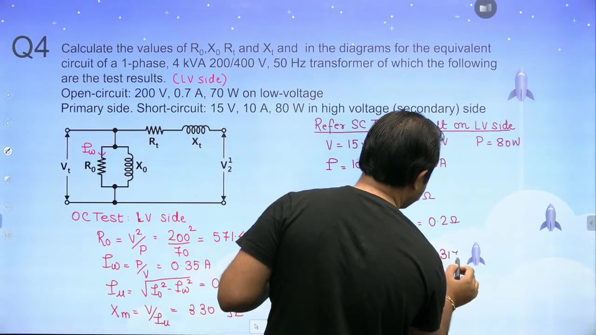

The short-circuit test data is given on the high-voltage side: $V_{\text{sc}} = 15\text{ V}$, $I_{\text{sc}} = 10\text{ A}$, $W_{\text{sc}} = 80\text{ W}$. 

Instead of computing parameters on the high-voltage side and dividing by $a^2$, refer the meter readings directly to the low-voltage side. The turns ratio between windings is:

$$\frac{N_{\text{LV}}}{N_{\text{HV}}} = \frac{200}{400} = \frac{1}{2}$$

Transform the test voltage and current using the winding ratio:

$$
\begin{aligned}
V_{\text{sc,LV}} &= V_{\text{sc,HV}} \times \left(\frac{N_{\text{LV}}}{N_{\text{HV}}}\right) = 15 \times \frac{1}{2} = 7.5\text{ V} \\
I_{\text{sc,LV}} &= I_{\text{sc,HV}} \times \left(\frac{N_{\text{HV}}}{N_{\text{LV}}}\right) = 10 \times 2 = 20\text{ A}
\end{aligned}
$$

Power represents physical heat dissipation and is invariant to referral:

$$P_{\text{sc,LV}} = P_{\text{sc,HV}} = 80\text{ W}$$

### Series Parameters Calculation on Low-Voltage Side

Now calculate the series equivalent impedance directly using the referred test values:

$$Z_t = \frac{V_{\text{sc,LV}}}{I_{\text{sc,LV}}} = \frac{7.5\text{ V}}{20\text{ A}} = 0.375\ \Omega$$

Calculate the series equivalent resistance from the wattmeter reading:

$$R_t = \frac{P_{\text{sc,LV}}}{I_{\text{sc,LV}}^2} = \frac{80\text{ W}}{(20\text{ A})^2} = \frac{80}{400} = 0.20\ \Omega$$

Compute the series leakage reactance from the impedance triangle:

$$X_t = \sqrt{Z_t^2 - R_t^2} = \sqrt{0.375^2 - 0.2^2} = \sqrt{0.140625 - 0.04} = \sqrt{0.100625} \approx 0.3172\ \Omega$$

> [!success] Result
> The equivalent circuit parameters referred to the low-voltage side are $R_0 \approx 571.43\ \Omega$, $X_0 \approx 330\ \Omega$, $R_t = 0.20\ \Omega$, and $X_t \approx 0.3172\ \Omega$.

Referring the test data directly avoids squaring and dividing large numbers. It cuts calculation time and reduces algebraic errors.

## No-Load Current Components and Secondary Terminal Voltage Setup
_(30:41 - 35:43)_

### Problem Statement: Combined Test Analysis

Questions on transformer testing often combine multiple concepts. Examiners rarely ask for circuit parameters in isolation. Usually they link test data to efficiency or voltage regulation.

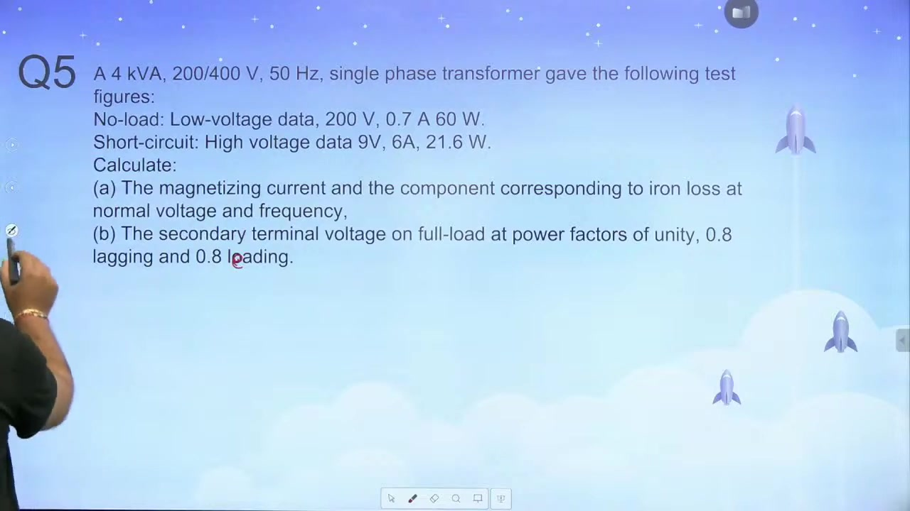

> [!example] Problem: No-Load Current and Load Terminal Voltage
> A $4\text{ kVA}, 200/400\text{ V}, 50\text{ Hz}$ single-phase transformer gave the following test figures:
> - No-load test (low-voltage data): $200\text{ V}$, $0.7\text{ A}$, $60\text{ W}$
> - Short-circuit test (high-voltage data): $9\text{ V}$, $6\text{ A}$, $21.6\text{ W}$
> 
> Calculate:
> 1. The magnetizing current and the core loss component of current at rated voltage and frequency.
> 2. The secondary terminal voltage on full load at power factors of unity, $0.8$ lagging, and $0.8$ leading.

### Extraction of No-Load Current Components

The no-load test is conducted on the low-voltage side at rated voltage $V_1 = 200\text{ V}$. 

The core loss component (working current) $I_w$ supplies the active power needed for hysteresis and eddy currents:

$$I_w = \frac{P_{\text{core}}}{V_1} = \frac{60\text{ W}}{200\text{ V}} = 0.3\text{ A}$$

The no-load current $I_0 = 0.7\text{ A}$ is the vector sum of $I_w$ and the reactive magnetizing component $I_\mu$. Since they are in quadrature:

$$I_\mu = \sqrt{I_0^2 - I_w^2}$$

Substitute the test values:

$$I_\mu = \sqrt{0.7^2 - 0.3^2} = \sqrt{0.49 - 0.09} = \sqrt{0.40} \approx 0.6325\text{ A}$$

> [!success] Result
> At rated voltage and frequency, the core loss component is $I_w = 0.3\text{ A}$ and the magnetizing component is $I_\mu \approx 0.6325\text{ A}$.

### Extraction of Series Parameters on High-Voltage Side

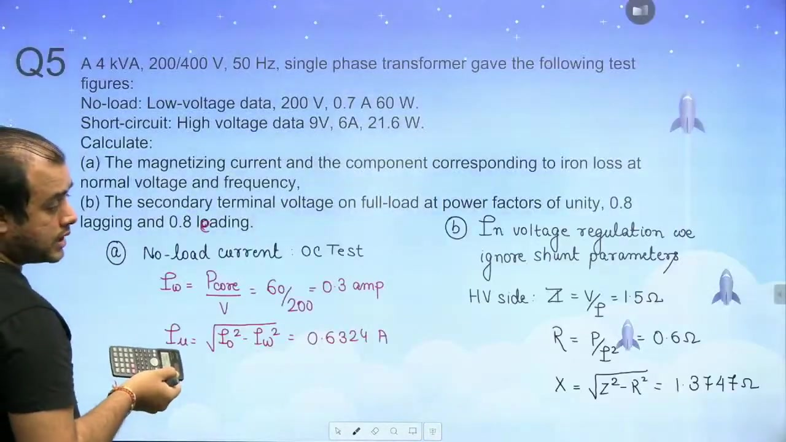

To compute the secondary terminal voltage on load, drop the shunt branch. The shunt exciting current is small and does not govern the load voltage drop. 

The secondary winding is the high-voltage side ($400\text{ V}$). The short-circuit test was performed directly on this high-voltage side:

$$V_{\text{sc}} = 9\text{ V}, \quad I_{\text{sc}} = 6\text{ A}, \quad W_{\text{sc}} = 21.6\text{ W}$$

Calculate the series impedance referred to the high-voltage secondary side:

$$Z_{02} = \frac{V_{\text{sc}}}{I_{\text{sc}}} = \frac{9\text{ V}}{6\text{ A}} = 1.5\ \Omega$$

Calculate the series equivalent resistance:

$$R_{02} = \frac{W_{\text{sc}}}{I_{\text{sc}}^2} = \frac{21.6\text{ W}}{6^2\text{ A}^2} = \frac{21.6}{36} = 0.6\ \Omega$$

Find the series leakage reactance from the impedance triangle:

$$X_{02} = \sqrt{Z_{02}^2 - R_{02}^2} = \sqrt{1.5^2 - 0.6^2} = \sqrt{2.25 - 0.36} = \sqrt{1.89} \approx 1.3747\ \Omega$$

These series parameters $R_{02} = 0.6\ \Omega$ and $X_{02} \approx 1.3747\ \Omega$ govern the secondary terminal voltage under all load conditions.

## Exact Phasor Method versus Approximate Voltage Drop Formulation
_(35:46 - 40:57)_

### Rated Secondary Load Current

The transformer is rated at $4\text{ kVA}, 200/400\text{ V}, 50\text{ Hz}$. 

When the problem specifies full-load condition on the secondary winding, calculate the rated secondary current:

$$I_{2,\text{fl}} = \frac{\text{Rating}}{V_{2,\text{rated}}} = \frac{4000\text{ VA}}{400\text{ V}} = 10\text{ A}$$

Use nameplate ratings only when full-load or rated condition is stated.

### Exact Phasor Method at Unity Power Factor

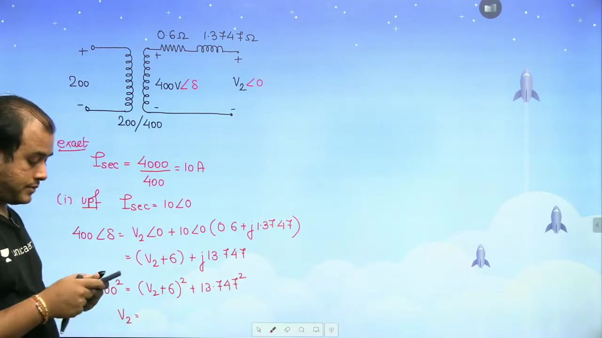

In the exact method, take the secondary terminal voltage as reference:

$$V_2 = V_2 \angle 0^\circ$$

The load operates at unity power factor, so current is in phase with voltage:

$$I_2 = 10 \angle 0^\circ\text{ A}$$

The induced secondary electromotive force is $400\text{ V}$ with power angle $\delta$:

$$E_2 = 400 \angle \delta$$

Write Kirchhoff's Voltage Law across the secondary series circuit:

$$400 \angle \delta = V_2 \angle 0^\circ + I_2 (R_{02} + j X_{02})$$

Substitute the known series parameters $R_{02} = 0.6\ \Omega$ and $X_{02} = 1.3747\ \Omega$:

$$
\begin{aligned}
400 \angle \delta &= V_2 + 10(0.6 + j 1.3747) \\
&= (V_2 + 6) + j 13.747
\end{aligned}
$$

Equate the squared magnitudes on both sides:

$$400^2 = (V_2 + 6)^2 + (13.747)^2$$

Solve for $(V_2 + 6)^2$:

$$(V_2 + 6)^2 = 160000 - 188.98 = 159811.02$$

Take the square root of both sides:

$$V_2 + 6 = \sqrt{159811.02} \approx 399.7637\text{ V}$$

Subtract $6\text{ V}$ to find the exact terminal voltage:

$$V_2 = 399.7637 - 6 \approx 393.76\text{ V}$$

### Approximate Voltage Drop Formulation

Solving the exact quadratic equation takes considerable time. In competitive exams, you can use the approximate voltage drop formula derived in voltage regulation:

$$\Delta V \approx I_2 (R_{02} \cos\phi \pm X_{02} \sin\phi)$$

In this formula, use the positive sign for lagging power factor and the negative sign for leading power factor.

For unity power factor, $\cos\phi = 1$ and $\sin\phi = 0$. The approximate voltage drop is:

$$\Delta V \approx 10 (0.6 \times 1 + 0) = 6\text{ V}$$

Now subtract this drop from the no-load secondary voltage:

$$V_{2,\text{approx}} = 400 - 6 = 394\text{ V}$$

### Accuracy Comparison

The exact method yields $393.76\text{ V}$, while the approximate method yields $394.0\text{ V}$. 

The difference is only $0.24\text{ V}$, which is an error under $0.07\%$. The approximate formula avoids vector decomposition, quadratic equations, and square roots. It provides nearly identical accuracy with a fraction of the computational effort.

## Load Terminal Voltage at Lagging and Leading Power Factor and Shunt Invariance
_(41:02 - 46:16)_

### Terminal Voltage under Lagging Power Factor

Now evaluate the secondary terminal voltage for Question 5 at $0.8$ lagging power factor. The rated secondary current is $I_2 = 10\text{ A}$. The series parameters are $R_{02} = 0.6\ \Omega$ and $X_{02} = 1.3747\ \Omega$.

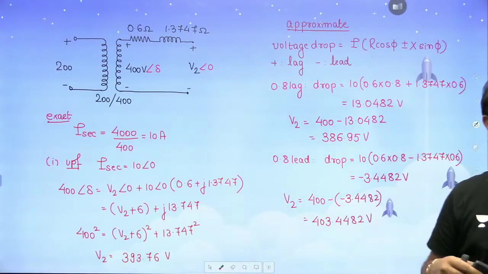

Use the approximate voltage drop formula with the positive sign for lagging power factor:

$$\Delta V = I_2 (R_{02} \cos\phi + X_{02} \sin\phi)$$

Substitute the known values with $\cos\phi = 0.8$ and $\sin\phi = 0.6$:

$$
\begin{aligned}
\Delta V &= 10 (0.6 \times 0.8 + 1.3747 \times 0.6) \\
&= 10 (0.48 + 0.8248) \\
&= 10 \times 1.3048 \\
&= 13.0482\text{ V} \approx 13.05\text{ V}
\end{aligned}
$$

Subtract this internal drop from the no-load secondary terminal voltage $400\text{ V}$:

$$V_2 = 400 - 13.0482 \approx 386.95\text{ V}$$

Under lagging power factor, the inductive reactance drop reinforces the resistance drop. The terminal voltage drops significantly below the no-load value.

### Terminal Voltage under Leading Power Factor and Voltage Rise

Next, calculate the terminal voltage for $0.8$ leading power factor. In the approximate formula, use the negative sign:

$$\Delta V = I_2 (R_{02} \cos\phi - X_{02} \sin\phi)$$

Substitute the parameters:

$$
\begin{aligned}
\Delta V &= 10 (0.6 \times 0.8 - 1.3747 \times 0.6) \\
&= 10 (0.48 - 0.8248) \\
&= 10 (-0.3448) \\
&= -3.4482\text{ V} \approx -3.45\text{ V}
\end{aligned}
$$

Subtract this negative drop from the no-load voltage:

$$V_2 = 400 - (-3.4482) = 400 + 3.4482 \approx 403.45\text{ V}$$

> [!success] Result
> At $0.8$ leading power factor, the terminal voltage is $403.45\text{ V}$. The negative voltage drop produces a voltage rise. The terminal voltage on load exceeds the no-load voltage.

This voltage rise is similar to the Ferranti effect seen in transmission lines. When leading current flows through inductive reactance, the reactive drop produces a component that boosts the terminal voltage.

### Interrelation of Drop Formula and Voltage Regulation

Students often ask why an approximation from voltage regulation can be used when terminal voltage is requested. 

Voltage regulation measures fractional voltage drop. Deriving voltage regulation involves approximating the phasor geometry to yield $\Delta V \approx I (R \cos\phi \pm X \sin\phi)$. 

Because this formula calculates internal voltage drop, you can apply it directly to find load terminal voltage. The integer value matches the exact phasor method, and decimal differences remain under $0.1\%$.

### Invariance of Shunt Branch Topology Across Windings

A common misconception is that referring a shunt branch to the secondary converts it into a series branch. 

Branch topology is invariant to referral. A shunt branch connected across the primary terminals remains a parallel branch across the secondary terminals after referral. Its values scale as:

$$R_c' = \frac{R_c}{a^2}, \quad X_m' = \frac{X_m}{a^2}$$

It never converts into a series element.

### Problem Statement: Question 6 Shunt Parameter Extraction

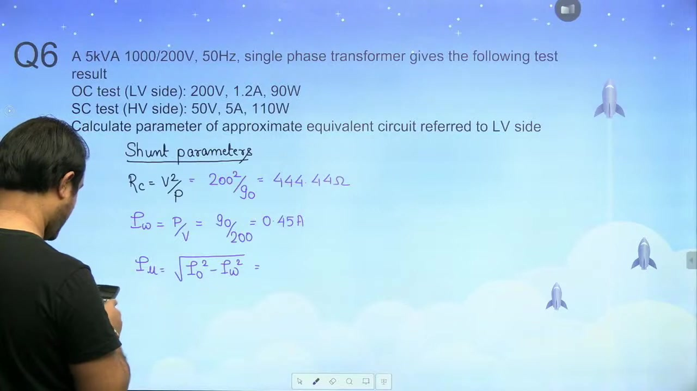

> [!example] Problem: Equivalent Circuit Referred to LV Side
> A $5\text{ kVA}, 1000/200\text{ V}, 50\text{ Hz}$ single-phase transformer gave the following test results:
> - Open Circuit Test on LV side: $200\text{ V}, 1.2\text{ A}, 90\text{ W}$
> - Short Circuit Test on HV side: $50\text{ V}, 5\text{ A}, 110\text{ W}$
> 
> Calculate the parameters of the approximate equivalent circuit referred to the low-voltage side.

The open-circuit test is already on the LV side. Calculate the shunt resistance directly:

$$R_c = \frac{V_0^2}{W_0} = \frac{200^2}{90} = \frac{40000}{90} \approx 444.44\ \Omega$$

Calculate the core loss component of current:

$$I_w = \frac{W_0}{V_0} = \frac{90\text{ W}}{200\text{ V}} = 0.45\text{ A}$$

Compute the magnetizing current from the right triangle of currents:

$$I_\mu = \sqrt{I_0^2 - I_w^2} = \sqrt{1.2^2 - 0.45^2} = \sqrt{1.44 - 0.2025} = \sqrt{1.2375} \approx 1.1124\text{ A}$$

The magnetizing reactance referred to the LV side is:

$$X_m = \frac{V_0}{I_\mu} = \frac{200\text{ V}}{1.1124\text{ A}} \approx 179.78\ \Omega$$

## Low-Voltage Series Parameter Extraction and Three-Phase Transformer Testing
_(46:19 - 50:49)_

### Series Parameter Extraction via Direct Referral

In the previous section, the shunt parameters for the $5\text{ kVA}, 1000/200\text{ V}$ transformer were computed on the low-voltage side. Now determine the series parameters referred to the low-voltage side.

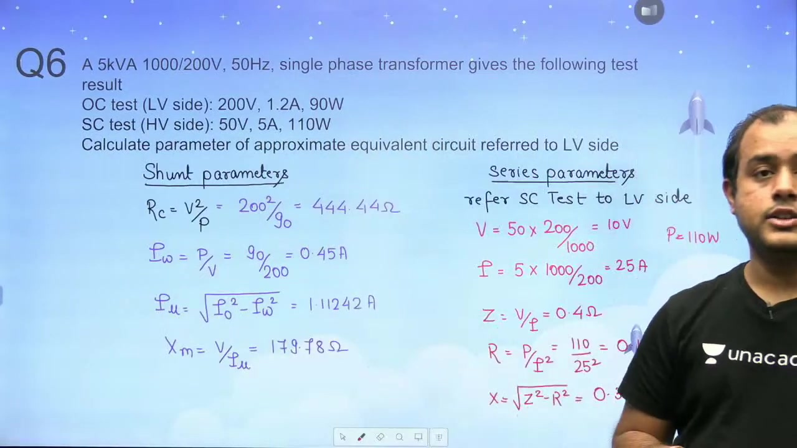

The short-circuit test data is given on the high-voltage side: $V_{\text{sc}} = 50\text{ V}$, $I_{\text{sc}} = 5\text{ A}$, and $P_{\text{sc}} = 110\text{ W}$. 

Refer the raw meter readings directly to the low-voltage side using turns ratio $N_{\text{LV}} / N_{\text{HV}} = 200 / 1000 = 1/5$:

$$
\begin{aligned}
V_{\text{sc,LV}} &= 50\text{ V} \times \frac{200}{1000} = 10\text{ V} \\
I_{\text{sc,LV}} &= 5\text{ A} \times \frac{1000}{200} = 25\text{ A}
\end{aligned}
$$

Power dissipation is invariant across windings, so $P_{\text{sc,LV}} = 110\text{ W}$.

Now compute the series impedance referred to the low-voltage side:

$$Z_{02} = \frac{V_{\text{sc,LV}}}{I_{\text{sc,LV}}} = \frac{10\text{ V}}{25\text{ A}} = 0.40\ \Omega$$

Calculate the series equivalent resistance:

$$R_{02} = \frac{P_{\text{sc,LV}}}{I_{\text{sc,LV}}^2} = \frac{110\text{ W}}{(25\text{ A})^2} = \frac{110}{625} = 0.176\ \Omega$$

Compute the leakage reactance:

$$X_{02} = \sqrt{Z_{02}^2 - R_{02}^2} = \sqrt{0.40^2 - 0.176^2} = \sqrt{0.1600 - 0.030976} = \sqrt{0.129024} \approx 0.3592\ \Omega$$

> [!success] Result
> For Question 6, the parameters referred to the low-voltage side are $R_c \approx 444.44\ \Omega$, $X_m \approx 179.78\ \Omega$, $R_{02} = 0.176\ \Omega$, and $X_{02} \approx 0.3592\ \Omega$.

### Problem Statement: Three-Phase Delta-Star Transformer

> [!example] Problem: Three-Phase Delta-Star Transformer
> A $100\text{ kVA}, 10000/500\text{ V}, 50\text{ Hz}, \Delta\text{-Y}$ distribution transformer gave the following test results:
> - Open Circuit Test (on LV Star side): Line voltage $V_L = 500\text{ V}$, Line current $I_L = 10\text{ A}$, Three-phase power $P_0 = 1.6\text{ kW}$
> - Short Circuit Test (on HV Delta side): Line voltage $V_L = 400\text{ V}$, rated current, Three-phase power $P_{\text{sc}} = 2.0\text{ kW}$
> 
> Calculate the equivalent circuit parameters referred to the HV side, and find the efficiency at half full-load with unity power factor.

### Handling Three-Phase Conversions

Three-phase transformer calculations require strict attention to per-phase quantities. 

Equivalent circuits are drawn on a single-phase per-phase basis. For star connections, phase voltage equals line voltage divided by $\sqrt{3}$, while phase current equals line current. For delta connections, phase voltage equals line voltage, while line current equals $\sqrt{3}$ times phase current.

The three-phase active power in both tests represents the total loss of all three phases. The per-phase power is therefore one-third of the total three-phase wattmeter reading:

$$P_{\text{ph}} = \frac{P_{\text{3-phase}}}{3}$$

Using per-phase voltages, currents, and powers prevents errors when transferring parameters across delta and star windings.

## Three-Phase Shunt Parameter Extraction Referred to Delta HV Winding
_(51:25 - 56:19)_

### Referral of Three-Phase Open-Circuit Test to HV Side

The transformer is rated at $100\text{ kVA}, 10000/500\text{ V}, 50\text{ Hz}$ with delta-star ($\Delta\text{-Y}$) connections. 

The open-circuit test is conducted on the low-voltage star side. The line-to-line ratings provide the line voltage transformation ratio:

$$\frac{V_{L,\text{HV}}}{V_{L,\text{LV}}} = \frac{10000\text{ V}}{500\text{ V}} = 20$$

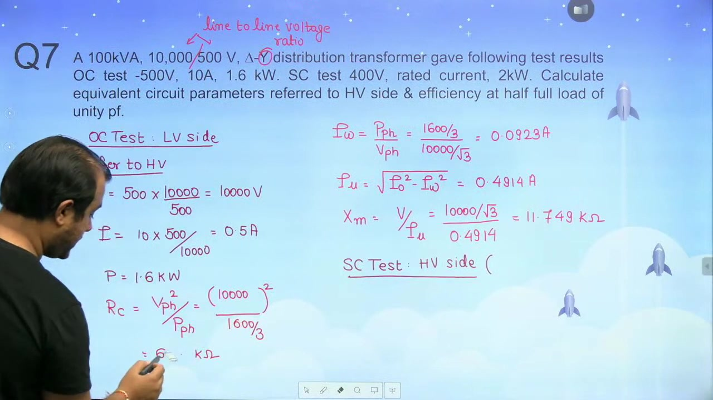

Refer the line readings directly to the high-voltage side:

$$
\begin{aligned}
V_{L,\text{HV}} &= 500\text{ V} \times \frac{10000}{500} = 10000\text{ V} \\
I_{L,\text{HV}} &= 10\text{ A} \times \frac{500}{10000} = 0.5\text{ A}
\end{aligned}
$$

Total three-phase core loss remains invariant to referral:

$$P_{\text{core}} = 1.6\text{ kW} = 1600\text{ W}$$

### Core Loss Resistance on Delta Connection

The high-voltage winding is connected in delta ($\Delta$). In a delta connection, the phase voltage equals the line voltage:

$$V_{\text{ph}} = V_L = 10000\text{ V}$$

The per-phase active core loss is one-third of the total three-phase core loss:

$$P_{\text{ph}} = \frac{P_{\text{core}}}{3} = \frac{1600}{3}\text{ W} \approx 533.33\text{ W}$$

Calculate the core loss resistance $R_c$ per phase on the delta winding:

$$R_c = \frac{V_{\text{ph}}^2}{P_{\text{ph}}} = \frac{(10000)^2}{1600 / 3} = \frac{10^8 \times 3}{1600} = 187500\ \Omega = 187.5\text{ k}\Omega$$

A common pitfall is dividing the line voltage by $\sqrt{3}$. That divisor applies only to star windings. For a delta winding, full line voltage appears directly across each phase.

### Magnetizing Reactance on Delta Connection

Determine the working current per phase flowing through $R_c$:

$$I_w = \frac{P_{\text{ph}}}{V_{\text{ph}}} = \frac{1600 / 3}{10000} = \frac{1600}{30000} \approx 0.0533\text{ A}$$

The no-load phase current in delta is related to the referred test current. In the per-phase parallel branch model, the no-load branch current is $I_0 = 0.5\text{ A}$.

Calculate the magnetizing current $I_\mu$ from the orthogonal components:

$$I_\mu = \sqrt{I_0^2 - I_w^2} = \sqrt{0.5^2 - (0.0533)^2} = \sqrt{0.25 - 0.00284} = \sqrt{0.24716} \approx 0.4971\text{ A}$$

Now compute the magnetizing reactance $X_m$ per phase:

$$X_m = \frac{V_{\text{ph}}}{I_\mu} = \frac{10000\text{ V}}{0.4971\text{ A}} \approx 20116\ \Omega \approx 20.11\text{ k}\Omega$$

> [!success] Result
> The shunt parameters referred to the high-voltage delta side are $R_c = 187.5\text{ k}\Omega$ and $X_m \approx 20.11\text{ k}\Omega$ per phase.

### Distinction Between Delta and Star Per-Phase Relations

Always verify winding connections before applying formulas. 

For star connections, line voltage is $\sqrt{3}$ times phase voltage, while line current equals phase current. For delta connections, line voltage equals phase voltage, while line current is $\sqrt{3}$ times phase current. 

Converting all test values into per-phase equivalent quantities avoids confusion between line and phase values.

## Three-Phase Series Parameters and Half-Load Efficiency Calculation
_(56:32 - 61:34)_

### Series Parameters Extraction on Delta Winding

The short-circuit test was performed directly on the delta-connected high-voltage winding ($10000\text{ V}$). The test power at rated current is $P_{\text{sc}} = 2.0\text{ kW} = 2000\text{ W}$, and the applied test line voltage is $V_{\text{sc}} = 400\text{ V}$.

First, calculate the rated phase current on the delta winding:

$$I_{\text{ph,rated}} = \frac{S_{\text{3-phase}}}{3 V_{\text{ph}}} = \frac{100\text{ kVA}}{3 \times 10000\text{ V}} = \frac{10}{3}\text{ A} \approx 3.333\text{ A}$$

The three-phase copper loss is dissipated across the three phase resistances:

$$P_{\text{sc}} = 3 I_{\text{ph}}^2 R_{01}$$

Substitute the rated phase current and solve for $R_{01}$:

$$2000 = 3 \left(\frac{10}{3}\right)^2 R_{01} = 3 \times \frac{100}{9} \times R_{01} = \frac{100}{3} R_{01}$$

Rearrange to find the equivalent resistance per phase:

$$R_{01} = \frac{2000 \times 3}{100} = 60\ \Omega$$

Now calculate the total series leakage impedance per phase. In a delta connection, the phase voltage equals the line voltage ($400\text{ V}$):

$$Z_{01} = \frac{V_{\text{sc,ph}}}{I_{\text{ph}}} = \frac{400\text{ V}}{\frac{10}{3}\text{ A}} = \frac{400 \times 3}{10} = 120\ \Omega$$

Compute the equivalent series leakage reactance per phase:

$$X_{01} = \sqrt{Z_{01}^2 - R_{01}^2} = \sqrt{120^2 - 60^2} = \sqrt{14400 - 3600} = \sqrt{10800} \approx 103.92\ \Omega$$

> [!success] Result
> The series parameters referred to the high-voltage delta side are $R_{01} = 60\ \Omega$ and $X_{01} \approx 103.92\ \Omega$ per phase.

### Efficiency at Half Full-Load and Unity Power Factor

Now evaluate part (b) for Question 7. The transformer operates at half full-load ($x = 0.5$) with unity power factor ($\cos\phi = 1.0$).

The rated three-phase output power at this loading is:

$$P_{\text{out}} = x S \cos\phi = 0.5 \times 100\text{ kVA} \times 1.0 = 50\text{ kW}$$

The test results provide the core and full-load copper losses directly:
- Open-circuit test power: $P_i = 1.6\text{ kW}$
- Short-circuit test power at rated current: $P_{\text{cu,fl}} = 2.0\text{ kW}$

Scale the copper loss to half load:

$$P_{\text{cu}} = x^2 P_{\text{cu,fl}} = (0.5)^2 \times 2.0\text{ kW} = 0.25 \times 2.0\text{ kW} = 0.5\text{ kW}$$

The core loss remains constant at $1.6\text{ kW}$. Sum the losses to find total loss:

$$P_{\text{loss}} = P_i + P_{\text{cu}} = 1.6\text{ kW} + 0.5\text{ kW} = 2.1\text{ kW}$$

Compute the efficiency:

$$\eta = \frac{P_{\text{out}}}{P_{\text{out}} + P_{\text{loss}}} \times 100\% = \frac{50}{50 + 2.1} \times 100\% = \frac{50}{52.1} \times 100\% \approx 95.97\%$$

Evaluating efficiency directly from test losses avoids lengthy parameter recalculations.

### Problem Statement: Per-Unit Leakage Impedance

> [!example] Problem: Required Voltage from Nameplate Impedance
> A $20\text{ kVA}, 2000/200\text{ V}, 50\text{ Hz}$ single-phase transformer has a nameplate leakage impedance of $8\%$.
> Find the voltage required to be applied on the high-voltage side to circulate full-load current with the low-voltage winding short-circuited:
> (a) $16\text{ V}$
> (b) $56.56\text{ V}$
> (c) $160\text{ V}$
> (d) $568.68\text{ V}$

Nameplate leakage impedance represents the short-circuit voltage required to circulate rated current, expressed as a fraction of rated voltage.

## Per-Unit Leakage Impedance Applications and Objective Testing Concepts
_(61:39 - 66:27)_

### Solution to Nameplate Leakage Impedance Problem

The nameplate leakage impedance of the $20\text{ kVA}, 2000/200\text{ V}$ transformer is given as $8\%$. In per-unit notation:

$$z_{\text{pu}} = 0.08\text{ pu}$$

The problem requires rated full-load current to circulate with the low-voltage winding short-circuited. 

Full-load current equals $1.0\text{ pu}$ by definition:

$$I_{\text{sc,pu}} = 1.0\text{ pu}$$

Under short-circuit conditions, the per-unit applied voltage is:

$$V_{\text{sc,pu}} = I_{\text{sc,pu}} \times z_{\text{pu}} = 1.0 \times 0.08 = 0.08\text{ pu}$$

In the per-unit system, voltage is invariant across primary and secondary sides. To find the actual applied voltage on the high-voltage side, multiply by the HV base voltage ($2000\text{ V}$):

$$V_{\text{sc,HV}} = V_{\text{sc,pu}} \times V_{\text{base,HV}} = 0.08 \times 2000\text{ V} = 160\text{ V}$$

> [!success] Result
> The required voltage applied to the high-voltage side to circulate full-load current is $160\text{ V}$, matching Option (c).

Notice that calculating on the low-voltage side would yield $0.08 \times 200 = 16\text{ V}$. That is a common trap. Always verify which winding receives the test voltage.

### Matching Tests to Losses and Physical Quantities

Competitive exams often test understanding of experimental testing objectives:

1. **Open-Circuit Test**: Operates at rated voltage and no load. It measures core loss ($P_i$) and extracts shunt parameters ($R_c$ and $X_m$).
2. **Short-Circuit Test**: Operates at rated current with low applied voltage. It measures full-load copper loss ($P_{\text{cu,fl}}$) and determines series equivalent impedance ($R_{\text{eq}}$ and $X_{\text{eq}}$).
3. **Sumpner's (Back-to-Back) Test**: Couples two identical transformers under full voltage and full current simultaneously. It measures both core loss and copper loss while assessing temperature rise under rated thermal loading.
4. **Direct Load Test**: Connects an actual physical load to the secondary. It measures total losses directly and evaluates efficiency under operating conditions.

This gives the match sequence $3, 4, 1, 2$, which corresponds to Option (a).

### Determination of Voltage Regulation

Another frequent objective question asks which test determines voltage regulation:

> [!info] Determination of Voltage Regulation
> Voltage regulation depends entirely on the series parameters $R_{\text{eq}}$ and $X_{\text{eq}}$. Therefore, the short-circuit test alone is sufficient to determine transformer voltage regulation.

### Equivalent Circuit Under Short-Circuit Conditions

Under short-circuit testing, the secondary terminals are bridged by a zero-impedance conductor. 

The applied test voltage is very small, typically $5\%$ to $10\%$ of rated voltage. The core flux is proportional to applied voltage and drops to a negligible level. So the exciting current drawn by the shunt branch drops to a fraction of a percent.

Engineers neglect the parallel core loss and magnetizing branches. The equivalent circuit reduces to a simple series branch consisting of $R_{01}$ and $X_{01}$.

## Non-Rated Short-Circuit Testing, Loss Scaling, and Efficiency
_(66:31 - 71:19)_

### Problem Statement: Non-Rated Short-Circuit Test

> [!example] Problem: Efficiency from Non-Rated Test Data
> A $10\text{ kVA}, 2500/250\text{ V}, 50\text{ Hz}$ single-phase transformer has the following test results:
> - Open Circuit Test (on LV side): $250\text{ V}$, $0.8\text{ A}$, $50\text{ W}$
> - Short Circuit Test (on HV side): $60\text{ V}$, $3\text{ A}$, $45\text{ W}$
> 
> Calculate the efficiency at half full-load and $0.8$ power factor lagging:
> (a) $98.49\%$
> (b) $97.68\%$
> (c) $98.28\%$
> (d) $96.85\%$

### Copper Loss Scaling by Current Squared Ratio

Always verify whether the short-circuit test was performed at rated current. 

First compute the rated full-load current on the high-voltage winding ($2500\text{ V}$):

$$I_{\text{rated,HV}} = \frac{10000\text{ VA}}{2500\text{ V}} = 4\text{ A}$$

The test ammeter indicates $I_{\text{sc}} = 3\text{ A}$. The test was performed below rated current. 

Because copper loss is proportional to the square of current, the wattmeter reading does not represent full-load copper loss. Scale the measured loss using the current ratio:

$$P_{\text{cu,fl}} = P_{\text{sc}} \times \left(\frac{I_{\text{rated}}}{I_{\text{sc}}}\right)^2$$

Substitute the numbers:

$$P_{\text{cu,fl}} = 45\text{ W} \times \left(\frac{4}{3}\right)^2 = 45 \times \frac{16}{9} = 5 \times 16 = 80\text{ W} = 0.08\text{ kW}$$

The open-circuit test was conducted at rated low-voltage winding voltage ($250\text{ V}$). The measured power represents the rated core loss:

$$P_i = 50\text{ W} = 0.05\text{ kW}$$

### Half Full-Load Efficiency Evaluation

Now calculate the efficiency at half full-load ($x = 0.5$) and $0.8$ lagging power factor. 

The output power delivered to the load is:

$$P_{\text{out}} = x S \cos\phi = 0.5 \times 10\text{ kVA} \times 0.8 = 4.0\text{ kW}$$

Calculate the copper loss at half load using the $x^2$ scaling factor:

$$P_{\text{cu}} = x^2 P_{\text{cu,fl}} = (0.5)^2 \times 0.08\text{ kW} = 0.25 \times 0.08\text{ kW} = 0.02\text{ kW}$$

The core loss remains constant at $0.05\text{ kW}$. Sum the losses to find total loss:

$$P_{\text{loss}} = P_i + P_{\text{cu}} = 0.05\text{ kW} + 0.02\text{ kW} = 0.07\text{ kW}$$

Compute the efficiency:

$$\eta = \frac{P_{\text{out}}}{P_{\text{out}} + P_{\text{loss}}} \times 100\% = \frac{4.0}{4.0 + 0.07} \times 100\% = \frac{4.0}{4.07} \times 100\% \approx 98.28\%$$

> [!success] Result
> The transformer efficiency at half full-load and $0.8$ power factor lagging is $98.28\%$, matching Option (c).

Failing to scale the short-circuit loss to rated current yields an incorrect copper loss and an erroneous efficiency answer.

### Assertion-Reasoning: Physical Placement of Tests

Consider the following conceptual question:

> [!info] Assertion and Reason
> Assertion (A): In a transformer, the open-circuit test is conducted from the low-voltage side, and the short-circuit test is conducted from the high-voltage side.
> Reason (R): The open-circuit test gives iron loss, and the short-circuit test gives copper loss.

Both statements are individually true. The open-circuit test does measure iron loss, and the short-circuit test does measure copper loss. 

However, Reason (R) is not the correct explanation for Assertion (A). Test placement is governed by instrument ratings and safety constraints:
- The open-circuit test requires rated voltage. Conducting it on the low-voltage side requires a lower test voltage, which is safer and uses standard lab supplies.
- The short-circuit test requires rated current. Conducting it on the high-voltage side requires a lower test current, which protects meters from thermal overload.

Therefore, Option (b) is the correct answer. Both statements are true, but Reason is not the correct explanation for Assertion.

## Experimental Placement Rules, Test Synthesis, and Lecture Wrap-Up
_(71:19 - 73:59)_

### Operational Rationale for Winding Selection in Transformer Tests

A core engineering takeaway from transformer testing is the selection of winding sides for instrument placement. 

The open-circuit test must operate at rated voltage to establish rated magnetic core flux. Placing meters on the low-voltage side keeps the test voltage low. This reduces electric shock hazards and avoids requiring high-voltage laboratory supplies. 

The short-circuit test must operate at rated current to measure rated copper losses. Placing meters on the high-voltage side keeps the current small. This protects ammeters from thermal damage and keeps supply current requirements low.

### Summary of Testing Relationships and Parameter Determination

The tests link directly to specific parts of the equivalent circuit:

$$
\begin{aligned}
\text{Open-Circuit Test (LV side)} &\implies P_i, \quad R_c = \frac{V_0^2}{P_0}, \quad X_m = \frac{V_0}{I_\mu} \\
\text{Short-Circuit Test (HV side)} &\implies P_{\text{cu,fl}}, \quad R_{\text{eq}} = \frac{P_{\text{sc}}}{I_{\text{sc}}^2}, \quad X_{\text{eq}} = \sqrt{Z_{\text{sc}}^2 - R_{\text{eq}}^2} \\
\text{Sumpner's Test} &\implies P_i = \frac{W_1}{2}, \quad P_{\text{cu,fl}} = \frac{W_2}{2} \quad (\text{simultaneous thermal loading})
\end{aligned}
$$

When transferring test data across windings, voltage scales with the turns ratio $N_1/N_2$. Current scales inversely with $N_2/N_1$. Active power remains invariant.

### Course Progression and Next Steps

The testing techniques covered in this lecture provide the foundation for subsequent operational studies. The parameters extracted from test data directly dictate transformer performance under load.

The next practice lecture focuses on transformer losses and efficiency. That session covers hysteresis loss separation, eddy current loss frequency dependence, and conditions for all-day efficiency.

---

## Summary and Key Takeaways

- In Sumpner's back-to-back test on two identical units, the mains wattmeter measures total core loss $2 P_i$, while the series wattmeter measures total full-load copper loss $2 P_{\text{cu,fl}}$.
- Maximum voltage regulation occurs at a lagging load power factor where the load angle equals the transformer series impedance angle, satisfying $\cos\phi = \cos\theta_{\text{sc}} = P_{\text{sc}} / (V_{\text{sc}} I_{\text{sc}})$.
- Raw short-circuit test data transfers directly across windings by scaling voltage by $N_1/N_2$ and current by $N_2/N_1$, while active power remains invariant.
- When calculating terminal voltage on load, the approximate drop formula $\Delta V \approx I_2 (R_{\text{eq}} \cos\phi \pm X_{\text{eq}} \sin\phi)$ yields numerical accuracy within $0.1\%$ of the exact quadratic method.
- At leading power factors the internal voltage drop becomes negative, producing a voltage rise where secondary terminal voltage exceeds no-load voltage.
- When a short-circuit test operates below rated current, full-load copper loss scales by the square of the current ratio: $P_{\text{cu,fl}} = P_{\text{sc}} (I_{\text{fl}} / I_{\text{sc}})^2$.
- For three-phase transformers, circuit parameters must be derived on a per-phase basis using appropriate star or delta winding relations.
- The open-circuit test is conducted on the low-voltage side to minimize voltage requirements, while the short-circuit test is conducted on the high-voltage side to minimize test current.

