# Electrical Machines | Lec 17 | Losses & Efficiency (Part 1) | GATE Electrical Engineering

- **Source**: https://www.youtube.com/watch?v=qv9uu6GFCP4
- **Duration**: 01:02:06
- **Compiled**: 2026-09-20

---

## Overview

This lecture establishes the physical origin and mathematical formulation of core losses in electrical transformers. It analyzes hysteresis loss by tracking dipole friction and evaluating net magnetic energy over the closed $B\text{-}H$ magnetization loop. The discussion then derives eddy current loss from Maxwell-Faraday electrodynamics within laminated magnetic sheets. Finally, it develops voltage and frequency scaling laws and details the method to separate both losses experimentally.

## Contents

- [[#Introduction to Transformer Losses and Hysteresis Phenomenon|Introduction to Transformer Losses and Hysteresis Phenomenon]]
- [[#Dipole Reversal Mechanism and Domain Friction in Hysteresis|Dipole Reversal Mechanism and Domain Friction in Hysteresis]]
- [[#Derivation of Magnetic Energy Density and Instantaneous Power|Derivation of Magnetic Energy Density and Instantaneous Power]]
- [[#Evaluation of Energy Absorption and Delivery Along the Magnetization Curve|Evaluation of Energy Absorption and Delivery Along the Magnetization Curve]]
- [[#Four-Quadrant Traversal and Net Energy of Hysteresis Loop|Four-Quadrant Traversal and Net Energy of Hysteresis Loop]]
- [[#Hysteresis Power Loss, Steinmetz Formula, and Introduction to Eddy Currents|Hysteresis Power Loss, Steinmetz Formula, and Introduction to Eddy Currents]]
- [[#Electrodynamic Modeling of Eddy Currents in a Core Lamination|Electrodynamic Modeling of Eddy Currents in a Core Lamination]]
- [[#Mathematical Derivation of Average Eddy Current Loss|Mathematical Derivation of Average Eddy Current Loss]]
- [[#Voltage and Frequency Scaling of Eddy Loss and Experimental Separation of Core Losses|Voltage and Frequency Scaling of Eddy Loss and Experimental Separation of Core Losses]]

---

## Introduction to Transformer Losses and Hysteresis Phenomenon
_(00:34 - 07:16)_

Every electrical machine has internal power losses. These losses affect the machine efficiency. Efficiency is the fraction of input power delivered to the load. In a transformer, losses fall into two main groups: core loss and copper loss.

### Classification of Losses

The core of a transformer consists of silicon steel or iron. Because of this material, core loss is also called iron loss. Core loss has two separate parts:
1. Hysteresis loss
2. Eddy current loss

### Origin of Hysteresis in Ferromagnetic Cores

Transformer cores are made of ferromagnetic materials. These materials show a characteristic $B\text{-}H$ magnetization curve. 

When you apply a magnetic field intensity $H$, magnetic flux density $B$ increases along a virgin curve until saturation. When $H$ decreases back to zero, flux density does not return to zero. A residual magnetic flux density $B_r$ remains in the material. To bring the flux density back to zero, you must apply a reverse magnetic field. This field is the coercive magnetic field intensity $H_c$.

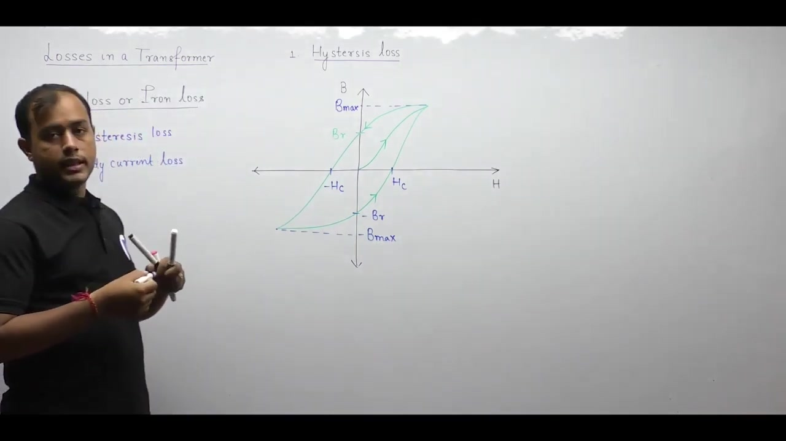

> [!info] Definition
> In ferromagnetic materials, the path of magnetization does not match the path of demagnetization. The energy lost due to this non-identical path is called hysteresis loss.

### Physical Mechanism of Hysteresis Loss

Ferromagnetic materials contain tiny magnetic dipoles grouped in magnetic domains. When an external magnetic field is applied, these dipoles rotate and align parallel to the field.

In a transformer, alternating current produces an alternating magnetic field. This field reverses direction every half-cycle. Therefore, the magnetic dipoles must rotate by $180^\circ$ every half-cycle. Neighboring dipoles exert magnetic forces that oppose this rotation. To overcome this opposition, the electrical supply must do work. This work turns into heat, which is the hysteresis loss.

## Dipole Reversal Mechanism and Domain Friction in Hysteresis
_(07:20 - 12:43)_

A magnetic dipole consists of a tiny magnet with a north pole and a south pole. In ferromagnetic materials, dipoles align parallel to the external magnetic field. If the field points to the right, dipoles align to the right. When the field reverses to the left, dipoles rotate and point to the left.

### Dipole Reversal Under Alternating Fields

In a transformer, the primary winding carries alternating current. This current creates a time-varying magnetic field. 

The magnetic field reverses direction every half-cycle. Therefore, all magnetic dipoles inside the core must reverse their orientation every half-cycle. This means the dipoles rotate back and forth continuously.

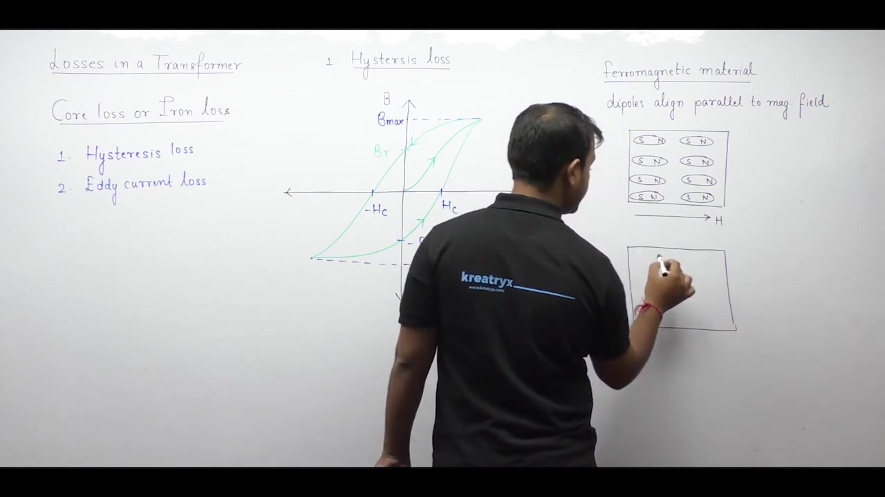

### Origin of Energy Loss During Reversal

Dipoles do not rotate freely. Each dipole experiences magnetic attraction and repulsion from neighboring dipoles. 

For example, when a north pole tries to rotate upward, a neighboring south pole attracts it. This attraction creates an opposing mechanical torque. To rotate the dipole against this opposing torque, energy must be supplied by the external field. 

If dipoles were completely free to rotate, there would be no energy loss. But inter-dipole forces oppose motion, so energy is dissipated as heat.

> [!info] Definition
> Hysteresis loss is the energy dissipated per cycle due to the reversal of magnetic dipoles against inter-dipole opposing forces.

### Effect of Unidirectional Fields

If a constant direct current excites the core, the magnetic field never changes direction. Dipoles align once and remain fixed in that direction. Because no reversal occurs, hysteresis loss under pure DC excitation is zero.

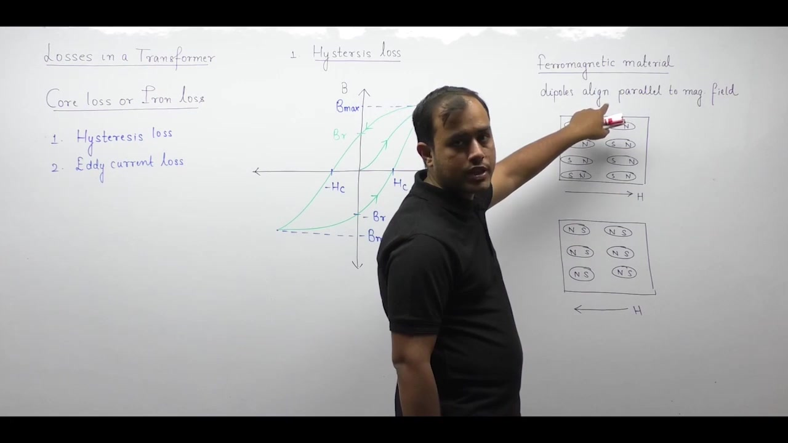

### Key Reference Points on the Hysteresis Loop

To calculate hysteresis loss mathematically, we trace the $B\text{-}H$ loop over one complete cycle. Six key reference points are marked on the loop:
- Point 1: At negative remanence, $-B_r$, on the vertical axis.
- Point 2: At positive peak flux density, $+B_{\max}$, on the upper curve.
- Point 3: Projection of point 2 on the vertical axis at $+B_{\max}$.
- Point 4: At positive remanence, $+B_r$, on the vertical axis.
- Point 5: At negative peak flux density, $-B_{\max}$, on the lower curve.
- Point 6: Projection of point 5 on the vertical axis at $-B_{\max}$.

## Derivation of Magnetic Energy Density and Instantaneous Power
_(12:43 - 18:21)_

To find core energy loss, we start with instantaneous electrical power supplied to the winding. The instantaneous power is:
$$p(t) = v(t) \cdot i(t)$$

### Linking Electrical Variables to Magnetic Field Quantities

According to Faraday's law of induction, induced voltage is related to core flux:
$$v(t) = N \frac{d\phi}{dt}$$

From Ampere's circuital law, the magnetomotive force relates to magnetic field intensity $H$:
$$N \cdot i(t) = H(t) \cdot l$$

Here $l$ is the mean magnetic path length. The magnetic flux relates to flux density $B$ and core cross-sectional area $A$:
$$\phi(t) = B(t) \cdot A$$

Because the core cross-sectional area is constant, the time derivative of flux is:
$$\frac{d\phi}{dt} = A \frac{dB}{dt}$$

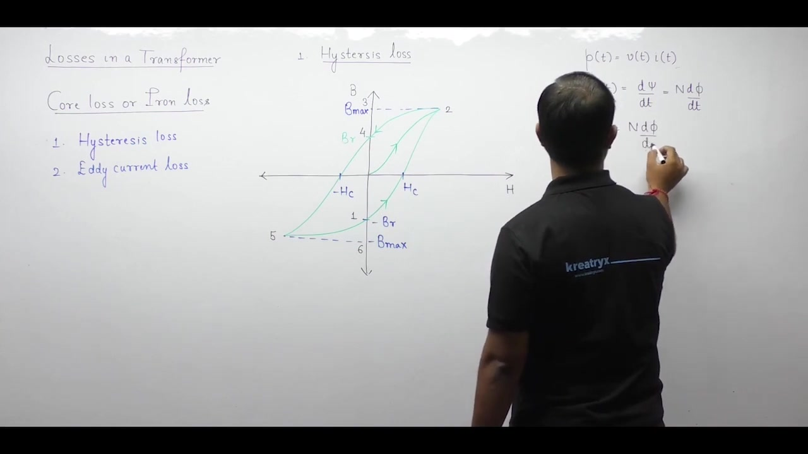

### Core Power and Volume Relation

Now substitute $v(t)$ and $i(t)$ into the power equation:
$$\begin{aligned}
p(t) &= \left(N \frac{d\phi}{dt}\right) i(t) \\
&= [N \cdot i(t)] \frac{d\phi}{dt} \\
&= (H \cdot l) \left(A \frac{dB}{dt}\right) \\
&= (l \cdot A) H \frac{dB}{dt}
\end{aligned}$$

The product of path length $l$ and area $A$ is the volume of the core. So the instantaneous power is:
$$p(t) = \text{Volume} \cdot H \frac{dB}{dt}$$

### Energy Loss per Cycle and Energy Density

Energy is the time integral of power. For one cycle of duration $T$, the energy consumed is:
$$\begin{aligned}
W &= \int_0^T p(t) \, dt \\
&= \text{Volume} \int_0^T H \frac{dB}{dt} \, dt \\
&= \text{Volume} \oint H \, dB
\end{aligned}$$

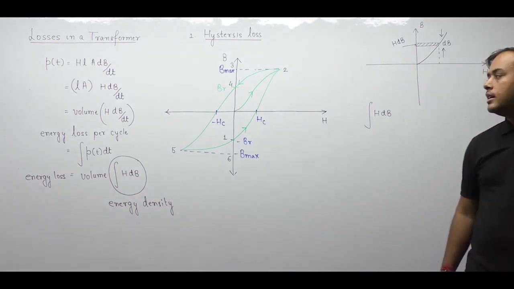

Dividing total energy by core volume gives the energy density $w$:
$$w = \frac{W}{\text{Volume}} = \oint H \, dB$$

> [!success] Result
> The differential quantity $H \, dB$ represents the area of a narrow strip between the magnetization curve and the vertical $B$-axis. The integral $\int H \, dB$ gives the magnetic energy density absorbed by the core material in $\text{J/m}^3$.

## Evaluation of Energy Absorption and Delivery Along the Magnetization Curve
_(18:23 - 23:20)_

Because current and flux density are periodic, we evaluate the energy integral over one full cycle. We begin at reference point 1 and return to point 1 along the closed loop.

### Stage 1: Point 1 to Point 2 (Magnetization)

In this stage, the core moves from point 1 at $-B_r$ to point 2 at $+B_{\max}$. 

The energy per unit volume is:
$$W_1 = \int_{-B_r}^{B_{\max}} H \, dB$$

Along this segment, $H$ is positive because it lies to the right of the vertical axis. Flux density $B$ increases from $-B_r$ to $+B_{\max}$, so $dB$ is positive. 

Because both $H$ and $dB$ are positive, the product $H \, dB$ is positive:
$$W_1 > 0 \quad (\text{Energy Absorbed})$$

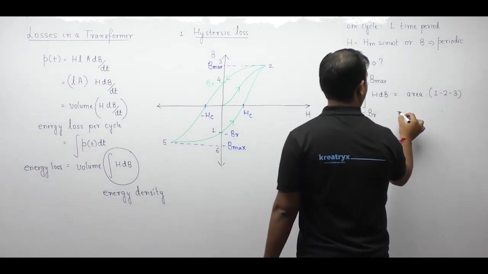

Geometrically, $W_1$ represents the area bounded by the curve and the vertical $B$-axis between $-B_r$ and $+B_{\max}$. This is area $1\text{-}2\text{-}3$.

### Stage 2: Point 2 to Point 4 (Demagnetization)

Next, the field reduces and the core moves from point 2 at $+B_{\max}$ down to point 4 at $+B_r$.

The energy integral is:
$$W_2 = \int_{B_{\max}}^{B_r} H \, dB$$

Along this path, $H$ remains to the right of the vertical axis, so $H$ is still positive. But flux density $B$ decreases from $+B_{\max}$ to $+B_r$. Therefore, the differential change $dB$ is negative.

The product of a positive $H$ and a negative $dB$ gives a negative value:
$$W_2 < 0 \quad (\text{Energy Delivered})$$

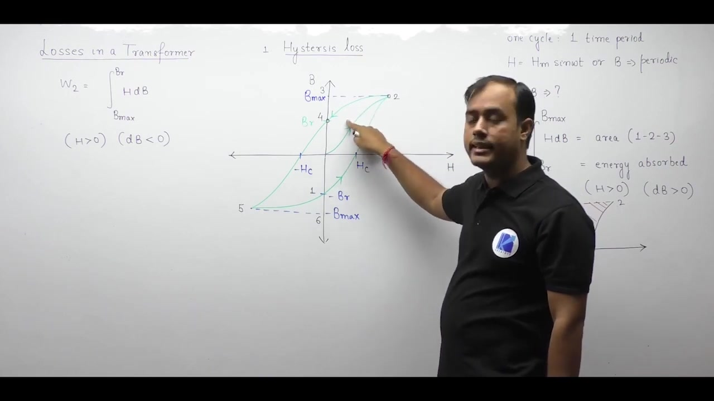

> [!info] Definition
> A positive energy integral means the magnetic material absorbs energy from the electrical supply. A negative integral means the core acts like a storage element and returns energy to the supply.

Geometrically, $W_2$ corresponds to area $2\text{-}3\text{-}4$ between the demagnetization curve and the vertical $B$-axis.

## Four-Quadrant Traversal and Net Energy of Hysteresis Loop
_(23:24 - 28:46)_

We now evaluate the remaining two stages of the alternating cycle to find total net energy.

### Stage 3: Point 4 to Point 5 (Negative Magnetization)

In this stage, the core moves from point 4 at $+B_r$ to point 5 at $-B_{\max}$. 

The energy integral is:
$$W_3 = \int_{B_r}^{-B_{\max}} H \, dB$$

Here the curve lies on the left of the vertical axis, so $H$ is negative. Also, flux density $B$ decreases from $+B_r$ to $-B_{\max}$, so $dB$ is negative. 

Multiplying two negative numbers gives a positive result:
$$W_3 > 0 \quad (\text{Energy Absorbed})$$

Geometrically, $W_3$ corresponds to area $4\text{-}5\text{-}6$ between the curve and the vertical $B$-axis.

### Stage 4: Point 5 to Point 1 (Negative Demagnetization)

In the final stage, the core returns from point 5 at $-B_{\max}$ back to starting point 1 at $-B_r$.

The energy integral is:
$$W_4 = \int_{-B_{\max}}^{-B_r} H \, dB$$

$H$ is still negative because it lies on the left. But flux density $B$ increases from $-B_{\max}$ to $-B_r$, so $dB$ is positive.

A negative $H$ times a positive $dB$ gives a negative result:
$$W_4 < 0 \quad (\text{Energy Delivered})$$

This corresponds to area $5\text{-}6\text{-}1$ between the curve and the vertical $B$-axis.

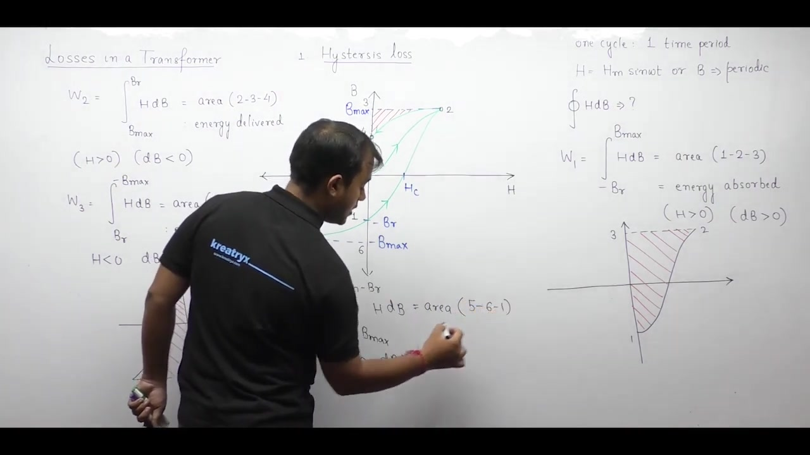

### Net Energy Dissipated per Cycle

During one full cycle, energy is absorbed during stages 1 and 3. Energy is returned to the electrical supply during stages 2 and 4. 

The net energy absorbed per unit volume is:
$$w_{\text{net}} = (W_1 + W_3) - (W_2 + W_4)$$

When we subtract the delivered areas from the absorbed areas, all overlapping external regions cancel out. Only the interior region enclosed by the loop remains.

> [!success] Result
> The net energy dissipated in the core per cycle is:
> $$W_{\text{cycle}} = \text{Volume} \times (\text{Area of } B\text{-}H \text{ loop})$$

## Hysteresis Power Loss, Steinmetz Formula, and Introduction to Eddy Currents
_(28:46 - 38:11)_

Hysteresis power loss is the energy lost per unit time. Dividing energy per cycle by the period $T$ gives the power loss:
$$P_h = \frac{W_{\text{cycle}}}{T} = \text{Volume} \times (\text{Area of } B\text{-}H \text{ loop}) \times f$$

Here $f = 1/T$ is the supply frequency in Hertz.

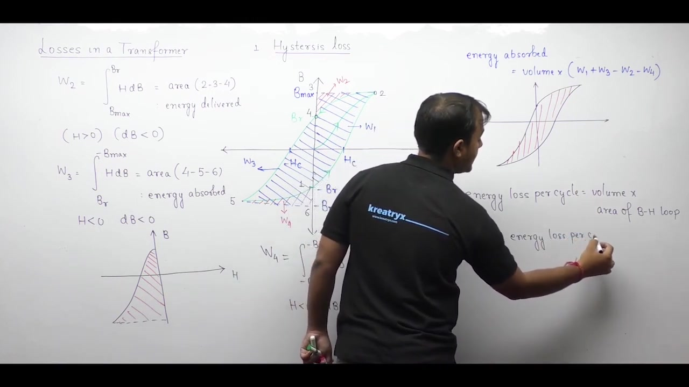

### Steinmetz's Empirical Formula

Calculating the exact area of the $B\text{-}H$ loop graphically is difficult in practical designs. Charles Steinmetz introduced an empirical formula to estimate hysteresis loss:
$$P_h = k_h B_m^x f$$

Here $k_h$ is the hysteresis coefficient. It is proportional to core volume. The exponent $x$ is the Steinmetz coefficient.

Historically, $x$ was taken as 1.6 for standard sheet steel. Under modern IEEE conventions, $x = 2$ is standard. In competitive exams, use $x = 2$ unless another value is given.

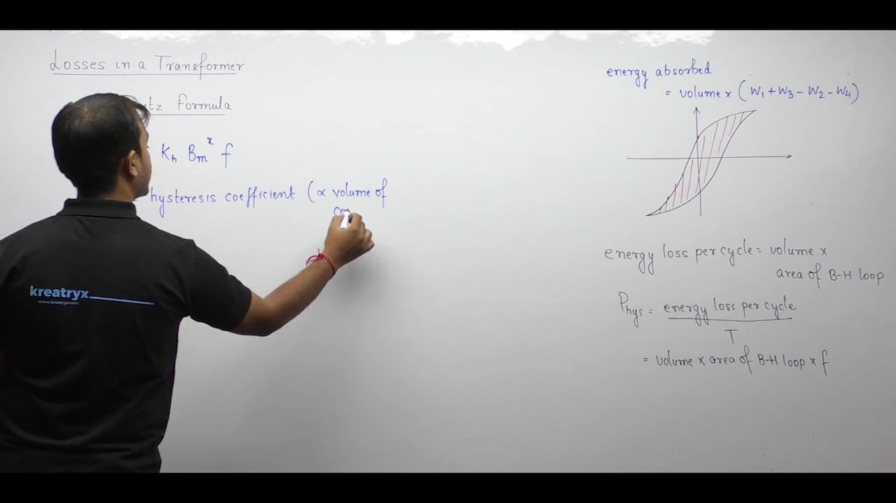

### Voltage and Frequency Dependence

From the transformer EMF equation, terminal voltage relates to peak flux density:
$$V \approx 4.44 f N B_m A \implies B_m \propto \frac{V}{f}$$

Substituting $B_m$ into the Steinmetz equation gives:
$$P_h \propto \left(\frac{V}{f}\right)^x f = V^x f^{1-x}$$

When $x = 2$, this simplifies to:
$$P_h \propto \frac{V^2}{f}$$

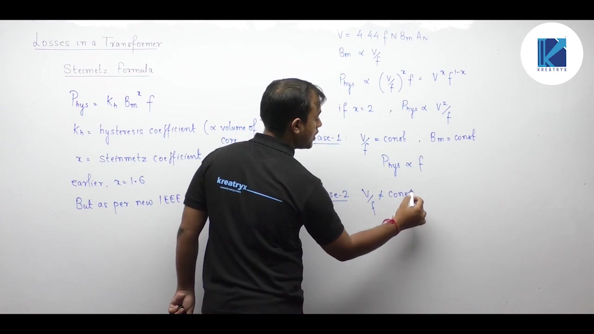

Two operational cases arise:
1. **Case 1 ($\frac{V}{f}$ is constant)**: Peak flux density $B_m$ remains constant. Therefore, hysteresis loss is proportional only to frequency:
   $$P_h \propto f$$
2. **Case 2 ($\frac{V}{f}$ is not constant)**: Peak flux density changes. You must use the full voltage and frequency relation:
   $$P_h \propto V^x f^{1-x}$$

### Introduction to Eddy Current Loss

The second component of core loss is eddy current loss. 

The word "eddy" means a whirlpool that circulates in water. Similarly, eddy currents are closed circulating loops of electrical current. They are induced inside conducting magnetic material when exposed to a time-varying magnetic field.

When alternating current flows through the transformer winding, it sets up an alternating magnetic flux in the core. This flux passes through the entire volume of the core. Because the flux varies with time, it induces local circulating currents inside the conducting core body.

## Electrodynamic Modeling of Eddy Currents in a Core Lamination
_(38:12 - 47:41)_

Magnetic flux flows through the entire volume of the core. When the flux alternates, it links with every cross section of the conducting iron.

### Direction of Eddy Currents from Lenz's Law

By Faraday's law, the alternating flux induces an electromotive force. By Lenz's law, this induced EMF opposes the change in flux.

Suppose the core magnetic field points outward from the cross section. To oppose this field, the induced EMF must produce an inward magnetic field. By the right-hand grip rule, an inward field requires a clockwise current. Therefore, eddy currents circulate in closed clockwise loops inside the core.

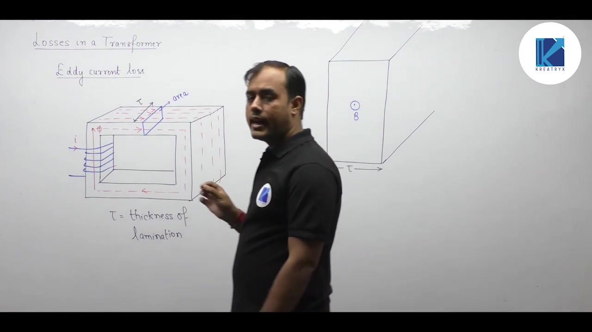

### Geometry of an Elementary Current Loop

To analyze these currents, we consider a single core lamination. Let its dimensions be height $h$, width $w$, and thickness $\tau$.

Inside this sheet, consider a thin rectangular filament at distance $x$ from the central axis. The filament has differential thickness $dx$. Its total width is $2x$ and its height is $h$.

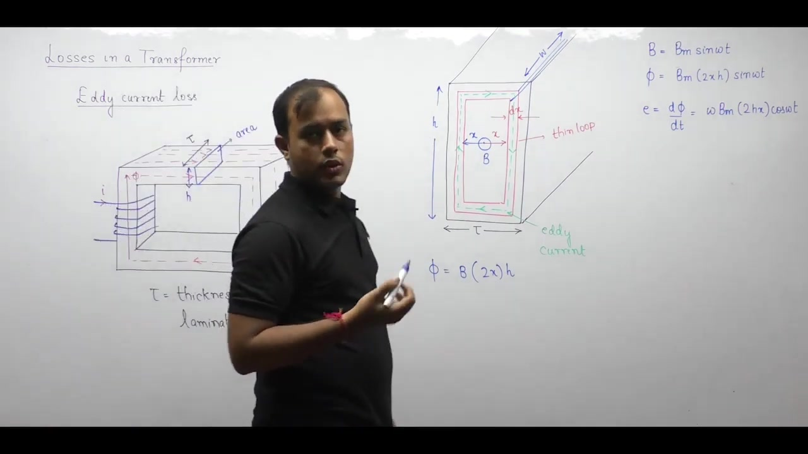

The area enclosed by this filament perpendicular to the magnetic field is:
$$A_{\text{loop}} = 2x \cdot h$$

For a sinusoidal magnetic field $B(t) = B_m \sin(\omega t)$, the enclosed flux is:
$$\phi(t) = B_m (2xh) \sin(\omega t)$$

The induced EMF in this single loop is:
$$e(t) = \frac{d\phi}{dt} = 2xh \omega B_m \cos(\omega t)$$

### Resistance of the Elementary Filament

The resistance of any conductor is $R = \frac{\rho l}{A}$. For this circulating loop, $l$ is the perimeter along the current path:
$$l_{\text{path}} = 2h + 4x$$

In thin laminations, the half-thickness $x$ is much smaller than height $h$ ($x \ll h$). So the path length simplifies to:
$$l_{\text{path}} \approx 2h$$

The cross-sectional area perpendicular to current flow is the strip area:
$$dA = w \, dx$$

Therefore, the resistance of the thin loop is:
$$dR = \frac{\rho \cdot 2h}{w \, dx}$$

Here $\rho$ is the electrical resistivity of the core steel. The instantaneous power dissipated in this filament is:
$$dP_e = \frac{e(t)^2}{dR}$$

## Mathematical Derivation of Average Eddy Current Loss
_(47:43 - 54:27)_

We now integrate the differential power across the thickness of the lamination.

### Spatial Integration Across Lamination Thickness

The power dissipated in the elementary loop of thickness $dx$ is:
$$\begin{aligned}
dP_e &= \frac{e(t)^2}{dR} \\
&= \frac{\omega^2 B_m^2 (4h^2 x^2) \cos^2(\omega t)}{\frac{\rho(2h)}{w \, dx}} \\
&= \frac{2\omega^2 B_m^2 hw}{\rho} x^2 \cos^2(\omega t) \, dx
\end{aligned}$$

To find the total power in one lamination, integrate $x$ from the center $x = 0$ to the outer edge $x = \tau/2$:
$$\begin{aligned}
P_e(t) &= \frac{2\omega^2 B_m^2 hw}{\rho} \cos^2(\omega t) \int_0^{\tau/2} x^2 \, dx \\
&= \frac{2\omega^2 B_m^2 hw}{\rho} \cos^2(\omega t) \left[ \frac{x^3}{3} \right]_0^{\tau/2} \\
&= \frac{2\omega^2 B_m^2 hw}{\rho} \cos^2(\omega t) \left( \frac{\tau^3}{24} \right) \\
&= \frac{\omega^2 B_m^2 \tau^3 hw}{12\rho} \cos^2(\omega t)
\end{aligned}$$

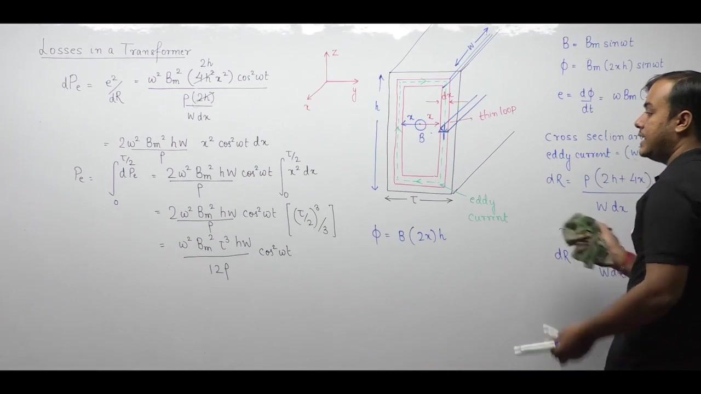

### Time Averaging Over One Cycle

The instantaneous power varies with time through $\cos^2(\omega t)$. We need the average power over one full period:
$$P_{e(\text{avg})} = \frac{1}{2\pi} \int_0^{2\pi} P_e(t) \, d(\omega t)$$

We evaluate the trigonometric integral:
$$\begin{aligned}
\frac{1}{2\pi} \int_0^{2\pi} \cos^2(\omega t) \, d(\omega t) &= \frac{1}{2\pi} \int_0^{2\pi} \frac{1 + \cos(2\omega t)}{2} \, d(\omega t) \\
&= \frac{1}{4\pi} \left[ \omega t + \frac{\sin(2\omega t)}{2} \right]_0^{2\pi} \\
&= \frac{1}{4\pi} (2\pi + 0) \\
&= \frac{1}{2}
\end{aligned}$$

Substituting this average factor of $1/2$ yields:
$$P_{e(\text{avg})} = \frac{\omega^2 B_m^2 \tau^3 hw}{24\rho}$$

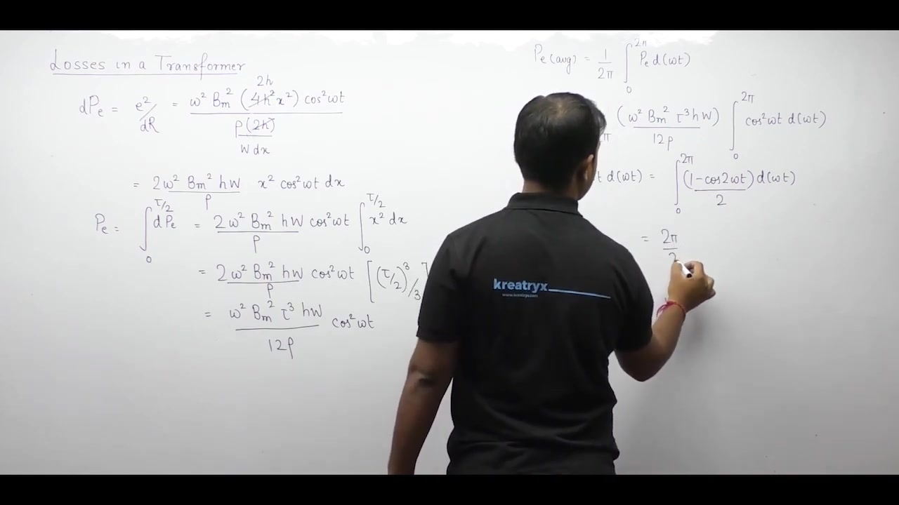

### Core Volume and Frequency Substitution

Now write angular frequency as $\omega = 2\pi f$. Notice that the product of height, width, and thickness is the lamination volume:
$$\text{Volume} = h \cdot w \cdot \tau$$

Substitute these terms into the average power equation:
$$\begin{aligned}
P_e &= \frac{(2\pi f)^2 B_m^2 \tau^2 (\tau hw)}{24\rho} \\
&= \frac{4\pi^2 f^2 B_m^2 \tau^2 \cdot \text{Volume}}{24\rho} \\
&= \frac{\pi^2 f^2 B_m^2 \tau^2}{6\rho} \times \text{Volume}
\end{aligned}$$

> [!success] Result
> The average eddy current loss in a magnetic core is:
> $$P_e = \frac{\pi^2 f^2 B_m^2 \tau^2}{6\rho} \times \text{Volume} = k_e B_m^2 f^2$$
> where $k_e = \frac{\pi^2 \tau^2}{6\rho} \times \text{Volume} \propto \tau^2$.

### Significance of Lamination Thickness

Eddy current loss is directly proportional to $\tau^2$. 

If lamination thickness is halved, eddy current loss drops to one-fourth of its original value. This is why transformer cores are built from thin insulated sheets rather than solid steel blocks.

When the transformer operates with $\frac{V}{f} = \text{constant}$, peak flux density $B_m$ is constant. In that case, eddy current loss depends only on frequency squared:
$$P_e \propto f^2$$

## Voltage and Frequency Scaling of Eddy Loss and Experimental Separation of Core Losses
_(54:29 - 61:59)_

We now examine how eddy current loss scales with voltage and frequency. Then we study how to separate core losses experimentally.

### Scaling of Eddy Current Loss

Peak flux density is proportional to voltage over frequency:
$$B_m \propto \frac{V}{f}$$

Substituting this into $P_e = k_e B_m^2 f^2$ gives:
$$P_e \propto \left(\frac{V}{f}\right)^2 f^2 = V^2$$

Two distinct cases occur:
1. **Case 1 ($\frac{V}{f}$ is constant)**: Peak flux density $B_m$ is constant. In this case, eddy current loss depends only on frequency squared:
   $$P_e \propto f^2$$
2. **Case 2 ($\frac{V}{f}$ is not constant)**: Eddy current loss depends only on the square of terminal voltage:
   $$P_e \propto V^2$$

In Case 2, eddy current loss is completely independent of operating frequency.

### The Need for Separation of Core Losses

The standard open-circuit test measures total core loss $W_0$. But this measurement cannot distinguish between hysteresis loss and eddy current loss. To design cooling systems or analyze variable-frequency operation, engineers must separate these two components.

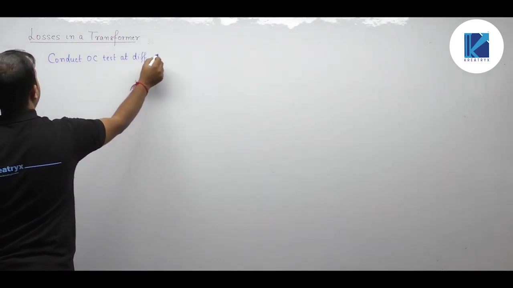

### Experimental Procedure with Constant V/f

To separate the losses, conduct the open-circuit test at several different frequencies while holding the ratio $\frac{V}{f}$ constant.

For example, apply $200\text{ V}$ at $50\text{ Hz}$, $100\text{ V}$ at $25\text{ Hz}$, and $40\text{ V}$ at $10\text{ Hz}$. In each test, the ratio $\frac{V}{f} = 4$ remains fixed. 

Because $\frac{V}{f}$ is constant, peak flux density $B_m$ is constant. We can express the losses as:
$$\begin{aligned}
P_h &= K_1 f \\
P_e &= K_2 f^2
\end{aligned}$$

The wattmeter reading $W$ equals total iron loss:
$$W = K_1 f + K_2 f^2$$

Divide both sides by frequency $f$:
$$\frac{W}{f} = K_1 + K_2 f$$

This relation matches the standard equation of a straight line, $y = c + mx$:
- Dependent variable: $y = \frac{W}{f}$
- Independent variable: $x = f$
- Vertical intercept: $c = K_1$
- Slope: $m = K_2$

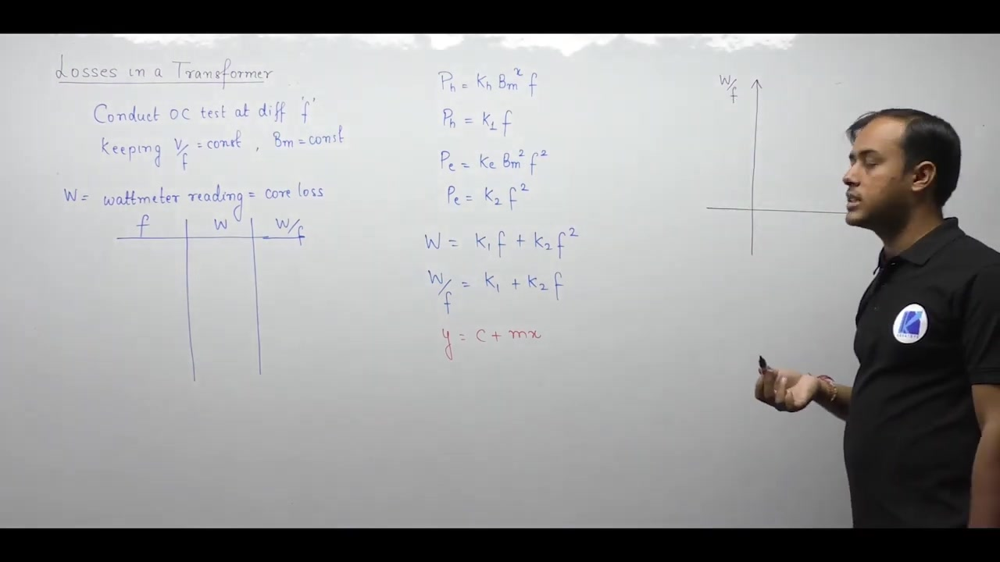

### Graphical Extraction of Loss Coefficients

Plot the measured values of $\frac{W}{f}$ on the vertical axis against frequency $f$ on the horizontal axis. 

A transformer cannot operate on direct current ($f = 0$). Therefore, the experimental points lie at non-zero frequencies. Extrapolate the straight line backward using a dashed line to intersect the vertical axis.

> [!success] Result
> From the plot of $\frac{W}{f}$ versus $f$:
> - The vertical intercept gives $K_1$, which determines hysteresis loss: $P_h = K_1 f$.
> - The slope gives $K_2$, which determines eddy current loss: $P_e = K_2 f^2$.

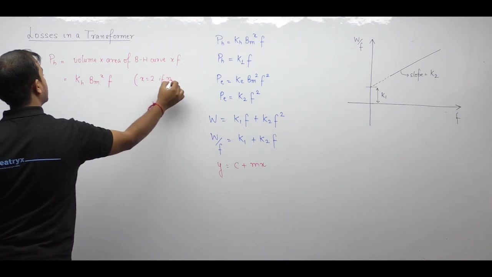

### Summary of Core Loss Formulas

For competitive examinations, keep these core formulas ready:

1. **Hysteresis Loss**:
   $$P_h = \text{Volume} \times (\text{Area of } B\text{-}H \text{ loop}) \times f$$
   $$P_h = k_h B_m^x f \quad (x = 2 \text{ if not specified})$$
2. **Eddy Current Loss**:
   $$P_e = \frac{\pi^2 f^2 B_m^2 \tau^2}{6\rho} \times \text{Volume}$$
   $$P_e = k_e B_m^2 f^2$$
3. **Flux Density Relation**:
   $$B_m \propto \frac{V}{f}$$

---

## Summary and Key Takeaways

- Total core loss in a ferromagnetic core equals the sum of hysteresis loss and eddy current loss: $P_i = P_h + P_e$.
- Net magnetic energy absorbed per unit volume over one full alternating cycle equals the area enclosed by the $B\text{-}H$ loop: $w_{\text{net}} = \oint H \, dB$.
- Total hysteresis power loss is given by Steinmetz's empirical relation $P_h = k_h B_m^x f V_{\text{core}}$, where the Steinmetz exponent $x$ typically ranges from $1.5$ to $2.5$.
- Eddy current power loss in a lamination of thickness $t$ is proportional to the square of thickness, frequency, and peak flux density: $P_e = \frac{\pi^2 B_m^2 f^2 t^2}{6\rho} V_{\text{core}} = k_e B_m^2 f^2$.
- Lamination of the core reduces eddy current loss by a factor of $n^2$ when a solid core is divided into $n$ insulated sheets of identical total volume.
- When the voltage-to-frequency ratio $V/f$ is held constant, peak flux density $B_m$ remains constant, so hysteresis loss scales as $P_h \propto f$ and eddy loss scales as $P_e \propto f^2$.
- When supply voltage $V$ is held constant while frequency $f$ varies, peak flux density varies as $B_m \propto 1/f$, resulting in $P_h \propto f^{1-x}$ and constant eddy loss $P_e \propto V^2$.
- Core losses can be separated experimentally at constant $V/f$ by plotting $P_i/f$ against frequency $f$, where the vertical intercept yields the hysteresis coefficient $A$ and the slope yields the eddy coefficient $B$ in $P_i/f = A + B f$.

