# Electrical Machines | Lec 18 | Losses & Efficiency (Part 2)| GATE Electrical Engineering | Ankit Sir

- **Source**: https://www.youtube.com/watch?v=zjYFMkBac0Y
- **Duration**: 00:59:19
- **Compiled**: 2026-09-20

---

## Overview

This lecture completes the analysis of transformer losses by examining copper loss, stray load loss, and dielectric loss. It establishes the mathematical formulation of commercial efficiency in both actual and per-unit values under varying load conditions. The discussion derives the dual conditions for maximum efficiency with respect to load power factor and loading fraction. Finally, it contrasts power and distribution transformers and formulates the 24-hour all-day energy efficiency metric.

## Contents

- [[#Copper Loss and Equivalent Resistance in Per Unit|Copper Loss and Equivalent Resistance in Per Unit]]
- [[#Copper Loss Scaling and Introduction to Stray Load Loss|Copper Loss Scaling and Introduction to Stray Load Loss]]
- [[#Stray Losses and Mitigation Techniques|Stray Losses and Mitigation Techniques]]
- [[#Dielectric Loss and Loss Classification|Dielectric Loss and Loss Classification]]
- [[#Load Variation and Transformer Efficiency Fundamentals|Load Variation and Transformer Efficiency Fundamentals]]
- [[#Mathematical Formulation of Transformer Efficiency|Mathematical Formulation of Transformer Efficiency]]
- [[#Maximizing Efficiency with Respect to Power Factor|Maximizing Efficiency with Respect to Power Factor]]
- [[#Maximizing Efficiency with Respect to Load Fraction|Maximizing Efficiency with Respect to Load Fraction]]
- [[#Efficiency Curves and Introduction to All-Day Efficiency|Efficiency Curves and Introduction to All-Day Efficiency]]
- [[#All-Day Efficiency Formulation and Summary|All-Day Efficiency Formulation and Summary]]

---

## Copper Loss and Equivalent Resistance in Per Unit
_(00:13 - 07:33)_

### Definition of Copper Loss

In the previous lecture, we covered core losses, which include hysteresis and eddy current losses. The next major loss in a transformer is copper loss. Copper loss is the ohmic $I^2 R$ loss that occurs in the windings. Because transformer windings are made of copper, this loss is commonly called copper loss. In power systems, transmission lines often use aluminum conductors. In that context, the loss is simply called ohmic loss.

> [!info] Definition
> Copper loss is the ohmic power dissipation caused by currents flowing through the winding resistance of the transformer.

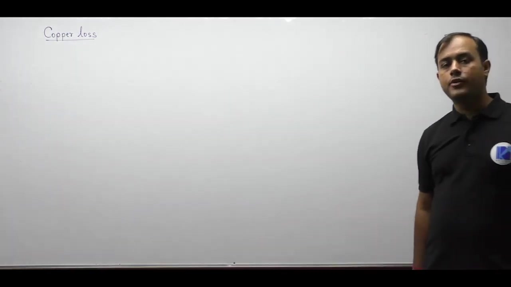

### Equivalent Resistance Formulations

A two-winding transformer has a primary winding with resistance $R_1$ and a secondary winding with resistance $R_2$. When currents $I_1$ and $I_2$ flow, the total copper loss is the sum of losses in both windings:

$$P_{\text{cu}} = I_1^2 R_1 + I_2^2 R_2$$

We can also refer all resistances to one side. The equivalent resistance referred to the primary side is:

$$R_{01} = R_1 + R_2' = R_1 + \left(\frac{N_1}{N_2}\right)^2 R_2$$

Similarly, the equivalent resistance referred to the secondary side is:

$$R_{02} = R_2 + R_1' = R_2 + \left(\frac{N_2}{N_1}\right)^2 R_1$$

Using these equivalent resistances, total copper loss can be computed on either side:

$$P_{\text{cu}} = I_1^2 R_{01} = I_2^2 R_{02}$$

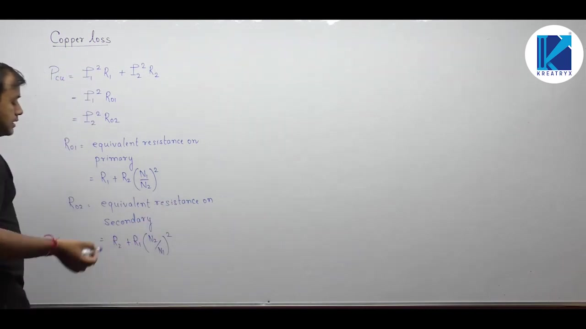

### Copper Loss in the Per-Unit System

Now let us express copper loss in the per-unit system. In electrical machines, full-load values correspond to rated values. The base value chosen for current is the rated current.

Let $x$ be the fraction of full-load current flowing in the winding:

$$I_1 = x \cdot I_{1\text{fl}}$$

Here $I_{1\text{fl}}$ is the full-load primary current. The per-unit primary current is:

$$I_{1\text{pu}} = \frac{I_1}{I_{1\text{base}}} = \frac{x \cdot I_{1\text{fl}}}{I_{1\text{fl}}} = x$$

In the per-unit system, quantities are identical on both sides of the transformer. Therefore, the secondary per-unit current is also:

$$I_{2\text{pu}} = x$$

The per-unit copper loss at loading fraction $x$ is:

$$P_{\text{cu,pu}} = I_{\text{pu}}^2 R_{\text{pu}} = x^2 R_{01\text{pu}} = x^2 R_{02\text{pu}}$$

Recall that per-unit resistance is identical whether referred to the primary or the secondary side:

$$R_{01\text{pu}} = R_{02\text{pu}} = R_{\text{pu}}$$

### Full-Load Copper Loss and Per-Unit Resistance

At full load, the operating current equals the rated current, so $x = 1$. Substituting $x = 1$ into the per-unit copper loss expression gives:

$$P_{\text{cu,fl,pu}} = 1^2 \cdot R_{\text{pu}} = R_{\text{pu}}$$

> [!success] Result
> The per-unit value of equivalent resistance of a transformer always equals its full-load copper loss in per unit:
> $$P_{\text{cu,fl,pu}} = R_{\text{pu}}$$

This identity is very useful when solving numerical problems.

## Copper Loss Scaling and Introduction to Stray Load Loss
_(07:47 - 12:53)_

### Copper Loss Scaling at Any Load

We can determine the copper loss at any operating current using the full-load copper loss. In per unit, the relation is:

$$P_{\text{cu,pu}} = x^2 P_{\text{cu,fl,pu}}$$

To convert power from per unit to actual watts, multiply both sides by the base power $S_{\text{base}}$:

$$P_{\text{cu,pu}} \cdot S_{\text{base}} = x^2 P_{\text{cu,fl,pu}} \cdot S_{\text{base}}$$

In AC circuits, apparent power $S$ serves as the common base for real and reactive power. Multiplying by $S_{\text{base}}$ yields the relation in actual watts:

$$P_{\text{cu}} = x^2 P_{\text{cu,fl}}$$

> [!success] Result
> At any loading fraction $x$, the actual copper loss equals $x^2$ times the full-load copper loss:
> $$P_{\text{cu}} = x^2 P_{\text{cu,fl}}$$

Here $x$ represents the fraction of rated current flowing in the winding:

$$x = \frac{I}{I_{\text{rated}}}$$

For example, if rated current is $200\text{ A}$ and actual current is $100\text{ A}$, the loading fraction is:

$$x = \frac{100}{200} = 0.5$$

If actual current is $50\text{ A}$, then $x = 50/200 = 0.25$. In practical operation, machines rarely exceed rated current, so $x \le 1$. Operating above rated current causes excessive winding heating.

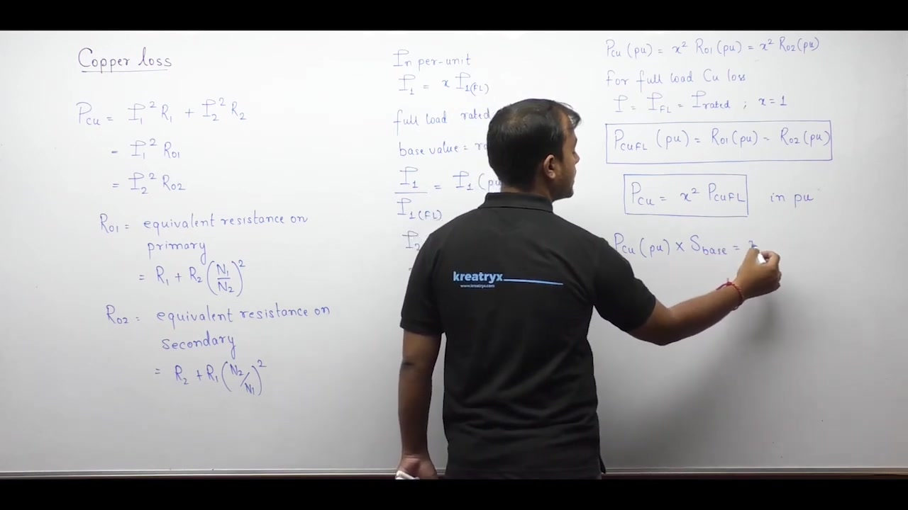

### Introduction to Stray Load Loss

Now we consider minor transformer losses. The first of these is stray load loss. The term "stray" describes something without a fixed location. Just as stray animals wander without a fixed home, stray losses occur in various parts of the machine rather than in a fixed region.

The word "load" indicates that the loss depends directly on load current. In contrast, core loss depends on voltage and is independent of load current.

> [!info] Definition
> Stray load losses are losses whose locations are not fixed. They occur in different parts of the machine and depend directly on load current.

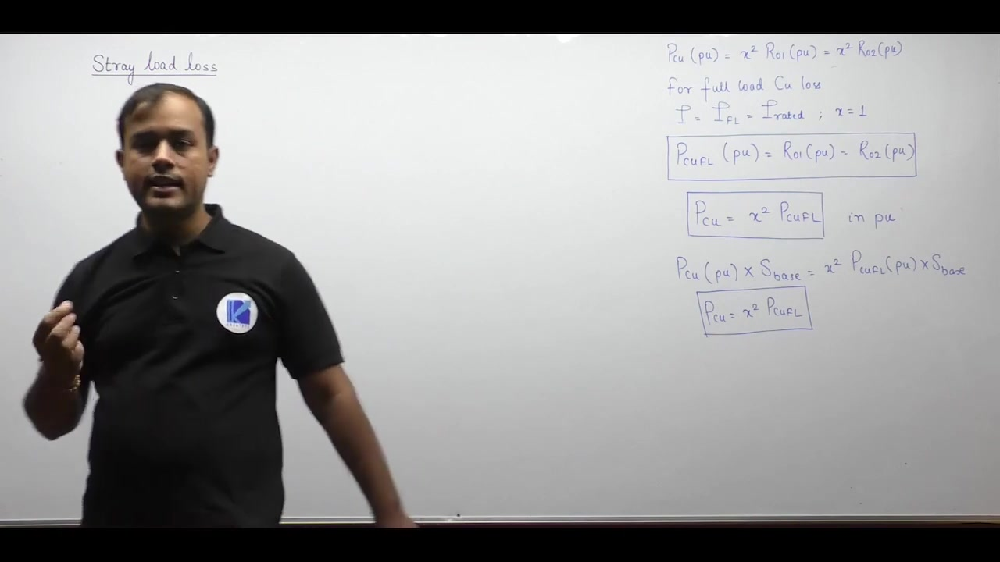

### Origin of Stray Load Loss from Leakage Flux

Let us understand the physical cause of stray load loss. Most of the magnetic flux produced by the windings stays within the core. This occurs because the ferromagnetic core has high permeability and low reluctance.

However, a small fraction of the flux leaks into the surrounding air. This leakage flux links with conductive parts outside the core. These parts include the transformer tank, clamping bolts, and structural steel channels.

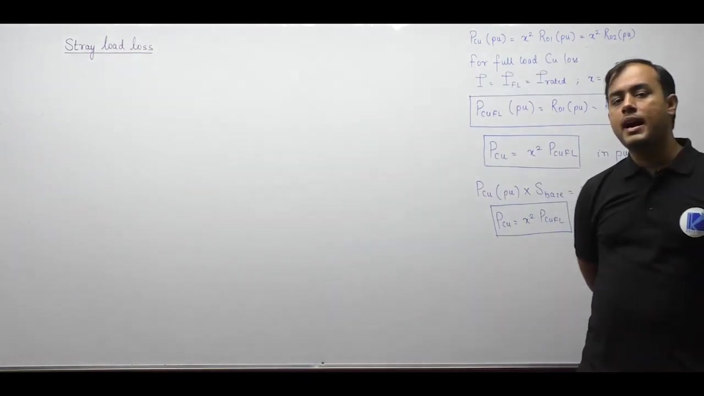

## Stray Losses and Mitigation Techniques
_(12:59 - 19:32)_

### Eddy Currents in External Metallic Parts

When alternating leakage flux escapes from the transformer core, it links external metal structures. These structures include the transformer tank, frame, and core clamping bolts. Because the leakage flux alternates with time, Faraday's law states that an electromotive force (EMF) is induced in these conductive parts:

$$e(t) = -\frac{d\phi_{\text{leakage}}}{dt}$$

This induced EMF circulates eddy currents in the metal parts. These eddy currents dissipate power as heat outside the core.

> [!info] Definition
> Stray load losses are eddy current losses produced by leakage flux in metallic parts outside the transformer core.

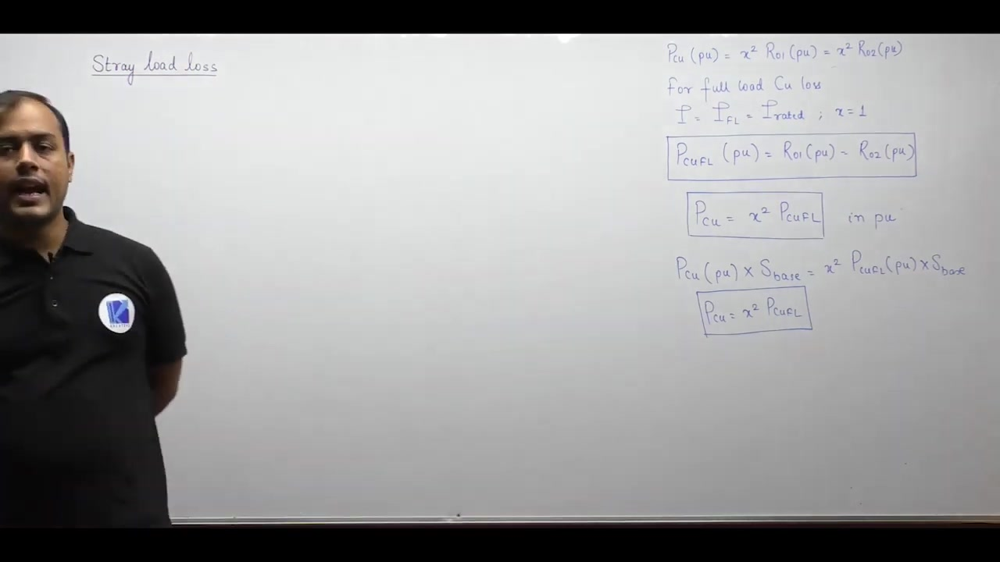

### Stray Iron Loss versus Stray Copper Loss

Stray losses fall into two main categories based on where they occur:

1. **Stray Iron Loss**: Eddy currents circulating in iron parts like the tank and frame.
2. **Stray Copper Loss**: Additional eddy currents circulating within the copper conductors of the windings themselves.

Stray iron loss is substantially larger than stray copper loss. Iron is a ferromagnetic material with high permeability, so it supports strong magnetic flux. In contrast, copper is diamagnetic with low magnetic permeability.

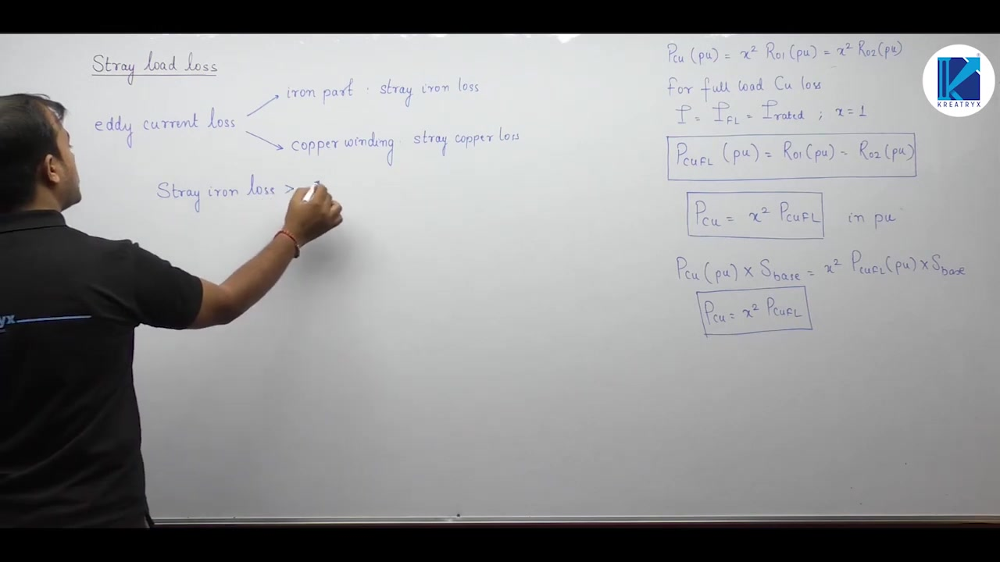

### Mitigation Techniques for Stray Losses

Engineers use specific design methods to reduce both forms of stray loss:

1. **Reducing Stray Iron Loss**: Fabricate the transformer tank from aluminum instead of iron. Aluminum is non-magnetic, so it magnetizes very weakly under leakage fields. This significantly reduces induced eddy currents.
2. **Reducing Stray Copper Loss**: Use stranded conductors in the windings instead of large solid conductors. Subdividing a thick conductor into smaller insulated strands limits the circulating eddy loops.

> [!success] Result
> In practical engineering, stray load loss accounts for about $0.5\%$ of the transformer rating. In standard numerical problems, it is usually neglected unless explicitly specified.

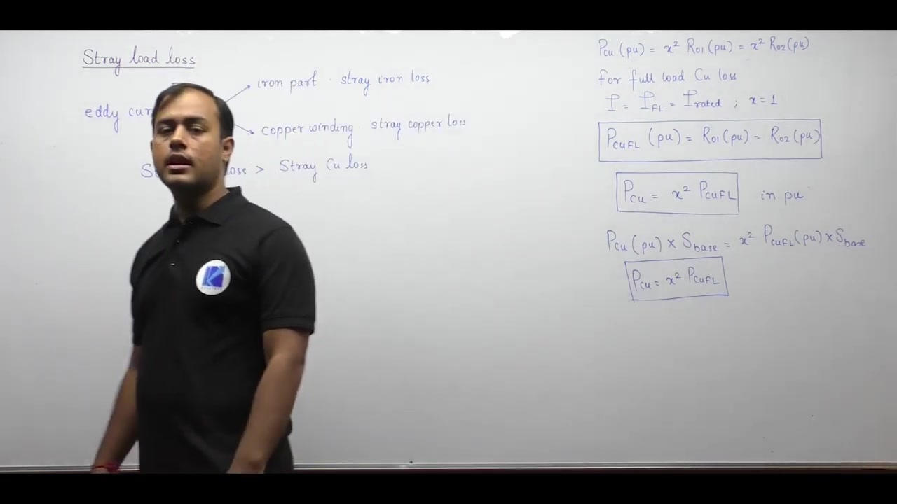

### Introduction to Dielectric Loss

The final minor loss in a transformer is dielectric loss. This loss occurs in the insulating materials, such as transformer oil, paper, and pressboard.

Its physical mechanism resembles magnetic hysteresis. In magnetic materials, magnetic dipoles align with an applied magnetic field. In insulating materials, electric dipoles align with an applied electric field. When an alternating electric field is applied, these electric dipoles rotate and reverse direction.

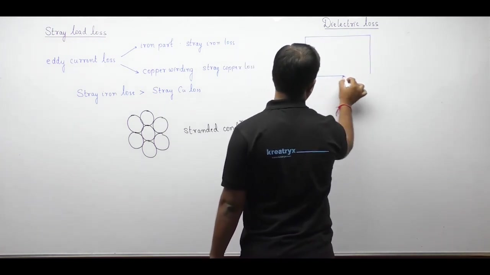

## Dielectric Loss and Loss Classification
_(19:36 - 25:13)_

### Mechanism of Dielectric Loss

An electric dipole consists of separated negative and positive charges. The dipole moment vector points from the negative charge to the positive charge. When an external electric field is applied, the dipoles align parallel to the field lines.

If the electric field points to the right, the dipoles align to the right. When the field reverses to the left, the dipoles rotate and point to the left. Under an alternating electric field, the dipoles must reverse direction every half-cycle. Neighboring dipoles resist this rotation due to inter-molecular friction. This friction dissipates electrical energy as heat.

> [!info] Definition
> Dielectric loss is the energy dissipated as heat when electric dipoles in an insulating material continually reverse under an alternating electric field.

This process is the electrostatic analog of magnetic hysteresis. In magnetic hysteresis, magnetic dipoles rotate under an alternating magnetic field. In dielectric loss, electric dipoles rotate under an alternating electric field.

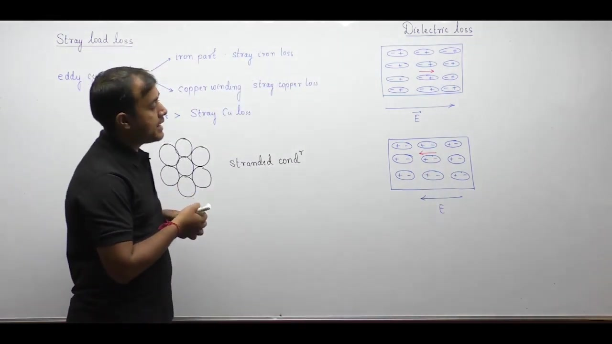

### Practical Magnitude of Dielectric Loss

Dielectric loss in transformer insulation is relatively small under normal power-frequency operation.

> [!success] Result
> Practically, dielectric loss is about $0.2\%$ of the transformer rating. It is usually ignored in machine efficiency calculations.

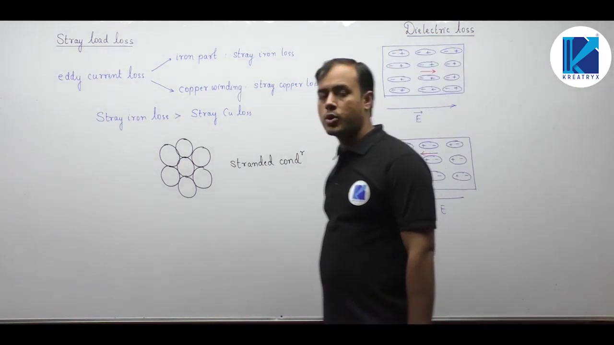

### Classification of Transformer Losses

We have now examined all four types of losses in a transformer:

1. **Core Loss** (iron loss): Composed of hysteresis loss and eddy current loss.
2. **Copper Loss**: Ohmic $I^2 R$ loss in the windings.
3. **Stray Load Loss**: Eddy current loss in external metallic parts caused by leakage flux.
4. **Dielectric Loss**: Polarization friction loss in insulating media.

In machine analysis, losses are divided into two operational categories:

- **Constant Losses**: Losses that do not depend on the load current. These depend primarily on the applied voltage and frequency. Core loss and dielectric loss are constant losses.
- **Variable Losses**: Losses that depend on the load current flowing through the transformer. Copper loss and stray load loss are variable losses because both scale with $I^2$.

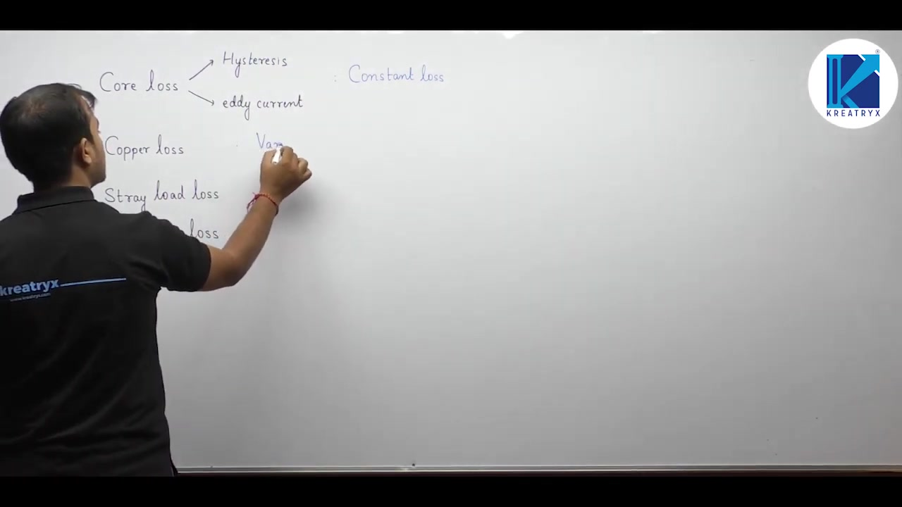

## Load Variation and Transformer Efficiency Fundamentals
_(25:18 - 30:04)_

### Load Variation and the Constant Voltage Assumption

In power systems, electrical loads include appliances like lights, fans, air conditioners, and water heaters. These devices consume electrical power from the transformer.

When the load demand changes, the terminal voltage remains approximately constant. Grid voltage regulation keeps the supply voltage within narrow limits. Power consumed by the load is:

$$P = V \cdot I \cos\phi$$

Because terminal voltage $V$ is assumed constant, any change in power demand directly changes the current $I$. When we state that load is halved or doubled, we mean that the load current is halved or doubled.

> [!info] Definition
> Varying the load on a transformer implies changing the current drawn by the load, while terminal voltage is treated as constant.

This distinction explains our loss classification:
- Losses dependent on voltage are constant losses.
- Losses dependent on current are variable losses.

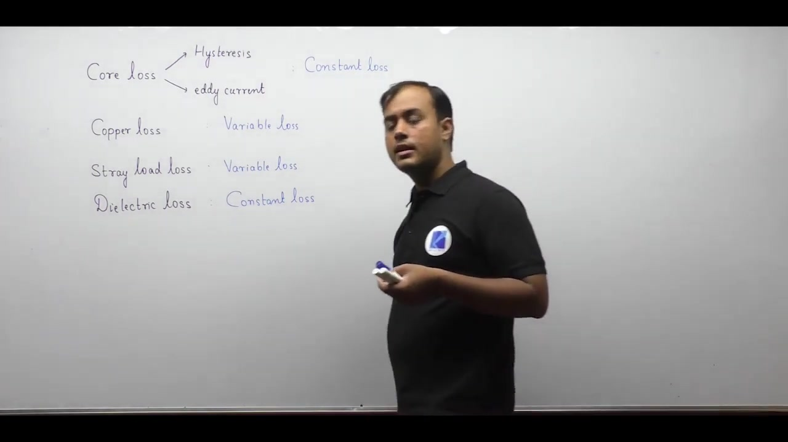

### Importance of Efficiency in Power Systems

Electrical energy is a valuable and limited resource. In many power systems, demand frequently approaches or exceeds total generation capacity. Any power lost internally within transformers is wasted energy.

To deliver maximum generated energy to consumers, internal losses must be minimized. A high-efficiency transformer minimizes waste and reduces operating costs.

> [!success] Result
> To maximize the operating efficiency of any electrical machine, internal power losses must be minimized:
> $$\text{Maximize } \eta \iff \text{Minimize } P_{\text{loss}}$$

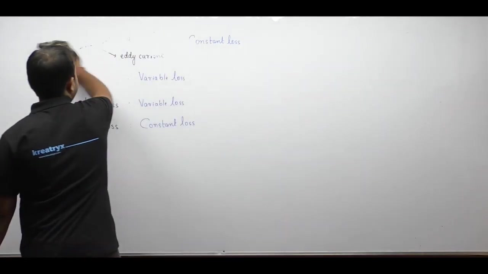

### Basic Definition of Commercial Efficiency

In fundamental terms, efficiency is the ratio of delivered output power to total input power:

$$\eta = \frac{P_{\text{out}}}{P_{\text{in}}}$$

Expressed as a percentage, it is:

$$\% \eta = \frac{P_{\text{out}}}{P_{\text{in}}} \times 100$$

By conservation of energy, input power equals output power plus internal losses:

$$P_{\text{in}} = P_{\text{out}} + P_{\text{loss}}$$

Substituting this into the efficiency expression gives:

$$\eta = \frac{P_{\text{out}}}{P_{\text{out}} + P_{\text{loss}}}$$

Because internal losses are strictly positive in real machines, efficiency is always less than $100\%$.

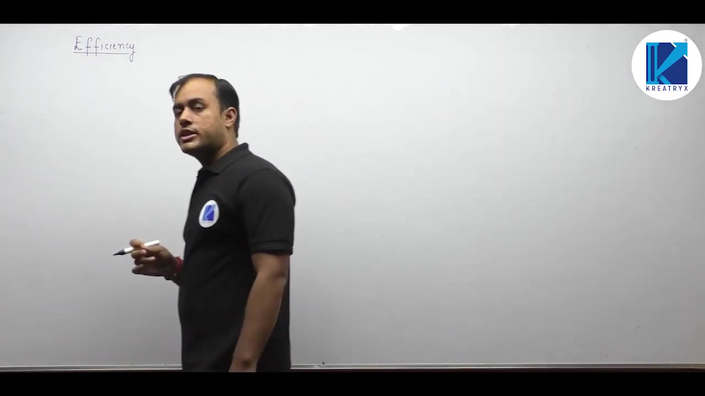

## Mathematical Formulation of Transformer Efficiency
_(30:04 - 35:07)_

### Real Output Power Expression

Suppose a load representing a fraction $x$ of full load is connected to the transformer. The apparent power rating of the transformer is specified in kVA. The apparent power drawn by the load is:

$$S = x \cdot S_{\text{rated}} = x \cdot \text{kVA}$$

Because efficiency is based on real power rather than apparent power, we multiply by the load power factor $\cos\phi_L$:

$$P_{\text{out}} = S \cos\phi_L = x \cdot \text{kVA} \cdot \cos\phi_L$$

The fraction $x$ represents both the power fraction and the current fraction:

$$x = \frac{S}{S_{\text{rated}}} = \frac{V \cdot I}{V \cdot I_{\text{rated}}} = \frac{I}{I_{\text{rated}}}$$

Because voltage $V$ is constant, half load ($x = 0.5$) means half of the rated power and half of the rated current. For a $100\text{ kVA}$ transformer, half load is a $50\text{ kVA}$ load.

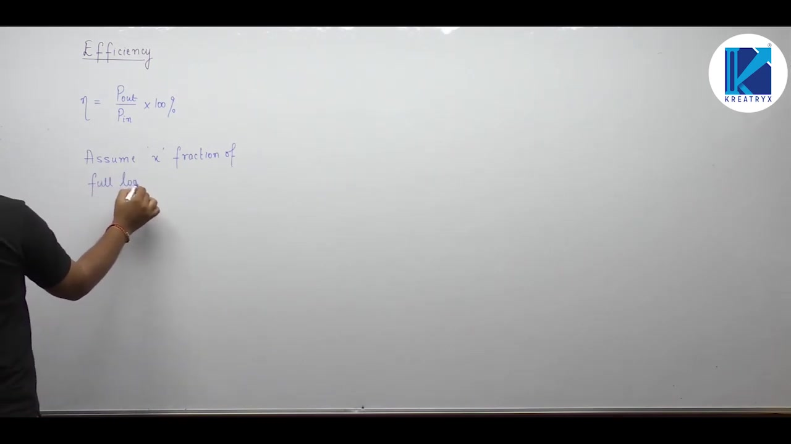

### Input Power and Total Losses

By energy conservation, the input power to the transformer is the sum of output power and total losses:

$$P_{\text{in}} = P_{\text{out}} + P_{\text{loss}}$$

In practical efficiency calculations, minor losses (stray load and dielectric) are neglected. Total loss consists of constant core loss and variable copper loss:

$$P_{\text{loss}} = P_{\text{core}} + P_{\text{cu}} = P_{\text{core}} + x^2 P_{\text{cu,fl}}$$

Substituting this into the input power equation yields:

$$P_{\text{in}} = x \cdot \text{kVA} \cdot \cos\phi_L + P_{\text{core}} + x^2 P_{\text{cu,fl}}$$

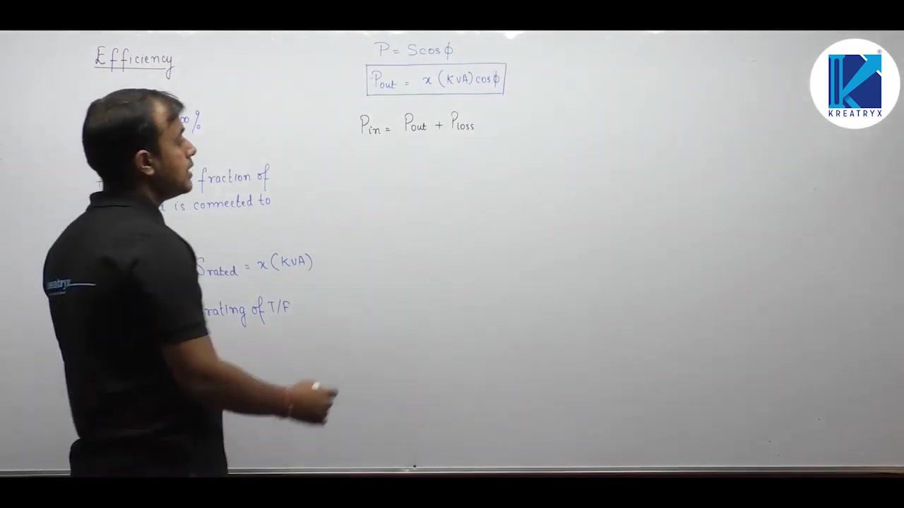

### Transformer Efficiency Formula

We now write the complete expression for transformer efficiency:

$$\eta = \frac{P_{\text{out}}}{P_{\text{in}}} = \frac{x \cdot \text{kVA} \cdot \cos\phi_L}{x \cdot \text{kVA} \cdot \cos\phi_L + P_{\text{core}} + x^2 P_{\text{cu,fl}}}$$

> [!success] Result
> The commercial efficiency of a transformer operating at load fraction $x$ and power factor $\cos\phi_L$ is:
> $$\eta = \frac{x \cdot \text{kVA} \cdot \cos\phi_L}{x \cdot \text{kVA} \cdot \cos\phi_L + P_{\text{core}} + x^2 P_{\text{cu,fl}}}$$

### Per-Unit Formulation of Efficiency

We can also express efficiency in per unit. Divide the numerator and denominator by the rated apparent power $\text{kVA}_{\text{rated}}$:

$$\eta = \frac{x \cos\phi_L}{x \cos\phi_L + P_{\text{core,pu}} + x^2 P_{\text{cu,fl,pu}}}$$

Using the identity $P_{\text{cu,fl,pu}} = R_{\text{pu}}$, the expression simplifies to:

$$\eta = \frac{x \cos\phi_L}{x \cos\phi_L + P_{\text{core,pu}} + x^2 R_{\text{pu}}}$$

Both actual and per-unit equations yield identical numerical efficiency values.

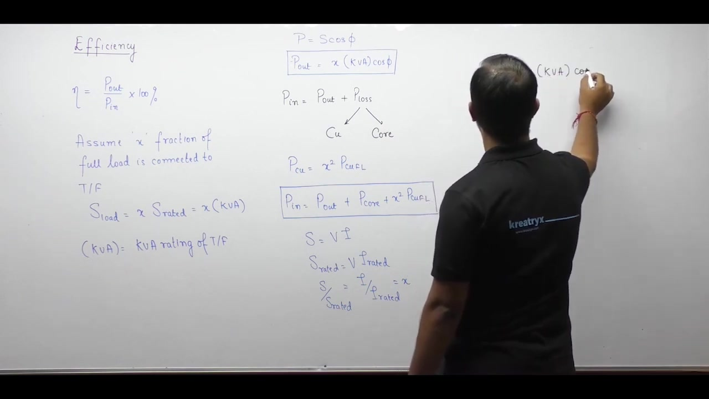

## Maximizing Efficiency with Respect to Power Factor
_(35:07 - 42:23)_

### Parameters Affecting Efficiency

The general expression for transformer efficiency is:

$$\eta = \frac{x \cdot \text{kVA} \cdot \cos\phi_L}{x \cdot \text{kVA} \cdot \cos\phi_L + P_{\text{core}} + x^2 P_{\text{cu,fl}}}$$

In this expression, machine ratings ($\text{kVA}$) and loss coefficients ($P_{\text{core}}$, $P_{\text{cu,fl}}$) are fixed by design. The efficiency depends on two external load parameters:
1. The load fraction $x = I/I_{\text{rated}}$.
2. The load power factor $\cos\phi_L$.

We can maximize efficiency with respect to each parameter individually. First, we examine maximization with respect to power factor while holding the load fraction $x$ constant.

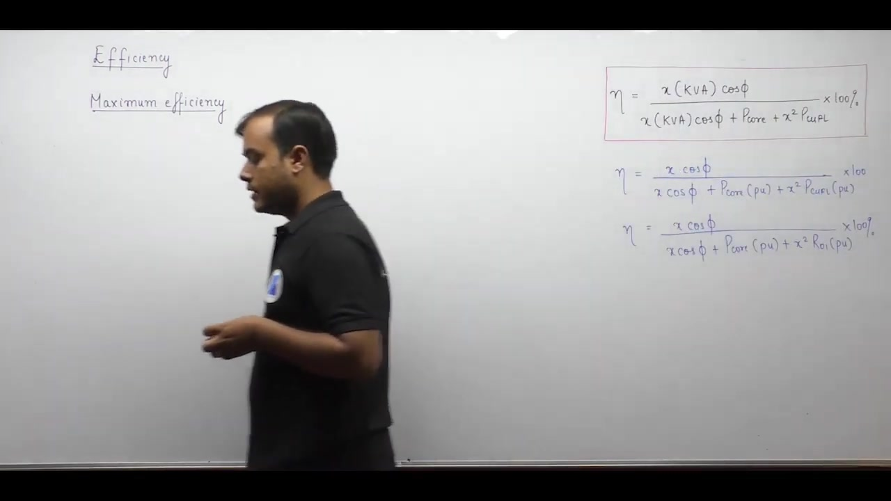

### Mathematical Derivation with Respect to Power Factor Angle

Let the load power factor angle be $\phi_L$. To find the maximum efficiency, differentiate $\eta$ with respect to $\phi_L$ and set the derivative to zero:

$$\frac{d\eta}{d\phi_L} = 0$$

Using the quotient rule on $\eta = u/v$:

$$\begin{aligned}
u &= x \cdot \text{kVA} \cdot \cos\phi_L \\
\frac{du}{d\phi_L} &= -x \cdot \text{kVA} \cdot \sin\phi_L \\
v &= x \cdot \text{kVA} \cdot \cos\phi_L + P_{\text{core}} + x^2 P_{\text{cu,fl}} \\
\frac{dv}{d\phi_L} &= -x \cdot \text{kVA} \cdot \sin\phi_L
\end{aligned}$$

The derivative of $\eta$ is:

$$\frac{d\eta}{d\phi_L} = \frac{v \frac{du}{d\phi_L} - u \frac{dv}{d\phi_L}}{v^2} = 0$$

Setting the numerator to zero:

$$\begin{aligned}
&(-x \cdot \text{kVA} \sin\phi_L)(x \cdot \text{kVA} \cos\phi_L + P_{\text{core}} + x^2 P_{\text{cu,fl}}) \\
&\quad - (x \cdot \text{kVA} \cos\phi_L)(-x \cdot \text{kVA} \sin\phi_L) = 0
\end{aligned}$$

The product terms $-(x \cdot \text{kVA})^2 \sin\phi_L \cos\phi_L$ and $+(x \cdot \text{kVA})^2 \sin\phi_L \cos\phi_L$ cancel out. This leaves:

$$-x \cdot \text{kVA} \cdot \sin\phi_L (P_{\text{core}} + x^2 P_{\text{cu,fl}}) = 0$$

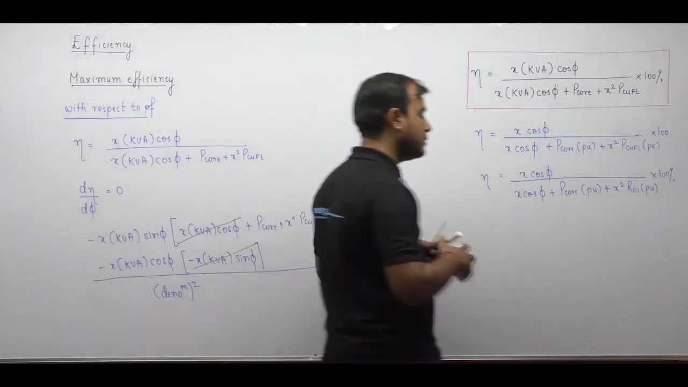

### Unity Power Factor Condition

Because the load current fraction $x$ and total losses $(P_{\text{core}} + x^2 P_{\text{cu,fl}})$ are non-zero under normal operation, the condition simplifies to:

$$\sin\phi_L = 0 \implies \phi_L = 0^\circ$$

Therefore, the optimal power factor is:

$$\cos\phi_L = \cos(0^\circ) = 1$$

> [!success] Result
> For maximum efficiency at any given load fraction $x$, the load power factor must be unity:
> $$\cos\phi_L = 1 \quad \text{(UPF)}$$

At unity power factor, the load consumes only real power. No reactive power circulates through the transformer windings. This eliminates unnecessary $I^2 R$ losses caused by reactive currents.

## Maximizing Efficiency with Respect to Load Fraction
_(42:23 - 47:24)_

### Minimization of the Denominator

Now we maximize transformer efficiency with respect to the load fraction $x$, holding power factor $\cos\phi_L$ constant. The efficiency expression is:

$$\eta = \frac{x \cdot \text{kVA} \cdot \cos\phi_L}{x \cdot \text{kVA} \cdot \cos\phi_L + P_{\text{core}} + x^2 P_{\text{cu,fl}}}$$

To avoid using the quotient rule, divide both numerator and denominator by $x$:

$$\eta = \frac{\text{kVA} \cos\phi_L}{\text{kVA} \cos\phi_L + \frac{P_{\text{core}}}{x} + x P_{\text{cu,fl}}}$$

Now the variable $x$ appears only in the denominator. The numerator is constant. Therefore, efficiency is maximized when the denominator is minimized:

$$\text{Maximize } \eta \iff \text{Minimize } D(x)$$

Here the denominator function is:

$$D(x) = \text{kVA} \cos\phi_L + \frac{P_{\text{core}}}{x} + x P_{\text{cu,fl}}$$

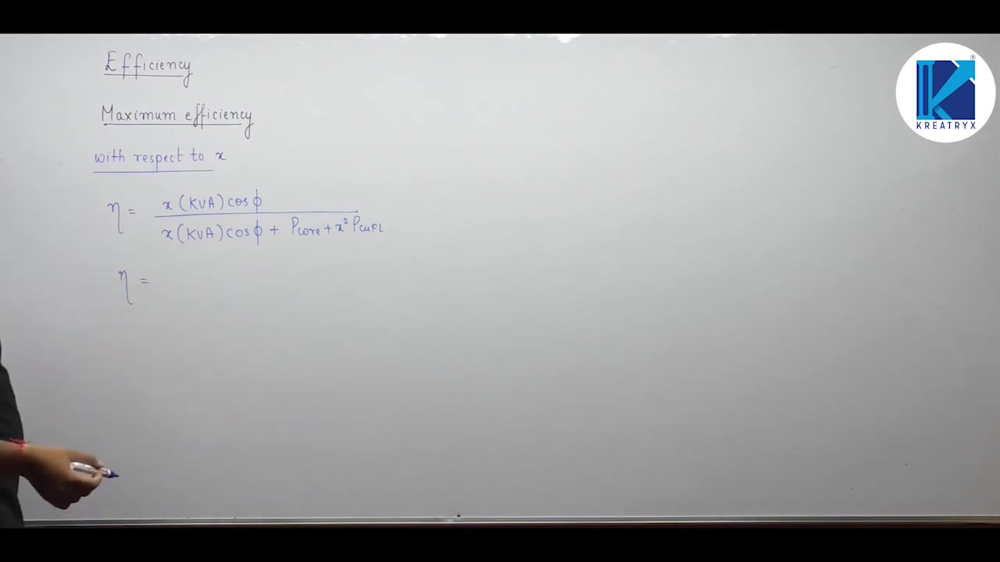

### Optimal Loading Fraction Derivation

To find the minimum of $D(x)$, set its first derivative with respect to $x$ to zero:

$$\frac{d D(x)}{dx} = 0$$

Differentiating term by term:

$$\begin{aligned}
\frac{d}{dx}(\text{kVA} \cos\phi_L) &= 0 \\
\frac{d}{dx}\left(\frac{P_{\text{core}}}{x}\right) &= -\frac{P_{\text{core}}}{x^2} \\
\frac{d}{dx}(x P_{\text{cu,fl}}) &= P_{\text{cu,fl}}
\end{aligned}$$

Setting the sum to zero:

$$-\frac{P_{\text{core}}}{x^2} + P_{\text{cu,fl}} = 0 \implies \frac{P_{\text{core}}}{x^2} = P_{\text{cu,fl}}$$

Solving for $x$:

$$x^2 = \frac{P_{\text{core}}}{P_{\text{cu,fl}}} \implies x = \sqrt{\frac{P_{\text{core}}}{P_{\text{cu,fl}}}}$$

> [!success] Result
> Maximum efficiency occurs at the loading fraction:
> $$x = \sqrt{\frac{P_{\text{core}}}{P_{\text{cu,fl}}}} = \sqrt{\frac{P_i}{P_{\text{cu,fl}}}}$$

The optimal kVA load for maximum efficiency is:

$$\text{kVA}_{\text{at } \eta_{\max}} = \text{kVA}_{\text{rated}} \times \sqrt{\frac{P_i}{P_{\text{cu,fl}}}}$$

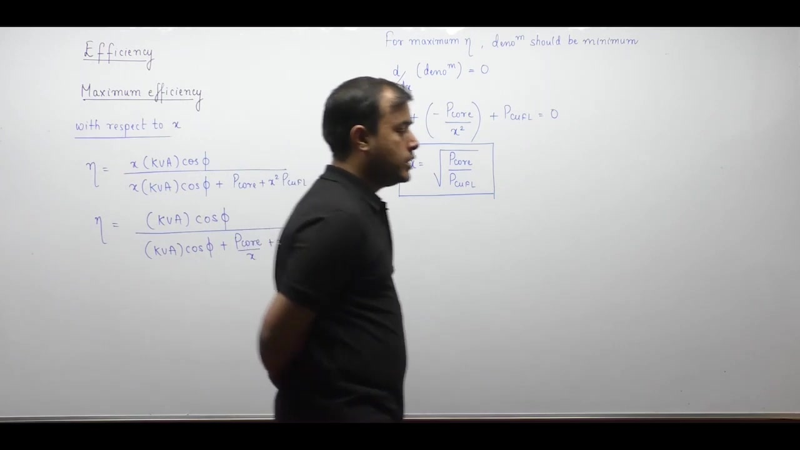

### Condition: Constant Loss Equals Variable Loss

Rearranging $x^2 = P_{\text{core}} / P_{\text{cu,fl}}$ gives:

$$P_{\text{core}} = x^2 P_{\text{cu,fl}}$$

Notice that $x^2 P_{\text{cu,fl}}$ is the actual copper loss at load fraction $x$. Therefore, the condition for maximum efficiency is:

$$\text{Constant Loss} = \text{Variable Loss}$$

> [!info] Definition
> Maximum efficiency in a transformer occurs when the variable copper loss equals the constant core loss:
> $$P_{\text{cu}} = P_{\text{core}}$$

Under this condition, the maximum efficiency formula becomes:

$$\eta_{\max} = \frac{x \cdot \text{kVA} \cdot \cos\phi_L}{x \cdot \text{kVA} \cdot \cos\phi_L + 2 P_{\text{core}}}$$

Alternatively, replace $P_{\text{core}}$ with $x^2 P_{\text{cu,fl}}$:

$$\eta_{\max} = \frac{x \cdot \text{kVA} \cdot \cos\phi_L}{x \cdot \text{kVA} \cdot \cos\phi_L + 2 x^2 P_{\text{cu,fl}}}$$

If a numerical problem does not specify the load power factor, always assume unity power factor ($\cos\phi_L = 1$).

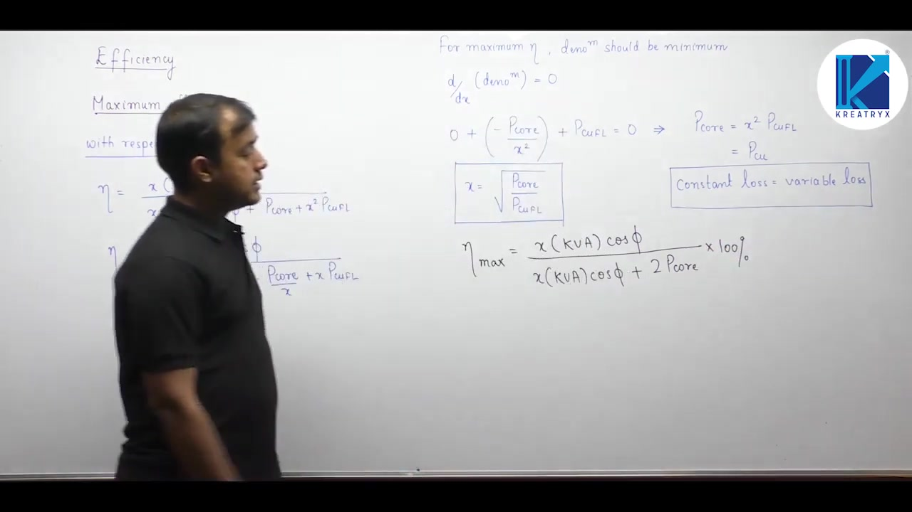

## Efficiency Curves and Introduction to All-Day Efficiency
_(47:29 - 54:06)_

### Efficiency Trajectory with Varying Load

Let us examine how transformer efficiency varies as load fraction $x$ increases from zero.

At no-load, no load impedance is connected to the secondary terminals, so $x = 0$. The output power is zero:

$$P_{\text{out}} = 0$$

However, the primary winding remains excited at rated voltage. It draws core loss $P_{\text{core}}$ from the source:

$$P_{\text{in}} = P_{\text{out}} + P_{\text{loss}} = 0 + P_{\text{core}} = P_{\text{core}}$$

Therefore, efficiency at no-load is strictly zero:

$$\eta = \frac{0}{0 + P_{\text{core}}} = 0$$

As load increases from zero, output power rises much faster than copper loss. Efficiency increases steadily until it reaches a maximum at:

$$x_{\max} = \sqrt{\frac{P_{\text{core}}}{P_{\text{cu,fl}}}} = \sqrt{\frac{P_i}{P_{\text{cu,fl}}}}$$

Beyond this point, copper loss grows quadratically with $x^2$. The rapid increase in losses causes efficiency to decline.

> [!success] Result
> As load increases from zero, transformer efficiency first increases, reaches a maximum at $x = \sqrt{P_i/P_{\text{cu,fl}}}$, and then decreases.

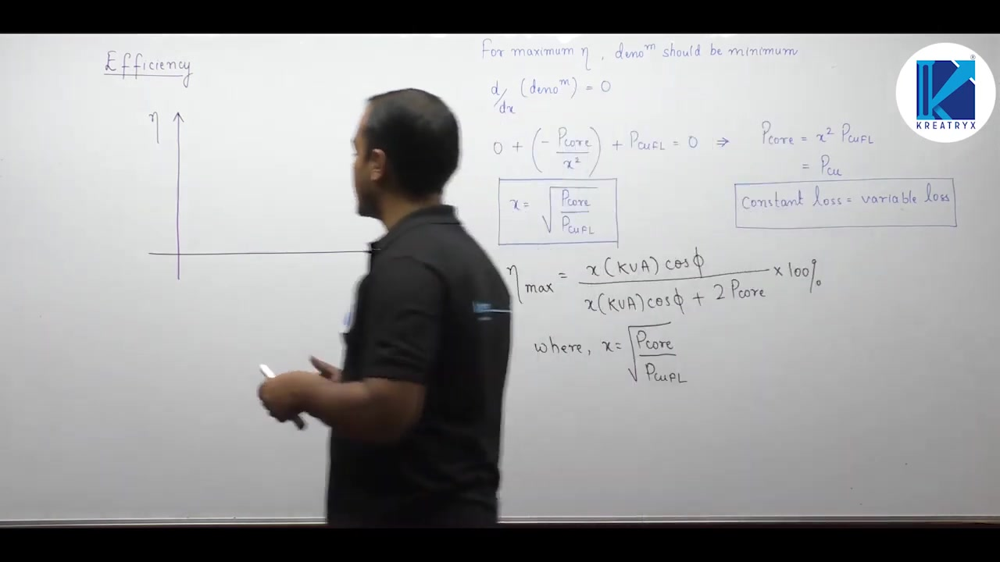

### Family of Efficiency Curves for Different Power Factors

Next, consider the effect of load power factor on the efficiency curve. We plot efficiency $\eta$ against $x$ for three distinct power factor values: $0.6$ lagging, $0.8$ lagging, and unity power factor ($1.0$).

For any fixed load fraction $x$, efficiency increases as power factor increases. Higher power factor means higher real power output for the same current.

However, the horizontal location of the peak is completely independent of power factor. All three curves reach their maximum at the exact same loading fraction:

$$x_{\max} = \sqrt{\frac{P_i}{P_{\text{cu,fl}}}}$$

The highest overall peak occurs at unity power factor ($\cos\phi_L = 1.0$).

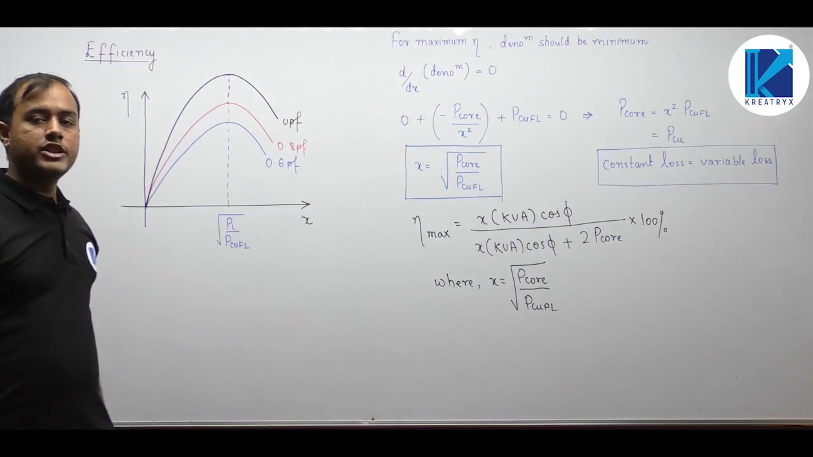

### Power Transformers versus Distribution Transformers

Transformers in an electrical network serve different functions based on their location:

1. **Power Transformers**:
   - Installed at generating stations and bulk transmission substations.
   - Step up voltage for high-voltage transmission.
   - Operate almost continuously at or near rated full load ($x \approx 1$).
   - Designed to achieve maximum efficiency near full load ($x = 1$).

2. **Distribution Transformers**:
   - Installed near end consumers in residential and commercial areas.
   - Step down voltage to utilization levels ($415\text{ V}$ or $230\text{ V}$).
   - Experience widely fluctuating loads throughout the 24-hour day.
   - Consumers switch loads on and off unpredictably, so $x$ varies continuously.
   - Designed to achieve maximum efficiency at lower loading ($50\%$ to $70\%$).

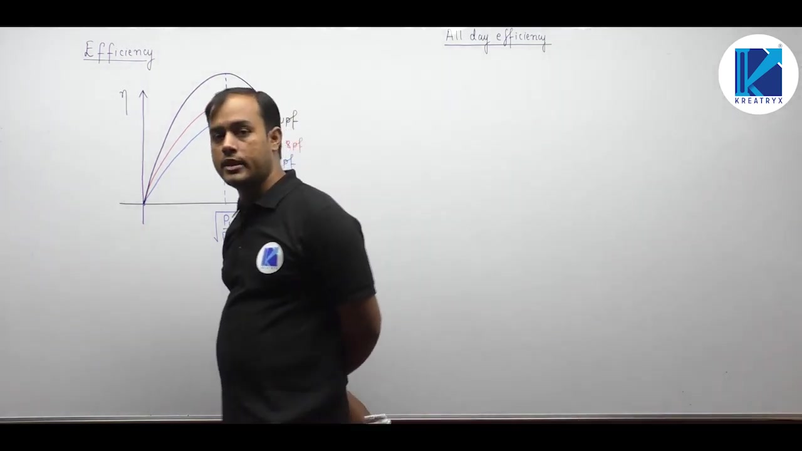

### Need for All-Day Efficiency

Because a distribution transformer experiences varying load throughout the day, its instantaneous power efficiency varies constantly. A single commercial efficiency figure is not meaningful.

To evaluate distribution transformers properly, we define all-day efficiency based on total energy over a 24-hour cycle.

> [!info] Definition
> All-day efficiency is the ratio of total electrical energy delivered to the load in 24 hours to total electrical energy supplied to the transformer in 24 hours.

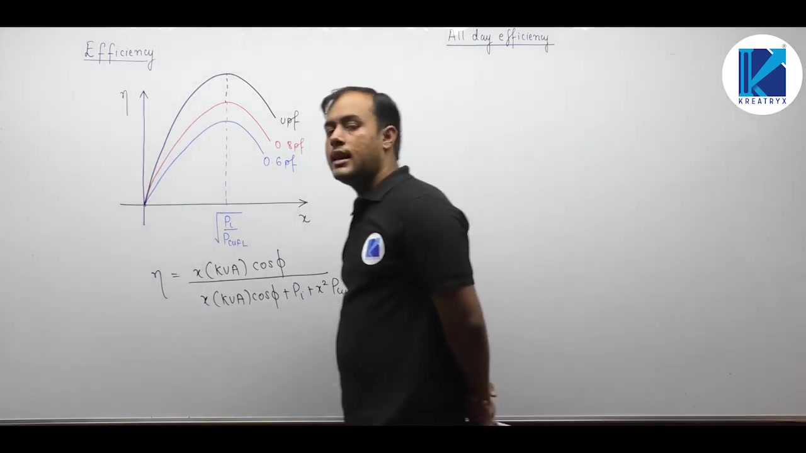

## All-Day Efficiency Formulation and Summary
_(54:06 - 59:11)_

### Definition of All-Day Efficiency

A distribution transformer operates continuously for 24 hours a day while directly supplying consumers. Its loading fraction $x$ varies from hour to hour as consumer demand shifts.

Because power efficiency varies continuously, commercial efficiency is calculated using 24-hour integrated energy. Energy is measured in kilowatt-hours ($\text{kWh}$).

> [!info] Definition
> All-day efficiency, also called energy efficiency, is the ratio of total energy output in 24 hours to total energy input in 24 hours:
> $$\eta_{\text{all-day}} = \frac{\text{Energy Output in 24 hours (kWh)}}{\text{Energy Input in 24 hours (kWh)}}$$

By conservation of energy, the input energy is:

$$\text{Energy Input} = \text{Energy Output} + \text{Total Energy Loss}$$

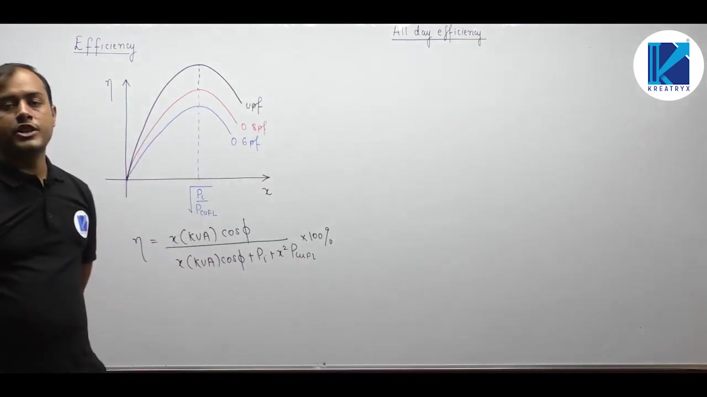

### Calculating 24-Hour Energy Losses

Total energy loss over 24 hours consists of core loss energy and copper loss energy.

Core loss depends on terminal voltage and frequency. Because the transformer remains energized all day, core loss runs uninterrupted for all 24 hours:

$$E_{\text{core}} = P_{\text{core}} \times 24\text{ hours}$$

Copper loss depends on the instantaneous load fraction $x$. When the load varies in discrete steps over different time intervals $t_i$, the total copper loss energy is the sum:

$$E_{\text{cu}} = \sum_{i} P_{\text{cu},i} \cdot t_i = \sum_{i} x_i^2 P_{\text{cu,fl}} \cdot t_i$$

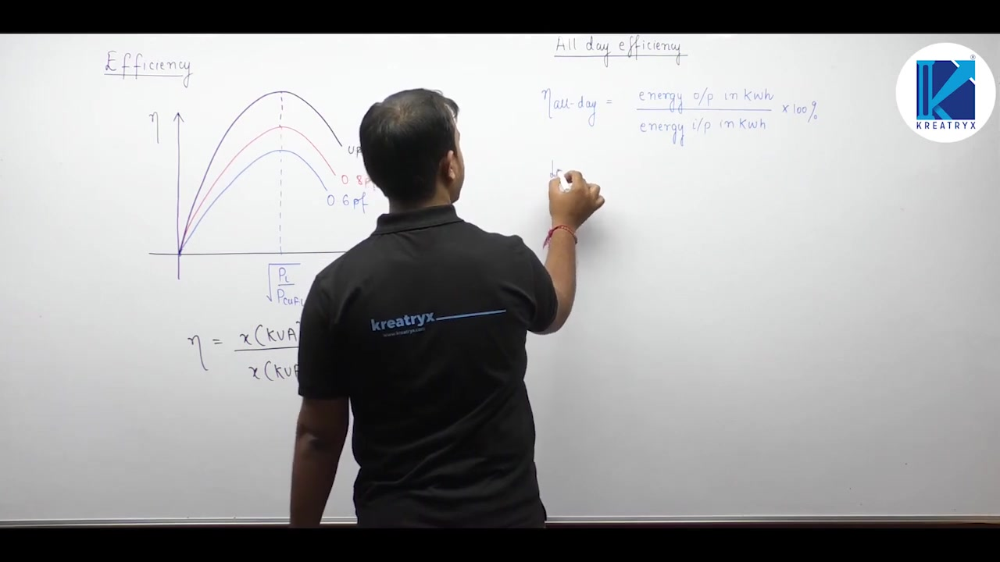

### Piecewise Calculation Example

Consider a transformer with varying load over four six-hour blocks:
- First 6 hours: Copper loss is $2\text{ kW}$, giving $2 \times 6 = 12\text{ kWh}$.
- Second 6 hours: Copper loss is $3\text{ kW}$, giving $3 \times 6 = 18\text{ kWh}$.
- Third 6 hours: No load, copper loss is $0\text{ kW}$, giving $0 \times 6 = 0\text{ kWh}$.
- Fourth 6 hours: Copper loss is $5\text{ kW}$, giving $5 \times 6 = 30\text{ kWh}$.

The total copper loss energy over 24 hours is:

$$E_{\text{cu}} = 12 + 18 + 0 + 30 = 60\text{ kWh}$$

Adding core loss energy $E_{\text{core}} = 24 P_{\text{core}}$ yields the total daily energy loss.

> [!success] Result
> The complete expression for all-day efficiency is:
> $$\eta_{\text{all-day}} = \frac{\sum P_{\text{out},i} \cdot t_i}{\sum P_{\text{out},i} \cdot t_i + 24 P_{\text{core}} + \sum x_i^2 P_{\text{cu,fl}} \cdot t_i}$$

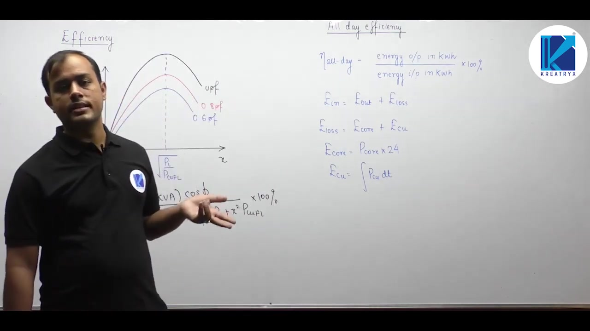

### Summary of Key Results

This concludes our study of transformer losses and efficiency:
1. Core loss ($P_i = P_h + P_e$) is a constant loss that depends on voltage and frequency.
2. Copper loss ($P_{\text{cu}} = x^2 P_{\text{cu,fl}}$) is a variable loss that depends on load current.
3. In per unit, full-load copper loss equals per-unit equivalent resistance: $P_{\text{cu,fl,pu}} = R_{\text{pu}}$.
4. Maximum efficiency occurs when constant loss equals variable loss ($P_{\text{core}} = x^2 P_{\text{cu,fl}}$) at unity power factor.
5. All-day efficiency evaluates distribution transformers by integrating power into energy over 24 hours.

---

## Summary and Key Takeaways

- Total copper loss at any loading fraction $x = I/I_{\text{rated}}$ scales quadratically with load: $P_{\text{cu}} = x^2 P_{\text{cu,fl}}$.
- In the per-unit system, the equivalent winding resistance numerically equals the full-load copper loss: $P_{\text{cu,fl,pu}} = R_{\text{pu}}$.
- Stray load loss originates from time-varying leakage flux inducing eddy currents in external metallic structures such as the transformer tank.
- Transformer losses divide into constant losses ($P_{\text{core}}$, $P_{\text{dielectric}}$) that depend on voltage and variable losses ($P_{\text{cu}}$, $P_{\text{stray}}$) that scale with current squared.
- Commercial efficiency is given by $\eta = \frac{x \cdot \text{kVA} \cdot \cos\phi_L}{x \cdot \text{kVA} \cdot \cos\phi_L + P_{\text{core}} + x^2 P_{\text{cu,fl}}}$.
- For any given load fraction, maximum efficiency occurs at unity power factor ($\cos\phi_L = 1$).
- Maximum efficiency with respect to load occurs when variable copper loss equals constant core loss: $x^2 P_{\text{cu,fl}} = P_{\text{core}}$, yielding $x = \sqrt{P_{\text{core}}/P_{\text{cu,fl}}}$.
- All-day efficiency evaluates distribution transformers over a 24-hour cycle using the ratio of energy output to energy input: $\eta_{\text{all-day}} = \frac{E_{\text{out}}}{E_{\text{out}} + 24 P_{\text{core}} + \sum x_i^2 P_{\text{cu,fl}} t_i}$.

