# Problems Based on Losses and Efficiency in Transformers | L 8 | Electrical Machines | GATE 2022

- **Source**: https://www.youtube.com/watch?v=EnBlUwhov4A
- **Duration**: 01:14:58
- **Compiled**: 2026-09-20

---

## Overview

This lecture solves advanced problems on transformer losses, efficiency, and magnetic circuit principles.
It covers constant voltage frequency changes, loss separation from efficiency data, and all-day efficiency calculations.
The discussion analyzes core loss separation into hysteresis and eddy current components under constant $V/f$ ratios.
It also examines non-sinusoidal voltages, Sumpner back-to-back testing, and test conversions across different supply frequencies.

## Contents

- [[#Problem 1: Frequency Variation at Rated Voltage|Problem 1: Frequency Variation at Rated Voltage]]
- [[#Problem 2: Determination of Losses from Two Efficiency Points|Problem 2: Determination of Losses from Two Efficiency Points]]
- [[#Problem 2 Completion and All-Day Efficiency Setup|Problem 2 Completion and All-Day Efficiency Setup]]
- [[#Problem 3: Execution of the Tabular Method for All-Day Efficiency|Problem 3: Execution of the Tabular Method for All-Day Efficiency]]
- [[#Problem 4: Efficiency, Load for Maximum Efficiency, and Maximum Efficiency Value|Problem 4: Efficiency, Load for Maximum Efficiency, and Maximum Efficiency Value]]
- [[#Problem 5: Loss Separation from Multiple Operating Conditions|Problem 5: Loss Separation from Multiple Operating Conditions]]
- [[#Problem 5 Completion and Core Loss Separation|Problem 5 Completion and Core Loss Separation]]
- [[#Problem 6: Numerical Separation of Core Losses|Problem 6: Numerical Separation of Core Losses]]
- [[#Problem 7: Comparative Efficiency Across Load Fractions and Power Factors|Problem 7: Comparative Efficiency Across Load Fractions and Power Factors]]
- [[#Problem 8: Non-Sinusoidal Applied Voltage and Eddy Current Loss|Problem 8: Non-Sinusoidal Applied Voltage and Eddy Current Loss]]
- [[#Problem 9: Sumpner's Test and Problem 10 Setup|Problem 9: Sumpner's Test and Problem 10 Setup]]
- [[#Problem 10 Solution, Problem 11, and Problem 12|Problem 10 Solution, Problem 11, and Problem 12]]
- [[#Problem 13 and Problem 14: Core Physics and Constant V/f Operation|Problem 13 and Problem 14: Core Physics and Constant V/f Operation]]
- [[#Problem 15: Referring OC and SC Tests Across Frequencies|Problem 15: Referring OC and SC Tests Across Frequencies]]
- [[#Problem 15 Wrap-Up and Lecture Summary|Problem 15 Wrap-Up and Lecture Summary]]

---

## Problem 1: Frequency Variation at Rated Voltage
_(00:10 - 05:08)_

### Introduction to Transformer Losses and Problem Statement

This session focuses on numerical problems covering transformer losses and efficiency.
The core loss consists of hysteresis loss and eddy current loss.
The ohmic loss occurs in the windings as copper loss.

> [!example] Problem 1
> A single-phase transformer rated for $220/440\text{ V}$, $50\text{ Hz}$ operates at no load at $220\text{ V}$, $40\text{ Hz}$.
> This frequency operation at rated voltage results in which one of the following?
> 
> - (A) Increase in both eddy current and hysteresis losses
> - (B) Decrease in both eddy current and hysteresis losses
> - (C) Increase in hysteresis loss and decrease in eddy current loss
> - (D) Increase in hysteresis loss and eddy current loss remains unchanged

### Analysis of Core Losses Under Constant Voltage

Here the transformer operates at rated voltage $V = 220\text{ V}$.
The supply frequency decreases from $50\text{ Hz}$ to $40\text{ Hz}$.
The induced electromotive force relates to maximum core flux density $B_m$ by the relation:
$$V \approx E = 4.44 f N B_m A_c$$

Because the applied voltage $V$ stays constant, flux density varies inversely with frequency:
$$B_m \propto \frac{V}{f}$$

When frequency decreases at constant voltage, the core flux density increases.

### Hysteresis Loss Variation

Hysteresis loss depends on maximum flux density and supply frequency:
$$P_h \propto B_m^n f$$

Here the exponent $n$ lies between 1.6 and 2.
Substituting the expression for flux density gives:
$$P_h \propto \left(\frac{V}{f}\right)^n f \propto \frac{V^n}{f^{n-1}}$$

Because voltage $V$ is constant and frequency $f$ drops from $50\text{ Hz}$ to $40\text{ Hz}$, the denominator decreases.
So hysteresis loss increases.

### Eddy Current Loss Variation

Eddy current loss depends on the square of flux density and the square of frequency:
$$P_e \propto B_m^2 f^2$$

Substituting $B_m \propto V/f$ into this equation gives:
$$P_e \propto \left(\frac{V}{f}\right)^2 f^2 \propto V^2$$

Because applied voltage $V$ remains constant, eddy current loss does not depend on frequency.
So the eddy current loss remains unchanged.

> [!success] Result
> Hysteresis loss increases while eddy current loss remains unchanged.
> The correct option is **(D)**.

## Problem 2: Determination of Losses from Two Efficiency Points
_(05:08 - 09:46)_

### Problem Statement

In this problem, efficiency is known at two different load conditions.
We use these two points to determine iron loss and full load copper loss.

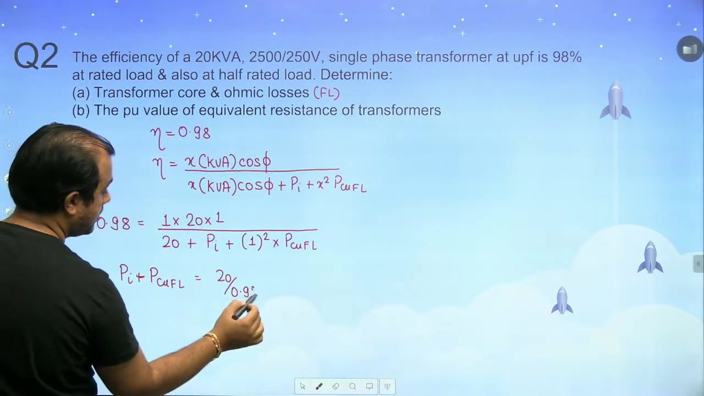

> [!example] Problem 2
> The efficiency of a $20\text{ kVA}$, $2500/250\text{ V}$, single-phase transformer at unity power factor is $98\%$ at rated load.
> The efficiency is also $98\%$ at half-rated load at unity power factor.
> Determine the core loss and the full load copper loss.
> Also find the per-unit value of the equivalent resistance.

### Formulation of Efficiency Equations

The general efficiency formula at load fraction $x$ and power factor $\cos\phi$ is:
$$\eta = \frac{x S \cos\phi}{x S \cos\phi + P_i + x^2 P_{\text{cu,fl}}}$$

Here $S = 20\text{ kVA}$ and $\cos\phi = 1$.
Keep all power quantities in kilowatts during the calculation.

For the first case at full load, $x = 1$.
The efficiency is $98\%$, so $\eta = 0.98$:
$$0.98 = \frac{20}{20 + P_i + P_{\text{cu,fl}}}$$

Rearranging gives the total losses at full load:
$$
\begin{aligned}
P_i + P_{\text{cu,fl}} &= \frac{20}{0.98} - 20 \\
&= \frac{20(1 - 0.98)}{0.98} \\
&= \frac{0.40}{0.98} = \frac{20}{49}\text{ kW}
\end{aligned}
$$

This provides our first equation:
$$P_i + P_{\text{cu,fl}} = \frac{20}{49}\text{ kW} \approx 408.16\text{ W}$$

### Evaluation at Half-Rated Load

For the second case at half load, $x = 0.5$.
The efficiency is again $98\%$:
$$0.98 = \frac{0.5 \times 20}{(0.5 \times 20) + P_i + (0.5)^2 P_{\text{cu,fl}}}$$

Simplify the terms in the numerator and denominator:
$$0.98 = \frac{10}{10 + P_i + 0.25 P_{\text{cu,fl}}}$$

Rearranging gives the losses at half load:
$$
\begin{aligned}
P_i + 0.25 P_{\text{cu,fl}} &= \frac{10}{0.98} - 10 \\
&= \frac{10(1 - 0.98)}{0.98} \\
&= \frac{0.20}{0.98} = \frac{10}{49}\text{ kW} \approx 204.08\text{ W}
\end{aligned}
$$

### Solving for Individual Losses

Subtract the second equation from the first equation:
$$(P_i + P_{\text{cu,fl}}) - (P_i + 0.25 P_{\text{cu,fl}}) = \frac{20}{49} - \frac{10}{49}$$

The iron loss terms cancel out directly:
$$0.75 P_{\text{cu,fl}} = \frac{10}{49}\text{ kW}$$

This expression gives the full load copper loss:
$$P_{\text{cu,fl}} = \frac{10}{49 \times 0.75} = \frac{40}{147}\text{ kW} \approx 272.11\text{ W}$$

Now substitute $P_{\text{cu,fl}}$ into the first equation to find iron loss:
$$P_i = \frac{20}{49} - \frac{40}{147} = \frac{20}{147}\text{ kW} \approx 136.05\text{ W}$$

Notice that the full load copper loss is exactly twice the core loss.
This confirms that maximum efficiency occurs at half load where $x^2 P_{\text{cu,fl}} = 0.25 \times 272.11 = 68.03\text{ W}$, or when $x = \sqrt{136.05/272.11} = 1/\sqrt{2} \approx 0.707$.

## Problem 2 Completion and All-Day Efficiency Setup
_(09:50 - 14:43)_

### Per-Unit Equivalent Resistance Calculation

From the simultaneous equations solved earlier, the numerical loss values are:
$$
\begin{aligned}
P_{\text{cu,fl}} &= \frac{40}{147}\text{ kW} \approx 272.11\text{ W} \\
P_i &= \frac{20}{147}\text{ kW} \approx 136.05\text{ W}
\end{aligned}
$$

Now calculate the per-unit equivalent resistance of the transformer.
Recall that the per-unit resistance equals the per-unit copper loss at full load.
In per-unit notation:
$$P_{\text{cu,pu}} = I_{\text{pu}}^2 R_{\text{pu}}$$

At rated full load, $I_{\text{pu}} = 1$.
So the per-unit copper loss directly equals the per-unit resistance:
$$P_{\text{cu,fl,pu}} = (1)^2 R_{\text{pu}} = R_{\text{pu}}$$

Now divide full load copper loss by the transformer base rating:
$$R_{\text{pu}} = \frac{P_{\text{cu,fl}}}{S_{\text{base}}} = \frac{272.11\text{ W}}{20000\text{ VA}} = 0.0136\text{ pu} = 1.36\%$$

> [!success] Result for Problem 2
> Full load copper loss is $272.11\text{ W}$.
> Iron loss is $136.05\text{ W}$.
> Per-unit equivalent resistance is $0.0136\text{ pu}$.

---

### Problem 3: All-Day Efficiency of a Distribution Transformer

All-day efficiency measures performance over a full 24-hour cycle.
It is defined as the ratio of total energy output to total energy input.

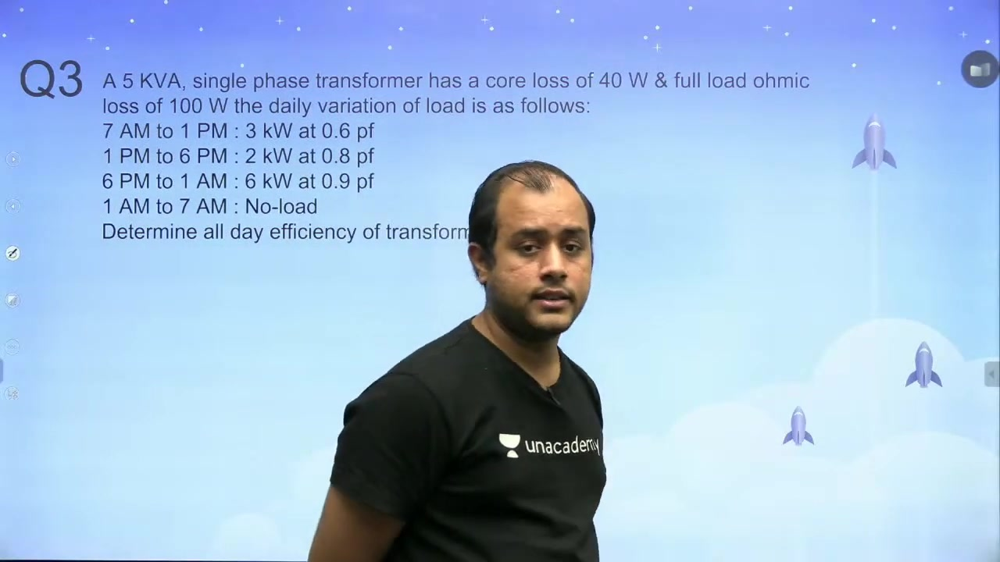

> [!example] Problem 3
> A $5\text{ kVA}$, single-phase transformer has a core loss of $40\text{ W}$ and a full-load copper loss of $100\text{ W}$.
> The daily load cycle is:
> 
> - $3\text{ kW}$ at $0.8\text{ pf lagging}$ for $4\text{ hours}$
> - $4\text{ kW}$ at $0.8\text{ pf lagging}$ for $4\text{ hours}$
> - Full load at unity power factor for $2\text{ hours}$
> - No-load for $14\text{ hours}$
> 
> Determine the all-day efficiency of the transformer.

### The Tabular Method

Constructing a table helps organize the calculations cleanly.
The essential parameters needed for each time interval are:

1. Active power delivered ($P$) in kilowatts.
2. Operating power factor ($\cos\phi$).
3. Duration of the load ($t$) in hours.
4. Output energy ($E_{\text{out}} = P \times t$) in kilowatt-hours.
5. Apparent power ($S = P / \cos\phi$) and load fraction ($x = S / S_{\text{rated}}$).
6. Copper loss energy ($E_{\text{cu}} = x^2 P_{\text{cu,fl}} \times t$) in kilowatt-hours.

The core loss occurs continuously for 24 hours regardless of load.
We will compute these values systematically in the next section.

## Problem 3: Execution of the Tabular Method for All-Day Efficiency
_(14:46 - 19:36)_

### Daily Load Cycle and Tabular Data

The transformer operates with the following load profile over 24 hours:

1. From 07:00 to 13:00 (6 hours): $3\text{ kW}$ at $0.6\text{ pf lagging}$.
2. From 13:00 to 18:00 (5 hours): $2\text{ kW}$ at $0.8\text{ pf lagging}$.
3. From 18:00 to 01:00 (7 hours): $6\text{ kW}$ at $0.9\text{ pf lagging}$.
4. From 01:00 to 07:00 (6 hours): No load ($0\text{ kW}$).

The transformer rating is $S_{\text{rated}} = 5\text{ kVA}$.
The full load copper loss is $P_{\text{cu,fl}} = 100\text{ W} = 0.1\text{ kW}$.
The core loss is $P_i = 40\text{ W} = 0.04\text{ kW}$.

### Tabular Evaluation of Energy Terms

We construct the table to compute energy delivered and energy lost in the windings:

| Interval | Time $t$ (h) | Power $P$ (kW) | $\cos\phi$ | $S = P/\cos\phi$ (kVA) | $x = S/S_{\text{rated}}$ | $E_{\text{out}} = P \cdot t$ (kWh) | $E_{\text{cu}} = x^2 P_{\text{cu,fl}} \cdot t$ (kWh) |
| :--- | :---: | :---: | :---: | :---: | :---: | :---: | :---: |
| 07:00 - 13:00 | 6 | 3 | 0.6 | $3/0.6 = 5.0$ | $5/5 = 1.0$ | $3 \times 6 = 18$ | $(1.0)^2 \times 0.1 \times 6 = 0.600$ |
| 13:00 - 18:00 | 5 | 2 | 0.8 | $2/0.8 = 2.5$ | $2.5/5 = 0.5$ | $2 \times 5 = 10$ | $(0.5)^2 \times 0.1 \times 5 = 0.125$ |
| 18:00 - 01:00 | 7 | 6 | 0.9 | $6/0.9 = 6.67$ | $6.67/5 = 4/3$ | $6 \times 7 = 42$ | $(4/3)^2 \times 0.1 \times 7 = 1.244$ |
| 01:00 - 07:00 | 6 | 0 | - | 0 | 0 | 0 | 0 |

### Total Energy Calculations

Sum the output energy across all intervals:
$$E_{\text{out,total}} = 18 + 10 + 42 + 0 = 70\text{ kWh}$$

Sum the energy consumed by copper losses in the windings:
$$
\begin{aligned}
E_{\text{cu,total}} &= 0.600 + 0.125 + \frac{11.2}{9} \\
&= 0.725 + 1.2444 = 1.9694\text{ kWh}
\end{aligned}
$$

Core loss occurs as long as the transformer remains connected to the supply.
Because the transformer stays energized for the entire 24 hours:
$$E_{i,\text{total}} = P_i \times 24 = 0.04\text{ kW} \times 24\text{ h} = 0.96\text{ kWh}$$

The total energy loss over the day is the sum of both loss components:
$$E_{\text{loss}} = E_{i,\text{total}} + E_{\text{cu,total}} = 0.96 + 1.9694 = 2.9294\text{ kWh}$$

### Calculation of All-Day Efficiency

Now compute the all-day efficiency using the energy ratio:
$$\eta_{\text{all-day}} = \frac{E_{\text{out,total}}}{E_{\text{out,total}} + E_{i,\text{total}} + E_{\text{cu,total}}}$$

Substitute the numerical values:
$$\eta_{\text{all-day}} = \frac{70}{70 + 0.96 + 1.9694} = \frac{70}{72.9294} \approx 0.9598 = 95.98\%$$

> [!success] Result
> The all-day efficiency of the $5\text{ kVA}$ distribution transformer is **$95.98\%$**.

## Problem 4: Efficiency, Load for Maximum Efficiency, and Maximum Efficiency Value
_(20:05 - 24:54)_

### Problem Statement

In this problem, we calculate transformer efficiency under specified operating conditions.
We also find the optimum load condition where efficiency reaches its maximum value.

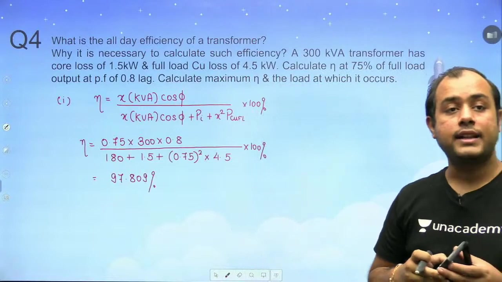

> [!example] Problem 4
> A $300\text{ kVA}$, single-phase transformer has a core loss of $1.5\text{ kW}$ and a full-load copper loss of $4.5\text{ kW}$.
> Determine:
> 
> 1. The efficiency at $75\%$ of full load with $0.8\text{ power factor lagging}$.
> 2. The load fraction at which maximum efficiency occurs.
> 3. The value of maximum efficiency at unity power factor.

### Part 1: Efficiency at 75% Full Load

The transformer rating is $S = 300\text{ kVA}$.
The core loss is $P_i = 1.5\text{ kW}$.
The full load copper loss is $P_{\text{cu,fl}} = 4.5\text{ kW}$.
The load fraction is $x = 0.75$, and power factor is $\cos\phi = 0.8$.

The active power delivered to the load is:
$$P_{\text{out}} = x S \cos\phi = 0.75 \times 300 \times 0.8 = 180\text{ kW}$$

The copper loss at this fraction of load is:
$$P_{\text{cu}} = x^2 P_{\text{cu,fl}} = (0.75)^2 \times 4.5\text{ kW} = 0.5625 \times 4.5 = 2.53125\text{ kW}$$

The iron loss remains constant at $P_i = 1.5\text{ kW}$.
Now compute the efficiency:
$$\eta = \frac{P_{\text{out}}}{P_{\text{out}} + P_i + P_{\text{cu}}} = \frac{180}{180 + 1.5 + 2.53125} = \frac{180}{184.03125} \approx 0.97809 = 97.809\%$$

### Part 2: Load for Maximum Efficiency

Maximum efficiency occurs when variable copper loss equals constant iron loss:
$$x^2 P_{\text{cu,fl}} = P_i$$

Solving for the load fraction $x$:
$$x = \sqrt{\frac{P_i}{P_{\text{cu,fl}}}} = \sqrt{\frac{1.5}{4.5}} = \frac{1}{\sqrt{3}} \approx 0.57735$$

Expressed as a percentage, maximum efficiency occurs at $57.74\%$ of full load.
In terms of apparent power, this corresponds to:
$$S_{\text{max}} = x S = 0.57735 \times 300\text{ kVA} \approx 173.21\text{ kVA}$$

### Part 3: Value of Maximum Efficiency

Maximum efficiency is highest at unity power factor ($\cos\phi = 1$).
At this condition, total losses equal twice the core loss:
$$P_{\text{loss}} = P_i + x^2 P_{\text{cu,fl}} = 2 P_i = 2 \times 1.5\text{ kW} = 3.0\text{ kW}$$

The active power output at maximum efficiency is:
$$P_{\text{out,max}} = x S \cos\phi = 173.205 \times 1 = 173.205\text{ kW}$$

Now evaluate the maximum efficiency:
$$\eta_{\text{max}} = \frac{173.205}{173.205 + 3.0} = \frac{173.205}{176.205} \approx 0.98297 = 98.297\%$$

> [!success] Result
> Efficiency at $75\%$ full load and $0.8\text{ pf}$ is **$97.809\%$**.
> Maximum efficiency occurs at **$57.74\%$ of full load** ($173.21\text{ kVA}$).
> The maximum efficiency value is **$98.297\%$**.

## Problem 5: Loss Separation from Multiple Operating Conditions
_(24:56 - 30:03)_

### Problem Statement

In this problem, efficiency is given under two different load fractions and power factors.
We set up simultaneous equations to separate iron loss and full load copper loss.

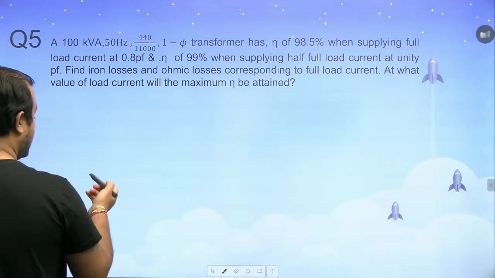

> [!example] Problem 5
> A $100\text{ kVA}$, $50\text{ Hz}$, $440/11000\text{ V}$, single-phase transformer has an efficiency of $98.5\%$ when supplying full-load current at $0.8\text{ power factor lagging}$.
> The efficiency is $99\%$ at half full-load current with unity power factor.
> Determine:
> 
> 1. The iron loss $P_i$.
> 2. The full load copper loss $P_{\text{cu,fl}}$.
> 3. The load current and kVA for maximum efficiency.

### Setting Up the Full Load Efficiency Equation

The general efficiency formula is:
$$\eta = \frac{x S \cos\phi}{x S \cos\phi + P_i + x^2 P_{\text{cu,fl}}}$$

For the first operating point:
- Load fraction $x = 1$ (full load)
- Apparent power $S = 100\text{ kVA}$
- Power factor $\cos\phi = 0.8$
- Efficiency $\eta = 0.985$

The active power output is:
$$P_{\text{out1}} = 1 \times 100 \times 0.8 = 80\text{ kW}$$

Substitute these values into the efficiency relation:
$$0.985 = \frac{80}{80 + P_i + (1)^2 P_{\text{cu,fl}}}$$

Rearranging gives the total losses at full load:
$$
\begin{aligned}
P_i + P_{\text{cu,fl}} &= \frac{80}{0.985} - 80 \\
&= \frac{80(1 - 0.985)}{0.985} \\
&= \frac{1.20}{0.985} \approx 1.21827\text{ kW} = 1218.27\text{ W}
\end{aligned}
$$

This yields our first equation:
$$P_i + P_{\text{cu,fl}} = 1218.27\text{ W} \quad \text{--- (1)}$$

### Setting Up the Half Load Efficiency Equation

For the second operating point:
- Load fraction $x = 0.5$ (half load)
- Apparent power $S = 100\text{ kVA}$
- Power factor $\cos\phi = 1.0$ (unity power factor)
- Efficiency $\eta = 0.99$

The active power output is:
$$P_{\text{out2}} = 0.5 \times 100 \times 1.0 = 50\text{ kW}$$

Substitute these values into the efficiency relation:
$$0.99 = \frac{50}{50 + P_i + (0.5)^2 P_{\text{cu,fl}}}$$

Rearranging gives the losses at half load:
$$
\begin{aligned}
P_i + 0.25 P_{\text{cu,fl}} &= \frac{50}{0.99} - 50 \\
&= \frac{50(1 - 0.99)}{0.99} \\
&= \frac{0.50}{0.99} \approx 0.50505\text{ kW} = 505.05\text{ W}
\end{aligned}
$$

This yields our second equation:
$$P_i + 0.25 P_{\text{cu,fl}} = 505.05\text{ W} \quad \text{--- (2)}$$

Both equations are now ready to be solved simultaneously to obtain individual losses.

## Problem 5 Completion and Core Loss Separation
_(30:16 - 35:21)_

### Solving for Losses in Problem 5

Subtract equation (2) from equation (1) obtained in the previous section:
$$(P_i + P_{\text{cu,fl}}) - (P_i + 0.25 P_{\text{cu,fl}}) = 1218.27 - 505.05$$

This simplifies directly to:
$$0.75 P_{\text{cu,fl}} = 713.22\text{ W}$$

Solving for the full load copper loss gives:
$$P_{\text{cu,fl}} = \frac{713.22}{0.75} \approx 950.96\text{ W} \approx 950.6\text{ W}$$

Now calculate the constant iron loss $P_i$:
$$P_i = 1218.27 - 950.96 = 267.31\text{ W} \approx 267.34\text{ W}$$

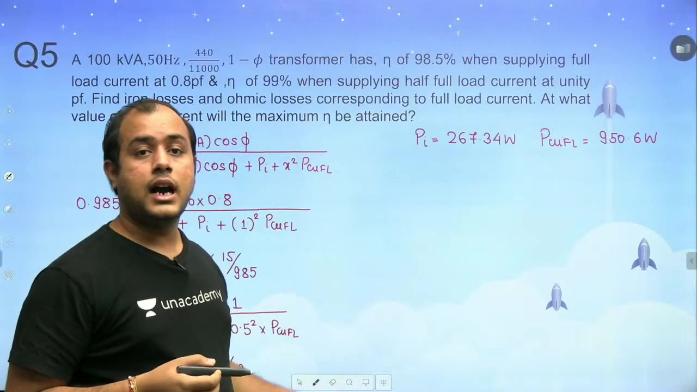

### Load Current for Maximum Efficiency

Maximum efficiency occurs at the load fraction $x$:
$$x = \sqrt{\frac{P_i}{P_{\text{cu,fl}}}} = \sqrt{\frac{267.34}{950.6}} \approx 0.5303$$

The rated full load current on the $11\text{ kV}$ high-voltage side is:
$$I_{\text{fl,HV}} = \frac{S_{\text{rated}}}{V_{\text{HV}}} = \frac{100\text{ kVA}}{11\text{ kV}} = \frac{100}{11} \approx 9.091\text{ A}$$

The load current corresponding to maximum efficiency is:
$$I_{\text{max}} = x \cdot I_{\text{fl,HV}} = 0.5303 \times 9.091\text{ A} \approx 4.821\text{ A}$$

> [!success] Result for Problem 5
> Iron loss is $267.34\text{ W}$.
> Full load copper loss is $950.6\text{ W}$.
> The load current for maximum efficiency is **$4.82\text{ A}$** on the $11\text{ kV}$ side.

---

### Problem 6: Separation of Core Losses

Separation of core losses isolates hysteresis loss from eddy current loss.
The open-circuit test is performed at different frequencies while maintaining constant flux density.

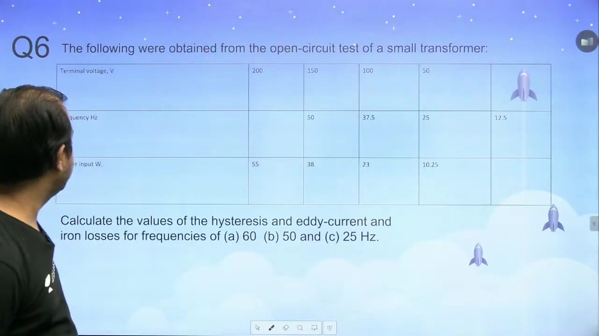

> [!example] Problem 6
> An open-circuit test on a transformer gives the following readings:
> 
> | Voltage $V$ (V) | Frequency $f$ (Hz) | Power $P_i$ (W) |
> | :---: | :---: | :---: |
> | 200 | 50.0 | 55.00 |
> | 150 | 37.5 | 38.00 |
> | 100 | 25.0 | 23.00 |
> | 50 | 12.5 | 10.25 |
> 
> Separate the core loss into its hysteresis and eddy current components at $50\text{ Hz}$ and $25\text{ Hz}$.

Notice that the ratio of voltage to frequency is identical across all rows:
$$\frac{V}{f} = \frac{200}{50} = \frac{150}{37.5} = \frac{100}{25} = \frac{50}{12.5} = 4.0\text{ V/Hz}$$

Because $V/f$ is constant, maximum flux density $B_m$ remains constant across all test points.
Total core loss is modeled as:
$$P_i = P_h + P_e = K_1 f + K_2 f^2$$

Dividing both sides by frequency produces a straight-line equation:
$$\frac{P_i}{f} = K_1 + K_2 f$$

Plotting or solving for $P_i/f$ against frequency yields the constants $K_1$ and $K_2$.

## Problem 6: Numerical Separation of Core Losses
_(35:21 - 40:01)_

### Derivation of Loss Coefficients

Because the $V/f$ ratio is constant at $4.0\text{ V/Hz}$, the peak flux density $B_m$ is constant.
Under constant peak flux density, the iron loss equation is:
$$P_i = P_h + P_e = K_1 f + K_2 f^2$$

Divide through by frequency $f$:
$$\frac{P_i}{f} = K_1 + K_2 f$$

Select two distinct data points to determine $K_1$ and $K_2$:

1. At $f_1 = 50\text{ Hz}$, $P_{i1} = 55\text{ W}$:
$$\frac{55}{50} = 1.10 = K_1 + 50 K_2 \quad \text{--- (1)}$$

2. At $f_2 = 25\text{ Hz}$, $P_{i2} = 23\text{ W}$:
$$\frac{23}{25} = 0.92 = K_1 + 25 K_2 \quad \text{--- (2)}$$

Subtract equation (2) from equation (1):
$$(K_1 + 50 K_2) - (K_1 + 25 K_2) = 1.10 - 0.92$$
$$25 K_2 = 0.18$$

Solve for $K_2$:
$$K_2 = \frac{0.18}{25} = 0.0072\text{ W/Hz}^2$$

Substitute $K_2$ into equation (2) to find $K_1$:
$$K_1 = 0.92 - 25(0.0072) = 0.92 - 0.18 = 0.74\text{ W/Hz}$$

So the separated loss expressions are:
$$
\begin{aligned}
P_h(f) &= 0.74 f \\
P_e(f) &= 0.0072 f^2
\end{aligned}
$$

### Core Loss Separation at Specified Frequencies

Now calculate the individual loss components at $50\text{ Hz}$, $60\text{ Hz}$, and $25\text{ Hz}$:

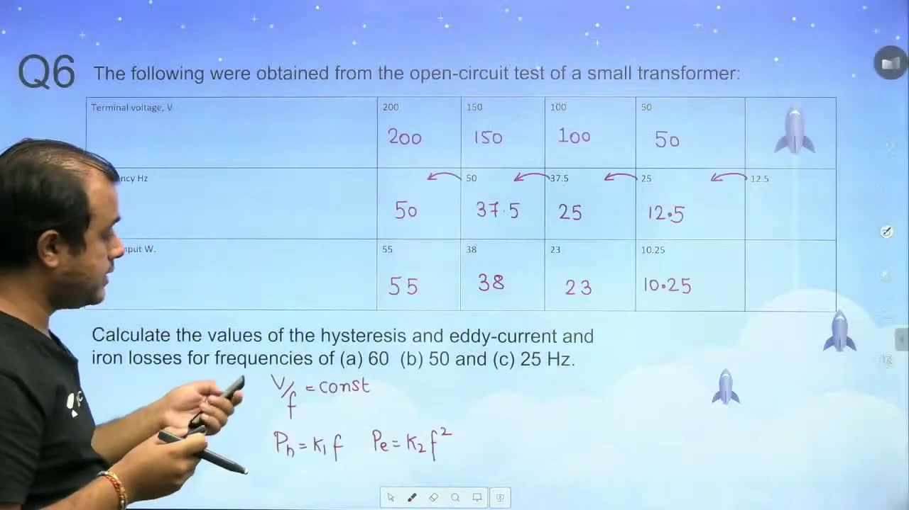

For $50\text{ Hz}$:
$$
\begin{aligned}
P_h(50) &= 0.74 \times 50 = 37.0\text{ W} \\
P_e(50) &= 0.0072 \times 50^2 = 18.0\text{ W} \\
P_i(50) &= 37.0 + 18.0 = 55.0\text{ W}
\end{aligned}
$$

For $60\text{ Hz}$:
$$
\begin{aligned}
P_h(60) &= 0.74 \times 60 = 44.4\text{ W} \\
P_e(60) &= 0.0072 \times 60^2 = 25.92\text{ W} \\
P_i(60) &= 44.4 + 25.92 = 70.32\text{ W}
\end{aligned}
$$

For $25\text{ Hz}$:
$$
\begin{aligned}
P_h(25) &= 0.74 \times 25 = 18.5\text{ W} \\
P_e(25) &= 0.0072 \times 25^2 = 4.5\text{ W} \\
P_i(25) &= 18.5 + 4.5 = 23.0\text{ W}
\end{aligned}
$$

| Frequency (Hz) | Hysteresis Loss $P_h$ (W) | Eddy Current Loss $P_e$ (W) | Total Core Loss $P_i$ (W) |
| :---: | :---: | :---: | :---: |
| 50 | 37.00 | 18.00 | 55.00 |
| 60 | 44.40 | 25.92 | 70.32 |
| 25 | 18.50 | 4.50 | 23.00 |

> [!success] Result
> The separated core losses are as follows:
> - For $50\text{ Hz}$: $P_h = 37.0\text{ W}$ and $P_e = 18.0\text{ W}$.
> - Operating at $60\text{ Hz}$ gives $P_h = 44.4\text{ W}$ with $P_e = 25.92\text{ W}$.
> - Finally, $25\text{ Hz}$ yields $P_h = 18.5\text{ W}$ and $P_e = 4.5\text{ W}$.

## Problem 7: Comparative Efficiency Across Load Fractions and Power Factors
_(41:01 - 46:31)_

### Problem Statement

This problem illustrates how transformer efficiency varies with loading level and power factor.
We evaluate six distinct operating points to observe these performance trends.

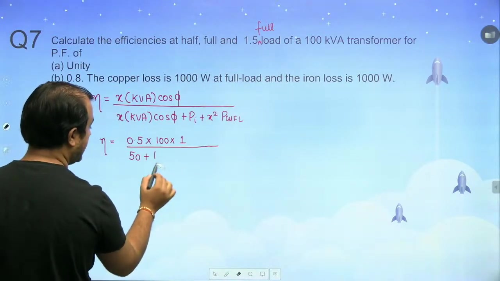

> [!example] Problem 7
> A $100\text{ kVA}$ transformer has an iron loss of $1\text{ kW}$ and a full-load copper loss of $1\text{ kW}$.
> Calculate the efficiency for:
> 
> 1. Unity power factor at half full load, full load, and $1.5$ times full load.
> 2. A power factor of $0.8\text{ lagging}$ at half full load, full load, and $1.5$ times full load.

### Case A: Efficiency at Unity Power Factor

The transformer rating is $S = 100\text{ kVA}$, with $P_i = 1\text{ kW}$ and $P_{\text{cu,fl}} = 1\text{ kW}$.
For unity power factor, $\cos\phi = 1$.
The general efficiency equation becomes:
$$\eta = \frac{x \times 100 \times 1}{(x \times 100 \times 1) + 1 + x^2(1)} = \frac{100 x}{100 x + 1 + x^2}$$

Evaluate this expression at the three specified load fractions:

At half full load ($x = 0.5$):
$$\eta = \frac{50}{50 + 1 + (0.5)^2(1)} = \frac{50}{51.25} \approx 0.97561 = 97.56\%$$

At rated full load ($x = 1.0$):
$$\eta = \frac{100}{100 + 1 + (1.0)^2(1)} = \frac{100}{102} \approx 0.98039 = 98.04\%$$

At $1.5$ times rated load ($x = 1.5$):
$$\eta = \frac{150}{150 + 1 + (1.5)^2(1)} = \frac{150}{153.25} \approx 0.97879 = 97.88\%$$

Notice that efficiency peaks at full load ($x = 1.0$).
This happens because iron loss equals full load copper loss ($P_i = P_{\text{cu,fl}} = 1\text{ kW}$).

### Case B: Efficiency at 0.8 Power Factor Lagging

Now consider operation at $\cos\phi = 0.8$:
$$\eta = \frac{x \times 100 \times 0.8}{(x \times 100 \times 0.8) + 1 + x^2(1)} = \frac{80 x}{80 x + 1 + x^2}$$

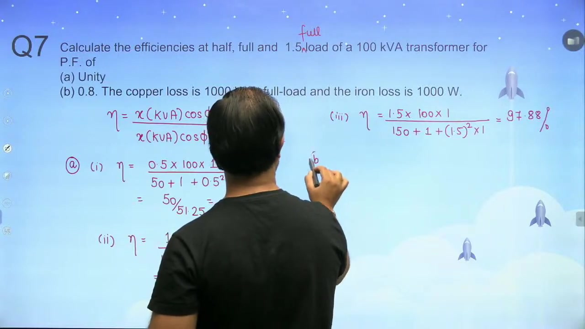

Evaluate this expression at the same three load fractions:

At half load ($x = 0.5$):
$$\eta = \frac{40}{40 + 1 + 0.25} = \frac{40}{41.25} \approx 0.96970 = 96.97\%$$

At full load ($x = 1.0$):
$$\eta = \frac{80}{80 + 1 + 1} = \frac{80}{82} \approx 0.97561 = 97.56\%$$

At $1.5$ times full load ($x = 1.5$):
$$\eta = \frac{120}{120 + 1 + 2.25} = \frac{120}{123.25} \approx 0.97363 = 97.36\%$$

### Physical Interpretation of Results

Comparing Case A and Case B reveals a fundamental rule:
Reducing the power factor from $1.0$ to $0.8$ reduces efficiency across all load levels.
The losses depend only on apparent power and voltage.
When power factor drops, the real power output decreases for the same current.
Because real power is smaller relative to the losses, efficiency drops.

---

### Introduction to Problem 8: Non-Sinusoidal Applied Voltage

The next problem examines non-sinusoidal voltages containing harmonic components.

> [!example] Problem 8
> A voltage $v(t) = 200\sin(\omega t) - 50\sin(3\omega t)\text{ V}$ is applied to a 250-turn transformer winding.
> 
> 1. Deduce an expression for the core flux $\phi(t)$.
> 2. Determine the percentage reduction in eddy current loss if the voltage is altered to $v(t) = 200\sin(\omega t)\text{ V}$.

We will evaluate the flux by integration and apply superposition for the losses.

## Problem 8: Non-Sinusoidal Applied Voltage and Eddy Current Loss
_(46:36 - 51:20)_

### Derivation of the Flux Waveform

The applied voltage contains a fundamental and a third harmonic component:
$$v(t) = 200\sin(\omega t) - 50\sin(3\omega t)\text{ V}$$

The winding contains $N = 250\text{ turns}$.
By Faraday's law of electromagnetic induction, induced voltage relates to core flux by:
$$v(t) = -N \frac{d\phi}{dt}$$

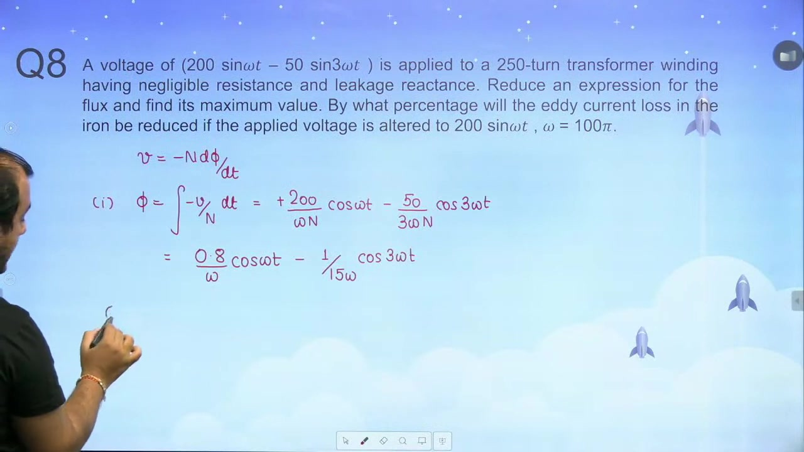

Integrate this expression with respect to time to find the flux:
$$\phi(t) = -\frac{1}{N} \int v(t)\,dt = -\frac{1}{250} \int \left[200\sin(\omega t) - 50\sin(3\omega t)\right] dt$$

Carrying out the integration term by term:
$$
\begin{aligned}
\phi(t) &= \frac{1}{250} \left[\frac{200}{\omega}\cos(\omega t) - \frac{50}{3\omega}\cos(3\omega t)\right] \\
&= \frac{200}{250\omega}\cos(\omega t) - \frac{50}{750\omega}\cos(3\omega t) \\
&= \frac{0.8}{\omega}\cos(\omega t) - \frac{1}{15\omega}\cos(3\omega t)
\end{aligned}
$$

This completes the first part of the problem.

### Eddy Current Loss Under Harmonic Voltages

Now consider the eddy current loss produced by non-sinusoidal voltages.
Eddy current loss per unit volume is proportional to the square of flux density and frequency:
$$P_e \propto B_m^2 f^2$$

Because peak flux density relates to voltage and frequency by $B_m \propto V/f$:
$$P_e \propto \left(\frac{V}{f}\right)^2 f^2 \propto V^2$$

The eddy current loss depends directly on the square of applied voltage.
It does not depend on the harmonic order or frequency.

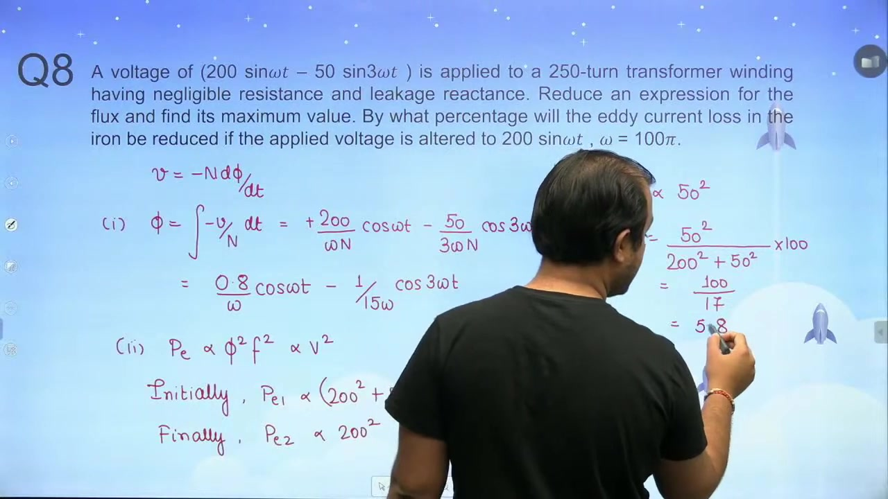

Because harmonics are orthogonal over a full cycle, we apply superposition to compute total loss.
Initial eddy current loss with both fundamental and third harmonic voltages is:
$$P_{e1} \propto V_1^2 + V_3^2 = 200^2 + 50^2 = 40000 + 2500 = 42500$$

When the voltage is altered to a pure fundamental sinusoid $v(t) = 200\sin(\omega t)$:
$$P_{e2} \propto V_1^2 = 200^2 = 40000$$

### Percentage Reduction in Eddy Current Loss

Now compute the percentage reduction relative to the initial condition:
$$\%\Delta P_e = \frac{P_{e1} - P_{e2}}{P_{e1}} \times 100\%$$

Substitute the numerical values:
$$\%\Delta P_e = \frac{42500 - 40000}{42500} \times 100\% = \frac{2500}{42500} \times 100\% = \frac{1}{17} \times 100\% \approx 5.88\%$$

> [!success] Result
> The expression for core flux is:
> $$\phi(t) = \frac{0.8}{\omega}\cos(\omega t) - \frac{1}{15\omega}\cos(3\omega t)\text{ Wb}$$
> The eddy current loss reduces by **$5.88\%$** when the harmonic is removed.

## Problem 9: Sumpner's Test and Problem 10 Setup
_(51:37 - 55:59)_

### Problem 9: Sumpner's Back-to-Back Test

Sumpner's test allows full-load testing of two identical transformers with minimal energy consumption.
The primary windings connect in parallel to rated voltage, while secondaries connect in phase opposition.

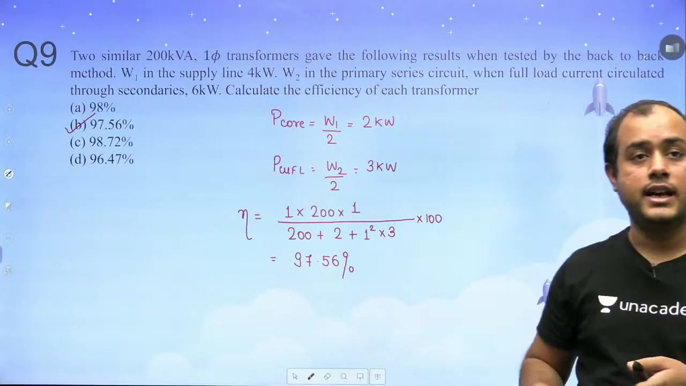

> [!example] Problem 9
> Two similar $200\text{ kVA}$ transformers are tested using Sumpner's method.
> Wattmeter $W_1$ connected to the supply side measures $5\text{ kW}$.
> Wattmeter $W_2$ connected in the secondary auxiliary circuit measures $5\text{ kW}$.
> Determine the efficiency of each transformer at full load and unity power factor.

### Analysis of Wattmeter Readings

In Sumpner's test, the two wattmeters separate the losses directly:

1. Wattmeter $W_1$ supplies the excitation of both transformer cores.
Because both cores are energized at rated voltage, $W_1$ measures total iron loss for both units:
$$P_i = \frac{W_1}{2} = \frac{5\text{ kW}}{2} = 2.5\text{ kW}$$

2. Wattmeter $W_2$ circulates full-load current through both windings.
Because secondaries are in opposition, no core flux is induced by this source.
So $W_2$ measures total full-load copper loss for both units:
$$P_{\text{cu,fl}} = \frac{W_2}{2} = \frac{5\text{ kW}}{2} = 2.5\text{ kW}$$

Now compute the full load efficiency at unity power factor ($\cos\phi = 1$):
$$\eta_{\text{fl}} = \frac{S \cos\phi}{S \cos\phi + P_i + P_{\text{cu,fl}}} = \frac{200 \times 1}{(200 \times 1) + 2.5 + 2.5} = \frac{200}{205} \approx 0.97561 = 97.56\%$$

> [!success] Result for Problem 9
> The efficiency of each transformer at full load unity power factor is **$97.56\%$**.

---

### Problem 10: Efficiency Calculation from Maximum Efficiency Data

This problem demonstrates how to extract core loss and copper loss from maximum efficiency data.

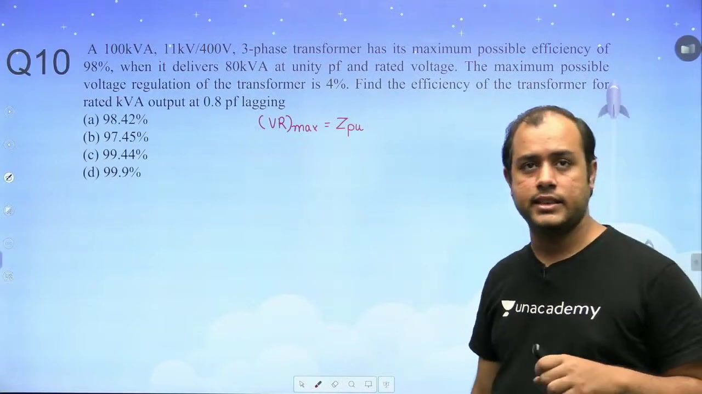

> [!example] Problem 10
> A $100\text{ kVA}$ transformer exhibits a maximum efficiency of $98\%$ at $80\text{ kVA}$ at unity power factor.
> The maximum possible voltage regulation is $4\%$.
> Find the efficiency at rated kVA with $0.8\text{ power factor lagging}$.

### Filtering Irrelevant Problem Data

The problem mentions that maximum possible voltage regulation is $4\%$.
Recall the formula for maximum voltage regulation:
$$\text{VR}_{\text{max}} = z_{\text{pu}} = 0.04\text{ pu}$$

This value provides information about transformer impedance.
However, calculating efficiency requires only active power output and losses.
Because losses can be determined directly from the maximum efficiency data, the voltage regulation value is superfluous.

### Formulation for Maximum Efficiency

The load fraction $x$ where maximum efficiency occurs is:
$$x = \frac{S_{\text{max}}}{S_{\text{rated}}} = \frac{80\text{ kVA}}{100\text{ kVA}} = 0.8$$

At maximum efficiency, copper loss equals core loss ($x^2 P_{\text{cu,fl}} = P_i$).
Total loss at this loading is $2 P_i$.
The maximum efficiency relation is:
$$\eta_{\text{max}} = \frac{x S_{\text{rated}} \cos\phi}{x S_{\text{rated}} \cos\phi + 2 P_i}$$

We will solve this relation in the next section to find $P_i$, $P_{\text{cu,fl}}$, and the target efficiency.

## Problem 10 Solution, Problem 11, and Problem 12
_(56:03 - 61:05)_

### Solving for Losses in Problem 10

From the maximum efficiency condition at $80\text{ kVA}$ with unity power factor:
$$\eta_{\text{max}} = 0.98 = \frac{80}{80 + 2 P_i}$$

Rearranging gives the total losses at maximum efficiency:
$$2 P_i = \frac{80(1 - 0.98)}{0.98} = \frac{80 \times 0.02}{0.98} = \frac{1.6}{0.98} = \frac{80}{49}\text{ kW}$$

Divide by 2 to find the iron loss:
$$P_i = \frac{40}{49}\text{ kW} \approx 0.8163\text{ kW} = 816.33\text{ W}$$

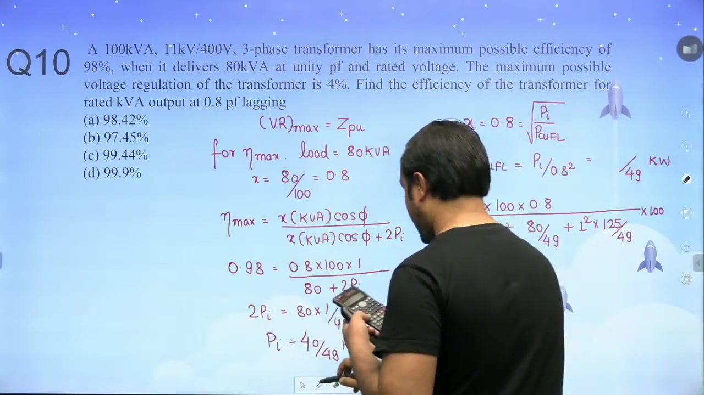

The load fraction is $x = 0.8$.
Use the condition for maximum efficiency to find full load copper loss:
$$x = \sqrt{\frac{P_i}{P_{\text{cu,fl}}}} \implies P_{\text{cu,fl}} = \frac{P_i}{x^2} = \frac{P_i}{0.64}$$

Substitute the value of $P_i$:
$$P_{\text{cu,fl}} = \frac{40/49}{0.64} = \frac{62.5}{49}\text{ kW} \approx 1.2755\text{ kW} = 1275.51\text{ W}$$

### Efficiency at Rated kVA and 0.8 Lagging Power Factor

Now evaluate efficiency at rated full load ($x = 1$) with $\cos\phi = 0.8$:
$$P_{\text{out}} = 1 \times 100 \times 0.8 = 80\text{ kW}$$

The total losses at full load are:
$$P_{\text{loss}} = P_i + P_{\text{cu,fl}} = \frac{40}{49} + \frac{62.5}{49} = \frac{102.5}{49}\text{ kW} \approx 2.0918\text{ kW}$$

Now compute the efficiency:
$$\eta = \frac{80}{80 + 2.0918} = \frac{80}{82.0918} \approx 0.97451 = 97.45\%$$

> [!success] Result for Problem 10
> The efficiency at rated kVA and $0.8\text{ pf lagging}$ is **$97.45\%$**.

---

### Problem 11: Maximum kVA Multiplier Formula

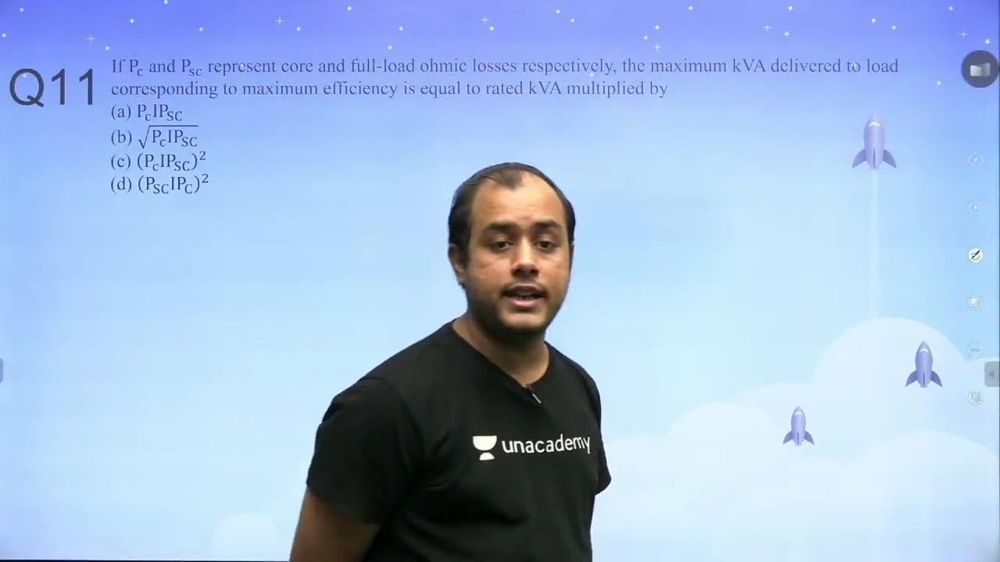

> [!example] Problem 11
> If $P_i$ and $P_{sc}$ represent the core and full-load ohmic losses respectively, the maximum kVA delivered to the load corresponding to maximum efficiency is equal to rated kVA multiplied by:
> 
> - (A) $P_i / P_{sc}$
> - (B) $\sqrt{P_i / P_{sc}}$
> - (C) $\sqrt{P_{sc} / P_i}$
> - (D) $(P_i / P_{sc})^2$

The condition for maximum efficiency equates core loss to copper loss:
$$x^2 P_{sc} = P_i \implies x = \sqrt{\frac{P_i}{P_{sc}}}$$

Because apparent power scales directly with load current fraction $x$:
$$S_{\text{max}} = x \cdot S_{\text{rated}} = \sqrt{\frac{P_i}{P_{sc}}} \cdot S_{\text{rated}}$$

So the multiplier for rated kVA is $\sqrt{P_i / P_{sc}}$.
The correct option is **(B)**.

---

### Problem 12: Ratio of Losses at Maximum Efficiency

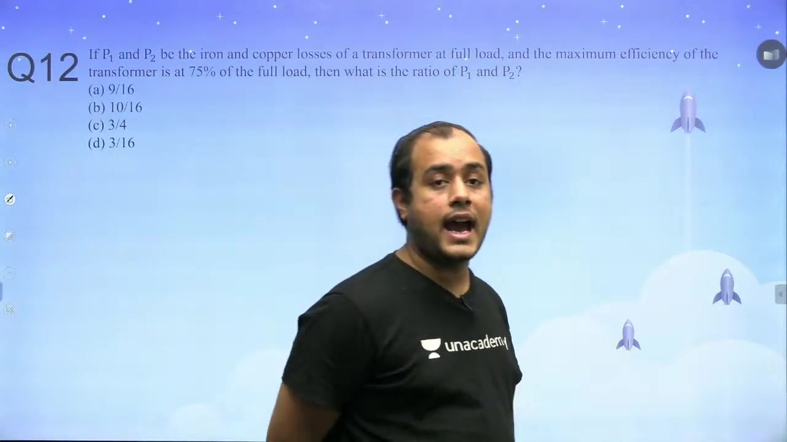

> [!example] Problem 12
> Let $P_1$ and $P_2$ be the iron and full-load copper losses of a transformer.
> If maximum efficiency occurs at $75\%$ of full load, find the ratio $P_1 / P_2$.

The load fraction is $x = 0.75 = 3/4$.
By the maximum efficiency condition:
$$x = \sqrt{\frac{P_1}{P_2}}$$

Square both sides to find the loss ratio:
$$\frac{P_1}{P_2} = x^2 = (0.75)^2 = \left(\frac{3}{4}\right)^2 = \frac{9}{16}$$

The ratio of iron loss to full-load copper loss is $9 : 16$.
The correct option is **(A)**.

## Problem 13 and Problem 14: Core Physics and Constant V/f Operation
_(61:08 - 65:59)_

### Problem 13: Air-Core Transformer Hysteresis Loss

This conceptual problem examines magnetic behavior when replacing ferromagnetic material with air.

> [!example] Problem 13
> If the iron core of a transformer is replaced by an air core, the hysteresis loss will:
> 
> - (A) Increase
> - (B) Decrease
> - (C) Remain the same
> - (D) Become zero

### Physical Analysis of the Air Core

Ferromagnetic materials exhibit a non-linear $B\text{-}H$ loop due to magnetic domain alignment.
The area enclosed by the hysteresis loop represents energy dissipated as heat per unit volume per cycle:
$$W_h = \oint H\,dB$$

Air is a non-ferromagnetic medium with constant permeability $\mu_0$:
$$B = \mu_0 H$$

The $B\text{-}H$ characteristic for air is a straight line passing through the origin.
It exhibits zero magnetic remanence and zero coercive force.
Because the forward and reverse magnetization paths trace the exact same line, the enclosed loop area is zero:
$$\text{Loop Area} = 0 \implies P_h = 0$$

So hysteresis loss in an air-core transformer is identically zero.
The correct option is **(D)**.

---

### Problem 14: Constant V/f Operation

This problem evaluates how magnetizing current and core loss respond when voltage changes with constant $V/f$.

> [!example] Problem 14
> The voltage applied to a transformer primary is increased while keeping the $V/f$ ratio constant.
> What is the impact on magnetizing current and core loss?
> 
> - (A) Magnetizing current remains the same, core loss reduces
> - (B) Magnetizing current increases, core loss remains the same
> - (C) Both increase
> - (D) Magnetizing current remains the same, core loss increases

### Analysis of Magnetizing Current

From the transformer electromotive force equation:
$$V \approx 4.44 f N \phi_m \implies \phi_m \propto \frac{V}{f}$$

Because the $V/f$ ratio remains constant, the core flux $\phi_m$ and peak flux density $B_m$ remain constant.
The magnetizing current $I_\mu$ depends directly on peak flux density:
$$I_\mu = \frac{H_m l}{\sqrt{2} N_1}$$

Because $B_m$ does not change, magnetic field intensity $H_m$ does not change.
So magnetizing current remains unchanged.

### Analysis of Core Loss

Now examine the two components of core loss under constant $V/f$:

1. Hysteresis loss varies with frequency:
$$P_h \propto B_m^n f \propto (1) f \propto f$$

2. Eddy current loss varies with the square of frequency:
$$P_e \propto B_m^2 f^2 \propto (1) f^2 \propto f^2$$

If voltage increases while maintaining constant $V/f$, the frequency $f$ must increase proportionally.
As frequency rises, both hysteresis loss and eddy current loss increase.
Therefore total core loss $P_{\text{core}} = P_h + P_e$ increases.

> [!success] Result
> Magnetizing current remains the same.
> Core loss increases.
> The correct option is **(D)**.

## Problem 15: Referring OC and SC Tests Across Frequencies
_(66:04 - 71:05)_

### Problem Statement

This problem involves transforming test results from one winding side and frequency to another.

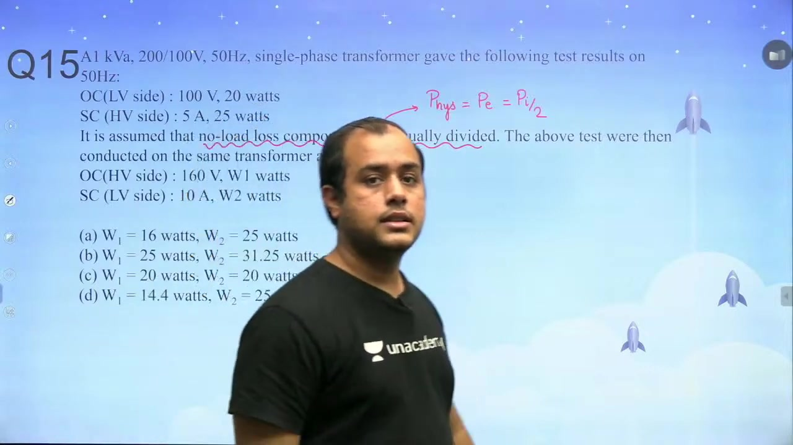

> [!example] Problem 15
> A $1\text{ kVA}$, $200/100\text{ V}$, $50\text{ Hz}$ single-phase transformer gives these test results at $50\text{ Hz}$:
> 
> - Open-circuit test on LV side: $100\text{ V}$, $20\text{ W}$ (losses are equally divided: $P_h = 10\text{ W}, P_e = 10\text{ W}$)
> - Short-circuit test on HV side: $5\text{ A}$, $25\text{ W}$
> 
> The transformer is now tested at $40\text{ Hz}$ with:
> 
> 1. An open-circuit test on the HV side at $160\text{ V}$ (wattmeter reading $W_1$).
> 2. A short-circuit test on the LV side at $10\text{ A}$ (wattmeter reading $W_2$).
> 
> Determine the wattmeter readings $W_1$ and $W_2$.

### Referring the 50 Hz Tests

First, refer the $50\text{ Hz}$ tests to match the winding sides of the $40\text{ Hz}$ tests:

1. Refer the open-circuit test from the LV side to the HV side.
The transformation ratio is $a = 200/100 = 2$.
The equivalent voltage on the HV side is:
$$V_{\text{HV}} = 100\text{ V} \times 2 = 200\text{ V}$$
The measured power represents core loss and remains unchanged:
$$P_{i1} = 20\text{ W} \implies P_{h1} = 10\text{ W}, \quad P_{e1} = 10\text{ W}$$

2. Refer the short-circuit test from the HV side to the LV side.
The rated current scales inversely with voltage ratio:
$$I_{\text{LV}} = 5\text{ A} \times 2 = 10\text{ A}$$
The measured copper loss remains unchanged at $25\text{ W}$.

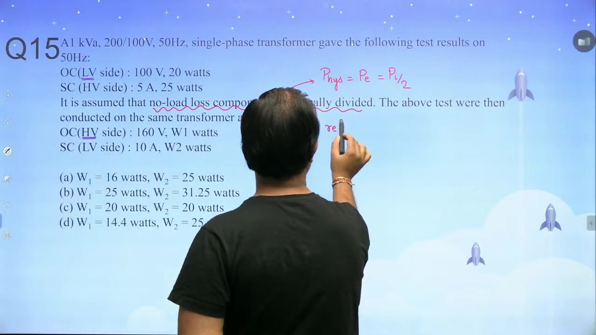

### Evaluation of Short-Circuit Test Reading W2

In the $40\text{ Hz}$ short-circuit test, current is $10\text{ A}$ on the LV side.
This current matches the referred current from the $50\text{ Hz}$ test.
Copper loss is given by:
$$P_{\text{cu}} = I^2 R$$

Winding resistance is essentially independent of supply frequency at power frequencies.
Because the current is the same, copper loss is unchanged:
$$W_2 = 25\text{ W}$$

### Evaluation of Open-Circuit Test Reading W1

In the $40\text{ Hz}$ open-circuit test, voltage is $160\text{ V}$ on the HV side.
Compare the $V/f$ ratios:
$$
\begin{aligned}
\text{Initial ratio}: \quad \frac{V_1}{f_1} &= \frac{200\text{ V}}{50\text{ Hz}} = 4.0\text{ V/Hz} \\
\text{New ratio}: \quad \frac{V_2}{f_2} &= \frac{160\text{ V}}{40\text{ Hz}} = 4.0\text{ V/Hz}
\end{aligned}
$$

Because the $V/f$ ratio is constant, the peak core flux density $B_m$ is constant.
Under constant flux density, scale the individual loss components with frequency:

The new hysteresis loss scales directly with frequency:
$$P_{h2} = P_{h1} \left(\frac{f_2}{f_1}\right) = 10\text{ W} \times \left(\frac{40}{50}\right) = 8.0\text{ W}$$

The new eddy current loss scales with frequency squared:
$$P_{e2} = P_{e1} \left(\frac{f_2}{f_1}\right)^2 = 10\text{ W} \times \left(\frac{40}{50}\right)^2 = 10 \times 0.64 = 6.4\text{ W}$$

The open-circuit wattmeter measures total core loss:
$$W_1 = P_{h2} + P_{e2} = 8.0 + 6.4 = 14.4\text{ W}$$

> [!success] Result
> The wattmeter readings at $40\text{ Hz}$ are:
> $$W_1 = 14.4\text{ W}, \quad W_2 = 25.0\text{ W}$$

## Problem 15 Wrap-Up and Lecture Summary
_(71:07 - 74:56)_

### Conclusion of Problem 15

In the previous section, the individual loss components at $40\text{ Hz}$ were derived:
$$
\begin{aligned}
P_{h2} &= 10 \times \left(\frac{40}{50}\right) = 8.0\text{ W} \\
P_{e2} &= 10 \times \left(\frac{40}{50}\right)^2 = 6.4\text{ W}
\end{aligned}
$$

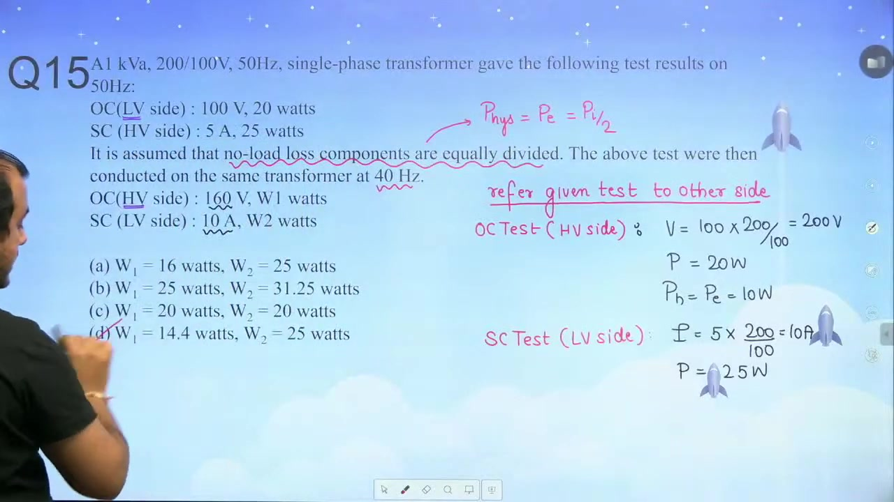

The open-circuit test wattmeter reading $W_1$ measures total core loss:
$$W_1 = P_{h2} + P_{e2} = 8.0 + 6.4 = 14.4\text{ W}$$

The short-circuit test wattmeter reading $W_2$ measures copper loss at $10\text{ A}$:
$$W_2 = 25.0\text{ W}$$

The correct answer is Option **(D)**.

---

### Key Takeaways on Losses and Efficiency

This problem session highlights several fundamental principles of transformer operation:

1. **Loss Behavior Under Constant Voltage vs. Constant $V/f$**:
At constant voltage, core flux density varies inversely with frequency ($B_m \propto 1/f$).
Hysteresis loss increases as frequency drops, while eddy current loss remains constant ($P_e \propto V^2$).
Under constant $V/f$, core flux density remains constant.
Both hysteresis loss ($\propto f$) and eddy current loss ($\propto f^2$) scale directly with frequency.

2. **Per-Unit Equivalence**:
The per-unit equivalent resistance of a transformer numerically equals the full-load copper loss in per unit:
$$R_{\text{pu}} = P_{\text{cu,fl,pu}}$$

3. **All-Day Efficiency**:
All-day efficiency requires an energy basis over a full 24-hour cycle.
Core loss runs continuously for 24 hours regardless of load.
Copper loss energy scales with the square of the hourly load fraction:
$$E_{\text{cu}} = x^2 P_{\text{cu,fl}} \times t$$

4. **Maximum Efficiency Conditions**:
Maximum efficiency occurs when variable copper loss equals constant core loss:
$$x_{\text{max}} = \sqrt{\frac{P_i}{P_{\text{cu,fl}}}}$$
For any given load, efficiency is always highest at unity power factor because real power output is maximized.

5. **Harmonics and Loss Superposition**:
Because harmonic voltage components are orthogonal over a full fundamental cycle, eddy current losses superimpose:
$$P_e \propto \sum V_n^2$$

6. **Air-Core Transformers**:
Air possesses a linear $B\text{-}H$ characteristic with zero remanence and zero coercivity.
Its enclosed loop area is zero, so hysteresis loss is identically zero.

---

### Upcoming Lecture Roadmap

The next sequence of lectures covers advanced transformer topics:

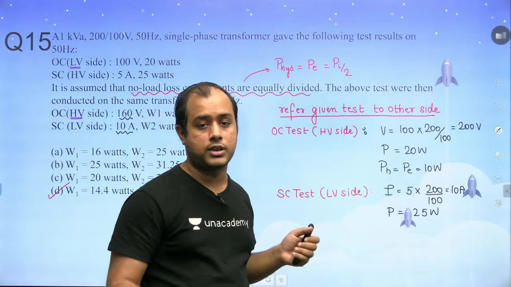

- **Voltage Regulation**: Phasor diagrams, approximate voltage drop formulas, condition for zero and maximum regulation.
- **Transformer Ratings**: Temperature rise, cooling methods, and kVA rating adjustments.
- **Three-Winding Transformers**: Equivalent circuits, impedance tests, and tertiary winding stabilization.
- **Autotransformers**: Conductive and inductive power transfer, copper saving, and conversion of two-winding units.

---

## Summary and Key Takeaways

- Operating at constant voltage with reduced frequency increases maximum flux density $B_m \propto V/f$, causing hysteresis loss to increase while eddy current loss remains constant.
- The per-unit equivalent resistance of a transformer numerically equals the full-load copper loss in per unit: $R_{\text{pu}} = P_{\text{cu,fl,pu}}$.
- All-day efficiency is evaluated on a 24-hour energy basis where core loss acts continuously and copper loss scales as $x^2 P_{\text{cu,fl}} t$.
- Maximum efficiency occurs when variable copper loss equals constant iron loss ($x^2 P_{\text{cu,fl}} = P_i$), and it always peaks at unity power factor.
- Under constant $V/f$ ratio, core loss separates into linear and quadratic frequency terms: $P_i / f = K_1 + K_2 f$.
- For non-sinusoidal voltages, eddy current loss depends on the sum of squared harmonic voltages by superposition: $P_e \propto \sum V_n^2$.
- In Sumpner's test, the supply-side wattmeter measures total core loss for both units, while the secondary wattmeter measures total full-load copper loss.
- Air-core transformers have zero hysteresis loss because air has a linear $B\text{-}H$ characteristic with zero loop area.
- Referring open-circuit and short-circuit tests to target winding sides allows direct frequency scaling of losses using constant $V/f$ relations.

