[← Lec 026: Problems Based on Losses and Efficiency in Transformers](Lecture_026_Problems_Based_on_Losses_and_Efficiency_in_Transformers.md) | [🏠 Index](00_yt_study_guide.md) | [Lec 028: Problems based on Voltage Regulation of Transformer →](Lecture_028_Problems_based_on_Voltage_Regulation_of_Transformer.md)

---

# Voltage Regulation | Electrical Machines | Lec 19 | GATE/ESE (EE, ECE) | Ankit Goyal

- **Source**: https://www.youtube.com/watch?v=rnehcEm07Fk
- **Duration**: 01:16:37
- **Compiled**: 2026-09-20

---

## Overview

This lecture develops the theory, derivation, and design methods for voltage regulation in transformers. It begins with the fundamental definitions of regulation up and regulation down before deriving the approximate per-unit regulation formula from phasor geometry. The lecture establishes operating conditions for maximum and zero voltage regulation along with their characteristic curves. Finally, it presents practical core and winding construction techniques used to minimize leakage flux and improve voltage regulation.

## Contents

- [[#Concept and Definition of Voltage Regulation|Concept and Definition of Voltage Regulation]]
- [[#Standards and Conventions for Voltage Regulation|Standards and Conventions for Voltage Regulation]]
- [[#Primary and Secondary Formulations of Voltage Regulation|Primary and Secondary Formulations of Voltage Regulation]]
- [[#Practical Importance of Voltage Regulation|Practical Importance of Voltage Regulation]]
- [[#Phasor Diagram for Lagging Power Factor|Phasor Diagram for Lagging Power Factor]]
- [[#Geometric Projection of Voltage Drops|Geometric Projection of Voltage Drops]]
- [[#Validation of the Approximate Voltage Drop|Validation of the Approximate Voltage Drop]]
- [[#Per-Unit Derivation and Leading Power Factor|Per-Unit Derivation and Leading Power Factor]]
- [[#Sign Conventions and Load Dependence|Sign Conventions and Load Dependence]]
- [[#Voltage Drop Notation and Maximum Voltage Regulation|Voltage Drop Notation and Maximum Voltage Regulation]]
- [[#Magnitude of Maximum Regulation and Zero Regulation Condition|Magnitude of Maximum Regulation and Zero Regulation Condition]]
- [[#Voltage Regulation Curve and Summary|Voltage Regulation Curve and Summary]]
- [[#Reduction of Leakage Reactance by Window Design|Reduction of Leakage Reactance by Window Design]]
- [[#Winding Arrangements and Core Construction for Low Regulation|Winding Arrangements and Core Construction for Low Regulation]]

---

## Concept and Definition of Voltage Regulation
_(00:13 - 05:09)_

Voltage regulation measures how well a transformer maintains constant terminal voltage under varying loads. The word regulation refers to control. In an ideal transformer, the output voltage remains fixed regardless of the load current.

### Physical Mechanism of Voltage Drop

In practice, connecting more load draws higher secondary current. This current flows through the series winding resistance and leakage reactance of the transformer.

As current rises, the internal voltage drop across this series impedance increases. This internal drop leaves less voltage at the output terminals. Therefore, terminal voltage usually drops as load increases. Ideally, this voltage variation should be zero.

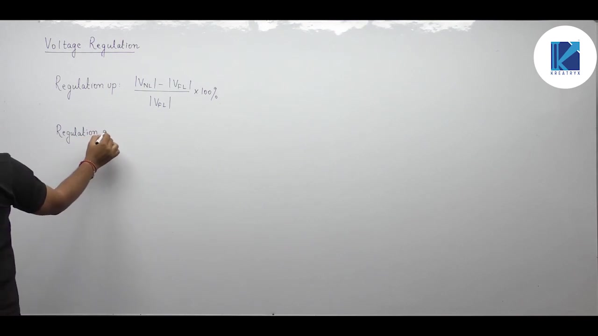

### Formal Definitions

Electrical engineering defines voltage regulation in two different ways. The distinction depends on the choice of voltage in the denominator.

> [!info] Definition: Regulation Up and Regulation Down
> **Regulation Up** compares the voltage drop to the full-load terminal voltage:
> $$\text{Regulation up} = \frac{|V_{\text{NL}}| - |V_{\text{FL}}|}{|V_{\text{FL}}|} \times 100\%$$
>
> **Regulation Down** compares the voltage drop to the no-load terminal voltage:
> $$\text{Regulation down} = \frac{|V_{\text{NL}}| - |V_{\text{FL}}|}{|V_{\text{NL}}|} \times 100\%$$

Here $|V_{\text{NL}}|$ is the magnitude of the no-load terminal voltage. $|V_{\text{FL}}|$ is the magnitude of the full-load terminal voltage. In transformers, regulation down is standard practice because the primary voltage is held fixed.

## Standards and Conventions for Voltage Regulation
_(05:12 - 10:12)_

When terminal voltage drops under load, full-load voltage $|V_{\text{FL}}|$ is smaller than no-load voltage $|V_{\text{NL}}|$. Because $|V_{\text{FL}}|$ is smaller, dividing by it gives a higher numerical percentage. This is why it is called regulation up. Dividing by the larger no-load voltage $|V_{\text{NL}}|$ gives a smaller percentage, termed regulation down.

### Recommended Practical Formula

To avoid confusion between regulation up and regulation down, use the rated voltage in the denominator.

> [!success] Standard Formula
> $$\text{VR} = \frac{|V_{\text{NL}}| - |V_{\text{FL}}|}{|V_{\text{rated}}|} \times 100\%$$

If you calculate regulation on the primary side, divide by the primary rated voltage. If you calculate on the secondary side, divide by the secondary rated voltage.

### Standard Problem Solving Assumptions

Examination questions sometimes omit operating conditions. Always apply the following standard rules:

1. **Power Factor**: If the power factor is not stated, assume unity power factor ($\cos\phi = 1$).
2. **Waveform**: Always assume sinusoidal voltages unless harmonics are mentioned.
3. **Load Level**: If the load is unspecified, assume full rated load ($x = 1$).
4. **Scalar Difference**: Always use the difference between voltage magnitudes. Do not perform vector subtraction of phasors.

### Neglecting the Shunt Branch

When analyzing voltage regulation, we neglect the magnetizing shunt branch ($R_c$ and $X_m$). The no-load excitation current is only $2\%$ to $5\%$ of rated current.

Neglecting this small branch introduces negligible error. The transformer model simplifies to the equivalent series impedance:

$$\bar{Z}_{01} = R_{01} + jX_{01}$$

This equivalent impedance is placed in series with the ideal transformer.

## Primary and Secondary Formulations of Voltage Regulation
_(10:17 - 15:17)_

Voltage regulation measures the voltage change experienced by the load. Therefore, always compute voltage regulation at the load terminals. In a step-down or step-up transformer, the load connects across the secondary winding.

### Formulation Referred to Primary

Consider the transformer equivalent circuit referred to the primary side. The secondary terminal voltage refers to the primary as $V_2'$.

At no load, secondary current $I_2$ is zero. This makes reflected current $I_1'$ zero. With no current flowing, the internal drop across $R_{01}$ and $X_{01}$ vanishes. Therefore, no-load voltage $|V_2'|_{\text{nl}}$ equals input voltage $|V_1|$.

> [!info] Primary Formulation
> $$\text{VR} = \frac{|V_1| - |V_2'|_{\text{fl}}}{|V_{1,\text{rated}}|} \times 100\%$$

Here $|V_2'|_{\text{fl}}$ is the full-load secondary voltage referred to the primary.

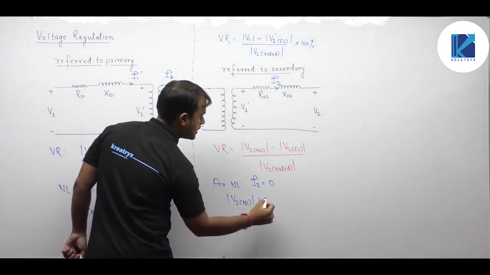

### Formulation Referred to Secondary

Now refer the primary voltage to the secondary side:

$$V_1' = \frac{N_2}{N_1} V_1$$

The equivalent circuit now contains secondary impedance $R_{02} + jX_{02}$ and terminal voltage $V_2$. At no load, current $I_2$ is zero. With zero internal drop across $R_{02}$ and $X_{02}$, no-load terminal voltage equals $V_1'$:

$$|V_2|_{\text{nl}} = |V_1'|$$

> [!info] Secondary Formulation
> $$\text{VR} = \frac{|V_1'| - |V_2|_{\text{fl}}}{|V_{2,\text{rated}}|} \times 100\%$$

### Equivalence of Both Formulations

Both formulations yield identical numerical values. Multiply the primary formulation numerator and denominator by the turns ratio $N_2 / N_1$:

$$\frac{\frac{N_2}{N_1} (|V_1| - |V_2'|_{\text{fl}})}{\frac{N_2}{N_1} |V_{1,\text{rated}}|} = \frac{|V_1'| - |V_2|_{\text{fl}}}{|V_{2,\text{rated}}|}$$

The two expressions are identical. You can solve problems on either side without discrepancy.

## Practical Importance of Voltage Regulation
_(15:20 - 19:54)_

Voltage regulation can be calculated using either primary or secondary quantities. Both give the same result because the turns ratio $N_2 / N_1$ cancels out completely.

### Distribution vs Power Transformers

Voltage regulation has different importance depending on transformer application.

In **distribution transformers**, loads connect directly to the secondary terminals. End consumers expect steady rated voltage. If the transformer has poor voltage regulation, heavy loading causes significant voltage sag. Low voltage dims lights, slows down cooling fans, and causes motors to draw higher current. This overheating can damage household and industrial appliances.

> [!info] Operational Requirement
> Distribution transformers must have minimal voltage regulation to protect consumer appliances from voltage sags.

In **power transformers**, the output feeds high-voltage transmission lines rather than consumers directly. Grid operators adjust system voltage using tap changers, capacitor banks, and reactive power support. Therefore, low voltage regulation is less critical in power transformers.

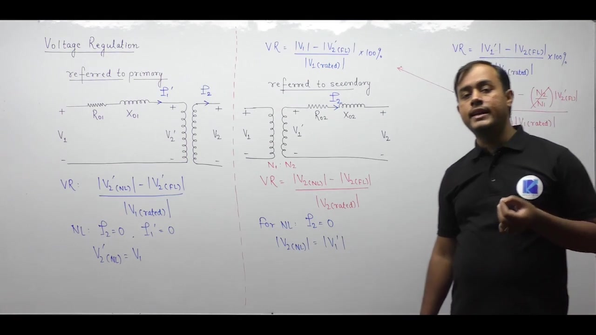

### Basis for Approximate Calculation

Exact phasor calculations for terminal voltage are computationally tedious. In practice, engineers use an approximate formula.

To derive this formula, consider the transformer equivalent circuit referred to the secondary side:

$$\bar{V}_1' = \bar{V}_2 + \bar{I}_2 (R_{02} + jX_{02})$$

Here $\bar{V}_1'$ is the primary voltage referred to the secondary. $\bar{V}_2$ is the terminal voltage across the load, and $\bar{I}_2$ is the load current.

## Phasor Diagram for Lagging Power Factor
_(20:00 - 24:31)_

To derive the voltage regulation formula, analyze the secondary equivalent circuit using Kirchhoff's Voltage Law. The phasor equation relates input and output voltages:

$$\bar{V}_1' = \bar{V}_2 + \bar{I}_2 R_{02} + j\bar{I}_2 X_{02}$$

Here $\bar{V}_1'$ is the referred no-load voltage. $\bar{V}_2$ is the load voltage, and $\bar{I}_2$ is the load current.

### Constructing the Phasor Diagram

Most practical loads draw lagging reactive power. We construct the phasor diagram for a lagging power factor load:

1. **Reference Axis**: Place the secondary terminal voltage phasor $\bar{V}_2$ along the horizontal reference axis from origin $O$ to point $B$. Length $OB$ equals $|V_2|$.
2. **Current Phasor**: Draw load current $\bar{I}_2$ lagging $\bar{V}_2$ by the power factor angle $\phi$.
3. **Resistive Drop**: From point $B$, draw phasor $\bar{I}_2 R_{02}$ parallel to $\bar{I}_2$.
4. **Reactive Drop**: From the tip of the resistive drop, draw $j\bar{I}_2 X_{02}$ perpendicular to $\bar{I}_2$ in the leading direction ($+90^\circ$). Because leakage reactance exceeds resistance in practical transformers, this segment is two to three times longer than $\bar{I}_2 R_{02}$.
5. **Resultant Phasor**: Connect origin $O$ to tip $A$. Phasor $OA$ represents $\bar{V}_1'$, with length $|V_1'|$.

The phase angle between $\bar{V}_1'$ and $\bar{V}_2$ is the power angle $\delta$.

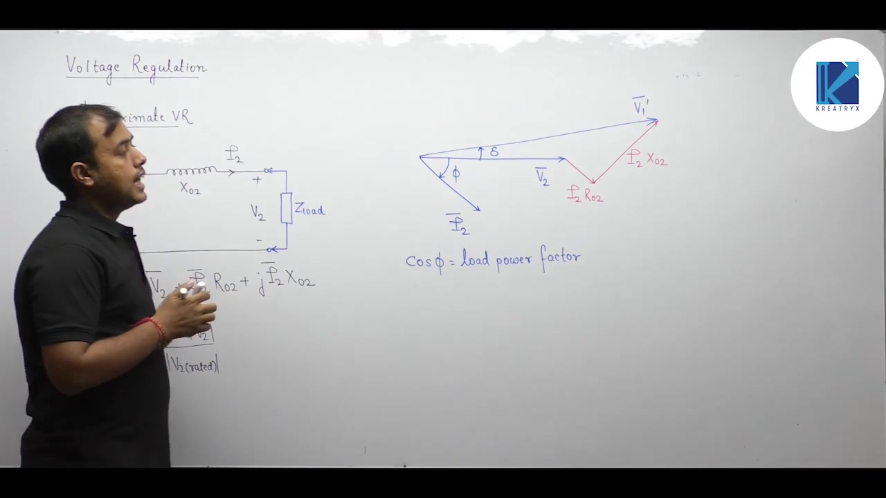

### Geometric Arc Construction

Voltage regulation requires the scalar difference between magnitudes $|V_1'|$ and $|V_2|$.

Because $\bar{V}_1'$ and $\bar{V}_2$ do not lie along the same line, use a geometric arc construction:

- Place a compass at origin $O$ with radius $OA = |V_1'|$.
- Draw a circular arc centered at $O$ that intersects the horizontal axis at point $F$.
- The length $OF$ equals radius $OA$, so $OF = |V_1'|$.

Since $OB = |V_2|$, the required scalar difference is segment $BF$:

$$|V_1'| - |V_2| = OF - OB = BF$$

Evaluating length $BF$ directly gives the voltage drop under load.

## Geometric Projection of Voltage Drops
_(24:34 - 29:29)_

To evaluate the scalar voltage drop $|V_1'| - |V_2|$, decompose the horizontal distance $OF$ into individual segments.

### Geometric Decomposition

The total horizontal distance from the origin $O$ to point $F$ consists of four segments:

$$OF = OB + BC + CD + DF$$

Here $OF = |V_1'|$ and $OB = |V_2|$. Subtracting $OB$ gives the exact voltage difference:

$$|V_1'| - |V_2| = BC + CD + DF$$

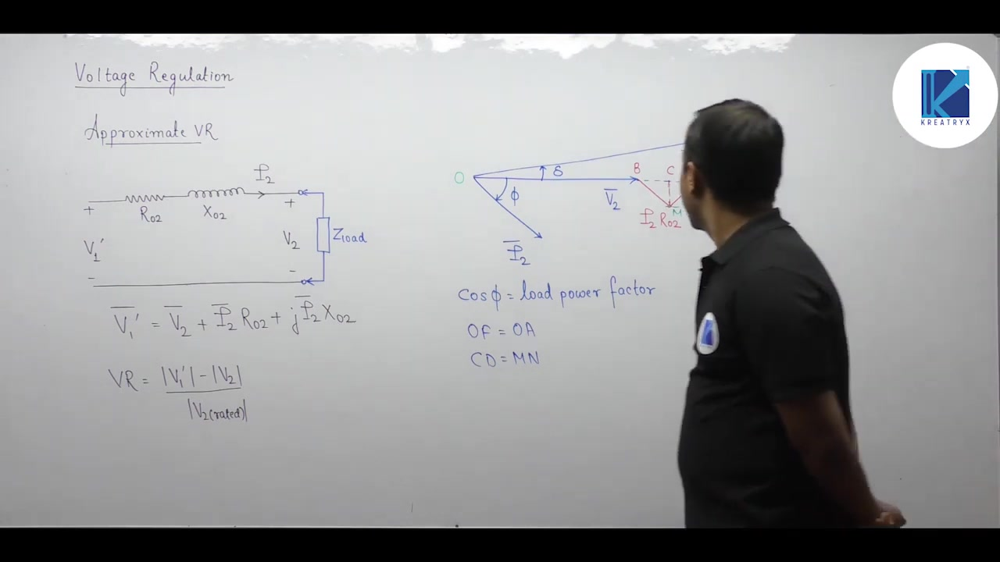

### Evaluating the Projections

Drop perpendicular lines to decompose the impedance drops:

1. **Resistive Drop Projection ($BC$)**:
   The resistive drop phasor $BM$ has magnitude $I_2 R_{02}$. It is parallel to current $\bar{I}_2$, so it is inclined at angle $\phi$ to the horizontal axis. In the right-angled triangle $BMC$:
   $$BC = BM \cos\phi = I_2 R_{02} \cos\phi$$

2. **Reactive Drop Projection ($CD$)**:
   The reactive drop phasor $AM$ has magnitude $I_2 X_{02}$. It is perpendicular to $BM$. Because $BM$ is inclined at angle $\phi$ to the horizontal, $AM$ is inclined at angle $90^\circ - \phi$ to the horizontal.

   Projecting $AM$ horizontally gives segment $MN$. From the rectangular geometry, segment $CD$ equals $MN$. In the right-angled triangle $AMN$:
   $$CD = MN = AM \cos(90^\circ - \phi) = I_2 X_{02} \sin\phi$$

### Combined Horizontal Drop

Adding segments $BC$ and $CD$ yields the primary horizontal projection:

$$BC + CD = I_2 R_{02} \cos\phi + I_2 X_{02} \sin\phi$$

This expression accounts for almost all of the voltage drop. Only the tiny residual segment $DF$ remains to be evaluated.

## Validation of the Approximate Voltage Drop
_(29:30 - 34:22)_

The exact scalar voltage drop is $|V_1'| - |V_2| = BC + CD + DF$. To obtain a simple expression, we examine the magnitude of segment $DF$.

### Neglecting Segment DF

In the right-angled triangle $OAD$, the horizontal base is $OD$:

$$OD = OA \cos\delta$$

The total horizontal radius is $OF = OA = |V_1'|$. The residual segment is:

$$DF = OF - OD = OA(1 - \cos\delta)$$

When $DF$ is neglected, $OD \approx OF$. This implies $\cos\delta \approx 1$, which requires the power angle $\delta$ to be very small.

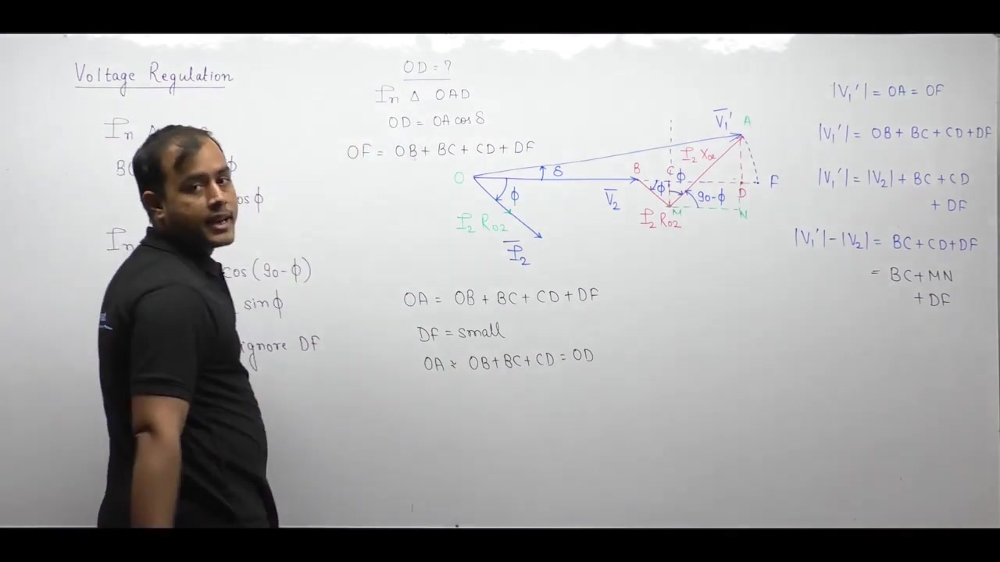

### Validity Conditions and System Limitations

This approximation holds only when two conditions are satisfied:

1. The angle $\delta$ between no-load and load voltage is very small.
2. The winding resistance and leakage reactance are small.

In transformers, both conditions are satisfied. The per-unit series impedance is only a few percent, so $\delta$ rarely exceeds $2^\circ$ or $3^\circ$.

> [!warning] Critical Distinction
> Never apply this approximate formula to synchronous machines or power system transmission lines. In synchronous machines, the synchronous reactance $X_s$ is large, often exceeding $1.0\text{ pu}$. The power angle $\delta$ can reach $30^\circ$ to $45^\circ$, making $DF$ significant.

### Approximate Voltage Difference

Neglecting $DF$, the scalar voltage difference simplifies to the sum of projections:

$$
\begin{aligned}
|V_1'| - |V_2| &\approx BC + MN \\
&= I_2 R_{02} \cos\phi + I_2 X_{02} \sin\phi \\
&= I_2 (R_{02} \cos\phi + X_{02} \sin\phi)
\end{aligned}
$$

This provides the scalar voltage drop under lagging power factor.

## Per-Unit Derivation and Leading Power Factor
_(34:22 - 39:48)_

To convert the approximate voltage drop into voltage regulation, divide the secondary voltage difference by the rated secondary voltage.

### Derivation in Per-Unit Form

Let $x$ represent the fractional loading of the transformer:

$$x = \frac{I_2}{I_{2,\text{rated}}}$$

For full load $x = 1$, for half load $x = 0.5$, and for quarter load $x = 0.25$. Substituting $I_2 = x I_{2,\text{rated}}$ into the voltage drop gives:

$$\Delta V = x I_{2,\text{rated}} (R_{02} \cos\phi + X_{02} \sin\phi)$$

Now divide by rated secondary voltage $V_{2,\text{rated}}$:

$$\text{VR} = \frac{x I_{2,\text{rated}} (R_{02} \cos\phi + X_{02} \sin\phi)}{V_{2,\text{rated}}} = x \left( \frac{R_{02}}{Z_{2,\text{base}}} \cos\phi + \frac{X_{02}}{Z_{2,\text{base}}} \sin\phi \right)$$

Here the secondary base impedance is:

$$Z_{2,\text{base}} = \frac{V_{2,\text{rated}}}{I_{2,\text{rated}}}$$

Dividing actual ohmic values by base impedance converts them directly into per-unit values:

$$\frac{R_{02}}{Z_{2,\text{base}}} = R_{02,\text{pu}}, \quad \frac{X_{02}}{Z_{2,\text{base}}} = X_{02,\text{pu}}$$

Per-unit resistance and reactance are identical on both primary and secondary sides:

$$R_{02,\text{pu}} = R_{01,\text{pu}} = R_{\text{pu}}, \quad X_{02,\text{pu}} = X_{01,\text{pu}} = X_{\text{pu}}$$

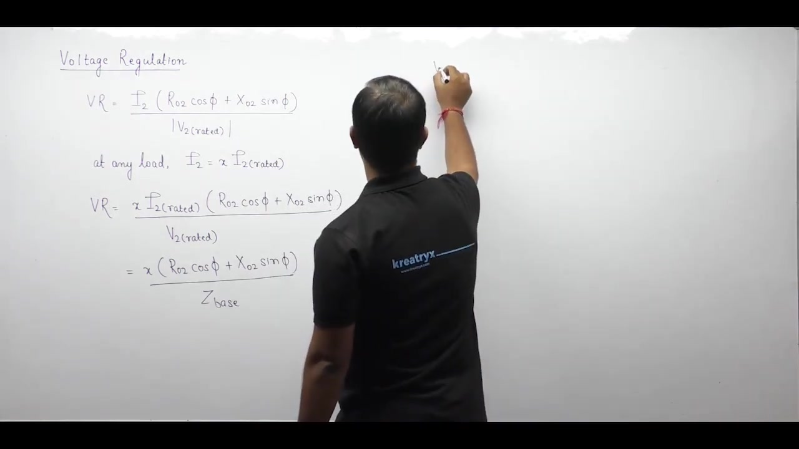

### Extension to Leading Power Factor

The derivation assumed a lagging power factor where current lags terminal voltage. For a leading power factor, current leads voltage, so replace $\phi$ with $-\phi$:

$$
\begin{aligned}
\cos(-\phi) &= \cos\phi \\
\sin(-\phi) &= -\sin\phi
\end{aligned}
$$

> [!success] General Approximate Formula
> $$\text{VR} = x (R_{\text{pu}} \cos\phi \pm X_{\text{pu}} \sin\phi)$$
> Use the plus sign for lagging power factor. Use the minus sign for leading power factor.

### Caution on Sign Conventions

Two valid conventions exist for handling leading power factor:

1. **Explicit Minus Sign**: Use the minus sign in the formula and insert the positive magnitude of angle $\phi$.
2. **Single Formula**: Keep the plus sign and substitute a negative angle into $\sin\phi$.

Choose one convention and apply it consistently. Never use both at the same time. Using a minus sign in the formula while also inserting a negative angle will result in a double negative and give an incorrect answer.

## Sign Conventions and Load Dependence
_(39:49 - 44:56)_

Students often get confused by the sign of the power factor angle $\phi$. It is essential to distinguish between the physical current angle and the algebraic formula convention.

### Physical vs Algebraic Conventions

In circuit analysis, taking voltage as reference gives:

$$\bar{V} = V\angle 0^\circ$$

Under this reference, lagging current has a negative angle:

$$\bar{I} = I\angle -\phi$$

Leading current has a positive angle:

$$\bar{I} = I\angle +\phi$$

Our voltage regulation expression was derived specifically for a lagging load. In that derivation, $\phi$ was defined as a positive geometric angle.

To use that same formula for a leading load, we substitute $-\phi$. This is purely an algebraic transformation. It allows one equation to serve both cases. It does not alter the physical definition of lagging or leading current.

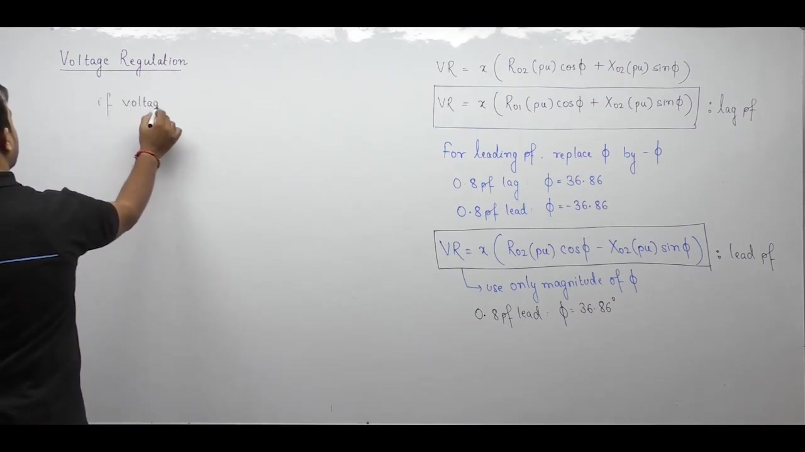

### Operating Parameter Dependence

Voltage regulation depends on two operating parameters:

1. **Fractional Loading ($x$)**: Regulation is directly proportional to $x$. Increasing the load current increases the internal impedance drop. This creates larger voltage fluctuation.
2. **Power Factor Angle ($\phi$)**: Regulation varies with load power factor through $\cos\phi$ and $\sin\phi$.

Recall that transformer efficiency also depends on $x$ and $\phi$. These two variables govern the performance of the machine.

### Physical Meaning of Per-Unit Impedance

Consider the ohmic voltage drop across the winding resistance:

$$\Delta V_R = I_2 R_{02} = x I_{2,\text{rated}} R_{02}$$

To express this drop in per unit, divide by rated voltage $V_{2,\text{rated}}$:

$$\Delta V_{R,\text{pu}} = \frac{x I_{2,\text{rated}} R_{02}}{V_{2,\text{rated}}} = x \frac{R_{02}}{Z_{2,\text{base}}} = x R_{02,\text{pu}}$$

At full rated load ($x = 1$), the per-unit voltage drop across resistance equals $R_{\text{pu}}$. Similarly, the full-load per-unit voltage drop across reactance equals $X_{\text{pu}}$.

## Voltage Drop Notation and Maximum Voltage Regulation
_(45:01 - 54:47)_

Standard textbooks often express the voltage regulation formula using per-unit voltage drop coefficients.

### The $\epsilon_R$ and $\epsilon_X$ Notation

Define the per-unit voltage drops across the series elements at fractional load $x$:

$$
\begin{aligned}
\epsilon_R &= x R_{\text{pu}} = \text{per-unit voltage drop due to resistance} \\
\epsilon_X &= x X_{\text{pu}} = \text{per-unit voltage drop due to reactance}
\end{aligned}
$$

Using these definitions, the voltage regulation formula becomes:

> [!info] Voltage Drop Formulation
> $$\text{VR} = \epsilon_R \cos\phi \pm \epsilon_X \sin\phi$$
> In percentage terms:
> $$\%\text{VR} = (\%\epsilon_R \cos\phi \pm \%\epsilon_X \sin\phi)$$

At full load ($x = 1$), per-unit resistance $R_{\text{pu}}$ equals the full-load resistive voltage drop. Similarly, $X_{\text{pu}}$ equals the full-load reactive voltage drop.

Exam problems often give the percentage resistive and reactive voltage drops directly instead of specifying ohmic parameters.

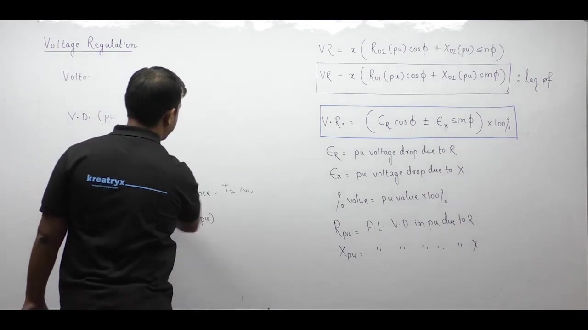

### Condition for Maximum Voltage Regulation

Maximum voltage regulation represents the largest voltage drop. This is the worst operating condition.

Because terms add for lagging power factor and subtract for leading power factor, maximum regulation always occurs under lagging conditions.

To find the condition for maximum regulation, differentiate with respect to $\phi$ and set the derivative to zero:

$$
\begin{aligned}
\frac{d}{d\phi} [x (R_{\text{pu}} \cos\phi + X_{\text{pu}} \sin\phi)] &= 0 \\
x (-R_{\text{pu}} \sin\phi + X_{\text{pu}} \cos\phi) &= 0 \\
R_{\text{pu}} \sin\phi &= X_{\text{pu}} \cos\phi
\end{aligned}
$$

Dividing gives:

$$\tan\phi = \frac{X_{\text{pu}}}{R_{\text{pu}}} = \frac{X}{R}$$

### Physical Interpretation of the Maximum Condition

Do not confuse load impedance with transformer internal impedance.

Here $\phi$ is the load power factor angle:

$$\tan\phi = \frac{X_{\text{load}}}{R_{\text{load}}}$$

The internal transformer impedance angle is $\theta$:

$$\tan\theta = \frac{X_{02}}{R_{02}}$$

> [!success] Condition for Maximum Voltage Regulation
> $$\tan\phi = \tan\theta \implies \phi = \theta$$
> Maximum voltage regulation occurs when the load impedance angle equals the internal transformer impedance angle. In terms of ratios:
> $$\left(\frac{X}{R}\right)_{\text{load}} = \left(\frac{X}{R}\right)_{\text{transformer}}$$

The operating power factor at maximum voltage regulation is:

$$\cos\phi_{\max} = \frac{R}{Z} \quad (\text{lagging})$$

The corresponding sine is:

$$\sin\phi_{\max} = \frac{X}{Z}$$

## Magnitude of Maximum Regulation and Zero Regulation Condition
_(54:48 - 59:47)_

After finding the condition for maximum regulation, evaluate its numerical magnitude.

### Magnitude of Maximum Voltage Regulation

Substitute $\cos\phi = R/Z$ and $\sin\phi = X/Z$ into the lagging regulation formula:

$$
\begin{aligned}
\text{VR}_{\max} &= x (R_{\text{pu}} \cos\phi + X_{\text{pu}} \sin\phi) \\
&= x \left( R_{\text{pu}} \frac{R}{Z} + X_{\text{pu}} \frac{X}{Z} \right) \\
&= x \left( \frac{R^2 + X^2}{Z \cdot Z_{\text{base}}} \right) \\
&= x \frac{Z^2}{Z \cdot Z_{\text{base}}} = x \frac{Z}{Z_{\text{base}}} \\
&= x Z_{\text{pu}}
\end{aligned}
$$

At full rated load ($x = 1$), the maximum voltage regulation equals the per-unit impedance:

> [!success] Maximum Voltage Regulation Result
> $$\text{VR}_{\max} = x Z_{\text{pu}}$$
> At full load ($x = 1$):
> $$\text{VR}_{\max} = Z_{\text{pu}} = Z_{01,\text{pu}} = Z_{02,\text{pu}}$$

The maximum percentage voltage regulation equals the percentage impedance of the transformer.

### Condition for Zero Voltage Regulation

Zero voltage regulation means the terminal voltage under load equals the no-load voltage. This is the ideal operating condition.

For lagging power factor, the resistive and reactive drops add. Two positive terms cannot sum to zero. Therefore, zero voltage regulation cannot occur at lagging power factor.

Zero voltage regulation can only occur at a leading power factor where the terms subtract:

$$
\begin{aligned}
\text{VR} &= x (R_{\text{pu}} \cos\phi - X_{\text{pu}} \sin\phi) = 0 \\
R_{\text{pu}} \cos\phi &= X_{\text{pu}} \sin\phi
\end{aligned}
$$

Dividing gives the tangent of the load angle:

$$\tan\phi = \frac{R_{\text{pu}}}{X_{\text{pu}}} = \frac{R}{X}$$

### Relationship Between Angles

The internal transformer impedance angle is $\theta$, where:

$$\tan\theta = \frac{X}{R}$$

Therefore, the ratio $R/X$ can be expressed as:

$$\frac{R}{X} = \cot\theta = \tan(90^\circ - \theta)$$

> [!success] Condition for Zero Voltage Regulation
> $$\tan\phi = \tan(90^\circ - \theta) \implies \phi = 90^\circ - \theta \quad (\text{leading})$$
> In terms of impedance ratios:
> $$\left(\frac{X}{R}\right)_{\text{load}} = \left(\frac{R}{X}\right)_{\text{transformer}}$$

The power factor required for zero voltage regulation is:

$$\cos\phi_0 = \frac{X}{Z} \quad (\text{leading})$$

The corresponding sine is:

$$\sin\phi_0 = \frac{R}{Z}$$

## Voltage Regulation Curve and Summary
_(59:47 - 65:13)_

Plotting voltage regulation against load power factor reveals how terminal voltage behaves across different load types.

### Characteristic Curve of Voltage Regulation

Plot voltage regulation on the vertical axis against power factor on the horizontal axis. Place leading power factors on the left, unity in the center, and lagging on the right:

1. **Unity Power Factor ($\cos\phi = 1$)**:
   At unity power factor, $\sin\phi = 0$. Regulation equals the resistive drop:
   $$\text{VR}_{\text{upf}} = x R_{\text{pu}}$$
2. **Lagging Region**:
   Regulation increases as the power factor drops from unity. It reaches its peak at $\cos\phi = R/Z$:
   $$\text{VR}_{\max} = x Z_{\text{pu}}$$
3. **Leading Region**:
   Regulation decreases as current leads. It crosses zero at:
   $$\cos\phi_0 = \frac{X}{Z} \quad (\text{leading})$$
   For lower leading power factors, regulation becomes negative.

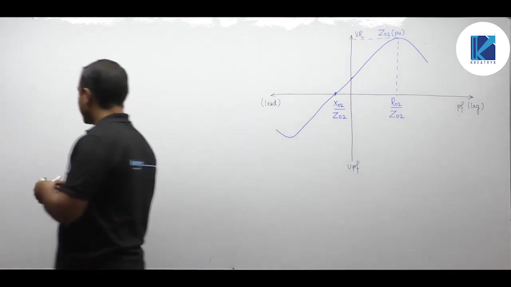

### Physical Meaning of Negative Regulation

A negative voltage regulation means:

$$\text{VR} < 0 \implies |V_{\text{FL}}| > |V_{\text{NL}}|$$

Under leading loads, the full-load terminal voltage exceeds the no-load voltage. The capacitive load current flowing through the leakage inductance creates a voltage boost. This behavior is similar to the Ferranti effect on unloaded transmission lines.

> [!info] Summary of Operating Conditions
> | Operating Condition | Power Factor | Power Factor Angle $\phi$ | Voltage Regulation |
> | :--- | :--- | :--- | :--- |
> | **Maximum VR** | $\cos\phi = R/Z$ (lagging) | $\tan\phi = X/R$ | $\text{VR}_{\max} = x Z_{\text{pu}}$ |
> | **Unity PF** | $\cos\phi = 1$ | $\phi = 0^\circ$ | $\text{VR} = x R_{\text{pu}}$ |
> | **Zero VR** | $\cos\phi = X/Z$ (leading) | $\tan\phi = R/X$ | $\text{VR} = 0$ |
> | **Negative VR** | $\cos\phi < X/Z$ (leading) | $\tan\phi > R/X$ | $\text{VR} < 0$ |

### Design Trade-offs

Transformer designers must balance efficiency and voltage regulation:

- **Winding Resistance**: Resistance causes $I^2 R$ copper losses. Reducing resistance improves efficiency.
- **Leakage Reactance**: Reactance causes voltage drop. Reducing leakage reactance improves voltage regulation.

Therefore, reducing reactance improves voltage regulation without significantly changing efficiency.

## Reduction of Leakage Reactance by Window Design
_(65:19 - 70:23)_

Improving voltage regulation means reducing the percentage voltage drop. Because leakage reactance is much larger than resistance, reactance dominates voltage regulation.

### Physical Origin of Leakage Reactance

Transformers do not contain physical lumped inductors. Winding current creates leakage flux that completes its path through air and non-magnetic insulation.

This leakage flux induces a self-induced leakage EMF. In circuit models, this effect is represented by leakage reactance $X_l$. Therefore, reducing leakage reactance requires reducing leakage flux:

$$\Phi_l = \frac{\text{MMF}}{\mathcal{R}_l}$$

To reduce leakage flux for a given winding MMF, increase the reluctance $\mathcal{R}_l$ of the leakage path:

$$\mathcal{R}_l = \frac{l}{\mu A}$$

Here $l$ is the path length, $A$ is the cross-sectional area of the path, and $\mu$ is permeability.

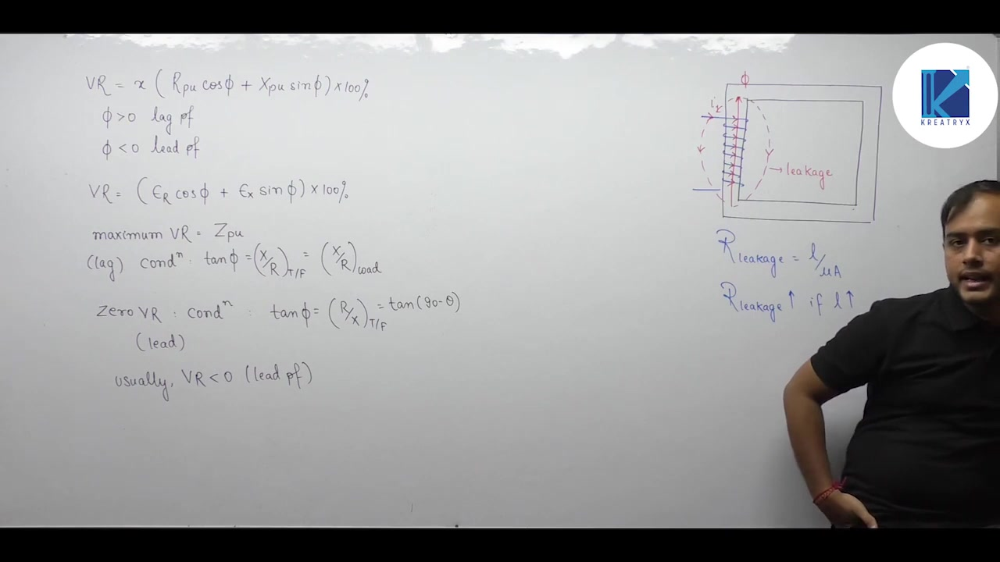

### Method 1: Increasing Window Height

Consider the core window dimensions with height $H$ and width $W$. The window area is:

$$A_w = H \times W$$

Keep this window area constant so the core accommodates the required winding turns.

If the window height $H$ is increased, the winding becomes taller and narrower. Leakage flux lines traveling axially along the limb must travel a longer distance through air.

This longer path length increases the reluctance offered to leakage flux:

$$H \uparrow \implies l \uparrow \implies \mathcal{R}_l \uparrow \implies \Phi_l \downarrow \implies X_l \downarrow$$

> [!success] Design Rule
> Increasing window height at constant window area increases leakage reluctance. This reduces leakage reactance and improves voltage regulation.

In practical transformer design, the aspect ratio of the window is constrained:

$$\frac{H}{W} \le 4$$

Exceeding this ratio makes the core limbs excessively tall and mechanically weak.

## Winding Arrangements and Core Construction for Low Regulation
_(70:23 - 76:25)_

In addition to adjusting window proportions, designers use specific winding configurations and core geometries to minimize leakage flux.

### Method 2: Concentric Windings

In core-type transformers, both primary and secondary windings are placed on the same limb rather than on separate limbs.

The low-voltage (LV) winding is placed closer to the core to minimize required insulation. Major insulation is placed over the LV winding, followed by the high-voltage (HV) winding. Concentric placement brings the two windings into close proximity, providing tight magnetic coupling.

Also, the winding turns are divided equally between both limbs:

$$N_{\text{limb}} = \frac{N}{2}$$

This division halves the magnetomotive force on each limb:

$$F_{\text{limb}} = \frac{N_1}{2} I_1$$

Because leakage flux is proportional to MMF, halving the MMF per limb directly cuts the leakage flux in half.

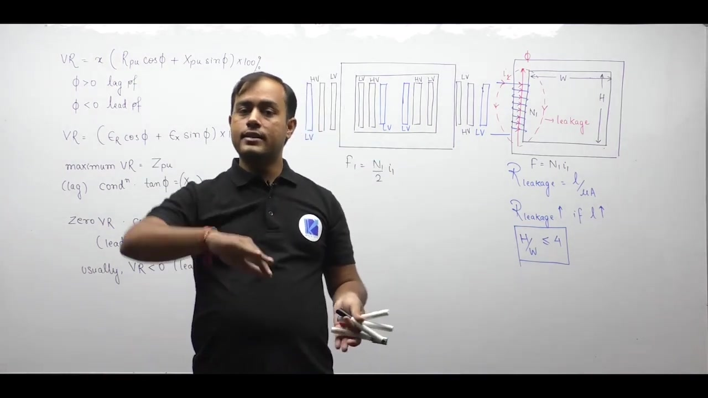

### Method 3: Sandwich Windings

In sandwich or interleaved windings, coils are divided into thin disc sections arranged axially along the limb.

HV sections are sandwiched between LV sections (LV - HV - LV). Because each section carries only a fraction of the total turns, the local MMF driving leakage flux is drastically reduced. This interleaving substantially lowers the total leakage reactance.

### Method 4: Shell-Type Core Construction

In a shell-type transformer, both windings are mounted on the central limb. Two outer limbs flank the central limb on either side.

Magnetic iron surrounds the coils on both sides. Magnetic flux finds a very low reluctance path through the iron rather than leaking through air. So shell-type transformers exhibit lower leakage reactance and better voltage regulation than core-type units.

### Summary of Leakage Reduction Methods

> [!success] Methods to Improve Voltage Regulation
> 1. **Increase Window Height**: Keep window area constant and increase $H/W$ (up to $H/W \le 4$) to lengthen the leakage path.
> 2. **Use Concentric Windings**: Place LV inside and HV outside on the same limb, splitting turns equally across limbs.
> 3. **Use Sandwich Windings**: Interleave HV and LV disc coils to reduce local MMF.
> 4. **Use Shell-Type Cores**: Surround windings with iron core limbs to confine magnetic flux.

These construction methods ensure that transformer voltage regulation remains within acceptable utility limits.

---

## Summary and Key Takeaways

- Voltage regulation is defined as $\text{VR} = \frac{|V_{\text{NL}}| - |V_{\text{FL}}|}{|V_{\text{rated}}|} \times 100\%$, using the rated voltage of the evaluated side in the denominator.
- The approximate per-unit voltage regulation formula is $\text{VR} = x (R_{\text{pu}} \cos\phi \pm X_{\text{pu}} \sin\phi)$, where the plus sign applies to lagging loads and the minus sign applies to leading loads.
- In terms of percentage voltage drops, regulation is written as $\%\text{VR} = (\%\epsilon_R \cos\phi \pm \%\epsilon_X \sin\phi)$, where $\epsilon_R = x R_{\text{pu}}$ and $\epsilon_X = x X_{\text{pu}}$.
- Maximum voltage regulation occurs at a lagging power factor of $\cos\phi = R/Z$, where the load $X/R$ ratio equals the transformer internal $X/R$ ratio.
- The magnitude of maximum voltage regulation equals $x Z_{\text{pu}}$, which simplifies to the per-unit impedance $Z_{\text{pu}}$ at full rated load.
- Zero voltage regulation occurs only at a leading power factor of $\cos\phi = X/Z$, where $\tan\phi = R/X$ and the load angle satisfies $\phi = 90^\circ - \theta$.
- For leading power factors with $\cos\phi < X/Z$, voltage regulation becomes negative, meaning the full-load terminal voltage exceeds the no-load voltage.
- Leakage reactance dominates voltage regulation, so regulation is reduced by increasing window height at constant window area with $H/W \le 4$.
- Concentric windings with split turns, interleaved sandwich windings, and shell-type core geometries reduce leakage flux and minimize voltage regulation.

---

[← Lec 026: Problems Based on Losses and Efficiency in Transformers](Lecture_026_Problems_Based_on_Losses_and_Efficiency_in_Transformers.md) | [🏠 Index](00_yt_study_guide.md) | [Lec 028: Problems based on Voltage Regulation of Transformer →](Lecture_028_Problems_based_on_Voltage_Regulation_of_Transformer.md)
