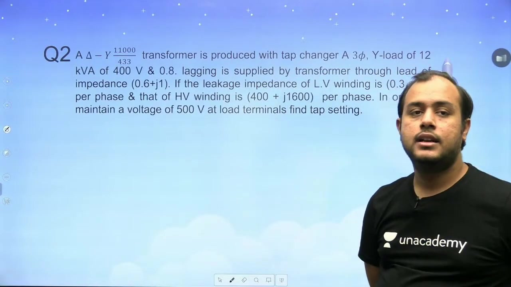
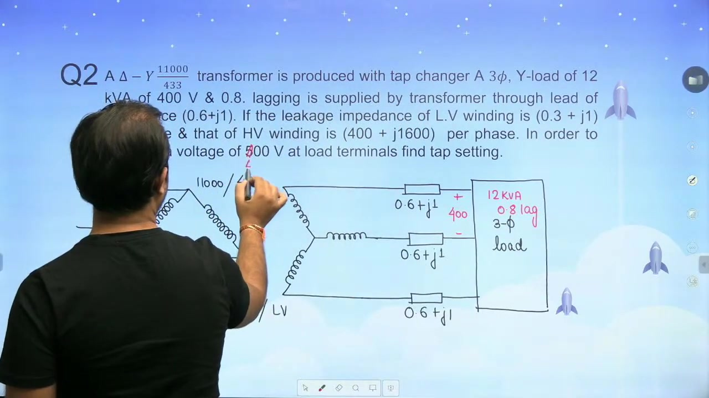
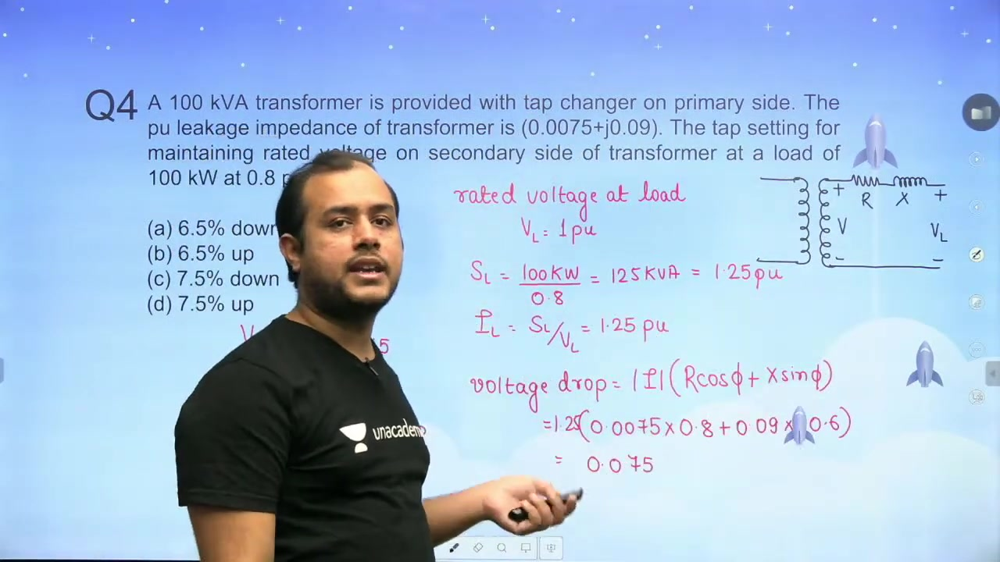
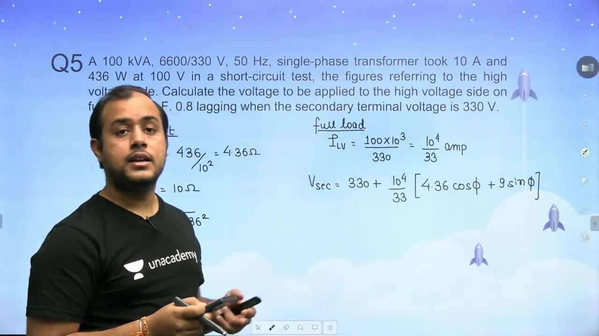
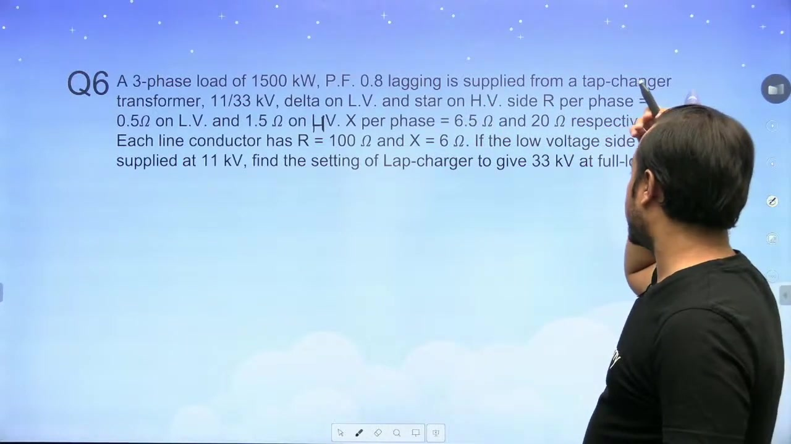

[← Lec 027: Voltage Regulation](Lecture_027_Voltage_Regulation.md) | [🏠 Index](00_yt_study_guide.md) | [Lec 029: Important Concepts in Electrical Machines 1 →](Lecture_029_Important_Concepts_in_Electrical_Machines_1.md)

---

# Problems based on Voltage Regulation of Transformer | L 9 | Electrical Machines | GATE 2022

- **Source**: https://www.youtube.com/watch?v=6T2k7FLsffw
- **Duration**: 01:12:14
- **Compiled**: 2026-09-20

---

## Overview

This lecture works through comprehensive numerical problems on transformer voltage regulation, efficiency, and tap setting determination. It connects open-circuit and short-circuit test data to internal equivalent circuit parameters in both physical and per-unit systems. Through worked examples, the lecture demonstrates how tap-changing transformers compensate for internal leakage drops and transmission line impedance. It also analyzes fractional load effects and examines the condition required for zero voltage regulation.

## Contents

- [[#Transformer Efficiency and Regulation from Test Data|Transformer Efficiency and Regulation from Test Data]]
- [[#Efficiency and Voltage Regulation Calculations|Efficiency and Voltage Regulation Calculations]]
- [[#Voltage Regulation Derivation and Tap Changer Problem|Voltage Regulation Derivation and Tap Changer Problem]]
- [[#Three-Phase Referral and Turns Ratio|Three-Phase Referral and Turns Ratio]]
- [[#Total Equivalent Impedance and Required Secondary Voltage|Total Equivalent Impedance and Required Secondary Voltage]]
- [[#Tap Setting Determination and Fractional Load Regulation|Tap Setting Determination and Fractional Load Regulation]]
- [[#Per-Unit Tap Calculation and Applied Voltage Problem|Per-Unit Tap Calculation and Applied Voltage Problem]]
- [[#Applied Primary Voltage from Short-Circuit Data|Applied Primary Voltage from Short-Circuit Data]]
- [[#Ohmic Drop Foundations and Step-Up Transformer Problem|Ohmic Drop Foundations and Step-Up Transformer Problem]]
- [[#Tap Setting Calculation and Zero Regulation Condition|Tap Setting Calculation and Zero Regulation Condition]]
- [[#Zero Regulation Analysis and Distribution Transformer Problem|Zero Regulation Analysis and Distribution Transformer Problem]]
- [[#Three-Phase Test Conversion to Per-Unit|Three-Phase Test Conversion to Per-Unit]]
- [[#Parameter Extraction, Efficiency, and Maximum Efficiency|Parameter Extraction, Efficiency, and Maximum Efficiency]]
- [[#Conceptual Questions on Ideal Transformer and Regulation|Conceptual Questions on Ideal Transformer and Regulation]]

---

## Transformer Efficiency and Regulation from Test Data
_(00:07 - 06:17)_

This lecture focuses on problem solving for transformer efficiency and voltage regulation. We begin by examining how open circuit and short circuit test data determine performance parameters.

### Test Data Identification

> [!example] Problem
> A single-phase transformer has two sets of test measurements given in per-unit:
> 1. Test 1: $V = 1.0\text{ pu}$, $I = 0.06\text{ pu}$, $\cos\phi = 0.2$
> 2. Test 2: $V = 0.08\text{ pu}$, $I = 1.0\text{ pu}$, $\cos\phi = 0.3$
>
> Identify each test. Then determine the core loss and full-load copper loss in per-unit.

The first step is identifying the tests from the rated quantities. In Test 1, the applied voltage is $1.0\text{ pu}$. This means the test runs at rated voltage. The current is very small at only $0.06\text{ pu}$. Therefore, Test 1 is the open-circuit test.

In Test 2, the current is $1.0\text{ pu}$. This means the test runs at full rated current. The applied voltage is low at $0.08\text{ pu}$. Therefore, Test 2 is the short-circuit test.

### Core Loss and Copper Loss Calculations

The open-circuit test yields the core loss or iron loss $P_i$. Since the parameters are in per-unit, we compute the real power directly:

$$
\begin{aligned}
P_i &= V_{oc} I_{oc} \cos\phi_{oc} \\
&= 1.0 \times 0.06 \times 0.2 \\
&= 0.012\text{ pu}
\end{aligned}
$$

The power factor is a dimensionless ratio. So it does not take per-unit notation. 

The short-circuit test gives the series copper loss. Because the current is at rated value ($I = 1.0\text{ pu}$), this measurement represents the full-load copper loss $P_{cu,fl}$:

$$
\begin{aligned}
P_{cu,fl} &= V_{sc} I_{sc} \cos\phi_{sc} \\
&= 0.08 \times 1.0 \times 0.3 \\
&= 0.024\text{ pu}
\end{aligned}
$$

> [!success] Result
> The transformer parameters extracted from the test data are:
> $$P_i = 0.012\text{ pu}, \quad P_{cu,fl} = 0.024\text{ pu}$$

These two loss values form the foundation for finding transformer efficiency and voltage regulation across various loading levels.

## Efficiency and Voltage Regulation Calculations
_(06:17 - 11:05)_

With the core and copper losses known, we can calculate transformer efficiency and voltage regulation. We consider two load conditions: unity power factor and 0.8 lagging power factor.

### Full-Load Efficiency Calculations

At full load, the loading fraction is $x = 1$. The rated apparent power in per-unit is $S = 1\text{ pu}$.

First, consider unity power factor with $\cos\phi = 1.0$. The efficiency expression in per-unit is:

$$
\begin{aligned}
\eta &= \frac{x S \cos\phi}{x S \cos\phi + P_i + x^2 P_{cu,fl}} \times 100\% \\
&= \frac{1 \times 1 \times 1.0}{1 \times 1 \times 1.0 + 0.012 + (1)^2 \times 0.024} \times 100\% \\
&= \frac{1}{1.036} \times 100\% \\
&= 96.525\%
\end{aligned}
$$

Next, consider a load power factor of 0.8 lagging at full load. The active power output becomes $1 \times 0.8 = 0.8\text{ pu}$. The losses remain unchanged because the current is still at rated value:

$$
\begin{aligned}
\eta &= \frac{1 \times 0.8}{0.8 + 0.012 + 0.024} \times 100\% \\
&= \frac{0.8}{0.836} \times 100\% \\
&= 95.693\%
\end{aligned}
$$

Efficiency drops at lower power factor. The output decreases while internal losses stay the same.

### Voltage Regulation via Impedance Angle

Voltage regulation can be computed using the per-unit impedance angle $\theta$. From the short-circuit test data:

$$
\begin{aligned}
Z_{\text{pu}} &= \frac{V_{sc}}{I_{sc}} = \frac{0.08}{1.0} = 0.08\text{ pu} \\
\cos\theta &= 0.3 \implies \theta = \cos^{-1}(0.3) = 72.54^\circ
\end{aligned}
$$

The alternative voltage regulation formula is:

$$VR = x Z_{\text{pu}} \cos(\theta \mp \phi)$$

The minus sign applies to lagging loads. The plus sign applies to leading loads.

At unity power factor, $\phi = 0^\circ$:

$$
\begin{aligned}
VR &= 1 \times 0.08 \times \cos(72.54^\circ - 0^\circ) \\
&= 0.08 \times 0.3 \\
&= 0.024\text{ pu} = 2.4\%
\end{aligned}
$$

At 0.8 lagging power factor, $\phi = \cos^{-1}(0.8) = 36.87^\circ$:

$$
\begin{aligned}
VR &= 1 \times 0.08 \times \cos(72.54^\circ - 36.87^\circ) \\
&= 0.08 \times \cos(35.67^\circ) \\
&= 0.08 \times 0.8124 \\
&= 0.06498\text{ pu} = 6.498\%
\end{aligned}
$$

> [!success] Result
> At full load:
> - Efficiency at unity power factor is $96.525\%$.
> - Efficiency at 0.8 lagging power factor is $95.693\%$.
> - Voltage regulation at unity power factor is $2.4\%$.
> - Voltage regulation at 0.8 lagging power factor is $6.498\%$.

## Voltage Regulation Derivation and Tap Changer Problem
_(11:09 - 14:27)_

We now examine why the two voltage regulation formulas give identical results. Then we introduce a problem involving tap setting calculation for feeder drop compensation.

### Equivalence of Regulation Expressions

The standard formula for voltage regulation at lagging power factor is:

$$VR = x(R_{\text{pu}} \cos\phi + X_{\text{pu}} \sin\phi)$$

From the per-unit impedance triangle:

$$
\begin{aligned}
R_{\text{pu}} &= Z_{\text{pu}} \cos\theta \\
X_{\text{pu}} &= Z_{\text{pu}} \sin\theta
\end{aligned}
$$

Substitute these into the regulation formula:

$$
\begin{aligned}
VR &= x \left(Z_{\text{pu}} \cos\theta \cos\phi + Z_{\text{pu}} \sin\theta \sin\phi\right) \\
&= x Z_{\text{pu}} (\cos\theta \cos\phi + \sin\theta \sin\phi) \\
&= x Z_{\text{pu}} \cos(\theta - \phi)
\end{aligned}
$$

For leading power factor, the reactive drop reverses sign:

$$VR = x Z_{\text{pu}} \cos(\theta + \phi)$$

Both expressions are mathematically identical. Voltage regulation depends only on the series leakage impedance. Therefore, short-circuit test parameters are used. The open-circuit test gives shunt parameters. Shunt parameters do not affect the series voltage drop.

### Tap Changer Problem Setup

> [!example] Problem
> A three-phase $\Delta\text{-Y}$, $11\text{ kV} / 433\text{ V}$ transformer has a tap changer on the primary side.
> It supplies a star-connected three-phase load of $12\text{ kVA}$, $400\text{ V}$ at 0.8 lagging power factor.
> The feeder leads between transformer and load have an impedance of $0.6 + j1\,\Omega$ per phase.
> The transformer winding impedances are:
> - LV winding: $Z_2 = 0.3 + j1\,\Omega$ per phase
> - HV winding: $Z_1 = 400 + j1600\,\Omega$ per phase
>
> Determine the tap setting required to maintain rated voltage at the load terminals.

The tap setting adjusts the effective turns ratio. It compensates for the internal impedance drop and the feeder line drop. The next section carries out the full per-phase referral and voltage solution.

## Three-Phase Referral and Turns Ratio
_(14:27 - 18:31)_

To solve the tap changer problem, we work on a per-phase basis. We first calculate the phase turns ratio from the transformer winding connections.

### Three-Phase System Configuration

The primary winding is connected in delta. The secondary winding is connected in star. The connecting feeder leads between the transformer terminals and the load have an impedance of:

$$Z_{\text{line}} = 0.6 + j1\,\Omega/\text{phase}$$

This line impedance is in series with the secondary load. The transformer itself has leakage impedances on both windings:

$$
\begin{aligned}
Z_{HV} &= 400 + j1600\,\Omega/\text{phase} \\
Z_{LV} &= 0.3 + j1\,\Omega/\text{phase}
\end{aligned}
$$

We transfer all impedances to the low-voltage secondary side. This creates a single equivalent series loop per phase.

### Turns Ratio on a Per-Phase Basis

The turns ratio must always be evaluated using phase voltages.

For the delta-connected primary, phase voltage equals line voltage:

$$V_{1,\text{ph}} = V_{1,L} = 11{,}000\text{ V}$$

For the star-connected secondary, phase voltage is line voltage divided by $\sqrt{3}$:

$$V_{2,\text{ph}} = \frac{V_{2,L}}{\sqrt{3}} = \frac{400}{\sqrt{3}} = 230.94\text{ V}$$

Now compute the turns ratio $a = N_1 / N_2$:

$$a = \frac{N_1}{N_2} = \frac{V_{1,\text{ph}}}{V_{2,\text{ph}}} = \frac{11{,}000}{230.94} = 47.63$$

Alternatively, the transformation ratio from primary to secondary is:

$$\frac{N_2}{N_1} = \frac{1}{47.63} = 0.021$$

> [!info] Definition
> In three-phase transformers, the turns ratio is the ratio of phase voltages. Never use line voltages directly for delta-star or star-delta impedance referrals.

To refer high-voltage impedance $Z_{HV}$ to the low-voltage side, divide by $a^2$. We perform this numerical step in the next section.

## Total Equivalent Impedance and Required Secondary Voltage
_(18:37 - 23:23)_

We now calculate the total loop impedance referred to the low-voltage side. Then we compute the secondary winding voltage needed to deliver rated load voltage.

### Total Loop Impedance on the LV Side

The transformer high-voltage winding impedance is referred to the low-voltage side:

$$
\begin{aligned}
Z_1' &= Z_{HV} \left(\frac{N_2}{N_1}\right)^2 \\
&= (400 + j1600) \times (0.0227)^2 \\
&= 0.2066 + j0.8264\,\Omega/\text{phase}
\end{aligned}
$$

Add the low-voltage winding impedance $Z_2 = 0.3 + j1\,\Omega$:

$$Z_{02,\text{tr}} = (0.3 + 0.2066) + j(1 + 0.8264) = 0.5066 + j1.8264\,\Omega$$

Now include the connecting feeder line impedance $Z_{\text{line}} = 0.6 + j1\,\Omega$:

$$
\begin{aligned}
Z_{\text{total}} &= Z_{02,\text{tr}} + Z_{\text{line}} \\
&= (0.5066 + 0.6) + j(1.8264 + 1.0) \\
&= 1.1066 + j2.8264\,\Omega/\text{phase}
\end{aligned}
$$

### Secondary Winding Voltage Calculation

The three-phase load is $12\text{ kVA}$ at $400\text{ V}$ line-to-line with $0.8$ lagging power factor.

Compute the load line current:

$$I_L = \frac{S}{\sqrt{3} V_L} = \frac{12{,}000}{\sqrt{3} \times 400} = 10\sqrt{3}\text{ A} \approx 17.32\text{ A}$$

The load phase voltage taken as the reference phasor is:

$$V_{\text{load,ph}} = \frac{400}{\sqrt{3}}\angle 0^\circ = 230.94\angle 0^\circ\text{ V}$$

The load current lags the voltage by $\phi = \cos^{-1}(0.8) = 36.87^\circ$:

$$\bar{I}_L = 17.32\angle -36.87^\circ\text{ A}$$

Apply Kirchhoff's Voltage Law to find the required secondary winding phase voltage:

$$
\begin{aligned}
\bar{V}_2 &= V_{\text{load,ph}} + \bar{I}_L Z_{\text{total}} \\
&= 230.94\angle 0^\circ + (17.32\angle -36.87^\circ)(1.1066 + j2.8264) \\
&= 230.94 + (17.32\angle -36.87^\circ)(3.035\angle 68.62^\circ) \\
&= 230.94 + 52.57\angle 31.75^\circ \\
&= 230.94 + 44.70 + j27.66 \\
&= 275.64 + j27.66 \\
&= 277.03\angle 5.73^\circ\text{ V}
\end{aligned}
$$

The required secondary line-to-line voltage is:

$$V_{2,L} = \sqrt{3} \times 277.03 = 479.82\text{ V}$$

The rated secondary line voltage is $433\text{ V}$. Comparing these values gives:

$$\frac{V_{2,L}}{V_{2,\text{rated}}} = \frac{479.82}{433} = 1.108\text{ pu}$$

> [!success] Result
> The required secondary terminal line voltage is $479.82\text{ V}$. This corresponds to $1.108\text{ pu}$, requiring a $+10.8\%$ voltage boost.

## Tap Setting Determination and Fractional Load Regulation
_(23:23 - 28:14)_

We conclude the tap calculation for the delta-star transformer. Then we examine voltage regulation under fractional loading conditions.

### Tap Setting Interpretation

In per-unit, the required secondary winding voltage is $1.108\text{ pu}$.

The ideal transformer core has a $1:1$ ratio in per-unit. Therefore, the primary induced voltage must also be $1.108\text{ pu}$.

The tap changer is located on the primary winding. To produce $1.108\text{ pu}$ secondary voltage from a nominal $1.0\text{ pu}$ supply, we adjust the tap setting:

$$\text{Tap Setting} = +10.8\%$$

A positive tap setting boosts the output voltage. This compensates for internal winding drops and feeder line resistance.

### Voltage Regulation with Fractional Loading

> [!example] Problem
> A $100\text{ MVA}$, $230/115\text{ kV}$, $\Delta\text{-}\Delta$ three-phase transformer has:
> $$R_{\text{pu}} = 0.02\text{ pu}, \quad X_{\text{pu}} = 0.05\text{ pu}$$
> It delivers $80\text{ MVA}$ at $0.85$ lagging power factor. Calculate the percentage voltage regulation.

First find the loading fraction $x$:

$$x = \frac{\text{Actual kVA}}{\text{Rated kVA}} = \frac{80}{100} = 0.8$$

For a lagging power factor of $0.85$:

$$
\begin{aligned}
\cos\phi &= 0.85 \\
\sin\phi &= \sqrt{1 - (0.85)^2} = 0.5268
\end{aligned}
$$

Compute the voltage regulation:

$$
\begin{aligned}
VR &= x (R_{\text{pu}} \cos\phi + X_{\text{pu}} \sin\phi) \\
&= 0.8 \times (0.02 \times 0.85 + 0.05 \times 0.5268) \\
&= 0.8 \times (0.017 + 0.02634) \\
&= 0.8 \times 0.04334 \\
&= 0.03467\text{ pu} = 3.47\%
\end{aligned}
$$

> [!warning] Common Mistake
> Students often forget to multiply by the loading fraction $x$. The internal impedance drop is directly proportional to the actual load current. Omitting $x$ yields an incorrect full-load value.

### Tap Calculation via Regulation Formula

We now introduce a faster method for tap calculation.

Consider a $100\text{ kVA}$ transformer with leakage impedance $Z_{\text{pu}} = 0.0075 + j0.09\text{ pu}$. The load is $100\text{ kW}$ at $0.8$ lagging power factor. The secondary load voltage must remain at $1.0\text{ pu}$.

Instead of a full phasor KVL loop, we can use the voltage regulation formula:

$$\frac{V_2 - V_{\text{load}}}{V_{\text{load}}} \approx VR$$

If $V_{\text{load}} = 1.0\text{ pu}$, then $V_2 \approx 1 + VR$. This gives the required tap setting directly. The next section completes this solution.

## Per-Unit Tap Calculation and Applied Voltage Problem
_(28:18 - 33:20)_

We now complete the tap calculation using the per-unit voltage regulation approach. Then we introduce a problem on calculating the required primary voltage from short-circuit test data.

### Per-Unit Tap Setting Solution

The load requires $100\text{ kW}$ at $0.8$ lagging power factor.

Compute the apparent power demanded by the load:

$$S_{\text{load}} = \frac{P}{\cos\phi} = \frac{100\text{ kW}}{0.8} = 125\text{ kVA}$$

The transformer rating is $100\text{ kVA}$. Find the loading fraction $x$:

$$x = \frac{125\text{ kVA}}{100\text{ kVA}} = 1.25\text{ pu}$$

The transformer per-unit parameters are $R_{\text{pu}} = 0.0075$ and $X_{\text{pu}} = 0.09$. For $\cos\phi = 0.8$, we have $\sin\phi = 0.6$.

Calculate the per-unit voltage drop:

$$
\begin{aligned}
VR &= x (R_{\text{pu}} \cos\phi + X_{\text{pu}} \sin\phi) \\
&= 1.25 \times (0.0075 \times 0.8 + 0.09 \times 0.6) \\
&= 1.25 \times (0.0060 + 0.0540) \\
&= 1.25 \times 0.0600 \\
&= 0.075\text{ pu} = 7.5\%
\end{aligned}
$$

The load voltage must be maintained at rated value ($V_L = 1.0\text{ pu}$). Using the definition of voltage regulation:

$$\frac{V - V_L}{V_L} = 0.075 \implies V = 1.075\text{ pu}$$

> [!success] Result
> The required primary tap setting is $+7.5\%$. This boosts the internal voltage by $7.5\%$ to cancel the internal impedance drop.

### Problem on Applied Primary Voltage

> [!example] Problem
> A $100\text{ kVA}$, $6600/330\text{ V}$, $50\text{ Hz}$ single-phase transformer has the following short-circuit test data on the HV side:
> $$V_{sc} = 100\text{ V}, \quad I_{sc} = 10\text{ A}, \quad P_{sc} = 436\text{ W}$$
> Calculate the voltage to apply on the HV side at full load, $0.8$ lagging power factor, to maintain rated secondary voltage ($330\text{ V}$).

Using the approximate scalar voltage regulation formula saves time during exams. Virtual calculators make complex phasor arithmetic slow. The scalar drop formula gives fast, accurate results directly.

## Applied Primary Voltage from Short-Circuit Data
_(33:34 - 38:37)_

We now solve for the required high-voltage terminal voltage using short-circuit test measurements. Keeping all quantities referred to the high-voltage side simplifies the calculation.

### Series Parameter Extraction on the HV Side

The short-circuit test data measured on the high-voltage winding is:

$$V_{sc} = 100\text{ V}, \quad I_{sc} = 10\text{ A}, \quad P_{sc} = 436\text{ W}$$

Calculate the series equivalent impedance:

$$Z_{sc} = \frac{V_{sc}}{I_{sc}} = \frac{100}{10} = 10\,\Omega$$

Compute the equivalent resistance from the measured copper loss:

$$R_{sc} = \frac{P_{sc}}{I_{sc}^2} = \frac{436}{(10)^2} = 4.36\,\Omega$$

Compute the equivalent leakage reactance:

$$
\begin{aligned}
X_{sc} &= \sqrt{Z_{sc}^2 - R_{sc}^2} \\
&= \sqrt{10^2 - (4.36)^2} \\
&= \sqrt{100 - 19.01} \\
&= \sqrt{80.99} = 9.0\,\Omega
\end{aligned}
$$

### Voltage Drop and Applied Voltage

The load is connected on the low-voltage side at rated voltage $330\text{ V}$.

Refer the load voltage to the high-voltage side:

$$V_2' = V_2 \times \frac{N_1}{N_2} = 330 \times \frac{6600}{330} = 6600\text{ V}$$

Because the load operates at full load, full-load current flows in both windings.

Calculate the rated full-load current on the high-voltage side:

$$I_{1,fl} = \frac{S_{\text{rated}}}{V_{1,\text{rated}}} = \frac{100{,}000}{6600} = 15.15\text{ A}$$

The load power factor is $0.8$ lagging ($\cos\phi = 0.8, \sin\phi = 0.6$).

Compute the scalar voltage drop on the high-voltage side:

$$
\begin{aligned}
\Delta V_1 &= I_{1,fl}(R_{sc} \cos\phi + X_{sc} \sin\phi) \\
&= 15.15 \times (4.36 \times 0.8 + 9.0 \times 0.6) \\
&= 15.15 \times (3.488 + 5.400) \\
&= 15.15 \times 8.888 \\
&= 134.66\text{ V}
\end{aligned}
$$

Add this internal drop to the referred load voltage:

$$
\begin{aligned}
V_1 &\approx V_2' + \Delta V_1 \\
&= 6600 + 134.66 \\
&= 6734.66\text{ V}
\end{aligned}
$$

> [!success] Result
> The required applied voltage on the primary high-voltage terminals is:
> $$V_1 = 6734.66\text{ V}$$

## Ohmic Drop Foundations and Step-Up Transformer Problem
_(38:37 - 43:08)_

We first clarify the relationship between ohmic voltage drop and per-unit regulation. Then we introduce a step-up transformer problem with transmission line impedance.

### Ohmic Voltage Drop vs Per-Unit Regulation

The approximate scalar voltage drop is fundamentally defined in actual physical units:

$$\Delta V = I(R \cos\phi \pm X \sin\phi)$$

This formula gives the voltage drop directly in volts. When divided by rated voltage, the expression becomes:

$$
\begin{aligned}
\frac{\Delta V}{V_{\text{rated}}} &= \left(\frac{I R}{V_{\text{rated}}}\right)\cos\phi \pm \left(\frac{I X}{V_{\text{rated}}}\right)\sin\phi \\
&= R_{\text{pu}} \cos\phi \pm X_{\text{pu}} \sin\phi = VR
\end{aligned}
$$

Therefore, the approximate formula does not require per-unit conversion. You can work directly in volts and ohms or in per-unit. Both methods yield identical results.

### Step-Up Transformer Tap Problem Setup

> [!example] Problem
> A three-phase star-connected load of $1500\text{ kW}$ at $0.8$ lagging power factor is supplied by an $11/33\text{ kV}$, $\Delta\text{-Y}$ transformer.
> The primary delta winding is supplied at $11\text{ kV}$.
> The circuit parameters per phase are:
> - LV winding impedance: $Z_{LV} = 0.5 + j6.5\,\Omega$
> - HV winding impedance: $Z_{HV} = 1.5 + j20\,\Omega$
> - Transmission line impedance: $Z_{\text{line}} = 10 + j6\,\Omega$
>
> Find the tap setting needed to maintain rated voltage ($33\text{ kV}$) at the load terminals.

The turns ratio is based on phase voltages.

For the delta-connected LV winding:

$$V_{LV,\text{ph}} = 11\text{ kV} = 11{,}000\text{ V}$$

For the star-connected HV winding:

$$V_{HV,\text{ph}} = \frac{33\text{ kV}}{\sqrt{3}} = \frac{33{,}000}{\sqrt{3}}\text{ V} = 19{,}052.56\text{ V}$$

Compute the phase turns ratio from LV to HV:

$$\frac{N_{HV}}{N_{LV}} = \frac{33{,}000 / \sqrt{3}}{11{,}000} = \frac{3}{\sqrt{3}} = \sqrt{3} \approx 1.732$$

All parameters will be referred to the high-voltage side. The next section performs the impedance referral and determines the required tap setting.

## Tap Setting Calculation and Zero Regulation Condition
_(43:14 - 49:46)_

We now complete the calculation for the $11/33\text{ kV}$ step-up transformer. Then we examine the condition for zero voltage regulation.

### Total Impedance Referred to HV Side

The phase turns ratio is $a = N_{HV} / N_{LV} = \sqrt{3}$.

Transfer the low-voltage winding impedance to the high-voltage side:

$$
\begin{aligned}
Z_{LV}' &= Z_{LV} \times a^2 \\
&= (0.5 + j6.5) \times (\sqrt{3})^2 \\
&= (0.5 + j6.5) \times 3 \\
&= 1.5 + j19.5\,\Omega/\text{phase}
\end{aligned}
$$

Add the high-voltage winding impedance and the line impedance:

$$
\begin{aligned}
Z_{\text{total}} &= Z_{LV}' + Z_{HV} + Z_{\text{line}} \\
&= (1.5 + j19.5) + (1.5 + j20) + (10 + j6) \\
&= (1.5 + 1.5 + 10) + j(19.5 + 20 + 6) \\
&= 13 + j45.5\,\Omega/\text{phase}
\end{aligned}
$$

### Full-Load Current and Voltage Drop

The three-phase load is $1500\text{ kW}$ at $33\text{ kV}$ and $0.8$ lagging power factor.

Compute the load line current on the high-voltage side:

$$I_{HV} = \frac{P}{\sqrt{3} V_L \cos\phi} = \frac{1500 \times 10^3}{\sqrt{3} \times 33{,}000 \times 0.8} = 32.80\text{ A}$$

The load phase voltage is:

$$V_{\text{load,ph}} = \frac{33{,}000}{\sqrt{3}} = 19{,}052.56\text{ V}$$

Compute the scalar voltage drop per phase:

$$
\begin{aligned}
\Delta V &= I_{HV}(R_{\text{total}} \cos\phi + X_{\text{total}} \sin\phi) \\
&= 32.80 \times (13 \times 0.8 + 45.5 \times 0.6) \\
&= 32.80 \times (10.4 + 27.3) \\
&= 32.80 \times 37.7 \\
&= 1236.56\text{ V}
\end{aligned}
$$

The required secondary induced phase voltage is:

$$V_{2,\text{ph}} = 19{,}052.56 + 1236.56 = 20{,}289.12\text{ V}$$

Convert to line-to-line voltage:

$$V_{2,L} = \sqrt{3} \times 20{,}289.12 = 35{,}141.8\text{ V} \approx 35.14\text{ kV}$$

Now compute the required tap setting:

$$\text{Tap Setting} = \frac{35.14 - 33.0}{33.0} \times 100\% = +6.49\% \approx +6.5\%$$

> [!success] Result
> The required tap setting is $+6.5\%$. This provides the necessary voltage boost.

### Zero Voltage Regulation Concept

> [!example] Problem
> The equivalent resistance and reactance of a transformer are $0.5\,\Omega$ and $0.8\,\Omega$ respectively.
> Determine the load power factor for zero voltage regulation.

Zero voltage regulation occurs when the voltage drop vanishes:

$$R \cos\phi - X \sin\phi = 0 \implies \tan\phi = \frac{R}{X}$$

This condition requires a leading power factor. The next section completes the numerical evaluation.

## Zero Regulation Analysis and Distribution Transformer Problem
_(49:46 - 54:41)_

We complete the zero voltage regulation condition. Then we solve for the primary voltage of a delta-star distribution transformer.

### Zero Voltage Regulation Derivation

Zero voltage regulation occurs when the terminal voltage drop is zero:

$$VR = R_{\text{pu}} \cos\phi - X_{\text{pu}} \sin\phi = 0$$

Rearranging gives:

$$\tan\phi = \frac{R_{\text{pu}}}{X_{\text{pu}}}$$

From the internal impedance angle $\theta$:

$$\tan\theta = \frac{X_{\text{pu}}}{R_{\text{pu}}}$$

Therefore:

$$\theta + \phi = 90^\circ$$

The load power factor for zero regulation is:

$$\cos\phi = \sin\theta = \frac{X}{Z} \quad (\text{leading})$$

Given $X/Z = 0.8$, the load power factor must be $0.8$ leading.

> [!info] Definition
> Zero voltage regulation requires a leading power factor. At this power factor, capacitive VARs balance the inductive drop across the transformer leakage reactance.

### Distribution Transformer Primary Voltage

> [!example] Problem
> A $100\text{ kVA}$, $6.6/0.4\text{ kV}$, $\Delta\text{-Y}$ distribution transformer has:
> - Voltage regulation: $VR = 1.2\%$
> - Leakage reactance: $X = 5\%$
>
> If the secondary terminal voltage is $0.4\text{ kV}$, find the required primary terminal voltage.

Voltage regulation represents the fractional drop relative to the load voltage:

$$VR = \frac{V_{NL} - V_{FL}}{V_{FL}} = 1.2\% = 0.012$$

The secondary terminal voltage under load is $V_{FL} = 0.4\text{ kV}$.

Compute the required no-load secondary voltage:

$$
\begin{aligned}
V_{NL} &= V_{FL}(1 + VR) \\
&= 0.4 \times (1 + 0.012) \\
&= 0.4048\text{ kV}
\end{aligned}
$$

Now apply the transformer voltage ratio using the unitary method. At no load:

$$\frac{V_1}{6.6\text{ kV}} = \frac{V_{NL}}{0.4\text{ kV}} = \frac{0.4048}{0.4} = 1.012$$

Calculate the primary terminal voltage:

$$
\begin{aligned}
V_1 &= 6.6 \times 1.012 \\
&= 6.6792\text{ kV}
\end{aligned}
$$

> [!success] Result
> The primary terminal voltage is:
> $$V_1 = 6.6792\text{ kV}$$

Using the regulation formula directly avoids detailed per-phase impedance conversions.

## Three-Phase Test Conversion to Per-Unit
_(54:41 - 59:37)_

We now analyze a comprehensive three-phase transformer problem. Converting all test measurements to per-unit eliminates the need for winding connection factors.

### Comprehensive Problem Statement

> [!example] Problem
> A three-phase, $50\text{ kVA}$, $6.6/0.4\text{ kV}$, $50\text{ Hz}$ transformer yielded the following test results:
> - Open-Circuit Test (LV side): $400\text{ V}, 4.21\text{ A}, 520\text{ W}$
> - Short-Circuit Test (HV side): $340\text{ V}, 4.35\text{ A}, 610\text{ W}$
>
> Calculate:
> 1. The per-unit equivalent circuit parameters.
> 2. The voltage regulation at full load $0.8$ lagging power factor.
> 3. The maximum efficiency and the load at which it occurs.

### Base Values and Per-Unit Conversion

Choose the three-phase ratings as base values:

$$
\begin{aligned}
S_{\text{base}} &= 50\text{ kVA} = 50{,}000\text{ VA} \\
V_{\text{base,LV}} &= 400\text{ V} \quad (\text{line-to-line}) \\
V_{\text{base,HV}} &= 6600\text{ V} \quad (\text{line-to-line})
\end{aligned}
$$

Calculate the base line currents on both sides:

$$
\begin{aligned}
I_{\text{base,LV}} &= \frac{S_{\text{base}}}{\sqrt{3} V_{\text{base,LV}}} = \frac{50{,}000}{\sqrt{3} \times 400} = 72.17\text{ A} \\
I_{\text{base,HV}} &= \frac{S_{\text{base}}}{\sqrt{3} V_{\text{base,HV}}} = \frac{50{,}000}{\sqrt{3} \times 6600} = 4.37\text{ A}
\end{aligned}
$$

Now convert the open-circuit test data to per-unit:

$$
\begin{aligned}
V_{oc,\text{pu}} &= \frac{400}{400} = 1.0\text{ pu} \\
I_{0,\text{pu}} &= \frac{4.21}{72.17} = 0.0583\text{ pu} \\
P_{oc,\text{pu}} &= \frac{520}{50{,}000} = 0.0104\text{ pu}
\end{aligned}
$$

Next convert the short-circuit test data to per-unit:

$$
\begin{aligned}
V_{sc,\text{pu}} &= \frac{340}{6600} = 0.0515\text{ pu} \\
I_{sc,\text{pu}} &= \frac{4.35}{4.37} = 0.9945\text{ pu} \approx 1.0\text{ pu} \\
P_{sc,\text{pu}} &= \frac{610}{50{,}000} = 0.0122\text{ pu}
\end{aligned}
$$

> [!info] Definition
> Per-unit parameters are independent of winding connection types. Once converted to per-unit, star and delta connections are treated with identical formulas.

The next section extracts the shunt and series branch parameters from these per-unit test figures.

## Parameter Extraction, Efficiency, and Maximum Efficiency
_(59:44 - 66:23)_

We now extract both shunt and series per-unit equivalent circuit parameters. Then we compute the full-load efficiency, voltage regulation, and maximum efficiency operating point.

### Shunt Branch Per-Unit Parameters

From the open-circuit test in per-unit:

$$V_{oc,\text{pu}} = 1.0\text{ pu}, \quad I_{0,\text{pu}} = 0.0583\text{ pu}, \quad P_{oc,\text{pu}} = 0.0104\text{ pu}$$

The core-loss component of current is:

$$I_w = \frac{P_{oc,\text{pu}}}{V_{oc,\text{pu}}} = \frac{0.0104}{1.0} = 0.0104\text{ pu}$$

The magnetizing component of current is:

$$
\begin{aligned}
I_\mu &= \sqrt{I_0^2 - I_w^2} \\
&= \sqrt{(0.0583)^2 - (0.0104)^2} \\
&= \sqrt{0.003399 - 0.000108} \\
&= \sqrt{0.003291} = 0.0574\text{ pu}
\end{aligned}
$$

Calculate the shunt branch resistance and reactance:

$$
\begin{aligned}
R_c &= \frac{V_{oc,\text{pu}}}{I_w} = \frac{1.0}{0.0104} = 96.15\text{ pu} \\
X_m &= \frac{V_{oc,\text{pu}}}{I_\mu} = \frac{1.0}{0.0574} = 17.42\text{ pu}
\end{aligned}
$$

### Series Branch Per-Unit Parameters

From the short-circuit test in per-unit:

$$V_{sc,\text{pu}} = 0.0515\text{ pu}, \quad I_{sc,\text{pu}} = 1.0\text{ pu}, \quad P_{sc,\text{pu}} = 0.0122\text{ pu}$$

Compute the series equivalent impedance:

$$Z_{\text{pu}} = \frac{V_{sc,\text{pu}}}{I_{sc,\text{pu}}} = \frac{0.0515}{1.0} = 0.0515\text{ pu}$$

Calculate the equivalent resistance:

$$R_{\text{pu}} = \frac{P_{sc,\text{pu}}}{I_{sc,\text{pu}}^2} = \frac{0.0122}{(1.0)^2} = 0.0122\text{ pu}$$

Calculate the equivalent leakage reactance:

$$
\begin{aligned}
X_{\text{pu}} &= \sqrt{Z_{\text{pu}}^2 - R_{\text{pu}}^2} \\
&= \sqrt{(0.0515)^2 - (0.0122)^2} \\
&= \sqrt{0.002652 - 0.000149} \\
&= \sqrt{0.002503} = 0.050\text{ pu}
\end{aligned}
$$

### Efficiency and Voltage Regulation

At full load with $0.8$ lagging power factor ($x = 1$, $\cos\phi = 0.8$):

$$
\begin{aligned}
\eta &= \frac{x \cos\phi}{x \cos\phi + P_i + x^2 P_{cu,fl}} \times 100\% \\
&= \frac{1 \times 0.8}{1 \times 0.8 + 0.0104 + 0.0122} \times 100\% \\
&= \frac{0.8}{0.8226} \times 100\% \\
&= 97.252\%
\end{aligned}
$$

Compute the full-load voltage regulation:

$$
\begin{aligned}
VR &= R_{\text{pu}} \cos\phi + X_{\text{pu}} \sin\phi \\
&= 0.0122 \times 0.8 + 0.050 \times 0.6 \\
&= 0.00976 + 0.03000 \\
&= 0.03976\text{ pu} = 3.976\%
\end{aligned}
$$

### Maximum Efficiency Load Condition

Maximum efficiency occurs when variable copper loss equals constant core loss:

$$x^2 P_{cu,fl} = P_i \implies x = \sqrt{\frac{P_i}{P_{cu,fl}}}$$

Substitute the per-unit loss values:

$$x = \sqrt{\frac{0.0104}{0.0122}} = \sqrt{0.8525} = 0.9232$$

The optimal load is:

$$S_{\text{opt}} = 0.9232 \times 50\text{ kVA} = 46.16\text{ kVA}$$

> [!success] Result
> The performance metrics are:
> - Full-load efficiency: $\eta = 97.252\%$
> - Full-load voltage regulation: $VR = 3.976\%$
> - Maximum efficiency occurs at fraction $x = 0.9232$ ($46.16\text{ kVA}$)

## Conceptual Questions on Ideal Transformer and Regulation
_(66:23 - 72:06)_

We conclude the lecture with conceptual examination questions. These questions test understanding of ideal transformer behavior and zero voltage regulation conditions.

### Ideal Transformer Performance Metrics

> [!example] Problem
> Consider the following statements:
> - **Assertion**: Both efficiency and voltage regulation of an ideal transformer are $100\%$.
> - **Reason**: In an ideal transformer, flux leakage and core reluctance are zero, and internal losses are absent.
>
> Evaluate whether the assertion and reason are true or false.

In an ideal transformer, core losses and winding resistance are zero. Therefore, efficiency is:

$$\eta = 100\%$$

However, zero leakage flux and zero winding resistance mean the transformer has zero internal impedance:

$$Z = R + jX = 0$$

Because there is zero internal impedance, there is zero voltage drop between no-load and full-load:

$$|V_{NL}| = |V_{FL}| \implies VR = \frac{|V_{NL}| - |V_{FL}|}{|V_{FL}|} \times 100\% = 0\%$$

An ideal transformer has $0\%$ voltage regulation, not $100\%$. Therefore, the assertion is false, while the reason is true.

> [!success] Result
> For an ideal transformer:
> $$\eta = 100\%, \quad VR = 0\%$$

### Zero Voltage Regulation Feasibility

Can zero voltage regulation be achieved in a practical transformer at full load?

Yes, zero voltage regulation is possible at a leading power factor.

At leading power factor, the voltage regulation expression has a negative sign:

$$VR = x(R_{\text{pu}} \cos\phi - X_{\text{pu}} \sin\phi)$$

Setting this expression to zero gives:

$$\tan\phi = \frac{R}{X} \implies \cos\phi = \frac{X}{Z} \quad (\text{leading})$$

The leading capacitive current produces a voltage rise across the leakage reactance. This rise cancels the drop across the winding resistance.

### Relating Terminal Voltages via Regulation

The voltage regulation formula is not just for finding percentage drop. It directly links terminal voltages across two ends of a circuit:

$$V_1' \approx V_2 + I(R \cos\phi \pm X \sin\phi)$$

Knowing the load voltage and load power factor allows direct computation of the source voltage without setting up complex loop equations. This completes the problem-solving set on transformer voltage regulation.

---

## Summary and Key Takeaways

- Open-circuit test data at rated voltage gives the core loss $P_i$, while short-circuit test data at rated current gives the full-load copper loss $P_{cu,fl}$.
- Voltage regulation can be evaluated using $VR = x(R_{\text{pu}} \cos\phi \pm X_{\text{pu}} \sin\phi)$ or the equivalent form $VR = x Z_{\text{pu}} \cos(\theta \mp \phi)$.
- The loading fraction $x = S_{\text{actual}} / S_{\text{rated}}$ scales the voltage regulation directly with load current.
- For three-phase transformers, the turns ratio must always be evaluated using per-phase voltages rather than line-to-line voltages.
- Tap changer settings adjust the primary winding turns ratio to boost voltage and maintain rated voltage at distant load terminals.
- Converting all test measurements to per-unit values eliminates the need to track three-phase star or delta connection factors.
- Zero voltage regulation occurs at a leading power factor when $\tan\phi = R/X$, which corresponds to $\cos\phi = X/Z$.
- An ideal transformer has $100\%$ efficiency and $0\%$ voltage regulation because it possesses zero internal impedance and zero losses.

---

[← Lec 027: Voltage Regulation](Lecture_027_Voltage_Regulation.md) | [🏠 Index](00_yt_study_guide.md) | [Lec 029: Important Concepts in Electrical Machines 1 →](Lecture_029_Important_Concepts_in_Electrical_Machines_1.md)
