[← Lec 028: Problems based on Voltage Regulation of Transformer](Lecture_028_Problems_based_on_Voltage_Regulation_of_Transformer.md) | [🏠 Index](00_yt_study_guide.md) | [Lec 030: Important Concepts in Electrical Machines 2 →](Lecture_030_Important_Concepts_in_Electrical_Machines_2.md)

---

# Electrical Machines | Lec 20 | Important Concepts in Electrical Machines - 1| GATE Electrical Engg

- **Source**: https://www.youtube.com/watch?v=qEpFybbOpvo
- **Duration**: 00:57:11
- **Compiled**: 2026-09-20

---

## Overview

This lecture links magnetically coupled circuits to the practical transformer equivalent circuit. It establishes exact mathematical relationships between self and mutual inductances and transformer leakage and magnetizing parameters. The discussion then introduces dimensional scaling laws for electrical machines under constant maximum flux density. These scaling relations show how machine ratings, losses, temperature rise, and excitation currents scale when linear dimensions grow.

## Contents

- [[#Magnetically Coupled Circuits and Additive Polarity|Magnetically Coupled Circuits and Additive Polarity]]
- [[#Subtractive Coupling and Equivalent Circuits|Subtractive Coupling and Equivalent Circuits]]
- [[#Transformer Equivalent Circuit vs Coupled Circuit Model|Transformer Equivalent Circuit vs Coupled Circuit Model]]
- [[#Derivation of Leakage and Magnetizing Inductances|Derivation of Leakage and Magnetizing Inductances]]
- [[#Secondary Leakage Inductance Derivation|Secondary Leakage Inductance Derivation]]
- [[#Direct Inspection Rules for Transformer Inductances|Direct Inspection Rules for Transformer Inductances]]
- [[#Transformer Dimensions and Voltage Rating Scaling|Transformer Dimensions and Voltage Rating Scaling]]
- [[#Conductor Sizing, Window Space Factor, and Current Rating|Conductor Sizing, Window Space Factor, and Current Rating]]
- [[#Scaling of Current, kVA Rating, and Core Loss|Scaling of Current, kVA Rating, and Core Loss]]
- [[#Excitation Currents, Mechanical Scaling, and Summary of Scaling Laws|Excitation Currents, Mechanical Scaling, and Summary of Scaling Laws]]

---

## Magnetically Coupled Circuits and Additive Polarity
_(00:13 - 07:43)_

### Transformer as a Coupled Circuit

We often analyze transformers using equivalent circuit parameters. But at its core, a transformer is a pair of magnetically coupled coils. Reviewing basic coupled circuit theory helps us connect self and mutual inductances directly to leakage and magnetizing inductances.

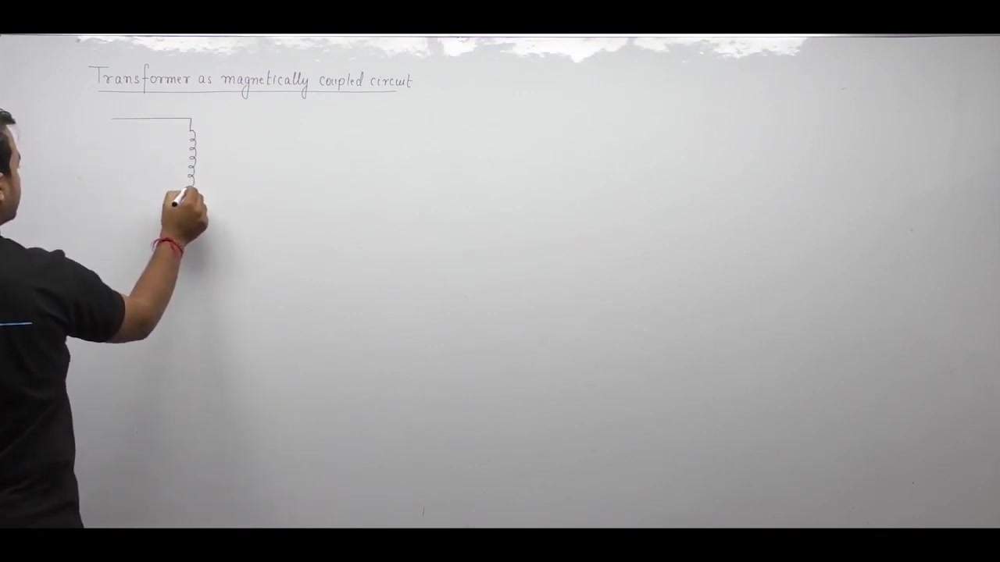

Consider two coils on a magnetic path. Each coil has a self-inductance, denoted as $L_1$ and $L_2$. A mutual inductance $M$ couples the two windings. In circuit analysis, we do not require the primary and secondary currents to enter and leave specific terminals. Current can enter or leave any terminal depending on the external connections.

### Modeling Mutual Inductance

To draw the equivalent circuit of a coupled circuit, we represent the mutual coupling using dependent voltage sources. The self-inductance stays as an ordinary inductor.

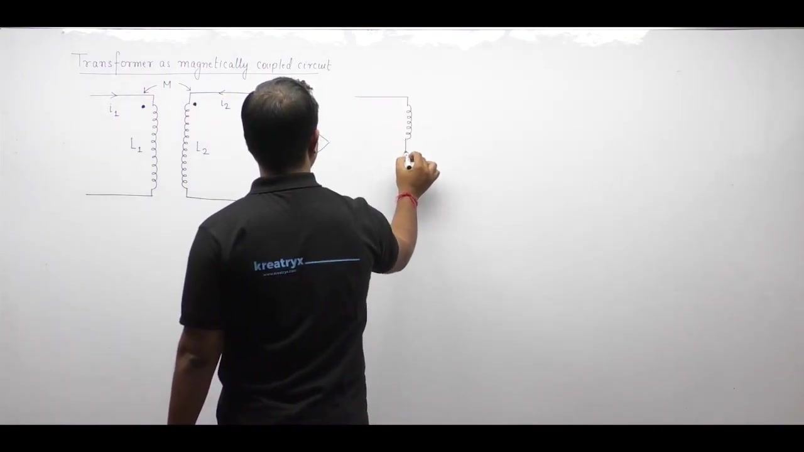

When current enters the dot on both windings, the coils are additively coupled. The same rule applies if current leaves the dot on both windings. The induced mutual voltage in winding 1 depends on the rate of change of current in winding 2:

$$v_{m1} = M \frac{di_2}{dt}$$

Likewise, the mutual voltage induced in winding 2 depends on the current in winding 1:

$$v_{m2} = M \frac{di_1}{dt}$$

### Polarity Rules for Additive Coupling

The polarity of the dependent voltage source follows a clear rule. When the coupling is additive, current must enter the positive terminal of the dependent source.

> [!info] Polarity Rule for Additive Coupling
> If currents either enter the dots on both windings or leave the dots on both windings, the coupling is additive. The dependent source is oriented so that current enters its positive terminal.

The voltage drop across self-inductance always follows the passive sign convention. Current enters the positive terminal and leaves the negative terminal.

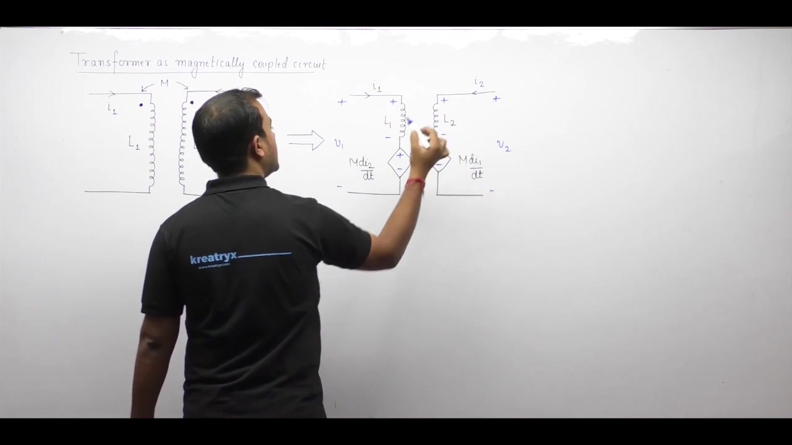

### Loop Equations

Now we write Kirchhoff's Voltage Law (KVL) for both windings. In winding 1, current $i_1$ enters the positive terminal of self-inductance $L_1$. It also enters the positive terminal of the mutual dependent source $M \frac{di_2}{dt}$:

$$v_1 = L_1 \frac{di_1}{dt} + M \frac{di_2}{dt}$$

In winding 2, current $i_2$ enters the positive terminal of self-inductance $L_2$. It also enters the positive terminal of the mutual dependent source $M \frac{di_1}{dt}$:

$$v_2 = L_2 \frac{di_2}{dt} + M \frac{di_1}{dt}$$

When dots appear at the bottom of both windings, current leaves both dots. The coupling remains additive. The signs of the induced mutual voltages do not change.

## Subtractive Coupling and Equivalent Circuits
_(07:43 - 13:19)_

### Polarity Rule for Subtractive Coupling

In many practical circuits, current enters the dot on one winding but leaves the dot on the other winding. When this happens, the magnetic fluxes oppose each other. We call this subtractive coupling.

> [!info] Polarity Rule for Subtractive Coupling
> If current enters the dot on one winding and leaves the dot on the other winding, the coupling is subtractive. The dependent voltage source is oriented so that entering current encounters the negative terminal first.

When the coupling is subtractive, we flip the polarity of the dependent source. The self-inductance polarity stays unchanged. It always obeys the passive sign convention with plus to minus along the current flow.

### Dependent Source Orientation

Suppose current $i_1$ enters the dot at the top terminal of coil 1. At coil 2, current $i_2$ leaves the dot at the top terminal. This means the two coils are subtractively coupled.

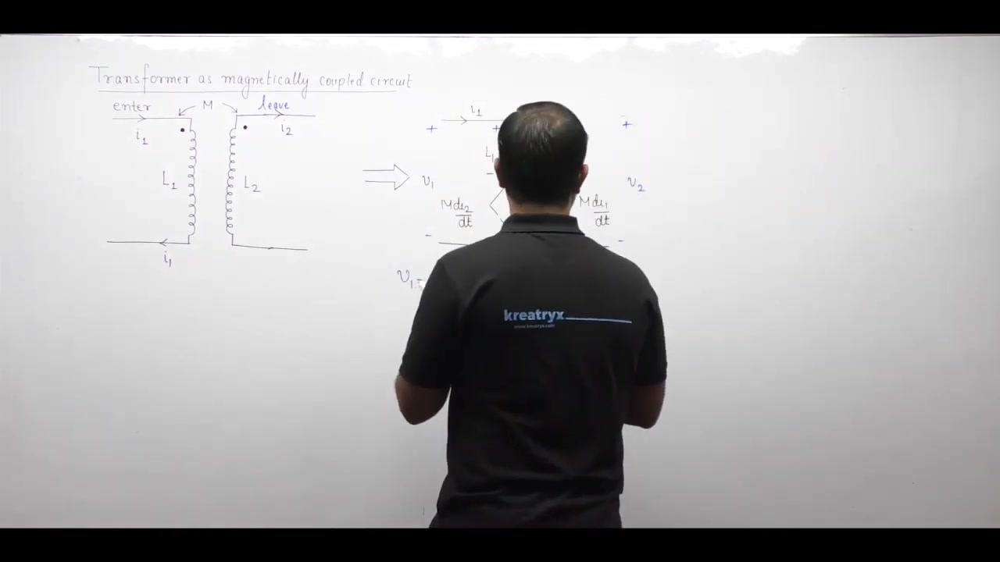

For coil 1, current $i_1$ flows downward into the mutual dependent source. Because the coupling is subtractive, the top terminal of the dependent source is negative. The bottom terminal is positive. Thus, current enters the negative terminal. The voltage drop across this source is:

$$v_{m1} = -M \frac{di_2}{dt}$$

Similarly, on the secondary side, current enters the negative terminal of the mutual source.

### KVL Equations for Subtractive Coupling

Applying Kirchhoff's Voltage Law around the primary loop gives:

$$v_1 = L_1 \frac{di_1}{dt} - M \frac{di_2}{dt}$$

Notice the minus sign before the mutual term. It reflects the opposing flux produced by the other winding.

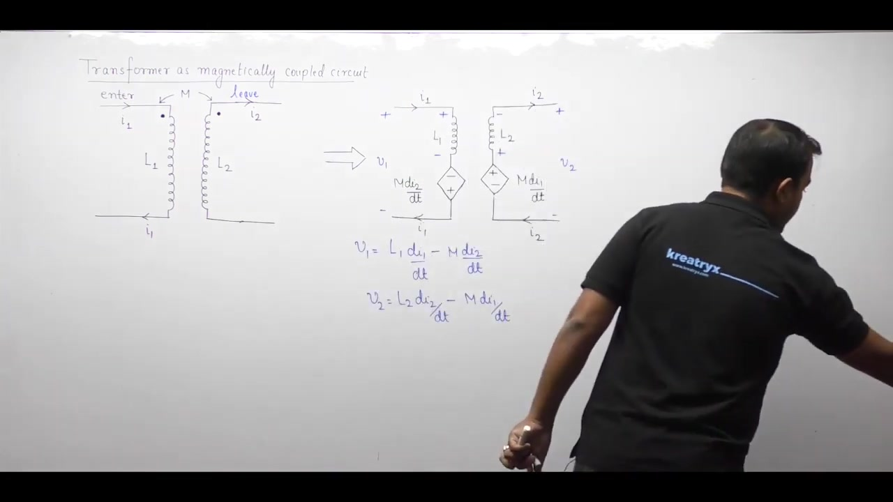

Now consider the secondary loop. Suppose current $i_2$ enters from the bottom terminal. It encounters the negative terminal of the mutual source first. The resulting loop equation is:

$$v_2 = -L_2 \frac{di_2}{dt} + M \frac{di_1}{dt}$$

### Connection to Transformer Inductances

In an operating transformer, primary and secondary currents produce opposing fluxes. The transformer operates in subtractive coupling.

A coupled circuit is defined by self-inductances $L_1, L_2$ and mutual inductance $M$. But a transformer is modeled using leakage inductances $l_1, l_2'$ and magnetizing inductance $L_m$. We need to link these two sets of parameters directly.

## Transformer Equivalent Circuit vs Coupled Circuit Model
_(13:23 - 18:27)_

### The Two Inductance Representations

A transformer has two types of inductances. These are leakage inductance and magnetizing inductance. In contrast, a coupled circuit uses self-inductances and mutual inductance. We want to find the relationship between these two models.

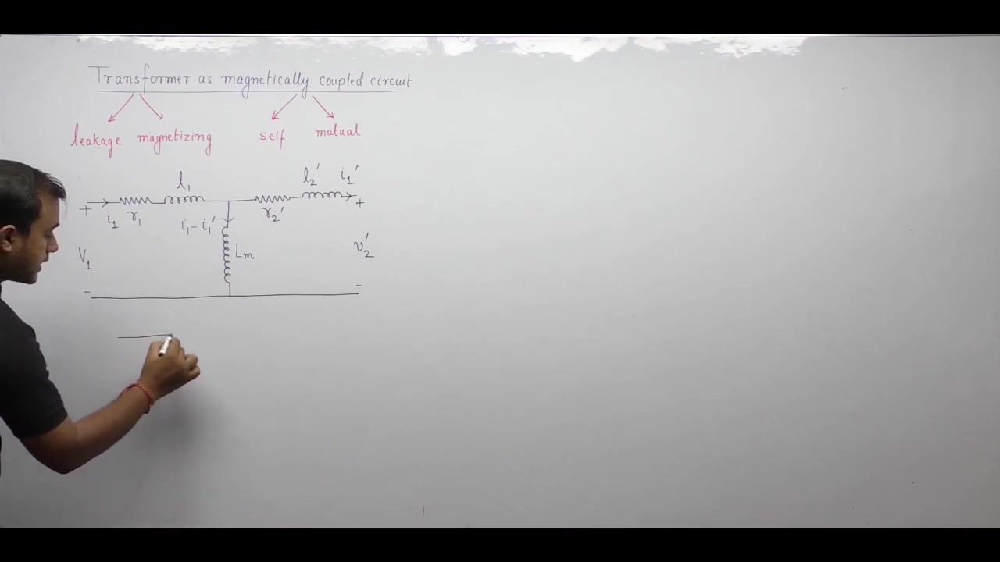

First, consider the standard transformer equivalent circuit referred to the primary side. We omit the core loss resistance because it is a fictitious element. The circuit contains:
- Primary resistance $R_1$ and primary leakage inductance $l_1$.
- Shunt magnetizing inductance $L_m$.
- Referred secondary resistance $R_2'$ and referred secondary leakage inductance $l_2'$.

The current flowing in the shunt branch is $(i_1 - i_1')$. Here $i_1'$ is the referred secondary current.

### Coupled Circuit Model with Opposing Fluxes

In normal transformer operation, the primary and secondary fluxes oppose each other. Therefore, the two windings are subtractively coupled.

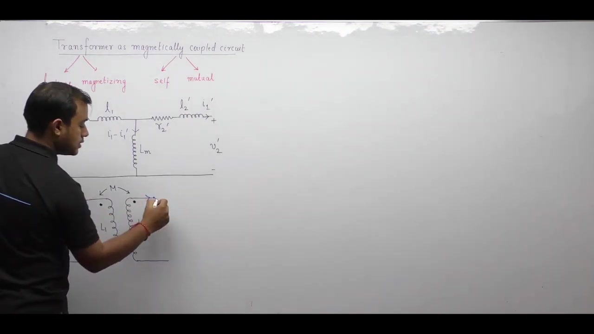

Let $N_1$ and $N_2$ be the primary and secondary turns. Primary current $i_1$ enters the dot. Secondary current $i_2$ leaves the other dot. The windings have resistances $R_1$ and $R_2$, self-inductances $L_1$ and $L_2$, and mutual inductance $M$.

To draw the equivalent circuit, we replace mutual coupling with dependent voltage sources:

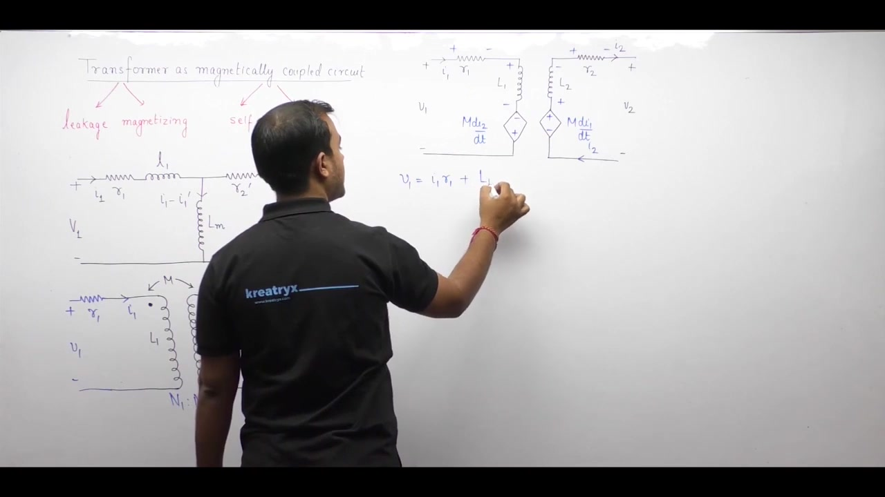

Because the coupling is subtractive, current enters the negative terminal of each dependent source. The primary dependent source is $-M \frac{di_2}{dt}$. The secondary dependent source is $M \frac{di_1}{dt}$.

### Loop Equations for Both Models

For the coupled circuit, KVL around the primary loop gives:

$$v_1 = i_1 R_1 + L_1 \frac{di_1}{dt} - M \frac{di_2}{dt}$$

For the secondary loop, KVL gives:

$$v_2 = -i_2 R_2 - L_2 \frac{di_2}{dt} + M \frac{di_1}{dt}$$

Now look at the transformer T-equivalent circuit. In that circuit, the primary loop equation is:

$$v_1 = i_1 R_1 + l_1 \frac{di_1}{dt} + L_m \frac{d}{dt}(i_1 - i_1')$$

Both representations describe the same physical machine. By comparing the two sets of equations, we can express $l_1$, $L_m$, and $l_2'$ in terms of $L_1$, $L_2$, and $M$.

## Derivation of Leakage and Magnetizing Inductances
_(18:28 - 23:23)_

### Matching Loop Equations

We now connect the coupled circuit equations to the transformer model. From the primary loop of the coupled circuit, we had:

$$v_1 = i_1 R_1 + L_1 \frac{di_1}{dt} - M \frac{di_2}{dt}$$

In the transformer T-equivalent circuit, the primary loop equation is:

$$v_1 = i_1 R_1 + l_1 \frac{di_1}{dt} + L_m \frac{d}{dt}(i_1 - i_1')$$

Here $i_1'$ represents the secondary current referred to the primary winding.

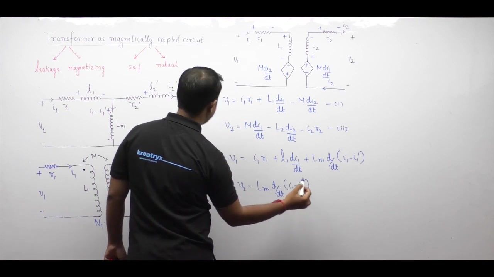

### Referring Secondary Current

Let the turns ratio be $a = N_1 / N_2$. The secondary current referred to the primary side satisfies:

$$i_1' = \frac{i_2}{a}$$

This gives the physical secondary current:

$$i_2 = a \, i_1'$$

Substitute this current into the primary voltage relation:

$$v_1 = i_1 R_1 + L_1 \frac{di_1}{dt} - a M \frac{di_1'}{dt}$$

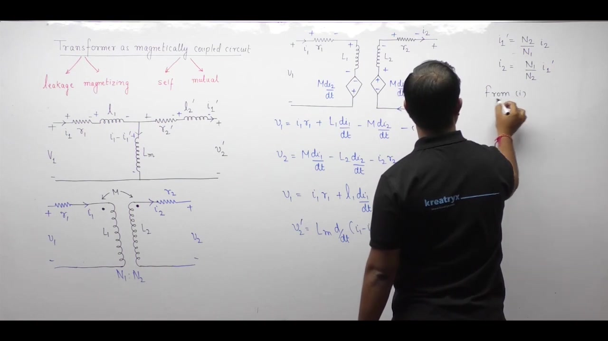

### Forming the Magnetizing Term

The transformer model requires a term containing $(i_1 - i_1')$. To obtain this form, add and subtract $a M \frac{di_1}{dt}$.

Now group the terms by current derivatives. One group has the primary current derivative. The other group has the magnetizing current derivative:

$$v_1 = i_1 R_1 + (L_1 - a M) \frac{di_1}{dt} + a M \frac{d(i_1 - i_1')}{dt}$$

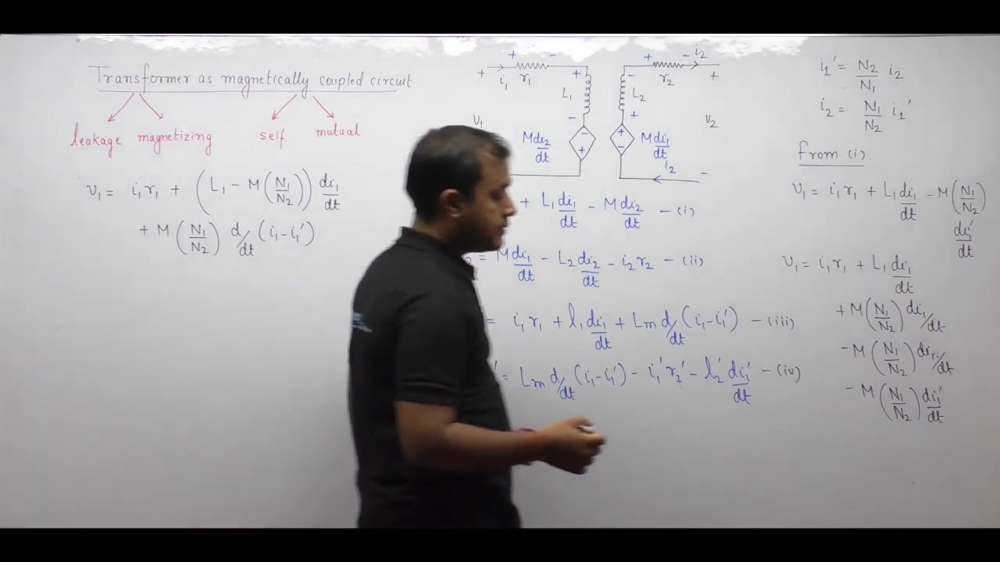

### Primary Parameter Values

Compare this rearranged equation directly with the transformer model equation. The resistance term $i_1 R_1$ matches on both sides.

The factor multiplying $\frac{di_1}{dt}$ gives primary leakage inductance $l_1$:

> [!success] Result
> Primary leakage inductance:
> $$l_1 = L_1 - a M = L_1 - M \left(\frac{N_1}{N_2}\right)$$
> Magnetizing inductance:
> $$L_m = a M = M \left(\frac{N_1}{N_2}\right)$$

Next, we apply the same procedure to the secondary loop to determine $l_2'$.

## Secondary Leakage Inductance Derivation
_(23:28 - 28:17)_

### Referring Secondary Equations

We now derive the secondary leakage inductance referred to the primary side. From the coupled circuit model, the secondary loop equation was:

$$v_2 = M \frac{di_1}{dt} - L_2 \frac{di_2}{dt} - i_2 R_2$$

The transformer equivalent circuit uses referred quantities. Let the turns ratio be $a = N_1 / N_2$. The physical secondary current is:

$$i_2 = a \, i_1'$$

Substitute this into the secondary loop equation:

$$v_2 = M \frac{di_1}{dt} - a L_2 \frac{di_1'}{dt} - a R_2 i_1'$$

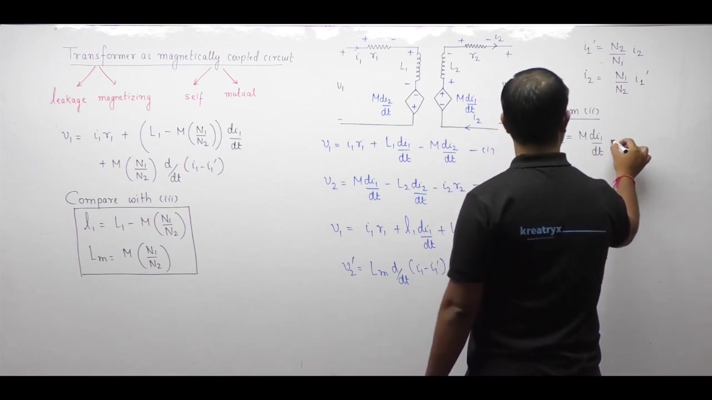

### Scaling Voltage to the Primary Side

The referred secondary voltage is $v_2' = a v_2$. Multiply the entire secondary equation by $a$:

$$v_2' = a M \frac{di_1}{dt} - a^2 L_2 \frac{di_1'}{dt} - a^2 R_2 i_1'$$

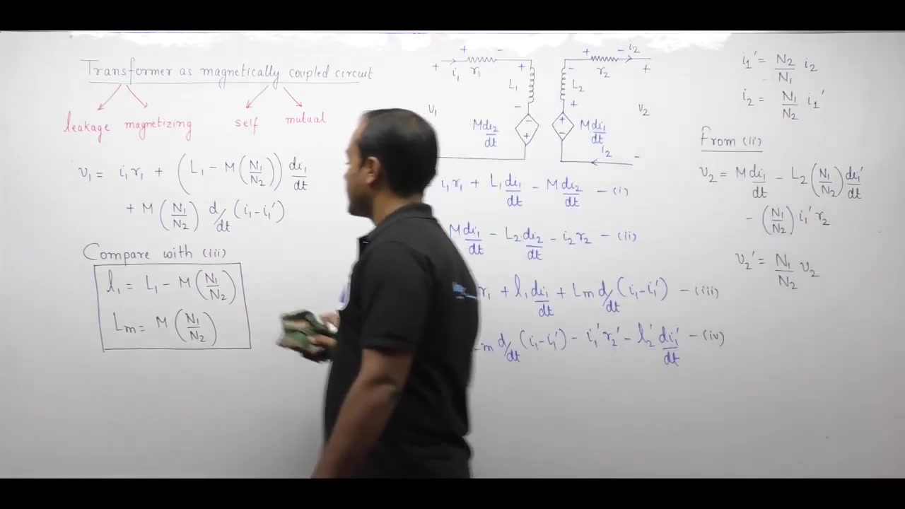

We identify the referred secondary resistance immediately:

$$R_2' = a^2 R_2 = \left(\frac{N_1}{N_2}\right)^2 R_2$$

This matches the standard impedance referral formula.

### Extracting the Magnetizing and Leakage Terms

The transformer model requires a magnetizing term containing $(i_1 - i_1')$. To produce this term, add and subtract $a M \frac{di_1'}{dt}$:

$$v_2' = a M \frac{di_1}{dt} - a M \frac{di_1'}{dt} + a M \frac{di_1'}{dt} - a^2 L_2 \frac{di_1'}{dt} - R_2' i_1'$$

Group the first two terms together. Then group the next two terms by factoring out $-\frac{di_1'}{dt}$:

$$v_2' = a M \frac{d(i_1 - i_1')}{dt} - (a^2 L_2 - a M) \frac{di_1'}{dt} - R_2' i_1'$$

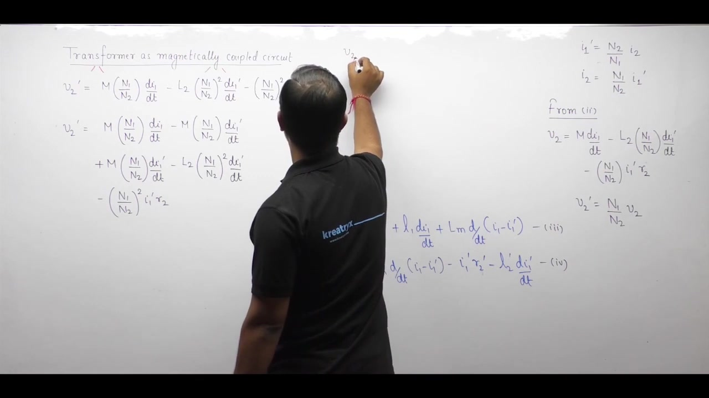

### Consistency of Magnetizing Inductance

Compare this expression with the secondary loop of the transformer T-model:

$$v_2' = L_m \frac{d(i_1 - i_1')}{dt} - l_2' \frac{di_1'}{dt} - R_2' i_1'$$

The magnetizing term yields $L_m = a M$. This matches the value obtained from the primary loop earlier. Both derivations give the exact same magnetizing inductance.

The factor multiplying $\frac{di_1'}{dt}$ gives the referred secondary leakage inductance $l_2'$:

> [!success] Result
> Referred secondary leakage inductance:
> $$l_2' = a^2 L_2 - a M = \left(\frac{N_1}{N_2}\right)^2 L_2 - \left(\frac{N_1}{N_2}\right) M$$
> Actual secondary leakage inductance on the secondary side:
> $$l_2 = \frac{l_2'}{a^2} = L_2 - \left(\frac{N_2}{N_1}\right) M$$

## Direct Inspection Rules for Transformer Inductances
_(28:20 - 34:20)_

### The Intuitive Shortcut

Deriving equations by KVL takes time. You can write the transformer inductances directly by remembering two simple physical rules:

1. Leakage inductance equals self-inductance minus mutual inductance.
2. Magnetizing inductance equals mutual inductance.

The exact expressions depend on which winding you refer the equivalent circuit to.

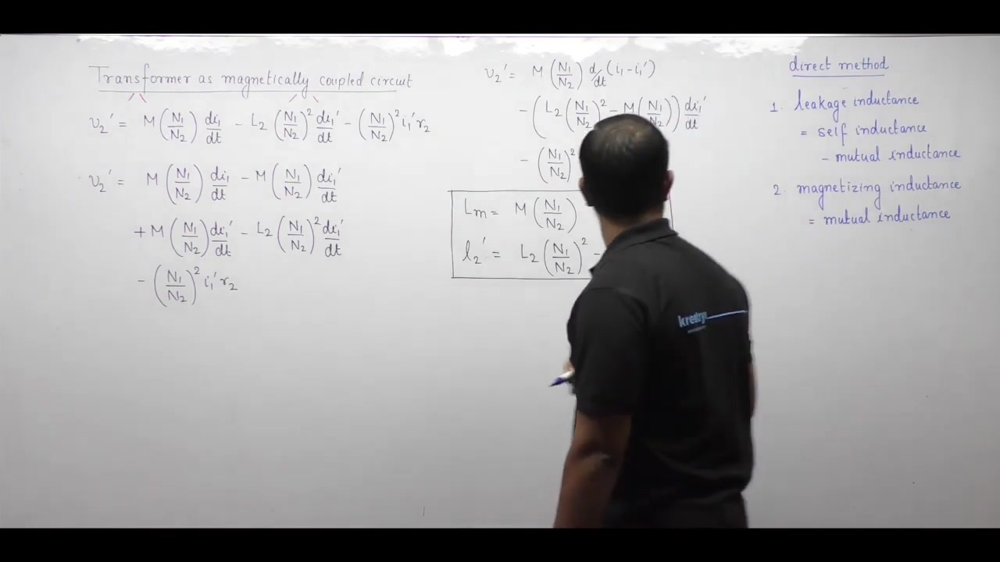

### Equivalent Circuit Referred to Primary Side

Let $a = N_1 / N_2$. When referred to the primary side, all parameters must reflect primary voltage and current levels.

The primary self-inductance $L_1$ already resides on the primary side. We subtract the mutual inductance referred to the primary:

$$l_1 = L_1 - a M = L_1 - M \left(\frac{N_1}{N_2}\right)$$

The secondary self-inductance $L_2$ must first be referred to the primary side. We multiply it by $a^2$:

$$l_2' = a^2 L_2 - a M = \left(\frac{N_1}{N_2}\right)^2 L_2 - M \left(\frac{N_1}{N_2}\right)$$

The magnetizing inductance is the mutual inductance seen from the primary side:

$$L_{m1} = a M = M \left(\frac{N_1}{N_2}\right)$$

### Equivalent Circuit Referred to Secondary Side

Now consider the equivalent circuit referred to the secondary side. Let $b = 1/a = N_2 / N_1$.

The secondary self-inductance $L_2$ is already on the secondary side:

$$l_2 = L_2 - b M = L_2 - M \left(\frac{N_2}{N_1}\right)$$

The primary self-inductance $L_1$ is referred to the secondary by multiplying by $b^2$:

$$l_1' = b^2 L_1 - b M = \left(\frac{N_2}{N_1}\right)^2 L_1 - M \left(\frac{N_2}{N_1}\right)$$

The magnetizing inductance seen from the secondary side becomes:

$$L_{m2} = b M = M \left(\frac{N_2}{N_1}\right)$$

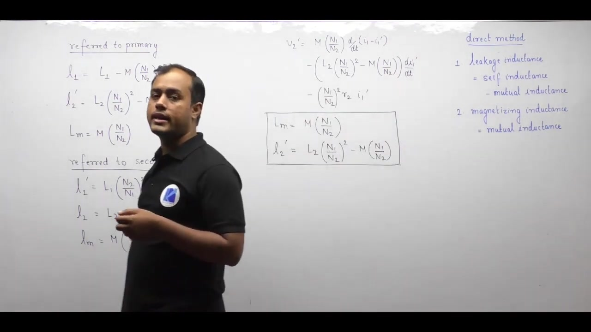

### Why Mutual Inductance Uses a Single Turns Ratio

Self-inductance resides completely on one side. Energy in a self-inductance is $\frac{1}{2} L i^2$. Referring current involves turns ratio $a$. So referring self-inductance requires $a^2$.

In contrast, mutual inductance connects both windings. It relates primary voltage to secondary current:

$$M \propto \frac{V_1}{\omega I_2}$$

Here $V_1$ is already a primary quantity. Only $I_2$ belongs to the secondary. Replacing $I_2$ with $a I_1'$ introduces only a single power of $a$.

> [!info] Rule for Referring Inductances
> Self-inductance is referred using the square of the turns ratio. Mutual inductance is referred using the single power of the turns ratio.

## Transformer Dimensions and Voltage Rating Scaling
_(34:24 - 40:33)_

### Why Mutual Inductance Uses One Turns Ratio

Mutual inductance relates voltage across one winding to current through the other winding:

$$M \propto \frac{V_1}{I_2}$$

Here voltage and current already occupy opposite sides of the machine. When referring to the primary side, primary voltage $V_1$ stays as it is. Only secondary current $I_2$ needs conversion:

$$I_2 = \left(\frac{N_1}{N_2}\right) I_1'$$

This substitution introduces only a single turns ratio factor. Self-inductance relates voltage and current on the same side. Referring both introduces the turns ratio squared.

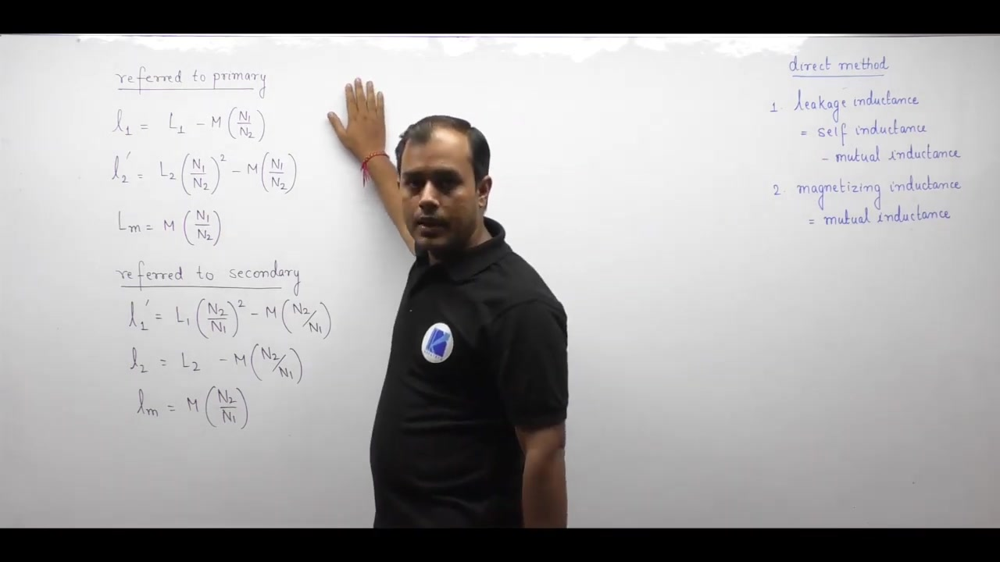

### Scaling of Linear Dimensions

We now study how transformer ratings and parameters scale with physical size. Suppose every linear dimension scales by a constant factor $x$:

$$\text{Length} \propto x, \quad \text{Width} \propto x, \quad \text{Height} \propto x$$

Areas scale as the product of two linear dimensions:

$$\text{Area} \propto x^2$$

Volumes scale as the product of three linear dimensions:

$$\text{Volume} \propto x^3$$

### Assumption of Constant Flux Density

In design scaling, we keep the peak flux density $B_m$ constant. Premium magnetic steels like CRGO can operate up to $1.6\text{ T}$ or $1.7\text{ T}$. Operating below this saturation limit wastes material capability. A good designer uses the magnetic material at its full rating.

The supply frequency $f$ and winding turns $N$ also remain fixed during geometric scaling.

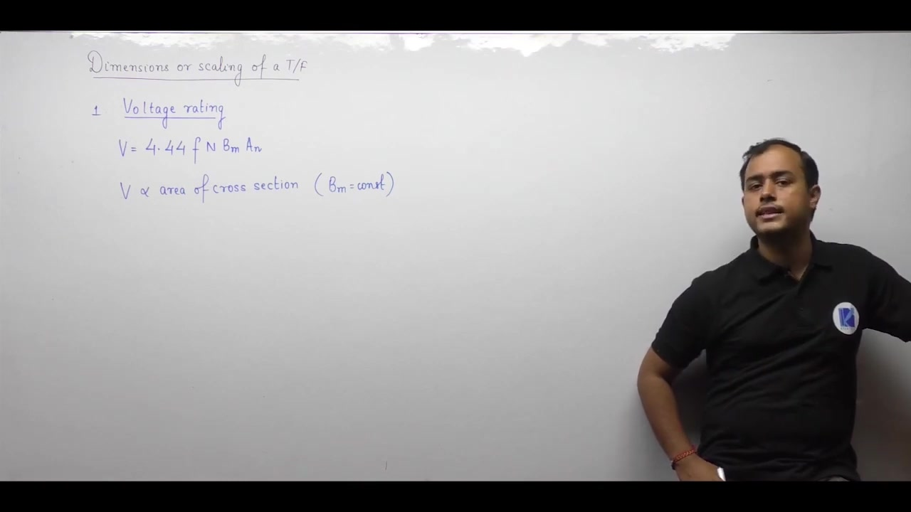

### Scaling of Voltage Rating

The induced EMF in a transformer winding is:

$$E = 4.44 f N B_m A_c$$

Here $A_c$ is the net iron cross-sectional area of the core. Because $f$, $N$, and $B_m$ are constant, voltage is directly proportional to core area:

$$V \propto A_c \propto x^2$$

If every linear dimension doubles ($x = 2$), the core area quadruples:

$$\frac{V_2}{V_1} = \left(\frac{x_2}{x_1}\right)^2 = 2^2 = 4$$

The voltage rating increases fourfold when all linear dimensions double.

## Conductor Sizing, Window Space Factor, and Current Rating
_(40:34 - 45:47)_

### Current Density and Electric Field

To scale the current rating, we examine the conductor cross section. Just as we held magnetic flux density constant, we also keep the electric field constant.

By Ohm's law in point form, current density relates to electric field as:

$$J = \sigma E$$

Because $\sigma$ and $E$ are fixed, the allowable current density $J$ is constant. Current equals current density multiplied by conductor area:

$$I = J a_c \implies I \propto a_c$$

To carry more current, a transformer requires thicker conductors.

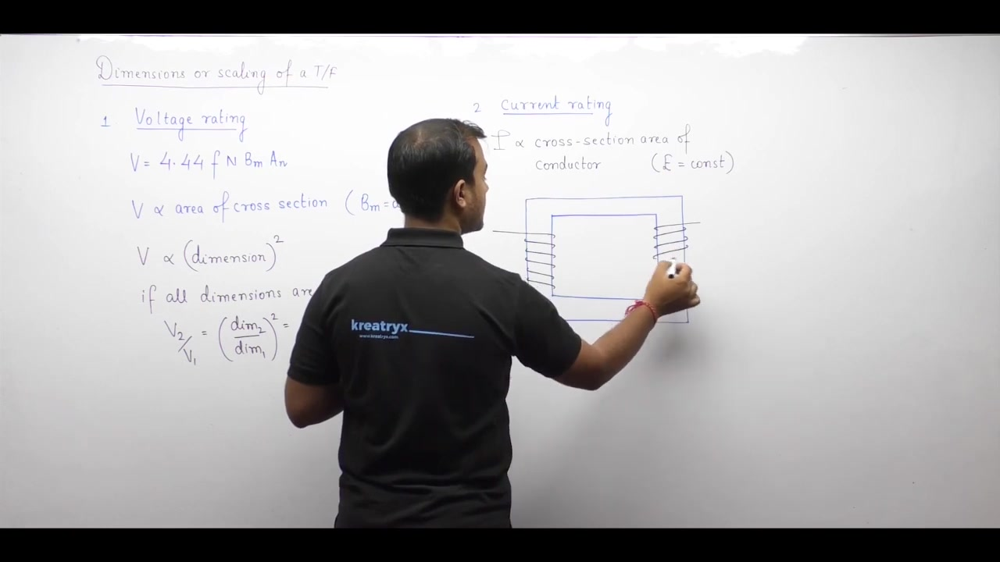

### Window Area and Insulation Constraints

All primary and secondary turns must pass through the central window of the core. Let primary turns be $N_1$ with conductor area $a_1$. Let secondary turns be $N_2$ with conductor area $a_2$.

The net copper area in the window is:

$$A_{cu} = N_1 a_1 + N_2 a_2$$

We cannot fill the entire window with copper. Windings operate at high voltage and require electrical insulation. Placing conductors too close together causes dielectric breakdown of the insulating medium.

> [!info] Window Sizing Rule
> Window dimensions are governed by insulation clearances. Adequate spacing prevents dielectric breakdown between windings on adjacent limbs.

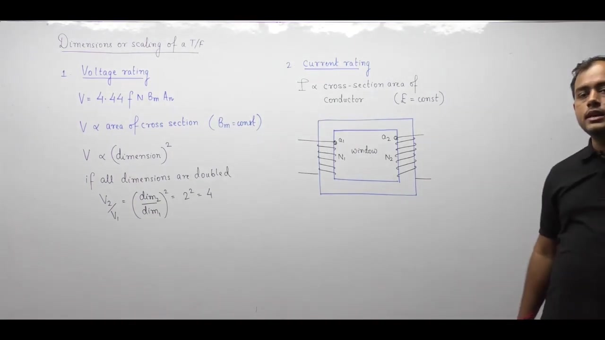

### Window Space Factor

We quantify the copper utilization of the core window using the window space factor $K_w$:

$$K_w = \frac{\text{Area occupied by copper}}{\text{Total window area}} = \frac{N_1 a_1 + N_2 a_2}{A_w}$$

Express conductor area in terms of current density $J$:

$$a_1 = \frac{I_1}{J}, \quad a_2 = \frac{I_2}{J}$$

Substitute these into the space factor expression:

$$K_w = \frac{N_1 I_1 + N_2 I_2}{J A_w}$$

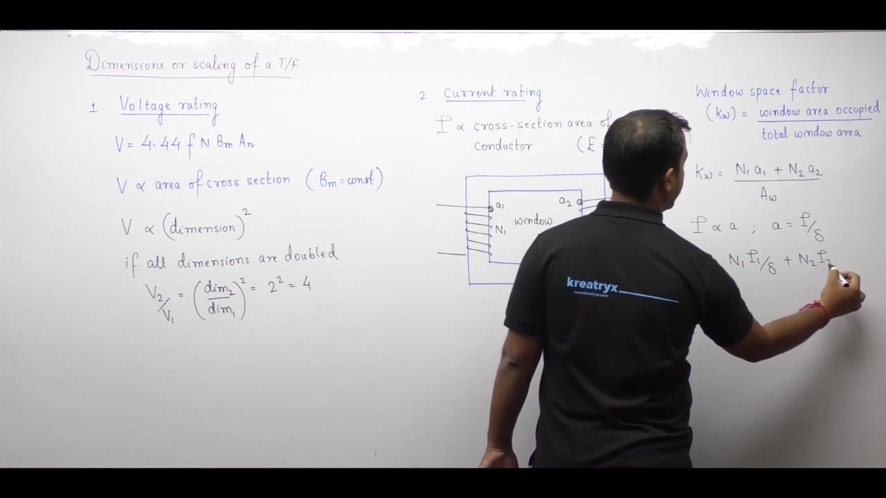

By MMF balance, primary and secondary ampere-turns are equal ($N_1 I_1 = N_2 I_2$):

$$K_w = \frac{2 N_1 I_1}{J A_w}$$

### Scaling of Current Rating

The total window area scales with the square of linear dimensions:

$$A_w \propto x^2$$

With fixed turns $N_1$, constant current density $J$, and constant space factor $K_w$:

$$I_1 \propto A_w \propto x^2$$

The rated current scales as $x^2$. If all linear dimensions double, the current rating increases by a factor of 4.

## Scaling of Current, kVA Rating, and Core Loss
_(45:53 - 51:35)_

### Current Rating Scaling

From the window space factor, the rated primary current is:

$$I_1 = \frac{J A_w K_w}{2 N_1}$$

The window is formed inside the magnetic core. When the core scales by linear factor $x$, the window dimensions also scale by $x$. The window area expands as:

$$A_w \propto x^2$$

With fixed turns $N_1$, constant current density $J$, and constant space factor $K_w$, the current rating scales directly with window area:

$$I \propto A_w \propto x^2$$

Both current and voltage ratings scale as the square of the linear dimensions.

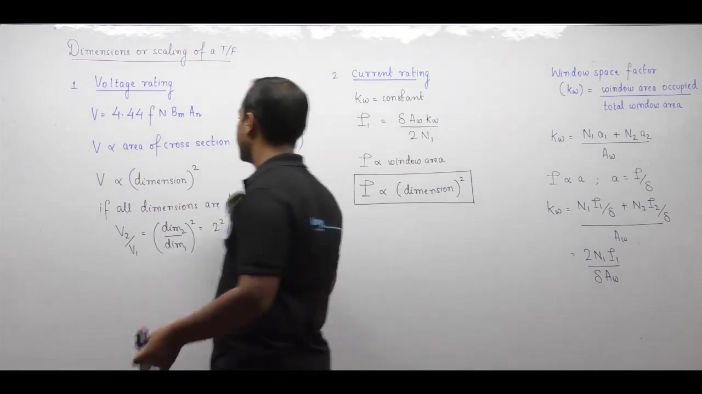

### Scaling of kVA Rating

The apparent power rating of a single-phase transformer is the product of voltage and current ratings:

$$\text{kVA} = V \times I$$

Substitute the scaling relationships for $V$ and $I$:

$$V \propto x^2, \quad I \propto x^2 \implies \text{kVA} \propto x^2 \times x^2 = x^4$$

The kVA power rating scales as the fourth power of the linear dimensions.

> [!success] Result
> If all linear dimensions double ($x = 2$):
> - Voltage rating increases by $2^2 = 4$ times.
> - Current rating increases by $2^2 = 4$ times.
> - Power rating increases by $2^4 = 16$ times.

### Scaling of Core Loss

Total core loss consists of hysteresis loss and eddy current loss:

$$P_c = P_h + P_e$$

Recall the physical expressions for both losses:

$$
\begin{aligned}
P_h &= \eta_s B_m^n f \times \text{Volume} \\
P_e &= \frac{\pi^2 f^2 B_m^2 t^2}{6 \rho} \times \text{Volume}
\end{aligned}
$$

Here $t$ is lamination thickness, $\rho$ is resistivity, and $\eta_s$ is the Steinmetz coefficient.

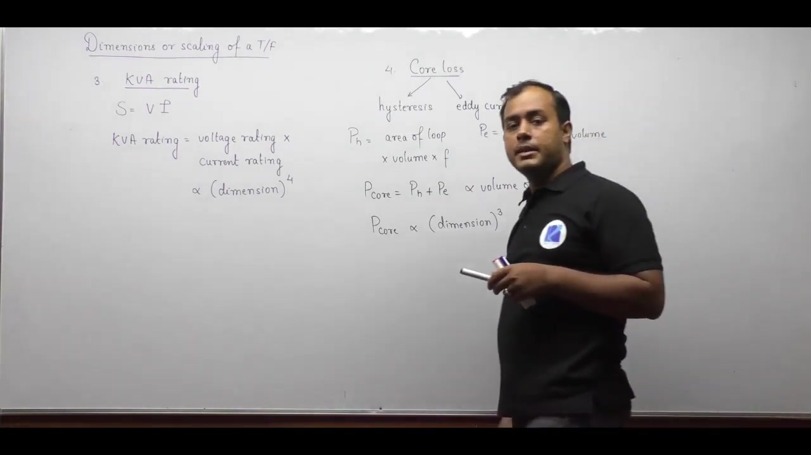

Because $B_m$ and $f$ are held constant, the loss per unit volume is constant. Both hysteresis and eddy current losses are directly proportional to core volume:

$$P_c \propto \text{Volume} \propto x^3$$

Core loss scales with the cube of the linear dimensions.

## Excitation Currents, Mechanical Scaling, and Summary of Scaling Laws
_(51:39 - 57:03)_

### Scaling of No-Load Current Components

In the parallel excitation branch, core loss resistance $R_c$ draws active working current $I_w$. The magnetizing inductance $L_m$ draws magnetizing current $I_\mu$.

The core loss is:

$$P_c = V_1 I_w$$

We previously found that $P_c \propto x^3$ and $V_1 \propto x^2$. The core loss current scales as:

$$I_w = \frac{P_c}{V_1} \propto \frac{x^3}{x^2} = x$$

To find the scaling of magnetizing current $I_\mu$, apply Ampere's circuital law:

$$N_1 I_\mu = \Phi_m \mathcal{R} = (B_m A_c) \left(\frac{l_c}{\mu A_c}\right) = \frac{B_m l_c}{\mu}$$

The core cross-sectional area $A_c$ cancels out. With constant $B_m$ and fixed permeability, magnetizing current depends only on magnetic path length $l_c$:

$$I_\mu \propto l_c \propto x$$

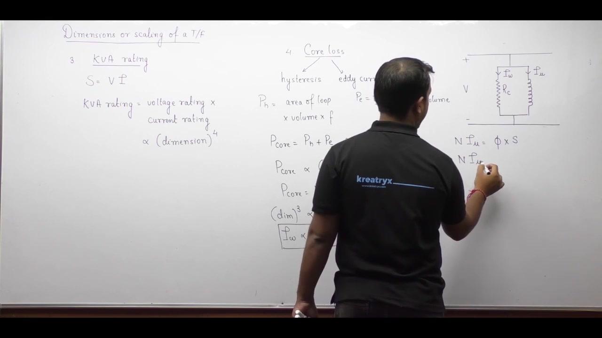

The total no-load current is:

$$I_0 = \sqrt{I_w^2 + I_\mu^2} \propto \sqrt{x^2 + x^2} \propto x$$

The absolute no-load current increases linearly with size. But the rated current scales as $x^2$. The per-unit no-load current drops as machine size grows:

$$I_{0,\text{pu}} = \frac{I_0}{I_{\text{rated}}} \propto \frac{x}{x^2} = \frac{1}{x}$$

Larger machines draw a smaller percentage of no-load current.

### Mechanical Parameter Scaling: Moment of Inertia

In rotating electrical machines, the rotor or shaft is modeled as a cylinder. The moment of inertia is denoted by $J$:

$$J = \frac{1}{2} M r^2$$

Mass is density multiplied by volume:

$$M = \rho_{\text{mat}} \times \text{Volume} \propto x^3$$

The radius of the rotor scales as $x$. Therefore:

$$J \propto (\text{Volume}) \times r^2 \propto x^3 \times x^2 = x^5$$

The moment of inertia scales with the fifth power of linear dimensions.

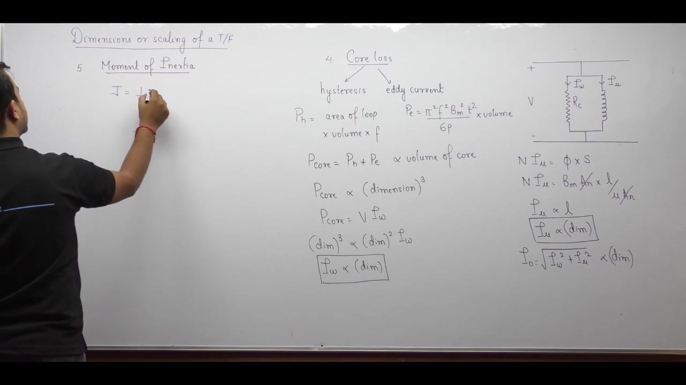

### Comprehensive Summary of Scaling Laws

All derived scaling relationships assume constant maximum flux density $B_m$. You can check whether $B_m$ is constant from:

$$B_m \propto \frac{V}{f A_c}$$

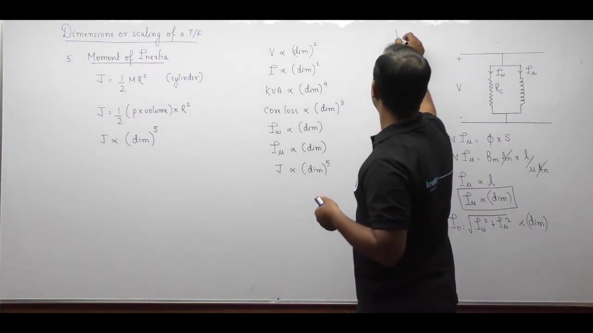

The table below summarizes how parameters scale with linear dimension factor $x$:

| Parameter | Symbol / Formula | Proportionality |
| :--- | :--- | :--- |
| Linear dimensions | Length, width, height | $\propto x$ |
| Core and window areas | $A_c, A_w$ | $\propto x^2$ |
| Core volume and mass | $\text{Vol}, \text{Mass}$ | $\propto x^3$ |
| Voltage rating | $V \propto A_c$ | $\propto x^2$ |
| Current rating | $I \propto A_w$ | $\propto x^2$ |
| Power rating | $\text{kVA} = V \times I$ | $\propto x^4$ |
| Core losses | $P_c \propto \text{Volume}$ | $\propto x^3$ |
| Copper losses | $P_{cu} = I^2 R$ | $\propto x^3$ |
| Heat dissipation area | $A_{\text{cool}}$ | $\propto x^2$ |
| Temperature rise | $\Delta \theta = P_{\text{loss}} / A_{\text{cool}}$ | $\propto x$ |
| Efficiency | $\eta = 1 - (P_{\text{loss}}/\text{kVA})$ | Increases ($\% P_{\text{loss}} \propto 1/x$) |
| Excitation currents | $I_w, I_\mu, I_0$ | $\propto x$ |
| Per-unit no-load current | $I_{0,\text{pu}}$ | $\propto 1/x$ |
| Moment of inertia | $J = M r^2$ | $\propto x^5$ |

> [!success] Result
> While kVA rating increases as $x^4$, losses only increase as $x^3$. Larger transformers achieve higher efficiency and greater power density.

---

## Summary and Key Takeaways

- In coupled circuits, mutual inductance is represented by a dependent voltage source where current enters the positive terminal for additive coupling and the negative terminal for subtractive coupling.
- Operating transformers exhibit subtractive magnetic coupling because secondary current produces flux that opposes the primary flux.
- Primary leakage inductance equals primary self-inductance minus mutual inductance referred to primary: $l_1 = L_1 - M (N_1/N_2)$.
- Secondary leakage inductance referred to primary is $l_2' = (N_1/N_2)^2 L_2 - M (N_1/N_2)$, while magnetizing inductance is $L_m = M (N_1/N_2)$.
- Self-inductance scales by the square of the turns ratio, but mutual inductance scales by the single power of the turns ratio.
- Under constant flux density and fixed frequency, transformer voltage rating scales as the square of linear dimensions: $V \propto x^2$.
- Conductor cross section scales with window area under constant current density, yielding a current rating scaling of $I \propto x^2$.
- Transformer apparent power rating scales as the fourth power of linear dimensions ($\text{kVA} \propto x^4$), while total losses scale as $x^3$.
- Because losses scale as $x^3$ while heat dissipation area scales as $x^2$, temperature rise increases linearly with size ($\Delta \theta \propto x$).

---

[← Lec 028: Problems based on Voltage Regulation of Transformer](Lecture_028_Problems_based_on_Voltage_Regulation_of_Transformer.md) | [🏠 Index](00_yt_study_guide.md) | [Lec 030: Important Concepts in Electrical Machines 2 →](Lecture_030_Important_Concepts_in_Electrical_Machines_2.md)
