# Electrical Machines | Lec 21 | Important Concepts in Electrical Machines - 2| GATE Electrical Engg

- **Source**: https://www.youtube.com/watch?v=lMFoAAAXK_o
- **Duration**: 01:03:42
- **Compiled**: 2026-09-20

---

## Overview

This lecture examines comparative transformer design, multi-winding systems, and non-ideal core behavior. It contrasts power transformers with distribution transformers across voltage ratings, efficiency targets, and fault protection. It establishes the governing laws for three-winding transformers and examines tertiary winding functions. The lecture also investigates square-wave excitation, load power factor effects on internal flux, and multi-winding circuit analysis.

## Contents

- [[#Power Transformers vs Distribution Transformers: System Roles|Power Transformers vs Distribution Transformers: System Roles]]
- [[#Operating Voltages, Insulation, and Leakage Reactance|Operating Voltages, Insulation, and Leakage Reactance]]
- [[#Loading Patterns, Efficiency Design, and Losses|Loading Patterns, Efficiency Design, and Losses]]
- [[#Core Utilization, Loss Optimization, and Voltage Regulation|Core Utilization, Loss Optimization, and Voltage Regulation]]
- [[#Leakage Reactance, Fault Currents, and Three-Winding Construction|Leakage Reactance, Fault Currents, and Three-Winding Construction]]
- [[#Three-Winding Transformer: Voltage per Turn, MMF Balance, and Power|Three-Winding Transformer: Voltage per Turn, MMF Balance, and Power]]
- [[#Tertiary Winding Applications in Power Systems|Tertiary Winding Applications in Power Systems]]
- [[#Secondary Voltage Waveform for Square-Wave Input|Secondary Voltage Waveform for Square-Wave Input]]
- [[#Practical Core Saturation and the Constant-Flux Question|Practical Core Saturation and the Constant-Flux Question]]
- [[#Phasor Analysis of Core Flux Variation|Phasor Analysis of Core Flux Variation]]
- [[#Effect of Power Factor on Core Losses and Three-Winding Transformer Problem|Effect of Power Factor on Core Losses and Three-Winding Transformer Problem]]
- [[#Three-Winding Transformer Problem: Three Solution Methods|Three-Winding Transformer Problem: Three Solution Methods]]

---

## Power Transformers vs Distribution Transformers: System Roles
_(00:12 - 05:24)_

### Roles in a Power System

Electrical power systems use transformers at two key stages. First, generating stations use step-up transformers before long-distance transmission. Second, substations use step-down transformers to supply consumers. We classify these units as power transformers and distribution transformers.

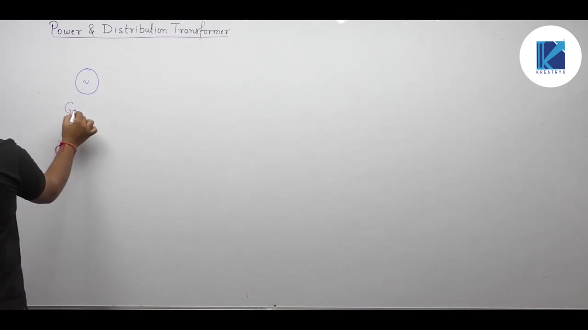

A generator produces electrical power driven by a turbine. Immediately after the generator, we connect a power transformer. This transformer steps up the voltage before power enters the transmission line.

### Minimizing Transmission Losses

Apparent power in a single-phase circuit is:

$$S = V I$$

For a fixed amount of apparent power, raising voltage reduces the line current:

$$V \uparrow \implies I \downarrow$$

The transmission line wires have series resistance $R$. The power lost along the line is:

$$P_{\text{loss}} = I^2 R$$

Reducing current sharply cuts this $I^2 R$ loss.

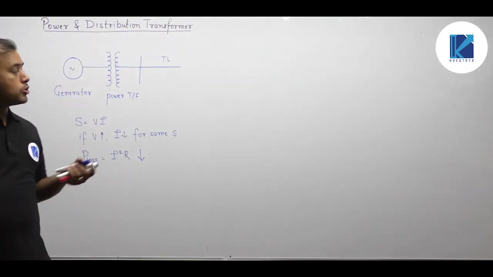

Do not call this loss copper loss. Transmission line conductors are made of aluminum rather than copper. We call it ohmic line loss.

### Function of Distribution Transformers

Consumers cannot use transmission-level high voltages. Domestic appliances require $230\text{ V}$.

A distribution transformer is installed at the receiving end of the system. It steps down the high voltage to safe utilization levels for homes and factories.

> [!info] Definitions
> - **Power Transformer**: Connected between the generating station and the transmission line to step up voltage and minimize ohmic losses during transmission.
> - **Distribution Transformer**: Connected at the load end to step down voltage before delivering power to consumer loads.

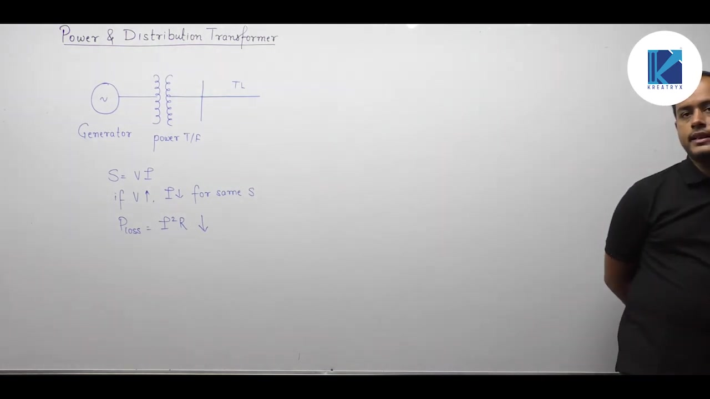

### Power Rating Differences

A power transformer handles the entire bulk output of the generating station. The transmission line then splits into multiple feeder lines. Each distribution transformer supplies only a single neighborhood or industrial area.

Because one generator feeds dozens of distribution networks, power transformers carry vastly larger power ratings than distribution transformers.

## Operating Voltages, Insulation, and Leakage Reactance
_(05:34 - 10:14)_

### Voltage Rating Comparison

Power transformers operate at much higher voltages than distribution transformers. A generator typically outputs $11\text{ kV}$ or $33\text{ kV}$. The step-up power transformer raises this voltage to $220\text{ kV}$ or $400\text{ kV}$ for transmission.

In contrast, distribution transformers deliver power at secondary voltages of $440\text{ V}$ or $230\text{ V}$.

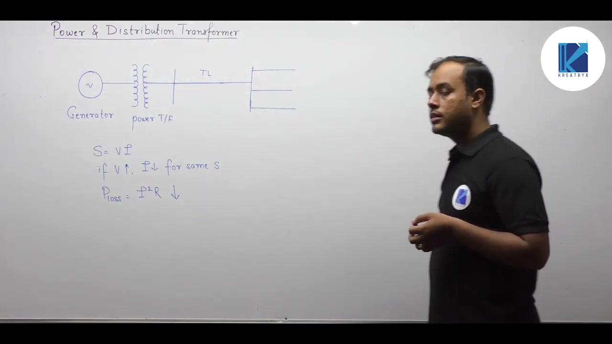

### Insulation and Electric Field Stress

Higher operating voltage creates stronger electric fields. If the electric field exceeds the dielectric strength of the insulating material, breakdown occurs. Therefore, power transformers require thick insulation layers.

> [!info] Insulation Rule
> Due to higher operating voltages, a power transformer requires significantly more insulation than a distribution transformer.

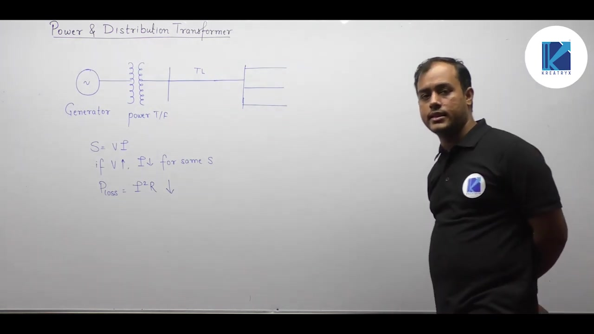

### Effect on Leakage Reactance

Consider concentric windings placed on a core limb. The low-voltage (LV) winding sits closest to the core. The high-voltage (HV) winding sits on the outside.

Insulation is placed between the LV and HV windings. When operating voltage increases, this insulation barrier must be thicker. A thicker insulation layer increases the physical distance between the LV and HV windings.

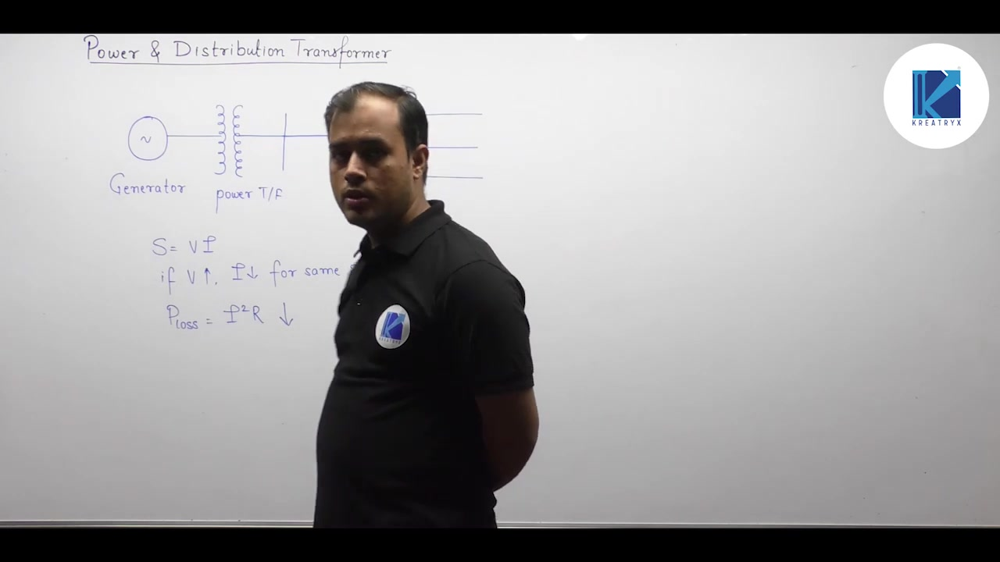

As the separation increases, more magnetic flux leaks into the gap without linking both coils. This increases the leakage flux.

> [!success] Result
> Increasing winding separation increases leakage flux. Therefore, power transformers have higher leakage reactance than distribution transformers.

We specify leakage reactance rather than leakage impedance because impedance includes winding resistance.

### Voltage Levels in Practice

We begin a systematic comparison table:

| Parameter | Power Transformer | Distribution Transformer |
| :--- | :--- | :--- |
| Voltage level | High voltage: $400\text{ kV}, 220\text{ kV}, 66\text{ kV}, 33\text{ kV}$ | Low voltage: $11\text{ kV}, 6.6\text{ kV}, 3.3\text{ kV}, 440\text{ V}, 230\text{ V}$ |

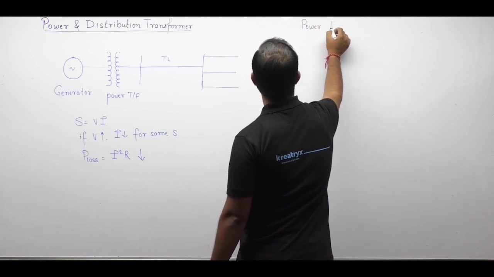

Power transformers handle extra-high voltages directly connected to transmission lines. Distribution transformers operate at medium and low utilization voltages.

## Loading Patterns, Efficiency Design, and Losses
_(10:14 - 16:19)_

### Power Rating and Physical Size

Power transformers carry power ratings exceeding $200\text{ MVA}$. Distribution transformers operate with ratings below $200\text{ MVA}$. Most distribution units rate in kVA or a few MVA.

Because power transformers handle greater power and higher voltages, their physical dimensions are much larger. They require larger magnetic cores, thicker insulation barriers, and extensive oil cooling tanks.

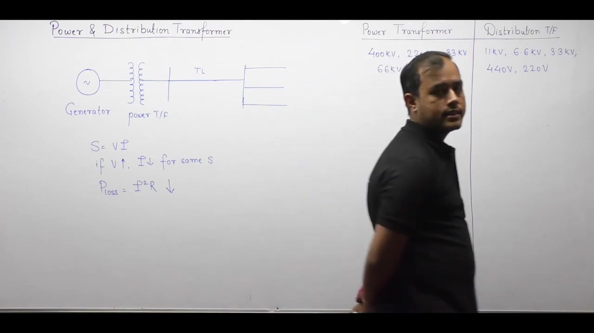

### Operating Load Cycle

Power transformers connect directly to transmission lines. They run continuously at or near full load.

Distribution transformers supply residential and commercial consumers. Their load fluctuates constantly throughout the day. Demand peaks during morning and evening hours and drops sharply at night.

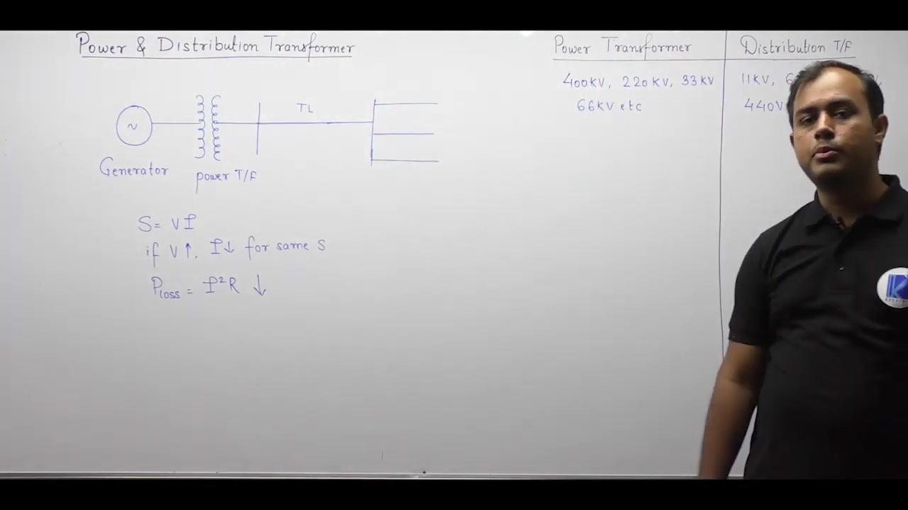

### Efficiency Metric and Design Optimization

Because operating profiles differ, we evaluate efficiency using different criteria:

1. **Commercial Efficiency**: Used for power transformers. It measures power efficiency under steady full load.
2. **All-Day Efficiency**: Used for distribution transformers. It measures energy efficiency over a full 24-hour cycle:

$$\eta_{\text{all-day}} = \frac{\text{Energy output in 24 hours (kWh)}}{\text{Energy input in 24 hours (kWh)}}$$

Power transformers are designed so that maximum efficiency occurs at full rated load.

> [!success] Maximum Efficiency Condition
> - **Power Transformer**: Designed for maximum efficiency at full load ($x = 1.0$).
> - **Distribution Transformer**: Designed for maximum efficiency at $50\% - 70\%$ of full load ($x = 0.5 - 0.7$).

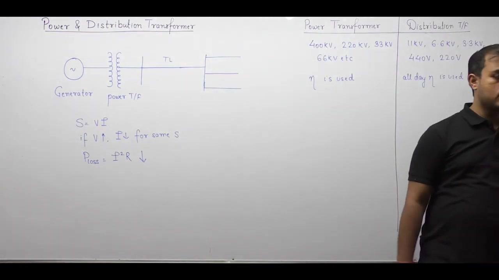

A distribution transformer rarely operates at full load. Designing it for peak efficiency at full load wastes energy. Aligning peak efficiency with the typical operating load of $50\% - 70\%$ yields the best all-day efficiency.

### Loss Behavior Over 24 Hours

In a power transformer, both core loss and full-load copper loss occur continuously across the entire day:

$$W_{\text{loss}} = (P_c + P_{cu,fl}) \times 24\text{ hours}$$

In a distribution transformer, the core is excited 24 hours a day. Core loss occurs constantly:

$$W_{\text{core}} = P_c \times 24\text{ hours}$$

However, copper loss varies with the connected load:

$$W_{cu} = \sum x_i^2 P_{cu,fl} \Delta t_i$$

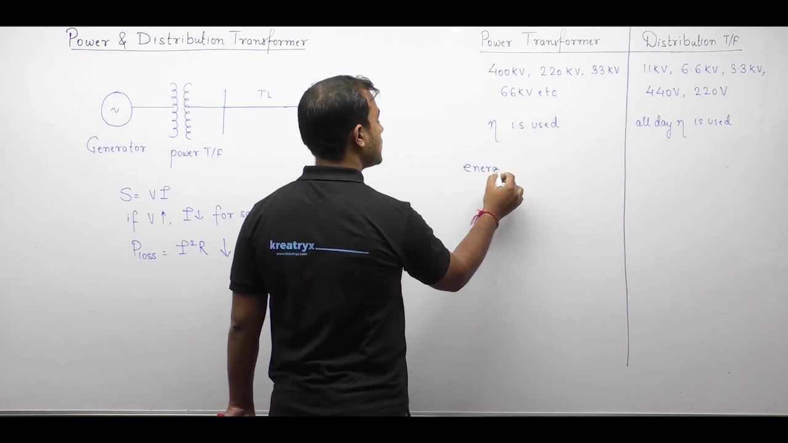

### Operating Flux Density

The induced voltage relation is:

$$E = 4.44 f N B_m A_c$$

Power transformers operate at high flux density $B_m$ near the knee point of the saturation curve. Higher $B_m$ produces higher voltage with a smaller core area.

Distribution transformers operate at lower flux density in the linear region. Keeping $B_m$ lower keeps core loss small throughout the 24-hour excitation cycle.

## Core Utilization, Loss Optimization, and Voltage Regulation
_(16:24 - 21:27)_

### Operating Point on the B-H Curve

The magnetic operating point differs between power and distribution transformers. A power transformer operates near the knee point of the B-H curve.

A distribution transformer operates well below the knee point within the strictly linear region.

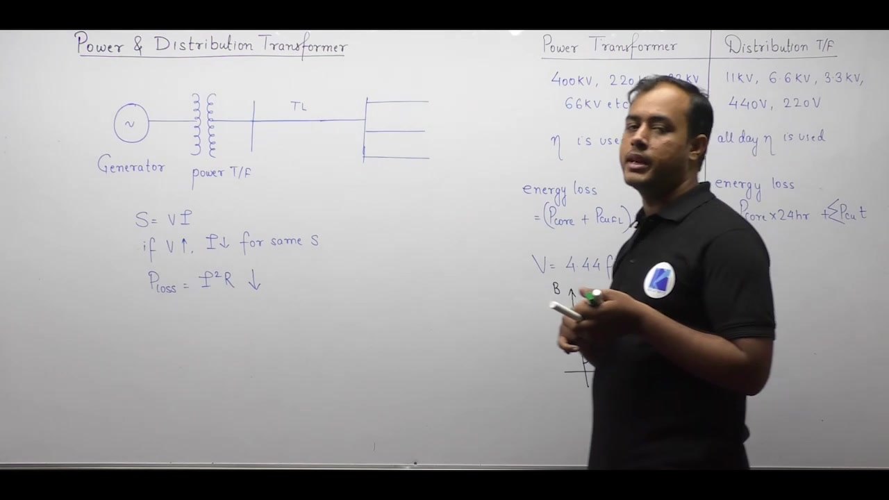

Beyond the knee point, magnetic saturation occurs. Saturation causes sharp non-linearities and generates unwanted harmonics in current waveforms.

### Core Material Utilization and Sizing

Operating at the knee point allows full utilization of the magnetic core material. The core carries the maximum flux density $B_m$ it can support without excessive saturation.

From the EMF relation, the required core area is:

$$A_c = \frac{E}{4.44 f N B_m}$$

For a given voltage, operating at higher $B_m$ reduces the required core area $A_c$.

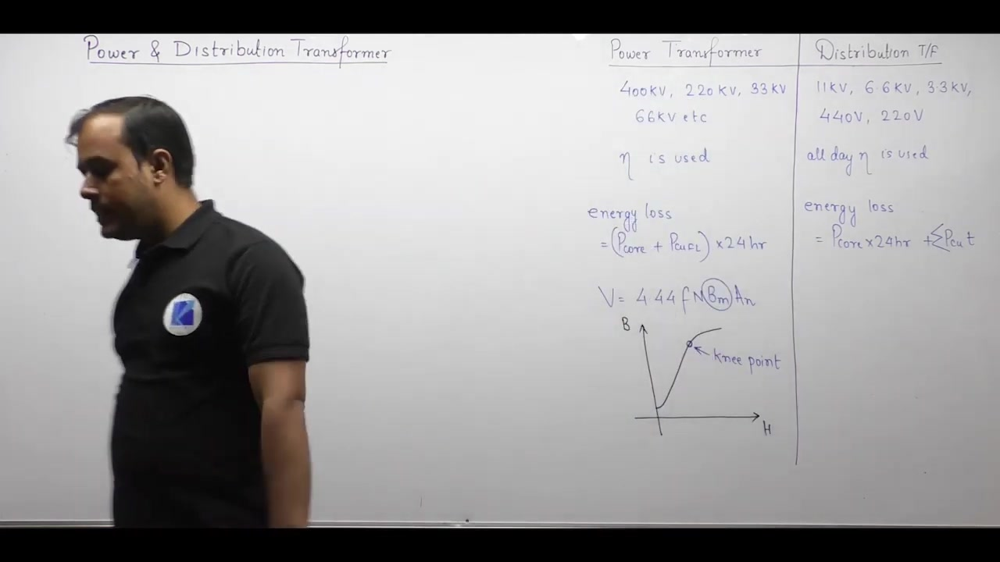

> [!info] Sizing Benefit
> Operating a power transformer at high flux density reduces its core cross-sectional area and overall weight.

Distribution transformers do not fully exploit core capacity. They operate at lower flux density to maintain low core losses.

### Loss Minimization Strategy

The two transformer types prioritize different losses during design:

1. **Power Transformer**: Full-load copper loss exceeds core loss ($P_{cu,fl} > P_c$). Because the machine runs at full load all day, copper loss dominates total energy waste. Designers minimize copper loss.
2. **Distribution Transformer**: Core loss occurs continuously for 24 hours whether loaded or not. Copper loss is low during light-load hours. Designers minimize core loss.

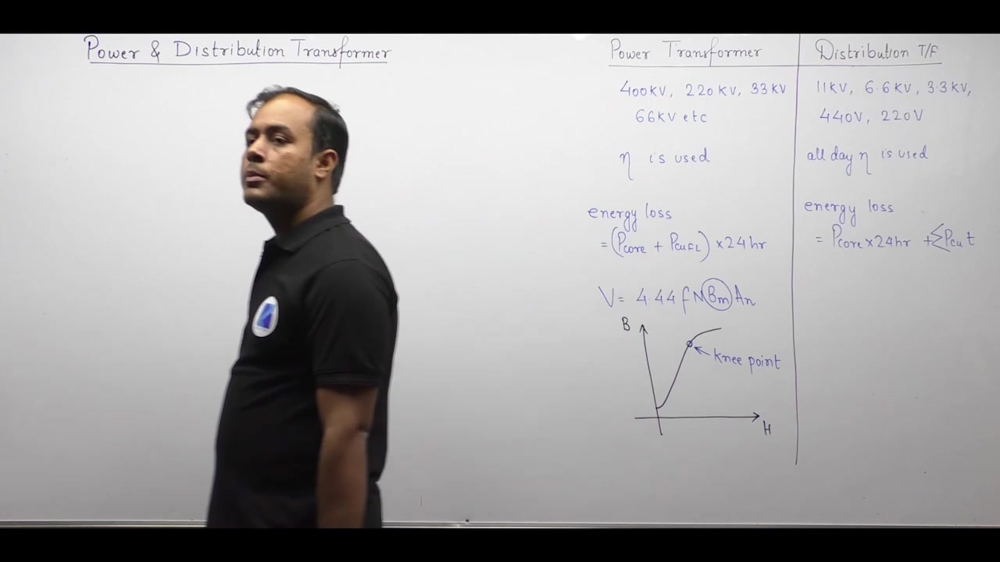

Because core loss scales approximately with $B_m^2$, the lower flux density of distribution transformers helps minimize core loss.

### Criticality of Voltage Regulation

Voltage regulation measures the percentage change in terminal voltage from no-load to full load.

In power transformers, voltage regulation is not critical. Grid operators manage transmission voltage using on-load tap changers and reactive power compensators.

In distribution transformers, voltage regulation is critical. The secondary terminals connect directly to consumer appliances. Excessive voltage drop causes undervoltage conditions at customer premises. Designers keep distribution transformer leakage impedance low to ensure tight voltage regulation.

## Leakage Reactance, Fault Currents, and Three-Winding Construction
_(21:27 - 26:48)_

### Leakage Reactance and Short-Circuit Protection

Typical per-unit leakage reactance values reflect different design priorities:

- **Power Transformer**: $X_{\text{pu}} \approx 0.10\text{ pu}$
- **Distribution Transformer**: $X_{\text{pu}} \approx 0.01\text{ pu}$

Power transformers have ten times higher per-unit reactance than distribution transformers. This high reactance serves an essential protective purpose during electrical faults.

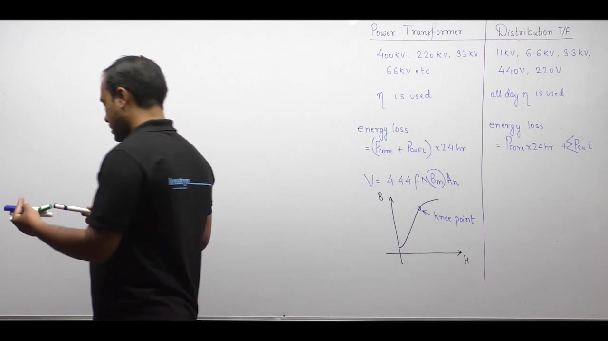

When a short circuit occurs on the power system, fault currents reach massive levels. The excitation current $I_0$ is negligible compared to fault currents. We can ignore the shunt branch entirely.

The short-circuit current in per-unit is:

$$I_{sc} = \frac{V_{\text{pu}}}{Z_{\text{pu}}} = \frac{V_{\text{pu}}}{\sqrt{R_{\text{pu}}^2 + X_{\text{pu}}^2}}$$

Because winding resistance is small compared to reactance, $Z_{\text{pu}} \approx X_{\text{pu}}$:

$$I_{sc} \approx \frac{V_{\text{pu}}}{X_{\text{pu}}}$$

For a power transformer with $X_{\text{pu}} = 0.1\text{ pu}$, fault current is limited to $10\text{ pu}$. If $X_{\text{pu}}$ were $0.01\text{ pu}$, fault current would surge to $100\text{ pu}$.

> [!success] Result
> High leakage reactance limits short-circuit fault current. It protects power transformers from destructive electromagnetic forces and severe thermal stress.

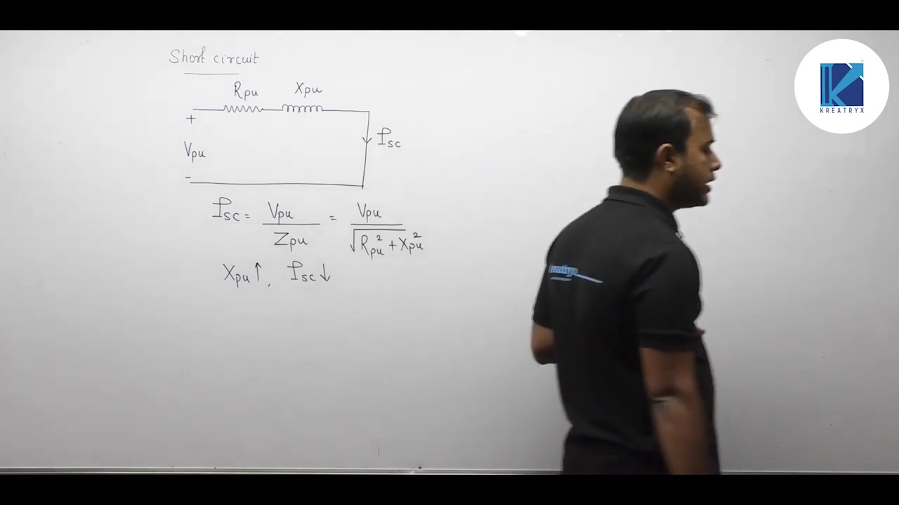

### Introduction to Three-Winding Transformers

A standard transformer has two windings. A three-winding transformer places three separate windings on the same magnetic core:

1. **Primary Winding**: $N_1$ turns, connected to the source.
2. **Secondary Winding**: $N_2$ turns, connected to a load.
3. **Tertiary Winding**: $N_3$ turns, connected to a second load or auxiliary system.

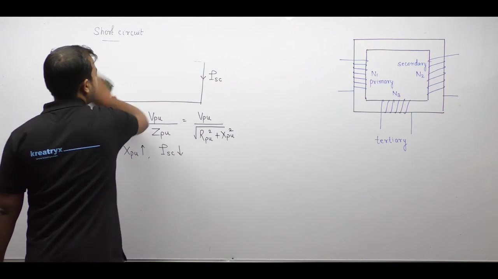

### Schematic Representation

We represent a three-winding transformer using three coils coupled by double vertical lines. The double lines indicate a common magnetic core.

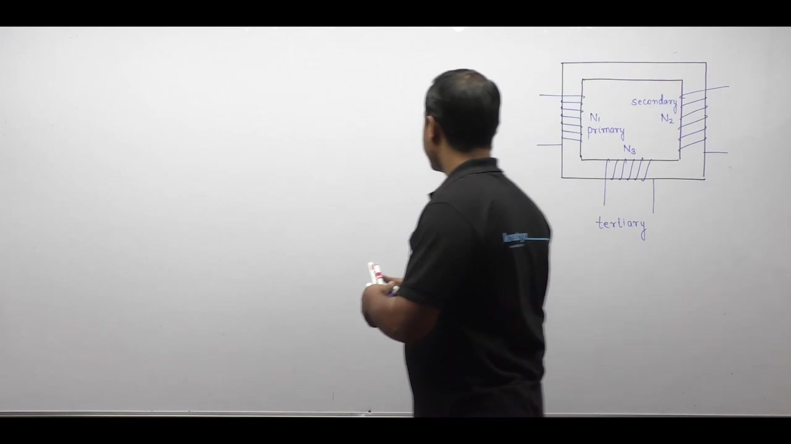

In an ideal three-winding transformer, winding resistances and leakage fluxes are negligible. Because all three windings share the same core, the exact same mutual flux $\Phi(t)$ links every turn.

## Three-Winding Transformer: Voltage per Turn, MMF Balance, and Power
_(26:51 - 31:24)_

### Constant Voltage per Turn

In a three-winding transformer, the same mutual core flux links all three windings. By Faraday's law of electromagnetic induction, the induced voltage in each coil is:

$$e_1 = N_1 \frac{d\Phi}{dt}, \quad e_2 = N_2 \frac{d\Phi}{dt}, \quad e_3 = N_3 \frac{d\Phi}{dt}$$

Dividing each voltage by its turn count shows that voltage per turn is identical:

> [!info] Voltage per Turn Rule
> In any transformer with multiple windings on a common core, the voltage per turn is identical across all windings:
> $$\frac{V_1}{N_1} = \frac{V_2}{N_2} = \frac{V_3}{N_3}$$

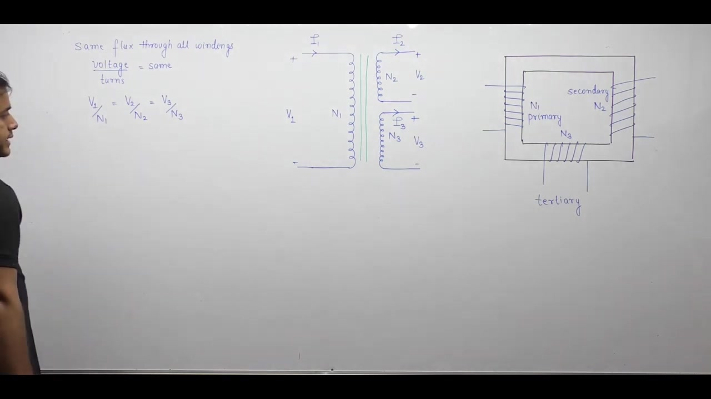

### MMF Balancing Under Constant Flux

A transformer maintains an essentially constant core flux between no-load and full load. The net magnetizing MMF must equal the no-load excitation MMF $N_1 I_0$.

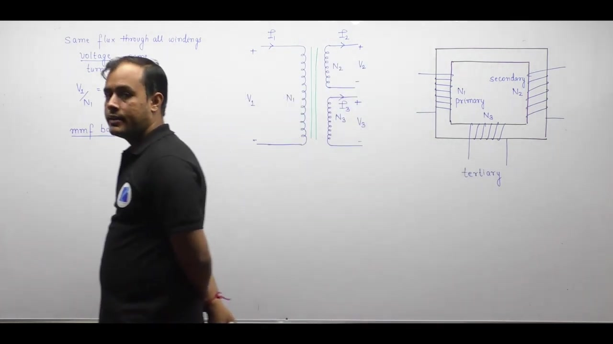

When secondary and tertiary windings carry currents $I_2$ and $I_3$, their demagnetizing ampere-turns oppose the primary. The primary draws additional balancing current from the supply:

$$N_1 I_1 = N_1 I_0 + N_2 I_2 + N_3 I_3$$

Divide this entire equation by $N_1$:

$$I_1 = I_0 + \left(\frac{N_2}{N_1}\right) I_2 + \left(\frac{N_3}{N_1}\right) I_3$$

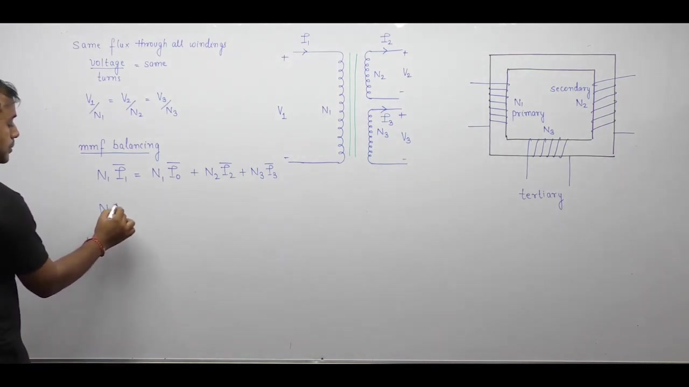

Here $(N_2/N_1) I_2$ is the secondary current referred to the primary. Similarly, $(N_3/N_1) I_3$ is the tertiary current referred to the primary.

Total primary current is the phasor sum of excitation current and both reflected load currents.

### Conservation of Complex Power

Apparent power is calculated using complex conjugates:

$$S = V I^*$$

Take the complex conjugate of the referred current relation:

$$I_1^* = I_0^* + \left(\frac{N_2}{N_1}\right) I_2^* + \left(\frac{N_3}{N_1}\right) I_3^*$$

Now multiply both sides by primary voltage $V_1$:

$$V_1 I_1^* = V_1 I_0^* + \left[ V_1 \left(\frac{N_2}{N_1}\right) \right] I_2^* + \left[ V_1 \left(\frac{N_3}{N_1}\right) \right] I_3^*$$

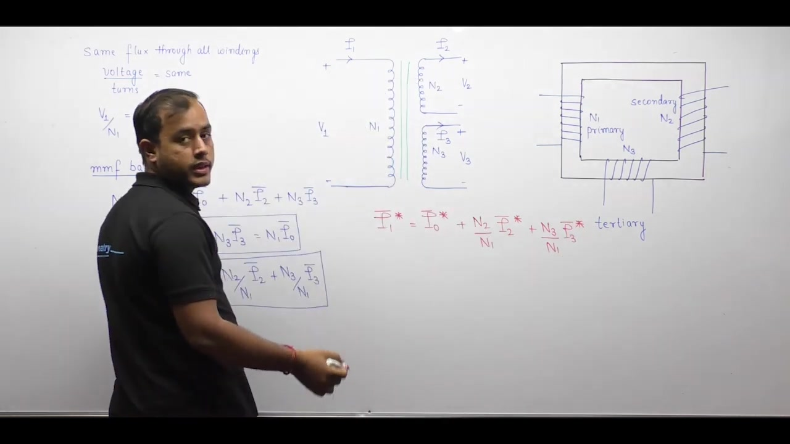

From the voltage ratio, $V_1 (N_2/N_1) = V_2$ and $V_1 (N_3/N_1) = V_3$. Substituting these voltages gives:

$$S_1 = S_0 + S_2 + S_3$$

Total complex apparent power supplied to the primary equals the sum of no-load power and the powers delivered to both loads.

## Tertiary Winding Applications in Power Systems
_(31:26 - 36:09)_

### Core Principles of Three-Winding Transformers

Three governing principles apply to any three-winding transformer on a shared magnetic core:

1. **Constant Voltage per Turn**: $\frac{V_1}{N_1} = \frac{V_2}{N_2} = \frac{V_3}{N_3}$
2. **MMF Balance**: $N_1 I_1 = N_1 I_0 + N_2 I_2 + N_3 I_3$
3. **Power Conservation**: $S_1 = S_0 + S_2 + S_3$

These relationships extend directly from standard two-winding theory.

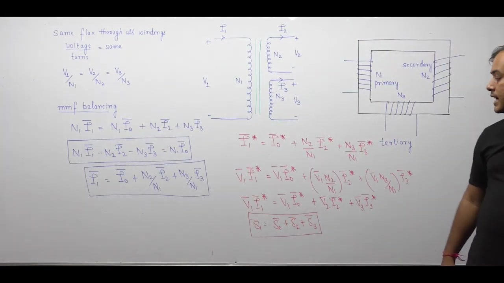

### Engineering Purposes of a Tertiary Winding

Why do power utilities add a tertiary winding? There are four major engineering reasons:

#### 1. Interconnecting Three Voltage Levels

A three-winding transformer interconnects three transmission networks operating at different voltage levels. For example, it couples $400\text{ kV}$, $220\text{ kV}$, and $33\text{ kV}$ systems using a single machine.

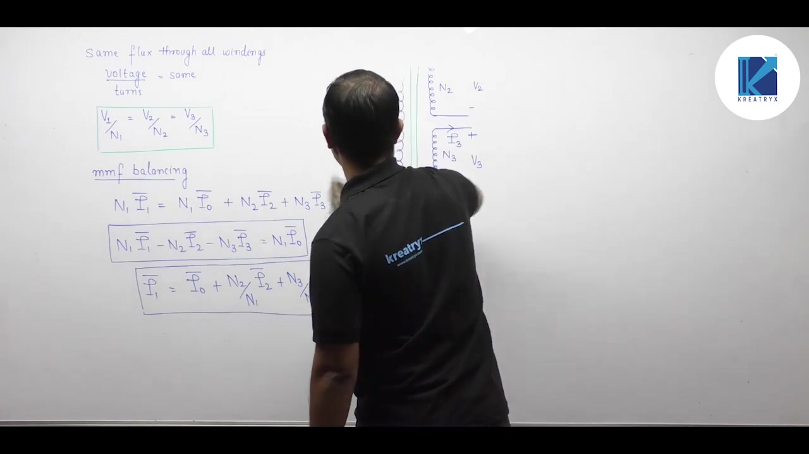

#### 2. Supplying Substation Auxiliary Loads

Power plants and major substations need low-voltage power to run internal equipment. This includes station lighting, ventilation fans, battery chargers, and water pumps.

A tertiary winding steps voltage down to $415\text{ V}$ or $3.3\text{ kV}$ to supply these local auxiliary loads directly from the main transformer.

#### 3. Reactive Power Compensation

Power stations often require reactive power support to maintain transmission voltage and power factor.

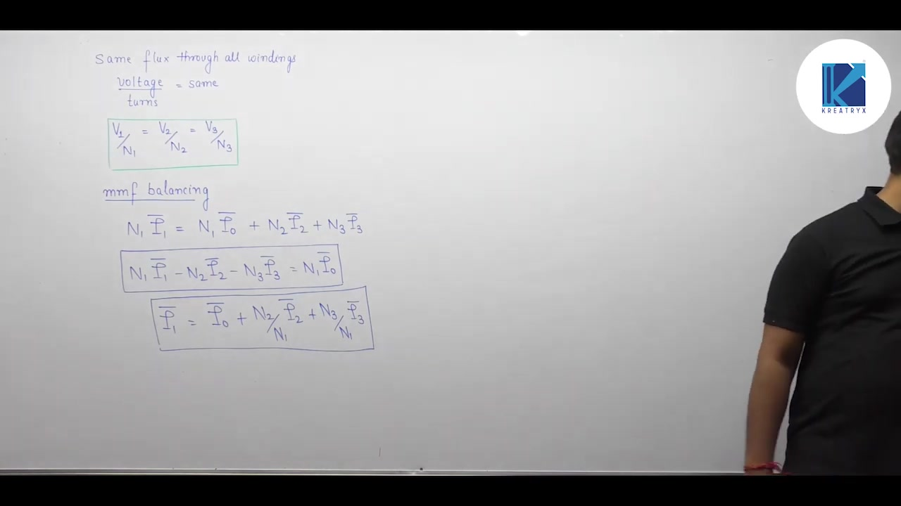

Utilities connect static capacitor banks or synchronous condensers across the tertiary terminals. This compensates reactive power without exposing the capacitors to extra-high transmission voltages.

#### 4. Stabilizing Neutral in Star-Star Transformers

In star-star connected three-phase transformers, third-harmonic magnetizing currents cannot flow through isolated neutral points. This causes the neutral point potential to oscillate violently.

> [!info] Neutral Stabilization
> A delta-connected tertiary winding provides a closed circulating loop for third-harmonic currents. This eliminates the oscillating neutral phenomenon and balances phase voltages.


The closed delta loop traps third-harmonic currents inside the tertiary winding, keeping line voltages purely sinusoidal.

## Secondary Voltage Waveform for Square-Wave Input
_(36:10 - 42:27)_

Consider a transformer excited by a non-sinusoidal voltage source. We want to find the secondary voltage waveform when a square-wave voltage is applied to the primary winding. We analyze two cases: an ideal transformer and a practical transformer.

> [!example] Problem
> A square-wave voltage $v_1(t)$ is applied to the primary winding of a transformer. Determine the waveform of the secondary voltage $v_2(t)$ for:
> 1. An ideal transformer.
> 2. A practical transformer.

### Ideal Transformer Analysis

Consider an ideal two-winding transformer. The primary winding has $N_1$ turns and the secondary winding has $N_2$ turns. An odd symmetric square-wave voltage $v_1(t)$ is connected across the primary terminals.

The primary applied voltage establishes a magnetic flux in the core according to Faraday's law:
$$v_1(t) = N_1 \frac{d\Phi}{dt}$$

Integrating both sides gives the expression for core flux:
$$\Phi(t) = \frac{1}{N_1} \int v_1(t) \, dt$$

The mathematical integral of a square wave is a triangular wave. The core flux therefore alternates as a continuous triangular waveform.

```
       v1(t) (Square Wave)
       +V |+-------+       +-------+
          |       |       |       |
       ---+-------+-------+-------+---> t
          |       |       |       |
       -V |       +-------+       +---
          |
          v
       Phi(t) (Triangular Wave)
          |   /\      /\      /\
          |  /  \    /  \    /  \
       ---+ /----\--/----\--/----\----> t
          |/      \/      \/      \
          |
          v
       v2(t) (Square Wave)
       +V2|+-------+       +-------+
          |       |       |       |
       ---+-------+-------+-------+---> t
          |       |       |       |
       -V2|       +-------+       +---
```

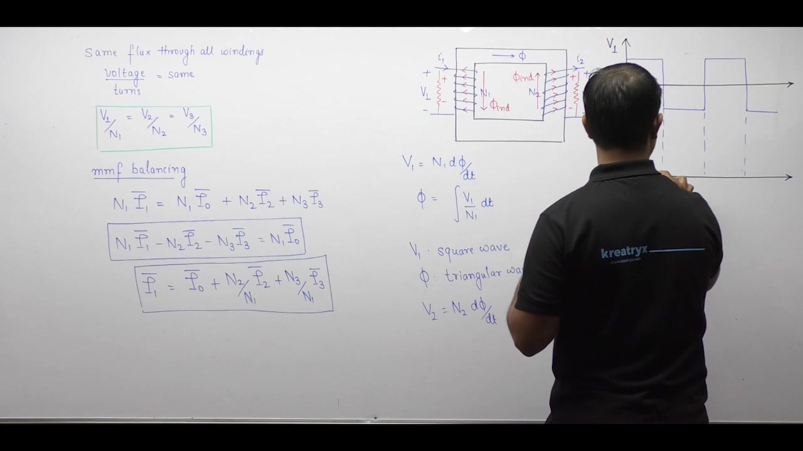

The induced secondary voltage depends on the time rate of change of this core flux:
$$v_2(t) = N_2 \frac{d\Phi}{dt}$$

The derivative $\frac{d\Phi}{dt}$ represents the slope of the flux waveform:
- When the triangular flux is rising, the slope is a positive constant.
- When the triangular flux is falling, the slope is a negative constant.

Multiplying this piecewise constant slope by $N_2$ produces a square wave.

> [!success] Result
> For an ideal transformer, applying a square-wave primary voltage produces a triangular core flux and a square-wave secondary voltage.

### Practical Transformer and Core Saturation

Now consider a practical transformer. Real magnetic cores do not possess infinite permeability. A practical ferromagnetic core has a finite saturation flux limit $\Phi_{\text{sat}}$.

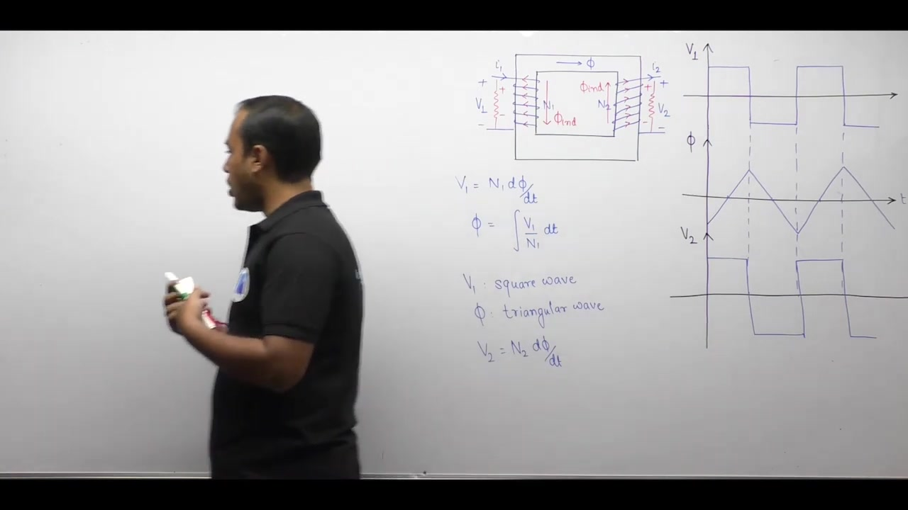

As the triangular flux rises, it reaches the saturation level of the magnetic material. Once saturated, the core cannot accept additional flux. The peak of the triangular flux waveform gets clipped into a flat horizontal plateau:
$$\Phi(t) = \Phi_{\text{sat}} = \text{constant}$$

During this flat interval, the rate of change of flux is zero:
$$\frac{d\Phi}{dt} = 0$$

Between saturation intervals, the flux transitions linearly between its positive and negative limits. During these transition periods, the slope is non-zero:
$$\frac{d\Phi}{dt} = \pm C$$

Because the derivative is zero during saturation and non-zero during transitions, the secondary voltage becomes an alternating train of narrow pulses:
$$v_2(t) = \begin{cases} +V_{\text{peak}}, & \text{flux rising linearly} \\ 0, & \text{core saturated} \\ -V_{\text{peak}}, & \text{flux falling linearly} \end{cases}$$

> [!success] Result
> For a practical transformer with core saturation, a square-wave primary voltage produces an alternating pulse train across the secondary terminals.

## Practical Core Saturation and the Constant-Flux Question
_(42:49 - 48:05)_

In an ideal transformer, applying a square wave creates a triangular core flux. Differentiating this triangular flux gives an ideal square wave at the secondary. Real transformers behave differently because practical cores saturate.

### Pulse Waveform Under Core Saturation

When a square wave voltage $v_1(t)$ is applied, the ideal flux waveform would be purely triangular. In a practical transformer, the core cannot support unbounded flux. Once the flux reaches the saturation level, it clips flat.

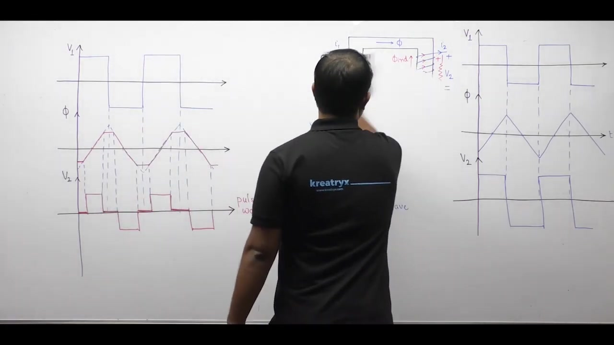

The secondary voltage follows Faraday's law of induction:
$$v_2(t) = N_2 \frac{d\Phi}{dt}$$

We can examine the slope over different regions of the waveform:
1. Flat clipped region: The core is saturated, so $\Phi(t)$ is constant. The derivative $\frac{d\Phi}{dt} = 0$. The secondary voltage is zero.
2. Linear rising region: The core unsaturates. The flux rises with a positive constant slope. The secondary voltage jumps to a positive constant value $+V_{\text{peak}}$.
3. Flat negative clipped region: The core saturates in the reverse direction. The derivative $\frac{d\Phi}{dt} = 0$. The secondary voltage drops back to zero.
4. Linear falling region: The flux decreases with a negative constant slope. The secondary voltage drops to a negative constant value $-V_{\text{peak}}$.

The resulting output is not a square wave. It is a train of alternating positive and negative pulses separated by zero-voltage intervals.

> [!success] Result
> When a square wave is applied to the primary of a practical transformer, the secondary voltage is an alternating pulse waveform.

### Is a Practical Transformer a Constant-Flux Device?

In elementary machine analysis, textbooks often state that a transformer is a constant-flux device. We now test whether this statement holds true for a practical transformer.

> [!example] Problem
> Is a practical transformer strictly a constant-flux device? How does the core flux vary when load current and power factor change?

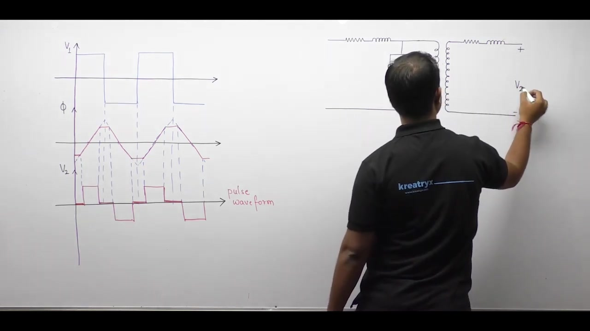

Consider the induced EMF equation for a transformer winding:
$$E = 4.44 f N \Phi_m$$

Rearranging for the peak mutual core flux yields:
$$\Phi_m = \frac{E}{4.44 f N} \propto \frac{E}{f}$$

Core flux is directly proportional to $\frac{E}{f}$, not $\frac{V}{f}$. We often approximate $E$ with the terminal voltage $V_1$. But in a practical transformer, $E_1$ differs from $V_1$ due to the primary leakage impedance.

Apply Kirchhoff's voltage law to the primary equivalent circuit:
$$V_1 = E_1 + I_1 Z_1 = E_1 + I_1(R_1 + j X_1)$$

Solving for the internal induced EMF gives:
$$E_1 = V_1 - I_1(R_1 + j X_1)$$

Because of the internal impedance drop $I_1 Z_1$, the magnitude of $E_1$ depends on the load current and power factor:
- For a lagging power factor, the voltage drop reduces $E_1$. So $E_1 < V_1$, which means core flux decreases with load.
- For a leading power factor, the reactive drop can boost $E_1$. So $E_1 > V_1$, which means core flux increases with load.

Therefore, a practical transformer is only approximately a constant-flux device. Its core flux fluctuates slightly with loading conditions.

## Phasor Analysis of Core Flux Variation
_(48:09 - 52:45)_

We now use phasor diagrams to inspect how core flux varies with load power factor. We analyze the primary circuit equation under both lagging and leading power factors.

### Primary Circuit Equation and Phasor Construction

Apply Kirchhoff's voltage law to the primary winding:
$$E_1 = V_1 - I_1(R_1 + j X_1) = V_1 - I_1 R_1 - j I_1 X_1$$

We take the primary applied voltage $V_1$ as the reference phasor along the horizontal axis. To construct the phasor $E_1$, we subtract the two impedance drops from $V_1$:
1. The term $-I_1 R_1$ is a phasor pointing in the direction opposite to $I_1$.
2. The operator $-j$ represents a clockwise rotation of $90^\circ$. So $-j I_1 X_1$ is rotated $90^\circ$ clockwise from $I_1$.

Connecting the origin to the end of this vector sum gives the induced EMF phasor $E_1$.

```
Lagging Power Factor:                    Leading Power Factor:
       V1                                       V1
  +---------->                             +---------->
  |       /                                |  \     ^
  |      / -I1*R1                          |   \    | -j*I1*X1
  |     v                                  |    \   |
E1|    /                                 E1|     v--+
  |   v -j*I1*X1                           |       -I1*R1
  |                                        |
  +                                        +
  |E1| < |V1|                              |E1| > |V1|
```


### Lagging Power Factor

Consider an inductive load where the primary current $I_1$ lags the applied voltage $V_1$. 

Subtracting $I_1 R_1$ and $j I_1 X_1$ pulls the phasor tip inward toward the origin. The geometric length of $E_1$ becomes strictly smaller than $V_1$:
$$|E_1| < |V_1|$$

Because the mutual core flux is governed by induced EMF:
$$\Phi_m \propto \frac{E_1}{f}$$

When the transformer supplies a lagging load, the reduction in $E_1$ causes a decrease in core flux. As load current increases at a lagging power factor, the core flux progressively drops below its no-load value.

### Leading Power Factor

Now consider a capacitive load where the primary current $I_1$ leads the applied voltage $V_1$.

Subtracting $I_1 R_1$ and $j I_1 X_1$ pushes the phasor tip outward. The geometric length of $E_1$ becomes strictly larger than $V_1$:
$$|E_1| > |V_1|$$

Because $E_1$ rises above the terminal voltage, the core flux increases:
$$\Phi_m \propto \frac{E_1}{f} \implies \Phi_m \uparrow$$

At leading power factor, the core flux increases above its no-load value.

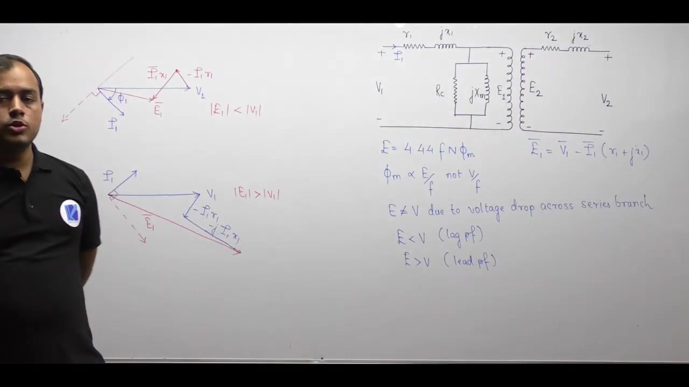

> [!success] Result
> A practical transformer is not strictly a constant-flux device:
> - Under lagging power factor, $|E_1| < |V_1|$ and core flux decreases with load.
> - Under leading power factor, $|E_1| > |V_1|$ and core flux increases with load.

## Effect of Power Factor on Core Losses and Three-Winding Transformer Problem
_(52:45 - 57:41)_

Standard efficiency calculations assume that core loss remains constant with load. In practice, the power factor changes the internal induced EMF and peak flux density. This change alters the core losses.

### Core Loss and Efficiency at Leading Power Factor

Consider a transformer operating at a lagging power factor compared to a leading power factor of the same magnitude.

> [!example] Problem
> A transformer operates with $90\%$ efficiency at $0.8$ power factor lagging. Will the efficiency be greater than, equal to, or less than $90\%$ when operating at the same load current at $0.8$ power factor leading?

In a practical transformer, the mutual core flux depends on the power factor:
- At lagging power factor, the leakage impedance drop lowers the induced EMF $E_1$. The core flux $\Phi_m$ decreases.
- At leading power factor, the leakage impedance drop boosts the induced EMF $E_1$. The core flux $\Phi_m$ increases.

Core losses consist of hysteresis loss and eddy current loss:
$$
\begin{aligned}
P_h &= k_h B_m^2 f \\
P_e &= k_e B_m^2 f^2
\end{aligned}
$$

Here, the Steinmetz exponent is taken as $2$. The total core loss is directly proportional to the square of peak flux density:
$$P_c = P_h + P_e \propto B_m^2 \propto \Phi_m^2$$

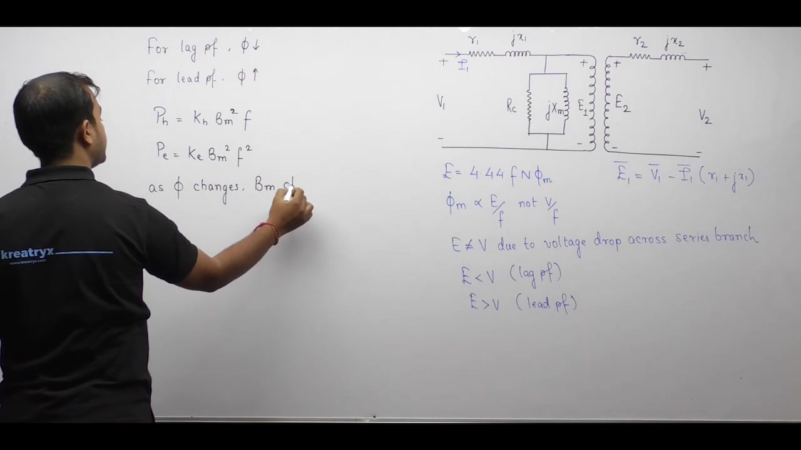

Because $\Phi_m$ is higher at a leading power factor, the core flux density $B_m$ is also higher. This elevated flux density increases the core loss:
$$P_{c,\text{lead}} > P_{c,\text{lag}}$$

Higher core loss increases the total losses in the transformer. As a result, efficiency is lower at leading power factor than at lagging power factor:
$$\eta_{\text{lead}} < 90\%$$

> [!success] Result
> At a leading power factor, higher core flux increases iron losses. The operating efficiency is therefore lower than at the corresponding lagging power factor.

### Introduction to Three-Winding Transformer Problem

We now examine a multi-winding transformer problem.

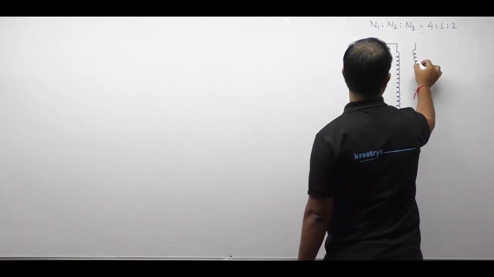

> [!example] Problem
> A three-winding impedance matching transformer has turns ratio $N_1 : N_2 : N_3 = 4 : 1 : 2$. A supply voltage $V_1 = 16\text{ V}$ is applied to the primary winding. Two resistive loads of $R_2 = 30\,\Omega$ and $R_3 = 15\,\Omega$ are connected across the secondary and tertiary windings.
> 
> Determine:
> 1. The total power $P_1$ drawn from the supply.
> 2. The primary supply current $I_1$ at unity power factor.

## Three-Winding Transformer Problem: Three Solution Methods
_(57:46 - 63:34)_

We now solve the three-winding transformer problem introduced in the previous section. We have a primary winding with $N_1$ turns excited by $V_1 = 16\text{ V}$. Two resistive loads, $R_2 = 30\,\Omega$ and $R_3 = 15\,\Omega$, are connected across windings 2 and 3. The turns ratio is $N_1 : N_2 : N_3 = 4 : 1 : 2$.

### Winding Voltage Calculations

First, determine the voltages across the secondary and tertiary windings using the turns ratios:
$$
\begin{aligned}
V_2 &= \left(\frac{N_2}{N_1}\right) V_1 = \frac{1}{4} \times 16 = 4\text{ V} \\
V_3 &= \left(\frac{N_3}{N_1}\right) V_1 = \frac{2}{4} \times 16 = 8\text{ V}
\end{aligned}
$$

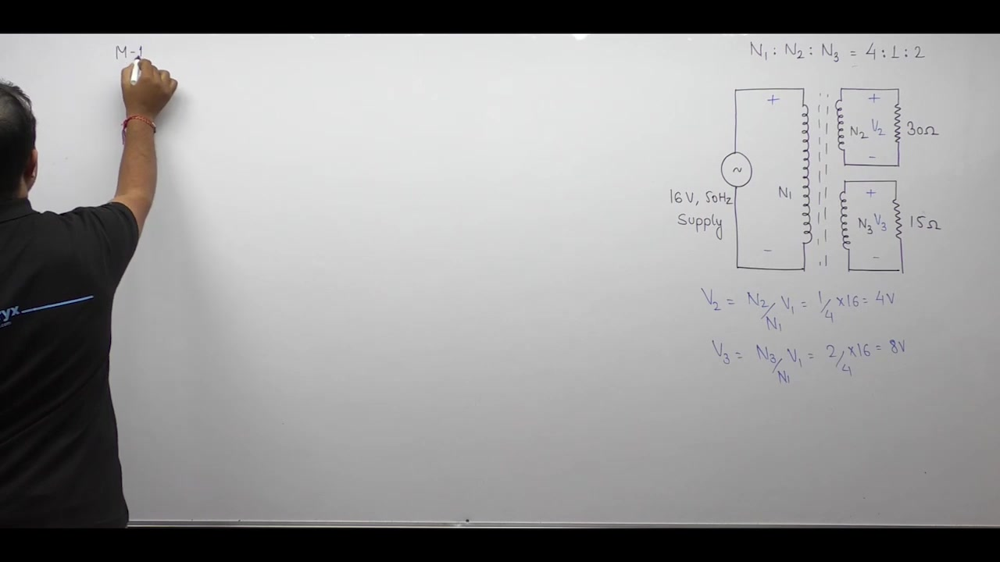

### Method 1: Power Conservation

Because no internal losses are specified, total input power equals total output power:
$$P_1 = P_2 + P_3$$

Compute the power dissipated in each resistive load:
$$
\begin{aligned}
P_2 &= \frac{V_2^2}{R_2} = \frac{4^2}{30} = \frac{16}{30} \approx 0.533\text{ W} \\
P_3 &= \frac{V_3^2}{R_3} = \frac{8^2}{15} = \frac{64}{15} = \frac{128}{30} \approx 4.267\text{ W}
\end{aligned}
$$

Sum the load powers to find the primary input power:
$$P_1 = \frac{16}{30} + \frac{128}{30} = \frac{144}{30} = 4.8\text{ W}$$

The supply operates at unity power factor ($\cos\phi = 1$). Relate power to current:
$$P_1 = V_1 I_1 \cos\phi$$

Substitute the known values to find the supply current:
$$4.8 = 16 \times I_1 \times 1 \implies I_1 = \frac{4.8}{16} = 0.3\text{ A}$$

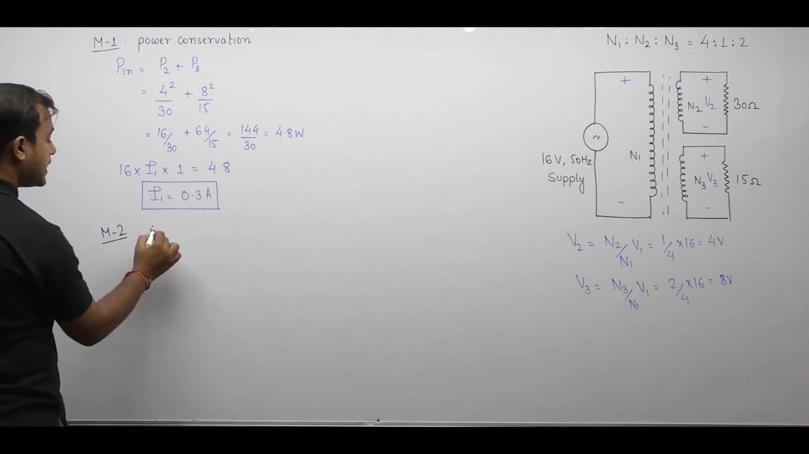

### Method 2: Impedance Referral

Alternatively, refer both secondary and tertiary load resistances back to the primary winding. The referral rule scales resistance by the square of the turns ratio:
$$
\begin{aligned}
R_2' &= R_2 \left(\frac{N_1}{N_2}\right)^2 = 30 \times \left(\frac{4}{1}\right)^2 = 30 \times 16 = 480\,\Omega \\
R_3' &= R_3 \left(\frac{N_1}{N_3}\right)^2 = 15 \times \left(\frac{4}{2}\right)^2 = 15 \times 4 = 60\,\Omega
\end{aligned}
$$

Both referred resistors appear in parallel across the primary supply voltage $V_1 = 16\text{ V}$.

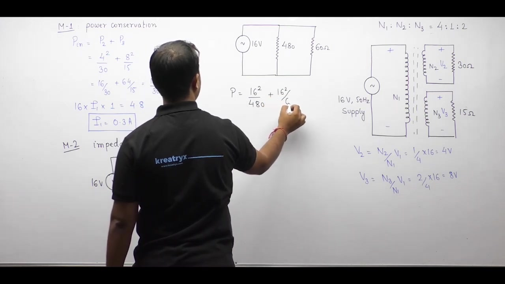

Compute the total power consumed by the parallel branches:
$$P_1 = \frac{V_1^2}{R_2'} + \frac{V_1^2}{R_3'} = \frac{16^2}{480} + \frac{16^2}{60} = \frac{256}{480} + \frac{256}{60} = 0.533 + 4.267 = 4.8\text{ W}$$

Calculate the equivalent parallel resistance:
$$R_{\text{eq}} = \frac{R_2' R_3'}{R_2' + R_3'} = \frac{480 \times 60}{480 + 60} = \frac{28800}{540} = 53.33\,\Omega$$

The primary current is:
$$I_1 = \frac{V_1}{R_{\text{eq}}} = \frac{16}{53.33} = 0.3\text{ A}$$

### Method 3: MMF Balancing

A third method balances ampere-turns across the core. First, determine the currents in windings 2 and 3:
$$
\begin{aligned}
I_2 &= \frac{V_2}{R_2} = \frac{4}{30}\text{ A} \\
I_3 &= \frac{V_3}{R_3} = \frac{8}{15}\text{ A}
\end{aligned}
$$

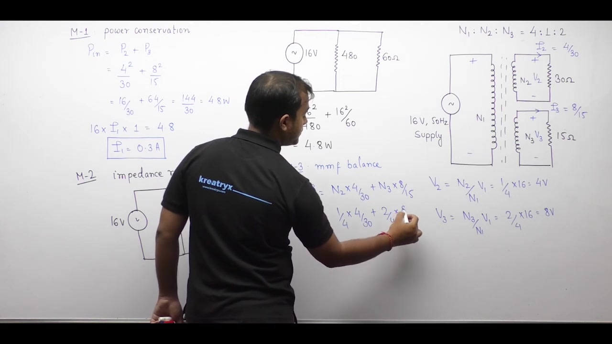

Neglecting the small no-load excitation current ($I_0 \approx 0$), the primary MMF balances the secondary and tertiary MMFs:
$$N_1 I_1 = N_2 I_2 + N_3 I_3$$

Divide both sides by $N_1$:
$$I_1 = \left(\frac{N_2}{N_1}\right) I_2 + \left(\frac{N_3}{N_1}\right) I_3$$

Substitute the numerical values:
$$I_1 = \left(\frac{1}{4}\right)\left(\frac{4}{30}\right) + \left(\frac{2}{4}\right)\left(\frac{8}{15}\right) = \frac{1}{30} + \frac{4}{15} = \frac{1}{30} + \frac{8}{30} = \frac{9}{30} = 0.3\text{ A}$$

> [!success] Result
> All three methods yield identical results:
> $$P_1 = 4.8\text{ W}, \quad I_1 = 0.3\text{ A}$$
> Power conservation is the simplest and fastest method to solve multi-winding loading problems.


---

## Summary and Key Takeaways

- Power transformers operate near the saturation knee point and achieve maximum commercial efficiency at full load, while distribution transformers operate in the linear magnetic region and maximize all-day energy efficiency at $50\% - 70\%$ load.
- Higher per-unit leakage reactance in power transformers ($X_{\text{pu}} \approx 0.10\text{ pu}$) limits short-circuit fault currents, whereas distribution transformers use low reactance ($X_{\text{pu}} \approx 0.01\text{ pu}$) to minimize voltage regulation drops.
- Three-winding transformers on a common core satisfy constant volts per turn $\frac{V_1}{N_1} = \frac{V_2}{N_2} = \frac{V_3}{N_3}$, MMF balance $N_1 I_1 = N_1 I_0 + N_2 I_2 + N_3 I_3$, and complex power conservation $S_1 = S_0 + S_2 + S_3$.
- A delta-connected tertiary winding provides a closed circulating path for third-harmonic zero-sequence currents, which prevents neutral point oscillation in star-star systems.
- Exciting an ideal transformer with a square-wave voltage produces a triangular core flux and a square-wave secondary voltage, whereas core saturation in a practical transformer produces an alternating pulse train.
- A practical transformer is not strictly a constant-flux device because internal leakage impedance causes $|E_1| < |V_1|$ at lagging power factor and $|E_1| > |V_1|$ at leading power factor.
- Operating at a leading power factor increases internal core flux density, which raises iron losses $P_c \propto B_m^2$ and yields lower efficiency than operating at the same numerical lagging power factor.
- Multi-winding transformer circuits can be solved via power conservation, primary impedance referral, or ampere-turn balance, with power conservation providing the fastest calculation.

