# Transformer and Magnetically Coupled Circuits | L 10 | Electrical Machines | GATE 2022 | #AnkitGoyal

- **Source**: https://www.youtube.com/watch?v=traXYvejLxE
- **Duration**: 00:51:00
- **Compiled**: 2026-09-20

---

## Overview

This lecture connects magnetic circuit concepts with transformer equivalent circuit models. It begins by examining transformer ratings and parameter referrals for coupled inductors. The discussion develops equivalent T-network and $\pi$-network representations for coupled coils. It also analyzes dimensional scaling rules for transformer ratings and losses. Finally, worked numerical problems show how to determine inductances, impedance matching, and terminal voltage under load.

## Contents

- [[#Transformer Rating and Magnetically Coupled Circuit Referral|Transformer Rating and Magnetically Coupled Circuit Referral]]
- [[#Numerical Evaluation of Inductances and Winding Self-Impedances|Numerical Evaluation of Inductances and Winding Self-Impedances]]
- [[#Equivalent Circuit Parameters Referred to Primary and Secondary|Equivalent Circuit Parameters Referred to Primary and Secondary]]
- [[#Secondary Terminal Voltage Calculation and Equipment Rating Concept|Secondary Terminal Voltage Calculation and Equipment Rating Concept]]
- [[#Impedance Matching and High-Frequency Equivalent Parameters|Impedance Matching and High-Frequency Equivalent Parameters]]
- [[#High-Frequency Load Voltage and Dimensional Scaling Problem|High-Frequency Load Voltage and Dimensional Scaling Problem]]
- [[#Dimensional Scaling Solution and Dot Convention in Coupled Coils|Dimensional Scaling Solution and Dot Convention in Coupled Coils]]
- [[#T-Equivalent and Pi-Equivalent Inductive Circuits|T-Equivalent and Pi-Equivalent Inductive Circuits]]
- [[#Coupled Coils in Parallel and Two-Port Inductance Measurement|Coupled Coils in Parallel and Two-Port Inductance Measurement]]
- [[#Coupled Circuit Inductance and Machine Scaling Laws|Coupled Circuit Inductance and Machine Scaling Laws]]

---

## Transformer Rating and Magnetically Coupled Circuit Referral
_(00:13 - 05:26)_

We begin this problem session by exploring transformer ratings and the representation of transformers as magnetically coupled circuits.

### Transformer Rating Versus Operating Load

Students often ask whether changing the load changes the transformer rating. A transformer rating represents its maximum continuous capability. It defines the maximum apparent power and current the unit can safely deliver without overheating.

> [!info] Definition
> The rating of a transformer is the maximum load it is designed to supply. Operating at partial load changes the operating point, but the rated capacity remains fixed.

Consider an everyday analogy. A car may have a top speed of $100\text{ km/h}$. If you drive at $50\text{ km/h}$, its capability is still $100\text{ km/h}$. The same logic applies to electrical equipment. Supplying a half-load does not alter the nameplate kVA rating.

### Representing Transformers as Coupled Inductors

In network theory, we model a two-winding transformer using self-inductances $L_1$ and $L_2$ and mutual inductance $M$. In electrical machines, we represent the transformer using leakage inductances and a magnetizing inductance.

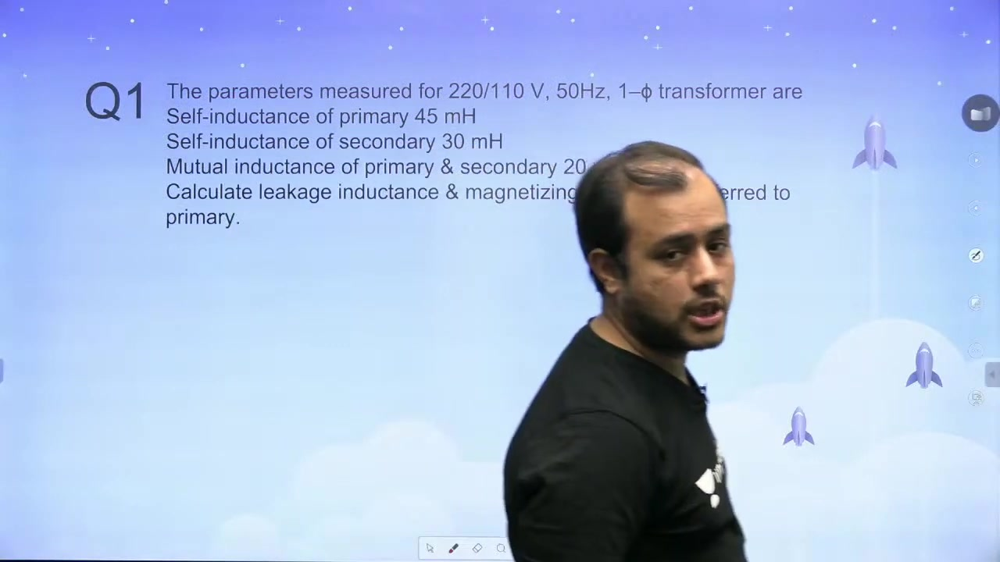

Leakage inductance represents flux that links only one winding. Magnetizing inductance represents mutual flux linking both windings. In a physical coil, total self-inductance equals leakage inductance plus mutual inductance:
$$L_{\text{self}} = L_{\text{leakage}} + L_{\text{mutual}}$$

Therefore, leakage inductance is the difference between self-inductance and mutual inductance:
$$L_{\text{leakage}} = L_{\text{self}} - L_{\text{mutual}}$$

### Parameter Referral Rules

To construct an equivalent circuit, all parameters must be referred to a common winding side. Let $a = \frac{N_1}{N_2}$ denote the primary-to-secondary turns ratio.

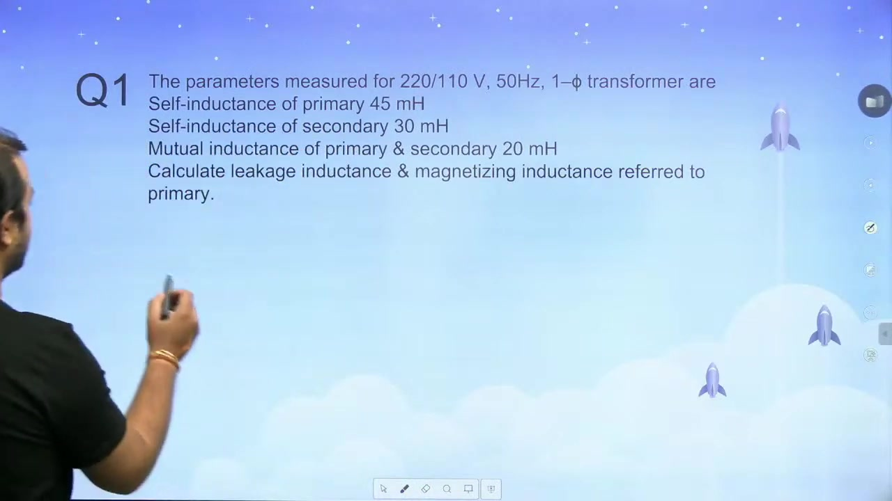

When referring inductances to the primary side, two distinct rules apply:
1. Self-inductance scales by the square of the turns ratio:
$$L_2' = a^2 L_2$$
2. Mutual inductance scales by the first power of the turns ratio:
$$M' = a M$$

Using these referral rules, we express the primary equivalent circuit parameters:

The primary leakage inductance is already on the primary side. We subtract the referred mutual term:
$$L_{l1} = L_1 - a M$$

The secondary leakage inductance referred to the primary requires referring both self and mutual inductances:
$$L_{l2}' = a^2 L_2 - a M$$

The magnetizing inductance referred to the primary is simply the referred mutual inductance:
$$L_m = a M$$

> [!success] Result
> When referring coupled circuit inductances to the primary side with turns ratio $a = \frac{N_1}{N_2}$:
> 1. Primary leakage inductance: $L_{l1} = L_1 - a M$
> 2. Secondary leakage inductance referred to primary: $L_{l2}' = a^2 L_2 - a M$
> 3. Magnetizing inductance referred to primary: $L_m = a M$

## Numerical Evaluation of Inductances and Winding Self-Impedances
_(05:26 - 10:07)_

We now complete the numerical calculations for the coupled inductor model. We then compute the self-impedances of a practical single-phase distribution transformer.

### Worked Example: Leakage and Magnetizing Inductances

We apply the referral relations derived previously to numerical data.

> [!example] Problem
> A single-phase transformer has $L_1 = 45\text{ mH}$, $L_2 = 30\text{ mH}$, and $M = 20\text{ mH}$. The voltage rating is $220 / 110\text{ V}$.
> 
> Find:
> 1. The primary leakage inductance.
> 2. The secondary leakage inductance referred to the primary.
> 3. The magnetizing inductance referred to the primary.

First, determine the turns ratio from the voltage rating:
$$a = \frac{N_1}{N_2} = \frac{220}{110} = 2$$

Compute the primary leakage inductance:
$$L_{l1} = L_1 - a M = 45 - 2 \times 20 = 5\text{ mH}$$

Next, refer the secondary self-inductance and compute the referred secondary leakage:
$$L_{l2}' = a^2 L_2 - a M = 2^2 \times 30 - 2 \times 20 = 120 - 40 = 80\text{ mH}$$

Finally, find the magnetizing inductance:
$$L_m = a M = 2 \times 20 = 40\text{ mH}$$

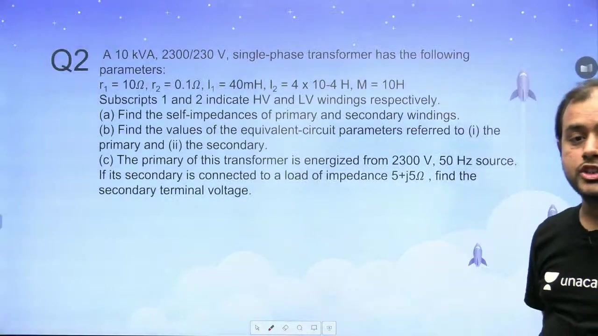

> [!success] Result
> The referred inductance values are:
> 1. Primary leakage inductance: $L_{l1} = 5\text{ mH}$
> 2. Referred secondary leakage inductance: $L_{l2}' = 80\text{ mH}$
> 3. Referred magnetizing inductance: $L_m = 40\text{ mH}$

### Winding Self-Impedance Calculation

We now consider a distribution transformer problem and determine its winding self-impedances.

> [!example] Problem
> A $10\text{ kVA}$, $2300 / 230\text{ V}$, $50\text{ Hz}$ single-phase transformer has the following parameters:
> 1. Resistances: $R_1 = 10\,\Omega$ and $R_2 = 0.1\,\Omega$
> 2. Inductances: $L_1 = 40\text{ mH}$ and $L_2 = 0.4\text{ mH}$
> 3. Mutual coupling: $M = 10\text{ H}$
> 
> Subscripts 1 and 2 indicate the high-voltage and low-voltage windings. Find the self-impedance of each winding.

The self-impedance of an inductor coil combines its winding resistance and self-inductive reactance:
$$Z_s = R + j \omega L$$

The angular supply frequency at $50\text{ Hz}$ is:
$$\omega = 2\pi f = 2\pi \times 50 = 100\pi \approx 314.16\text{ rad/s}$$

For the primary high-voltage winding:
$$
\begin{aligned}
Z_{s1} &= R_1 + j \omega L_1 \\
&= 10 + j(100\pi \times 0.04) \\
&= 10 + j 12.566\,\Omega
\end{aligned}
$$

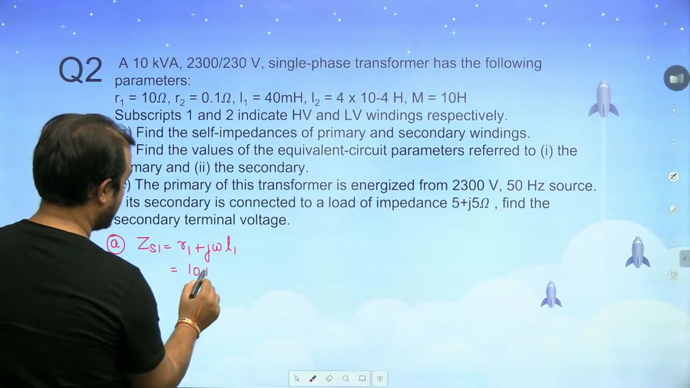

For the secondary low-voltage winding:
$$
\begin{aligned}
Z_{s2} &= R_2 + j \omega L_2 \\
&= 0.1 + j(100\pi \times 0.4 \times 10^{-3}) \\
&= 0.1 + j 0.1256\,\Omega
\end{aligned}
$$

> [!success] Result
> The winding self-impedances are:
> 1. Primary winding: $Z_{s1} = 10 + j 12.566\,\Omega$
> 2. Secondary winding: $Z_{s2} = 0.1 + j 0.1256\,\Omega$

## Equivalent Circuit Parameters Referred to Primary and Secondary
_(10:14 - 15:10)_

We now determine the equivalent circuit parameters of the $10\text{ kVA}$, $2300 / 230\text{ V}$ transformer. We compute values referred to both primary and secondary sides.

### Data Consistency and Parameter Identification

In the given problem, $L_1 = 40\text{ mH}$, $L_2 = 0.4\text{ mH}$, and $M = 10\text{ H}$.

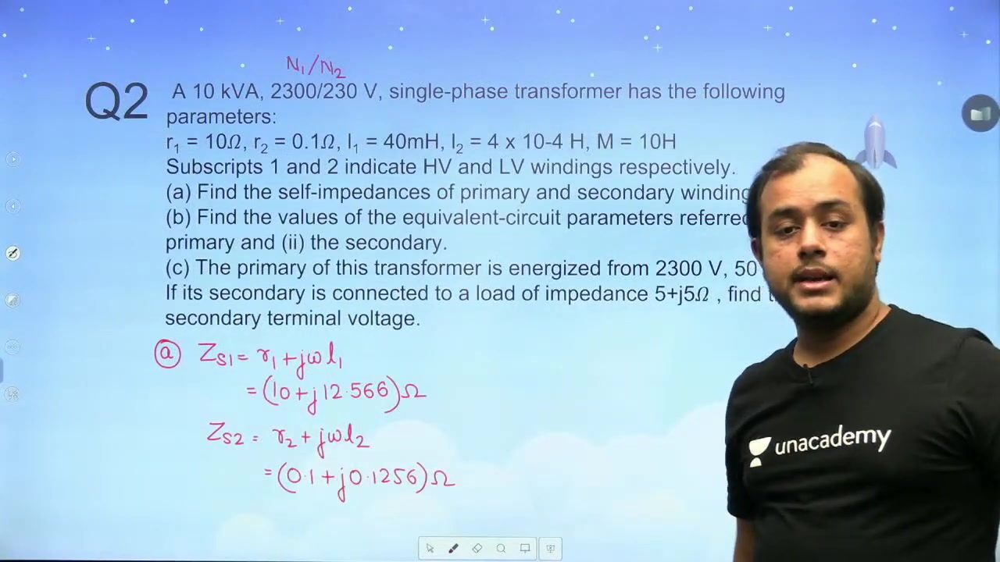

If $L_1$ and $L_2$ were total self-inductances, subtracting $M$ would give negative leakage inductances. Therefore, we recognize that $L_1$ and $L_2$ represent the winding leakage inductances:
$$L_{l1} = 40\text{ mH}, \quad L_{l2} = 0.4\text{ mH}$$

The parameter $M$ represents the mutual magnetizing inductance. The turns ratio from high-voltage to low-voltage winding is:
$$a = \frac{N_1}{N_2} = \frac{2300}{230} = 10$$

### Parameters Referred to the Primary Side

We first refer all circuit components to the high-voltage primary winding.

The equivalent resistance referred to the primary is:
$$R_{01} = R_1 + a^2 R_2 = 10 + 10^2 \times 0.1 = 10 + 10 = 20\,\Omega$$

The primary winding leakage reactance is:
$$X_{l1} = \omega L_{l1} = 100\pi \times 0.04 = 12.566\,\Omega$$

The secondary leakage reactance referred to the primary is:
$$X_{l2}' = a^2 (\omega L_{l2}) = 100 \times (100\pi \times 0.4 \times 10^{-3}) = 12.566\,\Omega$$

Summing both reactances gives the total equivalent leakage reactance:
$$X_{01} = X_{l1} + X_{l2}' = 12.566 + 12.566 = 25.132\,\Omega$$

The magnetizing branch reactance referred to the primary is:
$$X_m = \omega M = 100\pi \times 10 = 3141.59\,\Omega$$

### Parameters Referred to the Secondary Side

We now refer all circuit components to the low-voltage secondary winding.

The equivalent resistance referred to the secondary is:
$$R_{02} = R_2 + \frac{R_1}{a^2} = 0.1 + \frac{10}{100} = 0.2\,\Omega$$

The primary leakage reactance referred to the secondary scales by $\frac{1}{a^2}$:
$$X_{l1}' = \frac{X_{l1}}{a^2} = \frac{12.566}{100} = 0.12566\,\Omega$$

The total equivalent leakage reactance referred to the secondary is:
$$X_{02} = X_{l1}' + X_{l2} = 0.12566 + 0.12566 = 0.25132\,\Omega$$

The magnetizing inductance referred to the secondary scales linearly:
$$L_{m2} = M \left(\frac{N_2}{N_1}\right) = 10 \times 0.1 = 1\text{ H}$$

> [!success] Result
> The equivalent circuit parameters are:
> 1. Primary side: $R_{01} = 20\,\Omega$ and $X_{01} = 25.132\,\Omega$
> 2. Secondary side: $R_{02} = 0.2\,\Omega$ and $X_{02} = 0.25132\,\Omega$
> 3. Magnetizing inductance: $L_{m1} = 10\text{ H}$ and $L_{m2} = 1\text{ H}$

## Secondary Terminal Voltage Calculation and Equipment Rating Concept
_(15:22 - 20:32)_

We now calculate the secondary terminal voltage of the $10\text{ kVA}$ transformer under loaded conditions. We also revisit the conceptual difference between equipment rating and operating load.

### Secondary Terminal Voltage Under Load

Consider the third part of the transformer problem.

> [!example] Problem
> The primary winding of the $10\text{ kVA}$, $2300 / 230\text{ V}$ transformer is energized from a $2300\text{ V}$, $50\text{ Hz}$ supply. A load impedance $Z_L = 5 + j5\,\Omega$ is connected across the secondary terminals.
> 
> Find the secondary load terminal voltage $V_L$.

When calculating load terminal voltage, the shunt magnetizing branch draws negligible current compared to full load. We can omit the shunt branch and analyze only the series circuit.

We work in the secondary-referred equivalent circuit. The no-load secondary voltage is:
$$E_2 = \frac{V_1}{a} = \frac{2300}{10} = 230\text{ V}$$

The transformer series impedance referred to the secondary is:
$$Z_{02} = R_{02} + j X_{02} = 0.2 + j 0.25132\,\Omega$$

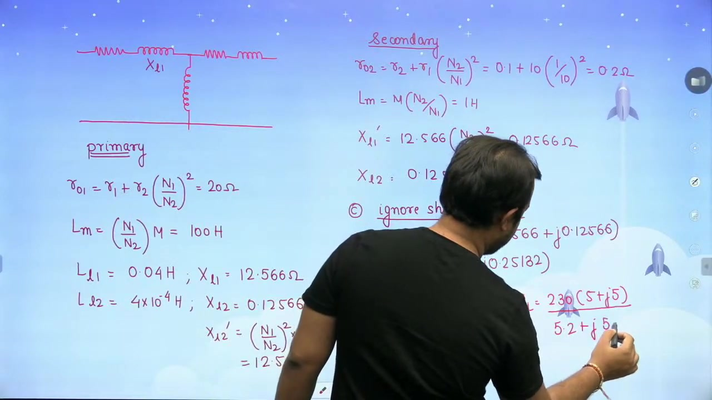

The load impedance is $Z_L = 5 + j 5\,\Omega$. The total circuit impedance is:
$$Z_{\text{total}} = Z_{02} + Z_L = (0.2 + 5) + j(0.25132 + 5) = 5.2 + j 5.25132\,\Omega$$

We apply voltage division to find the load terminal voltage:
$$V_L = E_2 \frac{Z_L}{Z_{02} + Z_L}$$

We calculate the impedance magnitudes:
$$
\begin{aligned}
|Z_L| &= \sqrt{5^2 + 5^2} = \sqrt{50} \approx 7.071\,\Omega \\
|Z_{\text{total}}| &= \sqrt{5.2^2 + 5.25132^2} = \sqrt{27.04 + 27.576} \approx 7.390\,\Omega
\end{aligned}
$$

Substitute these values to obtain the terminal voltage magnitude:
$$|V_L| = 230 \times \frac{7.071}{7.390} = 220.06\text{ V}$$

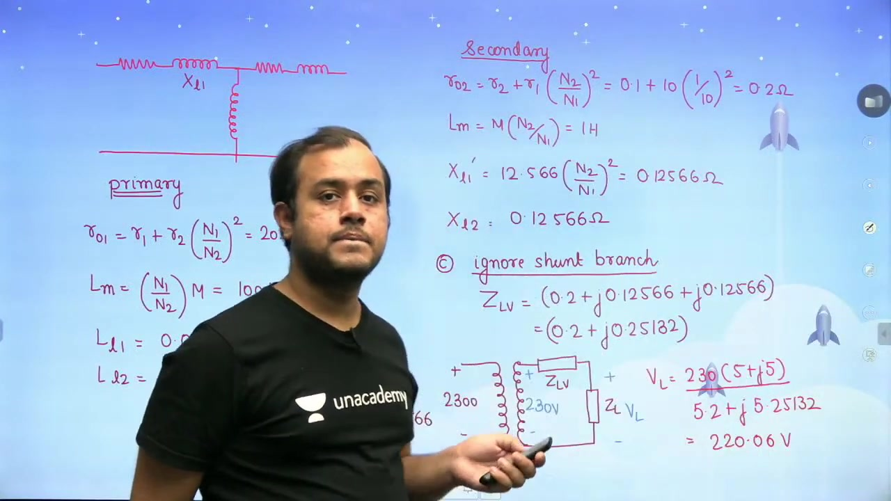

> [!success] Result
> Under a load of $5 + j5\,\Omega$, the secondary terminal voltage is $V_L = 220.06\text{ V}$.

### Rating Versus Operating Load Clarification

Students often confuse actual loading with the rating of the machine. The rating is an intrinsic design specification. It indicates the maximum safe continuous power that the transformer insulation and cooling systems can support.

When a transformer operates at half load, only the operating current changes. The nameplate rating remains completely unchanged. Operating below capacity does not downgrade the rating of the machine.

## Impedance Matching and High-Frequency Equivalent Parameters
_(20:36 - 25:10)_

Transformers often serve as impedance-matching devices in communication and audio circuits. We now calculate the optimal turns ratio and high-frequency circuit parameters for a matched load.

### Turns Ratio for Maximum Power Transfer

We examine the first part of the problem.

> [!example] Problem
> A transformer couples a load resistance $R_L = 50\,\Omega$ to a $4\text{ V}$ voltage source with internal resistance $R_s = 2000\,\Omega$.
> 
> Find the turns ratio $a = \frac{N_1}{N_2}$ that delivers maximum power to the load.

By the maximum power transfer theorem, the load resistance referred to the primary must match the internal source resistance:
$$R_L' = R_s = 2000\,\Omega$$

Let $a = \frac{N_1}{N_2}$ be the turns ratio. The referred load resistance scales with $a^2$:
$$R_L' = a^2 R_L$$

Equating the two expressions gives:
$$50 a^2 = 2000$$

Solve for the turns ratio:
$$a^2 = \frac{2000}{50} = 40 \implies a = \sqrt{40} \approx 6.325$$

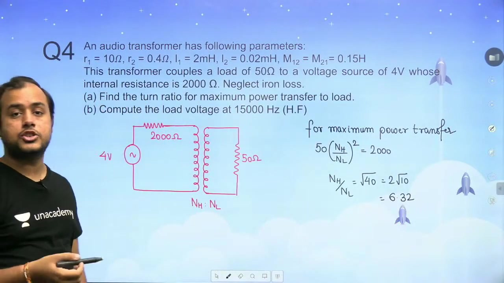

> [!success] Result
> The required turns ratio for maximum power transfer is $a = \frac{N_1}{N_2} = \sqrt{40}$.

### High-Frequency Equivalent Circuit Parameters

We now determine the equivalent circuit parameters when operating at an elevated frequency of $15\text{ kHz}$.

> [!example] Problem
> The transformer has the following winding parameters:
> 1. Primary winding: $R_1 = 10\,\Omega$ and $L_1 = 2\text{ mH}$
> 2. Secondary winding: $R_2 = 0.4\,\Omega$ and $L_2 = 0.02\text{ mH}$
> 
> Determine the total equivalent resistance $R_{01}$ and leakage reactance $X_{01}$ referred to the primary at $f = 15,000\text{ Hz}$.

We refer all parameters to the high-voltage primary winding using $a^2 = 40$.

Compute the total primary-referred resistance:
$$R_{01} = R_1 + a^2 R_2 = 10 + 0.4 \times 40 = 10 + 16 = 26\,\Omega$$

Next, refer the secondary leakage inductance to the primary:
$$L_2' = a^2 L_2 = 0.02 \times 40 = 0.8\text{ mH}$$

Sum the inductances to obtain total primary leakage inductance:
$$L_{01} = L_1 + L_2' = 2\text{ mH} + 0.8\text{ mH} = 2.8\text{ mH} = 0.0028\text{ H}$$

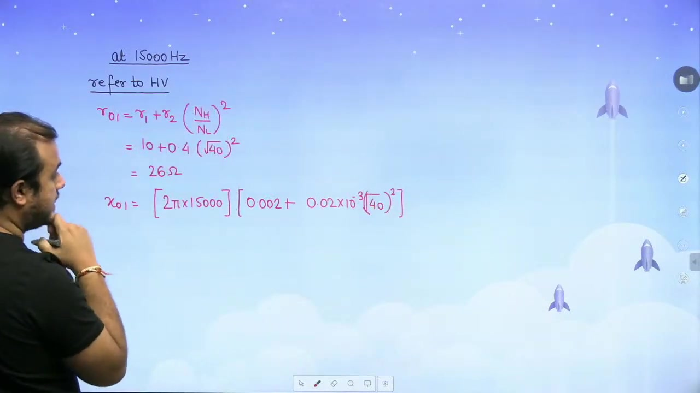

The angular operating frequency at $15\text{ kHz}$ is:
$$\omega = 2\pi f = 2\pi \times 15000 = 30000\pi \approx 94247.78\text{ rad/s}$$

Compute the total equivalent leakage reactance:
$$X_{01} = \omega L_{01} = 2\pi \times 15000 \times 0.0028 = 263.893\,\Omega$$

> [!success] Result
> At $15\text{ kHz}$, the primary-referred equivalent parameters are:
> 1. Total resistance: $R_{01} = 26\,\Omega$
> 2. Total leakage inductance: $L_{01} = 2.8\text{ mH}$
> 3. Total leakage reactance: $X_{01} = 263.893\,\Omega$

## High-Frequency Load Voltage and Dimensional Scaling Problem
_(25:14 - 29:50)_

We now complete the high-frequency response calculation for the impedance-matching transformer. We then introduce the problem of dimensional scaling in transformers.

### Load Voltage at High Frequency

We evaluate the magnetizing branch and compute the secondary load voltage at $15\text{ kHz}$.

The magnetizing reactance referred to the primary is:
$$X_m = 2\pi f M' = 2\pi \times 15000 \times (\sqrt{40} M) \approx 89.4\text{ k}\Omega$$

This magnetizing reactance is much larger than the series impedance. We can therefore treat the magnetizing branch as an open circuit.

In the primary-referred circuit, the source voltage is $V_s = 4\text{ V}$ with internal resistance $R_s = 2000\,\Omega$. The transformer series impedance is $Z_{01} = 26 + j 263.893\,\Omega$. The referred load resistance is $R_L' = 2000\,\Omega$.

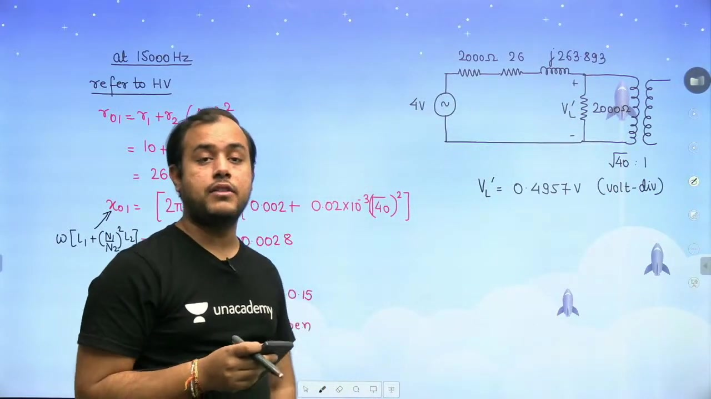

The total circuit impedance is:
$$Z_{\text{total}} = (R_s + R_{01} + R_L') + j X_{01} = (2000 + 26 + 2000) + j 263.893 = 4026 + j 263.893\,\Omega$$

Applying voltage division gives the referred load voltage:
$$V_L' = 0.4957\text{ V}$$

To obtain the actual voltage across the secondary load, divide by the turns ratio:
$$V_L = \frac{V_L'}{\sqrt{40}} = \frac{0.4957}{6.3245} = 0.0782\text{ V}$$

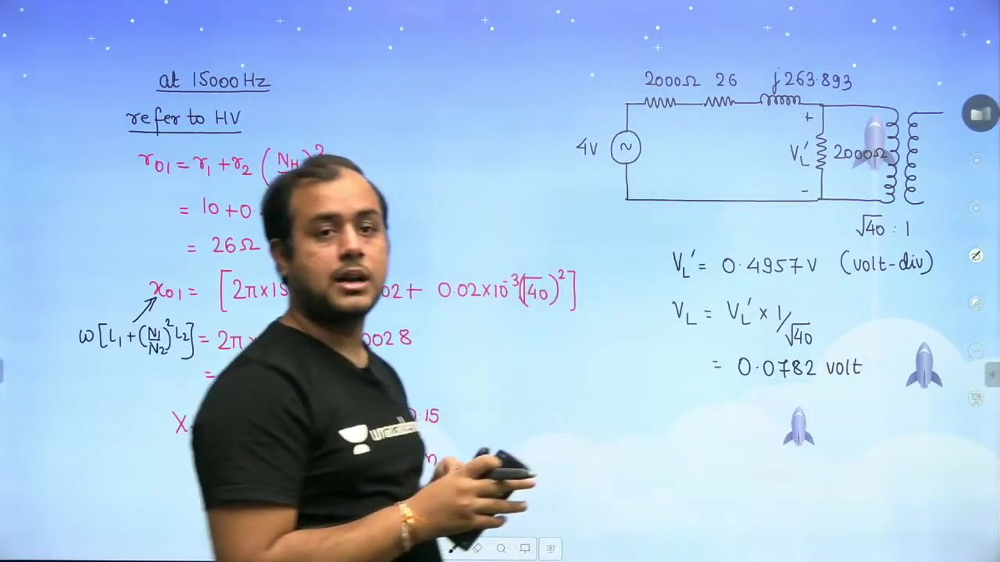

> [!success] Result
> At $15\text{ kHz}$, the voltage appearing across the $50\,\Omega$ load is $V_L = 0.0782\text{ V}$.

### Transformer Dimensional Scaling Problem

We now analyze how physical core dimensions affect transformer performance.

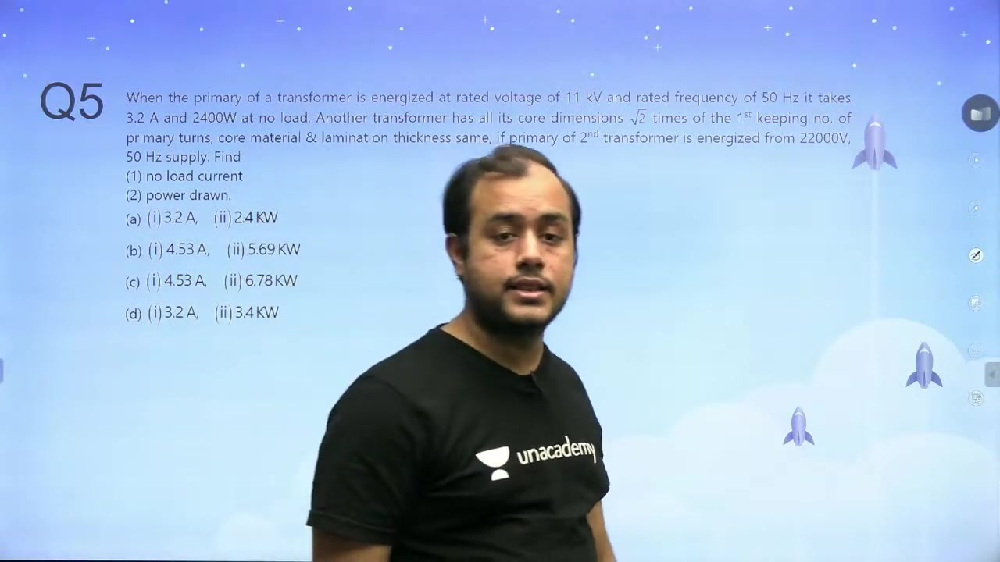

> [!example] Problem
> A transformer is energized at rated voltage $11\text{ kV}$ and rated frequency $50\text{ Hz}$. It draws a no-load current $I_{01} = 3.2\text{ A}$ and absorbs $P_{01} = 2400\text{ W}$ at no load.
> 
> A second transformer has all linear core dimensions scaled by $\sqrt{2}$. The number of primary turns, core material, and lamination thickness remain identical.
> 
> If the second transformer is energized from a $22\text{ kV}$, $50\text{ Hz}$ supply, find:
> 1. The no-load current $I_{02}$.
> 2. The no-load core power loss $P_{02}$.

## Dimensional Scaling Solution and Dot Convention in Coupled Coils
_(29:59 - 34:54)_

We now solve the transformer scaling problem. We then examine the dot convention for series-connected coupled coils.

### Solution to Dimensional Scaling Problem

We analyze how scaling linear dimensions affects core parameters.

Let $d$ represent the linear dimension scale factor. The second transformer has all linear dimensions scaled by $k = \sqrt{2}$:
$$\frac{d_2}{d_1} = \sqrt{2}$$

The core cross-sectional area scales with the square of the linear dimension:
$$\frac{A_2}{A_1} = k^2 = (\sqrt{2})^2 = 2$$

The primary voltage rating is doubled from $11\text{ kV}$ to $22\text{ kV}$. Recall Faraday's induced EMF equation:
$$V \approx 4.44 f N B_m A_c$$

Because frequency $f$ and turn count $N$ remain constant, $V \propto B_m A_c$. Both $V$ and $A_c$ double. Therefore, peak core flux density $B_m$ remains constant.

When $B_m$ is constant, we apply machine scaling rules:
1. Magnetizing MMF equals $H l$. Because $B_m$ is unchanged, magnetic field intensity $H$ is constant. The required MMF scales with mean magnetic path length $l \propto d$.
2. With turns $N$ constant, no-load current scales linearly with dimension:
$$\frac{I_{02}}{I_{01}} = \frac{d_2}{d_1} = \sqrt{2}$$

Compute the second transformer no-load current:
$$I_{02} = \sqrt{2} \times 3.2 = 4.525\text{ A} \approx 4.53\text{ A}$$

Core loss per unit volume remains constant at fixed $B_m$ and frequency. Total core loss scales with core volume:
$$\frac{P_{02}}{P_{01}} = \frac{\text{Volume}_2}{\text{Volume}_1} = k^3 = (\sqrt{2})^3 = 2\sqrt{2}$$

Compute the new core loss:
$$P_{02} = 2\sqrt{2} \times 2400 = 6788.2\text{ W} \approx 6788\text{ W}$$

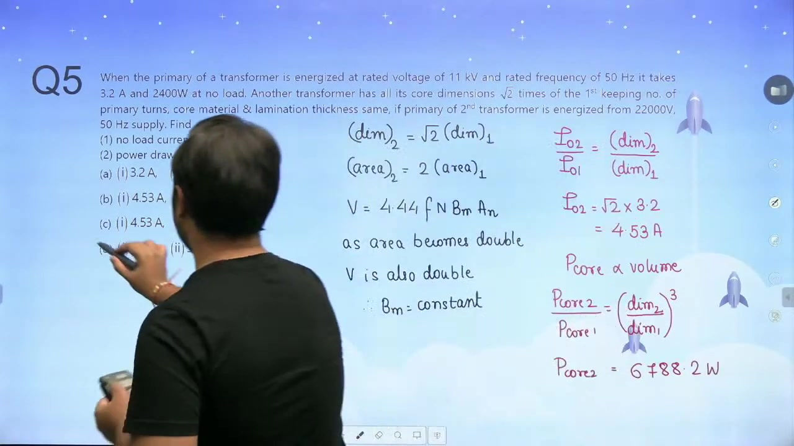

> [!success] Result
> For the scaled transformer:
> 1. No-load current: $I_{02} = 4.53\text{ A}$
> 2. Core power loss: $P_{02} = 6788\text{ W}$

### Dot Convention in Series Coupled Coils

We now review the dot convention for coupled coils connected in series.

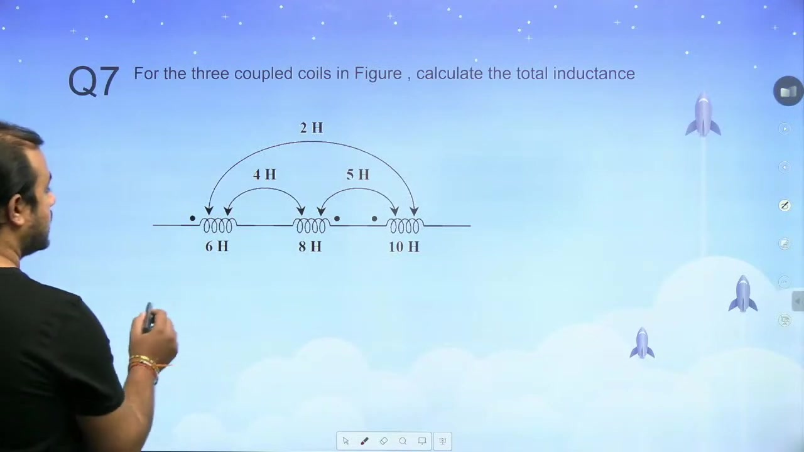

> [!info] Definition
> The dot convention identifies the relative polarity of mutually induced voltages:
> 1. If currents enter both dotted terminals, mutual coupling is additive ($+2M$).
> 2. If current enters one dotted terminal and leaves the other, mutual coupling is subtractive ($-2M$).

For three coupled coils in series with self-inductances $L_1, L_2, L_3$ and mutual terms $M_{12}, M_{23}, M_{13}$:
$$L_{\text{total}} = L_1 + L_2 + L_3 \pm 2 M_{12} \pm 2 M_{23} \pm 2 M_{13}$$

The sign of each mutual term depends on whether the series current enters or leaves the respective dots.

## T-Equivalent and Pi-Equivalent Inductive Circuits
_(34:56 - 39:39)_

We now explore circuit transformations between T-equivalent and $\pi$-equivalent representations for coupled inductors.

### Star to Delta Transformation for Inductors

In circuit analysis, a T-network represents a star connection. A $\pi$-network represents a delta connection.

> [!example] Problem
> A coupled inductor circuit has a T-equivalent model with branch inductances $L_a = 10\text{ mH}$, $L_b = 5\text{ mH}$, and $L_c = 15\text{ mH}$.
> 
> Find the branch inductances $L_1, L_2, L_3$ of the corresponding $\pi$-equivalent circuit.

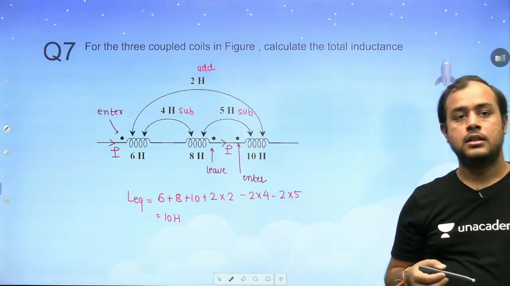

To convert a star network into a delta network, compute the sum of pairwise products:
$$\Sigma = L_a L_b + L_b L_c + L_c L_a$$

Substitute the given branch values:
$$\Sigma = 10 \times 5 + 5 \times 15 + 15 \times 10 = 50 + 75 + 150 = 275$$

Each delta branch inductance equals the common numerator $\Sigma$ divided by the opposite star branch:
$$
\begin{aligned}
L_1 &= \frac{\Sigma}{L_b} = \frac{275}{5} = 55\text{ mH} \\
L_2 &= \frac{\Sigma}{L_c} = \frac{275}{15} \approx 18.33\text{ mH} \\
L_3 &= \frac{\Sigma}{L_a} = \frac{275}{10} = 27.5\text{ mH}
\end{aligned}
$$

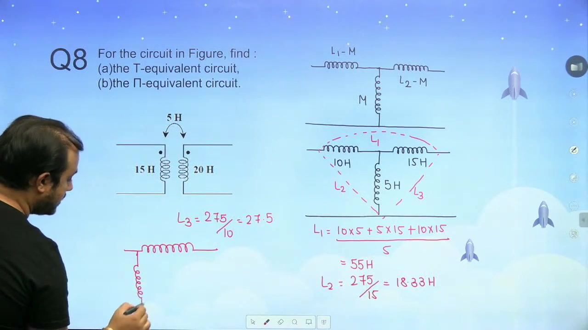

The numerator remains identical for all three branches in a star-to-delta conversion.

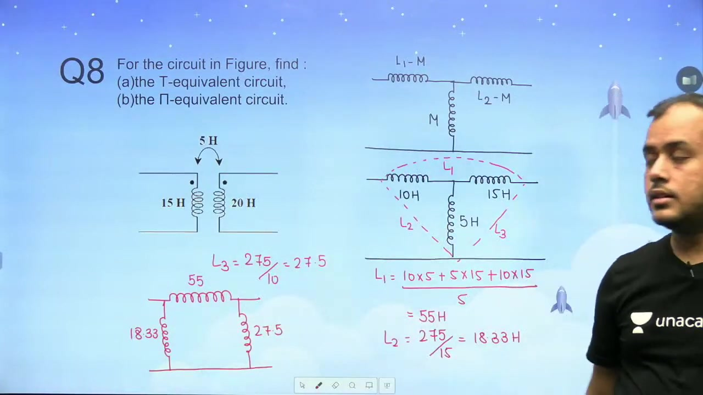

> [!success] Result
> The branch inductances of the $\pi$-equivalent circuit are:
> 1. Branch 1: $L_1 = 55\text{ mH}$
> 2. Branch 2: $L_2 = 18.33\text{ mH}$
> 3. Branch 3: $L_3 = 27.5\text{ mH}$

### Practice Strategy and Speed Development

Solving problems quickly requires consistent practice. In competitive examinations like GATE, students enter with different preparation baselines.

Avoid comparing your initial speed with peers. Focus on your own progress over time. If you solve ten questions in an hour today, aim for fifteen questions next month. Consistent practice develops formula recall and numerical accuracy.

## Coupled Coils in Parallel and Two-Port Inductance Measurement
_(39:39 - 44:34)_

We now analyze series and parallel combinations of coupled coils. We then examine input inductance measurements of a two-port coupled network under open-circuit conditions.

### Series and Parallel Combinations of Coupled Coils

Consider two coupled coils with identical self-inductance.

> [!example] Problem
> Two coupled coils of equal self-inductance are connected in series. The measured net inductance is $20\text{ mH}$ in one connection and $12\text{ mH}$ when one coil is reversed.
> 
> Determine:
> 1. The self-inductance $L$ and mutual inductance $M$.
> 2. The maximum equivalent inductance when the coils are connected in parallel.

The larger series inductance corresponds to additive coupling:
$$L_{\text{series,add}} = 2L + 2M = 20\text{ mH}$$

The smaller series inductance corresponds to subtractive coupling:
$$L_{\text{series,sub}} = 2L - 2M = 12\text{ mH}$$

Add the two equations to solve for $L$:
$$4L = 32 \implies L = 8\text{ mH}$$

Subtract the two equations to solve for $M$:
$$4M = 8 \implies M = 2\text{ mH}$$

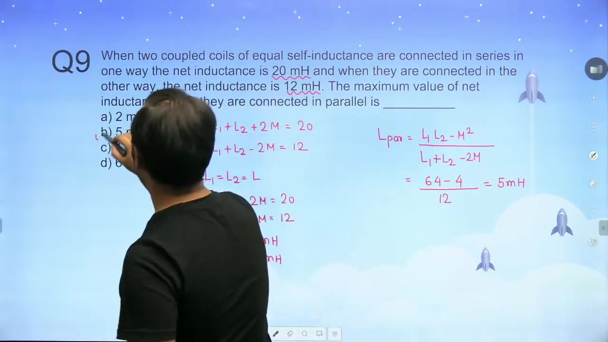

The general expression for two coupled coils in parallel is:
$$L_{\text{parallel}} = \frac{L_1 L_2 - M^2}{L_1 + L_2 \mp 2M}$$

For identical coils, $L_1 = L_2 = L$. To maximize parallel inductance, choose the minus sign in the denominator:
$$L_{\text{parallel,max}} = \frac{L^2 - M^2}{2L - 2M} = \frac{8^2 - 2^2}{16 - 4} = \frac{60}{12} = 5\text{ mH}$$

> [!success] Result
> The coil parameters are $L = 8\text{ mH}$ and $M = 2\text{ mH}$. The maximum parallel inductance is $L_{\text{parallel,max}} = 5\text{ mH}$.

### Two-Port Network Open-Circuit Inductance

We now examine a two-port magnetically coupled network.

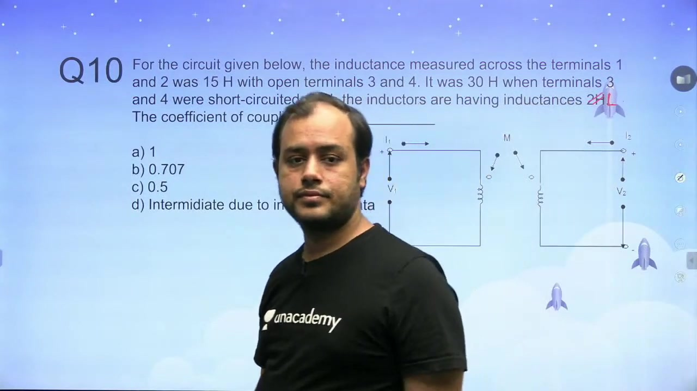

> [!example] Problem
> In a two-port coupled inductor circuit, the inductance measured at terminals 1-2 is $15\text{ H}$ with terminals 3-4 open. When terminals 3-4 are short-circuited, the measured inductance is $30\text{ H}$.
> 
> Find the primary self-inductance $L_1$ and determine if the short-circuit measurement is physically realizable.

Consider the open-circuit condition at terminals 3-4.

Because terminals 3-4 are open, the secondary current is zero ($i_2 = 0$). No mutual EMF is induced in the primary winding:
$$v_1 = L_1 \frac{di_1}{dt} + M \frac{di_2}{dt} = L_1 \frac{di_1}{dt}$$

The equivalent inductance measured at the input terminals equals the primary self-inductance:
$$L_{\text{oc}} = L_1 = 15\text{ H}$$

> [!success] Result
> Under open-circuit secondary conditions, the primary self-inductance is $L_1 = 15\text{ H}$.

## Coupled Circuit Inductance and Machine Scaling Laws
_(44:38 - 50:50)_

### Problem: Short-Circuit Inductance of a Two-Port Network

Consider a two-port magnetically coupled network. We take two inductance measurements across the primary terminals 1-2.

> [!example] Problem
> A two-port coupled circuit has terminals 1-2 as primary and terminals 3-4 as secondary.
> 1. With terminals 3-4 open, measured inductance at terminals 1-2 is $15\text{ H}$.
> 2. With terminals 3-4 shorted, measured inductance at terminals 1-2 is $30\text{ H}$.
> Evaluate whether this measured data is physically possible.

### Derivation of Input Inductance

First, analyze the open-circuit condition. Secondary terminals 3-4 remain open, so secondary current $i_2$ is zero.
The primary terminal voltage equation is:
$$v_1 = L_1 \frac{di_1}{dt} + M \frac{di_2}{dt}$$

Because $i_2 = 0$, its time derivative also vanishes. The primary equation reduces to:
$$v_1 = L_1 \frac{di_1}{dt}$$

Thus the measured open-circuit inductance equals the primary self-inductance:
$$L_{\text{oc}} = L_1 = 15\text{ H}$$

Next, short-circuit the secondary terminals 3-4. The terminal voltage $v_2$ drops to zero.
Assuming currents enter both dotted terminals, the secondary loop voltage equation is:
$$0 = L_2 \frac{di_2}{dt} + M \frac{di_1}{dt}$$

Rearranging this relationship yields the secondary current derivative in terms of primary current:
$$\frac{di_2}{dt} = -\frac{M}{L_2} \frac{di_1}{dt}$$

Now substitute this derivative into the primary voltage expression:
$$
\begin{aligned}
v_1 &= L_1 \frac{di_1}{dt} + M \left(-\frac{M}{L_2} \frac{di_1}{dt}\right) \\
&= \left(L_1 - \frac{M^2}{L_2}\right) \frac{di_1}{dt}
\end{aligned}
$$

From this voltage relation, the equivalent short-circuit inductance seen from primary terminals is:
$$L_{\text{sc}} = L_1 - \frac{M^2}{L_2}$$

### Physical Consistency Check

Both $M^2$ and $L_2$ represent positive real quantities.
Therefore the subtracted term $\frac{M^2}{L_2}$ is strictly positive:
$$\frac{M^2}{L_2} > 0$$

Because a positive quantity is subtracted from $L_1$, the short-circuit inductance cannot exceed $L_1$:
$$L_{\text{sc}} \le L_1$$

> [!success] Result
> Mutual coupling always reduces the input inductance when the secondary is short-circuited.
> For the given problem, $L_1 = 15\text{ H}$, but the measured short-circuit inductance is $30\text{ H}$.
> Because $30\text{ H} > 15\text{ H}$, this condition violates physical laws. The problem data is erroneous.

### Summary of Machine Dimensional Scaling Laws

When all linear dimensions of an electrical machine scale by factor $d$, its ratings scale predictably.

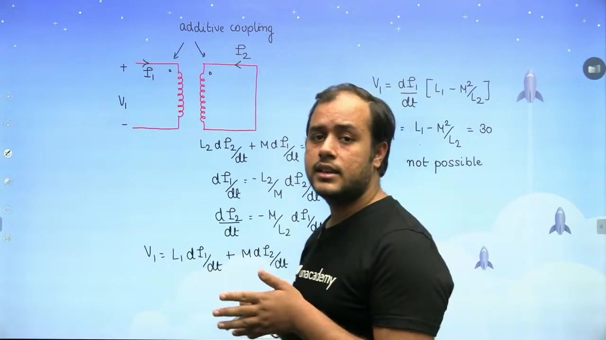

Conductor cross-sectional area grows with dimension squared. For constant current density, current scales as:
$$I \propto d^2$$

Core cross-sectional area also grows as $d^2$. For constant frequency and flux density, induced voltage scales as:
$$V \propto d^2$$

The kVA rating is the product of voltage and current, scaling as the fourth power:
$$S = V I \propto d^2 \times d^2 = d^4$$

Core volume scales as $d^3$. With constant specific core loss per unit volume, core loss scales as:
$$P_{\text{core}} \propto d^3$$

### Parameter Referral Summary

Let $a = N_1 / N_2$ denote the turns ratio between windings.
Mutual inductance referred to the primary side scales linearly with turns ratio:
$$M' = a M$$

Secondary self-inductance referred to the primary side scales with the square of turns ratio:
$$L_2' = a^2 L_2$$

Primary leakage inductance equals self-inductance minus referred mutual inductance:
$$L_{l1} = L_1 - a M$$

Secondary leakage inductance referred to primary equals referred self-inductance minus referred mutual inductance:
$$L_{l2}' = L_2' - a M$$

Finally, the magnetizing inductance referred to primary is represented directly by the referred mutual inductance:
$$L_m = a M$$

---

## Summary and Key Takeaways

- A transformer rating denotes its continuous operational capability, and operating at partial load does not change this rated value.
- Mutual inductance referred to the primary side is $M' = a M$, where $a = N_1 / N_2$ is the turns ratio.
- Primary and secondary leakage inductances are given by $L_{l1} = L_1 - a M$ and $L_{l2}' = L_2' - a M$.
- Maximum power transfer occurs when the load resistance referred to the primary matches the internal source resistance $R_L' = R_s$.
- Linear machine scaling by factor $d$ makes current and voltage ratings scale as $d^2$, while kVA rating scales as $d^4$ and core loss scales as $d^3$.
- Two coupled coils with equal self-inductance $L$ have series inductances $2L \pm 2M$, from which $L$ and $M$ are directly calculated.
- The equivalent input inductance of a two-port coupled network with shorted secondary is $L_{\text{sc}} = L_1 - M^2 / L_2$, which is strictly less than or equal to $L_1$.

