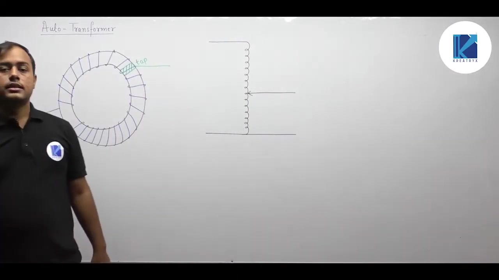
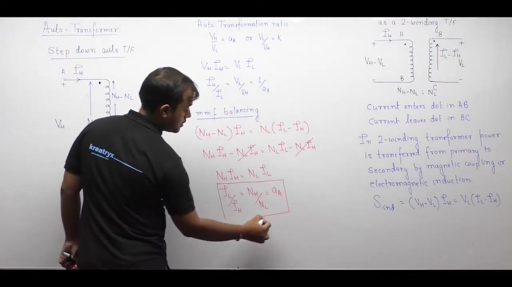
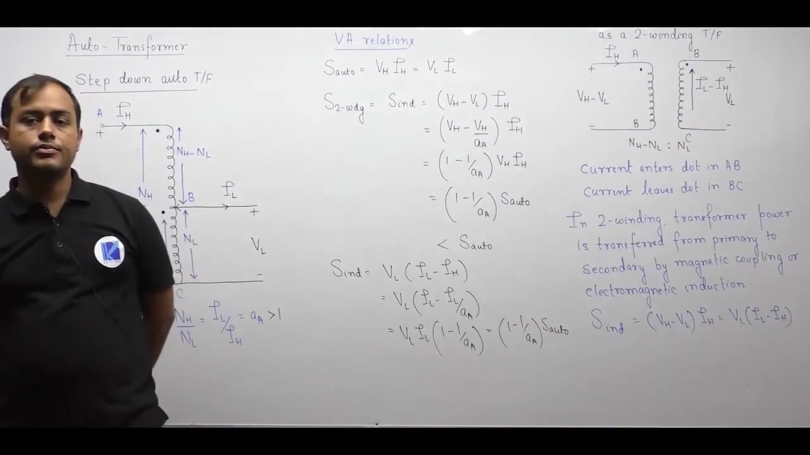
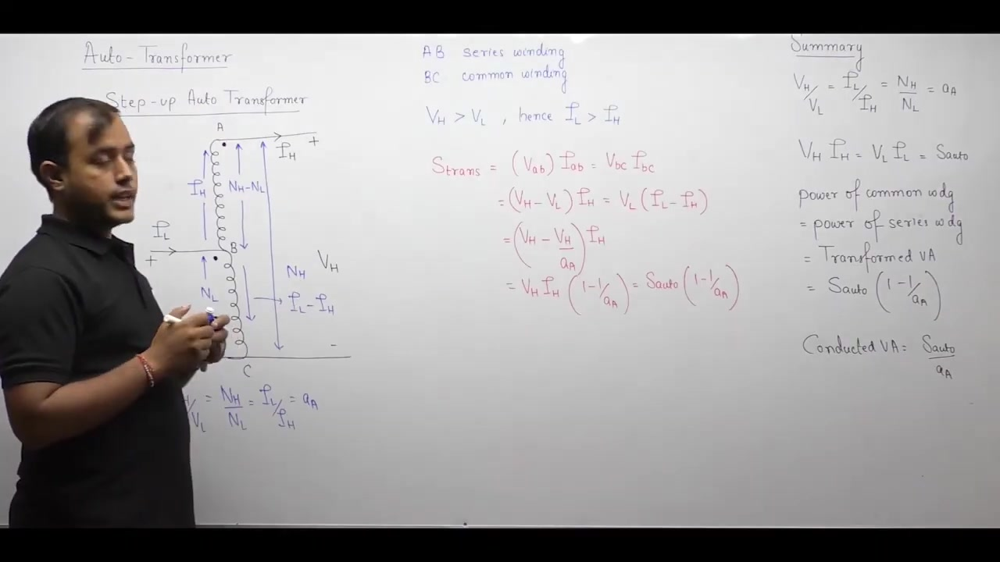
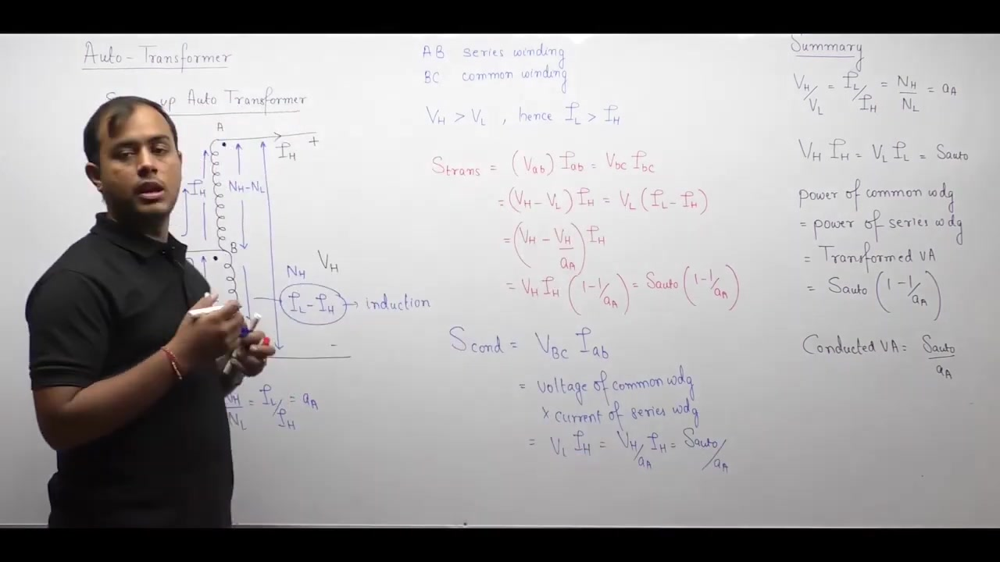

# Auto Transformer - 1 | Electrical Machines | Lec 22 | | GATE & ESE (EE, ECE) | Ankit Goyal

- **Source**: https://www.youtube.com/watch?v=pOkxh0EH1qo
- **Duration**: 00:42:43
- **Compiled**: 2026-09-20

---

## Overview

This lecture introduces the operational principles and circuit models of autotransformers. It explores physical construction on toroidal cores and examines both step-down and step-up connections. The discussion derives the fundamental division of transferred power into electromagnetic induction and electrical conduction. It also demonstrates the substantial apparent power rating advantage of autotransformers over equivalent two-winding transformers.

## Contents

- [[#Introduction to Autotransformers and Basic Construction|Introduction to Autotransformers and Basic Construction]]
- [[#Step-Down Autotransformer Analysis and Two-Winding Equivalence|Step-Down Autotransformer Analysis and Two-Winding Equivalence]]
- [[#Transformation Ratio, MMF Balancing, and Potential Divider Comparison|Transformation Ratio, MMF Balancing, and Potential Divider Comparison]]
- [[#Apparent Power Relations and Power Transferred by Induction|Apparent Power Relations and Power Transferred by Induction]]
- [[#Power Transferred by Conduction and Total Power Balance|Power Transferred by Conduction and Total Power Balance]]
- [[#Step-Up Autotransformer Configuration and Induced Power|Step-Up Autotransformer Configuration and Induced Power]]
- [[#Conducted Power in Step-Up Mode, General Rules, and Rating Advantages|Conducted Power in Step-Up Mode, General Rules, and Rating Advantages]]

---

## Introduction to Autotransformers and Basic Construction
_(00:14 - 05:15)_

### Two-Winding Transformer vs Autotransformer

In conventional single-phase transformers, two distinct windings exist on the magnetic core. One winding connects to the source as the primary. The second winding connects to the load as the secondary. Electrical isolation exists between these two circuits. Power transfers purely through magnetic coupling.

> [!info] Definition
> An autotransformer is a transformer that uses a single continuous winding on a magnetic core. Both the input and output circuits share portions of this single winding.

An autotransformer derives its secondary voltage by tapping into the same winding. It does not provide electrical isolation between input and output.

### Physical Construction and Tapping Mechanism

In practical construction, an autotransformer often uses a toroidal magnetic core. A single continuous winding is placed uniformly around the ring.

The winding is wound tightly across the core perimeter. A third terminal is created by placing a tap along the winding. In standard circuit diagrams, a single vertical coil represents the winding. An arrow or contact indicates the tapping point.

### Variable Autotransformer and Voltage Classification

Many autotransformers provide a movable sliding contact. Moving the contact varies the number of turns connected across the load.

1. **Step-Down Operation**: The source connects across the full winding with $N_1$ turns. The load connects across the tapped portion with $N_2$ turns. Because $N_2 < N_1$, the output voltage is lower than the input voltage.
2. **Step-Up Operation**: The source connects across the tapped portion with $N_1$ turns. The load connects across the complete winding with $N_2$ turns. Because $N_2 > N_1$, the output voltage exceeds the input voltage.

Variable autotransformers are commonly called Variacs in laboratory settings. They permit smooth continuous variation of output AC voltage.

## Step-Down Autotransformer Analysis and Two-Winding Equivalence
_(05:15 - 13:21)_

### Step-Down Configuration and Current Distribution

In a step-down autotransformer, the input voltage $V_H$ connects across the entire winding. The output voltage $V_L$ is tapped across a section of the winding.
Let the total number of turns across terminals A and C be $N_H$.
The tapped section across terminals B and C has $N_L$ turns.
The remaining upper section between terminals A and B has:
$$N_{AB} = N_H - N_L$$

The primary source delivers current $I_H$ into terminal A.
The load receives current $I_L$ from tap terminal B.
For an ideal lossless transformer, power is conserved:
$$V_H I_H = V_L I_L$$

Because $V_H > V_L$, the currents must satisfy:
$$I_H < I_L$$

### Kirchhoff's Current Law at the Tapping Node

Now apply Kirchhoff's Current Law at tap node B.
Current $I_H$ enters node B from the series winding AB above.
Current $I_L$ leaves node B to the load.
Because $I_L > I_H$, an additional current must enter node B from below.
Let this upward current in section BC be $I$.

At node B, equating incoming and outgoing currents gives:
$$I + I_H = I_L$$

Solving for the current in winding section BC:
$$I = I_L - I_H$$

Winding section BC connects to both input and output circuits. It is called the common winding.
The remaining upper section AB connects in series with the input line. It is called the series winding.

### Decomposition into an Equivalent Two-Winding Transformer

An autotransformer can be separated into an equivalent two-winding transformer.
The series winding AB acts as one winding.
The common winding BC acts as the other winding.

The voltages across these two sections are proportional to their turns:
1. Series winding AB has $N_H - N_L$ turns, carrying voltage $V_H - V_L$ and current $I_H$.
2. Common winding BC has $N_L$ turns, carrying voltage $V_L$ and current $I_L - I_H$.

> [!success] Result
> An autotransformer can be modeled as a two-winding transformer with turns $(N_H - N_L)$ and $N_L$.
> The apparent power transferred between these two windings represents power transferred purely by electromagnetic induction.

### Dot Convention and Transformer Action

Dot marks establish relative instantaneous polarities on the windings.
In section AB, current $I_H$ enters the dotted terminal at A.
In section BC, current $I_L - I_H$ leaves the dotted terminal at B.
This matches the fundamental rule of two-winding transformers. Current enters the dotted terminal of the primary winding and leaves the dotted terminal of the secondary winding.
Power transfers from the series winding to the common winding through magnetic coupling.

## Transformation Ratio, MMF Balancing, and Potential Divider Comparison
_(13:24 - 18:57)_

### Autotransformer Transformation Ratio

The transformation ratio in an autotransformer compares the high-voltage and low-voltage quantities.
Following standard convention, define the transformation ratio $a_{\text{auto}}$ as:
$$a_{\text{auto}} = \frac{V_H}{V_L} = \frac{N_H}{N_L}$$

Some textbooks define the inverse ratio $K = \frac{V_L}{V_H}$.
Here we maintain $a_{\text{auto}} > 1$, consistent with two-winding transformer notation.
Because power is conserved in an ideal transformer, current transforms inversely with voltage:
$$\frac{I_L}{I_H} = \frac{V_H}{V_L} = a_{\text{auto}}$$

### MMF Balancing in Two-Winding Equivalent

MMF balancing provides another way to derive this current relationship.
Consider the two decoupled windings: the series winding AB and the common winding BC.
The net magnetomotive force acting on the core must balance to zero under load.

Equating the MMF of the series winding and the common winding:
$$(N_H - N_L) I_H = N_L (I_L - I_H)$$

Expand both sides of the equation:
$$N_H I_H - N_L I_H = N_L I_L - N_L I_H$$

The term $N_L I_H$ appears on both sides and cancels out:
$$N_H I_H = N_L I_L$$

Rearrange to find the ratio of currents:
$$\frac{I_L}{I_H} = \frac{N_H}{N_L} = a_{\text{auto}}$$

> [!success] Result
> Both MMF balancing and power conservation yield the exact same current ratio:
> $$\frac{V_H}{V_L} = \frac{N_H}{N_L} = \frac{I_L}{I_H} = a_{\text{auto}}$$

### Power Transferred by Electromagnetic Induction

When viewed as a two-winding transformer, power transfers between windings purely through magnetic coupling.
This apparent power is denoted as $S_{\text{ind}}$.
From the series winding side:
$$S_{\text{ind}} = (V_H - V_L) I_H$$

From the common winding side:
$$S_{\text{ind}} = V_L (I_L - I_H)$$

Both expressions give identical numerical values. They represent the power handled by magnetic induction.

### Autotransformer vs Potential Divider

The schematic diagram of an autotransformer resembles a resistive potential divider. Both use a tapped element.
However, their physical operation is completely different.

1. **Voltage Range**: A resistive potential divider can only reduce voltage. It can never step up voltage. An autotransformer can operate in both step-down and step-up modes.
2. **Efficiency**: A potential divider drops voltage through resistive dissipation, generating heat losses. An autotransformer alters voltage through magnetic flux linkage with high operating efficiency.
3. **Power Handling**: An autotransformer transfers power through both conduction and induction. A potential divider is restricted to low-power signal applications.

## Apparent Power Relations and Power Transferred by Induction
_(18:57 - 26:23)_

### Total Apparent Power of Autotransformer

Consider the total apparent power capability of the autotransformer.
Measured from the high-voltage primary side:
$$S_{\text{auto}} = V_H I_H$$

Measured from the low-voltage secondary side:
$$S_{\text{auto}} = V_L I_L$$

Both expressions give the total volt-ampere rating of the autotransformer.
An autotransformer internally behaves like an interconnected two-winding transformer.
We now determine the portion of this power handled through transformer action.

### Derivation of Induced Apparent Power

The power transferred by electromagnetic induction corresponds to the rating of the internal two-winding transformer.
Denoting this induced power as $S_{\text{ind}}$, calculate it first from the series winding AB:
$$S_{\text{ind}} = (V_H - V_L) I_H$$

Recall the definition of transformation ratio:
$$a_{\text{auto}} = \frac{V_H}{V_L} \implies V_L = \frac{V_H}{a_{\text{auto}}}$$

Substitute this expression into the induced power equation:
$$
\begin{aligned}
S_{\text{ind}} &= \left(V_H - \frac{V_H}{a_{\text{auto}}}\right) I_H \\
&= V_H I_H \left(1 - \frac{1}{a_{\text{auto}}}\right)
\end{aligned}
$$

Because $V_H I_H = S_{\text{auto}}$, this simplifies to:
$$S_{\text{ind}} = S_{\text{auto}} \left(1 - \frac{1}{a_{\text{auto}}}\right)$$

### Alternative Derivation from Common Winding

We can also derive $S_{\text{ind}}$ from the common winding BC.
The voltage across winding BC is $V_L$. The current carried by winding BC is $I_L - I_H$.
Therefore, the power of the common winding is:
$$S_{\text{ind}} = V_L (I_L - I_H)$$

Express the high-voltage current in terms of low-voltage current:
$$I_H = \frac{I_L}{a_{\text{auto}}}$$

Substitute $I_H$ into the expression:
$$
\begin{aligned}
S_{\text{ind}} &= V_L \left(I_L - \frac{I_L}{a_{\text{auto}}}\right) \\
&= V_L I_L \left(1 - \frac{1}{a_{\text{auto}}}\right)
\end{aligned}
$$

Because $V_L I_L = S_{\text{auto}}$, this yields:
$$S_{\text{ind}} = S_{\text{auto}} \left(1 - \frac{1}{a_{\text{auto}}}\right)$$

Both derivations produce identical results.

> [!success] Result
> The power transferred by induction in an autotransformer is:
> $$S_{\text{ind}} = S_{\text{auto}} \left(1 - \frac{1}{a_{\text{auto}}}\right)$$
> This power also equals the physical volt-ampere rating of either the series winding or the common winding.

### Power Rating Comparison with Two-Winding Transformer

Because $a_{\text{auto}} > 1$, the factor $(1 - 1/a_{\text{auto}})$ is strictly less than 1:
$$\left(1 - \frac{1}{a_{\text{auto}}}\right) < 1$$

Therefore, the power transferred by induction is less than the total autotransformer rating:
$$S_{\text{ind}} < S_{\text{auto}}$$

For instance, suppose an autotransformer delivers $100\text{ MVA}$ with $a_{\text{auto}} = 2.5$.
The induced power handled by the windings is:
$$S_{\text{ind}} = 100 \left(1 - \frac{1}{2.5}\right) = 60\text{ MVA}$$

The magnetic core and windings only need to be sized for $60\text{ MVA}$.
Yet the unit delivers $100\text{ MVA}$ to the load.
The remaining $40\text{ MVA}$ transfers through direct electrical conduction.

## Power Transferred by Conduction and Total Power Balance
_(26:29 - 31:21)_

### The Mechanism of Conducted Power

In a conventional two-winding transformer, no conductive connection exists between primary and secondary.
All electrical energy transfers via magnetic induction through the core.
In an autotransformer, the primary and secondary circuits share electrical connections.

The total current entering the load is $I_L$.
Decompose this load current into two components:
$$I_L = (I_L - I_H) + I_H$$

The component $(I_L - I_H)$ circulates through the common winding. It transfers power by magnetic induction.
The component $I_H$ flows directly from the primary source into the load.
Because current flows directly through metallic conductors, this power transfers by electrical conduction.

### Derivation of Conducted Apparent Power

The conducted current is the primary current $I_H$.
This current flows into the load at load voltage $V_L$.
Therefore, the conducted apparent power is:
$$S_{\text{cond}} = I_H V_L$$

Express $I_H$ using the autotransformer transformation ratio:
$$I_H = \frac{I_L}{a_{\text{auto}}}$$

Substitute this into the expression for $S_{\text{cond}}$:
$$S_{\text{cond}} = \left(\frac{I_L}{a_{\text{auto}}}\right) V_L = \frac{V_L I_L}{a_{\text{auto}}}$$

Because $V_L I_L = S_{\text{auto}}$, the conducted power becomes:
$$S_{\text{cond}} = \frac{S_{\text{auto}}}{a_{\text{auto}}}$$

> [!success] Result
> The power transferred directly by electrical conduction is:
> $$S_{\text{cond}} = \frac{S_{\text{auto}}}{a_{\text{auto}}}$$

### Total Power Transfer Balance

Now add the conducted apparent power and the induced apparent power:
$$S_{\text{total}} = S_{\text{cond}} + S_{\text{ind}}$$

Substitute the derived expressions:
$$
\begin{aligned}
S_{\text{total}} &= \frac{S_{\text{auto}}}{a_{\text{auto}}} + S_{\text{auto}}\left(1 - \frac{1}{a_{\text{auto}}}\right) \\
&= S_{\text{auto}}\left(\frac{1}{a_{\text{auto}}} + 1 - \frac{1}{a_{\text{auto}}}\right) \\
&= S_{\text{auto}}
\end{aligned}
$$

The sum of conducted and induced power equals the total autotransformer rating.

### Physical Interpretation of Rating Advantage

In an autotransformer, power transfers via two parallel mechanisms:
1. Electromagnetic induction through the core: $S_{\text{ind}} = S_{\text{auto}}(1 - 1/a_{\text{auto}})$.
2. Direct electrical conduction through the copper wire: $S_{\text{cond}} = S_{\text{auto}} / a_{\text{auto}}$.

The magnetic core only experiences the induced power $S_{\text{ind}}$.
Conducted power bypasses magnetic transformation entirely.
This explains why an autotransformer handles far more kVA than a two-winding transformer of identical physical size.
When $a_{\text{auto}}$ is close to unity, conducted power dominates, making the transformer exceptionally compact and efficient.

## Step-Up Autotransformer Configuration and Induced Power
_(31:24 - 37:50)_

### Summary of Step-Down Operating Relations

Before examining step-up operation, review the fundamental step-down formulas:
1. Voltage and current ratios: $\frac{V_H}{V_L} = \frac{N_H}{N_L} = \frac{I_L}{I_H} = a_{\text{auto}}$.
2. Total apparent power: $S_{\text{auto}} = V_H I_H = V_L I_L$.
3. Transformed power: $S_{\text{ind}} = S_{\text{auto}}\left(1 - \frac{1}{a_{\text{auto}}}\right)$.
4. Conducted power: $S_{\text{cond}} = \frac{S_{\text{auto}}}{a_{\text{auto}}}$.

These equations establish that autotransformer power divides into induced and conducted parts.

### Step-Up Autotransformer Circuit Configuration

To step up voltage, the output must have more turns than the input.
We achieve this by exchanging the source and load connections.
The low-voltage AC source connects across the common winding BC with $N_L$ turns.
The high-voltage load connects across the entire winding AC with $N_H$ turns.

Winding section AB remains the series winding with $N_H - N_L$ turns.
Winding section BC remains the common winding with $N_L$ turns.
The transformation ratio remains defined as the high-voltage to low-voltage ratio:
$$a_{\text{auto}} = \frac{V_H}{V_L} = \frac{N_H}{N_L} > 1$$

### Current Distribution and KCL at Tap Node

Because $V_H > V_L$, power conservation requires $I_L > I_H$.
The source delivers current $I_L$ into tap node B.
The load draws current $I_H$ from terminal A.
Therefore, current $I_H$ must flow upward through the series winding AB.

Now apply Kirchhoff's Current Law at tap node B.
Current $I_L$ enters node B from the source.
Current $I_H$ leaves node B upward into winding AB.
To balance the node, the remaining current flows downward through the common winding BC:
$$I_{BC} = I_L - I_H$$

The common winding carries the difference of the two terminal currents.

### Derivation of Transformed Power in Step-Up Mode

Transformed apparent power equals the power transferred through magnetic induction.
Calculate it from the series winding AB:
$$S_{\text{trans}} = V_{AB} I_{AB} = (V_H - V_L) I_H$$

Calculate it alternatively from the common winding BC:
$$S_{\text{trans}} = V_{BC} I_{BC} = V_L (I_L - I_H)$$

Substitute $V_L = V_H / a_{\text{auto}}$ into the series winding expression:
$$
\begin{aligned}
S_{\text{trans}} &= \left(V_H - \frac{V_H}{a_{\text{auto}}}\right) I_H \\
&= V_H I_H \left(1 - \frac{1}{a_{\text{auto}}}\right) \\
&= S_{\text{auto}} \left(1 - \frac{1}{a_{\text{auto}}}\right)
\end{aligned}
$$

> [!success] Result
> The transformed apparent power in a step-up autotransformer is:
> $$S_{\text{trans}} = S_{\text{auto}} \left(1 - \frac{1}{a_{\text{auto}}}\right)$$
> This expression is identical to the formula derived for step-down operation.

## Conducted Power in Step-Up Mode, General Rules, and Rating Advantages
_(37:53 - 42:36)_

### Conducted Power in Step-Up Autotransformer

In the step-up configuration, current $I_L$ enters from the source at node B.
Part of this current enters the series winding AB as $I_H$ and flows directly to the load.
This direct transfer represents conducted power.

Conducted power is the product of common winding voltage and series winding current:
$$S_{\text{cond}} = V_{BC} I_{AB} = V_L I_H$$

Substitute $V_L = V_H / a_{\text{auto}}$ into this expression:
$$S_{\text{cond}} = \left(\frac{V_H}{a_{\text{auto}}}\right) I_H = \frac{V_H I_H}{a_{\text{auto}}}$$

Because $V_H I_H = S_{\text{auto}}$, this gives:
$$S_{\text{cond}} = \frac{S_{\text{auto}}}{a_{\text{auto}}}$$

The formula for conducted power is identical in both step-up and step-down configurations.

### General Method for Determining Current Directions

A systematic procedure determines current directions in any autotransformer circuit:

1. **Source Side**: Assume current leaves the positive terminal so that the AC source delivers electrical power.
2. **Load Side**: Assume current enters the positive terminal so that the connected load absorbs electrical power.
3. **Tapping Point**: Apply Kirchhoff's Current Law at the tapping node to determine the magnitude and direction of the common winding current.

Because $I_L > I_H$, the common winding current always equals $I_L - I_H$.
Its direction adjusts to ensure that the sum of incoming currents equals the outgoing currents.

### Universal Power Formulas for Autotransformers

The power division relations apply universally to any autotransformer configuration:

> [!success] Result
> 1. Transformed (induced) apparent power:
>    $$S_{\text{trans}} = S_{\text{auto}}\left(1 - \frac{1}{a_{\text{auto}}}\right)$$
> 2. Conducted apparent power:
>    $$S_{\text{cond}} = \frac{S_{\text{auto}}}{a_{\text{auto}}}$$
> 3. Total apparent power:
>    $$S_{\text{auto}} = S_{\text{trans}} + S_{\text{cond}}$$

Transformed power equals the volt-ampere rating of either individual winding section.
Conducted power equals the product of common winding voltage and series winding current.

### Operational Advantages and Preview of Reconnection

The principal advantage of an autotransformer is its superior kVA rating.
For the same core size and copper mass, an autotransformer delivers substantially higher power than a two-winding transformer.
Conducted power requires no magnetic transformation, so core losses and copper losses remain lower.

An autotransformer can be viewed as an interconnected two-winding transformer.
Conversely, any two-winding transformer can be reconnected as an autotransformer.
The next lecture analyzes how to connect two-winding transformers to realize step-up and step-down autotransformers.

---

## Summary and Key Takeaways

- An autotransformer uses a single tapped continuous winding to serve both primary and secondary circuits without electrical isolation.
- The transformation ratio is defined as $a_{\text{auto}} = V_H / V_L = N_H / N_L = I_L / I_H > 1$.
- Current in the common winding equals the difference of the load and source currents, $|I_L - I_H|$.
- An autotransformer can be modeled as an equivalent two-winding transformer consisting of a series winding with $N_H - N_L$ turns and a common winding with $N_L$ turns.
- The apparent power transferred by electromagnetic induction is $S_{\text{ind}} = S_{\text{auto}}(1 - 1/a_{\text{auto}})$.
- The apparent power transferred by direct electrical conduction is $S_{\text{cond}} = S_{\text{auto}} / a_{\text{auto}}$.
- Total apparent power equals the sum of conducted and induced components: $S_{\text{auto}} = S_{\text{cond}} + S_{\text{ind}}$.
- When the transformation ratio $a_{\text{auto}}$ is close to unity, conducted power dominates, allowing a much higher kVA rating for a given core size.

