# Electrical Machines | Lec 23 | Auto Transformer in Hindi - 2| GATE Electrical Engineering Lecture

- **Source**: https://www.youtube.com/watch?v=KBen4Tojy80
- **Duration**: 01:06:30
- **Compiled**: 2026-09-20

---

## Overview

This lecture explains how to convert a four-terminal two-winding transformer into a three-terminal autotransformer. It examines the differences between additive and subtractive series connections through circuit diagrams and dot polarity analysis. The lecture details power division into transformed and conducted components while demonstrating why operational efficiency increases. It works through a comprehensive numerical example for both connection types under rated and specified load conditions. Finally, the lecture derives the scaling factors for per-unit impedance, voltage regulation, losses, and short-circuit current.

## Contents

- [[#Conversion of Two-Winding Transformer to Autotransformer|Conversion of Two-Winding Transformer to Autotransformer]]
- [[#Additive Polarity Connection and Power Ratings|Additive Polarity Connection and Power Ratings]]
- [[#Power Division, Efficiency Gains, and Subtractive Polarity|Power Division, Efficiency Gains, and Subtractive Polarity]]
- [[#Subtractive Polarity Connection and Circuit Analysis|Subtractive Polarity Connection and Circuit Analysis]]
- [[#Polarity vs Voltage Function and Worked Example Setup|Polarity vs Voltage Function and Worked Example Setup]]
- [[#Problem Solution: Additive Polarity Case (2000/2200 V)|Problem Solution: Additive Polarity Case (2000/2200 V)]]
- [[#Problem Solution: Load-Specified Case and Subtractive Polarity (2000/1800 V)|Problem Solution: Load-Specified Case and Subtractive Polarity (2000/1800 V)]]
- [[#Subtractive Efficiency and Conversion Summary|Subtractive Efficiency and Conversion Summary]]
- [[#Autotransformer Parameters and Equivalent Circuit Setup|Autotransformer Parameters and Equivalent Circuit Setup]]
- [[#Scaling of Per-Unit Impedance and Voltage Regulation|Scaling of Per-Unit Impedance and Voltage Regulation]]
- [[#Scaling of Losses, Fault Current, and Parameter Summary|Scaling of Losses, Fault Current, and Parameter Summary]]

---

## Conversion of Two-Winding Transformer to Autotransformer
_(00:12 - 05:47)_

### Fundamental Differences and Interconnection Concept

An autotransformer uses a single continuous winding with a tap point. In contrast, a conventional two-winding transformer has two physically isolated windings. Power transfers between the primary and secondary windings of a two-winding transformer solely through magnetic induction.

In an autotransformer, power transfers through two distinct mechanisms. One part transfers by magnetic induction. The remaining part transfers by direct electrical conduction. The conducted power exists because a portion of the source current flows directly into the load. Direct conduction increases the overall power rating of the unit beyond that of an isolated transformer.

A standard two-winding transformer has four external terminals. An autotransformer requires only three external terminals. These three terminals serve as the common terminal, the tap terminal, and the source terminal.

> [!info] Terminal Configuration Principle
> To convert a four-terminal two-winding transformer into a three-terminal autotransformer, connect one terminal of the primary winding to one terminal of the secondary winding. This creates a series interconnection with a shared common junction.

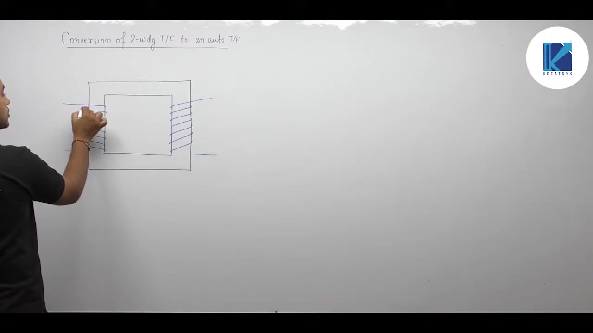

### Winding Parameters and Polarity Configurations

Consider a two-winding transformer with primary and secondary windings. The primary winding has $N_1$ turns, rated voltage $V_1$, and rated current $I_1$. The secondary winding has $N_2$ turns, rated voltage $V_2$, and rated current $I_2$. We assume $N_1 > N_2$, so $V_1 > V_2$.

Dot markings identify terminals that possess the same instantaneous polarity. When the primary dot is positive, the secondary dot is also positive.

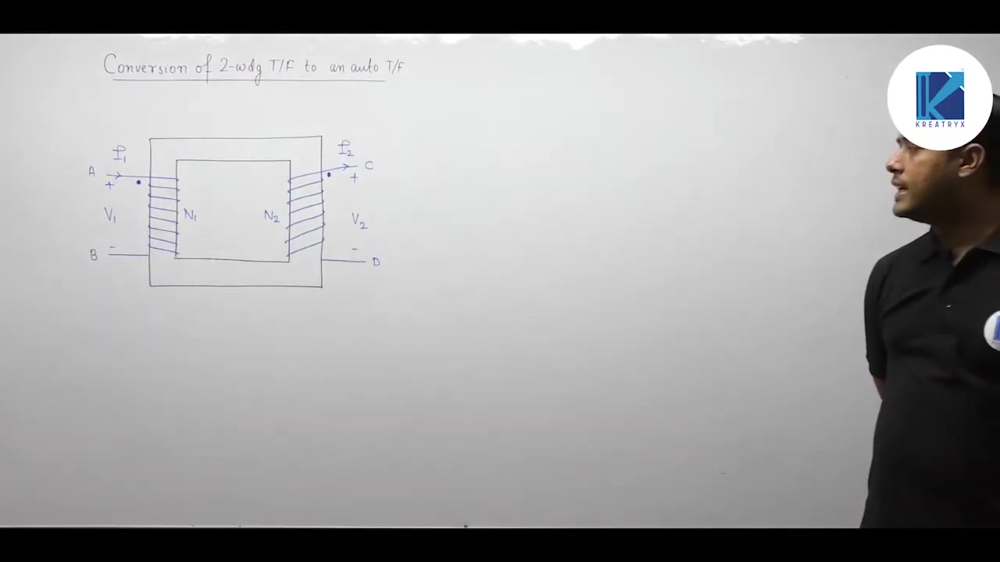

When connecting the two windings in series, two distinct connection polarities are possible:
1. **Additive Polarity**: The winding voltages add together.
2. **Subtractive Polarity**: The winding voltages oppose each other.

Voltages add when a terminal of positive polarity connects to a terminal of negative polarity. In terms of dot notation, this means connecting a dotted terminal of one winding to an undotted terminal of the other winding.

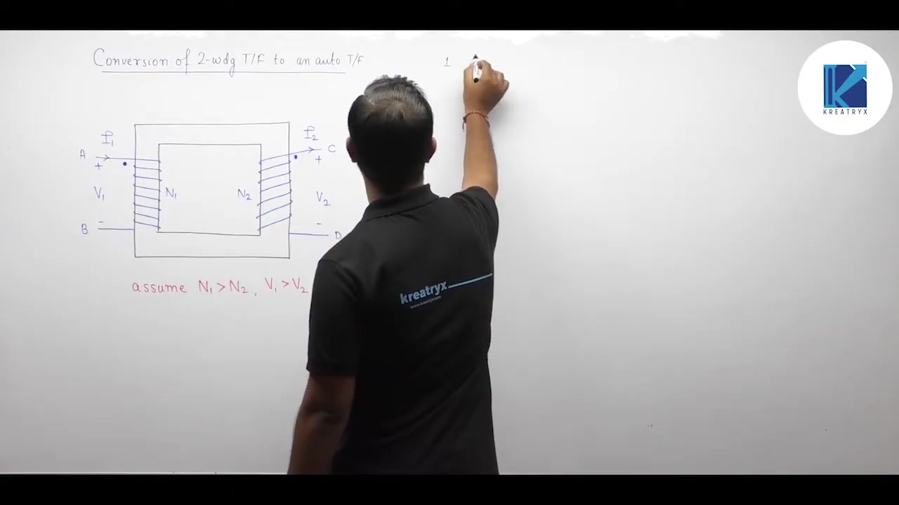

## Additive Polarity Connection and Power Ratings
_(05:52 - 12:07)_

### Circuit Realization of Additive Polarity

To connect two windings in additive polarity, connect the negative terminal of one winding to the positive terminal of the other. In dot notation, this connects an undotted terminal to a dotted terminal.

Consider the primary winding labeled as terminals A and B. Terminal A is dotted and positive. Terminal B is undotted and negative. The secondary winding has terminals C and D. Terminal C is dotted and positive, while terminal D is undotted and negative.

Connecting terminal B to terminal C forms the common junction. Terminal D serves as the reference terminal. The load connects across terminals C and D. The source connects across terminals A and D.

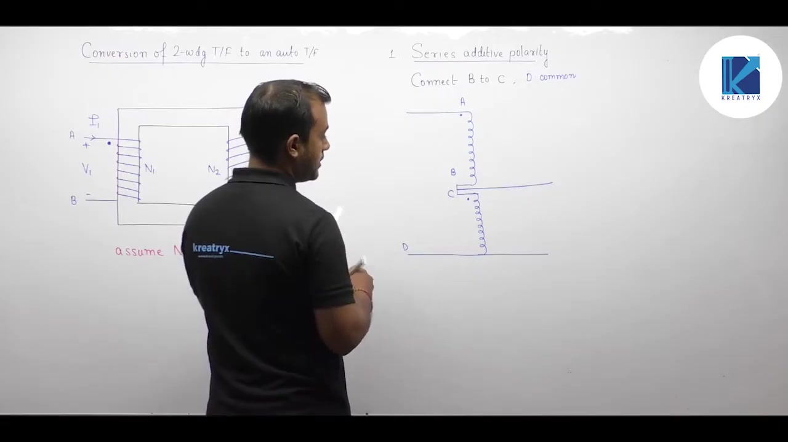

Winding AB acts as the series winding. Winding CD acts as the common winding. The voltage across winding AB remains $V_1$. The voltage across winding CD remains $V_2$.

By applying Kirchhoff's Voltage Law across terminals A and D, the total input voltage becomes:
$$V_{\text{in}} = V_1 + V_2$$

The output voltage across the load at terminals C and D is:
$$V_{\text{out}} = V_2$$

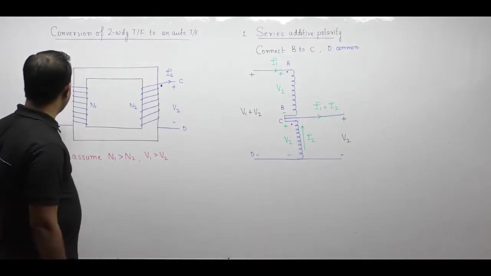

### Current Distribution and Kirchhoff's Current Law

The current entering terminal A is the rated current $I_1$ of the series winding. Since current enters the dot at terminal A, current must leave the dot at terminal C. Therefore, winding CD carries its rated current $I_2$ upward away from terminal D toward terminal C.

At node C, the incoming current from winding AB combines with the current from winding CD. Applying Kirchhoff's Current Law gives the load current:
$$I_{\text{load}} = I_1 + I_2$$

Each individual winding operates within its rated voltage and rated current limits. Winding AB experiences voltage $V_1$ and carries current $I_1$. Winding CD experiences voltage $V_2$ and carries current $I_2$.

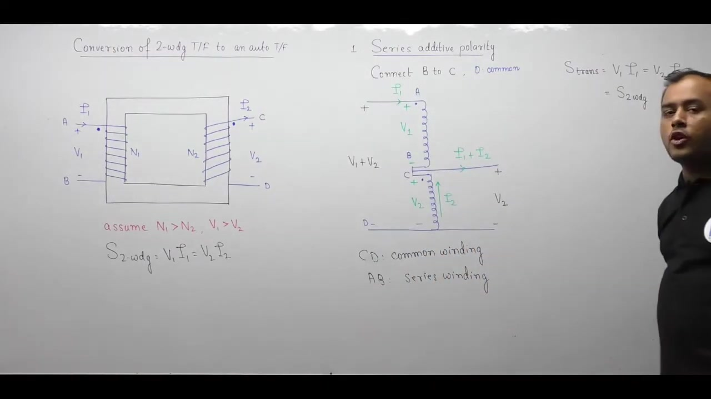

### Transformed and Total Apparent Power

The power transferred by magnetic induction is the transformed power $S_{\text{trans}}$. This power equals the apparent power handled by either winding alone:
$$S_{\text{trans}} = V_1 I_1 = V_2 I_2 = S_{\text{2-wdg}}$$

> [!success] Core Principle
> When creating an autotransformer from a two-winding transformer, the power transferred by magnetic induction always equals the original two-winding transformer rating.

The total apparent power rating $S_{\text{auto}}$ of the autotransformer can be evaluated from the input side or the output side:
$$S_{\text{auto}} = (V_1 + V_2) I_1 = V_2 (I_1 + I_2)$$

The auto transformation ratio $a_{\text{auto}}$ is defined as the high voltage divided by the low voltage:
$$a_{\text{auto}} = \frac{V_1 + V_2}{V_2} = \frac{V_1}{V_2} + 1$$

We can express the secondary voltage as:
$$V_2 = \frac{V_1}{a_{\text{auto}} - 1}$$

Substituting this expression into the power relation shows that $S_{\text{auto}}$ exceeds the original two-winding rating.

## Power Division, Efficiency Gains, and Subtractive Polarity
_(12:07 - 18:33)_

### Power Division in Additive Polarity

We can relate the total apparent power of the autotransformer directly to the transformed power. Recall the expression for the total rating:
$$S_{\text{auto}} = (V_1 + V_2) I_1$$

Substitute $V_2 = \frac{V_1}{a_{\text{auto}} - 1}$ into this equation:
$$S_{\text{auto}} = \left(V_1 + \frac{V_1}{a_{\text{auto}} - 1}\right) I_1 = \left(\frac{a_{\text{auto}}}{a_{\text{auto}} - 1}\right) V_1 I_1$$

Notice that $V_1 I_1$ is the transformed power $S_{\text{trans}}$. Rearranging gives:
$$S_{\text{trans}} = \left(1 - \frac{1}{a_{\text{auto}}}\right) S_{\text{auto}}$$

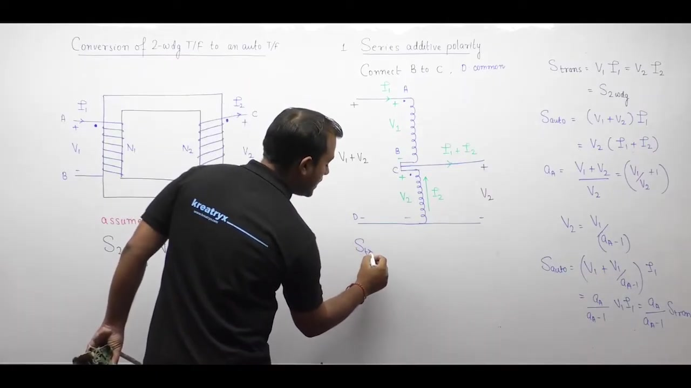

The power transferred by direct conduction is the difference between the total and transformed power:
$$S_{\text{cond}} = S_{\text{auto}} - S_{\text{trans}} = \frac{S_{\text{auto}}}{a_{\text{auto}}}$$

These equations match the results obtained earlier. The transformed power equals the original two-winding transformer rating $S_{\text{2-wdg}}$.

### Invariance of Losses and Increase in Efficiency

When converting a two-winding transformer into an autotransformer, the physical core and windings remain unchanged. The voltage across each winding remains at its rated value. The current in each winding also remains at its rated value.

Because voltage and frequency do not change, the core flux remains identical. Core losses therefore remain constant. Because the winding currents remain identical, copper losses also remain constant.

> [!info] Loss Invariance Principle
> Converting a two-winding transformer into an autotransformer does not change the actual winding voltages or currents. Both core losses and copper losses remain identical to their two-winding values.

Although total losses remain unchanged, the total power handled increases from $S_{\text{2-wdg}}$ to $S_{\text{auto}}$. The efficiency is given by:
$$\eta = \frac{\text{Output Power}}{\text{Output Power} + P_{\text{loss}}}$$

Because the power output increases while total losses remain constant, the operating efficiency increases. This efficiency boost is a major advantage of the autotransformer.

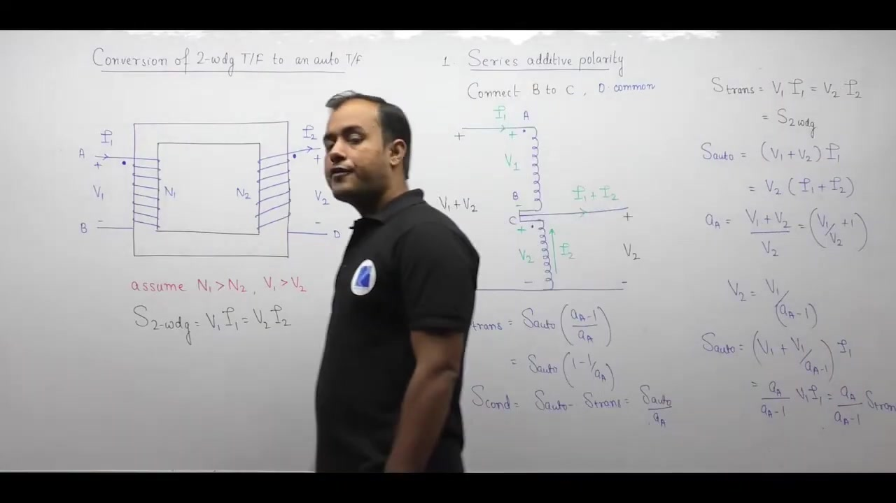

### Concept of Series Subtractive Polarity

Additive polarity connects opposite polarities together. Another configuration connects terminals of the same polarity together. This arrangement is series subtractive polarity.

In subtractive polarity, connect positive to positive or negative to negative. In dot notation, connect dot to dot or undotted to undotted.

Consider two voltage sources $V_1$ and $V_2$ connected in opposition. Applying Kirchhoff's Voltage Law gives:
$$V_{\text{out}} = V_1 - V_2$$

The two voltages subtract from each other. Connecting terminals of identical polarity produces subtractive polarity.

## Subtractive Polarity Connection and Circuit Analysis
_(18:33 - 23:29)_

### Circuit Realization of Subtractive Polarity

Connecting terminals of identical polarity creates a subtractive polarity configuration. We connect positive terminal to positive terminal, or negative terminal to negative terminal. In dot notation, we connect dot to dot, or undotted to undotted.

Consider the two windings AB and CD. Terminal A and terminal C have polarity dots. Connecting terminal A to terminal C places the two dotted terminals together.

The primary winding AB has rated voltage $V_1$. The secondary winding CD has rated voltage $V_2$. Because $V_1 > V_2$, the net voltage across the series combination is:
$$V_{\text{out}} = V_1 - V_2$$

This output voltage appears across terminals B and D. Applying Kirchhoff's Voltage Law around the loop confirms this subtraction.

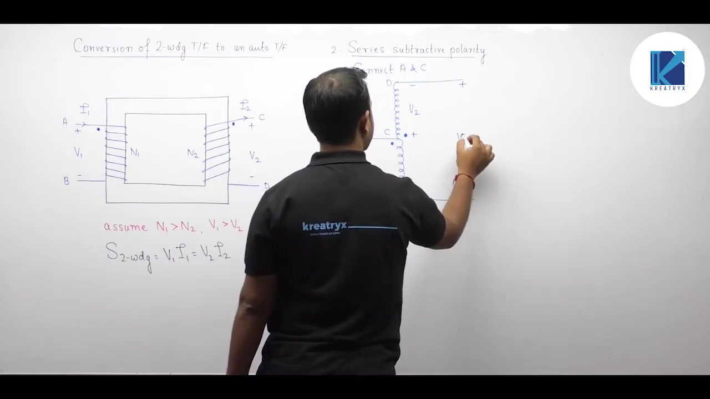

### Current Distribution and Power Flow Direction

Winding CD carries its rated current $I_2$ toward the load. Because $V_1 > V_2$, rated current $I_2$ is larger than $I_1$.

Current $I_2$ enters the dot at terminal C. Standard transformer action requires current to leave the dot at terminal A. Winding AB therefore carries current $I_1$ flowing away from terminal A toward terminal B.

Applying Kirchhoff's Current Law at the common junction yields the source current:
$$I_{\text{in}} = I_2 - I_1$$

These current directions ensure that the electrical source delivers active power. The connected load absorbs active power.

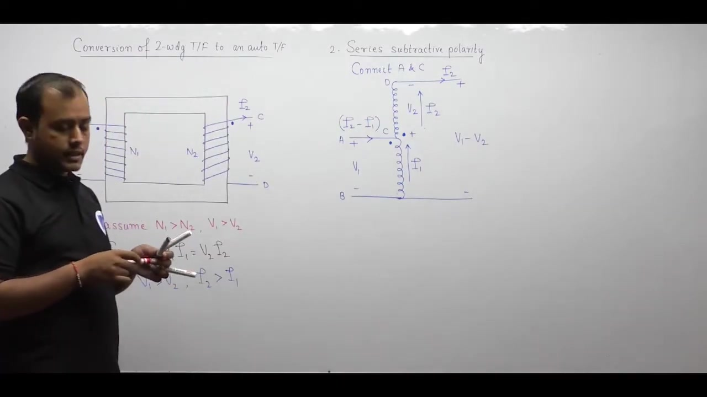

In this configuration, winding AB serves as the common winding. Winding CD serves as the series winding.

### Transformed and Total Power in Subtractive Polarity

The power transferred by transformer action is $S_{\text{trans}}$. It equals the volt-ampere rating of either winding:
$$S_{\text{trans}} = V_1 I_1 = V_2 I_2 = S_{\text{2-wdg}}$$

> [!success] Universal Property
> Whether connected in additive or subtractive polarity, the transformed power always equals the original two-winding transformer rating.

The total apparent power rating $S_{\text{auto}}$ of the subtractive autotransformer is:
$$S_{\text{auto}} = (V_1 - V_2) I_2 = V_1 (I_2 - I_1)$$

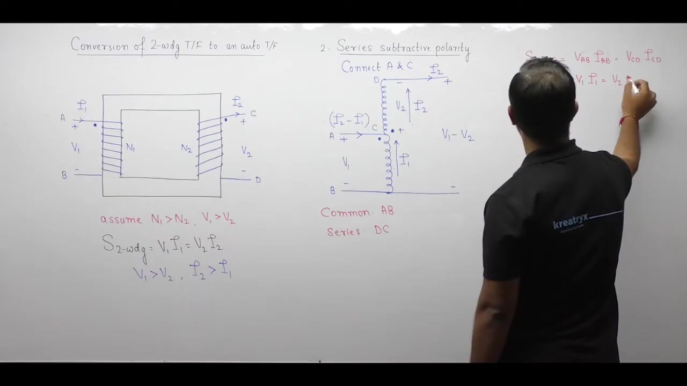

> [!info] Calculation Guideline
> Do not use direct transformation ratio formulas for subtractive polarity. Always calculate ratings and power values directly from terminal voltages and winding currents.

## Polarity vs Voltage Function and Worked Example Setup
_(23:30 - 28:22)_

### Advantages of Two-Winding to Autotransformer Conversion

Converting a two-winding transformer to an autotransformer provides two major advantages. First, the apparent power rating increases. Second, the operating efficiency increases.

Conducted power in subtractive polarity is found by subtraction:
$$S_{\text{cond}} = S_{\text{auto}} - S_{\text{trans}}$$

Because physical winding currents and voltages remain at their rated values, iron losses remain constant. Copper losses also remain constant. Because the power rating increases while losses stay constant, efficiency increases in both additive and subtractive polarities.

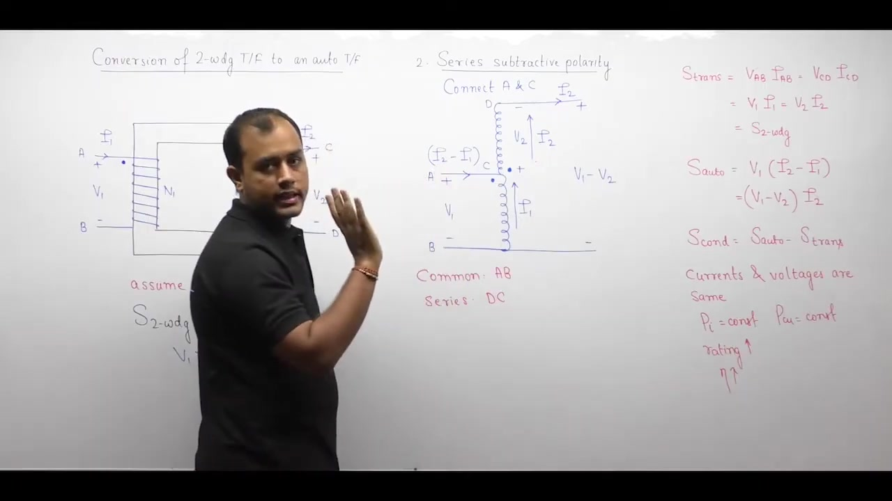

### Independence of Step-Up or Step-Down Function from Polarity

A common misconception is that additive polarity means step-up and subtractive polarity means step-down. This idea is incorrect.

The classification into step-up or step-down depends strictly on the source and load terminal connections:
- A transformer is **step-up** when the source connects to the low-voltage side and the load connects to the high-voltage side.
- A transformer is **step-down** when the source connects to the high-voltage side and the load connects to the low-voltage side.

> [!info] Polarity Independence Rule
> Whether an autotransformer functions as step-up or step-down is completely independent of additive and subtractive polarity. Additive polarity can yield either step-up or step-down. Subtractive polarity can also yield either step-up or step-down.

In subtractive polarity, the two voltage levels are $V_1$ and $V_1 - V_2$. Connecting the source to $V_1$ and the load to $V_1 - V_2$ creates a step-down autotransformer. Connecting the source to $V_1 - V_2$ and the load to $V_1$ creates a step-up autotransformer.

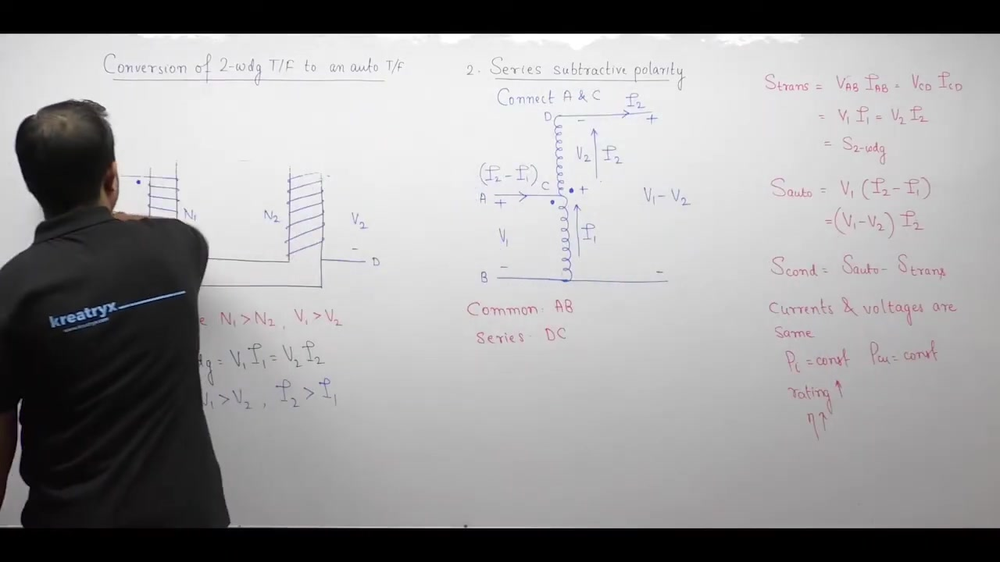

### Worked Example: Conversion Problem Formulation

To understand the complete analysis, consider the following practical problem.

> [!example] Problem
> A $20\text{ kVA}$, $2000/200\text{ V}$ two-winding transformer has an efficiency of $98\%$ at full load unity power factor. It is reconnected to form an autotransformer. Determine the connection diagram, kVA rating, and efficiency for two voltage ratings:
> 1. $2000/2200\text{ V}$
> 2. $2000/1800\text{ V}$

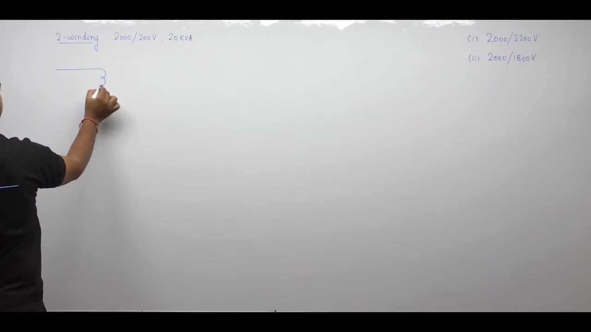

We begin by examining the given two-winding transformer. The high-voltage winding operates at $2000\text{ V}$. The low-voltage winding operates at $200\text{ V}$. The apparent power rating is $20\text{ kVA}$.

## Problem Solution: Additive Polarity Case (2000/2200 V)
_(28:30 - 36:34)_

### Calculation of Rated Currents and Operating Rules

We first calculate the rated current of each winding for the $20\text{ kVA}$, $2000/200\text{ V}$ transformer.

The rated current on the high-voltage side is:
$$I_{\text{HV, rated}} = \frac{20 \times 10^3\text{ VA}}{2000\text{ V}} = 10\text{ A}$$

The rated current on the low-voltage side is:
$$I_{\text{LV, rated}} = \frac{20 \times 10^3\text{ VA}}{200\text{ V}} = 100\text{ A}$$

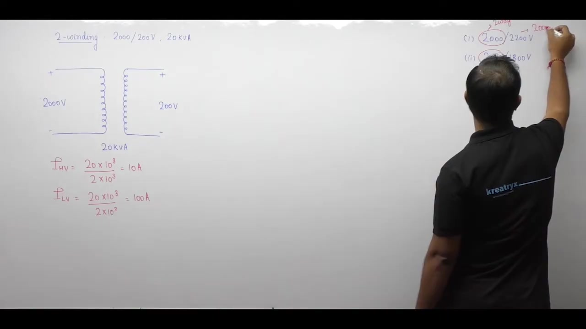

> [!info] Current Selection Rule
> If the load connected to the autotransformer is not specified, use the rated currents of the two-winding transformer. If the load is specified, calculate the actual currents from the load apparent power and operating voltage.

### Identification of Connection Polarity

Examine the required autotransformer ratings. In part 1, the rating is $2000/2200\text{ V}$.

The voltage $2200\text{ V}$ equals the sum of the two original ratings:
$$2000\text{ V} + 200\text{ V} = 2200\text{ V}$$

Because the voltages add together, this configuration is additive polarity.

In part 2, the rating is $2000/1800\text{ V}$. The voltage $1800\text{ V}$ equals the difference of the original ratings:
$$2000\text{ V} - 200\text{ V} = 1800\text{ V}$$

Because the voltages subtract, that configuration is subtractive polarity.

### Circuit Connection and kVA Rating for Part 1

For additive polarity, connect the dotted terminal of one winding to the undotted terminal of the other winding.

The primary voltage is $2000\text{ V}$. The secondary output voltage across the series combination is $2200\text{ V}$.

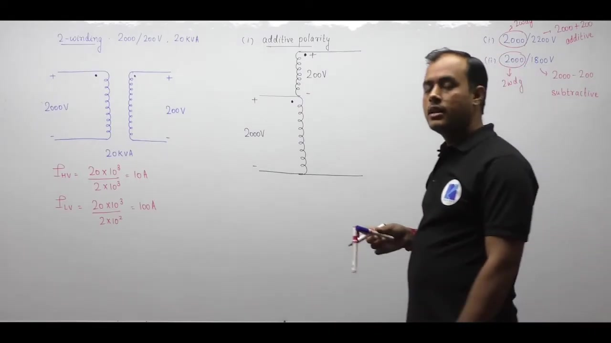

The $200\text{ V}$ winding carries its rated current of $100\text{ A}$ leaving the dot toward the load. Standard transformer action requires $10\text{ A}$ to enter the dot of the $2000\text{ V}$ winding.

Applying Kirchhoff's Current Law at the junction gives the total input current:
$$I_{\text{in}} = 100\text{ A} + 10\text{ A} = 110\text{ A}$$

The apparent power rating of the autotransformer is:
$$S_{\text{auto}} = 2200\text{ V} \times 100\text{ A} = 220000\text{ VA} = 220\text{ kVA}$$

Alternatively, calculate from the input side:
$$S_{\text{auto}} = 2000\text{ V} \times 110\text{ A} = 220\text{ kVA}$$

We can also verify this result using the transformation ratio:
$$a_{\text{auto}} = \frac{2200\text{ V}}{2000\text{ V}} = 1.1$$

Using the direct formula:
$$S_{\text{auto}} = \frac{S_{\text{2-wdg}}}{1 - \frac{1}{a_{\text{auto}}}} = \frac{20\text{ kVA}}{1 - \frac{1}{1.1}} = 220\text{ kVA}$$

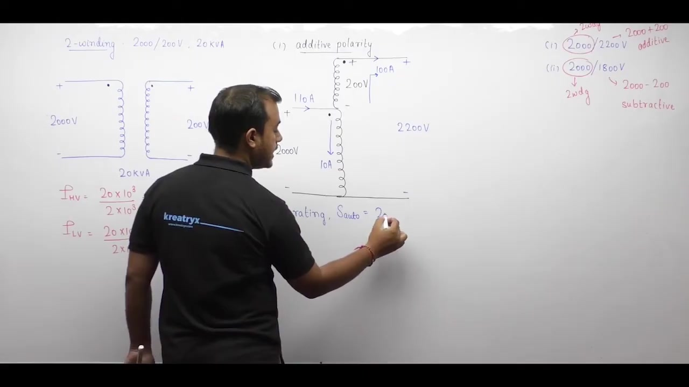

### Efficiency Calculation at Full Load Unity Power Factor

The original two-winding transformer has an efficiency of $98\%$ at full load unity power factor. We use this value to find the total losses:
$$0.98 = \frac{20 \times 1}{20 \times 1 + P_{\text{loss}}}$$

Rearranging to solve for $P_{\text{loss}}$:
$$P_{\text{loss}} = \frac{20}{0.98} - 20 = \frac{20}{49}\text{ kW} \approx 0.4082\text{ kW}$$

In the autotransformer, the winding voltages and currents remain at their rated values. The total losses therefore remain unchanged at $\frac{20}{49}\text{ kW}$.

The new full load rating is $220\text{ kVA}$. The efficiency of the autotransformer at full load unity power factor is:
$$\eta_{\text{auto}} = \frac{220 \times 1}{220 \times 1 + \frac{20}{49}} \times 100\% \approx 99.81\%$$

> [!success] Additive Polarity Outcome
> Reconnecting the $20\text{ kVA}$ transformer into a $2000/2200\text{ V}$ autotransformer increases the rating to $220\text{ kVA}$. The efficiency increases from $98\%$ to $99.81\%$.

## Problem Solution: Load-Specified Case and Subtractive Polarity (2000/1800 V)
_(36:35 - 42:36)_

### Current Calculation with a Specified Load

Suppose the problem specifies that the autotransformer supplies a $110\text{ kVA}$ load at $2200\text{ V}$. In this situation, do not use the full rated currents. Instead, compute the actual operating currents from the load demand.

The load current on the $2200\text{ V}$ side is:
$$I_H = \frac{110 \times 10^3\text{ VA}}{2200\text{ V}} = 50\text{ A}$$

The apparent power must balance across both sides:
$$2000\text{ V} \times I_L = 2200\text{ V} \times I_H$$

Solving for the low-voltage current gives:
$$I_L = 1.1 \times 50\text{ A} = 55\text{ A}$$

Applying Kirchhoff's Current Law at the common junction gives the current in the common winding:
$$I_{\text{common}} = I_L - I_H = 55\text{ A} - 50\text{ A} = 5\text{ A}$$

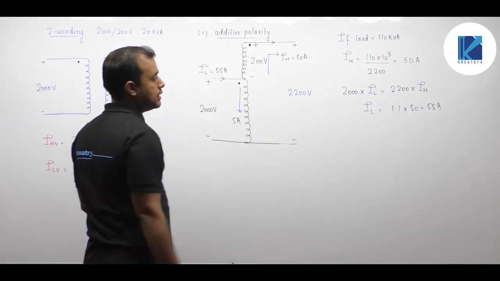

### Subtractive Polarity Connection for Part 2

Now consider part 2 with the $2000/1800\text{ V}$ rating. The voltage $1800\text{ V}$ is obtained by subtracting $200\text{ V}$ from $2000\text{ V}$.

To subtract voltages, connect terminals of identical polarity together. In dot notation, connect the dotted terminal of the primary winding to the dotted terminal of the secondary winding.

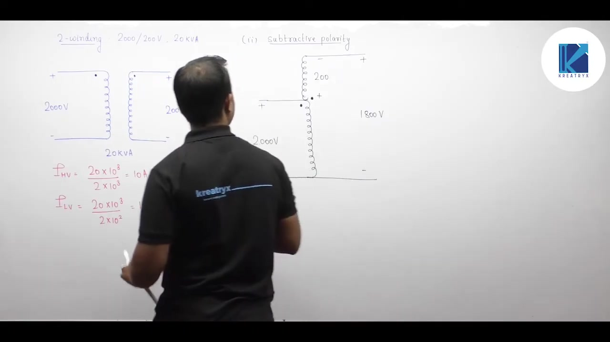

Applying Kirchhoff's Voltage Law across the series combination yields the secondary voltage:
$$V_L = 2000\text{ V} - 200\text{ V} = 1800\text{ V}$$

Because no specific load is given for this part, we use the rated currents of the two-winding transformer.

### Current Distribution and kVA Rating in Subtractive Polarity

The $200\text{ V}$ winding carries its rated current of $100\text{ A}$ flowing toward the load. This current enters the dotted terminal.

Transformer action requires that current must leave the dotted terminal in the other winding. Therefore, $10\text{ A}$ leaves the dotted terminal of the $2000\text{ V}$ winding.

Applying Kirchhoff's Current Law at the common node gives the source current:
$$I_{\text{source}} = 100\text{ A} - 10\text{ A} = 90\text{ A}$$

We can calculate the autotransformer apparent power from the output side:
$$S_{\text{auto}} = 1800\text{ V} \times 100\text{ A} = 180000\text{ VA} = 180\text{ kVA}$$

Alternatively, calculate from the input side:
$$S_{\text{auto}} = 2000\text{ V} \times 90\text{ A} = 180\text{ kVA}$$

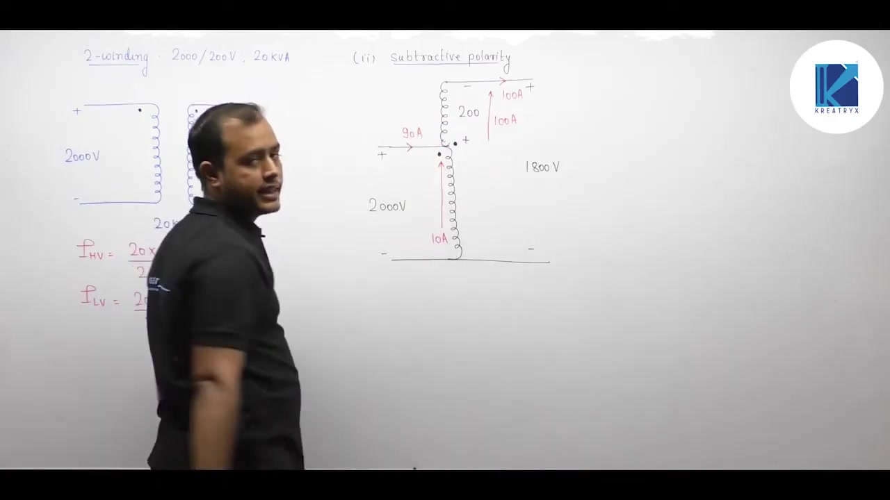

The power transferred by magnetic induction equals the two-winding rating:
$$S_{\text{trans}} = S_{\text{2-wdg}} = 20\text{ kVA}$$

The conducted power is found by subtraction:
$$S_{\text{cond}} = S_{\text{auto}} - S_{\text{trans}} = 180\text{ kVA} - 20\text{ kVA} = 160\text{ kVA}$$

> [!info] Calculation Constraint
> Do not apply the direct formula method using $a_{\text{auto}}$ to subtractive polarity. That shortcut is valid only for additive polarity. Always find subtractive polarity ratings using actual voltage and current values.

## Subtractive Efficiency and Conversion Summary
_(42:39 - 47:20)_

### Efficiency Calculation for Subtractive Polarity

In the subtractive configuration, the transformer operates at a rated capacity of $180\text{ kVA}$. The physical losses remain unchanged at $\frac{20}{49}\text{ kW}$.

At full load unity power factor, the operating efficiency is:
$$\eta_{\text{auto}} = \frac{180 \times 1}{180 \times 1 + \frac{20}{49}} \times 100\% \approx 99.77\%$$

This value is significantly higher than the original two-winding efficiency of $98\%$.

Both additive and subtractive polarities increase the power rating and the operating efficiency. The additive connection yields a larger increase because its voltage rating is higher.

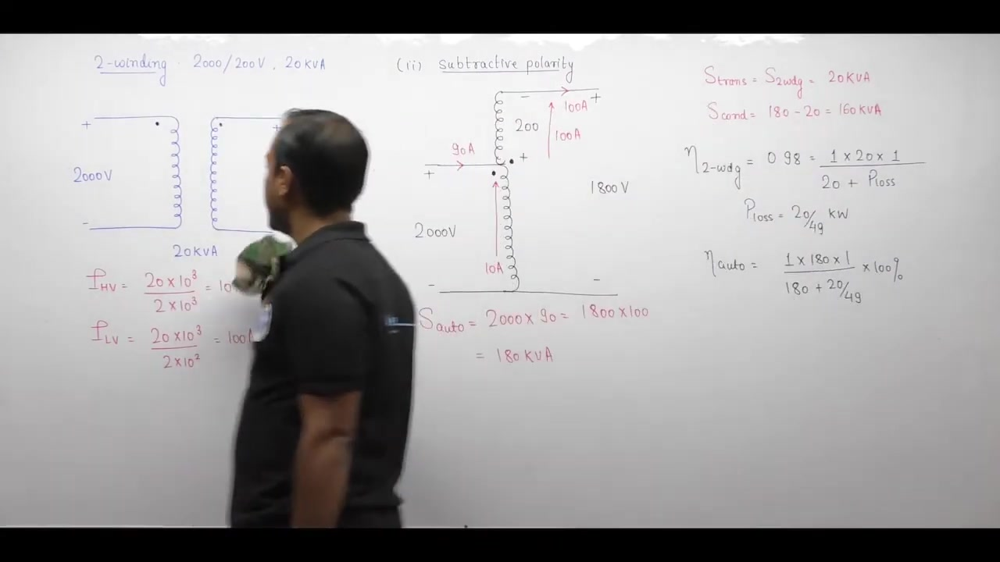

### Summary of Additive Polarity Rules

In additive polarity, connect a dotted terminal to an undotted terminal. The terminal voltages add together.

The key equations for additive polarity are:
$$S_{\text{auto}} = \frac{S_{\text{2-wdg}}}{1 - \frac{1}{a_{\text{auto}}}}$$

The transformed and conducted power components are:
$$S_{\text{trans}} = S_{\text{2-wdg}}$$
$$S_{\text{cond}} = S_{\text{auto}} - S_{\text{trans}}$$

Use the rated currents of the two-winding transformer if the load is not specified. Use the load current if the load is specified. Assume losses remain constant when calculating efficiency.

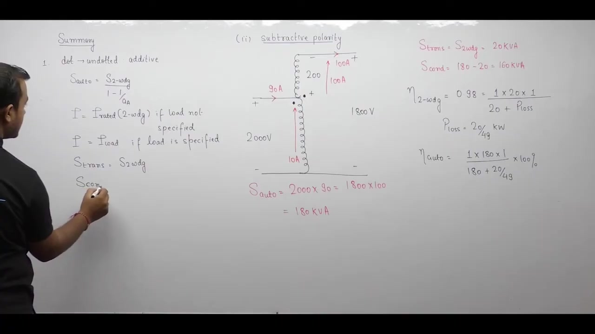

### Summary of Subtractive Polarity Rules

In subtractive polarity, connect a dotted terminal to a dotted terminal. Alternatively, connect an undotted terminal to an undotted terminal. The terminal voltages subtract from each other.

Determine the kVA rating using actual circuit currents. Choose current directions so that the source delivers power and the load absorbs power.

> [!info] Operational Summary
> 1. In both polarities, transformed power equals the two-winding rating: $S_{\text{trans}} = S_{\text{2-wdg}}$.
> 2. In both polarities, conducted power is: $S_{\text{cond}} = S_{\text{auto}} - S_{\text{trans}}$.
> 3. Never use the direct transformation ratio formula for subtractive polarity.
> 4. To identify the connection type, check if the autotransformer voltage is the sum or difference of the two-winding ratings.

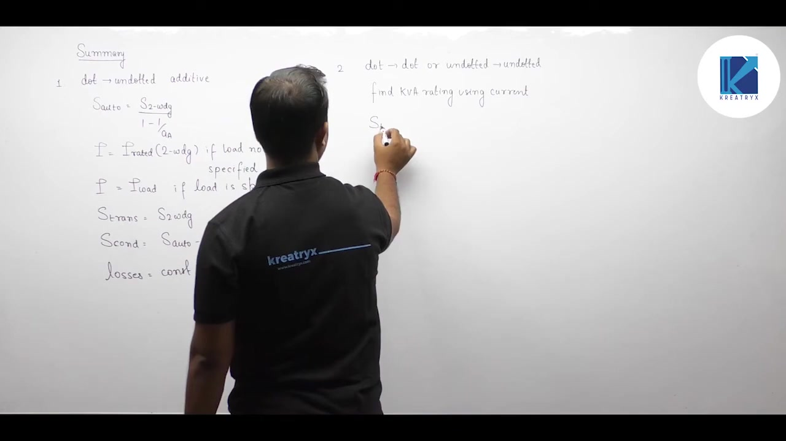

## Autotransformer Parameters and Equivalent Circuit Setup
_(47:32 - 53:19)_

### Two-Winding Equivalent Circuit Parameters

To determine the parameters of an autotransformer, consider the equivalent circuit of the original two-winding transformer. We refer all quantities to the secondary winding and ignore the shunt magnetizing branch.

Let the turns ratio be $N_1 : N_2$. The primary induced voltage is $E_1$, which equals terminal voltage $V_1$. The secondary induced voltage is $E_2$.

The equivalent resistance referred to the secondary is $R_{02}$. The equivalent leakage reactance is $X_{02}$.

The base impedance on the secondary side is:
$$Z_{\text{base, 2-wdg}} = \frac{E_2}{I_2}$$

The per-unit impedance of the two-winding transformer is:
$$Z_{\text{pu, 2-wdg}} = \frac{R_{02} + j X_{02}}{Z_{\text{base, 2-wdg}}} = \frac{R_{02} + j X_{02}}{E_2 / I_2}$$

The voltage regulation at power factor angle $\phi$ is:
$$\text{VR}_{\text{2-wdg}} = \frac{I_2 R_{02} \cos \phi + I_2 X_{02} \sin \phi}{E_2}$$

The per-unit full load copper loss equals the per-unit resistance:
$$P_{\text{cu, pu, 2-wdg}} = R_{\text{pu, 2-wdg}} = \frac{R_{02}}{Z_{\text{base, 2-wdg}}}$$

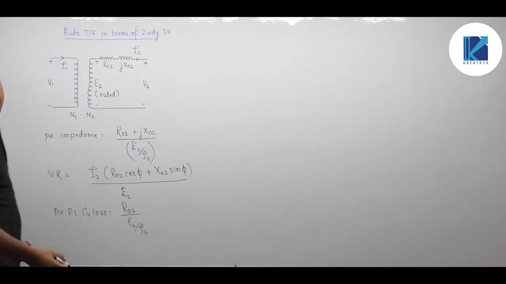

### Additive Polarity Autotransformer Ratings

Now reconnect these two windings in series additive polarity. In this analysis, we focus specifically on additive polarity.

The current in winding 1 remains at its rated value $I_1$. The current in winding 2 remains at its rated value $I_2$. The common terminal carries current $I_1 + I_2$.

The rated voltage on the high-voltage side is the sum of both winding voltages:
$$V_{H,\text{rated}} = V_1 + E_2$$

The low-voltage winding operates at voltage $V_1$. The auto transformation ratio is:
$$a_{\text{auto}} = \frac{V_{H,\text{rated}}}{V_{L,\text{rated}}} = \frac{V_1 + E_2}{V_1} = 1 + \frac{E_2}{V_1}$$

Because $E_2 / V_1 = N_2 / N_1$, we obtain:
$$a_{\text{auto}} = 1 + \frac{N_2}{N_1}$$

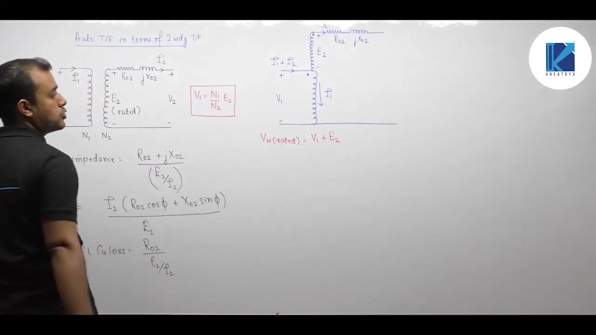

### Setting Up the New Per-Unit Impedance

The physical resistance and leakage reactance of the windings do not change. The actual impedance referred to the secondary winding remains $R_{02} + j X_{02}$.

However, the rated voltage on this side has increased to $V_1 + E_2$. The rated current on this side remains $I_2$.

The new base impedance for the autotransformer on the secondary side is:
$$Z_{\text{base, auto}} = \frac{V_1 + E_2}{I_2}$$

We can express $V_1 + E_2$ in terms of $E_2$ and the turns ratio:
$$V_1 + E_2 = \left(1 + \frac{N_1}{N_2}\right) E_2$$

The new base impedance becomes:
$$Z_{\text{base, auto}} = \left(1 + \frac{N_1}{N_2}\right) \frac{E_2}{I_2} = \left(1 + \frac{N_1}{N_2}\right) Z_{\text{base, 2-wdg}}$$

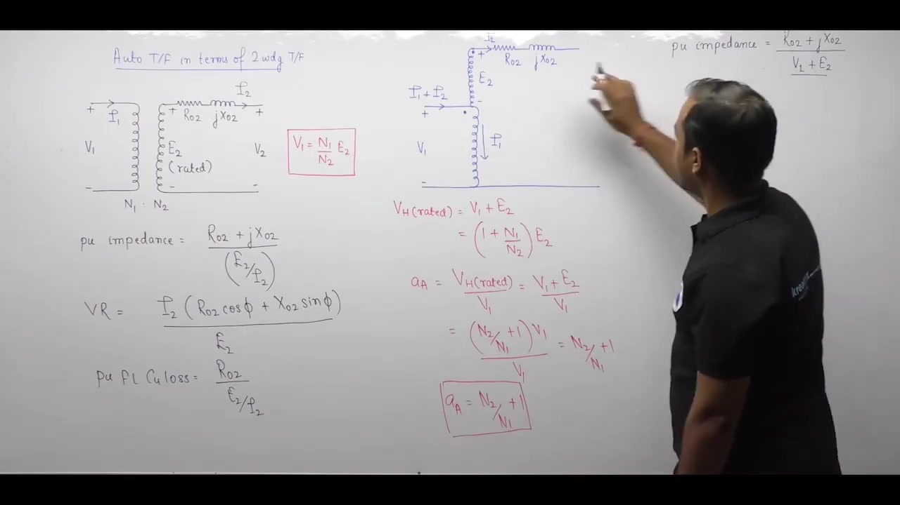

Because the base impedance increases, the per-unit impedance must change.

## Scaling of Per-Unit Impedance and Voltage Regulation
_(53:22 - 59:23)_

### Derivation of Per-Unit Impedance Scaling Factor

We can now express the per-unit impedance of the autotransformer in terms of the original two-winding value. Recall the ratio:
$$Z_{\text{pu, auto}} = \frac{R_{02} + j X_{02}}{\left(1 + \frac{N_1}{N_2}\right) Z_{\text{base, 2-wdg}}} = \frac{Z_{\text{pu, 2-wdg}}}{1 + \frac{N_1}{N_2}}$$

From the auto transformation ratio definition:
$$a_{\text{auto}} = 1 + \frac{N_2}{N_1} \implies \frac{N_2}{N_1} = a_{\text{auto}} - 1$$

Inverting this relation gives:
$$\frac{N_1}{N_2} = \frac{1}{a_{\text{auto}} - 1}$$

Now substitute this expression into the denominator:
$$1 + \frac{N_1}{N_2} = 1 + \frac{1}{a_{\text{auto}} - 1} = \frac{a_{\text{auto}}}{a_{\text{auto}} - 1} = \frac{1}{1 - \frac{1}{a_{\text{auto}}}}$$

Substituting back into the per-unit impedance expression yields:
$$Z_{\text{pu, auto}} = \left(1 - \frac{1}{a_{\text{auto}}}\right) Z_{\text{pu, 2-wdg}}$$

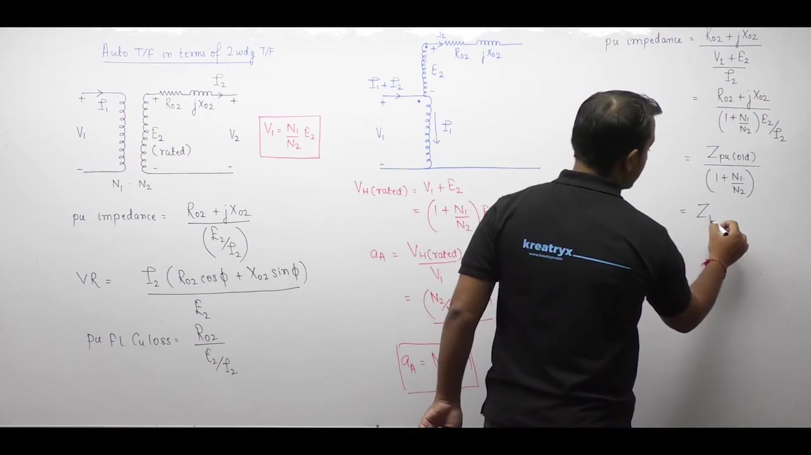

> [!success] Per-Unit Impedance Rule
> The per-unit impedance of an autotransformer equals the per-unit impedance of the two-winding transformer scaled by $(1 - 1/a_{\text{auto}})$.

The actual ohmic impedance of the transformer remains unchanged. Because the rated voltage increases, the base impedance increases. This change in base impedance scales down the per-unit impedance.

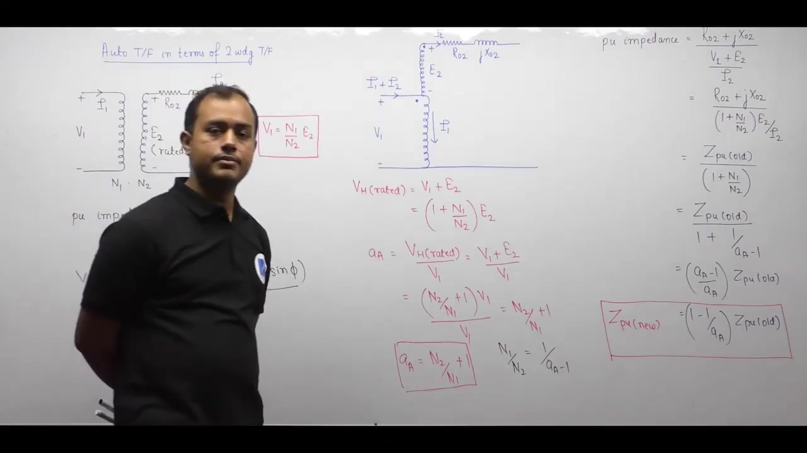

### Scaling of Voltage Regulation

Next, consider the voltage regulation of the autotransformer. The voltage drop across the series impedance remains $I_2 R_{02} \cos \phi + I_2 X_{02} \sin \phi$.

However, the rated voltage in the denominator is now $V_1 + E_2$:
$$\text{VR}_{\text{auto}} = \frac{I_2 R_{02} \cos \phi + I_2 X_{02} \sin \phi}{V_1 + E_2}$$

Substitute $V_1 + E_2 = (1 + N_1 / N_2) E_2$ into the expression:
$$\text{VR}_{\text{auto}} = \frac{\text{VR}_{\text{2-wdg}}}{1 + \frac{N_1}{N_2}}$$

Using our earlier algebraic identity gives:
$$\text{VR}_{\text{auto}} = \left(1 - \frac{1}{a_{\text{auto}}}\right) \text{VR}_{\text{2-wdg}}$$

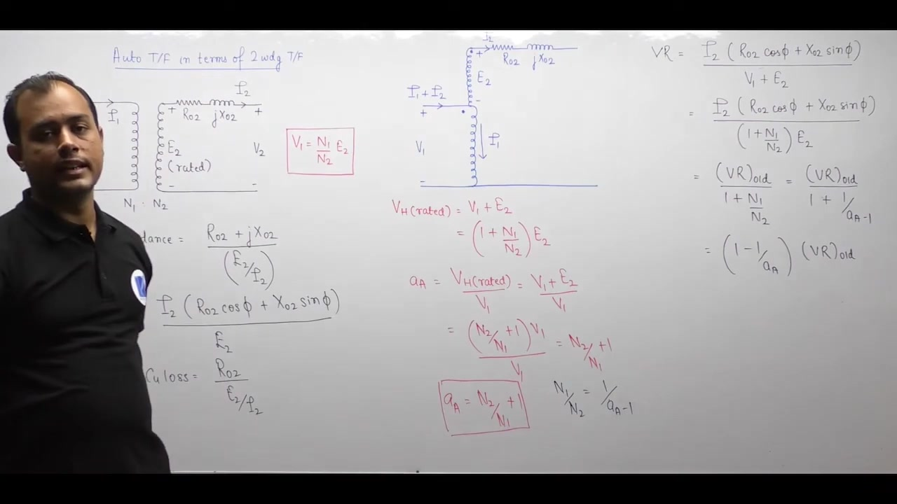

We can also understand this result from per-unit quantities. Voltage regulation is defined as:
$$\text{VR} = R_{\text{pu}} \cos \phi + X_{\text{pu}} \sin \phi$$

Both $R_{\text{pu}}$ and $X_{\text{pu}}$ scale down by the factor $(1 - 1/a_{\text{auto}})$. The per-unit voltage drop and voltage regulation therefore scale down by this exact same factor. Because $a_{\text{auto}} > 1$, the factor is less than unity. Voltage regulation is therefore improved in an autotransformer.

## Scaling of Losses, Fault Current, and Parameter Summary
_(59:27 - 66:18)_

### Scaling of Per-Unit Copper Loss and Reactance

Recall that per-unit full load copper loss equals per-unit resistance $R_{\text{pu}}$. Because $R_{\text{pu}}$ scales by $(1 - 1/a_{\text{auto}})$, the new per-unit copper loss is:
$$P_{\text{cu, pu, auto}} = \left(1 - \frac{1}{a_{\text{auto}}}\right) P_{\text{cu, pu, 2-wdg}}$$

The per-unit leakage reactance scales by the same factor:
$$X_{\text{pu, auto}} = \left(1 - \frac{1}{a_{\text{auto}}}\right) X_{\text{pu, 2-wdg}}$$

The actual copper loss in watts remains constant. The per-unit copper loss decreases because the base kVA rating is much higher.

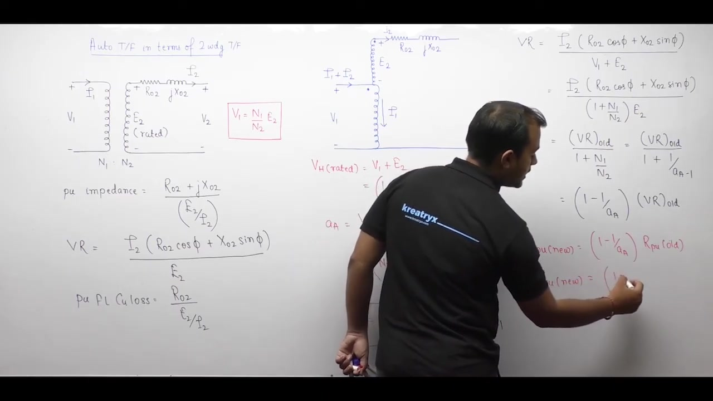

### Scaling of Per-Unit Core Loss

Now examine the per-unit core loss. In the two-winding transformer, per-unit core loss is:
$$P_{i,\text{pu, 2-wdg}} = \frac{P_i}{S_{\text{2-wdg}}}$$

In the autotransformer, the core loss in watts $P_i$ remains unchanged. However, the base apparent power is now $S_{\text{auto}}$:
$$P_{i,\text{pu, auto}} = \frac{P_i}{S_{\text{auto}}}$$

Substitute $S_{\text{auto}} = \frac{S_{\text{2-wdg}}}{1 - 1/a_{\text{auto}}}$ into this expression:
$$P_{i,\text{pu, auto}} = \left(1 - \frac{1}{a_{\text{auto}}}\right) \frac{P_i}{S_{\text{2-wdg}}} = \left(1 - \frac{1}{a_{\text{auto}}}\right) P_{i,\text{pu, 2-wdg}}$$

The per-unit core loss also scales down by the factor $(1 - 1/a_{\text{auto}})$. The actual core loss in watts remains identical.

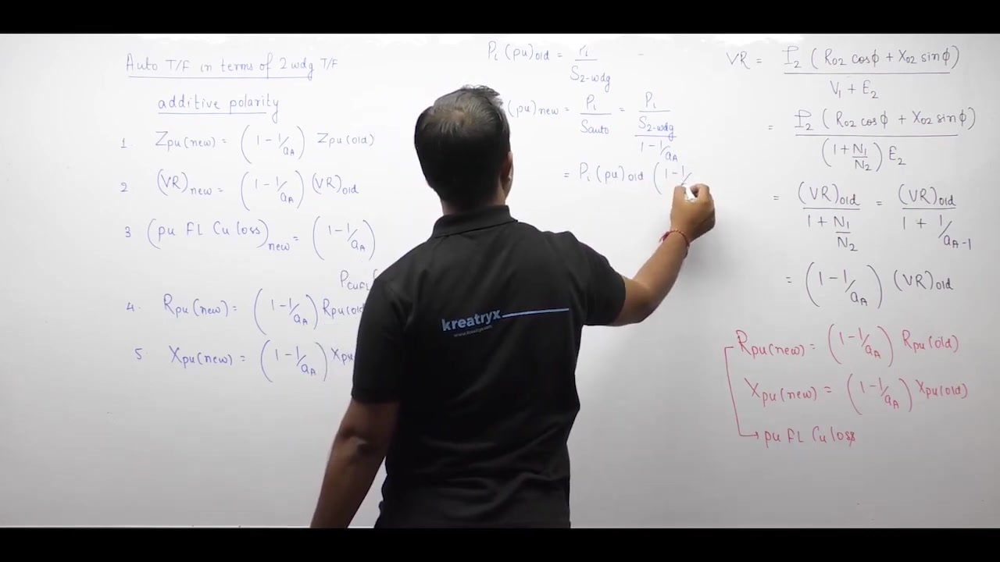

### Short-Circuit Current and Fault Severity

Consider the symmetrical short-circuit current in per-unit. Neglecting system impedance and assuming rated terminal voltage, the fault current is:
$$I_{\text{sc, pu}} = \frac{1}{Z_{\text{pu}}}$$

For the autotransformer, substitute the scaled per-unit impedance:
$$I_{\text{sc, pu, auto}} = \frac{1}{Z_{\text{pu, auto}}} = \frac{1}{\left(1 - \frac{1}{a_{\text{auto}}}\right) Z_{\text{pu, 2-wdg}}}$$

This gives the relation:
$$I_{\text{sc, pu, auto}} = \frac{I_{\text{sc, pu, 2-wdg}}}{1 - \frac{1}{a_{\text{auto}}}}$$

Because $(1 - 1/a_{\text{auto}}) < 1$, the per-unit short-circuit current is higher in an autotransformer. This increased fault current is a primary disadvantage. Higher short-circuit currents impose severe mechanical stresses on the windings during faults.

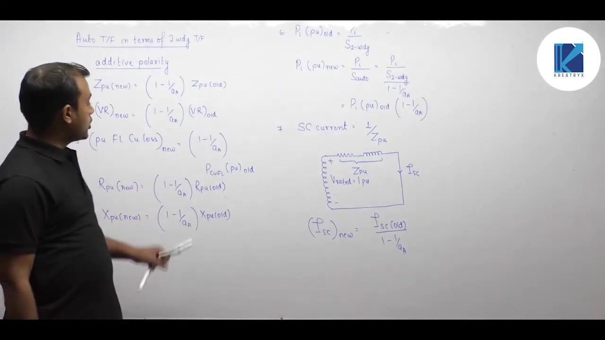

### Comprehensive Summary and Conditions of Validity

We can now summarize all parameter scaling relations for the autotransformer.

| Parameter | Two-Winding Value | Autotransformer Value | Scaling Factor |
| :--- | :--- | :--- | :--- |
| Apparent Power Rating | $S_{\text{2-wdg}}$ | $S_{\text{auto}}$ | $\frac{1}{1 - 1/a_{\text{auto}}}$ |
| Per-Unit Impedance | $Z_{\text{pu, 2-wdg}}$ | $Z_{\text{pu, auto}}$ | $1 - 1/a_{\text{auto}}$ |
| Voltage Regulation | $\text{VR}_{\text{2-wdg}}$ | $\text{VR}_{\text{auto}}$ | $1 - 1/a_{\text{auto}}$ |
| Per-Unit Full Load Copper Loss | $P_{\text{cu, pu, 2-wdg}}$ | $P_{\text{cu, pu, auto}}$ | $1 - 1/a_{\text{auto}}$ |
| Per-Unit Core Loss | $P_{i,\text{pu, 2-wdg}}$ | $P_{i,\text{pu, auto}}$ | $1 - 1/a_{\text{auto}}$ |
| Per-Unit Short-Circuit Current | $I_{\text{sc, pu, 2-wdg}}$ | $I_{\text{sc, pu, auto}}$ | $\frac{1}{1 - 1/a_{\text{auto}}}$ |

> [!info] Strict Conditions of Applicability
> These scaling formulas are valid only under two conditions:
> 1. The autotransformer is constructed from an existing two-winding transformer.
> 2. The interconnection is in additive polarity.

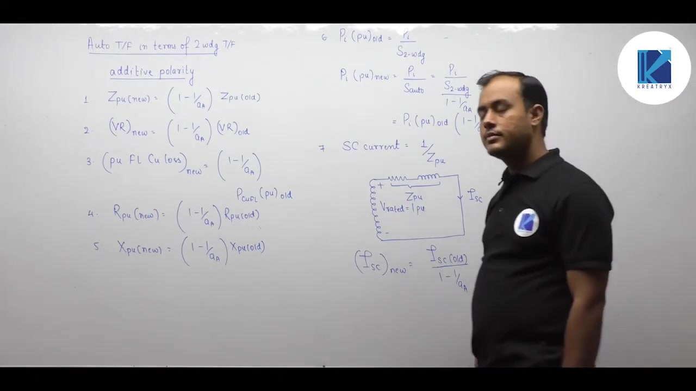

---

## Summary and Key Takeaways

- Connecting opposite polarity terminals yields additive polarity with output voltage $V_1 + V_2$, while connecting identical polarity terminals yields subtractive polarity with output voltage $V_1 - V_2$.
- The power transferred by electromagnetic induction in an autotransformer always equals the original two-winding transformer apparent power rating: $S_{\text{trans}} = S_{\text{2-wdg}}$.
- In additive polarity, the total apparent power rating increases to $S_{\text{auto}} = \frac{S_{\text{2-wdg}}}{1 - 1/a_{\text{auto}}}$, where $a_{\text{auto}} = \frac{V_H}{V_L} = 1 + \frac{N_2}{N_1}$.
- Because actual winding voltages and currents remain at their original rated values, physical core and copper losses remain constant, causing operating efficiency to increase significantly.
- Whether an autotransformer functions as step-up or step-down depends strictly on source and load connections and is completely independent of additive or subtractive polarity.
- For subtractive polarity, do not use the direct transformation ratio formula; always calculate ratings and power values directly from terminal voltages and winding currents.
- In additive polarity, per-unit impedance, voltage regulation, per-unit copper loss, and per-unit core loss all scale by the factor $(1 - 1/a_{\text{auto}})$.
- Per-unit short-circuit current increases by the factor $\frac{1}{1 - 1/a_{\text{auto}}}$, which increases fault severity and mechanical stress during short circuits.

