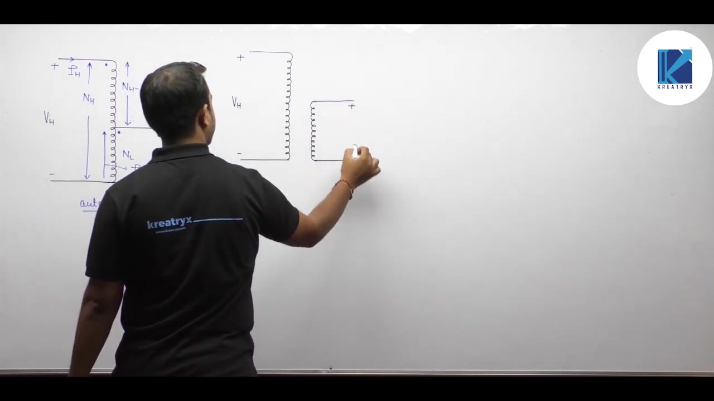
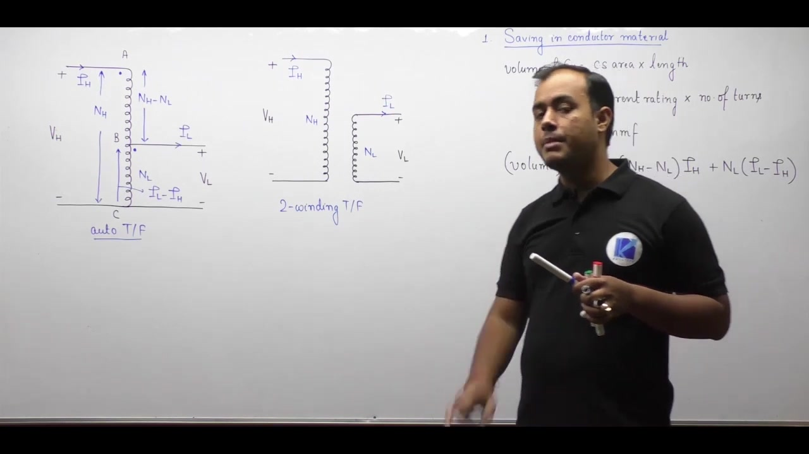
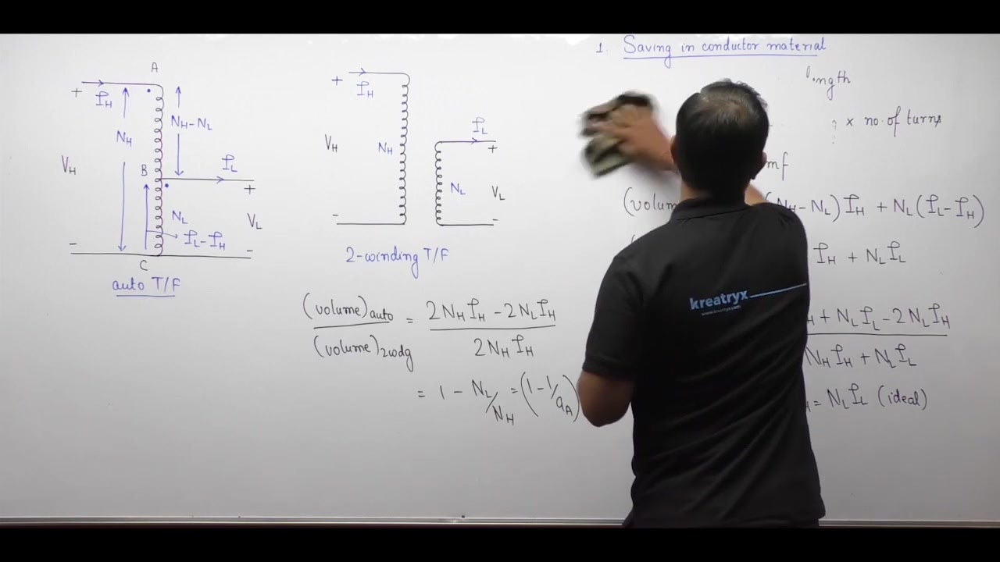
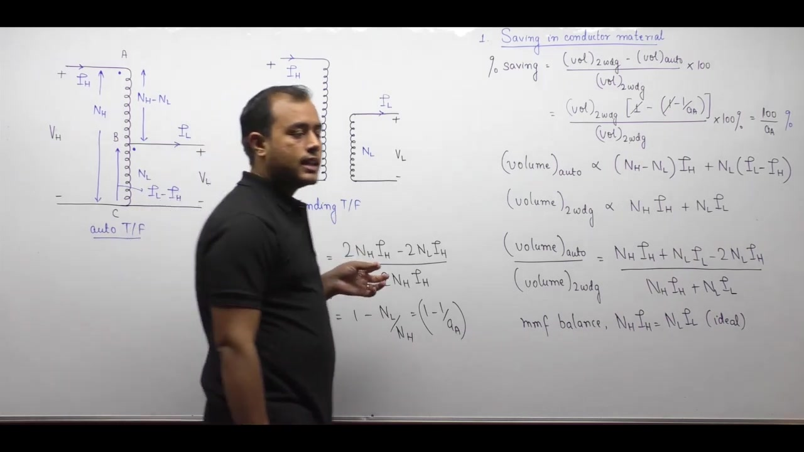
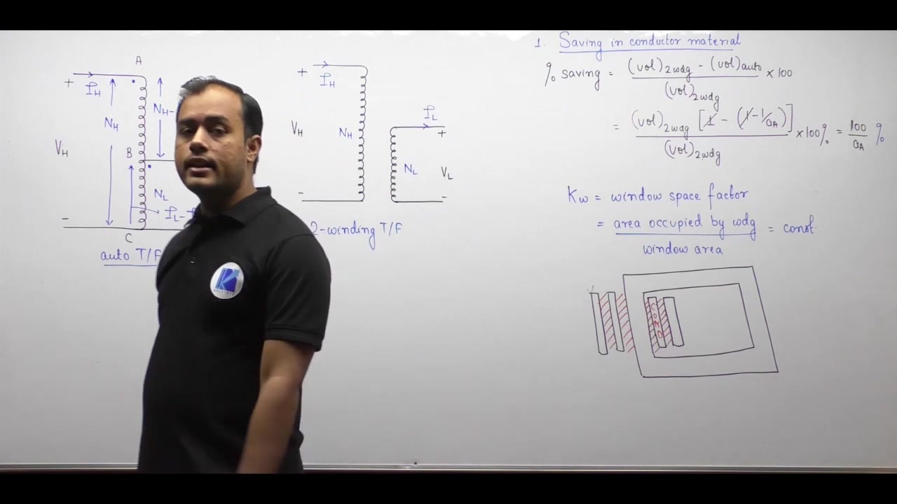
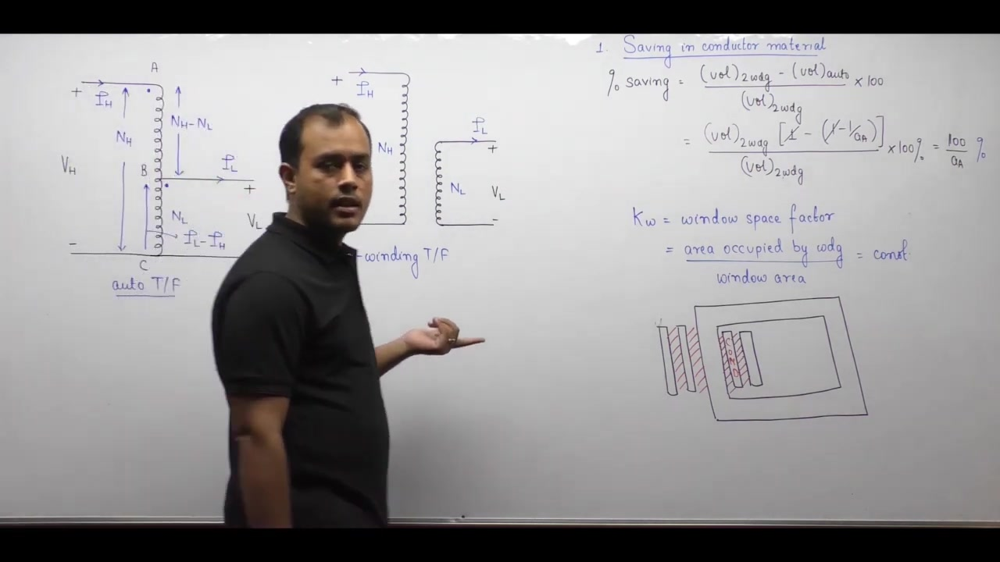
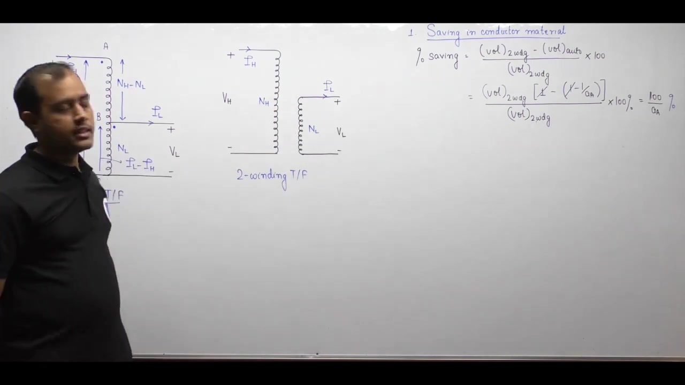
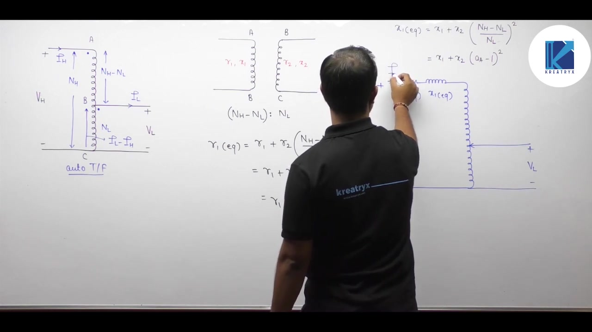
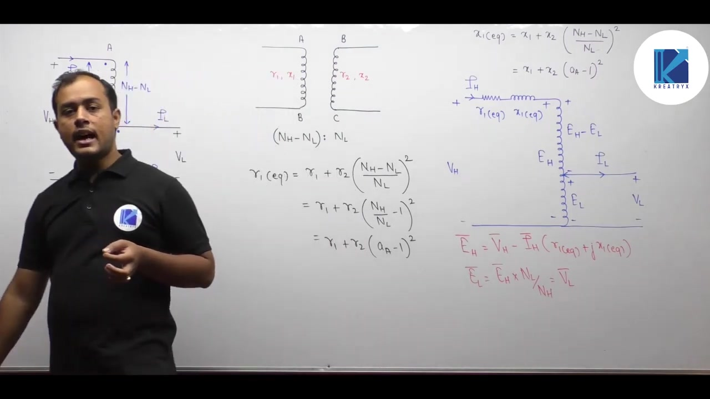
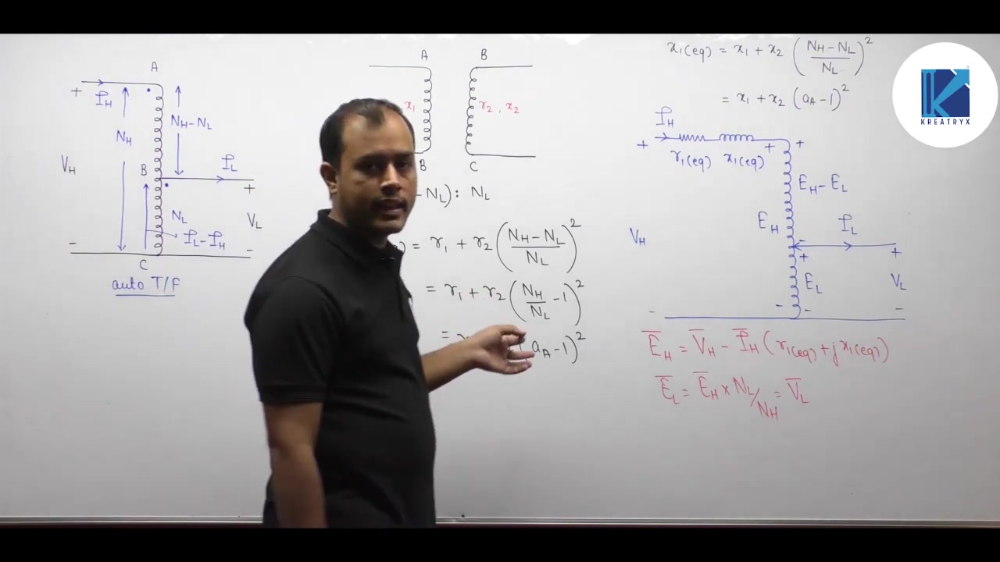

[← Lec 033: Auto Transformer in Hindi 2](Lecture_033_Auto_Transformer_in_Hindi_2.md) | [🏠 Index](00_yt_study_guide.md) | [Lec 035: Problems based on Auto Transformer →](Lecture_035_Problems_based_on_Auto_Transformer.md)

---

# Electrical Machines | Lec 24 | Auto Transformer in Hindi - 3| GATE Electrical Engineering Lecture

- **Source**: https://www.youtube.com/watch?v=zSCNNJFrVvA
- **Duration**: 00:33:38
- **Compiled**: 2026-09-20

---

## Overview

This lecture compares an autotransformer with a two-winding transformer designed for the exact same voltage and power rating. We derive the reduction in conductor material and explain how this saving scales with the auto transformation ratio. The discussion shows how smaller winding volumes reduce core dimensions, lower total operating losses, and improve electrical efficiency. We examine key operational limitations including the loss of galvanic isolation and high fault currents. Finally we develop the equivalent circuit referred to the series winding and highlight practical applications in power grids, motor starters, and laboratory supplies.

## Contents

- [[#Comparison with Two-Winding Transformer of Same Rating|Comparison with Two-Winding Transformer of Same Rating]]
- [[#Conductor Material Savings and Window Dimensions|Conductor Material Savings and Window Dimensions]]
- [[#Core Savings, Losses, and Efficiency Comparison|Core Savings, Losses, and Efficiency Comparison]]
- [[#Leakage Reactance and Disadvantages of Autotransformers|Leakage Reactance and Disadvantages of Autotransformers]]
- [[#Equivalent Circuit and Initial Applications|Equivalent Circuit and Initial Applications]]
- [[#Motor Starters, Variacs, and Summary|Motor Starters, Variacs, and Summary]]

---

## Comparison with Two-Winding Transformer of Same Rating
_(00:13 - 07:18)_

We now compare an autotransformer with a two-winding transformer. Both units have identical voltage and power ratings. In earlier lectures, we converted a single two-winding unit into an autotransformer. Here the premise is different. We consider two distinct machines designed for the exact same operating duty. Both have high voltage $V_H$ and low voltage $V_L$. Both deliver rated current $I_L$ on the low-voltage side and draw rated current $I_H$ on the high-voltage side.

### Basis of Comparison

We assume both transformers operate at the same flux density and the same current density. The autotransformer uses additive polarity. Its series winding carries current $I_H$. Its common winding carries current $(I_L - I_H)$. The two-winding transformer has two independent windings. Its primary winding carries current $I_H$ through $N_H$ turns. Its secondary winding carries current $I_L$ through $N_L$ turns.

### Conductor Volume and MMF Relationship

The amount of conductor material relates directly to copper volume. Wire volume equals length multiplied by cross-sectional area:

$$\text{Volume} = l \times a$$

The total length of wire $l$ depends on the number of turns $N$ and mean turn length $l_{\text{mean}}$:

$$l = N \times l_{\text{mean}}$$

The cross-sectional area $a$ depends on rated current $I$ and current density $J$:

$$a = \frac{I}{J}$$

Current density $J$ and mean turn length $l_{\text{mean}}$ are constant for both designs. Therefore the volume of any winding is proportional to the product of turns and current:

$$\text{Volume} \propto N \cdot I$$

The product $N \cdot I$ represents the magnetic potential or MMF of the winding. Conductor volume is therefore directly proportional to the rated MMF of the winding.

### Conductor Volume Expressions

We determine the total conductor volume by summing the volume of each winding section. We add physical volumes directly. The relative direction of magnetic flux does not affect material volume.

For the two-winding transformer, each winding has its own copper volume:

$$\text{Volume}_{\text{2-wdg}} \propto N_H I_H + N_L I_L$$

For an ideal transformer, the ampere-turns balance:

$$N_H I_H = N_L I_L$$

We express the total copper volume of the two-winding unit as:

$$\text{Volume}_{\text{2-wdg}} \propto 2 N_H I_H$$

The autotransformer has two parts. The series section has $(N_H - N_L)$ turns carrying current $I_H$. The common section has $N_L$ turns carrying current $(I_L - I_H)$. We add their individual copper volumes:

$$\text{Volume}_{\text{auto}} \propto (N_H - N_L) I_H + N_L (I_L - I_H)$$

We now take the ratio of copper volume in the autotransformer to copper volume in the two-winding transformer:

$$\frac{\text{Volume}_{\text{auto}}}{\text{Volume}_{\text{2-wdg}}} = \frac{(N_H - N_L) I_H + N_L (I_L - I_H)}{2 N_H I_H}$$

The proportionality constants cancel out in this ratio. This expression forms the foundation for calculating copper savings.

## Conductor Material Savings and Window Dimensions
_(07:21 - 13:59)_

We now simplify the conductor volume ratio between the autotransformer and the two-winding transformer. This derivation reveals how much conductor material is saved. It also shows how the auto transformation ratio governs this saving.

### Derivation of Conductor Volume Ratio

We start from the conductor volume expressions of both transformers. The ratio of volumes is:

$$\frac{V_{\text{auto}}}{V_{\text{2w}}} = \frac{(N_H - N_L) I_H + N_L (I_L - I_H)}{2 N_H I_H}$$

Here $V_{\text{auto}}$ is the copper volume of the autotransformer. $V_{\text{2w}}$ is the copper volume of the two-winding unit. We expand the terms in the numerator:

$$(N_H - N_L) I_H + N_L (I_L - I_H) = N_H I_H - N_L I_H + N_L I_L - N_L I_H$$

We group the terms together:

$$\text{Numerator} = N_H I_H + N_L I_L - 2 N_L I_H$$

For an ideal transformer, the ampere-turns balance gives $N_L I_L = N_H I_H$. We substitute this into the numerator:

$$\text{Numerator} = 2 N_H I_H - 2 N_L I_H$$

Now we substitute this back into the volume ratio:

$$\frac{V_{\text{auto}}}{V_{\text{2w}}} = \frac{2 N_H I_H - 2 N_L I_H}{2 N_H I_H} = 1 - \frac{N_L}{N_H}$$

The ratio $N_H / N_L$ is the auto transformation ratio $a_{\text{auto}}$. Therefore $N_L / N_H$ equals $1 / a_{\text{auto}}$.

> [!success] Result
> The conductor volume ratio between an autotransformer and a two-winding transformer of identical rating is:
> $$\frac{V_{\text{auto}}}{V_{\text{2w}}} = 1 - \frac{1}{a_{\text{auto}}}$$

### Percentage Saving in Conductor Material

The saving in conductor material equals the difference in volume divided by the reference volume:

$$\text{Fractional Saving} = \frac{V_{\text{2w}} - V_{\text{auto}}}{V_{\text{2w}}}$$

We substitute the relation $V_{\text{auto}} = \left(1 - \frac{1}{a_{\text{auto}}}\right) V_{\text{2w}}$:

$$\text{Fractional Saving} = \frac{V_{\text{2w}} - \left(1 - \frac{1}{a_{\text{auto}}}\right)V_{\text{2w}}}{V_{\text{2w}}}$$

Factoring out the two-winding volume gives:

$$\text{Fractional Saving} = 1 - \left(1 - \frac{1}{a_{\text{auto}}}\right) = \frac{1}{a_{\text{auto}}}$$

We express this saving as a percentage:

$$\% \text{ Saving in Conductor Material} = \frac{100}{a_{\text{auto}}}\%$$

### Significance of the Transformation Ratio

The percentage saving depends inversely on the transformation ratio $a_{\text{auto}}$. By definition, $a_{\text{auto}} = V_H / V_L$. The high voltage is always greater than or equal to the low voltage. Therefore $a_{\text{auto}}$ is always greater than or equal to 1. It can never be less than unity.

When $a_{\text{auto}}$ is close to 1, the saving is very large. For instance, if $a_{\text{auto}} = 1.1$, the saving reaches nearly 91 percent. If $a_{\text{auto}} = 2$, the saving is 50 percent. But if $a_{\text{auto}}$ is large, say 10, the saving drops to only 10 percent. Thus, the autotransformer offers the greatest economic benefit when primary and secondary voltages are close.

### Window Area and Core Dimensions

A transformer core window accommodates both the copper conductors and their electrical insulation. The window space factor $K_w$ represents the ratio of copper area to window area:

$$K_w = \frac{A_{\text{cu}}}{A_w}$$

Designers keep this factor constant for a given voltage class. Because the autotransformer requires less copper volume, the winding occupies less cross-sectional space. So the core window area $A_w$ can be made smaller. Smaller window dimensions reduce the overall perimeter of the magnetic path. This directly reduces the weight and volume of the core.

## Core Savings, Losses, and Efficiency Comparison
_(14:02 - 18:23)_

Saving copper wire also leads to savings in core material. We now examine how window dimensions affect core size. We also analyze the resulting reduction in losses and the boost in efficiency.

### Core Material Savings

The window space in a transformer core houses both the copper conductors and their insulation. The total window area required depends on the combined volume of copper and insulating material. Because an autotransformer requires less copper, the winding bundle takes up less physical space.

So the core window dimensions can be made smaller. A smaller window area reduces the mean length of the magnetic path around the limbs and yokes. As the magnetic path shrinks, the total volume and weight of the core decrease. Therefore the autotransformer saves both copper and core steel. This dual saving cuts the overall material cost and makes the transformer more compact.

### Losses Comparison

A reduction in active materials directly lowers the electrical losses. Consider both copper and iron losses:

1. **Copper Loss ($P_{\text{cu}}$)**: Ohmic loss depends on the resistance of the windings. Winding resistance is proportional to conductor volume for a given current density. Since copper volume drops by $(1 - 1/a_{\text{auto}})$, the full-load copper loss is lower:

$$P_{\text{cu,auto}} = \left(1 - \frac{1}{a_{\text{auto}}}\right) P_{\text{cu,2w}}$$

2. **Core Loss ($P_i$)**: Hysteresis and eddy current losses depend directly on the volume and mass of the magnetic core. Because the core volume is smaller, core loss decreases:

$$P_{i,\text{auto}} < P_{i,\text{2w}}$$

Both loss components are lower than those of an equivalent two-winding transformer. So total operating losses drop substantially.

### Efficiency Comparison

Efficiency depends on the ratio of output power to total power:

$$\eta = \frac{P_{\text{out}}}{P_{\text{out}} + P_{\text{loss}}}$$

For the same rated output, total losses $P_{\text{loss}}$ are lower in an autotransformer. Hence the autotransformer achieves higher efficiency than a two-winding transformer of identical rating.

> [!success] Result
> An autotransformer has higher operating efficiency than a two-winding transformer in both comparison scenarios:
> 1. When converted from an existing two-winding transformer, losses stay the same while the kVA rating increases.
> 2. When designed from scratch for the same kVA rating, the rating stays the same while losses are lower.

In both design scenarios, the autotransformer yields higher efficiency.

## Leakage Reactance and Disadvantages of Autotransformers
_(18:42 - 26:09)_

Autotransformers exhibit superior electrical characteristics in several areas. Yet they also have distinct operational limitations. We now analyze their low leakage reactance and their three primary disadvantages.

### Leakage Flux and Leakage Reactance

In a two-winding transformer, separate physical coils sit with an insulating gap between them. Magnetic flux leaking through this gap creates leakage reactance. In an autotransformer, the series and common sections share a portion of the same continuous winding.

This direct physical sharing provides very tight magnetic coupling. Nearly all magnetic flux links both winding sections. So the leakage flux is tiny. The per-unit leakage reactance is much lower than that of a two-winding transformer.

### Major Disadvantages

Despite higher efficiency and lower material usage, the autotransformer has serious drawbacks. These drawbacks restrict its use in many power applications.

#### 1. Loss of Electrical Isolation

The most significant disadvantage is the lack of electrical isolation. A two-winding transformer provides complete galvanic isolation between primary and secondary circuits. In an autotransformer, the high-voltage and low-voltage circuits connect metallically.

Any electrical disturbance on the high-voltage line passes directly into the low-voltage network. High voltage surges or lightning strikes can reach connected load equipment without attenuation. Many industrial and consumer applications strictly require galvanic isolation for safety.

#### 2. Open-Circuit Hazard on the Low-Voltage Side

A severe danger arises in step-down duty if the common winding connection breaks or the load is removed. When the secondary circuit is open, no load current flows. Without current, no internal voltage drop occurs across the series winding.

The full high voltage $V_H$ then appears across the low-voltage terminals:

$$V_{\text{LV,open}} = V_H$$

If the load side is designed for $200\text{ V}$ and receives $2000\text{ V}$, the insulation will puncture immediately. This hazard creates severe electric shock risks and destroys connected equipment. So autotransformers require extra insulation on the low-voltage section. In step-up operation, this hazard does not occur because the input voltage is already low.

#### 3. Higher Short-Circuit Current

The per-unit leakage impedance of an autotransformer is much smaller than that of a two-winding unit:

$$z_{\text{auto}} = \left(1 - \frac{1}{a_{\text{auto}}}\right) z_{\text{2w}}$$

Because impedance is reduced, the symmetrical fault current during a short circuit is much higher:

$$I_{\text{sc,auto}} = \frac{1}{1 - \frac{1}{a_{\text{auto}}}} I_{\text{sc,2w}}$$

When $a_{\text{auto}}$ is close to 1, this short-circuit current reaches extremely large values. These high fault currents produce severe mechanical stresses and intense thermal heating. Protective switchgear must have higher interrupting capacity to clear faults safely.

### Economic Viability and Transformation Ratio

At high values of $a_{\text{auto}}$, material savings drop to $100 / a_{\text{auto}}$ percent. The economic savings become negligible, while the safety hazards remain. Therefore autotransformers are primarily used when the transformation ratio is near unity, typically $a_{\text{auto}} < 2$.

## Equivalent Circuit and Initial Applications
_(26:12 - 31:11)_

We now develop the equivalent circuit of an autotransformer. We treat the physical unit as an equivalent two-winding transformer. We also examine its practical use in power transmission grids and distribution feeders.

### Two-Winding Representation of Autotransformer

We can model any autotransformer by splitting it into two sections:

1. **Series winding**: Section AB with turns $N_{\text{se}} = N_H - N_L$. It has winding resistance $R_1$ and leakage reactance $X_1$.
2. **Common winding**: Section BC with turns $N_c = N_L$. It has winding resistance $R_2$ and leakage reactance $X_2$.

The effective turns ratio between these two sections is:

$$a' = \frac{N_H - N_L}{N_L} = \frac{N_H}{N_L} - 1 = a_{\text{auto}} - 1$$

### Referring Parameters to the Series Winding

Always refer circuit parameters to the side containing the series winding. We transfer resistance $R_2$ and reactance $X_2$ from the common winding to the series winding.

The equivalent resistance referred to the series side is:

$$R_{1,\text{eq}} = R_1 + \left(\frac{N_H - N_L}{N_L}\right)^2 R_2$$

We express this using the auto transformation ratio:

$$R_{1,\text{eq}} = R_1 + (a_{\text{auto}} - 1)^2 R_2$$

Similarly we refer the leakage reactance:

$$X_{1,\text{eq}} = X_1 + (a_{\text{auto}} - 1)^2 X_2$$

> [!success] Result
> Equivalent impedance referred to the series winding is:
> $$Z_{1,\text{eq}} = R_{1,\text{eq}} + j X_{1,\text{eq}} = [R_1 + (a_{\text{auto}} - 1)^2 R_2] + j [X_1 + (a_{\text{auto}} - 1)^2 X_2]$$

### Circuit Equations and Voltage Relations

Placing all impedance on the series winding side simplifies circuit analysis. We write Kirchhoff's voltage law directly on the high-voltage loop:

$$E_H = V_H - I_H (R_{1,\text{eq}} + j X_{1,\text{eq}})$$

Here $E_H$ is the total induced EMF across the entire winding. The induced EMF across the common winding is:

$$E_L = E_H \times \frac{N_L}{N_H} = \frac{E_H}{a_{\text{auto}}}$$

Because no impedance remains on the common winding branch, terminal voltage equals induced EMF:

$$V_L = E_L$$

This approach applies to both step-up and step-down configurations.

### Applications: Power Grid Interconnection and Voltage Boosters

The autotransformer serves several key industrial functions:

#### 1. Interconnection of Power Systems

Autotransformers interconnect electrical grids operating at comparable voltage levels. Typical utility applications include $400\text{ kV} / 220\text{ kV}$, $220\text{ kV} / 132\text{ kV}$, and $132\text{ kV} / 66\text{ kV}$. In these installations, the transformation ratio stays well below 2. This delivers massive savings in steel and copper while maximizing grid transmission efficiency.

#### 2. Feeder Voltage Boosting

Long distribution lines suffer voltage drops caused by line impedance. Power utilities use small autotransformers as boosters near line ends. They boost line voltage by 10 to 20 percent ($1.1\times$ to $1.2\times$). Since the voltage boost ratio is very near unity, the required transformer is remarkably small and cost-effective.

## Motor Starters, Variacs, and Summary
_(31:11 - 33:31)_

We now conclude the applications of autotransformers. We also summarize when to select an autotransformer over a two-winding transformer. Finally we outline the core prerequisites for the upcoming topic on three-phase transformers.

### Autotransformer Induction Motor Starters

Large induction motors draw heavy inrush currents during direct online starting. An autotransformer starter supplies reduced voltage during startup. The autotransformer provides multiple voltage taps, commonly 50, 65, and 80 percent of line voltage:

$$V_{\text{start}} = x \cdot V_{\text{supply}}$$

Here $x$ is the tapping fraction. The starting current drawn from the line drops by a factor of $x^2$:

$$I_{\text{line,start}} = x^2 I_{\text{sc}}$$

Once the rotor accelerates close to rated speed, a switch shifts the motor connection to full line voltage.

### Laboratory Variable AC Supplies (Variac)

The variable autotransformer or variac is a staple in electrical laboratories. It uses a toroidal core with a single-layer winding. A movable carbon brush slides along an exposed copper track.

This sliding contact allows continuous and smooth voltage adjustment from $0\text{ V}$ up to roughly 115 percent of input voltage. It operates without the discrete steps of multi-tapped transformers.

### Application Guidelines

The decision to choose an autotransformer rests on the required transformation ratio:

1. **Near unity transformation ratio ($a_{\text{auto}} < 2$)**: The autotransformer is the ideal choice. It offers massive copper and iron savings, lower losses, and higher efficiency.
2. **Large transformation ratio ($a_{\text{auto}} > 3$)**: A two-winding transformer is vastly preferred. Galvanic isolation is preserved, material savings become negligible, and short-circuit fault levels remain manageable.

### Preparation for Three-Phase Transformers

The next section examines three-phase transformers. Three-phase units require thorough knowledge of circuit fundamentals:

- Star and delta connections with line versus phase quantities.
- Balanced three-phase voltage systems and sequence components.
- Phasor diagrams and phase angle displacements.

Review these three-phase circuit concepts to build a solid foundation for the upcoming lectures.

---

## Summary and Key Takeaways

- Conductor volume is directly proportional to the rated ampere-turns of the winding, so material savings follow the reduction in total required MMF.
- The conductor volume ratio between an autotransformer and an identical-rating two-winding transformer equals $(1 - 1/a_{\text{auto}})$, yielding a percentage copper saving of $100/a_{\text{auto}}\%$.
- Material savings are greatest when the transformation ratio $a_{\text{auto}}$ is close to unity, making autotransformers highly economical for small voltage differences.
- Decreased conductor volume reduces the core window area, shrinking the magnetic path and lowering total core weight.
- Because both copper and iron losses drop for the same power rating, the autotransformer achieves higher operational efficiency than an equivalent two-winding design.
- Direct physical continuity eliminates galvanic isolation between circuits, allowing primary voltage disturbances to pass straight into the secondary network.
- An open circuit on the common winding during step-down operation exposes the low-voltage terminals to full high-voltage line potential.
- Lower per-unit leakage impedance causes significantly larger short-circuit currents under fault conditions.
- An autotransformer is modeled as a two-winding unit by referring common winding impedance to the series winding through the factor $(a_{\text{auto}} - 1)^2$.

---

[← Lec 033: Auto Transformer in Hindi 2](Lecture_033_Auto_Transformer_in_Hindi_2.md) | [🏠 Index](00_yt_study_guide.md) | [Lec 035: Problems based on Auto Transformer →](Lecture_035_Problems_based_on_Auto_Transformer.md)
