# Problems based on Auto-Transformer | L 12 | Electrical Machines | GATE 2022 | #AnkitGoyal

- **Source**: https://www.youtube.com/watch?v=xx0hJsQWPRs
- **Duration**: 00:55:52
- **Compiled**: 2026-09-20

---

## Overview

This problem-solving session works through fourteen exam questions on single-phase autotransformers. We solve reconnection problems for additive and subtractive polarities and compute upgraded kVA ratings. The session shows how full-load operating losses remain invariant between two-winding and autotransformer modes, yielding substantial efficiency improvements. We calculate branch and common winding currents for diverse load conditions and multi-tapped potential dividers. Finally we derive the split between conductively and inductively transferred power and deduce original winding parameters from polarity test data.

## Contents

- [[#Autotransformer Reconnection and Maximum Power Capacity|Autotransformer Reconnection and Maximum Power Capacity]]
- [[#Step-Down Autotransformer Rating and Loss Calculation|Step-Down Autotransformer Rating and Loss Calculation]]
- [[#Efficiency Enhancement and Power Transfer Mechanisms|Efficiency Enhancement and Power Transfer Mechanisms]]
- [[#Efficiency Optimization and Maximum Voltage Selection|Efficiency Optimization and Maximum Voltage Selection]]
- [[#Current Distribution and Multi-Coil Reconnection|Current Distribution and Multi-Coil Reconnection]]
- [[#Coil Currents Under Operating Load|Coil Currents Under Operating Load]]
- [[#Common Winding Current and Tapped Autotransformers|Common Winding Current and Tapped Autotransformers]]
- [[#Analysis of Tapped Potential Divider Autotransformers|Analysis of Tapped Potential Divider Autotransformers]]
- [[#Additive Polarity Power Division and Efficiency|Additive Polarity Power Division and Efficiency]]
- [[#Subtractive Polarity Analysis and Structural Properties|Subtractive Polarity Analysis and Structural Properties]]
- [[#Rating Multiplication, Voltage Recovery, and Core Concepts|Rating Multiplication, Voltage Recovery, and Core Concepts]]

---

## Autotransformer Reconnection and Maximum Power Capacity
_(00:07 - 05:15)_

This practice session focuses on numerical problem solving for autotransformers. We begin by examining how a conventional two-winding transformer is reconnected into an autotransformer to boost its power rating.

### Identifying the Connection Polarity

When a two-winding transformer is converted into an autotransformer, the secondary winding voltage either adds to or subtracts from the primary winding voltage. We determine the connection polarity by comparing the required terminal voltages with the original winding ratings:

1. **Additive Polarity**: The higher terminal voltage equals the sum of the primary and secondary rated voltages ($V_H = V_1 + V_2$).
2. **Subtractive Polarity**: The higher terminal voltage equals the difference between the two winding ratings ($V_H = V_1 - V_2$).

Additive polarity produces a larger secondary voltage and enables a substantially higher kVA throughput.

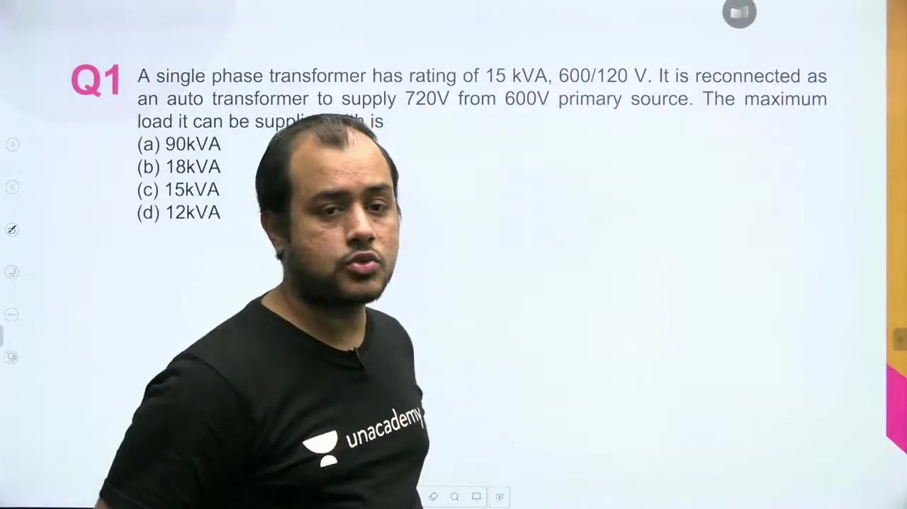

### Worked Example: Maximum Load Calculation

> [!example] Problem 1
> A single-phase two-winding transformer has a rating of $15\text{ kVA}$ and $600/120\text{ V}$. It is reconnected as a step-up autotransformer to supply $720\text{ V}$ from a $600\text{ V}$ primary source. Calculate the maximum load that can be supplied by this autotransformer.
> - (A) $90\text{ kVA}$
> - (B) $75\text{ kVA}$
> - (C) $15\text{ kVA}$
> - (D) $18\text{ kVA}$

We inspect the given voltages. The output voltage is $720\text{ V}$. The supply voltage is $600\text{ V}$. We observe that:

$$720\text{ V} = 600\text{ V} + 120\text{ V}$$

Because the output voltage is the direct sum of the individual winding ratings, the windings connect in additive polarity.

We now calculate the auto transformation ratio $a_{\text{auto}}$:

$$a_{\text{auto}} = \frac{V_H}{V_L} = \frac{720}{600} = 1.2$$

For an additive polarity connection, the autotransformer rating relates directly to the two-winding rating:

$$S_{\text{auto}} = \frac{S_{\text{2w}}}{1 - \frac{1}{a_{\text{auto}}}}$$

We substitute the given values $S_{\text{2w}} = 15\text{ kVA}$ and $a_{\text{auto}} = 1.2$:

$$S_{\text{auto}} = \frac{15}{1 - \frac{1}{1.2}} = \frac{15}{\frac{0.2}{1.2}} = 15 \times 6 = 90\text{ kVA}$$

> [!success] Result
> The maximum load that can be supplied is $90\text{ kVA}$. The correct option is **(A)**.

This direct scaling formula applies strictly to additive polarity. For subtractive polarity connections, one must calculate the permissible coil currents directly from conductor ratings.

## Step-Down Autotransformer Rating and Loss Calculation
_(05:15 - 10:19)_

We now analyze a step-down autotransformer configuration. We calculate its power rating and determine the internal operating losses from two-winding test data.

### Worked Example: Autotransformer Rating

> [!example] Problem 2 (Part A)
> A $400/100\text{ V}$, $10\text{ kVA}$ two-winding transformer is employed as an autotransformer to supply $400\text{ V}$ from a $500\text{ V}$ source. When tested as a two-winding transformer at rated load and $0.85$ power factor, its efficiency is $0.97$. Calculate the kVA rating of the resulting autotransformer.

The transformer operates from a $500\text{ V}$ source to deliver $400\text{ V}$. We compare the terminal voltages with the winding ratings:

$$500\text{ V} = 400\text{ V} + 100\text{ V}$$

Because the supply voltage is the sum of the two winding voltages, this is an additive polarity connection.

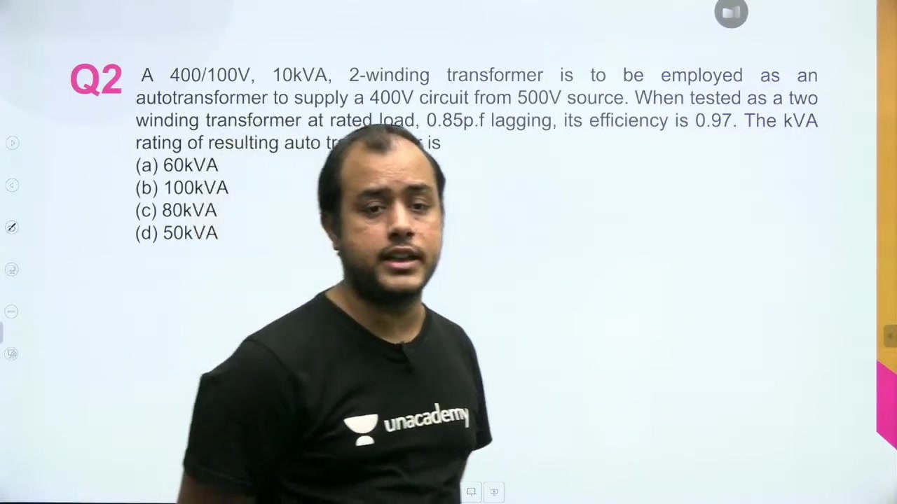

The auto transformation ratio is the ratio of high voltage to low voltage:

$$a_{\text{auto}} = \frac{V_H}{V_L} = \frac{500}{400} = 1.25$$

We compute the autotransformer power rating using the additive polarity formula:

$$S_{\text{auto}} = \frac{S_{\text{2w}}}{1 - \frac{1}{a_{\text{auto}}}}$$

Substituting $S_{\text{2w}} = 10\text{ kVA}$ and $a_{\text{auto}} = 1.25$ gives:

$$S_{\text{auto}} = \frac{10}{1 - \frac{1}{1.25}} = \frac{10}{0.2} = 50\text{ kVA}$$

The power handling capacity increases fivefold from $10\text{ kVA}$ to $50\text{ kVA}$.

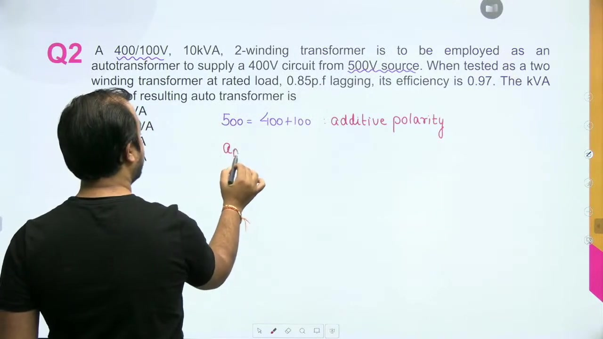

### Principle of Invariant Losses

When converting a two-winding transformer to an autotransformer, the magnetic core and copper windings do not change. Operating the autotransformer at rated coil currents subjects the conductors to their original rated current densities. The core also experiences the same peak magnetic flux density.

Therefore total electrical losses at rated load remain identical in both configurations:

$$P_{\text{loss,auto}} = P_{\text{loss,2w}}$$

This principle allows us to extract the losses directly from the two-winding efficiency test data.

### Derivation of Internal Losses

At rated load and $0.85$ power factor lagging, the output active power of the two-winding unit is:

$$P_{\text{out,2w}} = S_{\text{2w}} \cos\phi = 10 \times 0.85 = 8.5\text{ kW}$$

Efficiency relates output power and losses:

$$\eta = \frac{P_{\text{out,2w}}}{P_{\text{out,2w}} + P_{\text{loss}}}$$

We substitute $\eta = 0.97$ and $P_{\text{out,2w}} = 8.5\text{ kW}$:

$$0.97 = \frac{8.5}{8.5 + P_{\text{loss}}}$$

We rearrange the equation to solve for total full-load losses:

$$P_{\text{loss}} = 8.5 \times \frac{1 - 0.97}{0.97} = \frac{8.5 \times 0.03}{0.97} = \frac{25.5}{97}\text{ kW}$$

This exact loss value will be used to compute autotransformer efficiency in the next section.

## Efficiency Enhancement and Power Transfer Mechanisms
_(10:25 - 15:16)_

We now determine the operational efficiency of the autotransformer from Problem 2. We also explore the physical split between conductively and inductively transferred power. Finally we identify how to configure an autotransformer for maximum efficiency.

### Worked Example: Autotransformer Efficiency

> [!example] Problem 2 (Part B)
> For the $500/400\text{ V}$, $50\text{ kVA}$ autotransformer derived in the previous section, find the operating efficiency at rated load and $0.85$ power factor lagging.

The rated active power output of the autotransformer is:

$$P_{\text{out,auto}} = S_{\text{auto}} \cos\phi = 50 \times 0.85 = 42.5\text{ kW}$$

From our previous derivation, the full-load operating loss is:

$$P_{\text{loss}} = \frac{25.5}{97}\text{ kW} \approx 0.2629\text{ kW}$$

We compute the autotransformer efficiency:

$$\eta_{\text{auto}} = \frac{P_{\text{out,auto}}}{P_{\text{out,auto}} + P_{\text{loss}}} = \frac{42.5}{42.5 + \frac{25.5}{97}}$$

$$\eta_{\text{auto}} = \frac{42.5}{42.7629} = 0.99385 = 99.38\%$$

> [!success] Result
> The autotransformer achieves an efficiency of $99.38\%$. This exceeds the original two-winding efficiency of $97.0\%$.

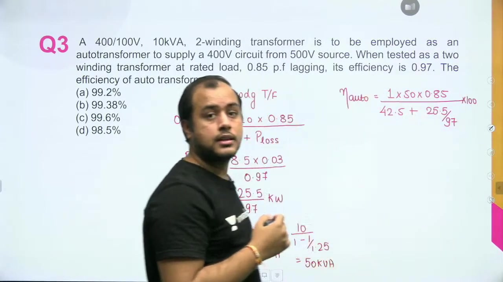

### Conductive Versus Inductive Power Transfer

In an autotransformer, electrical energy travels from source to load through two distinct paths:

1. **Inductive Transfer ($S_{\text{ind}}$)**: Transferred magnetically across the core via mutual flux coupling.
2. **Conductive Transfer ($S_{\text{cond}}$)**: Transferred directly through physical metallic continuity.

For additive polarity, the two components divide according to the transformation ratio:

$$S_{\text{cond}} = \frac{S_{\text{auto}}}{a_{\text{auto}}}$$

$$S_{\text{ind}} = S_{\text{auto}}\left(1 - \frac{1}{a_{\text{auto}}}\right)$$

> [!example] Problem 3
> A $230/115\text{ V}$ autotransformer delivers $5\text{ kW}$ to a load at unity power factor. Determine the power transferred conductively to the load.

The auto transformation ratio is:

$$a_{\text{auto}} = \frac{V_H}{V_L} = \frac{230}{115} = 2$$

We calculate the power transferred conductively:

$$P_{\text{cond}} = \frac{P_{\text{load}}}{a_{\text{auto}}} = \frac{5\text{ kW}}{2} = 2.5\text{ kW}$$

The remaining $2.5\text{ kW}$ transfers inductively through core magnetic flux.

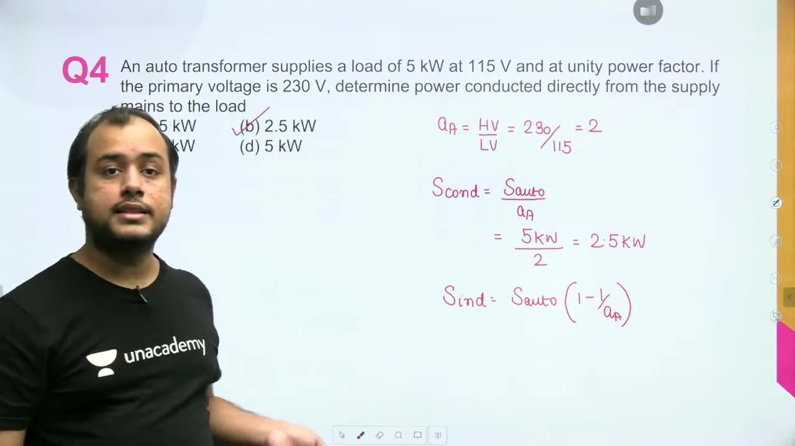

### Maximizing Autotransformer Efficiency

> [!example] Problem 4 (Setup)
> A $400/100\text{ V}$, $5\text{ kVA}$ single-phase two-winding transformer is reconnected as an autotransformer to achieve maximum possible operating efficiency. Determine its rated capacity.

To maximize efficiency, we must maximize the ratio of output power to losses. Because the active materials remain unchanged, losses stay fixed at rated coil currents. Therefore, maximizing the kVA rating directly maximizes efficiency.

The largest kVA rating occurs when $a_{\text{auto}}$ is closest to 1. This corresponds to additive polarity with terminal voltages of $500\text{ V}$ and $400\text{ V}$:

$$a_{\text{auto}} = \frac{400 + 100}{400} = \frac{500}{400} = 1.25$$

The resulting maximum autotransformer rating is:

$$S_{\text{auto}} = \frac{S_{\text{2w}}}{1 - \frac{1}{a_{\text{auto}}}} = \frac{5}{1 - \frac{1}{1.25}} = \frac{5}{0.2} = 25\text{ kVA}$$

This $25\text{ kVA}$ rating provides the highest operating efficiency.

## Efficiency Optimization and Maximum Voltage Selection
_(15:16 - 20:00)_

We now complete the efficiency evaluation for the autotransformer in Problem 4. We then analyze how to configure an autotransformer to produce the maximum output voltage.

### Worked Example: Completing the Efficiency Calculation

We evaluate the operating losses of the two-winding transformer in Problem 4. At rated load and $0.8$ power factor lagging, its active output power is:

$$P_{\text{out,2w}} = 5 \times 0.8 = 4\text{ kW}$$

The measured efficiency is $95\%$. We express the efficiency relation as:

$$0.95 = \frac{4}{4 + P_{\text{loss}}}$$

We solve for full-load operating loss:

$$P_{\text{loss}} = 4 \times \frac{1 - 0.95}{0.95} = \frac{4 \times 0.05}{0.95} = \frac{4}{19}\text{ kW} \approx 0.2105\text{ kW}$$

Now we evaluate the autotransformer under rated full-load conditions. Its active output power is:

$$P_{\text{out,auto}} = S_{\text{auto}} \cos\phi = 25 \times 0.8 = 20\text{ kW}$$

Because active materials are unchanged, losses remain $4/19\text{ kW}$. We calculate the autotransformer efficiency:

$$\eta_{\text{auto}} = \frac{20}{20 + \frac{4}{19}} = \frac{20}{20.2105} = 98.96\%$$

> [!success] Result
> Reconnecting the transformer raises full-load efficiency from $95.0\%$ to $98.96\%$. The correct option is **(D)**.

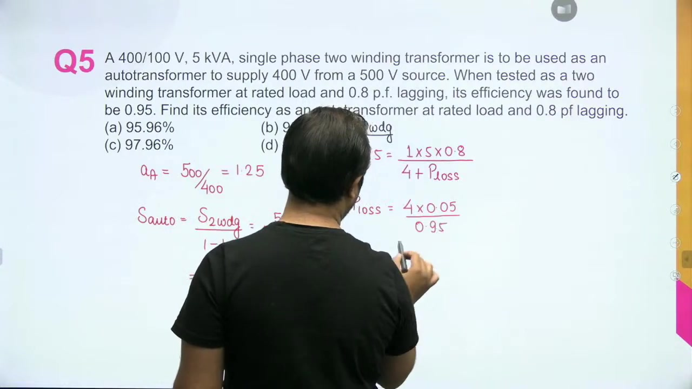

### Maximum Voltage Output Configuration

> [!example] Problem 5 (Part A)
> A two-winding transformer with winding ratings of $100\text{ V}$ and $200\text{ V}$ is reconnected as an autotransformer. Determine the connection that provides the maximum secondary output voltage.

When reconnecting two windings, terminal voltages can either add or subtract:

1. Subtractive polarity produces $200 - 100 = 100\text{ V}$.
2. Additive polarity produces $200 + 100 = 300\text{ V}$.

Additive polarity yields the higher output voltage. Two step-up connections are possible:

- **Connection 1**: Primary across $200\text{ V}$ winding, output across both windings ($200/300\text{ V}$). The transformation ratio is $300/200 = 1.5$.
- **Connection 2**: Primary across $100\text{ V}$ winding, output across both windings ($100/300\text{ V}$). The transformation ratio is $300/100 = 3$.

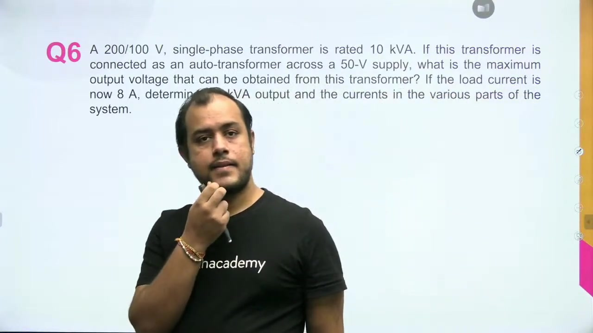

Connection 2 provides a voltage step-up ratio of 3. For any applied input voltage, this connection delivers the maximum possible secondary voltage.

## Current Distribution and Multi-Coil Reconnection
_(20:00 - 25:08)_

We now determine the output power and branch currents for the autotransformer in Problem 5. We then begin analyzing a multi-coil autotransformer designed for high-voltage step-up operation.

### Worked Example: Current Distribution

We use the $100/300\text{ V}$ step-up autotransformer selected in Problem 5. The nominal step-up turns ratio is:

$$a_{\text{ratio}} = \frac{300}{100} = 3$$

The problem specifies an input voltage of $50\text{ V}$ rather than the full $100\text{ V}$ rating. The secondary output voltage is:

$$V_{\text{out}} = 50 \times 3 = 150\text{ V}$$

The connected load draws a current of $8\text{ A}$. The actual apparent power supplied to the load is:

$$S_{\text{out}} = V_{\text{out}} I_{\text{out}} = 150 \times 8 = 1200\text{ VA} = 1.2\text{ kVA}$$

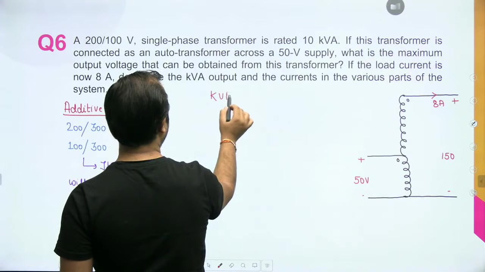

Assuming an ideal lossless unit, input power equals output power:

$$P_{\text{in}} = P_{\text{out}} = 1200\text{ VA}$$

We find the primary input current drawn from the $50\text{ V}$ source:

$$I_{\text{in}} = \frac{S_{\text{out}}}{V_{\text{in}}} = \frac{1200}{50} = 24\text{ A}$$

We apply Kirchhoff's current law at the node linking the source and common winding:

$$I_{\text{in}} = I_{\text{common}} + I_{\text{out}}$$

We rearrange this expression to solve for the common winding current:

$$I_{\text{common}} = I_{\text{in}} - I_{\text{out}} = 24 - 8 = 16\text{ A}$$

> [!success] Result
> The system operating currents are:
> - Input source current: $24\text{ A}$
> - Load output current: $8\text{ A}$
> - Common winding current: $16\text{ A}$

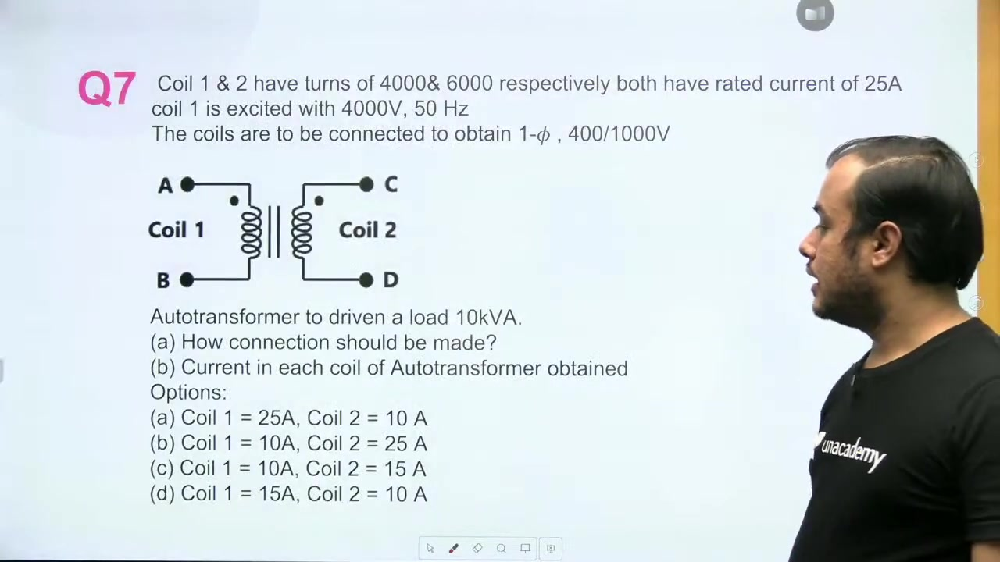

### Multi-Coil Transformer Setup

> [!example] Problem 6 (Setup)
> Coil 1 has $N_1 = 4000$ turns. Coil 2 has $N_2 = 6000$ turns. Both coils have a rated current carrying capacity of $25\text{ A}$. Coil 1 is excited with $4000\text{ V}$ at $50\text{ Hz}$. The coils connect to form a $4000/10000\text{ V}$ autotransformer driving a $10\text{ kVA}$ load. Determine the connection type and find the current in each coil.

We first evaluate the voltage induced in coil 2 as a two-winding unit:

$$V_2 = V_1 \times \frac{N_2}{N_1} = 4000 \times \frac{6000}{4000} = 6000\text{ V}$$

The desired autotransformer output voltage is $10000\text{ V}$. We inspect the voltage sum:

$$10000\text{ V} = 4000\text{ V} + 6000\text{ V}$$

Because the secondary voltage equals the direct sum of the individual voltages, the coils must connect in additive polarity.

## Coil Currents Under Operating Load
_(25:14 - 30:03)_

We now complete the winding current calculations for Problem 6. We also emphasize the distinction between rated capacity and actual connected load. Finally we set up Problem 7.

### Actual Load Versus Rated Capacity

Students often confuse the rated kVA of a machine with its actual operating load. A transformer rating specifies the maximum continuous apparent power it can safely handle. But the actual electrical load determines the currents in practice.

Unless a problem explicitly specifies full load, always calculate branch currents from the actual connected load demand.

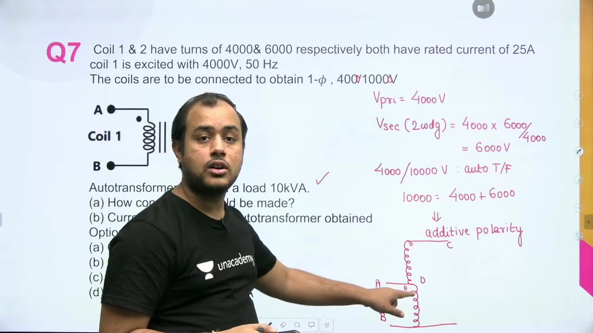

### Worked Example: Current in Each Coil

In Problem 6, the two coils connect in additive polarity to form a $400/1000\text{ V}$ step-up autotransformer. The common winding has a rating of $400\text{ V}$. The series winding has an induced voltage of $600\text{ V}$.

The autotransformer supplies an actual load of $10\text{ kVA}$ at $1000\text{ V}$. We compute the secondary output current:

$$I_{\text{out}} = \frac{S_{\text{actual}}}{V_{\text{out}}} = \frac{10000\text{ VA}}{1000\text{ V}} = 10\text{ A}$$

The series coil carries this secondary load current directly:

$$I_{\text{coil2}} = I_{\text{out}} = 10\text{ A}$$

Now we calculate the primary input current drawn from the $400\text{ V}$ supply:

$$I_{\text{in}} = \frac{S_{\text{actual}}}{V_{\text{in}}} = \frac{10000\text{ VA}}{400\text{ V}} = 25\text{ A}$$

We apply Kirchhoff's current law at the common node:

$$I_{\text{coil1}} = I_{\text{in}} - I_{\text{out}} = 25 - 10 = 15\text{ A}$$

> [!success] Result
> Under the $10\text{ kVA}$ load, the coil currents are:
> - Series coil (Coil 2): $10\text{ A}$
> - Common coil (Coil 1): $15\text{ A}$

Both currents remain well below the rated limit of $25\text{ A}$ for each coil.

### Step-Down Autotransformer Setup

> [!example] Problem 7 (Setup)
> A $200/400\text{ V}$, $20\text{ kVA}$, $50\text{ Hz}$ two-winding transformer connects as an autotransformer to operate on a $600/200\text{ V}$ supply. A load of $20\text{ kVA}$ at $0.8$ power factor lagging connects across the $200\text{ V}$ terminals. Determine the current in the common winding and the kVA rating of the autotransformer.

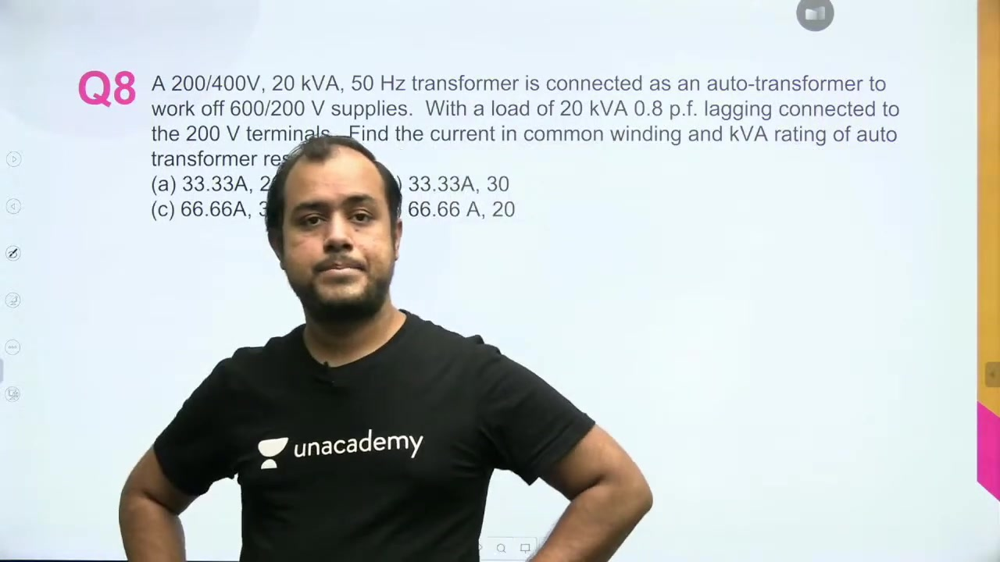

We observe that $600\text{ V} = 400\text{ V} + 200\text{ V}$. This confirms an additive polarity connection. We will solve for the currents and total rating in the following section.

## Common Winding Current and Tapped Autotransformers
_(30:25 - 35:20)_

We now solve Problem 7 to determine the common winding current under partial load. We then introduce multi-tapped autotransformers supplying distinct load voltages from a single source.

### Worked Example: Common Winding Current

In Problem 7, a $200/400\text{ V}$, $20\text{ kVA}$ transformer connects to a $600\text{ V}$ supply and feeds a $200\text{ V}$ load. We first verify the connection polarity:

$$600\text{ V} = 400\text{ V} + 200\text{ V}$$

Because the supply voltage is the sum of both winding ratings, this is an additive polarity connection. The auto transformation ratio is:

$$a_{\text{auto}} = \frac{V_H}{V_L} = \frac{600}{200} = 3$$

The maximum rated capacity of this autotransformer is:

$$S_{\text{auto}} = \frac{S_{\text{2w}}}{1 - \frac{1}{a_{\text{auto}}}} = \frac{20}{1 - \frac{1}{3}} = \frac{20}{\frac{2}{3}} = 30\text{ kVA}$$

The connected load draws $20\text{ kVA}$ rather than the full $30\text{ kVA}$ capacity. We compute the load current on the $200\text{ V}$ secondary side:

$$I_0 = \frac{S_{\text{load}}}{V_L} = \frac{20000\text{ VA}}{200\text{ V}} = 100\text{ A}$$

Now we calculate the primary current drawn from the $600\text{ V}$ line:

$$I_{\text{in}} = \frac{S_{\text{load}}}{V_H} = \frac{20000\text{ VA}}{600\text{ V}} = 33.33\text{ A}$$

The primary current flows into the series winding. At the load tapping node, Kirchhoff's current law requires:

$$I_0 = I_{\text{in}} + I_{\text{common}}$$

We solve for the current in the common winding:

$$I_{\text{common}} = I_0 - I_{\text{in}} = 100 - 33.33 = 66.67\text{ A}$$

> [!success] Result
> The common winding carries $66.67\text{ A}$. The total autotransformer rating is $30\text{ kVA}$. The correct option is **(C)**.

### Tapped Autotransformers for Multiple Loads

> [!example] Problem 8 (Setup)
> Two resistive loads $R_1$ and $R_2$ of $200\ \Omega$ each require operating voltages of $100\text{ V}$ and $300\text{ V}$. An autotransformer connects to a $400\text{ V}$ supply to power both loads. Assuming an ideal transformer, determine the currents in all winding sections and find the equivalent two-winding transformer size.

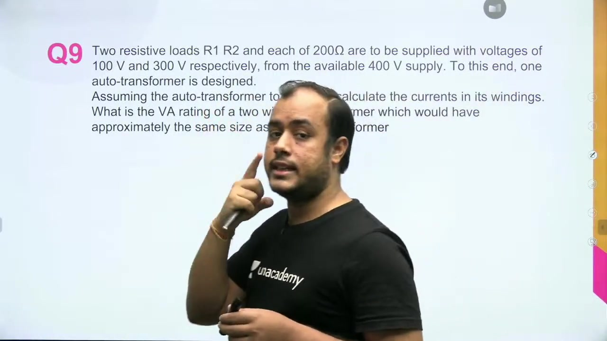

The single $400\text{ V}$ winding provides multiple voltage tappings. Taps at $100\text{ V}$ and $300\text{ V}$ supply the two independent resistors. The circuit behaves as an inductive potential divider. We analyze the resulting branch currents in the next section.

## Analysis of Tapped Potential Divider Autotransformers
_(35:47 - 40:34)_

We now solve the branch currents and equivalent core sizing for Problem 8. We use power conservation and Kirchhoff's current law to analyze the tapped winding sections.

### Load Current Evaluation

Two $200\ \Omega$ resistive loads connect to distinct voltage taps on a $400\text{ V}$ autotransformer winding:

1. The first load connects across the $300\text{ V}$ tap:

$$I_1 = \frac{V_1}{R_1} = \frac{300}{200} = 1.5\text{ A}$$

2. The second load connects across the $100\text{ V}$ tap:

$$I_2 = \frac{V_2}{R_2} = \frac{100}{200} = 0.5\text{ A}$$

### Total Supply Current via Power Balance

For an ideal autotransformer, total input active power equals the sum of load powers:

$$P_{\text{in}} = P_1 + P_2 = \frac{V_1^2}{R_1} + \frac{V_2^2}{R_2}$$

We evaluate the numerical power dissipation:

$$P_{\text{in}} = \frac{300^2}{200} + \frac{100^2}{200} = 450 + 50 = 500\text{ W}$$

The primary supply voltage is $400\text{ V}$. We compute the primary current drawn from the mains:

$$I_p = \frac{P_{\text{in}}}{V_{\text{supply}}} = \frac{500}{400} = 1.25\text{ A}$$

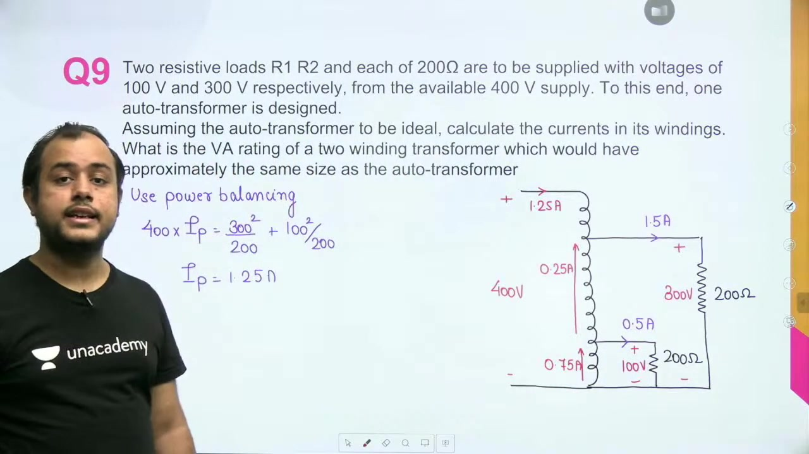

### Winding Section Currents

We determine the current in each winding segment by applying Kirchhoff's current law at the tap nodes:

- **Section between $400\text{ V}$ and $300\text{ V}$**: The supply injects $1.25\text{ A}$ while load 1 draws $1.5\text{ A}$. The remaining current flows upward from the lower section:

$$I_{\text{sec1}} = 1.5 - 1.25 = 0.25\text{ A}$$

- **Section between $300\text{ V}$ and $100\text{ V}$**: This intermediate segment carries the upward current of $0.25\text{ A}$.
- **Section between $100\text{ V}$ and ground**: The current combines with load 2 to return to the reference terminal:

$$I_{\text{sec2}} = 0.25 + 0.5 = 0.75\text{ A}$$

> [!success] Result
> The winding currents are $0.25\text{ A}$ in the upper tap section and $0.75\text{ A}$ in the bottom section.

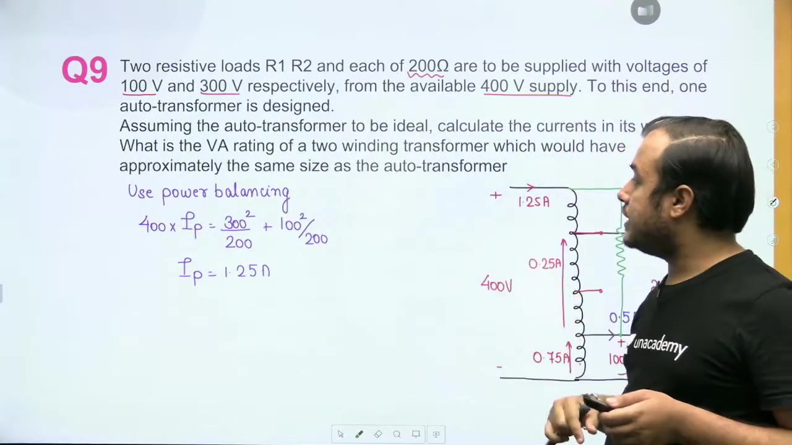

### Equivalent Physical Size Rating

The physical size of an autotransformer corresponds to a two-winding transformer with equivalent copper and core material.

Referenced to the $400/100\text{ V}$ base, the transformation ratio is $a_{\text{auto}} = 400/100 = 4$. The equivalent two-winding rating is:

$$S_{\text{2w}} = S_{\text{auto}} \left(1 - \frac{1}{a_{\text{auto}}}\right) = S_{\text{auto}} \left(1 - \frac{1}{4}\right) = 0.75 S_{\text{auto}}$$

An equivalent two-winding transformer requires 75 percent of the total kVA rating to provide the same physical dimensions.

## Additive Polarity Power Division and Efficiency
_(40:37 - 45:59)_

We now examine a comprehensive problem involving both power division and efficiency calculations. We evaluate an autotransformer operating under additive polarity.

### Problem Statement and Loss Evaluation

> [!example] Problem 9 (Case 1)
> A $25\text{ kVA}$, $2000/200\text{ V}$ two-winding transformer connects as an autotransformer with a constant $2000\text{ V}$ supply. The two-winding unit has an efficiency of $95\%$ at rated load and $0.8$ power factor lagging. For additive polarity, calculate the power output, power transformed inductively, power conducted, and autotransformer efficiency.

We first evaluate the losses from the two-winding transformer data. At rated load and $0.8$ power factor lagging, the output active power is:

$$P_{\text{out,2w}} = 25 \times 0.8 = 20\text{ kW}$$

Using the given efficiency of $0.95$:

$$0.95 = \frac{20}{20 + P_{\text{loss}}}$$

We solve for the full-load losses:

$$P_{\text{loss}} = 20 \times \frac{1 - 0.95}{0.95} = \frac{20 \times 0.05}{0.95} = \frac{20}{19}\text{ kW} \approx 1.0526\text{ kW}$$

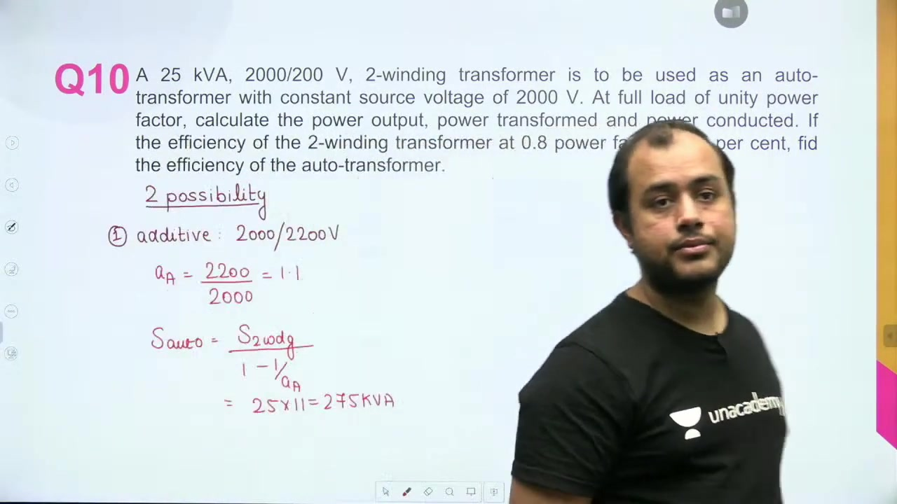

### Capacity and Power Division

Under additive polarity, the secondary output voltage equals the sum of both winding voltages:

$$V_{\text{out}} = 2000 + 200 = 2200\text{ V}$$

The auto transformation ratio is:

$$a_{\text{auto}} = \frac{V_H}{V_L} = \frac{2200}{2000} = 1.1$$

We compute the total autotransformer rating:

$$S_{\text{auto}} = \frac{S_{\text{2w}}}{1 - \frac{1}{a_{\text{auto}}}} = \frac{25}{1 - \frac{1}{1.1}} = 25 \times 11 = 275\text{ kVA}$$

Next we split this total apparent power into conducted and transformed components:

1. **Power Conducted**:

$$S_{\text{cond}} = \frac{S_{\text{auto}}}{a_{\text{auto}}} = \frac{275}{1.1} = 250\text{ kVA}$$

2. **Power Transformed (Inductive)**:

$$S_{\text{ind}} = S_{\text{auto}}\left(1 - \frac{1}{a_{\text{auto}}}\right) = 275 \times \frac{0.1}{1.1} = 25\text{ kVA}$$

Notice that the inductively transformed power equals the original $25\text{ kVA}$ rating of the two-winding transformer. The remaining $250\text{ kVA}$ transfers purely through conductive connection.

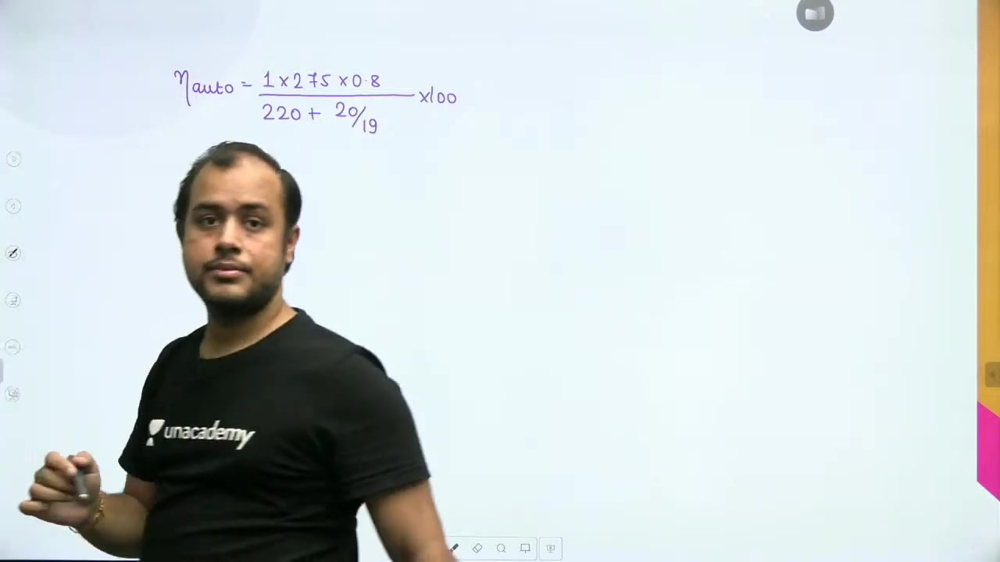

### Full-Load Efficiency

At rated load and $0.8$ power factor lagging, the active power output is:

$$P_{\text{out,auto}} = S_{\text{auto}} \cos\phi = 275 \times 0.8 = 220\text{ kW}$$

Because the coils operate at rated current density, operating losses remain $20/19\text{ kW}$. We calculate efficiency:

$$\eta_{\text{auto}} = \frac{220}{220 + \frac{20}{19}} = \frac{220}{221.0526} = 99.52\%$$

> [!success] Result
> Under additive polarity, the total capacity is $275\text{ kVA}$, conducted power is $250\text{ kVA}$, inductive power is $25\text{ kVA}$, and operating efficiency is $99.52\%$.

## Subtractive Polarity Analysis and Structural Properties
_(46:03 - 50:50)_

We now analyze the subtractive polarity case for Problem 9. We determine its capacity using winding current limits. We also review the fundamental structural properties of autotransformers.

### Subtractive Polarity Rating Derivation

> [!example] Problem 9 (Case 2)
> In Problem 9, reconnect the $25\text{ kVA}$, $2000/200\text{ V}$ transformer in subtractive polarity with a $2000\text{ V}$ supply. Calculate the kVA rating, inductive power, conductive power, and efficiency at $0.8$ power factor lagging.

Under subtractive polarity, the series winding voltage opposes the common winding voltage:

$$V_{\text{out}} = 2000 - 200 = 1800\text{ V}$$

The direct formula based on $a_{\text{auto}}$ applies solely to additive polarity. For subtractive polarity, we must determine the rating from individual winding current limits.

The $200\text{ V}$ secondary winding has a continuous current rating derived from its original two-winding design:

$$I_{\text{rated,200V}} = \frac{S_{\text{2w}}}{V_2} = \frac{25000\text{ VA}}{200\text{ V}} = 125\text{ A}$$

Because wire cross-section and cooling remain identical, the winding safely carries up to $125\text{ A}$. In this connection, the $200\text{ V}$ winding connects in series with the load. Therefore the maximum secondary load current is $125\text{ A}$.

We calculate the autotransformer capacity:

$$S_{\text{auto}} = V_{\text{out}} I_{\text{out}} = 1800 \times 125 = 225000\text{ VA} = 225\text{ kVA}$$

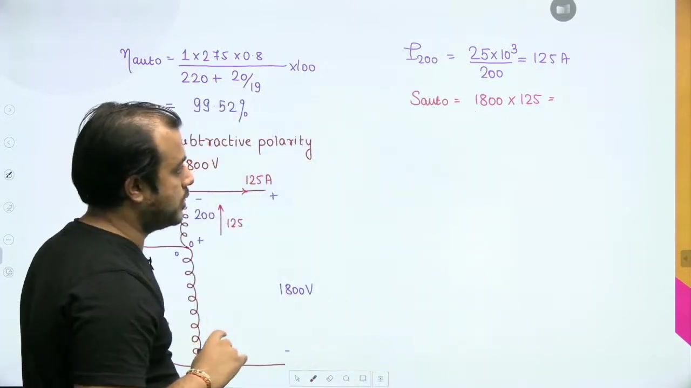

### Power Breakdown and Efficiency

The inductively transformed power equals the electromagnetic rating of a single winding:

$$S_{\text{ind}} = 200\text{ V} \times 125\text{ A} = 25\text{ kVA}$$

The remainder transfers conductively:

$$S_{\text{cond}} = S_{\text{auto}} - S_{\text{ind}} = 225 - 25 = 200\text{ kVA}$$

Now we compute operating efficiency at $0.8$ power factor lagging. The active output power is:

$$P_{\text{out}} = 225 \times 0.8 = 180\text{ kW}$$

Operating losses remain invariant at $20/19\text{ kW}$. We calculate efficiency:

$$\eta_{\text{auto}} = \frac{180}{180 + \frac{20}{19}} = \frac{180}{181.0526} = 99.41\%$$

> [!success] Result
> Subtractive polarity yields a rating of $225\text{ kVA}$, conducted power of $200\text{ kVA}$, inductive power of $25\text{ kVA}$, and efficiency of $99.41\%$.

### Structural and Electrical Properties

> [!example] Problem 10
> Which of the following statements regarding an autotransformer are correct?
> 1. An autotransformer requires less copper than a two-winding transformer of equal capacity.
> 2. An autotransformer provides galvanic isolation between primary and secondary circuits.
> 3. An autotransformer has lower leakage flux than a comparable two-winding transformer.

We evaluate each statement based on machine fundamentals:

- **Statement 1 is True**: Part of the winding is shared, so total required conductor volume is reduced.
- **Statement 2 is False**: Direct metallic continuity links input and output terminals. There is no galvanic isolation.
- **Statement 3 is True**: Sharing a physical winding ensures closer magnetic coupling, which sharply reduces leakage flux.

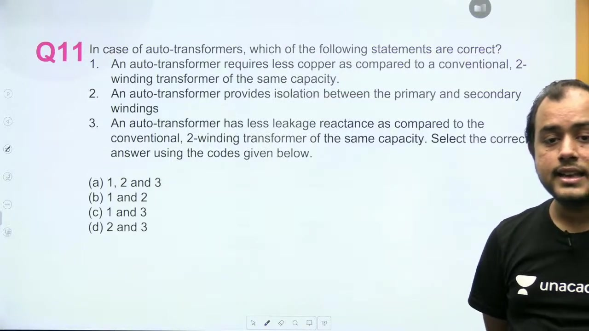

Therefore statements 1 and 3 are correct. The correct option is **(C)**.

## Rating Multiplication, Voltage Recovery, and Core Concepts
_(50:55 - 55:44)_

We conclude this problem-solving session with several fundamental exam questions. We analyze rating multiplication for isolation transformers, turns ratio deduction from polarity voltages, and energy transfer modes.

### Rating Multiplication of a 1:1 Transformer

> [!example] Problem 11
> A two-winding $1:1$ transformer is reconnected as an autotransformer. What is its resulting kVA rating compared to the original two-winding rating?
> - (A) Same
> - (B) Double
> - (C) Four times
> - (D) Half

Let each winding have a voltage rating of $V$. Reconnecting them in additive polarity yields a series combination of $V + V = 2V$. The auto transformation ratio is:

$$a_{\text{auto}} = \frac{V_H}{V_L} = \frac{2V}{V} = 2$$

We compute the resulting autotransformer rating:

$$S_{\text{auto}} = \frac{S_{\text{2w}}}{1 - \frac{1}{a_{\text{auto}}}} = \frac{S_{\text{2w}}}{1 - \frac{1}{2}} = 2 S_{\text{2w}}$$

> [!success] Result
> The kVA rating doubles when a $1:1$ two-winding transformer is reconnected in additive polarity. The correct option is **(B)**.

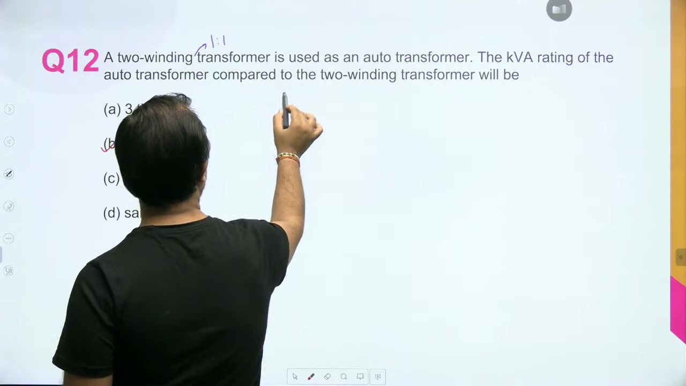

### Efficiency Comparison

> [!example] Problem 12
> What is the efficiency of an autotransformer compared to a two-winding transformer of the same rating?

An autotransformer designed for the same power rating requires less copper and a smaller magnetic core. With lower winding resistance and smaller core volume, both copper and iron losses decrease. Because operating losses are lower for the same active output, the autotransformer achieves higher efficiency. The correct option is **(C)**.

### Recovering Winding Ratings from Polarity Voltages

> [!example] Problem 13
> A two-winding transformer is converted into an autotransformer. In additive and subtractive polarities, the secondary voltages are $2640\text{ V}$ and $2160\text{ V}$. Find the turns ratio of the original transformer.

Let the primary and secondary winding ratings be $V_1$ and $V_2$. The measured terminal voltages relate directly to winding sums and differences:

$$V_1 + V_2 = 2640\text{ V}$$

$$V_1 - V_2 = 2160\text{ V}$$

We add both equations to solve for $V_1$:

$$2V_1 = 2640 + 2160 = 4800 \implies V_1 = 2400\text{ V}$$

We subtract the two equations to solve for $V_2$:

$$2V_2 = 2640 - 2160 = 480 \implies V_2 = 240\text{ V}$$

The turns ratio of the original two-winding transformer is:

$$a = \frac{V_1}{V_2} = \frac{2400}{240} = 10:1$$

> [!success] Result
> The original turns ratio is $10:1$. The correct option is **(C)**.

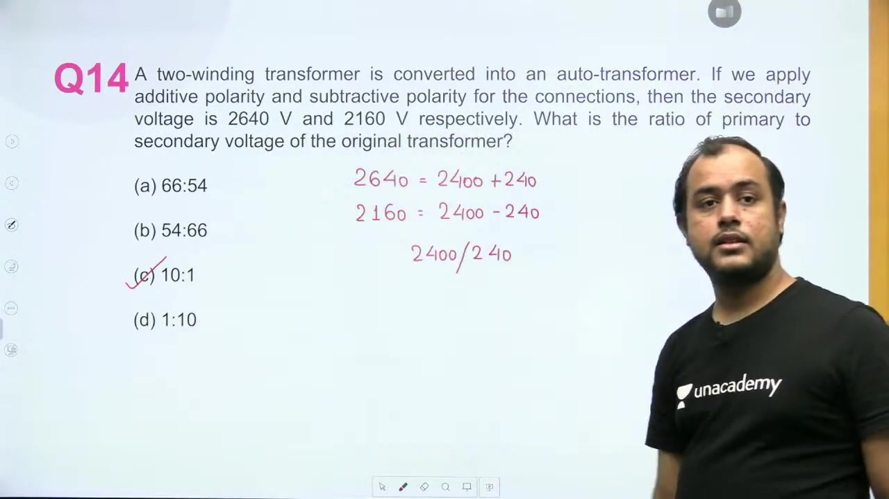

### Dual Modes of Power Transfer

> [!example] Problem 14
> How is power transferred from primary to secondary in an autotransformer?

Power transfers via two complementary physical mechanisms:

1. **Conduction**: Electrical current flows directly through metallic electrical continuity between circuits.
2. **Induction**: Alternating magnetic flux in the core transfers power electromagnetically between winding turns.

Both conduction and induction operate simultaneously in every autotransformer.

### Upcoming Topics

This completes our study of single-phase autotransformers. The subsequent lectures address three-phase transformers and parallel operation.

---

## Summary and Key Takeaways

- In additive polarity, the secondary terminal voltage equals the sum of individual winding ratings ($V_H = V_1 + V_2$), enabling a rating multiplication factor of $1 / (1 - 1/a_{\text{auto}})$.
- For subtractive polarity, the direct scaling formula does not apply, requiring ratings to be determined from individual winding current limits.
- Full-load losses remain invariant when reconnecting a two-winding unit as an autotransformer, leading to higher efficiency at larger output power ratings.
- Apparent power splits into an inductively coupled component $S_{\text{ind}} = S_{\text{auto}}(1 - 1/a_{\text{auto}})$ and a directly conducted component $S_{\text{cond}} = S_{\text{auto}} / a_{\text{auto}}$.
- Unless rated or full-load operation is explicitly specified, branch currents must be calculated from actual connected load demand.
- In tapped autotransformers supplying multiple loads, individual winding currents are evaluated by applying power balancing and Kirchhoff's current law at each node.
- Reconnecting a $1:1$ two-winding transformer in additive polarity doubles its continuous kVA rating.
- Original winding ratings are retrieved from polarity measurements using $V_1 = (V_{\text{add}} + V_{\text{sub}}) / 2$ and $V_2 = (V_{\text{add}} - V_{\text{sub}}) / 2$.

