# Problems based on Three Winding Transformer | L 11 | Electrical Machines | GATE 2022 | #AnkitGoyal

- **Source**: https://www.youtube.com/watch?v=ZALfIKb0YPk
- **Duration**: 00:58:18
- **Compiled**: 2026-09-20

---

## Overview

This lecture focuses on problem solving for three-winding transformers and three-phase transformer banks. It develops three analytical strategies: Ampere-turn MMF balancing, active power conservation, and complex apparent power addition. It also analyzes equivalent circuits for single-phase transformers interconnected in three-phase delta-star configurations with transmission feeder impedances. Finally, the lecture explains how closed delta tertiary windings suppress third-harmonic voltages and stabilize neutral potentials.

## Contents

- [[#Introduction to Three-Winding Transformers and Voltage Rating|Introduction to Three-Winding Transformers and Voltage Rating]]
- [[#MMF Balancing and Solution to Problem 1|MMF Balancing and Solution to Problem 1]]
- [[#Real Power Balancing in Three-Phase Transformers|Real Power Balancing in Three-Phase Transformers]]
- [[#Reactive Power Conservation and Tertiary Current Evaluation|Reactive Power Conservation and Tertiary Current Evaluation]]
- [[#Three-Phase Bank Modeling and Feeder Interconnection|Three-Phase Bank Modeling and Feeder Interconnection]]
- [[#Per-Phase Analysis and Delta-Star Conversion|Per-Phase Analysis and Delta-Star Conversion]]
- [[#Sending-End Voltage via Equivalent Circuit|Sending-End Voltage via Equivalent Circuit]]
- [[#Active Power Balancing in Three-Winding Systems|Active Power Balancing in Three-Winding Systems]]
- [[#Complex Apparent Power Balancing|Complex Apparent Power Balancing]]
- [[#Apparent Power Balancing for Single-Phase Systems|Apparent Power Balancing for Single-Phase Systems]]
- [[#Complex Power Balancing and Tertiary Winding Functions|Complex Power Balancing and Tertiary Winding Functions]]
- [[#Harmonic Suppression and Testing Applications of Tertiary Windings|Harmonic Suppression and Testing Applications of Tertiary Windings]]

---

## Introduction to Three-Winding Transformers and Voltage Rating
_(00:12 - 05:16)_

Three-winding transformers contain three separate electrical windings coupled through a shared magnetic core. These windings are the primary, the secondary, and the tertiary. The primary winding receives electric power from the source. The secondary and tertiary windings deliver power to separate loads at different voltages.

### Insulation and Transformer Voltage Rating

The operating voltage rating of a transformer depends on magnetic flux and turns. The induced electromotive force follows the standard relation:

$$E = 4.44 f N \Phi_m$$

Here $f$ is the supply frequency. $N$ represents the number of winding turns. $\Phi_m$ denotes the maximum core flux. 

A common misconception is that insulation dictates the voltage rating. In reality, the causality is reversed. Insulation design depends strictly on the intended operating voltage rating. If an engineer designs an 11 kV transformer, insulation levels must withstand that operating stress.

> [!info] Voltage Rating and Insulation Principle
> Operating voltage rating is governed by core flux, frequency, and turn numbers. The insulation level is chosen afterwards to withstand the designated operating voltage.

### Three-Winding Transformer Problem Setup

A three-winding transformer operates with known turns ratios and specified secondary and tertiary loads. 

> [!example] Problem 1: Primary Current and Power Factor
> The ratio of number of turns per phase in the primary, secondary, and tertiary windings of a single-phase transformer is:
> 
> $$N_P : N_S : N_T = 10 : 2 : 1$$
> 
> The secondary delivers a lagging current of 45 A at 0.8 power factor. The tertiary delivers 50 A at 0.71 power factor lagging. Determine the primary current magnitude and the input power factor.

To solve this problem, we choose the induced secondary terminal voltage as the reference phasor. Both load currents lag this reference. In the next section, we apply Ampere-turn balance to evaluate the resultant primary phasor.

## MMF Balancing and Solution to Problem 1
_(05:16 - 10:26)_

In multi-winding transformers, primary current reflects the combined demagnetizing effects of all secondary loads. The core flux remains constant under ideal conditions. Therefore, the net magnetomotive force acting on the core must balance to zero when neglecting no-load excitation current.

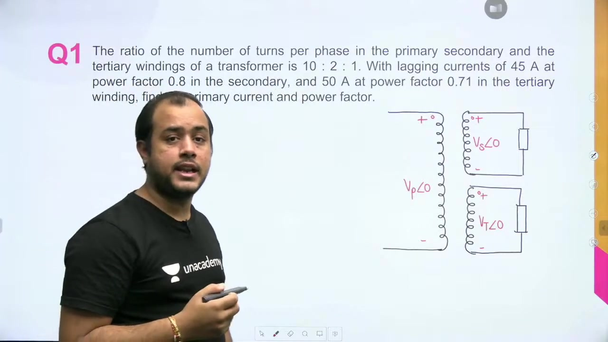

### Phasor Formulation and MMF Balance

We set the common terminal voltage as reference with angle zero degrees:

$$V = |V| \angle 0^\circ$$

The secondary current lags the reference voltage by the power factor angle:

$$\phi_S = \cos^{-1}(0.8) \approx 36.87^\circ$$

So the secondary current phasor is:

$$I_S = 45 \angle -36.87^\circ\text{ A} = 45(0.8 - j0.6) = 36 - j27\text{ A}$$

The tertiary current operates at a lagging power factor of 0.71. We treat 0.71 as $1/\sqrt{2} \approx 0.7071$:

$$\phi_T = \cos^{-1}(0.7071) = 45^\circ$$

This gives the tertiary current phasor:

$$I_T = 50 \angle -45^\circ\text{ A} = 50\left(\frac{1}{\sqrt{2}} - j\frac{1}{\sqrt{2}}\right)\text{ A}$$

Neglecting excitation current $I_0$, the primary ampere-turns balance the secondary and tertiary ampere-turns:

$$N_P I_P = N_S I_S + N_T I_T$$

Dividing across by $N_P$ gives:

$$I_P = \frac{N_S}{N_P} I_S + \frac{N_T}{N_P} I_T$$

Substituting the given turns ratios $N_S/N_P = 2/10 = 0.2$ and $N_T/N_P = 1/10 = 0.1$:

$$
\begin{aligned}
I_P &= 0.2 (45 \angle -36.87^\circ) + 0.1 (50 \angle -45^\circ) \\
&= 9 (0.8 - j0.6) + 5 (0.7071 - j0.7071) \\
&= (7.2 - j5.4) + (3.5355 - j3.5355) \\
&= 10.7355 - j8.9355\text{ A}
\end{aligned}
$$

Converting the rectangular phasor to polar form gives the current magnitude and phase angle:

$$|I_P| = \sqrt{10.7355^2 + 8.9355^2} = 13.967\text{ A}$$

$$\theta_I = -\tan^{-1}\left(\frac{8.9355}{10.7355}\right) = -39.77^\circ$$

The negative phase angle indicates that the primary current lags the terminal voltage. We compute the operating power factor as:

$$\text{pf} = \cos(39.77^\circ) = 0.7686\text{ lagging}$$

> [!success] Solution to Problem 1
> The primary winding draws a current of $13.967\text{ A}$ at a lagging power factor of $0.7686$.

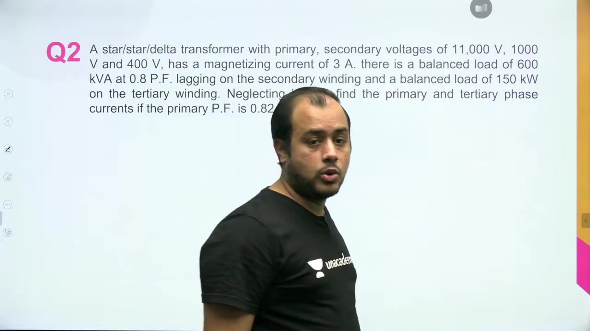

### Introducing Three-Phase Three-Winding Systems

Next, we analyze three-phase systems having three windings per phase.

> [!example] Problem 2: Star-Star-Delta Transformer
> A three-phase star/star/delta transformer has rated line voltages of $11\text{ kV}$, $1\text{ kV}$, and $400\text{ V}$. The no-load magnetizing current is $3\text{ A}$. 
> 
> The secondary carries a balanced load of $600\text{ kVA}$ at $0.8$ lagging. The tertiary carries a balanced load of $150\text{ kW}$. Determine the primary line current and tertiary phase current if the primary power factor is $0.82$ lagging.

## Real Power Balancing in Three-Phase Transformers
_(10:35 - 16:04)_

In three-phase three-winding transformers, each winding can operate at a distinct voltage and power factor. When the power factor of a load is unknown, direct MMF phasor addition becomes difficult. Instead, we decompose the total power into independent real and reactive power components.

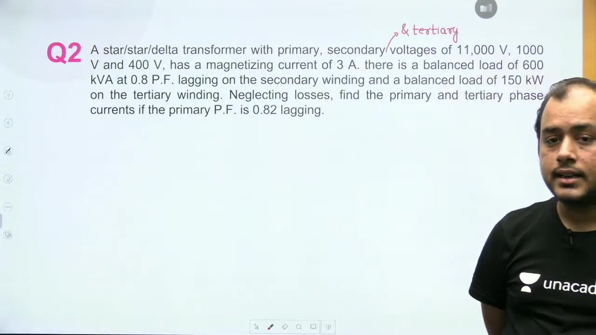

### Formulating the Real Power Balance

The ideal transformer core neither consumes nor stores average real power. Copper and iron losses are neglected in this problem. Therefore, total real power entering through the primary equals the sum of real powers delivered to the secondary and tertiary loads:

$$P_{\text{primary}} = P_{\text{secondary}} + P_{\text{tertiary}}$$

The primary winding is star-connected with rated line voltage $V_{L1} = 11\text{ kV}$. The primary operating power factor is:

$$\cos\phi_1 = 0.82\text{ lagging}$$

The primary three-phase real power is expressed as:

$$P_{\text{primary}} = \sqrt{3} V_{L1} I_P \cos\phi_1 = \sqrt{3} \times 11\,000 \times I_P \times 0.82$$

The secondary delivers a balanced apparent load of $600\text{ kVA}$ at $0.8$ lagging. Its real power is:

$$P_{\text{secondary}} = S_2 \cos\phi_2 = 600 \times 10^3 \times 0.8 = 480\text{ kW}$$

The tertiary delivers an active power given directly as:

$$P_{\text{tertiary}} = 150\text{ kW} = 150 \times 10^3\text{ W}$$

Notice that the tertiary power factor is not needed here because its real power is explicitly stated.

### Determining the Primary Line Current

We equate the input and output active powers:

$$\sqrt{3} \times 11\,000 \times I_P \times 0.82 = 480 \times 10^3 + 150 \times 10^3$$

Dividing across by $10^3$ to work in kilowatts:

$$\sqrt{3} \times 11 \times 0.82 \times I_P = 630\text{ kW}$$

Evaluating the numerical denominator:

$$\sqrt{3} \times 11 \times 0.82 \approx 15.623$$

Solving directly for the primary line current:

$$I_P = \frac{630}{15.623} = 41.333\text{ A}$$

Because the primary winding is star-connected, the phase current equals the line current:

$$I_{P,\text{ph}} = I_P = 41.333\text{ A}$$

> [!success] Primary Line Current
> By balancing active powers, the primary line current is found to be:
> 
> $$I_P = 41.333\text{ A}$$

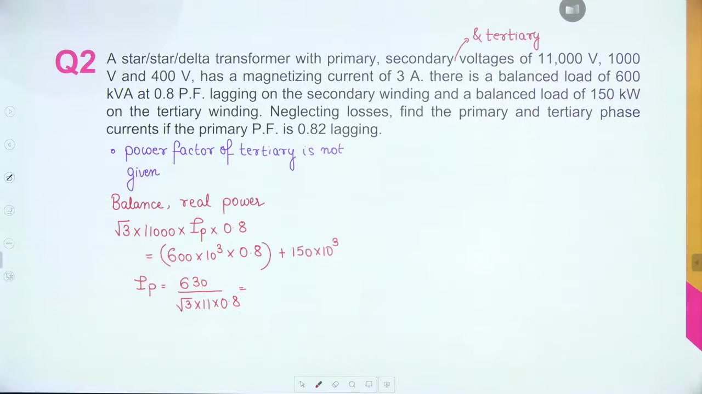

### Strategy for Finding the Tertiary Current

Knowing the primary line current solves only half the problem. The tertiary load current remains unknown because the tertiary operating power factor was not provided. 

To determine the tertiary current, we must find the total tertiary apparent power $S_3$. We already know its active power $P_3 = 150\text{ kW}$. If we determine its reactive power $Q_3$, we can compute $S_3 = \sqrt{P_3^2 + Q_3^2}$. 

The source supplies total reactive power to three destinations:
1. The inductive core magnetizing branch.
2. The secondary load.
3. The tertiary load.

In the next section, we apply reactive power conservation to isolate the tertiary reactive demand.

## Reactive Power Conservation and Tertiary Current Evaluation
_(16:05 - 20:59)_

Reactive power obeys conservation across an ideal magnetic circuit. Total reactive power supplied by the three-phase AC mains feeds three parallel demands: core magnetization, secondary load, and tertiary load.

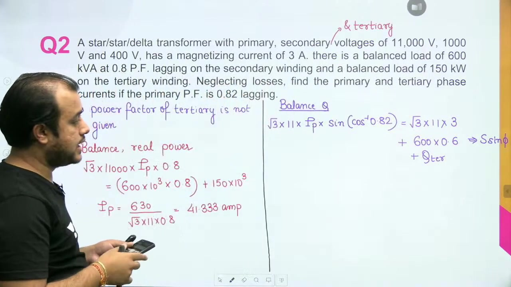

### Balancing Reactive Power Demands

We express the total reactive power balance in kilovars:

$$Q_{\text{primary}} = Q_{\text{mag}} + Q_{\text{secondary}} + Q_{\text{tertiary}}$$

First, compute reactive power entering the primary terminals from the mains:

$$\sin\phi_1 = \sin(\cos^{-1} 0.82) = \sqrt{1 - 0.82^2} \approx 0.57236$$

$$Q_{\text{primary}} = \sqrt{3} V_{L1} I_P \sin\phi_1 = \sqrt{3} \times 11 \times 41.333 \times 0.57236 \approx 450.48\text{ kvar}$$

Next, consider the magnetizing current $I_\mu = 3\text{ A}$. Core magnetizing current lags terminal voltage by 90 degrees. It consumes purely reactive power without drawing active power:

$$Q_{\text{mag}} = \sqrt{3} V_{L1} I_\mu = \sqrt{3} \times 11 \times 3 \approx 57.157\text{ kvar}$$

For the secondary load, $S_2 = 600\text{ kVA}$ at $0.8$ lagging. Its reactive consumption is:

$$Q_{\text{secondary}} = S_2 \sin\phi_2 = 600 \times 0.6 = 360\text{ kvar}$$

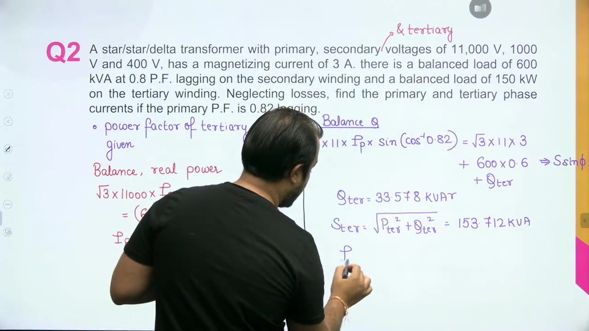

Subtracting the magnetizing and secondary demands gives the tertiary reactive power:

$$Q_{\text{tertiary}} = 450.48 - 57.157 - 360 = 33.323\text{ kvar}$$

Using Sir's intermediate board values gives $Q_{\text{tertiary}} \approx 33.578\text{ kvar}$. 

### Apparent Power and Current of the Tertiary Winding

We now combine the active power $P_3 = 150\text{ kW}$ and reactive power $Q_3 = 33.578\text{ kvar}$:

$$S_{\text{tertiary}} = \sqrt{P_{\text{tertiary}}^2 + Q_{\text{tertiary}}^2} = \sqrt{150^2 + 33.578^2} \approx 153.712\text{ kVA}$$

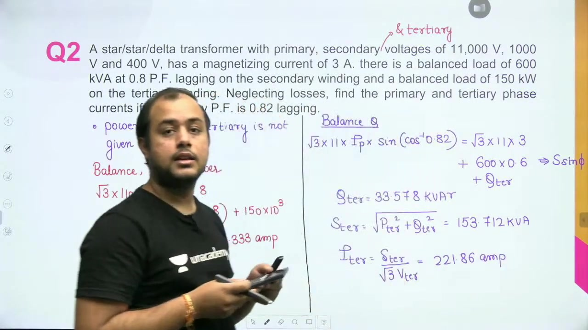

The tertiary winding line voltage is $V_{L3} = 400\text{ V} = 0.4\text{ kV}$. The tertiary line current is:

$$I_{T,\text{line}} = \frac{S_{\text{tertiary}}}{\sqrt{3} V_{L3}} = \frac{153.712}{\sqrt{3} \times 0.4} = 221.86\text{ A}$$

Because the tertiary winding is delta-connected, each winding phase carries:

$$I_{T,\text{ph}} = \frac{I_{T,\text{line}}}{\sqrt{3}} = \frac{221.86}{\sqrt{3}} = 128.09\text{ A}$$

> [!success] Problem 2 Results
> Primary phase and line current:
> 
> $$I_P = 41.333\text{ A}$$
> 
> Tertiary phase current in delta:
> 
> $$I_{T,\text{ph}} = 128.09\text{ A}$$

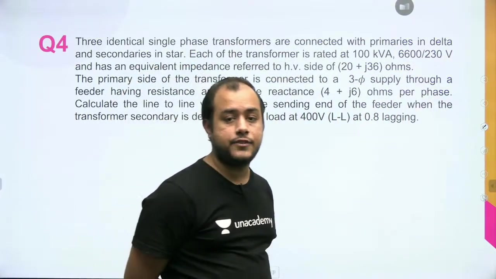

### Introducing Bank of Single-Phase Transformers

We next examine three identical single-phase units interconnected to supply a three-phase load through an upstream feeder.

> [!example] Problem 3: Delta-Star Transformer Bank with Feeder
> Three identical single-phase transformers are connected with primary in delta and secondary in star. Each transformer is rated $100\text{ kVA}$, $6600/230\text{ V}$, with high-voltage equivalent impedance $Z_{\text{eq,HV}} = 20 + j36\,\Omega$. 
> 
> The primary receives power from a feeder having impedance $Z_f = 4 + j6\,\Omega$ per phase. The secondary delivers rated load at $400\text{ V}$ line-to-line at $0.8$ lagging. Find the line-to-line sending-end voltage of the feeder.

## Three-Phase Bank Modeling and Feeder Interconnection
_(20:59 - 25:29)_

A three-phase transformer bank can be constructed using three identical single-phase transformers. The windings can be connected in delta, star, or zig-zag configurations. To analyze such a bank correctly, we must determine line voltages, per-phase ratings, and equivalent impedances.

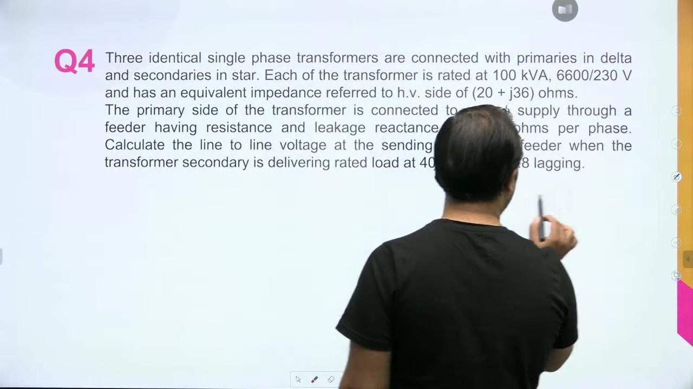

### Connection Architecture of the Bank

The system consists of a three-phase power source feeding the primary terminals through a transmission feeder. 

The primary windings of the three individual transformers are connected in delta ($\Delta$). The secondary windings are connected in star ($\text{Y}$). Each individual single-phase unit has the following ratings:

$$S_{\text{1}\phi} = 100\text{ kVA}$$

$$V_{\text{HV}} = 6600\text{ V}, \quad V_{\text{LV}} = 230\text{ V}$$

The equivalent leakage impedance of each unit referred to its high-voltage side is:

$$Z_{\text{eq,HV}} = 20 + j36\,\Omega$$

The three feeder conductors have an impedance per phase of:

$$Z_f = 4 + j6\,\Omega$$

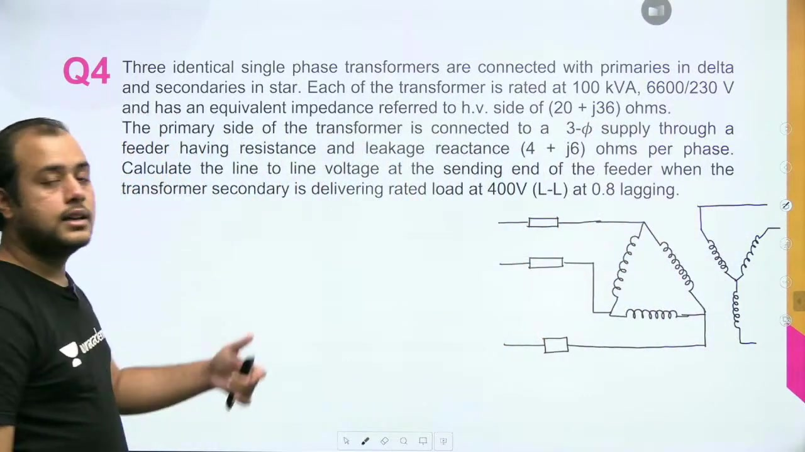

### Terminal Voltage Relationships

In a delta connection, the phase voltage across each winding equals the line-to-line voltage. Therefore, the rated primary line voltage is:

$$V_{L1,\text{rated}} = V_{\text{ph1}} = 6600\text{ V}$$

On the secondary star side, line voltage exceeds phase voltage by a factor of $\sqrt{3}$:

$$V_{L2,\text{rated}} = \sqrt{3} V_{\text{ph2}} = \sqrt{3} \times 230 \approx 398.37\text{ V} \approx 400\text{ V}$$

The load specification states that the secondary delivers rated load at $400\text{ V}$ line-to-line:

$$V_{L2} = 400\text{ V}$$

So the secondary operates at its exact rated voltage.

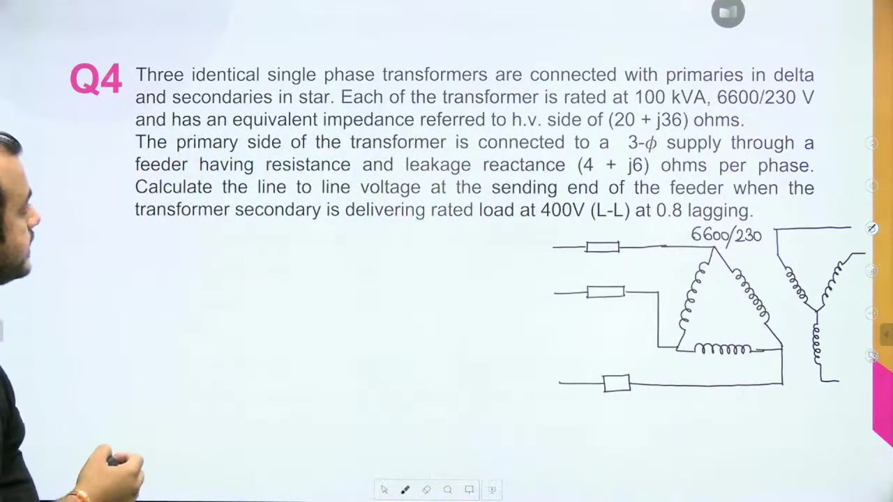

### Bank kVA Capacity and Invariance of Power

The total three-phase apparent power rating of the bank equals the sum of the three single-phase ratings:

$$S_{\text{bank}} = 3 \times S_{\text{1}\phi} = 3 \times 100\text{ kVA} = 300\text{ kVA}$$

Alternatively, expressing this in terms of per-phase variables:

$$S_{\text{bank}} = 3 V_{\text{ph}} I_{\text{ph}} = \sqrt{3} V_L I_L = 300\text{ kVA}$$

When referring a load from the secondary side to the primary side, apparent power remains invariant:

$$S_{\text{load, primary}} = S_{\text{load, secondary}} = 300\text{ kVA}\text{ at }0.8\text{ lagging}$$

Because the secondary voltage is at rated value, the primary transformer terminals must also sit at their rated voltage of $6600\text{ V}$. In the next section, we transform the primary delta into star to construct a single-phase series equivalent circuit.

## Per-Phase Analysis and Delta-Star Conversion
_(25:46 - 30:39)_

Three-phase balanced networks are best solved using a per-phase equivalent circuit. When components are connected in delta, direct series addition with star-connected feeders is impossible. We must convert delta branches into equivalent star branches.

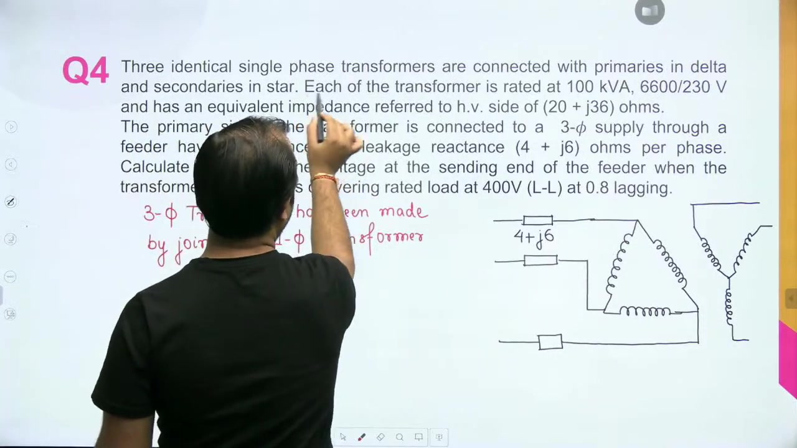

### Winding Voltage and Power Invariance

Each single-phase transformer is rated at $100\text{ kVA}$ with windings of $6600\text{ V}$ and $230\text{ V}$. 

The high-voltage primary windings are delta-connected. In a delta connection, the phase voltage equals the line-to-line voltage:

$$V_{L1} = V_{\text{ph1}} = 6600\text{ V}$$

The low-voltage secondary windings are star-connected. In star, line-to-line voltage is $\sqrt{3}$ times phase voltage:

$$V_{L2} = \sqrt{3} V_{\text{ph2}} = 230\sqrt{3} \approx 398.37\text{ V} \approx 400\text{ V}$$

The load draws rated current at $400\text{ V}$ line-to-line. Because the actual terminal voltage matches rated voltage, the primary windings also operate at their exact rated voltage of $6600\text{ V}$.

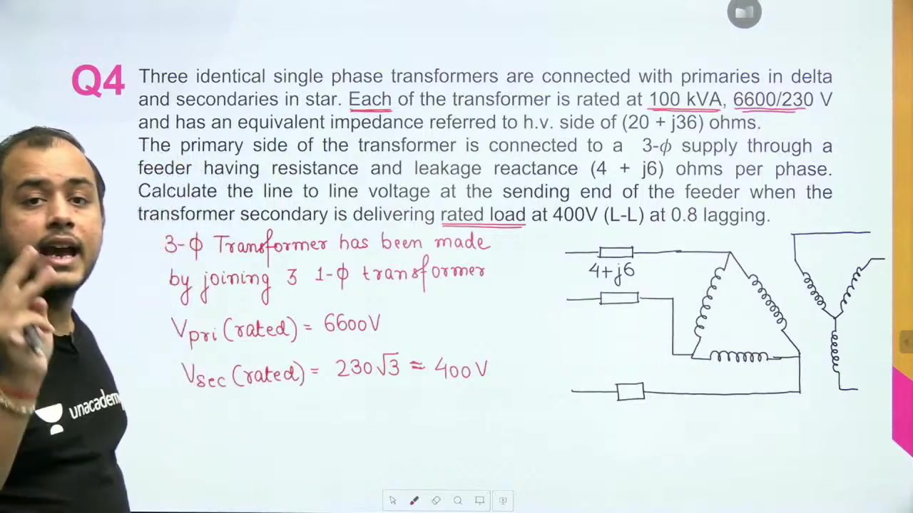

When transferring a balanced load across an ideal transformer, the complex power magnitude remains invariant:

$$S_{\text{bank}} = 3 \times 100\text{ kVA} = 300\text{ kVA}$$

Referred to the primary side, the effective load is:

$$S = 300\text{ kVA}\text{ at }0.8\text{ lagging}$$

### Equivalent Star Conversion of the Delta Primary

To combine the transformer primary with the series feeder, we transform the delta primary into an equivalent star.

In a balanced delta network, the line-to-line voltage is $V_L = 6600\text{ V}$. In the equivalent star representation, the phase-to-neutral voltage becomes:

$$V_{\text{ph1,Y}} = \frac{V_L}{\sqrt{3}} = \frac{6600}{\sqrt{3}}\text{ V}$$

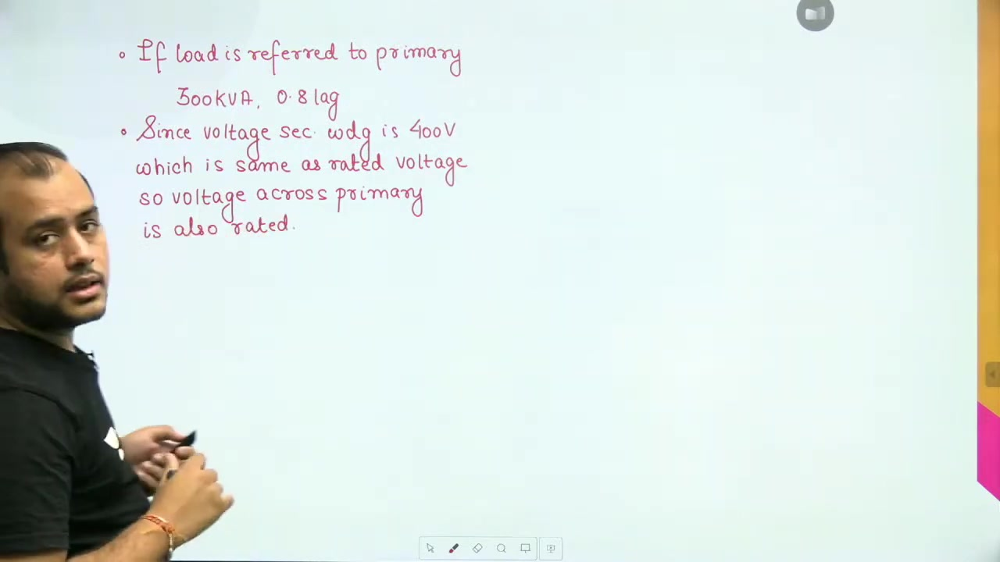

The transformer equivalent impedance was specified on the high-voltage delta side as:

$$Z_{\Delta} = 20 + j36\,\Omega$$

When converting any balanced delta impedance into an equivalent star impedance, the value divides by 3:

$$Z_{\text{Y}} = \frac{Z_\Delta}{3}$$

Applying this transformation gives:

$$Z_{\text{xfmr,Y}} = \frac{20 + j36}{3} = \frac{20}{3} + j12\,\Omega \approx 6.667 + j12\,\Omega$$

This conversion places the transformer impedance directly in series with the feeder phase impedance. In the next section, we sum the series impedances and determine the sending-end voltage.

## Sending-End Voltage via Equivalent Circuit
_(30:43 - 35:40)_

After transforming the delta primary into star, the entire system connects in a simple series loop per phase. The feeder impedance and transformed transformer impedance combine into a single total impedance.

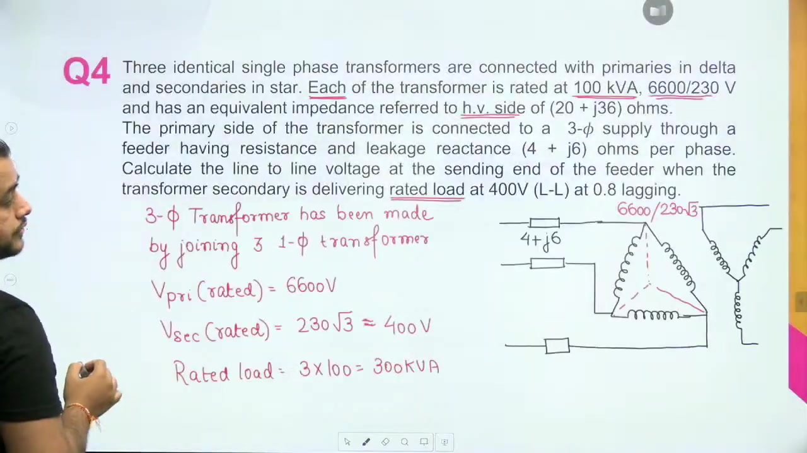

### Determining the Primary Line Current

The three-phase load rating is $300\text{ kVA}$. The rated line voltage at the primary transformer terminals is $6.6\text{ kV}$. We compute the primary line current directly:

$$I_P = \frac{S_{\text{bank}}}{\sqrt{3} V_L} = \frac{300 \times 10^3}{\sqrt{3} \times 6600} = 26.243\text{ A}$$

Because the power is in kVA, we do not multiply by the power factor in the denominator. In our star equivalent circuit, the phase current equals this line current: $I_{\text{ph}} = I_P = 26.243\text{ A}$.

### Total Series Equivalent Impedance

The per-phase equivalent impedance consists of two components in series: the upstream feeder and the star-converted transformer. The feeder impedance per phase is $Z_{\text{feeder}} = 4 + j6\,\Omega$. The transformer equivalent impedance in star is $Z_{\text{xfmr,Y}} = \frac{20}{3} + j12\,\Omega \approx 6.667 + j12\,\Omega$.

Adding resistance and reactance separately yields the total equivalent impedance:

$$
\begin{aligned}
R_{\text{eq}} &= 4 + \frac{20}{3} = \frac{32}{3} \approx 10.667\,\Omega \\
X_{\text{eq}} &= 6 + 12 = 18\,\Omega \\
Z_{\text{eq}} &= 10.667 + j18\,\Omega
\end{aligned}
$$

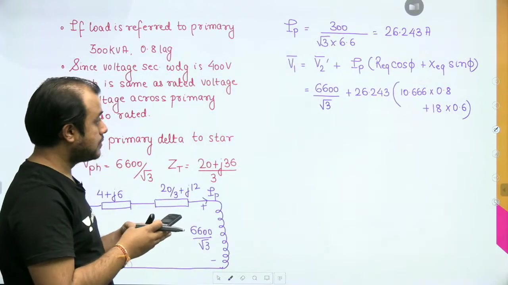

### Sending-End Phase and Line Voltage

The phase voltage at the transformer terminals in the star equivalent model is:

$$V'_2 = \frac{6600}{\sqrt{3}} \approx 3810.51\text{ V}$$

The load operates at a lagging power factor of $0.8$, so $\sin\phi = 0.6$. We apply the standard approximate voltage regulation formula:

$$\Delta V \approx I_P (R_{\text{eq}} \cos\phi + X_{\text{eq}} \sin\phi)$$

Evaluating the numerical voltage drop across the series impedance:

$$
\begin{aligned}
\Delta V &\approx 26.243 (10.667 \times 0.8 + 18 \times 0.6) \\
&= 26.243 (8.533 + 10.800) \\
&= 26.243 \times 19.333 \approx 507.35\text{ V}
\end{aligned}
$$

Adding this drop to the transformer terminal phase voltage yields the sending-end phase voltage:

$$V_1 \approx V'_2 + \Delta V = 3810.51 + 507.35 = 4317.86\text{ V}$$

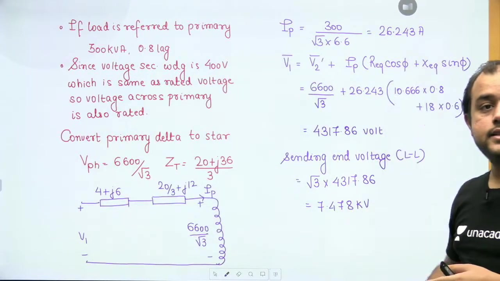

To find the line-to-line voltage at the sending end of the feeder, multiply by $\sqrt{3}$:

$$V_{\text{sending, LL}} = \sqrt{3} V_1 = \sqrt{3} \times 4317.86\text{ V} \approx 7478.75\text{ V} \approx 7.478\text{ kV}$$

> [!success] Problem 3 Solution
> The line-to-line voltage at the sending end of the feeder is:
> 
> $$V_{\text{sending, LL}} = 7.478\text{ kV}$$

## Active Power Balancing in Three-Winding Systems
_(35:44 - 40:15)_

When calculating primary current in three-winding transformers, active power balancing offers an efficient shortcut. Core excitation current is purely reactive under ideal core assumptions. Because the magnetizing branch draws zero average real power, it drops out of the active power balance entirely.

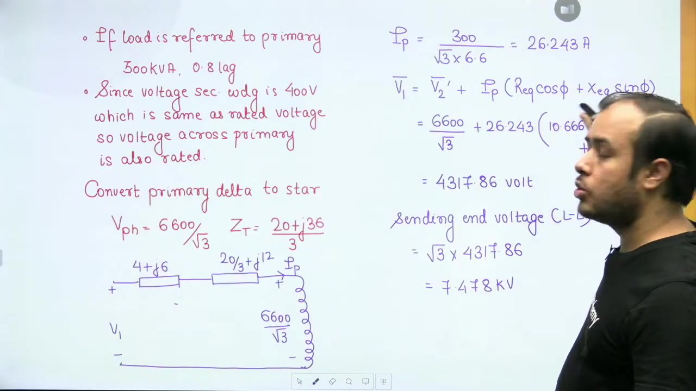

### Clarifying Winding Turns and Ratings

Before setting up the problem, several common questions arise regarding transformer voltage ratings. 

In delta or open-delta windings, the voltage rating represents the voltage across each phase winding. If one phase is disconnected, the turns of the remaining two windings do not change. The rated voltage per phase remains constant. 

Also, line current and phase current must not be confused. In star, line current equals phase current. In delta, line current equals $\sqrt{3}$ times phase current.

### Active Power Formulation for Problem 4

We examine a three-phase, three-winding transformer connecting multiple voltage levels.

> [!example] Problem 4: Real Power Balance with Magnetizing Current
> A three-phase three-winding transformer has rated line voltages of $11\text{ kV}$, $3.3\text{ kV}$, and $400\text{ V}$. 
> 
> The secondary supplies a balanced load of $200\text{ kVA}$ at $0.8$ lagging. The tertiary supplies a balanced load of $170\text{ kW}$ at unity power factor. The primary operates at a power factor of $0.9$ lagging. Find the RMS primary line current.

The primary winding connects in star with line-to-line voltage $V_{L1} = 11\text{ kV}$. Its operating power factor is $\cos\phi_1 = 0.9$. The primary input real power is:

$$P_{\text{primary}} = \sqrt{3} V_{L1} I_P \cos\phi_1 = \sqrt{3} \times 11 \times I_P \times 0.9\text{ kW}$$

The secondary supplies $200\text{ kVA}$ at $0.8$ lagging. Its real power is:

$$P_{\text{secondary}} = S_2 \cos\phi_2 = 200 \times 0.8 = 160\text{ kW}$$

The tertiary load is already given in active power:

$$P_{\text{tertiary}} = 170\text{ kW}$$

Because $170\text{ kW}$ is already real power, we do not multiply it by any power factor.

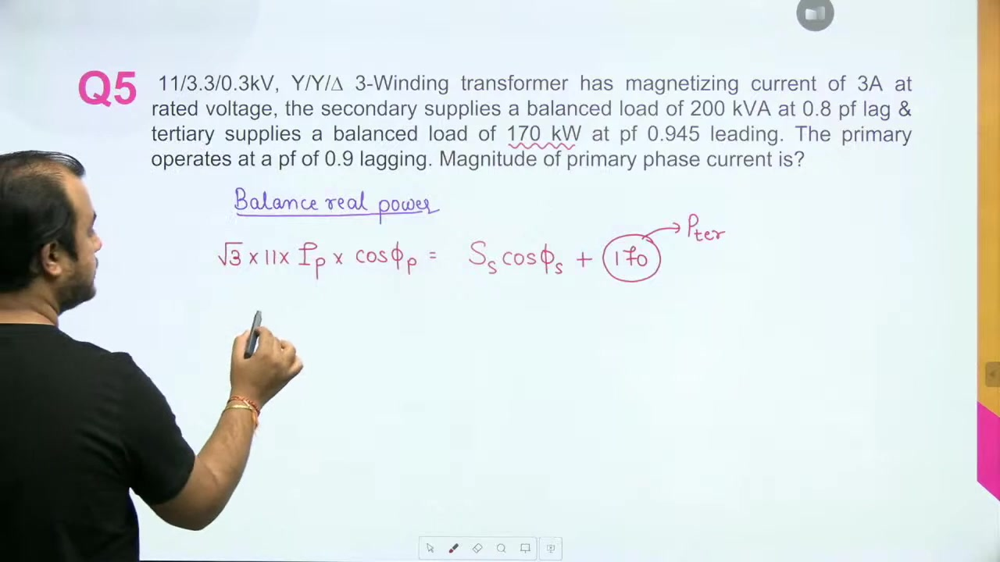

### Calculating Primary Current

We equate the primary input active power to the total delivered load active power:

$$\sqrt{3} \times 11 \times I_P \times 0.9 = 160 + 170 = 330\text{ kW}$$

Evaluating the constant factor:

$$\sqrt{3} \times 11 \times 0.9 \approx 17.147$$

Solving for the primary line current:

$$I_P = \frac{330}{17.147} = 19.245\text{ A}$$

Because the primary is star-connected, this line current is also the winding phase current.

> [!success] Problem 4 Result
> The primary line current drawn from the mains is:
> 
> $$I_P = 19.245\text{ A}$$

By isolating real power, we solved the problem in a single line without needing excitation impedance values or individual phasor angles.

## Complex Apparent Power Balancing
_(40:44 - 45:46)_

When both secondary and tertiary windings deliver power at different power factors, we can sum their complex apparent powers directly. An ideal transformer conserves both real and reactive powers across its windings.

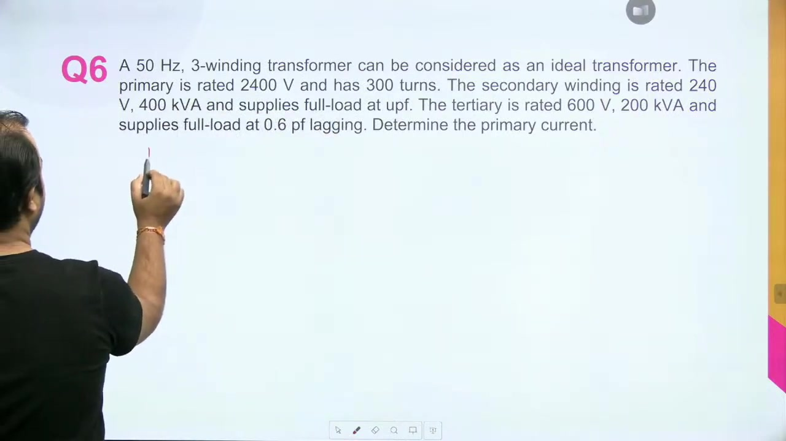

### Vector Addition of Load Powers

In AC power systems, complex power is defined as:

$$S = P + jQ$$

For an inductive load with lagging power factor, the load absorbs positive reactive power. Therefore, its reactive component $Q$ has a positive sign.

Consider the following system setup:

> [!example] Problem 5: Complex Power Balance
> A single-phase three-winding transformer operates from a primary source. The secondary supplies a load of $400\text{ kVA}$ at unity power factor. The tertiary supplies a load of $200\text{ kVA}$ at $0.6$ lagging power factor. Determine the total apparent power demand and the primary current if primary voltage is $4160\text{ V}$.

We write the complex power consumed by each load:

$$
\begin{aligned}
S_{\text{secondary}} &= 400 \angle 0^\circ = 400 + j0\text{ kVA} \\
S_{\text{tertiary}} &= 200 \angle 53.13^\circ = 200(0.6 + j0.8) = 120 + j160\text{ kVA}
\end{aligned}
$$

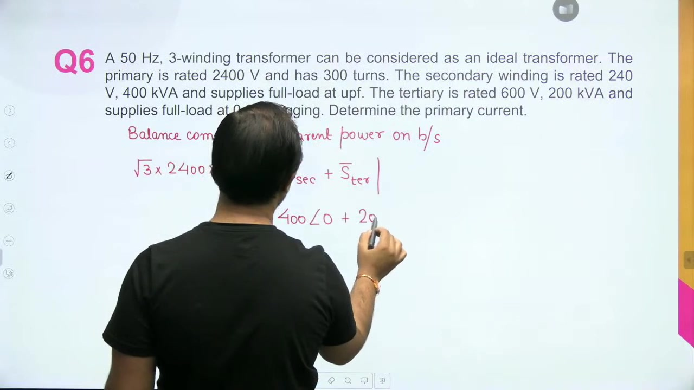

Adding the real and reactive components:

$$
\begin{aligned}
S_{\text{total}} &= S_{\text{secondary}} + S_{\text{tertiary}} \\
&= (400 + 120) + j160 \\
&= 520 + j160\text{ kVA}
\end{aligned}
$$

The magnitude of this resultant apparent power is:

$$|S_{\text{total}}| = \sqrt{520^2 + 160^2} = \sqrt{270\,400 + 25\,600} = \sqrt{296\,000} \approx 544.058\text{ kVA}$$

The primary current is obtained by dividing the total apparent power by the primary terminal voltage:

$$I_P = \frac{|S_{\text{total}}|}{V_P} = \frac{544.058 \times 10^3}{4160} = 130.88\text{ A}$$

> [!success] Result for Problem 5
> Total complex power demanded from the source is $520 + j160\text{ kVA}$. The resulting primary line current is:
> 
> $$I_P = 130.88\text{ A}$$

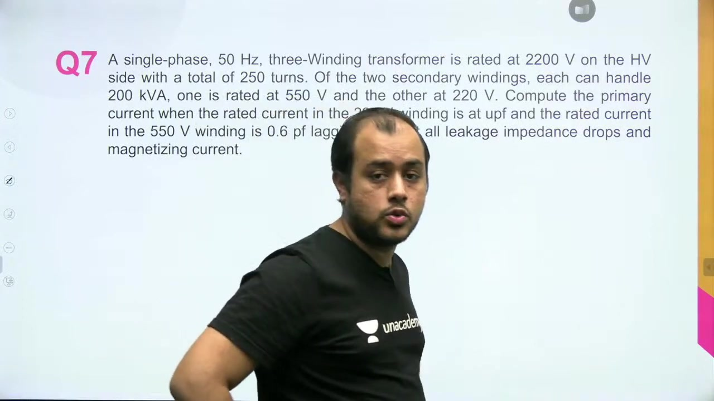

### Introducing Two Secondary Windings of Equal kVA

We proceed to a single-phase transformer where both secondaries share an identical apparent power rating.

> [!example] Problem 6: Two Secondaries at Different Power Factors
> A single-phase, $50\text{ Hz}$, three-winding transformer is rated $2200\text{ V}$ on the high-voltage side with $250$ turns. 
> 
> The two secondary windings can each handle $200\text{ kVA}$. One secondary is rated at $550\text{ V}$ and the other at $220\text{ V}$. Find the primary current when the $220\text{ V}$ winding carries rated current at unity power factor, and the $550\text{ V}$ winding carries rated current at $0.6$ lagging.

## Apparent Power Balancing for Single-Phase Systems
_(45:47 - 50:30)_

When loads are connected to distinct secondary windings, apparent power balancing avoids complex turn-by-turn MMF equations. The method sums real and reactive powers directly to find total apparent power demand.

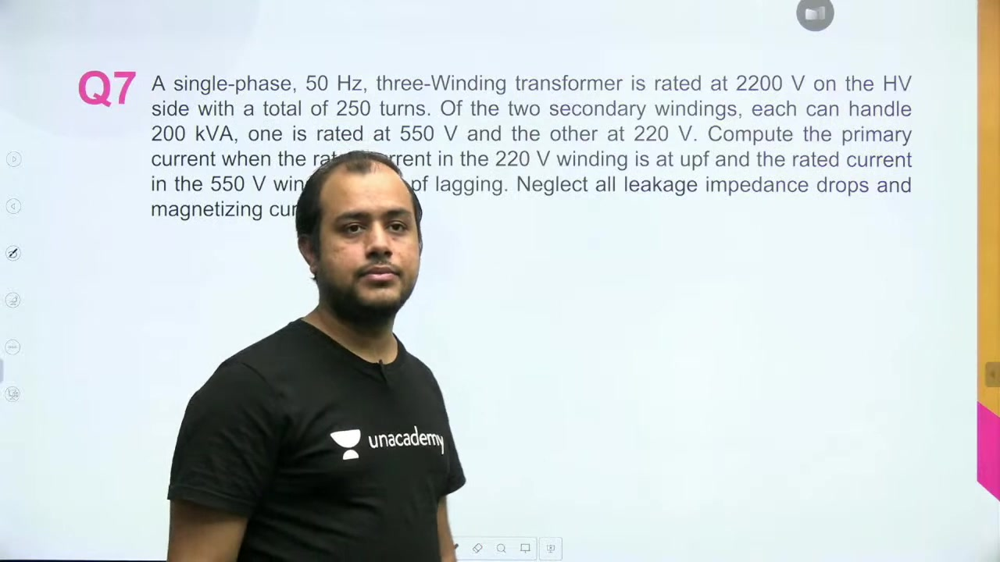

### Apparent Power Summation in Problem 6

In Problem 6, the transformer operates on a single-phase supply. The primary voltage is $V_P = 2200\text{ V}$. 

The first secondary winding delivers its rated $200\text{ kVA}$ at unity power factor:

$$S_2 = 200 \angle 0^\circ = 200 + j0\text{ kVA}$$

The second secondary winding delivers its rated $200\text{ kVA}$ at $0.6$ lagging power factor. Since $\cos\phi = 0.6$, $\sin\phi = 0.8$:

$$S_3 = 200(0.6 + j0.8) = 120 + j160\text{ kVA}$$

Summing the two loads gives the total complex power entering the primary:

$$S_{\text{total}} = S_2 + S_3 = (200 + 120) + j160 = 320 + j160\text{ kVA}$$

Factoring out $160$ simplifies the calculation:

$$S_{\text{total}} = 160(2 + j1)\text{ kVA}$$

The magnitude of total apparent power is:

$$|S_{\text{total}}| = 160\sqrt{2^2 + 1^2} = 160\sqrt{5}\text{ kVA} \approx 357.771\text{ kVA}$$

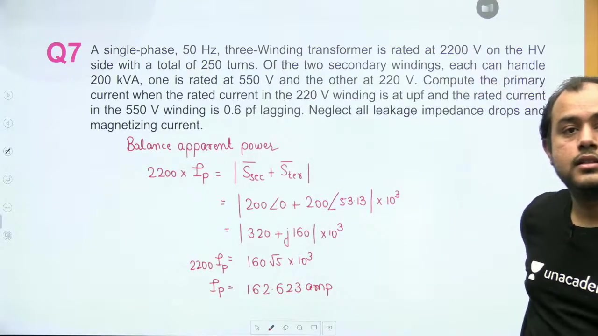

### Single-Phase Primary Current

Because the transformer is single-phase, the factor of $\sqrt{3}$ does not appear. The primary current is simply:

$$I_P = \frac{|S_{\text{total}}|}{V_P} = \frac{160\sqrt{5} \times 10^3}{2200} \approx 162.623\text{ A}$$

> [!success] Result for Problem 6
> The total load demands $160\sqrt{5}\text{ kVA}$. The single-phase primary winding draws:
> 
> $$I_P = 162.623\text{ A}$$

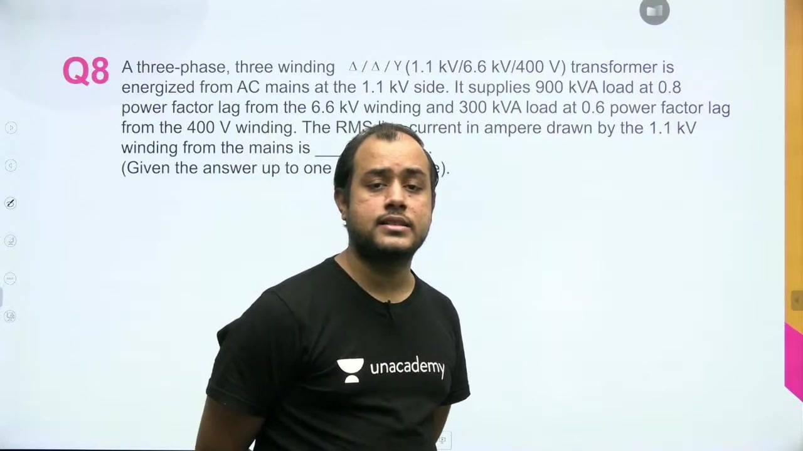

### Introducing Three-Phase Delta-Delta-Star Power Balancing

We now extend complex power balancing to three-phase networks with mixed connections.

> [!example] Problem 7: Delta-Delta-Star Line Current
> A three-phase three-winding delta/delta/star transformer is energized from AC mains on its $1.1\text{ kV}$ winding. 
> 
> It supplies $900\text{ kVA}$ at $0.8$ lagging from its $6.6\text{ kV}$ winding. It also supplies $300\text{ kVA}$ at $0.6$ lagging from its $400\text{ V}$ winding. Determine the RMS line current drawn from the $1.1\text{ kV}$ mains.

This problem appears daunting if approached through per-phase turns ratios and connection angles. But by summing the total complex power, we can solve it in a few compact lines.

## Complex Power Balancing and Tertiary Winding Functions
_(50:34 - 55:23)_

When primary operating power factor is unknown, active power balancing cannot isolate the line current. In such cases, total apparent power balancing is the most direct solution technique.

### Solution to Problem 7

We express the load demands of both output windings in complex rectangular form. The secondary supplies $900\text{ kVA}$ at $0.8$ lagging ($\sin\phi = 0.6$):

$$S_2 = 900(0.8 + j0.6) = 720 + j540\text{ kVA}$$

The tertiary supplies $300\text{ kVA}$ at $0.6$ lagging ($\sin\phi = 0.8$):

$$S_3 = 300(0.6 + j0.8) = 180 + j240\text{ kVA}$$

Adding the two complex loads gives the total power supplied by the mains:

$$
\begin{aligned}
S_{\text{total}} &= S_2 + S_3 \\
&= (720 + 180) + j(540 + 240) \\
&= 900 + j780\text{ kVA}
\end{aligned}
$$

The magnitude of this combined apparent power is:

$$|S_{\text{total}}| = \sqrt{900^2 + 780^2} = \sqrt{810\,000 + 608\,400} \approx 1190.966\text{ kVA}$$

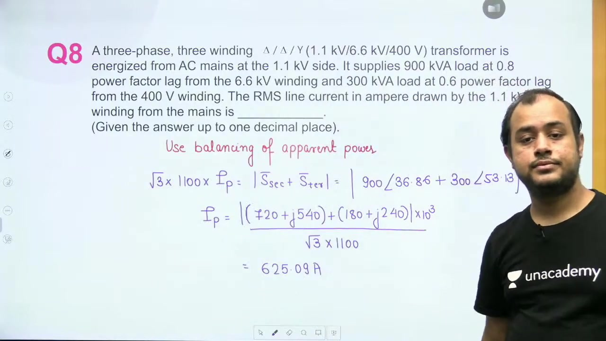

The primary line voltage is $V_{L1} = 1.1\text{ kV}$. We compute the primary RMS line current as:

$$I_P = \frac{|S_{\text{total}}|}{\sqrt{3} V_{L1}} = \frac{1190.966}{\sqrt{3} \times 1.1} = 625.09\text{ A}$$

> [!success] Result for Problem 7
> Total three-phase apparent power is $1190.966\text{ kVA}$. The RMS line current drawn by the primary winding is:
> 
> $$I_P = 625.09\text{ A}$$

### Decision Framework for Three-Winding Problems

We summarize the three distinct methods to solve three-winding transformers:

1. **MMF Balancing**: Use this when secondary and tertiary currents are explicitly given as phasors.
2. **Real Power Balancing**: Use this when secondary and tertiary loads are known and the primary power factor is specified.
3. **Complex Power Balancing**: Use this when neither primary power factor nor primary current is known initially.

For practical transformers, internal losses are included by adding series $I^2 R$ losses and shunt core losses to the load demand.

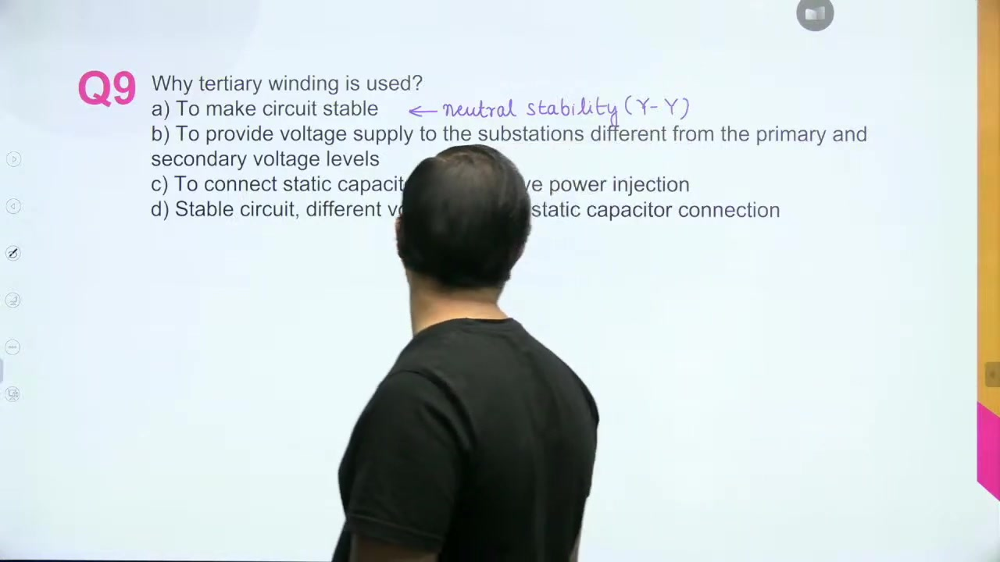

### Core Functions of Tertiary Windings

A tertiary winding is often connected in delta inside star-star power transformers. It serves several purposes:

1. **Neutral Stabilization**: Under unbalanced three-phase loads, the neutral point of a star-star transformer shifts. A closed delta tertiary allows zero-sequence currents to circulate locally. This circulation stabilizes the neutral voltage.
2. **Substation Auxiliary Supply**: It provides a convenient intermediate voltage to supply local substation station services.
3. **Power Factor Correction**: Static capacitors or synchronous condensers can be connected directly across the tertiary terminals.
4. **Suppression of Voltage Harmonics**: A delta connection provides a closed path for third harmonic magnetizing currents. In the next section, we explore how this circulation preserves sinusoidal core flux.

## Harmonic Suppression and Testing Applications of Tertiary Windings
_(55:23 - 58:11)_

Nonlinear core saturation distorts transformer exciting currents. Because ferromagnetic core permeability varies with flux density, sinusoidal flux requires a third-harmonic component in the magnetizing current. The tertiary winding provides a path to manage these harmonics.

### Mechanism of Third-Harmonic Suppression

In a balanced three-phase network, fundamental currents differ in phase by 120 degrees:

$$i_a(t) = I_m \sin(\omega t), \quad i_b(t) = I_m \sin(\omega t - 120^\circ), \quad i_c(t) = I_m \sin(\omega t + 120^\circ)$$

Third-harmonic currents are three times the fundamental frequency:

$$3(\omega t - 120^\circ) = 3\omega t - 360^\circ = 3\omega t$$

Therefore, third-harmonic components in all three phases are identical in time phase. They form zero-sequence quantities.

In an isolated star connection without a neutral return path, co-phasal currents have nowhere to go:

$$i_{a3} + i_{b3} + i_{c3} = 3 i_3 = 0 \implies i_3 = 0$$

Because third-harmonic current cannot flow, the core flux wave becomes flat-topped:

$$\Phi(t) \approx \Phi_1 \sin(\omega t) - \Phi_3 \sin(3\omega t)$$

Differentiating this non-sinusoidal flux produces peaked phase voltages with third-harmonic distortion:

$$e(t) = -N \frac{d\Phi}{dt} \approx -N \omega [\Phi_1 \cos(\omega t) - 3\Phi_3 \cos(3\omega t)]$$

A closed delta tertiary winding solves this problem. Because the delta forms a closed loop, the co-phasal third-harmonic currents circulate freely within the delta mesh:

$$I_{\Delta,3} = \frac{3 E_3}{3 Z_{T3}} = \frac{E_3}{Z_{T3}}$$

This circulating current provides the missing third-harmonic core excitation. The core magnetic flux becomes purely sinusoidal:

$$\Phi(t) = \Phi_m \sin(\omega t)$$

So, all induced phase voltages remain purely sinusoidal without harmonic peaks.

### Testing and Voltage Measurement Applications

Tertiary windings also assist in testing high-voltage transformers:

> [!info] Voltage Measurement in Open-Circuit Testing
> During open-circuit tests on extra-high-voltage power transformers, connecting measuring instruments directly to high-voltage terminals presents safety risks. A voltmeter can be connected across the lower-voltage tertiary winding terminals instead. Measuring the tertiary voltage allows accurate calculation of core flux and turns ratios safely.

> [!success] Summary of Tertiary Winding Benefits
> 1. Circulates zero-sequence fault currents to stabilize the star neutral point.
> 2. Circulates third-harmonic currents to keep flux and phase voltages sinusoidal.
> 3. Supplies auxiliary substation loads.
> 4. Permits low-voltage instrumentation during open-circuit testing.

---

## Summary and Key Takeaways

- In three-winding transformers with zero excitation current, primary Ampere-turns balance the phasor sum of secondary and tertiary Ampere-turns: $N_P I_P = N_S I_S + N_T I_T$.
- When secondary and tertiary loads are known and the primary power factor is specified, balancing active power $P_{\text{primary}} = P_{\text{secondary}} + P_{\text{tertiary}}$ yields the primary line current directly because the purely reactive magnetizing current consumes zero active power.
- When the primary power factor is unknown, summing complex load powers as $S_{\text{total}} = S_2 + S_3 = P_{\text{total}} + jQ_{\text{total}}$ allows direct computation of input apparent power and primary line current.
- Converting a balanced delta-connected primary into an equivalent star divides the delta branch impedance by three: $Z_{\text{Y}} = Z_{\Delta} / 3$.
- In three-phase systems supplying rated secondary voltage, the sending-end voltage is obtained by adding the feeder and transformer series impedance drops: $\Delta V \approx I_P (R_{\text{eq}}\cos\phi + X_{\text{eq}}\sin\phi)$.
- A closed delta tertiary winding allows co-phasal third-harmonic magnetizing currents to circulate locally, ensuring that the core magnetic flux and induced phase voltages remain purely sinusoidal.
- Delta tertiary windings stabilize the neutral point in star-star systems under unbalanced loads and allow safe voltage measurements during open-circuit testing.

