[← Lec 036: Problems based on Three Winding Transformer](Lecture_036_Problems_based_on_Three_Winding_Transformer.md) | [🏠 Index](00_yt_study_guide.md) | [Lec 038: Three Phase Transformer 2 →](Lecture_038_Three_Phase_Transformer_2.md)

---

# Electrical Machines | Lec 25 | Three Phase Transformer - 1 | GATE/ESE Electrical Engineering Lecture

- **Source**: https://www.youtube.com/watch?v=KhApv0b7zLw
- **Duration**: 01:08:18
- **Compiled**: 2026-09-21

---

## Overview

This lecture introduces three-phase transformers and compares transformer banks with integrated three-phase units. It examines core-type and shell-type constructions alongside three-limbed, five-limbed, and three-dimensional magnetic circuits. The discussion explains how balanced three-phase fluxes return through adjacent limbs without needing a return core leg. Finally, it analyzes magnetic reluctance asymmetry in planar cores and compares operational trade-offs across transformer designs.

## Contents

- [[#Motivation and Need for Three-Phase Transformers|Motivation and Need for Three-Phase Transformers]]
- [[#Three-Phase Transformer Bank|Three-Phase Transformer Bank]]
- [[#Drawbacks of Transformer Banks and Introduction to Integrated Three-Phase Units|Drawbacks of Transformer Banks and Introduction to Integrated Three-Phase Units]]
- [[#Three-Dimensional Core-Type Transformer and Flux Balance|Three-Dimensional Core-Type Transformer and Flux Balance]]
- [[#Physical Return Mechanism of Phase Fluxes|Physical Return Mechanism of Phase Fluxes]]
- [[#Transition to the Planar Three-Limbed Core-Type Transformer|Transition to the Planar Three-Limbed Core-Type Transformer]]
- [[#Reluctance and Magnetizing Current Asymmetry in Planar Cores|Reluctance and Magnetizing Current Asymmetry in Planar Cores]]
- [[#Three-Phase Shell-Type Transformer Architecture and Flux Paths|Three-Phase Shell-Type Transformer Architecture and Flux Paths]]
- [[#Flux Phasor Analysis and Core Area Scaling in Shell-Type Transformers|Flux Phasor Analysis and Core Area Scaling in Shell-Type Transformers]]
- [[#Five-Limbed Cores and Transformer Bank vs Core-Type Comparison (Part 1)|Five-Limbed Cores and Transformer Bank vs Core-Type Comparison (Part 1)]]
- [[#Operational Trade-Offs and Core-Type vs Shell-Type Comparison|Operational Trade-Offs and Core-Type vs Shell-Type Comparison]]

---

## Motivation and Need for Three-Phase Transformers
_(00:13 - 08:18)_

### Why Transition to Three-Phase Systems?

Single-phase transformers work well for local distribution and low-power loads. But modern electrical power grids operate at very high power levels. There are five main reasons why three-phase systems are preferred over single-phase systems:

1. **Higher Power Capacity**: A three-phase system delivers three times the power of a single-phase system of identical phase rating:
   $$P_{3\phi} = 3 P_{1\phi}$$

2. **Synchronism and Frequency Stability**: Three separate single-phase generators may drift in frequency. For instance, one generator might run at $50\text{ Hz}$ while another runs at $49.95\text{ Hz}$. This makes power transfer between them difficult. In contrast, a single three-phase alternator generates all three phases on the same rotor shaft. This guarantees identical frequency across all phases.

3. **Conductor Economy**: Three separate single-phase systems require six wires: three forward conductors and three return conductors. A three-phase system requires only three or four wires. This reduction in wire count lowers conductor material costs substantially.

4. **Equipment Size and Cost**: Building three separate single-phase alternators requires three frames, three outer casings, and three sets of insulation. A single three-phase alternator shares the frame, casing, and core structure. Only the windings are separate. This makes a three-phase machine much cheaper and lighter.

5. **Constant Instantaneous Power**: In a single-phase system, instantaneous power pulsates at twice the supply frequency ($2\omega$):
   $$p_{1\phi}(t) = v(t) i(t) = V_m \sin(\omega t) \cdot I_m \sin(\omega t - \phi) = V I \cos\phi - V I \cos(2\omega t - \phi)$$
   This pulsating power causes torque pulsations and mechanical vibrations in rotating machinery. In a balanced three-phase system, the instantaneous power is constant at all times:
   $$p_{3\phi}(t) = 3 V_{ph} I_{ph} \cos\phi$$
   Constant power prevents torque oscillations and protects connected devices from vibration damage.

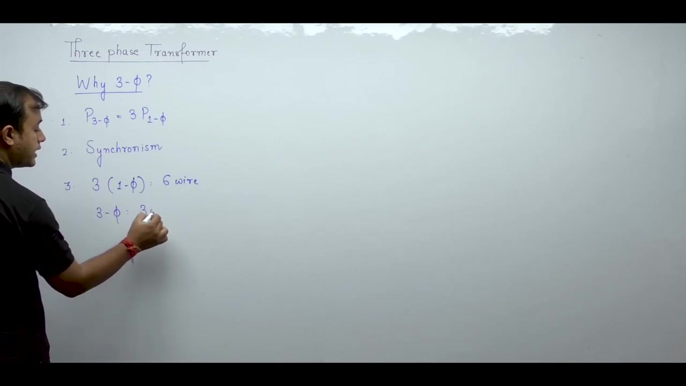

### Why Stop at Three Phases?

Increasing the number of phases beyond three increases total power. But the capital and line costs increase much faster. Adding more phases requires more transmission conductors, more terminal bushings, and more complex switchgear. Practical engineering data shows that moving to four or five phases is not economical. Three phases provide the best balance between power transfer capability and capital cost.

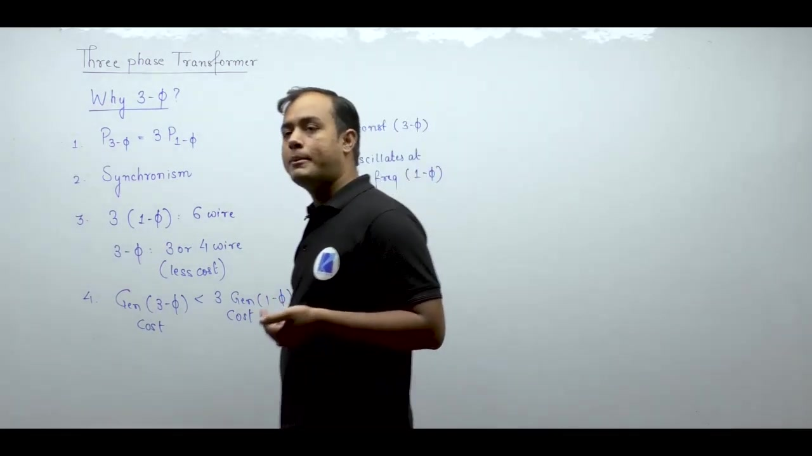

### Role of Transformers in Three-Phase Grids

Modern generation plants produce three-phase power. High-voltage transmission lines carry three-phase power. Therefore, the step-up and step-down transformers connecting them must also be three-phase.

> [!info] Definition
> In modern power networks, power generation and transmission are three-phase in nature. The transformers used to connect generation, transmission, and distribution must also be three-phase transformers.

Many construction features remain identical to single-phase transformers. These include:
- Cold-rolled grain-oriented (CRGO) silicon steel core laminations to reduce hysteresis and eddy current losses.
- Oil conservator tanks and silica gel breathers.
- High-voltage and low-voltage terminal bushings.
- Winding styles such as concentric, disc, helical, or sandwich windings.

The major difference lies in the core structure. A three-phase transformer must carry the magnetic fluxes of all three phases.

## Three-Phase Transformer Bank
_(08:28 - 14:02)_

### Realizing a Three-Phase Transformer from Single-Phase Units

The simplest way to build a three-phase transformer is to combine three identical single-phase transformers.

> [!info] Definition
> If three single-phase transformers are externally connected together to handle three-phase power, the combination is called a **three-phase transformer bank**.

Each transformer operates on one phase. When the voltages applied to the three units are displaced by $120^\circ$ in time phase, the assembly functions as a complete three-phase unit.

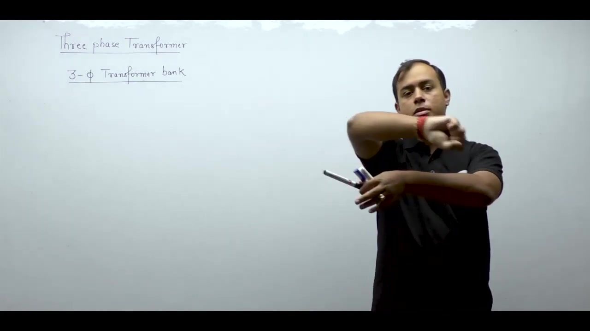

### Star-Star Connection of Three-Phase Bank

To illustrate the arrangement, consider three identical single-phase core-type transformers. Each transformer has a primary winding and a secondary winding. In practice, the primary and secondary are concentric windings on both limbs. For simplicity in schematic drawings, we show the primary winding on one limb and the secondary winding on the other limb.

Two main connection types are possible on each side: star ($\text{Y}$) and delta ($\Delta$). Consider a star-star ($\text{Y}$-$\text{Y}$) connection:

1. **Primary Side**: Connect one terminal of each of the three primary windings together to form a common junction. This common point is the primary neutral terminal ($N$). The remaining three terminals form the line terminals $A$, $B$, and $C$.
2. **Secondary Side**: Similarly, connect one terminal of each of the three secondary windings together to form the secondary neutral point ($n$). The remaining three terminals form the load line terminals $a$, $b$, and $c$.

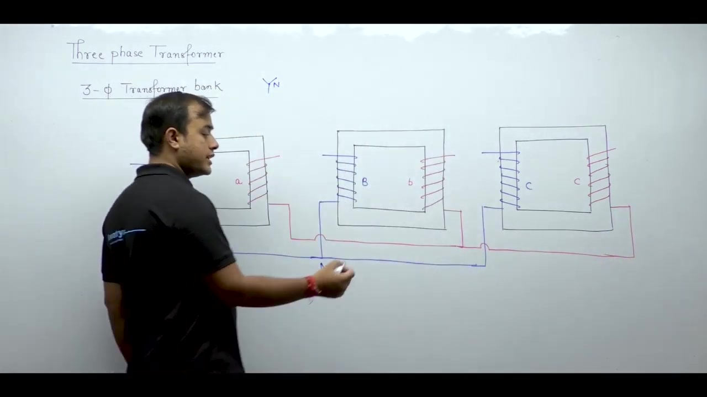

### Terminal Notation and External Interconnections

By convention, uppercase letters ($A, B, C, N$) denote high-voltage primary terminals. Lowercase letters ($a, b, c, n$) denote low-voltage secondary terminals.

In a three-phase bank, all connections are external. Four terminals come out from each single-phase transformer: two for the primary and two for the secondary. Across three transformers, a total of 12 wires come out to the terminal board. Connecting these terminals externally in star leaves six line terminals ($A, B, C$ and $a, b, c$) plus neutral points.

## Drawbacks of Transformer Banks and Introduction to Integrated Three-Phase Units
_(14:05 - 18:37)_

### Duplication and High Cost of Transformer Banks

A three-phase transformer bank uses three separate single-phase transformers. This brings several practical disadvantages:

1. **Triplication of Parts**: Each unit requires its own laminated magnetic core. Each unit requires a separate oil tank, cooling radiator, conservator, and breather.
2. **High Capital Cost**: Repeating every part three times increases manufacturing and material costs.
3. **Large Floor Space**: Three separate transformer tanks occupy much more physical floor space in a substation.

### Concept of the Integrated Three-Phase Transformer

If the windings of all three phases are placed on a single common magnetic core, cost and size can be reduced significantly.

> [!info] Definition
> A **three-phase transformer** places the windings for all three phases onto a single integrated magnetic core structure. A **three-phase transformer bank** uses three separate single-phase transformers interconnected externally.

Sharing a common core reduces total iron volume. It also requires only a single tank, one oil conservator, and one set of cooling accessories.

### Introduction to Three-Phase Core-Type Construction

Like single-phase transformers, integrated three-phase transformers are classified into core-type and shell-type constructions.

In a three-phase core-type transformer, three vertical limbs are provided. Each limb carries the primary and secondary windings for one phase. The three limbs are magnetically connected together by top and bottom horizontal yokes.

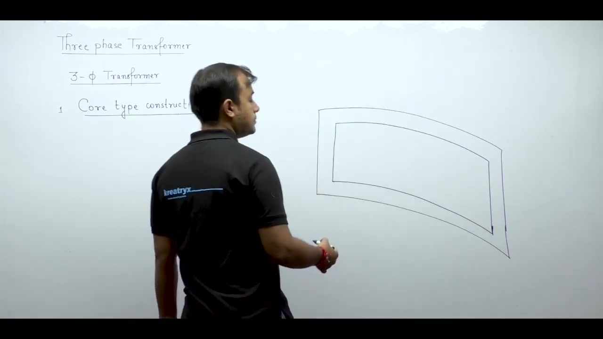

## Three-Dimensional Core-Type Transformer and Flux Balance
_(18:52 - 24:36)_

### Symmetrical 3D Three-Limbed Core Construction

To understand the core design, first consider a three-dimensional arrangement. Three identical vertical core limbs are spaced at $120^\circ$ around a central axis. Top and bottom yokes join the three limbs at common junctions.

Each limb carries both the primary and secondary windings of one phase. In practice, the windings are concentric. For clarity in diagrams, they are drawn separately. Uppercase letters $A$, $B$, and $C$ label the primary windings. Lowercase letters $a$, $b$, and $c$ label the secondary windings.

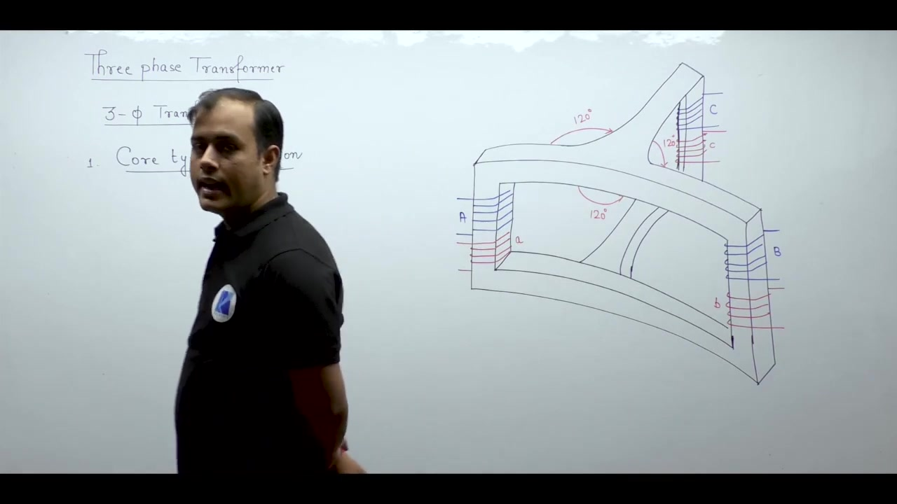

### Derivation of Magnetic Flux Balance

Consider balanced three-phase currents flowing in the windings:
$$i_a(t) + i_b(t) + i_c(t) = 0$$

All three limbs have an identical number of turns $N$. Multiplying the balanced currents by $N$ gives the magnetomotive forces (MMF):
$$
\begin{aligned}
N i_a(t) + N i_b(t) + N i_c(t) &= 0 \\
F_a(t) + F_b(t) + F_c(t) &= 0
\end{aligned}
$$

Because the core is geometrically symmetric at $120^\circ$, all three limbs have the same magnetic reluctance $\mathcal{R}$. Dividing the MMF equation by the common reluctance $\mathcal{R}$ yields:
$$\frac{F_a}{\mathcal{R}} + \frac{F_b}{\mathcal{R}} + \frac{F_c}{\mathcal{R}} = 0$$

Since magnetic flux is $\phi = F / \mathcal{R}$, this gives:

> [!success] Result
> Under balanced operating conditions, the instantaneous sum of the three-phase magnetic fluxes is zero:
> $$\phi_a(t) + \phi_b(t) + \phi_c(t) = 0$$

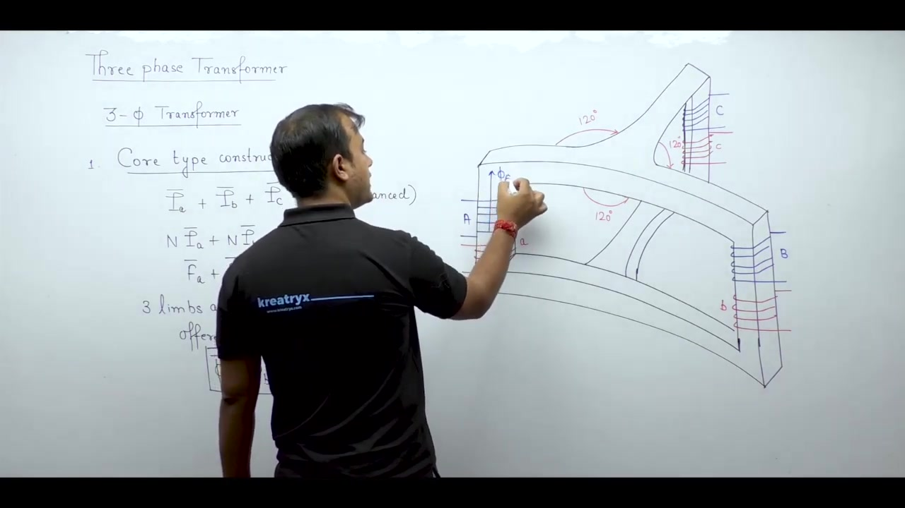

### Elimination of the Magnetic Return Path

In a single-phase transformer, the core must provide a dedicated return path for the flux. But in a balanced three-phase transformer, the sum of all three fluxes is zero at every instant.

Because the net flux at the central junction is zero, no fourth limb is needed for a return path. The magnetic circuit completes itself naturally through the other limbs:
$$\phi_a(t) = -\left(\phi_b(t) + \phi_c(t)\right)$$

This is directly analogous to a balanced three-phase three-wire electric circuit. When $i_a + i_b + i_c = 0$, no neutral return conductor is required.

## Physical Return Mechanism of Phase Fluxes
_(24:47 - 29:48)_

### Magnetic Kirchhoff's Law Analogy

In an electric circuit, Kirchhoff's Current Law (KCL) states that the sum of currents entering a junction is zero. A magnetic circuit follows the exact same rule for flux.

At the central junction of the three limbs, all three magnetic fluxes meet:
$$\phi_a(t) + \phi_b(t) + \phi_c(t) = 0$$

If the fluxes were unbalanced, the net sum would not be zero. In that case, a fourth core limb would be required to carry the unbalance flux back. But under balanced conditions, the net sum is zero. No extra core limb is needed.

### Mutual Return Paths Between Phases

Because the sum of fluxes is zero, the flux equation can be rearranged:
$$\phi_b(t) + \phi_c(t) = -\phi_a(t)$$

This means the flux of phase A divides between the limbs of phase B and phase C to complete its closed loop. No separate return core is needed because the other two phases act as the return path.

> [!info] Definition
> In a three-phase core-type transformer, the flux produced by any one phase completes its closed magnetic loop through the core limbs of the other two phases.

### Numerical Analogy with Electrical Currents

To visualize this clearly, consider a numerical example in a three-phase three-wire electric circuit.

Suppose the forward current in line A is $10\text{ A}$. For a balanced circuit, the sum of all three currents must be zero:
$$I_A + I_B + I_C = 0$$

If line B carries $-6\text{ A}$, then line C must carry $-4\text{ A}$:
$$10 + (-6) + (-4) = 0$$

The negative sign indicates current flowing in the reverse direction. Line A carries $10\text{ A}$ forward. Lines B and C carry $6\text{ A}$ and $4\text{ A}$ back. Together, they return the full $10\text{ A}$.

Magnetic flux behaves the exact same way. If phase A limb carries $10\text{ Wb}$ of flux upward, phases B and C carry $6\text{ Wb}$ and $4\text{ Wb}$ downward. The magnetic circuit remains completely closed at every instant.

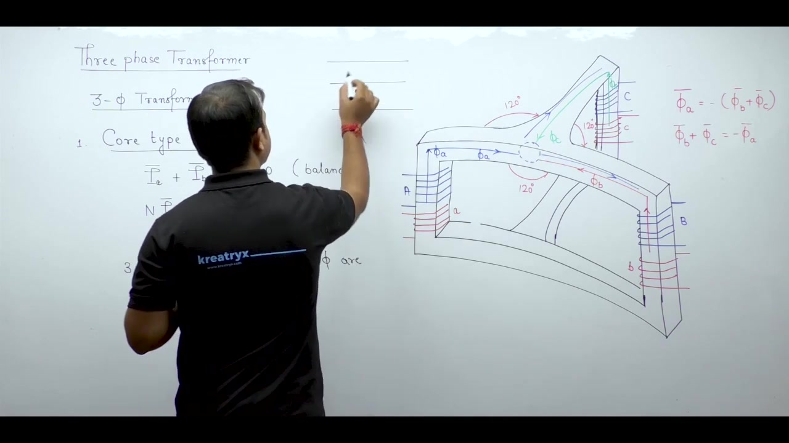

## Transition to the Planar Three-Limbed Core-Type Transformer
_(29:51 - 34:21)_

### Practical Limitations of the 3D Core Construction

The 3D core structure with limbs at $120^\circ$ offers perfect magnetic symmetry. But building a three-dimensional core is mechanically difficult. Cutting and stacking laminations at $120^\circ$ angles in three dimensions increases manufacturing complexity and labor cost.

To make manufacturing practical, transformer designers place all three limbs in a single geometric plane.

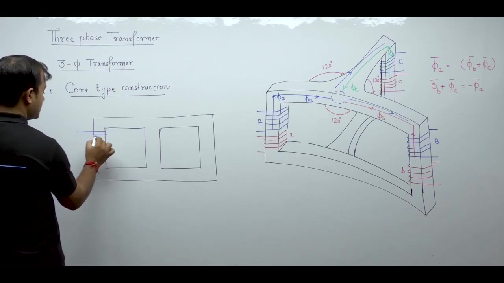

### Planar Three-Limbed Core Arrangement

In a planar three-limbed core, three parallel vertical limbs lie in one plane. Top and bottom horizontal yokes connect the limbs. This creates a core structure with two windows.

Each limb carries the primary and secondary windings of one phase:
- Left limb: Phase A windings
- Central limb: Phase B windings
- Right limb: Phase C windings

In practice, the low-voltage and high-voltage windings are concentric. For diagrammatic simplicity, they are drawn one above the other.

> [!info] Definition
> A **planar three-limbed core-type transformer** places the three phase limbs side by side in a single plane, joined by continuous top and bottom yokes.

### Reluctance Network Setup for Planar Cores

While the planar design simplifies construction, it destroys magnetic symmetry. In the 3D design, every limb sees an identical magnetic path. In the planar design, the central limb is closer to both outer limbs, while the outer limbs are separated by the full width of the core.

To analyze this asymmetry, model the core as a magnetic reluctance network. Divide the core into seven reluctance segments:
- $S_2$: Left vertical limb (Phase A)
- $S_4$: Central vertical limb (Phase B)
- $S_6$: Right vertical limb (Phase C)
- $S_1, S_3$: Top and bottom yokes of the left window
- $S_5, S_7$: Top and bottom yokes of the right window

Assume each individual segment has an identical reluctance value $S$.

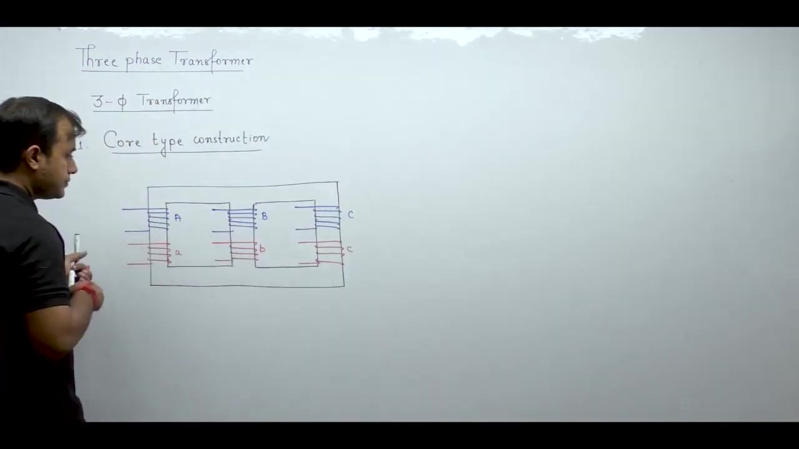

## Reluctance and Magnetizing Current Asymmetry in Planar Cores
_(34:25 - 40:34)_

### Equivalent Reluctance for Outer Limbs (Phases A and C)

To find the reluctance seen by an outer phase, energize only the Phase A winding. The MMF $N I_A$ sits on the left limb ($S_2$).

Flux leaves limb A and flows through top yoke $S_1$. At the central limb junction, it divides into two parallel paths:
1. Down through the central limb ($S_4$).
2. Across top yoke $S_5$, down right limb $S_6$, and across bottom yoke $S_7$. These three segments are in series:
   $$S_{\text{right}} = S_5 + S_6 + S_7 = S + S + S = 3S$$

The two return paths combine at the bottom of the central limb and return through bottom yoke $S_3$. Therefore, the total equivalent reluctance for Phase A is:
$$
\begin{aligned}
S_{\text{eq},A} &= S_2 + (S_1 + S_3) + (S_4 \parallel S_{\text{right}}) \\
&= S + 2S + (S \parallel 3S) \\
&= 3S + \frac{S \times 3S}{S + 3S} \\
&= 3S + 0.75S = 3.75S
\end{aligned}
$$

By symmetry, the other outer limb (Phase C) sees the exact same reluctance:
$$S_{\text{eq},C} = 3.75S$$

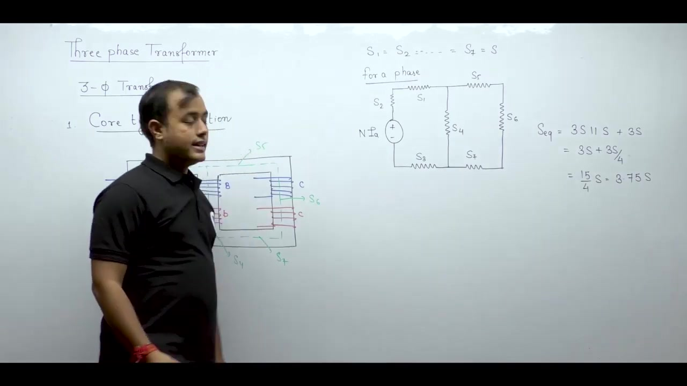

### Equivalent Reluctance for the Central Limb (Phase B)

Now consider the central limb (Phase B) energized with MMF $N I_B$. The source sits in limb segment $S_4$.

Flux leaves the top of the central limb and splits equally between two symmetrical loops:
1. Left loop through $S_1$, $S_2$, and $S_3$ in series:
   $$S_{\text{left}} = S_1 + S_2 + S_3 = 3S$$
2. Right loop through $S_5$, $S_6$, and $S_7$ in series:
   $$S_{\text{right}} = S_5 + S_6 + S_7 = 3S$$

These two loops are in parallel with each other, and in series with limb segment $S_4$:
$$
\begin{aligned}
S_{\text{eq},B} &= S_4 + (S_{\text{left}} \parallel S_{\text{right}}) \\
&= S + (3S \parallel 3S) \\
&= S + \frac{3S}{2} = 2.5S
\end{aligned}
$$

> [!success] Result
> In a planar three-limbed core, the central limb experiences significantly lower magnetic reluctance than the outer limbs:
> $$S_{\text{eq},\text{central}} = 2.5S < S_{\text{eq},\text{outer}} = 3.75S$$

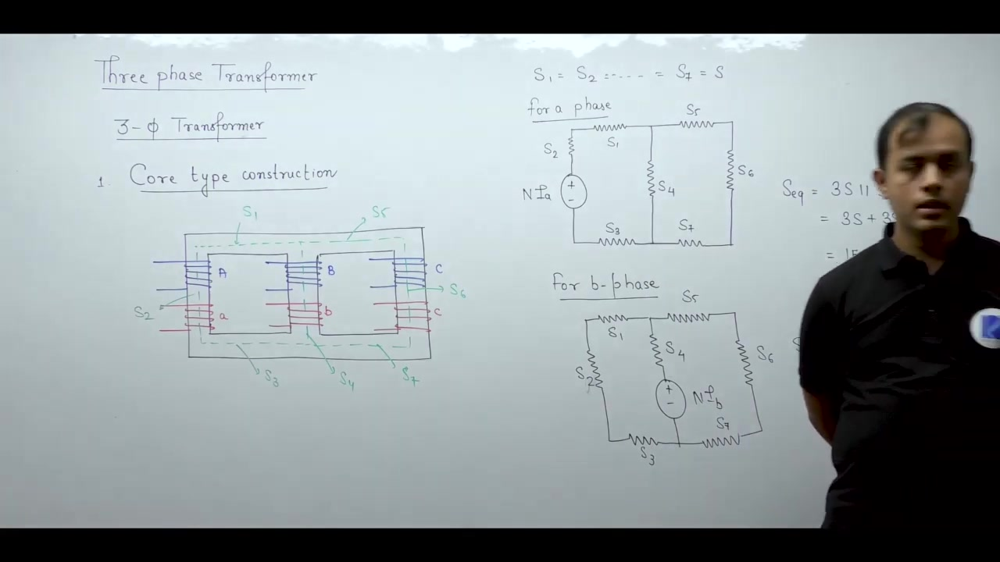

### Effect on Magnetizing Currents and Phase Balance

The magnetizing current $I_\mu$ required to produce a peak working flux $\phi$ depends directly on reluctance:
$$I_\mu = \frac{\phi \cdot S_{\text{eq}}}{N}$$

Because the central limb has lower reluctance, it requires less magnetizing current:
$$I_{\mu,B} < I_{\mu,A} = I_{\mu,C}$$

This difference causes unequal magnetizing currents among the three phases. The no-load exciting currents are slightly unbalanced even when applied voltages are perfectly balanced. However, this magnetizing current is only $2\%$ to $5\%$ of full-load current. So its effect on full-load operation is very small.

## Three-Phase Shell-Type Transformer Architecture and Flux Paths
_(40:43 - 46:10)_

### Core Architecture and Window Layout

The three-phase shell-type transformer surrounds the windings with laminated magnetic core material. The core structure contains six windows and four vertical magnetic limbs.

Windings for phases A, B, and C are placed on the central core sections. Primary windings and secondary windings are placed on the same limbs. In shell-type units, sandwich (pancake) coils are commonly used.

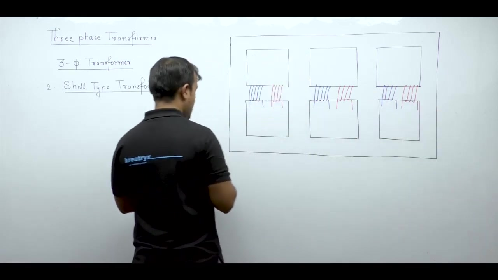

### Equivalence to Three Single-Phase Shell Units

To visualize this construction, imagine taking three single-phase shell-type transformers. Rotate each by $90^\circ$ and stack them vertically. The adjacent yokes merge into common magnetic paths.

> [!info] Definition
> A **three-phase shell-type transformer** can be viewed as three single-phase shell-type transformers stacked together. Their adjoining core sections form shared magnetic paths.

This design provides strong mechanical protection for the coils. The core steel encases the windings on nearly all sides.

### Flux Division in Outer and Intermediate Core Sections

Each phase winding produces a magnetic flux $\phi$. Because the windings sit inside closed core windows, the flux splits into two equal parallel paths:

1. One half ($\phi / 2$) returns through the upper core yoke.
2. One half ($\phi / 2$) returns through the lower core yoke.

For phase A with peak flux $\phi_a$, the flux dividing into the outer limb and top yoke is $\phi_a / 2$. Similarly, phase B produces flux $\phi_b$ that splits into two $\phi_b / 2$ components. Phase C produces flux $\phi_c$ that splits into two $\phi_c / 2$ components.

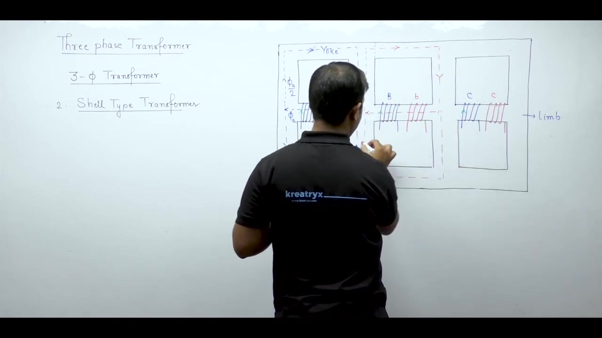

The outer limbs carry only half the flux of a single phase ($\phi / 2$). But the intermediate sections between phases carry fluxes from two adjacent phases simultaneously.

## Flux Phasor Analysis and Core Area Scaling in Shell-Type Transformers
_(46:17 - 52:31)_

### Phasor Addition in Intermediate Core Limbs

In a three-phase shell-type transformer, the three phase fluxes have equal magnitude $\phi$ and are displaced by $120^\circ$:
$$\vec{\phi}_a = \phi \angle 0^\circ, \quad \vec{\phi}_b = \phi \angle -120^\circ, \quad \vec{\phi}_c = \phi \angle 120^\circ$$

The outer limbs carry only half the flux of phase A or phase C:
$$\phi_{\text{outer}} = \frac{\phi}{2} = 0.5\phi$$

The inner intermediate yokes carry fluxes from two adjacent phases simultaneously. Because the two fluxes travel in opposite directions through the shared core section, the resultant flux is their phasor difference:
$$\vec{\phi}_{\text{inner}} = \frac{\vec{\phi}_a}{2} - \frac{\vec{\phi}_b}{2}$$

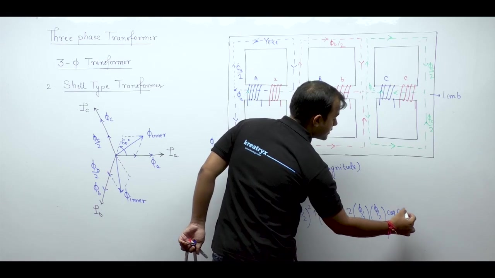

### Derivation of Intermediate Flux Magnitude

Subtracting phasor $\vec{\phi}_b / 2$ is equivalent to adding its reversed vector. Reversing $\vec{\phi}_b$ shifts its angle by $180^\circ$. The angle between $\vec{\phi}_a / 2$ and $-\vec{\phi}_b / 2$ becomes:
$$180^\circ - 120^\circ = 60^\circ$$

Using the parallelogram law of vector addition, the magnitude of the resultant flux is:
$$
\begin{aligned}
\phi_{\text{inner}} &= \sqrt{\left(\frac{\phi}{2}\right)^2 + \left(\frac{\phi}{2}\right)^2 + 2\left(\frac{\phi}{2}\right)\left(\frac{\phi}{2}\right)\cos 60^\circ} \\
&= \frac{\phi}{2} \sqrt{1 + 1 + 2(0.5)} \\
&= \frac{\phi}{2} \sqrt{3} = \frac{\sqrt{3}}{2}\phi \approx 0.866\phi
\end{aligned}
$$

> [!success] Result
> In a three-phase shell-type transformer, the flux in the intermediate core sections is $\frac{\sqrt{3}}{2} \approx 86.6\%$ of the main phase flux:
> $$\phi_{\text{inner}} = 0.866\phi$$

### Proportional Scaling of Core Cross-Sectional Area

Transformer core material is selected to operate near its maximum allowable flux density $B_{\max}$ (for instance, $1.5\text{ T}$ or $1.7\text{ T}$). Operating below this density underutilizes the steel and wastes material.

Because magnetic flux is $\phi = B \cdot A$, maintaining uniform flux density $B = B_{\max}$ requires that cross-sectional area scale in direct proportion to the flux:
$$A = \frac{\phi}{B_{\max}}$$

Let $A_{\text{main}}$ be the cross-sectional area of the main limb carrying full phase flux $\phi$. The core areas are proportioned as follows:
- **Outer limbs and outer yokes**: Carry $0.5\phi$, so their area is:
  $$A_{\text{outer}} = 0.5 A_{\text{main}}$$
- **Inner intermediate limbs**: Carry $0.866\phi$, so their area is:
  $$A_{\text{inner}} = 0.866 A_{\text{main}}$$

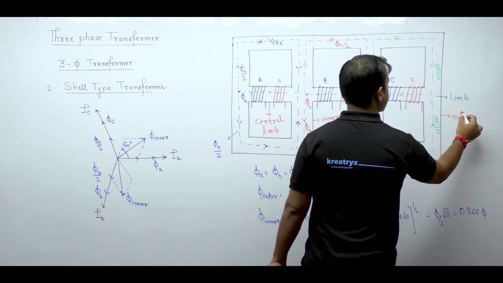

This stepped core cross-section minimizes total core weight while keeping magnetic flux density uniform throughout the transformer.

## Five-Limbed Cores and Transformer Bank vs Core-Type Comparison (Part 1)
_(52:33 - 59:56)_

### Five-Limbed Core Construction

Besides three-limbed and four-limbed cores, three-phase transformers can also use a five-limbed core.

A five-limbed core features four windows and five vertical magnetic limbs:
- The three inner limbs carry the primary and secondary windings of phases A, B, and C.
- The two outermost limbs are left unwound. They provide low-reluctance return paths for magnetic flux.

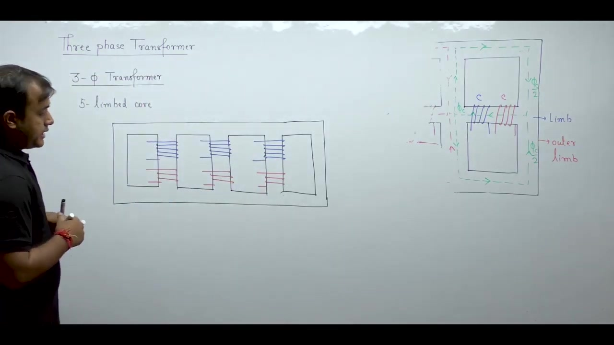

> [!info] Definition
> A **five-limbed core** has three central wound limbs and two outer unwound limbs. The outer limbs reduce total core height and provide return paths for zero-sequence and harmonic fluxes.

### Comparative Overview: Transformer Bank vs Integrated Core-Type

Selecting between a three-phase transformer bank and an integrated core-type unit involves trade-offs in cost, space, and maintenance.

| Comparison Parameter | Three-Phase Transformer Bank | Three-Phase Core-Type Transformer |
| :--- | :--- | :--- |
| **Capital Cost** | Significantly higher (3 tanks, 3 cores, 3 sets of radiators) | Lower (single core, single tank, common cooling) |
| **Terminals and Bushings** | 12 wires brought out via 12 bushings (4 per transformer) | 6 wires brought out via 6 bushings |
| **Floor Space** | Requires much larger substation floor area | Requires compact floor area |

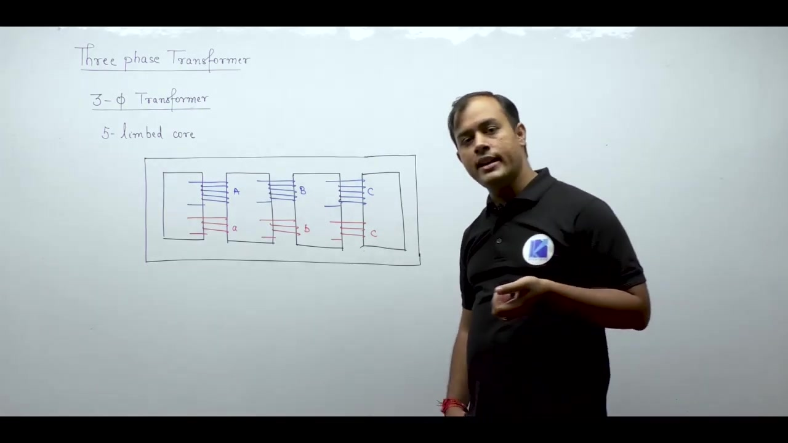

### Terminal Bushings and Floor Space Analysis

In a transformer bank, each single-phase unit brings out two primary terminals and two secondary terminals. That makes four terminals per transformer, or 12 terminals in total. Twelve high-voltage and low-voltage bushings are required on the substation yard. Interconnections for star or delta are made externally with busbars.

In contrast, an integrated three-phase core-type transformer makes the star or delta connections internally inside the tank. Only the three supply lines ($A, B, C$) and three load lines ($a, b, c$) come out through six bushings. This reduces bushing costs and simplifies outdoor switchyard connections.

Also, three separate cylindrical or rectangular tanks need clear physical spacing between them for safety and cooling. A single three-phase tank encloses all three phases in one container. This saves substantial substation land and foundation costs.

## Operational Trade-Offs and Core-Type vs Shell-Type Comparison
_(59:59 - 68:10)_

### Operational and Maintenance Comparison: Bank vs Core-Type

Beyond initial cost and space, a transformer bank and an integrated core-type unit differ in daily operation and maintenance:

| Operational Feature | Three-Phase Transformer Bank | Three-Phase Core-Type Unit |
| :--- | :--- | :--- |
| **Connection Flexibility** | High (all 12 terminals accessible externally) | Low (connections fixed inside the tank) |
| **Fault Recovery** | Only the faulty single-phase unit is replaced | The entire unit must be removed and replaced |
| **Standby Requirement** | One single-phase unit ($33.3\%$ rating) | One complete three-phase unit ($100\%$ rating) |
| **Core Volume and Losses** | Higher iron volume $\implies$ higher core loss | Lower iron volume $\implies$ lower core loss |
| **Full-Load Efficiency** | Lower efficiency due to higher iron losses | Higher efficiency due to lower iron losses |
| **Ease of Maintenance** | Easy (individual phase unit isolated and repaired) | Difficult (heavy assembly requiring large cranes) |

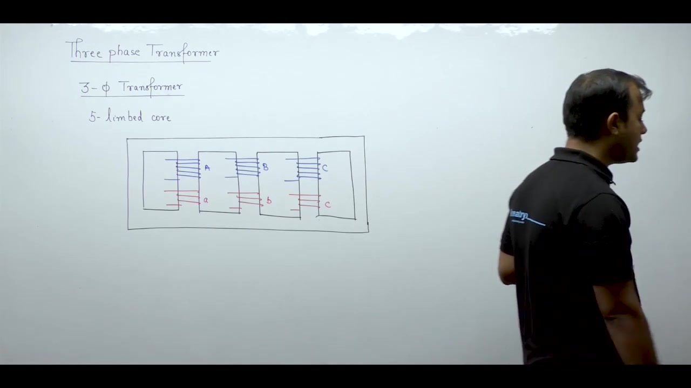

### Standby Capacity and Core Loss Economics

In a bank, spare capacity is economical. Keeping just one single-phase transformer in reserve provides full backup. If one phase suffers a fault, technicians disconnect that single unit and swap in the spare.

In contrast, if one winding fails in an integrated core-type transformer, the entire unit must be taken out of service. A spare unit must match the full three-phase rating.

However, the integrated three-phase transformer wins on efficiency. Core losses (hysteresis and eddy current losses) depend directly on the total volume of laminated core steel:
$$P_c \propto \text{Core Volume}$$

Because the three-phase core-type transformer shares yokes and limbs, its core volume is roughly $20\%$ to $25\%$ less than three separate single-phase transformers. This lower volume yields lower core losses and higher operating efficiency.

### Three-Phase Core-Type vs Shell-Type Constructional Differences

Three-phase core-type (three-limbed) and shell-type (four-limbed) transformers exhibit distinct mechanical and electrical characteristics:

| Feature | Core-Type (3-Limbed) | Shell-Type (4-Limbed) |
| :--- | :--- | :--- |
| **Mechanical Support** | Moderate mechanical support | High mechanical support against short-circuit forces |
| **Insulation Required** | Less insulation required (concentric coils) | More insulation required (sandwich coils) |
| **Copper Requirement** | More copper required (longer mean turn length) | Less copper required |
| **Power Applications** | Preferred for high-voltage, high-power systems | Preferred for low-voltage, high-current systems |
| **Third-Harmonic Flux** | Closed path absent (must pass through air/oil) | Closed low-reluctance path present in outer core |
| **Induced Phase EMF** | Always sinusoidal due to suppressed triplen flux | Sinusoidal only with a closed delta winding |

### Harmonics Preview and Conclusion

The differences in third-harmonic flux paths between core-type and shell-type units play a central role in power quality. In core-type units, third-harmonic fluxes must leave the iron and travel through high-reluctance transformer oil and the tank wall. This suppresses third-harmonic flux and keeps induced EMF sinusoidal.

In shell-type units, third-harmonic fluxes find a closed low-reluctance path through the iron frame. Unless a delta winding is present to circulate third-harmonic currents, the phase voltages distort.

Subsequent lectures analyze the phasor diagrams, phase shifts, and vector groups of star-star, star-delta, delta-star, and delta-delta three-phase connections.

---

## Summary and Key Takeaways

- A three-phase system delivers three times the power of a single-phase system with $P_{3\phi} = 3 P_{1\phi}$, but requires only $1.5$ times the copper volume for three-wire transmission.
- Under balanced sinusoidal excitation, the sum of instantaneous phase fluxes is zero ($\phi_a(t) + \phi_b(t) + \phi_c(t) = 0$), so each phase flux returns through the other two limbs.
- Planar three-limbed core-type transformers are magnetically asymmetrical because the outer limbs experience higher reluctance than the central limb ($R_{\text{outer}} > R_{\text{central}}$).
- Asymmetrical core reluctance causes unequal magnetizing currents among the three phases with $I_{ma} = I_{mc} > I_{mb}$, while phase voltages remain balanced.
- In three-phase shell-type transformers, reversing the central phase winding polarity shifts its flux by $180^\circ$ and reduces the yoke flux from $\sqrt{3}\phi$ to $\phi$.
- Reversing the central phase winding reduces required yoke cross-sectional area and core material by $42.3\%$.
- Five-limbed cores provide dedicated return paths through unwound outer limbs, allowing reduced yoke height for transport in large high-voltage units.
- A three-phase transformer bank offers higher reliability and lower spare capacity costs, whereas an integrated three-phase unit saves $15\%$ in cost and weight.

---

[← Lec 036: Problems based on Three Winding Transformer](Lecture_036_Problems_based_on_Three_Winding_Transformer.md) | [🏠 Index](00_yt_study_guide.md) | [Lec 038: Three Phase Transformer 2 →](Lecture_038_Three_Phase_Transformer_2.md)
