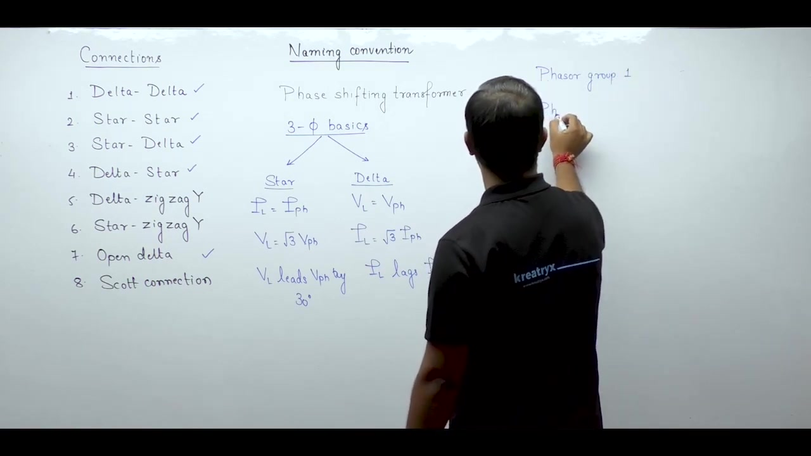
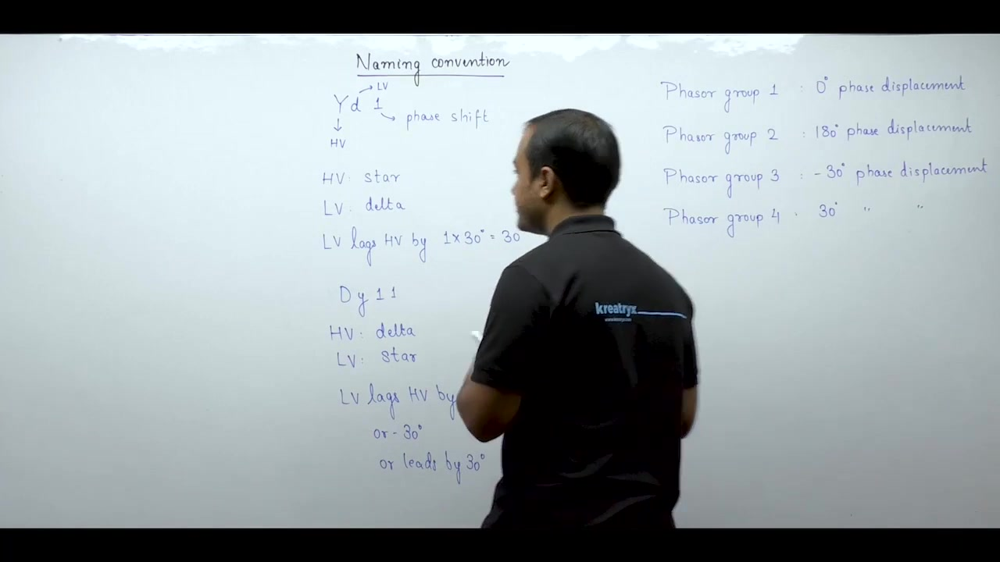
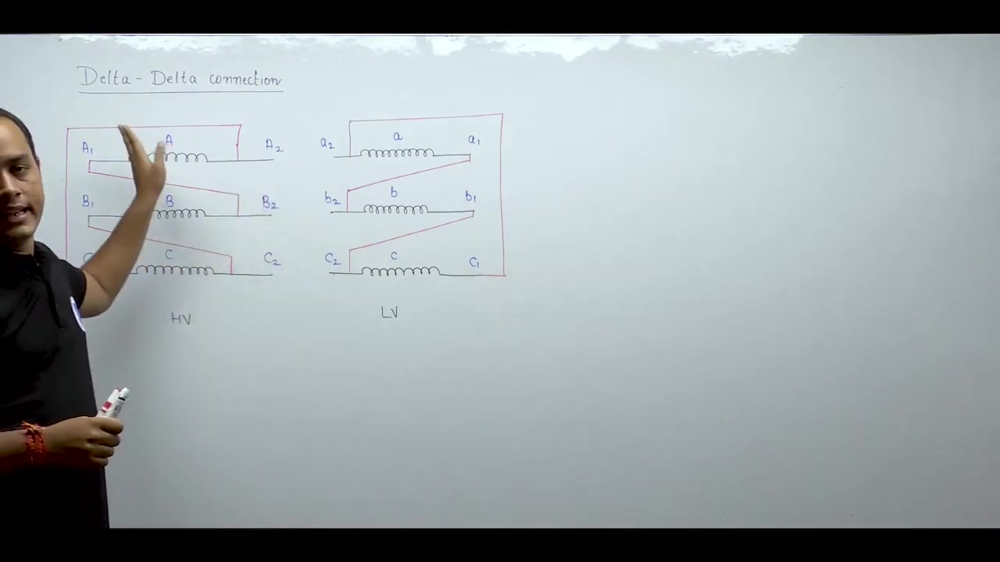
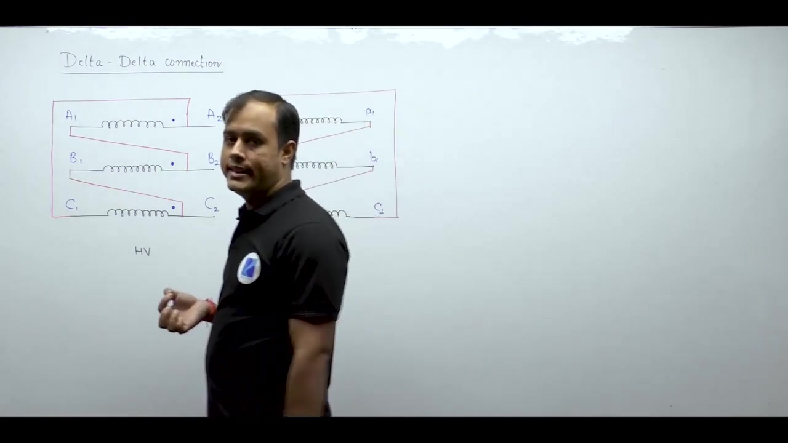
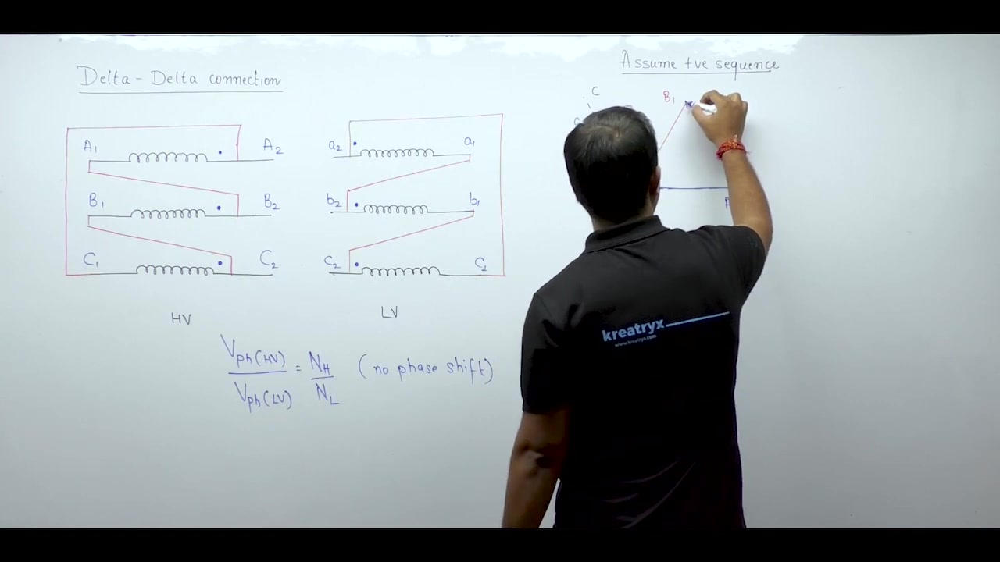
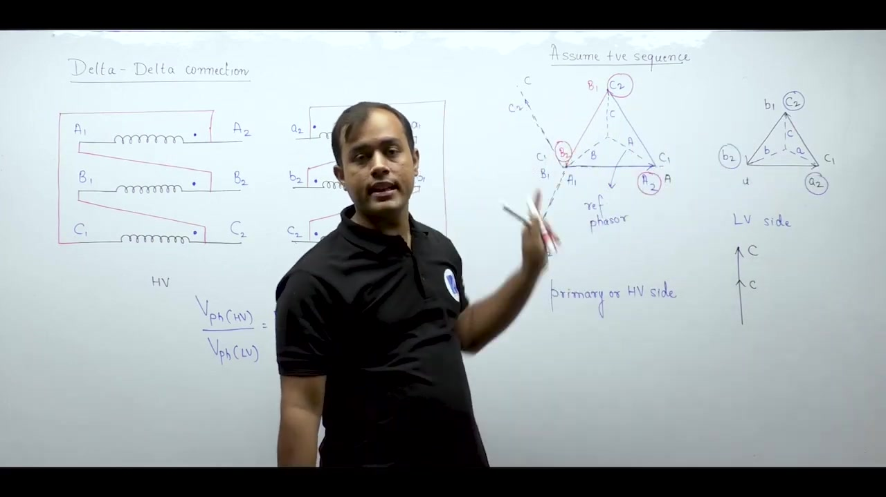
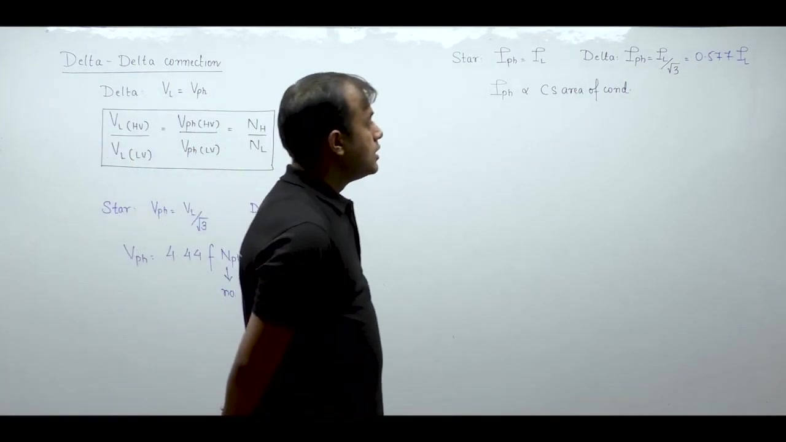

[← Lec 037: Three Phase Transformer 1](Lecture_037_Three_Phase_Transformer_1.md) | [🏠 Index](00_yt_study_guide.md) | [Lec 039: Three Phase Transformer 3 →](Lecture_039_Three_Phase_Transformer_3.md)

---

# Electrical Machines | Lec 26 | Three Phase Transformer - 2 | GATE/ESE Electrical Engineering Lecture

- **Source**: https://www.youtube.com/watch?v=5n-ERhNlN38
- **Duration**: 00:53:20
- **Compiled**: 2026-09-21

---

## Overview

This lecture examines three-phase transformer connections and their classification into standard phasor groups. It introduces the clock face method to determine angular displacement between primary and secondary line voltages. The discussion develops systematic rules for terminal labeling and dot conventions across delta and star windings. Detailed phasor analysis demonstrates the construction of Dd0 and Dd6 configurations. Finally, the lecture compares star and delta windings regarding required turns and conductor cross-sectional area.

## Contents

- [[#Three-Phase Transformer Connections and Phase Displacement Fundamentals|Three-Phase Transformer Connections and Phase Displacement Fundamentals]]
- [[#Transformer Naming Conventions and Clock Notation|Transformer Naming Conventions and Clock Notation]]
- [[#Clock Method Summary and Factors Governing Connection Selection|Clock Method Summary and Factors Governing Connection Selection]]
- [[#Parallel Operation Constraints and Delta-Delta Connection Architecture|Parallel Operation Constraints and Delta-Delta Connection Architecture]]
- [[#Dot Conventions and Phase Voltage Transformation Invariance|Dot Conventions and Phase Voltage Transformation Invariance]]
- [[#Construction of Primary Phasor Diagram for Delta Connection|Construction of Primary Phasor Diagram for Delta Connection]]
- [[#Construction of Secondary Phasor Diagram and Dd0 Verification|Construction of Secondary Phasor Diagram and Dd0 Verification]]
- [[#Inverted Secondary Connection and Dd6 Phasor Analysis|Inverted Secondary Connection and Dd6 Phasor Analysis]]
- [[#Comparative Characteristics: Delta vs Star Windings|Comparative Characteristics: Delta vs Star Windings]]

---

## Three-Phase Transformer Connections and Phase Displacement Fundamentals
_(00:13 - 08:22)_

### Overview of Three-Phase Transformer Connections

Three-phase transformers can be built using various winding configurations. In each configuration, the first term indicates the primary connection. The second term indicates the secondary connection. There are eight major connections in power engineering:

1. Delta-Delta ($\Delta-\Delta$)
2. Star-Star ($Y-Y$)
3. Star-Delta ($Y-\Delta$)
4. Delta-Star ($\Delta-Y$)
5. Delta-Zigzag Star ($\Delta-Z$)
6. Star-Zigzag Star ($Y-Z$)
7. Open Delta ($V-V$)
8. Scott Connection ($T-T$)

The first four connections along with the open delta configuration are central to the GATE curriculum. The remaining connections appear in specialized engineering examinations.

### Phase Shifting Property of Three-Phase Transformers

In single-phase transformers, the primary and secondary terminal voltages are either in phase or in antiphase. Three-phase transformers behave differently. A phase shift can exist between the primary and secondary line voltages.

> [!info] Definition: Phase Shifting Transformer
> A three-phase transformer is called a phase shifting transformer because a phase shift can exist between the primary and secondary line voltages.

Depending on the winding arrangement, this phase shift can take various values:

$$\theta \in \{0^\circ, 30^\circ, 60^\circ, 150^\circ, 180^\circ\}$$

The angular displacement is measured strictly between corresponding line voltages. It is not measured between phase voltages.

### Review of Three-Phase Circuit Relationships and Duality

Understanding three-phase transformer connections requires a clear grasp of basic three-phase circuit relationships. In balanced three-phase systems, star and delta connections exhibit mathematical duality.

In a balanced star ($Y$) connection:
- Line current equals phase current:
  $$I_L = I_{\text{ph}}$$
- Line voltage magnitude is $\sqrt{3}$ times phase voltage magnitude:
  $$V_L = \sqrt{3} V_{\text{ph}}$$
- Line voltage leads the corresponding phase voltage by $30^\circ$:
  $$\vec{V}_L = \sqrt{3} V_{\text{ph}} \angle +30^\circ$$

In a balanced delta ($\Delta$) connection:
- Line voltage equals phase voltage:
  $$V_L = V_{\text{ph}}$$
- Line current magnitude is $\sqrt{3}$ times phase current magnitude:
  $$I_L = \sqrt{3} I_{\text{ph}}$$
- Line current lags the corresponding phase current by $30^\circ$:
  $$\vec{I}_L = \sqrt{3} I_{\text{ph}} \angle -30^\circ$$

A three-phase transformer has four distinct voltage quantities. These are primary line voltage, primary phase voltage, secondary line voltage, and secondary phase voltage.

### Introduction to Phasor Groups

The name of a three-phase transformer depends on the phase shift between its primary and secondary line voltages. Power transformers are categorized into four standard phasor groups based on this angular displacement:

1. **Phasor Group 1**: $0^\circ$ phase displacement between primary and secondary line voltages.
2. **Phasor Group 2**: $180^\circ$ phase displacement.
3. **Phasor Group 3**: $-30^\circ$ phase displacement ($30^\circ$ lag).
4. **Phasor Group 4**: $+30^\circ$ phase displacement ($30^\circ$ lead).

## Transformer Naming Conventions and Clock Notation
_(08:25 - 13:40)_

### Definition of Phase Displacement Across Phasor Groups

The four standard phasor groups represent specific phase angles between primary and secondary line voltages.

> [!info] Definition: Phase Displacement
> Phase displacement in any phasor group is the angle by which the low-voltage (LV) winding voltage lags the high-voltage (HV) winding voltage.

The displacement angles for the four groups are:
- **Phasor Group 1**: $0^\circ$ displacement. Primary and secondary line voltages are in phase.
- **Phasor Group 2**: $180^\circ$ displacement. Secondary line voltage lags HV by $180^\circ$.
- **Phasor Group 3**: $-30^\circ$ displacement. Secondary line voltage lags HV by $30^\circ$.
- **Phasor Group 4**: $+30^\circ$ displacement. Secondary line voltage leads HV by $30^\circ$.

### Standard Alphanumeric Naming Convention

A standardized code identifies the winding connections and the angular displacement. The code uses three parts:
1. **First letter (Uppercase)**: Indicates the HV winding connection ($Y$ for star, $D$ for delta).
2. **Second letter (Lowercase)**: Indicates the LV winding connection ($y$ for star, $d$ for delta).
3. **Number suffix**: Indicates the phase displacement. It gives the lag angle in multiples of $30^\circ$.

Consider two standard examples:

#### Example 1: Yd1
- The HV winding is star connected ($Y$).
- The LV winding is delta connected ($d$).
- The number $1$ indicates a phase lag of $1 \times 30^\circ = 30^\circ$.
- The LV line voltage lags the HV line voltage by $30^\circ$.

#### Example 2: Dy11
- The HV winding is delta connected ($D$).
- The LV winding is star connected ($y$).
- The number $11$ indicates a lag of $11 \times 30^\circ = 330^\circ$.
- A lag of $330^\circ$ is mathematically equivalent to $-30^\circ$ or a lead of $+30^\circ$:
  $$11 \times 30^\circ = 330^\circ \equiv -30^\circ \implies \text{LV leads HV by } 30^\circ$$

### Clock Face Method for Phase Displacement

A 12-hour clock face provides a convenient visual model for phase displacement. The full circle comprises $360^\circ$. Each hour increment represents an angular displacement of:

$$\frac{360^\circ}{12} = 30^\circ$$

In this convention:
- The HV voltage phasor acts as the minute hand. It is always fixed at the 12 o'clock position.
- The LV voltage phasor acts as the hour hand. Its position indicates the phase displacement.

When the hour hand points to:
- **12 o'clock**: The phase displacement is $0^\circ$. This corresponds to Phasor Group 1 (such as Dd0 or Yy0).
- **6 o'clock**: The phase displacement is $6 \times 30^\circ = 180^\circ$. This corresponds to Phasor Group 2 (such as Dd6 or Yy6).
- **1 o'clock**: The LV phasor lags by $1 \times 30^\circ = 30^\circ$. This corresponds to Phasor Group 3 (such as Yd1 or Dy1).
- **11 o'clock**: The LV phasor points to 11. It lags by $330^\circ$, which equals a lead of $30^\circ$. This corresponds to Phasor Group 4 (such as Yd11 or Dy11).

## Clock Method Summary and Factors Governing Connection Selection
_(13:42 - 18:59)_

### Clock Notation for Group 3 and Group 4 Displacements

The clock face method provides an unambiguous way to visualize $30^\circ$ phase displacements. The high-voltage (HV) line phasor is always placed at the 12 o'clock position. It represents the minute hand. The low-voltage (LV) line phasor acts as the hour hand.

For Phasor Group 3, the secondary voltage lags the primary voltage by $30^\circ$. Moving clockwise from 12 by $30^\circ$ lands on 1. Therefore, the hour hand points to 1 o'clock. Connections with this displacement receive the suffix 1, such as Yd1 or Dy1.

For Phasor Group 4, the secondary voltage leads the primary voltage by $30^\circ$. A lead of $30^\circ$ equals a lag of $330^\circ$. Moving clockwise from 12 by $330^\circ$ lands on 11. Therefore, the hour hand points to 11 o'clock. Connections with this displacement receive the suffix 11, such as Yd11 or Dy11.

### Factors Affecting the Choice of Three-Phase Connections

Engineers evaluate several criteria when choosing a transformer connection for a specific power system application.

#### Availability of Neutral for Grounding
System grounding requires an accessible neutral point. A star connection provides an inherent neutral terminal. This terminal can be connected directly to earth or through an impedance. Grounding stabilizes system voltages during line-to-ground faults. A delta connection does not have a neutral point. If grounding is necessary, a star winding is required.

#### Insulation Requirements and Voltage Stress
Insulation thickness is proportional to the phase voltage:

$$V_{\text{ph}} = \frac{V_L}{\sqrt{3}} \quad (\text{Star}), \qquad V_{\text{ph}} = V_L \quad (\text{Delta})$$

For high-voltage transmission systems, star connection is preferred on the high-voltage side. Each phase winding experiences only $57.7\%$ of the full line-to-line voltage. This reduces dielectric stress and insulation volume. Delta connection is often chosen for low-voltage, high-current applications.

#### Circulation Path for Third-Harmonic Currents
Transformer magnetizing currents contain prominent third-harmonic components. A delta winding forms a closed loop. Third-harmonic currents circulate freely inside this loop. This traps the third-harmonic flux and prevents third-harmonic voltages from appearing on transmission lines.

#### Partial Capacity During Single-Unit Outage
In a delta-delta transformer bank, losing one single-phase unit does not cause a total blackout. The remaining two units operate in open delta ($V-V$). They can still deliver three-phase power at $57.7\%$ of the original bank capacity.

## Parallel Operation Constraints and Delta-Delta Connection Architecture
_(18:59 - 26:53)_

### Parallel Operation and Phasor Group Compatibility

Connecting two three-phase transformers in parallel requires strict electrical compatibility. In single-phase transformers, the polarities and voltage ratings must match. In three-phase transformers, the phase displacement must also match.

Both transformers must belong to the same phasor group. If their phase shifts differ, a voltage difference appears between corresponding secondary terminals. This difference drives large circulating currents through the windings. These circulating currents cause excessive heating and trip protection circuits even under no-load conditions.

### Cost Considerations in Transformer Selection

Cost is always a primary engineering constraint. Winding configurations directly influence capital expenditure. Delta connections require more turns of thinner wire. Star connections require fewer turns of thicker wire. Core steel and insulation grading also depend on the chosen connection. The final design must balance operational requirements against capital cost.

### Winding Layout and Terminal Labeling Conventions

To analyze transformer connections, windings are drawn horizontally in primary and secondary sets:

Standard conventions apply to these diagrams:
- The left set of windings represents the high-voltage (HV) side. Uppercase letters identify HV terminals ($A, B, C$).
- The right set of windings represents the low-voltage (LV) side. Lowercase letters identify LV terminals ($a, b, c$).
- Windings drawn directly opposite each other belong to the same magnetic phase. Coil $A$ faces coil $a$, coil $B$ faces coil $b$, and coil $C$ faces coil $c$.

### Polarity Conventions: Dot Notation and Terminal Indices

Each phase winding has two external ends labeled with numbers 1 and 2:
- HV terminals are denoted by $A_1-A_2$, $B_1-B_2$, and $C_1-C_2$.
- LV terminals are denoted by $a_1-a_2$, $b_1-b_2$, and $c_1-c_2$.

Terminals with identical numerical suffixes share identical instantaneous polarity. When terminal $A_2$ is positive, terminal $a_2$ is simultaneously positive. Likewise, the polarity of terminal $B_2$ matches $b_2$, and terminal $C_2$ tracks $c_2$.

Dot markings provide an equivalent representation. A dot placed at terminal $A_2$ corresponds to a dot at terminal $a_2$. Terminals bearing dots share the same polarity at every instant.

### Constructing the Delta-Delta Closed Mesh

A delta connection forms a closed mesh loop. The finish of one phase winding connects to the start of the next phase winding:
- On the HV side, terminal $A_1$ connects to $B_2$. Terminal $B_1$ connects to $C_2$. Terminal $C_1$ connects back to $A_2$.
- External supply lines connect to terminals $A_2, B_2,$ and $C_2$.
- On the LV side, terminal $a_1$ connects to $b_2$. Terminal $b_1$ connects to $c_2$. Terminal $c_1$ connects back to $a_2$.
- External load lines connect to terminals $a_2, b_2,$ and $c_2$.

## Dot Conventions and Phase Voltage Transformation Invariance
_(26:57 - 32:28)_

### Dotted Terminals and Polarity Equivalence

Polarity markings can be specified using terminal names or dot notation. Both methods convey the same physical information.

Dotted terminals on the primary and secondary windings share identical voltage polarity at every instant. When a dot on the high-voltage winding is positive, the corresponding dot on the low-voltage winding is also positive. Therefore, terminals bearing dots receive identical numerical suffixes:
- The dotted terminal of Phase A is labeled $A_2$ on the HV side and $a_2$ on the LV side.
- For Phase B, the dotted terminals are $B_2$ and $b_2$.
- For Phase C, the dotted terminals are $C_2$ and $c_2$.
- The remaining undotted terminals are labeled $A_1, B_1, C_1$ on the HV side and $a_1, b_1, c_1$ on the LV side.

### Invariance of Phase Voltage Transformation

A three-phase transformer contains three magnetic phases. Each phase acts as an individual single-phase transformer.

In any single-phase transformer, the secondary induced EMF is in phase with the primary induced EMF. The ratio of induced phase voltages equals the turns ratio:

> [!success] Result: Phase Voltage Ratio
> Across any given phase limb, the phase voltages are strictly in phase:
> $$\frac{V_{\text{ph, HV}}}{V_{\text{ph, LV}}} = \frac{N_{\text{HV}}}{N_{\text{LV}}}$$

The transformation between primary and secondary phase voltages introduces no angular displacement. Any observed phase displacement in a three-phase unit arises solely from the external interconnection of windings.

### Positive Phase Sequence Convention

Phasor analysis requires specifying the phase sequence. Unless stated otherwise, always assume a positive phase sequence ($A-B-C$).

Under positive phase sequence, the three phase voltages reach their positive maxima in the order A, B, C:
- Phase A leads Phase B by $120^\circ$.
- Phase B leads Phase C by $120^\circ$.

Phase sequence is determined by electrical phasor angles. It is not determined by the physical placement of coils on the core limbs. Do not deduce phase sequence from mechanical layout alone.

## Construction of Primary Phasor Diagram for Delta Connection
_(32:31 - 37:12)_

### Orientation and Direction Rule for Phasor Vectors

To construct the primary phasor diagram, assume a positive phase sequence ($A-B-C$). Three spatial axes spaced by $120^\circ$ define the reference directions for phases A, B, and C.

A key rule determines the direction of each phasor arrow:

> [!info] Rule: Phasor Arrow Direction
> The arrow of a phase voltage phasor must point toward the terminal that is brought out externally.

In this delta connection, terminals $A_2, B_2,$ and $C_2$ are brought out to the supply lines. Terminals $A_1, B_1,$ and $C_1$ remain internal junction points. Therefore, each phase phasor points from terminal 1 toward terminal 2:
- Phase A phasor points from $A_1$ to $A_2$.
- Phase B phasor points from $B_1$ to $B_2$.
- Phase C phasor points from $C_1$ to $C_2$.

### Geometric Construction of the Primary Delta Triangle

Phasors behave like free geometric vectors. Translating a phasor parallel to itself preserves its magnitude and phase angle.

We construct the primary delta triangle using the physical connection constraints:
1. Draw the Phase A phasor $\vec{V}_{A1A2}$ horizontally from left to right. The arrow points to $A_2$.
2. The physical connection links terminal $A_1$ directly to $B_2$. Translate the Phase B phasor parallel to its original axis until its tip $B_2$ touches $A_1$.
3. The physical connection links terminal $B_1$ directly to $C_2$. Translate the Phase C phasor parallel to its original axis until its tip $C_2$ touches $B_1$.
4. Terminal $C_1$ naturally meets terminal $A_2$. This closes the delta triangle.

The three phasors form a closed equilateral triangle. Each vertex corresponds to an interconnection between two adjacent phase coils.

### Identification of Reference Phasors

To compare primary and secondary voltages, we construct reference star phasors from the centroid of the delta triangle:
- A line drawn from the centroid to vertex $A_2$ defines reference phasor A.
- A line drawn from the centroid to vertex $B_2$ defines reference phasor B.
- A line drawn from the centroid to vertex $C_2$ defines reference phasor C.

These reference phasors represent the line-to-neutral voltages of the primary delta. They provide the angular benchmarks needed to evaluate phase displacement.

## Construction of Secondary Phasor Diagram and Dd0 Verification
_(37:16 - 41:58)_

### Parallel Placement Rule for Secondary Phase Voltages

Secondary phase voltages must be drawn parallel to their corresponding primary phase voltages. This rule directly reflects electromagnetic induction:

> [!info] Rule: Parallel Phasor Orientation
> Each secondary phase voltage phasor must be drawn strictly parallel to the primary phase voltage phasor of the same phase.

Because the low-voltage side operates at a lower potential, its phasor lengths are scaled down. The orientation of each vector remains identical to its primary counterpart.

### Geometric Construction of the Secondary Delta Triangle

The secondary delta triangle is constructed step by step:
1. Draw the Phase a phasor $\vec{V}_{a1a2}$ horizontally pointing to the right. Its direction is parallel to $\vec{V}_{A1A2}$.
2. The physical LV wiring connects terminal $a_1$ to $b_2$. Translate the Phase b phasor $\vec{V}_{b1b2}$ parallel to $\vec{V}_{B1B2}$ until tip $b_2$ touches $a_1$.
3. The physical LV wiring connects terminal $b_1$ to $c_2$. Translate the Phase c phasor $\vec{V}_{c1c2}$ parallel to $\vec{V}_{C1C2}$ until tip $c_2$ touches $b_1$.
4. Terminal $c_1$ meets terminal $a_2$, closing the secondary delta triangle.

External load terminals $a_2, b_2,$ and $c_2$ form the three vertices of the triangle.

### Determining Phase Displacement via Reference Phasors

To evaluate the angular shift between primary and secondary, draw reference phasors from the centroid of each delta triangle:
- In the primary triangle, reference phasors point to vertices $A_2, B_2,$ and $C_2$.
- In the secondary triangle, reference phasors point to vertices $a_2, b_2,$ and $c_2$.

Now select the primary reference phasor that points vertically upward. Primary reference phasor C points directly upward along the 12 o'clock direction.

Next, observe the corresponding secondary reference phasor c. It also points directly upward along the 12 o'clock direction.

### Clock Face Interpretation and Dd0 Designation

Both reference phasors align along the identical vertical axis:
- The HV minute hand points to 12 o'clock.
- The LV hour hand points to 12 o'clock.

> [!success] Result: Dd0 Connection
> The phase displacement between the primary and secondary line voltages is zero:
> $$\text{Phase Shift} = 0^\circ \implies \text{Dd0}$$

Both windings are delta connected. The angular displacement is $0^\circ$. Therefore, the standard designation for this transformer is **Dd0**.

## Inverted Secondary Connection and Dd6 Phasor Analysis
_(42:04 - 49:19)_

### Modification of Secondary Terminal Interconnections

Internal connections can be modified to alter the phase displacement of a delta-delta transformer. In this variation, the primary winding connections remain unchanged. Terminals $A_2, B_2,$ and $C_2$ are brought out to the primary lines.

The secondary interconnections are altered systematically. Terminal $b_1$ joins $a_2$, while terminal $c_1$ attaches to $b_2$. Finally, terminal $a_1$ connects back to $c_2$. Terminals $a_1, b_1,$ and $c_1$ are brought out as the external secondary lines.

### Geometric Construction of the Inverted Secondary Triangle

Secondary phase voltages must remain parallel to their primary counterparts. We construct the secondary phasor diagram using the new connection constraints:
1. Draw the Phase a phasor $\vec{V}_{a1a2}$ horizontally pointing to the right.
2. The physical connection links terminal $a_2$ to $b_1$. Translate the Phase b phasor $\vec{V}_{b1b2}$ until its start $b_1$ touches $a_2$. The vector points downward.
3. The physical connection links terminal $b_2$ to $c_1$. Translate the Phase c phasor $\vec{V}_{c1c2}$ until its start $c_1$ touches $b_2$. The vector points upward to $a_1$.
4. The three vectors form an inverted delta triangle.

The external terminals are $a_1, b_1,$ and $c_1$. They define the reference directions for the secondary phase voltages.

### Reference Phasor Evaluation and 180-Degree Displacement

Draw reference star phasors from the centroid of each triangle to the external terminals:
- In the primary triangle, reference phasor C points vertically upward to $C_2$. It aligns with the 12 o'clock position.
- In the secondary triangle, reference phasor c points from the centroid to terminal $c_1$. It points vertically downward to the 6 o'clock position.

> [!success] Result: Dd6 Connection
> The secondary reference phasor lags the primary reference phasor by $180^\circ$:
> $$\text{Phase Shift} = 180^\circ \implies \text{Dd6}$$

The primary minute hand is at 12. The secondary hour hand is at 6. This represents Phasor Group 2. The transformer is designated **Dd6**.

### Basic Voltage Transformation Relationships in Delta-Delta

In any delta connection, the line voltage equals the phase voltage:

$$V_L = V_{\text{ph}}$$

Therefore, the ratio of line voltages equals the ratio of phase voltages:

$$\frac{V_{L, \text{HV}}}{V_{L, \text{LV}}} = \frac{V_{\text{ph, HV}}}{V_{\text{ph, LV}}} = \frac{N_{\text{HV}}}{N_{\text{LV}}}$$

Single-phase transformer equations apply directly to the phase quantities of a three-phase transformer:

$$V_{\text{ph}} = 4.44 f N_{\text{ph}} \phi_m$$

Here $N_{\text{ph}}$ represents the number of turns per phase winding.

## Comparative Characteristics: Delta vs Star Windings
_(49:19 - 53:20)_

### Winding Turns for Identical Line Voltage

Consider a transformer operating at a specified line voltage $V_L$. The required number of turns per phase depends directly on the chosen connection.

In a star connection, the phase voltage is reduced by a factor of $\sqrt{3}$:

$$V_{\text{ph, star}} = \frac{V_L}{\sqrt{3}} \approx 0.577 V_L$$

In a delta connection, the full line voltage appears across each phase:

$$V_{\text{ph, delta}} = V_L$$

The induced phase voltage is proportional to the number of turns per phase:

$$V_{\text{ph}} = 4.44 f N_{\text{ph}} \phi_m$$

For the same line voltage and core flux, delta requires $\sqrt{3}$ times more turns than star:

$$N_{\text{ph, delta}} = \sqrt{3} N_{\text{ph, star}} \approx 1.732 N_{\text{ph, star}}$$

> [!success] Result: Turns Scaling
> For identical line voltage, delta requires $73.2\%$ more turns per phase than star.

### Conductor Cross-Sectional Area for Identical Line Current

Now consider a transformer rated for a specified line current $I_L$. Conductor cross-sectional area is chosen proportional to the phase current:

$$A_{\text{conductor}} \propto I_{\text{ph}}$$

In a star winding, line current flows entirely through the phase conductor:

$$I_{\text{ph, star}} = I_L$$

In a delta winding, line current divides between two phases:

$$I_{\text{ph, delta}} = \frac{I_L}{\sqrt{3}} \approx 0.577 I_L$$

> [!success] Result: Conductor Area Scaling
> For identical line current, the conductor cross-sectional area in delta is only $57.7\%$ of that required in star:
> $$A_{\text{cond, delta}} = \frac{A_{\text{cond, star}}}{\sqrt{3}} \approx 0.577 A_{\text{cond, star}}$$

Delta uses more turns of thinner wire. Star uses fewer turns of thicker wire.

### Line Voltage Output for Identical Turn Count

If both connections use windings with identical turns per phase ($N_{\text{ph}}$), their induced phase voltages are identical:

$$V_{\text{ph, delta}} = V_{\text{ph, star}} = V_{\text{ph}}$$

The resulting line voltages differ:
- In delta, the line voltage equals the phase voltage:
  $$V_{L, \text{delta}} = V_{\text{ph}}$$
- In star, the line voltage is stepped up by $\sqrt{3}$:
  $$V_{L, \text{star}} = \sqrt{3} V_{\text{ph}}$$

Star yields a line voltage $73.2\%$ higher than delta for identical winding turns.

### Practical Engineering Implications

These relationships guide winding selection in power networks:
- Star connections suit high-voltage applications. Lower phase voltage reduces insulation demands and turn counts.
- Delta connections suit high-current applications. Lower phase current allows smaller conductor cross-sections.

---

## Summary and Key Takeaways

- A three-phase transformer is a phase shifting transformer because an angular displacement exists between primary and secondary line voltages.
- Phase displacement is defined as the angle by which the low-voltage winding voltage lags the high-voltage winding voltage.
- Standard alphanumeric designations use uppercase letters for high voltage, lowercase letters for low voltage, and hour numbers for phase lag in multiples of $30^\circ$.
- On a 12-hour clock face, the high-voltage phasor is fixed at 12 as the minute hand, and the low-voltage phasor serves as the hour hand.
- Phase voltages across any individual phase limb are strictly in phase and related solely by the turns ratio ($\frac{V_{\text{ph, HV}}}{V_{\text{ph, LV}}} = \frac{N_{\text{HV}}}{N_{\text{LV}}}$).
- Connecting the finish of each winding to the start of the next phase produces a Dd0 connection with $0^\circ$ phase displacement.
- Reversing secondary connections inverts the secondary delta triangle, yielding a Dd6 connection with $180^\circ$ phase displacement.
- For identical line voltage, a delta winding requires $\sqrt{3}$ times ($73.2\%$) more turns per phase than a star winding.
- For identical line current, a delta conductor requires only $57.7\%$ ($1/\sqrt{3}$) of the cross-sectional area of a star conductor.

---

[← Lec 037: Three Phase Transformer 1](Lecture_037_Three_Phase_Transformer_1.md) | [🏠 Index](00_yt_study_guide.md) | [Lec 039: Three Phase Transformer 3 →](Lecture_039_Three_Phase_Transformer_3.md)
