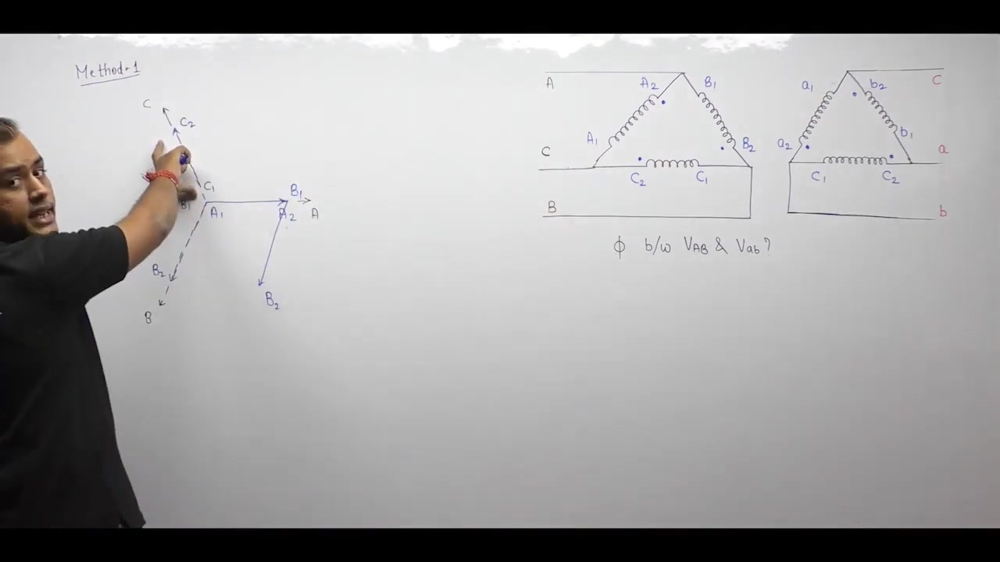
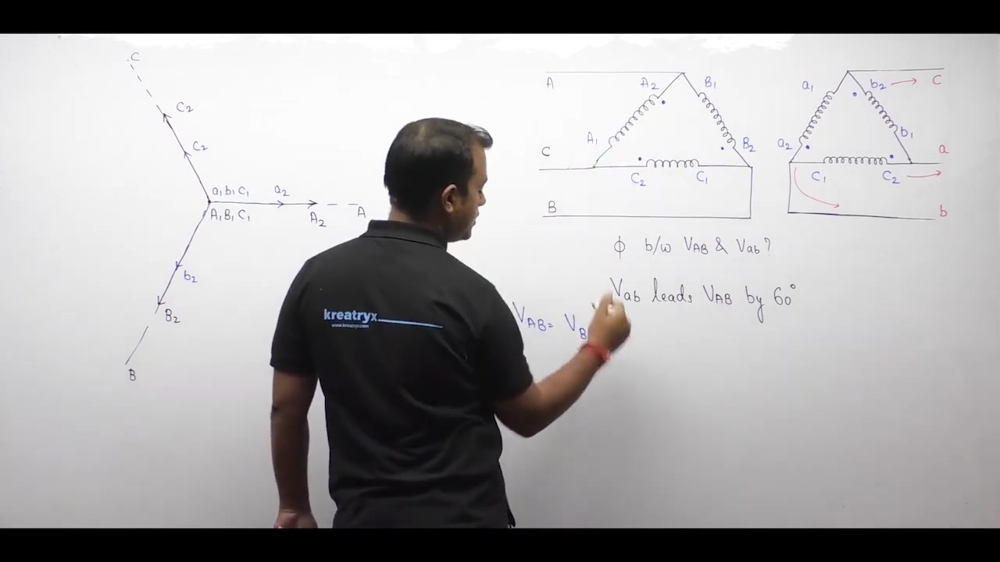
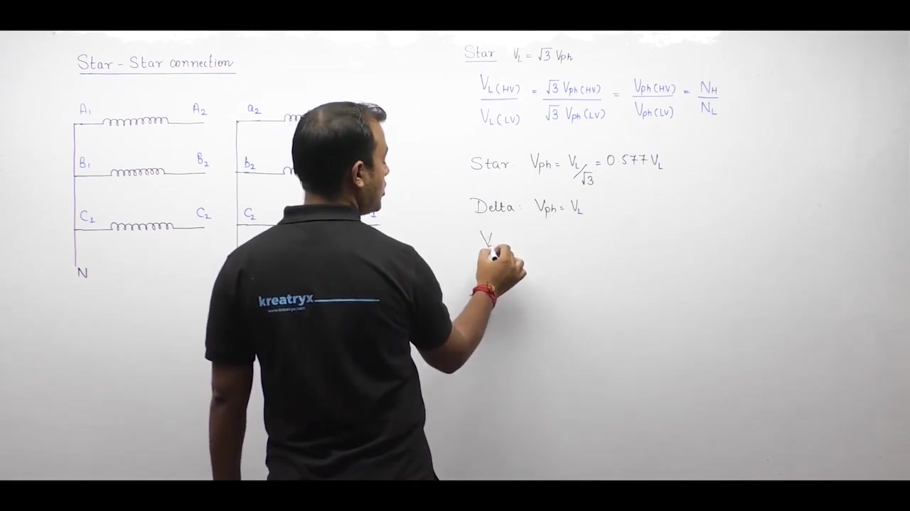
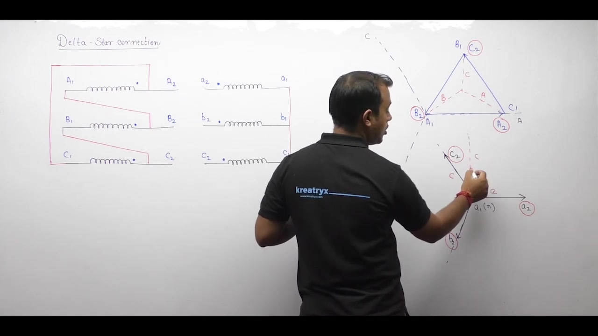
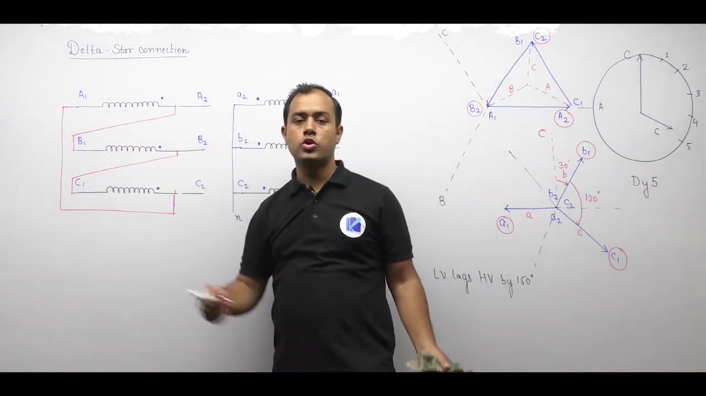
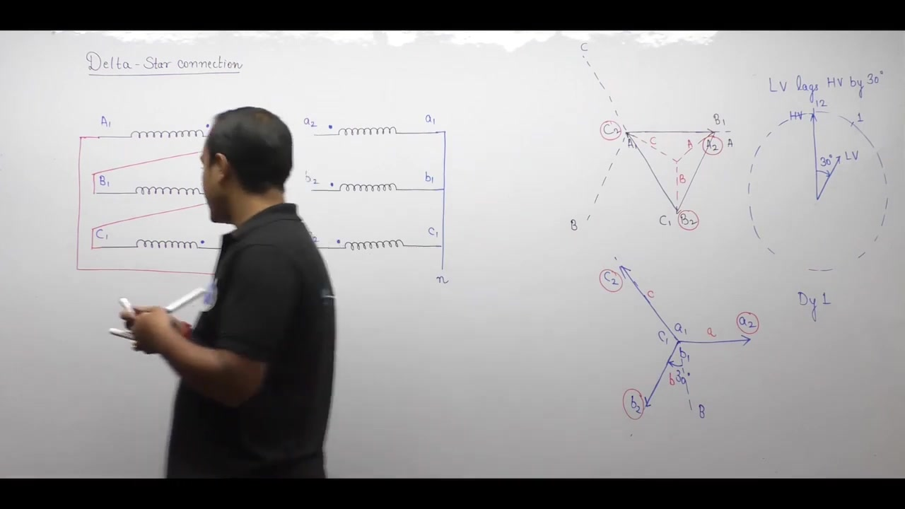

# Electrical Machines | Lec 27 | Three Phase Transformer - 3 | GATE/ESE Electrical Engineering Lecture

- **Source**: https://www.youtube.com/watch?v=QE2YCIbpFvU
- **Duration**: 00:54:27
- **Compiled**: 2026-09-21

---

## Overview

This lecture examines phase shift determination and phasor diagrams for three-phase transformers. It begins by solving non-standard delta-delta connections using both full geometric phasors and terminal voltage relations. Next, it introduces the star-star connection and derives the Yy0 and Yy6 phasor groups. The discussion then analyzes the delta-star configuration in detail. It proves how four distinct clock groups arise from winding reversals and compares their voltage ratios and harmonic performance.

## Contents

- [[#Phase Shift Determination in Delta-Delta Connection: Complete Phasor Method|Phase Shift Determination in Delta-Delta Connection: Complete Phasor Method]]
- [[#Terminal Voltage Method for Delta-Delta and Introduction to Star-Star Connection|Terminal Voltage Method for Delta-Delta and Introduction to Star-Star Connection]]
- [[#Star-Star Connection Phasor Diagrams: Yy0 and Yy6 Groups|Star-Star Connection Phasor Diagrams: Yy0 and Yy6 Groups]]
- [[#Features of Star-Star Connection and Comparison with Delta-Delta|Features of Star-Star Connection and Comparison with Delta-Delta]]
- [[#Delta-Star Connection: Winding Layout and Phasor Construction|Delta-Star Connection: Winding Layout and Phasor Construction]]
- [[#Delta-Star Phase Displacements: Dy11 and Dy5 Groups|Delta-Star Phase Displacements: Dy11 and Dy5 Groups]]
- [[#Delta-Star Phase Displacements: Derivation of the Dy7 Group|Delta-Star Phase Displacements: Derivation of the Dy7 Group]]
- [[#Delta-Star Dy1 Group, Summary of Connections, and Features|Delta-Star Dy1 Group, Summary of Connections, and Features]]

---

## Phase Shift Determination in Delta-Delta Connection: Complete Phasor Method
_(00:12 - 06:17)_

### Problem Setup and Winding Terminal Identification

In the previous lecture, we studied the basic delta-delta connection. The standard connection yields two clock positions: Dd0 with $0^\circ$ phase shift and Dd6 with $180^\circ$ phase shift. Now we consider an arbitrary delta-delta wiring to determine its exact phase displacement.

> [!example] Problem
> A three-phase delta-delta transformer has non-standard terminal interconnections. Primary terminals A, B, and C connect to dot-marked terminals $A_2, B_2,$ and $C_2$. On the secondary side, terminals a, b, and c connect to different winding junctions. Find the phase angle $\phi$ between line voltages $V_{AB}$ and $V_{ab}$.

First label the winding terminals on both sides. Parallel limbs share the same phase designation. Dot-marked terminals receive subscript 2, while unmarked terminals receive subscript 1. 

On the primary delta:
- Phase A has terminals $A_1$ and $A_2$ with the dot at $A_2$.
- Phase B has terminals $B_1$ and $B_2$ with the dot at $B_2$.
- Phase C has terminals $C_1$ and $C_2$ with the dot at $C_2$.

On the secondary delta:
- Parallel windings take lowercase letters: $a_1-a_2$, $b_1-b_2$, and $c_1-c_2$.
- Dotted terminals are labeled $a_2, b_2,$ and $c_2$.
- Unmarked ends are labeled $a_1, b_1,$ and $c_1$.

### Complete Phasor Diagram Construction (Method 1)

In the complete phasor method, start by drawing three reference axes spaced $120^\circ$ apart for A, B, and C. Assume a positive phase sequence ($A-B-C$).

Draw the primary delta phasors:
1. Draw phasor $A_1 \to A_2$ along the horizontal A-axis pointing to the right.
2. The physical connection joins $A_2$ to $B_1$. Draw phasor $B_1 \to B_2$ starting from $A_2$ pointing downwards along the B direction.
3. Terminal $B_2$ connects to $C_1$. Draw phasor $C_1 \to C_2$ from $B_2$ back to $A_1$.

The primary delta forms a closed triangle. Circle the external line terminals $A_2$, $B_2$, and $C_2$. These correspond to supply lines A, B, and C.

Next construct the secondary delta parallel to the primary:
1. Phasor $a_1 \to a_2$ must run parallel to $A_1 \to A_2$.
2. In the secondary circuit, terminal $b_2$ connects to $a_1$. Phasor $b_1 \to b_2$ is drawn parallel to $B_1 \to B_2$, ending at $a_1$.
3. Terminal $c_2$ connects to $b_1$. Phasor $c_1 \to c_2$ is drawn parallel to $C_1 \to C_2$, ending at $b_1$.

Circle the secondary external terminals based on where lines a, b, and c attach:
- Line a connects to terminal $c_2$.
- Line b connects to terminal $a_2$.
- Line c connects to terminal $b_2$.

### Phase Displacement Evaluation

To find the phase shift, compare phasors corresponding to the same phase on both sides. Look at phase B:
- Primary line terminal B lies along the direction of $B_2$, pointing downwards vertically.
- Secondary line terminal b connects to $a_2$. The secondary phasor for phase b points along $a_1 \to a_2$.

The angle between the downwards vertical and the secondary b-line phasor is $60^\circ$ counter-clockwise. Counter-clockwise rotation represents a leading phase angle.

> [!success] Result
> Secondary line voltage $V_{ab}$ leads primary line voltage $V_{AB}$ by $60^\circ$:
> $$V_{ab} \text{ leads } V_{AB} \text{ by } 60^\circ$$
> This configuration corresponds to a Dd2 connection (2 o'clock position).

## Terminal Voltage Method for Delta-Delta and Introduction to Star-Star Connection
_(06:18 - 13:03)_

### Terminal Voltage Method (Method 2)

Drawing complete delta phasor diagrams can be tedious. A much faster method uses standard star reference axes and direct terminal voltage relations. 

First draw three symmetric star axes for phases A, B, and C spaced $120^\circ$ apart. Draw the primary phase phasors along these axes:
$$A_1 \to A_2, \quad B_1 \to B_2, \quad C_1 \to C_2$$

Draw identical parallel star axes for the secondary windings:
$$a_1 \to a_2, \quad b_1 \to b_2, \quad c_1 \to c_2$$

Now express the desired line voltages in terms of individual winding terminals. Recall that a voltage $V_{XY}$ represents the potential of terminal X with respect to Y:
$$V_{XY} = V_X - V_Y$$
Graphically, phasor $V_{XY}$ points from terminal Y towards terminal X.

For the primary line voltage $V_{AB}$:
- Supply terminal A connects to winding terminal $B_1$.
- Supply terminal B connects to winding terminal $B_2$.
- Therefore:
$$V_{AB} = V_{B_1 B_2}$$
Phasor $V_{B_1 B_2}$ points from $B_2$ to $B_1$. Because $B_1 \to B_2$ points downwards along the B axis, $V_{B_1 B_2}$ points in the opposite direction upwards.

For the secondary line voltage $V_{ab}$:
- Output terminal a connects to winding terminal $c_2$.
- Output terminal b connects to winding terminal $c_1$.
- Therefore:
$$V_{ab} = V_{c_2 c_1}$$
Phasor $V_{c_2 c_1}$ points from $c_1$ to $c_2$. This lies directly along the reference phasor $c_1 \to c_2$.

Comparing the two phasors shows that $V_{ab}$ is shifted $60^\circ$ counter-clockwise relative to $V_{AB}$. Counter-clockwise rotation means leading.

> [!success] Result
> Secondary line voltage $V_{ab}$ leads primary line voltage $V_{AB}$ by $60^\circ$:
> $$V_{ab} \text{ leads } V_{AB} \text{ by } 60^\circ$$
> This confirms the result from the complete phasor diagram with much less effort.

---

### Star-Star Connection Basics

The second fundamental connection is the star-star (Y-Y) transformer. In this configuration, both primary and secondary windings are connected in star.

> [!info] Definition
> In a star connection, one end of each phase winding connects to a common junction point called the neutral. The remaining three ends connect to the external lines.

Windings are conventionally drawn as three parallel horizontal coils on each side:
- Primary windings: $A_1-A_2, B_1-B_2, C_1-C_2$.
- Secondary windings: $a_1-a_2, b_1-b_2, c_1-c_2$.
- Dot marks indicate terminals of like instantaneous polarity.

In delta, windings form a closed loop where the finish of one coil connects to the start of the next. In star, similar ends connect together:
- On the high voltage side, terminals $A_1, B_1,$ and $C_1$ join together to form neutral N.
- On the low voltage side, terminals $a_1, b_1,$ and $c_1$ join together to form neutral n.
- The opposite terminals ($A_2, B_2, C_2$ and $a_2, b_2, c_2$) connect to the phase lines.

### Phasor Diagram of Star Connection

Constructing the phasor diagram for a star connection is straightforward:
1. Choose three reference axes spaced $120^\circ$ apart, with the A axis pointing vertically upwards.
2. The common neutral point $N$ sits at the center where $A_1, B_1,$ and $C_1$ meet.
3. Draw phasors radially outward:
   - $A_1 \to A_2$ points vertically upwards along axis A.
   - $B_1 \to B_2$ points downwards and to the right along axis B.
   - $C_1 \to C_2$ points downwards and to the left along axis C.

The secondary star phasors are drawn parallel to the primary phasors. When neutral n is formed at $a_1, b_1, c_1$, the secondary phasors point outward in the exact same directions as the primary.

## Star-Star Connection Phasor Diagrams: Yy0 and Yy6 Groups
_(13:03 - 19:20)_

### Yy0 Phasor Diagram Construction

In a standard star-star connection, both neutrals are formed at identical winding ends. On the HV side, terminals $A_1, B_1,$ and $C_1$ join to form neutral N. Terminals $A_2, B_2,$ and $C_2$ connect to supply lines A, B, and C.

On the LV side, terminals $a_1, b_1,$ and $c_1$ join to form neutral n. Terminals $a_2, b_2,$ and $c_2$ connect to load lines a, b, and c.

To construct the primary phasor diagram:
1. Place neutral N at the center.
2. Draw phasor $A_1 \to A_2$ pointing vertically upwards along axis A.
3. Draw phasor $B_1 \to B_2$ displaced by $120^\circ$ clockwise.
4. Draw phasor $C_1 \to C_2$ displaced by another $120^\circ$ clockwise.

Next construct the secondary phasor diagram:
1. Place neutral n at the center.
2. Draw secondary phasors parallel to the primary windings.
3. Phasor $a_1 \to a_2$ points vertically upwards along axis a.
4. Phasors $b_1 \to b_2$ and $c_1 \to c_2$ point parallel to their primary counterparts.

Now compare the reference phasors of phase A. The HV phasor for phase A points vertically upwards to 12 o'clock. The LV phasor for phase a also points vertically upwards to 12 o'clock. The phase displacement between them is $0^\circ$.

> [!success] Result
> When both neutrals are formed at similar ends, the connection is designated **Yy0**:
> - Capital **Y** indicates an HV star connection.
> - Small **y** indicates an LV star connection.
> - **0** indicates a $0^\circ$ phase shift (12 o'clock position).

---

### Yy6 Phasor Diagram Construction

Now consider the case where the secondary neutral is formed at the opposite ends. The HV neutral remains at $A_1, B_1, C_1$ with external lines at $A_2, B_2, C_2$. On the LV side, neutral n is formed by joining $a_2, b_2,$ and $c_2$. The external lines attach to $a_1, b_1,$ and $c_1$.

The primary phasor diagram remains unchanged. Phasor $A_1 \to A_2$ points vertically upwards.

For the secondary side, each phasor must point from the neutral towards the external line terminal:
1. Because $a_2$ is neutral and $a_1$ is the line terminal, the phase voltage phasor is directed from $a_2$ to $a_1$.
2. Phasor $a_1 \to a_2$ is parallel to $A_1 \to A_2$ (upwards).
3. Therefore phasor $a_2 \to a_1$ points vertically downwards.
4. In the same way, $b_2 \to b_1$ and $c_2 \to c_1$ point in directions opposite to the primary phasors.

Now compare the reference phasors of phase A:
- Primary line phasor A points vertically upwards.
- Secondary line phasor a points vertically downwards.
- The two phasors are $180^\circ$ out of phase.

On a clock face, 6 o'clock corresponds to a $180^\circ$ displacement.

> [!success] Result
> When the secondary neutral is formed at the opposite ends, the connection is designated **Yy6**:
> - Phase displacement is $180^\circ$.
> - On the clock face, the LV phasor points to 6 o'clock while the HV phasor points to 12 o'clock.

Just like the delta-delta connection, the star-star connection allows only two standard phase angles: $0^\circ$ (Yy0) and $180^\circ$ (Yy6).

## Features of Star-Star Connection and Comparison with Delta-Delta
_(19:20 - 28:10)_

### Phasor Grouping and Parallel Operation

The star-star connection offers phase displacements of $0^\circ$ and $180^\circ$. These match the phase angles of the delta-delta connection:
- Group 1: $0^\circ$ displacement, including Yy0 and Dd0.
- Group 2: $180^\circ$ displacement, including Yy6 and Dd6.

Transformers belonging to the same phasor group can be operated in parallel. A Yy0 transformer can parallel with a Dd0 transformer if voltage ratios match.

---

### Voltage and Current Relations

In a star connection, line voltage relates to phase voltage by a factor of $\sqrt{3}$:
$$V_L = \sqrt{3} V_{ph}$$

Taking the ratio of high voltage to low voltage line voltages gives:
$$\begin{aligned}
\frac{V_{L(HV)}}{V_{L(LV)}} &= \frac{\sqrt{3} V_{ph(HV)}}{\sqrt{3} V_{ph(LV)}} \\
&= \frac{V_{ph(HV)}}{V_{ph(LV)}}
\end{aligned}$$

The ratio of phase voltages always equals the turns ratio:
$$\frac{V_{ph(HV)}}{V_{ph(LV)}} = \frac{N_H}{N_L}$$

> [!success] Result
> In a star-star connection, the line voltage ratio equals the turns ratio:
> $$\frac{V_{L(HV)}}{V_{L(LV)}} = \frac{N_H}{N_L}$$

### Comparison for the Same Line Voltage and Current

Consider a star-star and a delta-delta transformer with identical line ratings $V_L$ and $I_L$.

For voltage and insulation:
- In star, phase voltage is:
$$V_{ph} = \frac{V_L}{\sqrt{3}} \approx 0.577 V_L$$
- In delta, phase voltage equals line voltage:
$$V_{ph} = V_L$$

Because phase voltage in star is only $57.7\%$ of line voltage, fewer turns are needed per phase. The insulation requirement is also lower. This makes the star connection cheaper at high voltages.

For current and conductor size:
- In star, phase current equals line current:
$$I_{ph} = I_L$$
- In delta, phase current is lower:
$$I_{ph} = \frac{I_L}{\sqrt{3}} \approx 0.577 I_L$$

The star winding carries $\sqrt{3}$ times more phase current than delta. It requires a thicker conductor with a larger cross section. Thicker conductors are mechanically stronger and withstand short-circuit forces better.

### Comparison for the Same Phase Ratings

Now assume the phase ratings $V_{ph}$ and $I_{ph}$ are held constant for both configurations:
- Line voltage in star is $V_L = \sqrt{3} V_{ph}$, which exceeds delta ($V_L = V_{ph}$).
- Line current in star is $I_L = I_{ph}$, which is less than delta ($I_L = \sqrt{3} I_{ph}$).

Therefore star-star is best suited for high-voltage, low-current applications.

### Harmonics in Star-Star Connection

In a star connection with an isolated neutral, third harmonic currents cannot flow. There is no closed loop for them to circulate. 

Because third harmonic currents are absent in the magnetizing current, the core flux becomes flat-topped. This induces third harmonic voltages in the phase windings. The resulting phase voltages become peaked and distorted.

## Delta-Star Connection: Winding Layout and Phasor Construction
_(28:13 - 34:51)_

### Overview of Delta-Star Connection

The third basic three-phase transformer connection is the delta-star (D-y) configuration. The high voltage side is connected in delta (D). The low voltage side is connected in star (y).

> [!info] Definition
> A delta-star transformer connects the high voltage windings in a closed delta mesh and the low voltage windings in a star configuration with a common neutral.

In star-star and delta-delta, only two phase angles are possible: $0^\circ$ and $180^\circ$. In delta-star, four different clock positions can be obtained:
- Dy11 ($+30^\circ$ lead)
- Dy1 ($-30^\circ$ lag)
- Dy7 ($+150^\circ$ lead)
- Dy5 ($-150^\circ$ lag)

### Terminal Labeling and Circuit Connections

On the HV side, three windings are labeled $A_1-A_2$, $B_1-B_2$, and $C_1-C_2$. By convention, dot-marked terminals receive the subscript 2. Unmarked terminals receive the subscript 1.

The primary delta loop is formed by connecting the three coils in series:
- Terminal $A_1$ links to $B_2$.
- Next, $B_1$ joins with $C_2$.
- Finally, $C_1$ closes the mesh at $A_2$.
Supply lines A, B, and C attach to $A_2$, $B_2$, and $C_2$ respectively.

On the LV side, windings are labeled $a_1-a_2$, $b_1-b_2$, and $c_1-c_2$:
- Terminals $a_1, b_1,$ and $c_1$ connect together to form the neutral n.
- Output lines a, b, and c attach to terminals $a_2, b_2,$ and $c_2$.

### Constructing the Primary Delta Phasor

Start with three reference lines A, B, and C spaced $120^\circ$ apart:
1. Draw phasor $A_1 \to A_2$ horizontally along line A.
2. Because $B_2$ connects to $A_1$, draw phasor $B_1 \to B_2$ along direction B so that $B_2$ lands at $A_1$.
3. Because $C_2$ connects to $B_1$, draw phasor $C_1 \to C_2$ along direction C so that $C_2$ lands at $B_1$.
4. Terminal $C_1$ connects back to $A_2$, completing the closed delta triangle.

Label the external line terminals on the delta triangle:
- Point $A_2$ corresponds to line A.
- Vertex $B_2$ represents line B.
- Node $C_2$ serves as line C.

### Constructing the Secondary Star Phasor

The secondary phasors must be drawn parallel to their corresponding primary windings:
1. Place the neutral point formed by $a_1, b_1,$ and $c_1$ at the center.
2. Draw phasor $a_1 \to a_2$ horizontally to the right, parallel to $A_1 \to A_2$.
3. Draw phasor $b_1 \to b_2$ downwards to the left, parallel to $B_1 \to B_2$.
4. Draw phasor $c_1 \to c_2$ upwards to the left, parallel to $C_1 \to C_2$.

Identify the secondary line terminals:
- Node $a_2$ provides line a.
- Junction $b_2$ connects to line b.
- Terminal $c_2$ supplies line c.

Now compare the phasors of the same phase to determine the phase shift.

## Delta-Star Phase Displacements: Dy11 and Dy5 Groups
_(34:51 - 39:38)_

### Analysis of the Dy11 Connection

In the first delta-star configuration, examine the phase C phasors on both sides:
- In the primary delta, terminal $C_2$ (phase C) points vertically upwards.
- In the secondary star, phasor $c_1 \to c_2$ points upwards and to the left.

The angle between primary phase C and secondary phase c is $30^\circ$ counter-clockwise. Counter-clockwise displacement indicates a leading phase angle.

When plotted on a clock face:
- Primary HV phasor acts as the minute hand pointing to 12 o'clock.
- Secondary LV phasor leads by $30^\circ$, pointing to 11 o'clock.

> [!success] Result
> The configuration is designated **Dy11**:
> - LV line voltage leads HV line voltage by $30^\circ$.
> - The clock position is 11.

---

### Derivation of the Dy5 Connection

Now alter the secondary winding connections. The primary delta remains unchanged. On the secondary side, form the neutral at terminals $a_2, b_2,$ and $c_2$. The external phase lines now attach to $a_1, b_1,$ and $c_1$.

The primary delta phasor diagram is identical to the previous case:
- Terminal $A_2$ represents line A.
- Terminal $B_2$ represents line B.
- Terminal $C_2$ represents line C, pointing vertically upwards.

Construct the secondary star phasors from the new neutral towards the line terminals:
1. Because line terminal a connects to $a_1$, the phase phasor is directed from $a_2$ to $a_1$.
2. Primary phasor $A_1 \to A_2$ points to the right. Thus $a_2 \to a_1$ points horizontally to the left.
3. Primary phasor $B_1 \to B_2$ points downwards. Thus $b_2 \to b_1$ points upwards and to the right.
4. Primary phasor $C_1 \to C_2$ points upwards. Thus $c_2 \to c_1$ points downwards and to the right.

Now compare the vertical primary phasor C with secondary phasor c:
- Primary phasor C points vertically upwards.
- Secondary phasor c ($c_2 \to c_1$) points downwards and to the right.
- The angle between them is $30^\circ + 120^\circ = 150^\circ$ clockwise.

Clockwise displacement represents a lagging phase angle:
$$150^\circ \text{ clockwise} = 5 \times 30^\circ$$

> [!success] Result
> Inverting the secondary neutral gives the **Dy5** connection:
> - LV line voltage lags HV line voltage by $150^\circ$.
> - On the clock face, the LV phasor points to 5 o'clock.

## Delta-Star Phase Displacements: Derivation of the Dy7 Group
_(39:41 - 45:18)_

### Clock Representation for Dy5

In the Dy5 connection, the LV phasor lags the HV phasor by $150^\circ$. Each hour on a clock face corresponds to an angle of $30^\circ$:
$$\frac{150^\circ}{30^\circ/\text{hour}} = 5 \text{ hours}$$

When the HV phasor points to 12 o'clock, the lagging LV phasor points to 5 o'clock. Whenever terminals with subscript 1 are brought out as line terminals, phasors point towards 1.

---

### Reversing the Primary Delta Connection

Now consider the third possibility for delta-star. Keep the secondary connections the same as in Dy5. Neutral n is at $a_2, b_2,$ and $c_2$, while lines attach to $a_1, b_1,$ and $c_1$.

On the primary side, reverse the delta interconnections:
- In the previous cases, $A_1$ joined with $B_2$.
- In this case, connect $A_2$ to $B_1$.
- Next, connect $B_2$ to $C_1$.
- Finally, connect $C_2$ to $A_1$.

Supply lines A, B, and C attach to terminals $A_2, B_2,$ and $C_2$.

### Constructing the New Primary Delta Phasor

Follow the standard procedure on three reference axes:
1. Draw phasor $A_1 \to A_2$ along the horizontal A axis.
2. Terminal $B_1$ connects to $A_2$. Draw phasor $B_1 \to B_2$ downwards along the B line starting at $A_2$.
3. Terminal $C_1$ connects to $B_2$. Draw phasor $C_1 \to C_2$ upwards along the C line starting at $B_2$.
4. Terminal $C_2$ connects to $A_1$, closing the delta.

Circle the external line nodes:
- Junction $A_2$ serves as line A.
- Node $B_2$ provides line B.
- Terminal $C_2$ supplies line C.

### Constructing the Secondary Star Phasor

The secondary neutral is formed at $a_2, b_2,$ and $c_2$. The line terminals are $a_1, b_1,$ and $c_1$. Draw phasors from the neutral towards the lines:
1. Phasor $a_2 \to a_1$ points horizontally to the left, opposite to $A_1 \to A_2$.
2. Phasor $b_2 \to b_1$ points upwards along the reversed B direction.
3. Phasor $c_2 \to c_1$ points downwards along the reversed C direction.

Circle the secondary line terminals: $a_1$ as a, $b_1$ as b, and $c_1$ as c.

### Phase Shift Evaluation

Now compare the vertical primary phasor with its secondary counterpart:
- Primary line terminal B ($B_2$) points vertically downwards.
- Secondary line phasor b ($b_2 \to b_1$) points upwards and to the right.
- The angle between them is $30^\circ + 120^\circ = 150^\circ$ counter-clockwise.

Counter-clockwise rotation indicates a leading angle:
- Secondary voltage leads primary voltage by $150^\circ$.
- On a clock face, start at 12 and count backwards by 5 numbers: 11, 10, 9, 8, 7.
- The LV hour hand points to 7 o'clock.

> [!success] Result
> This connection is designated **Dy7**:
> - LV line voltage leads HV line voltage by $150^\circ$.
> - The clock position is 7.

## Delta-Star Dy1 Group, Summary of Connections, and Features
_(45:19 - 54:19)_

### Derivation of the Dy1 Connection

The fourth and final delta-star configuration uses the reversed primary delta. On the secondary side, neutral n forms at $a_1, b_1,$ and $c_1$. Terminals $a_2, b_2,$ and $c_2$ serve as output lines.

On the primary delta:
- Coil end $A_2$ links to $B_1$.
- Next, $B_2$ joins with $C_1$.
- Finally, $C_2$ connects to $A_1$.
Line terminals attach to $A_2$, $B_2$, and $C_2$.

Construct the primary delta phasors as before:
1. Phasor $A_1 \to A_2$ lies along axis A.
2. Phasor $B_1 \to B_2$ begins at $A_2$ and points downwards.
3. Phasor $C_1 \to C_2$ begins at $B_2$ and points upwards.
4. Line terminal B ($B_2$) points vertically downwards.

Now construct the secondary star:
1. Place neutral n ($a_1, b_1, c_1$) at the center.
2. Draw phasors from neutral to line terminals: $a_1 \to a_2, b_1 \to b_2,$ and $c_1 \to c_2$.
3. Because these match the primary direction, draw them parallel.
4. Secondary phasor b ($b_1 \to b_2$) points downwards and to the left.

Compare the primary vertical phasor B with secondary phasor b:
- Primary phasor B points straight down.
- Secondary phasor b is displaced by $30^\circ$ clockwise.
- Clockwise displacement represents a lagging phase angle.

On a clock face, a $30^\circ$ lag from 12 o'clock points to 1 o'clock.

> [!success] Result
> This configuration gives the **Dy1** connection:
> - LV line voltage lags HV line voltage by $30^\circ$.
> - The clock position is 1.

---

### Summary of Delta-Star Groups

The delta-star transformer provides four standard clock groups:
- **Dy11**: $+30^\circ$ phase shift (11 o'clock)
- **Dy1**: $-30^\circ$ phase shift (1 o'clock)
- **Dy7**: $+150^\circ$ phase shift (7 o'clock)
- **Dy5**: $-150^\circ$ phase shift (5 o'clock)

In contrast, star-star and delta-delta yield only two groups (0 and 6).

---

### Features of Delta-Star Connection

#### 1. Voltage Ratio
On the HV side, delta connection gives:
$$V_{L(HV)} = V_{ph(HV)}$$

On the LV side, star connection gives:
$$V_{L(LV)} = \sqrt{3} V_{ph(LV)}$$

Take the ratio of line voltages:
$$\begin{aligned}
\frac{V_{L(HV)}}{V_{L(LV)}} &= \frac{V_{ph(HV)}}{\sqrt{3} V_{ph(LV)}} \\
&= \frac{N_H}{\sqrt{3} N_L}
\end{aligned}$$

> [!success] Result
> In a delta-star connection, the line voltage ratio does not equal the turns ratio:
> $$\frac{V_{L(HV)}}{V_{L(LV)}} = \frac{1}{\sqrt{3}} \frac{N_H}{N_L}$$
> The line voltage ratio is smaller by a factor of $\sqrt{3}$.

Nameplate ratings for three-phase transformers always specify line-to-line voltages. For example, a $33\text{ kV} / 11\text{ kV}$ delta-star transformer has line voltages of $33\text{ kV}$ and $11\text{ kV}$. Its turns ratio must be calculated using phase voltages, not line voltages.

#### 2. Harmonic Suppression
The delta-connected primary forms a closed circulating path. Third-harmonic magnetizing currents circulate freely around this delta loop.

Because third-harmonic currents flow in the delta mesh, core flux remains sinusoidal. As a result, the induced phase voltages and line voltages remain undistorted.

#### 3. Neutral Availability
The secondary star winding provides an accessible neutral terminal. This allows supplying both three-phase and single-phase loads simultaneously. For this reason, delta-star transformers are widely used as step-down distribution transformers.

---

## Summary and Key Takeaways

- In arbitrary delta-delta connections, terminal voltage relations $V_{XY} = V_X - V_Y$ determine line voltage phase shifts without drawing full mesh triangles.
- The star-star transformer yields two standard clock positions, namely Yy0 for $0^\circ$ displacement and Yy6 for $180^\circ$ displacement.
- In a star-star bank, the line voltage ratio equals the turns ratio: $V_{L(HV)} / V_{L(LV)} = N_H / N_L$.
- Star windings experience a phase voltage of $V_L / \sqrt{3} \approx 0.577 V_L$, which reduces insulation requirements and conductor turns.
- The delta-star configuration produces four standard clock groups: Dy11 ($+30^\circ$), Dy1 ($-30^\circ$), Dy7 ($+150^\circ$), and Dy5 ($-150^\circ$).
- In a delta-star transformer, the line voltage ratio is $V_{L(HV)} / V_{L(LV)} = N_H / (\sqrt{3} N_L)$, which is smaller than the turns ratio.
- A primary delta winding provides a closed circulating loop for third harmonic currents, keeping core flux and induced EMF sinusoidal.
- Accessible secondary neutral terminals in star connections enable simultaneous supply of three-phase and single-phase loads in distribution networks.

