# Electrical Machines | Lec 28 | Three Phase Transformer - 4 | GATE/ESE Electrical Engineering Lecture

- **Source**: https://www.youtube.com/watch?v=Sg2qwYC0SKY
- **Duration**: 00:47:12
- **Compiled**: 2026-09-21

---

## Overview

This lecture completes the analysis of basic three-phase transformer connections by exploring the star-delta configuration. It derives all four star-delta clock groups including Yd1, Yd11, Yd5, and Yd7 using rigorous phasor diagrams. The discussion investigates line voltage transformation ratios and highlights third-harmonic current circulation in delta windings. Finally, it presents a shortcut method using Kirchhoff's Voltage Law to compute phase shifts under both positive and negative sequence excitation.

## Contents

- [[#Star-Delta Connection: Circuit Configuration and Phasor Construction|Star-Delta Connection: Circuit Configuration and Phasor Construction]]
- [[#Star-Delta Phase Displacements: Derivation of Yd1 and Yd11 Groups|Star-Delta Phase Displacements: Derivation of Yd1 and Yd11 Groups]]
- [[#Star-Delta Phase Displacements: Derivation of the Yd5 Group|Star-Delta Phase Displacements: Derivation of the Yd5 Group]]
- [[#Derivation of Yd7 Connection and Group Comparison|Derivation of Yd7 Connection and Group Comparison]]
- [[#Voltage Transformation and Connection Comparison|Voltage Transformation and Connection Comparison]]
- [[#Phase Shift Principles and Sequence Analysis Example|Phase Shift Principles and Sequence Analysis Example]]
- [[#Positive Sequence Phase Shift and Negative Sequence Setup|Positive Sequence Phase Shift and Negative Sequence Setup]]
- [[#Negative Sequence Solution and the Shortcut Method|Negative Sequence Solution and the Shortcut Method]]
- [[#Direct Method Application and Sequence Verification|Direct Method Application and Sequence Verification]]

---

## Star-Delta Connection: Circuit Configuration and Phasor Construction
_(00:12 - 05:26)_

### Introduction to Star-Delta (Y-d) Connection

We have examined three basic three-phase transformer configurations: delta-delta, star-star, and delta-star. The fourth basic configuration is the star-delta (Y-d) connection. 

> [!info] Definition
> In a star-delta transformer, the high voltage windings are connected in star, while the low voltage windings form a closed delta mesh.

Windings are drawn as three parallel coils on each side:
- Primary HV windings: $A_1-A_2, B_1-B_2,$ and $C_1-C_2$.
- Secondary LV windings: $a_1-a_2, b_1-b_2,$ and $c_1-c_2$.
- Dot markings receive subscript 2, while unmarked ends receive subscript 1.

On the HV side, terminals $A_1, B_1,$ and $C_1$ join to form the neutral point N. The opposite terminals $A_2, B_2,$ and $C_2$ connect to the supply lines.

On the LV side, windings connect in a delta loop:
- Terminal $a_1$ joins with $b_2$.
- Next, $b_1$ links to $c_2$.
- Finally, $c_1$ closes the mesh at $a_2$.
Load lines connect to terminals $a_2, b_2,$ and $c_2$.

### Primary Star Phasor Construction

When constructing the phasor diagram, always begin with the HV side. For a star connection, draw the reference phasor vertically upwards.

Phasors must always be directed from the common neutral towards the external line terminals:
1. Draw phasor $A_1 \to A_2$ vertically upwards along the A axis.
2. In a positive phase sequence, phase B lags phase A by $120^\circ$. Draw phasor $B_1 \to B_2$ pointing downwards and to the right.
3. Phase C lags phase B by another $120^\circ$. Draw phasor $C_1 \to C_2$ pointing downwards and to the left.
4. The three starting terminals $A_1, B_1,$ and $C_1$ meet at the common neutral point N.

### Secondary Delta Phasor Construction

The secondary phasors are constructed parallel to their corresponding primary windings:
1. Since primary phasor $A_1 \to A_2$ points vertically upwards, draw secondary phasor $a_1 \to a_2$ vertically upwards.
2. In the secondary circuit, terminal $b_2$ connects to $a_1$. Draw phasor $b_1 \to b_2$ parallel to the primary B axis, placing $b_2$ at $a_1$.
3. Terminal $c_2$ connects to $b_1$. Draw phasor $c_1 \to c_2$ parallel to the primary C axis, placing $c_2$ at $b_1$.
4. Terminal $c_1$ connects back to $a_2$, completing the closed delta triangle.

The external load terminals on the secondary delta are $a_2, b_2,$ and $c_2$. These terminals define the secondary line voltages.

## Star-Delta Phase Displacements: Derivation of Yd1 and Yd11 Groups
_(05:32 - 11:24)_

### Evaluation of the Yd1 Connection

In the first star-delta arrangement, examine the phase A phasors on both sides:
- Primary line phasor A ($A_1 \to A_2$) points vertically upwards to 12 o'clock.
- Secondary line phasor a lies at an angle of $30^\circ$ clockwise from the vertical.

Clockwise rotation indicates a lagging phase angle:
$$\text{Phase shift} = -30^\circ$$

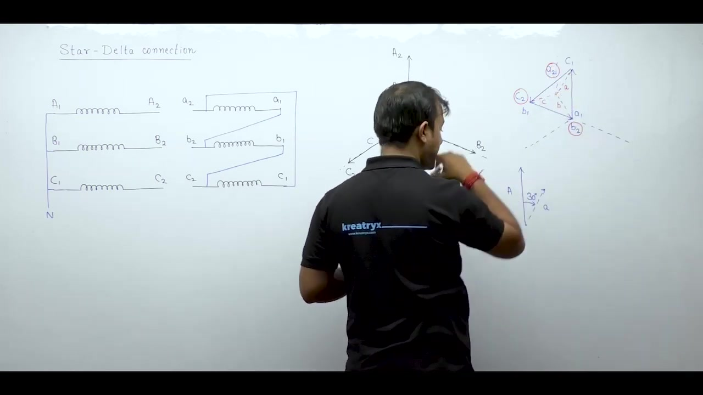

On a clock face, a $30^\circ$ lag from 12 o'clock points directly to 1 o'clock. The HV phasor acts as the minute hand at 12, and the LV phasor acts as the hour hand at 1.

> [!success] Result
> This configuration is designated **Yd1**:
> - Capital **Y** denotes the HV star connection.
> - Small **d** denotes the LV delta connection.
> - **1** denotes a $30^\circ$ lagging phase displacement (1 o'clock position).

---

### Derivation of the Yd11 Connection

Now modify the secondary delta interconnections while keeping the primary star unchanged.

Connect the secondary delta as follows:
- Terminal $a_2$ links to $b_1$.
- Next, $b_2$ joins with $c_1$.
- Finally, $c_2$ closes the loop at $a_1$.
External load lines connect to terminals $a_2, b_2,$ and $c_2$.

Construct the primary star phasors as before:
- Phasor $A_1 \to A_2$ points vertically upwards.
- Phasor $B_1 \to B_2$ points downwards and to the right.
- Phasor $C_1 \to C_2$ points downwards and to the left.

Now construct the secondary delta phasors parallel to the primary:
1. Draw phasor $a_1 \to a_2$ vertically upwards.
2. Terminal $b_1$ connects to $a_2$. Draw phasor $b_1 \to b_2$ parallel to the primary B axis, starting from $a_2$.
3. Terminal $c_1$ connects to $b_2$. Draw phasor $c_1 \to c_2$ parallel to the primary C axis, starting from $b_2$.
4. Terminal $c_2$ closes the loop at $a_1$.

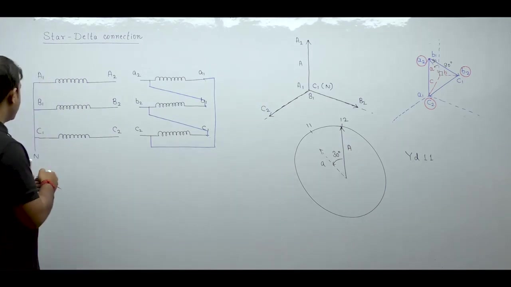

Circle the external line terminals $a_2$ (line a), $b_2$ (line b), and $c_2$ (line c).

Now compare the vertical primary phasor A with secondary phasor a:
- Primary phasor A points vertically upwards.
- Secondary phasor a lies $30^\circ$ to the left of the vertical.
- Counter-clockwise displacement represents a leading angle.

On a clock face, $30^\circ$ counter-clockwise from 12 corresponds to 11 o'clock.

> [!success] Result
> This configuration is designated **Yd11**:
> - LV line voltage leads HV line voltage by $30^\circ$.
> - On the clock face, the LV phasor points to 11 o'clock.

## Star-Delta Phase Displacements: Derivation of the Yd5 Group
_(11:26 - 16:26)_

### Primary Star Phasor with Inverted Neutral

In the third star-delta arrangement, shift the primary neutral point. The neutral N forms by joining terminals $A_2, B_2,$ and $C_2$. Supply lines now attach to terminals $A_1, B_1,$ and $C_1$.

Because external lines connect to subscript 1, phasors must point from subscript 2 to subscript 1:
1. Draw primary phasor $A_2 \to A_1$ vertically upwards along the A axis.
2. In positive sequence, phase B lags by $120^\circ$. Draw phasor $B_2 \to B_1$ pointing downwards to the right.
3. Phase C lags phase B by another $120^\circ$. Draw phasor $C_2 \to C_1$ pointing downwards to the left.
4. All three starting points $A_2, B_2,$ and $C_2$ meet at the common neutral point N.

### Anti-Parallel Secondary Delta Phasor Construction

On the secondary LV side, external line terminals remain $a_2, b_2,$ and $c_2$. The secondary phasors must therefore be directed from 1 to 2 ($a_1 \to a_2, b_1 \to b_2, c_1 \to c_2$).

When the primary phasor points from 2 to 1 and the secondary points from 1 to 2, the two sets of phasors become anti-parallel:
1. Primary phasor $A_2 \to A_1$ points upwards. Therefore secondary phasor $a_1 \to a_2$ points vertically downwards.
2. Primary phasor $B_2 \to B_1$ points downwards to the right. Therefore secondary phasor $b_1 \to b_2$ points upwards to the left.
3. Connect $b_1$ at terminal $a_2$.
4. Primary phasor $C_2 \to C_1$ points downwards to the left. Therefore secondary phasor $c_1 \to c_2$ points upwards to the right.
5. Connect $c_1$ at terminal $b_2$, while $c_2$ links back to $a_1$.

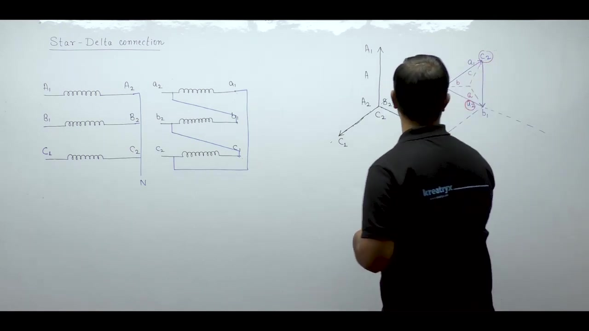

### Phase Displacement and Clock Designation

Circle the secondary load terminals $a_2, b_2,$ and $c_2$:
- Terminal $a_2$ provides line a.
- Junction $b_2$ connects to line b.
- Terminal $c_2$ supplies line c.

Now compare the vertical primary phasor A with secondary phasor a:
- Primary phasor A ($A_2 \to A_1$) points vertically upwards to 12 o'clock.
- Secondary phasor a ($a_1 \to a_2$) points downwards, displaced by $150^\circ$ clockwise from the vertical.
- Clockwise displacement indicates a lagging phase angle.

On a clock face, each hour corresponds to $30^\circ$:
$$\frac{150^\circ}{30^\circ/\text{hour}} = 5 \text{ hours}$$

The secondary phasor points to 5 o'clock.

> [!success] Result
> This configuration gives the **Yd5** connection:
> - LV line voltage lags HV line voltage by $150^\circ$.
> - On the clock face, the LV phasor points to 5 o'clock.

## Derivation of Yd7 Connection and Group Comparison
_(16:28 - 21:25)_

### Primary Star Winding and Secondary Delta Layout

Consider the primary star winding first. The line terminals are $A_1, B_1,$ and $C_1$. All neutral connections meet at terminals $A_2, B_2,$ and $C_2$. Therefore each phase phasor points from terminal 2 toward terminal 1. The phasor for phase A points straight up along the 12 o'clock direction. Phase B lags phase A by $120^\circ$, so it points toward 4 o'clock. Phase C lags phase B by another $120^\circ$, pointing toward 8 o'clock.

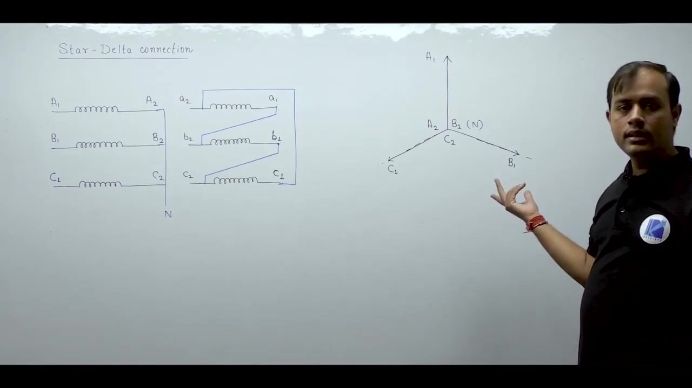

On the secondary delta side, the output terminals brought out to the load are $a_2, b_2,$ and $c_2$. Because load currents leave from index 2, we define the voltage phasors from terminal 1 to terminal 2. This direction opposes the primary winding convention. If the primary phasor $A_2 A_1$ points upward, the secondary phasor $a_1 a_2$ must point downward. Both phasors remain parallel to the same magnetic axis but carry opposite arrows.

### Phasor Construction for Yd7

Now we construct the closed secondary delta. Terminal $b_2$ connects directly to terminal $a_1$. The phasor $b_1 b_2$ runs antiparallel to the primary phasor $B_2 B_1$. Because $B_2 B_1$ points downward to the right, $b_1 b_2$ points upward to the left. We place the start of this phasor at node $a_1$.

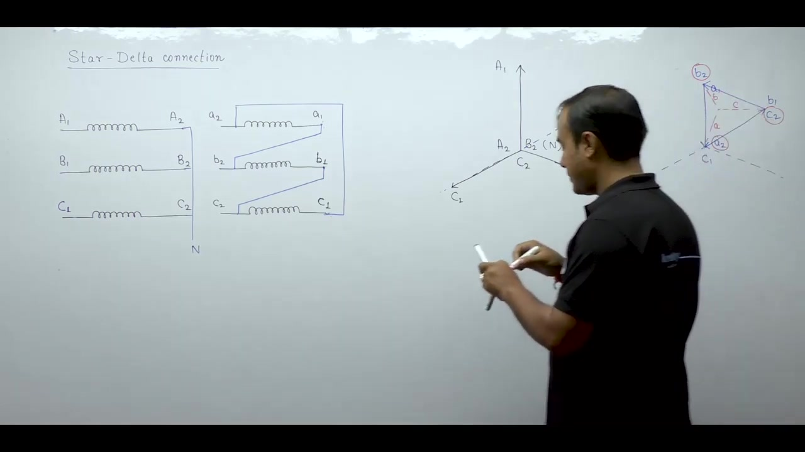

Next, terminal $c_2$ joins with terminal $b_1$. The phasor $c_1 c_2$ runs antiparallel to primary phasor $C_2 C_1$. We position $c_2$ at node $b_1$. The delta triangle closes when terminal $a_2$ connects with terminal $c_1$.

We now examine the phase displacement between primary and secondary line voltages. Primary line terminal A points upward toward 12 o'clock. Secondary line terminal a points toward 7 o'clock. The angular displacement between them equals $210^\circ$ lagging, or $150^\circ$ leading.

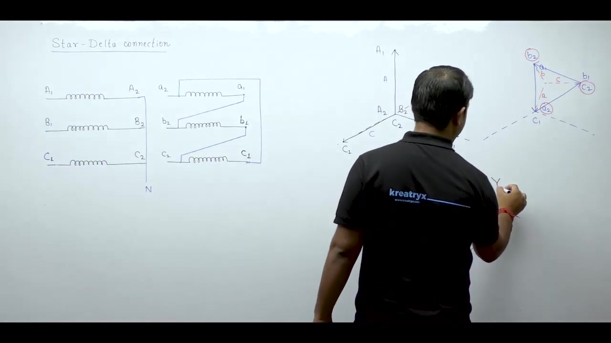

Each hour mark on the clock dial corresponds to $30^\circ$. A displacement of $150^\circ$ covers 5 hour positions. Counting past 12 gives:
$$
12 \to 11 \to 10 \to 9 \to 8 \to 7
$$
The secondary line voltage phasor lands on 7 o'clock. Therefore this configuration is named the Yd7 connection.

> [!success] Result
> A star-delta connection with secondary terminals $a_2, b_2, c_2$ brought out yields a Yd7 connection. The secondary voltage lags the primary voltage by $210^\circ$.

### Possible Connections and Phasor Groups

Just as in delta-star transformers, four distinct configurations are possible for star-delta transformers:
1. Yd1 ($-30^\circ$ or $330^\circ$ lag)
2. Yd11 ($+30^\circ$ or $30^\circ$ lag)
3. Yd5 ($-150^\circ$ or $210^\circ$ lag)
4. Yd7 ($-210^\circ$ or $150^\circ$ lag)

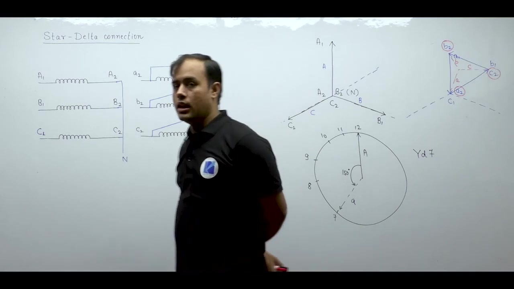

Both star-delta and delta-star connections produce identical phase shifts. So star-delta and delta-star transformers belong to the exact same phasor groups. Transformers from these groups can operate in parallel if their clock numbers match.

### Features of Star-Delta Connection

Star-delta transformers share several key performance characteristics. The first feature is the ratio of line voltages. Let the primary phase voltage be $V_{ph1}$ and the secondary phase voltage be $V_{ph2}$. The turns ratio per phase is $N_1 / N_2$.

For the star primary side:
$$
V_{L1} = \sqrt{3} V_{ph1}
$$

For the delta secondary side:
$$
V_{L2} = V_{ph2}
$$

The overall line voltage ratio becomes:
$$
\frac{V_{L1}}{V_{L2}} = \sqrt{3} \left(\frac{V_{ph1}}{V_{ph2}}\right) = \sqrt{3} \left(\frac{N_1}{N_2}\right)
$$
This factor of $\sqrt{3}$ makes the star-delta configuration ideal for step-down applications at the receiving end of transmission lines.

## Voltage Transformation and Connection Comparison
_(21:28 - 26:13)_

### Voltage Transformation Ratio in Star-Delta

Let us analyze the ratio of line voltages for a star-delta transformer. Assume the high-voltage side is star-connected and the low-voltage side is delta-connected.

In a star winding, the line voltage relates to the phase voltage by:
$$
V_{L(HV)} = \sqrt{3} V_{ph(HV)}
$$

In a delta winding, the line voltage equals the phase voltage:
$$
V_{L(LV)} = V_{ph(LV)}
$$

The ratio of phase voltages equals the turns ratio $N_H / N_L$. We divide the line voltages to find:
$$
\frac{V_{L(HV)}}{V_{L(LV)}} = \frac{\sqrt{3} V_{ph(HV)}}{V_{ph(LV)}} = \sqrt{3} \left(\frac{N_H}{N_L}\right)
$$

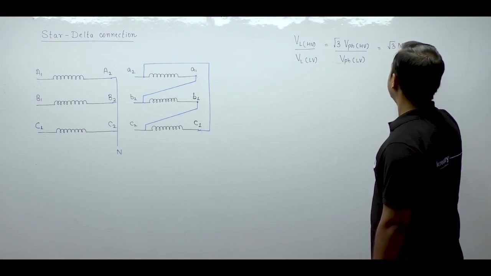

The line voltage ratio does not match the turns ratio. The factor $\sqrt{3}$ appears directly in the numerator. So the overall transformation ratio exceeds that of star-star or delta-delta banks with identical turns.

Nameplate ratings on transformers always state line-to-line voltages. For example, a $33\text{ kV} / 11\text{ kV}$ rating gives line voltages. It never specifies the turns ratio directly. Engineers must convert this line ratio into turns ratio using the winding connection.

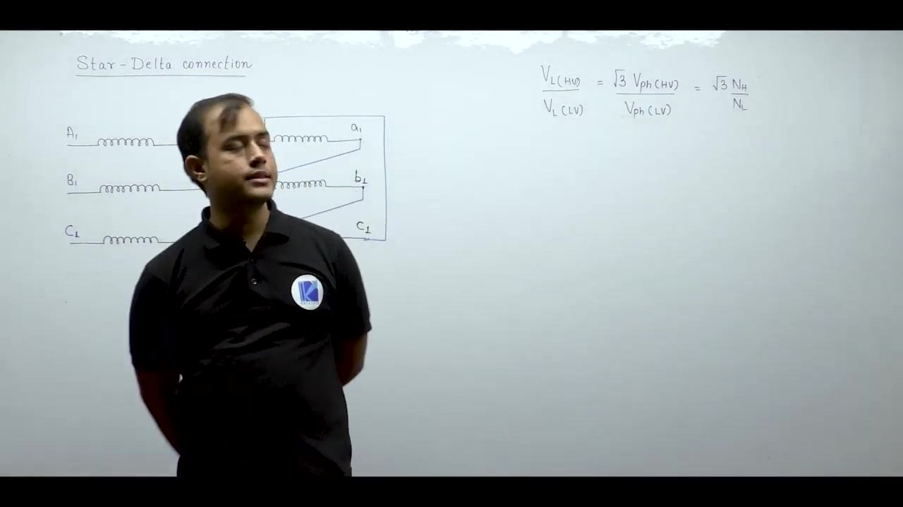

### Third-Harmonic Suppression in Delta Windings

The delta-connected secondary winding provides a closed loop for third-harmonic currents. These zero-sequence currents circulate freely inside the delta loop. They do not escape into external line conductors.

Circulating third-harmonic currents provide the needed harmonic magnetizing ampere-turns. As a result, the core magnetic flux remains sinusoidal. The induced phase and line voltages also stay free of third-harmonic distortion.

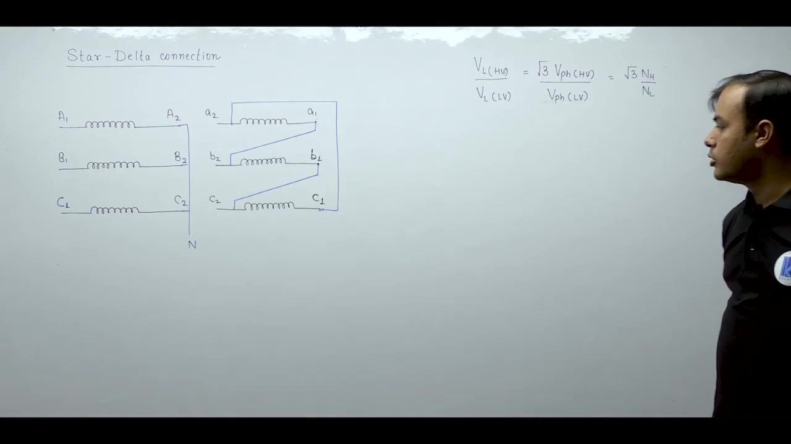

### Summary of Four Basic Connections

We have now analyzed all four basic three-phase transformer connections. Here is a direct comparison of their behaviors:

1. **Star-Star (Yy)**: Only two clock groups are possible, Yy0 and Yy6. The line voltage ratio equals the phase turns ratio.
2. **Delta-Delta (Dd)**: Only two clock groups exist, Dd0 and Dd6. The line voltage ratio equals the turns ratio.
3. **Delta-Star (Dy)**: Four clock groups exist, Dy1, Dy11, Dy5, and Dy7. The line voltage ratio contains a $1/\sqrt{3}$ factor relative to the turns ratio when HV is delta.
4. **Star-Delta (Yd)**: Four clock groups exist, Yd1, Yd11, Yd5, and Yd7. The line voltage ratio contains a $\sqrt{3}$ factor relative to the turns ratio when HV is star.

> [!success] Result
> Star-delta and delta-star connections belong to identical clock groups (1, 11, 5, 7). Both introduce a $30^\circ$ or $150^\circ$ phase shift between primary and secondary line voltages.

## Phase Shift Principles and Sequence Analysis Example
_(26:16 - 32:16)_

### Line Voltage Phase Shift Fundamentals

A key rule governs all three-phase transformer analysis: phase shift is measured between line voltages. Primary and secondary phase voltages on the same core leg remain strictly in phase. They behave like ideal single-phase transformers.

Do not memorize complex conversion formulas. Instead, convert line quantities to phase quantities first. Apply the turns ratio $N_1/N_2$ directly across phase voltages. Then convert the secondary phase quantities back into line values.

### Sequence Analysis Problem Statement

Sequence voltages can alter transformer phase shift behavior. Let us examine how positive and negative sequence inputs affect angular displacement.

> [!example] Problem
> A three-phase transformer has primary and secondary windings connected as shown in the circuit diagram. Determine the phase shift between primary and secondary line voltages for:
> 1. A positive sequence supply.
> 2. A negative sequence supply.

### Terminal Labeling from Dot Conventions

To solve this problem systematically, we first label every terminal using dot conventions. We assign index 2 to every dotted terminal. The undotted end of that same winding receives index 1.

On the primary side:
- The dot at line terminal A becomes $A_2$, and its other end is $A_1$.
- The dot at line terminal B becomes $B_2$, and its other end is $B_1$.
- The dot at line terminal C becomes $C_2$, and its other end is $C_1$.

On the secondary side, parallel windings correspond to the same phase limb:
- The winding parallel to phase A receives labels $a_2$ at the dot and $a_1$ at the other end.
- The winding parallel to phase B receives labels $b_2$ at the dot and $b_1$ at the other end.
- The winding parallel to phase C receives labels $c_2$ at the dot and $c_1$ at the other end.

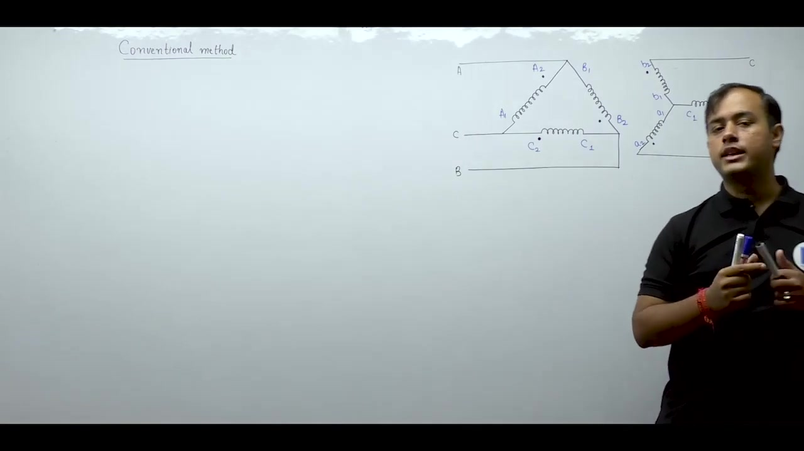

### Constructing the Primary Phasor Diagram for Positive Sequence

We begin by evaluating the positive sequence condition. The phase sequence follows the standard order A-B-C.

The primary winding forms a delta loop. We draw the three phase phasors in sequence:
1. Draw phasor $A_1 A_2$ along the vertical axis pointing upward.
2. In the circuit, terminal $B_1$ connects directly to node $A_2$. Phasor $B_1 B_2$ points downward to the right, lagging phase A by $120^\circ$.
3. Terminal $C_1$ connects directly to node $B_2$. Phasor $C_1 C_2$ points upward to the left, closing the delta triangle back at node $A_1$.

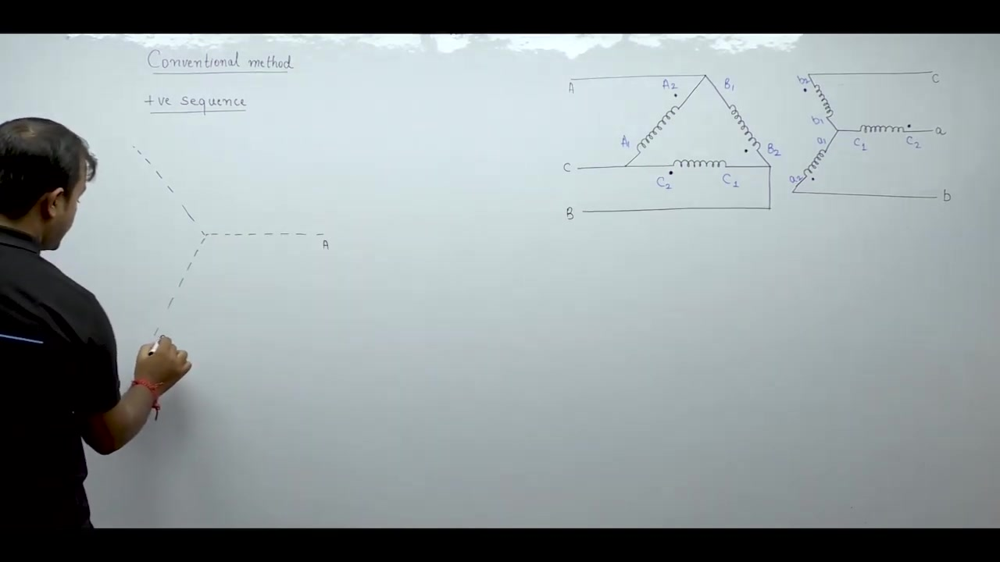

With the primary delta polygon established, we can next map the secondary phasors. Secondary windings will align parallel to their primary counterparts.

## Positive Sequence Phase Shift and Negative Sequence Setup
_(32:20 - 36:56)_

### Completing the Secondary Star for Positive Sequence

Now we construct the secondary star diagram. Terminals $a_1, b_1,$ and $c_1$ connect to form a common neutral point. Each secondary phase phasor stays strictly parallel to its corresponding primary phase.

Phasor $a_1 a_2$ aligns parallel to primary phasor $A_1 A_2$. Phasor $b_1 b_2$ aligns parallel to $B_1 B_2$. Phasor $c_1 c_2$ aligns parallel to $C_1 C_2$. All three phasors radiate outward from the central neutral junction.

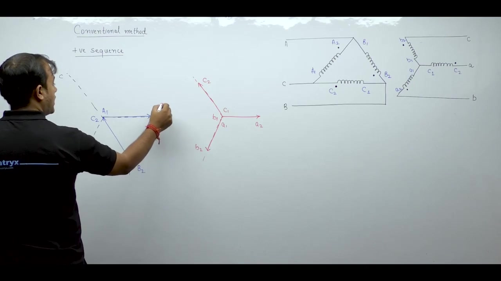

Next, we map external terminal markings to these points. The secondary circuit diagram connects terminal $c_2$ to line output a. Terminal $a_2$ connects to line output b. Terminal $b_2$ connects to line output c.

On the primary side, terminal $A_2$ connects directly to line A. Terminal $B_2$ connects to line B. Terminal $C_2$ connects to line C. We construct an internal reference star from the delta vertices to locate neutral-to-line phasors.

### Determining the Positive Sequence Phase Shift

We determine the phase shift between primary line A and secondary line a. Draw a vertical reference line through the origin.

Primary line phasor A lies $60^\circ$ to the left of the vertical axis. Secondary line phasor a lies $30^\circ$ to the right of the vertical axis. The total angular separation equals:
$$
\theta = 60^\circ + 30^\circ = 90^\circ
$$

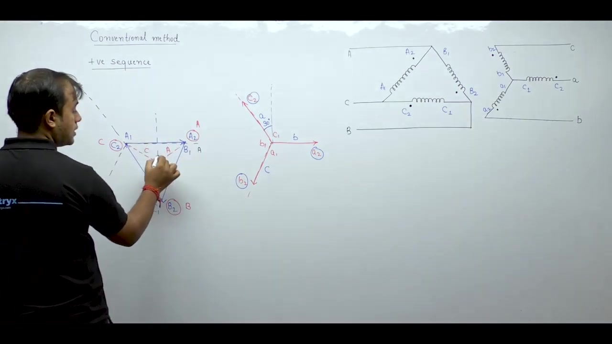

The secondary phasor a lies counterclockwise relative to primary phasor A. Therefore secondary line voltage leads primary line voltage by $90^\circ$.

> [!success] Result
> Under positive sequence excitation, the secondary line voltage leads the primary line voltage by $90^\circ$.

### Transition to Negative Sequence Analysis

Next, we evaluate the transformer under negative sequence excitation. A fundamental rule applies whenever phase sequences change.

> [!info] Definition
> When changing phase sequence, change only the ordering of the voltage phasors. Never alter the physical winding connections or terminal names.

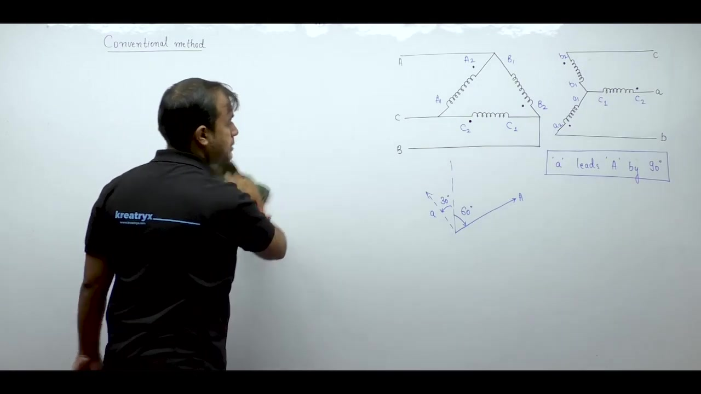

The physical wiring between coils remains untouched. The dot markings remain unchanged. Only the chronological sequence of phase rotation switches from A-B-C to A-C-B.

### Primary Delta Construction for Negative Sequence

For negative sequence, the three phases rotate in the order A, C, B. Phase C now lags phase A by $120^\circ$. Phase B lags phase C by $120^\circ$.

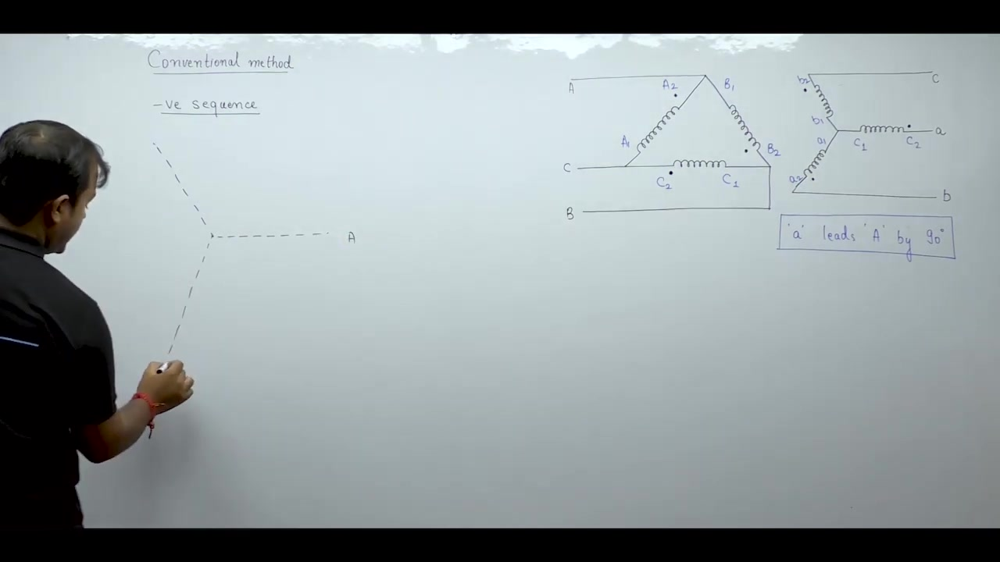

We begin the primary delta with phase A:
1. Draw phasor $A_1 A_2$ pointing upward along the vertical line.
2. The next phase in sequence is phase C. In the physical circuit, terminal $C_1$ connects to terminal $B_2$, and terminal $C_2$ connects to $A_1$.
3. We draw phasor $C_1 C_2$ along the phase C axis with $C_2$ at node $A_1$.

This construction forms the foundation for the negative sequence diagram.

## Negative Sequence Solution and the Shortcut Method
_(37:03 - 42:17)_

### Negative Sequence Phasor Construction and Result

We finish constructing the negative sequence diagram. In the primary delta, phasor $B_1 B_2$ connects node $C_1$ to node $A_2$. The reference axes for A, C, and B guide this orientation.

On the secondary side, terminals $a_1, b_1,$ and $c_1$ share a common neutral. Phasor $b_1 b_2$ runs parallel to primary limb B. Phasor $c_1 c_2$ points downward parallel to primary limb C. External secondary connections link terminal $b_2$ to c, $c_2$ to a, and $a_2$ to b.

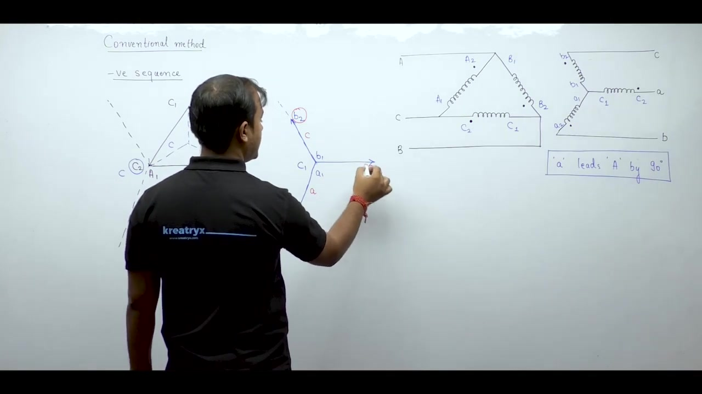

Now we compare primary line A and secondary line a. Draw a vertical reference line. Line phasor A sits $60^\circ$ on one side of this vertical. Line phasor a sits $30^\circ$ on the other side. The total angle between them remains $90^\circ$.

Under negative sequence, secondary phasor a points clockwise relative to primary phasor A. So secondary voltage lags primary voltage by $90^\circ$.

> [!success] Result
> Under negative sequence excitation, the secondary line voltage lags the primary line voltage by $90^\circ$.

### The Universal Sequence Phase Shift Rule

Comparing positive and negative sequence results reveals an important general principle.

> [!info] Definition
> If a transformer produces a phase shift of $+\theta$ (LV leads HV) under positive sequence, it produces $-\theta$ (LV lags HV) under negative sequence. The magnitude of angular displacement never changes. Only the lead or lag nature reverses.

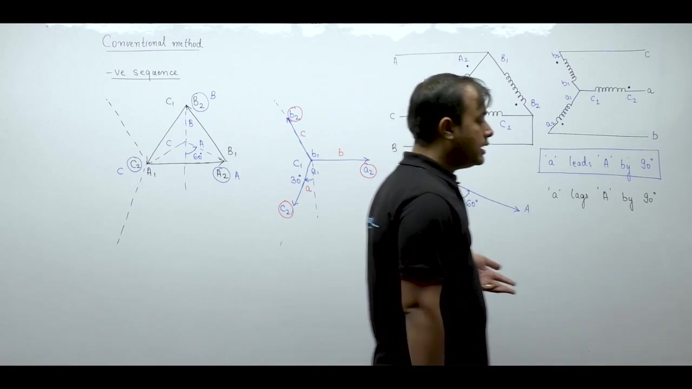

This rule holds for all transformer connections and clock groups. Once you calculate the positive sequence angle, you immediately know the negative sequence angle.

### Introducing the Shortcut Method

Drawing complete closed polygons can become tedious. A shortcut method bypasses full delta polygons entirely.

In this shortcut method, we draw three decoupled radial lines for the primary side. We label them $A_1 A_2, B_1 B_2,$ and $C_1 C_2$. Next, we draw three matching parallel lines for the secondary side: $a_1 a_2, b_1 b_2,$ and $c_1 c_2$.

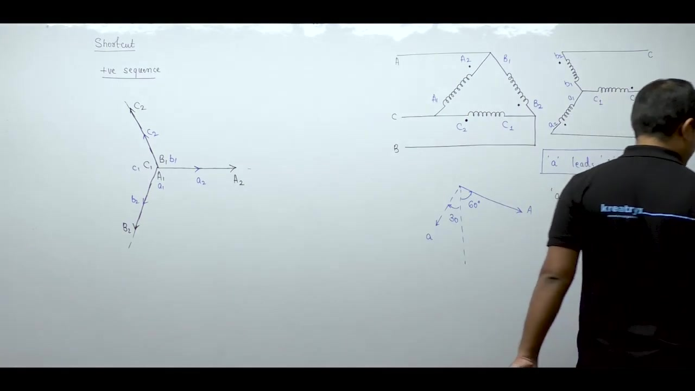

We then express line voltages by applying Kirchhoff's Voltage Law across winding terminals. By definition, voltage $V_{XY}$ represents a potential difference directed from node Y to node X:
$$
V_{XY} = V_X - V_Y
$$

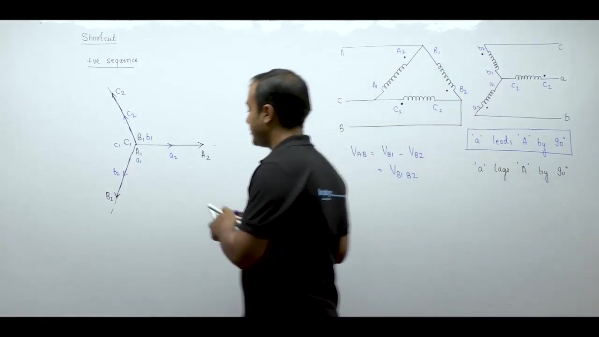

For instance, $V_{B_1 B_2}$ defines a vector starting at $B_2$ and terminating at $B_1$. If vector $B_1 B_2$ points down, then $V_{B_1 B_2}$ points in the opposite direction. This algebraic approach simplifies line voltage derivations significantly.

## Direct Method Application and Sequence Verification
_(42:17 - 47:05)_

### Positive Sequence Evaluation via Kirchhoff's Voltage Law

We now calculate line voltages directly using the shortcut method. For positive sequence, the primary line voltage is:
$$
V_{AB} = V_A - V_B
$$
In the circuit diagram, line terminal A connects to $B_1$ and line terminal B connects to $B_2$. Thus $V_{AB}$ equals $V_{B_1 B_2}$, which points upward from $B_2$ toward $B_1$.

On the secondary side, line terminal a connects to $c_2$ and line terminal b connects to $a_2$. The secondary neutral serves as zero reference. We express secondary line voltage $V_{ab}$ as:
$$
V_{ab} = V_a - V_b = V_{c_2 c_1} - V_{a_2 a_1}
$$

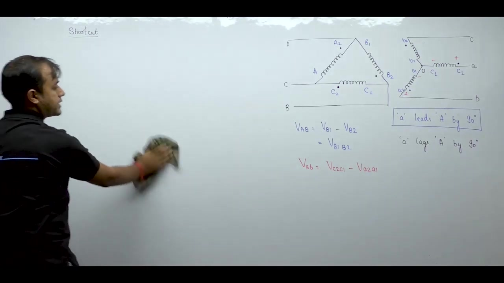

To subtract $V_{a_2 a_1}$ from $V_{c_2 c_1}$, we reverse phasor $a_2 a_1$ and add it vectorially. The two original phasors have equal magnitude and sit $120^\circ$ apart. Reversing one phasor creates an angle of $180^\circ - 120^\circ = 60^\circ$ between them.

The resultant vector bisects this $60^\circ$ angle at $30^\circ$. Comparing small $V_{ab}$ with capital $V_{AB}$ shows an angular gap of $90^\circ$ counterclockwise. So secondary line voltage leads primary line voltage by $90^\circ$. This matches our earlier graphical solution.

### Negative Sequence Evaluation via Kirchhoff's Voltage Law

Now we repeat this algebraic approach for negative sequence. The primary reference lines rotate in the sequence A, C, B.

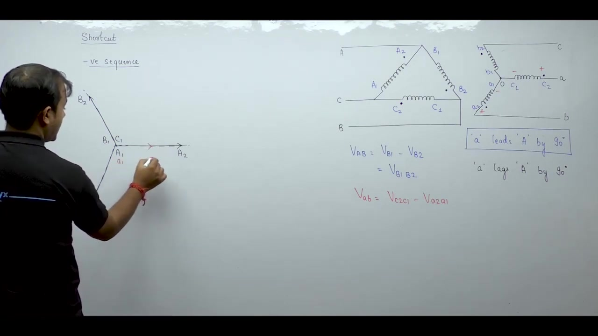

Primary line voltage $V_{AB}$ still equals $V_{B_1 B_2}$. Because the phase B axis has shifted, $V_{B_1 B_2}$ now points downward.

Secondary line voltage remains defined by:
$$
V_{ab} = V_{c_2 c_1} - V_{a_2 a_1}
$$

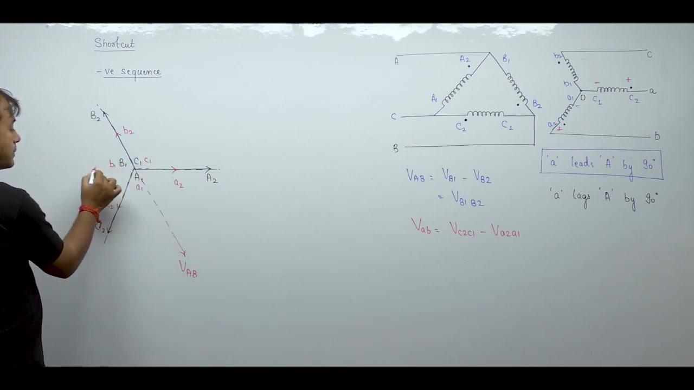

We add the reversed phasor $-V_{a_2 a_1}$ to $V_{c_2 c_1}$. The resultant vector bisects the $60^\circ$ angle at $30^\circ$. This time, small $V_{ab}$ sits $90^\circ$ clockwise relative to capital $V_{AB}$. So secondary line voltage lags primary line voltage by $90^\circ$.

> [!success] Result
> The direct method confirms both sequence results without drawing full polygons:
> - **Positive sequence**: LV leads HV by $90^\circ$ ($+90^\circ$).
> - **Negative sequence**: LV lags HV by $90^\circ$ ($-90^\circ$).

### Step-by-Step Procedure for Direct Analysis

We can summarize the direct method into four clear steps:

1. Label all winding ends with dot markings ($2$ at dots, $1$ at undotted ends).
2. Draw radial reference phasors for both windings in the specified phase sequence.
3. Express line voltages $V_{AB}$ and $V_{ab}$ in terms of coil terminal voltages using KVL.
4. Measure the angular displacement between $V_{AB}$ and $V_{ab}$.

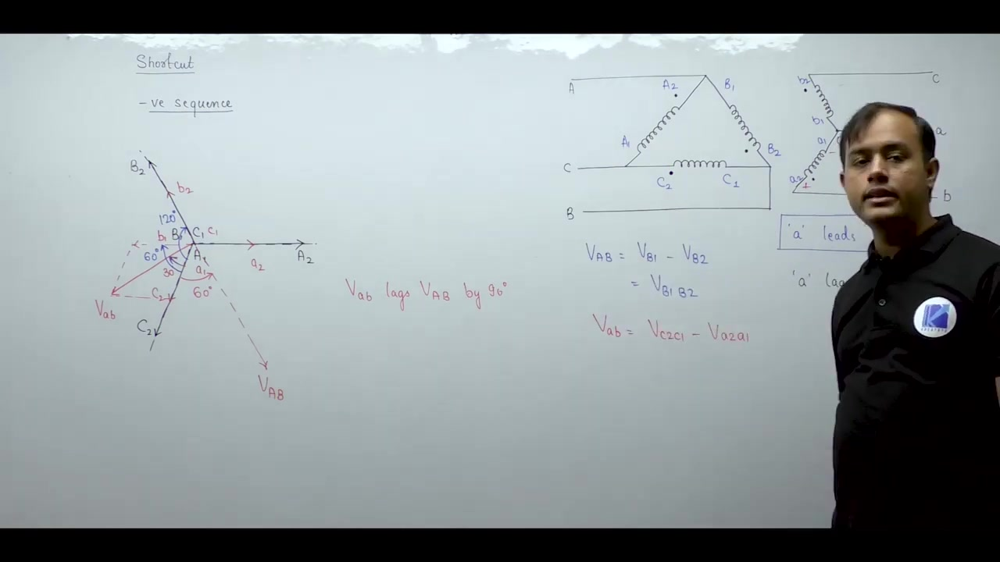

This method provides a fast and reliable way to solve competitive examination questions. It avoids errors common in drawing complex closed delta polygons. Future lectures build on these concepts to explore advanced topologies, including the open-delta connection.

---

## Summary and Key Takeaways

- Star-delta connections produce four distinct clock groups: Yd1 ($-30^\circ$), Yd11 ($+30^\circ$), Yd5 ($-150^\circ$), and Yd7 ($-210^\circ$).
- Both star-delta and delta-star configurations yield identical phase shifts and belong to the same phasor groups.
- The line voltage transformation ratio for a star-delta bank is $V_{L(HV)} / V_{L(LV)} = \sqrt{3} (N_H / N_L)$, which exceeds that of star-star and delta-delta banks.
- Circulating third-harmonic currents inside the closed delta winding maintain sinusoidal core flux and induced voltages.
- Phase shift in any three-phase transformer is defined strictly between primary and secondary line voltages, while phase voltages on identical limbs remain in phase.
- Reversing the supply sequence from positive to negative preserves the angular magnitude of phase shift but flips its nature from leading to lagging.
- The direct shortcut method computes line voltage displacement directly via $V_{XY} = V_X - V_Y$ without requiring closed delta phasor polygons.

