[← Lec 040: Three Phase Transformer 4](Lecture_040_Three_Phase_Transformer_4.md) | [🏠 Index](00_yt_study_guide.md) | [Lec 042: Problems Based on Three Phase Transformers 2 →](Lecture_042_Problems_Based_on_Three_Phase_Transformers_2.md)

---

# Problems Based on Three Phase Transformers - 1 | L 13 | Electrical Machines | GATE 2022

- **Source**: https://www.youtube.com/watch?v=03_-5LoPPrc
- **Duration**: 01:13:56
- **Compiled**: 2026-09-21

---

## Overview

This lecture works through detailed numerical problems on three-phase transformer connections and banks. It explores polarity reversals, winding impedance transformations, and complex power balance across multi-winding systems. The problems show how to convert between line and phase quantities for star and delta banks. Students also learn how to calculate voltage regulation and determine clock group phase displacements.

## Contents

- [[#Introduction to Three-Phase Transformer Problem Solving|Introduction to Three-Phase Transformer Problem Solving]]
- [[#Delta-Delta Secondary Polarity Reversal Problem|Delta-Delta Secondary Polarity Reversal Problem]]
- [[#Solution of Secondary Delta Polarity Reversal|Solution of Secondary Delta Polarity Reversal]]
- [[#Transformer Current Calculation with Motor Load|Transformer Current Calculation with Motor Load]]
- [[#Design Calculation for Core Area and Winding Turns|Design Calculation for Core Area and Winding Turns]]
- [[#Terminal Voltage in Non-Standard Transformer Bank|Terminal Voltage in Non-Standard Transformer Bank]]
- [[#Per-Unit and Ohmic Impedance on Delta Side|Per-Unit and Ohmic Impedance on Delta Side]]
- [[#Phase Ratings for Delta-Star Transformer Bank|Phase Ratings for Delta-Star Transformer Bank]]
- [[#Three-Winding Transformer Power Balance Setup|Three-Winding Transformer Power Balance Setup]]
- [[#Primary Current and Star-Star Reactance Calculation|Primary Current and Star-Star Reactance Calculation]]
- [[#Star-Star Bank Ratings and Maximum Regulation Condition|Star-Star Bank Ratings and Maximum Regulation Condition]]
- [[#Primary Voltage Calculation and Shell-Type Transformer Turns|Primary Voltage Calculation and Shell-Type Transformer Turns]]
- [[#Bank Voltage Ratings and Voltage Regulation Calculation|Bank Voltage Ratings and Voltage Regulation Calculation]]
- [[#Phase Displacement and Step-Down Transformer Analysis|Phase Displacement and Step-Down Transformer Analysis]]
- [[#Secondary Current Derivation and Session Conclusion|Secondary Current Derivation and Session Conclusion]]

---

## Introduction to Three-Phase Transformer Problem Solving
_(00:06 - 04:59)_

### Overview of Problem Sessions

This lecture begins a dedicated series of problem-solving sessions on three-phase transformers. Three separate sessions cover this topic in full detail. Two sessions take place today, and the third follows tomorrow.

The questions selected for these sessions span both fundamental concepts and advanced exam-level problems. They test winding interconnections, phasor relationships, voltage regulation, and sequence excitation.

### Objectives and Preparation Strategy

Mastering three-phase transformers requires a solid foundation in single-phase transformer principles. Students must also understand three-phase AC circuits and balanced polyphase systems.

During these problem sessions, students should focus on systematic methods rather than memorizing formulas:
1. First, label all winding terminals using standard dot conventions.
2. Second, resolve three-phase line quantities into phase quantities.
3. Third, apply single-phase equivalent relations across corresponding winding phases.
4. Finally, convert calculated phase values back to line quantities.

> [!info] Definition
> Three-phase transformer problems are solved by decoupling the bank into per-phase equivalent circuits. Voltage and current ratios apply strictly across phase windings.

Approaching complex problems through power conservation often simplifies the algebra. The upcoming sections apply these systematic steps to a wide variety of competitive examination problems.

## Delta-Delta Secondary Polarity Reversal Problem
_(04:59 - 09:42)_

### Problem Statement: Accidental Terminal Reversal

Consider a balanced three-phase delta-delta transformer bank. The secondary windings form a closed delta loop under normal operation.

> [!example] Problem
> A normal two-winding three-phase delta-delta transformer connection is shown alongside its primary and secondary phasor diagrams. The magnitude of each symmetrical secondary voltage $V_{ab}, V_{bc}, V_{ca}$ equals $E$. While connecting the secondary delta, terminals $X_1$ and $X_2$ of transformer 2 are accidentally interchanged. Determine the resulting net voltage inside the closed secondary delta loop:
> - (A) $0$
> - (B) $E$
> - (C) $\sqrt{3}E$
> - (D) $2E$

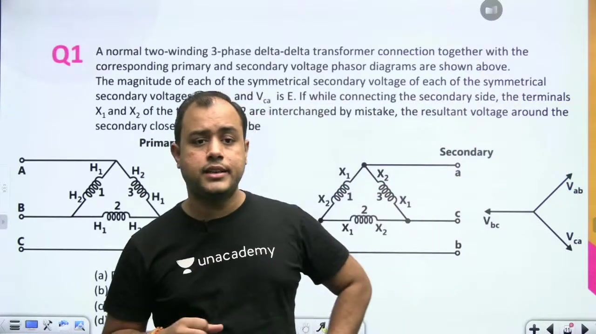

### Normal Secondary Delta Equilibrium

In an ideal, correctly wired three-phase delta bank, the secondary voltages form a balanced symmetrical set. The three phase voltages have equal magnitude $E$ and remain displaced by $120^\circ$:
$$
V_{ab} + V_{bc} + V_{ca} = 0
$$

Because their vector sum equals zero, no circulating current flows inside the closed delta at fundamental frequency. A voltmeter placed across an open corner of the delta would read zero volts before final closure.

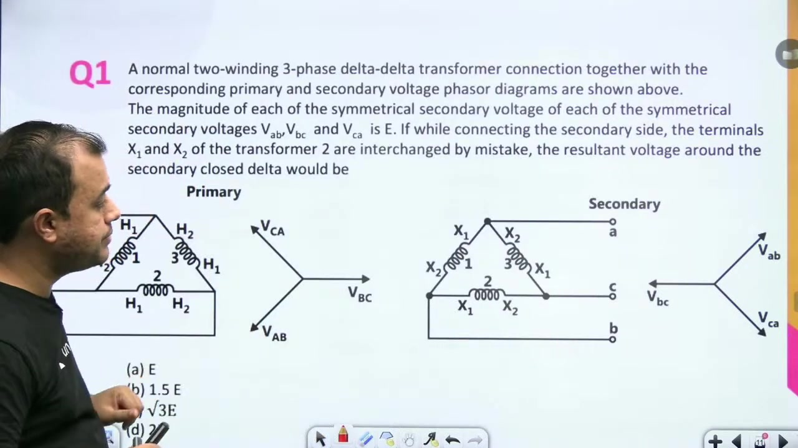

### Effect of Interchanging Secondary Terminals

Now examine the effect of interchanging terminals $X_1$ and $X_2$ on transformer 2. Transformer 2 produces the voltage between terminals b and c.

Swapping the two secondary leads inverts the polarity of that phase winding:
$$
V_{bc}' = -V_{bc}
$$

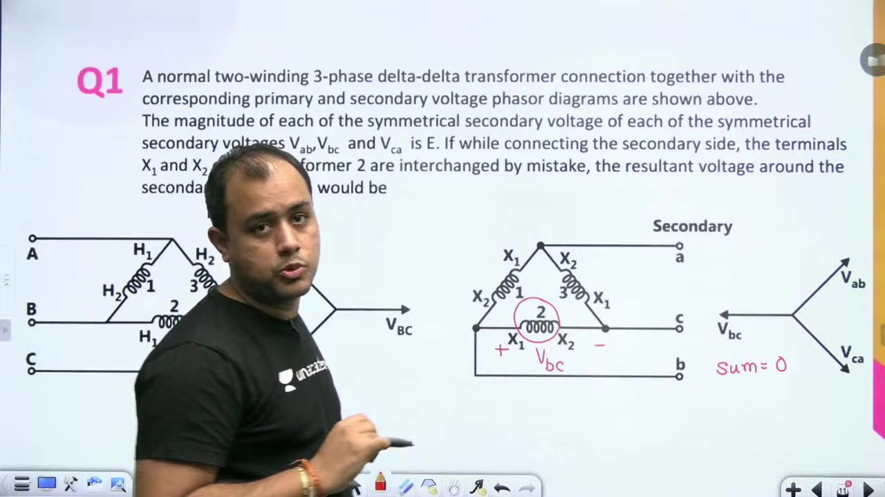

The phasor $V_{bc}$ flips by $180^\circ$ on the complex plane. Meanwhile, the other two phase voltages $V_{ab}$ and $V_{ca}$ remain completely unaffected.

The net voltage across the closed delta loop is no longer zero. We must now evaluate the vector sum of $V_{ab}$, $-V_{bc}$, and $V_{ca}$ to determine the resultant circulating voltage.

## Solution of Secondary Delta Polarity Reversal
_(09:42 - 14:28)_

### Component Method Vector Resolution

We solve for the net circulating voltage using the component method. Choose the direction of the reversed phasor $V_{bc}'$ as our horizontal reference axis.

The reversed phasor points along this axis with magnitude:
$$
|V_{bc}'| = E
$$

The remaining two phasors $V_{ab}$ and $V_{ca}$ each make an angle of $60^\circ$ with this axis. One phasor lies above the horizontal line, and the other lies below it.

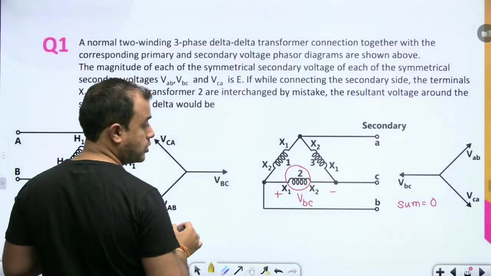

We resolve all three phasors along the horizontal and vertical axes:
- **Horizontal components**:
  $$
  V_{\text{horizontal}} = E + E\cos 60^\circ + E\cos 60^\circ
  $$
  Since $\cos 60^\circ = 0.5$, this simplifies to:
  $$
  V_{\text{horizontal}} = E + 0.5E + 0.5E = 2E
  $$

- **Vertical components**:
  $$
  V_{\text{vertical}} = E\sin 60^\circ - E\sin 60^\circ = 0
  $$

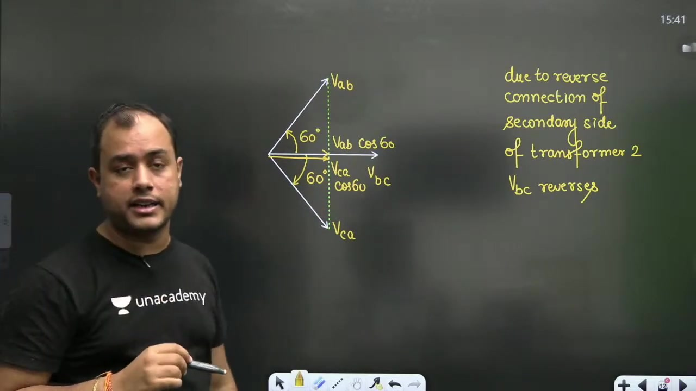

The vertical components cancel out completely. The net voltage in the loop acts entirely along the horizontal axis.

### Final Result and Practical Significance

The magnitude of the resultant voltage inside the closed delta becomes:
$$
V_{\text{resultant}} = \sqrt{V_{\text{horizontal}}^2 + V_{\text{vertical}}^2} = 2E
$$

> [!success] Result
> When one secondary phase winding in a delta bank is reversed, the net voltage in the closed delta equals $2E$. The correct option is (D).

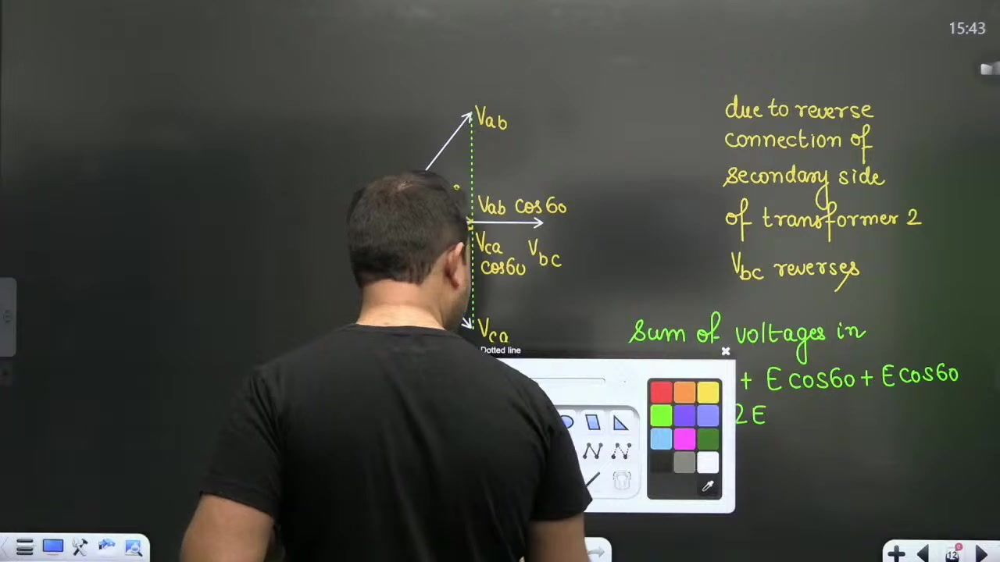

This result carries practical importance in transformer commissioning. In a correct delta, the net voltage across the final closing corner is zero.

If an engineer closes the delta with one reversed winding, a voltage of twice the phase voltage ($2E$) acts across the internal loop impedance. Because transformer winding impedance is tiny, massive circulating currents would flow. This condition causes rapid burnout or immediate breaker tripping.

## Transformer Current Calculation with Motor Load
_(14:28 - 19:16)_

### Problem Statement: Induction Motor Supply

We now examine how three-phase transformers deliver power to dynamic loads such as induction motors.

> [!example] Problem
> A $30\text{ kW}$ induction motor operates at an efficiency of $90\%$ and a lagging power factor of $0.833$. It is fed by a three-phase $11\text{ kV} / 400\text{ V}$ delta-star transformer. Determine the phase current on the high-voltage delta side:
> - (A) $1.73\text{ A}$
> - (B) $2.1\text{ A}$
> - (C) $0.7\text{ A}$
> - (D) $1.212\text{ A}$

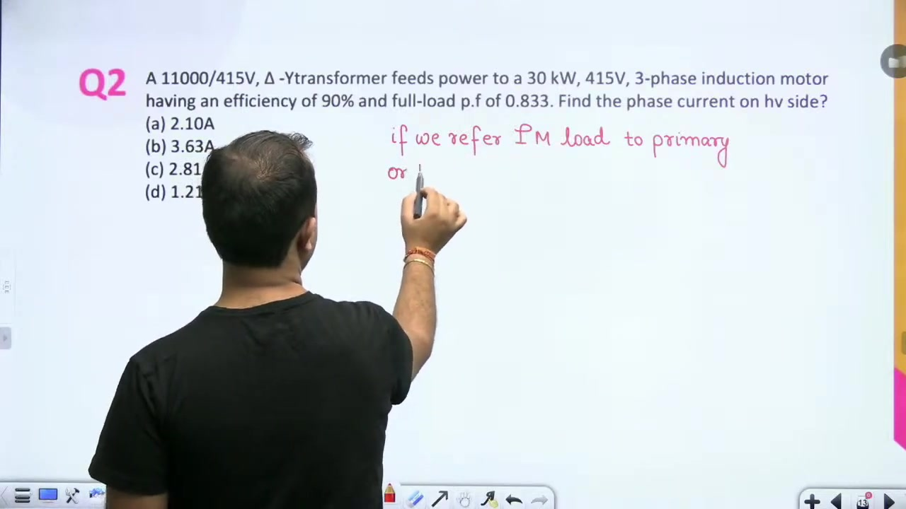

### Power Relations and Load Referral

The rated power of an electric motor represents its shaft output power. We divide the shaft power by efficiency to obtain the electrical input power:
$$
P_{\text{in}} = \frac{P_{\text{out}}}{\eta} = \frac{30\text{ kW}}{0.90} = 33.33\text{ kW}
$$

The transformer secondary delivers this electrical power directly to the motor terminals. Under ideal conditions, real power, apparent power, and power factor remain invariant across transformer windings.

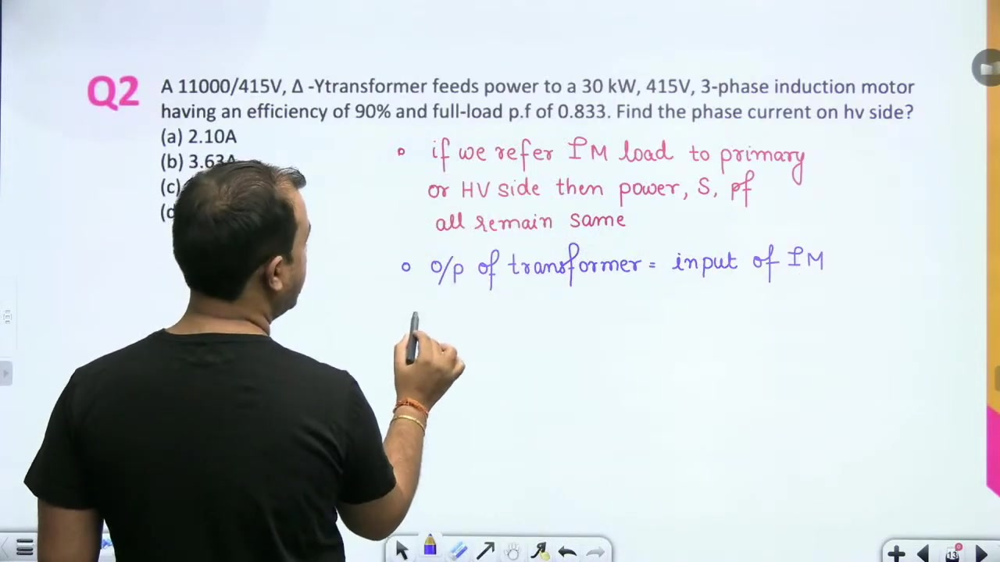

Next, we calculate the total apparent power drawn by the load:
$$
S = \frac{P_{\text{in}}}{\cos \phi} = \frac{33.33\text{ kW}}{0.833} = 40\text{ kVA}
$$

### High-Voltage Phase Current Derivation

The primary side is delta-connected. In a delta winding, the phase voltage equals the line voltage:
$$
V_{ph(HV)} = V_{L(HV)} = 11\text{ kV}
$$

The total three-phase apparent power relates to phase quantities by:
$$
S = 3 V_{ph(HV)} I_{ph(HV)}
$$

Substitute the known values into this equation:
$$
40\text{ kVA} = 3 \times (11\text{ kV}) \times I_{ph(HV)}
$$

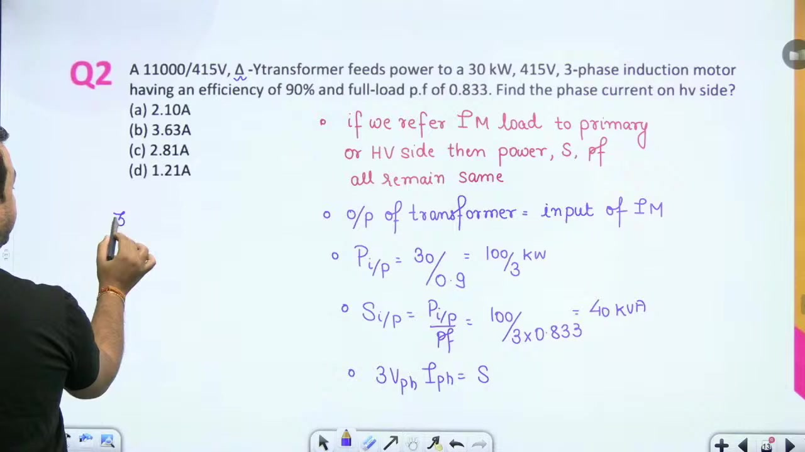

Solve directly for the phase current:
$$
I_{ph(HV)} = \frac{40}{3 \times 11} = \frac{40}{33} = 1.212\text{ A}
$$

> [!success] Result
> The phase current on the HV delta side equals $1.212\text{ A}$. The correct option is (D).

### Introduction to Core Design Problem

The lecture next introduces a design problem for a delta-star transformer. An $11,000 / 440\text{ V}$, $50\text{ Hz}$ transformer operates with $12\text{ V}$ per turn and peak flux density $B_m \le 1.2\text{ Wb/m}^2$.

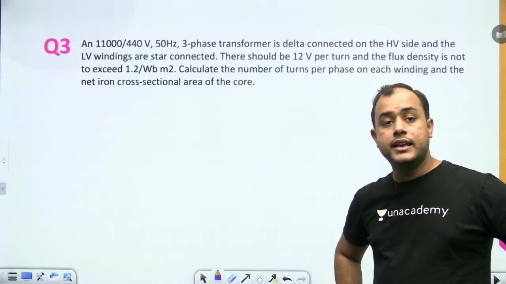

> [!info] Definition
> In three-phase transformer analysis, the induced EMF formula $E = 4.44 f N \Phi_m$ applies strictly to phase quantities. Never insert line voltages directly into this equation for star-connected windings.

This design problem requires calculating winding turns and the net iron cross-sectional area.

## Design Calculation for Core Area and Winding Turns
_(19:16 - 24:12)_

### Core Area Determination from Voltage per Turn

We solve the transformer design problem using the induced EMF equation. The voltage induced per turn relates directly to core magnetic flux:
$$
\text{Voltage per turn} = \frac{E_{ph}}{N_{ph}} = 4.44 f \Phi_m = 4.44 f B_m A_i
$$

The problem specifies a voltage per turn of $12\text{ V}$, a frequency of $50\text{ Hz}$, and maximum flux density $B_m = 1.2\text{ Wb/m}^2$.

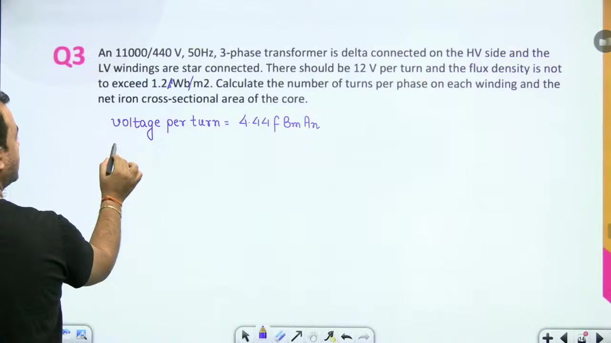

Substitute these parameters to solve for the net core cross-sectional area $A_i$:
$$
A_i = \frac{12}{4.44 \times 50 \times 1.2} = \frac{12}{266.4} = 0.045\text{ m}^2
$$

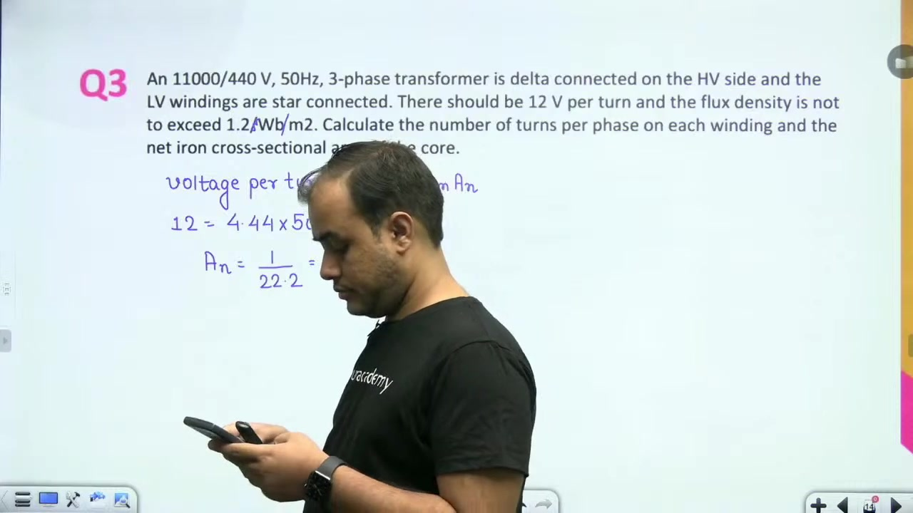

This net iron area corresponds to $450\text{ cm}^2$.

### Low-Voltage Winding Turns Calculation

Always start winding turns calculations from the low-voltage side. The LV side has fewer turns, so rounding errors have a much smaller effect on voltage ratios.

The LV winding is star-connected with a line voltage of $440\text{ V}$. Find its phase voltage first:
$$
V_{ph(LV)} = \frac{V_{L(LV)}}{\sqrt{3}} = \frac{440}{\sqrt{3}}\text{ V} \approx 254.03\text{ V}
$$

Now calculate the number of turns per phase on the LV winding:
$$
N_{ph(LV)} = \frac{V_{ph(LV)}}{\text{Voltage per turn}} = \frac{440 / \sqrt{3}}{12} = \frac{110}{3\sqrt{3}} \approx 21.17\text{ turns}
$$

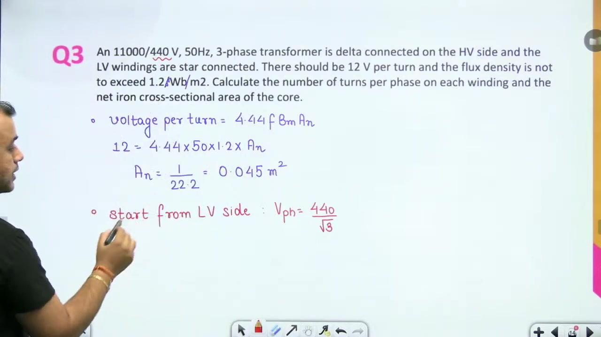

Because physical turns must be integers, and transformer windings usually use even numbers, we choose:
$$
N_{ph(LV)} = 22\text{ turns}
$$

### High-Voltage Winding Turns Calculation

The HV winding is delta-connected with a line voltage of $11,000\text{ V}$. In delta, phase voltage equals line voltage:
$$
V_{ph(HV)} = V_{L(HV)} = 11,000\text{ V}
$$

We find the HV turns using the ratio of phase voltages:
$$
\frac{V_{ph(HV)}}{V_{ph(LV)}} = \frac{N_{ph(HV)}}{N_{ph(LV)}}
$$

Substitute the phase voltages and our chosen LV turns:
$$
N_{ph(HV)} = N_{ph(LV)} \left(\frac{V_{ph(HV)}}{V_{ph(LV)}}\right) = 22 \times \left(\frac{11,000}{440 / \sqrt{3}}\right)
$$

Simplify this expression:
$$
N_{ph(HV)} = 22 \times 25 \sqrt{3} = 550\sqrt{3} \approx 952.62\text{ turns}
$$

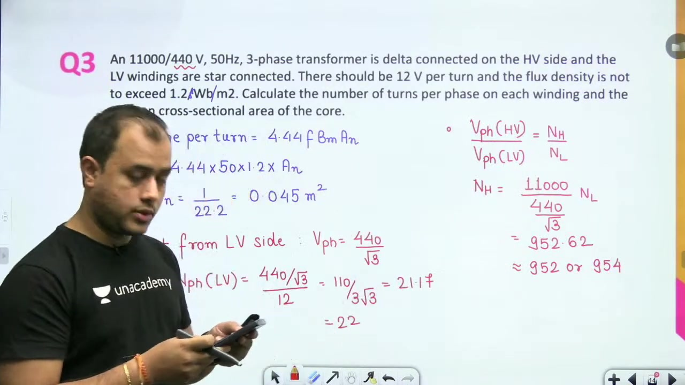

Rounding to the nearest even integer gives $952$ or $954$ turns.

> [!success] Result
> The design calculations yield:
> - Net core cross-sectional area: $A_i = 0.045\text{ m}^2$ ($450\text{ cm}^2$).
> - LV winding turns per phase: $N_{ph(LV)} = 22\text{ turns}$.
> - HV winding turns per phase: $N_{ph(HV)} = 952\text{ turns}$ (or $954\text{ turns}$).

## Terminal Voltage in Non-Standard Transformer Bank
_(24:13 - 29:15)_

### Problem Statement: Interconnected Single-Phase Bank

We evaluate an interconnection of three single-phase transformers with unity turns ratio.

> [!example] Problem
> A bank of three single-phase transformers has a unity turns ratio ($N_1 / N_2 = 1$). A balanced three-phase supply voltage $V$ (line-to-line) feeds the primary side. Determine the resulting voltage between secondary terminals $A_2$ and $C_2$:
> - (A) $V$
> - (B) $3V$
> - (C) $\sqrt{3}V$
> - (D) $2V$

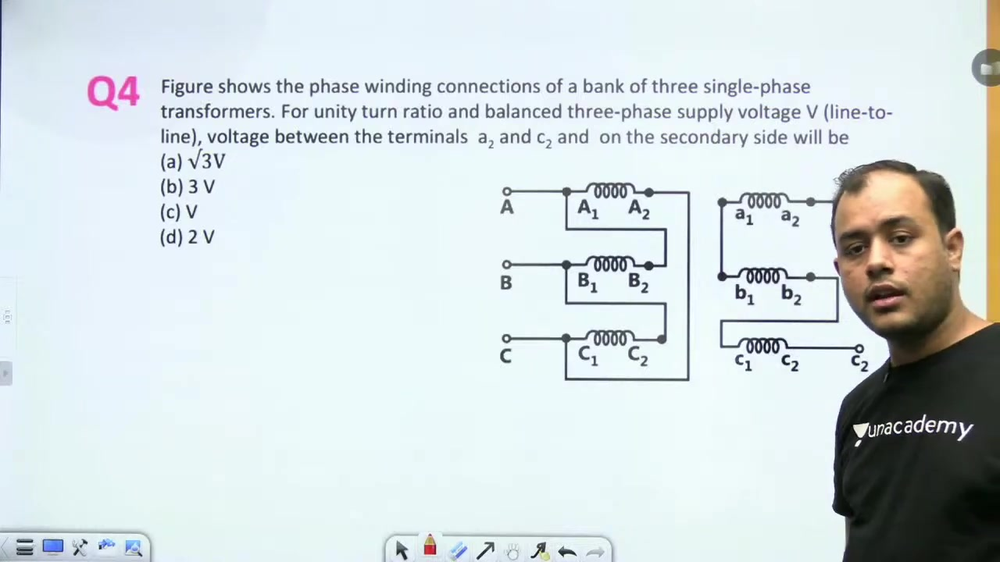

### Polarity and Phase Voltage Assignment

The primary windings form a delta connection. In delta, the phase voltage equals the line voltage $V$. We define a balanced set of phase voltages:
$$
V_A = V \angle 0^\circ, \quad V_B = V \angle -120^\circ, \quad V_C = V \angle 120^\circ
$$

Terminals with identical labels carry identical polarities across primary and secondary windings. If terminal $A_1$ is positive with respect to $A_2$, then secondary $A_1$ is also positive with respect to $A_2$.

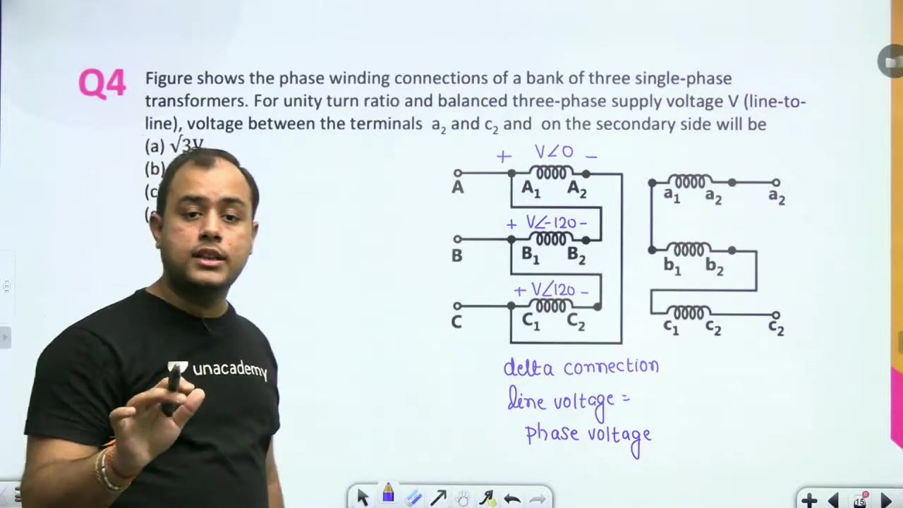

Because the turns ratio equals unity, each secondary winding produces an identical phase voltage magnitude $V$.

### Potential Difference Calculation via Kirchhoff's Voltage Law

Now trace the path between terminals $A_2$ and $C_2$ through the interconnected windings. Applying Kirchhoff's Voltage Law yields:
$$
V_{A_2 C_2} = V_{A_2} - V_{C_2} = V \angle -120^\circ + V \angle 120^\circ - V \angle 0^\circ
$$

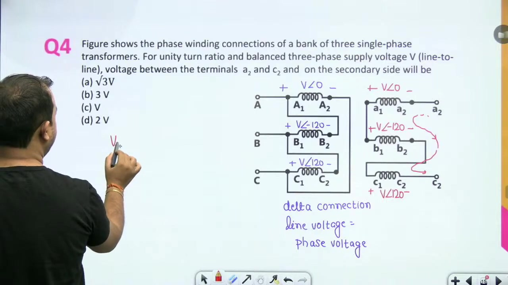

Expand each phasor into rectangular coordinates:
$$
\begin{aligned}
V_{A_2 C_2} &= V\left(-\frac{1}{2} - j\frac{\sqrt{3}}{2}\right) + V\left(-\frac{1}{2} + j\frac{\sqrt{3}}{2}\right) - V(1 + j0) \\
&= V\left(-\frac{1}{2} - \frac{1}{2} - 1\right) + jV\left(-\frac{\sqrt{3}}{2} + \frac{\sqrt{3}}{2}\right) \\
&= -2V
\end{aligned}
$$

Taking the magnitude gives:
$$
|V_{A_2 C_2}| = 2V
$$

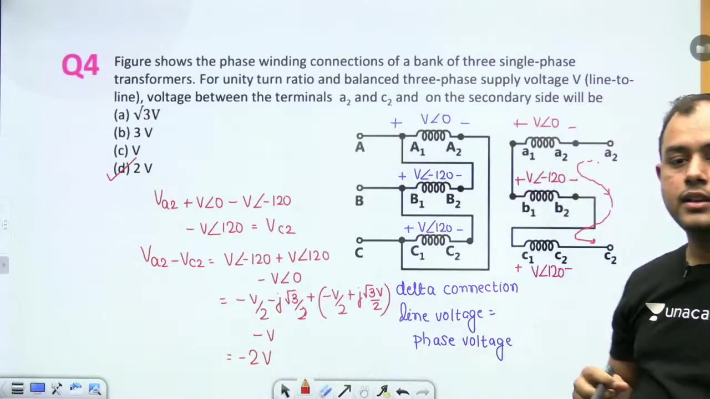

> [!success] Result
> The voltage between terminals $A_2$ and $C_2$ equals $2V$. The correct option is (D).

Many students mistakenly add scalar voltages as $V + V + V = 3V$. This scalar addition ignores phase angles entirely. In AC circuits, voltages must always be added as vectors.

## Per-Unit and Ohmic Impedance on Delta Side
_(29:15 - 34:11)_

### Problem Statement: Winding Losses and Reactance

We determine the ohmic impedance of a delta-star transformer from loss data and per-unit parameters.

> [!example] Problem
> A $500\text{ kVA}$, $11 / 0.43\text{ kV}$, three-phase delta-star connected transformer has full-load copper losses of $2.5\text{ kW}$ on the HV winding and $2.0\text{ kW}$ on the LV winding. Its total leakage reactance equals $0.06\text{ p.u.}$ Find the ohmic value of equivalent resistance and leakage reactance referred to the delta side.

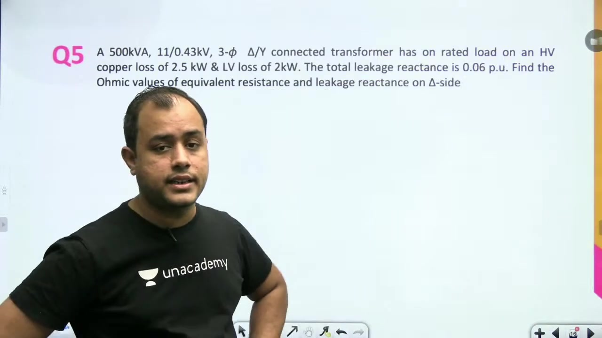

### Total Copper Loss and Per-Unit Resistance

Total full-load copper loss equals the sum of losses in both windings:
$$
P_{cu,fl} = 2.5\text{ kW} + 2.0\text{ kW} = 4.5\text{ kW}
$$

We express full-load copper loss in per-unit by dividing by the rated base apparent power $S_{\text{base}}$:
$$
R_{pu} = \frac{P_{cu,fl}}{S_{\text{base}}} = \frac{4.5\text{ kW}}{500\text{ kVA}} = 0.009\text{ p.u.}
$$

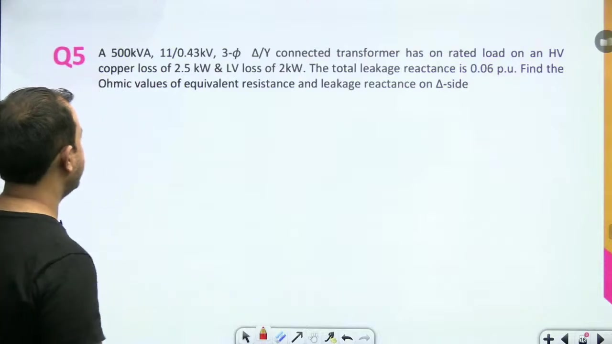

The problem provides the leakage reactance directly as $X_{pu} = 0.06\text{ p.u.}$ Therefore the total per-unit series impedance is:
$$
Z_{pu} = R_{pu} + jX_{pu} = 0.009 + j0.06\text{ p.u.}
$$

### Delta Side Base Impedance and Ohmic Values

Per-unit impedance has identical numerical value whether viewed from the HV or LV side. To obtain ohmic values on the delta side, we multiply by the delta base impedance $Z_{\text{base(delta)}}$.

On the delta side, the phase voltage equals the line voltage $V_L = 11\text{ kV}$. The per-phase base apparent power is $S_{3\phi} / 3$. Thus the delta base impedance becomes:
$$
Z_{\text{base(delta)}} = \frac{V_{ph}^2}{S_{ph}} = \frac{3 V_L^2}{S_{3\phi}} = \frac{3 \times (11\text{ kV})^2}{500\text{ kVA}} = \frac{3 \times 121 \times 10^6}{500 \times 10^3} = 726\,\Omega
$$

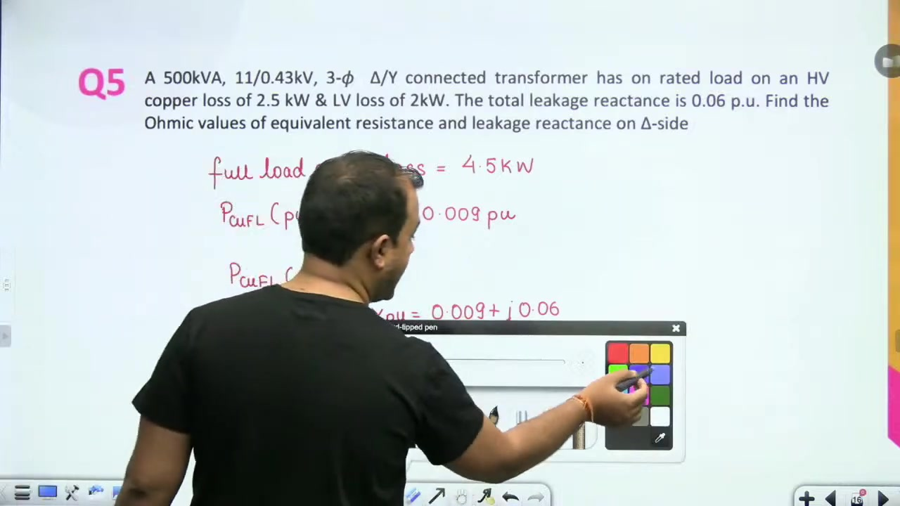

Now multiply the per-unit parameters by $Z_{\text{base(delta)}}$:
$$
R_{\text{delta}} = R_{pu} \times Z_{\text{base(delta)}} = 0.009 \times 726 = 6.534\,\Omega
$$
$$
X_{\text{delta}} = X_{pu} \times Z_{\text{base(delta)}} = 0.06 \times 726 = 43.56\,\Omega
$$

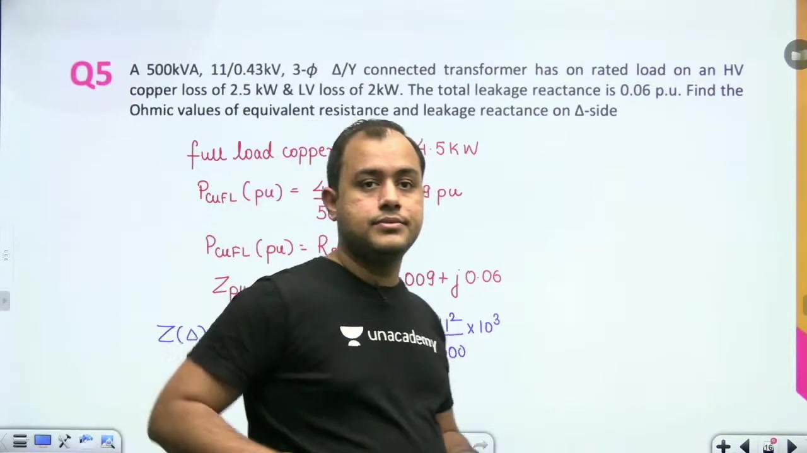

> [!success] Result
> Referred to the delta side, the equivalent resistance is $6.534\,\Omega$ and the leakage reactance is $43.56\,\Omega$:
> $$
> Z_{\text{delta}} = 6.534 + j43.56\,\Omega
> $$

> [!info] Definition
> Impedance in three-phase systems is always defined per phase. There is no physical quantity representing the total impedance of all three phases.

## Phase Ratings for Delta-Star Transformer Bank
_(34:11 - 39:28)_

### Problem Statement: Bank Ratings from Real and Reactive Power

We analyze a three-phase delta-star transformer bank supplying a large industrial load.

> [!example] Problem
> A three-phase delta-star transformer bank operates with rated line voltages of $22\text{ kV}$ on the primary side and $345\text{ kV}$ on the secondary side. The bank delivers an active power of $400\text{ MW}$ and a reactive power of $316\text{ MVAR}$. Determine:
> 1. The MVA rating of each single-phase unit.
> 2. The phase voltage and phase current on the primary winding.
> 3. The phase voltage and phase current on the secondary winding.

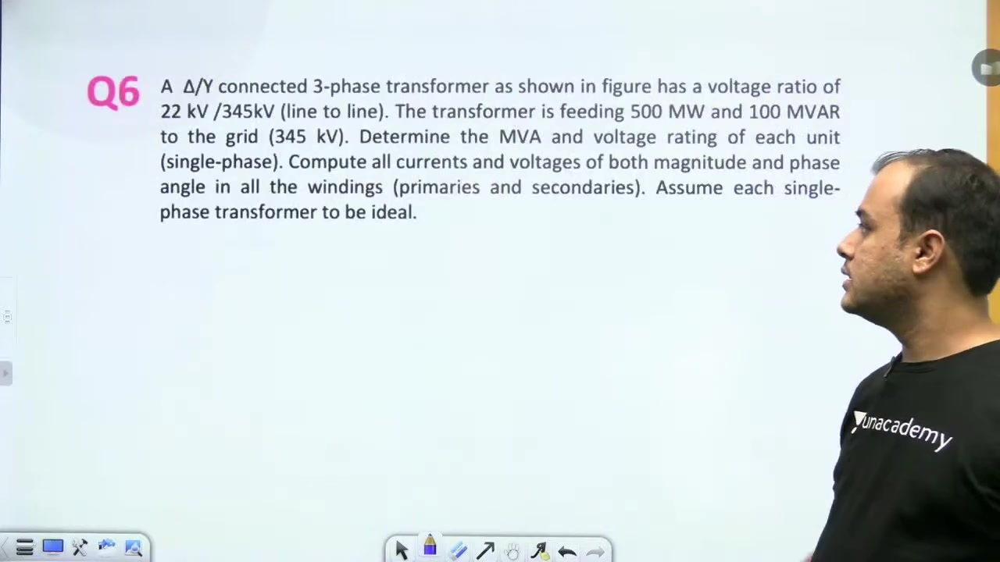

### Total Apparent Power and Per-Phase Rating

First calculate the total three-phase apparent power $S$ delivered by the bank:
$$
S = \sqrt{P^2 + Q^2} = \sqrt{400^2 + 316^2} = \sqrt{160,000 + 99,856} = 509.90\text{ MVA}
$$

A balanced three-phase bank divides this apparent power equally across its three phases. Each single-phase transformer unit handles one-third of the total load:
$$
S_{ph} = \frac{S}{3} = \frac{509.90\text{ MVA}}{3} = 169.97\text{ MVA}
$$

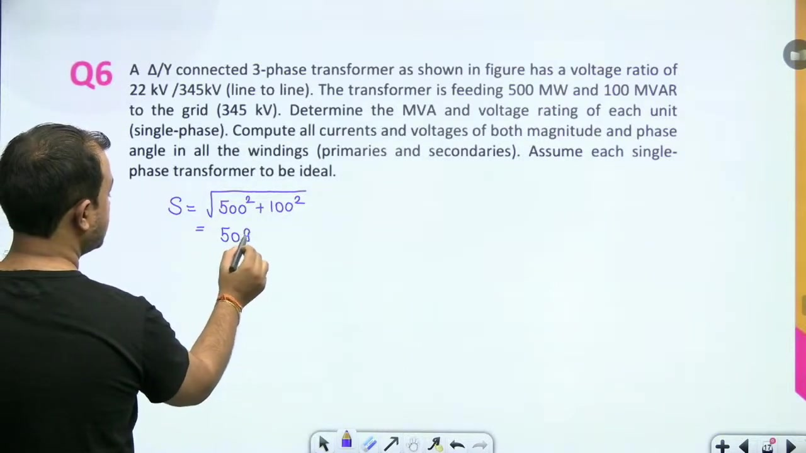

Each single-phase unit must have a rating of at least $170\text{ MVA}$.

### Primary Delta-Winding Phase Quantities

The primary side is delta-connected. In a delta circuit, the phase voltage equals the line voltage:
$$
V_{ph1} = V_{L1} = 22\text{ kV}
$$

The primary phase current is calculated from the per-phase apparent power:
$$
I_{ph1} = \frac{S_{ph}}{V_{ph1}} = \frac{169.97\text{ MVA}}{22\text{ kV}} = 7.725\text{ kA}
$$

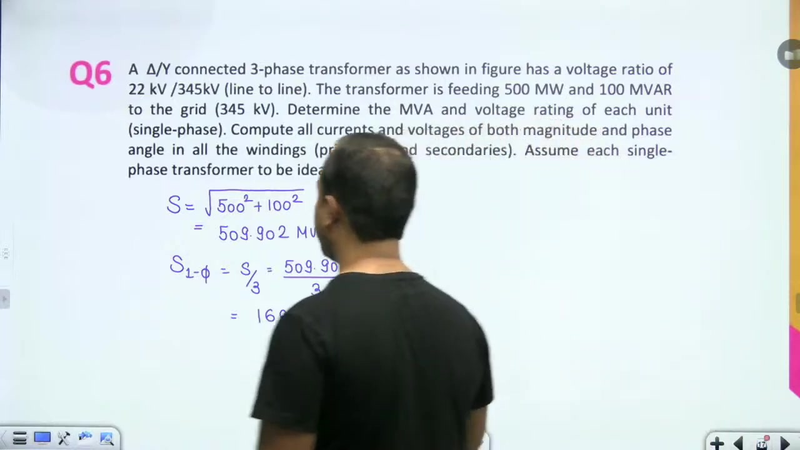

### Secondary Star-Winding Phase Quantities

The secondary side is star-connected with a line voltage of $345\text{ kV}$. In a star circuit, the phase voltage equals the line voltage divided by $\sqrt{3}$:
$$
V_{ph2} = \frac{V_{L2}}{\sqrt{3}} = \frac{345}{\sqrt{3}}\text{ kV} \approx 199.19\text{ kV}
$$

The secondary phase current is found from the per-phase apparent power:
$$
I_{ph2} = \frac{S_{ph}}{V_{ph2}} = \frac{169.97\text{ MVA}}{199.19\text{ kV}} = 0.8533\text{ kA}
$$

> [!success] Result
> The calculated ratings for each single-phase unit and winding are:
> - **Unit rating**: $S_{ph} = 169.97\text{ MVA}$
> - **Primary side (delta)**: $V_{ph1} = 22\text{ kV}$, $I_{ph1} = 7.725\text{ kA}$
> - **Secondary side (star)**: $V_{ph2} = 199.19\text{ kV}$, $I_{ph2} = 0.8533\text{ kA}$

## Three-Winding Transformer Power Balance Setup
_(39:28 - 44:23)_

### Principles for Solving Multi-Winding Systems

Competitive examinations frequently feature three-winding transformers with mixed loads. Tracing currents through multiple branch impedances often leads to algebraic confusion.

A much simpler approach relies on the principle of complex power conservation. Total complex power supplied by the source equals the vector sum of all loads and internal losses.

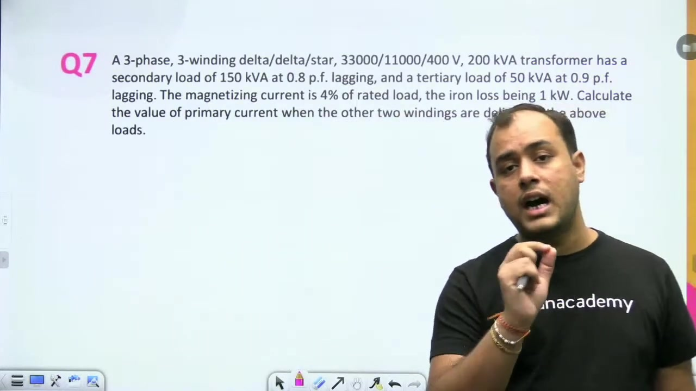

### Problem Statement: Three-Winding Transformer Loading

We evaluate a three-phase transformer with primary, secondary, and tertiary windings.

> [!example] Problem
> A three-phase, three-winding delta-delta-star transformer is rated at $33,000 / 11,000 / 400\text{ V}$ and $200\text{ kVA}$. It feeds two independent loads:
> - **Secondary load**: $150\text{ kVA}$ at $0.8$ lagging power factor.
> - **Tertiary load**: $50\text{ kVA}$ at $0.9$ lagging power factor.
> 
> The magnetizing current is $4\%$ of rated load. The iron loss equals $1\text{ kW}$. Determine the total primary current drawn from the $33\text{ kV}$ source.

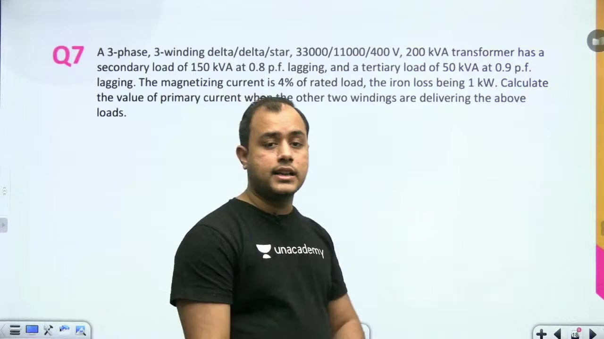

### Complex Power Formulation

Never add apparent power ratings ($S$) algebraically. You must always add them as complex numbers in rectangular or polar form:
$$
S_{\text{source}} = S_{\text{secondary}} + S_{\text{tertiary}} + S_{\text{mag}} + P_{\text{iron}}
$$

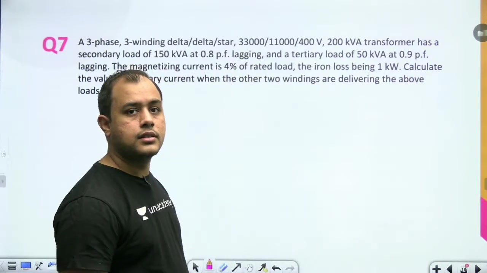

Now express each term as a phasor:
1. **Secondary load**:
   $$
   \cos \phi_2 = 0.8 \implies \phi_2 = \cos^{-1}(0.8) = +36.87^\circ
   $$
   In complex power notation, lagging reactive power carries a positive sign:
   $$
   S_{\text{secondary}} = 150 \angle 36.87^\circ\text{ kVA} = 120 + j90\text{ kVA}
   $$

2. **Tertiary load**:
   $$
   \cos \phi_3 = 0.9 \implies \phi_3 = \cos^{-1}(0.9) = +25.84^\circ
   $$
   $$
   S_{\text{tertiary}} = 50 \angle 25.84^\circ\text{ kVA} = 45 + j21.79\text{ kVA}
   $$

3. **Magnetizing branch**:
   The magnetizing current lags applied voltage by $90^\circ$. It draws purely reactive power:
   $$
   Q_{\text{mag}} = 4\% \times 200\text{ kVA} = 0.04 \times 200 = 8\text{ kVAR}
   $$
   $$
   S_{\text{mag}} = +j8\text{ kVA}
   $$

4. **Core loss**:
   Iron loss consumes purely active power:
   $$
   P_{\text{iron}} = 1\text{ kW}
   $$

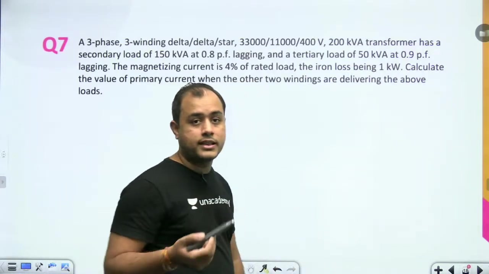

We can now sum these individual complex components to find total source power.

## Primary Current and Star-Star Reactance Calculation
_(44:25 - 49:25)_

### Primary Current from Complex Power Balance

We complete the solution for the three-winding transformer by summing all complex power components:
$$
\begin{aligned}
S_{\text{source}} &= (120 + j90) + (45 + j21.79) + j8 + 1 \\
&= (120 + 45 + 1) + j(90 + 21.79 + 8) \\
&= 166 + j119.79\text{ kVA}
\end{aligned}
$$

Convert this complex power to polar form:
$$
|S_{\text{source}}| = \sqrt{166^2 + 119.79^2} = 204.71\text{ kVA} \angle 35.8^\circ
$$

The primary winding is connected to a $33\text{ kV}$ line. Unless specified otherwise, current in three-phase systems refers to line current.

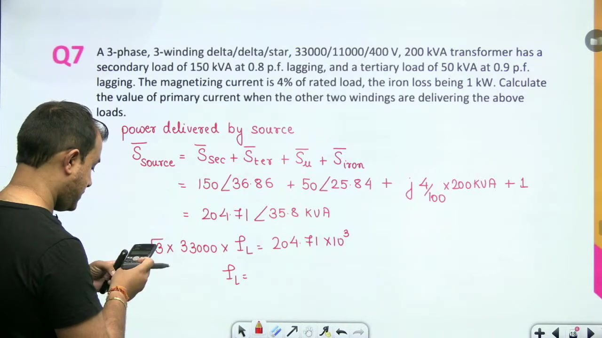

We find the primary line current from the total apparent power:
$$
I_{L1} = \frac{S_{\text{source}}}{\sqrt{3} V_{L1}} = \frac{204.71\text{ kVA}}{\sqrt{3} \times 33\text{ kV}} = \frac{204.71}{57.158} = 3.581\text{ A}
$$

> [!success] Result
> The primary line current drawn by the three-winding transformer equals $3.581\text{ A}$.

### Problem Statement: Single-Phase Units in Star-Star Bank

The lecture next investigates a three-phase bank constructed from three identical single-phase transformers.

> [!example] Problem
> Each phase of a three-phase transformer is rated at $6.6\text{ kV} / 230\text{ V}$ and $200\text{ kVA}$ with a series leakage reactance of $8\%$.
> 1. Calculate the reactance in ohms referred to the HV and LV sides.
> 2. The transformers are connected in star-star. Determine the three-phase voltage rating, kVA rating, and per-unit reactance.
> 3. Find the load power factor at which voltage regulation becomes maximum.
> 4. If this load receives rated voltage on the LV side, calculate the required HV line voltage.

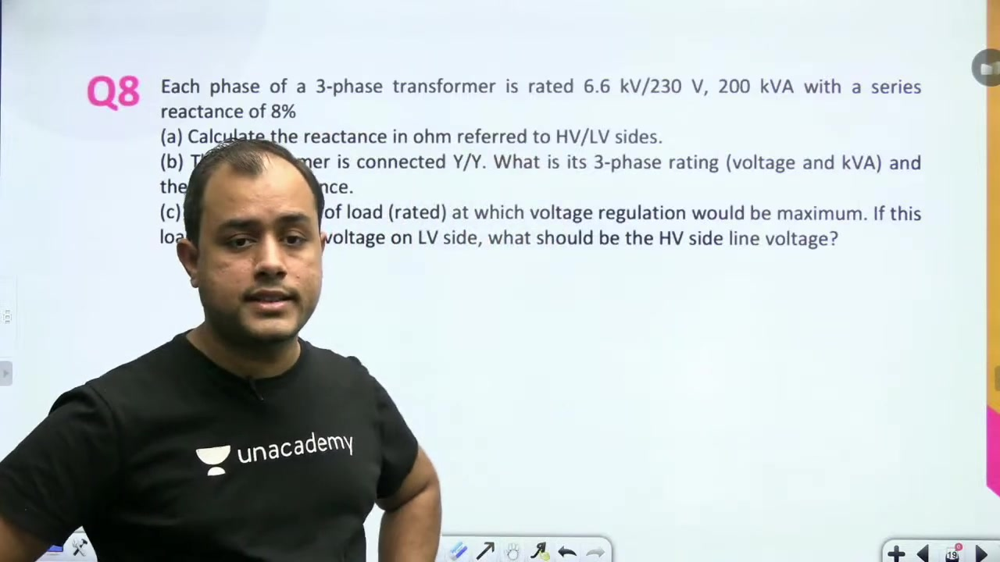

### High-Voltage Base Impedance Calculation

All specifications in the first part apply to an individual single-phase unit. Therefore we calculate single-phase base quantities without factors of $\sqrt{3}$ or $3$.

The high-voltage rating is $V_{HV} = 6.6\text{ kV}$ and $S_{b} = 200\text{ kVA}$. The base impedance on the HV side is:
$$
Z_{\text{base(HV)}} = \frac{V_{HV}^2}{S_{b}} = \frac{(6.6\text{ kV})^2}{200\text{ kVA}} = \frac{43.56 \times 10^6}{200 \times 10^3} = 217.8\,\Omega
$$

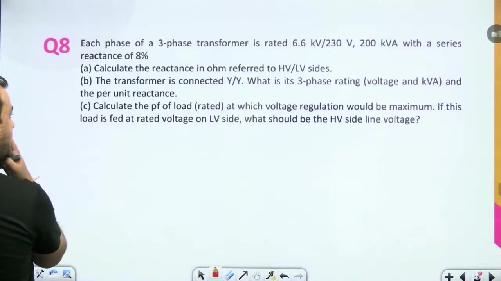

We can now use this base impedance to determine ohmic reactances on both sides of the unit.

## Star-Star Bank Ratings and Maximum Regulation Condition
_(49:29 - 54:27)_

### Low-Voltage Base and Ohmic Reactance Values

We next compute the low-voltage base impedance of the single-phase unit. The LV rating is $V_{LV} = 230\text{ V}$ and $S_b = 200\text{ kVA}$:
$$
Z_{\text{base(LV)}} = \frac{V_{LV}^2}{S_b} = \frac{230^2}{200 \times 10^3} = \frac{52,900}{200,000} = 0.2645\,\Omega
$$

Per-unit reactance remains identical on both sides: $X_{pu} = 0.08\text{ p.u.}$ We multiply this per-unit value by each base impedance:
$$
X_{HV} = X_{pu} \times Z_{\text{base(HV)}} = 0.08 \times 217.8\,\Omega = 17.424\,\Omega
$$
$$
X_{LV} = X_{pu} \times Z_{\text{base(LV)}} = 0.08 \times 0.2645\,\Omega = 0.02116\,\Omega
$$

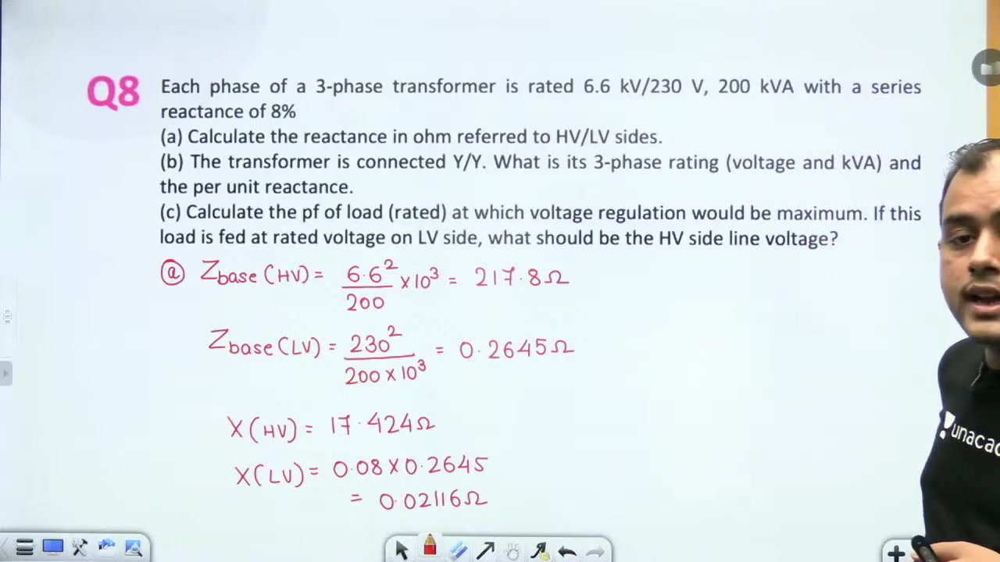

### Three-Phase Star-Star Bank Ratings

The three identical units are connected in a star-star configuration. The bank ratings become:
- **Total apparent power**:
  $$
  S_{3\phi} = 3 \times 200\text{ kVA} = 600\text{ kVA}
  $$
- **HV line voltage**:
  $$
  V_{L(HV)} = \sqrt{3} \times 6.6\text{ kV} = 11.43\text{ kV}
  $$
- **LV line voltage**:
  $$
  V_{L(LV)} = \sqrt{3} \times 230\text{ V} = 398.37\text{ V}
  $$

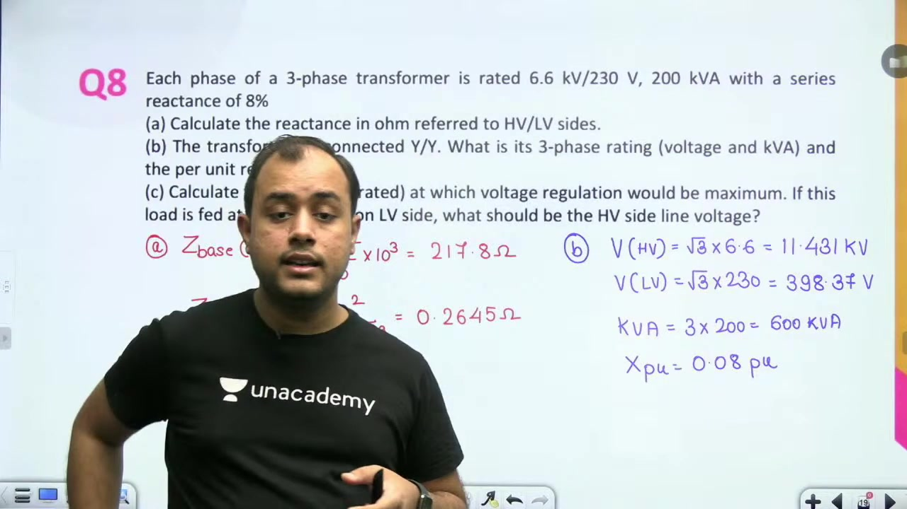

Per-unit reactance is defined per phase on the bank base. Its value remains unchanged at $X_{pu} = 0.08\text{ p.u.}$

### Power Factor for Maximum Voltage Regulation

Voltage regulation depends on load power factor and internal impedance. The general condition for maximum voltage regulation is:
$$
\phi = \theta = \tan^{-1}\left(\frac{X_{pu}}{R_{pu}}\right)
$$

Because winding resistance is not specified, we take $R_{pu} = 0$:
$$
\theta = \tan^{-1}\left(\frac{X_{pu}}{0}\right) = 90^\circ
$$

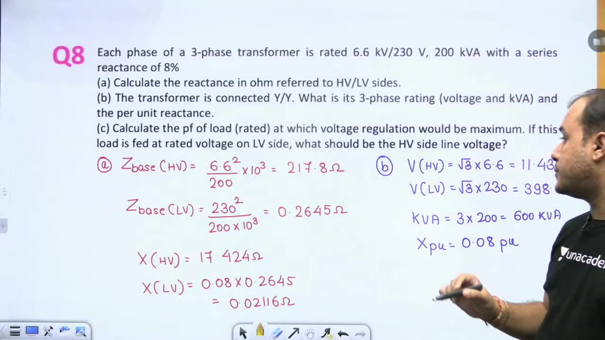

Maximum regulation occurs when the load phase angle equals $90^\circ$ lagging. The corresponding power factor is zero lagging:
$$
\cos \phi = \cos 90^\circ = 0 \quad (\text{ZPF lagging})
$$

At this operating point, the maximum voltage regulation equals the per-unit impedance:
$$
\text{VR}_{\max} = Z_{pu} = X_{pu} = 0.08 \implies 8\%
$$

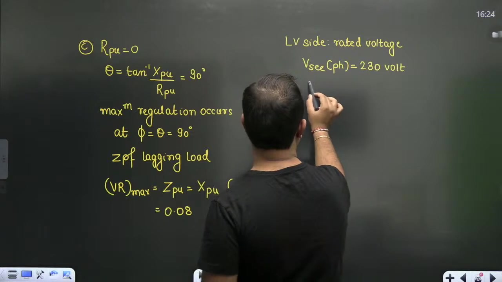

> [!success] Result
> For the star-star transformer bank:
> - Ohmic reactances are $X_{HV} = 17.424\,\Omega$ and $X_{LV} = 0.02116\,\Omega$.
> - Bank ratings are $11.43\text{ kV} / 398.37\text{ V}$ and $600\text{ kVA}$.
> - Maximum voltage regulation equals $8\%$, occurring at zero power factor lagging ($\phi = 90^\circ$).

## Primary Voltage Calculation and Shell-Type Transformer Turns
_(54:27 - 60:31)_

### Primary Supply Voltage via Voltage Regulation

We now determine the required primary voltage when the load operates at rated voltage. The rated LV phase voltage is $V_2 = 230\text{ V}$.

Use the definition of voltage regulation to find the secondary no-load voltage $V_{ss}$:
$$
\text{VR} = \frac{V_{ss} - V_2}{V_2} = 0.08
$$

Solve directly for $V_{ss}$:
$$
V_{ss} = V_2(1 + \text{VR}) = 230 \times 1.08 = 248.4\text{ V}
$$

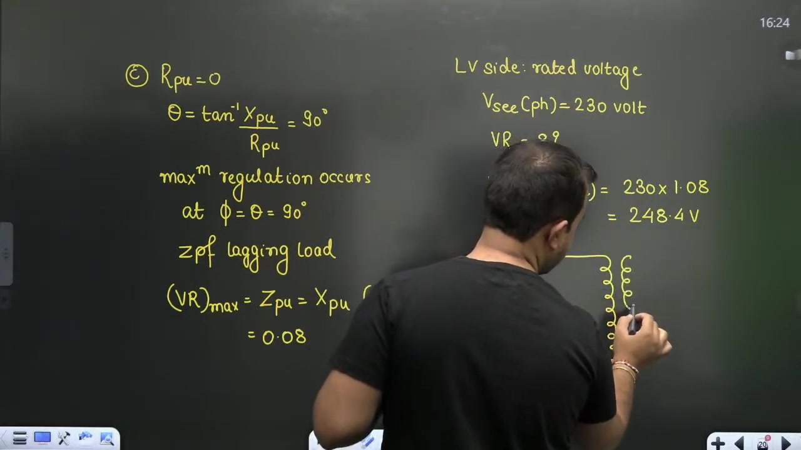

Now refer this phase voltage to the primary HV winding using the turns ratio:
$$
V_{ph1} = V_{ss} \times \left(\frac{6600\text{ V}}{230\text{ V}}\right) = 248.4 \times 28.696 = 7128\text{ V}
$$

Because the primary winding is star-connected, multiply by $\sqrt{3}$ to obtain the line voltage:
$$
V_{L1} = \sqrt{3} \times V_{ph1} = \sqrt{3} \times 7128\text{ V} = 12,346\text{ V} \approx 12.346\text{ kV}
$$

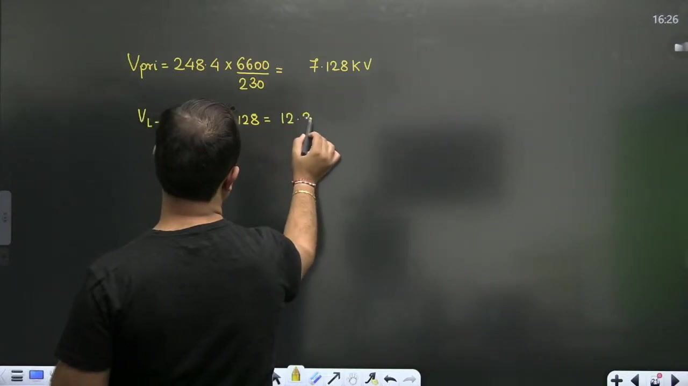

> [!success] Result
> To maintain rated voltage at the load terminals under maximum regulation, the HV line voltage must be $12.346\text{ kV}$.

### Problem Statement: Shell-Type Transformer Turns

The next problem investigates winding design for a three-phase shell-type transformer.

> [!example] Problem
> A three-phase, $50\text{ Hz}$ shell-type transformer has a net core cross-sectional area of $400\text{ cm}^2$. The peak flux density is limited to $1.2\text{ Wb/m}^2$. The voltage rating is $11,000 / 550\text{ V}$ with the HV winding in star and the LV winding in delta. Find the number of turns on both windings.

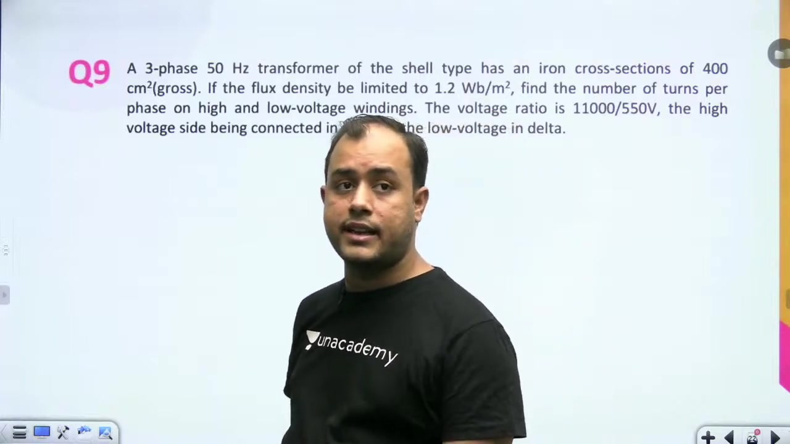

### Winding Turns Calculations

The core cross-sectional area is $A_i = 400\text{ cm}^2 = 0.04\text{ m}^2$. Begin with the delta-connected LV winding. In delta, phase voltage equals line voltage:
$$
V_{ph(LV)} = 550\text{ V}
$$

Apply the induced EMF equation for the LV winding:
$$
V_{ph(LV)} = 4.44 f N_L B_m A_i
$$

Solve for $N_L$:
$$
N_L = \frac{550}{4.44 \times 50 \times 1.2 \times 0.04} = \frac{550}{10.656} = 51.61\text{ turns}
$$
Round to the nearest even integer:
$$
N_L = 52\text{ turns}
$$

Now calculate the star-connected HV winding turns. In star, the phase voltage is:
$$
V_{ph(HV)} = \frac{11,000}{\sqrt{3}}\text{ V}
$$

The ratio of phase turns equals the ratio of phase voltages:
$$
N_H = N_L \left(\frac{V_{ph(HV)}}{V_{ph(LV)}}\right) = 52 \times \left(\frac{11,000 / \sqrt{3}}{550}\right) = 52 \times \frac{20}{\sqrt{3}} \approx 600.44\text{ turns}
$$

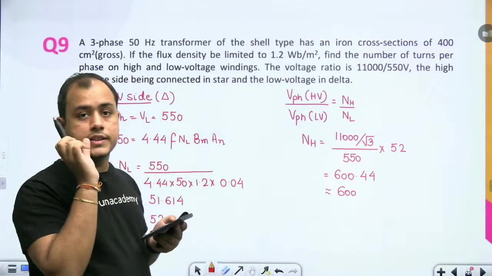

Choose $N_H = 600\text{ turns}$.

> [!success] Result
> The required turns per phase are $N_L = 52\text{ turns}$ on the LV delta winding and $N_H = 600\text{ turns}$ on the HV star winding.

## Bank Voltage Ratings and Voltage Regulation Calculation
_(60:34 - 65:31)_

### Problem Statement: Bank Voltage Rating and Turns Ratio

We determine the three-phase ratings for a bank formed from single-phase units.

> [!example] Problem
> Three single-phase $11,000 / 220\text{ V}$ transformers are connected to form a three-phase bank. The HV winding is connected in star, and the LV winding is connected in delta. Determine the three-phase voltage rating and the turns ratio of the transformer:
> - (A) $19,052 / 220\text{ V}, 50$
> - (B) $11,000 / 220\text{ V}, 50$
> - (C) $19,052 / 381\text{ V}, 50$
> - (D) $11,000 / 381\text{ V}, 28.87$

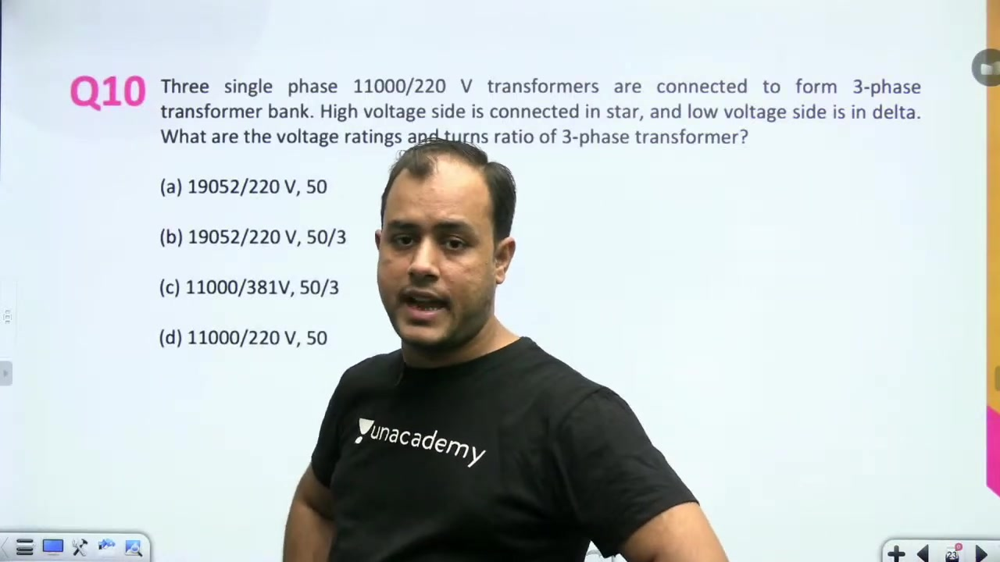

### Bank Voltage and Turns Ratio Evaluation

Nameplate voltage ratings for three-phase transformers always specify line-to-line voltages.

The HV side is star-connected. Its line voltage is:
$$
V_{L(HV)} = \sqrt{3} \times V_{ph(HV)} = \sqrt{3} \times 11,000\text{ V} \approx 19,052.56\text{ V}
$$

The LV side is delta-connected. In delta, line voltage equals phase voltage:
$$
V_{L(LV)} = V_{ph(LV)} = 220\text{ V}
$$

Thus the overall three-phase voltage rating is $19,052 / 220\text{ V}$.

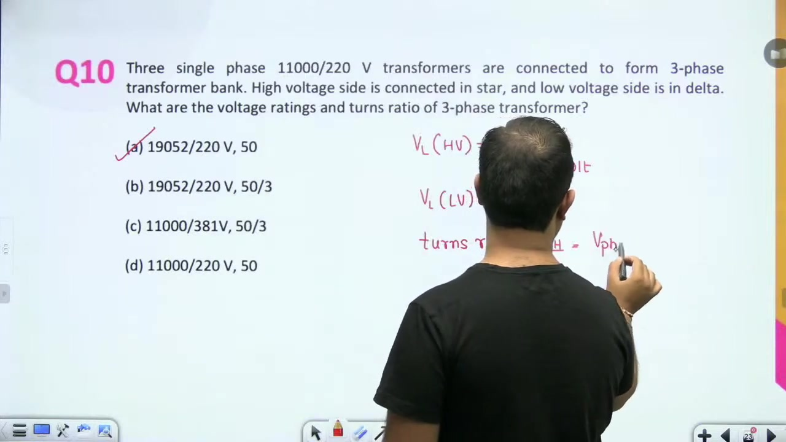

The turns ratio is strictly defined as the ratio of phase turns, which equals the phase voltage ratio:
$$
\text{Turns ratio} = \frac{N_H}{N_L} = \frac{V_{ph(HV)}}{V_{ph(LV)}} = \frac{11,000\text{ V}}{220\text{ V}} = 50
$$

The turns ratio never uses line voltages in star or delta systems.

> [!success] Result
> The bank voltage rating is $19,052 / 220\text{ V}$ and the turns ratio is $50$. The correct option is (A).

### Problem Statement: Voltage Regulation in Delta-Delta Bank

The next problem evaluates voltage regulation under partial loading.

> [!example] Problem
> A $100\text{ MVA}$, $230 / 115\text{ kV}$, delta-delta three-phase transformer has an equivalent resistance of $0.02\text{ p.u.}$ and a leakage reactance of $0.055\text{ p.u.}$ It delivers $80\text{ MVA}$ at a lagging power factor of $0.85$. Find the percentage voltage regulation:
> - (A) $4.2\%$
> - (B) $3.67\%$
> - (C) $2.8\%$
> - (D) $5.1\%$

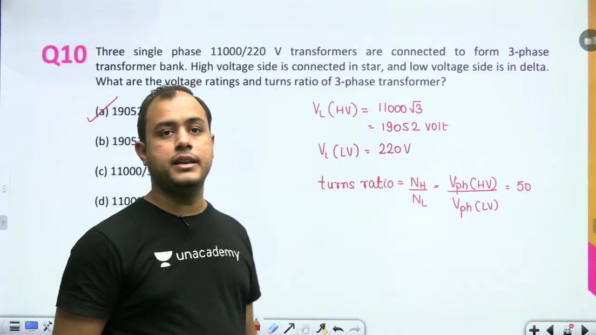

### Voltage Regulation Derivation

The fraction of full load is:
$$
x = \frac{S_{\text{load}}}{S_{\text{rated}}} = \frac{80\text{ MVA}}{100\text{ MVA}} = 0.8
$$

The load power factor is $\cos \phi = 0.85$. The corresponding sine is:
$$
\sin \phi = \sqrt{1 - 0.85^2} = 0.5268
$$

Apply the standard per-unit voltage regulation formula:
$$
\text{VR} = x (R_{pu} \cos \phi + X_{pu} \sin \phi)
$$

Substitute the numerical values:
$$
\text{VR} = 0.8 \times (0.02 \times 0.85 + 0.055 \times 0.5268) = 0.8 \times (0.0170 + 0.02897) = 0.03678
$$

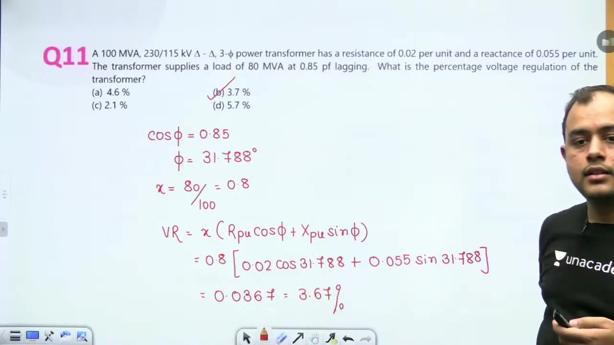

Expressed as a percentage, the regulation equals $3.68\%$ (or $0.0367\text{ p.u.}$).

> [!success] Result
> The voltage regulation of the transformer is $3.67\%$. The correct option is (B).

## Phase Displacement and Step-Down Transformer Analysis
_(65:32 - 70:39)_

### Problem Statement: Star-Delta Phase Displacement

We determine the phase displacement between primary and secondary voltages for a given star-delta connection.

> [!example] Problem
> A three-phase transformer has primary and secondary windings connected as shown in the circuit diagram. Find the phase displacement of the secondary line voltage with respect to the primary line voltage:
> - (A) $30^\circ$ lagging
> - (B) $30^\circ$ leading
> - (C) $0^\circ$
> - (D) $180^\circ$

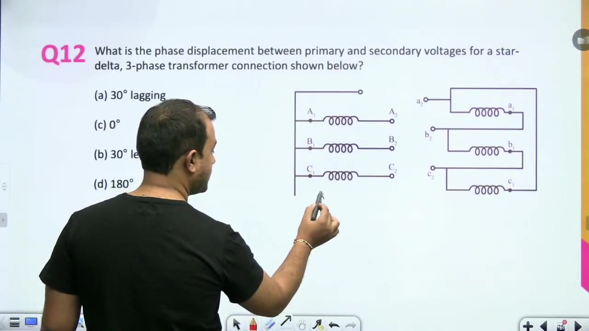

### Phasor Diagram Construction and Angle Measurement

First construct the primary star phasor diagram. Draw the reference phasor for phase A vertically upward along the 12 o'clock axis. Phase B lags phase A by $120^\circ$, and phase C lags phase B by $120^\circ$.

Next draw the secondary delta phasors parallel to their primary counterparts:
1. Draw phasor $a_1 a_2$ parallel to primary limb A.
2. Terminal $b_2$ connects directly to node $a_1$. Draw phasor $b_1 b_2$ parallel to primary limb B.
3. Terminal $c_2$ connects to node $b_1$. Draw phasor $c_1 c_2$ parallel to primary limb C.

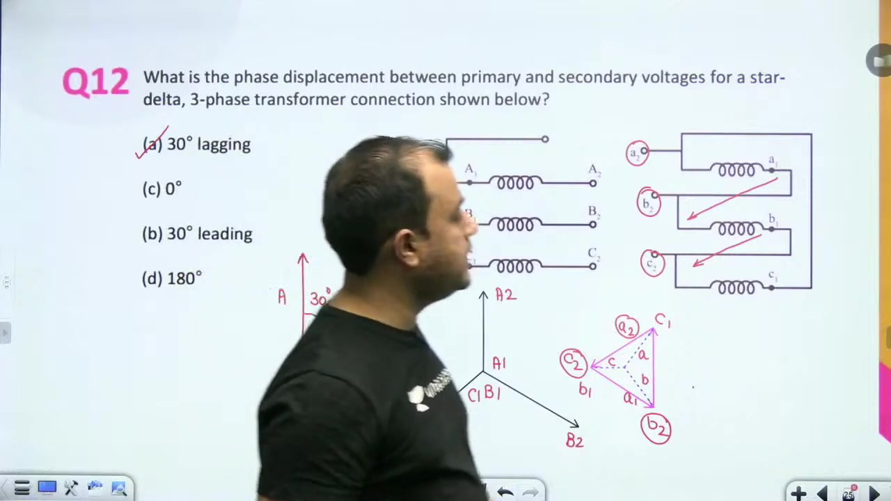

The output terminals brought out to the load are $a_2, b_2,$ and $c_2$. The secondary line phasor a lies $30^\circ$ clockwise relative to primary line phasor A. Clockwise displacement represents a lagging phase angle.

> [!success] Result
> The secondary voltage lags the primary voltage by $30^\circ$. This corresponds to the Yd1 clock group. The correct option is (A).

### Connections Capable of Introducing 30-Degree Phase Shifts

The next question tests the phase shift properties of standard three-phase connections.

> [!example] Problem
> Which transformer connection can introduce a phase difference of $30^\circ$ between output and input line voltages?
> - (A) Star-Star
> - (B) Delta-Delta
> - (C) Star-Delta
> - (D) Delta-Zigzag

Star-star and delta-delta connections produce phase shifts of only $0^\circ$ or $180^\circ$. Delta-zigzag connections also provide $0^\circ$ or $180^\circ$. Only star-delta and delta-star connections introduce phase shifts of $\pm 30^\circ$ or $\pm 150^\circ$. The correct option is (C).

### Step-Down Star-Delta Voltage Calculation

The lecture next examines a step-down star-delta transformer.

> [!example] Problem
> A three-phase step-down star-delta transformer connects to a $6600\text{ V}$ supply and draws a line current of $10\text{ A}$. The turns-per-phase ratio is $N_H / N_L = 12$. Neglecting losses, calculate the secondary line voltage.

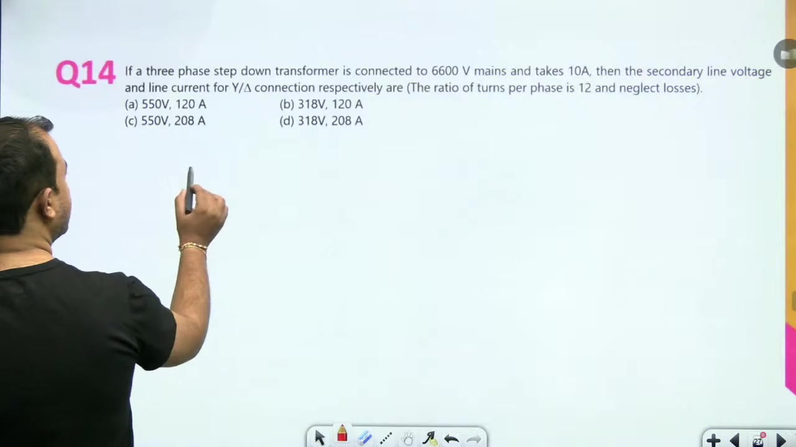

The primary side is star-connected. Its phase voltage equals:
$$
V_{ph(HV)} = \frac{V_{L(HV)}}{\sqrt{3}} = \frac{6600}{\sqrt{3}}\text{ V}
$$

The turns ratio relates primary and secondary phase voltages:
$$
V_{ph(LV)} = \frac{V_{ph(HV)}}{N_H / N_L} = \frac{6600 / \sqrt{3}}{12} = \frac{550}{\sqrt{3}}\text{ V} \approx 317.54\text{ V}
$$

In a delta connection, the line voltage equals the phase voltage:
$$
V_{L(LV)} = V_{ph(LV)} \approx 318\text{ V}
$$

The next section completes the current derivation for this problem.

## Secondary Current Derivation and Session Conclusion
_(70:48 - 73:52)_

### Secondary Current in Step-Down Transformer

We complete the calculations for the step-down star-delta transformer. In the primary star winding, line current equals phase current:
$$
I_{ph(HV)} = I_{L(HV)} = 10\text{ A}
$$

Phase currents transform inversely with the phase turns ratio $N_H / N_L = 12$:
$$
I_{ph(LV)} = \left(\frac{N_H}{N_L}\right) I_{ph(HV)} = 12 \times 10\text{ A} = 120\text{ A}
$$

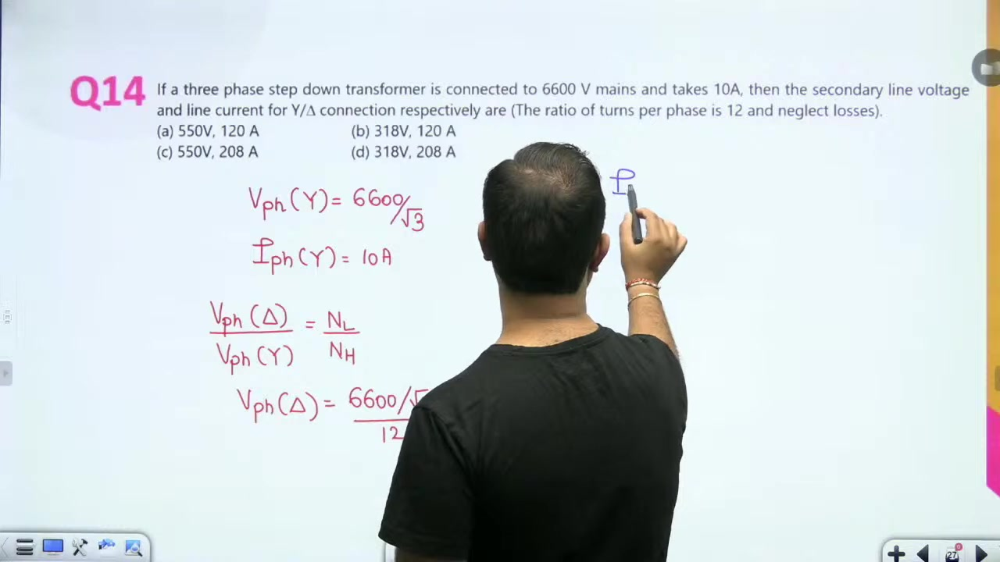

The secondary winding is delta-connected. In delta, line current equals $\sqrt{3}$ times phase current:
$$
I_{L(LV)} = \sqrt{3} \times I_{ph(LV)} = \sqrt{3} \times 120\text{ A} \approx 207.85\text{ A}
$$

Rounding to the nearest integer gives $208\text{ A}$.

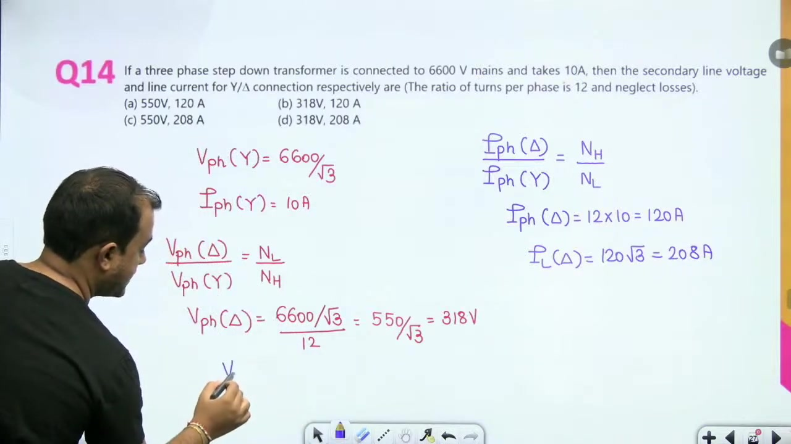

> [!success] Result
> The secondary line voltage is $318\text{ V}$ and the secondary line current is $208\text{ A}$. The correct option is (D).

### Deferred Problem and Session Wrap-Up

The final displayed problem asks for an angle $\theta$ from a circuit diagram. The printed slide omits the definition of $\theta$. The instructor defers this problem to the next session.

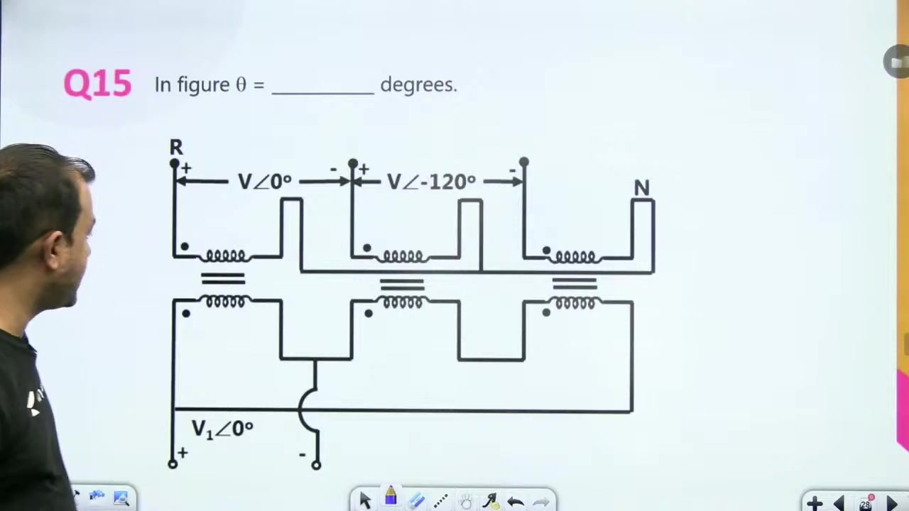

This concludes the first problem-solving session on three-phase transformers. The problems solved illustrate several essential analytical skills:
- Resolving delta polarity errors using vector components.
- Referring dynamic electromechanical motor loads across winding banks.
- Designing core areas and winding turns from induced EMF limits.
- Evaluating non-standard single-phase transformer interconnections.
- Calculating ohmic impedances from per-unit ratings and loss data.
- Applying complex power balance to multi-winding transformers.
- Determining voltage regulation extremes and line voltage ratings.

The next session continues with advanced three-phase transformer problems, focusing on open-delta connections and phasor groups.

---

## Summary and Key Takeaways

- Reversing one phase winding in a delta secondary creates a net circulating voltage of $2 E$ across the open corner, where $E$ is the phase voltage magnitude.
- In three-phase induction motor problems, input active power equals shaft mechanical power divided by efficiency: $P_{\text{in}} = P_{\text{out}} / \eta$.
- Core cross-sectional area relates directly to the induced EMF per turn through the relation $A_i = (E_{ph} / N_{ph}) / (4.44 f B_m)$.
- Per-unit series resistance of a transformer equals total full-load copper loss divided by the base apparent power: $R_{pu} = P_{cu,fl} / S_{\text{base}}$.
- Three-winding transformer analysis simplifies by applying complex power balance, where the source delivers $\vec{S}_{\text{source}} = \vec{S}_{\text{sec}} + \vec{S}_{\text{tert}} + \vec{S}_{\text{loss}}$.
- Maximum voltage regulation for any power factor occurs when the load impedance angle equals the transformer impedance angle, giving $\text{VR}_{\max} = Z_{pu}$.
- Nameplate voltage ratings for three-phase banks always specify line-to-line voltages, requiring a factor of $\sqrt{3}$ conversion for star-connected windings.
- Phase displacement between primary and secondary line voltages in star-delta configurations is determined by drawing winding phasor diagrams relative to standard clock hour positions.

---

[← Lec 040: Three Phase Transformer 4](Lecture_040_Three_Phase_Transformer_4.md) | [🏠 Index](00_yt_study_guide.md) | [Lec 042: Problems Based on Three Phase Transformers 2 →](Lecture_042_Problems_Based_on_Three_Phase_Transformers_2.md)
