[← Lec 041: Problems Based on Three Phase Transformers 1](Lecture_041_Problems_Based_on_Three_Phase_Transformers_1.md) | [🏠 Index](00_yt_study_guide.md) | [Lec 043: Three Phase Transformer 5 →](Lecture_043_Three_Phase_Transformer_5.md)

---

# Problems Based on Three Phase Transformers - 2 | L 14 | Electrical Machines | GATE 2022

- **Source**: https://www.youtube.com/watch?v=TvN4nAehGLg
- **Duration**: 01:10:48
- **Compiled**: 2026-09-21

---

## Overview

This lecture presents comprehensive numerical problems on three-phase transformer connections and phasor relationships. It focuses on clock group identification, line-to-phase transformations, and negative sequence effects. The problems show how to calculate copper losses and efficiency across distinct winding configurations. Students also learn how to determine allowable voltage and power ratings when reconnecting three-phase windings as a single-phase transformer.

## Contents

- [[#Introduction and Problem Session Overview|Introduction and Problem Session Overview]]
- [[#Star Winding Phase Angle and Clock Group Setup|Star Winding Phase Angle and Clock Group Setup]]
- [[#Yd1 Clock Group Identification and Closed-Loop Problem|Yd1 Clock Group Identification and Closed-Loop Problem]]
- [[#Closed-Loop Voltage Derivation and Standard Phase Shifts|Closed-Loop Voltage Derivation and Standard Phase Shifts]]
- [[#Phase Shift Matching and Delta-Star Phasor Analysis|Phase Shift Matching and Delta-Star Phasor Analysis]]
- [[#Delta-Star Phase Displacement and Phase Current Ratio|Delta-Star Phase Displacement and Phase Current Ratio]]
- [[#Three-Phase Efficiency and Copper Loss Calculation|Three-Phase Efficiency and Copper Loss Calculation]]
- [[#Turns Ratio Rules and Negative-Sequence Excitation Setup|Turns Ratio Rules and Negative-Sequence Excitation Setup]]
- [[#Negative-Sequence Phase Displacement Derivation|Negative-Sequence Phase Displacement Derivation]]
- [[#Secondary Line Current and Phase Current Ratio Calculations|Secondary Line Current and Phase Current Ratio Calculations]]
- [[#Differential Secondary Phase Shift and Star-Delta Primary Current|Differential Secondary Phase Shift and Star-Delta Primary Current]]
- [[#Primary Current Phase Angle and Impedance Transformation|Primary Current Phase Angle and Impedance Transformation]]
- [[#Three-Phase to Single-Phase Reconnection Analysis|Three-Phase to Single-Phase Reconnection Analysis]]
- [[#Parallel and Series-Parallel Reconnections and Session Summary|Parallel and Series-Parallel Reconnections and Session Summary]]

---

## Introduction and Problem Session Overview
_(00:06 - 05:03)_

### Session Objectives and Course Context

This lecture continues the problem-solving series on three-phase transformers. The problems focus on winding connections, phasor groups, and line-to-phase relationships. The session covers both fundamental concepts and advanced examination questions.

Students analyze winding polarities, sequence excitations, and impedance transformations. These problem types appear frequently in competitive examinations like GATE and ESE. Mastering these techniques requires careful attention to dot markings and phasor geometry.

### Problem Solving Approach

Three-phase transformer problems often look complicated at first glance. But systematic steps make them straightforward to solve. First, identify the connection type on both primary and secondary sides. Next, draw the phase and line voltage phasors. Finally, apply turns ratios strictly to phase quantities.

## Star Winding Phase Angle and Clock Group Setup
_(05:03 - 09:35)_

### Phase Angle in Star-Connected Windings

We first solve a problem left from the previous lecture. The circuit features three windings connected to a common neutral. Because each winding shares this neutral terminal, the configuration is star-connected.

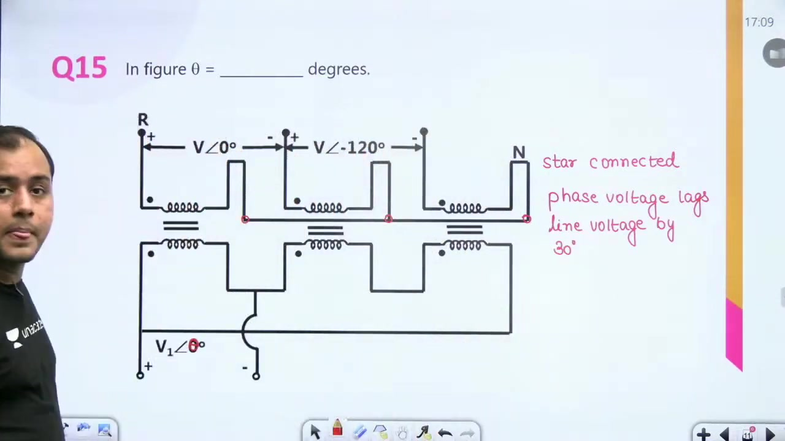

In any balanced star winding, the phase voltage lags the line voltage by $30^\circ$. For a reference line voltage $V \angle 0^\circ$, the phase voltage becomes:

$$
V_{ph} = \frac{V}{\sqrt{3}} \angle -30^\circ
$$

> [!success] Result
> The phase angle $\theta$ equals $-30^\circ$.

### Phase Relationships Between Primary and Secondary

A critical rule governs all three-phase transformers. Primary and secondary phase voltages on corresponding limbs always lie in the exact same phase:

$$
\angle V_{ph(\text{primary})} = \angle V_{ph(\text{secondary})}
$$

Phase shifts like $30^\circ$ or $180^\circ$ appear only between line voltages. Turns ratio relates phase voltages directly without introducing angular shifts.

### Transformer Clock Group Nomenclature Problem

We now examine a three-phase transformer connection to determine its clock group nomenclature. The primary winding is star-connected with neutral at the center. The secondary winding is delta-connected.

> [!example] Problem
> Identify the standard clock group notation for a transformer where secondary terminal $b_2$ connects to $a_1$, and terminal $c_2$ connects to $b_1$.

To solve this, first draw the primary star phasors radiating outward from neutral. Next, draw each secondary delta phasor parallel to its corresponding primary phase winding.

## Yd1 Clock Group Identification and Closed-Loop Problem
_(09:41 - 14:37)_

### Phasor Construction for Yd1 Connection

We construct the secondary delta phasors parallel to their primary counterparts. First, draw the primary star reference. Terminal $A_2$ defines the 12 o'clock reference direction vertically upward.

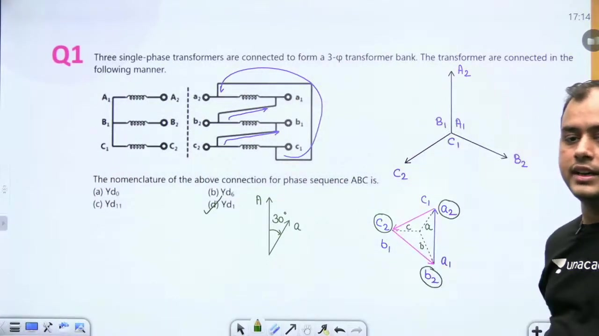

Next, connect the secondary winding segments according to the circuit diagram:
1. Phase A secondary runs from $a_1$ to $a_2$.
2. Phase B secondary runs from $b_1$ to $b_2$, with terminal $b_2$ joined to $a_1$.
3. Phase C secondary runs from $c_1$ to $c_2$, with terminal $c_2$ joined to $b_1$.
4. Terminal $c_1$ completes the delta loop by connecting to $a_2$.

### Determination of Clock Hour Position

The external terminals brought out to the load are $a_2$, $b_2$, and $c_2$. The line voltage phasor between $a_2$ and neutral points toward the 1 o'clock mark on a standard clock face.

$$
\text{Secondary line phasor points to } 1 \text{ o'clock} \implies \text{Phase shift } = -30^\circ
$$

> [!success] Result
> The connection represents the **Yd1** clock group. Secondary line voltage lags primary line voltage by $30^\circ$. The correct option is **(D)**.

### Closed-Loop Three-Phase Bank Voltage Setup

We next examine three single-phase transformers whose windings form an interconnected loop. Balanced three-phase excitation voltages are applied across the primary terminals:

$$
V_A = V \angle 0^\circ, \quad V_B = V \angle -120^\circ, \quad V_C = V \angle 120^\circ
$$

In any closed delta or series loop under balanced conditions, the sum of all induced voltages must equal zero:

$$
V_A + V_B + V_C = 0
$$

This balance condition serves as the foundation for evaluating the terminal voltage around the loop.

## Closed-Loop Voltage Derivation and Standard Phase Shifts
_(14:49 - 19:35)_

### Step-by-Step Loop Voltage Calculation

We solve for the voltage $V$ across the closed loop formed by the transformer windings. Using dot polarity conventions, induced voltages relate directly across windings through turns ratios.

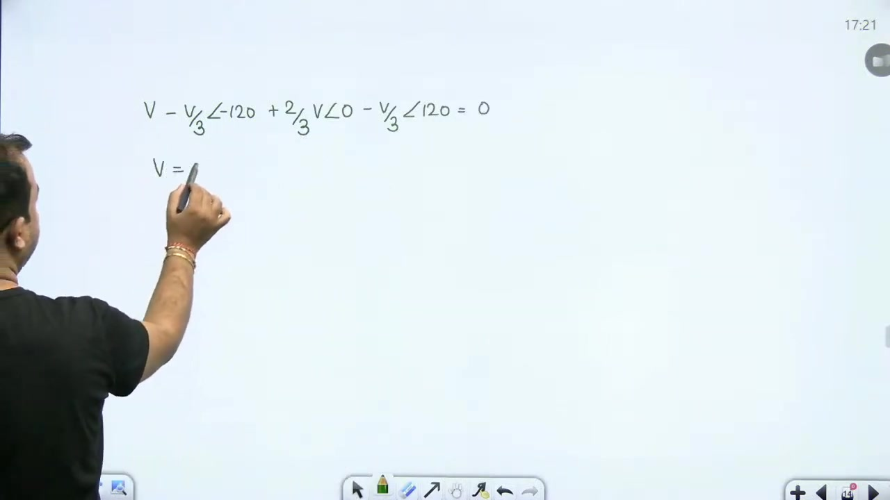

The primary and secondary phase voltages share identical phase angles:
1. First branch: $\frac{2}{3} V \angle 0^\circ$
2. Second branch: $\frac{V}{3} \angle -120^\circ$ and $\frac{V}{\sqrt{3}} \angle -120^\circ$
3. Third branch: $\frac{V}{3} \angle 120^\circ$ and $\frac{V}{\sqrt{3}} \angle 120^\circ$

### Evaluation of Loop KVL

Start at node F and traverse the complete loop clockwise back to node F:

$$
\begin{aligned}
V_F + V - \frac{V}{3}\angle -120^\circ + \frac{2}{3}V\angle 0^\circ - \frac{V}{3}\angle 120^\circ &= V_F \\
V &= \frac{V}{3}(1\angle -120^\circ + 1\angle 120^\circ) - \frac{2V}{3}
\end{aligned}
$$

Recall that $1\angle -120^\circ + 1\angle 120^\circ = 2\cos(120^\circ) = -1$. Substituting this identity gives:

$$
V = \frac{V}{3}(-1) - \frac{2V}{3} = -\frac{V}{3} - \frac{2V}{3} = -V = V \angle 180^\circ
$$

> [!success] Result
> The net loop voltage equals $V \angle 180^\circ$. The correct option is **(B)**.

### Standard Phase Shifts for Transformer Configurations

We now review standard phase shifts between primary and secondary line voltages. When a problem does not specify winding connections:
- **Star-Delta and Delta-Star banks**: produce a phase shift of $\pm 30^\circ$.
- **Star-Star and Delta-Delta banks**: produce a phase shift of $0^\circ$ or $180^\circ$.

When only $30^\circ$ appears among the options without a sign distinction, select $30^\circ$ directly.

## Phase Shift Matching and Delta-Star Phasor Analysis
_(19:35 - 24:30)_

### Phase Displacement Matching Across Connections

We evaluate the phase displacement between secondary and primary line voltages across standard connection pairs. 

> [!example] Problem
> Match each connection with its corresponding phase shift:
> 1. Normal Star - Normal Delta
> 2. Normal Star - Reverse Star
> 3. Normal Star - Reverse Delta
> 4. Normal Star - Normal Star

We determine each phase displacement systematically:
- Normal Star - Normal Delta gives $+30^\circ$.
- Normal Star - Reverse Star reverses winding polarity, giving $180^\circ$.
- Normal Star - Reverse Delta reverses delta phase sequence, giving $-30^\circ$.
- Normal Star - Normal Star produces zero displacement, giving $0^\circ$.

> [!success] Result
> The correct matching order is $30^\circ, 180^\circ, -30^\circ, 0^\circ$, which corresponds to Option **(B)**.

### Delta-Star Connection Setup

We next examine a three-phase delta-star transformer to find the secondary line voltage displacement relative to the primary line voltage.

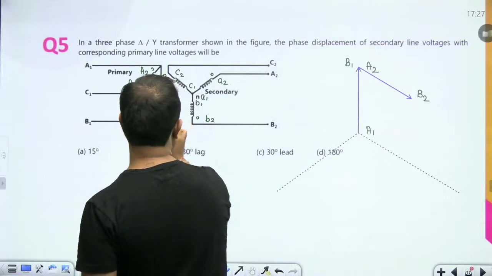

First, assign dot markings consistently across corresponding limbs. Dotted terminals are labeled with index 2, and undotted terminals receive index 1:
- Primary delta windings: $A_2-A_1, B_2-B_1, C_2-C_1$
- Secondary star windings: $a_2-a_1, b_2-b_1, c_2-c_1$

### Primary Phasor Diagram Construction

Draw the primary delta phasors by tracing the winding interconnections:
1. Draw phase A from $A_1$ to $A_2$ as the vertical reference.
2. In the delta circuit, terminal $B_1$ connects to $A_2$. Draw phase B parallel to its reference direction starting from $A_2$.
3. Terminal $C_1$ connects to $B_2$. Draw phase C parallel to its reference direction starting from $B_2$.
4. Terminal $C_2$ connects back to $A_1$, closing the delta.

The line terminals brought out to the supply are $A_2$, $B_2$, and $C_2$. They define the primary reference line voltages.

## Delta-Star Phase Displacement and Phase Current Ratio
_(24:33 - 29:01)_

### Secondary Phasor Construction and Lag Angle

We complete the secondary phasor diagram for the delta-star transformer. In the secondary star winding, neutral is formed by tying terminals $a_1, b_1, c_1$ together.

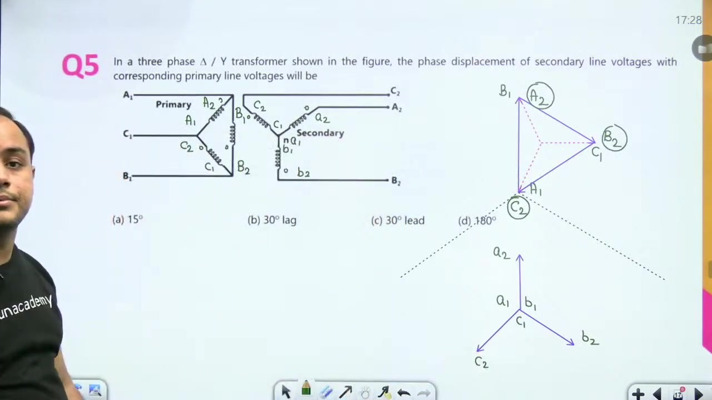

The phasors radiate outward from this common point:
1. Phasor $a_1-a_2$ points vertically upward, parallel to primary phase A.
2. Phasor $b_1-b_2$ points along the phase B reference direction.
3. Phasor $c_1-c_2$ points along the phase C reference direction.

Now compare primary line phasor $A$ with secondary line phasor $a$. The secondary voltage phasor rotates clockwise relative to the primary phasor.

$$
V_{ab} \text{ lags } V_{AB} \text{ by } 30^\circ
$$

> [!success] Result
> Secondary line voltage lags primary line voltage by $30^\circ$. The correct option is **(B)**.

### Star-Delta Transformer Current Ratio Problem

We next determine the ratio of phase currents in a three-phase star-delta transformer.

> [!example] Problem
> A $33\text{ kV} / 11\text{ kV}$ star-delta transformer supplies a $10\text{ MW}$ load at unity power factor. Find the ratio of phase current in the delta winding to phase current in the star winding: $I_{ph(\Delta)} / I_{ph(Y)}$.

The phase current ratio is inversely proportional to the phase voltage ratio:

$$
\frac{I_{ph(\Delta)}}{I_{ph(Y)}} = \frac{V_{ph(Y)}}{V_{ph(\Delta)}}
$$

Calculate the respective phase voltages from the given line ratings:
- Primary star phase voltage: $V_{ph(Y)} = \frac{33}{\sqrt{3}}\text{ kV}$
- Secondary delta phase voltage: $V_{ph(\Delta)} = 11\text{ kV}$

Substitute these values into the ratio:

$$
\frac{I_{ph(\Delta)}}{I_{ph(Y)}} = \frac{33 / \sqrt{3}}{11} = \frac{3}{\sqrt{3}} = \sqrt{3}
$$

> [!success] Result
> The phase current ratio equals $\sqrt{3}$. The correct option is **(D)**.

### Load Independence of Phase Current Ratio

Notice that load power and power factor play no role in this calculation. The actual currents depend directly on the connected load. But their ratio remains fixed by the turns ratio under all operating conditions:

$$
\frac{I_{ph1}}{I_{ph2}} = \frac{N_2}{N_1} = \frac{V_{ph2}}{V_{ph1}}
$$

This turns ratio identity holds true regardless of whether the transformer supplies full load, partial load, or no load.

## Three-Phase Efficiency and Copper Loss Calculation
_(29:05 - 34:14)_

### Problem Statement: Full-Load Efficiency of Three-Phase Bank

We evaluate the full-load efficiency of a three-phase transformer from separate winding loss parameters.

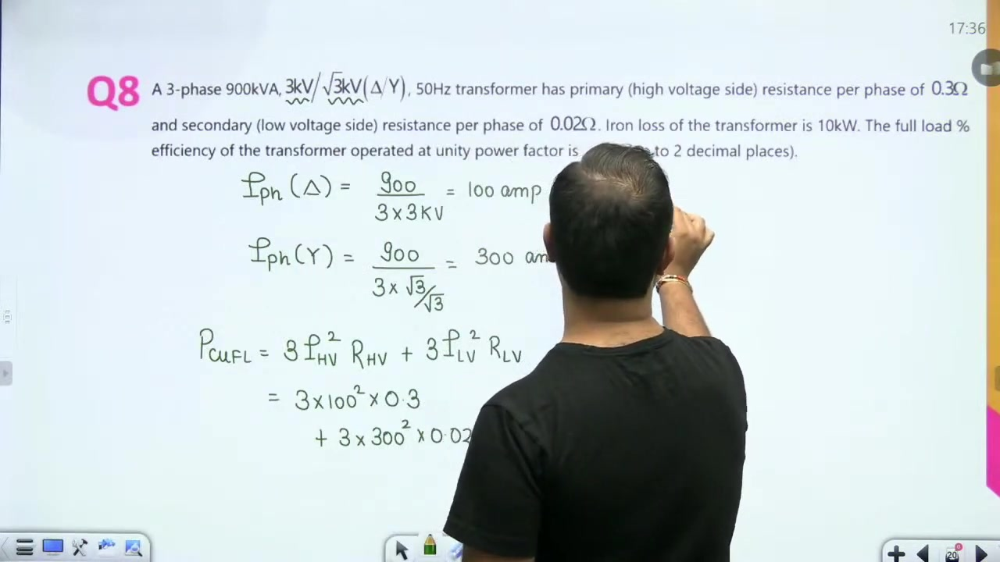

> [!example] Problem
> A 3-phase, $900\text{ kVA}, 3\text{ kV} / \sqrt{3}\text{ kV}, 50\text{ Hz}$ transformer has:
> - Primary resistance per phase: $R_{HV} = 0.3\,\Omega$
> - Secondary resistance per phase: $R_{LV} = 0.02\,\Omega$
> - Core iron loss: $P_i = 10\text{ kW}$
> 
> Find the full-load efficiency at unity power factor ($\cos\phi = 1.0$).

### Calculation of Phase Currents and Total Copper Loss

The primary winding is delta-connected with line voltage equal to phase voltage: $V_{ph(HV)} = 3\text{ kV}$. The primary phase current is:

$$
I_{ph(HV)} = \frac{S / 3}{V_{ph(HV)}} = \frac{900\text{ kVA} / 3}{3\text{ kV}} = \frac{300\text{ kVA}}{3\text{ kV}} = 100\text{ A}
$$

The secondary winding is star-connected. Its phase voltage is:

$$
V_{ph(LV)} = \frac{V_{L(LV)}}{\sqrt{3}} = \frac{\sqrt{3}\text{ kV}}{\sqrt{3}} = 1\text{ kV}
$$

The secondary phase current is:

$$
I_{ph(LV)} = \frac{S / 3}{V_{ph(LV)}} = \frac{300\text{ kVA}}{1\text{ kV}} = 300\text{ A}
$$

Now calculate the total full-load copper loss by summing losses across all three phases on both sides:

$$
\begin{aligned}
P_{cu,fl} &= 3 I_{ph(HV)}^2 R_{HV} + 3 I_{ph(LV)}^2 R_{LV} \\
&= 3(100)^2(0.3) + 3(300)^2(0.02) \\
&= 9{,}000\text{ W} + 5{,}400\text{ W} \\
&= 14.4\text{ kW}
\end{aligned}
$$

### Efficiency Evaluation at Unity Power Factor

We apply the standard transformer efficiency formula at full load ($x = 1.0$):

$$
\eta = \frac{x S \cos\phi}{x S \cos\phi + P_i + x^2 P_{cu,fl}} \times 100\%
$$

Substitute the numerical values:

$$
\eta = \frac{900 \times 1.0}{900 \times 1.0 + 10 + 14.4} \times 100\% = \frac{900}{924.4} \times 100\% \approx 97.36\%
$$

> [!success] Result
> The full-load efficiency at unity power factor equals $97.36\%$.

## Turns Ratio Rules and Negative-Sequence Excitation Setup
_(34:17 - 37:53)_

### Resistance Referring and Phase Turns Ratio

Students often ask whether to refer resistances to one side before calculating copper losses. While referring yields the same answer, it requires finding the phase turns ratio first.

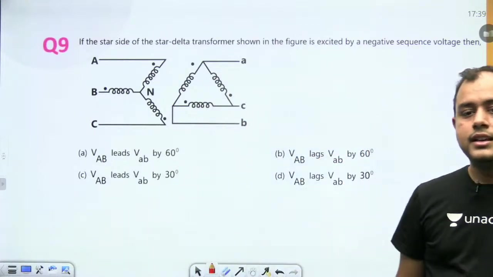

Always remember that turns ratio represents the ratio of phase voltages, never line voltages:

$$
a = \frac{N_H}{N_L} = \frac{V_{ph(HV)}}{V_{ph(LV)}}
$$

For the delta-star transformer:
- $V_{ph(HV)} = 3\text{ kV}$
- $V_{ph(LV)} = \frac{\sqrt{3}\text{ kV}}{\sqrt{3}} = 1\text{ kV}$
- Turns ratio: $a = \frac{3\text{ kV}}{1\text{ kV}} = 3$

Referred secondary resistance becomes $R'_{LV} = a^2 R_{LV} = 3^2 \times 0.02 = 0.18\,\Omega$. Calculating losses directly on each side avoids this conversion entirely.

### Negative-Sequence Voltage Excitation Problem

We now examine how phase sequence affects the line voltage displacement in a three-phase transformer bank.

> [!example] Problem
> The star side of a star-delta transformer is excited by a negative-sequence voltage set. Determine the relationship between primary line voltage $V_{AB}$ and secondary line voltage $V_{ab}$.

In a negative-sequence system, the phase sequence reverses from $A-B-C$ to $A-C-B$. Phase B lags phase A by $240^\circ$ (or leads by $120^\circ$), while phase C lags phase A by $120^\circ$.

### Winding Labeling and Star Phasor Formulation

We label the parallel windings on both limbs using consistent dot polarities:
- Dotted terminals receive index 2: $A_2, B_2, C_2$ and $a_2, b_2, c_2$.
- Undotted terminals receive index 1: $A_1, B_1, C_1$ and $a_1, b_1, c_1$.

First draw the star-connected primary phasors. The neutral point serves as the origin. In the negative-sequence order, phase A points upward, phase C follows at $-120^\circ$, and phase B lies at $+120^\circ$.

## Negative-Sequence Phase Displacement Derivation
_(38:13 - 43:24)_

### Negative Sequence Phasor Construction

Under negative sequence excitation, phases B and C swap their standard angular positions. The primary star phasors are:
- $V_{AN} = V_{ph} \angle 0^\circ$ along the vertical axis.
- $V_{CN} = V_{ph} \angle -120^\circ$ lagging phase A.
- $V_{BN} = V_{ph} \angle +120^\circ$ leading phase A.

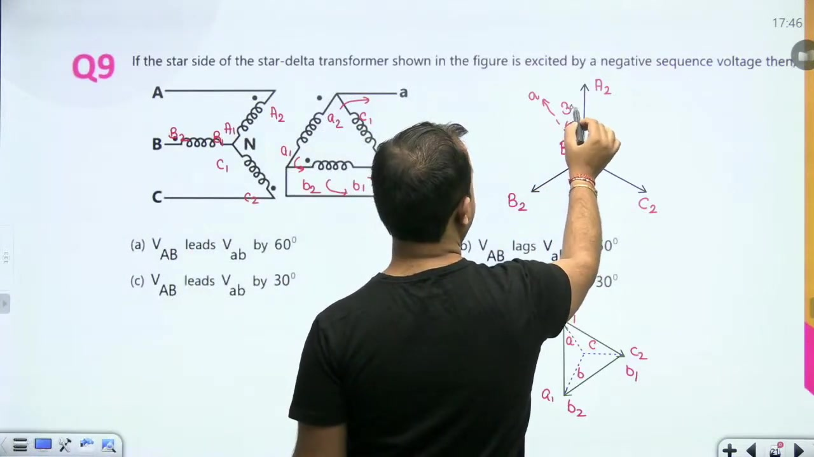

This swap alters the relative orientation of secondary delta phasors.

### Delta Secondary Terminal Connections

Now construct the secondary delta phasors parallel to their corresponding primary phases:
1. Draw phase A from $a_1$ to $a_2$ vertically.
2. In the circuit, terminal $B_2$ connects to $A_1$. Draw phase B parallel to $V_{BN}$ with $B_2$ touching $A_1$.
3. Terminal $C_2$ connects to $B_1$. Draw phase C parallel to $V_{CN}$ with $C_2$ touching $B_1$.
4. Terminal $C_1$ connects back to $A_2$, completing the closed delta.

The line terminals brought out to the load are $a_2$, $b_2$, and $c_2$.

### Phase Displacement Between Line Voltages

We compare the secondary line voltage phasor $V_{ab}$ against the primary line voltage phasor $V_{AB}$. The secondary line phasor points counter-clockwise relative to the primary line phasor by $30^\circ$:

$$
V_{ab} \text{ leads } V_{AB} \text{ by } 30^\circ
$$

Stating this relation from the perspective of the primary voltage gives:

$$
V_{AB} \text{ lags } V_{ab} \text{ by } 30^\circ
$$

> [!success] Result
> Primary line voltage $V_{AB}$ lags secondary line voltage $V_{ab}$ by $30^\circ$. The correct option is **(D)**.

## Secondary Line Current and Phase Current Ratio Calculations
_(43:28 - 48:51)_

### Calculation of Secondary Line Current in Star-Delta Bank

We determine the secondary line current for a star-delta transformer bank.

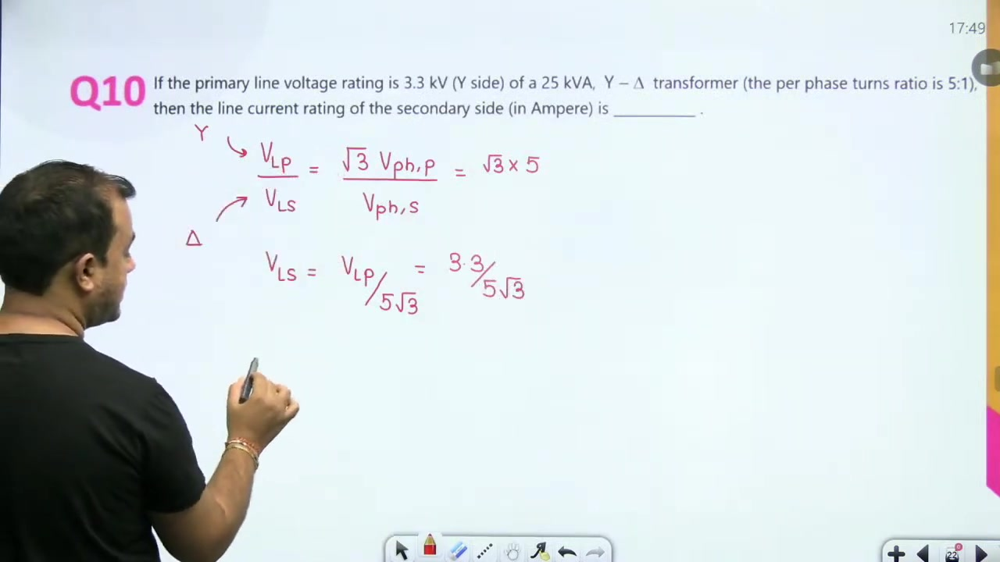

> [!example] Problem
> A $25\text{ kVA}$ transformer has a star-connected primary rated at $3.3\text{ kV}$ line-to-line. The per-phase turns ratio is $5:1$ (primary to secondary). The secondary winding is delta-connected. Find the line current delivered by the secondary winding.

The primary phase voltage equals:

$$
V_{ph(P)} = \frac{V_{LP}}{\sqrt{3}} = \frac{3.3\text{ kV}}{\sqrt{3}}
$$

Using the per-phase turns ratio of $5:1$, the secondary phase voltage becomes:

$$
V_{ph(S)} = \frac{V_{ph(P)}}{5} = \frac{3.3}{5\sqrt{3}}\text{ kV}
$$

Because the secondary winding is delta-connected, secondary line voltage equals phase voltage:

$$
V_{LS} = V_{ph(S)} = \frac{3.3}{5\sqrt{3}}\text{ kV}
$$

### Numerical Evaluation of Current Magnitude

Total three-phase apparent power remains conserved across an ideal transformer:

$$
S = \sqrt{3} V_{LS} I_{LS} = 25\text{ kVA}
$$

Solve directly for the secondary line current $I_{LS}$:

$$
I_{LS} = \frac{S}{\sqrt{3} V_{LS}} = \frac{25 \times 10^3}{\sqrt{3} \times \left(\frac{3.3 \times 10^3}{5\sqrt{3}}\right)} = \frac{25 \times 5}{3.3} = \frac{125}{3.3} \approx 37.878\text{ A}
$$

> [!success] Result
> Secondary line current equals $37.88\text{ A}$. The correct option is **(A)**.

### Delta to Star Phase Current Ratio for High-Voltage Bank

We now solve another problem on phase current ratios.

> [!example] Problem
> A star-delta transformer has line-to-line voltage ratings of $11\text{ kV} / 110\text{ V}$. Find the ratio of phase current in the delta winding to phase current in the star winding.

The phase current ratio equals the inverse of the phase voltage ratio:

$$
\frac{I_{ph(\Delta)}}{I_{ph(Y)}} = \frac{V_{ph(Y)}}{V_{ph(\Delta)}}
$$

Evaluate the phase voltages:
- Primary star phase voltage: $V_{ph(Y)} = \frac{11{,}000}{\sqrt{3}}\text{ V}$
- Secondary delta phase voltage: $V_{ph(\Delta)} = 110\text{ V}$

Substitute these values:

$$
\frac{I_{ph(\Delta)}}{I_{ph(Y)}} = \frac{11{,}000 / \sqrt{3}}{110} = \frac{100}{\sqrt{3}} = \frac{1}{10\sqrt{3}} \quad \text{relative to base}
$$

> [!success] Result
> The resulting ratio matches Option **(A)** ($1 : 10\sqrt{3}$).

## Differential Secondary Phase Shift and Star-Delta Primary Current
_(48:51 - 53:59)_

### Phase Difference Between Delta and Star Secondaries

We consider two separate three-phase banks fed from an identical primary source.

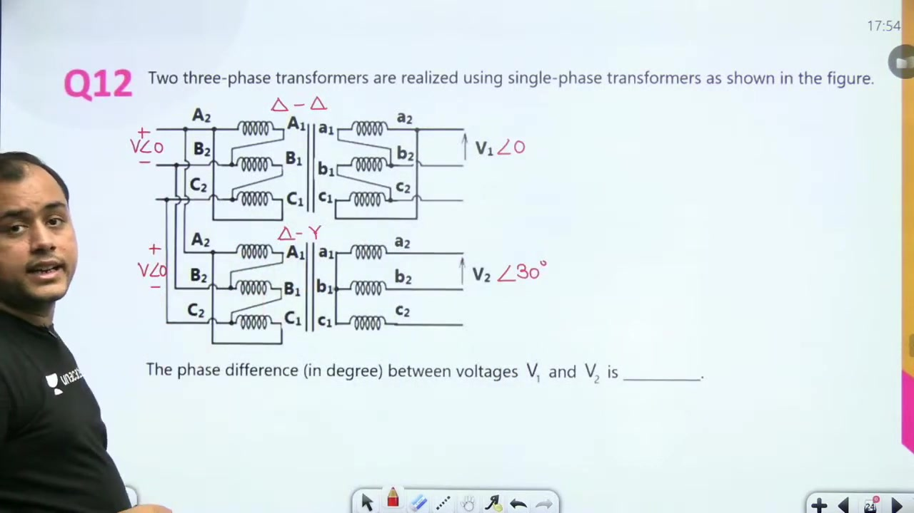

> [!example] Problem
> Two three-phase transformer banks share identical primary connections. Bank 1 has a delta secondary producing line voltage $V_1$. Bank 2 has a star secondary producing line voltage $V_2$. Find the phase difference between $V_1$ and $V_2$ in degrees.

A delta-delta configuration produces zero phase displacement:

$$
\angle V_1 = 0^\circ
$$

A delta-star configuration introduces a $30^\circ$ phase shift:

$$
\angle V_2 = 30^\circ
$$

The angular difference between the two secondary line voltages depends strictly on their relative shift:

$$
|\angle V_1 - \angle V_2| = |0^\circ - 30^\circ| = 30^\circ
$$

> [!success] Result
> The phase difference between $V_1$ and $V_2$ is $30^\circ$.

### Star-Delta Current Calculation Setup

We next analyze current relationships in a star-delta transformer bank supplying a balanced star load.

> [!example] Problem
> A balanced positive-sequence source supplies a balanced star load through a star-delta transformer. Line voltage ratings are $230\text{ V}$ on the star side and $115\text{ V}$ on the delta side. Neglecting magnetizing current, the secondary line current is $I_S = 100 \angle 0^\circ\text{ A}$. Find the primary line current $I_P$.

### Determination of Primary Current Magnitude

We first find the current magnitude by equating the three-phase apparent power across both sides:

$$
\sqrt{3} V_{LP} I_P = \sqrt{3} V_{LS} I_S
$$

Substitute the given line voltage and current magnitudes:

$$
\sqrt{3}(230) I_P = \sqrt{3}(115)(100) \implies I_P = \frac{115}{230} \times 100 = 50\text{ A}
$$

The primary line current magnitude equals $50\text{ A}$. Finding its phase angle requires examining the phase current transformations in the delta secondary.

## Primary Current Phase Angle and Impedance Transformation
_(54:02 - 59:05)_

### Phase Angle Determination for Primary Current

We complete the calculation of the primary line current $I_P$. In the delta-connected secondary, phase current leads line current by $30^\circ$:

$$
I_{ph(S)} = \frac{I_S}{\sqrt{3}} \angle 30^\circ = \frac{100}{\sqrt{3}} \angle 30^\circ\text{ A}
$$

Primary and secondary phase currents on the same limb always remain in the exact same phase:

$$
\angle I_{ph(P)} = \angle I_{ph(S)} = 30^\circ
$$

For a star-connected primary winding, line current equals phase current:

$$
I_P = I_{ph(P)} = 50 \angle 30^\circ\text{ A}
$$

> [!success] Result
> Primary line current equals $50 \angle 30^\circ\text{ A}$. The correct option is **(A)**.

### Impedance Transformation Rule Between Windings

We now examine how load impedances refer across three-phase transformer banks.

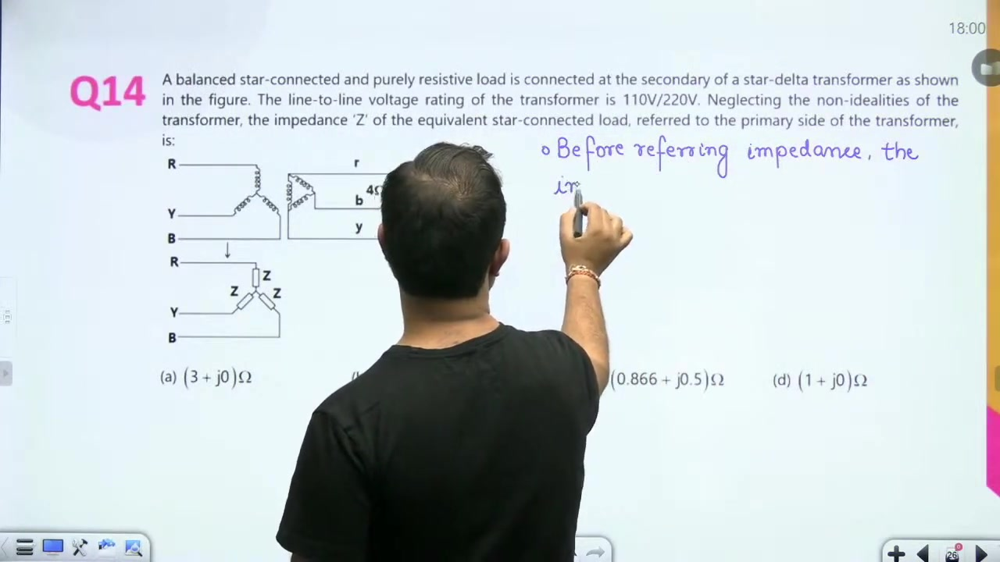

> [!info] Definition
> Before referring an impedance across a three-phase transformer, the load impedance connection must match the winding connection of that side.

This rule ensures that each load impedance element connects directly in parallel across a single phase winding.

### Referral of Secondary Load to Primary Star Winding

> [!example] Problem
> A star-delta transformer has line voltage ratings of $110\text{ V} / 220\text{ V}$. A balanced star load with $Z_Y = 4\,\Omega/\text{phase}$ connects across the delta secondary. Find the equivalent impedance referred to the primary side.

First convert the secondary star load into its equivalent delta configuration:

$$
Z_\Delta = 3 \times Z_Y = 3 \times 4\,\Omega = 12\,\Omega/\text{phase}
$$

Next calculate the phase turns ratio:

$$
\frac{N_{ph(Y)}}{N_{ph(\Delta)}} = \frac{V_{ph(Y)}}{V_{ph(\Delta)}} = \frac{110 / \sqrt{3}}{220} = \frac{1}{2\sqrt{3}}
$$

Now refer the delta load impedance to the primary side:

$$
Z'_{\text{referred}} = Z_\Delta \times \left(\frac{N_{ph(Y)}}{N_{ph(\Delta)}}\right)^2 = 12 \times \left(\frac{1}{2\sqrt{3}}\right)^2 = 12 \times \frac{1}{12} = 1\,\Omega/\text{phase}
$$

Because the primary winding is star-connected, this referred impedance is by default star-connected across each primary phase winding.

> [!success] Result
> The equivalent impedance referred to the primary is $1\,\Omega$ (star-connected). The correct option is **(D)**.

## Three-Phase to Single-Phase Reconnection Analysis
_(59:05 - 63:53)_

### Problem Statement: Single-Phase Reconnection Ratings

We evaluate the maximum voltage and power ratings when a three-phase transformer is reconnected for single-phase service.

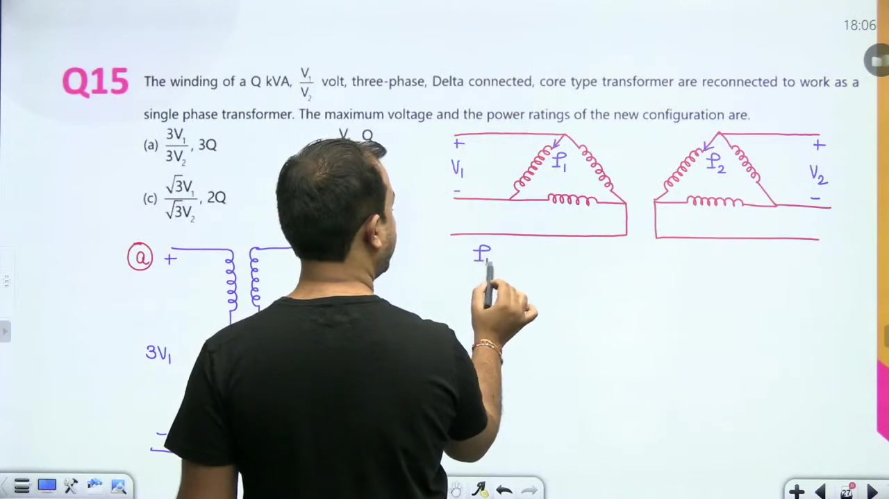

> [!example] Problem
> The windings of a $Q\text{ kVA}, V_1 / V_2\text{ V}$, 3-phase delta-connected core-type transformer are reconnected to operate as a single-phase transformer. Determine the maximum voltage and power rating of the new configuration.

### Winding Insulation and Cross-Sectional Constraints

Two physical constraints govern the ratings of any transformer winding:
1. **Voltage rating per phase**: depends entirely on the dielectric insulation thickness. For the original delta connection, the phase voltage rating equals $V_1$ on the primary and $V_2$ on the secondary.
2. **Current rating per phase**: depends entirely on the conductor cross-sectional area. If the rated phase currents are $I_1$ and $I_2$, no winding conductor may carry more than its rated current without overheating.

The original total three-phase apparent power rating equals:

$$
Q = 3 V_1 I_1 = 3 V_2 I_2
$$

### Analysis of All-Series Configuration

To maximize voltage, one might connect all three phase windings in series on each side:

$$
V_{\text{rated(series)}} = 3 V_1 \quad (\text{primary}), \quad 3 V_2 \quad (\text{secondary})
$$

Because all windings are in series, the maximum permissible current is limited by the conductor rating:

$$
I_{\text{rated(series)}} = I_1 \quad (\text{primary}), \quad I_2 \quad (\text{secondary})
$$

Calculate the resulting apparent power capacity:

$$
S_{\text{series}} = (3V_1) \times I_1 = 3 V_1 I_1 = Q
$$

Notice that the power rating remains $Q$, not $3Q$. Option (A) claims a power rating of $3Q$, which violates current limits. Hence Option (A) is incorrect.

## Parallel and Series-Parallel Reconnections and Session Summary
_(63:53 - 70:37)_

### Evaluation of All-Parallel Configuration

We next evaluate connecting all three phase windings in parallel on each side. The voltage rating equals that of a single winding:

$$
V_{\text{rated(parallel)}} = V_1 \quad (\text{primary}), \quad V_2 \quad (\text{secondary})
$$

Because three identical windings connect in parallel, their individual current capacities add:

$$
I_{\text{rated(parallel)}} = 3I_1 \quad (\text{primary}), \quad 3I_2 \quad (\text{secondary})
$$

Calculate the resulting apparent power capacity:

$$
S_{\text{parallel}} = V_1 \times (3I_1) = 3 V_1 I_1 = Q
$$

The power rating remains $Q$, not $Q/3$. Thus Option (B) is also incorrect. In addition, an output voltage with a factor of $\sqrt{3}$ cannot arise from single-phase reconnections. This eliminates Option (C).

### Two-Parallel and One-Series Optimal Connection

We examine the hybrid series-parallel connection shown in Option (D). On each side, connect two windings in parallel, and place that parallel pair in series with the third winding.

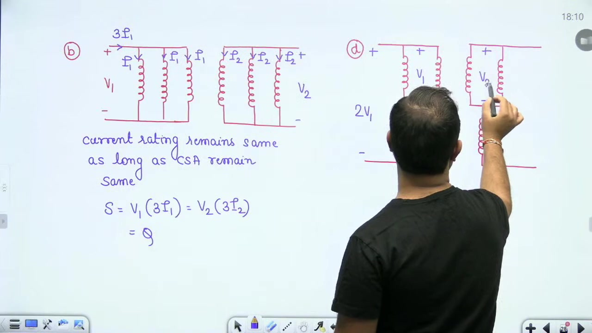

Calculate the terminal voltage:
- The parallel pair supports rated voltage $V_1$.
- The series winding supports rated voltage $V_1$.
- The total terminal voltage equals:

$$
V_{\text{rated}} = V_1 + V_1 = 2V_1 \quad (\text{primary}), \quad 2V_2 \quad (\text{secondary})
$$

Now determine the permissible line current. The single series winding can carry at most its rated current $I_1$. When this current reaches the parallel pair, it divides equally as $I_1/2$ per branch. No winding exceeds its thermal rating:

$$
I_{\text{rated}} = I_1 \quad (\text{primary}), \quad I_2 \quad (\text{secondary})
$$

Calculate the total apparent power rating:

$$
S_{\text{hybrid}} = (2V_1) \times I_1 = 2 V_1 I_1 = \frac{2}{3}(3 V_1 I_1) = \frac{2}{3}Q
$$

> [!success] Result
> The maximum voltage and power rating of the new configuration are $2V_1 / 2V_2\text{ V}$ and $\frac{2}{3}Q\text{ kVA}$. The correct option is **(D)**.

### Session Conclusion and Upcoming Classes

The instructor summarizes key results from the problem session. Upcoming sessions will address open-delta and Scott connections, followed by parallel operation of transformers.

---

## Summary and Key Takeaways

- In balanced star-connected windings, the phase voltage lags the line voltage by $30^\circ$, giving $V_{ph} = (V_L / \sqrt{3}) \angle -30^\circ$.
- Primary and secondary phase voltages on corresponding limbs always remain in the exact same phase, with turns ratio $a = N_1 / N_2 = V_{ph1} / V_{ph2}$.
- In a closed loop formed by transformer secondary windings, the net circulating voltage equals the phasor sum of all induced phase voltages.
- The ratio of delta phase current to star phase current in a star-delta bank equals the inverse of the phase voltage ratio, $I_{ph(\Delta)} / I_{ph(Y)} = V_{ph(Y)} / V_{ph(\Delta)}$, independent of load magnitude.
- Exciting the star side of a star-delta transformer with negative-sequence voltages swaps phase sequence to $A-C-B$, causing $V_{AB}$ to lag $V_{ab}$ by $30^\circ$.
- Before referring an impedance across a three-phase transformer, the load impedance connection must match the winding connection of that side.
- Reconnecting a three-phase $Q\text{ kVA}, V_1 / V_2$ delta transformer with two windings in parallel and one in series yields a single-phase rating of $2V_1 / 2V_2$ and $\frac{2}{3}Q\text{ kVA}$.

---

[← Lec 041: Problems Based on Three Phase Transformers 1](Lecture_041_Problems_Based_on_Three_Phase_Transformers_1.md) | [🏠 Index](00_yt_study_guide.md) | [Lec 043: Three Phase Transformer 5 →](Lecture_043_Three_Phase_Transformer_5.md)
