# Electrical Machines | Lec 29 | Three Phase Transformer - 5 | GATE/ESE Electrical Engineering Lecture

- **Source**: https://www.youtube.com/watch?v=nKhhMbYe6LY
- **Duration**: 01:11:53
- **Compiled**: 2026-09-21

---

## Overview

This lecture analyzes the open-delta or V-V connection formed by removing one single-phase unit from a delta-delta transformer bank. It proves mathematically that balanced line voltages are preserved across all three secondary phases despite the missing transformer. The lecture derives the voltage and current constraints, establishing a capacity ratio of 57.7% and a transformer utilization factor of 86.6%. Detailed phasor analyses are carried out for resistive and inductive loads to show how the two transformers operate at different power factors. Finally, the lecture discusses practical utility applications and compiles essential formulas for engineering examinations.

## Contents

- [[#Introduction to Open-Delta (V-V) Connection|Introduction to Open-Delta (V-V) Connection]]
- [[#Transition from Delta-Delta to Open-Delta (V-V)|Transition from Delta-Delta to Open-Delta (V-V)]]
- [[#Voltage Transformation in the V-V Connection|Voltage Transformation in the V-V Connection]]
- [[#Proof of Balanced Secondary Voltages in V-V Connection|Proof of Balanced Secondary Voltages in V-V Connection]]
- [[#Voltage, Current, and Power Ratings in V-V Connection|Voltage, Current, and Power Ratings in V-V Connection]]
- [[#Capacity Ratio and the Non-Scalar Nature of AC Power|Capacity Ratio and the Non-Scalar Nature of AC Power]]
- [[#Transformer Utilization Factor (TUF) of Open-Delta Connection|Transformer Utilization Factor (TUF) of Open-Delta Connection]]
- [[#V-V Connection Supplying Star-Connected Resistive Load|V-V Connection Supplying Star-Connected Resistive Load]]
- [[#Power Synthesis in Resistive V-V and Introduction to Delta Load|Power Synthesis in Resistive V-V and Introduction to Delta Load]]
- [[#V-V Connection Supplying Delta-Connected Resistive Load|V-V Connection Supplying Delta-Connected Resistive Load]]
- [[#Reactive Power Exchange and General Inductive Load Setup|Reactive Power Exchange and General Inductive Load Setup]]
- [[#Phasor Derivation for V-V Bank with Inductive Load|Phasor Derivation for V-V Bank with Inductive Load]]
- [[#Power Synthesis, Operating Regions, Applications, and Summary|Power Synthesis, Operating Regions, Applications, and Summary]]

---

## Introduction to Open-Delta (V-V) Connection
_(00:12 - 04:36)_

We have studied four basic three-phase transformer connections. These are star-star, delta-delta, delta-star, and star-delta. This lecture examines an advanced configuration: the open-delta or V-V connection.

In standard three-phase connections, questions often test phasor diagrams. But questions on open-delta connections are mostly numerical. A clear grasp of the voltage, current, and power relations makes these problems straightforward.

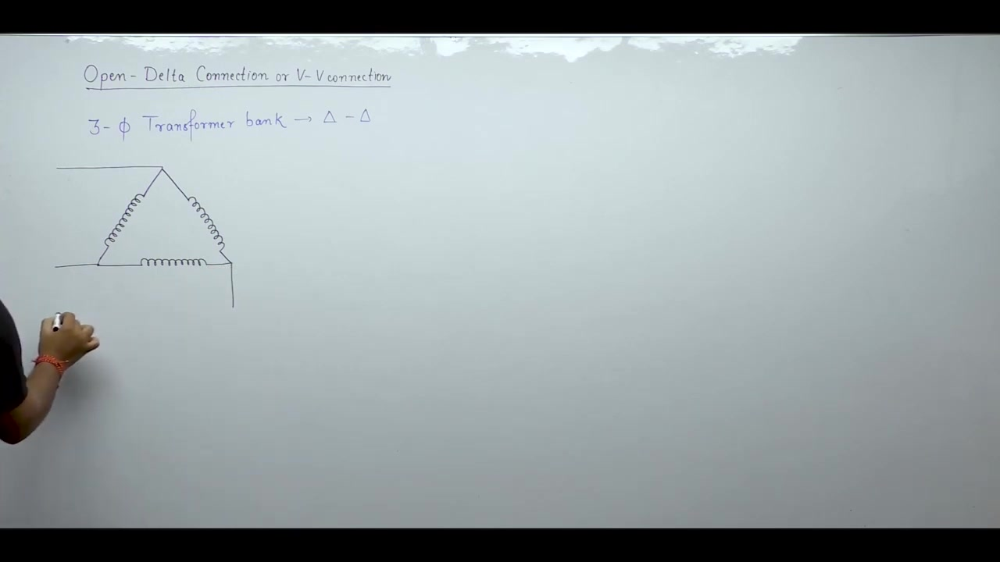

### Three-Phase Transformer Bank Concept

A three-phase transformer bank uses three separate single-phase transformers. Their primary and secondary windings are interconnected to form a three-phase system.

> [!info] Definition: Transformer Bank
> A three-phase transformer bank consists of three distinct single-phase transformers wired together to operate on a three-phase supply.

We begin with three single-phase transformers connected in delta-delta ($\Delta$-$\Delta$). Primary high-voltage terminals are labeled with uppercase letters $A, B, C$. Secondary low-voltage terminals are labeled with lowercase letters $a, b, c$. Supply lines are marked with primes: $A', B', C'$ and $a', b', c'$.

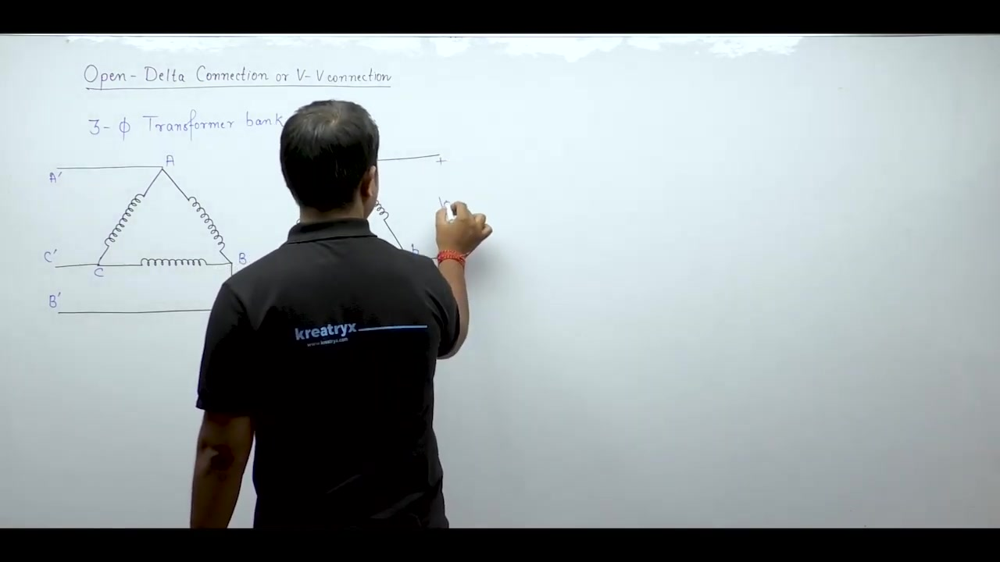

### Delta-Delta Bank Baseline

In a delta connection, the line voltage equals the phase voltage on both sides:

$$
V_{L(\text{primary})} = V_{ph(\text{primary})}
$$

$$
V_{L(\text{secondary})} = V_{ph(\text{secondary})}
$$

Primary phase current is $I_{ph(\text{primary})}$. Secondary phase current is $I_{ph(\text{secondary})}$. The line current in a balanced delta connection equals $\sqrt{3}$ times the phase current:

$$
I_{L} = \sqrt{3} I_{ph}
$$

Dot notation defines winding polarities. Current enters the dotted terminal on the primary winding and leaves the dotted terminal on the secondary winding.

## Transition from Delta-Delta to Open-Delta (V-V)
_(04:38 - 10:46)_

In any balanced three-phase system, total apparent power is:

$$
S = 3 V_{ph} I_{ph} = \sqrt{3} V_L I_L
$$

For an ideal transformer, input power equals output power. Apparent power calculated from the primary side matches apparent power from the secondary side:

$$
S = \sqrt{3} V_{LP} I_{LP} = \sqrt{3} V_{LS} I_{LS}
$$

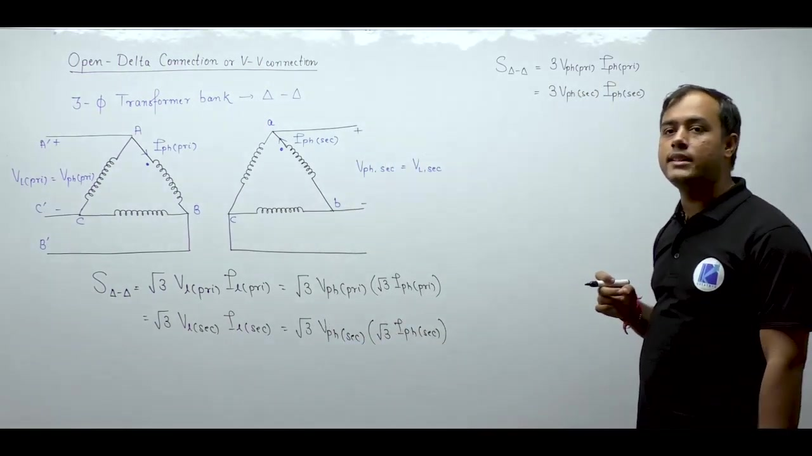

### Power Capacity of Delta-Delta Bank

In a delta connection, $V_L = V_{ph}$ and $I_L = \sqrt{3} I_{ph}$. Therefore:

$$
S_{\Delta\Delta} = 3 V_{ph} I_{ph}
$$

Each single-phase transformer corresponds to one phase winding. It carries phase voltage $V_{ph}$ and phase current $I_{ph}$.

> [!success] Result: Single-Phase Transformer Power
> In a delta-delta bank of three single-phase transformers, the rated apparent power handled by each unit is:
> $$
> S_{\text{unit}} = V_{ph} I_{ph}
> $$

The three transformers share the total bank load equally.

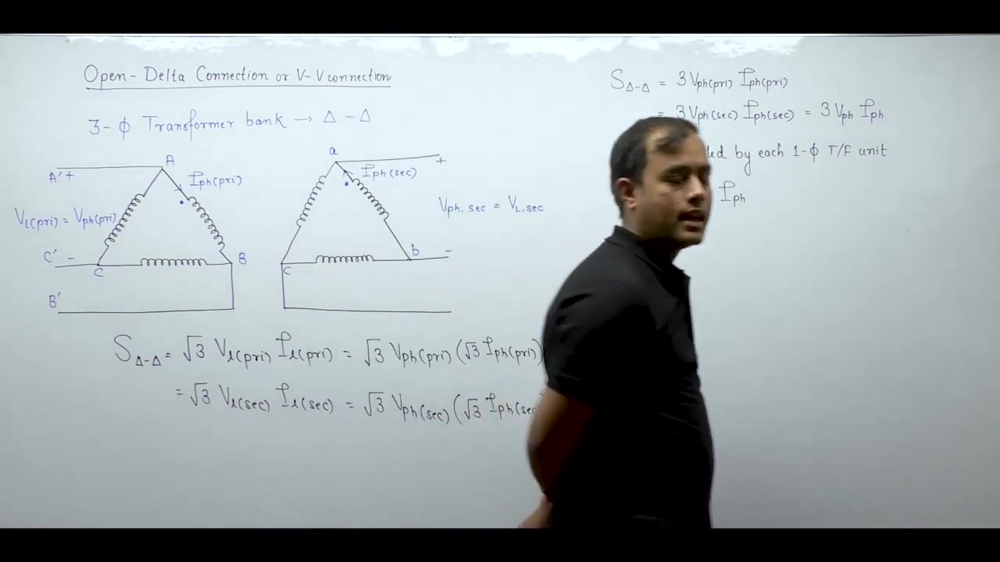

### Removing One Transformer Unit

Now consider what happens if one transformer becomes damaged. We remove that damaged unit from the bank. Removing a transformer removes both its primary and secondary windings.

> [!info] Definition: Open-Delta (V-V) Connection
> If one single-phase unit of a delta-delta bank is removed, the remaining two transformers form an open-delta or V-V connection.

The remaining two transformers continue to supply a three-phase load. But they deliver power at a reduced capacity.

### Balance of Open-Delta System

Our first task is to verify that the three-phase line voltages remain balanced. Even with one transformer missing, Kirchhoff's Voltage Law ensures a complete set of balanced voltages across the load terminals. We verify this next.

## Voltage Transformation in the V-V Connection
_(10:49 - 15:59)_

Removing the transformer between terminals $A$ and $B$ leaves two active units. One unit connects between $A$ and $C$. The second unit connects between $B$ and $C$. Terminal $C$ serves as the common point.

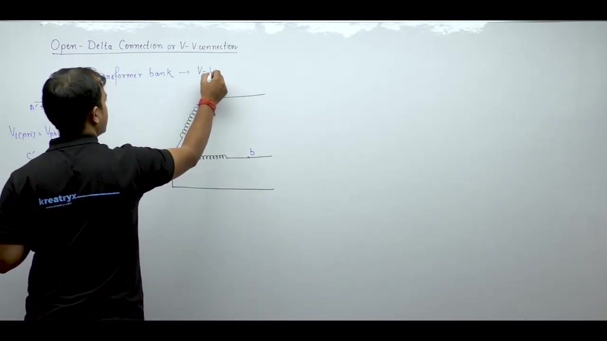

### Balanced Primary Excitation

The primary terminals connect to a three-phase generator. Even though one transformer is removed, the generator remains balanced.

> [!info] Definition: Balanced Three-Phase Voltages
> A balanced three-phase voltage set consists of three sinusoidal voltages of equal magnitude, displaced in phase by $120^\circ$. Their phasor sum is zero:
> $$
> V_{AB} + V_{BC} + V_{CA} = 0
> $$

Because supply terminals $A', B', C'$ connect directly to transformer terminals $A, B, C$, the primary terminal voltages are strictly balanced.

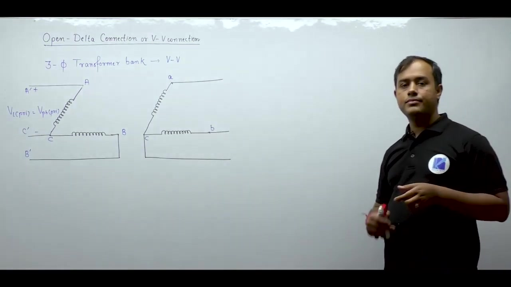

### Transformation Across Active Units

Two physical transformers remain in service:
1. Transformer 1 between terminals $A$ and $C$.
2. Transformer 2 between terminals $B$ and $C$.

Each unit acts as an independent single-phase transformer. Primary voltages $V_{AC}$ and $V_{BC}$ induce secondary voltages according to the turns ratio:

$$
V_{ac} = \frac{N_2}{N_1} V_{AC}
$$

$$
V_{bc} = \frac{N_2}{N_1} V_{BC}
$$

Phase voltages across primary and secondary windings are in time phase. The turns ratio scales the voltage magnitude without introducing a phase shift.

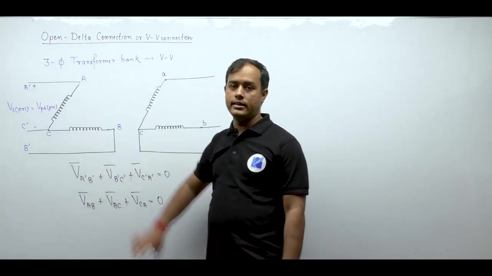

### Secondary Line Voltages

Voltages $V_{ac}$ and $V_{bc}$ appear directly across the secondary windings. But no transformer exists between terminals $a$ and $b$. Next, we examine whether a balanced voltage appears across the open terminals $a$ and $b$.

## Proof of Balanced Secondary Voltages in V-V Connection
_(16:03 - 22:11)_

We now prove that the secondary line voltages remain balanced. This holds even though one physical transformer is missing.

### Primary Phasor Reference

Assume a balanced positive-sequence primary line voltage supply:

$$
V_{AB} = V \angle 0^\circ, \quad V_{BC} = V \angle -120^\circ, \quad V_{CA} = V \angle 120^\circ
$$

The voltage across terminals $A$ and $C$ is the negative of $V_{CA}$:

$$
V_{AC} = -V_{CA} = -V \angle 120^\circ = V \angle (120^\circ - 180^\circ) = V \angle -60^\circ
$$

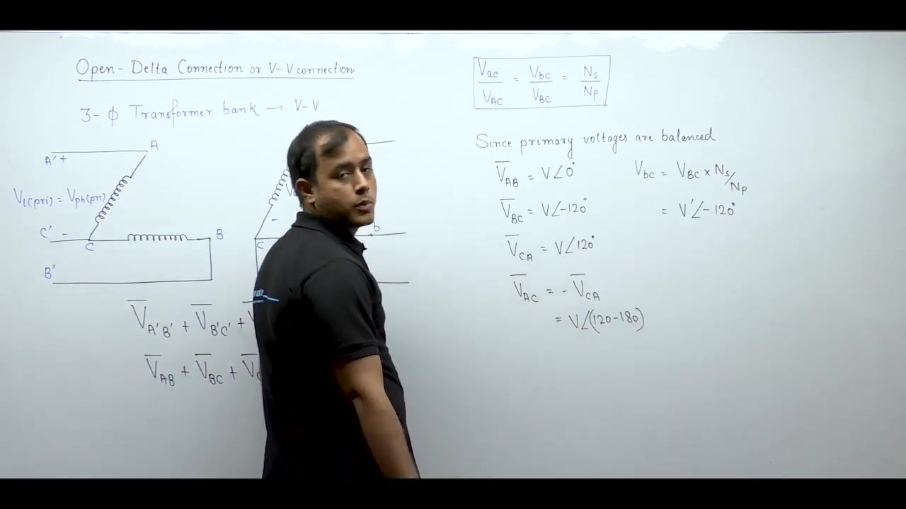

### Direct Voltage Transformation

The two remaining single-phase transformers scale voltages by turns ratio $N_2 / N_1$. Let $V' = V (N_2 / N_1)$:

$$
V_{bc} = V_{BC} \left(\frac{N_2}{N_1}\right) = V' \angle -120^\circ
$$

$$
V_{ac} = V_{AC} \left(\frac{N_2}{N_1}\right) = V' \angle -60^\circ
$$

### KVL Across the Open Terminals

No winding connects terminals $a$ and $b$. We determine the open-terminal voltage $V_{ab}$ by applying Kirchhoff's Voltage Law around the secondary loop:

$$
V_{ab} - V_{ac} + V_{bc} = 0 \implies V_{ab} = V_{ac} - V_{bc}
$$

Substitute the polar expressions into rectangular form:

$$
\begin{aligned}
V_{ab} &= V' \angle -60^\circ - V' \angle -120^\circ \\
&= V' \left[\cos(-60^\circ) + j\sin(-60^\circ)\right] - V' \left[\cos(-120^\circ) + j\sin(-120^\circ)\right] \\
&= V' \left[\left(\frac{1}{2} - j\frac{\sqrt{3}}{2}\right) - \left(-\frac{1}{2} - j\frac{\sqrt{3}}{2}\right)\right] \\
&= V' \left(\frac{1}{2} + \frac{1}{2}\right) \\
&= V' \angle 0^\circ
\end{aligned}
$$

The imaginary components cancel completely. The magnitude is $V'$, and the phase angle is $0^\circ$.

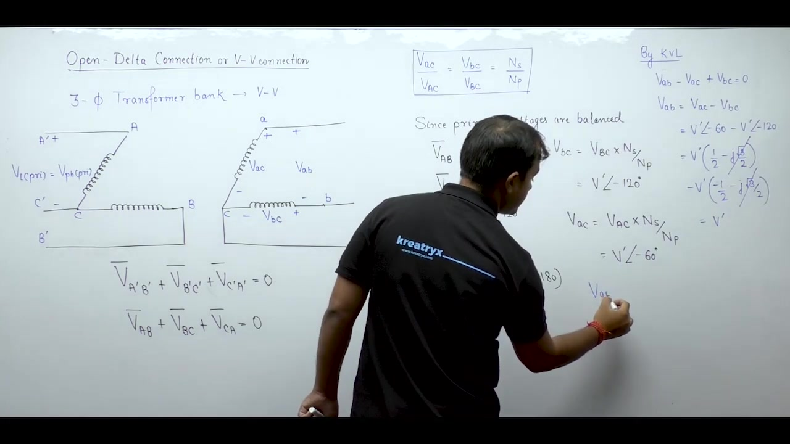

### Balance Verification

Convert $V_{ac}$ back to standard cyclic order $V_{ca}$:

$$
V_{ca} = -V_{ac} = -V' \angle -60^\circ = V' \angle (-60^\circ + 180^\circ) = V' \angle 120^\circ
$$

The complete set of secondary line voltages is:

$$
V_{ab} = V' \angle 0^\circ, \quad V_{bc} = V' \angle -120^\circ, \quad V_{ca} = V' \angle 120^\circ
$$

> [!success] Result: Inherent Voltage Balance
> When balanced three-phase voltages excite a V-V connection, the secondary line voltages remain balanced. The open-terminal line voltage equals the other line voltages in magnitude and maintains the exact $120^\circ$ phase displacement.

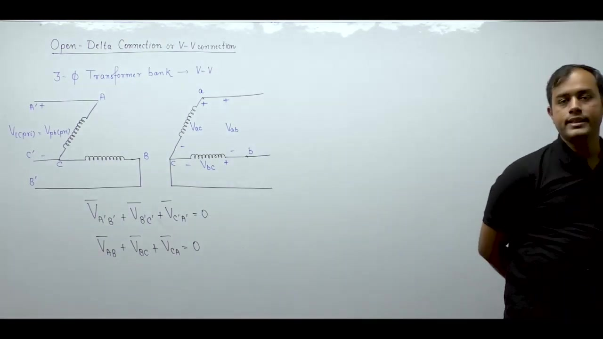

## Voltage, Current, and Power Ratings in V-V Connection
_(22:12 - 27:01)_

Each single-phase transformer has fixed physical ratings. Its voltage rating depends on winding insulation. Its current rating depends on conductor cross-sectional area.

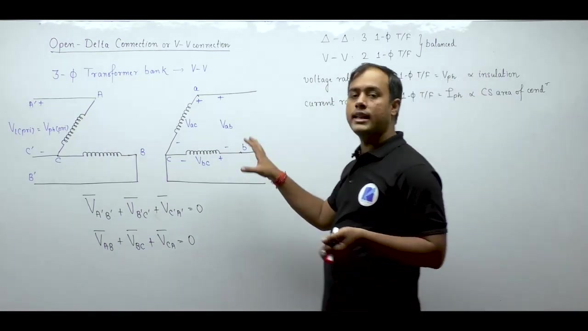

### Constancy of Physical Transformer Ratings

Removing one transformer does not change the physical construction of the remaining two units. Their individual rated voltage remains $V_{ph}$. Their individual rated current remains $I_{ph}$.

These ratings cannot change without altering the core, copper, or insulation.

### Line Current Limitation

In the original closed delta bank, line current was the phasor difference of two phase currents:

$$
I_L = \sqrt{3} I_{ph}
$$

In the V-V connection, one winding is missing. The remaining transformer windings connect directly in series with the external lines. Applying KCL at the terminals shows:

$$
I_L = I_{ph}
$$

Line current cannot exceed the rated phase current $I_{ph}$ of an individual winding. If line current exceeded $I_{ph}$, the windings would overheat and burn out.

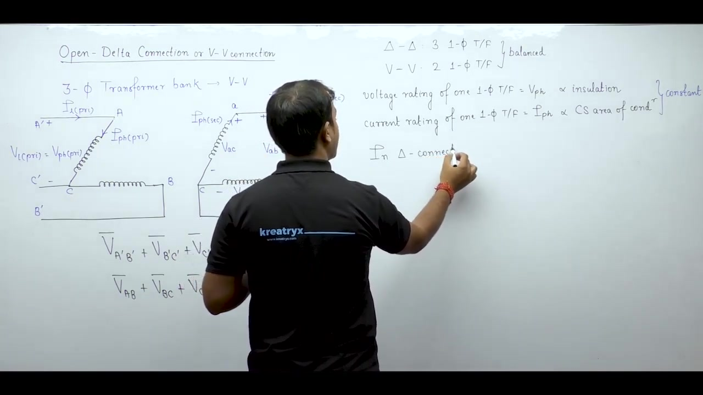

### Total Apparent Power of V-V Bank

The line voltage remains $V_L = V_{ph}$. But line current is restricted to $I_L = I_{ph}$.

We compute the maximum safe three-phase apparent power delivered by the V-V bank:

$$
S_{VV} = \sqrt{3} V_L I_L = \sqrt{3} V_{ph} I_{ph}
$$

> [!success] Result: V-V Bank Apparent Power
> The total three-phase apparent power capacity of an open-delta bank is:
> $$
> S_{VV} = \sqrt{3} V_{ph} I_{ph}
> $$

In the delta-delta bank, the capacity was $3 V_{ph} I_{ph}$. In the open-delta bank, it drops to $\sqrt{3} V_{ph} I_{ph}$.

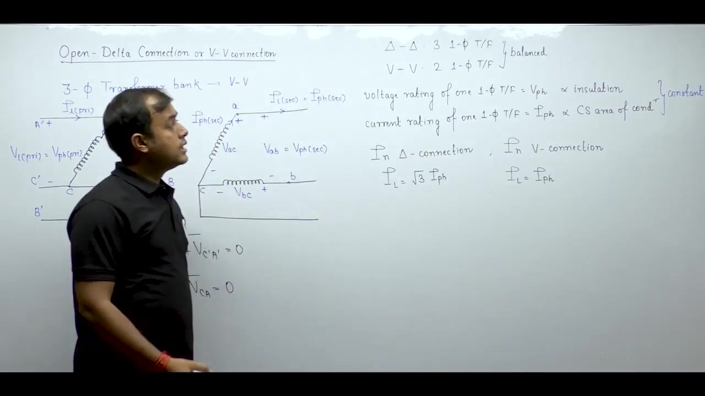

## Capacity Ratio and the Non-Scalar Nature of AC Power
_(27:04 - 31:50)_

We now compare the rating of an open-delta bank to the rating of a full delta-delta bank.

### Ratio of V-V to Delta-Delta Capacity

The ratio of their rated apparent powers is:

$$
\frac{S_{VV}}{S_{\Delta\Delta}} = \frac{\sqrt{3} V_{ph} I_{ph}}{3 V_{ph} I_{ph}} = \frac{1}{\sqrt{3}} \approx 0.577 = 57.7\%
$$

> [!success] Result: Open-Delta Capacity Ratio
> An open-delta bank delivers $57.7\%$ of the capacity of the original delta-delta bank:
> $$
> S_{VV} = \frac{1}{\sqrt{3}} S_{\Delta\Delta} \approx 0.577 \, S_{\Delta\Delta}
> $$

Removing one of the three transformers represents a $33.3\%$ reduction in equipment. But it causes a $42.3\%$ loss in power delivery capacity.

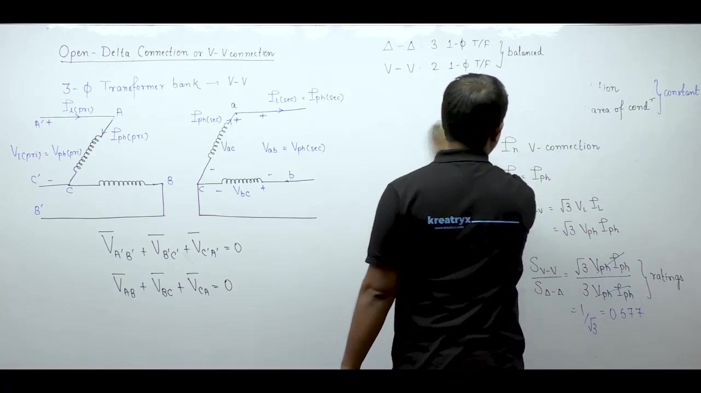

### Physical Interpretation of 57.7% Capacity

Why does power drop to $57.7\%$ instead of two-thirds ($66.7\%$)?

In delta-delta, line current is $\sqrt{3} I_{ph}$. In open-delta, line current is restricted to $I_{ph}$ to protect the windings. The line current drops by a factor of $\sqrt{3}$.

Since line voltage stays constant, total three-phase power drops by the same factor:

$$
\frac{\sqrt{3} V_L I_{ph}}{\sqrt{3} V_L (\sqrt{3} I_{ph})} = \frac{1}{\sqrt{3}} \approx 57.7\%
$$

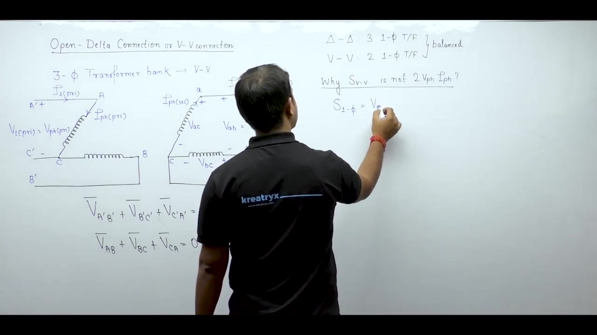

### Why Bank Capacity Is Not $2 V_{ph} I_{ph}$

Two transformers remain in the bank. Each unit handles voltage $V_{ph}$ and current $I_{ph}$. One might expect their combined rating to be $2 V_{ph} I_{ph}$.

Yet the delivered three-phase power is $\sqrt{3} V_{ph} I_{ph} \approx 1.732 V_{ph} I_{ph}$.

In AC circuits, apparent power is a complex phasor quantity:

$$
S = P + jQ
$$

Each transformer operates with a phase angle between its winding voltage and winding current. Because their phase angles differ, their powers cannot be added as simple numbers. Vector addition yields $\sqrt{3} V_{ph} I_{ph}$ rather than $2 V_{ph} I_{ph}$.

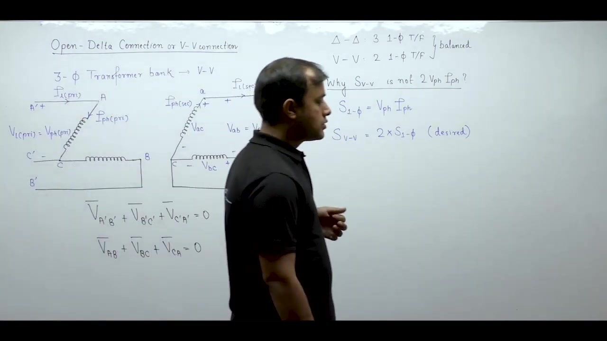

## Transformer Utilization Factor (TUF) of Open-Delta Connection
_(32:06 - 37:24)_

A key figure of merit for any electrical transformer configuration is its utilization factor.

### Definition of Transformer Utilization Factor

The Transformer Utilization Factor (TUF) measures how effectively installed transformer capacity is converted into delivered three-phase power.

> [!info] Definition: Transformer Utilization Factor
> Transformer Utilization Factor is the ratio of delivered three-phase apparent power to total installed single-phase transformer capacity:
> $$
> \text{TUF} = \frac{\text{Actual Delivered Capacity}}{\text{Total Installed Capacity}}
> $$

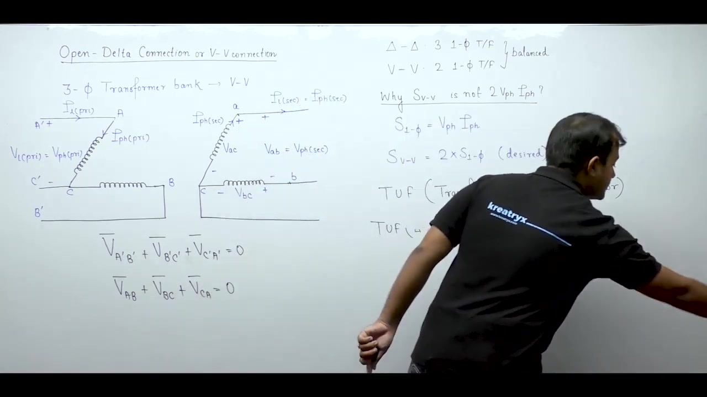

### TUF for Delta-Delta vs Open-Delta

For a delta-delta bank, three single-phase transformers operate together. Each has a rating of $V_{ph} I_{ph}$. Total installed capacity is $3 V_{ph} I_{ph}$. The delivered three-phase power is also $3 V_{ph} I_{ph}$:

$$
\text{TUF}_{\Delta\Delta} = \frac{3 V_{ph} I_{ph}}{3 V_{ph} I_{ph}} = 1.0 = 100\%
$$

In an open-delta bank, only two single-phase transformers are installed. Total installed capacity is $2 V_{ph} I_{ph}$. But the delivered three-phase capacity is $\sqrt{3} V_{ph} I_{ph}$:

$$
\text{TUF}_{VV} = \frac{\sqrt{3} V_{ph} I_{ph}}{2 V_{ph} I_{ph}} = \frac{\sqrt{3}}{2} \approx 0.866 = 86.6\%
$$

> [!success] Result: Open-Delta TUF
> The Transformer Utilization Factor of an open-delta connection is:
> $$
> \text{TUF}_{VV} = \frac{\sqrt{3}}{2} \approx 86.6\%
> $$

Even though two physical transformers are available, they deliver only $86.6\%$ of their combined nameplate rating under balanced conditions.

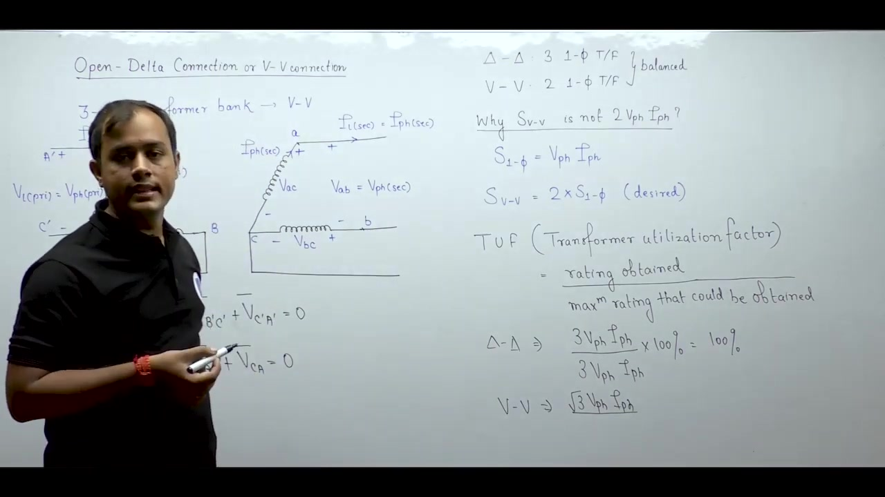

### Requirement for a Bank of Separate Transformers

An open-delta connection requires a bank of three separate single-phase transformers. If one unit fails, technicians physically disconnect and remove it from service.

A single three-phase core-type or shell-type transformer cannot operate in open-delta after one phase fails. The magnetic circuit of a three-phase unit shares common flux paths, so disabling one phase disrupts core flux.

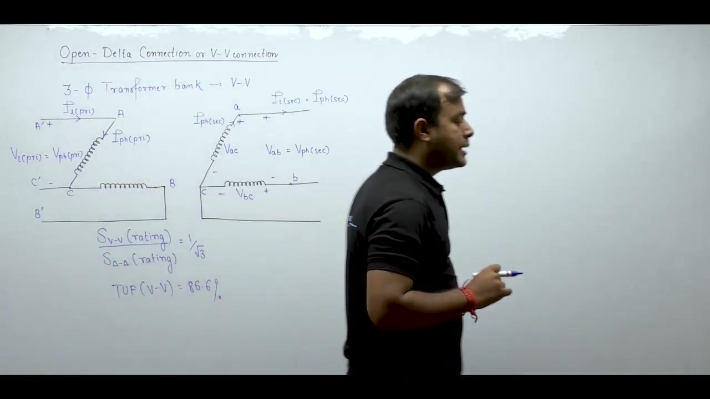

## V-V Connection Supplying Star-Connected Resistive Load
_(37:24 - 43:03)_

We now analyze an open-delta bank supplying a balanced star-connected resistive load.

### Load Circuit Configuration

Three identical resistors of resistance $R$ connect in star. Their star point forms the neutral $O$. The load terminals are $A', B', C'$.

Load terminal $A'$ connects to transformer terminal $A$. Load terminal $B'$ connects to transformer terminal $B$. Load terminal $C'$ connects to common terminal $C$.

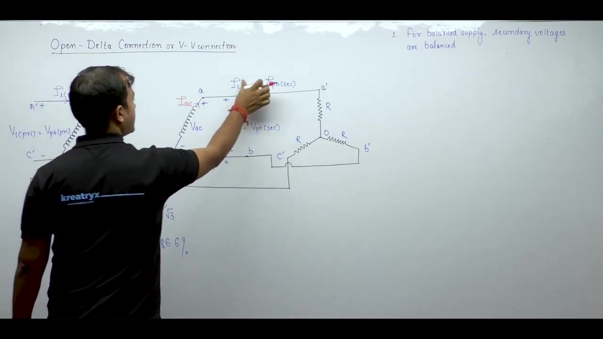

### Phase Voltage and Current Phasors

Because the supply is balanced, the secondary line voltages form a balanced positive-sequence set. The phase voltages to neutral are:

$$
V_{A'O} = V_{ph} \angle 0^\circ, \quad V_{B'O} = V_{ph} \angle -120^\circ, \quad V_{C'O} = V_{ph} \angle 120^\circ
$$

For a purely resistive load, the current in each phase is in phase with its phase voltage:

$$
I_A = \frac{V_{A'O}}{R}, \quad I_B = \frac{V_{B'O}}{R}, \quad I_C = \frac{V_{C'O}}{R}
$$

Current $I_A$ aligns with $V_{A'O}$. Current $I_B$ aligns with $V_{B'O}$. Current $I_C$ aligns with $V_{C'O}$.

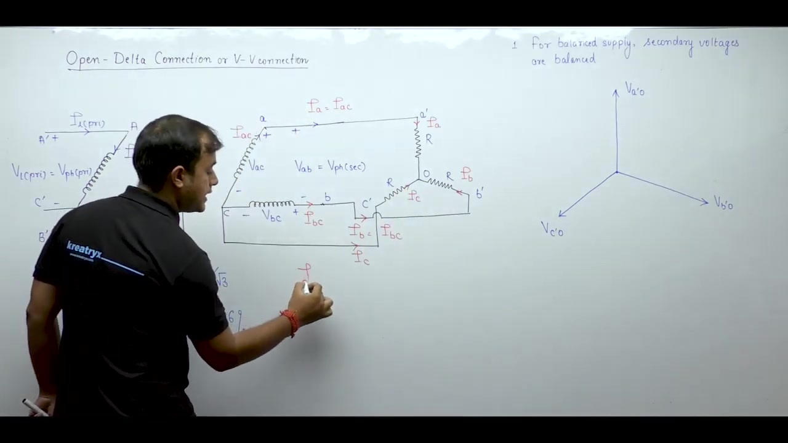

### Line Voltage Construction and Phase Displacements

We determine the voltages across the two physical transformers:

$$
V_{AC} = V_{A'O} - V_{C'O}
$$

$$
V_{BC} = V_{B'O} - V_{C'O}
$$

To construct $V_{AC}$, invert $V_{C'O}$ to get $-V_{C'O}$ and add it to $V_{A'O}$. The resulting phasor $V_{AC}$ lies at $-30^\circ$. Because $I_A$ lies at $0^\circ$, $I_A$ leads $V_{AC}$ by $30^\circ$.

Similarly, adding $-V_{C'O}$ to $V_{B'O}$ produces $V_{BC}$ at $-90^\circ$. Because $I_B$ lies at $-120^\circ$, $I_B$ lags $V_{BC}$ by $30^\circ$.

> [!success] Result: Phase Angles in Resistive V-V Bank
> Under a purely resistive balanced load:
> - Transformer 1: $I_A$ leads $V_{AC}$ by $30^\circ$, giving $S_1 = V_{ph} I_{ph} \angle -30^\circ$.
> - Transformer 2: $I_B$ lags $V_{BC}$ by $30^\circ$, giving $S_2 = V_{ph} I_{ph} \angle +30^\circ$.

Even though the load is purely resistive, neither transformer operates at unity power factor. One operates at leading power factor ($\cos 30^\circ$ lead). The other operates at lagging power factor ($\cos 30^\circ$ lag).

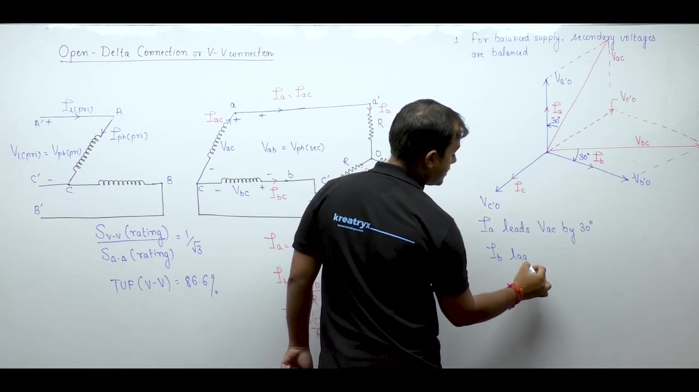

## Power Synthesis in Resistive V-V and Introduction to Delta Load
_(43:06 - 48:01)_

We now add the complex powers delivered by both transformers to find the total power delivered to the star resistive load.

### Phasor Addition of Transformer Powers

The individual complex powers are:

$$
S_1 = V_{ph} I_{ph} \angle -30^\circ, \quad S_2 = V_{ph} I_{ph} \angle +30^\circ
$$

The total complex power delivered to the load is their sum:

$$
\begin{aligned}
S &= S_1 + S_2 \\
&= V_{ph} I_{ph} \angle -30^\circ + V_{ph} I_{ph} \angle +30^\circ \\
&= V_{ph} I_{ph} [(\cos 30^\circ - j \sin 30^\circ) + (\cos 30^\circ + j \sin 30^\circ)] \\
&= 2 V_{ph} I_{ph} \cos 30^\circ \\
&= 2 V_{ph} I_{ph} \left(\frac{\sqrt{3}}{2}\right) \\
&= \sqrt{3} V_{ph} I_{ph}
\end{aligned}
$$

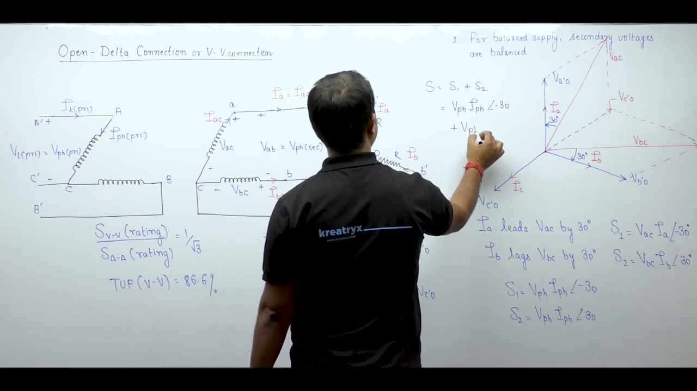

### Cancellation of Reactive Components

The imaginary components represent reactive powers:

$$
\begin{aligned}
Q_1 &= -V_{ph} I_{ph} \sin 30^\circ = -0.5 V_{ph} I_{ph} \\
Q_2 &= +V_{ph} I_{ph} \sin 30^\circ = +0.5 V_{ph} I_{ph} \\
Q_{\text{total}} &= Q_1 + Q_2 = 0
\end{aligned}
$$

Transformer 1 generates $0.5 V_{ph} I_{ph}$ reactive vars. Transformer 2 absorbs $0.5 V_{ph} I_{ph}$ reactive vars. The load receives pure active power:

$$
P = \sqrt{3} V_{ph} I_{ph}
$$

> [!success] Result: Net Power for Resistive Load
> In an open-delta bank supplying a balanced resistive load, reactive power circulates between the two units without reaching the load:
> - Each unit operates at apparent power $V_{ph} I_{ph}$.
> - Total active power delivered to the load is $\sqrt{3} V_{ph} I_{ph}$.

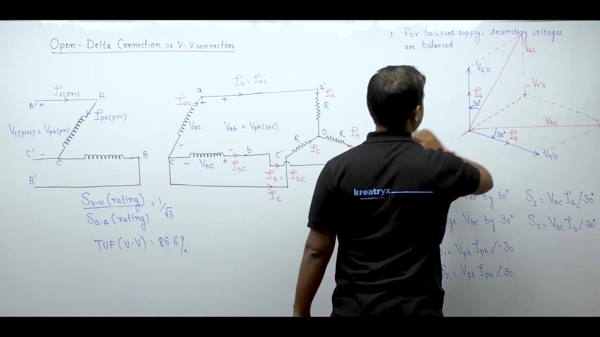

### Setup for Delta-Connected Resistive Load

Now consider a balanced delta-connected resistive load. Three identical resistors of value $R$ connect in delta across terminals $A', B', C'$.

In a delta load, line voltage equals phase voltage ($V_L = V_{ph}$). We take line voltage as the reference phasor.

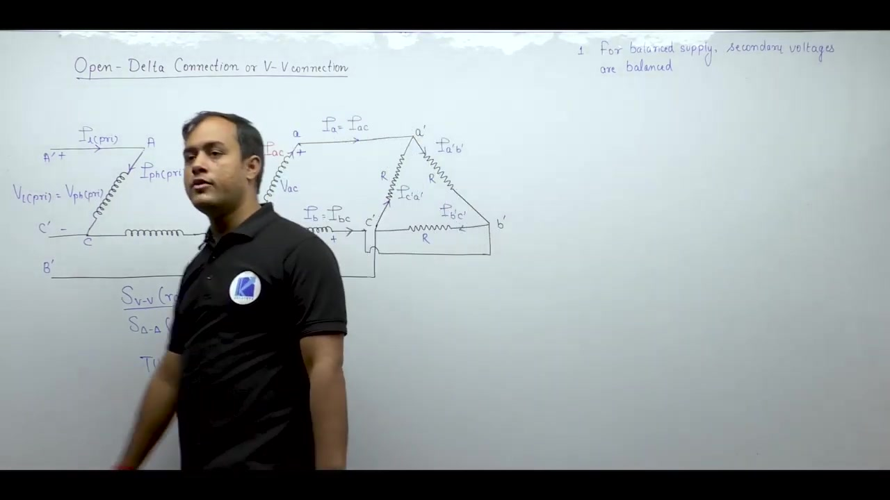

## V-V Connection Supplying Delta-Connected Resistive Load
_(48:06 - 53:49)_

We now analyze an open-delta bank supplying a balanced delta-connected resistive load.

### Line Voltage Reference and Branch Currents

In a delta load, phase voltage equals line voltage. We choose $V_{A'B'}$ as the reference phasor:

$$
V_{A'B'} = V \angle 0^\circ, \quad V_{B'C'} = V \angle -120^\circ, \quad V_{C'A'} = V \angle 120^\circ
$$

The branch currents through the load resistors are:

$$
I_{A'B'} = \frac{V_{A'B'}}{R}, \quad I_{B'C'} = \frac{V_{B'C'}}{R}, \quad I_{C'A'} = \frac{V_{C'A'}}{R}
$$

Because each branch is purely resistive, each branch current is in phase with its corresponding line voltage.

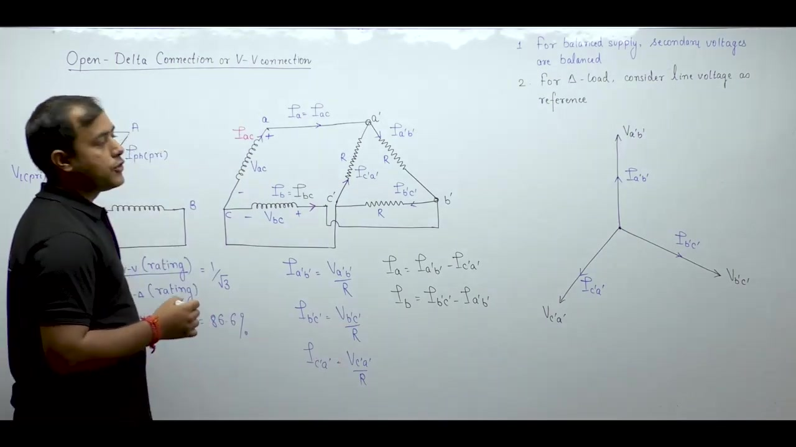

### KCL and Line Current Determination

Applying Kirchhoff's Current Law at load nodes $A'$ and $B'$ yields the line currents:

$$
I_A = I_{A'B'} - I_{C'A'}
$$

$$
I_B = I_{B'C'} - I_{A'B'}
$$

Phasors $I_{A'B'}$ and $-I_{C'A'}$ have equal magnitude and are separated by $60^\circ$. The resultant of two equal vectors separated by $60^\circ$ bisects the angle at $30^\circ$:

$$
I_A = \sqrt{3} I_{\text{branch}} \angle -30^\circ
$$

Comparing $I_A$ with transformer voltage $V_{AC}$:
- $V_{AC} = -V_{C'A'} = V \angle -60^\circ$.
- $I_A$ lies at $-30^\circ$.
- Therefore, $I_A$ leads $V_{AC}$ by $30^\circ$.

Similarly, comparing $I_B$ with transformer voltage $V_{BC}$:
- $V_{BC} = V_{B'C'} = V \angle -120^\circ$.
- $I_B$ lies at $-150^\circ$.
- Therefore, $I_B$ lags $V_{BC}$ by $30^\circ$.

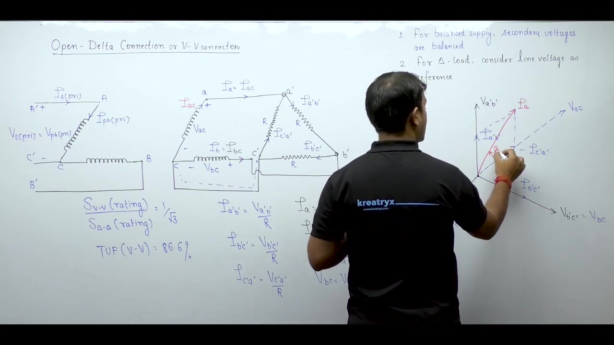

### Invariance of Transformer Operating Conditions

The resulting complex powers for the delta load are:

$$
S_1 = V_{ph} I_{ph} \angle -30^\circ
$$

$$
S_2 = V_{ph} I_{ph} \angle +30^\circ
$$

Adding both gives:

$$
S = S_1 + S_2 = \sqrt{3} V_{ph} I_{ph}
$$

> [!success] Result: Invariance to Load Connection
> The apparent power handled by each transformer is identical whether the load is star-connected or delta-connected:
> - Unit 1: $S_1 = V_{ph} I_{ph} \angle -30^\circ$ ($\cos 30^\circ$ lead).
> - Unit 2: $S_2 = V_{ph} I_{ph} \angle +30^\circ$ ($\cos 30^\circ$ lag).
>
> Derivations need to be performed for only one load configuration.

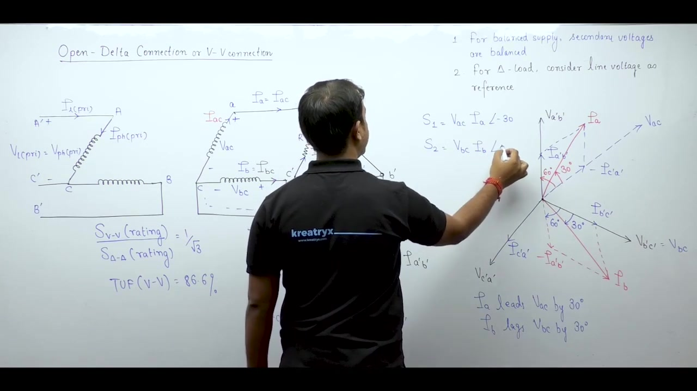

## Reactive Power Exchange and General Inductive Load Setup
_(53:49 - 58:16)_

In the preceding sections, we proved that star and delta resistive loads yield identical transformer loading.

### Internal Reactive Power Exchange

When supplying a purely resistive load, the two transformers operate at different power factors:
- Transformer 1 operates at $\cos 30^\circ$ leading.
- Transformer 2 operates at $\cos 30^\circ$ lagging.

A leading power factor means the transformer delivers reactive power. A lagging power factor means the transformer absorbs reactive power:

$$
Q_1 = -V_{ph} I_{ph} \sin 30^\circ = -0.5 V_{ph} I_{ph}
$$

$$
Q_2 = +V_{ph} I_{ph} \sin 30^\circ = +0.5 V_{ph} I_{ph}
$$

The net reactive power delivered to the load is zero ($Q_1 + Q_2 = 0$). Transformer 1 delivers reactive power directly into Transformer 2. Reactive power circulates locally between the two units.

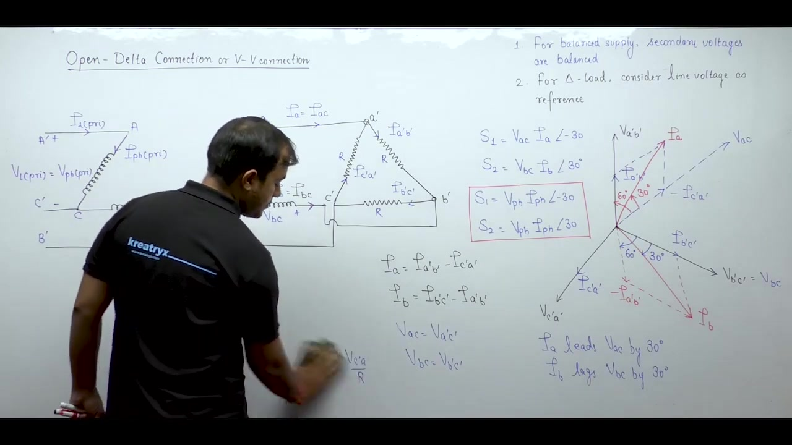

### Generalizing to Inductive Load ($R$-$L$)

Practical electrical loads are rarely purely resistive. Most industrial and commercial loads are inductive, containing resistance and inductance. They operate at a lagging power factor $\cos \phi$, where $\phi$ is the load impedance angle.

Because star and delta loads yield identical transformer loading, we analyze only the star-connected configuration. The resulting formulas apply directly to delta loads.

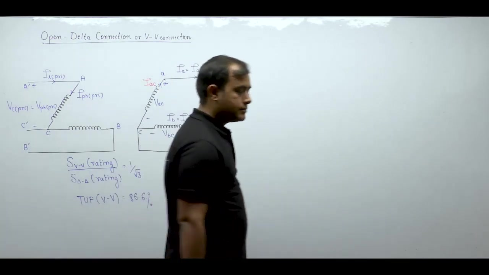

### Star-Connected Inductive Load Model

Consider three identical load impedances connected in star:

$$
Z = |Z| \angle \phi
$$

The load terminals are $A', B', C'$, with neutral point $O$.

We choose the phase voltage $V_{A'O}$ as the reference phasor:

$$
V_{A'O} = V_{ph} \angle 0^\circ
$$

The other two balanced phase voltages are:

$$
V_{B'O} = V_{ph} \angle -120^\circ
$$

$$
V_{C'O} = V_{ph} \angle 120^\circ
$$

Next, we determine the phase and line currents under this general power factor.

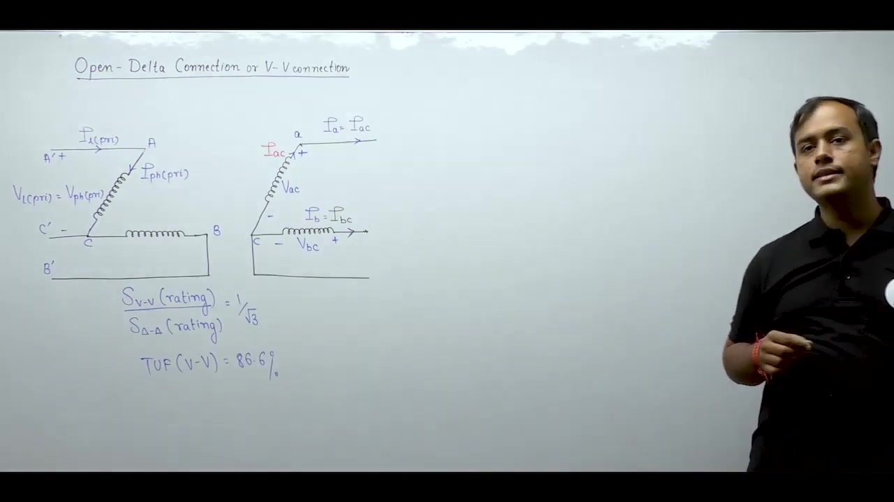

## Phasor Derivation for V-V Bank with Inductive Load
_(58:18 - 62:57)_

We now derive the phase angles and complex power expressions for both transformers under a general inductive load.

### Load Current Phasors

With load impedance $Z \angle \phi$, each load phase current lags its phase voltage by angle $\phi$:

$$
\begin{aligned}
I_A &= \frac{V_{A'O}}{Z \angle \phi} = \frac{V_{ph} \angle 0^\circ}{|Z| \angle \phi} = I_{ph} \angle -\phi \\
I_B &= \frac{V_{B'O}}{Z \angle \phi} = \frac{V_{ph} \angle -120^\circ}{|Z| \angle \phi} = I_{ph} \angle (-120^\circ - \phi) \\
I_C &= \frac{V_{C'O}}{Z \angle \phi} = \frac{V_{ph} \angle 120^\circ}{|Z| \angle \phi} = I_{ph} \angle (120^\circ - \phi)
\end{aligned}
$$

Each current phasor lags its respective voltage by the load power factor angle $\phi$.

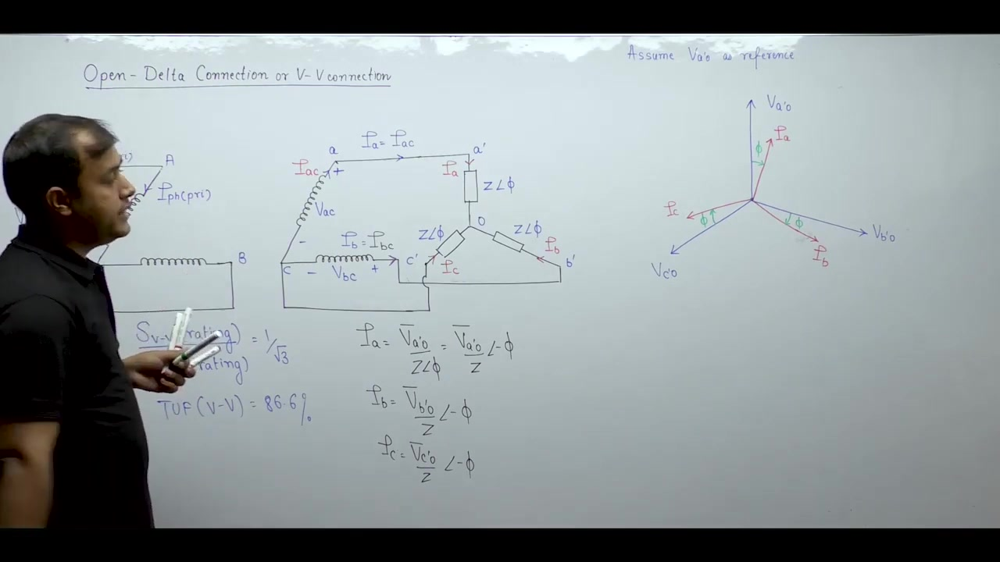

### Transformer Voltage Phasors

The voltages across the two physical transformers are:

$$
V_{AC} = V_{A'O} - V_{C'O} = V_{ph} \angle -30^\circ
$$

$$
V_{BC} = V_{B'O} - V_{C'O} = V_{ph} \angle -90^\circ
$$

Line voltage $V_{AC}$ leads phase voltage $V_{A'O}$ by $30^\circ$ in the reverse connection sense.

### Phase Angles for Transformer 1 and Transformer 2

Now compare the relative angle between winding voltage and winding current for each unit.

For Transformer 1:
- Voltage $V_{AC}$ lies at $-30^\circ$.
- Current $I_A$ lies at $-\phi$.
- Angle between $V_{AC}$ and $I_A$ is $30^\circ - \phi$.
- Current $I_A$ is counterclockwise (leading) relative to $V_{AC}$.

For Transformer 2:
- Voltage $V_{BC}$ lies at $-90^\circ$.
- Current $I_B$ lies at $-120^\circ - \phi$.
- Angle between $V_{BC}$ and $I_B$ is $30^\circ + \phi$.
- Current $I_B$ is clockwise (lagging) relative to $V_{BC}$.

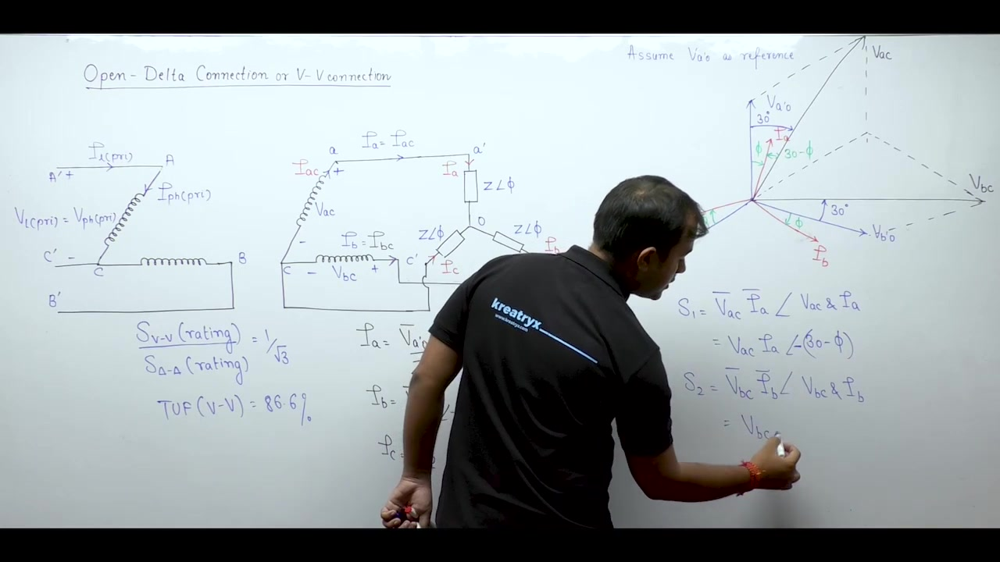

> [!success] Result: Individual Transformer Power Factors
> Under an inductive load with power factor $\cos \phi$:
> - Transformer 1 operates at power factor $\cos(30^\circ - \phi)$ leading:
>   $$
>   S_1 = V_{ph} I_{ph} \angle -(30^\circ - \phi)
>   $$
> - Transformer 2 operates at power factor $\cos(30^\circ + \phi)$ lagging:
>   $$
>   S_2 = V_{ph} I_{ph} \angle +(30^\circ + \phi)
>   $$

Notice that when $\phi = 0$ (resistive load), these expressions reduce to $\cos 30^\circ$ lead and $\cos 30^\circ$ lag.

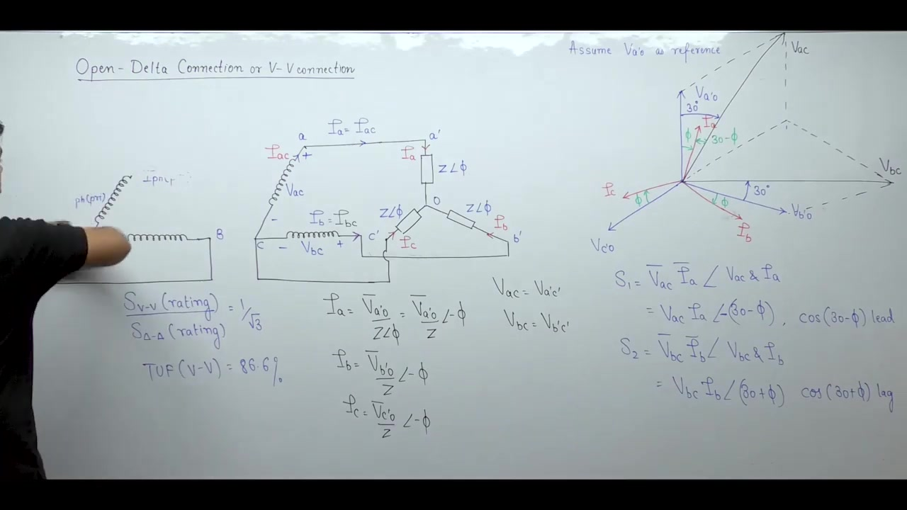

## Power Synthesis, Operating Regions, Applications, and Summary
_(63:01 - 71:46)_

We now sum the complex powers for an inductive load, examine operating regimes, and summarize the key results.

### Total Power Sum for Inductive Load

The complex powers of the two transformers are:

$$
S_1 = V_{ph} I_{ph} \angle -(30^\circ - \phi) = V_{ph} I_{ph} \angle (\phi - 30^\circ)
$$

$$
S_2 = V_{ph} I_{ph} \angle +(30^\circ + \phi) = V_{ph} I_{ph} \angle (\phi + 30^\circ)
$$

Summing both powers yields:

$$
\begin{aligned}
S &= S_1 + S_2 \\
&= V_{ph} I_{ph} [(\cos(\phi - 30^\circ) + \cos(\phi + 30^\circ)) + j(\sin(\phi - 30^\circ) + \sin(\phi + 30^\circ))] \\
&= V_{ph} I_{ph} [2 \cos \phi \cos 30^\circ + j 2 \sin \phi \cos 30^\circ] \\
&= 2 \cos 30^\circ V_{ph} I_{ph} (\cos \phi + j \sin \phi) \\
&= \sqrt{3} V_{ph} I_{ph} \angle \phi
\end{aligned}
$$

The total active power delivered to the load is:

$$
P_{\text{total}} = \sqrt{3} V_{ph} I_{ph} \cos \phi
$$

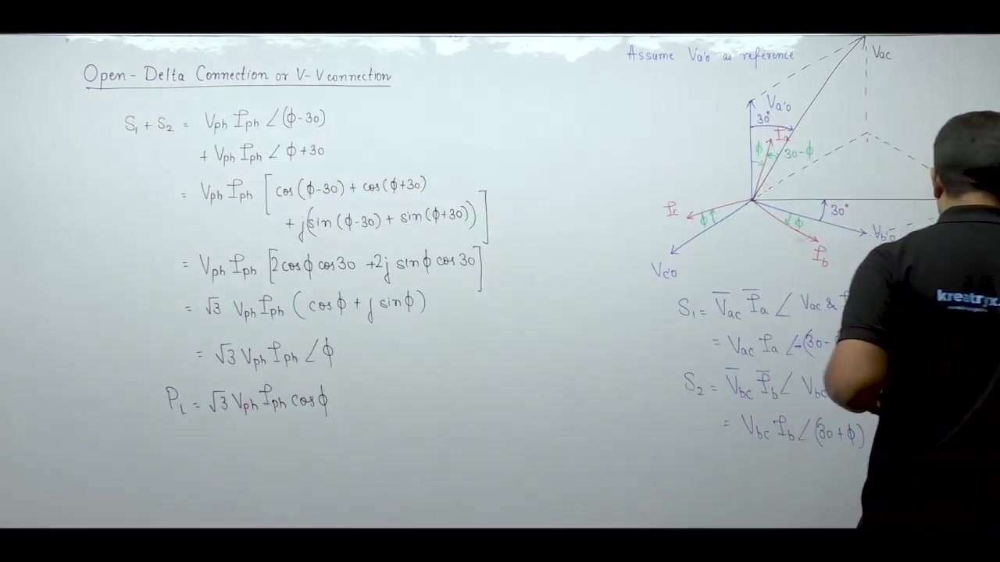

### Operating Power Factor Regimes

The operating power factor of each transformer depends on the load angle $\phi$:
- Transformer 1 power factor: $\text{pf}_1 = \cos(30^\circ - \phi)$
- Transformer 2 power factor: $\text{pf}_2 = \cos(30^\circ + \phi)$

Three distinct regimes arise:
1. **Case 1 ($\phi < 30^\circ$, or $\text{pf} > 0.866$ lag):**
   Angle $30^\circ - \phi$ is positive, so Transformer 1 operates at a leading power factor. Transformer 2 operates at a lagging power factor.
2. **Case 2 ($\phi = 30^\circ$, or $\text{pf} = 0.866$ lag):**
   Transformer 1 operates at unity power factor ($\cos 0^\circ = 1.0$). Transformer 2 operates at $\cos 60^\circ = 0.5$ lagging.
3. **Case 3 ($\phi > 30^\circ$, or $\text{pf} < 0.866$ lag):**
   Angle $30^\circ - \phi$ becomes negative. Absorbing the sign shows that both transformers operate at lagging power factors.

For leading power factor loads, substitute $-\phi$ directly into the formulas.

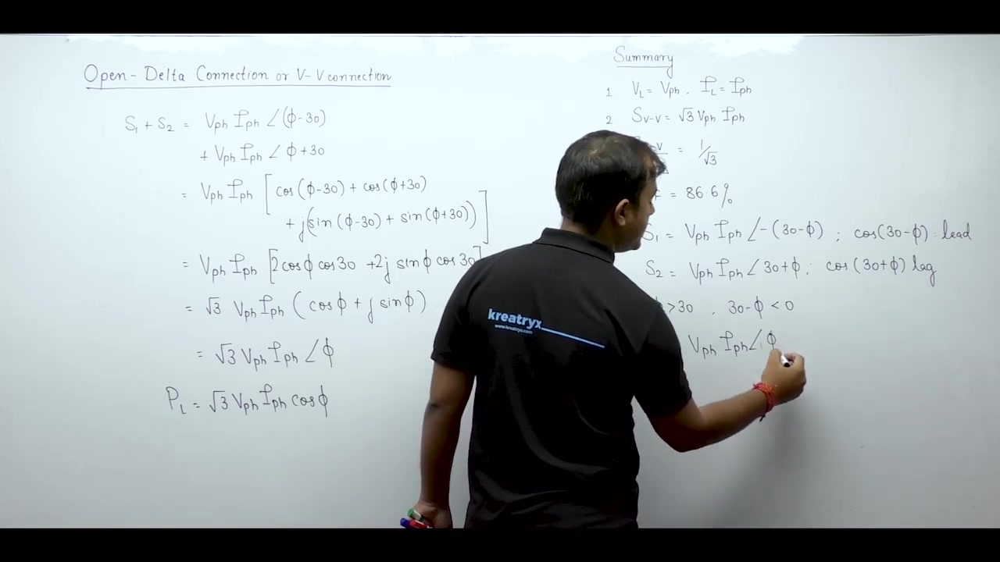

### Real Power Distribution Between Transformers

The active powers delivered by the individual units are:

$$
P_1 = V_{ph} I_{ph} \cos(30^\circ - \phi)
$$

$$
P_2 = V_{ph} I_{ph} \cos(30^\circ + \phi)
$$

For a purely resistive load ($\phi = 0$):

$$
P_1 = P_2 = V_{ph} I_{ph} \cos 30^\circ = \frac{\sqrt{3}}{2} V_{ph} I_{ph}
$$

Both transformers share active power equally. But for any non-zero $\phi$, the two active powers are unequal ($P_1 \neq P_2$). One transformer carries more active load than the other.

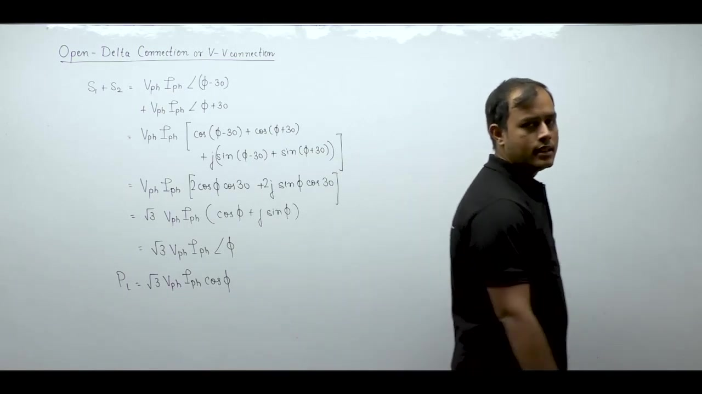

### Practical Applications of Open-Delta Connection

Open-delta connections serve two primary engineering applications:
1. **Emergency Service:**
   If one transformer in a $\Delta$-$\Delta$ bank fails, the bank operates in V-V to maintain service at $57.7\%$ capacity while the faulty unit is repaired.
2. **Initial Low-Capacity Installations:**
   In newly established distribution systems with light initial demand, installing two transformers in V-V saves capital expenditure. A third unit is added later when load demand grows.

### Summary of Essential Formulas

> [!success] Result: Open-Delta Core Reference
> - **Line & Phase Relations:** $V_L = V_{ph}$, $I_L = I_{ph}$
> - **Bank Capacity:** $S_{VV} = \sqrt{3} V_{ph} I_{ph}$
> - **Capacity Ratio:** $S_{VV} / S_{\Delta\Delta} = 1/\sqrt{3} \approx 57.7\%$
> - **Utilization Factor:** $\text{TUF}_{VV} = \sqrt{3}/2 \approx 86.6\%$
> - **Overload Factor:** $S_{\Delta\Delta} / S_{VV} = \sqrt{3} \approx 173.2\%$
> - **Unit Power Factors:** $\cos(30^\circ - \phi)$ and $\cos(30^\circ + \phi)$

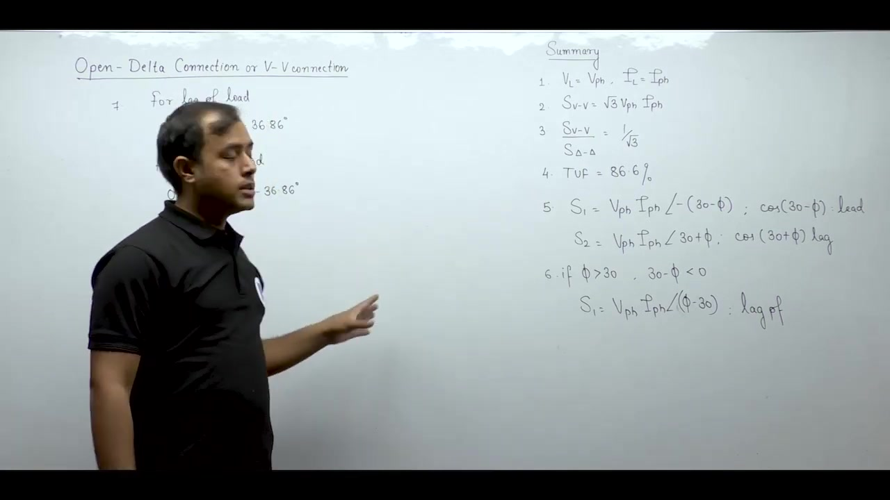

---

## Summary and Key Takeaways

- An open-delta or V-V connection consists of two single-phase transformers supplying a three-phase load after removing one unit from a delta-delta bank.
- Kirchhoff's Voltage Law ensures that balanced line voltages $V_{ab}$, $V_{bc}$, and $V_{ca}$ appear at the secondary terminals when balanced primary voltages are applied.
- The maximum permissible line current in open-delta equals the rated phase current $I_{ph}$ of an individual winding to prevent thermal overload.
- The total apparent power delivered by an open-delta bank is $S_{VV} = \sqrt{3} V_{ph} I_{ph}$, which is $57.7\%$ of the closed delta-delta rating $3 V_{ph} I_{ph}$.
- The transformer utilization factor of the open-delta connection is $\text{TUF}_{VV} = \sqrt{3}/2 \approx 86.6\%$, indicating that the two units cannot be fully loaded to their combined nameplate capacity.
- For a balanced resistive load, the two transformers operate at equal apparent power $V_{ph} I_{ph}$ with power factors of $\cos 30^\circ$ leading and $\cos 30^\circ$ lagging.
- For a general inductive load of impedance angle $\phi$, the two units operate at power factors of $\cos(30^\circ - \phi)$ leading and $\cos(30^\circ + \phi)$ lagging.
- When the load power factor angle exceeds $30^\circ$ ($\phi > 30^\circ$, or $\text{pf} < 0.866$ lag), both transformers operate at lagging power factors.

