[← Lec 043: Three Phase Transformer 5](Lecture_043_Three_Phase_Transformer_5.md) | [🏠 Index](00_yt_study_guide.md) | [Lec 045: Three Phase Transformer 7 →](Lecture_045_Three_Phase_Transformer_7.md)

---

# Electrical Machines | Lec 30 | Three Phase Transformer - 6 | GATE/ESE Electrical Engineering Lecture

- **Source**: https://www.youtube.com/watch?v=3V5Xq4NJVGs
- **Duration**: 01:00:31
- **Compiled**: 2026-09-21

---

## Overview

This lecture covers the theory, construction, and phasor analysis of zigzag transformer connections. It explains why third-harmonic voltages are co-phasal and how series subtractive connections eliminate them. The discussion details the delta-zigzag star configuration, establishing the Dz0 and Dz6 vector groups. It then analyzes the star-zigzag star connection and determines its Yz1 clock group classification. Finally, the lecture compares voltage transformation ratios between zigzag connections and standard three-phase configurations.

## Contents

- [[#Motivation for the Zigzag Connection and Harmonic Cancellation|Motivation for the Zigzag Connection and Harmonic Cancellation]]
- [[#Winding Division and Delta-Zigzag Star Configuration|Winding Division and Delta-Zigzag Star Configuration]]
- [[#Phasor Construction for Delta-Zigzag Star (Part 1)|Phasor Construction for Delta-Zigzag Star (Part 1)]]
- [[#Completion of Dz0 Phasor Diagram and Dotted-to-Dotted Setup|Completion of Dz0 Phasor Diagram and Dotted-to-Dotted Setup]]
- [[#Phasor Construction for Delta-Zigzag Star Yielding Dz6|Phasor Construction for Delta-Zigzag Star Yielding Dz6]]
- [[#Voltage Derivation and Line Voltage Ratio for Delta-Zigzag Star|Voltage Derivation and Line Voltage Ratio for Delta-Zigzag Star]]
- [[#Voltage Ratio Comparison: Delta-Zigzag Star vs Delta-Star|Voltage Ratio Comparison: Delta-Zigzag Star vs Delta-Star]]
- [[#Star-Zigzag Star Connection Setup|Star-Zigzag Star Connection Setup]]
- [[#Phasor Analysis of Yz1 Connection|Phasor Analysis of Yz1 Connection]]
- [[#Voltage Ratio and Phase Shift in Star-Zigzag Star|Voltage Ratio and Phase Shift in Star-Zigzag Star]]
- [[#Summary of Zigzag Connections and Exam Takeaways|Summary of Zigzag Connections and Exam Takeaways]]

---

## Motivation for the Zigzag Connection and Harmonic Cancellation
_(00:12 - 09:39)_

We have covered five standard three-phase transformer connections. These are star-star, delta-delta, star-delta, delta-star, and open-delta. We now study advanced configurations, beginning with the zigzag connection.

The primary engineering purpose of a zigzag connection is the elimination of third-harmonic voltages.

### Harmonics and the Third-Harmonic Problem

> [!info] Definition: Harmonics
> Harmonics are sinusoidal voltage or current components whose frequencies are integer multiples of the fundamental power frequency.

Consider a balanced three-phase supply of fundamental frequency $\omega$. The fundamental phase voltages are:

$$
\begin{aligned}
V_{A1} &= V_{m1} \sin(\omega t) \\
V_{B1} &= V_{m1} \sin(\omega t - 120^\circ) \\
V_{C1} &= V_{m1} \sin(\omega t + 120^\circ)
\end{aligned}
$$

The third-harmonic components have three times the fundamental frequency ($3\omega$). Their phase shifts also multiply by three:

$$
\begin{aligned}
V_{A3} &= V_{m3} \sin(3\omega t) \\
V_{B3} &= V_{m3} \sin[3(\omega t - 120^\circ)] = V_{m3} \sin(3\omega t - 360^\circ) = V_{m3} \sin(3\omega t) \\
V_{C3} &= V_{m3} \sin[3(\omega t + 120^\circ)] = V_{m3} \sin(3\omega t + 360^\circ) = V_{m3} \sin(3\omega t)
\end{aligned}
$$

A phase angle of $360^\circ$ is identical to $0^\circ$. Therefore, the third-harmonic voltages in all three phases are identical in both magnitude and time phase.

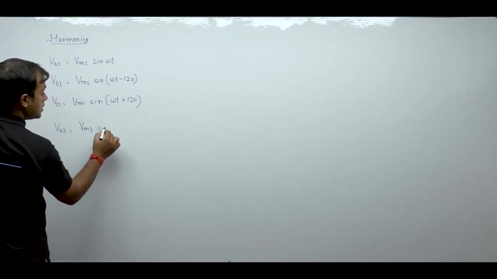

### Co-Phasal Nature of Third Harmonics

Voltages that share the same phase angle without any mutual phase displacement are called co-phasal.

Because third harmonics are co-phasal, subtracting one phase voltage from another eliminates them completely:

$$
V_A - V_B = (V_{A1} - V_{B1}) + (V_{A3} - V_{B3})
$$

Because $V_{A3} = V_{B3}$, their difference is zero:

$$
V_{A3} - V_{B3} = 0
$$

The fundamental components remain because they have a $120^\circ$ phase displacement:

$$
V_A - V_B = V_{A1} - V_{B1}
$$

The same cancellation occurs for $V_B - V_C$ and $V_C - V_A$.

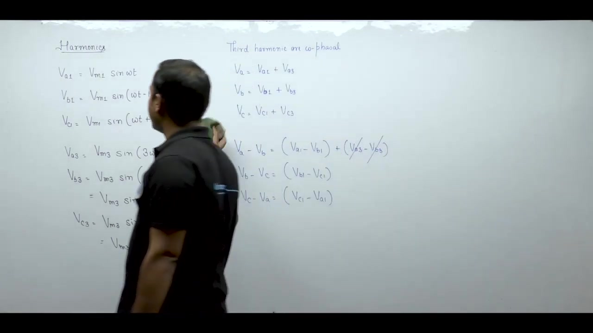

### Elimination Through Series Subtractive Polarity

This cancellation principle forms the basis of the zigzag connection.

> [!success] Result: Zigzag Principle
> In a zigzag connection, windings from two different phases connect in series with subtractive polarity. This cancels out third-harmonic voltages while preserving the fundamental component.

The zigzag configuration is typically placed on the secondary side. This prevents harmonic voltages from reaching sensitive customer loads.

### Polarity Rules for Winding Connections

To establish series subtractive polarity, connect terminals of like polarity together:
- Connect dotted terminal to dotted terminal, or
- Connect undotted terminal to undotted terminal.

Connecting opposite terminals (dotted to undotted) produces additive polarity, which fails to eliminate harmonics.

## Winding Division and Delta-Zigzag Star Configuration
_(09:50 - 15:00)_

We now examine the physical wiring of a delta-zigzag star transformer.

### Secondary Winding Division ($N_S/2$)

The primary consists of three standard windings connected in delta.

On the secondary side, each phase winding is divided into two equal parts. If a secondary phase has $N_S$ total turns, each half-winding contains $N_S / 2$ turns.

### Polarity Assignment and Terminal Numbering

The primary windings have two terminals per phase: $A_1-A_2, B_1-B_2, C_1-C_2$. Dotted terminals are labeled with even numbers ($A_2, B_2, C_2$).

Each secondary phase has four terminals:
- Phase A: $A_1, A_2, A_3, A_4$
- Phase B: $B_1, B_2, B_3, B_4$
- Phase C: $C_1, C_2, C_3, C_4$

> [!info] Definition: Even-Odd Polarity Convention
> In zigzag windings, all even-numbered terminals ($2, 4$) have identical polarity and carry dots. All odd-numbered terminals ($1, 3$) have identical polarity and remain undotted.

Thus, $A_2$ and $A_4$ have the same polarity. Terminals $A_1$ and $A_3$ have the same polarity.

### Interconnection for Undotted-to-Undotted Subtractive Polarity

To achieve series subtractive polarity, connect undotted terminals to undotted terminals:
1. Secondary terminals $A_2, B_2, C_2$ join together to form the neutral point.
2. Undotted terminal $A_1$ connects to undotted terminal $B_3$.
3. Undotted terminal $B_1$ connects to undotted terminal $C_3$.
4. Undotted terminal $C_1$ connects to undotted terminal $A_3$.
5. The remaining terminals $A_4, B_4, C_4$ form the three-phase output lines.

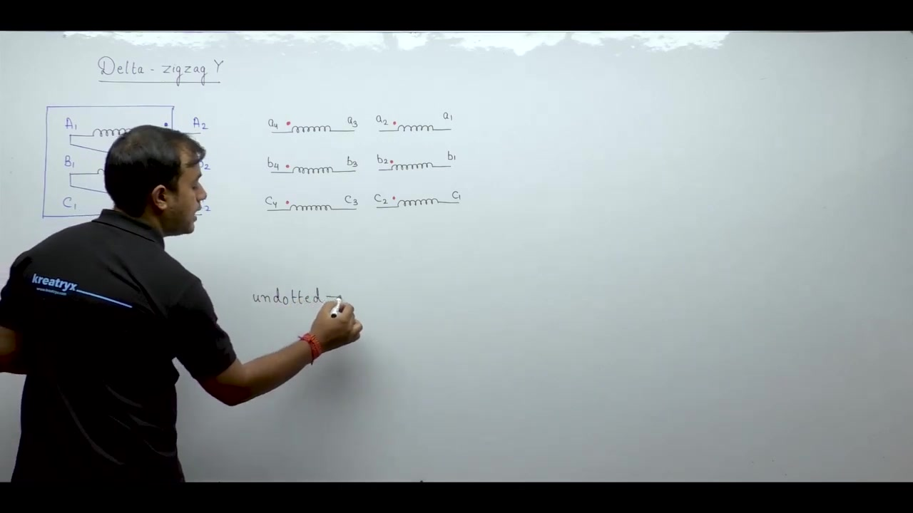

This cross-connection weaves between phases, giving the zigzag configuration its name.

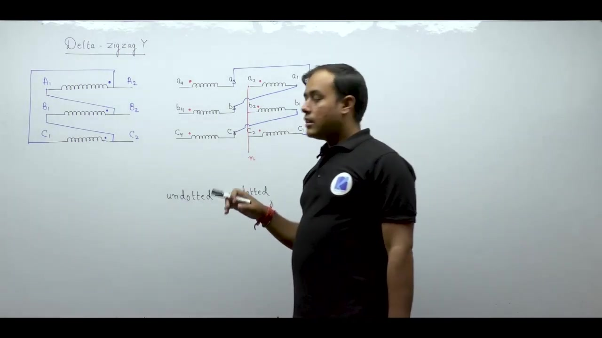

## Phasor Construction for Delta-Zigzag Star (Part 1)
_(15:01 - 19:59)_

We now construct the phasor diagram for the delta-zigzag star connection.

### Direction Rules Based on Parity (Even-Odd)

In standard connections, phasors follow terminal numbers $1$ and $2$. In zigzag windings, four terminals exist per phase. We use the parity of the terminal numbers:
- Dotted terminals have even numbers ($2, 4$).
- Undotted terminals have odd numbers ($1, 3$).

> [!info] Definition: Phasor Orientation Rules
> If a primary phasor is directed from an odd to an even terminal:
> - A secondary phasor directed from odd to even is drawn parallel.
> - A secondary phasor directed from even to odd is drawn anti-parallel (reversed).

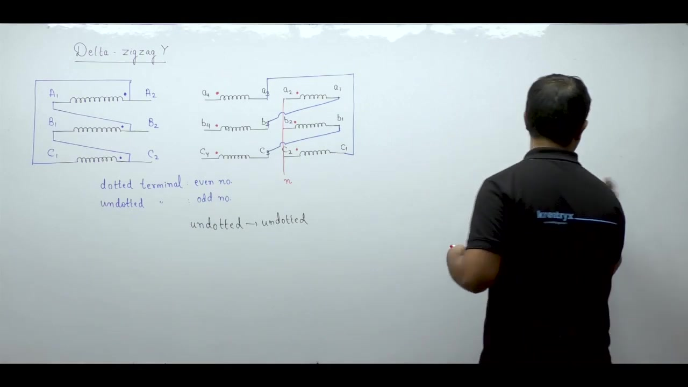

### Constructing the Primary Delta Triangle

We draw the primary delta using standard reference orientations:
1. Phasor $A_1 \to A_2$ lies horizontally to the right.
2. Phasor $B_1 \to B_2$ points downward to the left, with $B_2$ connecting to $A_1$.
3. Phasor $C_1 \to C_2$ points upward, with $C_2$ connecting to $B_1$.

The output lines come from $A_2, B_2, C_2$, labeled as phases $A, B, C$.

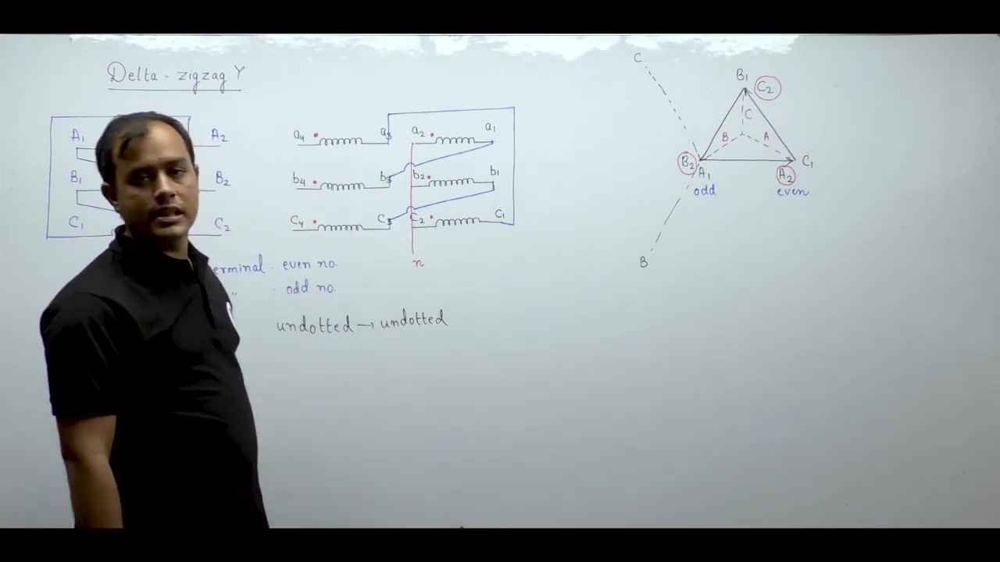

### Initial Secondary Phasors from Neutral

In star-type connections, phasor construction begins at the neutral. The neutral point is formed by $A_2, B_2, C_2$.

We draw the first set of three half-windings outward from neutral:
- From neutral $A_2$ to terminal $A_1$: this moves from even to odd. Because the primary moved odd-to-even, draw $A_2 \to A_1$ anti-parallel to primary phase A (pointing left).
- From neutral $B_2$ to terminal $B_1$: draw anti-parallel to primary phase B (pointing upward).
- From neutral $C_2$ to terminal $C_1$: draw anti-parallel to primary phase C (pointing downward).

These three anti-parallel phasors establish the first stage of the zigzag star.

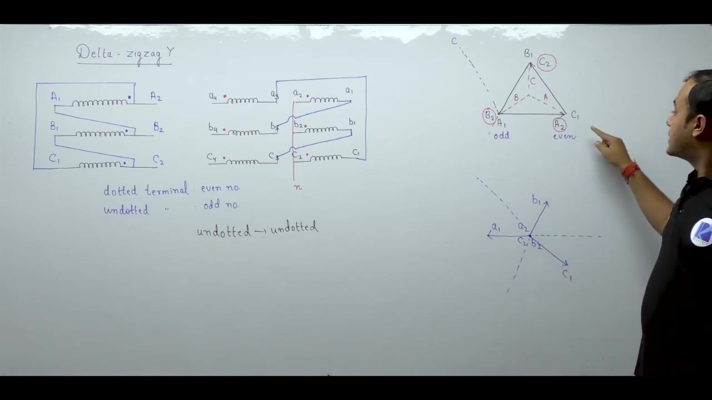

## Completion of Dz0 Phasor Diagram and Dotted-to-Dotted Setup
_(20:01 - 25:07)_

We now complete the phasor diagram for the delta-zigzag star connection.

### Adding the Second Set of Half-Windings

Recall the interconnections between the two sets of half-windings. Terminal $B_3$ links to terminal $A_1$. Meanwhile, $C_3$ connects to $B_1$, and $A_3$ joins with $C_1$.

We trace each phasor outward from these connection points toward the output terminals:
1. From $B_3$ to $B_4$: this moves from odd to even. Because the primary moved odd-to-even, draw $B_3 \to B_4$ parallel to primary phase B.
2. From $C_3$ to $C_4$: moves odd-to-even. Draw $C_3 \to C_4$ parallel to primary phase C.
3. From $A_3$ to $A_4$: moves odd-to-even. Draw $A_3 \to A_4$ parallel to primary phase A.

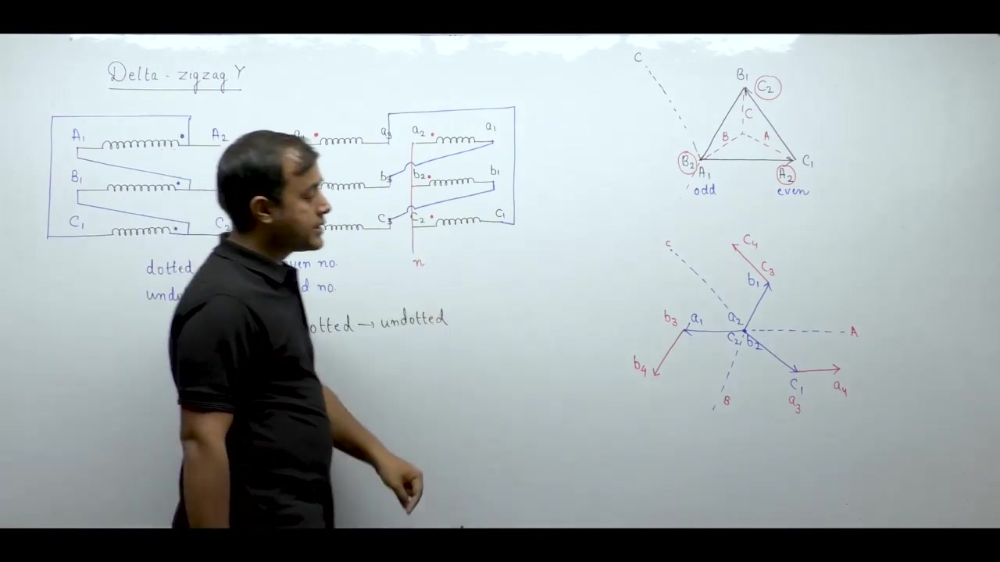

### Verifying Dz0 Alignment ($0^\circ$ Phase Shift)

The resultant secondary line terminals are $A_4, B_4, C_4$, representing secondary phases $a, b, c$.

Compare the orientation of primary phase $C$ with secondary phase $c$:
- Primary phase $C$ points vertically upward (12 o'clock).
- Secondary phase $c$ also points vertically upward (12 o'clock).

> [!success] Result: Dz0 Classification
> When undotted terminals connect to undotted terminals with neutral at the even terminals, the secondary phase voltage aligns with the primary phase voltage:
> $$
> \text{Phase Shift} = 0^\circ \implies \text{Dz0}
> $$

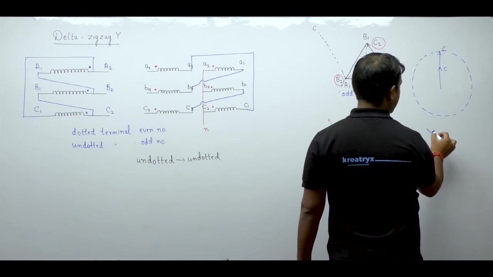

### Setup for Dotted-to-Dotted Subtractive Connection

Subtractive polarity can also be obtained by connecting dotted terminals to dotted terminals.

To implement this configuration:
1. Secondary terminals $A_1, B_1, C_1$ (undotted) form the neutral point.
2. Dotted terminal $A_2$ connects to dotted terminal $B_4$.
3. Terminal $B_2$ connects with terminal $C_4$.
4. Terminal $C_2$ joins directly to terminal $A_4$.
5. The remaining undotted terminals $A_3, B_3, C_3$ form the three-phase output lines.

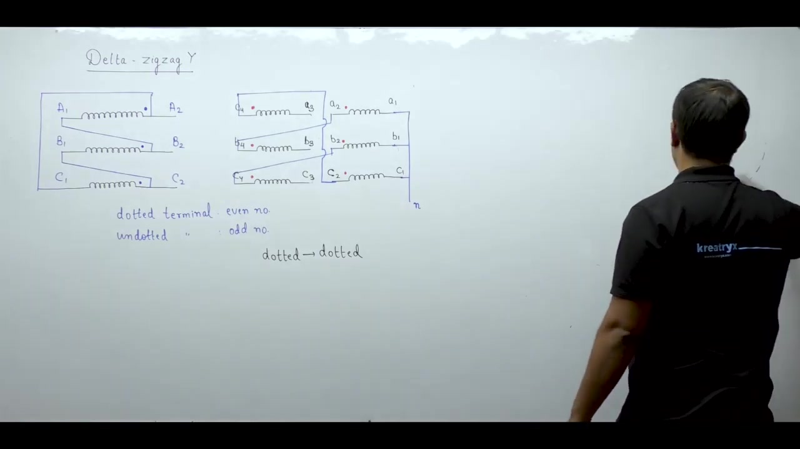

## Phasor Construction for Delta-Zigzag Star Yielding Dz6
_(25:11 - 30:27)_

We now construct the phasor diagram for the dotted-to-dotted subtractive configuration.

### Secondary Phasors Starting from Neutral ($A_1, B_1, C_1$)

The neutral point is formed by terminals $A_1, B_1, C_1$ (undotted).

We draw the first stage of half-windings outward from neutral:
- From neutral $A_1$ to terminal $A_2$: this moves from odd to even ($1 \to 2$).
- In the primary, windings were drawn from odd to even ($A_1 \to A_2$).
- Therefore, $A_1 \to A_2$ is drawn parallel to primary phase A.
- Similarly, $B_1 \to B_2$ is drawn parallel to primary phase B.
- $C_1 \to C_2$ is drawn parallel to primary phase C.

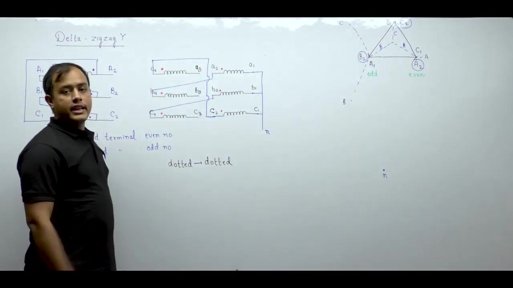

### Reversed Second-Stage Half-Windings (Even to Odd)

Terminals $A_2, B_2, C_2$ connect to the second set of half-windings. Terminal $A_2$ links to $B_4$. Meanwhile, terminal $B_2$ joins with $C_4$, and terminal $C_2$ connects to $A_4$.

We trace outward toward the output terminals $A_3, B_3, C_3$:
1. From $B_4$ to $B_3$: this moves from even to odd ($4 \to 3$). Because the primary moved odd-to-even, draw $B_4 \to B_3$ anti-parallel (pointing upward).
2. From $C_4$ to $C_3$: moves even-to-odd. Draw $C_4 \to C_3$ anti-parallel to primary phase C.
3. From $A_4$ to $A_3$: moves even-to-odd. Draw $A_4 \to A_3$ anti-parallel to primary phase A (pointing left).

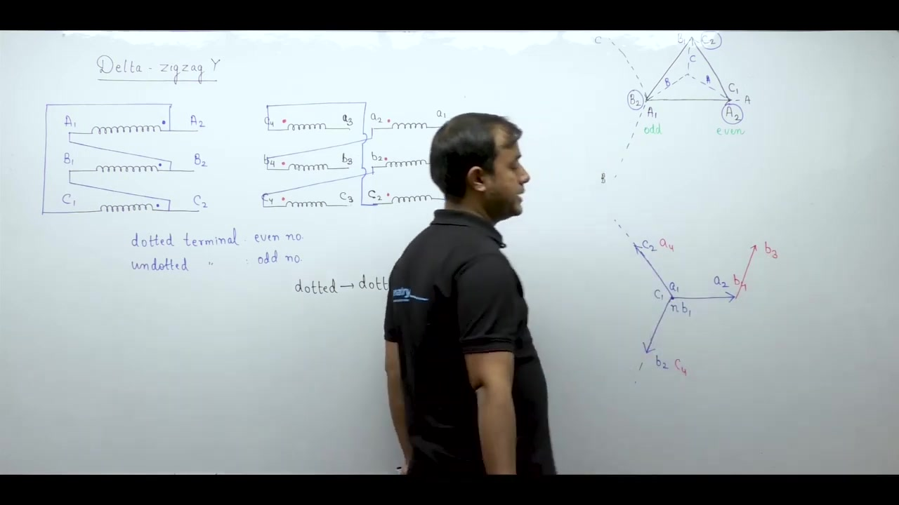

### Phase Shift and Dz6 Classification

The resultant secondary line terminals are $A_3, B_3, C_3$, representing phases $a, b, c$.

Compare primary phase $C$ with secondary phase $c$:
- Primary phase $C$ points vertically upward (12 o'clock).
- Secondary phase $c$ points vertically downward (6 o'clock).

> [!success] Result: Dz6 Classification
> Connecting dotted terminals together with neutral at undotted terminals produces a $180^\circ$ phase shift:
> $$
> \text{Phase Shift} = 180^\circ \implies \text{Dz6}
> $$

Delta-zigzag star connections allow two clock groups: Dz0 ($0^\circ$) and Dz6 ($180^\circ$). This matches the phase shifts available in standard delta-delta and star-star connections.

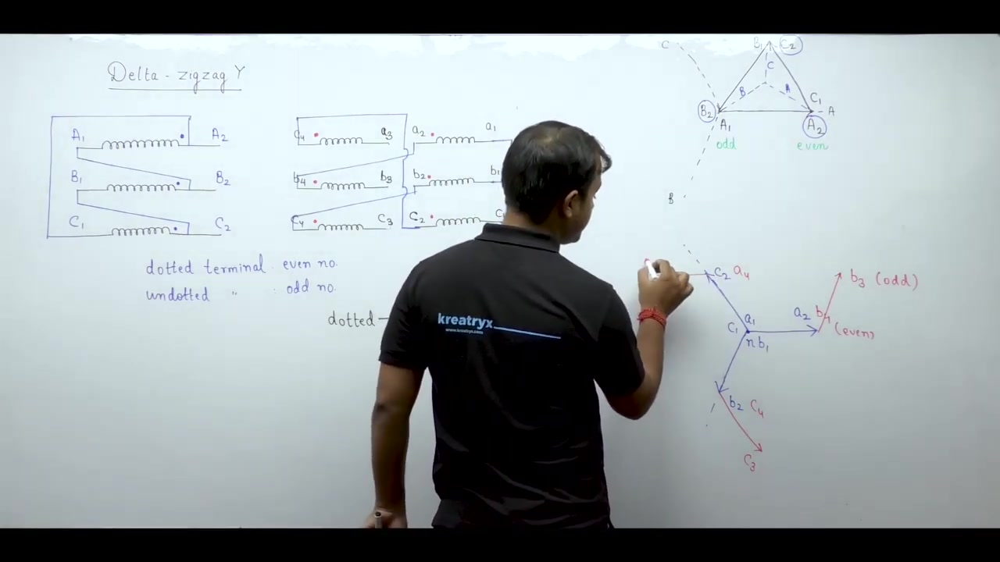

## Voltage Derivation and Line Voltage Ratio for Delta-Zigzag Star
_(30:56 - 36:50)_

We now derive the secondary phase and line voltages in a delta-zigzag star transformer.

### Half-Winding Voltage Expression

Let $V_1$ be the primary phase voltage. Because the primary is delta-connected, primary line voltage also equals $V_1$.

Each secondary phase winding contains $N_S$ total turns, split into two halves of $N_S / 2$ turns each. The voltage across each half-winding is:

$$
V_{\text{half}} = V_1 \left(\frac{N_S / 2}{N_P}\right) = \frac{V_1}{2} \left(\frac{N_S}{N_P}\right)
$$

Let $x = N_P / N_S$ denote the turns ratio:

$$
V_{\text{half}} = \frac{V_1}{2x}
$$

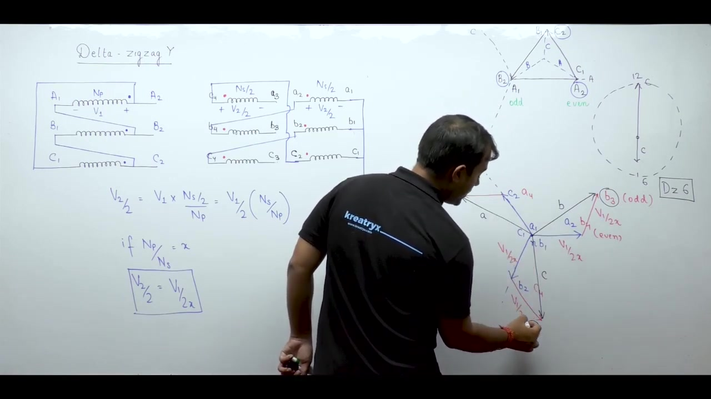

### Vector Sum for Secondary Phase Voltage

Each secondary phase connects two half-windings from different phases in series. In the phasor diagram, these two phasors are displaced by $60^\circ$.

The secondary phase voltage is their vector sum:

$$
\begin{aligned}
V_{ph(\text{secondary})} &= \sqrt{\left(\frac{V_1}{2x}\right)^2 + \left(\frac{V_1}{2x}\right)^2 + 2\left(\frac{V_1}{2x}\right)^2 \cos 60^\circ} \\
&= \frac{V_1}{2x} \sqrt{1 + 1 + 2(0.5)} \\
&= \frac{\sqrt{3}}{2} \left(\frac{V_1}{x}\right) \\
&= \frac{\sqrt{3}}{2} V_1 \left(\frac{N_S}{N_P}\right)
\end{aligned}
$$

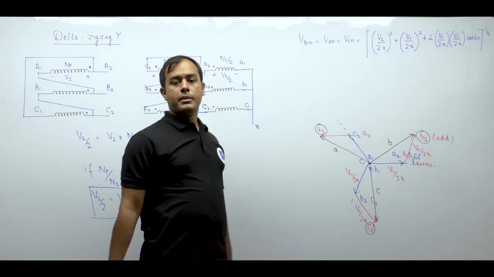

### Secondary Line Voltage and Primary-to-Secondary Ratio

In a star connection, the line voltage is $\sqrt{3}$ times the phase voltage:

$$
V_{L(\text{secondary})} = \sqrt{3} V_{ph(\text{secondary})} = \sqrt{3} \left[\frac{\sqrt{3}}{2} V_1 \left(\frac{N_S}{N_P}\right)\right] = \frac{3}{2} V_1 \left(\frac{N_S}{N_P}\right)
$$

The primary line voltage is $V_{LP} = V_1$. The ratio of primary to secondary line voltage is:

$$
\frac{V_{LP}}{V_{LS}} = \frac{V_1}{\frac{3}{2} V_1 (N_S / N_P)} = \frac{2}{3} \left(\frac{N_P}{N_S}\right)
$$

> [!success] Result: Line Voltage Ratio in Delta-Zigzag Star
> The line-to-line transformation ratio of a delta-zigzag star transformer is:
> $$
> \frac{V_{LP}}{V_{LS}} = \frac{2}{3} \left(\frac{N_P}{N_S}\right) \approx 0.667 \left(\frac{N_P}{N_S}\right)
> $$

In a standard delta-star transformer, this ratio was $\frac{1}{\sqrt{3}} (N_P / N_S) \approx 0.577 (N_P / N_S)$.

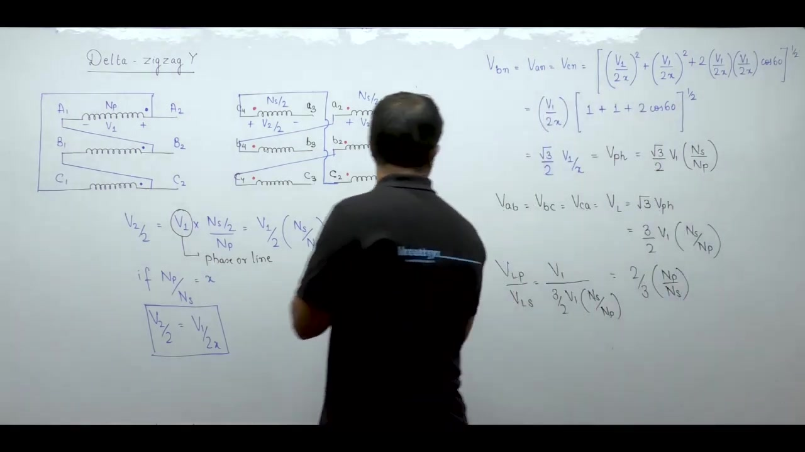

## Voltage Ratio Comparison: Delta-Zigzag Star vs Delta-Star
_(36:54 - 41:58)_

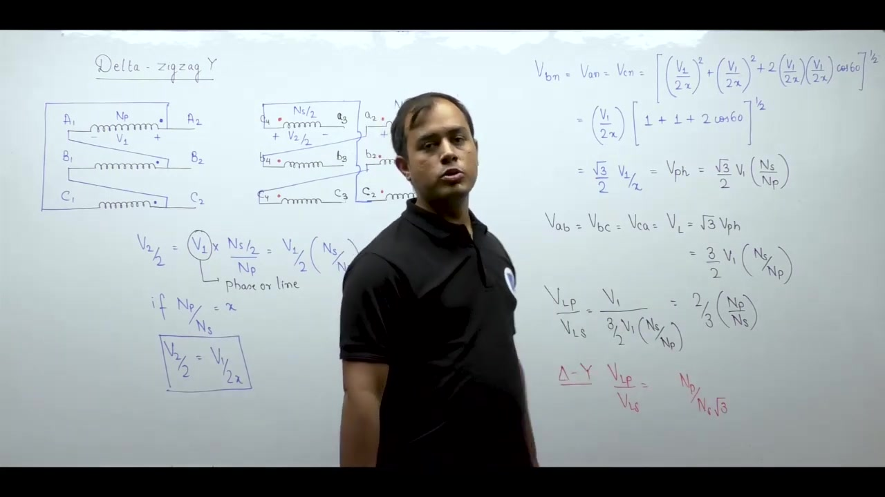

### Line Voltage Ratio Comparison

In the delta-star ($D\text{y}$) transformer, the line voltage ratio is:
$$\frac{V_{LP}}{V_{LS}} = \frac{1}{\sqrt{3}}\left(\frac{N_P}{N_S}\right) \approx 0.577\left(\frac{N_P}{N_S}\right)$$

In the delta-zigzag star ($D\text{z}$) transformer, the line voltage ratio is:
$$\frac{V_{LP}}{V_{LS}} = \frac{2}{3}\left(\frac{N_P}{N_S}\right) \approx 0.667\left(\frac{N_P}{N_S}\right)$$

So the ratio of primary line voltage to secondary line voltage is higher in delta-zigzag star.

Inverting these ratios gives the secondary-to-primary voltage transfer:
$$
\begin{aligned}
\left(\frac{V_{LS}}{V_{LP}}\right)_{D\text{y}} &= \sqrt{3}\left(\frac{N_S}{N_P}\right) \approx 1.732\left(\frac{N_S}{N_P}\right) \\
\left(\frac{V_{LS}}{V_{LP}}\right)_{D\text{z}} &= \frac{3}{2}\left(\frac{N_S}{N_P}\right) = 1.5\left(\frac{N_S}{N_P}\right)
\end{aligned}
$$

For the same applied primary line voltage, delta-star yields a higher secondary line voltage than delta-zigzag star.

### Phasor Addition and Voltage Reduction

Why does the zigzag connection produce less secondary voltage? In standard delta-star, all secondary turns of a phase reside on the same limb. Their induced voltages add directly along the same line.

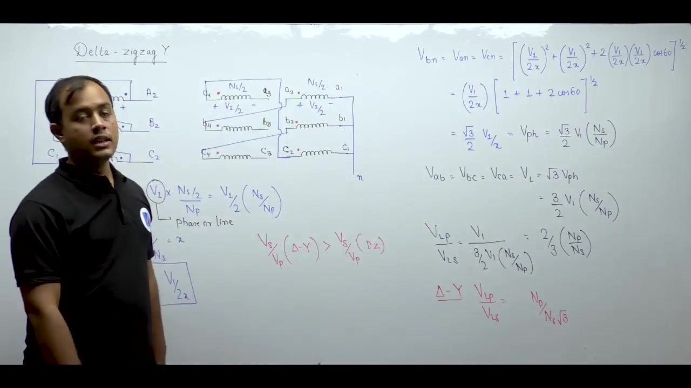

In delta-zigzag star, each phase winding splits into two equal halves. Each half has $N_S / 2$ turns. One half comes from phase A. The other half comes from phase B in reverse polarity. 

These two component voltages have a $60^\circ$ phase difference:
$$
\begin{aligned}
V_{ph,s} &= \frac{V_s}{2}\angle 0^\circ + \frac{V_s}{2}\angle -60^\circ \\
&= \frac{\sqrt{3}}{2} V_s \approx 0.866\,V_s
\end{aligned}
$$

The sum of two vectors is maximum when they are collinear. Adding out-of-phase vectors reduces the resultant magnitude. Joining half-windings from different phases therefore lowers the output voltage.

> [!success] Result
> Delta-zigzag star eliminates third-harmonic voltages. But it yields only $86.6\%$ of the secondary phase voltage of a standard star winding with identical turns.

## Star-Zigzag Star Connection Setup
_(41:58 - 46:30)_

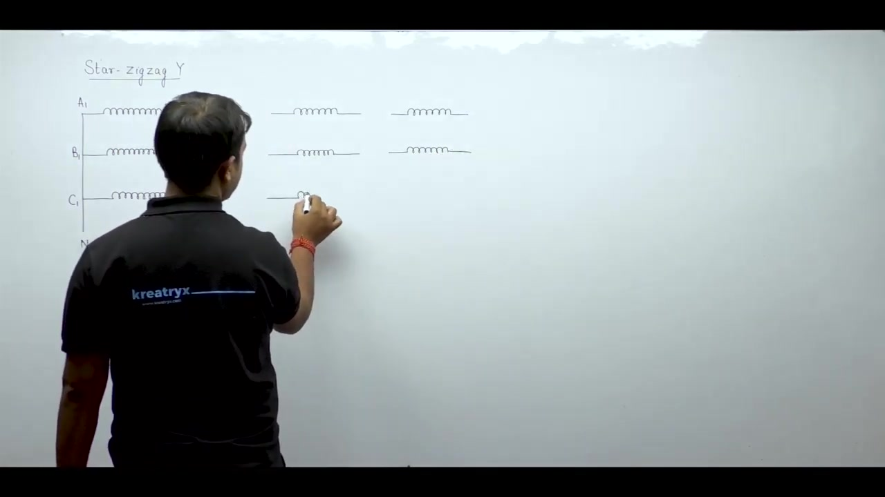

### Primary Star and Secondary Zigzag Configuration

Now consider the star-zigzag star connection ($Y\text{z}$). The primary winding is connected in star. The secondary winding is connected in zigzag star.

On the primary side, terminals $A_1, B_1, C_1$ form the neutral. The even terminals $A_2, B_2, C_2$ receive the three-phase supply. Dots are marked on even terminals $A_2, B_2, C_2$.

On the secondary side, each phase winding divides into two equal halves:
- Phase A has parts $A_1\text{-}A_2$ and $A_3\text{-}A_4$.
- Phase B has parts $B_1\text{-}B_2$ and $B_3\text{-}B_4$.
- Phase C has parts $C_1\text{-}C_2$ and $C_3\text{-}C_4$.

Dots are placed on the even-numbered terminals $A_2, A_4, B_2, B_4, C_2, C_4$.

### Terminal Connections and Neutral Formation

Terminals $A_2, B_2, C_2$ are tied together to form the secondary neutral.

Next, undotted terminals connect to undotted terminals. Terminal $A_1$ links to $B_3$, while terminal $B_1$ joins with $C_3$, and terminal $C_1$ connects to $A_3$.

The output terminals are $A_4, B_4, C_4$.

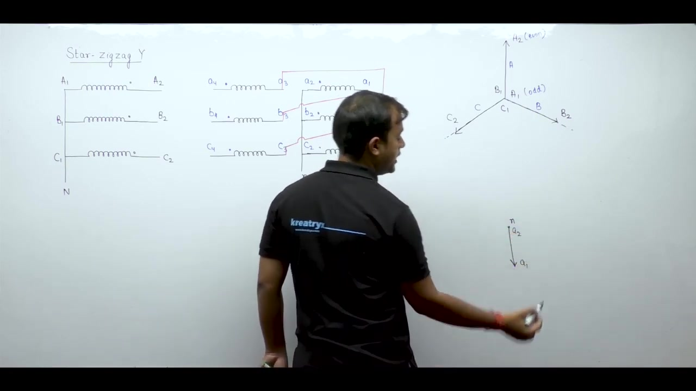

### Initial Phasor Construction

For the primary star, phasors start from the neutral. They point from odd terminals to even terminals:
- Phasor $A_1 \to A_2$ points vertically upward along the reference axis.
- Phasor $B_1 \to B_2$ lags by $120^\circ$.
- Phasor $C_1 \to C_2$ lags by $240^\circ$ (or leads by $120^\circ$).

In the secondary, tracing from the neutral $A_2, B_2, C_2$ moves from even to odd terminals. Going from even to odd reverses the direction of the primary phasors:
- Phasor $A_2 \to A_1$ points vertically downward.
- Phasor $B_2 \to B_1$ points opposite to the primary B phase phasor.
- Phasor $C_2 \to C_1$ points opposite to the primary C phase phasor.

## Phasor Analysis of Yz1 Connection
_(46:39 - 51:30)_

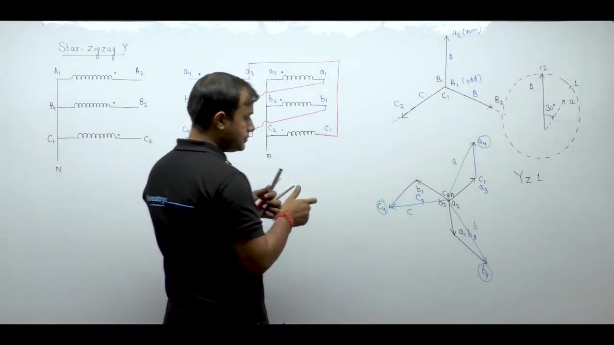

### Completing the Secondary Phasors

To complete the secondary zigzag phasors, add the second half-windings:
- From $B_3$ to $B_4$, the path is odd to even. This runs parallel to primary phase B.
- From $C_3$ to $C_4$, the path is odd to even. This runs parallel to primary phase C.
- From $A_3$ to $A_4$, the path is odd to even. This runs parallel to primary phase A.

The final secondary terminals are $A_4, B_4, C_4$.

The resultant phase A phasor extends from the neutral to $A_4$. This phasor is shifted clockwise relative to the primary phase A phasor. The phase shift is exactly $30^\circ$ lagging.

On a clock face, 12 o'clock represents the reference. A $30^\circ$ clockwise lag points to 1 o'clock. 

> [!info] Definition
> The connection group is named **Yz1**. The primary is star (Y). The secondary is zigzag star (z). The secondary phase voltage lags the primary phase voltage by $30^\circ$ (1 o'clock).

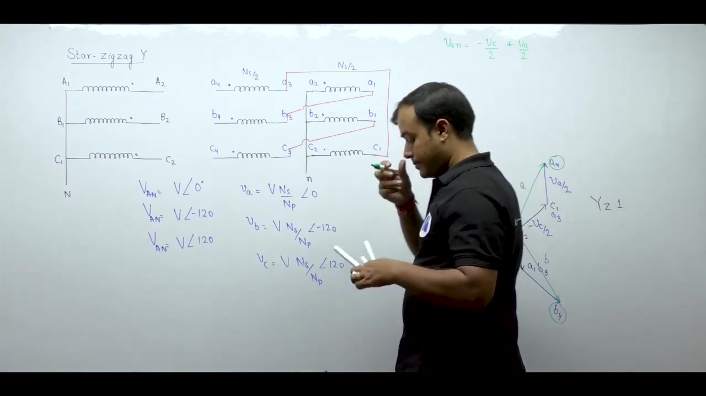

### Analytical Expression of Secondary Phase Voltage

We can prove the $-30^\circ$ phase shift mathematically. Let the primary phase voltages be:
$$
\begin{aligned}
V_{AN} &= V\angle 0^\circ \\
V_{BN} &= V\angle -120^\circ \\
V_{CN} &= V\angle 120^\circ
\end{aligned}
$$

Each secondary half-winding has $N_S / 2$ turns. Secondary phase A voltage is the sum of voltages across $C_2\text{-}C_1$ and $A_3\text{-}A_4$:
$$V_{an} = V_{C2C1} + V_{A3A4}$$

Tracing from $C_2$ to $C_1$ is even to odd. This reverses the phase C voltage:
$$V_{C2C1} = -\frac{V}{2}\left(\frac{N_S}{N_P}\right)\angle 120^\circ = \frac{V}{2}\left(\frac{N_S}{N_P}\right)\angle -60^\circ$$

Tracing from $A_3$ to $A_4$ is odd to even. This follows phase A directly:
$$V_{A3A4} = \frac{V}{2}\left(\frac{N_S}{N_P}\right)\angle 0^\circ$$

Summing the two half-winding components:
$$V_{an} = \frac{V}{2}\left(\frac{N_S}{N_P}\right)\left(1\angle -60^\circ + 1\angle 0^\circ\right)$$

## Voltage Ratio and Phase Shift in Star-Zigzag Star
_(51:34 - 57:46)_

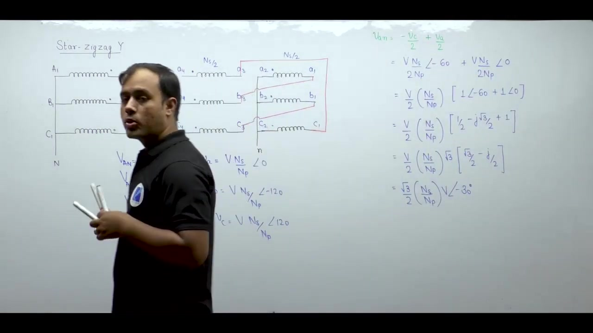

### Evaluation of Secondary Phase Voltage

Convert the polar terms into rectangular coordinates:
$$
\begin{aligned}
1\angle -60^\circ &= \cos(-60^\circ) + j\sin(-60^\circ) = \frac{1}{2} - j\frac{\sqrt{3}}{2} \\
1\angle 0^\circ &= 1 + j0
\end{aligned}
$$

Add these two complex numbers:
$$1\angle -60^\circ + 1\angle 0^\circ = \left(1 + \frac{1}{2}\right) - j\frac{\sqrt{3}}{2} = \frac{3}{2} - j\frac{\sqrt{3}}{2}$$

Factor out $\sqrt{3}$:
$$\frac{3}{2} - j\frac{\sqrt{3}}{2} = \sqrt{3}\left(\frac{\sqrt{3}}{2} - j\frac{1}{2}\right) = \sqrt{3}\angle -30^\circ$$

Substitute this back into the phase voltage expression:
$$V_{an} = \frac{\sqrt{3}}{2} V\left(\frac{N_S}{N_P}\right)\angle -30^\circ$$

The primary phase voltage has an angle of $0^\circ$. The secondary phase voltage has an angle of $-30^\circ$. Secondary phase voltage lags primary phase voltage by $30^\circ$.

Secondary line voltage also lags primary line voltage by $30^\circ$.

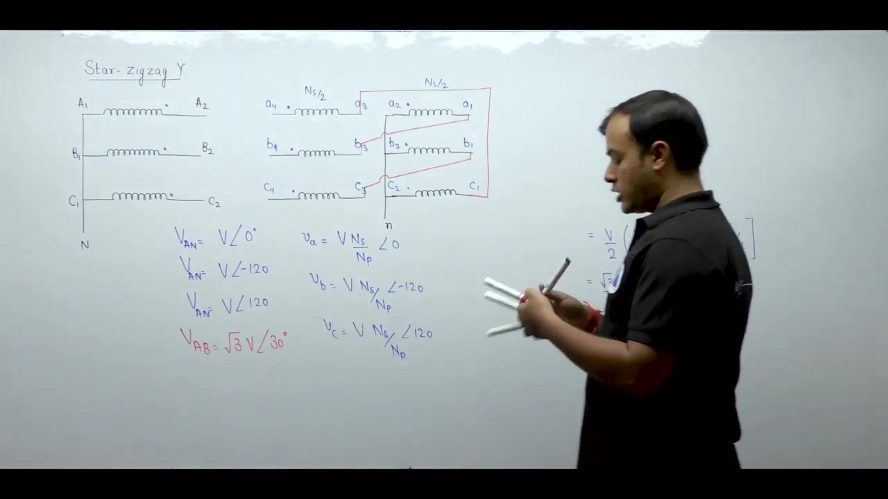

### Line Voltage Ratio Derivation

On the primary side, connection is star:
$$V_{LP} = \sqrt{3} V_{ph,p} = \sqrt{3} V$$

On the secondary side, connection is zigzag star:
$$V_{LS} = \sqrt{3} V_{ph,s} = \sqrt{3}\left[\frac{\sqrt{3}}{2} V\left(\frac{N_S}{N_P}\right)\right] = \frac{3}{2} V\left(\frac{N_S}{N_P}\right)$$

Now compute the line voltage transformation ratio:
$$\frac{V_{LP}}{V_{LS}} = \frac{\sqrt{3} V}{\frac{3}{2} V \left(\frac{N_S}{N_P}\right)} = \frac{2}{\sqrt{3}}\left(\frac{N_P}{N_S}\right) \approx 1.155\left(\frac{N_P}{N_S}\right)$$

Inverting this gives the secondary line voltage:
$$\frac{V_{LS}}{V_{LP}} = \frac{\sqrt{3}}{2}\left(\frac{N_S}{N_P}\right) \approx 0.866\left(\frac{N_S}{N_P}\right)$$

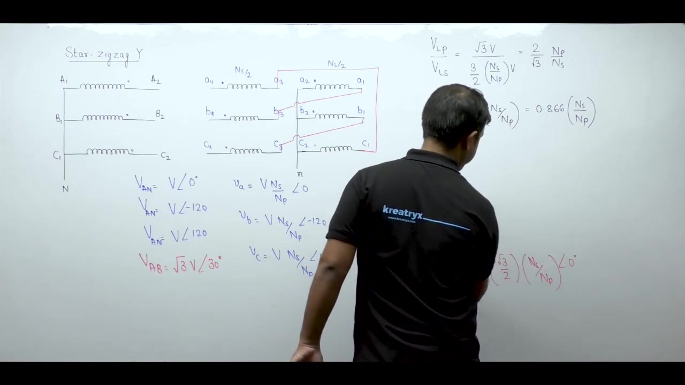

### Comparison with Star-Star Connection

Compare star-zigzag star ($Y\text{z}$) directly with standard star-star ($Y\text{y}$).

In a standard star-star transformer, the line voltage ratio equals the phase turns ratio:
$$\left(\frac{V_{LS}}{V_{LP}}\right)_{Y\text{y}} = \frac{N_S}{N_P}$$

In star-zigzag star, the secondary line voltage is reduced:
$$\left(\frac{V_{LS}}{V_{LP}}\right)_{Y\text{z}} = 0.866\left(\frac{N_S}{N_P}\right)$$

For the same primary voltage and total turns, secondary line voltage is lower by $13.4\%$.

> [!success] Result
> Star-zigzag star cancels third-harmonic voltages effectively. The trade-off is that secondary line voltage is $86.6\%$ of that obtained from a standard star-star transformer.

## Summary of Zigzag Connections and Exam Takeaways
_(57:46 - 60:22)_

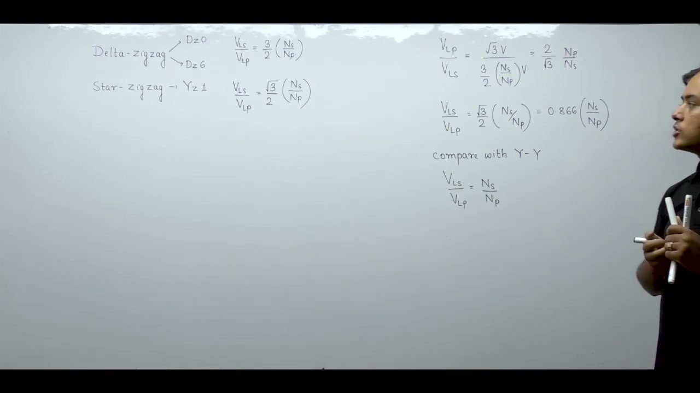

### Key Points for Competitive Examinations

For competitive exams like GATE and ESE, remember these core facts about zigzag connections:

1. **Delta-Zigzag ($D\text{z}$)**:
   - Possible vector groups: $D\text{z}0$ ($0^\circ$ phase displacement) and $D\text{z}6$ ($180^\circ$ phase displacement).
   - Line voltage ratio: $\frac{V_{LP}}{V_{LS}} = \frac{2}{3}\left(\frac{N_P}{N_S}\right)$.
   - Secondary line voltage: $V_{LS} = \frac{3}{2}\left(\frac{N_S}{N_P}\right)V_{LP}$.

2. **Star-Zigzag ($Y\text{z}$)**:
   - Primary is star, secondary is zigzag star.
   - Vector group: $Y\text{z}1$ ($-30^\circ$ phase displacement, 1 o'clock).
   - Line voltage ratio: $\frac{V_{LP}}{V_{LS}} = \frac{2}{\sqrt{3}}\left(\frac{N_P}{N_S}\right)$.
   - Secondary line voltage: $V_{LS} = \frac{\sqrt{3}}{2}\left(\frac{N_S}{N_P}\right)V_{LP} \approx 0.866\left(\frac{N_S}{N_P}\right)V_{LP}$.

### Advantages and Disadvantages of Zigzag Connections

The primary motivation for using zigzag windings is third-harmonic suppression:
- Third-harmonic voltages in the two series half-windings are in phase.
- Because the two halves are connected in series opposition, third-harmonic voltages cancel completely.
- A stable neutral is available without third-harmonic voltage distortion.

The main disadvantage is reduced voltage rating:
- The phase voltage is only $\frac{\sqrt{3}}{2} \approx 86.6\%$ of the voltage obtained if both half-windings were in phase.
- To produce the same rated voltage, a zigzag transformer requires $15.5\%$ more turns ($1 / 0.866 \approx 1.155$).
- This requires more copper and increases transformer cost.

The next lecture covers the Scott connection for three-phase to two-phase transformation.

---

## Summary and Key Takeaways

- Third-harmonic voltages in a balanced three-phase system have identical phase angles, making them co-phasal.
- Connecting two half-windings from different phases in series with subtractive polarity cancels co-phasal third-harmonic voltages completely.
- In delta-zigzag star, undotted-to-undotted interconnections with neutral at even terminals produce the $\text{Dz0}$ vector group with $0^\circ$ phase shift.
- In delta-zigzag star, dotted-to-dotted interconnections with neutral at undotted terminals produce the $\text{Dz6}$ vector group with $180^\circ$ phase shift.
- The line voltage ratio for delta-zigzag star is $\frac{V_{LP}}{V_{LS}} = \frac{2}{3}\left(\frac{N_P}{N_S}\right)$, giving a secondary voltage $86.6\%$ of that in standard delta-star.
- Star-zigzag star with neutral at $A_2, B_2, C_2$ produces the $\text{Yz1}$ vector group, where secondary voltage lags primary voltage by $30^\circ$.
- The line voltage ratio for star-zigzag star is $\frac{V_{LP}}{V_{LS}} = \frac{2}{\sqrt{3}}\left(\frac{N_P}{N_S}\right) \approx 1.155\left(\frac{N_P}{N_S}\right)$.
- To produce the same secondary output voltage as standard connections, a zigzag secondary requires $15.5\%$ more copper turns.

---

[← Lec 043: Three Phase Transformer 5](Lecture_043_Three_Phase_Transformer_5.md) | [🏠 Index](00_yt_study_guide.md) | [Lec 045: Three Phase Transformer 7 →](Lecture_045_Three_Phase_Transformer_7.md)
