# Electrical Machines | Lec 31 | Three Phase Transformer - 7 | GATE/ESE Electrical Engineering Lecture

- **Source**: https://www.youtube.com/watch?v=VvIk1qmbf7E
- **Duration**: 01:12:58
- **Compiled**: 2026-09-21

---

## Overview

This lecture covers the theory, construction, and analytical performance of the Scott connection for three-phase to two-phase conversion. It explains why directly using two phases of a three-phase supply violates two-phase balancing and how the teaser and main transformer interconnection creates a 90-degree phase shift. The discussion establishes turns ratios, locates the primary neutral terminal, and analyzes MMF cancellation in the main winding. It derives primary current balancing and operating power factors under balanced and unbalanced loading. Finally, the lecture evaluates the volt-ampere ratings and determines the transformer utilization factor for both custom and identical transformer configurations.

## Contents

- [[#Scott Connection and Principles of Two-Phase Systems|Scott Connection and Principles of Two-Phase Systems]]
- [[#Construction of the Scott Connection and Supply Phasor Diagram|Construction of the Scott Connection and Supply Phasor Diagram]]
- [[#Primary Voltage Relations and Synthesis of 90-Degree Phase Shift|Primary Voltage Relations and Synthesis of 90-Degree Phase Shift]]
- [[#Turns Ratio Selection and Primary Neutral Location|Turns Ratio Selection and Primary Neutral Location]]
- [[#Analytical Verification of the Primary Neutral Point|Analytical Verification of the Primary Neutral Point]]
- [[#Primary and Secondary Current Relations and KCL at Line Terminals|Primary and Secondary Current Relations and KCL at Line Terminals]]
- [[#MMF Balancing in the Main Transformer and Loading Overview|MMF Balancing in the Main Transformer and Loading Overview]]
- [[#Primary Current Balancing under Balanced Resistive Loading|Primary Current Balancing under Balanced Resistive Loading]]
- [[#Operating Power Factors Under Resistive and Lagging Loads|Operating Power Factors Under Resistive and Lagging Loads]]
- [[#Detailed Power Factor Expressions and Unbalanced Loading Analysis|Detailed Power Factor Expressions and Unbalanced Loading Analysis]]
- [[#Primary and Secondary VA Ratings of Scott-Connected Transformers|Primary and Secondary VA Ratings of Scott-Connected Transformers]]
- [[#Capacity and Transformer Utilization Factor for Standard Scott Connection|Capacity and Transformer Utilization Factor for Standard Scott Connection]]
- [[#Identical Transformer TUF and Exam Summary for Scott Connection|Identical Transformer TUF and Exam Summary for Scott Connection]]

---

## Scott Connection and Principles of Two-Phase Systems
_(00:14 - 06:29)_

### Balancing Conditions in Multi-Phase Systems

The Scott connection converts a three-phase balanced supply into a two-phase balanced supply. It is also known as the T-connection.

For any general $n$-phase system, balanced operation requires two conditions:
1. All phase voltage magnitudes must be equal.
2. The phase displacement between adjacent phases must be:
$$\text{Phase Displacement} = \frac{360^\circ}{n}$$

However, this angle formula holds only for $n \ge 3$. 

For a two-phase system ($n = 2$), the formula would suggest $360^\circ / 2 = 180^\circ$. A $180^\circ$ displacement produces single-phase power with opposite polarities, not a true two-phase system.

> [!info] Definition: Balanced Two-Phase System
> A balanced two-phase supply requires two sinusoidal voltages of equal magnitude displaced by exactly $90^\circ$ in time phase:
> $$V_A = V_m \sin(\omega t), \quad V_B = V_m \sin(\omega t \pm 90^\circ)$$

### Why Two Phases of a Three-Phase System Cannot Be Used

Can we create a two-phase system by taking two lines of a three-phase supply?

In a balanced three-phase system, phases A and B have a mutual phase displacement of $120^\circ$:
$$
\begin{aligned}
V_A &= V \angle 0^\circ \\
V_B &= V \angle -120^\circ
\end{aligned}
$$

Directly using these two phases gives a $120^\circ$ shift rather than the required $90^\circ$. This violates the balancing condition of a two-phase system. A special transformation network is required to synthesize the $90^\circ$ phase shift.

### Industrial Applications of Two-Phase Power

Although generation and transmission use three-phase power, several industrial applications require two-phase power:

1. **Electric Arc Furnaces**: Arc furnaces operate as large single-phase loads. Running two furnaces across two phases of a two-phase system draws balanced power from the three-phase grid.
2. **Rural Electrification**: Supplying single-phase loads in rural areas while maintaining balanced loading on the main three-phase transmission network.
3. **Electric Traction**: Railway locomotives operate on single-phase AC. Distributing track sections across two orthogonal phases balances the three-phase utility grid.
4. **Two-Phase Control Motors**: AC servomotors in control systems require two stator voltages in time quadrature to establish a rotating magnetic field.

## Construction of the Scott Connection and Supply Phasor Diagram
_(06:31 - 12:21)_

### Circuit Topology and Transformer Configuration

The Scott connection uses two single-phase transformers. These are named the teaser transformer and the main transformer.

The main transformer primary is connected directly across two lines of the three-phase supply, lines B and C. The main winding has a center tap, labeled point D. 

Point D divides the main primary into two equal halves:
$$N_{BD} = N_{DC} = \frac{N_1}{2}$$

The teaser transformer primary connects between supply line A and the center tap D. The geometric arrangement resembles an inverted letter T.

Each transformer has an isolated secondary winding. The two secondaries supply the two phases of the two-phase load.

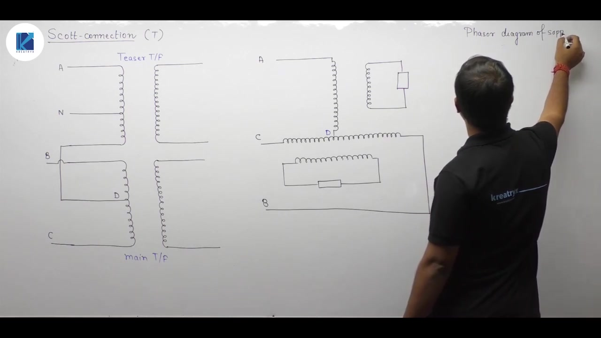

### Supply Phasor Representation

To analyze the operation, we construct the phasor diagram of the three-phase supply.

Take phase voltage $V_{AN}$ as the reference along the vertical axis:
$$
\begin{aligned}
V_{AN} &= V_{ph} \angle 90^\circ \\
V_{BN} &= V_{ph} \angle -30^\circ \\
V_{CN} &= V_{ph} \angle -150^\circ
\end{aligned}
$$

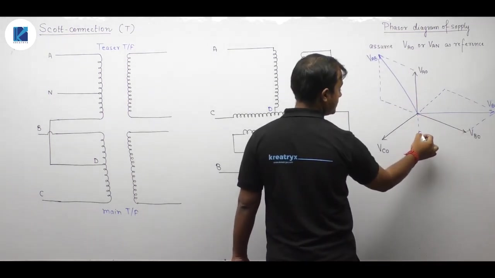

From these phase voltages, find the line voltages:
$$
\begin{aligned}
V_{AB} &= V_{AN} - V_{BN} \\
V_{BC} &= V_{BN} - V_{CN} \\
V_{CA} &= V_{CN} - V_{AN}
\end{aligned}
$$

Line voltage $V_{BC}$ lies along the horizontal reference axis:
$$V_{BC} = V_L \angle 0^\circ$$

The other two line voltages are:
$$
\begin{aligned}
V_{AB} &= V_L \angle 120^\circ \\
V_{CA} &= V_L \angle -120^\circ
\end{aligned}
$$

This establishes the voltage framework across the transformer terminals.

## Primary Voltage Relations and Synthesis of 90-Degree Phase Shift
_(12:24 - 17:55)_

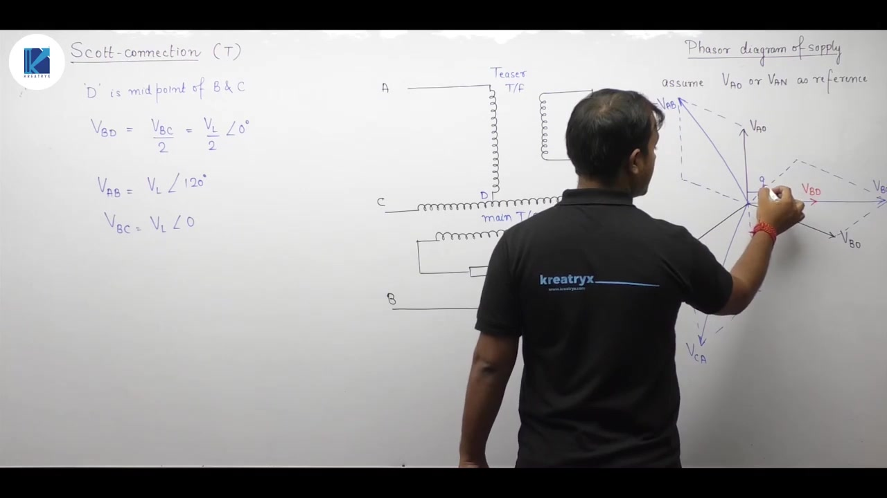

### Derivation of Teaser Primary Voltage $V_{AD}$

Point D is the center tap of the main primary winding. The voltage across the half-winding section BD is:
$$V_{BD} = \frac{V_{BC}}{2} = \frac{V_L}{2}\angle 0^\circ$$

The line voltage $V_{AB}$ is:
$$V_{AB} = V_L \angle 120^\circ$$

Now apply Kirchhoff's Voltage Law to find the voltage $V_{AD}$ across the teaser primary:
$$V_{AD} = V_{AB} + V_{BD}$$

Express both phasors in rectangular form:
$$
\begin{aligned}
V_{AB} &= V_L \left(\cos 120^\circ + j \sin 120^\circ\right) = V_L \left(-\frac{1}{2} + j\frac{\sqrt{3}}{2}\right) \\
V_{BD} &= \frac{V_L}{2} + j0
\end{aligned}
$$

Summing these two expressions:
$$
\begin{aligned}
V_{AD} &= V_L \left(-\frac{1}{2} + j\frac{\sqrt{3}}{2}\right) + \frac{V_L}{2} \\
&= j\frac{\sqrt{3}}{2}V_L = 0.866 V_L \angle 90^\circ
\end{aligned}
$$

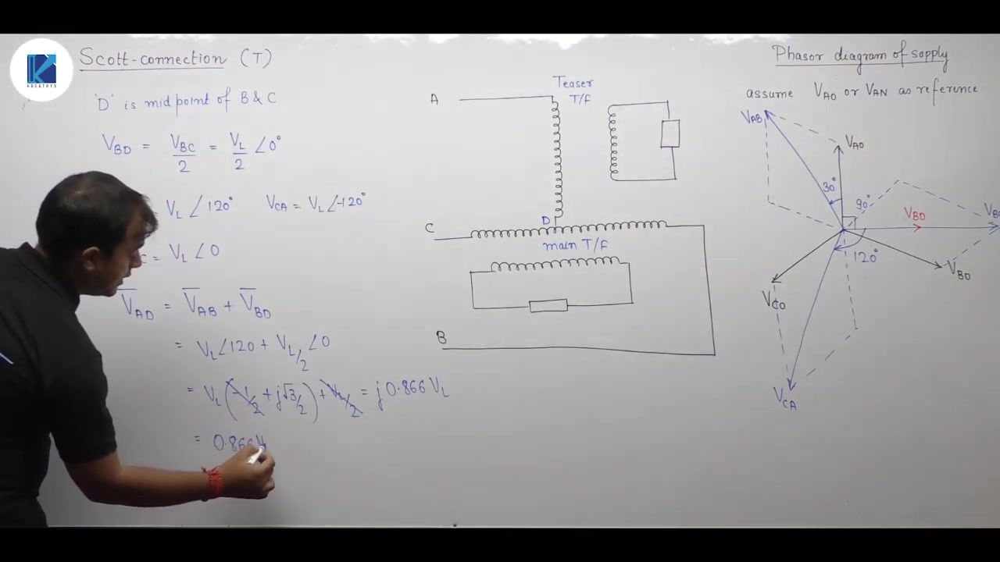

### Quadrature Voltage Generation

The main transformer primary voltage is $V_{BC}$:
$$V_{1\text{main}} = V_{BC} = V_L \angle 0^\circ$$

The teaser transformer primary voltage is $V_{AD}$:
$$V_{1\text{teaser}} = V_{AD} = 0.866 V_L \angle 90^\circ$$

The two primary voltages have an exact phase displacement of $90^\circ$:
$$\text{Phase Difference} = 90^\circ - 0^\circ = 90^\circ$$

> [!success] Result
> The Scott connection primary produces two voltages in time quadrature:
> $$V_{1\text{main}} = V_L \angle 0^\circ, \quad V_{1\text{teaser}} = 0.866 V_L \angle 90^\circ$$

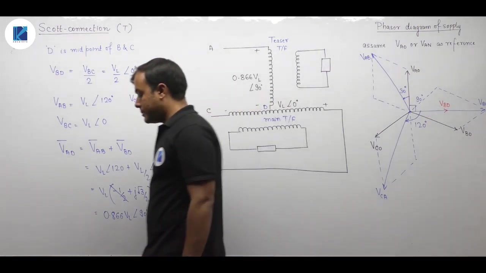

### Phase Transfer to Secondary Windings

In any single-phase transformer, the secondary induced voltage is in phase with the primary voltage.

Because the two primary voltages are in time quadrature, the two secondary voltages are also in time quadrature:
- Main secondary voltage has a phase angle of $0^\circ$.
- Teaser secondary voltage has a phase angle of $90^\circ$.

The $90^\circ$ phase shift requirement for a balanced two-phase supply is satisfied. 

Next, we must ensure that the voltage magnitudes across both secondary windings are equal.

## Turns Ratio Selection and Primary Neutral Location
_(17:58 - 24:06)_

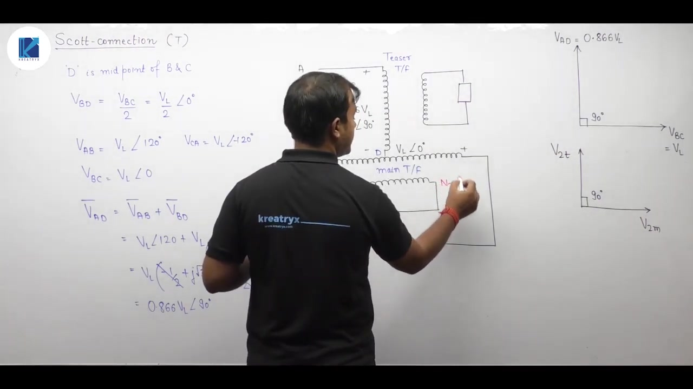

### Matching Secondary Voltage Magnitudes

A balanced two-phase supply requires identical secondary voltage magnitudes:
$$|V_{2\text{main}}| = |V_{2\text{teaser}}| = V_2$$

Let the main transformer have $N_1$ primary turns and $N_2$ secondary turns. The secondary voltage of the main transformer is:
$$V_{2\text{main}} = V_{1\text{main}} \left(\frac{N_2}{N_1}\right) = V_L \left(\frac{N_2}{N_1}\right)$$

The teaser primary receives a lower voltage:
$$V_{1\text{teaser}} = 0.866 V_L = \frac{\sqrt{3}}{2} V_L$$

If the teaser had $N_1$ primary turns, its secondary voltage would be only $0.866 V_2$. To equalize the two secondary voltages, the induced volts per turn must match in both transformers.

Scale the teaser primary turns by the same factor of $0.866$:
$$N_{1\text{teaser}} = 0.866 N_1 = \frac{\sqrt{3}}{2} N_1$$

The teaser secondary voltage then becomes:
$$V_{2\text{teaser}} = V_{1\text{teaser}} \left(\frac{N_2}{N_{1\text{teaser}}}\right) = (0.866 V_L)\left(\frac{N_2}{0.866 N_1}\right) = V_L \left(\frac{N_2}{N_1}\right)$$

Both secondary voltages now have equal magnitudes $V_2$ and are in time quadrature.

> [!success] Result: Turns Ratio
> For identical secondary voltages:
> - Main transformer turns ratio: $N_1 : N_2$
> - Teaser transformer turns ratio: $0.866 N_1 : N_2$

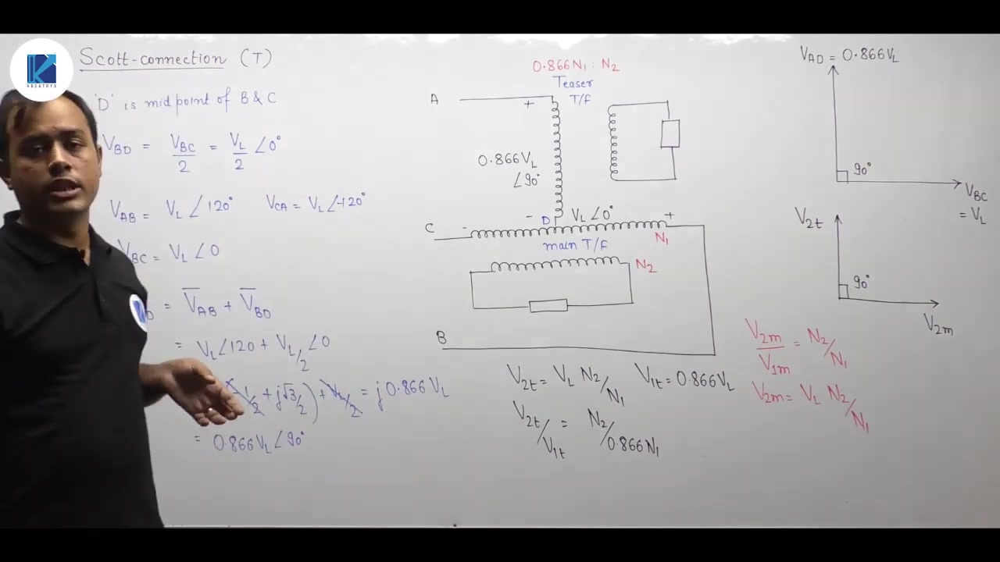

### Locating the Primary Neutral Terminal

When connecting to a three-phase four-wire supply, a neutral point N is required on the primary side.

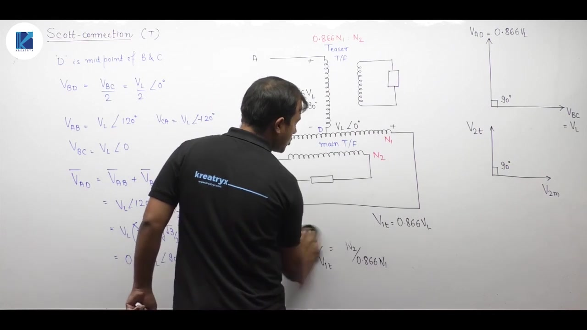

In a balanced three-phase system, the phase-to-neutral voltage is:
$$V_{AN} = \frac{V_L}{\sqrt{3}}$$

The total voltage across the teaser primary is:
$$V_{AD} = \frac{\sqrt{3}}{2} V_L$$

Because points A, N, and D lie along the same continuous winding, voltages $V_{AN}$ and $V_{AD}$ are in phase. Take their direct scalar ratio:
$$\frac{V_{AN}}{V_{AD}} = \frac{V_L / \sqrt{3}}{\frac{\sqrt{3}}{2} V_L} = \frac{2}{3}$$

Because voltage is directly proportional to turns, the neutral tap must divide the teaser turns in a $2:3$ ratio:
$$\frac{N_{AN}}{N_{AD}} = \frac{2}{3}$$

The neutral tap is located at two-thirds of the total turns from top terminal A.

## Analytical Verification of the Primary Neutral Point
_(24:06 - 29:11)_

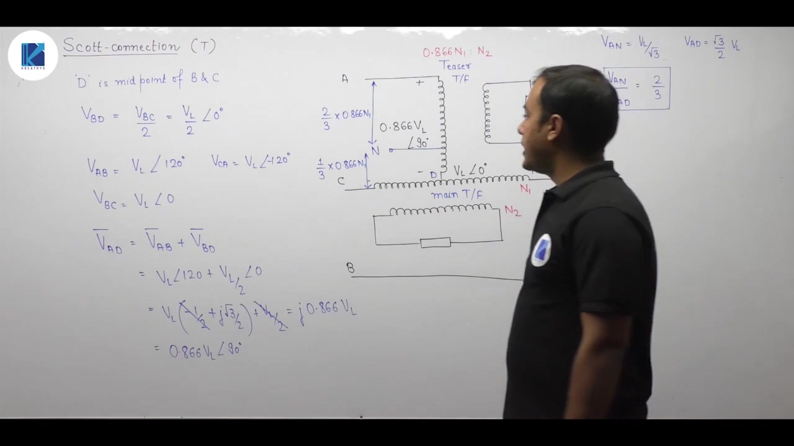

### Division of Turns along the Teaser Primary

The neutral tap N divides the teaser primary winding into two sections:
- Upper section AN contains two-thirds of the turns:
$$N_{AN} = \frac{2}{3} N_{1\text{teaser}} = \frac{2}{3}(0.866 N_1) = 0.577 N_1$$
- Lower section ND contains one-third of the turns:
$$N_{ND} = \frac{1}{3} N_{1\text{teaser}} = \frac{1}{3}(0.866 N_1) = 0.288 N_1$$

Point N is a true neutral only if all three phase voltages equal $V_L / \sqrt{3}$ with mutual $120^\circ$ phase shifts.

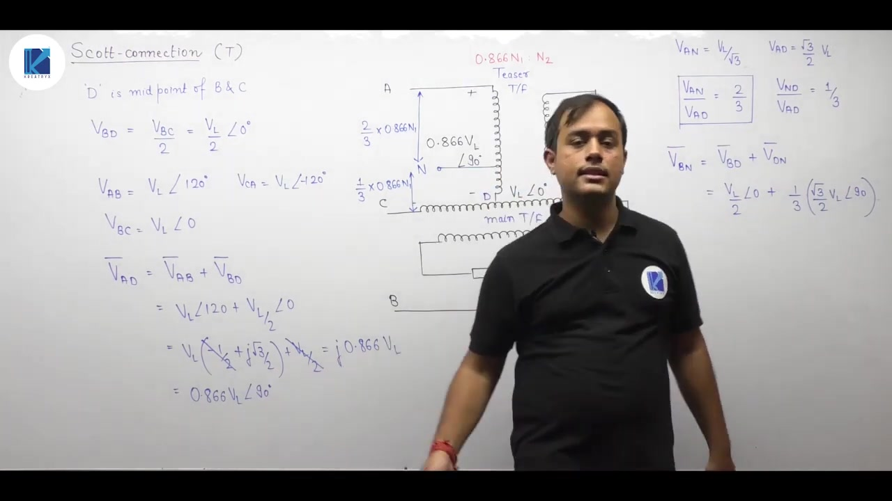

### Verification of Voltage $V_{BN}$

Trace the voltage from terminal B to neutral N:
$$V_{BN} = V_{BD} + V_{DN}$$

The voltage from D to N is the reverse of $V_{ND}$:
$$V_{DN} = -V_{ND} = -\frac{1}{3} V_{AD}$$

Substitute $V_{BD} = \frac{V_L}{2}\angle 0^\circ$ and $V_{AD} = j\frac{\sqrt{3}}{2}V_L$:
$$
\begin{aligned}
V_{BN} &= \frac{V_L}{2} - j\frac{1}{3}\left(\frac{\sqrt{3}}{2}V_L\right) \\
&= \frac{V_L}{2}\left(1 - j\frac{1}{\sqrt{3}}\right)
\end{aligned}
$$

Compute magnitude and phase:
$$
\begin{aligned}
|V_{BN}| &= \frac{V_L}{2}\sqrt{1^2 + \left(-\frac{1}{\sqrt{3}}\right)^2} = \frac{V_L}{2}\sqrt{\frac{4}{3}} = \frac{V_L}{\sqrt{3}} \\
\angle V_{BN} &= \tan^{-1}\left(-\frac{1}{\sqrt{3}}\right) = -30^\circ
\end{aligned}
$$

Thus $V_{BN} = \frac{V_L}{\sqrt{3}}\angle -30^\circ$.

### Verification of Voltage $V_{CN}$

Trace the voltage from terminal C to neutral N:
$$V_{CN} = V_{CD} + V_{DN}$$

Here $V_{CD} = -V_{BD} = -\frac{V_L}{2}$:
$$
\begin{aligned}
V_{CN} &= -\frac{V_L}{2} - j\frac{1}{3}\left(\frac{\sqrt{3}}{2}V_L\right) \\
&= -\frac{V_L}{2}\left(1 + j\frac{1}{\sqrt{3}}\right)
\end{aligned}
$$

Compute magnitude and phase:
$$
\begin{aligned}
|V_{CN}| &= \frac{V_L}{2}\sqrt{1^2 + \left(\frac{1}{\sqrt{3}}\right)^2} = \frac{V_L}{\sqrt{3}} \\
\angle V_{CN} &= 180^\circ + \tan^{-1}\left(\frac{1}{\sqrt{3}}\right) = 180^\circ + 30^\circ = 210^\circ \equiv -150^\circ
\end{aligned}
$$

Thus $V_{CN} = \frac{V_L}{\sqrt{3}}\angle -150^\circ$.

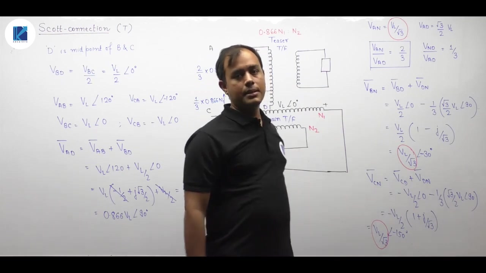

> [!success] Result
> All three phase voltages have identical magnitude $V_L / \sqrt{3}$ and mutual $120^\circ$ separation:
> $$V_{AN} = \frac{V_L}{\sqrt{3}}\angle 90^\circ, \quad V_{BN} = \frac{V_L}{\sqrt{3}}\angle -30^\circ, \quad V_{CN} = \frac{V_L}{\sqrt{3}}\angle -150^\circ$$
> Point N functions as a genuine neutral.

## Primary and Secondary Current Relations and KCL at Line Terminals
_(29:11 - 35:06)_

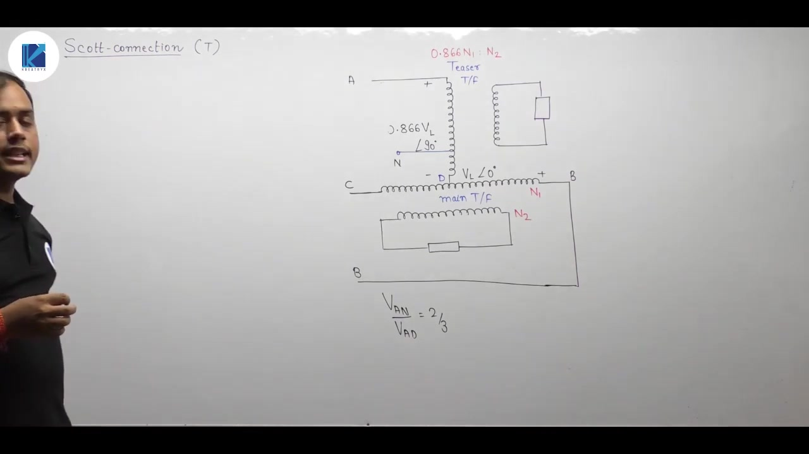

### Referring Secondary Currents to the Primary

Current in a transformer is drawn by the load on the secondary and reflected to the primary.

Let secondary load currents be $I_{2\text{teaser}}$ and $I_{2\text{main}}$. 

For the teaser transformer, the turns ratio is $0.866 N_1 : N_2$. The primary current $I_A$ enters terminal A:
$$I_A = \left(\frac{N_2}{0.866 N_1}\right) I_{2\text{teaser}} = \frac{2}{\sqrt{3}}\left(\frac{N_2}{N_1}\right) I_{2\text{teaser}} \approx 1.155\left(\frac{N_2}{N_1}\right) I_{2\text{teaser}}$$

For the main transformer, the turns ratio is $N_1 : N_2$. The reflected primary mesh current is $I_{BC}$:
$$I_{BC} = \left(\frac{N_2}{N_1}\right) I_{2\text{main}}$$

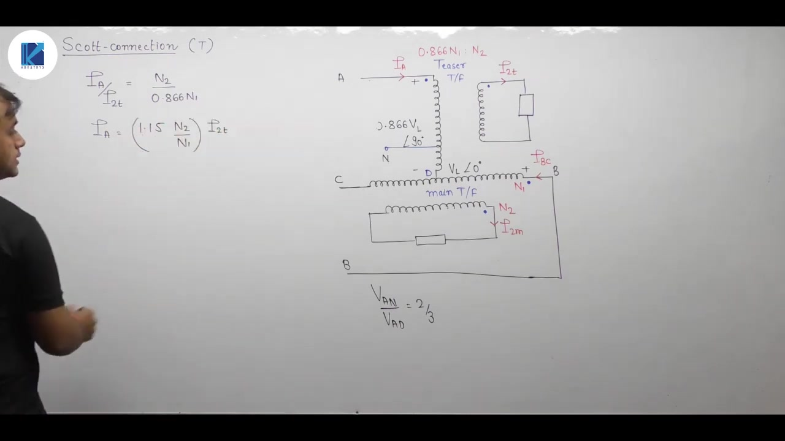

### Division of Teaser Current at Center Tap D

The teaser primary current $I_A$ reaches the center tap D of the main transformer.

At point D, the current $I_A$ splits into two equal halves:
- One half, $I_A / 2$, flows toward terminal B.
- The other half, $I_A / 2$, flows toward terminal C.

These two half-currents flow in opposite directions through the two halves of the main primary winding.

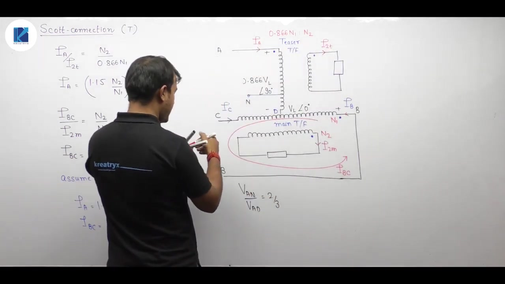

### Kirchhoff's Current Law at Primary Line Terminals

The main primary winding carries two distinct current components:
1. The circulating mesh current $I_{BC}$ balancing the main secondary load.
2. The split teaser currents $I_A / 2$ flowing outward from tap D.

Now apply Kirchhoff's Current Law at primary terminals B and C:

At terminal B, line current $I_B$ enters from the supply:
$$I_B = I_{BC} - \frac{I_A}{2}$$

At terminal C, line current $I_C$ enters from the supply:
$$I_C = -I_{BC} - \frac{I_A}{2}$$

> [!success] Result: Primary Line Currents
> The three primary line currents are related to the secondary loads by:
> $$
> \begin{aligned}
> I_A &= 1.155\left(\frac{N_2}{N_1}\right) I_{2\text{teaser}} \\
> I_B &= I_{BC} - \frac{I_A}{2} \\
> I_C &= -I_{BC} - \frac{I_A}{2}
> \end{aligned}
> $$

## MMF Balancing in the Main Transformer and Loading Overview
_(35:12 - 41:32)_

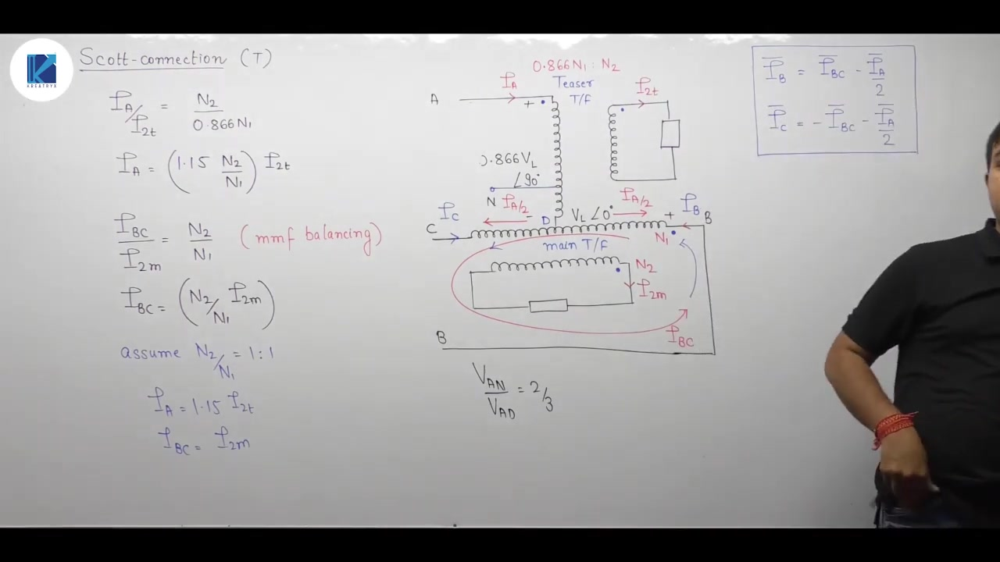

### Why $I_A / 2$ Does Not Affect MMF Balancing

Why does $I_A / 2$ not appear when referring the main secondary load current to the primary?

Recall that current transformation relies strictly on Ampere-turn (MMF) balance:
$$N_1 I_1 = N_2 I_2$$

Current $I_A / 2$ enters the main primary winding at center tap D:
- Current $I_A / 2$ flows from D toward terminal B through $N_1 / 2$ turns.
- Current $I_A / 2$ flows from D toward terminal C through $N_1 / 2$ turns.

These two currents flow in opposite magnetic directions through equal numbers of turns:
$$\text{Net MMF of } \frac{I_A}{2} = \left(\frac{I_A}{2}\right)\left(\frac{N_1}{2}\right) - \left(\frac{I_A}{2}\right)\left(\frac{N_1}{2}\right) = 0$$

Because the net MMF is identically zero, the split current creates zero core flux in the main transformer. It does not couple with the main secondary winding. 

Only the circulating mesh current $I_{BC}$ balances the main secondary load MMF:
$$N_1 I_{BC} = N_2 I_{2\text{main}}$$

> [!info] Definition: MMF Decoupling
> The teaser current $I_A / 2$ produces zero net MMF in the main core. It does not induce any voltage or current in the main secondary winding.

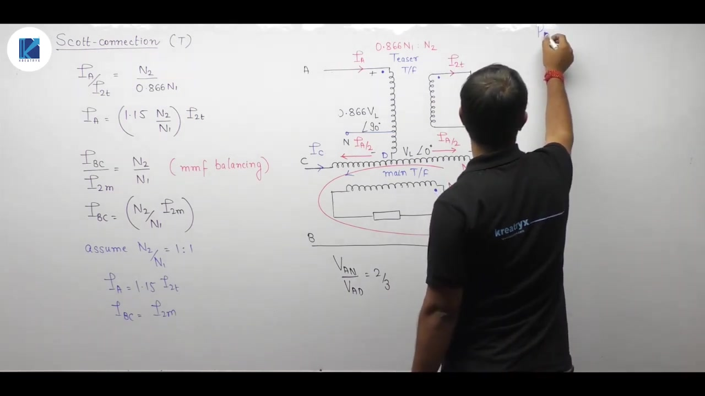

### Summary of Scott Connection Relationships

Before analyzing phasor diagrams under load, review the core governing relationships:

1. **Turns Ratios**:
   - Main transformer: $N_1 : N_2$
   - Teaser transformer: $0.866 N_1 : N_2$
2. **Primary Voltages**:
   - Main primary: $V_{1\text{main}} = V_{BC} = V_L \angle 0^\circ$
   - Teaser primary: $V_{1\text{teaser}} = V_{AD} = 0.866 V_L \angle 90^\circ$
3. **Primary Currents**:
   - Teaser line current: $I_A = 1.155\left(\frac{N_2}{N_1}\right) I_{2\text{teaser}}$
   - Main mesh current: $I_{BC} = \left(\frac{N_2}{N_1}\right) I_{2\text{main}}$
   - Line current B: $I_B = I_{BC} - \frac{I_A}{2}$
   - Line current C: $I_C = -I_{BC} - \frac{I_A}{2}$

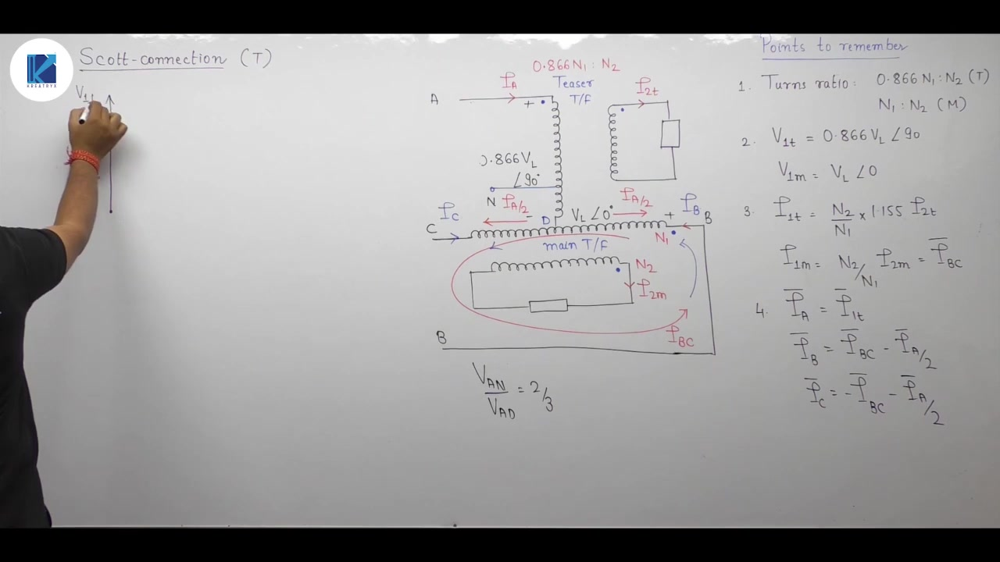

### Introduction to Balanced Resistive Loading

Consider Case 1 with balanced unity power factor (resistive) loading.

Secondary load currents are in phase with their respective secondary voltages:
$$
\begin{aligned}
I_{2\text{teaser}} &= I_2 \angle 90^\circ \\
I_{2\text{main}} &= I_2 \angle 0^\circ
\end{aligned}
$$

Because the load is balanced, both secondary currents have equal magnitude $I_2$.

## Primary Current Balancing under Balanced Resistive Loading
_(41:37 - 46:28)_

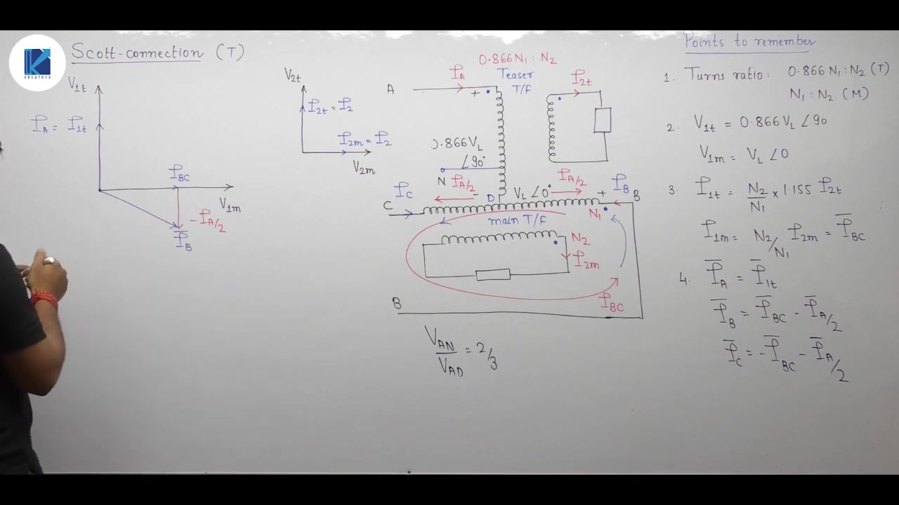

### Evaluation of Primary Line Currents

Assume a balanced resistive load on the secondary side:
$$I_{2\text{teaser}} = I_2 \angle 90^\circ, \quad I_{2\text{main}} = I_2 \angle 0^\circ$$

The primary current of the teaser transformer is $I_A$:
$$I_A = \frac{2}{\sqrt{3}}\left(\frac{N_2}{N_1}\right) I_2 \angle 90^\circ$$

The reflected mesh current of the main transformer is $I_{BC}$:
$$I_{BC} = \left(\frac{N_2}{N_1}\right) I_2 \angle 0^\circ$$

The half-current component $I_A / 2$ is:
$$\frac{I_A}{2} = \frac{1}{\sqrt{3}}\left(\frac{N_2}{N_1}\right) I_2 \angle 90^\circ$$

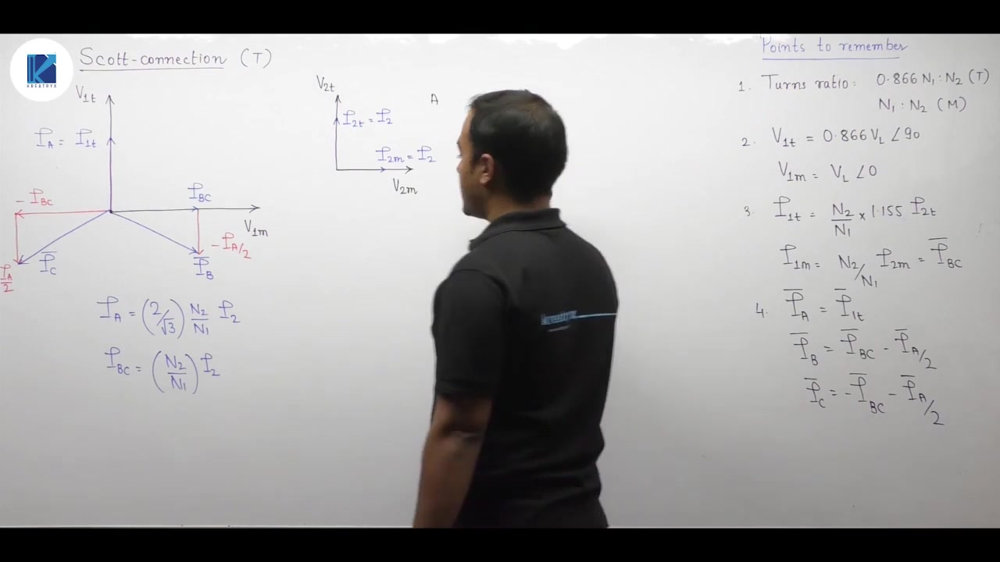

Now evaluate line current $I_B$:
$$
\begin{aligned}
I_B &= I_{BC} - \frac{I_A}{2} \\
&= \left(\frac{N_2}{N_1}\right) I_2 \angle 0^\circ - \frac{1}{\sqrt{3}}\left(\frac{N_2}{N_1}\right) I_2 \angle 90^\circ \\
&= \left(\frac{N_2}{N_1}\right) I_2 \left(1 - j\frac{1}{\sqrt{3}}\right)
\end{aligned}
$$

Calculate the magnitude and phase of $I_B$:
$$
\begin{aligned}
|I_B| &= \left(\frac{N_2}{N_1}\right) I_2 \sqrt{1^2 + \left(-\frac{1}{\sqrt{3}}\right)^2} = \frac{2}{\sqrt{3}}\left(\frac{N_2}{N_1}\right) I_2 \\
\angle I_B &= \tan^{-1}\left(-\frac{1}{\sqrt{3}}\right) = -30^\circ
\end{aligned}
$$

Thus $I_B = \frac{2}{\sqrt{3}}\left(\frac{N_2}{N_1}\right) I_2 \angle -30^\circ$.

Next evaluate line current $I_C$:
$$
\begin{aligned}
I_C &= -I_{BC} - \frac{I_A}{2} \\
&= -\left(\frac{N_2}{N_1}\right) I_2 \angle 0^\circ - \frac{1}{\sqrt{3}}\left(\frac{N_2}{N_1}\right) I_2 \angle 90^\circ \\
&= \left(\frac{N_2}{N_1}\right) I_2 \left(-1 - j\frac{1}{\sqrt{3}}\right)
\end{aligned}
$$

Calculate the magnitude and phase of $I_C$:
$$
\begin{aligned}
|I_C| &= \left(\frac{N_2}{N_1}\right) I_2 \sqrt{(-1)^2 + \left(-\frac{1}{\sqrt{3}}\right)^2} = \frac{2}{\sqrt{3}}\left(\frac{N_2}{N_1}\right) I_2 \\
\angle I_C &= -180^\circ + 30^\circ = -150^\circ
\end{aligned}
$$

Thus $I_C = \frac{2}{\sqrt{3}}\left(\frac{N_2}{N_1}\right) I_2 \angle -150^\circ$.

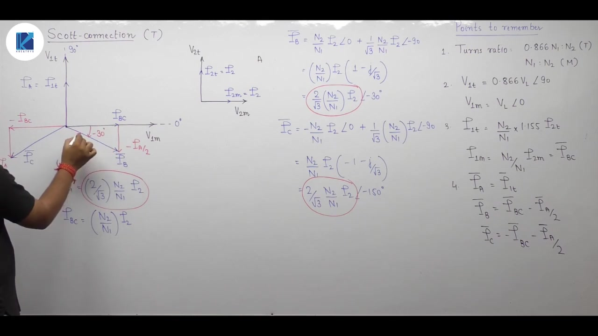

### Proof of Primary System Balancing

Compare the three primary line currents:
$$
\begin{aligned}
I_A &= \frac{2}{\sqrt{3}}\left(\frac{N_2}{N_1}\right) I_2 \angle 90^\circ \\
I_B &= \frac{2}{\sqrt{3}}\left(\frac{N_2}{N_1}\right) I_2 \angle -30^\circ \\
I_C &= \frac{2}{\sqrt{3}}\left(\frac{N_2}{N_1}\right) I_2 \angle -150^\circ
\end{aligned}
$$

All three line currents have identical magnitudes:
$$|I_A| = |I_B| = |I_C| = 1.155\left(\frac{N_2}{N_1}\right) I_2$$

The phase differences between adjacent line currents are:
$$
\begin{aligned}
\angle I_A - \angle I_B &= 90^\circ - (-30^\circ) = 120^\circ \\
\angle I_B - \angle I_C &= -30^\circ - (-150^\circ) = 120^\circ \\
\angle I_C - \angle I_A &= -150^\circ - 90^\circ = -240^\circ \equiv 120^\circ
\end{aligned}
$$

> [!success] Result
> When a balanced two-phase load is connected to the secondary, the Scott connection draws perfectly balanced three-phase currents from the supply.

## Operating Power Factors Under Resistive and Lagging Loads
_(46:34 - 52:07)_

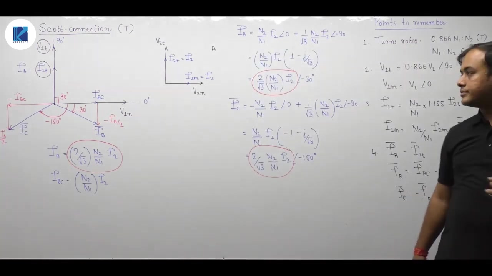

### Operating Power Factors with Unity Power Factor Load

Examine the phase angle between the voltage across each winding section and the current flowing through it.

1. **Teaser Transformer**:
   - Primary voltage is $V_{AD} = 0.866 V_L \angle 90^\circ$.
   - Primary line current is $I_A = I \angle 90^\circ$.
   - The angle between voltage and current is $0^\circ$.
   - The teaser operates at unity power factor ($\text{PF} = 1.0$).

2. **Main Transformer Half BD**:
   - Voltage across section BD is $V_{BD} = \frac{V_L}{2}\angle 0^\circ$.
   - Line current entering terminal B is $I_B = I \angle -30^\circ$.
   - $I_B$ lags $V_{BD}$ by $30^\circ$.
   - Section BD operates at $\cos 30^\circ = 0.866$ lagging power factor.

3. **Main Transformer Half CD**:
   - Voltage across section CD is $V_{CD} = \frac{V_L}{2}\angle 180^\circ$.
   - Line current entering terminal C is $I_C = I \angle -150^\circ$.
   - $I_C$ leads $V_{CD}$ by $30^\circ$ (since $-150^\circ - 180^\circ = -330^\circ \equiv +30^\circ$).
   - Section CD operates at $\cos 30^\circ = 0.866$ leading power factor.

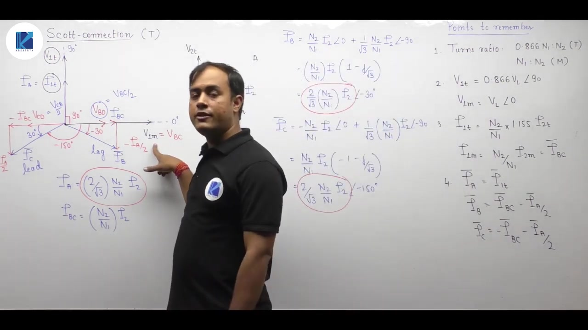

> [!success] Result: UPF Load Power Factors
> With a balanced resistive load on the secondary:
> - Teaser transformer: $\text{PF} = 1.0$ (UPF)
> - Main transformer section BD: $\text{PF} = 0.866$ lagging
> - Main transformer section CD: $\text{PF} = 0.866$ leading

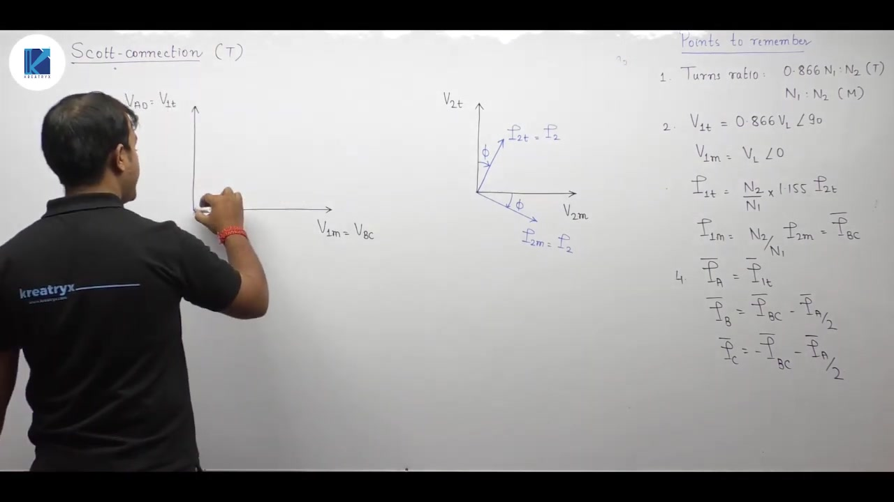

### Phasor Construction for Balanced Lagging Power Factor Load

Now consider a balanced secondary load with a lagging power factor of $\cos \phi$.

Both secondary currents lag their respective secondary voltages by phase angle $\phi$:
$$
\begin{aligned}
I_{2\text{teaser}} &= I_2 \angle(90^\circ - \phi) \\
I_{2\text{main}} &= I_2 \angle(-\phi)
\end{aligned}
$$

Reflected primary currents also lag their respective primary voltages by $\phi$:
$$
\begin{aligned}
I_A &= 1.155\left(\frac{N_2}{N_1}\right) I_2 \angle(90^\circ - \phi) \\
I_{BC} &= \left(\frac{N_2}{N_1}\right) I_2 \angle(-\phi)
\end{aligned}
$$

Line current $I_B$ is computed from $I_{BC} - I_A / 2$. Line current $I_C$ is computed from $-I_{BC} - I_A / 2$.

## Detailed Power Factor Expressions and Unbalanced Loading Analysis
_(52:07 - 57:18)_

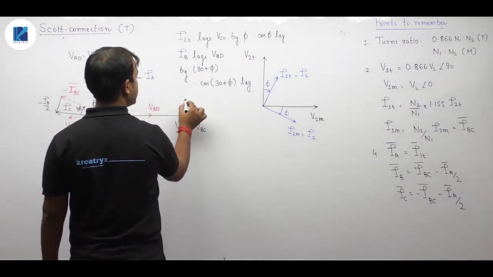

### Power Factors under Balanced Lagging Load ($\cos \phi$)

When the secondary load draws current at a lagging power factor of $\cos \phi$:

1. **Teaser Transformer**:
   - The primary current $I_A$ lags the teaser voltage $V_{AD}$ by exactly $\phi$.
   - The teaser operates at the load power factor:
$$\text{PF}_{\text{teaser}} = \cos \phi \text{ (lagging)}$$

2. **Main Transformer Half BD**:
   - Current $I_B$ lags voltage $V_{BD}$ by the sum of $30^\circ$ and $\phi$.
   - The operating power factor of section BD is:
$$\text{PF}_{BD} = \cos(30^\circ + \phi) \text{ (lagging)}$$

3. **Main Transformer Half CD**:
   - Current $I_C$ leads voltage $V_{CD}$ by $(30^\circ - \phi)$ when $\phi < 30^\circ$.
   - The operating power factor of section CD is:
$$\text{PF}_{CD} = \cos(30^\circ - \phi) \text{ (leading for } \phi < 30^\circ)$$
   - When the load angle exceeds $30^\circ$ ($\phi > 30^\circ$), this power factor becomes lagging: $\cos(\phi - 30^\circ)$.

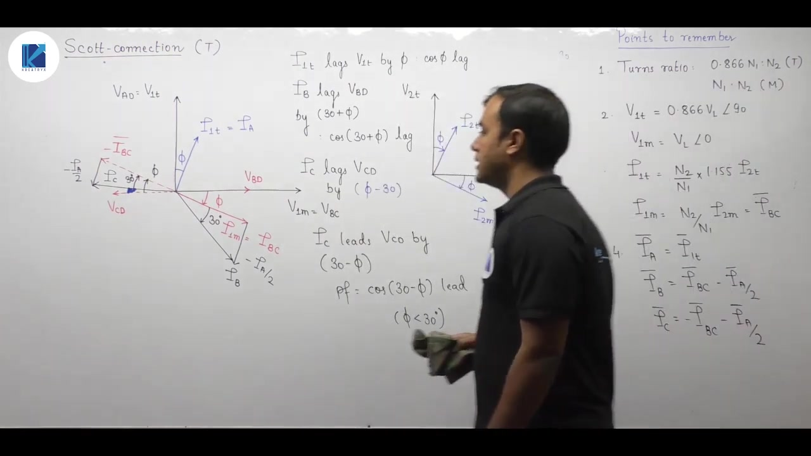

> [!info] Comparison with Open-Delta
> These power factor formulas match the two transformers in an open-delta ($V\text{-}V$) bank:
> $$\cos(30^\circ + \phi) \quad \text{and} \quad \cos(30^\circ - \phi)$$
> In Scott connection, these expressions apply to the two halves of the single main primary winding.

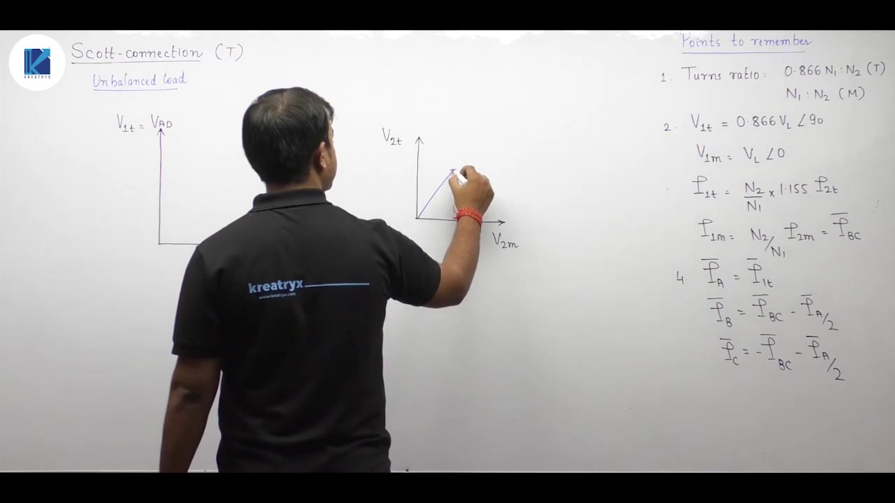

### Procedure for Unbalanced Load Calculations

In industrial practice, two-phase loads are often unequal in magnitude and power factor.

Let the secondary loads draw:
$$
\begin{aligned}
I_{2\text{teaser}} &= I_{2\text{T}} \angle(90^\circ - \phi_1) \\
I_{2\text{main}} &= I_{2\text{M}} \angle(-\phi_2)
\end{aligned}
$$

Follow this systematic procedure to calculate three-phase primary currents:
1. Refer the teaser secondary current to terminal A:
$$I_A = \left(\frac{N_2}{0.866 N_1}\right) I_{2\text{teaser}}$$
2. Refer the main secondary current to find mesh current $I_{BC}$:
$$I_{BC} = \left(\frac{N_2}{N_1}\right) I_{2\text{main}}$$
3. Compute the remaining line currents algebraically:
$$
\begin{aligned}
I_B &= I_{BC} - \frac{I_A}{2} \\
I_C &= -I_{BC} - \frac{I_A}{2}
\end{aligned}
$$

Under unbalanced loading, primary line currents $I_A, I_B, I_C$ become unequal in magnitude and phase.

## Primary and Secondary VA Ratings of Scott-Connected Transformers
_(57:21 - 62:44)_

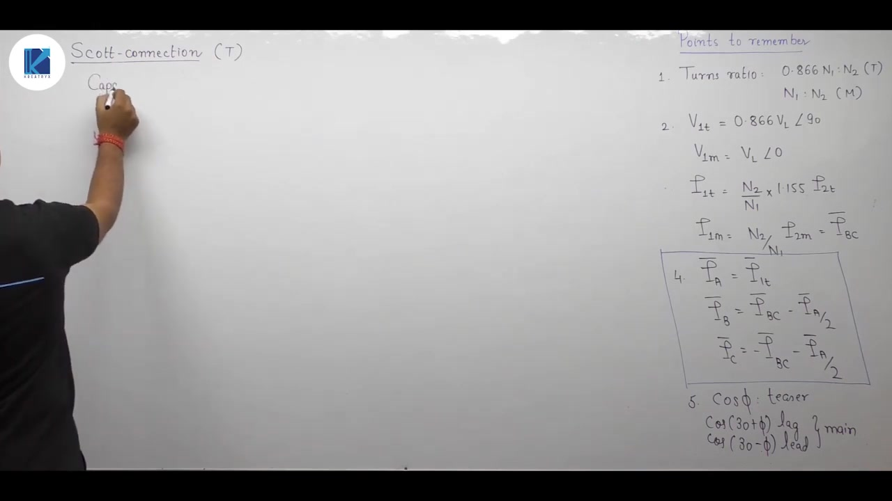

### Secondary Volt-Ampere Ratings

Consider a balanced two-phase load connected to the secondary side.

Both transformers have identical secondary windings with $N_2$ turns:
- Secondary voltage rating is $V_2$.
- Secondary current rating is $I_2$.

The secondary VA rating of each individual transformer is:
$$S_{2\text{teaser}} = S_{2\text{main}} = V_2 I_2$$

The total delivered secondary volt-amperes is:
$$S_{2\text{total}} = 2 V_2 I_2$$

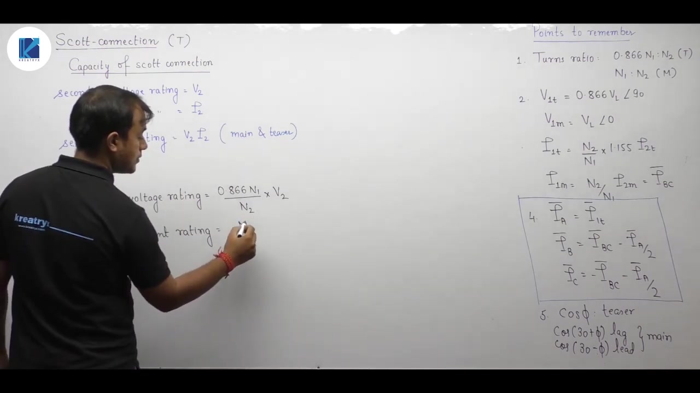

### Teaser Primary VA Rating

For the teaser transformer, the primary turns are $0.866 N_1$:
- Primary voltage rating:
$$V_{1\text{teaser}} = \left(\frac{0.866 N_1}{N_2}\right) V_2$$
- Primary current rating:
$$I_{1\text{teaser}} = \left(\frac{N_2}{0.866 N_1}\right) I_2$$

Compute the primary VA rating of the teaser:
$$S_{1\text{teaser}} = V_{1\text{teaser}} \cdot I_{1\text{teaser}} = \left[\left(\frac{0.866 N_1}{N_2}\right) V_2\right] \left[\left(\frac{N_2}{0.866 N_1}\right) I_2\right] = V_2 I_2$$

The teaser primary VA rating equals its secondary VA rating.

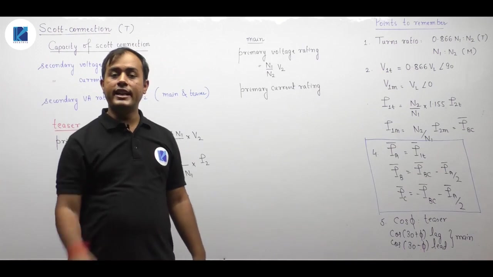

### Main Transformer Primary Voltage and Current Ratings

For the main transformer, the primary turns are $N_1$:
- Primary voltage rating:
$$V_{1\text{main}} = \left(\frac{N_1}{N_2}\right) V_2$$

How do we determine the main primary current rating? 

The winding does not carry only the reflected mesh current $I_{BC}$. It carries the line currents $I_B$ and $I_C$, which combine $I_{BC}$ and $I_A / 2$.

Under balanced loading, both line currents have magnitude:
$$|I_B| = |I_C| = \frac{2}{\sqrt{3}}\left(\frac{N_2}{N_1}\right) I_2 \approx 1.155\left(\frac{N_2}{N_1}\right) I_2$$

The primary winding must be rated for this actual line current:
$$I_{1\text{main, rated}} = 1.155\left(\frac{N_2}{N_1}\right) I_2$$

The primary winding must withstand higher current than the secondary implies.

## Capacity and Transformer Utilization Factor for Standard Scott Connection
_(62:44 - 67:44)_

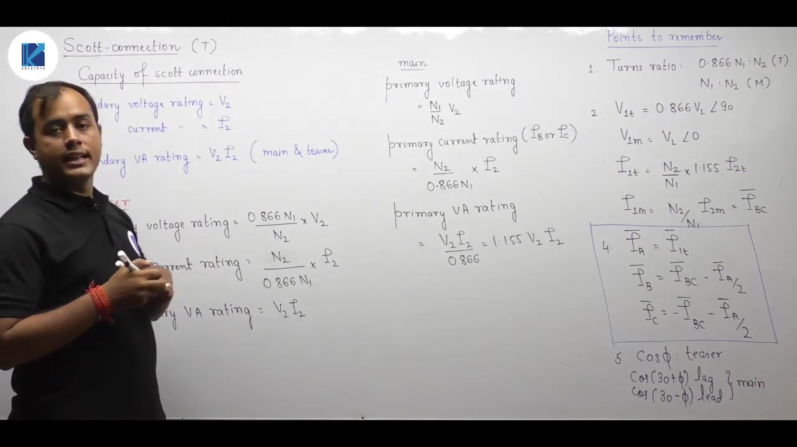

### Primary VA Rating of the Main Transformer

Multiply the primary voltage rating by the required primary current rating:
$$
\begin{aligned}
S_{1\text{main}} &= V_{1\text{main}} \cdot I_{1\text{main, rated}} \\
&= \left[\left(\frac{N_1}{N_2}\right) V_2\right] \left[\frac{2}{\sqrt{3}}\left(\frac{N_2}{N_1}\right) I_2\right] \\
&= \frac{2}{\sqrt{3}} V_2 I_2 \approx 1.155 V_2 I_2
\end{aligned}
$$

The secondary rating of the main transformer is $V_2 I_2$. The primary rating is $1.155 V_2 I_2$.

The apparent power transmitted through the core is identical on both sides. But the required thermal rating of the primary winding is $15.5\%$ higher than the secondary.

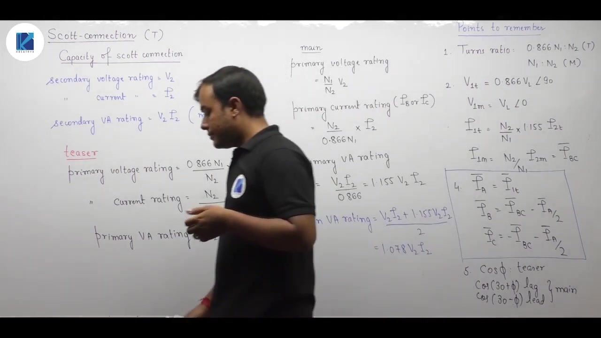

### Average VA Rating of the Main Transformer

When primary and secondary winding ratings differ, the transformer rating is the arithmetic average:
$$
\begin{aligned}
S_{\text{main, rated}} &= \frac{S_{1\text{main}} + S_{2\text{main}}}{2} \\
&= \frac{1.155 V_2 I_2 + V_2 I_2}{2} \\
&= 1.0775 V_2 I_2 \approx 1.078 V_2 I_2
\end{aligned}
$$

The teaser transformer has matching ratings on primary and secondary:
$$S_{\text{teaser, rated}} = V_2 I_2$$

The total equipment rating of the Scott connection bank is:
$$S_{\text{total, rated}} = S_{\text{teaser, rated}} + S_{\text{main, rated}} = V_2 I_2 + 1.078 V_2 I_2 = 2.078 V_2 I_2$$

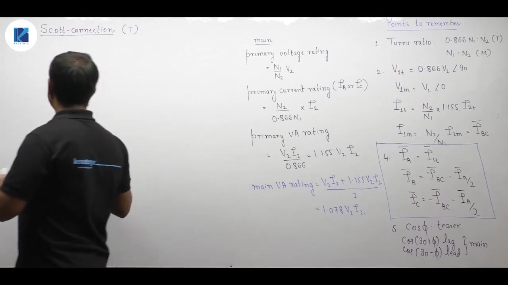

### Transformer Utilization Factor (TUF)

The transformer utilization factor measures how effectively the installed capacity is used:
$$\text{TUF} = \frac{\text{Delivered (Used) VA}}{\text{Total Rated VA}}$$

The delivered two-phase power under balanced load is:
$$\text{Delivered VA} = 2 V_2 I_2$$

Substitute the total equipment rating:
$$\text{TUF} = \frac{2 V_2 I_2}{2.078 V_2 I_2} = \frac{2}{2.078} \approx 0.9625$$

Expressing this as a percentage:
$$\text{TUF} = 96.25\%$$

> [!success] Result: Standard Scott Connection TUF
> When the teaser transformer primary is custom wound with $0.866 N_1$ turns, the transformer utilization factor is:
> $$\text{TUF} = 96.25\%$$

## Identical Transformer TUF and Exam Summary for Scott Connection
_(67:47 - 72:51)_

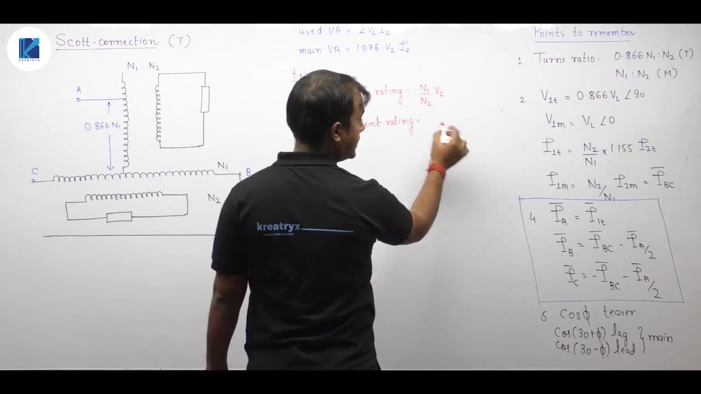

### Operation with Identical Interchangeable Transformers

In practice, utilities often use two identical single-phase transformers for interchangeability. Both transformers have $N_1$ primary turns and $N_2$ secondary turns.

The teaser primary is tapped at $86.6\%$ turns ($0.866 N_1$). The remaining $13.4\%$ turns are idle.

How does this affect the teaser transformer ratings?
1. **Primary Voltage Rating**: Full $N_1$ turns are present across the core. The winding can withstand:
$$V_{1\text{teaser, rated}} = \left(\frac{N_1}{N_2}\right) V_2$$
2. **Primary Current Rating**: Only the active $0.866 N_1$ turns carry current. By MMF balance, the current rating remains:
$$I_{1\text{teaser, rated}} = \frac{2}{\sqrt{3}}\left(\frac{N_2}{N_1}\right) I_2 = 1.155\left(\frac{N_2}{N_1}\right) I_2$$
3. **Primary VA Rating**:
$$S_{1\text{teaser}} = V_{1\text{teaser, rated}} \cdot I_{1\text{teaser, rated}} = 1.155 V_2 I_2$$

Because primary and secondary ratings differ ($1.155 V_2 I_2$ vs $V_2 I_2$), take their average:
$$S_{\text{teaser, rated}} = \frac{1.155 V_2 I_2 + V_2 I_2}{2} = 1.078 V_2 I_2$$

Both the main and teaser transformers are now rated for $1.078 V_2 I_2$.

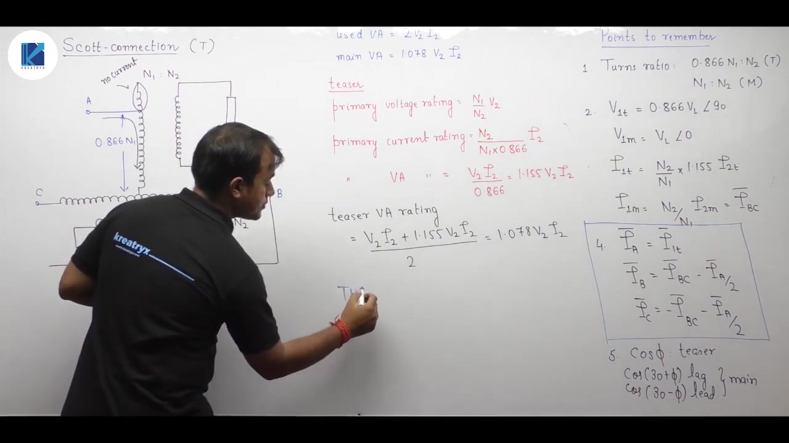

### Transformer Utilization Factor with Identical Units

Compute the TUF for the identical transformer configuration:
$$\text{Total Rated VA} = 2 \times 1.078 V_2 I_2 = 2.156 V_2 I_2$$

The delivered power remains $2 V_2 I_2$:
$$\text{TUF} = \frac{2 V_2 I_2}{2.156 V_2 I_2} = \frac{2}{2.156} \approx 0.928 = 92.8\%$$

> [!success] Result: TUF Comparison
> - Custom-wound teaser ($0.866 N_1$ turns): $\text{TUF} = 96.25\%$
> - Identical transformers ($N_1$ turns with $86.6\%$ tap): $\text{TUF} = 92.8\%$

The industry standard rating is $96.25\%$.

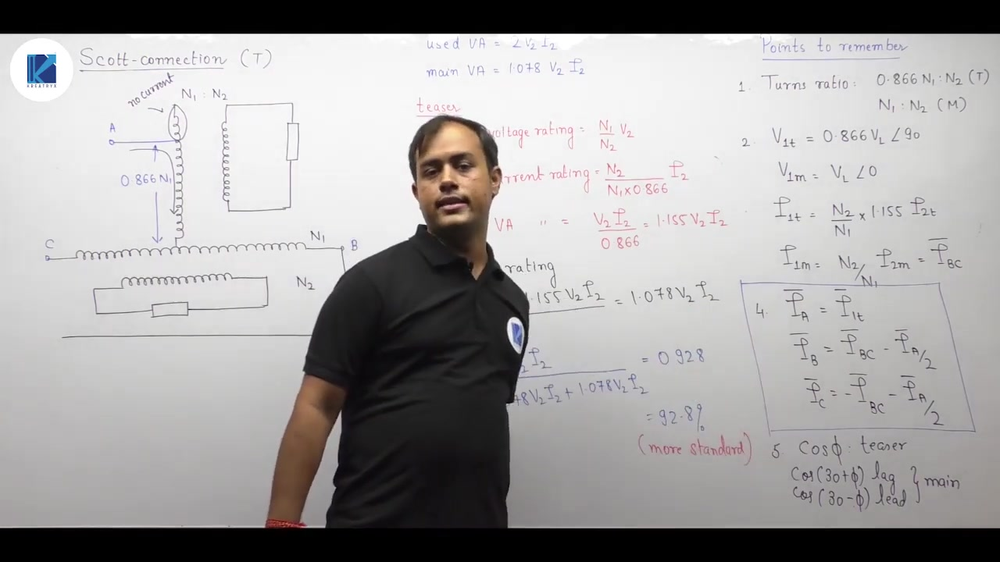

### Summary of Exam Focus Points

For competitive exams like GATE and ESE, remember these core facts:
1. **Primary Voltages**: Main primary receives $V_L \angle 0^\circ$. Teaser primary receives $0.866 V_L \angle 90^\circ$.
2. **Turns Ratios**: Main is $N_1 : N_2$. Teaser is $0.866 N_1 : N_2$.
3. **Neutral Point**: Located on the teaser primary at two-thirds turns ($0.577 N_1$) from top terminal A.
4. **Current Relations**: Under balanced load, primary line currents are balanced with magnitude $1.155 (N_2 / N_1) I_2$.
5. **Operating Power Factors**: Teaser operates at the load power factor $\cos \phi$. Main transformer halves operate at $\cos(30^\circ + \phi)$ and $\cos(30^\circ - \phi)$.
6. **Utilization**: $\text{TUF} = 96.25\%$ for custom teaser, and $92.8\%$ for identical transformers.

---

## Summary and Key Takeaways

- A balanced two-phase system requires two voltages of equal magnitude displaced by $90^\circ$, which cannot be obtained by directly tapping two phases of a three-phase line.
- The Scott connection main transformer connects across lines B and C, while the teaser transformer connects between line A and the main center tap D.
- The teaser primary voltage is $V_{AD} = 0.866 V_L \angle 90^\circ$, which leads the main primary voltage $V_{BC} = V_L \angle 0^\circ$ by $90^\circ$.
- To obtain equal secondary voltages $V_2$, the teaser primary must have $0.866 N_1$ turns when the main primary has $N_1$ turns.
- The primary neutral tap N is located on the teaser primary at two-thirds turns ($0.577 N_1$) from the top terminal A.
- The teaser current $I_A$ splits equally at center tap D, producing equal and opposite currents in the two halves of the main primary that cancel in net MMF.
- Under balanced secondary loading, the primary draws balanced three-phase line currents of magnitude $1.155 (N_2 / N_1) I_2$.
- For a secondary load of power factor $\cos \phi$, the teaser operates at $\cos \phi$, while the main winding halves operate at $\cos(30^\circ + \phi)$ and $\cos(30^\circ - \phi)$.
- The transformer utilization factor is $96.25\%$ with a custom teaser winding, and $92.8\%$ when using two identical transformers.

