[← Lec 045: Three Phase Transformer 7](Lecture_045_Three_Phase_Transformer_7.md) | [🏠 Index](00_yt_study_guide.md) | [Lec 047: Parallel Operation of Transformers →](Lecture_047_Parallel_Operation_of_Transformers.md)

---

# Problems Based on Three Phase Transformers - 3 | L 15 | Electrical Machines | GATE 2022

- **Source**: https://www.youtube.com/watch?v=OCxomfN3YHE
- **Duration**: 01:06:24
- **Compiled**: 2026-09-21

---

## Overview

This lecture solves advanced problems on open-delta and Scott transformer configurations. The discussion begins with load sharing, power factor variation, and rating requirements in open-delta banks. It then analyzes the thermal derating, loss escalation, and efficiency drop when a delta-delta bank transitions to open-delta. The second half examines current transformations, neutral tapping locations, and primary line current unbalance in Scott connections supplying two-phase furnace loads.

## Contents

- [[#Introduction and Problem Session Scope|Introduction and Problem Session Scope]]
- [[#Open-Delta Transformer Rating and Turns Ratio|Open-Delta Transformer Rating and Turns Ratio]]
- [[#Line Currents and Transformer Operating Power Factors|Line Currents and Transformer Operating Power Factors]]
- [[#Real Power Distribution and Delta-Delta Transition|Real Power Distribution and Delta-Delta Transition]]
- [[#Delta-Delta Losses and Current Scaling in Open-Delta|Delta-Delta Losses and Current Scaling in Open-Delta]]
- [[#Open-Delta Losses, Efficiency Decrease, and Capacity Derating|Open-Delta Losses, Efficiency Decrease, and Capacity Derating]]
- [[#Overloading and Capacity Analysis of V-V Bank|Overloading and Capacity Analysis of V-V Bank]]
- [[#Unbalanced Current Distribution in Delta-Delta and Star-Delta|Unbalanced Current Distribution in Delta-Delta and Star-Delta]]
- [[#Current Distribution in V-V Bank and Scott Connection Configuration|Current Distribution in V-V Bank and Scott Connection Configuration]]
- [[#Turns Ratio, Neutral Tapping, and Furnace Load Setup|Turns Ratio, Neutral Tapping, and Furnace Load Setup]]
- [[#Primary Line Currents with Unbalanced Furnace Loads|Primary Line Currents with Unbalanced Furnace Loads]]
- [[#Scott Connection with Unequal Furnace Loads: Current Transformation|Scott Connection with Unequal Furnace Loads: Current Transformation]]
- [[#Line Current Resolution and Lecture Summary|Line Current Resolution and Lecture Summary]]

---

## Introduction and Problem Session Scope
_(00:07 - 05:22)_

### Overview of Problem Session
This lecture marks the third and concluding problem session dedicated to three-phase transformers. The focus is specifically on two practical transformer configurations:
- Open-delta (V-V) connections
- Scott (T-T) connections

Both configurations appear frequently in competitive examinations like GATE, ESE, and public sector tests. Mastering numerical applications solidifies the theoretical foundations developed in earlier lectures.

### Scope and Objectives
The problems covered in this session address several operational aspects of non-standard transformer connections:
- Determining the loading and power factor of individual transformers in an open-delta bank.
- Evaluating the reduction in capacity and efficiency when one unit of a delta-delta bank is removed.
- Analyzing current distributions under unbalanced single-phase loads.
- Calculating turns ratios and primary line currents in Scott connections supplying two-phase furnace loads.

Solving these problems requires a clear grasp of phasor relationships and per-phase power calculations.

## Open-Delta Transformer Rating and Turns Ratio
_(05:22 - 10:30)_

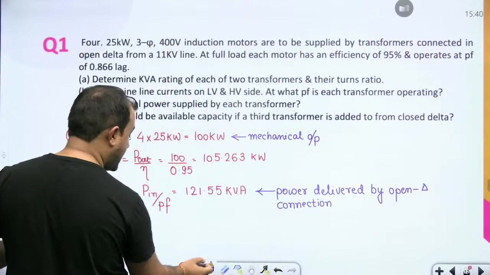

### Problem Statement

> [!example] Problem 1 (Part A)
> Four 25 kW, three-phase, 400 V induction motors are supplied by transformers connected in open delta from an 11 kV line. At full load, each motor has an efficiency of 95% and operates at 0.866 lagging power factor.
> Determine the kVA rating of each of the two transformers and their turns ratio.

### Step-by-Step Derivation

#### Mechanical and Electrical Power Demand
First, calculate the total mechanical power developed by the four induction motors:
$$
P_{\text{mech}} = 4 \times 25\text{ kW} = 100\text{ kW}
$$

The electrical active power input to the motors equals the output power delivered by the transformer bank:
$$
P_{in} = \frac{P_{\text{mech}}}{\eta} = \frac{100\text{ kW}}{0.95} \approx 105.263\text{ kW}
$$

Next, determine the total three-phase apparent power required at the motor terminals:
$$
S_{in} = \frac{P_{in}}{\cos\phi} = \frac{105.263\text{ kW}}{0.866} \approx 121.55\text{ kVA}
$$

#### Rating of Each Transformer in Open-Delta
The total apparent power supplied by an open-delta (V-V) bank relates to single-phase ratings by:
$$
S_{VV} = \sqrt{3} V_{ph} I_{ph}
$$

Here the product $V_{ph} I_{ph}$ represents the volt-ampere rating of one single-phase transformer:
$$
S_{\text{1-ph}} = V_{ph} I_{ph} = \frac{S_{VV}}{\sqrt{3}} = \frac{121.55\text{ kVA}}{\sqrt{3}} \approx 70.177\text{ kVA}
$$

Each single-phase transformer in the open-delta bank must be rated for at least 70.18 kVA.

#### Turns Ratio Calculation
In an open-delta bank, the phase voltage on each side equals the corresponding line voltage:
$$
V_{ph,1} = V_{L,1} = 11000\text{ V}, \quad V_{ph,2} = V_{L,2} = 400\text{ V}
$$

The factor $\sqrt{3}$ is not needed because both sides operate in delta geometry. The turns ratio of each transformer is therefore:
$$
a = \frac{N_1}{N_2} = \frac{V_{ph,1}}{V_{ph,2}} = \frac{11000}{400} = 27.5
$$

> [!success] Result
> The required rating of each transformer is $70.18\text{ kVA}$. The turns ratio is $27.5:1$.

## Line Currents and Transformer Operating Power Factors
_(10:30 - 15:06)_

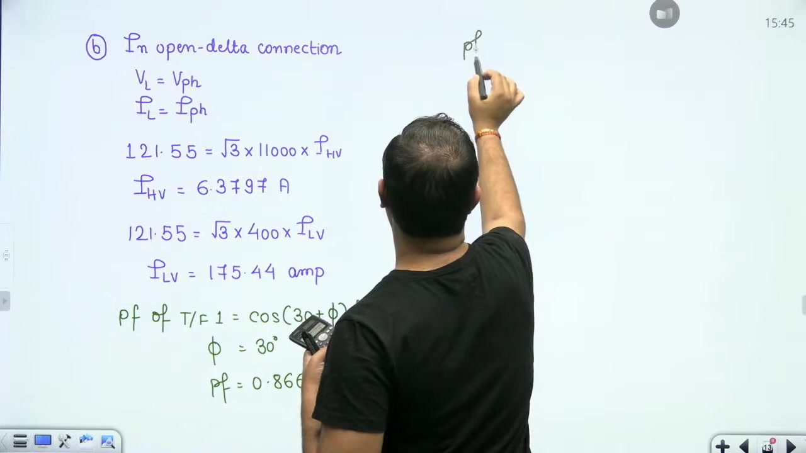

### Problem Statement

> [!example] Problem 1 (Part B)
> For the open-delta bank supplying the four induction motors:
> 1. Determine the line currents on both the LV and HV sides.
> 2. Determine the power factor at which each transformer operates.

### Line Current Calculations

In an open-delta bank, line current equals phase current:
$$
I_L = I_{ph}
$$

The total apparent power supplied to the load is $S = 121.55\text{ kVA}$. The line current on the HV side ($11\text{ kV}$) is:
$$
I_{HV} = \frac{S}{\sqrt{3} V_{L,HV}} = \frac{121.55 \times 10^3}{\sqrt{3} \times 11000} \approx 6.38\text{ A}
$$

Similarly, calculate the line current on the LV side ($400\text{ V}$):
$$
I_{LV} = \frac{S}{\sqrt{3} V_{L,LV}} = \frac{121.55 \times 10^3}{\sqrt{3} \times 400} \approx 175.44\text{ A}
$$

Notice that the ratio of line currents matches the turns ratio:
$$
\frac{I_{LV}}{I_{HV}} = \frac{175.44}{6.38} \approx 27.5
$$

### Operating Power Factors of the Transformers

Even when the three-phase load is balanced, the two transformers in an open-delta bank operate at different power factors. Let the load power factor angle be $\phi$. Here $\cos\phi = 0.866$, which gives $\phi = 30^\circ$.

The power factors of the two units are:
$$
\text{pf}_1 = \cos(30^\circ + \phi)
$$
$$
\text{pf}_2 = \cos(30^\circ - \phi)
$$

Substitute $\phi = 30^\circ$ into both formulas:
$$
\text{pf}_1 = \cos(30^\circ + 30^\circ) = \cos(60^\circ) = 0.5\text{ lagging}
$$
$$
\text{pf}_2 = \cos(30^\circ - 30^\circ) = \cos(0^\circ) = 1.0\text{ (unity power factor)}
$$

Transformer 1 operates at a low lagging power factor of 0.5. In contrast, transformer 2 operates at unity power factor.

> [!success] Result
> The line currents are $I_{HV} = 6.38\text{ A}$ and $I_{LV} = 175.44\text{ A}$. The transformers operate at power factors of $0.5\text{ lagging}$ and $1.0\text{ (UPF)}$.

## Real Power Distribution and Delta-Delta Transition
_(15:10 - 20:08)_

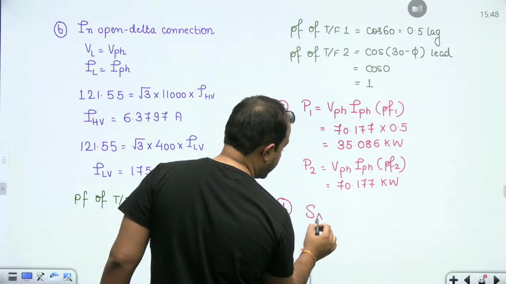

### Real Power Supplied by Each Transformer

In the open-delta bank, each transformer supplies real power depending on its operating power factor:
$$
P_1 = V_{ph} I_{ph} \cos(\phi_1) = 70.177 \times 0.5 \approx 35.088\text{ kW}
$$
$$
P_2 = V_{ph} I_{ph} \cos(\phi_2) = 70.177 \times 1.0 \approx 70.177\text{ kW}
$$

Now sum the real power supplied by both transformers:
$$
P_{\text{total}} = P_1 + P_2 = 35.088 + 70.177 = 105.265\text{ kW}
$$

This matches the electrical input power $P_{in} = 105.263\text{ kW}$ calculated earlier.

### Capacity When Restoring Delta-Delta Connection

If a third identical single-phase transformer is added, the bank becomes a complete delta-delta configuration. The available apparent power capacity becomes:
$$
S_{\Delta\Delta} = 3 V_{ph} I_{ph} = 3 \times 70.177\text{ kVA} \approx 210.53\text{ kVA}
$$

Notice the difference between open-delta and closed delta. In open-delta, two transformers supply $\sqrt{3} V_{ph} I_{ph}$, not $2 V_{ph} I_{ph}$. In delta-delta, three transformers supply $3 V_{ph} I_{ph}$. Adding one transformer increases bank capacity by $\sqrt{3}$ times or 73.2%.

### Problem 2: Loss and Efficiency Impact of Unit Removal

> [!example] Problem 2
> Three identical single-phase transformers connected in delta-delta supply a balanced three-phase load. One transformer is removed from service. The total load kVA remains unchanged.
> For each transformer, core loss is 0.01 pu and ohmic loss is 0.02 pu at rated voltage and current.
> Determine:
> 1. The percentage increase in total losses.
> 2. The decrease in operating efficiency.

### Initial Conditions in Delta-Delta

In the initial delta-delta connection, the load is shared equally among three identical units. Let the rated load of the bank be 3 pu. Then each transformer carries 1 pu load current.

## Delta-Delta Losses and Current Scaling in Open-Delta
_(20:08 - 24:46)_

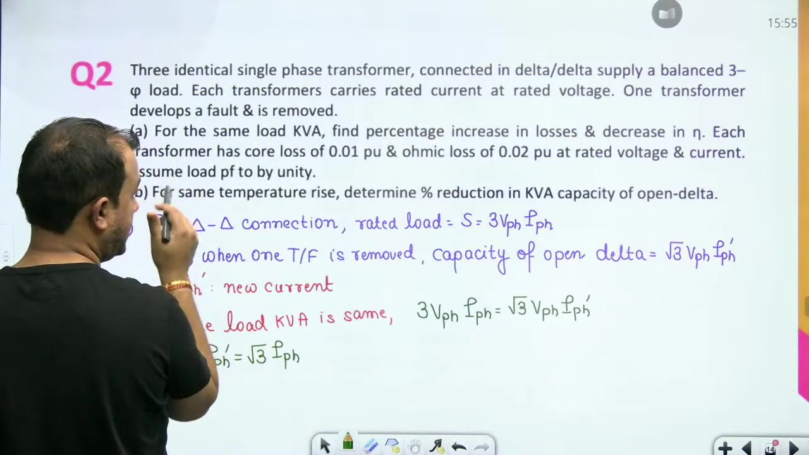

### Current Scaling in Open-Delta

Consider a three-phase load supplied by three identical single-phase transformers in delta-delta. Let the rated load be:
$$
S_{\text{load}} = 3 V_{ph} I_{ph}
$$

Assume each transformer is rated at 1 pu volt-amperes. The initial delta-delta capacity is 3 pu.

Now one transformer is removed from service. The remaining two units form an open-delta bank. The bank must continue supplying the exact same load kVA. In open-delta, the total load delivered is:
$$
S_{\text{load}} = \sqrt{3} V_{ph} I_{ph}'
$$

Here $I_{ph}'$ denotes the new phase current in each remaining transformer. Equate both load expressions:
$$
3 V_{ph} I_{ph} = \sqrt{3} V_{ph} I_{ph}' \implies I_{ph}' = \sqrt{3} I_{ph}
$$

To supply the unchanged load, each remaining transformer must carry $\sqrt{3}$ times its original current. This represents a 73.2% current overload.

### Losses and Efficiency in Delta-Delta

Next, evaluate the baseline losses in the original delta-delta bank. Each transformer has rated losses:
$$
P_{\text{core}} = 0.01\text{ pu}, \quad P_{Cu} = 0.02\text{ pu}
$$

Across the three operating transformers, the total core and copper losses are:
$$
P_{\text{loss},\Delta\Delta} = 3 P_{\text{core}} + 3 P_{Cu} = 3(0.01) + 3(0.02) = 0.09\text{ pu}
$$

Calculate the operating efficiency of the delta-delta bank at rated load (3 pu) and unity power factor:
$$
\eta_{\Delta\Delta} = \frac{S_{\text{load}}}{S_{\text{load}} + P_{\text{loss},\Delta\Delta}} = \frac{3}{3 + 0.09} = \frac{100}{103} \approx 97.087\%
$$

This provides the reference benchmark for the open-delta comparison.

## Open-Delta Losses, Efficiency Decrease, and Capacity Derating
_(24:48 - 29:36)_

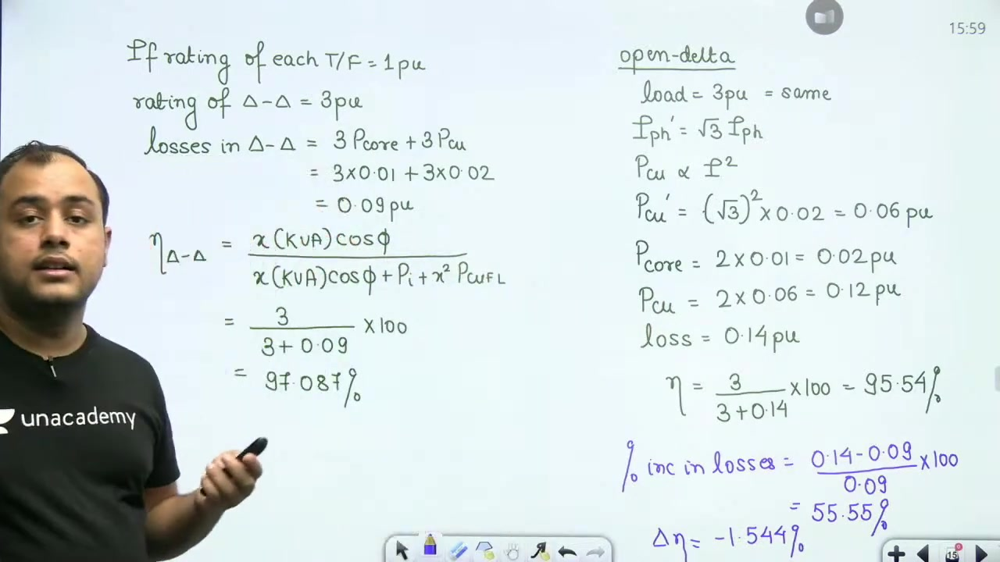

### Open-Delta Losses and Efficiency

Now evaluate losses in the open-delta bank under the unchanged 3 pu load. The phase current increases by a factor of $\sqrt{3}$. Copper loss is proportional to the square of current:
$$
P_{Cu}' = (\sqrt{3})^2 P_{Cu} = 3 \times 0.02 = 0.06\text{ pu per transformer}
$$

Only two transformers remain in service. The core loss of the two units is:
$$
P_{\text{core},VV} = 2 \times 0.01 = 0.02\text{ pu}
$$

The copper loss across both units is:
$$
P_{Cu,VV} = 2 \times 0.06 = 0.12\text{ pu}
$$

Adding these components yields the total open-delta loss:
$$
P_{\text{loss},VV} = P_{\text{core},VV} + P_{Cu,VV} = 0.02 + 0.12 = 0.14\text{ pu}
$$

The percentage increase in total losses is:
$$
\%\Delta P_{\text{loss}} = \frac{P_{\text{loss},VV} - P_{\text{loss},\Delta\Delta}}{P_{\text{loss},\Delta\Delta}} \times 100\% = \frac{0.14 - 0.09}{0.09} \times 100\% \approx 55.55\%
$$

Next, calculate the efficiency of the open-delta bank:
$$
\eta_{VV} = \frac{3}{3 + 0.14} = \frac{3}{3.14} \approx 95.54\%
$$

The absolute decrease in operating efficiency is:
$$
\Delta\eta = \eta_{\Delta\Delta} - \eta_{VV} = 97.087\% - 95.54\% \approx 1.54\%
$$

### Derating for the Same Temperature Rise

> [!info] Constant Temperature Rise Criterion
> In transformer operation, temperature rise is primarily governed by $I^2 R$ copper losses. Therefore, the phrase "for the same temperature rise" means that the winding currents must not exceed rated values.

Under this constraint, the phase current in open-delta cannot increase. It remains at rated $I_{ph}$. The capacity of the open-delta bank is then:
$$
S_{VV} = \sqrt{3} V_{ph} I_{ph} = \frac{3 V_{ph} I_{ph}}{\sqrt{3}} = \frac{S_{\Delta\Delta}}{\sqrt{3}} \approx 0.577 S_{\Delta\Delta}
$$

The percentage reduction in available capacity is:
$$
\%\text{ Reduction} = (1 - 0.577) \times 100\% = 42.3\%
$$

> [!success] Result
> Supplying the same load increases losses by $55.55\%$ and drops efficiency by $1.54\%$. To operate at the same temperature rise, bank capacity must be reduced by $42.3\%$.

## Overloading and Capacity Analysis of V-V Bank
_(29:41 - 34:59)_

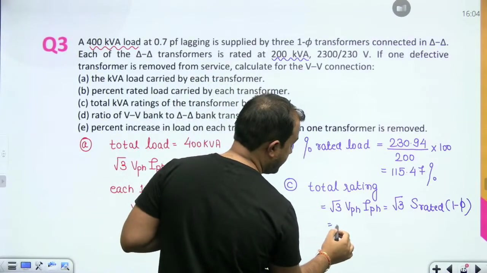

### Problem Statement

> [!example] Problem 3
> A 400 kVA load at 0.7 lagging power factor is supplied by three single-phase transformers connected in delta-delta. Each transformer is rated at 200 kVA, 2300/230 V.
> If one transformer is removed from service, calculate for the resulting V-V connection:
> 1. The kVA load carried by each transformer.
> 2. The percentage of rated load carried by each transformer.
> 3. The total safe kVA rating of the V-V bank.
> 4. The ratio of V-V bank rating to delta-delta bank rating.
> 5. The percentage increase in load carried by each transformer.

### Step-by-Step Solution

#### Load Carried by Each Transformer
The total load apparent power is $S_{\text{load}} = 400\text{ kVA}$. In open delta, the bank delivers:
$$
S_{\text{load}} = \sqrt{3} V_{ph} I_{ph}
$$

The volt-amperes carried by each individual transformer equal $V_{ph} I_{ph}$:
$$
S_{\text{each}} = \frac{S_{\text{load}}}{\sqrt{3}} = \frac{400\text{ kVA}}{\sqrt{3}} \approx 230.94\text{ kVA}
$$

#### Percentage of Rated Load
Each transformer has a rated nameplate capacity of 200 kVA. Determine the operating load percentage:
$$
\%\text{ Rated load} = \frac{S_{\text{each}}}{S_{\text{rated, 1-ph}}} \times 100\% = \frac{230.94}{200} \times 100\% \approx 115.47\%
$$

Each transformer operates at 115.47% of its rated capacity. This means both transformers are overloaded by 15.47%.

#### Total Safe Rating of the V-V Bank
Distinguish clearly between actual load and safe rating. The safe continuous capacity of the open-delta bank is:
$$
S_{\text{rated},VV} = \sqrt{3} S_{\text{rated, 1-ph}} = \sqrt{3} \times 200\text{ kVA} \approx 346.41\text{ kVA}
$$

Because the actual load is 400 kVA, the bank exceeds its safe continuous rating.

#### Ratio of Bank Ratings
Compare the rating of the two-transformer V-V bank to the three-transformer delta-delta bank:
$$
\frac{S_{\text{rated},VV}}{S_{\text{rated},\Delta\Delta}} = \frac{\sqrt{3} \times 200}{3 \times 200} = \frac{1}{\sqrt{3}} \approx 0.577
$$

The open-delta bank delivers 57.7% of the original delta-delta bank capacity.

#### Percentage Increase in Transformer Load
In the original delta-delta connection, each unit supplied one-third of the total load:
$$
S_{\text{each},\Delta\Delta} = \frac{400\text{ kVA}}{3} \approx 133.33\text{ kVA}
$$

In open delta, each unit supplies 230.94 kVA. The percentage increase in load per transformer is:
$$
\%\text{ Increase} = \frac{230.94 - 133.33}{133.33} \times 100\% \approx 73.2\%
$$

Notice that $\sqrt{3} - 1 \approx 0.732$, confirming the theoretical scaling factor.

> [!success] Result
> Each unit carries $230.94\text{ kVA}$ ($115.47\%$ of rating). The total safe rating is $346.41\text{ kVA}$. The rating ratio is $0.577$, and individual loading increases by $73.2\%$.

## Unbalanced Current Distribution in Delta-Delta and Star-Delta
_(34:59 - 39:56)_

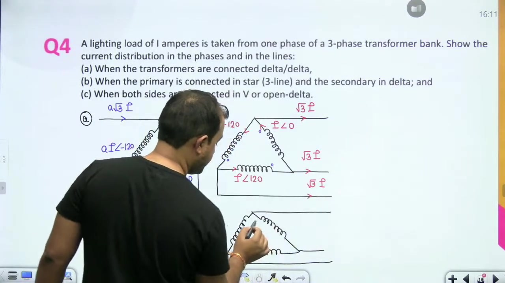

### Problem Statement

> [!example] Problem 4 (Part 1)
> A lighting load of $I$ amperes is supplied from one phase of a three-phase transformer bank. Show the current distribution in the phases and lines when the connection is:
> 1. Delta-Delta ($\Delta-\Delta$)
> 2. Star-Delta ($Y-\Delta$)
> 
> Assume an individual phase turns ratio of $a:1$ between primary and secondary windings.

### Case 1: Delta-Delta Connection ($\Delta-\Delta$)

First analyze the delta-connected secondary. Let the balanced load currents in the three secondary phases be:
$$
I_a = I \angle 0^\circ, \quad I_b = I \angle -120^\circ, \quad I_c = I \angle 120^\circ
$$

In a delta connection, the secondary line current relates to the phase current by:
$$
I_{L2} = \sqrt{3} I_{ph2} = \sqrt{3} I
$$

Now reflect these currents to the primary delta windings. Let the turns ratio be $a = N_1 / N_2$. By ampere-turn balance, the primary phase currents are:
$$
I_{A1} = \frac{I}{a}\angle 0^\circ, \quad I_{B1} = \frac{I}{a}\angle -120^\circ, \quad I_{C1} = \frac{I}{a}\angle 120^\circ
$$

The primary line currents in the delta connection become:
$$
I_{L1} = \sqrt{3} I_{ph1} = \frac{\sqrt{3} I}{a}
$$

Both windings share identical current proportions due to the matching delta configurations.

### Case 2: Star-Delta Connection ($Y-\Delta$)

Now consider the star-connected primary with delta secondary. The secondary phase currents remain $I$ in each branch. Reflecting through the turns ratio $a:1$ yields primary phase currents of:
$$
I_{ph1} = \frac{I}{a}
$$

In a star connection, the line current equals the phase current:
$$
I_{L1} = I_{ph1} = \frac{I}{a}
$$

Apply the dot convention carefully across each single-phase transformer. When current enters the dotted terminal of a primary winding, secondary current must leave the corresponding dotted terminal.

Notice the difference between primary configurations. In delta-delta, primary line current is $\sqrt{3} I / a$. In star-delta, primary line current is simply $I / a$.

## Current Distribution in V-V Bank and Scott Connection Configuration
_(39:56 - 46:07)_

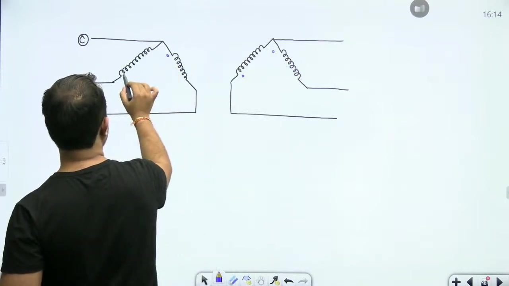

### Case 3: Open-Delta (V-V) Connection

Now consider the third case where both sides operate in open-delta. The crucial distinction of the V-V connection is the absence of a third closed loop. So the line current equals the phase current on both sides:
$$
I_L = I_{ph} = I
$$

Let the two active secondary phases carry currents:
$$
I_a = I \angle 0^\circ, \quad I_b = I \angle -120^\circ
$$

The third line current is determined by Kirchhoff's Current Law:
$$
I_c = -(I_a + I_b) = I \angle 120^\circ
$$

On the primary side, current transformation depends directly on the turns ratio $a = N_1 / N_2$. The primary currents are:
$$
I_A = \frac{I}{a}\angle 0^\circ, \quad I_B = \frac{I}{a}\angle -120^\circ, \quad I_C = \frac{I}{a}\angle 120^\circ
$$

No factor of $\sqrt{3}$ appears between line and phase currents in the open-delta configuration.

### Scott Connection Fed from a Two-Phase Network

Next, consider a Scott connection operating in reverse. A two-phase network feeds the system to supply a balanced three-phase load.

> [!example] Problem 5
> A Scott-connected transformer is fed from a 6600 V two-phase network. It supplies three-phase power between lines on a three-phase four-wire system at 500 V.
> If there are 500 turns per phase on the two-phase side:
> 1. Find the number of turns on the LV three-phase side ($N_1$).
> 2. Determine the position of the tapping for the neutral wire.

### Transformer Configuration

The two-phase supply provides voltages in quadrature:
$$
V_{\text{teaser},2} = 6600 \angle 90^\circ\text{ V}, \quad V_{\text{main},2} = 6600 \angle 0^\circ\text{ V}
$$

The teaser transformer connects to one phase of the two-phase supply. The main transformer connects to the other phase. The three-phase output requires balanced 500 V line-to-line voltages.

## Turns Ratio, Neutral Tapping, and Furnace Load Setup
_(46:13 - 51:07)_

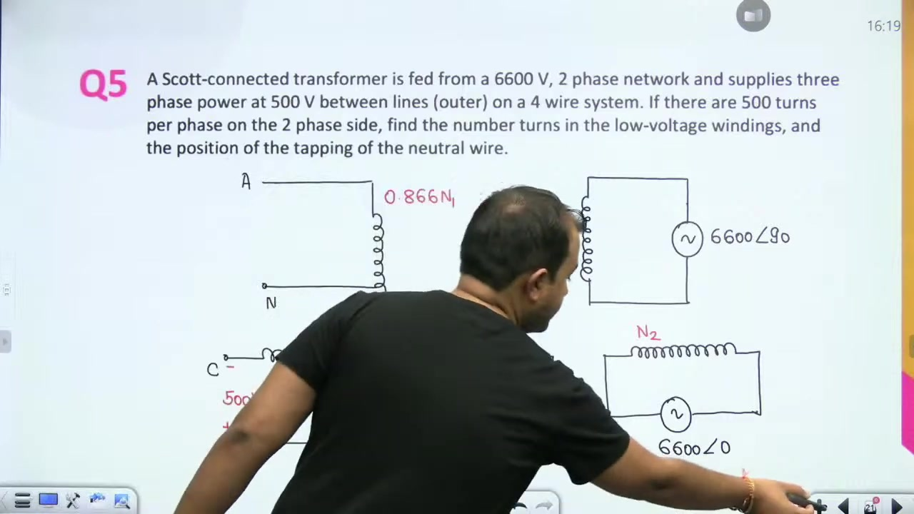

### Solving Problem 5

#### LV Turns Calculation
The main transformer secondary connects to the 6600 V two-phase supply with $N_2 = 500\text{ turns}$. The LV three-phase side requires a line voltage of 500 V.

Using the voltage and turns relationship for the main transformer:
$$
\frac{V_1}{V_2} = \frac{N_1}{N_2}
$$

Substitute the given numbers to find the primary turns:
$$
N_1 = N_2 \times \frac{V_1}{V_2} = 500 \times \frac{500}{6600} = \frac{2500}{66} \approx 37.88\text{ turns}
$$

Rounding to the nearest integer gives approximately 38 turns for $N_1$. The teaser primary winding has $0.866 N_1 \approx 33\text{ turns}$.

#### Neutral Tapping Position
In a Scott-connected system supplying a three-phase four-wire load, the neutral point $N$ lies on the teaser winding. It is placed at one-third of the total teaser turns from the base junction $D$:
$$
N_{ND} = \frac{1}{3} N_{\text{teaser}} = \frac{1}{3}(0.866 N_1) \approx 0.288 N_1\text{ turns}
$$

Measured from the top terminal $A$, the neutral tap is at two-thirds of the teaser turns:
$$
N_{AN} = \frac{2}{3}(0.866 N_1) \approx 0.577 N_1\text{ turns}
$$

> [!success] Result
> The main winding requires approximately 38 turns. The neutral tap is placed at $0.288 N_1$ turns from the base junction $D$.

### Conceptual Check: Delta Bank Derating
Consider three single-phase transformers rated at 100 kVA each connected in delta-delta. If one unit is removed, the remaining two form an open-delta bank. The capacity becomes:
$$
S_{VV} = \sqrt{3} V_{ph} I_{ph} = \sqrt{3} \times 100\text{ kVA} \approx 173.2\text{ kVA}
$$

### Problem 6: Scott Connection Supplying Two Furnaces

> [!example] Problem 6
> A Scott-connected transformer supplies two single-phase electric furnaces at 100 V each. Each furnace consumes 200 kW.
> The load on the leading phase operates at unity power factor. The load on the other phase operates at 0.8 lagging power factor.
> The three-phase input line voltage is 11,000 V. Calculate the line currents on the primary three-phase side.

The leading phase corresponds to the teaser transformer. The lagging phase corresponds to the main transformer. Both single-phase furnace voltages are 100 V.

## Primary Line Currents with Unbalanced Furnace Loads
_(51:12 - 56:03)_

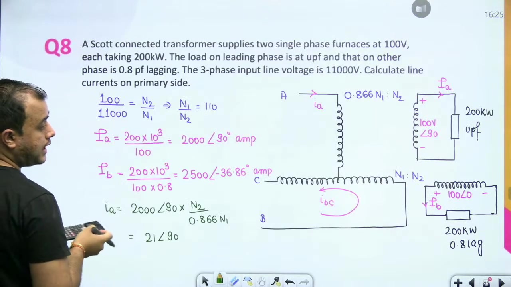

### Turns Ratio Calculation

For the main transformer, the primary line voltage is 11,000 V and the secondary furnace voltage is 100 V:
$$
\frac{N_1}{N_2} = \frac{11000}{100} = 110
$$

The teaser transformer primary winding has $0.866 N_1$ turns. Both secondary windings have $N_2$ turns.

### Secondary Load Currents

Choose the main secondary voltage as reference: $V_{\text{main}} = 100 \angle 0^\circ\text{ V}$. The teaser secondary voltage leads by $90^\circ$: $V_{\text{teaser}} = 100 \angle 90^\circ\text{ V}$.

The teaser furnace operates at 200 kW with unity power factor:
$$
I_{a2} = \frac{P_1}{V_2 \cos\phi_1} = \frac{200 \times 10^3}{100 \times 1.0} = 2000\text{ A} \angle 90^\circ
$$

The main furnace operates at 200 kW with 0.8 lagging power factor ($\phi = 36.87^\circ$):
$$
I_{b2} = \frac{P_2}{V_2 \cos\phi_2} = \frac{200 \times 10^3}{100 \times 0.8} = 2500\text{ A} \angle -36.87^\circ
$$

### Transformation to Primary Currents

Reflect the teaser secondary current to primary phase $A$:
$$
I_A = I_{a2} \times \frac{N_2}{0.866 N_1} = \frac{2000 \angle 90^\circ}{0.866 \times 110} \approx 21.0 \angle 90^\circ\text{ A}
$$

Next, reflect the main secondary current to the primary main winding:
$$
I_{BC} = I_{b2} \times \frac{N_2}{N_1} = \frac{2500 \angle -36.87^\circ}{110} \approx 22.73 \angle -36.87^\circ\text{ A}
$$

### Line Currents $I_B$ and $I_C$

In a Scott connection, the primary line currents relate to teaser and main currents by:
$$
I_B = I_{BC} - \frac{I_A}{2}, \quad I_C = -I_{BC} - \frac{I_A}{2}
$$

Substitute $I_{BC} = 22.73 \angle -36.87^\circ\text{ A}$ and $I_A / 2 = 10.5 \angle 90^\circ\text{ A}$ into the expression for $I_B$:
$$
I_B = (18.18 - j13.64) - j10.5 = 18.18 - j24.14 \approx 30.22 \angle -53.8^\circ\text{ A}
$$

Now calculate line current $I_C$:
$$
I_C = -(18.18 - j13.64) - j10.5 = -18.18 + j3.14 \approx 18.45 \angle 170.22^\circ\text{ A}
$$

Notice that the three primary line currents have different magnitudes. Because the secondary loads have different power factors, the primary three-phase currents are unbalanced.

> [!success] Result
> The primary line currents are $I_A = 21.0 \angle 90^\circ\text{ A}$, $I_B = 30.22 \angle -53.8^\circ\text{ A}$, and $I_C = 18.45 \angle 170.22^\circ\text{ A}$.

## Scott Connection with Unequal Furnace Loads: Current Transformation
_(56:03 - 61:02)_

### Problem Statement

> [!example] Problem 7
> Two single-phase electric furnaces operating at 110 V take loads of 500 kW and 800 kW respectively. Both furnaces operate at a power factor of 0.71 lagging.
> They are supplied from a 6600 V three-phase system through a Scott-connected transformer bank.
> Calculate the currents in the three-phase supply lines.

### Turns Ratio and Phase Angle Setup

The primary three-phase line voltage is 6600 V and the secondary furnace voltage is 110 V. The main transformer turns ratio is:
$$
\frac{N_1}{N_2} = \frac{6600}{110} = 60
$$

The load power factor is 0.71 lagging. This corresponds to a phase lag of approximately $45^\circ$:
$$
\cos(45^\circ) \approx 0.707 \approx 0.71 \implies \phi \approx 45^\circ
$$

The main secondary voltage serves as the horizontal reference: $V_{\text{main}} = 110 \angle 0^\circ\text{ V}$. The teaser secondary voltage leads by $90^\circ$: $V_{\text{teaser}} = 110 \angle 90^\circ\text{ V}$.

### Secondary Furnace Currents

Calculate the teaser furnace current (500 kW):
$$
I_a = \frac{P_{\text{teaser}}}{V_2 \cos\phi} = \frac{500 \times 10^3}{110 \times 0.71} \approx 6402\text{ A}
$$

Because the teaser voltage is at $90^\circ$, the lagging current phase angle is $90^\circ - 45^\circ = 45^\circ$:
$$
I_a = 6402 \angle 45^\circ\text{ A}
$$

Next, calculate the main furnace current (800 kW):
$$
I_b = \frac{P_{\text{main}}}{V_2 \cos\phi} = \frac{800 \times 10^3}{110 \times 0.71} \approx 10243.2\text{ A}
$$

Because the main voltage is at $0^\circ$, the lagging current phase angle is $0^\circ - 45^\circ = -45^\circ$:
$$
I_b = 10243.2 \angle -45^\circ\text{ A}
$$

### Reflection to Primary Windings

Reflect the teaser secondary current to primary phase $A$:
$$
I_A = I_a \times \frac{N_2}{0.866 N_1} = \frac{6402 \angle 45^\circ}{60 \times 0.866} \approx 123.21 \angle 45^\circ\text{ A}
$$

Reflect the main secondary current to the primary main winding:
$$
I_{BC} = I_b \times \frac{N_2}{N_1} = \frac{10243.2 \angle -45^\circ}{60} \approx 170.72 \angle -45^\circ\text{ A}
$$

These transformed currents form the basis for evaluating the remaining line currents.

## Line Current Resolution and Lecture Summary
_(61:05 - 66:17)_

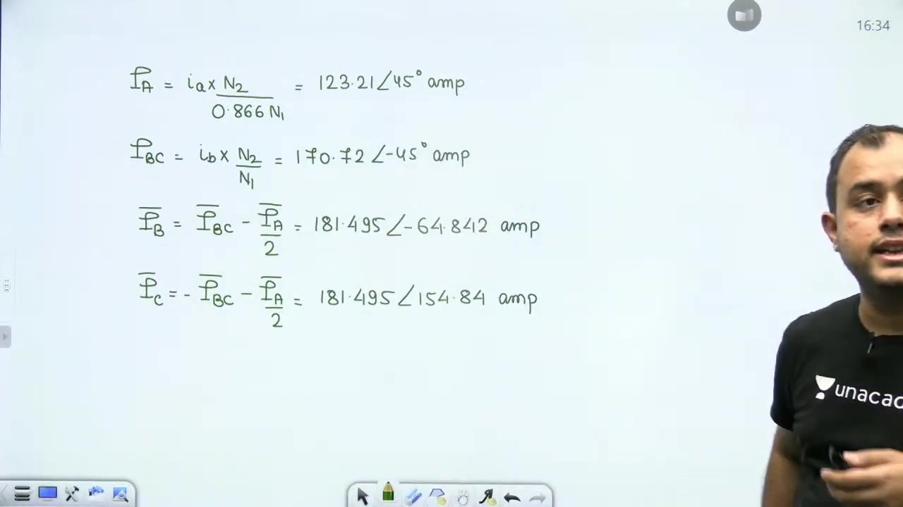

### Evaluating Primary Line Currents $I_B$ and $I_C$

Now solve for the remaining primary line currents in Problem 7. The line current $I_B$ is:
$$
I_B = I_{BC} - \frac{I_A}{2}
$$

Substitute the numerical values obtained earlier:
$$
I_{BC} = 170.72 \angle -45^\circ\text{ A}, \quad \frac{I_A}{2} = 61.61 \angle 45^\circ\text{ A}
$$

Convert both quantities into rectangular form:
$$
I_{BC} = 120.72 - j120.72\text{ A}
$$

The half-teaser current in rectangular form is:
$$
\frac{I_A}{2} = 43.56 + j43.56\text{ A}
$$

Subtract these two complex numbers to find $I_B$:
$$
I_B = (120.72 - 43.56) - j(120.72 + 43.56) = 77.16 - j164.28\text{ A}
$$

In polar coordinates, this yields:
$$
I_B \approx 181.50 \angle -64.84^\circ\text{ A}
$$

Next, calculate line current $I_C$:
$$
I_C = -I_{BC} - \frac{I_A}{2} = -(120.72 - j120.72) - (43.56 + j43.56)
$$

Combine real and imaginary terms:
$$
I_C = -164.28 + j77.16\text{ A}
$$

Convert into polar coordinates:
$$
I_C \approx 181.50 \angle 154.84^\circ\text{ A}
$$

Notice an important symmetry. Lines $B$ and $C$ carry identical magnitudes of 181.5 A. But line $A$ carries 123.21 A. The three-phase supply is unbalanced because the two furnace loads draw unequal power (500 kW versus 800 kW).

> [!success] Result
> The primary line currents are $I_A = 123.21 \angle 45^\circ\text{ A}$, $I_B = 181.50 \angle -64.84^\circ\text{ A}$, and $I_C = 181.50 \angle 154.84^\circ\text{ A}$.

### Key Concepts Summary

This problem session covered two major non-standard transformer connections:
- **Open-Delta Connection (V-V)**:
  - Delivers 57.7% of the capacity of a complete delta-delta bank.
  - Line currents equal phase currents.
  - The two transformers operate at different power factors, namely $\cos(30^\circ \pm \phi)$.
  - Supplying the original load overheats the bank by increasing losses by 55.55%.
- **Scott Connection (T-T)**:
  - Converts between two-phase and three-phase systems using two single-phase transformers.
  - The main transformer has turns ratio $N_1 : N_2$.
  - The teaser transformer requires $0.866 N_1$ primary turns.
  - Balanced two-phase loads yield balanced three-phase line currents.
  - Unequal loads produce unbalanced primary currents.

---

## Summary and Key Takeaways

- An open-delta bank delivers a maximum apparent power of $S_{VV} = \sqrt{3} V_{ph} I_{ph}$, which is $57.7\%$ of a full delta-delta bank rating.
- The two transformers in an open-delta bank operate at unequal power factors given by $\cos(30^\circ + \phi)$ and $\cos(30^\circ - \phi)$.
- Supplying the original three-phase load after removing one transformer increases phase currents by $\sqrt{3}$ and increases total losses by $55.55\%$.
- Operating an open-delta bank at the same temperature rise as a delta-delta bank requires derating the load capacity by $42.3\%$.
- In open-delta banks, the line currents and phase currents are identical because no closed delta loop exists.
- In a Scott connection, the teaser transformer requires $0.866 N_1$ primary turns when the main transformer has $N_1$ turns.
- The primary neutral tap on a Scott connection is located at one-third of the teaser winding turns ($0.288 N_1$) from the junction point.
- Unequal single-phase loads or differing load power factors on the two-phase side cause unbalanced line currents on the primary three-phase side.

---

[← Lec 045: Three Phase Transformer 7](Lecture_045_Three_Phase_Transformer_7.md) | [🏠 Index](00_yt_study_guide.md) | [Lec 047: Parallel Operation of Transformers →](Lecture_047_Parallel_Operation_of_Transformers.md)
