# Parallel Operation of Transformers | Electrical Machines | Lec 32 | GATE/ESE (EE, ECE) | Ankit Goyal

- **Source**: https://www.youtube.com/watch?v=oqgDQt9G2fo
- **Duration**: 01:20:36
- **Compiled**: 2026-09-21

---

## Overview

This lecture establishes the theory and practice of operating transformers in parallel. It presents the technical and economic reasons for parallel operation, including increased current capacity, higher reliability, and reduced standby unit costs. The lecture derives both necessary conditions to prevent circulating currents and desirable conditions to optimize load sharing. It develops analytical methods to compute branch currents, apparent power distribution, and the maximum permissible load without overloading either unit.

## Contents

- [[#Motivation and Advantages of Parallel Operation|Motivation and Advantages of Parallel Operation]]
- [[#Standby Capacity, Demand Switching, and Circuit Modeling|Standby Capacity, Demand Switching, and Circuit Modeling]]
- [[#Necessary Condition 1: Equal Voltage Ratios|Necessary Condition 1: Equal Voltage Ratios]]
- [[#Necessary Conditions for Single-Phase and Three-Phase Transformers|Necessary Conditions for Single-Phase and Three-Phase Transformers]]
- [[#Desirable Conditions and Network Formulation|Desirable Conditions and Network Formulation]]
- [[#Nodal Analysis Formulation for Parallel Transformers|Nodal Analysis Formulation for Parallel Transformers]]
- [[#Closed-Form Current Expressions for Parallel Transformers|Closed-Form Current Expressions for Parallel Transformers]]
- [[#Current Division and Millman's Equivalence|Current Division and Millman's Equivalence]]
- [[#Complex Power Sharing and Sign Conventions|Complex Power Sharing and Sign Conventions]]
- [[#Practical Rules for Impedances and Base Selection|Practical Rules for Impedances and Base Selection]]
- [[#Base Conversion and Proof of Proportional Sharing|Base Conversion and Proof of Proportional Sharing]]
- [[#Proof: Equal X/R Ratio and Maximum Power Transfer|Proof: Equal X/R Ratio and Maximum Power Transfer]]
- [[#Analysis of Unequal Voltage Ratios|Analysis of Unequal Voltage Ratios]]
- [[#Solving Unequal Voltage Ratios and Maximum Load Concept|Solving Unequal Voltage Ratios and Maximum Load Concept]]
- [[#Maximum Load Determination Algorithm and Summary|Maximum Load Determination Algorithm and Summary]]

---

## Motivation and Advantages of Parallel Operation
_(00:12 - 05:50)_

### Why Transformers Are Connected in Parallel
Power systems often handle very large load currents. A single transformer may not be able to carry such large currents. Connecting multiple transformers in parallel solves this problem. In a parallel connection, branch currents add together:

$$
I_{\text{total}} = I_1 + I_2 + \dots + I_n
$$

Because the terminal voltage remains constant, the total power capacity also increases:

$$
S_{\text{total}} = V I_{\text{total}}^*
$$

Parallel operation allows transformers to supply heavy loads that exceed the rating of any single unit.

### Reliability and Modular Sizing
Constructing a single very large transformer is costly and difficult. For example, supplying a 100 MVA load with a single 100 MVA unit poses major transport and manufacturing challenges. Using four 25 MVA units or two 50 MVA units is much more practical. 

Parallel units also increase system reliability. If one transformer suffers a fault, protection devices isolate it. The remaining units continue supplying power to consumers. This prevents a complete blackout. Even if the remaining units cannot carry the full load, supplying partial power is better than a total outage.

### Equivalent Series Impedance and Voltage Regulation
Connecting transformers in parallel reduces the equivalent series impedance. Consider two identical transformers each having an internal series impedance $Z$:

$$
Z_{\text{eq}} = Z_1 \parallel Z_2 = \frac{Z}{2}
$$

The equivalent resistance and reactance both decrease by half:

$$
R_{\text{eq}} = \frac{R}{2}, \quad X_{\text{eq}} = \frac{X}{2}
$$

Recall the approximate voltage regulation formula:

$$
\text{VR} \approx \frac{I (R \cos\phi + X \sin\phi)}{V_2}
$$

Lower equivalent series impedance reduces the internal voltage drop. So parallel operation improves voltage regulation across the load.

## Standby Capacity, Demand Switching, and Circuit Modeling
_(05:50 - 10:51)_

### Standby Unit Economics and Demand Switching
Parallel operation reduces the capital cost of standby units. When a single large transformer supplies a substation, a complete spare unit of equal size must sit idle. With four smaller parallel units, one spare unit suffices. If any unit fails, it can be disconnected for maintenance while the remaining units carry most of the demand.

Transformers can also be switched on or off to follow load variations. Suppose four 50 MVA units are installed and the load drops to 70 MVA during off-peak hours. Running all four units produces unnecessary core losses. 

Operating only two units minimizes total core loss. This optimizes operating efficiency. Extra units are switched on as the load expands.

### Circuit Modeling for Parallel Operation
Before connecting transformers in parallel, specific conditions must be satisfied. In three-phase systems, calculations are always performed on a per-phase basis. Balanced three-phase circuits have identical phase magnitudes and $120^\circ$ phase displacements. So a single-phase equivalent circuit is sufficient.

Consider two practical transformers connected in parallel to a common primary supply $V_1$. Let their transformation ratios be $a_1:1$ and $a_2:1$. Their series impedances referred to the secondary side are $Z_1$ and $Z_2$:

$$
Z_1 = R_1 + jX_1, \quad Z_2 = R_2 + jX_2
$$

Shunt branches representing core loss and magnetizing reactance are neglected in load sharing calculations. Dot polarities are marked to define the relative instantaneous voltage polarity.

## Necessary Condition 1: Equal Voltage Ratios
_(10:54 - 16:16)_

### Origin of Circulating Current
Assume two parallel transformers have unequal turns ratios $a_1 \ne a_2$. The secondary induced voltages on open circuit are $V_1 / a_1$ and $V_1 / a_2$. Because $a_1 \ne a_2$, these secondary voltages are unequal. 

This voltage difference creates a potential difference across the closed local loop formed by the secondary windings. The resulting circulating current is:

$$
I_c = \frac{\frac{V_1}{a_1} - \frac{V_1}{a_2}}{Z_1 + Z_2}
$$

This current flows even when no external load is connected.

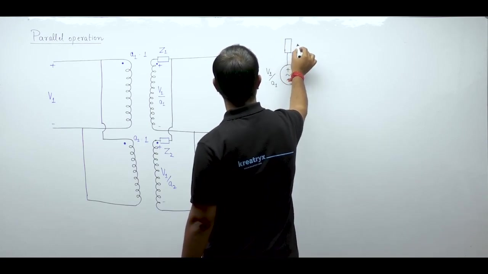

### Effect on Load Currents and Losses
When an external load draws current, the circulating current superimposes on the load current. For transformer 1, both currents leave the positive terminal:

$$
I_{\text{net, 1}} = I_1 + I_c
$$

For transformer 2, circulating current enters the positive terminal:

$$
I_{\text{net, 2}} = I_2 - I_c
$$

Suppose each unit is rated to supply 50 A. If a circulating current of 5 A flows, transformer 1 delivers 55 A while transformer 2 delivers 45 A. Transformer 1 becomes overloaded even if the total load is within the combined rating.

Copper loss depends on the square of current. The total copper loss becomes:

$$
P_{\text{cu, total}} = (I_1 + I_c)^2 R_1 + (I_2 - I_c)^2 R_2
$$

Expanding this expression shows that total copper loss always increases when $I_c \ne 0$:

$$
P_{\text{cu, total}} = I_1^2 R_1 + I_2^2 R_2 + I_c^2 (R_1 + R_2) + 2 I_c (I_1 R_1 - I_2 R_2)
$$

The quadratic term $I_c^2 (R_1 + R_2)$ always increases losses. This lowers overall efficiency and causes excessive heating in the overloaded transformer.

> [!info] Necessary Condition 1
> Transformers operating in parallel must have equal voltage ratios. This prevents circulating current from overloading one unit and increasing total copper losses.

## Necessary Conditions for Single-Phase and Three-Phase Transformers
_(16:19 - 23:40)_

### Necessary Condition 2: Identical Polarity
The polarities of both transformers must be identical. Suppose the secondary connection of the second transformer is reversed. Its secondary induced voltage reverses in sign:

$$
E_2 = -\frac{V_1}{a}
$$

Applying Kirchhoff's Voltage Law around the closed secondary loop gives:

$$
V_{\text{loop}} = E_1 - E_2 = \frac{V_1}{a} - \left(-\frac{V_1}{a}\right) = \frac{2 V_1}{a}
$$

The loop voltage is twice the secondary voltage. Because internal transformer impedances are very small, an enormous short-circuit circulating current flows:

$$
I_{\text{sc}} = \frac{2 V_1 / a}{Z_1 + Z_2}
$$

This heavy current can destroy the windings within seconds. Polarity testing must always be performed before connecting transformers in parallel.

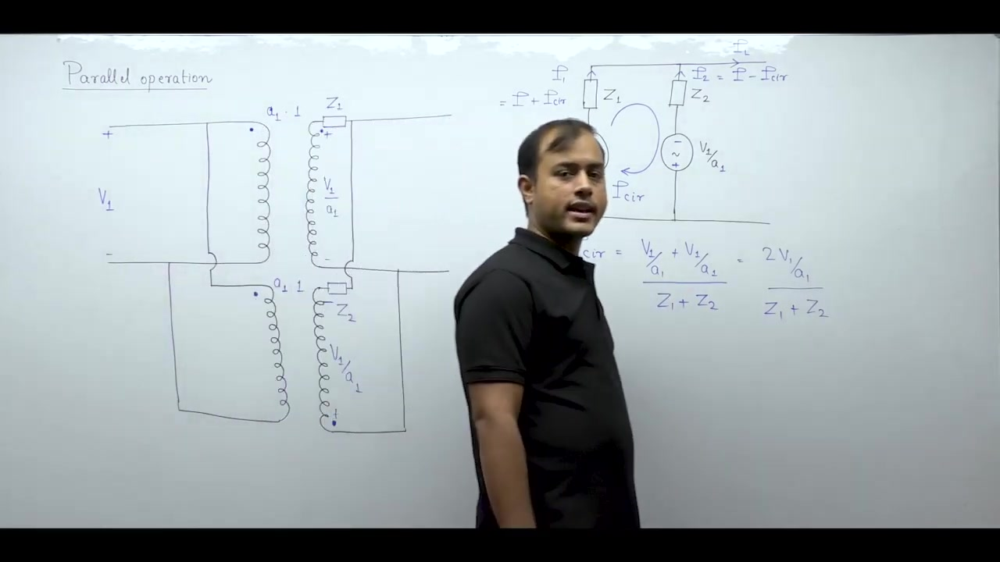

### Additional Conditions for Three-Phase Transformers
Three-phase parallel operation requires two more necessary conditions:

1. **Same Phase Sequence**: Both transformers must operate with the same phase sequence (either $R\text{-}Y\text{-}B$ or $R\text{-}B\text{-}Y$). Connecting opposite sequence banks creates large line-to-line circulating currents.

2. **Same Phase Shift and Phasor Group**: Both transformers must introduce the same phase displacement between primary and secondary line voltages.

Consider a star-star transformer operating in parallel with a star-delta transformer. The star-star transformer produces $0^\circ$ phase shift. The star-delta transformer produces a $30^\circ$ phase shift. Even if voltage magnitudes match, a net voltage appears across the loop:

$$
\Delta V = |V\angle 0^\circ - V\angle 30^\circ| = 2 V \sin(15^\circ) \approx 0.518 V
$$

This potential difference drives destructive circulating currents. Therefore, transformers must belong to compatible phasor groups:

- **Group 1 & 2 ($0^\circ$ and $180^\circ$)**: $Y\text{-}y$, $D\text{-}d$, $D\text{-}z$ can operate in parallel with each other.
- **Group 3 & 4 ($\pm 30^\circ$)**: $Y\text{-}d$, $D\text{-}y$, $Y\text{-}z$ can operate in parallel with each other.

A transformer from Group 1 or 2 cannot operate in parallel with a transformer from Group 3 or 4.

## Desirable Conditions and Network Formulation
_(23:41 - 28:28)_

### Desirable Conditions for Parallel Operation
Desirable conditions are not strictly mandatory. The parallel bank will function if they are not met. But meeting them guarantees optimal performance:

1. **Proportional Load Sharing**: Each transformer should share the load in proportion to its rated capacity:

$$
\frac{S_1}{S_2} = \frac{S_{1, \text{rated}}}{S_{2, \text{rated}}}
$$

This prevents a smaller transformer from being overloaded while a larger transformer remains underloaded. This condition is satisfied when per-unit impedances on each unit's own base are equal:

$$
Z_{1, pu} = Z_{2, pu} \quad (\text{on own respective base})
$$

2. **Identical X/R Ratios**: Both transformers should have the same ratio of series reactance to resistance:

$$
\left(\frac{X}{R}\right)_1 = \left(\frac{X}{R}\right)_2 \implies \theta_1 = \theta_2
$$

This ensures that both transformers operate at the same power factor as the load.

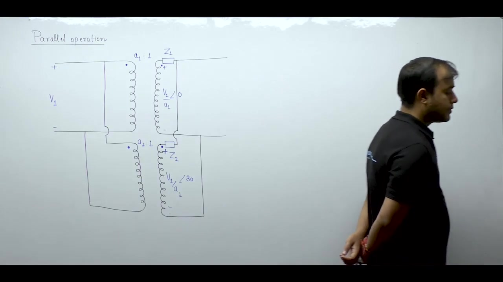

### Equivalent Circuit Setup for Single-Phase Parallel Operation
Consider two single-phase transformers supplying a common load impedance $Z_L$. The primary supply voltage is $V_1$. Let the turns ratios be $a_1:1$ and $a_2:1$. The internal impedances referred to the secondary are $Z_1$ and $Z_2$. 

The secondary induced voltages are modeled as ideal voltage sources $V_1 / a_1$ and $V_1 / a_2$. The load terminal voltage is $V_L$, and the load current is $I_L$. Transformer 1 supplies current $I_1$ and transformer 2 supplies current $I_2$:

$$
I_L = I_1 + I_2
$$

This equivalent circuit reduces the transformer parallel operation problem to a standard linear network.

## Nodal Analysis Formulation for Parallel Transformers
_(28:31 - 33:18)_

### Nodal Equation at the Load Terminal
In the equivalent circuit, the secondary load terminal forms a principal node. Let the potential of this node be $V_L$, referenced to the common return wire at 0 V. 

Applying Kirchhoff's Current Law at the load node, assuming all branch currents leave the node:

$$
\frac{V_L - \frac{V_1}{a_1}}{Z_1} + \frac{V_L - \frac{V_1}{a_2}}{Z_2} + \frac{V_L}{Z_L} = 0
$$

Grouping the terms containing $V_L$ on the left hand side:

$$
V_L \left(\frac{1}{Z_1} + \frac{1}{Z_2} + \frac{1}{Z_L}\right) = \frac{V_1 / a_1}{Z_1} + \frac{V_1 / a_2}{Z_2}
$$

Solving directly for the load terminal voltage gives:

$$
V_L = \frac{\frac{V_1 / a_1}{Z_1} + \frac{V_1 / a_2}{Z_2}}{\frac{1}{Z_1} + \frac{1}{Z_2} + \frac{1}{Z_L}}
$$

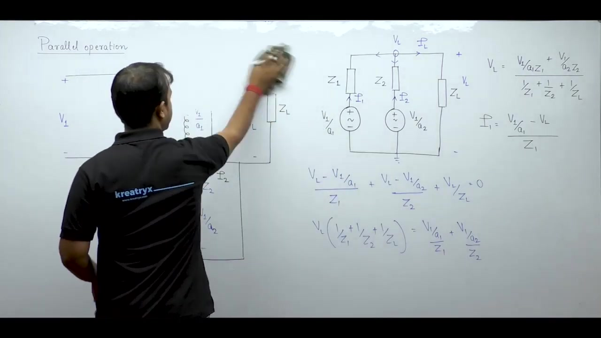

### Branch Currents and Load Current
The actual branch current $I_1$ flows from the ideal source $V_1 / a_1$ to the load terminal $V_L$. So the current delivered by transformer 1 is:

$$
I_1 = \frac{\frac{V_1}{a_1} - V_L}{Z_1}
$$

Similarly, the current delivered by transformer 2 is:

$$
I_2 = \frac{\frac{V_1}{a_2} - V_L}{Z_2}
$$

The total load current flowing through load impedance $Z_L$ is:

$$
I_L = \frac{V_L}{Z_L} = \frac{\frac{V_1 / a_1}{Z_1} + \frac{V_1 / a_2}{Z_2}}{Z_L \left(\frac{1}{Z_1} + \frac{1}{Z_2} + \frac{1}{Z_L}\right)}
$$

We now want to express individual currents $I_1$ and $I_2$ directly in terms of load current $I_L$.

## Closed-Form Current Expressions for Parallel Transformers
_(33:24 - 38:09)_

### Algebraic Derivation of Transformer Currents
Substitute the expression for load voltage $V_L$ into the branch current equation for transformer 1:

$$
I_1 = \frac{\frac{V_1}{a_1} - V_L}{Z_1}
$$

Multiply numerator and denominator by the common denominator $Z_1 Z_2 Z_L$. The denominator of $V_L$ expands as:

$$
\frac{1}{Z_1} + \frac{1}{Z_2} + \frac{1}{Z_L} = \frac{Z_2 Z_L + Z_1 Z_L + Z_1 Z_2}{Z_1 Z_2 Z_L}
$$

The numerator becomes:

$$
\frac{V_1 / a_1}{Z_1} + \frac{V_1 / a_2}{Z_2} = \frac{(V_1 / a_1) Z_2 + (V_1 / a_2) Z_1}{Z_1 Z_2}
$$

Substituting these into the expression for $I_1$ and simplifying the algebraic terms produces a combined result. The expression splits into two distinct physical components:

$$
I_1 = I_L \left(\frac{Z_2}{Z_1 + Z_2}\right) + \frac{\frac{V_1}{a_1} - \frac{V_1}{a_2}}{Z_1 + Z_2}
$$

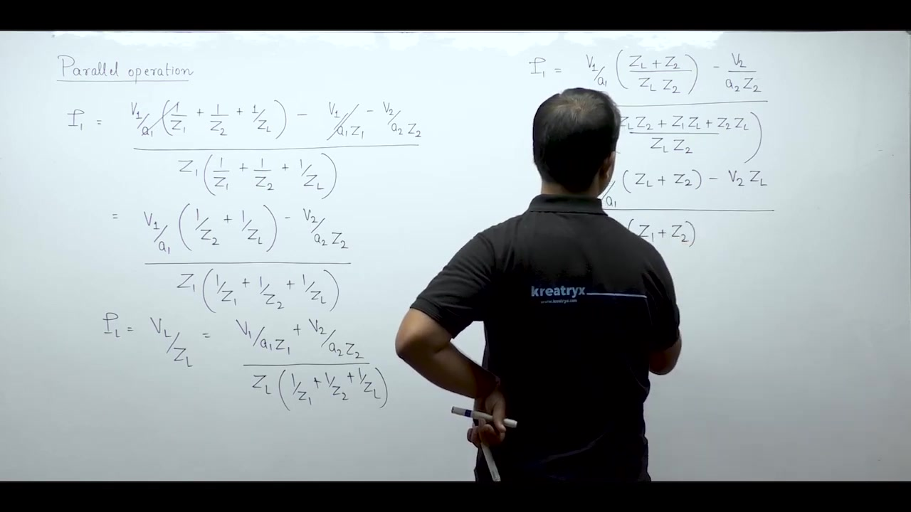

### Current Expression for Transformer 2
The total load current equals the sum of both branch currents:

$$
I_L = I_1 + I_2
$$

Therefore, the current supplied by transformer 2 is found by subtracting $I_1$ from $I_L$:

$$
I_2 = I_L - I_1 = I_L \left(1 - \frac{Z_2}{Z_1 + Z_2}\right) - \frac{\frac{V_1}{a_1} - \frac{V_1}{a_2}}{Z_1 + Z_2}
$$

Simplifying the first term:

$$
1 - \frac{Z_2}{Z_1 + Z_2} = \frac{Z_1}{Z_1 + Z_2}
$$

This gives the final closed-form equation for transformer 2:

> [!success] Branch Current Equations
> $$
> I_1 = I_L \left(\frac{Z_2}{Z_1 + Z_2}\right) + \frac{\frac{V_1}{a_1} - \frac{V_1}{a_2}}{Z_1 + Z_2}
> $$
> $$
> I_2 = I_L \left(\frac{Z_1}{Z_1 + Z_2}\right) - \frac{\frac{V_1}{a_1} - \frac{V_1}{a_2}}{Z_1 + Z_2}
> $$

## Current Division and Millman's Equivalence
_(38:12 - 45:09)_

### Physical Meaning of the Current Terms
In both current expressions, the equations split into two distinct terms:

1. **Load Current Component**: The first term represents how the load current divides between the two transformers:

$$
I_{1, \text{load}} = I_L \left(\frac{Z_2}{Z_1 + Z_2}\right), \quad I_{2, \text{load}} = I_L \left(\frac{Z_1}{Z_1 + Z_2}\right)
$$

2. **Circulating Current Component**: The second term represents the circulating current flowing in the local loop:

$$
I_c = \frac{\frac{V_1}{a_1} - \frac{V_1}{a_2}}{Z_1 + Z_2}
$$

The circulating current adds directly to the load current of transformer 1. It subtracts from the load current of transformer 2.

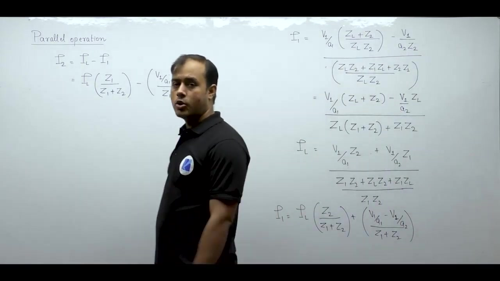

### Special Case: Equal Voltage Ratios
When voltage ratios are equal, $a_1 = a_2 = a$. The secondary open-circuit voltages are identical:

$$
\frac{V_1}{a_1} - \frac{V_1}{a_2} = 0 \implies I_c = 0
$$

The circulating current vanishes. The branch currents simplify to standard current division:

$$
I_1 = I_L \left(\frac{Z_2}{Z_1 + Z_2}\right)
$$

$$
I_2 = I_L \left(\frac{Z_1}{Z_1 + Z_2}\right)
$$

### Network Interpretation via Millman's Theorem
This result can be verified using Millman's theorem. For two parallel branches with voltages $E_1, E_2$ and impedances $Z_1, Z_2$, the equivalent source voltage is:

$$
V_{\text{eq}} = \frac{\frac{E_1}{Z_1} + \frac{E_2}{Z_2}}{\frac{1}{Z_1} + \frac{1}{Z_2}}
$$

When $E_1 = E_2 = E$:

$$
V_{\text{eq}} = \frac{E \left(\frac{1}{Z_1} + \frac{1}{Z_2}\right)}{\frac{1}{Z_1} + \frac{1}{Z_2}} = E
$$

The two parallel branches combine into a single ideal source $E$ connected to the parallel combination $Z_1 \parallel Z_2$. Load current $I_L$ then divides between $Z_1$ and $Z_2$ according to standard current division.

## Complex Power Sharing and Sign Conventions
_(45:09 - 49:59)_

### Complex Power Delivered by Each Transformer
In power engineering, transformer loading is expressed in terms of apparent or complex power rather than current. Let the load terminal voltage be $V_L$. The complex power delivered by transformer 1 is:

$$
S_1 = V_L I_1^*
$$

Substitute the current division formula for $I_1$:

$$
I_1 = I_L \left(\frac{Z_2}{Z_1 + Z_2}\right)
$$

Using the complex identity $(A \cdot B)^* = A^* \cdot B^*$:

$$
S_1 = V_L I_L^* \left(\frac{Z_2}{Z_1 + Z_2}\right)^*
$$

Because $S_L = V_L I_L^*$ is the total complex load power:

$$
S_1 = S_L \left(\frac{Z_2}{Z_1 + Z_2}\right)^*
$$

Similarly, for transformer 2:

$$
S_2 = S_L \left(\frac{Z_1}{Z_1 + Z_2}\right)^*
$$

Notice that the impedance division factor is conjugated. This conjugate is necessary because complex power is defined with current conjugated.

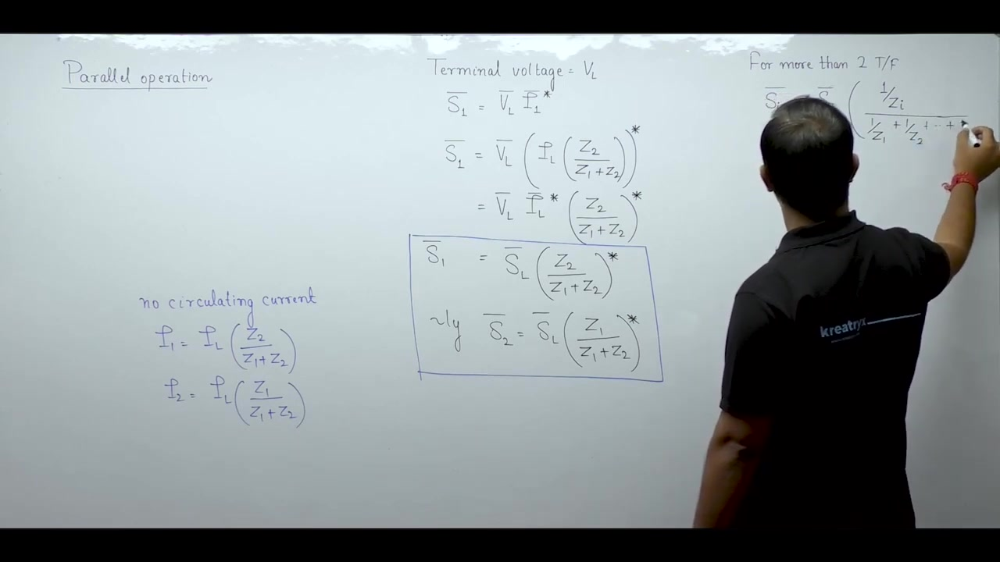

### Generalization to n Parallel Transformers
For $n$ transformers operating in parallel with equal voltage ratios, the apparent power supplied by the $i$-th transformer is:

$$
S_i = S_L \left(\frac{\frac{1}{Z_i}}{\sum_{k=1}^n \frac{1}{Z_k}}\right)^*
$$

The numerator contains the admittance of the $i$-th transformer. The denominator contains the total equivalent admittance of all parallel branches.

### Sign Conventions for Power Factor Angle
When substituting complex load power $S_L$, sign conventions from network theory must be followed:

- **Lagging Power Factor**: Current lags voltage, so the reactive power is positive. The phase angle of $S_L$ is positive:

$$
S_L = |S_L| \angle (+\phi) = P + jQ \quad (Q > 0)
$$

For example, a load of 100 kVA at 0.8 power factor lagging is written as $100\angle +36.87^\circ\text{ kVA}$.

- **Leading Power Factor**: Current leads voltage, so the reactive power is negative. The phase angle of $S_L$ is negative:

$$
S_L = |S_L| \angle (-\phi) = P - jQ \quad (Q < 0)
$$

For example, a load of 100 kVA at 0.8 power factor leading is written as $100\angle -36.87^\circ\text{ kVA}$.

## Practical Rules for Impedances and Base Selection
_(50:01 - 55:38)_

### Ratio of Apparent Powers
Dividing the complex power equation of transformer 1 by that of transformer 2:

$$
\frac{S_1}{S_2} = \frac{S_L \left(\frac{Z_2}{Z_1 + Z_2}\right)^*}{S_L \left(\frac{Z_1}{Z_1 + Z_2}\right)^*} = \left(\frac{Z_2}{Z_1}\right)^*
$$

Taking the magnitude of both sides:

$$
\left|\frac{S_1}{S_2}\right| = \left|\frac{Z_2}{Z_1}\right|
$$

The ratio of apparent powers delivered by two parallel transformers is inversely proportional to the magnitude of their impedances.

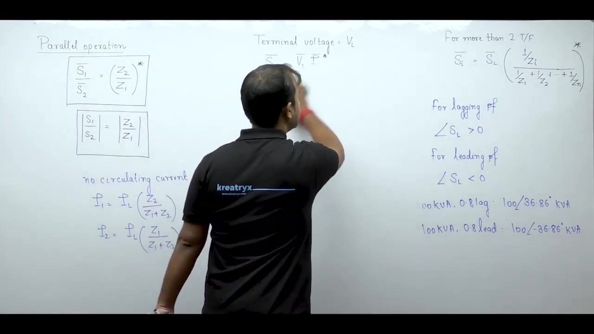

### Rules for Substituting Impedances
When applying the load sharing formula, observe these practical rules:

1. **Common Units**: The impedances $Z_1$ and $Z_2$ must both be in ohms referred to the same voltage side, or both in per-unit on a common base.
2. **Complex vs Real Representation**: If impedances are specified in complex form, substitute them as $R + jX$. If only a scalar percentage or magnitude is given, treat it as purely resistive or purely reactive.
3. **Per-Unit Invariance**: The per-unit impedance of a transformer is identical whether referred to the primary or secondary winding.

### Example Problem Setup
Consider two parallel transformers supplying a common load:

- Transformer 1: 50 kVA, 11 kV / 33 kV, $Z_{1, pu} = 0.02\text{ pu}$
- Transformer 2: 100 kVA, 11 kV / 33 kV, $Z_{2, pu} = 0.03\text{ pu}$
- Total Load: 80 kVA at 0.8 power factor lagging

To calculate load sharing, either convert both impedances to ohmic values on the 33 kV secondary side:

$$
Z_{\text{base}} = \frac{V^2}{S}
$$

Or convert both to a common per-unit base. Choosing 100 kVA as the common base minimizes effort because transformer 2 already sits on the 100 kVA base. Only transformer 1 requires conversion.

## Base Conversion and Proof of Proportional Sharing
_(55:39 - 01:02:10)_

### Per-Unit Base Conversion
When converting per-unit impedances to a new common base, recall the general conversion formula:

$$
Z_{\text{pu, new}} = Z_{\text{pu, old}} \left(\frac{S_{\text{new}}}{S_{\text{old}}}\right) \left(\frac{V_{\text{old}}}{V_{\text{new}}}\right)^2
$$

Because parallel transformers must have identical voltage ratings, $V_{\text{old}} = V_{\text{new}}$. The formula simplifies to:

$$
Z_{\text{pu, new}} = Z_{\text{pu, old}} \left(\frac{S_{\text{new}}}{S_{\text{old}}}\right)
$$

For the previous example, choosing a 100 kVA common base gives:

$$
Z_{1, \text{pu, new}} = 0.02 \times \left(\frac{100\text{ kVA}}{50\text{ kVA}}\right) = 0.04\text{ pu}
$$

Transformer 2 remains $0.03\text{ pu}$.

### Proof: Proportional Load Sharing Condition
We can now prove mathematically that proportional load sharing requires equal per-unit impedances on their own respective bases.

For load sharing to be proportional to ratings:

$$
\frac{S_1}{S_2} = \frac{S_{1, \text{rated}}}{S_{2, \text{rated}}}
$$

From current division, the power ratio is inversely proportional to ohmic impedances:

$$
\frac{S_1}{S_2} = \frac{Z_2}{Z_1}
$$

Equating the two expressions:

$$
\frac{S_{1, \text{rated}}}{S_{2, \text{rated}}} = \frac{Z_2}{Z_1} \implies Z_1 S_{1, \text{rated}} = Z_2 S_{2, \text{rated}}
$$

Both transformers operate at the same nominal voltage $V$. Dividing both sides by $V^2$:

$$
\frac{Z_1}{V^2 / S_{1, \text{rated}}} = \frac{Z_2}{V^2 / S_{2, \text{rated}}}
$$

Notice that $V^2 / S_{\text{rated}}$ is the base impedance on the transformer's own rating:

$$
Z_{\text{base1}} = \frac{V^2}{S_{1, \text{rated}}}, \quad Z_{\text{base2}} = \frac{V^2}{S_{2, \text{rated}}}
$$

Substituting these base impedances gives:

$$
\frac{Z_1}{Z_{\text{base1}}} = \frac{Z_2}{Z_{\text{base2}}} \implies Z_{1, \text{pu}} = Z_{2, \text{pu}} \quad (\text{on own base})
$$

> [!success] Proportional Sharing Theorem
> Load sharing between parallel transformers is strictly proportional to their kVA ratings if and only if their per-unit impedances on their own rating bases are equal.

Always remember the distinction: compare per-unit impedances on their own base to check proportionality, but use a common base to compute numerical load sharing.

## Proof: Equal X/R Ratio and Maximum Power Transfer
_(01:02:10 - 01:08:12)_

### Proof of Equal X/R Ratio Condition
Any transformer internal impedance can be written in polar form:

$$
Z = R + jX = |Z| \angle \theta, \quad \theta = \arctan\left(\frac{X}{R}\right)
$$

If both transformers have equal $X/R$ ratios:

$$
\left(\frac{X}{R}\right)_1 = \left(\frac{X}{R}\right)_2 \implies \theta_1 = \theta_2 = \theta
$$

Both transformers have identical impedance angles. Now examine the complex power sharing formula:

$$
S_1 = S_L \left(\frac{Z_2}{Z_1 + Z_2}\right)^*
$$

Substitute the polar form of the impedances:

$$
S_1 = S_L \left(\frac{|Z_2| \angle \theta}{|Z_1| \angle \theta + |Z_2| \angle \theta}\right)^*
$$

Because both phasors in the denominator share the same angle $\theta$, their sum is purely algebraic:

$$
|Z_1| \angle \theta + |Z_2| \angle \theta = (|Z_1| + |Z_2|) \angle \theta
$$

The angle $\theta$ cancels out between numerator and denominator:

$$
\frac{|Z_2| \angle \theta}{(|Z_1| + |Z_2|) \angle \theta} = \frac{|Z_2|}{|Z_1| + |Z_2|}
$$

This impedance ratio is a purely real scalar. The complex conjugate of a real number is the number itself:

$$
S_1 = S_L \left(\frac{|Z_2|}{|Z_1| + |Z_2|}\right), \quad S_2 = S_L \left(\frac{|Z_1|}{|Z_1| + |Z_2|}\right)
$$

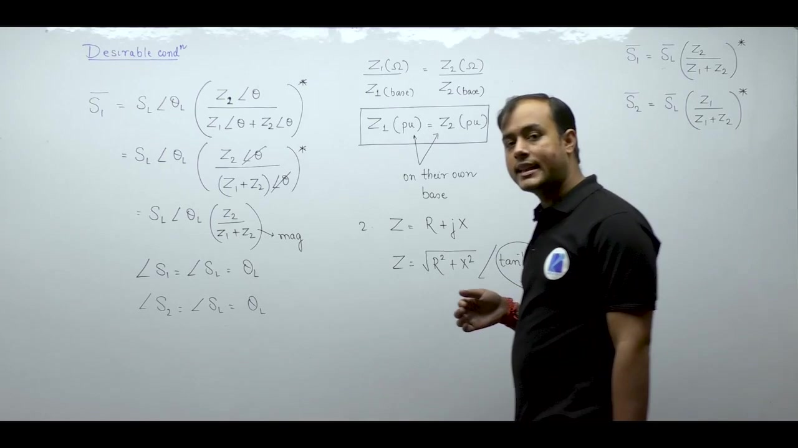

### Operating Power Factor and Maximum Output
Because the multiplying factors are real numbers, no additional phase shift is introduced:

$$
\angle S_1 = \angle S_2 = \angle S_L
$$

Both transformers operate at the exact same power factor as the connected load.

Also, because $S_1$ and $S_2$ are in phase with each other, they add directly as scalars:

$$
S_{\text{total}} = |S_1 + S_2| = |S_1| + |S_2|
$$

If the angles differed, their phasor sum would be strictly less than $|S_1| + |S_2|$. Matching $X/R$ ratios ensures that the transformer bank achieves its maximum possible apparent power output without wasting capacity on internal reactive circulation.

## Analysis of Unequal Voltage Ratios
_(01:08:12 - 01:12:33)_

### Problem Formulation with Open-Circuit Voltages
In some practical situations or examination problems, transformers have unequal voltage ratios:

$$
a_1 \ne a_2
$$

Instead of turns ratios, problems often specify the open-circuit secondary voltages directly as $E_1$ and $E_2$, along with secondary impedances $Z_1$ and $Z_2$.

Why do we call these open-circuit voltages? In transformer equivalent circuits, core loss and magnetizing branches are neglected. When the secondary terminals are open-circuited:

$$
I = 0 \implies I Z = 0
$$

With zero internal voltage drop, the secondary terminal voltage equals the induced electromotive force $E$:

$$
V_{\text{oc}} = E
$$

So the terms $V_1 / a_1$ and $V_1 / a_2$ represent the open-circuit voltages $E_1$ and $E_2$.

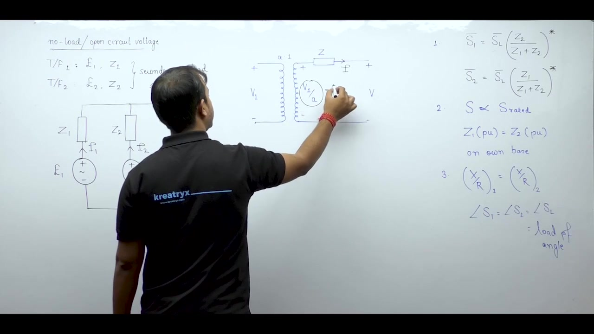

### Equivalent Network Model
The parallel system is modeled as two non-ideal voltage sources supplying a load impedance $Z_L$. The terminal voltage across the load is $V_L$. Transformer 1 supplies branch current $I_1$. Transformer 2 supplies branch current $I_2$. The total load current is $I_L$:

$$
I_L = I_1 + I_2
$$

Each branch equation relates terminal voltage to internal induced voltage:

$$
V_L = E_1 - I_1 Z_1
$$

$$
V_L = E_2 - I_2 Z_2
$$

Equating these two expressions allows us to analyze the circulating current and load sharing directly.

## Solving Unequal Voltage Ratios and Maximum Load Concept
_(01:12:34 - 01:17:37)_

### Solving for Branch Currents
Equating the expressions for load terminal voltage gives:

$$
E_1 - I_1 Z_1 = E_2 - I_2 Z_2 \implies I_1 Z_1 - I_2 Z_2 = E_1 - E_2
$$

The second equation comes from Kirchhoff's Current Law:

$$
I_1 + I_2 = I_L
$$

Multiply the second equation by $Z_2$ and add it to the first equation:

$$
I_1 (Z_1 + Z_2) = I_L Z_2 + (E_1 - E_2)
$$

Dividing by $(Z_1 + Z_2)$ yields:

$$
I_1 = I_L \left(\frac{Z_2}{Z_1 + Z_2}\right) + \frac{E_1 - E_2}{Z_1 + Z_2}
$$

Subtracting $I_1$ from $I_L$ gives $I_2$:

$$
I_2 = I_L \left(\frac{Z_1}{Z_1 + Z_2}\right) - \frac{E_1 - E_2}{Z_1 + Z_2}
$$

The first term is the load component, and the second term is the circulating current. If load current $I_L$ is not given, substitute $I_L = V_L / Z_L$ and solve using nodal analysis.

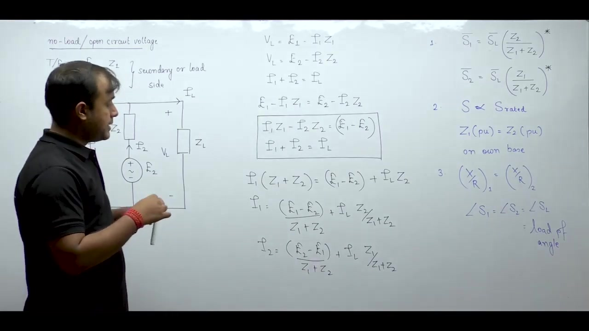

### Maximum Load Without Overloading
A common examination problem asks for the maximum load the parallel bank can supply without overloading any transformer.

Neither transformer must be operated beyond its rated capacity. The maximum load is reached when one of the transformers reaches its full rated output while the other operates at or below rated output.

> [!info] Overloading Criterion
> Compare the per-unit impedances of both transformers on their own respective bases. The transformer with the lower per-unit impedance carries more than its proportional share and overloads first.

## Maximum Load Determination Algorithm and Summary
_(01:17:40 - 01:20:28)_

### Step-by-Step Procedure for Maximum Loading
To determine the maximum load two parallel transformers can supply without overloading either unit, follow this systematic procedure:

1. **Step 1: Identify Which Transformer Overloads First**
   Compare the per-unit impedances of both transformers on their own respective bases:

$$
Z_{1, pu} \quad \text{vs} \quad Z_{2, pu}
$$

   The unit with the lower per-unit impedance delivers more power relative to its rating and overloads first. Suppose $Z_{2, pu} < Z_{1, pu}$. Then transformer 2 reaches its rated limit first.

2. **Step 2: Fix the Critical Transformer Output**
   Set the apparent power of the critical transformer to its full rated capacity at reference angle $0^\circ$:

$$
S_2 = S_{2, \text{rated}} \angle 0^\circ
$$

3. **Step 3: Compute the Other Transformer Output**
   Use the complex power sharing ratio:

$$
\frac{S_1}{S_2} = \left(\frac{Z_2}{Z_1}\right)^* \implies S_1 = S_2 \left(\frac{Z_2}{Z_1}\right)^*
$$

   Here $Z_1$ and $Z_2$ must be expressed in ohms or in per-unit on a common base. Because $Z_2 / Z_1$ is generally complex, $S_1$ has a magnitude $|S_1| < S_{1, \text{rated}}$ and a phase angle $\theta$.

4. **Step 4: Calculate Total Maximum Load**
   Add the apparent powers as phasors. Do not add their magnitudes directly:

$$
S_{\text{total}} = S_1 + S_2
$$

   The magnitude of the total permissible load is:

> [!success] Maximum Permissible Load
> $$
> |S_{\text{total}}| = \sqrt{S_1^2 + S_2^2 + 2 S_1 S_2 \cos\theta}
> $$

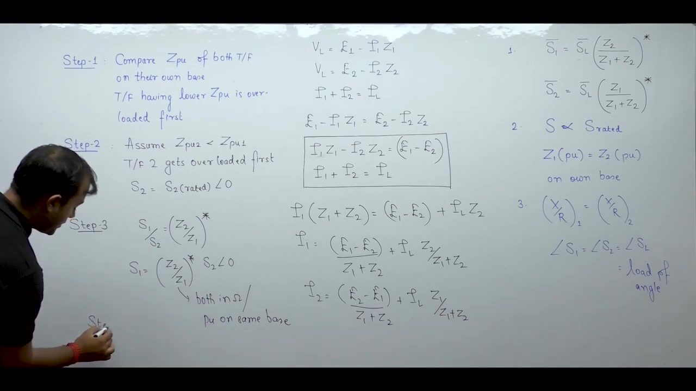

### Summary of Problem Categories
Parallel operation problems fall into three main categories:

1. **Given Total Load**: Find individual power sharing using the complex power formula with conjugated impedance factors.
2. **Unequal Voltage Ratios**: Solve the equivalent circuit using nodal analysis or loop equations to isolate circulating current from load current.
3. **Maximum Total Load**: Identify the limiting transformer using per-unit impedances on own base, then compute total capacity via phasor addition.

---

## Summary and Key Takeaways

- Parallel connection of transformers increases total current and power capacity while reducing equivalent series impedance and improving voltage regulation.
- Equal voltage ratios and identical polarities are necessary conditions for single-phase parallel operation to prevent circulating currents.
- Three-phase parallel operation additionally requires identical phase sequence and matching phasor groups to avoid phase angle differences across secondary windings.
- Circulating current between parallel transformers is given by $I_c = (V_1/a_1 - V_1/a_2)/(Z_1 + Z_2)$, which overloads one unit and increases total copper loss.
- When voltage ratios are equal, complex power divides according to $S_1 = S_L [Z_2 / (Z_1 + Z_2)]^*$ and $S_2 = S_L [Z_1 / (Z_1 + Z_2)]^*$.
- Load sharing is strictly proportional to rated kVA if and only if per-unit impedances on each transformer's own rating base are equal: $Z_{1,pu} = Z_{2,pu}$.
- Identical $X/R$ ratios ensure both transformers operate at the load power factor, allowing their apparent powers to add algebraically to maximize total capacity.
- The maximum load without overloading either unit is determined by setting the transformer with lower per-unit impedance on its own base to rated capacity and calculating total power by phasor sum.

