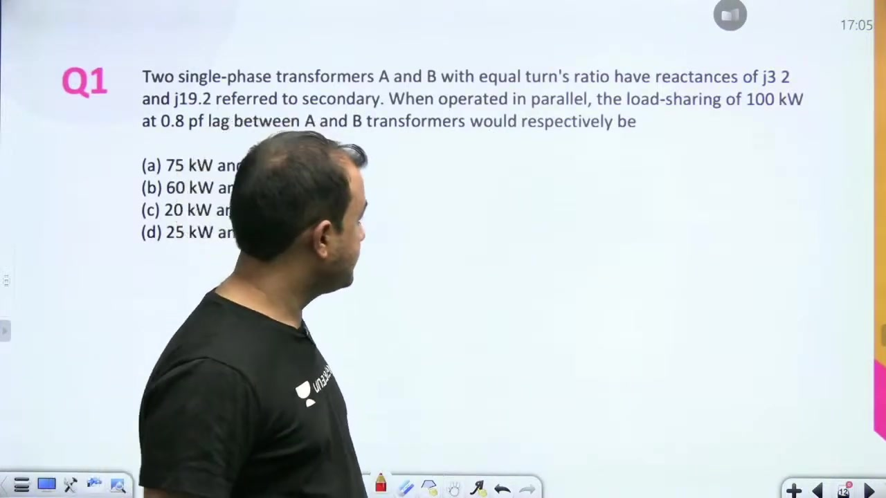
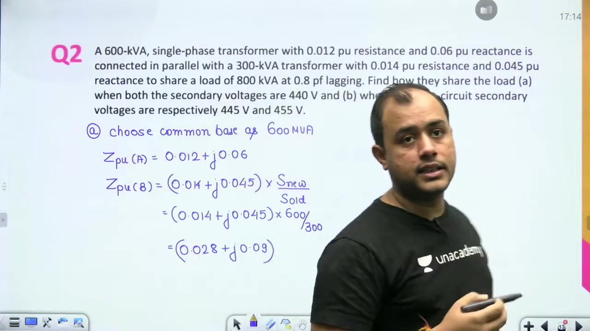
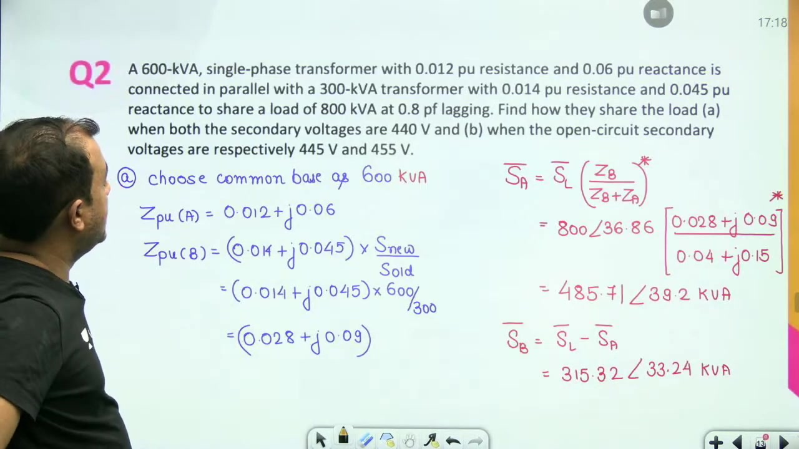
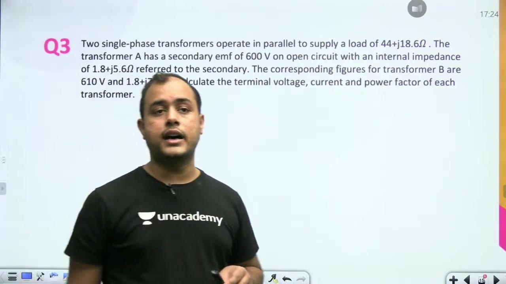
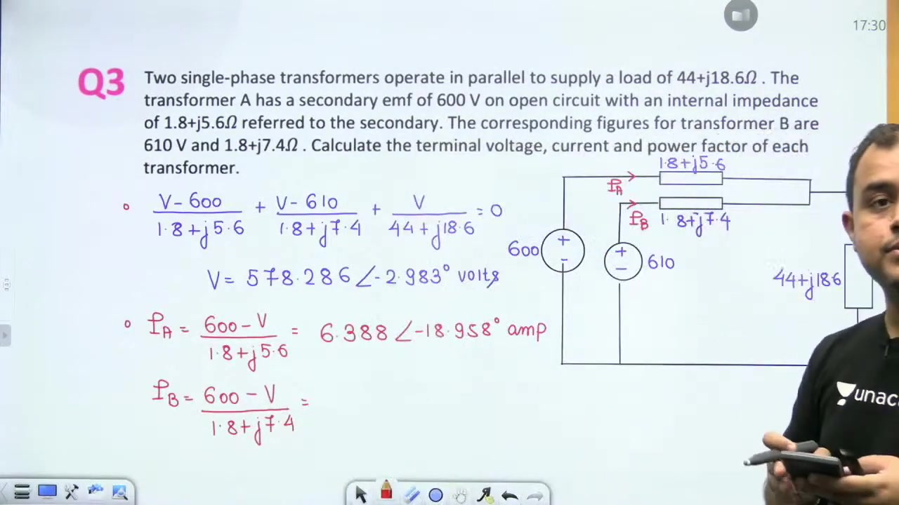
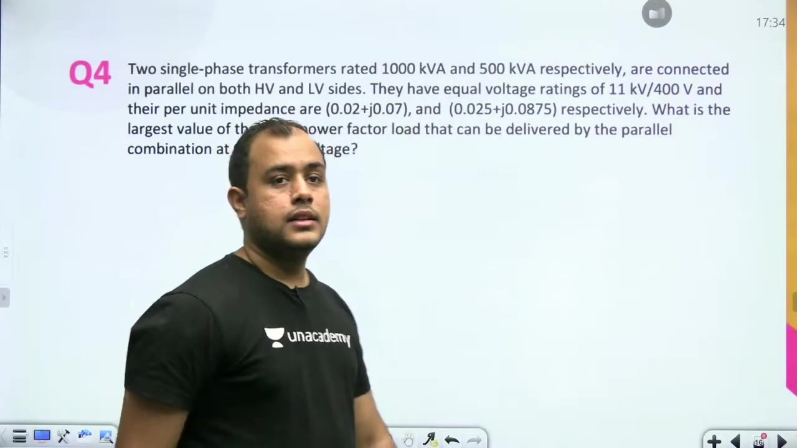
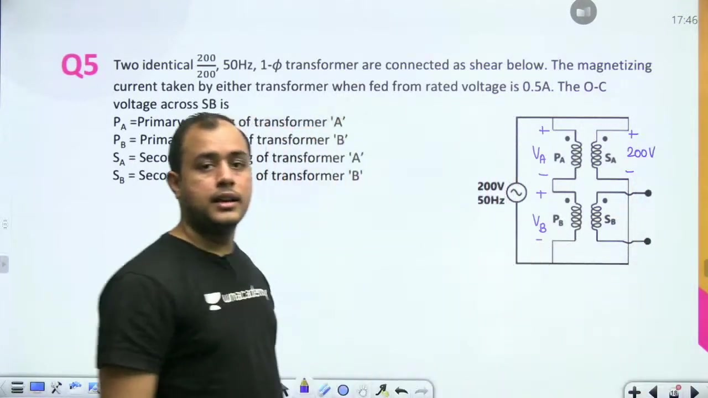
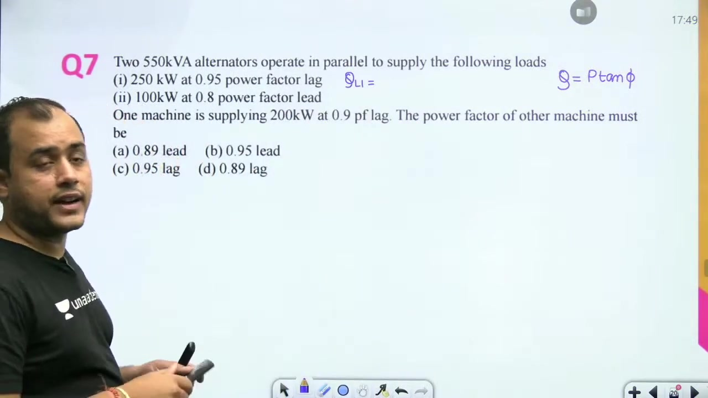
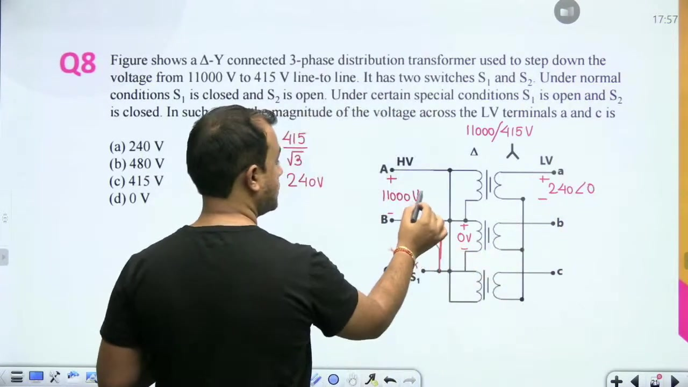
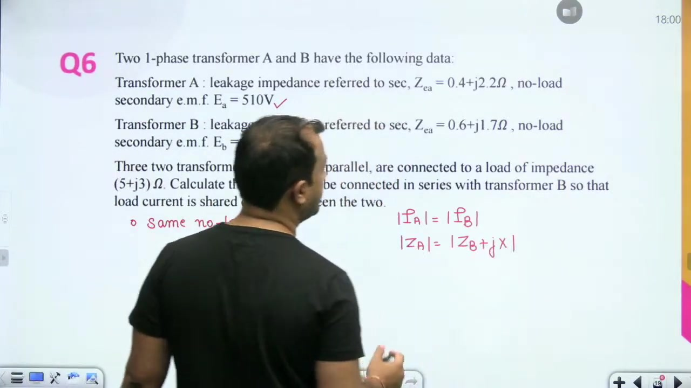

[← Lec 047: Parallel Operation of Transformers](Lecture_047_Parallel_Operation_of_Transformers.md) | [🏠 Index](00_yt_study_guide.md) | [Lec 049: Excitation Phenomenon 1 →](Lecture_049_Excitation_Phenomenon_1.md)

---

# Problems based on Parallel Operation of Transformer | L 16 | Electrical Machines | GATE 2022

- **Source**: https://www.youtube.com/watch?v=7f8Er86vHCM
- **Duration**: 01:04:18
- **Compiled**: 2026-09-21

---

## Overview

This problem-solving session works through representative examination problems on the parallel operation of transformers and alternators. It covers numerical methods for calculating complex power sharing, evaluating nodal equations with specified load impedances, and determining maximum permissible loading without exceeding ratings. The lecture also addresses conceptual questions on phasor groups, series-parallel configurations, and impedance modification for balanced load sharing.

## Contents

- [[#Introduction and Problem Solving Objectives|Introduction and Problem Solving Objectives]]
- [[#Problem 1: Load Sharing with Equal Turns Ratios|Problem 1: Load Sharing with Equal Turns Ratios]]
- [[#Problem 2 Setup and Base Conversion|Problem 2 Setup and Base Conversion]]
- [[#Problem 2 Part 1 Solution and Part 2 Formulation|Problem 2 Part 1 Solution and Part 2 Formulation]]
- [[#Problem 2 Part 2 Discussion and Problem 3 Formulation|Problem 2 Part 2 Discussion and Problem 3 Formulation]]
- [[#Problem 3: Nodal Analysis with Specified Load Impedance|Problem 3: Nodal Analysis with Specified Load Impedance]]
- [[#Problem 3 Power Factors and Problem 4 Setup|Problem 3 Power Factors and Problem 4 Setup]]
- [[#Problem 4: Overloading Principle and Maximum Load Formulation|Problem 4: Overloading Principle and Maximum Load Formulation]]
- [[#Problem 4 Solution and Problem 5 Series-Parallel Circuit|Problem 4 Solution and Problem 5 Series-Parallel Circuit]]
- [[#Problem 6: Parallel Alternators and Power Factor Determination|Problem 6: Parallel Alternators and Power Factor Determination]]
- [[#Conceptual Questions and Problem 7 Delta-Star Switching|Conceptual Questions and Problem 7 Delta-Star Switching]]
- [[#Problem 8: Series Reactance for Equal Load Sharing|Problem 8: Series Reactance for Equal Load Sharing]]

---

## Introduction and Problem Solving Objectives
_(00:04 - 04:55)_

### Problem Solving Session on Parallel Operation
This lecture is dedicated to numerical and conceptual problems on the parallel operation of transformers. Parallel operation is an essential topic in electrical machines. Examination problems frequently test load sharing, circulating currents, and maximum loading limits.

Mastering these problems requires understanding both circuit theory and transformer principles. The problem set covers various scenarios. These include transformers with equal and unequal voltage ratios, differing kVA ratings, and distinct impedance angles.

### Learning Strategy and Exam Preparation
Solving these numericals reinforces the theoretical conditions derived in previous lectures. When analyzing parallel transformers, always identify whether impedances are given in ohms or per-unit. Also check if the per-unit values are on each unit's own base or on a common base.

Students should write down complete circuit diagrams for each problem. Drawing the equivalent network clarifies current paths and voltage polarities. This prevents sign errors in circulating current calculations.

## Problem 1: Load Sharing with Equal Turns Ratios
_(04:55 - 10:52)_

### Problem Statement
> [!example] Problem 1
> Two single-phase transformers with equal turns ratios have secondary-referred reactances of $j3.2\,\Omega$ and $j19.2\,\Omega$. They operate in parallel to supply a 100 kW load at 0.8 power factor lagging. Determine the real power delivered by each transformer.

### Solution
First, compute the total complex power drawn by the load:

$$
S_L = \frac{P_L}{\cos\phi} = \frac{100\text{ kW}}{0.8} = 125\text{ kVA}
$$

Because the load operates at a lagging power factor, the load power factor angle is positive:

$$
S_L = 125 \angle +36.87^\circ\text{ kVA}
$$

The reactances of the two transformers are $Z_A = j3.2\,\Omega$ and $Z_B = j19.2\,\Omega$. Apply the complex power sharing formula:

$$
S_A = S_L \left(\frac{Z_B}{Z_A + Z_B}\right)^*
$$

Substitute the given impedance values:

$$
S_A = 125\angle 36.87^\circ \left(\frac{j19.2}{j3.2 + j19.2}\right)^*
$$

The imaginary unit $j$ cancels between numerator and denominator:

$$
\frac{19.2}{22.4} = \frac{6}{7}
$$

Since the ratio is purely real, the complex conjugate does not alter its value:

$$
S_A = 125 \times \frac{6}{7} \angle 36.87^\circ = \frac{750}{7} \angle 36.87^\circ\text{ kVA}
$$

Now calculate the real power delivered by transformer A:

$$
P_A = |S_A| \cos(36.87^\circ) = \frac{750}{7} \times 0.8 = \frac{600}{7} \approx 85.71\text{ kW}
$$

Subtract $P_A$ from the total load power to find the power delivered by transformer B:

$$
P_B = P_L - P_A = 100 - 85.71 = 14.29\text{ kW}
$$

> [!success] Result
> Transformer A delivers 85.71 kW and transformer B delivers 14.29 kW. Transformer A carries the majority of the load because its reactance is much smaller.

## Problem 2 Setup and Base Conversion
_(11:00 - 15:51)_

### Problem Statement
> [!example] Problem 2
> A 600 kVA single-phase transformer with per-unit impedance $0.012 + j0.054\text{ pu}$ operates in parallel with a 300 kVA single-phase transformer with per-unit impedance $0.014 + j0.048\text{ pu}$. They supply a total load of 800 kVA at 0.8 power factor lagging. 
> 
> 1. Calculate the load shared by each transformer when both have rated secondary voltages of 440 V.
> 2. Determine the load sharing when their open-circuit secondary voltages are 445 V and 455 V.

### Common Base Selection and Conversion
To apply the load sharing formula, both impedances must be expressed on a common base. Choose 600 kVA as the common base.

Transformer A is already rated at 600 kVA, so its per-unit impedance remains unchanged:

$$
Z_A = 0.012 + j0.054\text{ pu}
$$

Transformer B was specified on its own 300 kVA rating. Convert it to the 600 kVA base:

$$
Z_{B, \text{new}} = Z_{B, \text{old}} \left(\frac{S_{\text{base, new}}}{S_{\text{base, old}}}\right)
$$

Substitute the numbers:

$$
Z_{B, \text{new}} = (0.014 + j0.048) \times \left(\frac{600\text{ kVA}}{300\text{ kVA}}\right) = 0.028 + j0.096\text{ pu}
$$

Now calculate the sum of the branch impedances on the common base:

$$
Z_A + Z_B = (0.012 + 0.028) + j(0.054 + 0.096) = 0.040 + j0.150\text{ pu}
$$

### Complex Power Formula and Conjugation
The total load complex power is:

$$
S_L = 800 \angle +36.87^\circ\text{ kVA}
$$

Recall the complex power sharing formula:

$$
S_A = S_L \left(\frac{Z_B}{Z_A + Z_B}\right)^*
$$

This formula originates from current division. Because complex power is defined as $S = V I^*$, the current division ratio must be conjugated.

## Problem 2 Part 1 Solution and Part 2 Formulation
_(16:21 - 21:05)_

### Numerical Solution for Part 1
Evaluate the complex impedance ratio for transformer A:

$$
\frac{Z_B}{Z_A + Z_B} = \frac{0.028 + j0.096}{0.040 + j0.150} = \frac{0.100 \angle 73.74^\circ}{0.1552 \angle 75.07^\circ} = 0.6443 \angle -1.33^\circ
$$

Taking the complex conjugate reverses the angle sign:

$$
\left(\frac{Z_B}{Z_A + Z_B}\right)^* = 0.6443 \angle +1.33^\circ
$$

Now calculate the apparent power delivered by transformer A:

$$
S_A = 800\angle 36.87^\circ \times 0.6443\angle 1.33^\circ = 485.71 \angle 39.20^\circ\text{ kVA}
$$

Subtract $S_A$ from the total load apparent power to find $S_B$:

$$
S_B = S_L - S_A = 800\angle 36.87^\circ - 485.71\angle 39.20^\circ
$$

Converting both to rectangular form and subtracting gives:

$$
S_B = 315.32 \angle 33.24^\circ\text{ kVA}
$$

### Part 2 Formulation: Unequal Secondary Voltages
In Part 2, the open-circuit secondary voltages are unequal: $E_A = 445\text{ V}$ and $E_B = 455\text{ V}$. Both voltages are assumed in phase at reference angle $0^\circ$. 

Using base values of 440 V and 600 kVA, convert the voltages to per-unit:

$$
E_{A, pu} = \frac{445}{440} \approx 1.0114 \angle 0^\circ\text{ pu}
$$

$$
E_{B, pu} = \frac{455}{440} \approx 1.0341 \angle 0^\circ\text{ pu}
$$

The load is 800 kVA at 0.8 lagging. In per-unit on the 600 kVA base:

$$
S_{L, pu} = \frac{800}{600} = \frac{4}{3} \angle +36.87^\circ\text{ pu}
$$

The load terminal voltage is an unknown phasor $V\angle\theta$.

## Problem 2 Part 2 Discussion and Problem 3 Formulation
_(21:10 - 26:04)_

### Analytical Complexity of Part 2
In Part 2, the load current depends on the unknown terminal voltage $V\angle\theta$:

$$
I_L = \left(\frac{S_L}{V\angle\theta}\right)^* = \frac{4/3}{V} \angle(\theta - 36.87^\circ)
$$

Applying Kirchhoff's Current Law at the load node gives:

$$
\frac{V\angle\theta - 1.0114\angle 0^\circ}{0.012 + j0.054} + \frac{V\angle\theta - 1.0341\angle 0^\circ}{0.028 + j0.096} + \frac{4/3}{V} \angle(\theta - 36.87^\circ) = 0
$$

This equation is non-linear because $V$ appears in both the numerator and denominator. Solving it requires numerical iteration. 

Such tedious iterative calculations are not asked in competitive examinations. In examinations, either the load impedance or the terminal voltage is specified directly.

### Problem 3 Statement
> [!example] Problem 3
> Two transformers A and B operate in parallel to supply a common load impedance $Z_L = 44 + j18.6\,\Omega$. 
> 
> - Transformer A: Open-circuit secondary voltage $E_A = 600\text{ V}$, internal impedance $Z_A = 1.8 + j5.6\,\Omega$.
> - Transformer B: Open-circuit secondary voltage $E_B = 610\text{ V}$, internal impedance $Z_B = 1.8 + j7.4\,\Omega$.
> 
> Calculate the terminal voltage across the load, the current delivered by each transformer, and their operating power factors.

Because the load impedance is specified in ohms rather than as complex power, the nodal equation becomes purely linear. It can be solved directly in closed form.

## Problem 3: Nodal Analysis with Specified Load Impedance
_(26:33 - 31:47)_

### Nodal Formulation at the Load Node
Let the load terminal voltage be the phasor $V$. The reference node is the common return at 0 V. 

Write the nodal equation by summing the three branch currents leaving the load node:

$$
\frac{V - 600}{1.8 + j5.6} + \frac{V - 610}{1.8 + j7.4} + \frac{V}{44 + j18.6} = 0
$$

Convert the branch admittances to rectangular form:

$$
Y_A = \frac{1}{1.8 + j5.6} = \frac{1}{5.882\angle 72.18^\circ} = 0.1700 \angle -72.18^\circ = 0.0520 - j0.1617\,\text{S}
$$

The branch admittance of transformer B is:

$$
Y_B = \frac{1}{1.8 + j7.4} = \frac{1}{7.616\angle 76.33^\circ} = 0.1313 \angle -76.33^\circ = 0.0310 - j0.1276\,\text{S}
$$

The load admittance evaluates to:

$$
Y_L = \frac{1}{44 + j18.6} = \frac{1}{47.77\angle 22.92^\circ} = 0.0209 \angle -22.92^\circ = 0.0193 - j0.0081\,\text{S}
$$

Summing these admittances yields the total nodal admittance:

$$
Y_{\text{total}} = Y_A + Y_B + Y_L = 0.1023 - j0.2974\,\text{S} = 0.3145 \angle -71.02^\circ\,\text{S}
$$

The source injection current on the right hand side is:

$$
I_{\text{inj}} = 600 Y_A + 610 Y_B = (31.20 - j97.02) + (18.91 - j77.84) = 50.11 - j174.86\,\text{A} = 181.89 \angle -74.00^\circ\,\text{A}
$$

Solving for terminal voltage $V$:

$$
V = \frac{I_{\text{inj}}}{Y_{\text{total}}} = \frac{181.89\angle -74.00^\circ}{0.3145\angle -71.02^\circ} = 578.29 \angle -2.98^\circ\text{ V}
$$

### Branch Current Calculations
Now compute the current supplied by each transformer:

$$
I_A = \frac{600\angle 0^\circ - 578.29\angle -2.98^\circ}{1.8 + j5.6}
$$

The numerator evaluates to:

$$
600 - (577.50 - j30.06) = 22.50 + j30.06 = 37.55 \angle 53.18^\circ\text{ V}
$$

Dividing by $Z_A = 5.882\angle 72.18^\circ\,\Omega$:

$$
I_A = \frac{37.55\angle 53.18^\circ}{5.882\angle 72.18^\circ} = 6.39 \angle -19.00^\circ\text{ A}
$$

Similarly, for transformer B:

$$
I_B = \frac{610\angle 0^\circ - 578.29\angle -2.98^\circ}{1.8 + j7.4} = \frac{32.50 + j30.06}{7.616\angle 76.33^\circ} = \frac{44.27\angle 42.77^\circ}{7.616\angle 76.33^\circ} = 5.81 \angle -23.56^\circ\text{ A}
$$

## Problem 3 Power Factors and Problem 4 Setup
_(31:54 - 36:58)_

### Operating Power Factors for Problem 3
To find the operating power factor of each transformer, take the cosine of the phase angle difference between terminal voltage and branch current:

$$
\phi_A = \theta_V - \theta_{IA} = -2.98^\circ - (-19.00^\circ) = +16.02^\circ
$$

$$
\text{pf}_A = \cos(16.02^\circ) \approx 0.961\text{ lagging}
$$

For transformer B:

$$
\phi_B = \theta_V - \theta_{IB} = -2.98^\circ - (-23.56^\circ) = +20.58^\circ
$$

$$
\text{pf}_B = \cos(20.58^\circ) \approx 0.861\text{ lagging}
$$

> [!success] Problem 3 Summary
> - Terminal voltage: $578.29\angle -2.98^\circ\text{ V}$
> - Transformer A: $6.39\text{ A}$ at $0.961$ power factor lagging
> - Transformer B: $5.81\text{ A}$ at $0.861$ power factor lagging

### Problem 4 Statement and Maximum Loading Concepts
> [!example] Problem 4
> Two transformers operate in parallel to supply a unity power factor load at rated voltage:
> 
> - Transformer A: 1000 kVA, per-unit impedance $0.02 + j0.07\text{ pu}$ on its own base.
> - Transformer B: 500 kVA, per-unit impedance $0.025 + j0.0875\text{ pu}$ on its own base.
> 
> Determine the largest unity power factor load that can be supplied without overloading either transformer.

A common pitfall is attempting to apply the maximum power transfer theorem. Setting the load resistance to the Thevenin impedance magnitude:

$$
R_L = |Z_{th}| = |Z_A \parallel Z_B| \approx 0.052\text{ pu}
$$

This would result in a load power of nearly $1 / 0.052 \approx 19.2\text{ pu}$. Such a massive load would destroy both transformers. 

In power engineering, maximum loading is always constrained by thermal ratings. No transformer must carry more than its rated kVA.

## Problem 4: Overloading Principle and Maximum Load Formulation
_(36:58 - 41:57)_

### The Overloading Principle
The correct strategy for maximum permissible loading relies on comparing per-unit impedances on each unit's own rating base:

> [!info] Overloading Principle
> The transformer having the lower per-unit impedance on its own rating base carries more than its proportional share of load. Therefore, it reaches its rated capacity first.

Evaluate the magnitude of each transformer's impedance on its own base:

$$
|Z_{A, pu}| = \sqrt{0.02^2 + 0.07^2} = \sqrt{0.0053} \approx 0.0728\text{ pu}
$$

$$
|Z_{B, pu}| = \sqrt{0.025^2 + 0.0875^2} = \sqrt{0.00828} \approx 0.0910\text{ pu}
$$

Comparing the two magnitudes:

$$
|Z_{A, pu}| < |Z_{B, pu}|
$$

Transformer A has a lower per-unit impedance on its own base. Therefore, transformer A reaches full rated load before transformer B.

### Step-by-Step Load Formulation
To determine the maximum load without exceeding ratings:

1. **Fix Transformer A at Full Rating**:
   Because transformer A overloads first, set its delivered apparent power to its full rating at angle $0^\circ$:

$$
S_A = 1000 \angle 0^\circ\text{ kVA}
$$

2. **Convert Transformer B to the Common Base**:
   To calculate the power shared by transformer B, both impedances must be expressed on the same base. Choose 1000 kVA as the common base:

$$
Z_B = (0.025 + j0.0875) \times \left(\frac{1000\text{ kVA}}{500\text{ kVA}}\right) = 0.05 + j0.175\text{ pu}
$$

3. **Formulate the Power Ratio**:
   Apply the power ratio formula using impedances on the common base:

$$
\frac{S_B}{S_A} = \left(\frac{Z_A}{Z_B}\right)^* \implies S_B = S_A \left(\frac{Z_A}{Z_B}\right)^*
$$

Remember this rule: compare impedances on their own base to find the limiting unit, but use a common base to compute power sharing.

## Problem 4 Solution and Problem 5 Series-Parallel Circuit
_(41:57 - 47:37)_

### Numerical Solution for Problem 4
Substitute the common-base impedances into the power ratio expression:

$$
S_B = 1000\angle 0^\circ \left(\frac{0.02 + j0.07}{0.05 + j0.175}\right)^*
$$

Examine the relation between the numerator and denominator:

$$
\frac{0.05}{0.02} = 2.5, \quad \frac{0.175}{0.07} = 2.5
$$

The denominator is exactly 2.5 times the numerator. Both have identical impedance angles:

$$
\frac{Z_A}{Z_B} = \frac{1}{2.5} = 0.4
$$

Because this ratio is a purely real scalar:

$$
S_B = 1000\angle 0^\circ \times 0.4 = 400\angle 0^\circ\text{ kVA}
$$

Both transformers operate at unity power factor in phase with each other. Add the two powers directly:

$$
S_{\text{max}} = S_A + S_B = 1000 + 400 = 1400\text{ kVA}
$$

> [!success] Result
> The maximum unity power factor load the parallel combination can supply without overloading either transformer is 1400 kW (1400 kVA at UPF).

### Problem 5: Series-Parallel Transformer Network
> [!example] Problem 5
> Two identical 200/200 V, 50 Hz transformers A and B have their primary windings connected in series across a 200 V AC source. Secondary winding $S_A$ is connected directly across the same 200 V source. Determine the open-circuit voltage across secondary winding $S_B$.

Let $V_A$ and $V_B$ be the primary winding voltages. Winding $S_A$ is connected directly across the 200 V source, fixing its terminal voltage at 200 V:

$$
V_{SA} = 200\text{ V}
$$

Because the turns ratio is 200/200 (unity), the induced primary voltage is:

$$
V_A = V_{SA} = 200\text{ V}
$$

The two primary windings are connected in series across the 200 V source:

$$
V_A + V_B = 200\text{ V} \implies 200 + V_B = 200\text{ V} \implies V_B = 0\text{ V}
$$

With zero primary voltage across transformer B, its secondary induced voltage must also be zero:

$$
V_{SB} = 0\text{ V}
$$

## Problem 6: Parallel Alternators and Power Factor Determination
_(47:39 - 52:42)_

### Problem Statement
> [!example] Problem 6
> Two 500 kVA alternators operate in parallel to supply a combined system load consisting of:
> 
> - Load 1: 250 kW at 0.95 power factor lagging
> - Load 2: 100 kW at 0.80 power factor leading
> 
> Alternator 1 supplies 200 kW at 0.90 power factor lagging. Determine the operating power factor of alternator 2.

### Active and Reactive Power Balances
Total active power supplied by both alternators must equal total active power drawn by both loads:

$$
P_{\text{total}} = P_{L1} + P_{L2} = 250 + 100 = 350\text{ kW}
$$

$$
P_{G1} + P_{G2} = P_{\text{total}} \implies 200 + P_{G2} = 350 \implies P_{G2} = 150\text{ kW}
$$

Now calculate the reactive power drawn by each load:

$$
Q_{L1} = P_{L1} \tan(\arccos 0.95) = 250 \tan(18.19^\circ) = +82.17\text{ kVAR}
$$

Because Load 2 has a leading power factor, its reactive power is negative:

$$
Q_{L2} = -P_{L2} \tan(\arccos 0.80) = -100 \tan(36.87^\circ) = -75.00\text{ kVAR}
$$

Sum the load reactive powers:

$$
Q_{\text{total}} = Q_{L1} + Q_{L2} = 82.17 - 75.00 = +7.17\text{ kVAR}
$$

Alternator 1 operates at 0.90 power factor lagging:

$$
Q_{G1} = P_{G1} \tan(\arccos 0.90) = 200 \tan(25.84^\circ) = +96.86\text{ kVAR}
$$

Applying reactive power conservation across the parallel system:

$$
Q_{G1} + Q_{G2} = Q_{\text{total}} \implies 96.86 + Q_{G2} = 7.17 \implies Q_{G2} = -89.69\text{ kVAR}
$$

### Power Factor Calculation
The negative sign indicates that alternator 2 operates at a leading power factor. Compute the total apparent power of alternator 2:

$$
S_{G2} = \sqrt{P_{G2}^2 + Q_{G2}^2} = \sqrt{150^2 + (-89.69)^2} = \sqrt{30544.3} \approx 174.77\text{ kVA}
$$

Calculate the operating power factor:

$$
\text{pf}_2 = \frac{P_{G2}}{S_{G2}} = \frac{150}{174.77} \approx 0.858\text{ leading}
$$

> [!success] Result
> Alternator 2 operates at 0.858 power factor leading.

## Conceptual Questions and Problem 7 Delta-Star Switching
_(52:43 - 59:19)_

### Review of Conceptual Conditions
The instructor reinforces three key principles through conceptual problems:

1. **Determinant of Load Sharing**: Load sharing between parallel transformers depends on per-unit impedance.
2. **Phase Displacement in Three-Phase Banks**: For parallel operation of three-phase transformers, both banks must have identical phase shifts. Connections from the same phasor group (such as $Y\text{-}d$ and $D\text{-}y$) can operate in parallel.
3. **Proportional Sharing Criterion**: For load sharing to be proportional to rated kVA, per-unit impedances on their own respective bases must be equal:

$$
\frac{S_1}{S_2} = \frac{S_{1, \text{rated}}}{S_{2, \text{rated}}} \iff Z_{1, pu} = Z_{2, pu} \quad (\text{on own base})
$$

### Problem 7: Delta-Star Transformer Under Switch Fault
> [!example] Problem 7
> An 11000/415 V line-to-line, delta-star connected three-phase transformer has two switches $S_1$ and $S_2$. Under a special condition, $S_1$ is open and $S_2$ is closed, shorting terminals B and C together. An 11000 V supply is applied across terminals A and B. Find the magnitude of voltage across secondary terminals A and C.

Because switch $S_2$ is closed, terminals B and C are shorted:

$$
V_{BC} = 0\text{ V}
$$

Across terminals A and B, the applied voltage is:

$$
V_{AB} = 11000 \angle 0^\circ\text{ V}
$$

In a delta winding, the sum of phase voltages around the closed loop must equal zero:

$$
V_{AB} + V_{BC} + V_{CA} = 0 \implies 11000\angle 0^\circ + 0 + V_{CA} = 0 \implies V_{CA} = -11000\text{ V} = 11000\angle 180^\circ\text{ V}
$$

The secondary is star-connected with rated line-to-line voltage of 415 V. The secondary phase voltage magnitude is:

$$
V_{ph, \text{sec}} = \frac{415}{\sqrt{3}} \approx 240\text{ V}
$$

Phase voltages induced on the secondary are:

$$
V_{an} = 240 \angle 0^\circ\text{ V}, \quad V_{bn} = 0\text{ V}, \quad V_{cn} = 240 \angle 180^\circ\text{ V}
$$

Now calculate the line-to-line voltage between secondary terminals A and C:

$$
V_{AC} = V_{an} - V_{cn} = 240\angle 0^\circ - 240\angle 180^\circ = 240 - (-240) = 480\text{ V}
$$

> [!success] Result
> The voltage across secondary terminals A and C is 480 V.

## Problem 8: Series Reactance for Equal Load Sharing
_(59:21 - 01:04:09)_

### Problem Statement
> [!example] Problem 8
> Two single-phase transformers A and B with equal no-load secondary EMFs operate in parallel to supply a common load. Their internal impedances referred to the secondary are:
> 
> $$
> Z_A = 0.4 + j2.2\,\Omega, \quad Z_B = 0.6 + j1.6\,\Omega
> $$
> 
> Calculate the external reactance to be connected in series with transformer B so that the load current is shared equally between the two transformers.

### Derivation and Solution
Because the no-load secondary EMFs are identical, the circuit simplifies to a single equivalent voltage source feeding two parallel branches. 

The load current divides between the branches in inverse proportion to their impedances:

$$
\frac{I_A}{I_B} = \frac{Z_B'}{Z_A}
$$

For the load current to be shared equally in magnitude:

$$
|I_A| = |I_B| \iff |Z_A| = |Z_B'|
$$

Let the additional reactance connected in series with transformer B be $jX$. The total impedance of branch B becomes:

$$
Z_B' = Z_B + jX = 0.6 + j(1.6 + X)\,\Omega
$$

Equating the squares of the impedance magnitudes:

$$
|Z_A|^2 = |Z_B'|^2 \implies 0.4^2 + 2.2^2 = 0.6^2 + (1.6 + X)^2
$$

Evaluate the left hand side:

$$
0.16 + 4.84 = 5.00
$$

Substitute into the equation:

$$
5.00 = 0.36 + (1.6 + X)^2 \implies (1.6 + X)^2 = 5.00 - 0.36 = 4.64
$$

Taking the square root:

$$
1.6 + X = \sqrt{4.64} \approx 2.154\,\Omega
$$

Solving for reactance $X$:

$$
X = 2.154 - 1.6 = 0.554\,\Omega
$$

> [!success] Result
> A series reactance of $0.554\,\Omega$ connected in series with transformer B ensures equal current sharing between the two transformers.

### Summary of Problem Categories and Next Topics
The problem-solving session establishes four key categories of parallel operation problems:

1. **Load Sharing with Equal Turns Ratios**: Solve using the conjugated complex power sharing formula.
2. **Unequal Secondary Voltages or Specified Load Impedance**: Solve using nodal analysis at the load terminal.
3. **Maximum Permissible Load**: Find the limiting transformer by comparing per-unit impedances on their own base, then compute total capacity by phasor addition.
4. **Impedance Modification**: Adjust branch impedance magnitudes to achieve equal or targeted current sharing.

Upcoming sessions will cover transformer harmonics, electromechanical energy conversion, and DC machines.

---

## Summary and Key Takeaways

- For parallel transformers with equal turns ratios, complex power is shared according to $S_A = S_L [Z_B / (Z_A + Z_B)]^*$, where impedances must be in ohms or per-unit on a common base.
- When load impedance is given in ohms rather than complex power, nodal analysis yields a linear equation for the terminal voltage $V = I_{\text{inj}} / Y_{\text{total}}$.
- The maximum load without overloading either transformer is found by identifying the unit with lower per-unit impedance on its own base and fixing it at rated capacity.
- In series-parallel transformer circuits, fixing the secondary voltage of one unit directly across the supply forces zero net voltage across the remaining series primary winding.
- In parallel alternator systems, individual operating power factors are determined through independent active and reactive power balance equations: $\sum P_G = \sum P_L$ and $\sum Q_G = \sum Q_L$.
- Three-phase transformers can operate in parallel only if they belong to the same phasor group with matching phase displacement.
- Load current is shared equally in magnitude between two parallel units with identical no-load EMFs when their total branch impedance magnitudes are equal: $|Z_A| = |Z_B + jX|$.

---

[← Lec 047: Parallel Operation of Transformers](Lecture_047_Parallel_Operation_of_Transformers.md) | [🏠 Index](00_yt_study_guide.md) | [Lec 049: Excitation Phenomenon 1 →](Lecture_049_Excitation_Phenomenon_1.md)
