# Electrical Machines | Lec 33 | Excitation Phenomenon - 1 | GATE/ESE Electrical Engineering

- **Source**: https://www.youtube.com/watch?v=rBRZW_8Meng
- **Duration**: 01:21:13
- **Compiled**: 2026-09-21

---

## Overview

This lecture examines the excitation phenomenon in transformers under non-linear magnetic core conditions. When magnetic saturation is accounted for, core flux and magnetizing current cannot be sinusoidal at the same time. A sinusoidal flux forces the magnetizing current into a sharply peaked waveform with a dominant third harmonic. Conversely, constraining the current to a sinusoid clips the core flux into a flat-topped wave, which induces dangerous spiky voltages across connected loads. Incorporating hysteresis shifts the excitation current ahead of the flux by the hysteresis angle $\beta$ to supply active core losses.

## Contents

- [[#Introduction to Excitation Phenomena and Non-Linear Magnetization|Introduction to Excitation Phenomena and Non-Linear Magnetization]]
- [[#Derivation of Magnetizing Current Waveform Under Saturation|Derivation of Magnetizing Current Waveform Under Saturation]]
- [[#Fourier Series Representation and Harmonics of Magnetizing Current|Fourier Series Representation and Harmonics of Magnetizing Current]]
- [[#Half-Wave Symmetry and Harmonic Content in Magnetizing Current|Half-Wave Symmetry and Harmonic Content in Magnetizing Current]]
- [[#Dominance of the Third Harmonic and Synthesis of Peaky Current|Dominance of the Third Harmonic and Synthesis of Peaky Current]]
- [[#Fourier Series of Peaky Magnetizing Current and Effect of Hysteresis|Fourier Series of Peaky Magnetizing Current and Effect of Hysteresis]]
- [[#Derivation of Excitation Current Waveform with Hysteresis|Derivation of Excitation Current Waveform with Hysteresis]]
- [[#Phase Lead of Excitation Current and the Hysteresis Angle|Phase Lead of Excitation Current and the Hysteresis Angle]]
- [[#Phasor Relationships and Current Decomposition|Phasor Relationships and Current Decomposition]]
- [[#Dynamic B-H Loops and the Full Core Loss Current|Dynamic B-H Loops and the Full Core Loss Current]]
- [[#Case 2: Sinusoidal Magnetizing Current and Flat-Topped Flux|Case 2: Sinusoidal Magnetizing Current and Flat-Topped Flux]]
- [[#Harmonic Synthesis of Flat-Topped Flux|Harmonic Synthesis of Flat-Topped Flux]]
- [[#Induced EMF Under Flat-Topped Flux and Harmonic Amplification|Induced EMF Under Flat-Topped Flux and Harmonic Amplification]]
- [[#Peaked Induced EMF, Core Losses, and Synthesis Summary|Peaked Induced EMF, Core Losses, and Synthesis Summary]]
- [[#Mutual Exclusivity of Sinusoids and Non-Saturating Cores|Mutual Exclusivity of Sinusoids and Non-Saturating Cores]]

---

## Introduction to Excitation Phenomena and Non-Linear Magnetization
_(00:13 - 09:01)_

### Non-Linearities in Practical Transformers

In ideal transformer modeling, several assumptions simplify the analysis. We assume zero winding resistance and zero leakage flux. We also assume infinite core permeability and a linear magnetization characteristic.

When building practical transformer models, most ideal assumptions are discarded. Core loss resistance models hysteresis and eddy currents. Leakage reactance models leakage flux. However, the magnetization curve was still assumed linear.

In real ferromagnetic cores, the $B-H$ curve is never linear. It exhibits two distinct non-linear features:
1. Magnetic saturation
2. Magnetic hysteresis

> [!info] Definition: Excitation Phenomenon
> The excitation phenomenon describes the waveforms of excitation current, core flux, and induced EMF in a transformer with a non-linear magnetization curve.

### Relationship Between B-H Curve and Φ-i Characteristic

Ferromagnetic materials exhibit a non-linear relationship between flux density $B$ and magnetic field intensity $H$. We can map the material $B-H$ curve directly to the transformer core $\Phi-i$ characteristic.

Magnetic field intensity $H$ relates to the excitation current $i$ through Ampere's Law:

$$H = \frac{N i}{l}$$

Here, $N$ is the number of turns and $l$ is the mean magnetic path length. Thus, field intensity is directly proportional to current:

$$H \propto i$$

Core magnetic flux $\Phi$ relates to flux density $B$ across core cross-sectional area $A$:

$$\Phi = B \cdot A \implies B = \frac{\Phi}{A}$$

Thus, flux density is directly proportional to core flux:

$$B \propto \Phi$$

Because $B \propto \Phi$ and $H \propto i$, the shape of the $\Phi-i$ characteristic mirrors the $B-H$ curve of the core material.

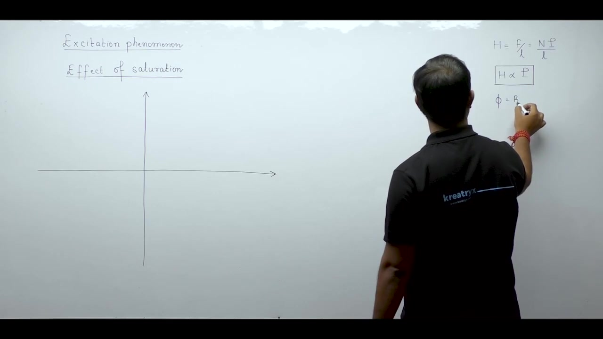

### Effect of Non-Linearity on Waveforms

In an ideal linear core with reluctance $\mathcal{R}$, magnetizing current and core flux follow:

$$\Phi(t) = \frac{N I_\mu(t)}{\mathcal{R}}$$

If magnetizing current is sinusoidal:

$$I_\mu(t) = I_m \sin(\omega t)$$

Then core flux is also sinusoidal:

$$\Phi(t) = \Phi_m \sin(\omega t)$$

Both current and flux remain sinusoidal together in a linear medium.

In a ferromagnetic core, saturation and hysteresis destroy this simultaneous sinusoidality. When both effects are present, flux and magnetizing current cannot be sinusoidal at the same time. Only one of them can be sinusoidal.

Transformers connect to sinusoidal AC voltage sources. The applied voltage fixes the core flux through Faraday's Law:

$$v(t) = N \frac{d\Phi}{dt}$$

Integrating a sinusoidal voltage gives a sinusoidal core flux:

$$\Phi(t) = \Phi_m \sin(\omega t)$$

Because the flux is sinusoidal, the non-linear $\Phi-i$ curve forces the required magnetizing current $I_\mu(t)$ to become non-sinusoidal and distorted.

At no-load, the total excitation current $I_0$ contains two components:
1. Magnetizing current $I_\mu$ to establish core flux
2. Core loss current $I_w$ to supply hysteresis and eddy current losses

To understand how distortion arises, we separate these factors. First, we examine saturation alone, neglecting hysteresis and core losses.

## Derivation of Magnetizing Current Waveform Under Saturation
_(09:01 - 14:42)_

### Graphical Synthesis of Magnetizing Current

We assume a sinusoidal AC voltage supply connects to the primary winding. The applied voltage forces a sinusoidal core flux:

$$\Phi(t) = \Phi_m \sin(\omega t)$$

We ignore core loss and hysteresis to isolate the effect of saturation. The excitation current then contains only the magnetizing component $I_\mu(t)$.

The saturation curve relates core flux $\Phi$ to magnetizing current $I_\mu$. In the initial region, the curve rises with a steep linear slope. Above the knee point, the core enters saturation. The curve bends over and flattens.

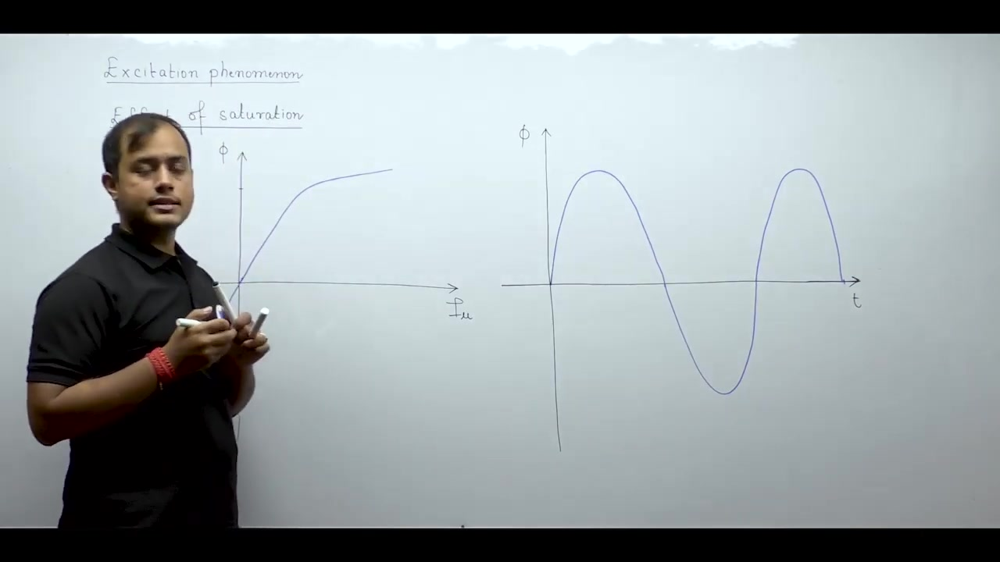

### Point-by-Point Projection from Φ-i Characteristic

We find the waveform of $I_\mu(t)$ using point-by-point graphical projection:
1. Plot the saturation characteristic $\Phi$ versus $I_\mu$ in the second quadrant.
2. Plot the sinusoidal flux $\Phi(t)$ versus time in the first quadrant.
3. For any instant of time $t_1$, read the value of flux $\Phi(t_1)$.
4. Project this flux value horizontally onto the saturation curve.
5. Read the required magnetizing current $I_\mu$ on the horizontal axis.
6. Project this current value vertically into the current-time coordinate system.

At low flux levels, small changes in flux require small increments in current. The points rise gradually.

As flux nears its peak $\Phi_m$, the core enters deep saturation. The slope of the $\Phi-I_\mu$ curve drops sharply.

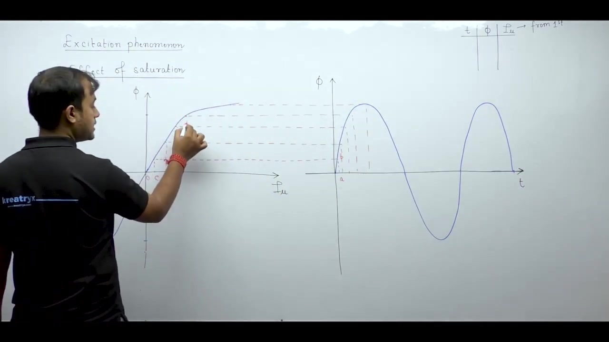

### Physical Origin of the Peaked Current Waveform

The slope of the magnetization curve represents the differential inductance:

$$\text{Slope} = \frac{\Delta \Phi}{\Delta I_\mu}$$

Rearranging gives the required current change for a given change in flux:

$$\Delta I_\mu = \frac{\Delta \Phi}{\text{Slope}}$$

When the core operates on the steep unsaturated linear region, the slope is large. A modest current $\Delta I_\mu$ easily produces the required flux change $\Delta \Phi$.

When the core enters saturation, the curve flattens. The slope becomes very small. To produce the same increment in flux $\Delta \Phi$, the required current change $\Delta I_\mu$ becomes massive.

$$\Delta I_\mu \gg 0 \quad \text{when} \quad \text{Slope} \to 0$$

Near the crest of the flux wave, the current must surge abruptly to push the core deeper into saturation.

> [!success] Result: Waveform Shape Under Saturation
> For a sinusoidal core flux, saturation distorts the magnetizing current $I_\mu(t)$ into a sharply peaked, non-sinusoidal waveform. The peak of current coincides exactly with the peak of flux.

The negative half-cycle follows identical symmetric behavior. Thus, the resulting magnetizing current waveform is symmetrical and sharply peaked.

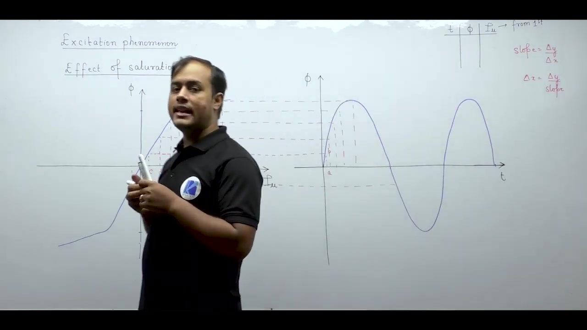

## Fourier Series Representation and Harmonics of Magnetizing Current
_(14:52 - 20:57)_

### Periodicity and Non-Sinusoidal Nature of Iμ

The synthesized magnetizing current waveform shows distinct non-sinusoidal behavior. In the linear region, current rises gradually. As the core approaches saturation, current shoots up rapidly to a high peak.

Because the $\Phi-i$ characteristic is monotonically increasing, maximum current occurs exactly at maximum flux:

$$I_{\mu,\text{max}} \iff \Phi = \Phi_m$$

The excitation current is non-sinusoidal. But it is strictly periodic because the driving flux waveform is periodic with period $T$:

$$I_\mu(t + T) = I_\mu(t)$$

Any periodic, non-sinusoidal waveform can be represented as a sum of harmonically related sinusoids using Fourier analysis.

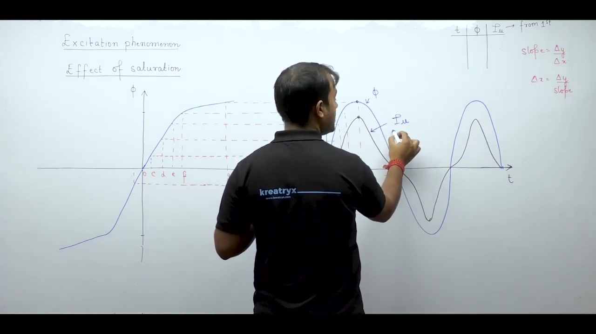

### Fourier Series Expansion and Harmonics

A pure sinusoid like flux $\Phi(t) = \Phi_m \sin(\omega t)$ contains only one frequency component. It needs no series expansion.

A non-sinusoidal periodic waveform contains multiple sinusoidal terms:

$$I_\mu(t) = c_1 \sin(\omega t + \theta_1) + c_2 \sin(2\omega t + \theta_2) + c_3 \sin(3\omega t + \theta_3) + \dots$$

> [!info] Definition: Harmonics
> In a Fourier series, sinusoidal components with frequencies that are integer multiples of the base fundamental frequency $\omega$ are called harmonics.

The term with $n = 1$ is the fundamental component. It operates at frequency $\omega$.

Terms with $n > 1$ are harmonics. Their frequencies equal $n\omega$.

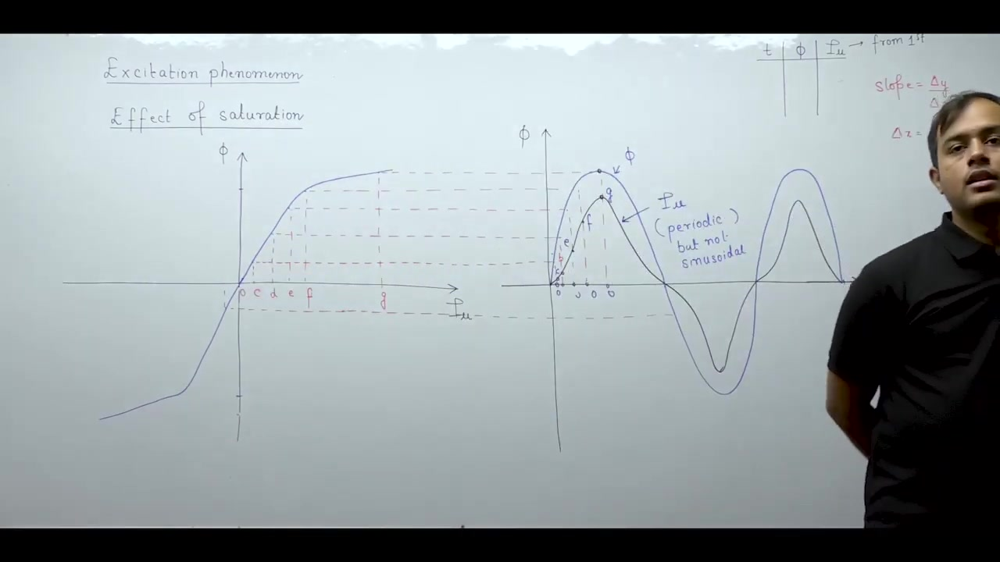

### Characteristics of the Peaky Waveform

The magnetizing current waveform exhibits two key geometric properties:
1. It rises to a sharp crest.
2. It is symmetrical about its positive and negative peak values.

Because of its sharp crest, this waveform is described as peaky.

In an ideal core without saturation, the magnetizing current would be purely sinusoidal:

$$I_{\mu,\text{ideal}}(t) = I_m \sin(\omega t)$$

In a saturable ferromagnetic core, saturation distorts the current into this peaky shape. The peaky current supplies the extra MMF needed to sustain the sinusoidal flux through saturated iron.

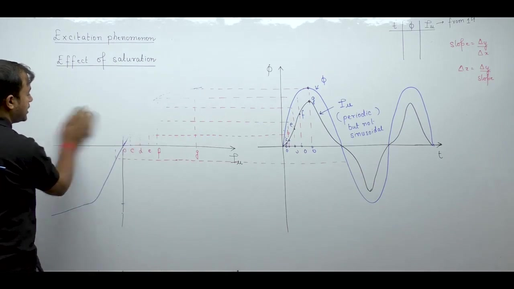

## Half-Wave Symmetry and Harmonic Content in Magnetizing Current
_(20:57 - 26:14)_

### Trigonometric Fourier Series Formulation

Any periodic current $i(t)$ with period $T = \frac{2\pi}{\omega_0}$ expands into a trigonometric Fourier series:

$$i(t) = a_0 + \sum_{n=1}^{\infty} \left[ a_n \cos(n\omega_0 t) + b_n \sin(n\omega_0 t) \right]$$

Here, $a_0$ is the DC average component:

$$a_0 = \frac{1}{T} \int_0^T i(t) \, dt$$

The harmonic coefficients are:

$$\begin{aligned}
a_n &= \frac{2}{T} \int_0^T i(t) \cos(n\omega_0 t) \, dt \\
b_n &= \frac{2}{T} \int_0^T i(t) \sin(n\omega_0 t) \, dt
\end{aligned}$$

Waveform symmetries eliminate certain coefficient sets:
1. **Even symmetry**: If $i(-t) = i(t)$, then $b_n = 0$. The series contains only cosine terms.
2. **Odd symmetry**: If $i(-t) = -i(t)$, then $a_n = 0$. The series contains only sine terms.

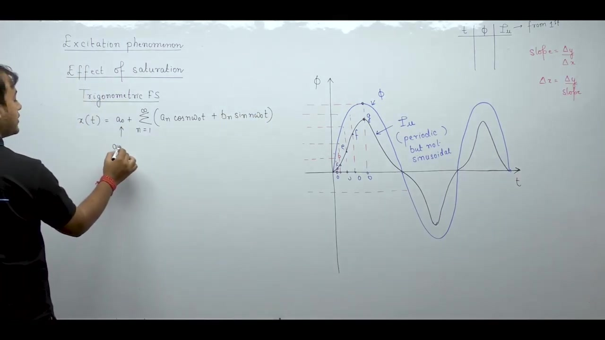

### Condition for Half-Wave Symmetry

In electrical machines, the most common waveform property is half-wave symmetry.

> [!info] Definition: Half-Wave Symmetry
> A periodic waveform $f(t)$ has half-wave symmetry if shifting it by half a period inverts its sign:
> $$f\left(t \pm \frac{T}{2}\right) = -f(t)$$

Divide one full cycle of period $T$ into two equal half-cycles:
- First half-cycle: $0 \le t < \frac{T}{2}$
- Second half-cycle: $\frac{T}{2} \le t < T$

The negative half-cycle is the exact inverted mirror image of the positive half-cycle across the time axis.

A standard sine wave exhibits half-wave symmetry:

$$\sin\left(\omega t + \pi\right) = -\sin(\omega t)$$

The magnetizing current $I_\mu(t)$ also satisfies this condition. The negative peak is identical in magnitude and shape to the positive peak, but inverted.

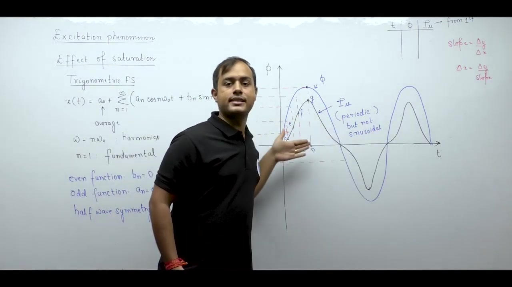

### Elimination of Even Harmonics

Half-wave symmetry places a strict mathematical constraint on the Fourier series harmonic orders.

The Fourier coefficients satisfy:

$$\begin{aligned}
a_n &= \frac{2}{T} \int_0^T i(t) \cos(n\omega_0 t) \, dt \\
&= \frac{2}{T} \left[ \int_0^{T/2} i(t) \cos(n\omega_0 t) \, dt + \int_{T/2}^T i(t) \cos(n\omega_0 t) \, dt \right]
\end{aligned}$$

Substitute $\tau = t - \frac{T}{2}$ in the second integral. Using $i(\tau + T/2) = -i(\tau)$:

$$\int_{T/2}^T i(t) \cos(n\omega_0 t) \, dt = -\int_0^{T/2} i(\tau) \cos(n\omega_0 \tau + n\pi) \, d\tau$$

For even harmonic orders ($n = 2, 4, 6, \dots$), $\cos(n\omega_0 \tau + n\pi) = \cos(n\omega_0 \tau)$. The two half-cycle integrals cancel completely:

$$a_n = 0, \quad b_n = 0 \quad \text{for even } n$$

For odd harmonic orders ($n = 1, 3, 5, \dots$), $\cos(n\omega_0 \tau + n\pi) = -\cos(n\omega_0 \tau)$. The two integrals add constructively.

> [!success] Result: Absence of Even Harmonics
> Any waveform with half-wave symmetry contains zero DC component and zero even harmonics. It contains strictly odd harmonics:
> $$n = 1, 3, 5, 7, 9, \dots$$

Because $I_\mu(t)$ is half-wave symmetric, it contains only odd harmonics. No even harmonics exist in transformer magnetizing current.

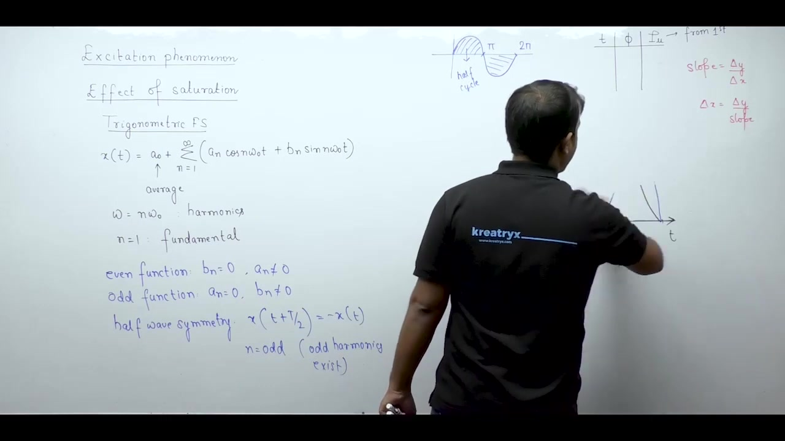

## Dominance of the Third Harmonic and Synthesis of Peaky Current
_(26:14 - 32:36)_

### Harmonic Amplitude Attenuation

In a Fourier series, the magnitude of the harmonic coefficients decreases as the harmonic order increases. Generally, the coefficients scale inversely with order $n$:

$$a_n, b_n \propto \frac{1}{n} \quad \text{or} \quad \frac{1}{n^2}$$

Higher-order harmonics have progressively smaller peak amplitudes:

$$I_{m1} > I_{m3} > I_{m5} > I_{m7} > \dots$$

The fundamental component $I_{m1}$ carries the largest amplitude. It is the only component necessary to set up the working flux.

All other harmonic components are unwanted distortions. Because harmonic amplitudes fall rapidly, the lowest-order present harmonic dominates the distortion.

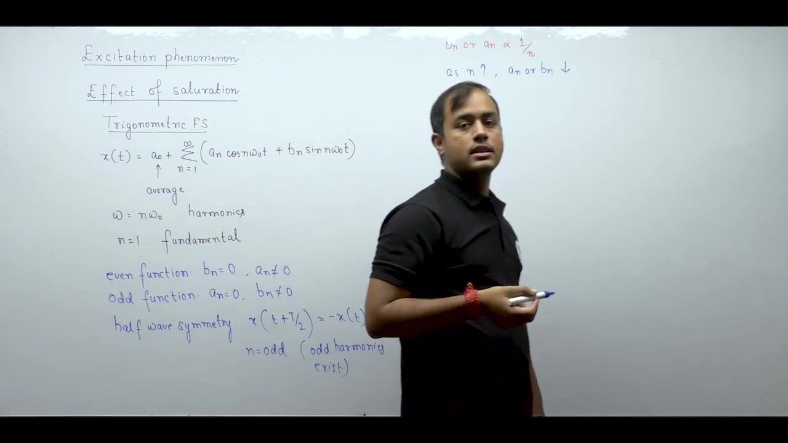

### Dominance of the Third Harmonic

Half-wave symmetry completely removes the second harmonic ($n = 2$).

If half-wave symmetry were absent, the second harmonic would be the largest distortion term. But because $I_\mu(t)$ is half-wave symmetric, $n = 2$ is zero.

The next available harmonic order is $n = 3$.

> [!success] Result: The Dominant Harmonic
> In any half-wave symmetric waveform, the third harmonic ($n = 3$) has the highest amplitude among all harmonic distortions. It is the most dominant harmonic in electrical machines.

Higher harmonics like the 5th and 7th have much smaller amplitudes. In practical transformer engineering, harmonic analysis focuses primarily on the 3rd harmonic.

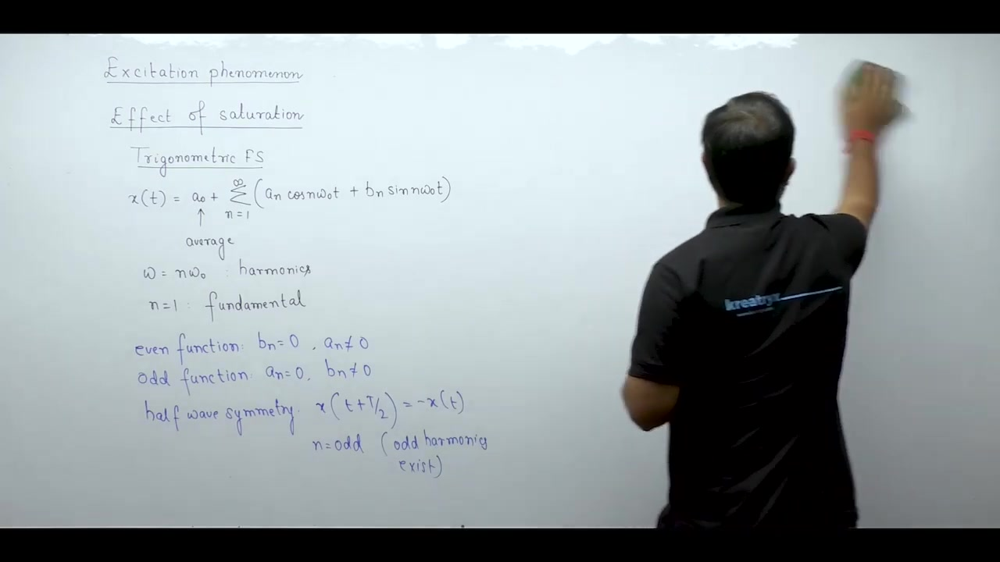

### Harmonic Addition and Peak Alignment

To understand how a peaky wave forms, we add the fundamental and third-harmonic sinusoids graphically.

The fundamental current is:

$$i_1(t) = I_{m1} \sin(\omega t)$$

The third harmonic has three times the frequency:

$$\omega_3 = 3\omega$$

Its period is one-third of the fundamental period:

$$T_3 = \frac{T}{3}$$

During one half-cycle of the fundamental, the third harmonic completes three half-cycles.

To make the sum peaky, the third harmonic must add constructively at the center:

$$\omega t = \frac{\pi}{2} = 90^\circ$$

At $90^\circ$, the fundamental reaches $+I_{m1}$. For constructive peaking, the third harmonic must also be positive at this instant:

$$\sin(3 \cdot 90^\circ) = \sin(270^\circ) = -1$$

If the third harmonic had a positive sign ($+I_{m3} \sin(3\omega t)$), its value at $90^\circ$ would be $-I_{m3}$. That would subtract from the fundamental and flatten the peak.

Therefore, the third harmonic must enter with a negative sign:

$$i_3(t) = -I_{m3} \sin(3\omega t)$$

Now check the value at $\omega t = 90^\circ$:

$$i_3\left(\frac{\pi}{2\omega}\right) = -I_{m3} \sin(270^\circ) = -I_{m3}(-1) = +I_{m3}$$

Both crests point in the positive direction simultaneously:

$$i_{\text{peak}} = I_{m1} + I_{m3}$$

The peaks add constructively. Near the zero crossings, the opposing signs lower the curve. This creates the sharply peaked waveform.

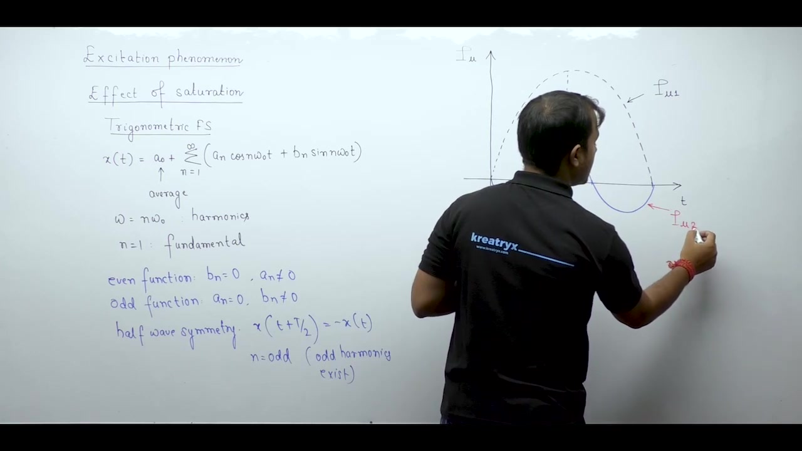

## Fourier Series of Peaky Magnetizing Current and Effect of Hysteresis
_(32:45 - 37:42)_

### Fourier Representation of the Peaky Waveform

The synthesis of fundamental and third-harmonic currents explains why the magnetizing current becomes peaky. Near the zero crossings, the fundamental and third harmonic have opposing signs. The sum stays lower than the fundamental. Near $\omega t = 90^\circ$, both waveforms reach positive peaks together. Their values add directly and create a sharp peak.

The Fourier series for the magnetizing current takes this form:

$$i_\mu(t) = I_{m1} \sin(\omega t) - I_{m3} \sin(3\omega t) + I_{m5} \sin(5\omega t) - \dots$$

Here $I_{m1}$ is the fundamental peak amplitude. $I_{m3}$ is the third-harmonic amplitude.

The minus sign before the third harmonic is essential. It ensures that the positive crest of the third harmonic coincides exactly with the positive crest of the fundamental at $\omega t = 90^\circ$:

$$\sin(3 \cdot 90^\circ) = \sin(270^\circ) = -1$$

$$-I_{m3} \sin(270^\circ) = +I_{m3}$$

Both peaks add constructively to yield:

$$i_{\mu,\text{peak}} = I_{m1} + I_{m3}$$

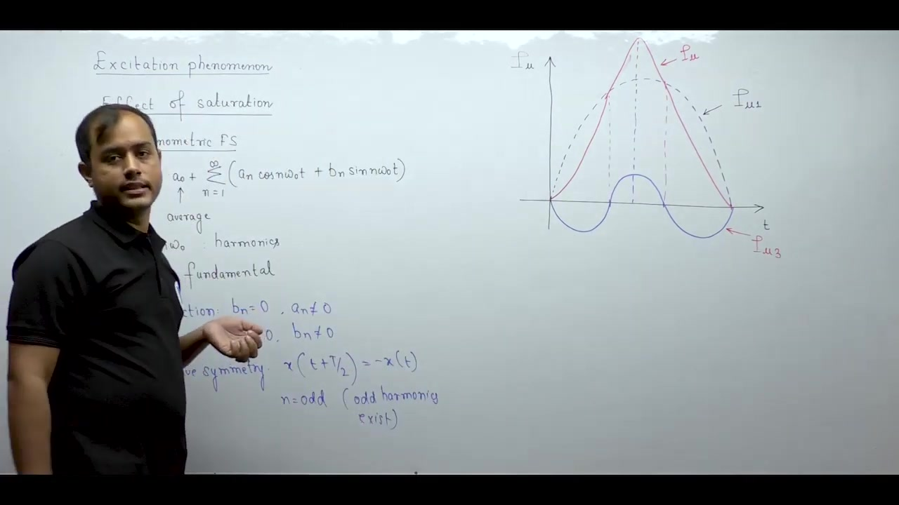

### Diminishing Harmonic Magnitudes

The amplitudes of harmonic components decrease rapidly as order increases:

$$I_{m1} > I_{m3} > I_{m5} > I_{m7} > \dots$$

The fundamental $I_{m1}$ is the largest component. The third harmonic $I_{m3}$ is the next largest. The fifth and seventh harmonics have much smaller amplitudes. 

Because higher harmonics diminish so fast, practical analysis focuses almost entirely on the third harmonic.

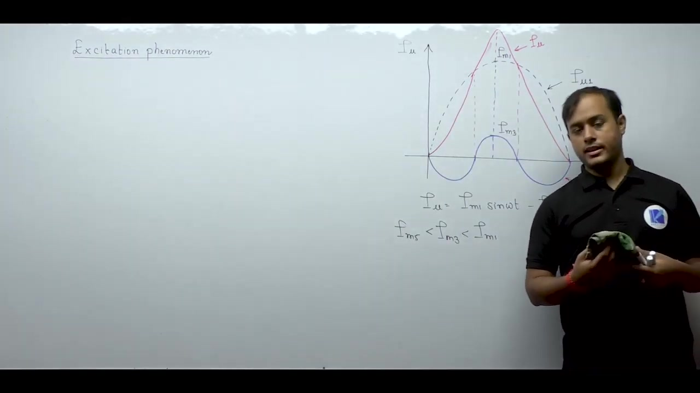

### Dominant Harmonics and Waveform Symmetry

The type of symmetry dictates which harmonic dominates the distortion:

1. **With half-wave symmetry**: All even harmonics are identically zero. The lowest remaining harmonic after the fundamental is the third harmonic ($n = 3$). Thus, the third harmonic is the most dominant harmonic.
2. **Without half-wave symmetry**: Both even and odd harmonics are present. The second harmonic ($n = 2$) is not zero. Because amplitude decreases with harmonic order, the second harmonic has higher magnitude than the third. 

> [!success] Result: Dominant Harmonic Condition
> In half-wave symmetric waveforms, the third harmonic ($n = 3$) is the most dominant harmonic. If half-wave symmetry is broken, the second harmonic ($n = 2$) becomes the most dominant harmonic.

### Transition to the Effect of Hysteresis

So far, the analysis considered only magnetic saturation without hysteresis. Under saturation alone, sinusoidal flux produces a peaky magnetizing current $I_\mu$.

When hysteresis is also included, the total no-load excitation current $I_0$ consists of two components:

$$\vec{I}_0 = \vec{I}_\mu + \vec{I}_w$$

Here $I_\mu$ is the magnetizing current and $I_w$ is the core loss component. The relationship between flux $\Phi$ and excitation current $I_0$ is no longer a single curve. It traces a full hysteresis loop with rising and falling branches.

## Derivation of Excitation Current Waveform with Hysteresis
_(37:45 - 43:56)_

### The Hysteresis Loop and Excitation Current

When magnetic hysteresis is included, the total excitation current $I_0$ replaces the pure magnetizing current $I_\mu$:

$$\vec{I}_0 = \vec{I}_\mu + \vec{I}_w$$

Here $I_w$ represents the core loss current component. The core material exhibits two key magnetic properties:

1. **Residual flux density ($B_r$ or $\Phi_r$)**: The magnetic flux remaining in the core when the excitation current falls to zero. This corresponds to the vertical intercept on the $\Phi$ axis.
2. **Coercive current ($I_c$)**: The demagnetizing current needed to reduce the core flux to zero. This corresponds to the horizontal intercept on the $I_0$ axis.

Because of hysteresis, the relationship between core flux $\Phi$ and excitation current $I_0$ follows two distinct branches:
- An **ascending branch** (lower curve) traversed when flux increases ($d\Phi/dt > 0$).
- A **descending branch** (upper curve) traversed when flux decreases ($d\Phi/dt < 0$).

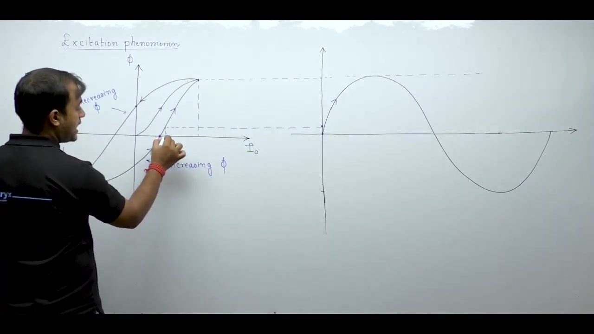

### Step-by-Step Point Projection

To find the time waveform of $I_0(t)$, assume the core flux is sinusoidal:

$$\phi(t) = \Phi_{\max} \sin(\omega t)$$

We project values of flux onto the hysteresis loop to determine $I_0$ across the full cycle:

1. **Interval $0^\circ \le \omega t \le 90^\circ$ (Increasing Flux)**:
   The flux increases from zero to $+\Phi_{\max}$. The operating point moves along the lower ascending branch.
   - At $\omega t = 0^\circ$, flux is zero ($\phi = 0$). The current is already positive at point $a$ ($I_0 = OA > 0$).
   - As flux rises through intermediate points $b, c, d$, current increases steadily.
   - At $\omega t = 90^\circ$, flux reaches its positive peak $+\Phi_{\max}$. The current also hits its positive peak value at point $e$.

2. **Interval $90^\circ \le \omega t \le 270^\circ$ (Decreasing Flux)**:
   After $90^\circ$, the flux begins to fall. The operating point shifts to the upper descending branch.
   - At point $f$, the current falls to zero ($I_0 = 0$). But the flux remains positive at the residual value $\Phi_r$.
   - At point $g$, the flux reaches zero ($\phi = 0$). To cancel the residual magnetism, the current must be negative ($I_0 = -I_c$). Notice this occurs before $\omega t = 180^\circ$.
   - At $\omega t = 270^\circ$, the flux reaches its negative peak $-\Phi_{\max}$. Current also reaches its negative peak at point $h$.

3. **Interval $270^\circ \le \omega t \le 360^\circ$ (Rising Flux)**:
   Flux increases from $-\Phi_{\max}$ back to zero. The operating point returns to the lower ascending branch.
   - At point $i$, current crosses zero while flux is still negative.
   - At $\omega t = 360^\circ$, the cycle completes and returns to point $a$.

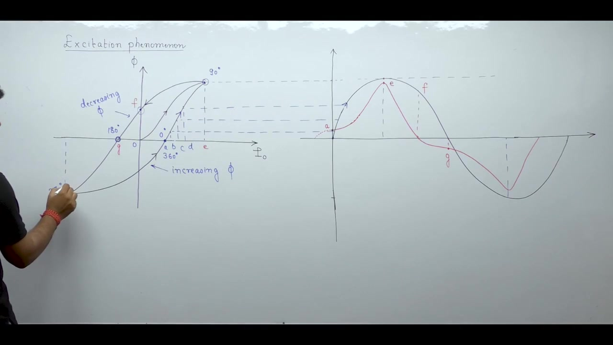

### Key Waveform Observations

The resulting excitation current waveform $I_0(t)$ displays distinct features:

> [!success] Result: Waveform Features of $I_0(t)$
> 1. **Peak coincidence**: The peak of $I_0(t)$ occurs at the exact same instant as the peak of $\phi(t)$ ($\omega t = 90^\circ$ and $\omega t = 270^\circ$).
> 2. **Phase lead at zero crossings**: The current crosses zero before the flux does. This phase lead reflects the active power required by hysteresis loss.
> 3. **Distorted peaky shape**: Due to magnetic saturation, the waveform remains peaky around its crests.

## Phase Lead of Excitation Current and the Hysteresis Angle
_(43:56 - 48:12)_

### Non-Coincident Zero Crossings

Under pure saturation without hysteresis, flux and magnetizing current pass through zero at the same instant. But when hysteresis is present, their zero crossings do not coincide.

This happens because flux and excitation current never vanish simultaneously on a hysteresis loop:
- When the flux is zero ($\phi = 0$), a negative coercive current remains ($i_0 = -I_c$).
- When the excitation current is zero ($i_0 = 0$), a positive residual flux remains ($\phi = +\Phi_r$).

If the $\Phi$ versus $i$ curve passed through the origin, both variables would reach zero together. Because the hysteresis loop encloses an area, neither zero crossing aligns.

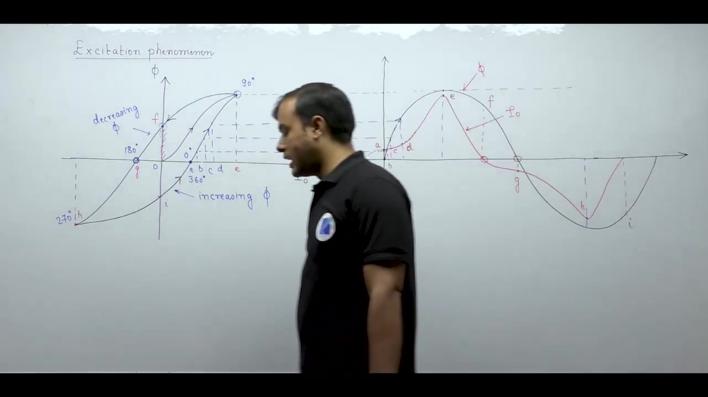

### Waveform Distortion and Leftward Phase Shift

The excitation current waveform maintains its characteristic peaked shape. Saturation continues to pull the peak higher.

However, the entire current waveform shifts to the left with respect to the flux waveform. In time domain signals, reaching zero or a peak earlier in time indicates a phase lead.

Since $I_0(t)$ crosses zero before $\phi(t)$, the excitation current leads the flux.

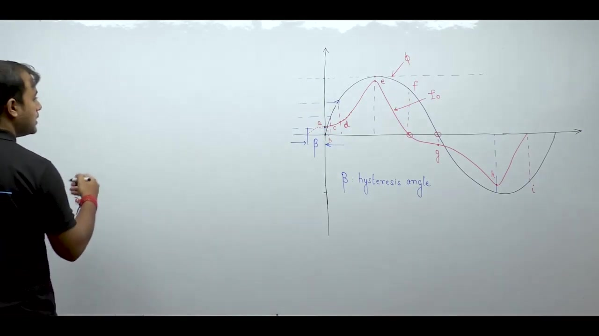

### The Hysteresis Angle $\beta$

The phase angle by which the excitation current leads the core flux is called the **hysteresis angle**, denoted by $\beta$.

> [!info] Definition: Hysteresis Angle ($\beta$)
> The hysteresis angle $\beta$ is the phase angle by which the fundamental component of excitation current $I_0$ leads the core flux $\Phi$. It represents the phase advance caused by hysteresis energy loss in the magnetic core.

The angle $\beta$ is not time. It is an electrical phase angle related to time through the angular frequency:

$$\beta = \omega \Delta t$$

### Physical Meaning of the Phase Lead

Why does $I_0$ lead the flux? 

Core losses require active power from the source. The induced EMF $E_1$ lags the core flux $\Phi$ by $90^\circ$. The applied voltage $V_1$ opposes $E_1$ and leads the flux by $90^\circ$:

$$\vec{V}_1 = -\vec{E}_1$$

If $I_0$ were completely in phase with $\Phi$, the power factor angle would be $90^\circ$. The net active power absorbed by the core would be zero:

$$P = V_1 I_0 \cos(90^\circ) = 0$$

To supply the hysteresis power loss, the excitation current must have an in-phase component with applied voltage $V_1$. Shifting $I_0$ ahead of flux by angle $\beta$ provides this component.

> [!success] Result: Core Effects Summary
> 1. **Saturation** alters the waveform shape, making $I_\mu$ sharply peaked.
> 2. **Hysteresis** introduces a phase lead, shifting $I_0$ ahead of $\Phi$ by the hysteresis angle $\beta$.

## Phasor Relationships and Current Decomposition
_(48:20 - 54:04)_

### Phasor Diagram Review

In an unloaded practical transformer, the core requires an excitation current $I_0$. We review the standard phasor diagram:

1. **Working flux ($\vec{\Phi}$)**: Serves as the horizontal reference phasor.
2. **Induced voltages ($\vec{E}_1, \vec{E}_2$)**: Lag the core flux by $90^\circ$ according to Faraday's law:
   $$e = -\frac{d\lambda}{dt}$$
3. **Applied voltage ($\vec{V}_1$)**: Must oppose $\vec{E}_1$ to maintain core excitation:
   $$\vec{V}_1 = -\vec{E}_1$$
   Therefore, $\vec{V}_1$ leads the core flux by $90^\circ$.
4. **Current components**:
   - $\vec{I}_\mu$ is in phase with the flux $\vec{\Phi}$. It provides the magnetomotive force.
   - $\vec{I}_w$ is in phase with $\vec{V}_1$. It supplies active core losses.
   - The total excitation current is their phasor sum:
     $$\vec{I}_0 = \vec{I}_\mu + \vec{I}_w$$

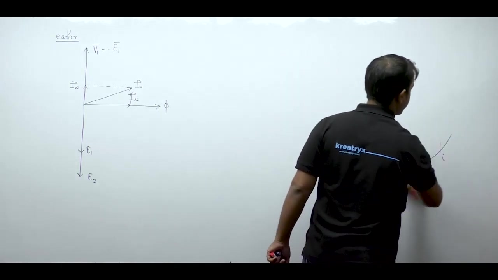

### Comparing Waveform Scales Across Different Units

When plotting voltage, flux, and current on a single time axis, vertical amplitudes cannot be compared directly. 

Voltage is measured in volts ($V$). Core flux is measured in webers ($\text{Wb}$). Current is measured in amperes ($A$). In engineering, quantities with different physical dimensions cannot have relative heights assigned on paper. Each variable uses its own vertical scale.

### Synthesis of the Excitation Current Waveform

Let the core flux vary sinusoidally:

$$\phi(t) = \Phi_m \sin(\omega t)$$

The applied primary voltage is sinusoidal and leads the flux by $90^\circ$:

$$v_1(t) = V_m \sin(\omega t + 90^\circ) = V_m \cos(\omega t)$$

Now decompose the total excitation current $i_0(t)$ into two physical parts:

$$i_0(t) = i_\mu(t) + i_h(t)$$

Here $i_\mu(t)$ is the magnetizing current component caused by core saturation. The term $i_h(t)$ is the current component caused by hysteresis.

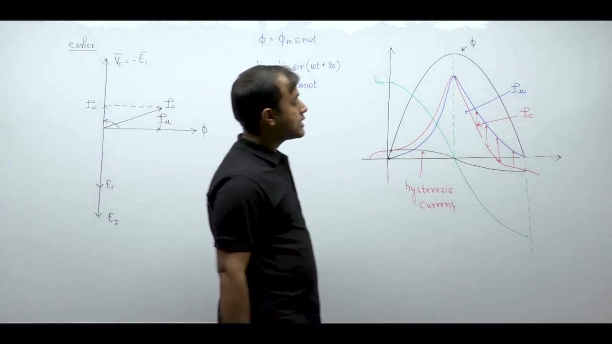

### Nature of the Two Current Components

1. **Magnetizing component $i_\mu(t)$ (Blue curve)**:
   This component is purely reactive. It is symmetric about the $90^\circ$ peak. It passes through zero at $\omega t = 0^\circ$ and reaches its crest at $\omega t = 90^\circ$.
2. **Hysteresis component $i_h(t)$ (Black curve)**:
   This component supplies the hysteresis energy loss. It is an active component in phase with the applied voltage $v_1(t)$. Since voltage is a cosine function, $i_h(t)$ is also a cosine wave:
   $$i_h(t) \propto \cos(\omega t)$$
   It reaches its positive peak at $\omega t = 0^\circ$ and drops to zero at $\omega t = 90^\circ$.

> [!success] Result: Waveform Addition
> Adding the cosine hysteresis wave to the peaky magnetizing wave yields the total excitation current $I_0$ (Red curve):
> - At $\omega t = 0^\circ$, $i_\mu = 0$ but $i_h$ is positive, so $i_0(0) > 0$.
> - At $\omega t = 90^\circ$, $i_h = 0$, so the total peak coincides exactly with the peak of $i_\mu$.
> - Between $90^\circ$ and $180^\circ$, $i_h$ becomes negative. It subtracts from $i_\mu$, pulling the red curve below the blue curve.

## Dynamic B-H Loops and the Full Core Loss Current
_(54:05 - 58:26)_

### In-Phase Hysteresis Current

The hysteresis current component $i_h(t)$ varies as a cosine function:

$$i_h(t) = I_{h,\max} \cos(\omega t)$$

The applied primary voltage is also a cosine wave:

$$v_1(t) = V_m \cos(\omega t)$$

Both waveforms reach their positive maximum at $\omega t = 0^\circ$. Both pass through zero at $\omega t = 90^\circ$. Both reach their negative peak at $\omega t = 180^\circ$.

Because their zero crossings and peaks match, the hysteresis current is in phase with the applied voltage. It delivers active power to cover core hysteresis loss.

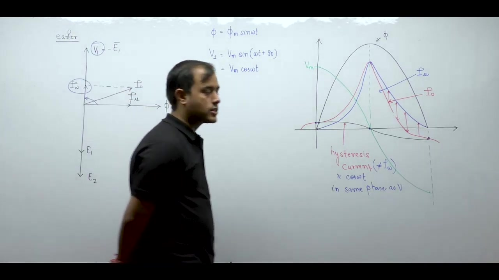

### Distinction Between $I_h$ and Total Core Loss Current $I_w$

In the standard transformer equivalent circuit, the branch current $I_w$ represents total core losses:

$$P_{\text{core}} = P_h + P_e$$

Here $P_h$ is the hysteresis loss and $P_e$ is the eddy current loss.

The static B-H curve measured under direct current or low frequency encloses an area proportional only to hysteresis loss:

$$\text{Area}_{\text{static}} \propto P_h$$

Therefore, the in-phase current derived from the static loop represents only the hysteresis component $I_h$:

$$I_h \ne I_w$$

It does not yet include eddy current losses.

### Constructing the Dynamic B-H Loop

Eddy currents circulate within the core laminations. These induced eddy currents create their own demagnetizing fields. To sustain the required core flux, the primary winding must draw additional current from the source.

This extra current widens the B-H loop. The resulting expanded curve is called the **dynamic B-H loop**.

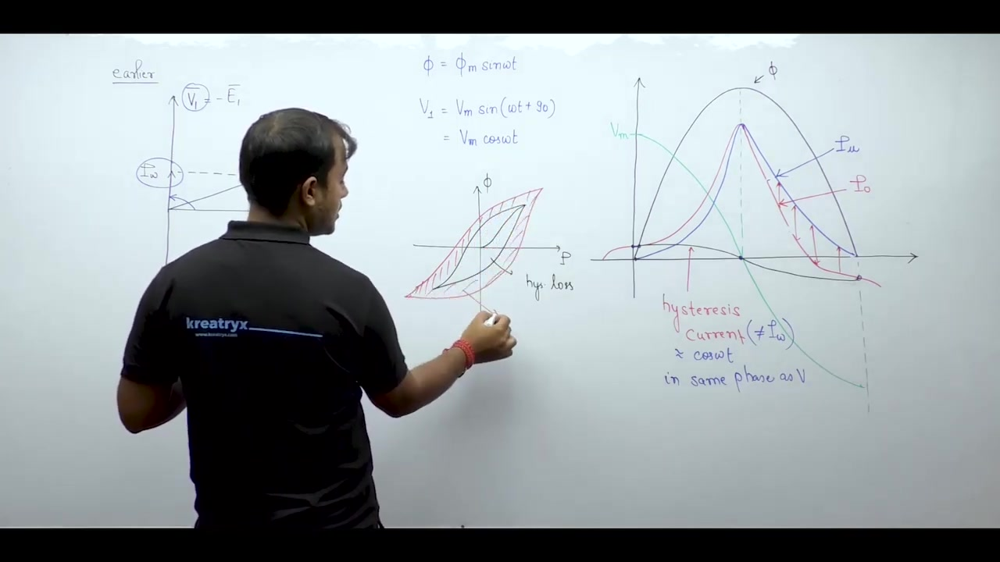

The total area enclosed by the dynamic loop equals the combined loss:

$$\text{Area}_{\text{dynamic}} = \text{Area}_{\text{static}} + \text{Area}_{\text{eddy}} \propto P_h + P_e$$

For example, if hysteresis loss is 100 W and eddy current loss is 50 W, the dynamic loop area represents 150 W.

> [!info] Definition: Dynamic B-H Loop
> A dynamic B-H loop is the broadened hysteresis loop observed under alternating excitation. Its enclosed area accounts for both static hysteresis loss and dynamic eddy current loss.

### Final Waveform Synthesis with Total Core Loss

When the excitation current waveform $I_0(t)$ is derived from the dynamic B-H loop:
1. The reactive component remains the magnetizing current $I_\mu$, which produces the core flux.
2. The enlarged in-phase component now accounts for all core losses:
   $$I_w = I_h + I_e$$
3. The total excitation current is their sum:
   $$\vec{I}_0 = \vec{I}_\mu + \vec{I}_w$$

> [!success] Result: Core Loss Representation
> Projecting from the static B-H loop yields only $I_h$. Projecting from the widened dynamic B-H loop yields the full core loss current $I_w$ in phase with the terminal voltage $V_1$.

## Case 2: Sinusoidal Magnetizing Current and Flat-Topped Flux
_(58:26 - 63:33)_

### Power Summary of Excitation Components

The two components of excitation current handle distinct energy flows:

1. **Magnetizing component ($I_\mu$)**: Lags applied voltage by $90^\circ$. It absorbs zero average active power:
   $$P_\mu = V_1 I_\mu \cos(90^\circ) = 0$$
   It draws reactive power to sustain the core magnetic field.
2. **Core loss component ($I_w$)**: Lies completely in phase with applied voltage. It draws active power from the supply to cover hysteresis and eddy current dissipation:
   $$P_{\text{core}} = V_1 I_w$$

### Inverting the Problem: Sinusoidal Current Input

In previous sections, we assumed a sinusoidal flux and found that magnetic saturation forces $I_\mu$ to be peaky.

Now consider the inverse operating condition:
- The winding is supplied by a current source, or high series impedance forces the magnetizing current to be strictly sinusoidal:
  $$i_\mu(t) = I_{m} \sin(\omega t)$$
- We examine the core flux waveform $\phi(t)$ under saturation. Hysteresis is neglected for now.

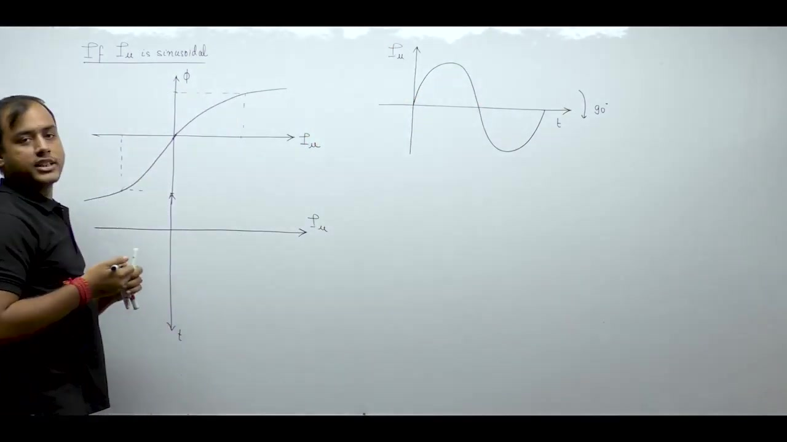

### Graphical Derivation of the Flux Waveform

We project the sinusoidal current through the non-linear $\Phi-I_\mu$ magnetization characteristic:

1. **Near zero crossings**: At small current levels, the core operates in the steep linear region. The flux rises proportionally with current.
2. **Near peak current**: As $i_\mu$ approaches its positive maximum, the core enters heavy magnetic saturation. The slope $d\Phi/di$ drops drastically. Even though the current continues rising toward its peak, the flux barely changes.
3. **Crest clipping**: The positive peak of the flux waveform flattens out into an almost horizontal plateau.
4. **Negative half-cycle**: The exact same flattening occurs at the negative peak.

The resulting flux waveform resembles a clipped sine wave or trapezoid. We call this shape **flat-topped**.

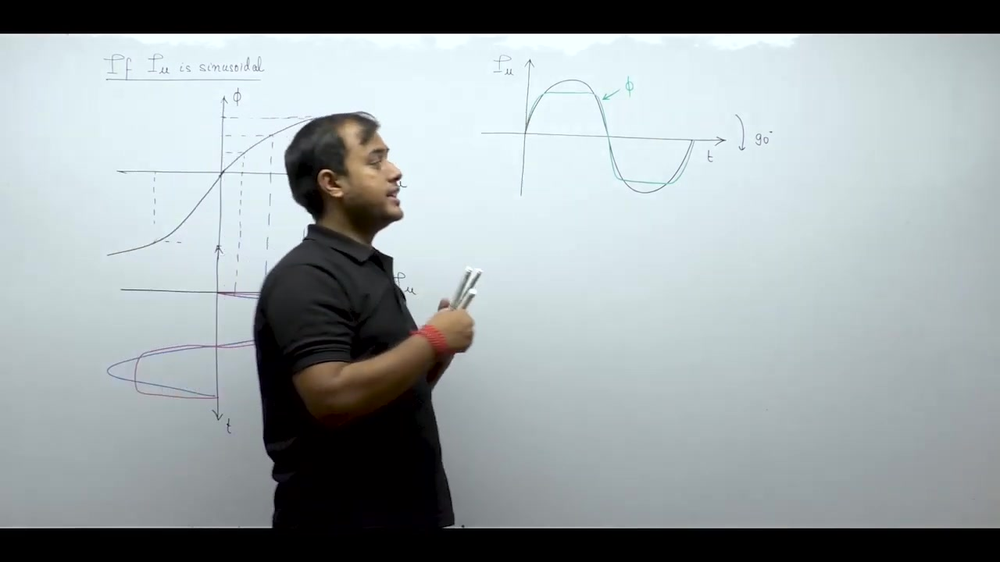

### The Duality Between Flux and Current Distortions

Comparing the two cases reveals a fundamental duality in saturating magnetic circuits:

> [!success] Result: Duality of Excitation Distortion
> - **Sinusoidal Flux $\implies$ Peaky Current**: To push a sinusoidal flux through the saturated knee of the core, the current must surge sharply at the peaks.
> - **Sinusoidal Current $\implies$ Flat-Topped Flux**: If current is constrained to a smooth sinusoid, the core saturates and clips the flux peaks into a flat-topped shape.

### Symmetry of the Flat-Topped Flux

Just like the peaky current waveform, the flat-topped flux waveform is periodic and symmetric:
- The positive and negative half-cycles are identical in magnitude and opposite in sign.
- It satisfies half-wave symmetry:
  $$\phi\left(t + \frac{T}{2}\right) = -\phi(t)$$

Because it preserves half-wave symmetry, the flat-topped flux contains only odd harmonics.

## Harmonic Synthesis of Flat-Topped Flux
_(63:33 - 68:02)_

### Harmonic Content of Flat-Topped Flux

Because the flat-topped flux waveform possesses half-wave symmetry, all even harmonics are zero:

$$A_0 = 0, \quad a_n = b_n = 0 \quad \text{for all even } n$$

The waveform consists exclusively of the fundamental and odd harmonics:

$$\phi(t) = \phi_1(t) + \phi_3(t) + \phi_5(t) + \dots$$

Just as in the magnetizing current analysis, the third harmonic is the most dominant harmonic. Higher-order harmonics ($n = 5, 7, 9$) have progressively smaller amplitudes:

$$\Phi_{m1} > \Phi_{m3} > \Phi_{m5} > \dots$$

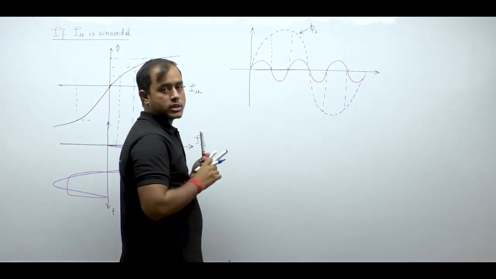

### Depressing the Crest: The Role of the Third Harmonic

To produce a flat top, the third harmonic must subtract from the fundamental at the peak. 

Consider the fundamental flux:

$$\phi_1(t) = \Phi_{m1} \sin(\omega t)$$

At the positive peak ($\omega t = 90^\circ$), the fundamental reaches $\Phi_{m1}$. 

Now evaluate a third harmonic that enters with a positive sign:

$$\phi_3(t) = +\Phi_{m3} \sin(3\omega t)$$

At $\omega t = 90^\circ$, its phase argument is:

$$3\omega t = 3 \times 90^\circ = 270^\circ$$

Evaluating the third harmonic at this instant yields:

$$\phi_3\left(\frac{\pi}{2\omega}\right) = \Phi_{m3} \sin(270^\circ) = -\Phi_{m3}$$

The third harmonic is negative at the exact instant the fundamental peaks. Adding them together gives:

$$\phi_{\text{peak}} = \Phi_{m1} - \Phi_{m3}$$

The positive crest of the fundamental is depressed by $\Phi_{m3}$.

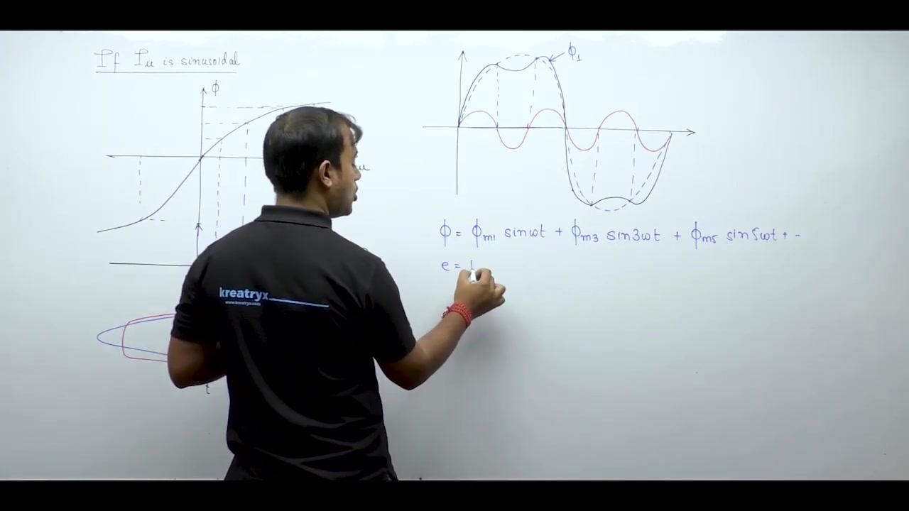

### Slope Enhancement Near the Zero Crossings

Between $\omega t = 0^\circ$ and $\omega t = 60^\circ$, the argument $3\omega t$ lies between $0^\circ$ and $180^\circ$. In this range, $\sin(3\omega t)$ is positive.

Both the fundamental and third harmonic are positive. They add constructively, making the initial slope of the flux wave steeper:

$$\left.\frac{d\phi}{dt}\right|_{t=0} = \omega \Phi_{m1} + 3\omega \Phi_{m3}$$

The steeper rise combined with the depressed peak creates the characteristic flat-topped trapezoidal shape.

### Fourier Series Equation

The resulting Fourier series of the flat-topped flux is:

$$\phi(t) = \Phi_{m1} \sin(\omega t) + \Phi_{m3} \sin(3\omega t) + \Phi_{m5} \sin(5\omega t) + \dots$$

> [!success] Result: Sign Comparison of Third Harmonic
> - **Peaky Current**: $i_\mu(t) = I_{m1}\sin(\omega t) - I_{m3}\sin(3\omega t)$. The minus sign adds peaks constructively at $90^\circ$.
> - **Flat-Topped Flux**: $\phi(t) = \Phi_{m1}\sin(\omega t) + \Phi_{m3}\sin(3\omega t)$. The plus sign subtracts at $90^\circ$, flattening the peak.

## Induced EMF Under Flat-Topped Flux and Harmonic Amplification
_(68:11 - 72:45)_

### Time Derivative and Harmonic Amplification

When the core flux is flat-topped, the induced electromotive force (EMF) follows Faraday's law of induction:

$$e(t) = -N \frac{d\phi}{dt}$$

Substitute the Fourier series of the flat-topped flux:

$$\phi(t) = \Phi_{m1} \sin(\omega t) + \Phi_{m3} \sin(3\omega t) + \Phi_{m5} \sin(5\omega t) + \dots$$

Differentiating term by term with respect to time $t$:

$$e(t) = -N \left[ \omega \Phi_{m1} \cos(\omega t) + 3\omega \Phi_{m3} \cos(3\omega t) + 5\omega \Phi_{m5} \cos(5\omega t) + \dots \right]$$

Factoring out the fundamental angular frequency $\omega$:

$$e(t) = -N\omega \left[ \Phi_{m1} \cos(\omega t) + 3\Phi_{m3} \cos(3\omega t) + 5\Phi_{m5} \cos(5\omega t) + \dots \right]$$

Notice what happened to each harmonic amplitude. Because the time derivative of $\sin(n\omega t)$ produces an outer factor of $n\omega$, every harmonic coefficient is multiplied by its harmonic order $n$:

$$E_{mn} = n N \omega \Phi_{mn}$$

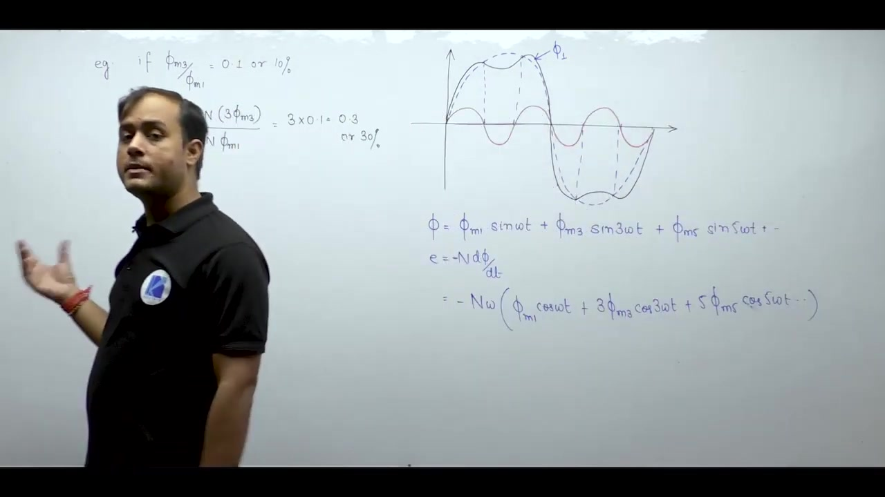

### Quantitative Example of Harmonic Amplification

To see how severe this amplification is, compare the third-harmonic ratios in flux and EMF.

> [!example] Problem: Harmonic Amplification Calculation
> Suppose the third-harmonic flux component is $10\%$ of the fundamental flux:
> $$\frac{\Phi_{m3}}{\Phi_{m1}} = 0.10$$
> Find the proportion of the third-harmonic induced EMF relative to the fundamental EMF.

Comparing peak amplitudes of the induced voltages:

$$\frac{E_{m3}}{E_{m1}} = \frac{3 N \omega \Phi_{m3}}{N \omega \Phi_{m1}} = 3 \left(\frac{\Phi_{m3}}{\Phi_{m1}}\right)$$

Substitute the $10\%$ ratio:

$$\frac{E_{m3}}{E_{m1}} = 3 \times 0.10 = 0.30 = 30\%$$

A modest $10\%$ harmonic distortion in core flux magnifies into a massive $30\%$ harmonic distortion in the induced voltage.

For a fifth harmonic with $\Phi_{m5}/\Phi_{m1} = 0.04$ ($4\%$), the voltage distortion becomes $5 \times 0.04 = 0.20$ ($20\%$).

> [!success] Result: Harmonic Amplification Law
> When harmonics exist in the magnetic flux, the proportion of the $n$-th harmonic in the induced EMF is multiplied by $n$:
> $$\frac{E_n}{E_1} = n \left(\frac{\Phi_n}{\Phi_1}\right)$$

### Practical Consequences for Power Systems and Loads

This amplification makes a flat-topped flux highly undesirable in power transformers.

1. **Direct load connection**: The induced secondary voltage feeds directly into consumer loads. Any harmonic present in the induced EMF appears directly at the load terminals.
2. **Motor overheating and torque ripple**: Harmonic voltages produce reverse and zero sequence fields in connected motors. These fields cause severe rotor overheating, excessive vibration, and torque pulsations.
3. **Insulation stress**: Distorted voltage waves with steep gradients increase dielectric stress on winding insulation.

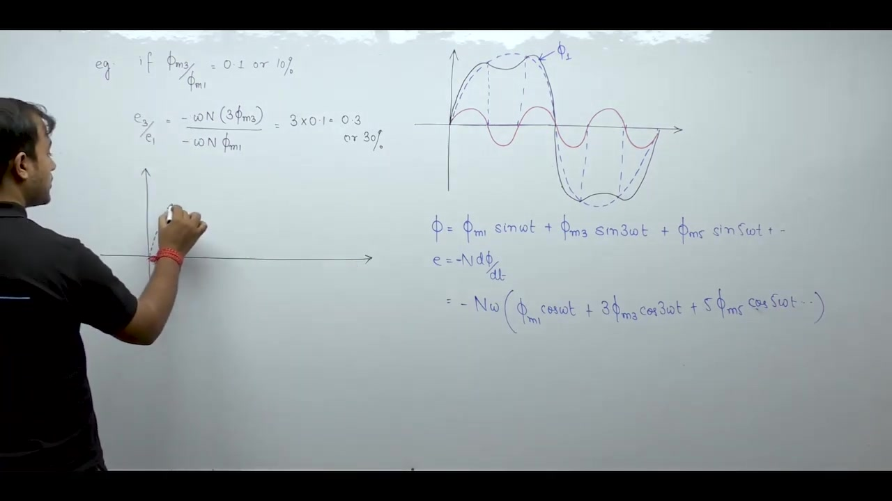

### Why Current Distortion is Preferable to Flux Distortion

We now contrast the two operating regimes:
- **Peaky Current Regime (Sinusoidal Flux)**: Harmonics stay confined to the excitation current $I_0$. The load current $I_2$ is determined by the load impedance and remains clean. The core flux stays sinusoidal, so terminal voltage remains purely sinusoidal.
- **Flat-Topped Flux Regime (Sinusoidal Current)**: Harmonics infect the core flux. The time derivative amplifies them by factor $n$. Severe distortion feeds directly into the load.

Therefore, power systems always prefer sinusoidal flux with peaky magnetizing current over sinusoidal current with flat-topped flux.

## Peaked Induced EMF, Core Losses, and Synthesis Summary
_(72:48 - 77:45)_

### Waveform Shape of the Induced EMF

We can determine the exact shape of the induced EMF by evaluating the slope $d\phi/dt$ of the flat-topped flux:

1. **Initial steep rise**: When the flux rises rapidly from zero, its time derivative $d\phi/dt$ is large and positive. The induced EMF surges into a sharp, narrow peak.
2. **Flat plateau**: During the saturated crest of the flux wave, the flux remains essentially constant. The time derivative drops to zero:
   $$\frac{d\phi}{dt} \approx 0 \implies e(t) \approx 0$$
   The induced voltage collapses to zero throughout this flat middle interval.
3. **Steep falling edge**: As the flux drops rapidly from the plateau, $d\phi/dt$ becomes large and negative. The induced EMF swings into an equally sharp negative peak.

The resulting induced EMF waveform consists of narrow, spiky pulses separated by flat zero-voltage intervals.

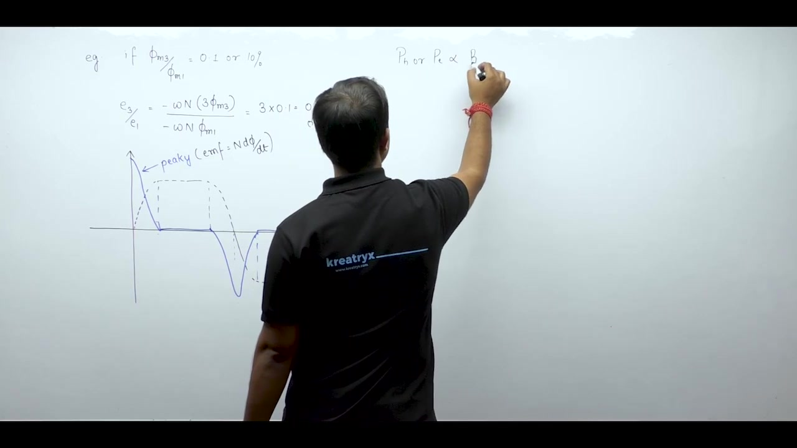

### Core Loss Reduction Versus Load Degradation

A flat-topped flux introduces an interesting engineering trade-off:

1. **Reduction in core losses**:
   Both hysteresis loss ($P_h$) and eddy current loss ($P_e$) depend strongly on the maximum core flux density $B_m$:
   $$P_h \propto B_m^x, \quad P_e \propto B_m^2$$
   Here $x$ is the Steinmetz exponent (typically $1.6$ to $2.0$). Because a flat-topped waveform has a lower peak flux density than an equivalent area sine wave, core losses decrease.
2. **Severe load damage**:
   While the transformer core runs cooler, the spiky output voltage severely degrades any connected load. Motors draw heavy harmonic currents, experience intense torque pulsations, and overheat. Sensitive electronics malfunction.

> [!info] Engineering Trade-Off
> Flat-topped core flux reduces transformer core losses. However, the resulting spiky induced voltage ruins power quality and causes severe load degradation.

### Summary of Operating Regimes

We summarize the core conclusions established across this analysis:

1. **Sinusoidal Flux with Saturation**:
   - The magnetizing current $I_\mu$ becomes **peaky**.
   - It contains a dominant third harmonic with a minus sign:
     $$i_\mu(t) = I_{m1} \sin(\omega t) - I_{m3} \sin(3\omega t) + \dots$$
   - Core flux and terminal voltage remain purely sinusoidal.

2. **Inclusion of Hysteresis**:
   - The excitation current $I_0$ contains both $I_\mu$ and $I_h$.
   - $I_0$ leads the core flux $\Phi$ by the hysteresis angle $\beta$.
   - $I_h$ is in phase with applied voltage $V_1$ and draws active power. $I_\mu$ lags $V_1$ by $90^\circ$ and draws reactive power.
   - Including eddy current losses expands the static loop into a wider dynamic B-H loop.

3. **Sinusoidal Current Input**:
   - The core flux $\Phi$ becomes **flat-topped** due to saturation clipping.
   - The flux Fourier series contains a dominant third harmonic with a plus sign:
     $$\phi(t) = \Phi_{m1} \sin(\omega t) + \Phi_{m3} \sin(3\omega t) + \dots$$
   - The induced EMF becomes sharply **peaked** with harmonic amplitudes multiplied by order $n$.

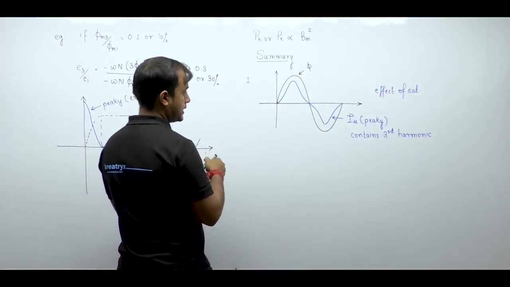

> [!success] Result: Core Operational Rule
> In power system applications, sinusoidal flux is strictly enforced. It confines harmonic distortion to the internal magnetizing current and keeps load voltages distortion-free.

## Mutual Exclusivity of Sinusoids and Non-Saturating Cores
_(77:50 - 81:07)_

### The Law of Mutual Exclusivity

In any saturable ferromagnetic core, flux $\Phi$ and magnetizing current $I_\mu$ cannot be sinusoidal at the same time:

> [!success] Result: Mutual Exclusivity Rule
> In the presence of magnetic saturation, either the magnetic flux is sinusoidal or the magnetizing current is sinusoidal. Both cannot be sinusoidal simultaneously. Exactly one of them must contain a dominant third harmonic.

We compare the two mutually exclusive outcomes:
1. **If flux $\Phi$ is sinusoidal**:
   The magnetizing current $I_\mu$ is non-sinusoidal and **peaky**. It contains an odd-harmonic series dominated by the third harmonic with a negative sign ($-I_{m3}$).
2. **If magnetizing current $I_\mu$ is sinusoidal**:
   The magnetic flux $\Phi$ is non-sinusoidal and **flat-topped**. It contains an odd-harmonic series dominated by the third harmonic with a positive sign ($+\Phi_{m3}$).

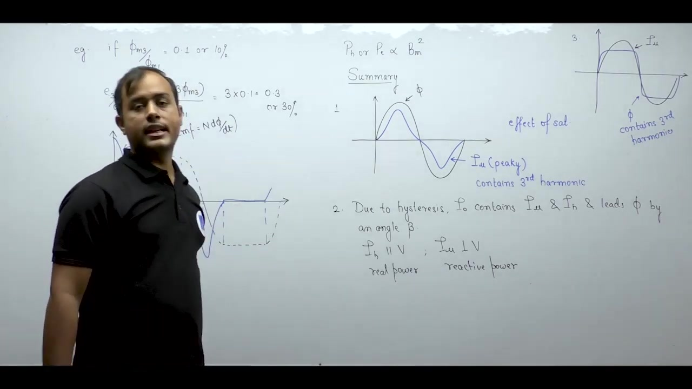

### Why Sinusoidal Flux is Universally Preferred

Practical transformer operation always enforces sinusoidal flux:

1. **Path of propagation**: Harmonics in $I_\mu$ stay confined to the excitation branch of the transformer. They circulate between source and transformer without entering the secondary load.
2. **Terminal voltage purity**: Core flux induces the secondary EMF. Sinusoidal flux guarantees a pure sinusoidal terminal voltage for downstream consumers.
3. **Prevention of load degradation**: If flux had harmonics, the time derivative would amplify them by harmonic order $n$. The resulting peaked voltage would cause severe overheating and torque vibrations in electrical machinery.

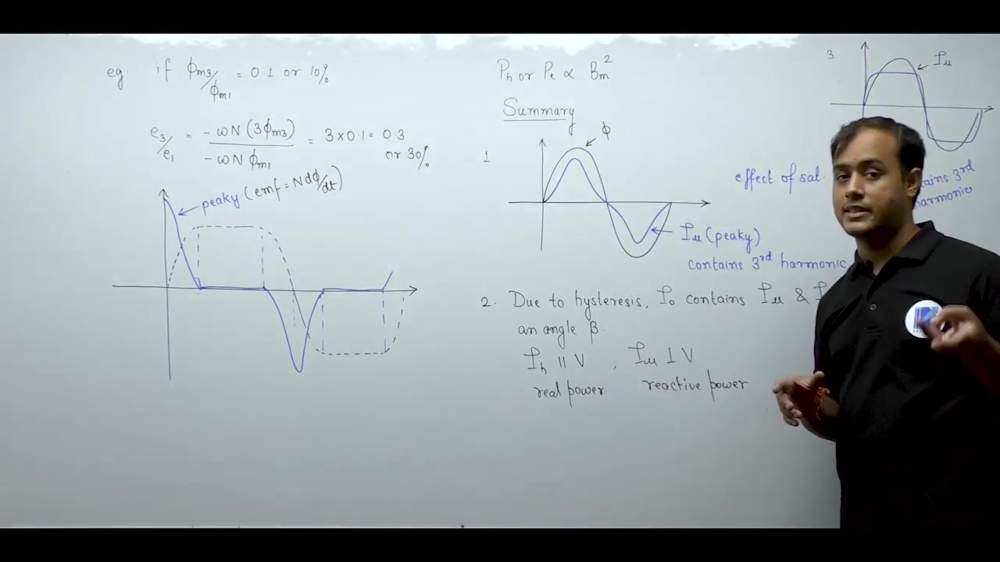

### The Case of Non-Ferromagnetic (Air-Core) Transformers

The entire distortion phenomenon originates from non-linear B-H magnetization. 

In a non-ferromagnetic core (such as an air-core transformer):
- The relative permeability $\mu_r$ is constant and equal to unity.
- The flux versus current relationship is perfectly linear:
  $$\phi(t) = \frac{\mathcal{F}}{\mathcal{R}} = \frac{N i(t)}{\mathcal{R}}$$
- Magnetic saturation and hysteresis do not exist.

> [!info] Linear Core Condition
> In an air-core or non-saturating transformer, linear core behavior allows both core flux $\Phi$ and magnetizing current $I_\mu$ to be purely sinusoidal simultaneously.

### Preview of Three-Phase Systems

In single-phase transformers, the closed primary circuit provides a direct path for the peaky magnetizing current to circulate.

In three-phase transformers, winding connections (star without neutral, delta, star with neutral) dictate whether third-harmonic currents can flow. Subsequent lectures will extend this excitation theory to examine how three-phase transformer connections handle harmonic currents and oscillating neutral voltages.

---

## Summary and Key Takeaways

- Magnetic saturation makes core flux $\Phi$ and magnetizing current $I_\mu$ mutually exclusive sinusoids in ferromagnetic cores.
- A sinusoidal core flux produces a peaky magnetizing current waveform containing odd harmonics dominated by the third harmonic: $i_\mu(t) = I_{m1}\sin(\omega t) - I_{m3}\sin(3\omega t) + \dots$.
- Because $I_\mu(t)$ satisfies half-wave symmetry $x(t + T/2) = -x(t)$, DC bias and all even harmonics are identically zero.
- Core hysteresis shifts total excitation current $I_0$ ahead of flux by the hysteresis angle $\beta$, where in-phase component $I_h$ delivers active hysteresis loss power and quadrature component $I_\mu$ supplies reactive field power.
- Expanding the static B-H curve into a wider dynamic B-H loop incorporates eddy current losses and yields the full core loss current $I_w = I_h + I_e$.
- A sinusoidal magnetizing current produces a flat-topped flux waveform described by $\phi(t) = \Phi_{m1}\sin(\omega t) + \Phi_{m3}\sin(3\omega t) + \dots$, where the positive third-harmonic sign depresses the crest at $90^\circ$.
- Time differentiation $e = -N d\phi/dt$ multiplies each $n$-th harmonic in flat-topped flux by order $n$, producing a spiky induced EMF that causes severe heating and torque pulsations in connected loads.
- Power systems strictly enforce sinusoidal flux operation because harmonic currents remain confined to transformer windings without entering load circuits.

