# Electrical Machines | Lec 34 | Excitation Phenomenon - 2 | GATE/ESE Electrical Engineering

- **Source**: https://www.youtube.com/watch?v=jEL_42aqTmk
- **Duration**: 00:57:03
- **Compiled**: 2026-09-21

---

## Overview

This lecture investigates harmonic behavior and excitation phenomena in three-phase transformers. It establishes symmetrical sequence properties across all odd harmonic orders using Fourier series expansions. The discussion then analyzes how star and delta winding topologies handle zero-sequence triplen harmonics. Finally, it links winding connections to core flux distortion and terminal waveform quality.

## Contents

- [[#Excitation Phenomenon Review and Significance of Harmonics|Excitation Phenomenon Review and Significance of Harmonics]]
- [[#Fourier Series and Triplen Harmonic Phase Relationships|Fourier Series and Triplen Harmonic Phase Relationships]]
- [[#Symmetrical Component Sequences of Higher Harmonics|Symmetrical Component Sequences of Higher Harmonics]]
- [[#Harmonic Classification and Properties of the Third Harmonic|Harmonic Classification and Properties of the Third Harmonic]]
- [[#Star Connection Voltage Analysis and Triplen Elimination|Star Connection Voltage Analysis and Triplen Elimination]]
- [[#Star Connection Current Analysis and Neutral Grounding|Star Connection Current Analysis and Neutral Grounding]]
- [[#Neutral Harmonic Composition and Open-Delta Analysis|Neutral Harmonic Composition and Open-Delta Analysis]]
- [[#Open-Delta Loop Voltage and Voltmeter Measurement|Open-Delta Loop Voltage and Voltmeter Measurement]]
- [[#Circulating Delta Currents and Line Current Elimination|Circulating Delta Currents and Line Current Elimination]]
- [[#Circulating Current Derivation and Terminal Voltage Cancelation|Circulating Current Derivation and Terminal Voltage Cancelation]]
- [[#Summary Matrix of Third Harmonics and Excitation Connections|Summary Matrix of Third Harmonics and Excitation Connections]]

---

## Excitation Phenomenon Review and Significance of Harmonics
_(00:13 - 05:17)_

### Single-Phase Core Excitation Summary

In a single-phase transformer, magnetic saturation dictates the shape of excitation waveforms. Three operational cases describe this behavior.

First, consider a sinusoidal applied voltage and sinusoidal core flux. Due to saturation, the magnetizing current $i_\mu$ becomes peaky. It contains a prominent third harmonic component. Half-wave symmetry eliminates all even harmonics, leaving only odd harmonics.

Second, core hysteresis causes a phase advance. The total no-load current $i_0$ leads the magnetizing current $i_\mu$ by a hysteretic angle $\beta$.

Third, consider a sinusoidal magnetizing current. Under this condition, core saturation makes the magnetic flux $\phi(t)$ flat-topped. The time derivative of a flat-topped flux yields a peaky induced voltage $e(t)$. Both waveforms contain strong third-harmonic components.

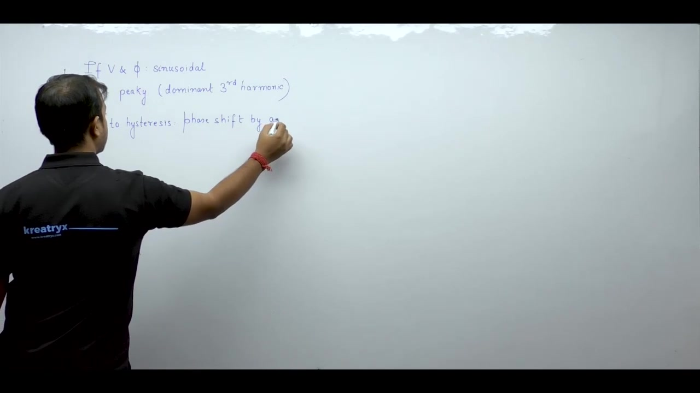

> [!info] Fundamental Rule of Core Saturation
> Non-linear core saturation forces the third harmonic into the system. It must appear in the magnetizing current or in the magnetic flux and induced voltage. It cannot vanish from both.

### Desirable Operating Mode

The first operating mode is preferred in practice. If a third harmonic must exist, it should flow in the magnetizing current. When it flows in the current, the core flux remains sinusoidal. A sinusoidal flux produces a sinusoidal induced voltage. A sinusoidal voltage supplies clean power to connected loads.

If the third harmonic enters the flux instead, the induced voltage becomes peaky. A distorted voltage degrades load performance. It increases dielectric stress on winding insulation.

### Significance in Three-Phase Systems

Harmonic effects differ between single-phase and three-phase transformers. In single-phase units, no-load current remains small, usually below five percent of full load. Its harmonic currents rarely cause major system problems.

In three-phase systems, harmonics create serious operational challenges:
1. Triplen harmonic currents add co-phasally in neutral paths and overheat neutral conductors.
2. Harmonic magnetic fields induce noise in adjacent communication cables.
3. Distorted voltages cause false tripping of protective relays.

For these reasons, controlling harmonics in three-phase transformer banks is essential.

## Fourier Series and Triplen Harmonic Phase Relationships
_(05:17 - 09:50)_

### Balanced Three-Phase Fundamental Components

Any periodic non-sinusoidal waveform expands into a Fourier series. Due to half-wave symmetry, the expansion contains only odd harmonic multiples of the fundamental frequency.

Consider a balanced three-phase voltage system with positive phase sequence $A-B-C$. Taking phase $A$ as the reference gives:
$$
\begin{aligned}
v_{a1}(t) &= V_{m1} \sin(\omega t) \\
v_{b1}(t) &= V_{m1} \sin(\omega t - 120^\circ) \\
v_{c1}(t) &= V_{m1} \sin(\omega t + 120^\circ)
\end{aligned}
$$

All three fundamental voltages share equal peak amplitude $V_{m1}$. They remain mutually displaced by $120^\circ$. In phasor notation, they form a balanced positive-sequence set rotating at angular frequency $\omega$.

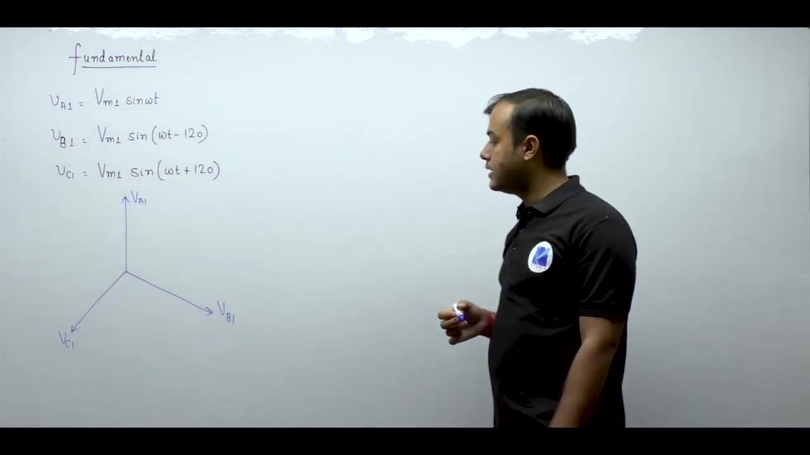

### Behavior of Third-Harmonic Components

The third harmonic is the lowest odd harmonic and dominates the distortion. To find the third-harmonic phase voltages, multiply the electrical angles by 3:
$$
\begin{aligned}
v_{a3}(t) &= V_{m3} \sin(3\omega t) \\
v_{b3}(t) &= V_{m3} \sin\left(3(\omega t - 120^\circ)\right) = V_{m3} \sin(3\omega t - 360^\circ) \\
v_{c3}(t) &= V_{m3} \sin\left(3(\omega t + 120^\circ)\right) = V_{m3} \sin(3\omega t + 360^\circ)
\end{aligned}
$$

A phase angle shift of $\pm 360^\circ$ is identical to $0^\circ$ in trigonometric functions:
$$
\begin{aligned}
\sin(3\omega t - 360^\circ) &= \sin(3\omega t) \\
\sin(3\omega t + 360^\circ) &= \sin(3\omega t)
\end{aligned}
$$

Therefore, the third-harmonic expressions for all three phases become:
$$
v_{a3}(t) = v_{b3}(t) = v_{c3}(t) = V_{m3} \sin(3\omega t)
$$

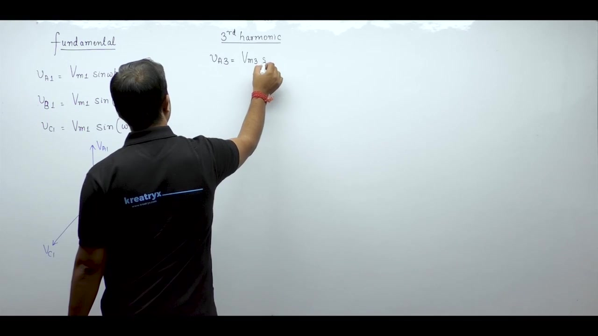

> [!success] Co-phasal Nature of Triplen Harmonics
> Third-harmonic components in all three phases have identical instantaneous values. They have equal magnitudes and zero relative phase shift. They act as co-phasal or zero-sequence quantities.

In phasor diagrams, these three third-harmonic phasors lie directly on top of each other. They rotate together at an angular speed of $3\omega$.

## Symmetrical Component Sequences of Higher Harmonics
_(09:50 - 15:03)_

### Phasor Rotation Fundamentals

Voltage and current phasors rotate counter-clockwise in the complex plane. Their rotational speed matches their electrical angular frequency.

Fundamental phasors rotate at angular speed $\omega$. Third-harmonic phasors rotate at $3\omega$. Fifth-harmonic phasors rotate at $5\omega$. This rotation represents phasor rotation in the complex plane, not physical spatial rotation of a magnetic field.

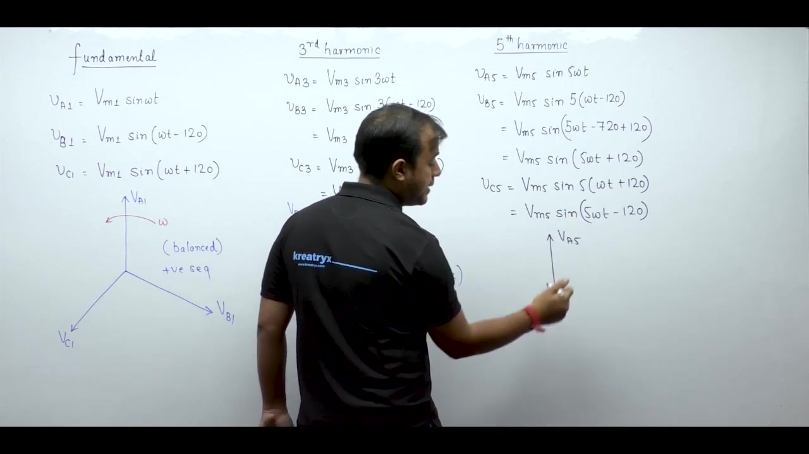

### Fifth Harmonic as a Negative Sequence Set

For the fifth harmonic, multiply all electrical phase angles by 5:
$$
\begin{aligned}
v_{a5}(t) &= V_{m5} \sin(5\omega t) \\
v_{b5}(t) &= V_{m5} \sin\left(5(\omega t - 120^\circ)\right) = V_{m5} \sin(5\omega t - 600^\circ) \\
v_{c5}(t) &= V_{m5} \sin\left(5(\omega t + 120^\circ)\right) = V_{m5} \sin(5\omega t + 600^\circ)
\end{aligned}
$$

Simplify the phase angles by removing integer multiples of $360^\circ$:
$$
\begin{aligned}
-600^\circ &= -720^\circ + 120^\circ \equiv +120^\circ \\
+600^\circ &= +720^\circ - 120^\circ \equiv -120^\circ
\end{aligned}
$$

Substituting these simplified angles gives:
$$
\begin{aligned}
v_{a5}(t) &= V_{m5} \sin(5\omega t) \\
v_{b5}(t) &= V_{m5} \sin(5\omega t + 120^\circ) \\
v_{c5}(t) &= V_{m5} \sin(5\omega t - 120^\circ)
\end{aligned}
$$

Phase $C$ lags phase $A$ by $120^\circ$. Phase $B$ leads phase $A$ by $120^\circ$. The phase order changes from $A-B-C$ to $A-C-B$.

> [!info] Negative Sequence Definition
> A balanced three-phase set with phase ordering $A-C-B$ is called a negative sequence system. The fifth harmonic forms a balanced negative sequence set.

### Seventh Harmonic as a Positive Sequence Set

Next, analyze the seventh harmonic by multiplying phase angles by 7:
$$
\begin{aligned}
v_{a7}(t) &= V_{m7} \sin(7\omega t) \\
v_{b7}(t) &= V_{m7} \sin\left(7(\omega t - 120^\circ)\right) = V_{m7} \sin(7\omega t - 840^\circ) \\
v_{c7}(t) &= V_{m7} \sin\left(7(\omega t + 120^\circ)\right) = V_{m7} \sin(7\omega t + 840^\circ)
\end{aligned}
$$

Reduce the angles by multiples of $360^\circ$:
$$
\begin{aligned}
-840^\circ &= -720^\circ - 120^\circ \equiv -120^\circ \\
+840^\circ &= +720^\circ + 120^\circ \equiv +120^\circ
\end{aligned}
$$

This reduction yields:
$$
\begin{aligned}
v_{a7}(t) &= V_{m7} \sin(7\omega t) \\
v_{b7}(t) &= V_{m7} \sin(7\omega t - 120^\circ) \\
v_{c7}(t) &= V_{m7} \sin(7\omega t + 120^\circ)
\end{aligned}
$$

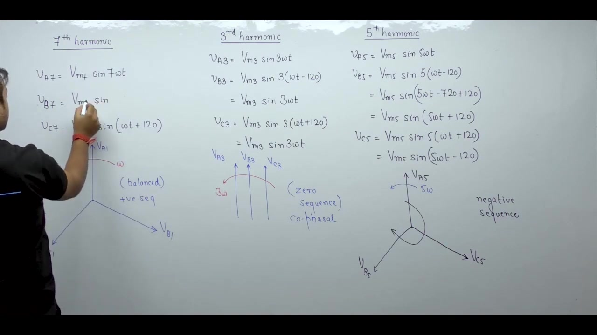

The resulting phase order returns to $A-B-C$. Phase $B$ lags phase $A$ by $120^\circ$. Phase $C$ leads phase $A$ by $120^\circ$.

> [!success] Seventh Harmonic Sequence
> The seventh harmonic forms a balanced positive sequence set, exactly like the fundamental component.

## Harmonic Classification and Properties of the Third Harmonic
_(15:03 - 20:37)_

### General Harmonic Sequence Classification

Harmonic components in balanced three-phase systems fall into three distinct sequence groups. Because even harmonics vanish under half-wave symmetry, only odd integers appear.

Let $k$ represent a positive integer ($k = 1, 2, 3, \dots$). The classification groups are:

1. **Triplen Harmonics ($3k$ with odd multiples)**:
   Harmonic orders include the 3rd, 9th, 15th, and 21st. All triplen harmonics have zero relative phase displacement. They form zero-sequence or co-phasal sets.

2. **Negative Sequence Harmonics ($6k - 1$)**:
   Harmonic orders include the 5th, 11th, and 17th. These harmonics exhibit phase sequence $A-C-B$. They form balanced negative sequence sets.

3. **Positive Sequence Harmonics ($6k + 1$)**:
   Harmonic orders include the 7th, 13th, and 19th. These harmonics exhibit phase sequence $A-B-C$. They form balanced positive sequence sets.

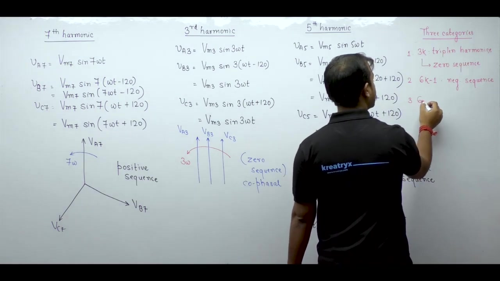

> [!info] Harmonic Order Classification Table
> | Group Formula | Harmonic Orders | Sequence Type | Phase Rotation |
> | :--- | :--- | :--- | :--- |
> | $3k$ (odd $k$) | 3, 9, 15, 21 | Zero sequence | Co-phasal ($0^\circ$ displacement) |
> | $6k - 1$ | 5, 11, 17, 23 | Negative sequence | $A-C-B$ rotation |
> | $6k + 1$ | 7, 13, 19, 25 | Positive sequence | $A-B-C$ rotation |

### Harmonic Magnitude Decay

Fourier analysis shows that harmonic amplitudes decrease as frequency increases. The fundamental component has the largest amplitude:
$$
V_{m1} > V_{m3} > V_{m5} > V_{m7} > \dots
$$

The third harmonic is the lowest-order harmonic present. Therefore, it possesses the largest amplitude of all distortion terms. It acts as the dominant harmonic in magnetic cores.

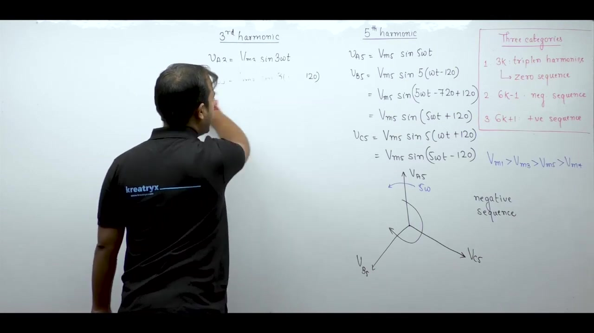

### Distinctive Features of the Third Harmonic

Two distinct properties make the third harmonic uniquely troublesome in three-phase networks:

First, its magnitude dominates all other harmonic orders.

Second, third-harmonic components in all three phases are co-phasal. For a balanced fundamental system, the three phase voltages sum to zero:
$$
v_{a1}(t) + v_{b1}(t) + v_{c1}(t) = 0
$$

For third-harmonic components, all three instantaneous values add directly:
$$
v_{a3}(t) + v_{b3}(t) + v_{c3}(t) = 3 V_{m3} \sin(3\omega t) \ne 0
$$

> [!success] The Triplen Sum Rule
> Because triplen harmonics have zero phase displacement between phases, their three-phase sum never cancels. Their sum equals three times the individual phase component.

This non-zero sum causes severe neutral currents and voltage distortion. How these harmonics behave depends entirely on whether transformer windings connect in star or delta.

## Star Connection Voltage Analysis and Triplen Elimination
_(20:46 - 29:55)_

### Generalized Fourier Representation for Currents

Fourier series analysis applies identically to currents and voltages. Replace voltage terms $V$ with current terms $I$.

Every phase current expands into fundamental, third, fifth, and higher harmonic terms. The third harmonic currents in phases $A$, $B$, and $C$ share equal magnitudes and identical phase angles. They remain co-phasal across all three phases.

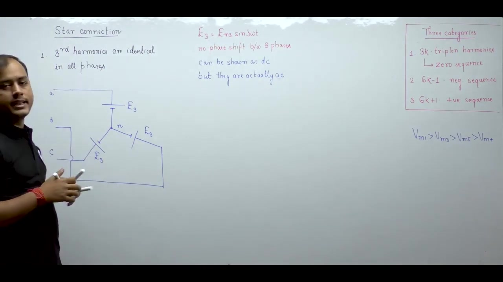

### Line Voltage Derivation in Star Connections

Consider a three-phase star-connected transformer winding with neutral node $N$. The line terminals are $A$, $B$, and $C$.

The line-to-line voltage $v_{ab}(t)$ is the difference between phase voltages:
$$
v_{ab}(t) = v_{an}(t) - v_{bn}(t)
$$

Expand each phase voltage into its individual Fourier harmonic components:
$$
\begin{aligned}
v_{an}(t) &= V_{m1}\sin(\omega t) + V_{m3}\sin(3\omega t) + V_{m5}\sin(5\omega t) + V_{m7}\sin(7\omega t) + \dots \\
v_{bn}(t) &= V_{m1}\sin(\omega t - 120^\circ) + V_{m3}\sin(3\omega t) + V_{m5}\sin(5\omega t + 120^\circ) + V_{m7}\sin(7\omega t - 120^\circ) + \dots
\end{aligned}
$$

Subtract $v_{bn}(t)$ from $v_{an}(t)$ harmonic by harmonic.

For the fundamental component, the phase difference is $120^\circ$:
$$
v_{ab1}(t) = V_{m1}\sin(\omega t) - V_{m1}\sin(\omega t - 120^\circ) = \sqrt{3}V_{m1}\sin(\omega t + 30^\circ)
$$

Now calculate the line voltage for the third harmonic:
$$
v_{ab3}(t) = V_{m3}\sin(3\omega t) - V_{m3}\sin(3\omega t) = 0
$$

The two third-harmonic phase components are identical in magnitude and phase. Their subtraction yields exactly zero.

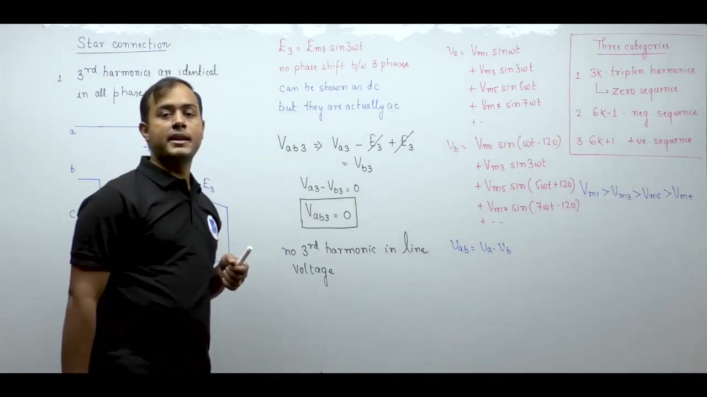

### Elimination of Triplen Harmonics in Line Voltages

The difference between two phasors is zero only when their magnitudes and angles are identical.

Fifth and seventh harmonics have $120^\circ$ relative phase displacements. Their differences never vanish. But all triplen harmonics ($3^{\text{rd}}, 9^{\text{th}}, 15^{\text{th}}, \dots$) are zero sequence. They have identical phase angles in all three phases.

When phase voltages are subtracted, every triplen harmonic cancels out completely.

> [!success] The Star Line Voltage Theorem
> In any balanced star connection, line voltages contain no third harmonic or triplen harmonics:
> $$
> V_{L3} = 0, \quad V_{L9} = 0, \quad V_{L15} = 0
> $$
> Third-harmonic voltages may exist across individual phase windings, but they cannot appear between line terminals.

## Star Connection Current Analysis and Neutral Grounding
_(29:55 - 34:54)_

### Neutral Current Under Balanced Operation

Consider a star-connected winding with a neutral connection. Applying Kirchhoff's Current Law (KCL) at the neutral node gives the neutral current:
$$
i_n(t) = i_a(t) + i_b(t) + i_c(t)
$$

Expand each phase current into its Fourier components.

For fundamental balanced currents, the sum across the three phases is zero:
$$
i_{a1}(t) + i_{b1}(t) + i_{c1}(t) = 0
$$

The fifth and seventh harmonic currents form balanced sets. Their three-phase sums also equal zero:
$$
\begin{aligned}
i_{a5}(t) + i_{b5}(t) + i_{c5}(t) &= 0 \\
i_{a7}(t) + i_{b7}(t) + i_{c7}(t) &= 0
\end{aligned}
$$

Now calculate the neutral current for the third harmonic:
$$
i_{n3}(t) = i_{a3}(t) + i_{b3}(t) + i_{c3}(t)
$$

Because all three third-harmonic currents are identical and co-phasal:
$$
i_{n3}(t) = 3 I_{m3}\sin(3\omega t)
$$

The neutral conductor carries three times the third-harmonic phase current.

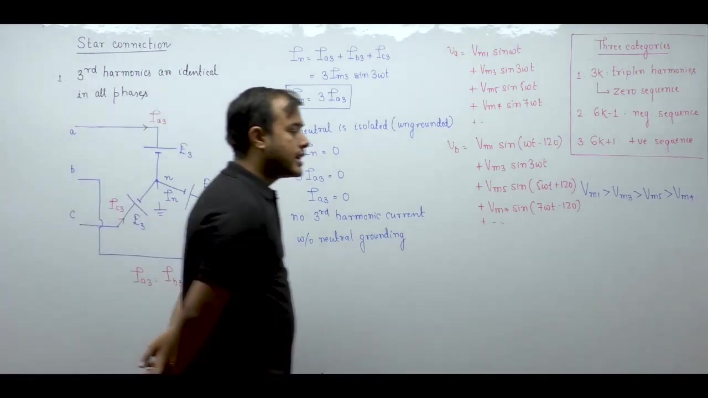

### Isolated Neutral Versus Grounded Neutral

The existence of third-harmonic currents depends entirely on the neutral path.

In an isolated or ungrounded three-wire star system, the neutral is open-circuited. No neutral current can flow:
$$
i_n = 0 \implies i_{a3} + i_{b3} + i_{c3} = 0
$$

Since $i_{a3} = i_{b3} = i_{c3}$, this condition forces:
$$
3 i_{a3} = 0 \implies i_{a3} = 0
$$

In a three-wire star connection, third-harmonic current cannot flow. In fact, no triplen harmonic current can flow.

If the neutral is grounded or connected via a fourth wire, a complete return path exists. Third-harmonic current flows freely through the windings and neutral wire.

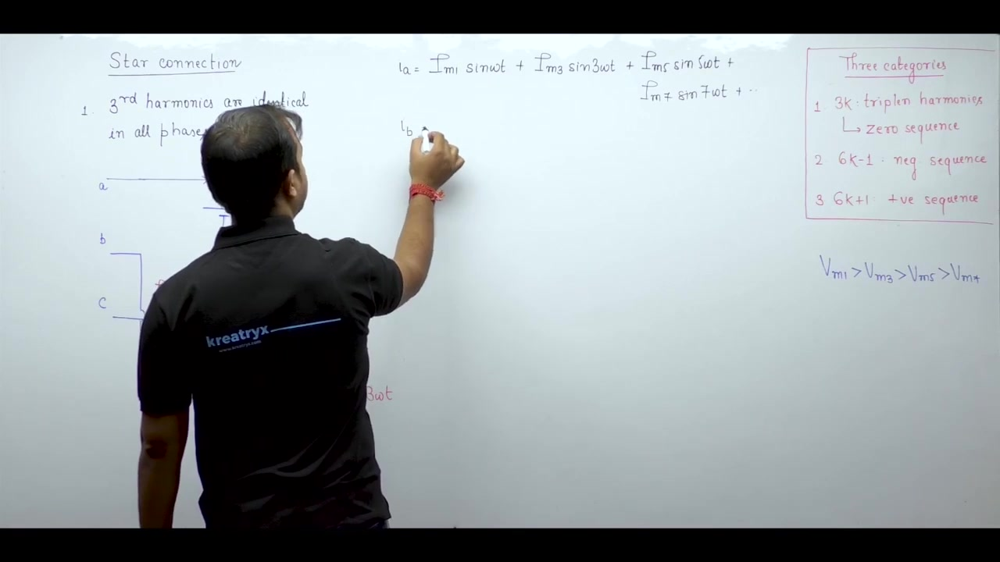

> [!success] Third-Harmonic Rules for Star Connections
> 1. **Voltages**: Third-harmonic voltage may exist in phase windings. It never appears in line voltages ($V_{L3} = 0$).
> 2. **Currents**: In star, line current equals phase current ($I_L = I_{ph}$). Third-harmonic current can flow only if the neutral terminal is grounded.

## Neutral Harmonic Composition and Open-Delta Analysis
_(34:57 - 39:40)_

### Neutral Current Harmonic Content

Under balanced load or excitation conditions, the neutral current equals the sum of all three line currents:
$$
i_n(t) = i_a(t) + i_b(t) + i_c(t)
$$

The fundamental, fifth, and seventh harmonic currents form balanced three-phase sets. Their sum across three symmetric phases is identically zero:
$$
\sum_{k \in \{1, 5, 7\}} i_{ph, k}(t) = 0
$$

Triplen harmonics are zero sequence. Their phase displacements are zero. So their currents add constructively:
$$
i_{n3}(t) = 3 I_{m3} \sin(3\omega t)
$$

The neutral conductor in a grounded four-wire system carries purely triplen harmonic currents. All non-triplen components cancel completely.

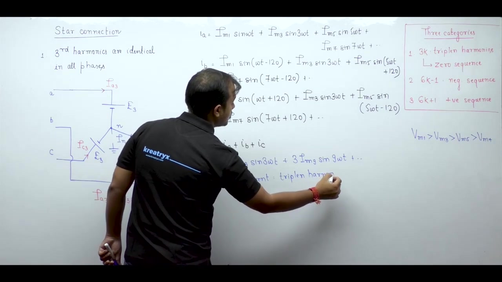

### Superposition Principle for Harmonic Networks

Harmonic components operate at distinct frequencies: $\omega, 3\omega, 5\omega, \dots$

Inductive reactances vary directly with frequency ($\omega L, 3\omega L, 5\omega L$). So circuit impedances differ for each harmonic order.

> [!info] Superposition Rule for Harmonics
> Network analysis across multiple frequencies requires the superposition theorem. Analyze each harmonic frequency independently using its own single-frequency equivalent circuit.

### Delta Connection and Open-Delta Voltage Measurement

Now consider a three-phase delta-connected transformer winding.

To measure loop voltages, open one corner of the delta. Connect an ideal voltmeter across the open break.

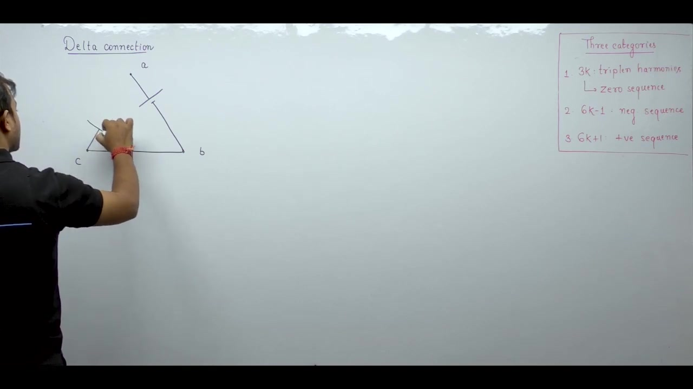

An ideal voltmeter possesses infinite internal impedance. It acts as an open circuit:
$$
R_v \to \infty \implies I_{\text{loop}} = 0
$$

Because no current circulates in the open loop, internal winding resistance drops are zero. The voltmeter measures the open-circuit sum of all induced phase EMFs around the delta perimeter.

## Open-Delta Loop Voltage and Voltmeter Measurement
_(39:44 - 44:50)_

### KVL Around the Delta Loop

In a delta connection, phase voltages and line voltages are identical.

Apply Kirchhoff's Voltage Law (KVL) around the delta loop with an open corner:
$$
v_{\text{loop}}(t) = v_{ab}(t) + v_{bc}(t) + v_{ca}(t)
$$

Substitute the Fourier series of each phase into the loop equation.

The fundamental, fifth, and seventh harmonic components form balanced three-phase sets. Their sum around the closed loop equals zero:
$$
\begin{aligned}
v_{ab1}(t) + v_{bc1}(t) + v_{ca1}(t) &= 0 \\
v_{ab5}(t) + v_{bc5}(t) + v_{ca5}(t) &= 0 \\
v_{ab7}(t) + v_{bc7}(t) + v_{ca7}(t) &= 0
\end{aligned}
$$

All triplen harmonic components are co-phasal. They add directly in phase around the perimeter:
$$
v_{\text{loop}}(t) = 3 E_{m3} \sin(3\omega t) + 3 E_{m9} \sin(9\omega t) + 3 E_{m15} \sin(15\omega t) + \dots
$$

Only triplen harmonics survive in the open-delta loop voltage.

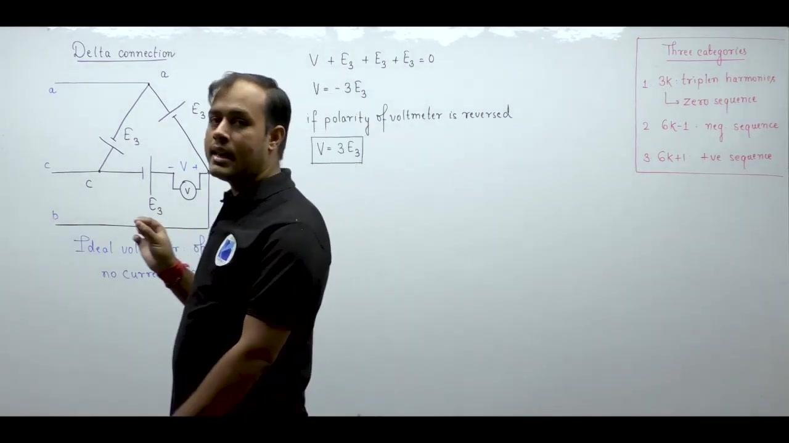

### Open-Delta Voltmeter Reading

Connect an RMS-reading voltmeter across the open delta terminals. Moving-iron and electrodynamometer meters respond to the true RMS value of periodic waveforms.

Calculate the root-mean-square value of the multi-frequency loop voltage:
$$
V_{\text{rms}} = 3 \sqrt{E_{3,\text{rms}}^2 + E_{9,\text{rms}}^2 + E_{15,\text{rms}}^2 + \dots}
$$

Expressing this in terms of peak harmonic amplitudes yields:
$$
V_{\text{rms}} = \frac{3}{\sqrt{2}} \sqrt{E_{m3}^2 + E_{m9}^2 + E_{m15}^2 + \dots}
$$

Because higher harmonic amplitudes decay rapidly, the third harmonic dominates. Neglecting ninth and higher harmonics gives:
$$
V_{\text{rms}} \approx 3 E_{3,\text{rms}}
$$

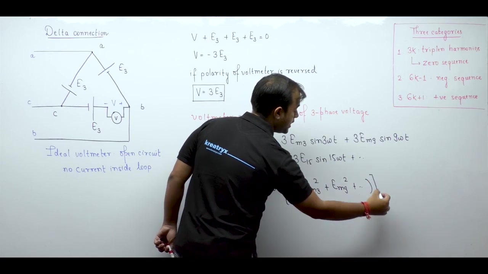

> [!success] Voltmeter Reading in Open Delta
> An ideal voltmeter across an open delta terminal reads three times the phase third-harmonic EMF:
> $$
> V_{\text{voltmeter}} = 3 E_3
> $$
> This reading provides a direct experimental method to detect core saturation and harmonic distortion.

Next, replace the voltmeter with an ammeter to observe the resulting current.

## Circulating Delta Currents and Line Current Elimination
_(44:52 - 49:49)_

### Ammeter Insertion and Loop Closure

Now connect an ideal ammeter across the open corner of the delta winding.

An ideal ammeter has zero internal resistance. It acts as a dead short circuit:
$$
R_{\text{ammeter}} \to 0
$$

Connecting the ammeter closes the mesh. The net induced third-harmonic loop voltage drives a circulating current around the delta.

### Winding Impedance at Harmonic Frequencies

Consider the series equivalent branch of each transformer phase winding. It contains a winding resistance $R$ and an inductive leakage reactance $X_l$.

Resistance does not depend on frequency. But inductive reactance scales directly with frequency:
$$
X_l(\omega) = \omega L
$$

At the third harmonic, the electrical frequency is $3\omega$. The leakage reactance triples:
$$
X_3 = 3\omega L
$$

The total series impedance of each phase winding at the third harmonic is:
$$
Z_3 = R + j 3\omega L
$$

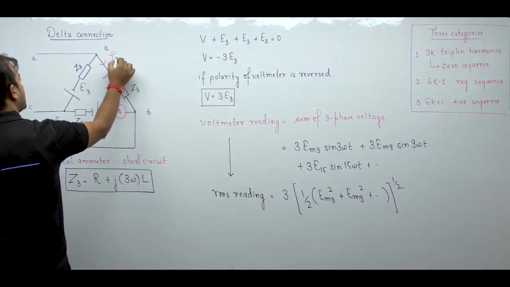

### Line Currents and Delta KCL Analysis

Let the circulating third-harmonic phase currents inside the delta windings be $I_{AB3}$, $I_{BC3}$, and $I_{CA3}$.

Third-harmonic quantities are co-phasal. So all three phase currents are identical in magnitude and phase:
$$
I_{AB3} = I_{BC3} = I_{CA3} = I_3
$$

Now determine the external line currents ($I_{A3}, I_{B3}, I_{C3}$) using Kirchhoff's Current Law at each delta vertex:
$$
\begin{aligned}
I_{A3} &= I_{AB3} - I_{CA3} \\
I_{B3} &= I_{BC3} - I_{AB3} \\
I_{C3} &= I_{CA3} - I_{BC3}
\end{aligned}
$$

Substitute the equality of phase currents into these vertex equations:
$$
\begin{aligned}
I_{A3} &= I_3 - I_3 = 0 \\
I_{B3} &= I_3 - I_3 = 0 \\
I_{C3} &= I_3 - I_3 = 0
\end{aligned}
$$

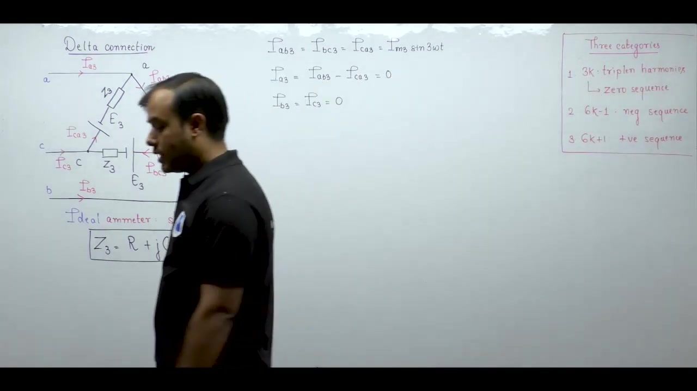

> [!success] The Delta Trapping Rule
> Third-harmonic currents circulate freely inside the closed delta mesh. But they can never enter external transmission lines:
> $$
> I_{ph3} \ne 0, \quad I_{L3} = 0
> $$
> The closed delta traps all triplen harmonic currents within its internal loop.

## Circulating Current Derivation and Terminal Voltage Cancelation
_(49:52 - 54:49)_

### KVL Derivation of Circulating Current

Now calculate the magnitude of the circulating third-harmonic current in the closed delta loop.

Apply Kirchhoff's Voltage Law around the closed triangular mesh:
$$
(-E_3 - I_3 Z_3) + (-E_3 - I_3 Z_3) + (-E_3 - I_3 Z_3) = 0
$$

Combine the identical phase terms:
$$
-3 E_3 - 3 I_3 Z_3 = 0
$$

Solve for the circulating harmonic current $I_3$:
$$
I_3 = -\frac{E_3}{Z_3}
$$

The minus sign indicates that the circulating current flows opposite to the reference loop direction.

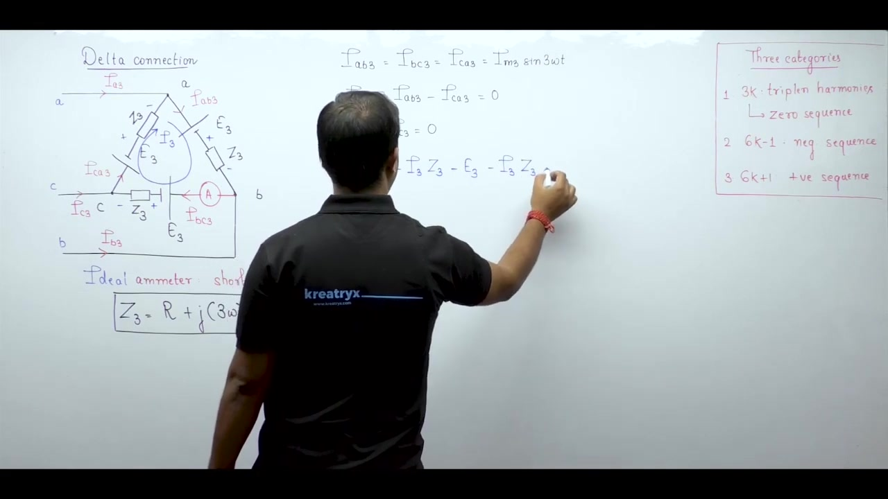

### Terminal Voltage Cancelation Mechanism

Now determine the third-harmonic line voltage across terminals $A$ and $B$.

Apply KVL across the phase winding branch from terminal $A$ to terminal $B$:
$$
V_{AB3} = E_3 + I_3 Z_3
$$

Substitute the expression for circulating current $I_3 = -E_3 / Z_3$:
$$
V_{AB3} = E_3 + \left(-\frac{E_3}{Z_3}\right) Z_3 = E_3 - E_3 = 0
$$

The internal impedance voltage drop exactly cancels the induced third-harmonic EMF.

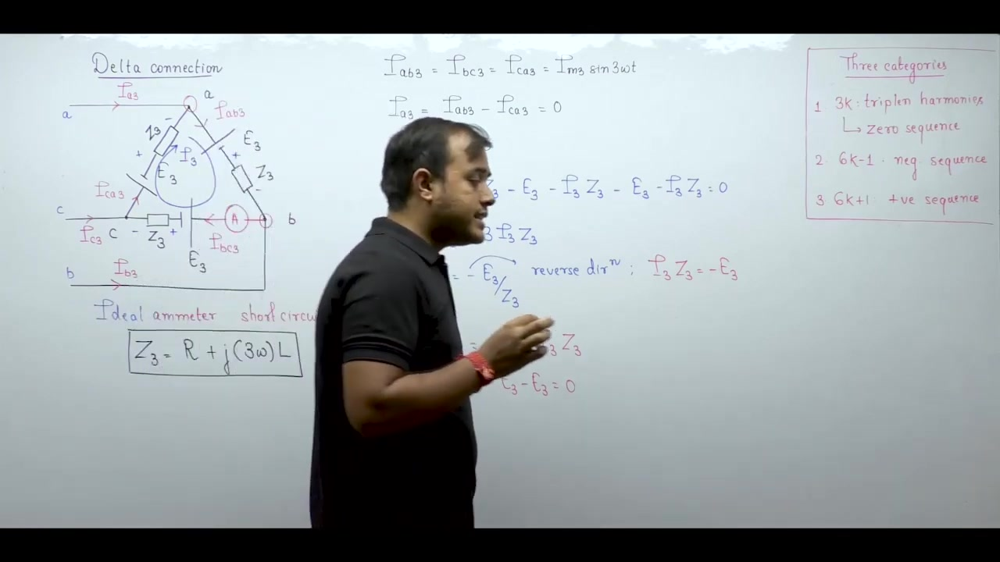

> [!success] Voltage Suppression in Closed Delta
> In a closed delta winding, circulating third-harmonic currents produce an internal impedance drop that opposes the induced EMF:
> $$
> V_{AB3} = 0
> $$
> So no third-harmonic voltage appears at the terminal terminals of a delta connection.

### Physical Mechanism of Suppression

In an open delta, no current flows. The voltmeter clearly measures $3 E_3$.

Once the mesh closes, third-harmonic current begins to circulate. This current flows until its internal impedance drop completely nullifies the net EMF across the terminals.

Both star and delta connections eliminate third-harmonic voltages from their external lines. Star eliminates them by phase subtraction. Delta eliminates them through internal circulation and impedance drop.

## Summary Matrix of Third Harmonics and Excitation Connections
_(54:54 - 56:55)_

### Master Comparison Table for Star and Delta

The presence of third-harmonic quantities depends on the winding connection.

The table below summarizes the behavior of third harmonics across star and delta topologies:

| Parameter (Third Harmonic) | Star Connection (Y) | Delta Connection ($\Delta$) |
| :--- | :--- | :--- |
| **Phase Voltage ($V_{ph3}$)** | Can exist (peaky if ungrounded) | Zero (canceled by internal loop drop) |
| **Line Voltage ($V_{L3}$)** | Zero (canceled by phase subtraction) | Zero ($V_L = V_{ph} = 0$) |
| **Phase Current ($I_{ph3}$)** | Exists only if neutral is grounded | Circulates in closed loop |
| **Line Current ($I_{L3}$)** | Exists only if neutral is grounded | Zero (trapped in loop by KCL) |

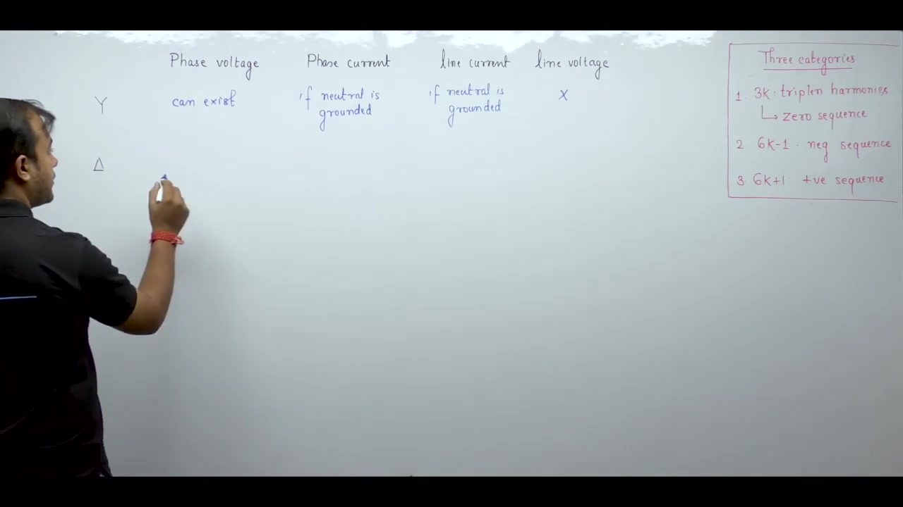

### Connection to Core Flux and Voltage Waveforms

Now connect this three-phase behavior to the core saturation rules established earlier.

Core non-linearity demands that the third harmonic exist in current or in flux.

If the winding connection allows third-harmonic current to flow, the core flux remains sinusoidal:
$$
I_3 \text{ flows} \implies \phi(t) \text{ sinusoidal} \implies e(t) \text{ sinusoidal}
$$

This occurs in delta windings and four-wire grounded star windings.

If third-harmonic current cannot flow, the magnetizing current stays sinusoidal. Then the core flux becomes flat-topped. A flat-topped flux induces a peaky phase voltage:
$$
I_3 = 0 \implies \phi(t) \text{ flat-topped} \implies e_{ph}(t) \text{ peaky}
$$

This undesirable condition occurs in three-wire ungrounded star connections.

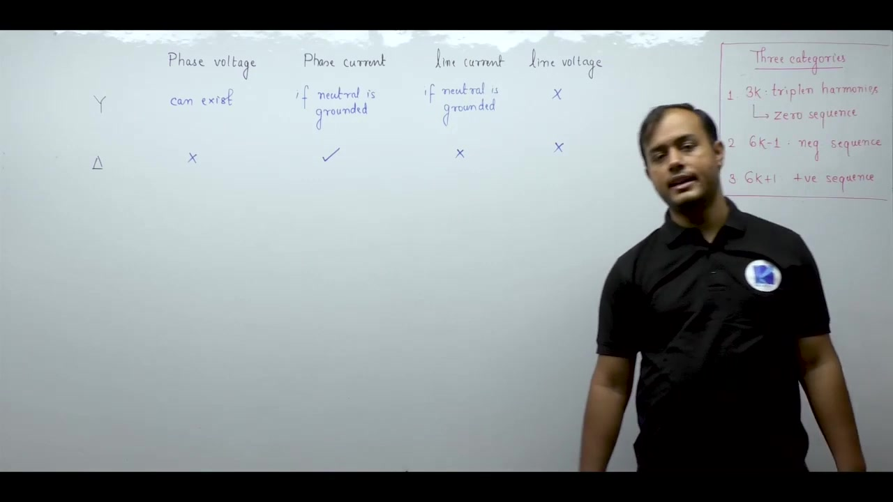

> [!success] Waveform Rule for Three-Phase Banks
> 1. Any connection providing a closed loop for third-harmonic currents (such as delta or grounded neutral star) yields sinusoidal flux and sinusoidal terminal voltage.
> 2. Any isolated neutral connection without a delta winding forces peaky phase voltages and high dielectric stress.

### Preview of Transformer Banking Connections

These core principles govern standard three-phase transformer connections.

Subsequent lectures analyze specific bank arrangements:
1. Star-Star ($\text{Y}-\text{Y}$)
2. Delta-Delta ($\Delta-\Delta$)
3. Star-Delta ($\text{Y}-\Delta$)
4. Delta-Star ($\Delta-\text{Y}$)

The analysis will determine the exact waveform shape, whether peaky or flat-topped, for each configuration.

---

## Summary and Key Takeaways

- Odd harmonic orders in balanced three-phase systems divide into three sequence groups: triplen harmonics ($3k$) are zero-sequence, $6k-1$ harmonics are negative-sequence, and $6k+1$ harmonics are positive-sequence.
- Triplen harmonic components ($3^{\text{rd}}, 9^{\text{th}}, 15^{\text{th}}$) are co-phasal and have identical instantaneous values across all three phases.
- Star connections eliminate all triplen harmonics from line voltages ($V_{L3} = 0$) because phase subtraction cancels identical co-phasal quantities.
- Star phase windings carry third-harmonic currents only when the neutral terminal connects to ground.
- The neutral conductor of a balanced grounded star system carries three times the third-harmonic phase current ($i_n = 3 I_{m3}\sin 3\omega t$).
- An ideal voltmeter across an open corner of a delta winding measures the sum of co-phasal triplen EMFs ($V_{\text{rms}} \approx 3 E_3$).
- In a closed delta winding, third-harmonic currents circulate freely inside the mesh but cannot enter external line conductors ($I_{L3} = 0$).
- Circulating delta currents produce an internal impedance drop that cancels the induced third-harmonic EMF at the terminals ($V_{AB3} = 0$).

